# Sensitivity Analysis `<w:bookmarkStart w:id="sensitivity-analysis" w:name="sensitivity-analysis"/><w:bookmarkEnd w:id="sensitivity-analysis"/>`{=openxml}


## Sensitivity Analysis for Raltegravir 100 mg filmcoated tablet md `<w:bookmarkStart w:id="sensitivity-analysis-raltegravir_100_mg_filmcoated_tablet_md" w:name="sensitivity-analysis-raltegravir_100_mg_filmcoated_tablet_md"/><w:bookmarkEnd w:id="sensitivity-analysis-raltegravir_100_mg_filmcoated_tablet_md"/>`{=openxml}


```{=openxml}
<w:br w:type="page"/>
```

`<w:bookmarkStart w:id="figure-1-1" w:name="figure-1-1"/><w:bookmarkEnd w:id="figure-1-1"/>`{=openxml}

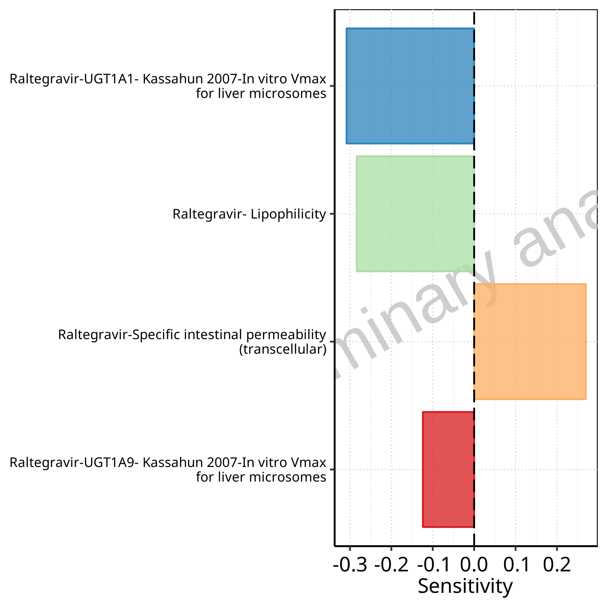


**Figure 1-1: Most sensitive parameters for C_max of Raltegravir.**


<br>
<br>


```{=openxml}
<w:br w:type="page"/>
```

`<w:bookmarkStart w:id="figure-1-2" w:name="figure-1-2"/><w:bookmarkEnd w:id="figure-1-2"/>`{=openxml}


**Figure 1-2: Most sensitive parameters for AUC_t1_t2 of Raltegravir.**


<br>
<br>


# PK parameters `<w:bookmarkStart w:id="pk-parameters" w:name="pk-parameters"/><w:bookmarkEnd w:id="pk-parameters"/>`{=openxml}


## PK parameters for Raltegravir 100 mg filmcoated tablet md `<w:bookmarkStart w:id="pk-parameters-raltegravir_100_mg_filmcoated_tablet_md" w:name="pk-parameters-raltegravir_100_mg_filmcoated_tablet_md"/><w:bookmarkEnd w:id="pk-parameters-raltegravir_100_mg_filmcoated_tablet_md"/>`{=openxml}


```{=openxml}
<w:br w:type="page"/>
```

`<w:bookmarkStart w:id="table-2-1" w:name="table-2-1"/><w:bookmarkEnd w:id="table-2-1"/>`{=openxml}

**Table 2-1: PK parameters for Scenario Raltegravir 100 mg filmcoated tablet md**


|Path        |Parameter |Value   |Unit   |
|:-----------|:---------|:-------|:------|
|Raltegravir |C_max     |894.09  |µg/l   |
|Raltegravir |AUC_t1_t2 |1963.32 |µg*h/l |


<br>
<br>


# Absorption `<w:bookmarkStart w:id="absorption" w:name="absorption"/><w:bookmarkEnd w:id="absorption"/>`{=openxml}


## Absorption for Raltegravir 100 mg filmcoated tablet md `<w:bookmarkStart w:id="absorption-raltegravir_100_mg_filmcoated_tablet_md" w:name="absorption-raltegravir_100_mg_filmcoated_tablet_md"/><w:bookmarkEnd w:id="absorption-raltegravir_100_mg_filmcoated_tablet_md"/>`{=openxml}


```{=openxml}
<w:br w:type="page"/>
```

`<w:bookmarkStart w:id="figure-3-1" w:name="figure-3-1"/><w:bookmarkEnd w:id="figure-3-1"/>`{=openxml}


**Figure 3-1: Absorption of Raltegravir**


<br>
<br>


# Mass Balance `<w:bookmarkStart w:id="mass-balance" w:name="mass-balance"/><w:bookmarkEnd w:id="mass-balance"/>`{=openxml}


## Mass Balance for Raltegravir 100 mg filmcoated tablet md `<w:bookmarkStart w:id="mass-balance-raltegravir_100_mg_filmcoated_tablet_md" w:name="mass-balance-raltegravir_100_mg_filmcoated_tablet_md"/><w:bookmarkEnd w:id="mass-balance-raltegravir_100_mg_filmcoated_tablet_md"/>`{=openxml}


### Mass Balance for Raltegravir `<w:bookmarkStart w:id="1_mass_balance" w:name="1_mass_balance"/><w:bookmarkEnd w:id="1_mass_balance"/>`{=openxml}


```{=openxml}
<w:br w:type="page"/>
```

`<w:bookmarkStart w:id="figure-4-1" w:name="figure-4-1"/><w:bookmarkEnd w:id="figure-4-1"/>`{=openxml}

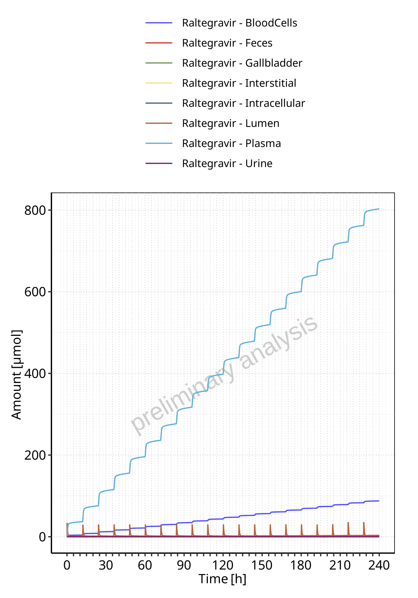


**Figure 4-1: Amount of drug vs time within the different compartments for Raltegravir**


<br>
<br>


```{=openxml}
<w:br w:type="page"/>
```

`<w:bookmarkStart w:id="figure-4-2" w:name="figure-4-2"/><w:bookmarkEnd w:id="figure-4-2"/>`{=openxml}


**Figure 4-2: Cumulated amount of drug vs time within the different compartments for Raltegravir**


<br>
<br>


```{=openxml}
<w:br w:type="page"/>
```

`<w:bookmarkStart w:id="figure-4-3" w:name="figure-4-3"/><w:bookmarkEnd w:id="figure-4-3"/>`{=openxml}


**Figure 4-3: Amount of drug vs time within the different compartments normalized to applicated drugmass for Raltegravir**


<br>
<br>


```{=openxml}
<w:br w:type="page"/>
```

`<w:bookmarkStart w:id="figure-4-4" w:name="figure-4-4"/><w:bookmarkEnd w:id="figure-4-4"/>`{=openxml}

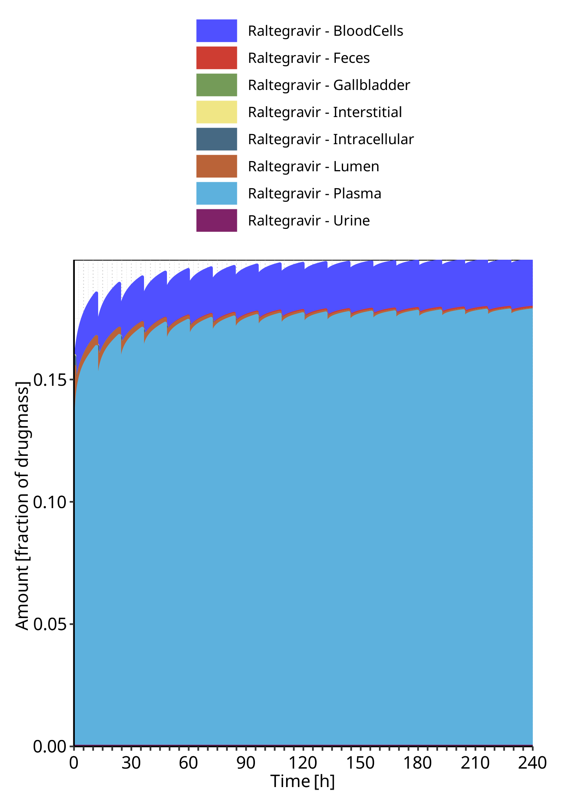


**Figure 4-4: Cumulated amount of drug vs time within the different compartments normalized to applicated drugmass for Raltegravir**


<br>
<br>


```{=openxml}
<w:br w:type="page"/>
```

`<w:bookmarkStart w:id="figure-4-5" w:name="figure-4-5"/><w:bookmarkEnd w:id="figure-4-5"/>`{=openxml}


**Figure 4-5: Fraction of drug within the different compartments at 240.00h for Raltegravir**


<br>
<br>


# Time profiles and residual plots `<w:bookmarkStart w:id="time-profiles" w:name="time-profiles"/><w:bookmarkEnd w:id="time-profiles"/>`{=openxml}


## Time profiles and residual plots for Raltegravir 100 mg filmcoated tablet md `<w:bookmarkStart w:id="time-profiles-raltegravir_100_mg_filmcoated_tablet_md" w:name="time-profiles-raltegravir_100_mg_filmcoated_tablet_md"/><w:bookmarkEnd w:id="time-profiles-raltegravir_100_mg_filmcoated_tablet_md"/>`{=openxml}


### For total simulation time range `<w:bookmarkStart w:id="goodness-of-fit-raltegravir_100_mg_filmcoated_tablet_md-total" w:name="goodness-of-fit-raltegravir_100_mg_filmcoated_tablet_md-total"/><w:bookmarkEnd w:id="goodness-of-fit-raltegravir_100_mg_filmcoated_tablet_md-total"/>`{=openxml}


```{=openxml}
<w:br w:type="page"/>
```

`<w:bookmarkStart w:id="figure-5-1" w:name="figure-5-1"/><w:bookmarkEnd w:id="figure-5-1"/>`{=openxml}


**Figure 5-1: Time profiles for Scenario Raltegravir 100 mg filmcoated tablet md. Data source: Data/Raltegravir_PK.txt. Time profiles are plotted in a linear scale.**


<br>
<br>


```{=openxml}
<w:br w:type="page"/>
```

`<w:bookmarkStart w:id="figure-5-2" w:name="figure-5-2"/><w:bookmarkEnd w:id="figure-5-2"/>`{=openxml}


**Figure 5-2: Time profiles for Scenario Raltegravir 100 mg filmcoated tablet md. Data source: Data/Raltegravir_PK.txt. Time profiles are plotted in a logarithmic scale.**


<br>
<br>


```{=openxml}
<w:br w:type="page"/>
```

`<w:bookmarkStart w:id="figure-5-3" w:name="figure-5-3"/><w:bookmarkEnd w:id="figure-5-3"/>`{=openxml}


**Figure 5-3: Predicted vs observed for Scenario Raltegravir 100 mg filmcoated tablet md. Data source: Data/Raltegravir_PK.txt. Predictions and observations are plotted in a linear scale.**


<br>
<br>


```{=openxml}
<w:br w:type="page"/>
```

`<w:bookmarkStart w:id="figure-5-4" w:name="figure-5-4"/><w:bookmarkEnd w:id="figure-5-4"/>`{=openxml}

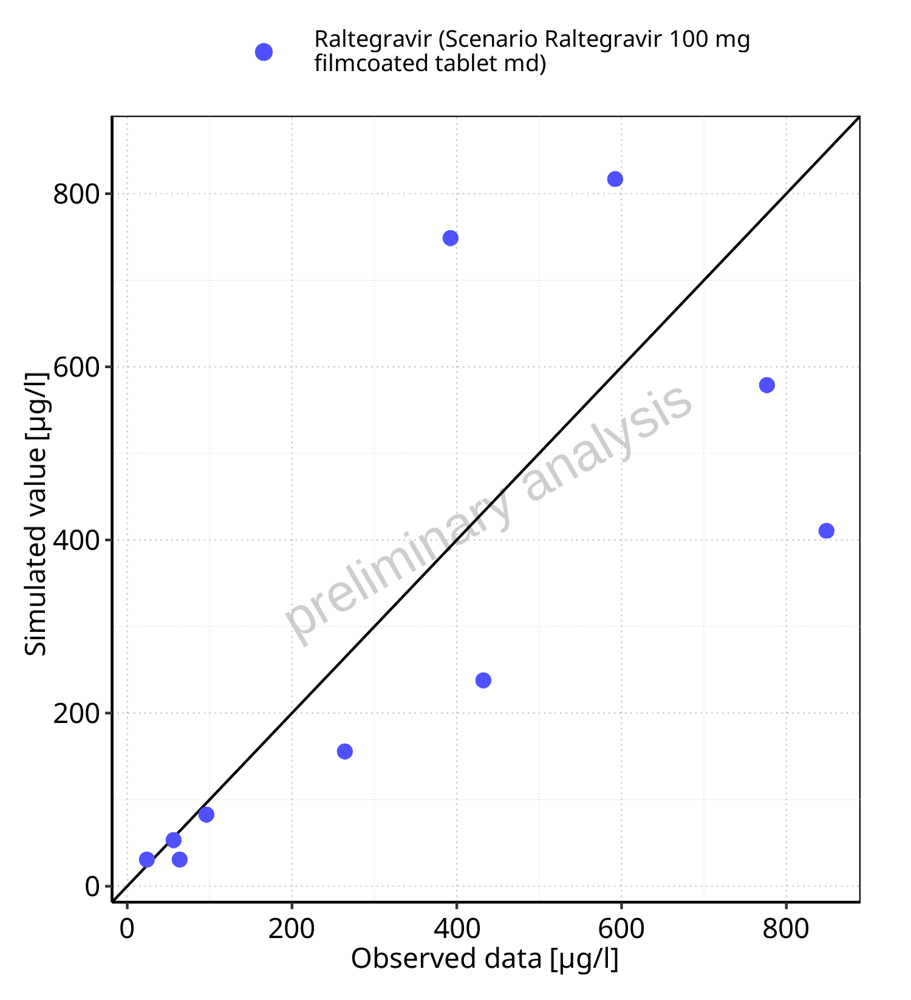


**Figure 5-4: Predicted vs observed for Scenario Raltegravir 100 mg filmcoated tablet md. Data source: Data/Raltegravir_PK.txt. Predictions and observations are plotted in a logarithmic scale.**


<br>
<br>


```{=openxml}
<w:br w:type="page"/>
```

`<w:bookmarkStart w:id="figure-5-5" w:name="figure-5-5"/><w:bookmarkEnd w:id="figure-5-5"/>`{=openxml}

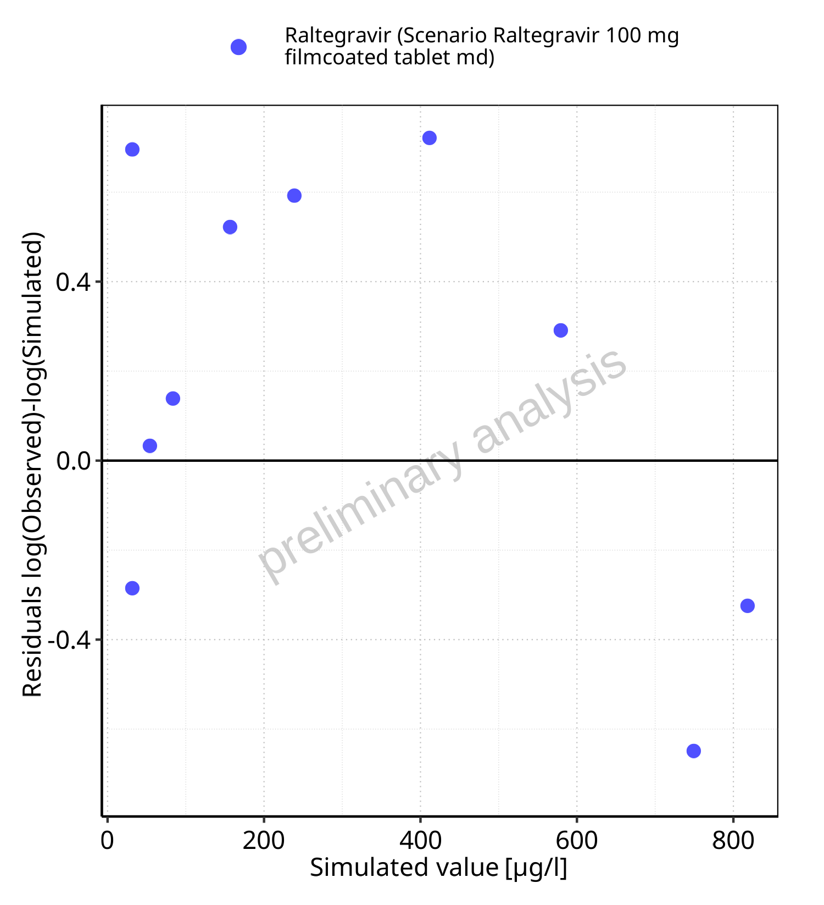


**Figure 5-5: Logarithmic residuals vs predicted values for Scenario Raltegravir 100 mg filmcoated tablet md. Data source: Data/Raltegravir_PK.txt. **


<br>
<br>


```{=openxml}
<w:br w:type="page"/>
```

`<w:bookmarkStart w:id="figure-5-6" w:name="figure-5-6"/><w:bookmarkEnd w:id="figure-5-6"/>`{=openxml}

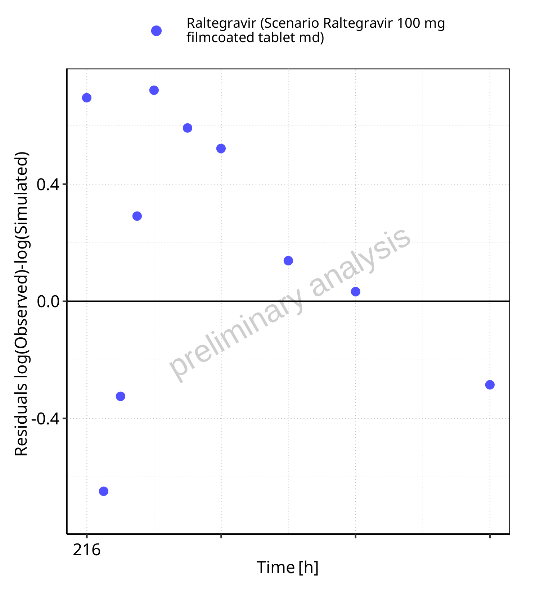


**Figure 5-6: Logarithmic residuals vs time values for Scenario Raltegravir 100 mg filmcoated tablet md. Data source: Data/Raltegravir_PK.txt. **


<br>
<br>


```{=openxml}
<w:br w:type="page"/>
```

`<w:bookmarkStart w:id="figure-5-7" w:name="figure-5-7"/><w:bookmarkEnd w:id="figure-5-7"/>`{=openxml}

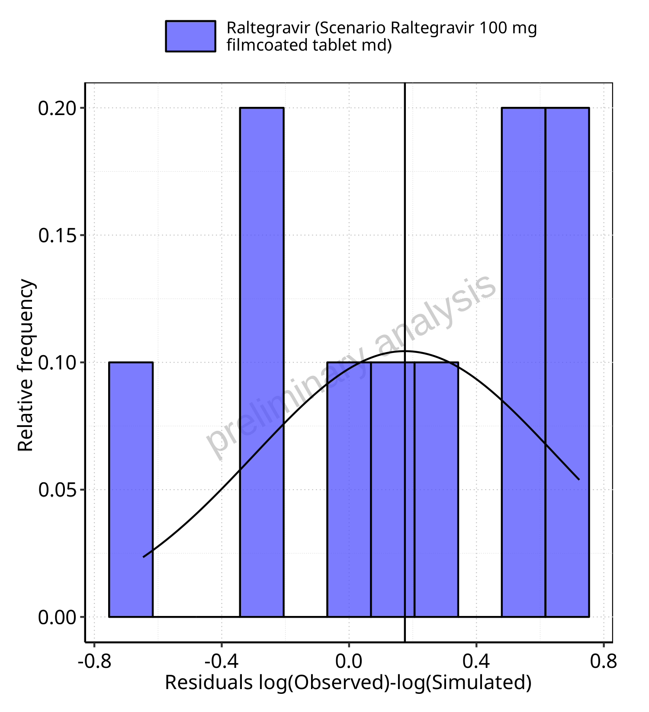


**Figure 5-7: Logarithmic residuals distribution (stacked) for Scenario Raltegravir 100 mg filmcoated tablet md. Data source: Data/Raltegravir_PK.txt. **


<br>
<br>


```{=openxml}
<w:br w:type="page"/>
```

`<w:bookmarkStart w:id="figure-5-8" w:name="figure-5-8"/><w:bookmarkEnd w:id="figure-5-8"/>`{=openxml}


**Figure 5-8: Logarithmic residuals for Scenario Raltegravir 100 mg filmcoated tablet md as quantile-quantile plot. Data source: Data/Raltegravir_PK.txt. **


<br>
<br>


### For first application range `<w:bookmarkStart w:id="goodness-of-fit-raltegravir_100_mg_filmcoated_tablet_md-first" w:name="goodness-of-fit-raltegravir_100_mg_filmcoated_tablet_md-first"/><w:bookmarkEnd w:id="goodness-of-fit-raltegravir_100_mg_filmcoated_tablet_md-first"/>`{=openxml}


```{=openxml}
<w:br w:type="page"/>
```

`<w:bookmarkStart w:id="figure-5-9" w:name="figure-5-9"/><w:bookmarkEnd w:id="figure-5-9"/>`{=openxml}


**Figure 5-9: Time profiles for Scenario Raltegravir 100 mg filmcoated tablet md. Data source: Data/Raltegravir_PK.txt. Time profiles are plotted in a linear scale.**


<br>
<br>


```{=openxml}
<w:br w:type="page"/>
```

`<w:bookmarkStart w:id="figure-5-10" w:name="figure-5-10"/><w:bookmarkEnd w:id="figure-5-10"/>`{=openxml}

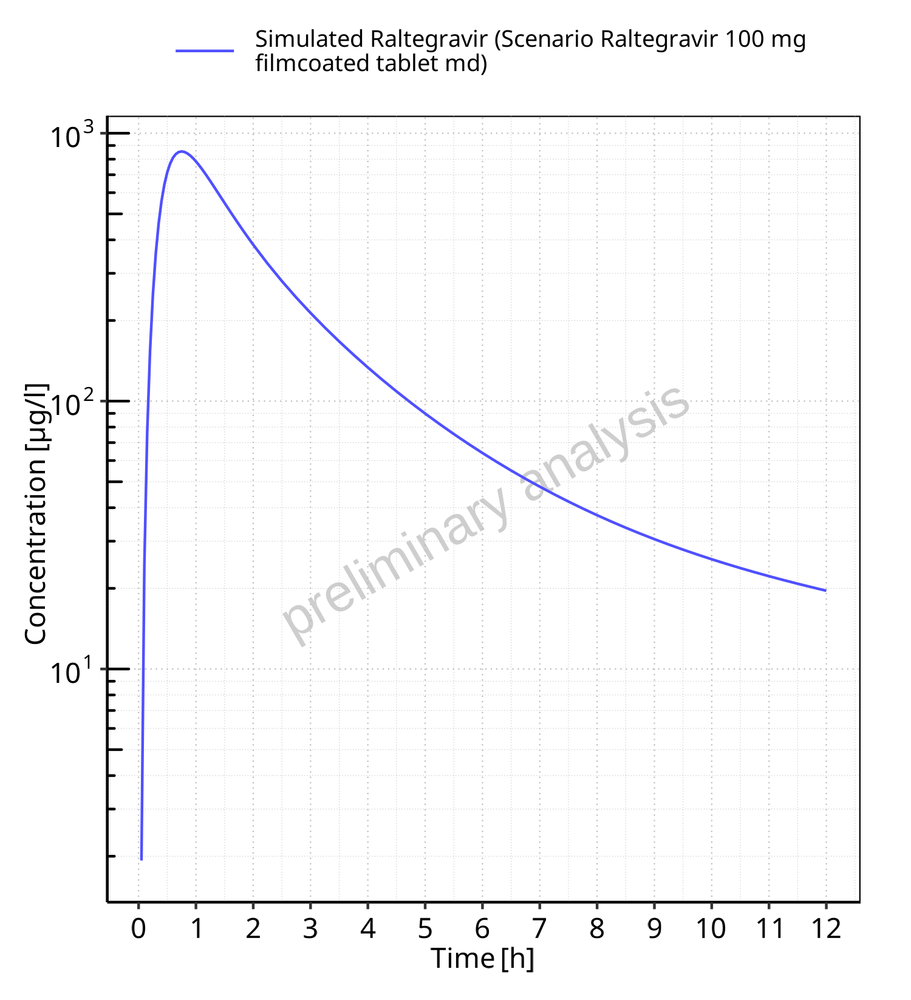


**Figure 5-10: Time profiles for Scenario Raltegravir 100 mg filmcoated tablet md. Data source: Data/Raltegravir_PK.txt. Time profiles are plotted in a logarithmic scale.**


<br>
<br>


### For last application range `<w:bookmarkStart w:id="goodness-of-fit-raltegravir_100_mg_filmcoated_tablet_md-last" w:name="goodness-of-fit-raltegravir_100_mg_filmcoated_tablet_md-last"/><w:bookmarkEnd w:id="goodness-of-fit-raltegravir_100_mg_filmcoated_tablet_md-last"/>`{=openxml}


```{=openxml}
<w:br w:type="page"/>
```

`<w:bookmarkStart w:id="figure-5-11" w:name="figure-5-11"/><w:bookmarkEnd w:id="figure-5-11"/>`{=openxml}


**Figure 5-11: Time profiles for Scenario Raltegravir 100 mg filmcoated tablet md. Data source: Data/Raltegravir_PK.txt. Time profiles are plotted in a linear scale.**


<br>
<br>


```{=openxml}
<w:br w:type="page"/>
```

`<w:bookmarkStart w:id="figure-5-12" w:name="figure-5-12"/><w:bookmarkEnd w:id="figure-5-12"/>`{=openxml}


**Figure 5-12: Time profiles for Scenario Raltegravir 100 mg filmcoated tablet md. Data source: Data/Raltegravir_PK.txt. Time profiles are plotted in a logarithmic scale.**


<br>
<br>


```{=openxml}
<w:br w:type="page"/>
```

`<w:bookmarkStart w:id="figure-5-13" w:name="figure-5-13"/><w:bookmarkEnd w:id="figure-5-13"/>`{=openxml}


**Figure 5-13: Predicted vs observed for Scenario Raltegravir 100 mg filmcoated tablet md. Data source: Data/Raltegravir_PK.txt. Predictions and observations are plotted in a linear scale.**


<br>
<br>


```{=openxml}
<w:br w:type="page"/>
```

`<w:bookmarkStart w:id="figure-5-14" w:name="figure-5-14"/><w:bookmarkEnd w:id="figure-5-14"/>`{=openxml}


**Figure 5-14: Predicted vs observed for Scenario Raltegravir 100 mg filmcoated tablet md. Data source: Data/Raltegravir_PK.txt. Predictions and observations are plotted in a logarithmic scale.**


<br>
<br>


```{=openxml}
<w:br w:type="page"/>
```

`<w:bookmarkStart w:id="figure-5-15" w:name="figure-5-15"/><w:bookmarkEnd w:id="figure-5-15"/>`{=openxml}

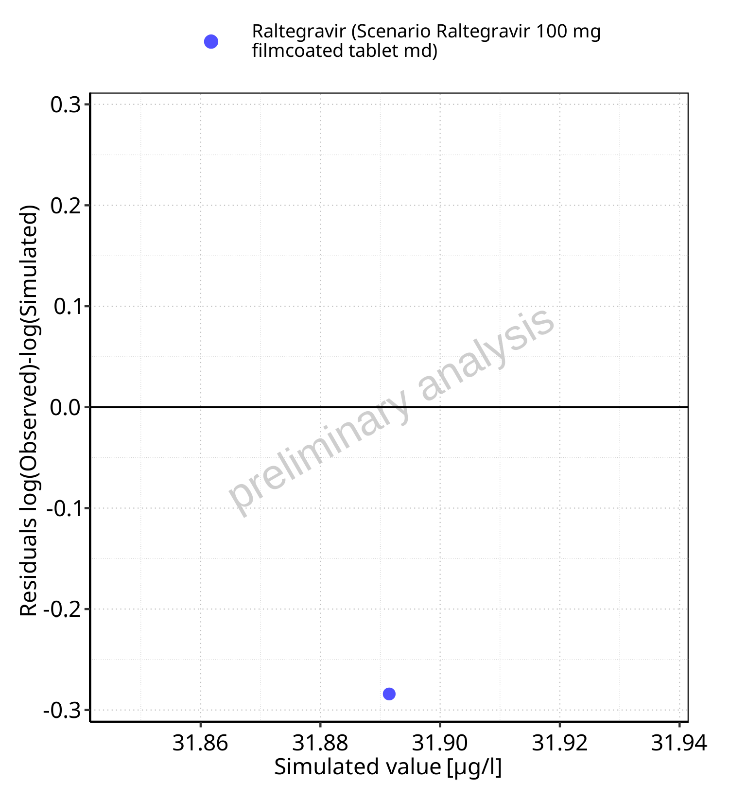


**Figure 5-15: Logarithmic residuals vs predicted values for Scenario Raltegravir 100 mg filmcoated tablet md. Data source: Data/Raltegravir_PK.txt. **


<br>
<br>


```{=openxml}
<w:br w:type="page"/>
```

`<w:bookmarkStart w:id="figure-5-16" w:name="figure-5-16"/><w:bookmarkEnd w:id="figure-5-16"/>`{=openxml}


**Figure 5-16: Logarithmic residuals vs time values for Scenario Raltegravir 100 mg filmcoated tablet md. Data source: Data/Raltegravir_PK.txt. **


<br>
<br>


```{=openxml}
<w:br w:type="page"/>
```

`<w:bookmarkStart w:id="figure-5-17" w:name="figure-5-17"/><w:bookmarkEnd w:id="figure-5-17"/>`{=openxml}

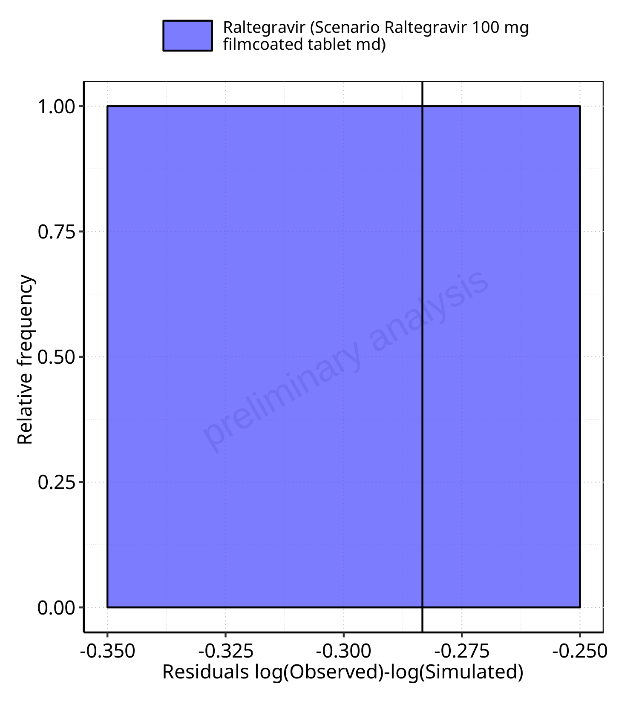


**Figure 5-17: Logarithmic residuals distribution (stacked) for Scenario Raltegravir 100 mg filmcoated tablet md. Data source: Data/Raltegravir_PK.txt. **


<br>
<br>


```{=openxml}
<w:br w:type="page"/>
```

`<w:bookmarkStart w:id="figure-5-18" w:name="figure-5-18"/><w:bookmarkEnd w:id="figure-5-18"/>`{=openxml}

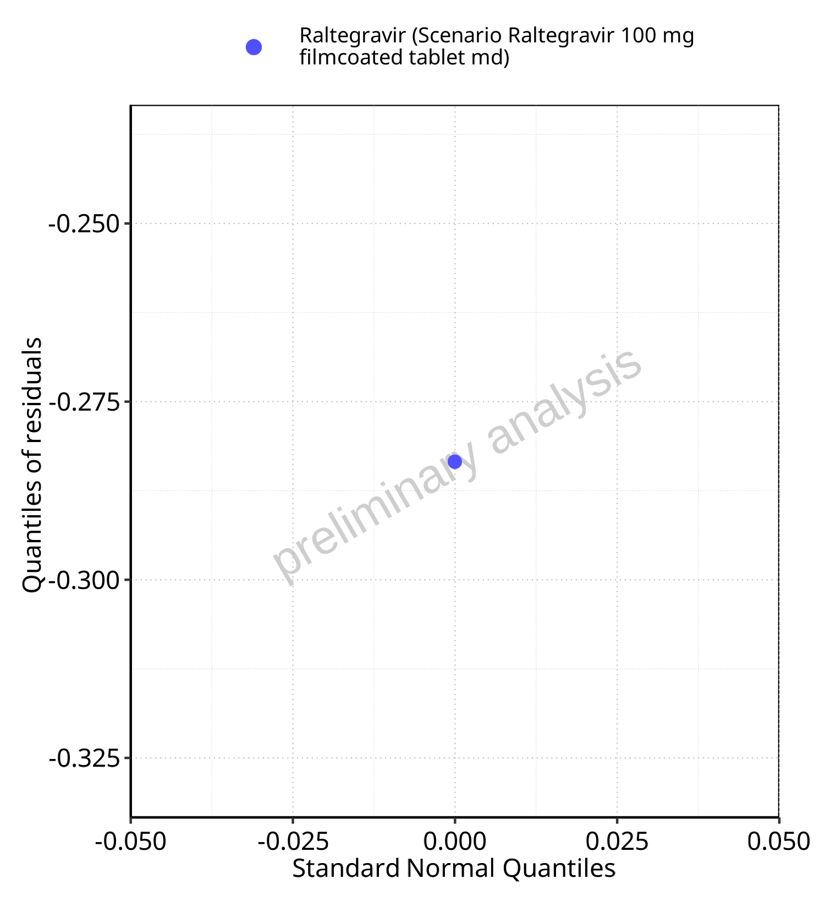


**Figure 5-18: Logarithmic residuals for Scenario Raltegravir 100 mg filmcoated tablet md as quantile-quantile plot. Data source: Data/Raltegravir_PK.txt. **


<br>
<br>


