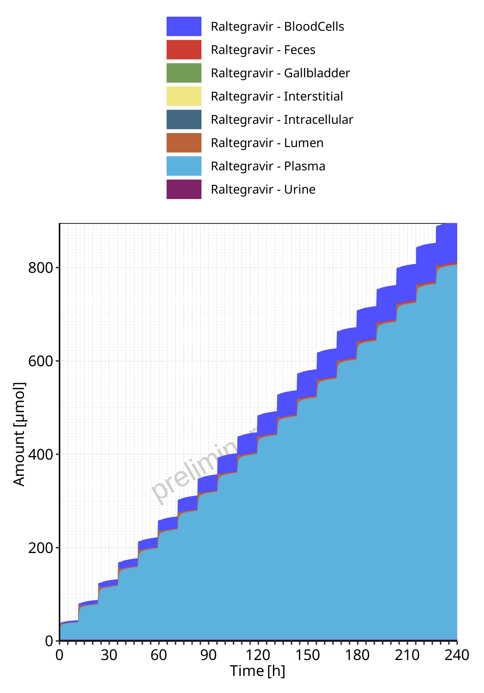
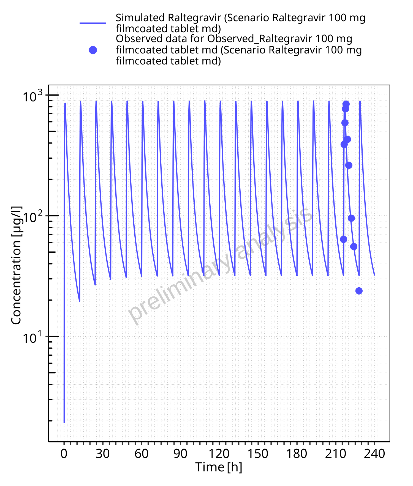

# Table of Contents

 * [1 Sensitivity Analysis ](#sensitivity-analysis)
   * [1.1 Sensitivity Analysis for Raltegravir 100 mg filmcoated tablet md ](#sensitivity-analysis-raltegravir_100_mg_filmcoated_tablet_md)
 * [2 PK parameters ](#pk-parameters)
   * [2.1 PK parameters for Raltegravir 100 mg filmcoated tablet md ](#pk-parameters-raltegravir_100_mg_filmcoated_tablet_md)
 * [3 Absorption ](#absorption)
   * [3.1 Absorption for Raltegravir 100 mg filmcoated tablet md ](#absorption-raltegravir_100_mg_filmcoated_tablet_md)
 * [4 Mass Balance ](#mass-balance)
   * [4.1 Mass Balance for Raltegravir 100 mg filmcoated tablet md ](#mass-balance-raltegravir_100_mg_filmcoated_tablet_md)
     * [4.1.1 Mass Balance for Raltegravir ](#1_mass_balance)
 * [5 Time profiles and residual plots ](#time-profiles)
   * [5.1 Time profiles and residual plots for Raltegravir 100 mg filmcoated tablet md ](#time-profiles-raltegravir_100_mg_filmcoated_tablet_md)
     * [5.1.1 For total simulation time range ](#goodness-of-fit-raltegravir_100_mg_filmcoated_tablet_md-total)
     * [5.1.2 For first application range ](#goodness-of-fit-raltegravir_100_mg_filmcoated_tablet_md-first)
     * [5.1.3 For last application range ](#goodness-of-fit-raltegravir_100_mg_filmcoated_tablet_md-last)

# 1 Sensitivity Analysis 

## 1.1 Sensitivity Analysis for Raltegravir 100 mg filmcoated tablet md 

**Figure 1-1: Most sensitive parameters for C_max of Raltegravir.**

 
 

**Figure 1-2: Most sensitive parameters for AUC_t1_t2 of Raltegravir.**

 
 

# 2 PK parameters 

## 2.1 PK parameters for Raltegravir 100 mg filmcoated tablet md 

**Table 2-1: PK parameters for Scenario Raltegravir 100 mg filmcoated tablet md**

|Path        |Parameter |Value   |Unit   |
|:-----------|:---------|:-------|:------|
|Raltegravir |C_max     |894.09  |µg/l   |
|Raltegravir |AUC_t1_t2 |1963.32 |µg*h/l |

 
 

# 3 Absorption 

## 3.1 Absorption for Raltegravir 100 mg filmcoated tablet md 

**Figure 3-1: Absorption of Raltegravir**

 
 

# 4 Mass Balance 

## 4.1 Mass Balance for Raltegravir 100 mg filmcoated tablet md 

### 4.1.1 Mass Balance for Raltegravir 

**Figure 4-1: Amount of drug vs time within the different compartments for Raltegravir**

 
 

**Figure 4-2: Cumulated amount of drug vs time within the different compartments for Raltegravir**

 
 

**Figure 4-3: Amount of drug vs time within the different compartments normalized to applicated drugmass for Raltegravir**

 
 

**Figure 4-4: Cumulated amount of drug vs time within the different compartments normalized to applicated drugmass for Raltegravir**

 
 

**Figure 4-5: Fraction of drug within the different compartments at 240.00h for Raltegravir**

 
 

# 5 Time profiles and residual plots 

## 5.1 Time profiles and residual plots for Raltegravir 100 mg filmcoated tablet md 

### 5.1.1 For total simulation time range 

**Figure 5-1: Time profiles for Scenario Raltegravir 100 mg filmcoated tablet md. Data source: Data/Raltegravir_PK.txt. Time profiles are plotted in a linear scale.**

 
 

**Figure 5-2: Time profiles for Scenario Raltegravir 100 mg filmcoated tablet md. Data source: Data/Raltegravir_PK.txt. Time profiles are plotted in a logarithmic scale.**

 
 

**Figure 5-3: Predicted vs observed for Scenario Raltegravir 100 mg filmcoated tablet md. Data source: Data/Raltegravir_PK.txt. Predictions and observations are plotted in a linear scale.**

 
 

**Figure 5-4: Predicted vs observed for Scenario Raltegravir 100 mg filmcoated tablet md. Data source: Data/Raltegravir_PK.txt. Predictions and observations are plotted in a logarithmic scale.**

 
 

**Figure 5-5: Logarithmic residuals vs predicted values for Scenario Raltegravir 100 mg filmcoated tablet md. Data source: Data/Raltegravir_PK.txt. **

 
 

**Figure 5-6: Logarithmic residuals vs time values for Scenario Raltegravir 100 mg filmcoated tablet md. Data source: Data/Raltegravir_PK.txt. **

 
 

**Figure 5-7: Logarithmic residuals distribution (stacked) for Scenario Raltegravir 100 mg filmcoated tablet md. Data source: Data/Raltegravir_PK.txt. **

 
 

**Figure 5-8: Logarithmic residuals for Scenario Raltegravir 100 mg filmcoated tablet md as quantile-quantile plot. Data source: Data/Raltegravir_PK.txt. **

 
 

### 5.1.2 For first application range 

**Figure 5-9: Time profiles for Scenario Raltegravir 100 mg filmcoated tablet md. Data source: Data/Raltegravir_PK.txt. Time profiles are plotted in a linear scale.**

 
 

**Figure 5-10: Time profiles for Scenario Raltegravir 100 mg filmcoated tablet md. Data source: Data/Raltegravir_PK.txt. Time profiles are plotted in a logarithmic scale.**

 
 

### 5.1.3 For last application range 

**Figure 5-11: Time profiles for Scenario Raltegravir 100 mg filmcoated tablet md. Data source: Data/Raltegravir_PK.txt. Time profiles are plotted in a linear scale.**

 
 

**Figure 5-12: Time profiles for Scenario Raltegravir 100 mg filmcoated tablet md. Data source: Data/Raltegravir_PK.txt. Time profiles are plotted in a logarithmic scale.**

 
 

**Figure 5-13: Predicted vs observed for Scenario Raltegravir 100 mg filmcoated tablet md. Data source: Data/Raltegravir_PK.txt. Predictions and observations are plotted in a linear scale.**

 
 

**Figure 5-14: Predicted vs observed for Scenario Raltegravir 100 mg filmcoated tablet md. Data source: Data/Raltegravir_PK.txt. Predictions and observations are plotted in a logarithmic scale.**

 
 

**Figure 5-15: Logarithmic residuals vs predicted values for Scenario Raltegravir 100 mg filmcoated tablet md. Data source: Data/Raltegravir_PK.txt. **

 
 

**Figure 5-16: Logarithmic residuals vs time values for Scenario Raltegravir 100 mg filmcoated tablet md. Data source: Data/Raltegravir_PK.txt. **

 
 

**Figure 5-17: Logarithmic residuals distribution (stacked) for Scenario Raltegravir 100 mg filmcoated tablet md. Data source: Data/Raltegravir_PK.txt. **

 
 

**Figure 5-18: Logarithmic residuals for Scenario Raltegravir 100 mg filmcoated tablet md as quantile-quantile plot. Data source: Data/Raltegravir_PK.txt. **

 
 

