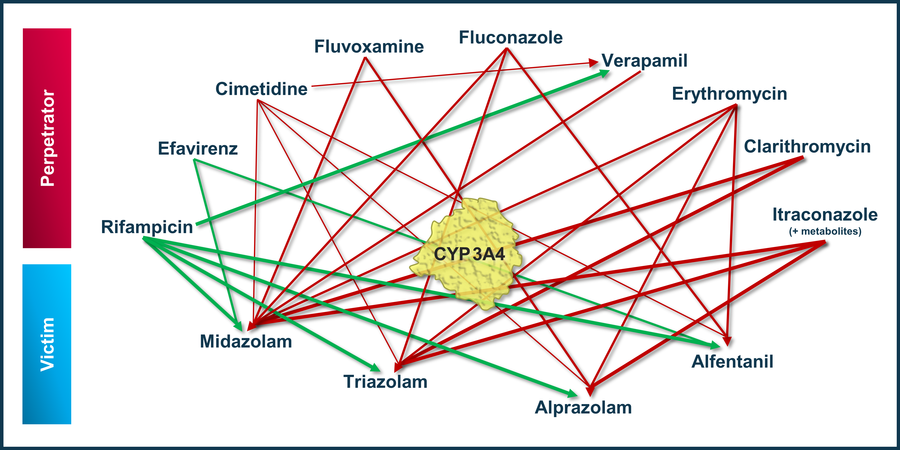

To qualify the OSP suite for the prediction of the CYP3A4 DDI potential of new drugs, a set of verified PBPK models of index perpetrators, covering the range from strong CYP3A4 induction to strong inhibition, and respective CYP3A4 DDI victim drugs is specified to set up a CYP3A4-mediated DDI modeling network. 

The following perpetrator compounds were selected: 

- **Rifampicin** (strong CYP3A4 inducer)
  Model snapshot and evaluation plan (*release* **v1.2**): https://github.com/Open-Systems-Pharmacology/Rifampicin-Model/releases/tag/v1.2
- **Efavirenz** (moderate CYP3A4 inducer)
  Model snapshot and evaluation plan (*release* **v1.1**): https://github.com/Open-Systems-Pharmacology/Efavirenz-Model/releases/tag/v1.1
- **Cimetidine** (weak CYP3A4 inhibitor)
  Model snapshot and evaluation plan (*release* **v1.1**): https://github.com/Open-Systems-Pharmacology/Cimetidine-Model/releases/tag/v1.1
- **Fluvoxamine** (weak/moderate CYP3A4 inhibitor)
  Model snapshot and evaluation plan (*release* **v1.1**): https://github.com/Open-Systems-Pharmacology/Fluvoxamine-Model/releases/tag/v1.1
- **Verapamil** (moderate CYP3A4 inhibitor)
  Model snapshot and evaluation plan (*release* **v1.2**): https://github.com/Open-Systems-Pharmacology/Verapamil-Model/releases/tag/v1.2
- **Fluconazole** (moderate CYP3A4 inhibitor)
  Model snapshot and evaluation plan (*release* **v1.0**): https://github.com/Open-Systems-Pharmacology/Fluconazole-Model/releases/tag/v1.0
- **Erythromycin** (moderate CYP3A4 inhibitor)
  Model snapshot and evaluation plan (*release* **v1.2**): https://github.com/Open-Systems-Pharmacology/Erythromycin-Model/releases/tag/v1.2
- **Clarithromycin** (strong CYP3A4 inhibitor)
  Model snapshot and evaluation plan (*release* **v1.2**): https://github.com/Open-Systems-Pharmacology/Clarithromycin-Model/releases/tag/v1.2
- **Itraconazole** including metabolites (strong CYP3A4 inhibitor)
  Model snapshot and evaluation plan (*release* **v1.3**): https://github.com/Open-Systems-Pharmacology/Itraconazole-Model/releases/tag/v1.3

The following sensitive CYP3A4 substrates as victim drugs were selected:

- **Midazolam**
  Model snapshot and evaluation plan (*release* **v1.1**): https://github.com/Open-Systems-Pharmacology/Midazolam-Model/releases/tag/v1.1
- **Triazolam**
  Model snapshot and evaluation plan (*release* **v1.1**): https://github.com/Open-Systems-Pharmacology/Triazolam-Model/releases/tag/v1.1
- **Alprazolam**
  Model snapshot and evaluation plan (*release* **v1.1**): https://github.com/Open-Systems-Pharmacology/Alprazolam-Model/releases/tag/v1.1
- **Alfentanil**
  Model snapshot and evaluation plan (*release* **v2.2**): https://github.com/Open-Systems-Pharmacology/Alfentanil-Model/releases/tag/v2.2

**Figure 1** shows the prespecified and developed DDI modeling network of interacting perpetrator and victim drugs for the OSP suite qualification of predicting CYP3A4-mediated DDI.

**Figure** **1: CYP3A4 DDI modeling network**

The arrows indicate where at least one clinical DDI study between the two connected substances was available and included in the model network. Red indicates inhibition and green indicates induction as the primary type of interaction. Thin arrows indicate weak, mid-thick arrows moderate and thick arrows strong CYP3A4 modulation by the perpetrator.

The published DDI studies between the respective perpetrators and victim drugs were simulated and compared to observed data. The following sections give an overview of the clinical studies being part of this qualification report. The respective data identifier (DataID) refers to the **ID** of the dataset in the [OSP PK database](https://github.com/Open-Systems-Pharmacology/Database-for-observed-data).

