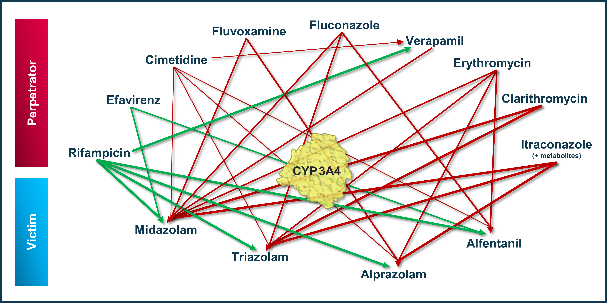
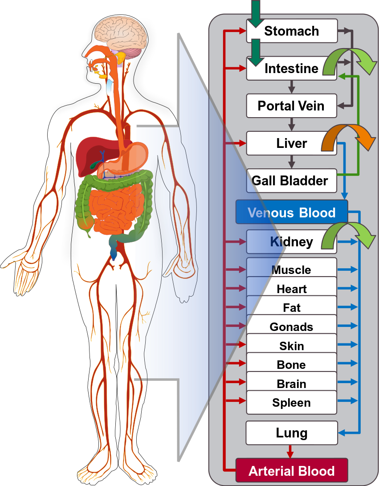
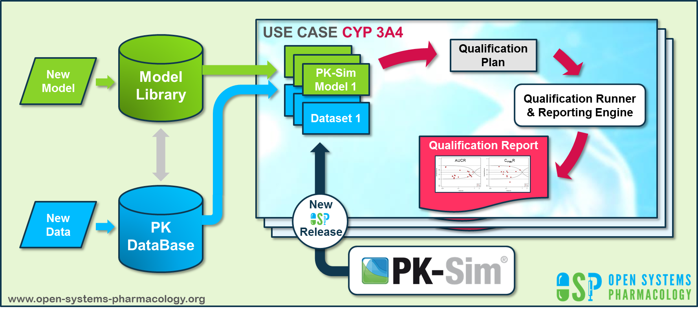

# CYP3A4 DDI Qualification

| Version                         | 1.4-OSP11.0                                                   |
| ------------------------------- | ------------------------------------------------------------ |
| Qualification Plan Release      | https://github.com/Open-Systems-Pharmacology/Qualification-DDI-CYP3A4/releases/tag/v1.4 |
| OSP Version                     | 11.0                                                          |
| Qualification Framework Version | 3.0                                                          |

This qualification report is filed at:

https://github.com/Open-Systems-Pharmacology/OSP-Qualification-Reports

# Table of Contents

 * [1 Introduction](#1)
   * [1.1 Objective](#11)
   * [1.2 CYP3A4 DDI Network](#12)
     * [1.2.1 Cimetidine - Alfentanil DDI](#1201)
     * [1.2.2 Cimetidine - Alprazolam DDI](#1202)
     * [1.2.3 Cimetidine - Midazolam DDI](#1203)
     * [1.2.4 Cimetidine - Triazolam DDI](#1204)
     * [1.2.5 Cimetidine - Verapamil DDI](#1205)
     * [1.2.6 Clarithromycin - Midazolam DDI](#1206)
     * [1.2.7 Clarithromycin - Triazolam DDI](#1207)
     * [1.2.8 Erythromycin - Alfentanil DDI](#1208)
     * [1.2.9 Erythromycin - Alprazolam DDI](#1209)
     * [1.2.10 Erythromycin - Midazolam DDI](#1210)
     * [1.2.11 Erythromycin - Triazolam DDI](#1211)
     * [1.2.12 Fluvoxamine - Alprazolam DDI](#1212)
     * [1.2.13 Fluvoxamine - Midazolam DDI](#1213)
     * [1.2.14 Itraconazole - Alprazolam DDI](#1214)
     * [1.2.15 Itraconazole - Midazolam DDI](#1215)
     * [1.2.16 Itraconazole - Triazolam DDI](#1216)
     * [1.2.17 Verapamil - Midazolam DDI](#1217)
     * [1.2.18 Efavirenz - Alfentanil-DDI](#1218)
     * [1.2.19 Efavirenz - Midazolam DDI](#1219)
     * [1.2.20 Rifampicin - Alfentanil DDI](#1220)
     * [1.2.21 Rifampicin - Alprazolam DDI](#1221)
     * [1.2.22 Rifampicin - Midazolam DDI](#1222)
     * [1.2.23 Rifampicin - Triazolam DDI](#1223)
     * [1.2.24 Rifampicin - Verapamil DDI](#1224)
     * [1.2.25 Fluconazole - Alfentanil DDI](#1225)
     * [1.2.26 Fluconazole - Midazolam DDI](#1226)
     * [1.2.27 Fluconazole - Triazolam DDI](#1227)
 * [2 Qualification of Use Case CYP3A4-mediated DDI](#2)
 * [3 Concentration-Time Profiles](#3)
   * [3.1 Cimetidine - Alfentanil DDI](#301)
   * [3.2 Cimetidine - Alprazolam DDI](#302)
   * [3.3 Cimetidine - Midazolam DDI](#303)
   * [3.4 Cimetidine - Triazolam DDI](#304)
   * [3.5 Cimetidine - Verapamil DDI](#305)
   * [3.6 Clarithromycin - Midazolam DDI](#306)
   * [3.7 Clarithromycin - Triazolam DDI](#307)
   * [3.8 Erythromycin - Alfentanil DDI](#308)
   * [3.9 Erythromycin - Alprazolam DDI](#309)
   * [3.10 Erythromycin - Midazolam DDI](#310)
   * [3.11 Erythromycin - Triazolam DDI](#311)
   * [3.12 Fluvoxamine - Alprazolam DDI](#312)
   * [3.13 Fluvoxamine - Midazolam DDI](#313)
   * [3.14 Itraconazole - Alprazolam DDI](#314)
   * [3.15 Itraconazole - Midazolam DDI](#315)
   * [3.16 Itraconazole - Triazolam DDI](#316)
   * [3.17 Verapamil - Midazolam DDI](#317)
   * [3.18 Efavirenz - Alfentanil DDI](#318)
   * [3.19 Efavirenz - Midazolam DDI](#319)
   * [3.20 Rifampicin - Alfentanil DDI](#320)
   * [3.21 Rifampicin - Alprazolam DDI](#321)
   * [3.22 Rifampicin - Midazolam DDI](#322)
   * [3.23 Rifampicin - Triazolam DDI](#323)
   * [3.24 Rifampicin - Verapamil DDI](#324)
   * [3.25 Fluconazole - Alfentanil DDI](#325)
   * [3.26 Fluconazole - Midazolam DDI](#326)
   * [3.27 Fluconazole - Triazolam DDI](#327)
 * [4 References](#4)
 * [5 Appendix](#5)
   * [5.1 Open Systems Pharmacology Suite (OSPS) Introduction](#51)
   * [5.2 Mathematical Implementation of Drug-Drug Interactions](#52)
   * [5.3 Automatic (re)-qualification workflow](#53)

# 1 Introduction

                   

## 1.1 Objective

This **qualification report** evaluates for the PBPK platform **PK-Sim** (as part of the open systems pharmacology (OSP) suite) the ability to perform simulations with the intended purpose to predict cytochrome P450 3A4 (**CYP3A4**)-mediated drug-drug interactions (**DDI**).

To demonstrate the level of confidence, the predictive performance of the platform for this indented purpose is assessed via a network of PBPK models of selected index CYP3A4 DDI perpetrators (covering the range from strong induction to strong inhibition), and respective sensitive index CYP3A4 victim drugs and a comprehensive dataset from published clinical DDI studies. All PBPK models represent whole-body PBPK models, which allow dynamic DDI simulations in organs expressing CYP3A4. 

The respective *qualification plan* to produce this *qualification report* is transparently provided open-source (https://github.com/Open-Systems-Pharmacology/Qualification-DDI-CYP3A4). The same applies for all presented PBPK models including *evaluation reports* on model building and evaluation of each model (https://github.com/Open-Systems-Pharmacology/OSP-PBPK-Model-Library).

*Evaluation reports* including descriptions on model building and detailed evaluations of the included models are documented separately (see [Section 1.2](#12-cyp3a4-ddi-network)).

Please refer to the [Appendix](#5-appendix) to learn more details:

- An overview over the Open Systems Pharmacology Suite is given in chapter [Section 5.1](#51-open-systems-pharmacology-suite-osps-introduction)

- [Section 5.2](#52-mathematical-implementation-of-drug-drug-interactions) shows the implementation of the underlying mathematical equations for drug-drug interactions in the OSP suite.

- A detailed general description of the performed qualification workflow (*qualification plan*, *qualification report*, etc.) can be found in chapter [Section 5.3](#53-automatic-re-qualification-workflow).

  

## 1.2 CYP3A4 DDI Network

To qualify the OSP suite for the prediction of the CYP3A4 DDI potential of new drugs, a set of verified PBPK models of index perpetrators, covering the range from strong CYP3A4 induction to strong inhibition, and respective CYP3A4 DDI victim drugs is specified to set up a CYP3A4-mediated DDI modeling network. 

The following perpetrator compounds were selected: 

- **Rifampicin** (strong CYP3A4 inducer)
  Model snapshot and evaluation plan (*release* **v1.2**): https://github.com/Open-Systems-Pharmacology/Rifampicin-Model/releases/tag/v1.2
- **Efavirenz** (moderate CYP3A4 inducer)
  Model snapshot and evaluation plan (*release* **v1.1**): https://github.com/Open-Systems-Pharmacology/Efavirenz-Model/releases/tag/v1.1
- **Cimetidine** (weak CYP3A4 inhibitor)
  Model snapshot and evaluation plan (*release* **v1.1**): https://github.com/Open-Systems-Pharmacology/Cimetidine-Model/releases/tag/v1.1
- **Fluvoxamine** (weak/moderate CYP3A4 inhibitor)
  Model snapshot and evaluation plan (*release* **v1.1**): https://github.com/Open-Systems-Pharmacology/Fluvoxamine-Model/releases/tag/v1.1
- **Verapamil** (moderate CYP3A4 inhibitor)
  Model snapshot and evaluation plan (*release* **v1.2**): https://github.com/Open-Systems-Pharmacology/Verapamil-Model/releases/tag/v1.2
- **Fluconazole** (moderate CYP3A4 inhibitor)
  Model snapshot and evaluation plan (*release* **v1.0**): https://github.com/Open-Systems-Pharmacology/Fluconazole-Model/releases/tag/v1.0
- **Erythromycin** (moderate CYP3A4 inhibitor)
  Model snapshot and evaluation plan (*release* **v1.2**): https://github.com/Open-Systems-Pharmacology/Erythromycin-Model/releases/tag/v1.2
- **Clarithromycin** (strong CYP3A4 inhibitor)
  Model snapshot and evaluation plan (*release* **v1.2**): https://github.com/Open-Systems-Pharmacology/Clarithromycin-Model/releases/tag/v1.2
- **Itraconazole** including metabolites (strong CYP3A4 inhibitor)
  Model snapshot and evaluation plan (*release* **v1.3**): https://github.com/Open-Systems-Pharmacology/Itraconazole-Model/releases/tag/v1.3

The following sensitive CYP3A4 substrates as victim drugs were selected:

- **Midazolam**
  Model snapshot and evaluation plan (*release* **v1.1**): https://github.com/Open-Systems-Pharmacology/Midazolam-Model/releases/tag/v1.1
- **Triazolam**
  Model snapshot and evaluation plan (*release* **v1.1**): https://github.com/Open-Systems-Pharmacology/Triazolam-Model/releases/tag/v1.1
- **Alprazolam**
  Model snapshot and evaluation plan (*release* **v1.1**): https://github.com/Open-Systems-Pharmacology/Alprazolam-Model/releases/tag/v1.1
- **Alfentanil**
  Model snapshot and evaluation plan (*release* **v2.2**): https://github.com/Open-Systems-Pharmacology/Alfentanil-Model/releases/tag/v2.2

**Figure 1** shows the prespecified and developed DDI modeling network of interacting perpetrator and victim drugs for the OSP suite qualification of predicting CYP3A4-mediated DDI.

**Figure** **1: CYP3A4 DDI modeling network**

The arrows indicate where at least one clinical DDI study between the two connected substances was available and included in the model network. Red indicates inhibition and green indicates induction as the primary type of interaction. Thin arrows indicate weak, mid-thick arrows moderate and thick arrows strong CYP3A4 modulation by the perpetrator.

The published DDI studies between the respective perpetrators and victim drugs were simulated and compared to observed data. The following sections give an overview of the clinical studies being part of this qualification report. The respective data identifier (DataID) refers to the **ID** of the dataset in the [OSP PK database](https://github.com/Open-Systems-Pharmacology/Database-for-observed-data).

### 1.2.1 Cimetidine - Alfentanil DDI

The release of the snapshot containing the respective simulations can be found here:
https://github.com/Open-Systems-Pharmacology/Cimetidine-Alfentanil-DDI/releases/tag/v1.1.

The cimetidine-alfentanil interaction was evaluated using a single clinical DDI study quantifying the interaction following two different dosing regimens ([Kienlen 1993](#4-references)).

| DataID | Enzyme | Perpetrator / victim       | Study design                                                 | Comment                                                      | Clinical study                        |
| ------ | ------ | -------------------------- | ------------------------------------------------------------ | ------------------------------------------------------------ | ------------------------------------- |
| 1344    | CYP3A4 | Cimetidine / alfentanil | Cimetidine: 1200 mg iv OD over 3 days Alfentanil: 125 µg/kg iv on day 3 concomitantly with the cimetidine dose | No cross-over study! Parallel group design -> the two groups may not really be comparable given the low number of subjects and considering alfentanil PK variability | [Kienlen 1993](#4-references)          |

### 1.2.2 Cimetidine - Alprazolam DDI

The release of the snapshot containing the respective simulations can be found here:
https://github.com/Open-Systems-Pharmacology/Cimetidine-Alprazolam-DDI/releases/tag/v1.1.

The cimetidine-alprazolam interaction was evaluated using two clinical DDI studies quantifying the interaction following two different dosing regimens ([Pourbaix 1985](#4-references), [Abernethy 1983](#4-references)).

| DataID | Enzyme | Perpetrator / victim       | Study design                                                 | Comment                                                      | Clinical study                        |
| ------ | ------ | -------------------------- | ------------------------------------------------------------ | ------------------------------------------------------------ | ------------------------------------- |
| 1340    | CYP3A4 | Cimetidine / alprazolam | Cimetidine: 200 mg po TID and 400 mg at bedtime over two weeks Alprazolam: 0.5 mg po OD in the second week concomitantly with morning dose |                                                              | [Pourbaix 1985](#4-references)          |
| 1332    | CYP3A4 | Cimetidine / alprazolam | Cimetidine: 300 mg po QID (4 times) Alprazolam: 1 mg po single dose concomitantly with cimetidine dose at 12 h |                                                              | [Abernethy 1983](#4-references)          |

### 1.2.3 Cimetidine - Midazolam DDI

The release of the snapshot containing the respective simulations can be found here:
https://github.com/Open-Systems-Pharmacology/Cimetidine-Midazolam-DDI/releases/tag/v1.1.

The cimetidine-midazolam interaction was evaluated using five clinical DDI studies quantifying the interaction following six different dosing regimens ([Elliott 1984](#4-references), [Fee 1987](#4-references), [Greenblatt 1986](#4-references), [Martinez 1999](#4-references), [Salonen 1986](#4-references)).

| DataID | Enzyme | Perpetrator / victim       | Study design                                                 | Comment                                                      | Clinical study                        |
| ------ | ------ | -------------------------- | ------------------------------------------------------------ | ------------------------------------------------------------ | ------------------------------------- |
| 1346    | CYP3A4 | Cimetidine / midazolam | Cimetidine: 200 mg po TID and 400 mg nocte on day before study and 200 mg on study day  Midazolam: 7.5 mg po single dose, 2.5 hours after last cimetidine dose |                                                              | [Elliott 1984](#4-references)          |
| 1324    | CYP3A4 | Cimetidine / midazolam | Cimetidine: 400 mg po BID (3 times) Midazolam: 15 mg po single dose, 1 hour after the last cimetidine dose |                                                              | [Fee 1987](#4-references)          |
| 1319    | CYP3A4 | Cimetidine / midazolam | Cimetidine: 300 mg po QID (8 times) Midazolam: 5 mg iv single dose, concomitantly with the 5th cimetidine dose |                                                              | [Greenblatt 1986](#4-references)          |
| 1321    | CYP3A4 | Cimetidine / midazolam | Cimetidine: 300 mg po QID (8 times) Midazolam: 15 mg po single dose concomitantly with the 5th cimetidine dose |                                                              | [Greenblatt 1986](#4-references)         |
| 1322    | CYP3A4 | Cimetidine / midazolam | Cimetidine: 800 mg po single dose  Midazolam: 7.5 mg po single dose concomitantly with cimetidine dose |                                                              | [Martinez 1999](#4-references)         |
| 1326   | CYP3A4 | Cimetidine / midazolam | Cimetidine: 400 mg po single dose Midazolam: 15 mg po single dose 2 hours after cimetidine dose |                                                              | [Salonen 1986](#4-references) |

### 1.2.4 Cimetidine - Triazolam DDI

The release of the snapshot containing the respective simulations can be found here:
https://github.com/Open-Systems-Pharmacology/Cimetidine-Triazolam-DDI/releases/tag/v1.1.

The cimetidine-triazolam interaction was evaluated using four clinical DDI studies quantifying the interaction following four different dosing regimens ([Pourbaix 1985](#4-references), [Abernethy 1983](#4-references), [Cox 1986](#4-references), [Friedman 1988](#4-references)).

| DataID | Enzyme | Perpetrator / victim       | Study design                                                 | Comment                                                      | Clinical study                        |
| ------ | ------ | -------------------------- | ------------------------------------------------------------ | ------------------------------------------------------------ | ------------------------------------- |
| 1342    | CYP3A4 | Cimetidine / triazolam | Cimetidine: 200 mg po TID and 400 mg at bedtime over two weeks Triazolam: 0.5 mg po OD in the second week concomitantly with bedtime dose |                                                              | [Pourbaix 1985](#4-references)          |
| 1334    | CYP3A4 | Cimetidine / triazolam | Cimetidine: 300 mg po QID (4 times) Triazolam: 0.5 mg po single dose concomitantly with cimetidine dose at 12 h |                                                              | [Abernethy 1983](#4-references)          |
| 1338    | CYP3A4 | Cimetidine / triazolam | Cimetidine: 300 mg po QID (4 times) Triazolam: 0.5 mg intraduodenal single dose, 13 hours after study start |                                                              | [Cox 1986](#4-references)          |
| 1336    | CYP3A4 | Cimetidine / triazolam | Cimetidine: 300 mg po QID (8 times) Triazolam: 0.5 mg po single dose concomitantly with the 5th cimetidine dose |                                                              | [Friedman 1988](#4-references)         |

### 1.2.5 Cimetidine - Verapamil DDI

The release of the snapshot containing the respective simulations can be found here:
https://github.com/Open-Systems-Pharmacology/Cimetidine-Verapamil-DDI/releases/tag/v1.1.

The cimetidine-verapamil interaction was evaluated using a single clinical DDI study quantifying the interaction following two different dosing regimens ([Smith 1984](#4-references)).

| DataID | Enzyme | Perpetrator / victim       | Study design                                                 | Comment                                                      | Clinical study                        |
| ------ | ------ | -------------------------- | ------------------------------------------------------------ | ------------------------------------------------------------ | ------------------------------------- |
| 1328    | CYP3A4 | Cimetidine / verapamil | Cimetidine: 300 mg po QID over eight days Verapamil: 10 mg iv on day 8 concomitantly with the morning dose |                                                              | [Smith 1984](#4-references)          |
| 1330    | CYP3A4 | Cimetidine / verapamil | Cimetidine: 300 mg po QID over eight days Verapamil: 120 mg po on day 8 concomitantly with the morning dose |                                                              | [Smith 1984](#4-references)          |

### 1.2.6 Clarithromycin - Midazolam DDI

The release of the snapshot containing the respective simulations can be found here:
https://github.com/Open-Systems-Pharmacology/Clarithromycin-Midazolam-DDI/releases/tag/v1.2

The clarithromycin-midazolam interaction was evaluated using eight clinical DDI studies quantifying the interaction following ten different dosing regimens ([Gorski 1998](#4-references), [Gurley 2006](#4-references), [Gurley 2008a](#4-references), [Markert 2013](#4-references), [Prueksaritanont 2017](#4-references), [Quinney 2008](#4-references), [van Dyk 2018](#4-references), [Yeates 1997](#4-references)).

| DataID | Enzyme | Perpetrator / victim       | Study design                                                 | Comment                                                      | Clinical study                        |
| ------ | ------ | -------------------------- | ------------------------------------------------------------ | ------------------------------------------------------------ | ------------------------------------- |
| 175    | CYP3A4 | Clarithromycin / midazolam | Clarithromycin: 500 mg po BID for 7 days Midazolam: 0.05 mg/kg iv single dose, 2 hours after the 13th clarithromycin dose |                                                              | [Gorski 1998](#4-references)          |
| 173    | CYP3A4 | Clarithromycin / midazolam | Clarithromycin: 500 mg po BID for 7 days Midazolam: 4 mg po single dose, 2 hours after the 13th clarithromycin dose |                                                              | [Gorski 1998](#4-references)          |
| 217    | CYP3A4 | Clarithromycin / midazolam | Clarithromycin: 500 mg po BID for 7 days Midazolam: 8 mg po single dose, 2 hours after the 13th clarithromycin dose |                                                              | [Gurley 2006](#4-references)          |
| 223    | CYP3A4 | Clarithromycin / midazolam | Clarithromycin: 500 mg po BID for 7 days Midazolam: 8 mg po single dose, 2 hours after the 13th clarithromycin dose |                                                              | [Gurley 2008a](#4-references)         |
| 354    | CYP3A4 | Clarithromycin / midazolam | Clarithromycin: 500 mg po BID for 4 days Midazolam: 3 mg po single dose, 0.25 hours after the 7th clarithromycin dose |                                                              | [Markert 2013](#4-references)         |
| 1099   | CYP3A4 | Clarithromycin / midazolam | Clarithromycin: 500 mg po BID for 5 days Midazolam: 0.01 mg po single dose, administered simultaneously with the 7th clarithromycin dose |                                                              | [Prueksaritanont 2017](#4-references) |
| 2027   | CYP3A4 | Clarithromycin / midazolam | Clarithromycin: 500 mg po BID for 7 days Midazolam: 0.05 mg/kg iv single dose, 2 hours after the 13th clarithromycin dose |                                                              | [Quinney 2008](#4-references)         |
| 2030   | CYP3A4 | Clarithromycin / midazolam | Clarithromycin: 500 mg po BID for 7 days Midazolam: 3.5 mg po single dose, 2 hours after the 13th clarithromycin dose |                                                              | [Quinney 2008](#4-references)         |
| 2004   | CYP3A4 | Clarithromycin / midazolam | Rifampicin: 300 mg po QD for 7 days Wash-out phase for 3 days Clarithromycin: 250 mg po BID for 3 days Midazolam: 1 mg po single dose, 12 hours after the last rifampicin dose and again 12 hours after the last clarithromycin dose | Only assessment in Caucasian subjects simulated. AUC0-6h ratio reported and simulated for comparison. | [van Dyk 2018](#4-references)         |
| 469    | CYP3A4 | Clarithromycin / midazolam | Clarithromycin: 250 mg po BID for 5 days Midazolam: 15 mg po single dose, 1.5 hours after the 9th clarithromycin dose |                                                              | [Yeates 1997](#4-references)          |

### 1.2.7 Clarithromycin - Triazolam DDI

The release of the snapshot containing the respective simulations can be found here:
https://github.com/Open-Systems-Pharmacology/Clarithromycin-Triazolam-DDI/releases/tag/v1.2

The clarithromycin-triazolam interaction was evaluated using one clinical DDI study ([Greenblatt 1998a](#4-references)).

| DataID | Enzyme | Perpetrator / victim       | Study design                                                 | Clinical study                    |
| ------ | ------ | -------------------------- | ------------------------------------------------------------ | --------------------------------- |
| 1102   | CYP3A4 | Clarithromycin / triazolam | Clarithromycin: 500 mg po twice daily at irregular time intervals for 2 days Triazolam: 0.125 mg po single dose, 1 hour after the 3rd clarithromycin dose | [Greenblatt 1998a](#4-references) |

### 1.2.8 Erythromycin - Alfentanil DDI

The release of the snapshot containing the respective simulations can be found here:
https://github.com/Open-Systems-Pharmacology/Erythromycin-Alfentanil-DDI/releases/tag/v1.2

The erythromycin-alfentanil interaction was evaluated using one clinical DDI study ([Bartkowski 1989](#4-references)) quantifying the interaction following two different dosing regimens. Additionally, the plasma concentration-time profile of an individual investigated in this study was subsequently reported in a later study ([Bartkowski 1993](#4-references)).

| DataID | Enzyme | Perpetrator / victim      | Study design                                                 | Clinical study                   |
| ------ | ------ | ------------------------- | ------------------------------------------------------------ | -------------------------------- |
| 779    | CYP3A4 | Erythromycin / alfentanil | Erythromycin: 500 mg po single dose (enteric coated tablet containing erythromycin as free base) Alfentanil: 0.05 mg/kg iv single dose, 1.5 hours after erythromycin dose | [Bartkowski 1989](#4-references) |
| 780    | CYP3A4 | Erythromycin / alfentanil | Erythromycin: 500 mg po BID for 7 days (enteric coated tablet containing erythromycin as free base) Alfentanil: 0.05 mg/kg iv single dose, 1.5 hours after the 13th erythromycin dose | [Bartkowski 1989](#4-references) |

### 1.2.9 Erythromycin - Alprazolam DDI

The release of the snapshot containing the respective simulations can be found here:
https://github.com/Open-Systems-Pharmacology/Erythromycin-Alprazolam-DDI/releases/tag/v1.2

The erythromycin-alprazolam interaction was evaluated using one clinical DDI study ([Yasui 1996](#4-references)).

| DataID | Enzyme | Perpetrator / victim      | Study design                                                 | Clinical study              |
| ------ | ------ | ------------------------- | ------------------------------------------------------------ | --------------------------- |
| 777    | CYP3A4 | Erythromycin / alprazolam | Erythromycin: 400 mg po TID for 10 days (filmcoated tablet containing erythromycin stearate) Alprazolam: 0.8 mg po single dose, 2 hours after the 22nd erythromycin dose | [Yasui 1996](#4-references) |

### 1.2.10 Erythromycin - Midazolam DDI

The release of the snapshot containing the respective simulations can be found here:
https://github.com/Open-Systems-Pharmacology/Erythromycin-Midazolam-DDI/releases/tag/v1.2

The erythromycin-midazolam interaction was evaluated using five clinical DDI studies quantifying the interaction following nine different dosing regimens ([Carls 2014](#4-references), [Okudaira 2007](#4-references), [Olkkola 1993](#4-references), [Swart 2002](#4-references), [Zimmermann 1996](#4-references)).

| DataID | Enzyme | Perpetrator / victim     | Study design                                                 | Comment                                                      | Clinical study                   |
| ------ | ------ | ------------------------ | ------------------------------------------------------------ | ------------------------------------------------------------ | -------------------------------- |
| 828    | CYP3A4 | Erythromycin / midazolam | Erythromycin: 250 mg po single dose (filmcoated tablet containing erythromycin stearate) Midazolam: 0.03 mg po single dose, 1 hour after erythromycin dose | AUC2-4h ratio reported and simulated for comparison. | [Carls 2014](#4-references)      |
| 829    | CYP3A4 | Erythromycin / midazolam | Erythromycin: 1000 mg single dose (filmcoated tablet containing erythromycin stearate) Midazolam: 0.03 mg po single dose, 1 hour after erythromycin dose | AUC2-4h ratio reported and simulated for comparison. | [Carls 2014](#4-references)      |
| 362    | CYP3A4 | Erythromycin / midazolam | Erythromycin: 200 mg po four times daily for 7 days (filmcoated tablet containing erythromycin stearate) Midazolam: 2.5 mg po single dose, 1 hour after the 5th erythromycin dose | Subjects received 5 mg midazolam po in control phase         | [Okudaira 2007](#4-references)   |
| 363    | CYP3A4 | Erythromycin / midazolam | Erythromycin: 200 mg po four times daily for 7 days (filmcoated tablet containing erythromycin stearate) Midazolam: 2.5 mg po single dose, 1 hour after the 13th erythromycin dose | Subjects received 5 mg midazolam po in control phase         | [Okudaira 2007](#4-references)   |
| 364    | CYP3A4 | Erythromycin / midazolam | Erythromycin: 200 mg po four times daily for 7 days (filmcoated tablet containing erythromycin stearate) Midazolam: 2.5 mg po single dose, 1 hour after the 25th erythromycin dose | Subjects received 5 mg midazolam po in control phase         | [Okudaira 2007](#4-references)   |
| 368    | CYP3A4 | Erythromycin / midazolam | Erythromycin: 500 mg po TID for 6 days (enteric coated tablet containing erythromycin as free base) Midazolam: 0.05 mg/kg iv single dose, 2 hours after the 17th erythromycin dose |                                                              | [Olkkola 1993](#4-references)    |
| 366    | CYP3A4 | Erythromycin / midazolam | Erythromycin: 500 mg po TID for 6 days (enteric coated tablet containing erythromycin as free base) Midazolam: 15 mg po single dose, 2 hours after the 17th erythromycin dose |                                                              | [Olkkola 1993](#4-references)    |
| 420    | CYP3A4 | Erythromycin / midazolam | Erythromycin: 500 mg po QID for 5 days (filmcoated tablet containing erythromycin stearate) Midazolam: 0.075 mg/kg mg iv single dose, together with the 96th erythromycin dose |                                                              | [Swart 2002](#4-references)      |
| 471    | CYP3A4 | Erythromycin / midazolam | Erythromycin: 500 mg po TID for 5 days (filmcoated tablet containing erythromycin stearate) Midazolam: 0.8 mg po single dose, 1.5 hours after the 13th erythromycin dose |                                                              | [Zimmermann 1996](#4-references) |

### 1.2.11 Erythromycin - Triazolam DDI

The release of the snapshot containing the respective simulations can be found here:
https://github.com/Open-Systems-Pharmacology/Erythromycin-Triazolam-DDI/releases/tag/v1.2

The erythromycin-triazolam interaction was evaluated using two clinical DDI studies ([Greenblatt 1998](#4-references), [Phillips 1986](#4-references)).

| DataID | Enzyme | Perpetrator / victim     | Study design                                                 | Clinical study                   |
| ------ | ------ | ------------------------ | ------------------------------------------------------------ | -------------------------------- |
| 781    | CYP3A4 | Erythromycin / triazolam | Erythromycin: 500 mg po twice daily for 2 days Triazolam: 0.125 mg po single dose, 1 hour after the 3rd erythromycin dose | [Greenblatt 1998](#4-references) |
| 757    | CYP3A4 | Erythromycin / triazolam | Erythromycin: 333 mg po TID for 3 days Triazolam: 0.5 mg po single dose, together with the last erythromycin dose | [Phillips 1986](#4-references)   |

### 1.2.12 Fluvoxamine - Alprazolam DDI

The release of the snapshot containing the respective simulations can be found here:
https://github.com/Open-Systems-Pharmacology/Fluvoxamine-Alprazolam-DDI/releases/tag/v1.1

The fluvoxamine-alprazolam interaction was evaluated using one clinical DDI study quantifying the interaction following the first dose and in steady-state ([Fleishaker 1994](#4-references)).

| DataID | Enzyme | Perpetrator / victim     | Study design                                                 | Clinical study                   |
| ------ | ------ | ------------------------ | ------------------------------------------------------------ | -------------------------------- |
| 1104   | CYP3A4 | Fluvoxamine / alprazolam | Fluvoxamine: 50 mg fluvoxamine maleate QD for 3 days, followed by 100 mg fluvoxamine maleate QD for 7 days Alprazolam: 1 mg po four times daily on Day 7 starting together with the 7th fluvoxamine dose | [Fleishaker 1994](#4-references) |
| 1113   | CYP3A4 | Fluvoxamine / alprazolam | Fluvoxamine: 50 mg fluvoxamine maleate QD for 3 days, followed by 100 mg fluvoxamine maleate QD for 7 days Alprazolam: 1 mg po four times daily on Days 7 - 10 starting together with the 7th fluvoxamine dose | [Fleishaker 1994](#4-references) |

### 1.2.13 Fluvoxamine - Midazolam DDI

The release of the snapshot containing the respective simulations can be found here:
https://github.com/Open-Systems-Pharmacology/Fluvoxamine-Midazolam-DDI/releases/tag/v1.2

The fluvoxamine / midazolam interaction was evaluated using two clinical DDI studies ([Kashuba 1998](#4-references), [Lam 2003](#4-references)).

| DataID | Enzyme | Perpetrator / victim    | Study design                                                 | Comment                                                      | Clinical study                 |
| ------ | ----------------------- | ------------------------------------------------------------ | ------------------------------------------------------------ | ------------------------------ | ------------------------------ |
| 2007 | CYP3A4 | Fluvoxamine / midazolam | Fluvoxamine: titrated to a daily dose of **150** mg (50 mg in the morning (6 a.m.), 50 mg in the evening (8 p.m.)) Midazolam: 0.025 mg/kg **iv** single dose, 3 hours after a morning fluvoxamine dose | **Observed data:** Baseline (control) assessment: mean of six measures (every 2 weeks) Phenotyping (fluvoxamine treatment) assessment:  mean of two measures (14 days and 28 days after the start of fluvoxamine treatment), midazolam administered at 9 a.m. **Simulated**: the midazolam dose was administered 3 weeks after the start of fluvoxamine as an approximation of the two observed assessments | [Kashuba 1998](#4-references)  |
| 1089 | CYP3A4 | Fluvoxamine / midazolam | Fluvoxamine: titrated to a daily dose of **200** mg (100 mg BID) Midazolam: 10 mg **po** single dose, 1 hour after a fluvoxamine steady state dose |  | [Lam 2003](#4-references) |

### 1.2.14 Itraconazole - Alprazolam DDI

The release of the snapshot containing the respective simulations can be found here:
https://github.com/Open-Systems-Pharmacology/Itraconazole-Alprazolam-DDI/releases/tag/v1.2

The itraconazole / alprazolam interaction was evaluated using one clinical DDI study ([Yasui 1998](#4-references)).

| DataID | Enzyme | Perpetrator / victim    | Study design                                                 | Comment                                                      | Clinical study                 |
| ------ | ----------------------- | ------------------------------------------------------------ | ------------------------------------------------------------ | ------------------------------ | ------------------------------ |
| 1026 | CYP3A4 | Itraconazole / alprazolam | Itraconazole: **200** mg po once daily (6 doses, capsule fasted) Alprazolam: 0.8 mg **po** single dose, 1 hour after **4th** itraconazole dose |  | [Yasui 1998](#4-references) |

### 1.2.15 Itraconazole - Midazolam DDI

The release of the snapshot containing the respective simulations can be found here:
https://github.com/Open-Systems-Pharmacology/Itraconazole-Midazolam-DDI/releases/tag/v1.2

The itraconazole / midazolam interaction was evaluated using seven clinical DDI studies including 12 different clinical settings ([Ahonen 1995](#4-references), [Backman 1998](#4-references), [Olkkola 1994](#4-references), [Olkkola 1996](#4-references), [Prueksaritanont 2017](#4-references),  [Templeton 2010](#4-references), [Yu 2004](#4-references)).

| DataID | Enzyme | Perpetrator / victim     | Study design                                                 | Comment                                                      | Clinical study                         |
| ------ | ------------------------ | ------------------------------------------------------------ | ------------------------------------------------------------ | -------------------------------------- | -------------------------------------- |
| 50 | CYP3A4 | Itraconazole / midazolam | Itraconazole: **100** mg po once daily (4 doses, capsule fasted) Midazolam: 7.5 mg **po** single dose, simultaneous with **4th** itraconazole dose |                                                              | [Ahonen 1995](#4-references)          |
| 58 | CYP3A4 | Itraconazole / midazolam | Itraconazole: **200** mg po once daily (4 doses, capsule fasted) Midazolam: 7.5 mg **po** single dose, 2 hours after **4th** itraconazole dose | Midazolam simulated as 15 mg for comparability to control phase, in which a 15 mg dose was given. | [Backman 1998](#4-references)         |
| 59 | CYP3A4 | Itraconazole / midazolam | Itraconazole: **200** mg po once daily (4 doses, capsule fasted) Midazolam: 7.5 mg **po** single dose, **4 days** after **4th** itraconazole dose | Midazolam simulated as 15 mg for comparability to control phase, in which a 15 mg dose was given. | [Backman 1998](#4-references)         |
| 370 | CYP3A4 | Itraconazole / midazolam | Itraconazole: **200** mg po once daily (4 doses, capsule fasted) Midazolam: 7.5 mg **po** single dose, 1 hours after **4th** itraconazole dose |                                                              | [Olkkola 1994](#4-references)         |
| 377 | CYP3A4 | Itraconazole / midazolam | Itraconazole: **200** mg po once daily (6 doses, capsule fasted) Midazolam: 7.5 mg **po** single dose, 2 hours after **1st** itraconazole dose |                                                              | [Olkkola 1996](#4-references)         |
| 378 | CYP3A4 | Itraconazole / midazolam | Itraconazole: **200** mg po once daily (6 doses, capsule fasted) Midazolam: 0.05 mg/kg **iv** single dose, 2 hours after **4th** itraconazole dose |                                                              | [Olkkola 1996](#4-references)         |
| 379 | CYP3A4 | Itraconazole / midazolam | Itraconazole: **200** mg po once daily (6 doses, capsule fasted) Midazolam: 7.5 mg **po** single dose, 2 hours after **6th** itraconazole dose |                                                              | [Olkkola 1996](#4-references)         |
| 1097 | CYP3A4 | Itraconazole / midazolam | Itraconazole: **200** mg po once daily (5 doses) (solution fasted) Midazolam: 10 µg **po** single dose, simultaneous with **4th** itraconazole dose |                                                              | [Prueksaritanont 2017](#4-references) |
| 424 | CYP3A4 | Itraconazole / midazolam | Itraconazole: **50** mg po **single dose** (solution fasted) Midazolam: 2 mg po single dose, 4 hours after itraconazole dose |                                                              | [Templeton 2010](#4-references)       |
| 425 | CYP3A4 | Itraconazole / midazolam | Itraconazole: **100** mg po **single dose** (solution fasted) Midazolam: 2 mg po **single dose**, 4 hours after itraconazole dose |                                                              | [Templeton 2010](#4-references)       |
| 426 | CYP3A4 | Itraconazole / midazolam | Itraconazole: **400** mg po **single dose** (solution fasted) Midazolam: 2 mg po single dose, 4 hours after itraconazole dose |                                                              | [Templeton 2010](#4-references)       |
| 199 | CYP3A4 | Itraconazole / midazolam | Itraconazole: **200** mg po once daily (4 doses, capsule fasted) Midazolam: 1 mg **iv** single dose, simultaneous with**4th** itraconazole dose | Only assessment in CYP3A5\*3/\*3 genotype subjects simulated. | [Yu 2004](#4-references) |

### 1.2.16 Itraconazole - Triazolam DDI

The release of the snapshot containing the respective simulations can be found here:
https://github.com/Open-Systems-Pharmacology/Itraconazole-Triazolam-DDI/releases/tag/v1.2

The itraconazole / triazolam interaction was evaluated using two clinical DDI studies including 5 different clinical settings ([Neuvonen 1996](#4-references), [Varhe 1994](#4-references)).

| DataID | Enzyme | Perpetrator / victim     | Study design                                                 | Comment                                                      | Clinical study                         |
| ------ | ------------------------ | ------------------------------------------------------------ | ------------------------------------------------------------ | -------------------------------------- | -------------------------------------- |
| 1078 | CYP3A4 | Itraconazole / triazolam | Itraconazole: **200** mg po single dose (capsule fasted) triazolam: 0.25 mg **po** single dose, **simultaneous** with itraconazole dose | 3 hours fasting before triazolam/itraconazole administration | [Neuvonen 1996](#4-references) |
| 1079 | CYP3A4 | Itraconazole / triazolam | Itraconazole: **200** mg po single dose (capsule fed) triazolam: 0.25 mg **po** single dose, **3 hours** after itraconazole dose | itraconazole dose was taken after lunch | [Neuvonen 1996](#4-references) |
| 1080 | CYP3A4 | Itraconazole / triazolam | Itraconazole: **200** mg po single dose (capsule fed) triazolam: 0.25 mg **po** single dose, **12 hours** after itraconazole dose | itraconazole dose was taken with a snack, 3 hours fasting before triazolam administration | [Neuvonen 1996](#4-references) |
| 1081 | CYP3A4 | Itraconazole / triazolam | Itraconazole: **200** mg po single dose (capsule fed) triazolam: 0.25 mg **po** single dose, **24 hours** after itraconazole dose | itraconazole dose was taken with a snack, 3 hours fasting before triazolam administration | [Neuvonen 1996](#4-references) |
| 1029 | CYP3A4 | Itraconazole / triazolam | Itraconazole: **200** mg po once daily (4 doses, capsule fasted) triazolam: 0.25 mg **po** single dose, 1 hour after **4th** itraconazole dose |                                                              | [Varhe 1994](#4-references) |

### 1.2.17 Verapamil - Midazolam DDI

The release of the snapshot containing the respective simulations can be found here:
https://github.com/Open-Systems-Pharmacology/Verapamil-Midazolam-DDI/releases/tag/v1.2

The verapamil / midazolam interaction was evaluated using two clinical DDI studies including 3 different clinical settings ([Backman 1994](#4-references), [Wang 2005](#4-references)).

| DataID | Enzyme | Perpetrator / victim     | Study design                                                 | Comment                                                      | Clinical study                         |
| ------ | ------------------------ | ------------------------------------------------------------ | ------------------------------------------------------------ | -------------------------------------- | -------------------------------------- |
| 1108 | CYP3A4 | Verapamil / midazolam | Verapamil: **80** mg po three times a day (5 doses) Midazolam: 15 mg **po** single dose, 1 hours after **4th** verapamil dose |                                                              | [Backman 1994](#4-references) |
| 1111 | CYP3A4 | Verapamil / midazolam | Verapamil: **240** mg po once daily (7 doses, sustained release) Midazolam: 0.05 mg/kg **iv** single dose, 24 hours after the **7th** verapamil dose |         | [Wang 2005](#4-references) |
| 1116   | CYP3A4 | Verapamil / midazolam | Verapamil: **240** mg po once daily (7 doses, sustained release) Midazolam: 4 mg/kg **po** single dose, 48 hours after the **7th** verapamil dose |         | [Wang 2005](#4-references) |

### 1.2.18 Efavirenz - Alfentanil-DDI

The release of the snapshot containing the respective simulations can be found here:
https://github.com/Open-Systems-Pharmacology/Efavirenz-Alfentanil-DDI/releases/tag/v1.1.

The efavirenz-alfentanil interaction was evaluated using one clinical DDI study that includes iv and oral administration of alfentanil ([Kharasch 2012](#4-references)).

| DataID | Enzyme | Perpetrator / victim   | Study design                                                 | Comment | Clinical study                 |
| ------ | ------ | ---------------------- | ------------------------------------------------------------ | ------- | ------------------------------ |
| 801    | CYP3A4 | Efavirenz / alfentanil | Efavirenz: 600 mg po OD for 20 days Alfentanil: 43 µg/kg po single dose, 1/2 hour after the 15th efavirenz dose |         | [Kharasch 2012](#4-references) |
| 803    | CYP3A4 | Efavirenz / alfentanil | Efavirenz: 600 mg po OD for 20 days Alfentanil: 15 µg/kg iv single dose, 1/2 hour after the 16th efavirenz dose |         | [Kharasch 2012](#4-references) |

### 1.2.19 Efavirenz - Midazolam DDI

The release of the snapshot containing the respective simulations can be found here:
https://github.com/Open-Systems-Pharmacology/Efavirenz-Midazolam-DDI/releases/tag/v1.2

The efavirenz-midazolam interaction was evaluated using two clinical DDI studies, one using single dose and one using one multiple dose administration of efavirenz ([Katzenmaier 2010](#4-references), [Mikus 2017](#4-references)).

| DataID | Enzyme | Perpetrator / victim  | Study design                                                 | Comment | Clinical study                    |
| ------ | ------ | --------------------- | ------------------------------------------------------------ | ------- | --------------------------------- |
| 2041   | CYP3A4 | Efavirenz / midazolam | Efavirenz: 400 mg po OD over 14 days Midazolam: 3 mg po single dose on day 14 together with efavirenz dose |         | [Katzenmaier 2010](#4-references) |
| 2044   | CYP3A4 | Efavirenz / midazolam | Efavirenz: 400 mg po SD on day 1 Midazolam: 4 mg po single dose, 12 hours (**day 1**) after efavirenz dose |         | [Mikus 2017](#4-references)       |
| 2045   | CYP3A4 | Efavirenz / midazolam | Efavirenz: 400 mg po SD on day 1 Midazolam: 2 mg iv single dose, 18 hours (**day 1**) after efavirenz dose |         | [Mikus 2017](#4-references)       |
| 2047   | CYP3A4 | Efavirenz / midazolam | Efavirenz: 400 mg po SD on day 1 Midazolam: 4 mg po single dose, 132 hours (**day 6**) after efavirenz dose |         | [Mikus 2017](#4-references)       |
| 2048   | CYP3A4 | Efavirenz / midazolam | Efavirenz: 400 mg po SD on day 1 Midazolam: 2 mg iv single dose, 138 hours (**day 6**) after efavirenz dose |         | [Mikus 2017](#4-references)       |
| 2049   | CYP3A4 | Efavirenz / midazolam | Efavirenz: 400 mg po SD on day 1 Midazolam: 4 mg po single dose, 252 hours (**day 11**) after efavirenz dose |         | [Mikus 2017](#4-references)       |
| 2050   | CYP3A4 | Efavirenz / midazolam | Efavirenz: 400 mg po SD on day 1 Midazolam: 2 mg iv single dose, 258 hours (**day 11**) after efavirenz dose |         | [Mikus 2017](#4-references)       |
| 2051   | CYP3A4 | Efavirenz / midazolam | Efavirenz: 400 mg po SD on day 1 Midazolam: 4 mg po single dose, 372 hours (**day 16**) after efavirenz dose |         | [Mikus 2017](#4-references)       |
| 2052   | CYP3A4 | Efavirenz / midazolam | Efavirenz: 400 mg po SD on day 1 Midazolam: 2 mg iv single dose, 378 hours (**day 16**) after efavirenz dose |         | [Mikus 2017](#4-references)       |
| 2053   | CYP3A4 | Efavirenz / midazolam | Efavirenz: 400 mg po SD on day 1 Midazolam: 4 mg po single dose, 516 hours (***day 22**) after efavirenz dose |         | [Mikus 2017](#4-references)       |
| 2054   | CYP3A4 | Efavirenz / midazolam | Efavirenz: 400 mg po SD on day 1 Midazolam: 2 mg iv single dose, 522 hours (**day 22**) after efavirenz dose |         | [Mikus 2017](#4-references)       |

### 1.2.20 Rifampicin - Alfentanil DDI

The release of the snapshot containing the respective simulations can be found here:
https://github.com/Open-Systems-Pharmacology/Rifampicin-Alfentanil-DDI/releases/tag/v1.2

The  rifampicin / alfentanil interaction was evaluated using 5 clinical DDI studies including 16 different clinical settings ([Kharasch 1997](#4-references), [Kharasch 2004](#4-references), [Kharasch 2011](#4-references), [Kharasch 2011b](#4-references), [Phimmasone 2001](#4-references)).

| DataID | Enzyme | Perpetrator / victim    | Study design                                                 | Comment                                                      | Clinical study                  |
| ------ | ------ | ----------------------- | ------------------------------------------------------------ | ------------------------------------------------------------ | ------------------------------- |
| 278    | CYP3A4 | Rifampicin / alfentanil | Rifampicin: **600** mg po once daily (5 doses) Alfentanil: 20 µg/kg **IV** single dose, **24.5** h after **5th** rifampicin dose |                                                              | [Kharasch 1997](#4-references)   |
| 283    | CYP3A4 | Rifampicin / alfentanil | Rifampicin: **600** mg po once daily (6 doses) Alfentanil: 15  µg/kg **IV** single dose, **9** h after **5th** rifampicin dose |                                                              | [Kharasch 2004](#4-references)   |
| 288    | CYP3A4 | Rifampicin / alfentanil | Rifampicin: **600** mg po once daily (6 doses) Alfentanil: 60  µg/kg **PO** single dose, **9** h after **6th** rifampicin dose |                                                              | [Kharasch 2004](#4-references)   |
| 299    | CYP3A4 | Rifampicin / alfentanil | Rifampicin: **5** mg po once daily (6 doses) Alfentanil: 15 µg/kg **IV** single dose, **13** h after **5th** rifampicin dose |                                                              | [Kharasch 2011](#4-references)   |
| 300    | CYP3A4 | Rifampicin / alfentanil | Rifampicin: **10** mg po once daily (6 doses) Alfentanil: 15 µg/kg **IV** single dose, **13** h after **5th** rifampicin dose |                                                              | [Kharasch 2011](#4-references)   |
| 301    | CYP3A4 | Rifampicin / alfentanil | Rifampicin: **25** mg po once daily (6 doses) Alfentanil: 15 µg/kg **IV** single dose, **13** h after **5th** rifampicin dose |                                                              | [Kharasch 2011](#4-references)   |
| 302    | CYP3A4 | Rifampicin / alfentanil | Rifampicin: **75** mg po once daily (6 doses) Alfentanil: 15 µg/kg **IV** single dose, **13** h after **5th** rifampicin dose |                                                              | [Kharasch 2011](#4-references)   |
| 309    | CYP3A4 | Rifampicin / alfentanil | Rifampicin: **5** mg po once daily (6 doses) Alfentanil: 75 µg/kg **PO** single dose, **13** h after **6th** rifampicin dose |                                                              | [Kharasch 2011](#4-references)   |
| 310    | CYP3A4 | Rifampicin / alfentanil | Rifampicin: **10** mg po once daily (6 doses) Alfentanil: 75 µg/kg **PO** single dose, **13** h after **6th** rifampicin dose |                                                              | [Kharasch 2011](#4-references)   |
| 311    | CYP3A4 | Rifampicin / alfentanil | Rifampicin: **25** mg po once daily (6 doses) Alfentanil: 75 µg/kg **PO** single dose, **13** h after **6th** rifampicin dose |                                                              | [Kharasch 2011](#4-references)   |
| 312    | CYP3A4 | Rifampicin / alfentanil | Rifampicin: **75** mg po once daily (6 doses) Alfentanil: 75 µg/kg **PO** single dose, **13** h after **6th** rifampicin dose |                                                              | [Kharasch 2011](#4-references)   |
| 763    | CYP3A4 | Rifampicin / alfentanil | Rifampicin: **600** mg po once daily (6 doses) Alfentanil: 1 mg **IV** single dose, **12** h after **5th** rifampicin dose | sequential administration of intravenous unlabeled alfentanil and oral deuterated alfentanil | [Kharasch 2011b](#4-references)  |
| 771    | CYP3A4 | Rifampicin / alfentanil | Rifampicin: **600** mg po once daily (6 doses) Alfentanil: 4 mg **PO** single dose, **15** h after **5th** rifampicin dose | sequential administration of intravenous unlabeled alfentanil and oral deuterated alfentanil | [Kharasch 2011b](#4-references)  |
| 767    | CYP3A4 | Rifampicin / alfentanil | Rifampicin: **600** mg po once daily (6 doses) Alfentanil: 1 mg **IV** single dose, **12** h after **6th** rifampicin dose | simultaneous administration of intravenous unlabeled alfentanil and oral deuterated alfentanil | [Kharasch 2011b](#4-references)  |
| 775    | CYP3A4 | Rifampicin / alfentanil | Rifampicin: **600** mg po once daily (6 doses) Alfentanil: 4 mg **PO** single dose, **12** h after **6th** rifampicin dose | simultaneous administration of intravenous unlabeled alfentanil and oral deuterated alfentanil | [Kharasch 2011b](#4-references)  |
| 391    | CYP3A4 | Rifampicin / alfentanil | Rifampicin: **600** mg po once daily (5 doses) Alfentanil: 15 µg/kg **IV** single dose, **11** h after **5th** rifampicin dose |                                                              | [Phimmasone 2001](#4-references) |

### 1.2.21 Rifampicin - Alprazolam DDI

The release of the snapshot containing the respective simulations can be found here:
https://github.com/Open-Systems-Pharmacology/Rifampicin-Alprazolam-DDI/releases/tag/v1.2

The rifampicin-alprazolam interaction was evaluated using two clinical DDI studies quantifying the interaction in three clinical settings ([Gashaw 2003](#4-references), [Schmider 1999](#4-references)).

| DataID | Enzyme | Perpetrator / victim    | Study design                                                 | Comments                                                     | Clinical study                 |
| ------ | ------ | ----------------------- | ------------------------------------------------------------ | ------------------------------------------------------------ | ------------------------------ |
| 2009   | CYP3A4 | Rifampicin / alprazolam | Rifampicin: 450 mg, five doses at irregular times intervals over 4 days Alprazolam: 1 mg po single dose, 14 hours after the last rifampicin dose |                                                              | [Gashaw 2003](#4-references)   |
| 2010   | CYP3A4 | Rifampicin / alprazolam | Rifampicin: 450 mg, five doses at irregular times intervals over 4 days followed by a wash-out phase for 14 days Alprazolam: 1 mg po single dose after the wash-out phase (i.e. 350 hours after the last rifampicin dose) |                                                              | [Gashaw 2003](#4-references)   |
| 1001   | CYP3A4 | Rifampicin / alprazolam | Rifampicin: 450 mg po QD for 4 days Alprazolam: 1 mg po single dose, 24 hours after the last rifampicin dose | Administration time of alprazolam relative to rifampin not reported; it was assumed that alprazolam was administered 24h after the last rifampin dose | [Schmider 1999](#4-references) |

### 1.2.22 Rifampicin - Midazolam DDI

The release of the snapshot containing the respective simulations can be found here:
https://github.com/Open-Systems-Pharmacology/Rifampicin-Midazolam-DDI/releases/tag/v1.2

The  rifampicin / midazolam interaction was evaluated using 24 clinical DDI studies including 43 different clinical settings ([Backman 1996](#4-references), [Backman 1998](#4-references), [Björkhem-Bergman 2013](#4-references), [Chattopadhyay 2018](#4-references),[Chung 2006](#4-references), [Eap 2004](#4-references), [Gorski 2003](#4-references), [Gurley 2006](#4-references), [Gurley 2008a](#4-references), [Kharasch 1997](#4-references), [Kharasch 2004](#4-references), [Kharasch 2011](#4-references), [Kim 2018](#4-references), [Link 2008](#4-references), [Lutz 2018](#4-references), [Phimmasone 2001](#4-references), [Prueksaritanont 2017](#4-references), [Reitman 2011](#4-references), [Shin 2013](#4-references), [Shin 2016](#4-references), [Szalat 2007](#4-references), [van Dyk 2018](#4-references), [Wiesinger 2011](#4-references), [Yu 2004](#4-references)).

In the study by [Eap 2004](#4-references), the induction of CYP3A4 by rifampicin was evaluated using first 0.075 mg and one day later 7.5 and orally administered midazolam. The magnitude of the DDI with the low dose was much lower than for the higher dose (AUC ratio 0.44 vs. 0.09), which can actually only be explained by issues with the limit of detection after induction for the small midazolam dose considering the entire set of observed data. Therefore, as well as in [Almond 2016](#4-references), the dataset of the low dose setting was excluded from this analysis.

| DataID | Enzyme | Perpetrator / victim   | Study design                                                 | Comment                                                      | Clinical study                       |
| ------ | ------ | ---------------------- | ------------------------------------------------------------ | ------------------------------------------------------------ | ------------------------------------ |
| 54     | CYP3A4 | Rifampicin / midazolam | Rifampicin: **600** mg po once daily (5 doses) Midazolam: 15 mg **PO** single dose, **17** h after **5th** rifampicin dose |                                                              | [Backman 1996](#4-references)         |
| 56     | CYP3A4 | Rifampicin / midazolam | Rifampicin: **600** mg po once daily (5 doses) Midazolam: 15 mg **PO** single dose, **17** h after **5th** rifampicin dose (Phase IV) |                                                              | [Backman 1998](#4-references)         |
| 57     | CYP3A4 | Rifampicin / midazolam | Rifampicin: **600** mg po once daily (5 doses) Midazolam: 15 mg **PO** single dose, **7 days** after **5th** rifampicin dose (Phase V) |                                                              | [Backman 1998](#4-references)         |
| 1355 | CYP3A4 | Rifampicin / midazolam | Rifampicin: **10** mg po once daily (14 doses) Midazolam: 4 mg **PO** single dose, **1 day** after **14th** rifampicin dose | | [Björkhem-Bergman 2013](#4-references) |
| 1356 | CYP3A4 | Rifampicin / midazolam | Rifampicin: **20** mg po once daily (14 doses) Midazolam: 4 mg **PO** single dose, **1 day** after **14th** rifampicin dose | | [Björkhem-Bergman 2013](#4-references) |
| 1357 | CYP3A4 | Rifampicin / midazolam | Rifampicin: **100** mg po once daily (14 doses) Midazolam: 4 mg **PO** single dose, **1 day** after **14th** rifampicin dose | | [Björkhem-Bergman 2013](#4-references) |
| 1362 | CYP3A4 | Rifampicin / midazolam | Rifampicin: **600** mg po once daily morning administrations (11 doses), 8th dose of rifampicin was taken in the evening (12 h after intake of midazolam) Midazolam: 1 mg **PO** single dose on **day 8** (24 hours after the **7th** rifampicin dose) | Subjects received a single dose of vilaprisan 4 mg simultaneously with midazolam (in both phases). | [Chattopadhyay 2018](#4-references) |
| 113    | CYP3A4 | Rifampicin / midazolam | Rifampicin: **600** mg po once daily (9 doses) Midazolam: 0.075 mg/kg **PO** single dose, **22** h after **7th** rifampicin dose |                                                              | [Chung 2006](#4-references)           |
| 129    | CYP3A4 | Rifampicin / midazolam | Rifampicin: **450** mg po once daily (5 doses) Midazolam: 0.075 mg **PO** single dose, **18** h after **4th** rifampicin dose | Dataset excluded (see comment above) | [Eap 2004](#4-references)             |
| 132    | CYP3A4 | Rifampicin / midazolam | Rifampicin: **450** mg po once daily (5 doses) Midazolam: 7.5 mg **PO** single dose, **18** h after **5th** rifampicin dose |                                                              | [Eap 2004](#4-references)             |
| 179    | CYP3A4 | Rifampicin / midazolam | Rifampicin: **600** mg po once daily (7 doses) Midazolam: 0.05 mg/kg **IV** single dose, **12** h after **6th** rifampicin dose |                                                              | [Gorski 2003](#4-references)          |
| 177    | CYP3A4 | Rifampicin / midazolam | Rifampicin: **600** mg po once daily (7 doses) Midazolam: 6 mg **PO** single dose, **12** h after **6th** rifampicin dose | Subjects received a 4 mg midazolam dose in control phase.    | [Gorski 2003](#4-references)          |
| 215    | CYP3A4 | Rifampicin / midazolam | Rifampicin: **300** mg po twice daily (14 doses, 7 days) Midazolam: 8 mg **PO** single dose, **2** h after **13th** rifampicin dose |                                                              | [Gurley 2006](#4-references)          |
| 221    | CYP3A4 | Rifampicin / midazolam | Rifampicin: **300** mg po twice daily (14 doses, 7 days) Midazolam: 8 mg **PO** single dose, **2** h after **13th** rifampicin dose |                                                              | [Gurley 2008a](#4-references)         |
| 276    | CYP3A4 | Rifampicin / midazolam | Rifampicin: **600** mg po once daily (5 doses) Midazolam: 1 mg **IV** single dose, **24** h after **5th** rifampicin dose |                                                              | [Kharasch 1997](#4-references)        |
| 280    | CYP3A4 | Rifampicin / midazolam | Rifampicin: **600** mg po once daily (6 doses) Midazolam: 1 mg **IV** single dose, **8** h after **5th** rifampicin dose |                                                              | [Kharasch 2004](#4-references)        |
| 286    | CYP3A4 | Rifampicin / midazolam | Rifampicin: **600** mg po once daily (6 doses) Midazolam: 3 mg **PO** single dose, **8** h after **6th** rifampicin dose |                                                              | [Kharasch 2004](#4-references)        |
| 294    | CYP3A4 | Rifampicin / midazolam | Rifampicin: **5** mg po once daily (6 doses) Midazolam: 1 mg **IV** single dose, **12** h after **5th** rifampicin dose |                                                              | [Kharasch 2011](#4-references)        |
| 295    | CYP3A4 | Rifampicin / midazolam | Rifampicin: **10** mg po once daily (6 doses) Midazolam: 1 mg **IV** single dose, **12** h after **5th** rifampicin dose |                                                              | [Kharasch 2011](#4-references)        |
| 296    | CYP3A4 | Rifampicin / midazolam | Rifampicin: **25** mg po once daily (6 doses) Midazolam: 1 mg **IV** single dose, **12** h after **5th** rifampicin dose |                                                              | [Kharasch 2011](#4-references)        |
| 297    | CYP3A4 | Rifampicin / midazolam | Rifampicin: **75** mg po once daily (6 doses) Midazolam: 1 mg **IV** single dose, **12** h after **5th** rifampicin dose |                                                              | [Kharasch 2011](#4-references)        |
| 304    | CYP3A4 | Rifampicin / midazolam | Rifampicin: **5** mg po once daily (6 doses) Midazolam: 3 mg **PO** single dose, **12** h after **6th** rifampicin dose |                                                              | [Kharasch 2011](#4-references)        |
| 305    | CYP3A4 | Rifampicin / midazolam | Rifampicin: **10** mg po once daily (6 doses) Midazolam: 3 mg **PO** single dose, **12** h after **6th** rifampicin dose |                                                              | [Kharasch 2011](#4-references)        |
| 306    | CYP3A4 | Rifampicin / midazolam | Rifampicin: **25** mg po once daily (6 doses) Midazolam: 3 mg **PO** single dose, **12** h after **6th** rifampicin dose |                                                              | [Kharasch 2011](#4-references)        |
| 307    | CYP3A4 | Rifampicin / midazolam | Rifampicin: **75** mg po once daily (6 doses) Midazolam: 3 mg **PO** single dose, **12** h after **6th** rifampicin dose |                                                              | [Kharasch 2011](#4-references)        |
| 2036   | CYP3A4 | Rifampicin / midazolam | Rifampicin: **600** mg po once daily (10 doses) Midazolam: 2.5 mg **IV** single dose, **simultaneous** with **10th**  rifampicin dose | Only assessment in male subjects simulated. Subjects received a 1 mg midazolam dose in control phase. Observed reported dose-normalized AUCR back-calculated to non dose-normalized AUCR. | [Kim 2018](#4-references)             |
| 342    | CYP3A4 | Rifampicin / midazolam | Rifampicin: **600** mg po once daily (6 doses) Midazolam: 2 mg **IV** single dose, **24** h after **6th** rifampicin dose |                                                              | [Link 2008](#4-references)            |
| 344    | CYP3A4 | Rifampicin / midazolam | Rifampicin: **600** mg po once daily (6 doses) Midazolam: 7.5 mg  **PO** single dose, **24** h after **6th** rifampicin dose |                                                              | [Link 2008](#4-references)            |
| 1350 | CYP3A4 | Rifampicin / midazolam | Rifampicin: **2** mg po once daily (18 doses) Midazolam: 2 mg  **PO** single dose, **12** h after **10th** rifampicin dose | Cohort2,  Cocktail study | [Lutz 2008](#4-references) |
| 1351 | CYP3A4 | Rifampicin / midazolam | Rifampicin: **10** mg po once daily (18 doses) Midazolam: 2 mg  **PO** single dose, **12** h after **10th** rifampicin dose | Cohort 1, Cocktail study | [Lutz 2008](#4-references) |
| 1352 | CYP3A4 | Rifampicin / midazolam | Rifampicin: **10** mg po once daily (18 doses), then **75** mg po once daily (18 doses)  Midazolam: 2 mg  **PO** single dose, **12** h after **10th** 75 mg rifampicin dose | Cohort 1, Cocktail study | [Lutz 2008](#4-references) |
| 1353 | CYP3A4 | Rifampicin / midazolam | Rifampicin: **2** mg po once daily (18 doses), then **600** mg po once daily (18 doses)  Midazolam: 2 mg  **PO** single dose, **12** h after **10th** 600mg rifampicin dose | Cohort 2, Cocktail study | [Lutz 2008](#4-references) |
| 389    | CYP3A4 | Rifampicin / midazolam | Rifampicin: **600** mg po once daily (5 doses) Midazolam: 1 mg **IV** single dose, **10** h after **5th** rifampicin dose |                                                              | [Phimmasone 2001](#4-references)      |
| 1098   | CYP3A4 | Rifampicin / midazolam | Rifampicin: **600** mg po SD Midazolam: 10 µg  **PO** single dose, **simultaneous** with rifampicin dose |                                                              | [Prueksaritanont 2017](#4-references) |
| 392    | CYP3A4 | Rifampicin / midazolam | Rifampicin: **600** mg po once daily (4 weeks) Midazolam: 2 mg **PO**  single dose, **simultaneous** with **28th** rifampicin dose | PK data of midazolam administered 28 days after the last rifampicin dose served as *control* (reference) | [Reitman 2011](#4-references)         |
| 393    | CYP3A4 | Rifampicin / midazolam | Rifampicin: **600** mg po once daily (4 weeks) Midazolam: 2 mg **PO** single dose, **7 days** after **28th** rifampicin dose | PK data of midazolam administered 28 days after the last rifampicin dose served as *control* (reference) | [Reitman 2011](#4-references)         |
| 394    | CYP3A4 | Rifampicin / midazolam | Rifampicin: **600** mg po once daily (4 weeks) Midazolam: 2 mg **PO** single dose, **14 days** after **28th** rifampicin dose | PK data of midazolam administered 28 days after the last rifampicin dose served as *control* (reference) | [Reitman 2011](#4-references)         |
| 1092   | CYP3A4 | Rifampicin / midazolam | Rifampicin: **600** mg po once daily (10 doses) Midazolam: 2.5 mg **IV** single dose, **simultaneous** h with **10th**  rifampicin dose | Subjects received a 1 mg midazolam dose in control phase. Observed reported dose-normalized AUCR back-calculated to non dose-normalized AUCR. | [Shin 2013](#4-references)            |
| 1095   | CYP3A4 | Rifampicin / midazolam | Rifampicin: **600** mg po once daily (10 doses) Midazolam: 2.5 mg **IV** single dose, **simultaneous** h with **10th**  rifampicin dose | Subjects received a 1 mg midazolam dose in control phase. Observed reported dose-normalized AUCR back-calculated to non dose-normalized AUCR. | [Shin 2016](#4-references)            |
| 422    | CYP3A4 | Rifampicin / midazolam | Rifampicin: **600** mg po once daily (7 doses) Midazolam: 0.05 mg/kg **IV** single dose, **12** h after **12th** rifampicin dose |                                                              | [Szalat 2007](#4-references)          |
| 2002   | CYP3A4 | Rifampicin / midazolam | Rifampicin: **300** mg po once daily (7 doses) Midazolam: 1 mg **PO** single dose, **12** h after **7th** rifampicin dose | Only assessment in Caucasian subjects simulated. AUC0-6h ratio reported and simulated for comparison. | [van Dyk 2018](#4-references)         |
| 204 | CYP3A4 | Rifampicin / midazolam | Rifampicin: **10** mg po once daily (11 doses) Midazolam: 1 mg **PO** single dose, **12** h after **8th** rifampicin dose | In the study midazolam was coadministered with either etonogestrel, dienogest, drospirenone, levonorgestrel or norethindrone. | [Wiesinger 2020](#4-references) |
| 205 | CYP3A4 | Rifampicin / midazolam | Rifampicin: 11 doses of **10** mg po once daily, followed by 11 doses of **600** mg po once daily Midazolam: 1 mg **PO** single dose, **12** h after **8th** 600 mg rifampicin dose (after the 19th overall rifampicin dose) | In the study midazolam was coadministered with either etonogestrel, dienogest, drospirenone, levonorgestrel or norethindrone. | [Wiesinger 2020](#4-references) |
| 202    | CYP3A4 | Rifampicin / midazolam | Rifampicin: **600** mg po once daily (10 doses) Midazolam: 2 mg **IV** single dose, **24** h after **10th** rifampicin dose | Only assessment in CYP3A5\*3/\*3 genotype subjects simulated. Subjects received a 1 mg midazolam dose in control phase. Observed reported dose-normalized AUCR back-calculated to non dose-normalized AUCR. | [Yu 2004](#4-references)              |

### 1.2.23 Rifampicin - Triazolam DDI

The release of the snapshot containing the respective simulations can be found here:
https://github.com/Open-Systems-Pharmacology/Rifampicin-Triazolam-DDI/releases/tag/v1.2

The rifampicin-triazolam interaction was evaluated using one clinical DDI study ([Villikka 1997](#4-references)).

| DataID | Enzyme | Perpetrator / victim   | Study design                                                 | Comments | Clinical study                 |
| ------ | ------ | ---------------------- | ------------------------------------------------------------ | -------- | ------------------------------ |
| 1004   | CYP3A4 | Rifampicin / triazolam | Rifampicin: 600 mg QD for 5 days Triazolam: 0.5 mg po single dose, 17 hours after the last rifampicin dose |          | [Villikka 1997](#4-references) |

### 1.2.24 Rifampicin - Verapamil DDI

The release of the snapshot containing the respective simulations can be found here:
https://github.com/Open-Systems-Pharmacology/Rifampicin-Verapamil-DDI/releases/tag/v1.1

The  rifampicin / verapamil interaction was evaluated using 1 clinical DDI study including 2 different clinical settings ([Barbarash 1988](#4-references)).

| DataID | Enzyme, Transporter | Perpetrator / victim   | Study design                                                 | Comments | Clinical study                 |
| ------ | ------ | ---------------------- | ------------------------------------------------------------ | -------- | ------------------------------ |
| 2056   | CYP3A4 (and CYP2C8) | Rifampicin / verapamil | Rifampicin: 600 mg QD for 15 days Verapamil: 10 mg iv single dose, 12 hours after the 13th rifampicin dose |          | [Barbarash 1988](#4-references) |
| 2058   | CYP3A4 (and CYP2C8),  P-gp* | Rifampicin / verapamil | Rifampicin: 600 mg QD for 15 days Verapamil: 120 mg po single dose, 12 hours after the 15th rifampicin dose |          | [Barbarash 1988](#4-references) |

\* The substrate characteristics of verapamil towards P-gp are not considered in the verapamil PBPK model applied in this qualification (https://github.com/Open-Systems-Pharmacology/Verapamil-Model/releases/tag/v1.0).

### 1.2.25 Fluconazole - Alfentanil DDI

The release of the snapshot containing the respective simulations can be found here:
https://github.com/Open-Systems-Pharmacology/Fluconazole-Alfentanil-DDI/releases/tag/v1.0.

The fluconazole-alfentanil interaction was evaluated using a single clinical DDI study quantifying the interaction following two different dosing regimens ([Palkama 1998](#4-references)).

| DataID | Enzyme | Perpetrator / victim       | Study design                                                 | Comment                                                      | Clinical study                        |
| ------ | ------ | -------------------------- | ------------------------------------------------------------ | ------------------------------------------------------------ | ------------------------------------- |
| 1398  | CYP3A4 | Fluconazole / alfentanil | Fluconazole: 400 mg iv infusion for 60 min single administration Alfentanil: 0.02 mg/kg iv infusion, 1 hour after start of fluconazole dosing |  | [Palkama 1998](#4-references) |
| 1399 | CYP3A4 | Fluconazole / alfentanil | Fluconazole: 400 mg po single administration Alfentanil: 0.02 mg/kg iv infusion, 1 hour after the fluconazole dose |  | [Palkama 1998](#4-references) |

### 1.2.26 Fluconazole - Midazolam DDI

The release of the snapshot containing the respective simulations can be found here:
https://github.com/Open-Systems-Pharmacology/Fluconazole-Midazolam-DDI/releases/tag/v1.0.

The fluconazole-midazolam interaction was evaluated using two clinical DDI studies quantifying the interaction following 5 different dosing regimens ([Ahonen 1997](#4-references), [Olkkola 1996](#4-references)).

| DataID | Enzyme | Perpetrator / victim       | Study design                                                 | Comment                                                      | Clinical study                        |
| ------ | ------ | -------------------------- | ------------------------------------------------------------ | ------------------------------------------------------------ | ------------------------------------- |
| 1392   | CYP3A4 | Fluconazole / midazolam | Fluconazole: 400 mg iv infusion for 60 min  Midazolam: 7.5 mg po single dose, 1 hour after start of fluconazole dosing |                                                              | [Ahonen 1997](#4-references) |
| 1393  | CYP3A4 | Fluconazole / midazolam | Fluconazole: 400 mg po Midazolam: 7.5 mg po single dose, 1 hour after the fluconazole dose |                                                              | [Ahonen 1997](#4-references) |
| 380 | CYP3A4 | Fluconazole / midazolam | Fluconazole: 400 mg po QD  (day 1) then 200 mg QD for 5 days  Midazolam: 7.5 mg po, 2 hours after the day 1 fluconazole dose |                                                              | [Olkkola 1996](#4-references) |
| 381 | CYP3A4 | Fluconazole / midazolam | Fluconazole: 400 mg po QD  (day 1) then 200 mg QD for 5 days  Midazolam: 0.05 mg/kg iv infusion, 2 hours after the day 4 fluconazole dose |                                                              | [Olkkola 1996](#4-references) |
| 381 | CYP3A4 | Fluconazole / midazolam | Fluconazole: 400 mg po QD  (day 1) then 200 mg QD for 5 days  Midazolam: 7.5 mg po, 2 hours after the day 6 fluconazole dose |                                                              | [Olkkola 1996](#4-references) |

### 1.2.27 Fluconazole - Triazolam DDI

The release of the snapshot containing the respective simulations can be found here:
https://github.com/Open-Systems-Pharmacology/Fluconazole-Triazolam-DDI/releases/tag/v1.0.

The fluconazole-triazolam interaction was evaluated using a single clinical DDI study quantifying the interaction following three different dosing regimens ([Varhe 1996](#4-references)).

| DataID | Enzyme | Perpetrator / victim       | Study design                                                 | Comment                                                      | Clinical study                        |
| ------ | ------ | -------------------------- | ------------------------------------------------------------ | ------------------------------------------------------------ | ------------------------------------- |
| 1394  | CYP3A4 | Fluconazole / triazolam | Fluconazole: 50 mg po QD for 4 days Triazolam: 0.25 mg po single dose, 1 hour after last fluconazole dose |                                                              | [Varhe 1996](#4-references) |
| 1395  | CYP3A4 | Fluconazole / triazolam | Fluconazole: 100 mg po QD for 4 days Triazolam: 0.25 mg po single dose, 1 hour after last fluconazole dose |                                                              | [Varhe 1996](#4-references) |
| 1396  | CYP3A4 | Fluconazole / triazolam | Fluconazole: 200 mg po QD for 4 days Triazolam: 0.25 mg po single dose, 1 hour after last fluconazole dose |                                                              | [Varhe 1996](#4-references) |

# 2 Qualification of Use Case CYP3A4-mediated DDI

The following section shows the correlations between observed and model-predicted AUC and Cmax ratios, respectively.

Specifically, the PBPK model performance for the PK parameters **AUC ratio (AUCR)** and **Cmax ratio (CMAXR)** is assessed via:

- predicted (*Pred*) vs. observed (*Obs*) plots

- *Pred*/*Obs* vs. *Obs* plots

- geometric mean fold error (GMFE):
  
  
  
- number of AUCR and CMAXR falling within 2-fold error range and within the limits as suggested by [Guest et al. 2011](#4-references)
  
- detailed table of results for each study

  

In the plots,

- the dotted lines denote 0.50–2.00 (2-fold) criterion,

- the solid lines denote the limits as suggested by [Guest et al. 2011](#4-references),

- the bold solid line denotes the unity line,

- each color represents one combination of drugs,

- squares represent studies with intravenous administration of the victim drug and circles represent studies with oral administration of the victim drug.

***

**Figure 2-1: CYP3A4 DDI.  Predicted vs. Observed AUC Ratio.**

 
 

**Figure 2-2: CYP3A4 DDI.  Predicted/Observed vs. Observed AUC Ratio.**

 
 

**Figure 2-3: CYP3A4 DDI.  Predicted vs. Observed CMAX Ratio.**

 
 

**Figure 2-4: CYP3A4 DDI.  Predicted/Observed vs. Observed CMAX Ratio.**

 
 

**Table 2-1: GMFE for CYP3A4 DDI Ratio**

|PK parameter |GMFE |
|:------------|:----|
|AUC          |1.41 |
|CMAX         |1.35 |

 
 

**Table 2-2: Summary table for CYP3A4 DDI - AUC Ratio**

|AUC                          |Number |Ratio [%] |
|:----------------------------|:------|:---------|
|Points total                 |153    |-        |
|Points within Guest *et al.* |107    |69.93     |
|Points within 2 fold         |132    |86.27     |

 
 

**Table 2-3: Summary table for CYP3A4 DDI - CMAX Ratio**

|CMAX                         |Number |Ratio [%] |
|:----------------------------|:------|:---------|
|Points total                 |102    |-        |
|Points within Guest *et al.* |61     |59.80     |
|Points within 2 fold         |92     |90.20     |

 
 

**Table 2-4: Summary table for  CYP3A4 DDI**

|DataID |Perpetrator                                                                                                                                                                                                                        |Victim                   |Predicted AUC Ratio |Observed AUC Ratio |Pred/Obs AUC Ratio |Predicted CMAX Ratio |Observed CMAX Ratio |Pred/Obs CMAX Ratio |Reference             |
|:------|:----------------------------------------------------------------------------------------------------------------------------------------------------------------------------------------------------------------------------------|:------------------------|:-------------------|:------------------|:------------------|:--------------------|:-------------------|:-------------------|:---------------------|
|50     |Itraconazole, 100 mg, PO, MD OD (4 days)                                                                                                                                                                                           |Midazolam, PO            |3.48                |5.75               |0.61               |1.96                 |2.56                |0.77                |Ahonen 1995           |
|54     |Rifampicin, 600 mg, PO, MD OD (5 days)                                                                                                                                                                                             |Midazolam, PO            |0.04                |0.04               |0.94               |0.10                 |0.06                |1.59                |Backman 1996          |
|56     |Rifampicin, 600 mg, PO, MD OD (5 days)                                                                                                                                                                                             |Midazolam, PO            |0.04                |0.02               |1.68               |0.10                 |0.05                |1.82                |Backman 1998          |
|57     |Rifampicin, 600 mg, PO, MD OD (5 days)                                                                                                                                                                                             |Midazolam, PO            |0.13                |0.13               |0.95               |0.23                 |0.20                |1.15                |Backman 1998          |
|58     |Itraconazole, 200 mg, PO, MD OD (4 days)                                                                                                                                                                                           |Midazolam, PO            |4.93                |7.97               |0.62               |2.23                 |3.12                |0.71                |Backman 1998          |
|59     |Itraconazole, 200 mg, PO, MD OD (4 days)                                                                                                                                                                                           |Midazolam, PO            |1.13                |2.63               |0.43               |1.07                 |1.92                |0.56                |Backman 1998          |
|113    |Rifampicin, 600 mg, PO, MD OD (9 days)                                                                                                                                                                                             |Midazolam, PO            |0.03                |0.12               |0.23               |0.07                 |0.17                |0.42                |Chung 2006            |
|132    |Rifampicin, 450 mg, PO, MD OD (5 days)                                                                                                                                                                                             |Midazolam, PO            |0.03                |0.05               |0.66               |0.09                 |0.11                |0.77                |Eap 2004              |
|173    |Clarithromycin, 500 mg, PO, MD BID (7 days)                                                                                                                                                                                        |Midazolam, PO            |7.22                |7.14               |1.01               |3.08                 |-                  |-                  |Gorski 1998           |
|175    |Clarithromycin, 500 mg, PO, MD BID (7 days)                                                                                                                                                                                        |Midazolam, IV            |2.46                |2.67               |0.92               |1.24                 |-                  |-                  |Gorski 1998           |
|177    |Rifampicin, 600 mg, PO, MD OD (7 days)                                                                                                                                                                                             |Midazolam, PO            |0.05                |0.10               |0.47               |0.12                 |0.10                |1.17                |Gorski 2003           |
|179    |Rifampicin, 600 mg, PO, MD OD (7 days)                                                                                                                                                                                             |Midazolam, IV            |0.49                |0.45               |1.10               |0.75                 |-                  |-                  |Gorski 2003           |
|199    |Itraconazole, 200 mg, PO, MD OD (4 days)                                                                                                                                                                                           |Midazolam, IV            |2.30                |3.33               |0.69               |1.01                 |-                  |-                  |Yu 2004               |
|202    |Rifampicin, 600 mg, PO, MD OD (10 days)                                                                                                                                                                                            |Midazolam, IV            |0.85                |0.83               |1.02               |1.89                 |-                  |-                  |Yu 2004               |
|204    |Rifampicin, 10 mg, PO, MD OD (22 days)                                                                                                                                                                                             |Midazolam, PO            |0.27                |0.54               |0.51               |0.40                 |0.63                |0.63                |Wiesinger 2020        |
|205    |Rifampicin, 600 mg, PO, MD OD (22 days)                                                                                                                                                                                            |Midazolam, PO            |0.03                |0.14               |0.22               |0.07                 |0.19                |0.36                |Wiesinger 2020        |
|215    |Rifampicin, 300 mg, PO, MD BID (7 days)                                                                                                                                                                                            |Midazolam, PO            |0.04                |0.06               |0.77               |0.11                 |0.12                |0.90                |Gurley 2006           |
|217    |Clarithromycin, 500 mg, PO, MD BID (7 days)                                                                                                                                                                                        |Midazolam, PO            |7.66                |8.39               |0.91               |2.74                 |3.80                |0.72                |Gurley 2006           |
|221    |Rifampicin, 300 mg, PO, MD BID (7 days)                                                                                                                                                                                            |Midazolam, PO            |0.04                |0.06               |0.73               |0.11                 |0.11                |1.01                |Gurley 2008a          |
|223    |Clarithromycin, 500 mg, PO, MD BID (7 days)                                                                                                                                                                                        |Midazolam, PO            |7.66                |5.48               |1.40               |2.74                 |2.17                |1.26                |Gurley 2008a          |
|276    |Rifampicin, 600 mg, PO, MD OD (5 days)                                                                                                                                                                                             |Midazolam, IV            |0.48                |0.38               |1.26               |0.90                 |-                  |-                  |Kharasch 1997         |
|278    |Rifampicin, 600 mg, PO, MD OD (5 days)                                                                                                                                                                                             |Alfentanil, IV           |0.36                |0.36               |0.99               |0.90                 |-                  |-                  |Kharasch 1997         |
|280    |Rifampicin, 600 mg, PO, MD OD (6 days)                                                                                                                                                                                             |Midazolam, IV            |0.48                |0.52               |0.93               |0.91                 |1.01                |0.90                |Kharasch 2004         |
|283    |Rifampicin, 600 mg, PO, MD OD (6 days)                                                                                                                                                                                             |Alfentanil, IV           |0.49                |0.38               |1.30               |1.20                 |1.00                |1.20                |Kharasch 2004         |
|286    |Rifampicin, 600 mg, PO, MD OD (6 days)                                                                                                                                                                                             |Midazolam, PO            |0.04                |0.05               |0.68               |0.08                 |0.11                |0.69                |Kharasch 2004         |
|288    |Rifampicin, 600 mg, PO, MD OD (6 days)                                                                                                                                                                                             |Alfentanil, PO           |0.04                |0.05               |0.87               |0.09                 |0.11                |0.79                |Kharasch 2004         |
|294    |Rifampicin, 5 mg, PO, MD OD (6 days)                                                                                                                                                                                               |Midazolam, IV            |0.79                |0.84               |0.94               |0.98                 |1.03                |0.95                |Kharasch 2011         |
|295    |Rifampicin, 10 mg, PO, MD OD (6 days)                                                                                                                                                                                              |Midazolam, IV            |0.71                |0.77               |0.92               |0.97                 |1.06                |0.91                |Kharasch 2011         |
|296    |Rifampicin, 25 mg, PO, MD OD (6 days)                                                                                                                                                                                              |Midazolam, IV            |0.61                |0.63               |0.97               |0.95                 |0.84                |1.13                |Kharasch 2011         |
|297    |Rifampicin, 75 mg, PO, MD OD (6 days)                                                                                                                                                                                              |Midazolam, IV            |0.54                |0.60               |0.90               |0.93                 |1.32                |0.70                |Kharasch 2011         |
|299    |Rifampicin, 5 mg, PO, MD OD (6 days)                                                                                                                                                                                               |Alfentanil, IV           |0.98                |0.83               |1.19               |1.31                 |1.04                |1.26                |Kharasch 2011         |
|300    |Rifampicin, 10 mg, PO, MD OD (6 days)                                                                                                                                                                                              |Alfentanil, IV           |0.85                |0.75               |1.13               |1.29                 |1.05                |1.23                |Kharasch 2011         |
|301    |Rifampicin, 25 mg, PO, MD OD (6 days)                                                                                                                                                                                              |Alfentanil, IV           |0.69                |0.59               |1.18               |1.27                 |1.00                |1.27                |Kharasch 2011         |
|302    |Rifampicin, 75 mg, PO, MD OD (6 days)                                                                                                                                                                                              |Alfentanil, IV           |0.58                |0.51               |1.13               |1.24                 |1.03                |1.20                |Kharasch 2011         |
|304    |Rifampicin, 5 mg, PO, MD OD (6 days)                                                                                                                                                                                               |Midazolam, PO            |0.42                |0.80               |0.53               |0.55                 |0.80                |0.69                |Kharasch 2011         |
|305    |Rifampicin, 10 mg, PO, MD OD (6 days)                                                                                                                                                                                              |Midazolam, PO            |0.29                |0.68               |0.43               |0.42                 |0.93                |0.46                |Kharasch 2011         |
|306    |Rifampicin, 25 mg, PO, MD OD (6 days)                                                                                                                                                                                              |Midazolam, PO            |0.16                |0.40               |0.41               |0.27                 |0.51                |0.54                |Kharasch 2011         |
|307    |Rifampicin, 75 mg, PO, MD OD (6 days)                                                                                                                                                                                              |Midazolam, PO            |0.08                |0.25               |0.32               |0.15                 |0.34                |0.46                |Kharasch 2011         |
|309    |Rifampicin, 5 mg, PO, MD OD (6 days)                                                                                                                                                                                               |Alfentanil, PO           |0.46                |0.74               |0.62               |0.60                 |0.86                |0.69                |Kharasch 2011         |
|310    |Rifampicin, 10 mg, PO, MD OD (6 days)                                                                                                                                                                                              |Alfentanil, PO           |0.32                |0.61               |0.53               |0.47                 |0.86                |0.54                |Kharasch 2011         |
|311    |Rifampicin, 25 mg, PO, MD OD (6 days)                                                                                                                                                                                              |Alfentanil, PO           |0.19                |0.30               |0.62               |0.31                 |0.49                |0.64                |Kharasch 2011         |
|312    |Rifampicin, 75 mg, PO, MD OD (6 days)                                                                                                                                                                                              |Alfentanil, PO           |0.10                |0.13               |0.74               |0.18                 |0.25                |0.72                |Kharasch 2011         |
|342    |Rifampicin, 600 mg, PO, MD OD (6 days)                                                                                                                                                                                             |Midazolam, IV            |0.47                |0.66               |0.72               |0.90                 |1.11                |0.82                |Link 2008             |
|344    |Rifampicin, 600 mg, PO, MD OD (6 days)                                                                                                                                                                                             |Midazolam, PO            |0.03                |0.02               |1.98               |0.08                 |0.03                |2.23                |Link 2008             |
|354    |Clarithromycin, 500 mg, PO, MD BID (4 days)                                                                                                                                                                                        |Midazolam, PO            |5.86                |5.56               |1.06               |2.62                 |-                  |-                  |Markert 2013          |
|362    |Erythromycin, 200 mg, PO, MD QID (2 days)                                                                                                                                                                                          |Midazolam, PO            |1.31                |1.16               |1.13               |0.82                 |0.91                |0.90                |Okudaira 2007         |
|363    |Erythromycin, 200 mg, PO, MD QID (4 days)                                                                                                                                                                                          |Midazolam, PO            |1.67                |1.69               |0.99               |0.93                 |1.20                |0.77                |Okudaira 2007         |
|364    |Erythromycin, 200 mg, PO, MD QID (7 days)                                                                                                                                                                                          |Midazolam, PO            |1.67                |1.69               |0.99               |0.95                 |1.17                |0.81                |Okudaira 2007         |
|366    |Erythromycin, 500 mg, PO, MD TID (7 days)                                                                                                                                                                                          |Midazolam, PO            |3.79                |4.07               |0.93               |1.89                 |2.70                |0.70                |Olkkola 1993          |
|368    |Erythromycin, 500 mg, PO, MD TID (7 days)                                                                                                                                                                                          |Midazolam, IV            |2.00                |1.96               |1.02               |1.02                 |-                  |-                  |Olkkola 1993          |
|370    |Itraconazole, 200 mg, PO, MD OD (4 days)                                                                                                                                                                                           |Midazolam, PO            |5.25                |10.80              |0.49               |2.24                 |3.40                |0.66                |Olkkola 1994          |
|377    |Itraconazole, 200 mg, PO, SD                                                                                                                                                                                                       |Midazolam, PO            |4.55                |3.40               |1.34               |2.20                 |1.80                |1.22                |Olkkola 1996          |
|378    |Itraconazole, 200 mg, PO, MD OD (4 days)                                                                                                                                                                                           |Midazolam, IV            |2.32                |3.23               |0.72               |1.01                 |-                  |-                  |Olkkola 1996          |
|379    |Itraconazole, 200 mg, PO, MD OD (6 days)                                                                                                                                                                                           |Midazolam, PO            |6.18                |6.60               |0.94               |2.57                 |2.50                |1.03                |Olkkola 1996          |
|380    |Fluconazole, 400 mg, PO, SD                                                                                                                                                                                                        |Midazolam, PO            |2.71                |2.50               |1.08               |2.19                 |2.50                |0.88                |Olkkola 1996          |
|381    |Fluconazole, 400/200 mg, PO, MD OD (4 days)                                                                                                                                                                                        |Midazolam, IV            |2.13                |2.04               |1.05               |0.32                 |-                  |-                  |Olkkola 1996          |
|382    |Fluconazole, 400/200 mg, PO, MD OD (6 days)                                                                                                                                                                                        |Midazolam, PO            |4.20                |3.60               |1.17               |2.25                 |1.70                |1.32                |Olkkola 1996          |
|389    |Rifampicin, 600 mg, PO, MD OD (5 days)                                                                                                                                                                                             |Midazolam, IV            |0.48                |0.51               |0.94               |0.91                 |-                  |-                  |Phimmasone 2001       |
|391    |Rifampicin, 600 mg, PO, MD OD (5 days)                                                                                                                                                                                             |Alfentanil, IV           |0.36                |0.55               |0.66               |0.90                 |-                  |-                  |Phimmasone 2001       |
|392    |Rifampicin, 600 mg, PO, MD OD (28 days)                                                                                                                                                                                            |Midazolam, PO            |0.21                |0.12               |1.70               |0.27                 |0.16                |1.66                |Reitman 2011          |
|393    |Rifampicin, 600 mg, PO, MD OD (28 days)                                                                                                                                                                                            |Midazolam, PO            |0.38                |0.38               |0.99               |0.51                 |0.40                |1.27                |Reitman 2011          |
|394    |Rifampicin, 600 mg, PO, MD OD (28 days)                                                                                                                                                                                            |Midazolam, PO            |0.94                |0.81               |1.15               |0.95                 |0.73                |1.30                |Reitman 2011          |
|420    |Erythromycin, 500 mg, PO, MD QID (5 days)                                                                                                                                                                                          |Midazolam, IV            |2.26                |1.60               |1.42               |1.03                 |-                  |-                  |Swart 2002            |
|422    |Rifampicin, 600 mg, PO, MD OD (7 days)                                                                                                                                                                                             |Midazolam, IV            |0.49                |0.58               |0.85               |0.75                 |-                  |-                  |Szalat 2007           |
|424    |Itraconazole, 50 mg, PO, SD                                                                                                                                                                                                        |Midazolam, PO            |3.26                |2.00               |1.63               |2.20                 |-                  |-                  |Templeton 2010        |
|425    |Itraconazole, 200 mg, PO, SD                                                                                                                                                                                                       |Midazolam, PO            |7.53                |4.70               |1.60               |3.44                 |-                  |-                  |Templeton 2010        |
|426    |Itraconazole, 400 mg, PO, SD                                                                                                                                                                                                       |Midazolam, PO            |9.48                |5.40               |1.76               |3.73                 |-                  |-                  |Templeton 2010        |
|469    |Clarithromycin, 250 mg, PO, MD BID (5 days)                                                                                                                                                                                        |Midazolam, PO            |2.35                |3.57               |0.66               |1.59                 |2.44                |0.65                |Yeates 1996           |
|471    |Erythromycin, 500 mg, PO, MD TID (3 days)                                                                                                                                                                                          |Midazolam, PO            |4.73                |3.81               |1.24               |2.21                 |2.71                |0.81                |Zimmermann 1996       |
|757    |Erythromycin, 333 mg, PO, MD TID (3 days)                                                                                                                                                                                          |Triazolam, PO            |3.73                |2.06               |1.81               |2.11                 |1.46                |1.44                |Phillips 1986         |
|763    |Rifampicin, 600 mg, PO, MD OD (6 days)                                                                                                                                                                                             |Alfentanil, IV           |0.36                |0.40               |0.91               |0.90                 |-                  |-                  |Kharasch 2011b        |
|767    |Rifampicin, 600 mg, PO, MD OD (6 days)                                                                                                                                                                                             |Alfentanil, IV           |0.36                |0.40               |0.90               |0.90                 |-                  |-                  |Kharasch 2011b        |
|771    |Rifampicin, 600 mg, PO, MD OD (6 days)                                                                                                                                                                                             |Alfentanil, PO           |0.04                |0.06               |0.64               |0.08                 |-                  |-                  |Kharasch 2011b        |
|775    |Rifampicin, 600 mg, PO, MD OD (6 days)                                                                                                                                                                                             |Alfentanil, PO           |0.04                |0.06               |0.62               |0.08                 |-                  |-                  |Kharasch 2011b        |
|777    |Erythromycin, 400 mg, PO, MD TID (10 days)                                                                                                                                                                                         |Alprazolam, PO           |1.47                |2.47               |0.59               |1.08                 |1.18                |0.91                |Yasui 1996            |
|779    |Erythromycin, 500 mg, PO, SD                                                                                                                                                                                                       |Alfentanil, IV           |1.03                |1.03               |1.00               |1.00                 |-                  |-                  |Bartkowski 1989       |
|780    |Erythromycin, 500 mg, PO, MD BID (6 days)                                                                                                                                                                                          |Alfentanil, IV           |1.69                |1.46               |1.16               |1.03                 |-                  |-                  |Bartkowski 1989       |
|781    |Erythromycin, 500 mg, PO, MD OD (2 days)                                                                                                                                                                                           |Triazolam, PO            |3.03                |3.65               |0.83               |1.90                 |1.77                |1.07                |Greenblatt 1998a      |
|801    |Efavirenz, 600 mg, PO, MD OD (19 days)                                                                                                                                                                                             |Alfentanil, PO           |0.23                |0.22               |1.07               |0.36                 |0.43                |0.83                |Kharasch 2012         |
|803    |Efavirenz, 600 mg, PO, MD OD (19 days)                                                                                                                                                                                             |Alfentanil, IV           |0.56                |0.54               |1.04               |0.92                 |1.10                |0.84                |Kharasch 2012         |
|828    |Erythromycin, 250 mg, PO, SD                                                                                                                                                                                                       |Midazolam, PO            |3.51                |1.72               |2.04               |3.21                 |-                  |-                  |Carls 2014            |
|829    |Erythromycin, 1000 mg, PO, SD                                                                                                                                                                                                      |Midazolam, PO            |4.07                |4.99               |0.81               |3.63                 |-                  |-                  |Carls 2014            |
|1001   |Rifampicin, 450 mg, PO, MD OD (4 days)                                                                                                                                                                                             |Alprazolam, PO           |0.27                |0.12               |2.32               |0.69                 |0.64                |1.08                |Schmider 1999         |
|1004   |Rifampicin, 600 mg, PO, MD OD (5 days)                                                                                                                                                                                             |Triazolam, PO            |0.03                |0.05               |0.66               |0.11                 |0.12                |0.93                |Villikka 1997         |
|1026   |Itraconazole, 200 mg, PO, MD OD (6 days)                                                                                                                                                                                           |Alprazolam, PO           |1.67                |2.66               |0.63               |1.10                 |1.29                |0.85                |Yasui 1998            |
|1029   |Itraconazole, 200 mg, PO, MD OD (4 days)                                                                                                                                                                                           |Triazolam, PO            |5.37                |19.03              |0.28               |2.53                 |2.69                |0.94                |Varhe 1994            |
|1078   |Itraconazole, 200 mg, PO, SD                                                                                                                                                                                                       |Triazolam, PO            |4.10                |3.11               |1.32               |1.98                 |1.41                |1.40                |Neuvonen 1996         |
|1079   |Itraconazole, 200 mg, PO, SD                                                                                                                                                                                                       |Triazolam, PO            |5.32                |4.79               |1.11               |2.42                 |1.76                |1.38                |Neuvonen 1996         |
|1080   |Itraconazole, 200 mg, PO, SD                                                                                                                                                                                                       |Triazolam, PO            |2.23                |4.63               |0.48               |1.67                 |1.76                |0.95                |Neuvonen 1996         |
|1081   |Itraconazole, 200 mg, PO, SD                                                                                                                                                                                                       |Triazolam, PO            |2.07                |3.82               |0.54               |1.39                 |1.71                |0.81                |Neuvonen 1996         |
|1089   |Fluvoxamine, 50/100 mg, PO, MD OD (12 days)  titrated from 50 mg BID to 100 mg BID administered for 6 days                                                                                                                         |Midazolam, PO            |1.40                |1.66               |0.84               |1.20                 |1.63                |0.74                |Lam 2003              |
|1092   |Rifampicin, 600 mg, PO, MD OD (10 days)                                                                                                                                                                                            |Midazolam, IV            |1.19                |1.15               |1.04               |2.26                 |-                  |-                  |Shin 2013             |
|1095   |Rifampicin, 600 mg, PO, MD OD (10 days)                                                                                                                                                                                            |Midazolam, IV            |1.19                |1.23               |0.97               |2.26                 |1.77                |1.27                |Shin 2016             |
|1097   |Itraconazole, 200 mg, PO, MD OD (5 days)                                                                                                                                                                                           |Midazolam, PO            |19.17               |7.04               |2.72               |4.67                 |3.71                |1.26                |Prueksaritanont 2017  |
|1098   |Rifampicin, 600 mg, PO, SD                                                                                                                                                                                                         |Midazolam, PO            |2.26                |0.94               |2.40               |1.88                 |1.30                |1.45                |Prueksaritanont 2017  |
|1099   |Clarithromycin, 500 mg, PO, MD BID (5 days)                                                                                                                                                                                        |Midazolam, PO            |7.72                |4.84               |1.60               |3.18                 |2.69                |1.18                |Prueksaritanont 2017  |
|1102   |Clarithromycin, 500 mg, PO, MD OD (2 days)                                                                                                                                                                                         |Triazolam, PO            |3.40                |5.06               |0.67               |2.01                 |1.97                |1.02                |Greenblatt 1998a      |
|1104   |Fluvoxamine, 50/100 mg, PO, MD OD (10 days)  50 mg day 1-3  then 100 mg                                                                                                                                                            |Alprazolam, PO           |1.01                |1.26               |0.80               |1.01                 |1.18                |0.85                |Fleishaker 1994       |
|1108   |Verapamil, 80 mg, PO, MD TID (2 days)                                                                                                                                                                                              |Midazolam, PO            |2.01                |2.92               |0.69               |1.44                 |1.97                |0.73                |Backman 1994          |
|1111   |Verapamil, 240 mg, PO, MD OD (7 days)                                                                                                                                                                                              |Midazolam, IV            |1.40                |1.45               |0.97               |1.10                 |-                  |-                  |Wang 2005             |
|1113   |Fluvoxamine, 50/100 mg, PO, MD OD (10 days)  50 mg day 1-3  then 100 mg                                                                                                                                                            |Alprazolam, PO           |1.03                |1.96               |0.52               |1.02                 |1.86                |0.55                |Fleishaker 1994       |
|1116   |Verapamil, 240 mg, PO, MD OD (7 days)                                                                                                                                                                                              |Midazolam, PO            |1.62                |3.51               |0.46               |1.35                 |-                  |-                  |Wang 2005             |
|1319   |Cimetidine, 300 mg, PO, MD QID (2 days)                                                                                                                                                                                            |Midazolam, IV            |1.01                |0.89               |1.13               |1.00                 |-                  |-                  |Greenblatt 1986       |
|1321   |Cimetidine, 300 mg, PO, MD QID (2 days)                                                                                                                                                                                            |Midazolam, PO            |1.05                |1.13               |0.93               |1.03                 |1.06                |0.98                |Greenblatt 1986       |
|1322   |Cimetidine, 800 mg, PO, SD                                                                                                                                                                                                         |Midazolam, PO            |1.19                |1.50               |0.79               |1.12                 |-                  |-                  |Martinez 1999         |
|1324   |Cimetidine, 400 mg, PO, MD: BID (1 day)  OD (1 day)                                                                                                                                                                                |Midazolam, PO            |1.07                |1.35               |0.79               |1.03                 |-                  |-                  |Fee 1987              |
|1326   |Cimetidine, 400 mg, PO, SD                                                                                                                                                                                                         |Midazolam, PO            |1.02                |1.36               |0.75               |1.02                 |1.37                |0.74                |Salonen 1986          |
|1328   |Cimetidine, 300 mg, PO, MD QID (9 days)                                                                                                                                                                                            |Verapamil, IV            |1.00                |0.71               |1.42               |1.00                 |0.96                |1.04                |Smith 1984            |
|1330   |Cimetidine, 300 mg, PO, MD QID (9 days)                                                                                                                                                                                            |Verapamil, PO            |1.26                |1.37               |0.92               |1.22                 |1.13                |1.07                |Smith 1984            |
|1332   |Cimetidine, 300 mg, PO, MD QID (1 day)                                                                                                                                                                                             |Alprazolam, PO           |1.01                |1.58               |0.64               |1.00                 |1.03                |0.97                |Abernethy 1983        |
|1334   |Cimetidine, 300 mg, PO, MD QID (1 day)                                                                                                                                                                                             |Triazolam, PO            |1.22                |1.54               |0.79               |1.16                 |1.20                |0.96                |Abernethy 1983        |
|1336   |Cimetidine, 300 mg, PO, MD QID (2 days)                                                                                                                                                                                            |Triazolam, PO            |1.22                |1.32               |0.92               |1.16                 |1.39                |0.83                |Friedman 1988         |
|1338   |Cimetidine, 300 mg, PO, MD QID (1 day)                                                                                                                                                                                             |Triazolam, intraduodenal |1.14                |1.55               |0.74               |1.09                 |1.35                |0.80                |Cox 1986              |
|1340   |Cimetidine, 200/400 mg, PO, (200mg): MD TID (17 days), (400mg): OD (17 days)                                                                                                                                                       |Alprazolam, PO           |1.01                |1.73               |0.59               |1.01                 |1.82                |0.55                |Pourbaix 1985         |
|1342   |Cimetidine, 200/400 mg, PO, (200mg): MD TID (17 days), (400mg): OD (17 days)                                                                                                                                                       |Triazolam, PO            |1.26                |2.20               |0.57               |1.19                 |1.51                |0.79                |Pourbaix 1985         |
|1344   |Cimetidine, 1200 mg, IV, MD OD (2 days)                                                                                                                                                                                            |Alfentanil, IV           |1.10                |2.80               |0.39               |1.01                 |-                  |-                  |Kienlen 1993          |
|1346   |Cimetidine, 200/400 mg, PO, (200mg): MD TID (1 day)  OD (1 day), (400mg): OD (1 day)                                                                                                                                               |Midazolam, PO            |1.01                |2.02               |0.50               |1.01                 |2.38                |0.42                |Elliott 1984          |
|1350   |Rifampicin, 2 mg, PO, MD OD (18 days)                                                                                                                                                                                              |Midazolam, PO            |0.58                |0.77               |0.76               |0.69                 |0.79                |0.87                |Lutz 2018a            |
|1351   |Rifampicin, 10 mg, PO, MD OD (18 days)                                                                                                                                                                                             |Midazolam, PO            |0.27                |0.40               |0.68               |0.40                 |0.52                |0.78                |Lutz 2018a            |
|1352   |Rifampicin, first 10. then 75 mg, PO, MD OD (18 days 10 mg  then 18 days 75 mg)                                                                                                                                                    |Midazolam, PO            |0.07                |0.09               |0.80               |0.15                 |0.15                |0.98                |Lutz 2018a            |
|1353   |Rifampicin, first 2. then 600 mg, PO, MD OD (18 days 2 mg  then 18 days 600 mg)                                                                                                                                                    |Midazolam, PO            |0.03                |0.09               |0.33               |0.07                 |0.14                |0.48                |Lutz 2018a            |
|1355   |Rifampicin, 10 mg, PO, MD OD (14 days)                                                                                                                                                                                             |Midazolam, PO            |0.34                |0.50               |0.68               |0.48                 |-                  |-                  |Björkhem-Bergman 2013 |
|1356   |Rifampicin, 20 mg, PO, MD OD (14 days)                                                                                                                                                                                             |Midazolam, PO            |0.23                |0.38               |0.59               |0.35                 |-                  |-                  |Björkhem-Bergman 2013 |
|1357   |Rifampicin, 100 mg, PO, MD OD (14 days)                                                                                                                                                                                            |Midazolam, PO            |0.08                |0.25               |0.32               |0.15                 |-                  |-                  |Björkhem-Bergman 2013 |
|1362   |Rifampicin, 600 mg, PO, MD OD (11 days)                                                                                                                                                                                            |Midazolam, PO            |0.03                |0.14               |0.22               |0.07                 |0.14                |0.50                |Chattopadhyay 2018    |
|1392   |Fluconazole, 400 mg, IV, SD                                                                                                                                                                                                        |Midazolam, PO            |3.12                |3.08               |1.01               |2.09                 |1.79                |1.17                |Ahonen 1997           |
|1393   |Fluconazole, 400 mg, PO, SD                                                                                                                                                                                                        |Midazolam, PO            |3.41                |3.41               |1.00               |2.19                 |2.30                |0.95                |Ahonen 1997           |
|1394   |Fluconazole, 50 mg, PO, MD for 4 days                                                                                                                                                                                              |Triazolam, PO            |1.79                |1.59               |1.13               |1.37                 |1.47                |0.94                |Varhe 1996c           |
|1395   |Fluconazole, 100 mg, PO, MD for 4 days                                                                                                                                                                                             |Triazolam, PO            |2.72                |1.99               |1.36               |1.76                 |1.40                |1.26                |Varhe 1996c           |
|1396   |Fluconazole, 200 mg, PO, MD for 4 days                                                                                                                                                                                             |Triazolam, PO            |4.14                |3.65               |1.13               |2.16                 |2.33                |0.93                |Varhe 1996c           |
|1398   |Fluconazole, 400 mg, IV, SD                                                                                                                                                                                                        |Alfentanil, IV           |2.21                |2.07               |1.07               |1.01                 |1.20                |0.84                |Palkama 1998          |
|1399   |Fluconazole, 400 mg, PO, SD                                                                                                                                                                                                        |Alfentanil, IV           |2.11                |1.97               |1.07               |1.01                 |1.04                |0.97                |Palkama 1998          |
|2002   |Rifampicin, 300 mg, PO, MD OD (7 days)                                                                                                                                                                                             |Midazolam, PO            |0.04                |0.26               |0.16               |0.08                 |0.38                |0.22                |van Dyk 2018          |
|2004   |Clarithromycin, 250 mg, PO, MD BID (3 days)                                                                                                                                                                                        |Midazolam, PO            |1.54                |1.90               |0.81               |1.29                 |1.75                |0.74                |van Dyk 2018          |
|2007   |Fluvoxamine, 50/100 mg, PO, MD BID (4 weeks)  dose titration to 150 mg/day over 7 days: 50 mg in the evening for 3 days  50 mg in the morning and evening for the next 3 days  then 50 mg in the morning and 100 mg in the evening |Midazolam, IV            |1.04                |1.50               |0.69               |1.00                 |-                  |-                  |Kashuba 1998          |
|2009   |Rifampicin, 450 mg, PO, MD OD (5 days)                                                                                                                                                                                             |Alprazolam, PO           |0.26                |0.18               |1.45               |0.68                 |-                  |-                  |Gashaw 2003           |
|2010   |Rifampicin, 450 mg, PO, MD OD (5 days)                                                                                                                                                                                             |Alprazolam, PO           |0.98                |0.92               |1.07               |1.00                 |-                  |-                  |Gashaw 2003           |
|2027   |Clarithromycin, 500 mg, PO, MD BID (7 days)                                                                                                                                                                                        |Midazolam, IV            |2.86                |3.20               |0.89               |1.24                 |1.17                |1.06                |Quinney 2008          |
|2030   |Clarithromycin, 500 mg, PO, MD BID (7 days)                                                                                                                                                                                        |Midazolam, PO            |8.77                |8.00               |1.10               |3.14                 |2.75                |1.14                |Quinney 2008          |
|2036   |Rifampicin, 600 mg, PO, MD OD (10 days)                                                                                                                                                                                            |Midazolam, IV            |1.19                |1.15               |1.04               |2.26                 |-                  |-                  |Kim 2018              |
|2041   |Efavirenz, 400 mg, PO, MD OD (14 days)                                                                                                                                                                                             |Midazolam, PO            |0.11                |0.10               |1.11               |0.24                 |0.18                |1.32                |Katzenmaier 2010      |
|2044   |Efavirenz, 400 mg, PO, SD                                                                                                                                                                                                          |Midazolam, PO            |0.53                |0.59               |0.89               |0.65                 |-                  |-                  |Mikus 2017            |
|2045   |Efavirenz, 400 mg, PO, SD                                                                                                                                                                                                          |Midazolam, IV            |0.83                |0.79               |1.06               |0.93                 |-                  |-                  |Mikus 2017            |
|2047   |Efavirenz, 400 mg, PO, SD                                                                                                                                                                                                          |Midazolam, PO            |0.54                |0.61               |0.89               |0.66                 |-                  |-                  |Mikus 2017            |
|2048   |Efavirenz, 400 mg, PO, SD                                                                                                                                                                                                          |Midazolam, IV            |0.79                |0.78               |1.01               |0.91                 |-                  |-                  |Mikus 2017            |
|2049   |Efavirenz, 400 mg, PO, SD                                                                                                                                                                                                          |Midazolam, PO            |0.70                |0.77               |0.92               |0.78                 |-                  |-                  |Mikus 2017            |
|2050   |Efavirenz, 400 mg, PO, SD                                                                                                                                                                                                          |Midazolam, IV            |0.86                |0.94               |0.92               |0.94                 |-                  |-                  |Mikus 2017            |
|2051   |Efavirenz, 400 mg, PO, SD                                                                                                                                                                                                          |Midazolam, PO            |0.82                |0.75               |1.09               |0.87                 |-                  |-                  |Mikus 2017            |
|2052   |Efavirenz, 400 mg, PO, SD                                                                                                                                                                                                          |Midazolam, IV            |0.91                |0.85               |1.07               |0.97                 |-                  |-                  |Mikus 2017            |
|2053   |Efavirenz, 400 mg, PO, SD                                                                                                                                                                                                          |Midazolam, PO            |0.90                |0.84               |1.07               |0.93                 |-                  |-                  |Mikus 2017            |
|2054   |Efavirenz, 400 mg, PO, SD                                                                                                                                                                                                          |Midazolam, IV            |0.95                |0.92               |1.03               |0.98                 |-                  |-                  |Mikus 2017            |
|2056   |Rifampicin, 600 mg, PO, MD OD (13 days)                                                                                                                                                                                            |Verapamil, IV            |0.86                |0.82               |1.05               |0.98                 |-                  |-                  |Barbarash 1988        |
|2058   |Rifampicin, 600 mg, PO, MD OD (15 days)                                                                                                                                                                                            |Verapamil, PO            |0.11                |0.07               |1.64               |0.15                 |0.04                |4.02                |Barbarash 1988        |

 
 

# 3 Concentration-Time Profiles

The following section shows concentration time profiles of the victim drugs of the simulated DDI studies in comparison to observed data (if available).

## 3.1 Cimetidine - Alfentanil DDI

                   

**Figure 3-1: Kienlen 1993**

 
 

## 3.2 Cimetidine - Alprazolam DDI

                   

**Figure 3-2: Abernethy 1983**

 
 

**Figure 3-3: Pourbaix 1985**

 
 

## 3.3 Cimetidine - Midazolam DDI

                   

**Figure 3-4: Greenblatt 1986 (midazolam IV)**

 
 

**Figure 3-5: Greenblatt 1986 (midazolam PO)**

 
 

**Figure 3-6: Martinez 1999**

 
 

**Figure 3-7: Fee 1987**

 
 

**Figure 3-8: Salonen 1986**

 
 

**Figure 3-9: Elliott 1984**

 
 

## 3.4 Cimetidine - Triazolam DDI

                   

**Figure 3-10: Abernethy 1983**

 
 

**Figure 3-11: Friedman 1988**

 
 

**Figure 3-12: Pourbaix 1985**

 
 

**Figure 3-13: Cox 1986**

 
 

## 3.5 Cimetidine - Verapamil DDI

                   

**Figure 3-14: Smith 1984 (verapamil IV)**

 
 

**Figure 3-15: Smith 1984 (verapamil PO)**

 
 

## 3.6 Clarithromycin - Midazolam DDI

                   

**Figure 3-16: Gorski 1998 (midazolam IV)**

 
 

**Figure 3-17: Gorski 1998 (midazolam po)**

 
 

**Figure 3-18: Gurley 2006**

 
 

**Figure 3-19: Gurley 2008a**

 
 

**Figure 3-20: Markert 2013**

 
 

**Figure 3-21: Prueksaritanont 2017**

 
 

**Figure 3-22: Quinney 2008 (midazolam IV)**

 
 

**Figure 3-23: Quinney 2008 (midazolam po)**

 
 

**Figure 3-24: van Dyk 2018**

 
 

**Figure 3-25: Yeates 1996**

 
 

## 3.7 Clarithromycin - Triazolam DDI

                   

**Figure 3-26: Greenblatt 1998a**

 
 

## 3.8 Erythromycin - Alfentanil DDI

                   

**Figure 3-27: Bartkowski 1989**

 
 

**Figure 3-28: Bartkowski 1993**

 
 

## 3.9 Erythromycin - Alprazolam DDI

                   

**Figure 3-29: Yasui 1996**

 
 

## 3.10 Erythromycin - Midazolam DDI

                   

**Figure 3-30: Carls 2014**

 
 

**Figure 3-31: Okudaira 2007**

 
 

**Figure 3-32: Olkkola 1993 (midazolam IV)**

 
 

**Figure 3-33: Olkkola 1993 (midazolam po)**

 
 

**Figure 3-34: Swart 2002**

 
 

**Figure 3-35: Zimmermann 1996**

 
 

## 3.11 Erythromycin - Triazolam DDI

                   

**Figure 3-36: Greenblatt 1998**

 
 

**Figure 3-37: Phillips 1986**

 
 

## 3.12 Fluvoxamine - Alprazolam DDI

                   

**Figure 3-38: Fleishaker 1994 (Day 1, first dose)**

 
 

**Figure 3-39: Fleishaker 1994 (Day 10)**

 
 

## 3.13 Fluvoxamine - Midazolam DDI

                   

**Figure 3-40: Kashuba 1998**

 
 

**Figure 3-41: Lam 2003**

 
 

## 3.14 Itraconazole - Alprazolam DDI

                   

**Figure 3-42: Yasui 1998**

 
 

## 3.15 Itraconazole - Midazolam DDI

                   

**Figure 3-43: Ahonen 1995**

 
 

**Figure 3-44: Backman 1998**

 
 

**Figure 3-45: Olkkola 1994**

 
 

**Figure 3-46: Olkkola 1996 (day 1 po)**

 
 

**Figure 3-47: Olkkola 1996 (day 4 iv)**

 
 

**Figure 3-48: Olkkola 1996 (day 6 po)**

 
 

**Figure 3-49: Prueksaritanont 2017**

 
 

**Figure 3-50: Templeton 2010**

 
 

**Figure 3-51: Yu 2004 (CYP3A5*3/*3)**

 
 

## 3.16 Itraconazole - Triazolam DDI

                   

**Figure 3-52: Neuvonen 1996**

 
 

**Figure 3-53: Varhe 1994**

 
 

## 3.17 Verapamil - Midazolam DDI

                   

**Figure 3-54: Backman 1994**

 
 

**Figure 3-55: Wang 2005 (iv)**

 
 

**Figure 3-56: Wang 2005 (po)**

 
 

## 3.18 Efavirenz - Alfentanil DDI

                   

**Figure 3-57: Kharasch 2012 IV**

 
 

**Figure 3-58: Kharasch 2012 PO**

 
 

## 3.19 Efavirenz - Midazolam DDI

                   

**Figure 3-59: Mikus 2017 IV**

 
 

**Figure 3-60: Mikus 2017 PO**

 
 

**Figure 3-61: Katzenmaier 2010**

 
 

## 3.20 Rifampicin - Alfentanil DDI

                   

**Figure 3-62: Kharasch 1997**

 
 

**Figure 3-63: Kharasch 2004 (iv)**

 
 

**Figure 3-64: Kharasch 2004 (po)**

 
 

**Figure 3-65: Kharasch 2011 (iv)**

 
 

**Figure 3-66: Kharasch 2011 (po)**

 
 

**Figure 3-67: Kharasch 2011b (iv during sequential administration of iv unlabeled alfentanil and oral deuterated alfentanil)**

 
 

**Figure 3-68: Kharasch 2011b (iv during simultaneous administration of iv unlabeled alfentanil and oral deuterated alfentanil)**

 
 

**Figure 3-69: Kharasch 2011b (po during sequential administration of iv unlabeled alfentanil and oral deuterated alfentanil)**

 
 

**Figure 3-70: Kharasch 2011b (po during simultaneous administration of iv unlabeled alfentanil and oral deuterated alfentanil)**

 
 

**Figure 3-71: Phimmasone 2001**

 
 

## 3.21 Rifampicin - Alprazolam DDI

                   

**Figure 3-72: Gashaw 2003 (Day 7)**

 
 

**Figure 3-73: Gashaw 2003 (after washout phase)**

 
 

**Figure 3-74: Schmider 1999**

 
 

## 3.22 Rifampicin - Midazolam DDI

                   

**Figure 3-75: Backman 1996**

 
 

**Figure 3-76: Backman 1998 (Phase IV and V vs. I)**

 
 

**Figure 3-77: Björkhem-Bergman 2013**

 
 

**Figure 3-78: Chattopadhyay 2018**

 
 

**Figure 3-79: Chung 2006**

 
 

**Figure 3-80: Eap 2004 (7.5 mg)**

 
 

**Figure 3-81: Gorski 2003 (iv)**

 
 

**Figure 3-82: Gorski 2003 (po)**

 
 

**Figure 3-83: Gurley 2006**

 
 

**Figure 3-84: Gurley 2008a**

 
 

**Figure 3-85: Kharasch 1997**

 
 

**Figure 3-86: Kharasch 2004 (iv)**

 
 

**Figure 3-87: Kharasch 2004 (po)**

 
 

**Figure 3-88: Kharasch 2011 (iv)**

 
 

**Figure 3-89: Kharasch 2011 (po)**

 
 

**Figure 3-90: Kim 2018**

 
 

**Figure 3-91: Link 2008 (iv)**

 
 

**Figure 3-92: Link 2008 (po)**

 
 

**Figure 3-93: Lutz 2008**

 
 

**Figure 3-94: Phimmasone 2001**

 
 

**Figure 3-95: Prueksaritanont 2017**

 
 

**Figure 3-96: Reitman 2011**

 
 

**Figure 3-97: Shin 2013**

 
 

**Figure 3-98: Shin 2016**

 
 

**Figure 3-99: Szalat 2007**

 
 

**Figure 3-100: van Dyk 2018**

 
 

**Figure 3-101: Wiesinger 2020**

 
 

**Figure 3-102: Yu 2004 (CYP3A5*3/*3)**

 
 

## 3.23 Rifampicin - Triazolam DDI

                   

**Figure 3-103: Villikka 1997**

 
 

## 3.24 Rifampicin - Verapamil DDI

                   

**Figure 3-104: Barbarash 1988 (verapamil IV)**

 
 

**Figure 3-105: Barbarash 1988 (verapamil PO)**

 
 

## 3.25 Fluconazole - Alfentanil DDI

                   

**Figure 3-106: Palkama 1998**

 
 

## 3.26 Fluconazole - Midazolam DDI

                   

**Figure 3-107: Ahonen 1997**

 
 

**Figure 3-108: Olkkola 1996 Day 1**

 
 

**Figure 3-109: Olkkola 1996 Day 4**

 
 

**Figure 3-110: Olkkola 1996 Day 6**

 
 

## 3.27 Fluconazole - Triazolam DDI

                   

**Figure 3-111: Varhe 1996c**

 
 

# 4 References

**Almond 2016** Almond LM, Mukadam S, Gardner I, Okialda K, Wong S, Hatley O, Tay S, Rowland-Yeo K, Jamei M, Rostami-Hodjegan A, Kenny JR. Prediction of Drug-Drug Interactions Arising from CYP3A induction Using a Physiologically Based Dynamic Model. Drug Metab Dispos. 2016 Jun;44(6):821-32.

**Guest 2011** Guest EJ, Aarons L, Houston JB, Rostami-Hodjegan A, Galetin A. Critique of the two-fold measure of prediction success for ratios: application for the assessment of drug-drug interactions. Drug Metab Dispos. 2011 Feb;39(2):170-3.

**OSP PK Database** (https://github.com/Open-Systems-Pharmacology/Database-for-observed-data)

## Cimetidine-Alfentanil-DDI

**Kienlen 1993** Kienlen, J., Levron, JC., Aubas, S. *et al.* Pharmacokinetics of Alfentanil in Patients Treated with Either Cimetidine or Ranitidine.  Drug Invest **6,** 257–262 (1993).

## Cimetidine-Alprazolam-DDI

**Pourbaix 1985** Pourbaix S, Desager JP, Hulhoven R, Smith RB, Harvengt C. Pharmacokinetic consequences of  long term coadministration of cimetidine and triazolobenzodiazepines,  alprazolam and triazolam, in healthy subjects. Int J Clin Pharmacol Ther Toxicol. 1985 Aug;23(8):447-51.

**Abernethy 1983**  Abernethy DR,  Greenblatt DJ, Divoll M, Moschitto LJ, Harmatz JS, Shader RI.  Interaction of cimetidine with the triazolobenzodiazepines alprazolam  and triazolam. Psychopharmacology (Berl). 1983;80(3):275-8. doi:  10.1007/BF00436169.

## Cimetidine-Midazolam-DDI

**Elliott 1984** Elliott P, Dundee  JW, Elwood RJ, Collier PS. The influence of H2 receptor antagonists on  the plasma concentrations of midazolam and temazepam. Eur J  Anaesthesiol. 1984 Sep;1(3):245-51.

**Fee 1987** Fee JP, Collier PS, Howard PJ, Dundee JW. Cimetidine and ranitidine increase midazolam  bioavailability. Clin Pharmacol Ther. 1987 Jan;41(1):80-4.

**Greenblatt 1986** Greenblatt DJ,  Locniskar A, Scavone JM, Blyden GT, Ochs HR, Harmatz JS, Shader RI.  Absence of interaction of cimetidine and ranitidine with intravenous and oral midazolam. Anesth Analg. 1986 Feb;65(2):176-80.

**Martinez 1999** Martínez C, Albet  C, Agúndez JA, Herrero E, Carrillo JA, Márquez M, Benítez J, Ortiz JA.  Comparative in vitro and in vivo inhibition of cytochrome P450 CYP1A2,  CYP2D6, and CYP3A by H2-receptor antagonists. Clin Pharmacol Ther. 1999  Apr;65(4):369-76.

**Salonen 1986** Salonen M, Aantaa  E, Aaltonen L, Kanto J. Importance of the interaction of midazolam and  cimetidine. Acta Pharmacol Toxicol (Copenh). 1986 Feb;58(2):91-5.

## Cimetidine-Triazolam-DDI

**Pourbaix 1985** Pourbaix S, Desager JP, Hulhoven R, Smith RB, Harvengt C. Pharmacokinetic consequences of  long term coadministration of cimetidine and triazolobenzodiazepines,  alprazolam and triazolam, in healthy subjects. Int J Clin Pharmacol Ther Toxicol. 1985 Aug;23(8):447-51.

**Abernethy 1983**  Abernethy DR,  Greenblatt DJ, Divoll M, Moschitto LJ, Harmatz JS, Shader RI.  Interaction of cimetidine with the triazolobenzodiazepines alprazolam  and triazolam. Psychopharmacology (Berl). 1983;80(3):275-8.

**Cox 1986** Cox SR, Kroboth PD, Anderson PH, Smith RB. Mechanism for the interaction between triazolam  and cimetidine. Biopharm Drug Dispos. 1986 Nov-Dec;7(6):567-75.

**Friedman 1988** Friedman H,  Greenblatt DJ, Burstein ES, Scavone JM, Harmatz JS, Shader RI. Triazolam kinetics: interaction with cimetidine, propranolol, and the  combination. J Clin Pharmacol. 1988 Mar;28(3):228-33.

## Cimetidine-Verapamil-DDI

**Smith 1984** Smith MS, Benyunes  MC, Bjornsson TD, Shand DG, Pritchett EL. Influence of cimetidine on  verapamil kinetics and dynamics. Clin Pharmacol Ther. 1984  Oct;36(4):551-4. 

## Clarithromycin-Midazolam-DDI

**Gorski 1998** Gorski, J. C., Jones, D. R., Haehner-Daniels, B. D., Hamman, M. A., O'Mara Jr, E. M., & Hall, S. D. (1998). The contribution of intestinal and hepatic CYP3A to the interaction between midazolam and clarithromycin. *Clinical Pharmacology & Therapeutics*, *64*(2), 133-143.

**Gurley 2006** Gurley, B., Hubbard, M. A., Williams, D. K., Thaden, J., Tong, Y., Gentry, W. B., ... & Cheboyina, S. (2006). Assessing the clinical significance of botanical supplementation on human cytochrome P450 3A activity: comparison of a milk thistle and black cohosh product to rifampin and clarithromycin. *The Journal of Clinical Pharmacology*, *46*(2), 201-213.

**Gurley 2008a** Gurley, B. J., Swain, A., Hubbard, M. A., Hartsfield, F., Thaden, J., Williams, D. K., ... & Tong, Y. (2008). Supplementation with goldenseal (Hydrastis canadensis), but not kava kava (Piper methysticum), inhibits human CYP3A activity in vivo. *Clinical Pharmacology & Therapeutics*, *83*(1), 61-69.

**Markert 2013** Markert, C., Hellwig, R., Burhenne, J., Hoffmann, M. M., Weiss, J., Mikus, G., & Haefeli, W. E. (2013). Interaction of ambrisentan with clarithromycin and its modulation by polymorphic SLCO1B1. *European journal of clinical pharmacology*, *69*(10), 1785-1793.

**Prueksaritanont 2017** Prueksaritanont, T., Tatosian, D. A., Chu, X., Railkar, R., Evers, R., Chavez-Eng, C., ... & Cai, X. (2017). Validation of a microdose probe drug cocktail for clinical drug interaction assessments for drug transporters and CYP3A. *Clinical Pharmacology & Therapeutics*, *101*(4), 519-530.

**Quinney 2008** Quinney, S. K., Haehner, B. D., Rhoades, M. B., Lin, Z., Gorski, J. C., & Hall, S. D. (2008). Interaction between midazolam and clarithromycin in the elderly. *British journal of clinical pharmacology*, *65*(1), 98-109.

**van Dyk 2018** van Dyk, M., Marshall, J. C., Sorich, M. J., Wood, L. S., & Rowland, A. (2018). Assessment of inter-racial variability in CYP3A4 activity and inducibility among healthy adult males of Caucasian and South Asian ancestries. *European journal of clinical pharmacology*, *74*(7), 913-920.

**Yeates 1996** Yeates, R. A., Laufen, H., & Zimmermann, T. (1996). Interaction between midazolam and clarithromycin: comparison with azithromycin. *International journal of clinical pharmacology and therapeutics*, *34*(9), 400-405.

## Clarithromycin-Triazolam-DDI

**Greenblatt 1998a** Greenblatt DJ, von Moltke LL, Harmatz JS, Counihan M, Graf JA, Durol AL, Mertzanis P, Duan SX, Wright CE, Shader RI. Inhibition of triazolam clearance by macrolide antimicrobial agents: in vitro correlates and dynamic consequences. Clin Pharmacol Ther. 1998 Sep;64(3):278-85.

## Erythromycin-Alfentanil-DDI

**Bartkowski 1989** Bartkowski, R. R., Goldberg, M. E., Larijani, G. E., & Boerner, T. (1989). Inhibition of alfentanil metabolism by erythromycin. *Clinical Pharmacology & Therapeutics*, *46*(1), 99-102.

**Bartkowski 1993** Bartkowski, R. R., Goldberg, M. E., Huffnagle, S., & Epstein, R. H. (1993). Sufentanil disposition. Is it affected by erythromycin administration?. *Anesthesiology*, *78*(2), 260-265.

## Erythromycin-Alprazolam-DDI

**Yasui 1996** Yasui, N., Otani, K., Kaneko, S., Ohkubo, T., Osanai, T., Sugawara, K., ... & Ishizaki, T. (1996). A kinetic and dynamic study of oral alprazolam with and without erythromycin in humans: in vivo evidence for the involvement of CYP3A4 in alprazolam metabolism. *Clinical Pharmacology & Therapeutics*, *59*(5), 514-519.

## Erythromycin-Midazolam-DDI

**Carls 2014** Carls, A., Jedamzik, J., Witt, L., Hohmann, N., Burhenne, J., & Mikus, G. (2014). Systemic exposure of topical erythromycin in comparison to oral administration and the effect on cytochrome P450 3A4 activity. *British journal of clinical pharmacology*, *78*(6), 1433-1440.

**Okudaira 2007** Okudaira, T., Kotegawa, T., Imai, H., Tsutsumi, K., Nakano, S., & Ohashi, K. (2007). Effect of the treatment period with erythromycin on cytochrome P450 3A activity in humans. *The Journal of Clinical Pharmacology*, *47*(7), 871-876.

**Olkkola 1993** Olkkola, K. T., Aranko, K., Luurila, H., Hiller, A., Saarnivaara, L., Himberg, J. J., & Neuvonen, P. J. (1993). A potentially hazardous interaction between erythromycin and midazolam. *Clinical Pharmacology & Therapeutics*, *53*(3), 298-305.

**Swart 2002** Swart, E. L., van der Hoven, B., Johan Groeneveld, A. B., Touw, D. J., & Danhof, M. (2002). Correlation between midazolam and lignocaine pharmacokinetics and MEGX formation in healthy volunteers. *British journal of clinical pharmacology*, *53*(2), 133-139.

**Zimmermann 1996** Zimmermann, T., Yeates, R. A., Laufen, H., Scharpf, F., Leitold, M., & Wildfeuer, A. (1996). Influence of the antibiotics erythromycin and azithromycin on the pharmacokinetics and pharmacodynamics of midazolam. *Arzneimittel-Forschung*, *46*(2), 213-217.

## Erythromycin-Triazolam-DDI

**Greenblatt 1998** Greenblatt, D. J., von Moltke, L. L., Harmatz, J. S., Counihan, M., Graf, J. A., Durol, A. L. B., ... & Shader, R. I. (1998). Inhibition of triazolam clearance by macrolide antimicrobial agents: in vitro correlates and dynamic consequences. *Clinical Pharmacology & Therapeutics*, *64*(3), 278-285.

**Phillips 1986** Phillips, J. P., Antal, E. J., & Smith, R. B. (1986). A pharmacokinetic drug interaction between erythromycin and triazolam. *Journal of clinical psychopharmacology*, *6*(5), 297-299.

## Fluconazole-Alfentanil-DDI

**Palkama 1998** Palkama, V. J., Isohanni, M. H., Neuvonen, P. J., & Olkkola, K. T. (1998). The effect of intravenous and oral fluconazole on the pharmacokinetics and pharmacodynamics of intravenous alfentanil. *Anesthesia & Analgesia*, *87*(1), 190-194.

## Fluconazole-Midazolam-DDI

**Ahonen 1997** Ahonen, J., Olkkola, K. T., & Neuvonen, P. J. (1997). Effect of route of administration of fluconazole on the interaction between fluconazole and midazolam. *European journal of clinical pharmacology*, *51*(5), 415-419.

**Olkkola 1996** Olkkola, K. T., Ahonen, J., & Neuvonen, P. J. (1996). The effect of the systemic antimycotics, itraconazole and fluconazole, on the pharmacokinetics and pharmacodynamics of intravenous and oral midazolam. *Anesthesia & Analgesia*, *82*(3), 511-516.

## Fluconazole-Triazolam-DDI

**Varhe 1996** Varhe, A., Olkkola, K. T., & Neuvonen, P. J. (1996). Effect of fluconazole dose on the extent of fluconazole-triazolam interaction. *British journal of clinical pharmacology*, *42*(4), 465-470.

## Fluvoxamine-Midazolam-DDI

**Kashuba 1998** Kashuba AD1, Nafziger AN, Kearns GL, Leeder JS, Gotschall R, Rocci ML Jr, Kulawy RW, Beck DJ, Bertino JS Jr. Effect of fluvoxamine therapy on the activities of CYP1A2, CYP2D6, and CYP3A as determined by phenotyping. Clin Pharmacol Ther. 1998 Sep;64(3):257-68.

**Lam 2003** Lam YW1, Alfaro CL, Ereshefsky L, Miller M. Pharmacokinetic and pharmacodynamic interactions of oral midazolam with ketoconazole, fluoxetine, fluvoxamine, and nefazodone. J Clin Pharmacol. 2003 Nov;43(11):1274-82.

## Fluvoxamine-Alprazolam-DDI

**Fleishaker 1994** Fleishaker, J. C., & Hulst, L. K. (1994). A pharmacokinetic and pharmacodynamic evaluation of the combined administration of alprazolam and fluvoxamine. *European journal of clinical pharmacology*, *46*(1), 35-39.

## Itraconazole-Alprazolam-DDI

**Yasui 1998** Yasui  N, Kondo T, Otani K, Furukori H, Kaneko S, Ohkubo T, Nagasaki T, Sugawara K.  Effect of itraconazole on the single oral dose pharmacokinetics and  pharmacodynamics of alprazolam. Psychopharmacology (Berl). 1998  Oct;139(3):269-73.

## Itraconazole-Midazolam-DDI

**Ahonen 1995** Ahonen J, Olkkola KT, Neuvonen PJ. Effect of itraconazole and terbinafine on the pharmacokinetics and pharmacodynamics of midazolam in healthy volunteers. Br J Clin Pharmacol. 1995 Sep;40(3):270-2.

**Backman 1998** Backman JT, Kivistö KT, Olkkola KT, Neuvonen PJ. The area under the plasma concentration-time curve for oral midazolam is 400-fold larger during treatment with itraconazole than with rifampicin. Eur J Clin Pharmacol. 1998 Mar;54(1):53-8.

**Olkkola 1994** Olkkola KT, Backman JT, Neuvonen PJ. Midazolam should be avoided in patients receiving the systemic antimycotics ketoconazole or itraconazole. Clin Pharmacol Ther. 1994 May;55(5):481-5.

**Olkkola 1996** Olkkola KT, Ahonen J, Neuvonen PJ. The effects of the systemic antimycotics, itraconazole and fluconazole, on the pharmacokinetics and pharmacodynamics of intravenous and oral midazolam. Anesth Analg. 1996 Mar;82(3):511-6.

**Prueksaritanont 2017** Prueksaritanont T, Tatosian DA, Chu X, Railkar R, Evers R, Chavez-Eng C, Lutz R, Zeng W, Yabut J, Chan GH, Cai X, Latham AH, Hehman J, Stypinski D, Brejda J, Zhou C, Thornton B, Bateman KP, Fraser I,, Stoch SA. Validation of a microdose probe drug cocktail for clinical drug interaction assessments for drug transporters and CYP3A. Clin Pharmacol Ther. 2017 Apr;101(4):519-530.

**Templeton 2010** Templeton I, Peng CC, Thummel KE, Davis C, Kunze KL, Isoherranen N. Accurate prediction of dose-dependent CYP3A4 inhibition by itraconazole and its metabolites from in vitro inhibition data. Clin Pharmacol Ther. 2010 Oct;88(4):499-505.

**Yu 2004** Yu KS, Cho JY, Jang IJ, Hong KS, Chung JY, Kim JR, Lim HS, Oh DS, Yi SY, Liu KH, Shin JG, Shin SG. Effect of the CYP3A5 genotype on the pharmacokinetics of intravenous midazolam during inhibited and induced metabolic states. Clin Pharmacol Ther. 2004 Aug;76(2):104-12.

## Itraconazole-Triazolam-DDI

**Neuvonen 1996** Neuvonen PJ, Varhe A, Olkkola KT. The effect of ingestion time interval on the interaction between itraconazole and triazolam. Clin Pharmacol Ther. 1996 Sep;60(3):326-31.

**Varhe 1994** Varhe A, Olkkola KT, Neuvonen PJ. Oral triazolam is potentially hazardous to patients receiving systemic antimycotics ketoconazole or itraconazole. Clin Pharmacol Ther. 1994 Dec;56(6 Pt 1):601-7.

## Verapamil-Midazolam-DDI

**Backman 1994** Backman JT, Olkkola KT, Aranko K, Himberg JJ, Neuvonen PJ. Dose of midazolam should be reduced during diltiazem and verapamil treatments. Br J Clin Pharmacol. 1994 Mar;37(3):221-5.

**Wang 2005** Wang Y,  Jin Y, Hilligoss  JK, Ho H, Hamman MA, Hu Z, Gorski JD, Hall SD. Effect of CYP3A5 genotype on the extent of CYP3A inhibition by verapamil. Clin Pharmacol Ther. 2005; 77(2):P3.

## Efavirenz-Alfentanil-DDI

**Kharasch 2012** Kharasch ED, Whittington D, Ensign D, Hoffer C, Bedynek PS, Campbell S, Stubbert K, Crafford A, London A, Kim T. Mechanism of efavirenz influence on methadone pharmacokinetics and pharmacodynamics. Clin Pharmacol Ther. 2012 Apr;91(4):673-84.

## Efavirenz-Midazolam-DDI

**Katzenmaier 2010** Katzenmaier S, Markert C, Mikus G. Proposal of a new limited sampling strategy to predict CYP3A activity using a partial AUC of midazolam. Eur J Clin Pharmacol. 2010 Nov;66(11):1137-41.

**Mikus 2017** Mikus G, Heinrich T, Bödigheimer J, Röder C, Matthee AK, Weiss J, Burhenne J, Haefeli WE. Semisimultaneous Midazolam Administration to Evaluate the Time Course of CYP3A Activation by a Single Oral Dose of Efavirenz. J Clin Pharmacol. 2017 Jul;57(7):899-905.

## Rifampicin-Alfentanil-DDI

**Kharasch 1997** Kharasch ED, Russell M, Mautz D, Thummel KE, Kunze KL, Bowdle A, Cox K. The role of cytochrome P450 3A4 in alfentanil clearance. Implications for interindividual variability in disposition and perioperative drug interactions. Anesthesiology. 1997 Jul;87(1):36-50.

**Kharasch 2004** Kharasch ED, Walker A, Hoffer C, Sheffels P. Intravenous and oral alfentanil as in vivo probes for hepatic and first-pass cytochrome P450 3A activity: noninvasive assessment by use of pupillary miosis. Clin Pharmacol Ther. 2004 Nov;76(5):452-66.

**Kharasch 2011** Kharasch ED, Francis A, London A, Frey K, Kim T, Blood J. Sensitivity of intravenous and oral alfentanil and pupillary miosis as minimal and noninvasive probes for hepatic and first-pass CYP3A induction. Clin Pharmacol Ther. 2011 Jul;90(1):100-8.

**Kharasch 2011b** Kharasch ED, Vangveravong S, Buck N, London A, Kim T, Blood J, Mach RH. Concurrent assessment of hepatic and intestinal cytochrome P450 3A activities using deuterated alfentanil. Clin Pharmacol Ther. 2011 Apr;89(4):562-70.

**Phimmasone 2001** Phimmasone S, Kharasch ED. A pilot evaluation of alfentanil-induced miosis as a noninvasive probe for hepatic cytochrome P450 3A4 (CYP3A4) activity in humans. Clin Pharmacol Ther. 2001 Dec;70(6):505-17.

## Rifampicin-Alprazolam-DDI

**Gashaw 2003** Gashaw, I., Kirchheiner, J., Goldammer, M., Bauer, S., Seidemann, J., Zoller, K., ... & Brockmöller, J. (2003). Cytochrome p450 3A4 messenger ribonucleic acid induction by rifampin in human peripheral blood mononuclear cells: correlation with alprazolam pharmacokinetics. *Clinical Pharmacology & Therapeutics*, *74*(5), 448-457.

**Schmider 1999** Schmider, J., Brockmöller, J., Arold, G., Bauer, S., & Roots, I. (1999). Simultaneous assessment of CYP3A4 and CYP1A2 activity in vivo with alprazolam and caffeine. *Pharmacogenetics*, *9*(6), 725-734.

## Rifampicin-Midazolam-DDI

**Backman 1996** Backman JT, Olkkola KT, Neuvonen PJ. Rifampin drastically reduces plasma concentrations and effects of oral midazolam. Clin Pharmacol Ther. 1996 Jan;59(1):7-13.

**Backman 1998** Backman JT, Kivistö KT, Olkkola KT, Neuvonen PJ. The area under the plasma concentration-time curve for oral midazolam is 400-fold larger during treatment with itraconazole than with rifampicin. Eur J Clin Pharmacol. 1998 Mar;54(1):53-8.

**Björkhem-Bergman 2013** Björkhem-Bergman L, Bäckström T, Nylén H, Rönquist-Nii Y, Bredberg E, Andersson TB, Bertilsson L, Diczfalusy U. Comparison of endogenous 4ß-hydroxycholesterol with midazolam as markers for CYP3A4 induction by rifampicin. Drug Metab Dispos. 2013 Aug;41(8):1488-93.

**Chattopadhyay 2018** Chattopadhyay N, Kanacher T, Casjens M, Frechen S, Ligges S, Zimmermann T, Rottmann A, Ploeger B, Höchel J, Schultze-Mosgau MH. CYP3A4-mediated effects of rifampicin on the pharmacokinetics of vilaprisan and its UGT1A1-mediated effects on bilirubin glucuronidation in humans. Br J Clin Pharmacol. 2018 Dec;84(12):2857-2866.

**Chung 2006** Chung E, Nafziger AN, Kazierad DJ, Bertino JS Jr. Comparison of midazolam and simvastatin as cytochrome P450 3A probes. Clin Pharmacol Ther. 2006 Apr;79(4):350-61.

**Eap 2004** Eap CB, Buclin T, Cucchia G, Zullino D, Hustert E, Bleiber G, Golay KP, Aubert AC, Baumann P, Telenti A, Kerb R. Oral administration of a low dose of midazolam (75 microg) as an in vivo probe for CYP3A activity. Eur J Clin Pharmacol. 2004 Jun;60(4):237-46.

**Gorski 2003** Gorski JC, Vannaprasaht S, Hamman MA, Ambrosius WT, Bruce MA, Haehner-Daniels B, Hall SD. The effect of age, sex, and rifampin administration on intestinal and hepatic cytochrome P450 3A activity. Clin Pharmacol Ther. 2003 Sep;74(3):275-87.

**Gurley 2006** Gurley B, Hubbard MA, Williams DK, Thaden J, Tong Y, Gentry WB, Breen P, Carrier DJ, Cheboyina S. Assessing the clinical significance of botanical supplementation on human cytochrome P450 3A activity: comparison of a milk thistle and black cohosh product to rifampin and clarithromycin. J Clin Pharmacol. 2006 Feb;46(2):201-13.

**Gurley 2008a** Gurley BJ, Swain A, Hubbard MA, Hartsfield F, Thaden J, Williams DK, Gentry WB, Tong Y. Supplementation with goldenseal (Hydrastis canadensis), but not kava kava (Piper methysticum), inhibits human CYP3A activity in vivo. Clin Pharmacol Ther. 2008 Jan;83(1):61-9.

**Kharasch 1997** Kharasch ED, Russell M, Mautz D, Thummel KE, Kunze KL, Bowdle A, Cox K. The role of cytochrome P450 3A4 in alfentanil clearance. Implications for interindividual variability in disposition and perioperative drug interactions. Anesthesiology. 1997 Jul;87(1):36-50.

**Kharasch 2004** Kharasch ED, Walker A, Hoffer C, Sheffels P. Intravenous and oral alfentanil as in vivo probes for hepatic and first-pass cytochrome P450 3A activity: noninvasive assessment by use of pupillary miosis. Clin Pharmacol Ther. 2004 Nov;76(5):452-66.

**Kharasch 2011** Kharasch ED, Francis A, London A, Frey K, Kim T, Blood J. Sensitivity of intravenous and oral alfentanil and pupillary miosis as minimal and noninvasive probes for hepatic and first-pass CYP3A induction. Clin Pharmacol Ther. 2011 Jul;90(1):100-8.

**Kim 2018** Kim B, Lee J, Shin KH, Lee S, Yu KS, Jang IJ, Cho JY. Identification of <U+03C9>- or (<U+03C9>-1)-Hydroxylated Medium-Chain Acylcarnitines as Novel Urinary Biomarkers for CYP3A Activity. Clin Pharmacol Ther. 2018 May;103(5):879-887.

**Link 2008** Link B, Haschke M, Grignaschi N, Bodmer M, Aschmann YZ, Wenk M, Krähenbühl S. Pharmacokinetics of intravenous and oral midazolam in plasma and saliva in humans: usefulness of saliva as matrix for CYP3A phenotyping. Br J Clin Pharmacol. 2008 Oct;66(4):473-84.

**Lutz 2018** Lutz JD, Kirby BJ, Wang L, Song Q, Ling J, Massetto B, Worth A, Kearney BP, Mathias A. Cytochrome P450 3A Induction Predicts P-glycoprotein Induction; Part 1: Establishing Induction Relationships Using Ascending Dose Rifampin. Clin Pharmacol Ther. 2018 Dec;104(6):1182-1190.

**Phimmasone 2001** Phimmasone S, Kharasch ED. A pilot evaluation of alfentanil-induced miosis as a noninvasive probe for hepatic cytochrome P450 3A4 (CYP3A4) activity in humans. Clin Pharmacol Ther. 2001 Dec;70(6):505-17.

**Prueksaritanont 2017** Prueksaritanont T, Tatosian DA, Chu X, Railkar R, Evers R, Chavez-Eng C, Lutz R, Zeng W, Yabut J, Chan GH, Cai X, Latham AH, Hehman J, Stypinski D, Brejda J, Zhou C, Thornton B, Bateman KP, Fraser I, Stoch SA. Validation of a microdose probe drug cocktail for clinical drug interaction assessments for drug transporters and CYP3A. Clin Pharmacol Ther. 2017 Apr;101(4):519-530.

**Reitman 2011** Reitman ML, Chu X, Cai X, Yabut J, Venkatasubramanian R, Zajic S, Stone JA, Ding Y, Witter R, Gibson C, Roupe K, Evers R, Wagner JA, Stoch A. Rifampin's acute inhibitory and chronic inductive drug interactions: experimental and model-based approaches to drug-drug interaction trial design. Clin Pharmacol Ther. 2011 Feb;89(2):234-42.

**Shin 2013** Shin KH, Choi MH, Lim KS, Yu KS, Jang IJ, Cho JY. Evaluation of endogenous metabolic markers of hepatic CYP3A activity using metabolic profiling and midazolam clearance. Clin Pharmacol Ther. 2013 Nov;94(5):601-9.

**Shin 2016** Shin KH, Ahn LY, Choi MH, Moon JY, Lee J, Jang IJ, Yu KS, Cho JY. Urinary 6ß-Hydroxycortisol/Cortisol Ratio Most Highly Correlates With Midazolam Clearance Under Hepatic CYP3A Inhibition and Induction in Females: A Pharmacometabolomics Approach. AAPS J. 2016 Sep;18(5):1254-1261.

**Szalat 2007** Szalat A, Gershkovich P, Ben-Ari A, Shaish A, Liberman Y, Boutboul E, Gotkine M, Hoffman A, Harats D, Leitersdorf E, Meiner V. Rifampicin-induced CYP3A4 activation in CTX patients cannot replace chenodeoxycholic acid treatment. Biochim Biophys Acta. 2007 Jul;1771(7):839-44.

**van Dyk 2018** van Dyk M, Marshall JC, Sorich MJ, Wood LS, Rowland A. Assessment of inter-racial variability in CYP3A4 activity and inducibility among healthy adult males of Caucasian and South Asian ancestries. Eur J Clin Pharmacol. 2018 Jul;74(7):913-920.

**Wiesinger 2020** Wiesinger H, Klein S, Rottmann A, Nowotn B, Riecke K, Gashaw I, Brudny-Klöppel M, Fricke R, Höchel J, Friedrich C. The effects of weak and strong CYP3A induction by rifampicin on the pharmacokinetics of five progestins and ethinylestradiol compared to midazolam. Clin Pharmacol Ther. 2020 Apr 10.

**Yu 2004** Yu KS, Cho JY, Jang IJ, Hong KS, Chung JY, Kim JR, Lim HS, Oh DS, Yi SY, Liu KH, Shin JG, Shin SG. Effect of the CYP3A5 genotype on the pharmacokinetics of intravenous midazolam during inhibited and induced metabolic states. Clin Pharmacol Ther. 2004 Aug;76(2):104-12.

## Rifampicin-Triazolam-DDI

**Villikka 1997** Villikka K, Kivistö KT, Backman JT, Olkkola KT, & Neuvonen PJ. Triazolam is ineffective in patients taking rifampin. Clin Pharmacol Ther. 1997 Jan;61(1):8-14.

## Rifampicin-Verapamil-DDI

**Barbarash 1988** Barbarash RA, Bauman JL, Fischer JH, Kondos GT, Batenhorst RL. Near-total reduction in verapamil bioavailability by rifampin. Electrocardiographic correlates. Chest. 1988 Nov;94(5):954-9.

# 5 Appendix

                   

## 5.1 Open Systems Pharmacology Suite (OSPS) Introduction

Open Systems Pharmacology Suite (OSP suite) is a tool for PBPK modeling and simulation of drugs in laboratory animals and humans. PK-Sim® and MoBi® are part of the OSP suite [[1](#references-for-osps-introduction)].  PK-Sim® is based on a generic PBPK-model with 18 organs and tissues. One of the main assumptions is that all compartments are well-stirred. Represented organs/tissues include arterial and venous blood, adipose tissue (separable adipose, excluding yellow marrow), brain, lung, bone (including yellow marrow), gonads, heart, kidneys, large intestine, liver, muscle, portal vein, pancreas, skin, small intestine, spleen and stomach, as shown in **Figure 1**.

Each organ consists of four sub-compartments namely the plasma, blood cells (which together build the vascular space), interstitial space, and cellular space. Distribution between the plasma and blood cells as well as between the interstitial and cellular compartments can be permeability-limited. In the brain, the permeation barrier is located between the vascular and the interstitial space. PK-Sim® estimates model parameters (intestinal permeability [[2](#references-for-osps-introduction)] organ partition coefficients (tissue-to-plasma partition coefficients) [[3,4](#references-for-osps-introduction)], and permeabilities) from physico-chemical properties of compounds (molecular weight, pKa, acid/base properties) and the composition of each tissue compartment (lipids, water and proteins). Partition coefficients can be calculated using a variety of methods available in PK-Sim®, for example the internal PK-Sim® method [[3,4](#references-for-osps-introduction)] or that of Rodgers and Rowland [[5-7](#references-for-osps-introduction)]. 

Physiological databases included in the software incorporate the dependencies of organ composition, organ weights, organ blood flows and gastrointestinal parameters (gastrointestinal length, radius of each section, intestinal surface area, gastrointestinal transit times, and pH in different intestinal segments [[2](#references-for-osps-introduction)]), with the user-defined body weight and height and ethnicity of the individual [[8](#references-for-osps-introduction)]. Thereby, PK Sim® allows generating realistic virtual populations. For a detailed description of the PBPK model structure implemented in PK Sim®, see Willmann et al. [[2,4,8,9](#references-for-osps-introduction)] or the OSP Suite homepage (<https://docs.open-systems-pharmacology.org/mechanistic-modeling-of-pharmacokinetics-and-dynamics/modeling-concepts>).

**Figure** **1: Structure of the Whole Body PBPK Model integrated in PK-Sim®**

## References for OSPS introduction

[1] [www.open-systems-pharmacology.org](http://www.open-systems-pharmacology.org/)

[2] [Willmann S, Schmitt W, Keldenich J, Lippert J, Dressman JB. A physiological model for the estimation of the fraction dose absorbed in humans.J Med Chem. 2004 Jul 29;47(16):4022-31.](https://www.ncbi.nlm.nih.gov/pubmed/15267240)

[3] [Haerter MW, K.J., Schmitt W, *Estimation of physicochemical and ADME parameters.* , in *Handbook of Combinatorial Chemistry: Drugs, Catalysts, Materials*, H.W. Nicolaou KC HR, Editor. 2002, Wiley VCH Verlag GmbH: Weinheim, Germany. p. 743-60.](https://onlinelibrary.wiley.com/doi/pdf/10.1002/3527603034.ch26)

[4] [Willmann S, Lippert J, Schmitt W. From physicochemistry to absorption and distribution: predictive mechanistic modelling and computational tools. Expert Opin Drug Metab Toxicol. 2005 Jun;1(1):159-68.](https://www.ncbi.nlm.nih.gov/pubmed/16922658)

[5] [Rodgers, T, D. Leahy, and M. Rowland. Physiologically based pharmacokinetic modeling 1: predicting the tissue distribution of moderate-to-strong bases. J Pharm Sci. 2005 Jun;94(6):1259-76.](https://www.ncbi.nlm.nih.gov/pubmed/15858854)

[6] [Rodgers T, Rowland M. Physiologically based pharmacokinetic modelling 2: predicting the tissue distribution of acids, very weak bases, neutrals and zwitterions. J Pharm Sci. 2006 Jun;95(6):1238-57.](https://www.ncbi.nlm.nih.gov/pubmed/16639716)

[7] [Rodgers T, Rowland M. Mechanistic approaches to volume of distribution predictions: understanding the processes. Pharm Res. 2007 May;24(5):918-33.](https://www.ncbi.nlm.nih.gov/pubmed/17372687)

[8] [Willmann S, Höhn K, Edginton A, Sevestre M, Solodenko J, Weiss W, Lippert J, Schmitt W. Development of a physiology-based whole-body population model for assessing the influence of individual variability on the pharmacokinetics of drugs. J Pharmacokinet Pharmacodyn. 2007 Jun;34(3):401-31.](https://www.ncbi.nlm.nih.gov/pubmed/17431751)

[9] [Willmann S, Lippert J, Sevestre M, Solodenko J, Fois F, Schmitt W. PK-Sim®: a physiologically based pharmacokinetic ‘whole-body’ model. Biosilico 2003.1(4):121-24.](https://www.sciencedirect.com/science/article/pii/S1478538203023424?via%3Dihub)

## 5.2 Mathematical Implementation of Drug-Drug Interactions

**DDI modeling: Competitive inhibition** 

A detailed representation of the mathematical implementation of competitive enzyme inhibition  can be found in the OSP manual [here](https://docs.open-systems-pharmacology.org/working-with-pk-sim/pk-sim-documentation/pk-sim-compounds-defining-inhibition-induction-processes#competitive-inhibition-simple-setting-with-one-inhibitor).

**DDI modeling: Mechanism-based inhibition**

A detailed representation of the mathematical implementation of mechanism-based enzyme inhibition  can be found in the OSP manual [here](https://docs.open-systems-pharmacology.org/working-with-pk-sim/pk-sim-documentation/pk-sim-compounds-defining-inhibition-induction-processes#irreversible-inhibition).

**DDI modeling: Induction**

A detailed representation of the mathematical implementation of enzyme induction can be found in the OSP manual [here](https://docs.open-systems-pharmacology.org/working-with-pk-sim/pk-sim-documentation/pk-sim-compounds-defining-inhibition-induction-processes#enzyme-induction).

## 5.3 Automatic (re)-qualification workflow

[Open Systems Pharmacology](http://www.open-systems-pharmacology.org) provides a dynamic landscape of model repositories and a database of observed clinical data. Additionally, a technical framework to assess confidence of a specific intended use has been developed (qualification runner and reporting engine). This framework allows for an automatic (re)-qualification workflow of the OSP suite, comprising the following steps (**Figure 1**):

- PBPK model development and verification with observed data,

- Qualification plan generation,

- Qualification plan execution,

- Qualification report generation.

  

**Figure 1: OSP suite automatic (re)-qualification workflow**

In a first step, the respective qualification scenario is saved in a special qualification repository on [GitHub](https://github.com/Open-Systems-Pharmacology/). This qualification scenario repository contains a detailed qualification plan that links and combines respective models and data to address the use case that shall be qualified. Therefore, the qualification plan consists of: 

- PK-Sim project files,
- Additional model building steps (if applicable),
- Description of potential cross-dependencies between PK-Sim project files (if applicable),
- Observed data (needed for model development and verification),
- Qualification scenario description text modules
- Detailed report settings to describe the generation of charts and qualification measures. 

PK-Sim projects, observed data sets, and qualification scenario text modules are deposited in distinct repositories and are referenced by the qualification plan (**Figure 2**).

**Figure 2: Qualification scenario repository landscape on GitHub**

In a second step the [qualification runner](https://github.com/Open-Systems-Pharmacology/QualificationRunner) processes the qualification plan, i.e. all project parts are exported and prepared for the [reporting engine](https://github.com/Open-Systems-Pharmacology/Reporting-Engine). The reporting engine provides a validated environment (currently implemented in MATLAB®, a transfer to R is in development) for model execution and finally generates the qualification report. This report contains the evaluation of the individual PBPK models with observed data (i.e. standard goodness of fit plots, visual predictive checks) and a comprehensive qualification of the specific use case assessing the predictive performance of the OSP suite by means of a predefined set of qualification measures and charts. 

The automated execution of the described workflow can be triggered to assess re-qualification in case new data, changes in model structure or parameterization, or new OSP suite releases arise.

