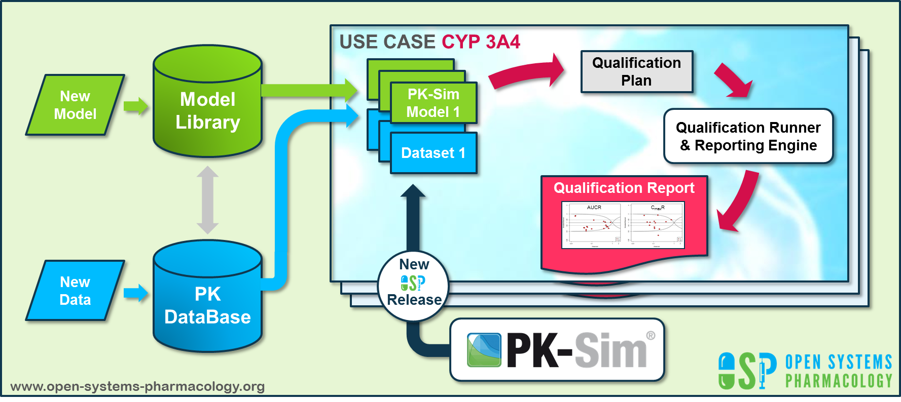

[Open Systems Pharmacology](http://www.open-systems-pharmacology.org) provides a dynamic landscape of model repositories and a database of observed clinical data. Additionally, a technical framework to assess confidence of a specific intended use has been developed (qualification runner and reporting engine). This framework allows for an automatic (re)-qualification workflow of the OSP suite, comprising the following steps (**Figure 1**):

- PBPK model development and verification with observed data,

- Qualification plan generation,

- Qualification plan execution,

- Qualification report generation.

  

**Figure 1: OSP suite automatic (re)-qualification workflow**

In a first step, the respective qualification scenario is saved in a special qualification repository on [GitHub](https://github.com/Open-Systems-Pharmacology/). This qualification scenario repository contains a detailed qualification plan that links and combines respective models and data to address the use case that shall be qualified. Therefore, the qualification plan consists of: 

- PK-Sim project files,
- Additional model building steps (if applicable),
- Description of potential cross-dependencies between PK-Sim project files (if applicable),
- Observed data (needed for model development and verification),
- Qualification scenario description text modules
- Detailed report settings to describe the generation of charts and qualification measures. 

PK-Sim projects, observed data sets, and qualification scenario text modules are deposited in distinct repositories and are referenced by the qualification plan (**Figure 2**).

**Figure 2: Qualification scenario repository landscape on GitHub**

In a second step the [qualification runner](https://github.com/Open-Systems-Pharmacology/QualificationRunner) processes the qualification plan, i.e. all project parts are exported and prepared for the [reporting engine](https://github.com/Open-Systems-Pharmacology/Reporting-Engine). The reporting engine provides a validated environment (currently implemented in MATLAB®, a transfer to R is in development) for model execution and finally generates the qualification report. This report contains the evaluation of the individual PBPK models with observed data (i.e. standard goodness of fit plots, visual predictive checks) and a comprehensive qualification of the specific use case assessing the predictive performance of the OSP suite by means of a predefined set of qualification measures and charts. 

The automated execution of the described workflow can be triggered to assess re-qualification in case new data, changes in model structure or parameterization, or new OSP suite releases arise.

