# Table of Contents

 * [1 Sensitivity Analysis](#sensitivity-analysis)
 * [2 PK parameters](#pk-parameters)
   * [2.1 PK Parameters of Raltegravir](#pk_parameters_Organism_PeripheralVenousBlood_Raltegravir_Plasma__Peripheral_Venous_Blood_)
     * [2.1.1 C_max](#pk_parameters_Organism_PeripheralVenousBlood_Raltegravir_Plasma__Peripheral_Venous_Blood__C_max)
     * [2.1.2 C_max_norm](#pk_parameters_Organism_PeripheralVenousBlood_Raltegravir_Plasma__Peripheral_Venous_Blood__C_max_norm)
     * [2.1.3 t_max](#pk_parameters_Organism_PeripheralVenousBlood_Raltegravir_Plasma__Peripheral_Venous_Blood__t_max)
     * [2.1.4 C_tEnd](#pk_parameters_Organism_PeripheralVenousBlood_Raltegravir_Plasma__Peripheral_Venous_Blood__C_tEnd)
     * [2.1.5 AUC](#pk_parameters_Organism_PeripheralVenousBlood_Raltegravir_Plasma__Peripheral_Venous_Blood__AUC_tEnd)
     * [2.1.6 AUC_norm](#pk_parameters_Organism_PeripheralVenousBlood_Raltegravir_Plasma__Peripheral_Venous_Blood__AUC_tEnd_norm)
     * [2.1.7 AUC_inf](#pk_parameters_Organism_PeripheralVenousBlood_Raltegravir_Plasma__Peripheral_Venous_Blood__AUC_inf)
     * [2.1.8 AUC_inf_norm](#pk_parameters_Organism_PeripheralVenousBlood_Raltegravir_Plasma__Peripheral_Venous_Blood__AUC_inf_norm)
     * [2.1.9 MRT](#pk_parameters_Organism_PeripheralVenousBlood_Raltegravir_Plasma__Peripheral_Venous_Blood__MRT)
     * [2.1.10 Thalf](#pk_parameters_Organism_PeripheralVenousBlood_Raltegravir_Plasma__Peripheral_Venous_Blood__Thalf)
     * [2.1.11 CL](#pk_parameters_Organism_PeripheralVenousBlood_Raltegravir_Plasma__Peripheral_Venous_Blood__CL)
     * [2.1.12 Vss](#pk_parameters_Organism_PeripheralVenousBlood_Raltegravir_Plasma__Peripheral_Venous_Blood__Vss)
     * [2.1.13 Vd](#pk_parameters_Organism_PeripheralVenousBlood_Raltegravir_Plasma__Peripheral_Venous_Blood__Vd)
 * [3 Time profiles and residual plots](#time-profiles)
   * [3.1 Time profiles and residual plots for Filmcoated_tablet_400mg_sd](#time-profiles-Filmcoated_tablet_400mg_sd)
   * [3.2 Time profiles and residual plots for Larson 2013 8y-18y 400mg FCT meal](#time-profiles-Larson_2013_8y_18y_400mg_FCT_meal)
   * [3.3 Residuals across all simulations](#time-profiles-residuals-across-all-simulations)
 * [4 Demography](#demography)
   * [4.1 Age-dependence](#1_demography_Organism_Age)
     * [4.1.1 Dependence of Height](#2_demography_Organism_Age_Organism_Height)
       * [4.1.1.1 For Larson 2013 8y-18y 400mg FCT meal](#3_demography_Organism_Age_Organism_Height)
       * [4.1.1.2 For Larson 2013 8y-18y 400mg FCT meal](#6_demography_Organism_Age_Organism_Height)
       * [4.1.1.3 For Filmcoated_tablet_400mg_sd](#9_demography_Organism_Age_Organism_Height)
     * [4.1.2 Dependence of Weight](#12_demography_Organism_Age_Organism_Weight)
       * [4.1.2.1 For Larson 2013 8y-18y 400mg FCT meal](#13_demography_Organism_Age_Organism_Weight)
       * [4.1.2.2 For Larson 2013 8y-18y 400mg FCT meal](#16_demography_Organism_Age_Organism_Weight)
       * [4.1.2.3 For Filmcoated_tablet_400mg_sd](#19_demography_Organism_Age_Organism_Weight)
     * [4.1.3 Dependence of BMI](#22_demography_Organism_Age_Organism_BMI)
       * [4.1.3.1 For Larson 2013 8y-18y 400mg FCT meal](#23_demography_Organism_Age_Organism_BMI)
       * [4.1.3.2 For Larson 2013 8y-18y 400mg FCT meal](#26_demography_Organism_Age_Organism_BMI)
       * [4.1.3.3 For Filmcoated_tablet_400mg_sd](#29_demography_Organism_Age_Organism_BMI)

# 1 Sensitivity Analysis

**Figure 1-1: Most sensitive parameters for C_max of Raltegravir for individuals at percentiles 5, 50, 95 for Larson 2013 8y-18y 400mg FCT meal, Filmcoated_tablet_400mg_sd.**

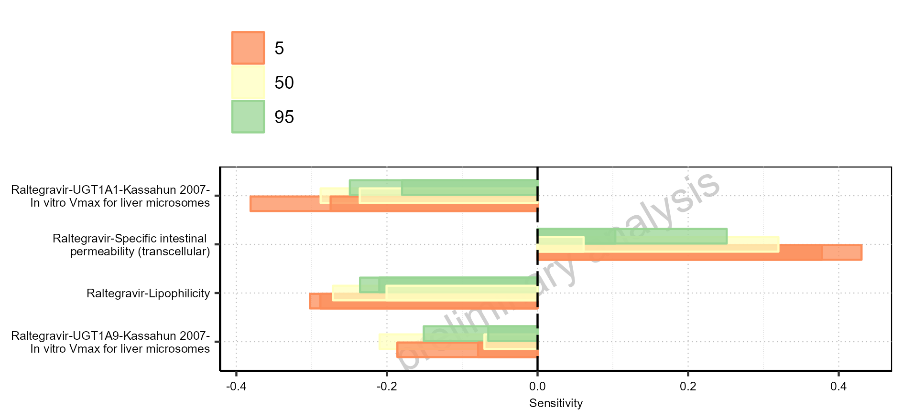

 
 

**Figure 1-2: Most sensitive parameters for t_max of Raltegravir for individuals at percentiles 5, 50, 95 for Filmcoated_tablet_400mg_sd, Larson 2013 8y-18y 400mg FCT meal.**

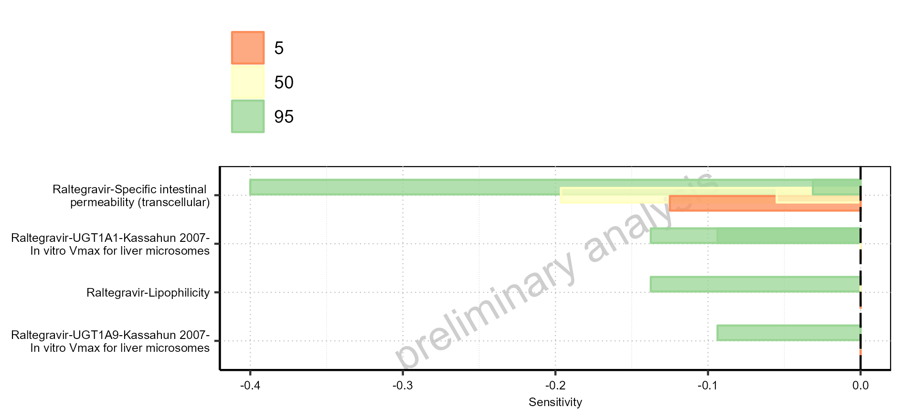

 
 

**Figure 1-3: Most sensitive parameters for C_tEnd of Raltegravir for individuals at percentiles 5, 50, 95 for Filmcoated_tablet_400mg_sd, Larson 2013 8y-18y 400mg FCT meal.**

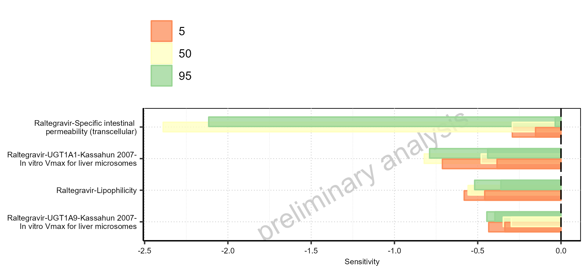

 
 

**Figure 1-4: Most sensitive parameters for AUC of Raltegravir for individuals at percentiles 5, 50, 95 for Larson 2013 8y-18y 400mg FCT meal, Filmcoated_tablet_400mg_sd.**

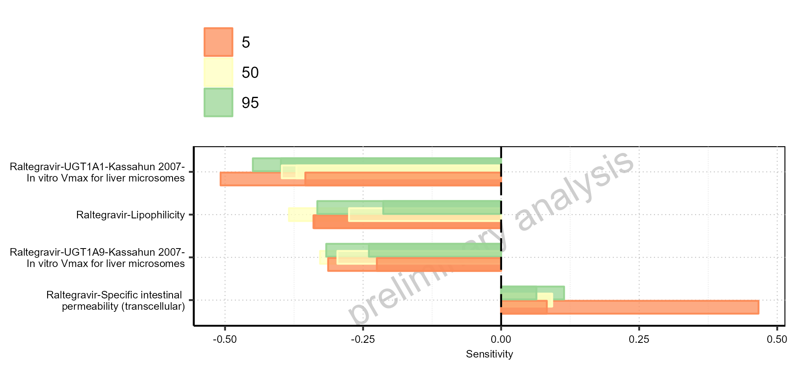

 
 

**Figure 1-5: Most sensitive parameters for AUC_inf of Raltegravir for individuals at percentiles 5, 50, 95 for Larson 2013 8y-18y 400mg FCT meal, Filmcoated_tablet_400mg_sd.**

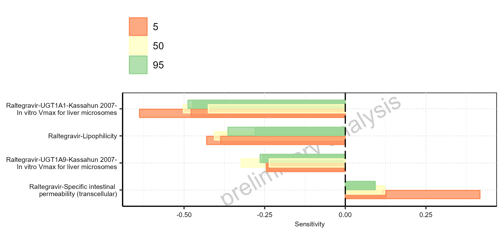

 
 

**Figure 1-6: Most sensitive parameters for MRT of Raltegravir for individuals at percentiles 5, 50, 95 for Larson 2013 8y-18y 400mg FCT meal, Filmcoated_tablet_400mg_sd.**

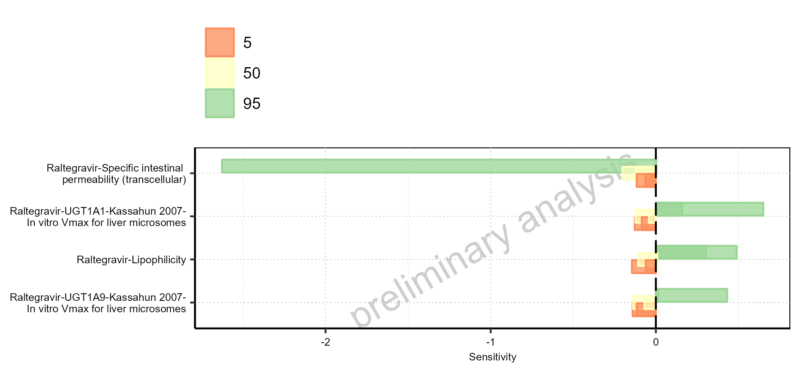

 
 

**Figure 1-7: Most sensitive parameters for Thalf of Raltegravir for individuals at percentiles 5, 50, 95 for Filmcoated_tablet_400mg_sd, Larson 2013 8y-18y 400mg FCT meal.**

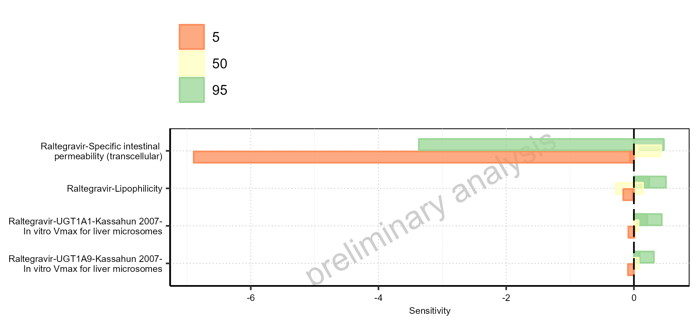

 
 

**Figure 1-8: Most sensitive parameters for CL of Raltegravir for individuals at percentiles 5, 50, 95 for Larson 2013 8y-18y 400mg FCT meal, Filmcoated_tablet_400mg_sd.**

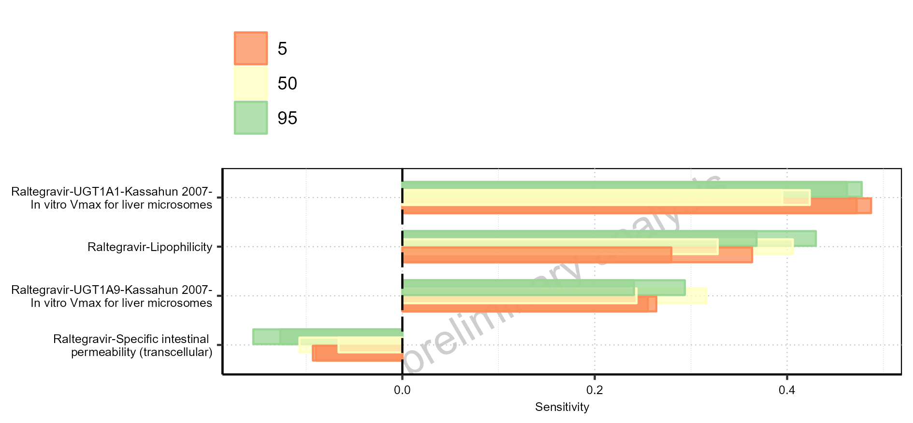

 
 

**Figure 1-9: Most sensitive parameters for Vss of Raltegravir for individuals at percentiles 5, 50, 95 for Larson 2013 8y-18y 400mg FCT meal, Filmcoated_tablet_400mg_sd.**

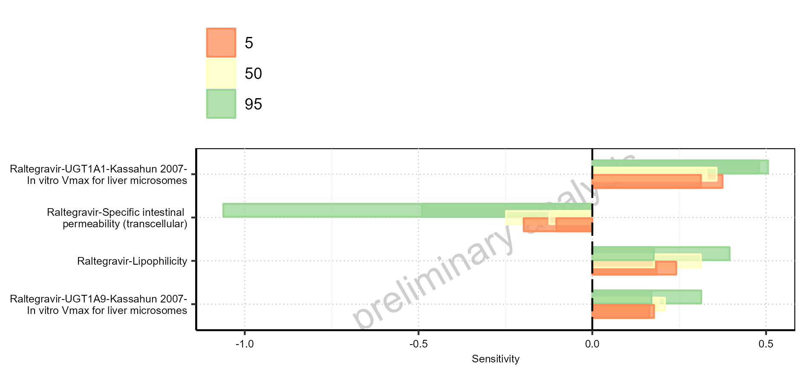

 
 

**Figure 1-10: Most sensitive parameters for Vd of Raltegravir for individuals at percentiles 5, 50, 95 for Larson 2013 8y-18y 400mg FCT meal, Filmcoated_tablet_400mg_sd.**

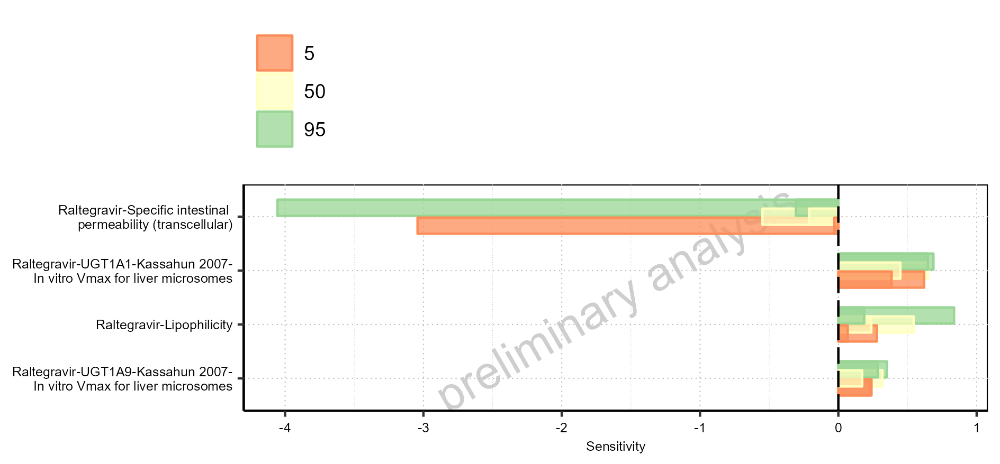

 
 

# 2 PK parameters

## 2.1 PK Parameters of Raltegravir

### 2.1.1 C_max

**Figure 2-1: C_max of Raltegravir for Larson 2013 8y-18y 400mg FCT meal, Filmcoated_tablet_400mg_sd shown as box-whisker plot, which indicates the 5<U+1D57><U+02B0>, 25<U+1D57><U+02B0>, 50<U+1D57><U+02B0>, 75<U+1D57><U+02B0>, 95<U+1D57><U+02B0> percentiles in logarithmic scale.**

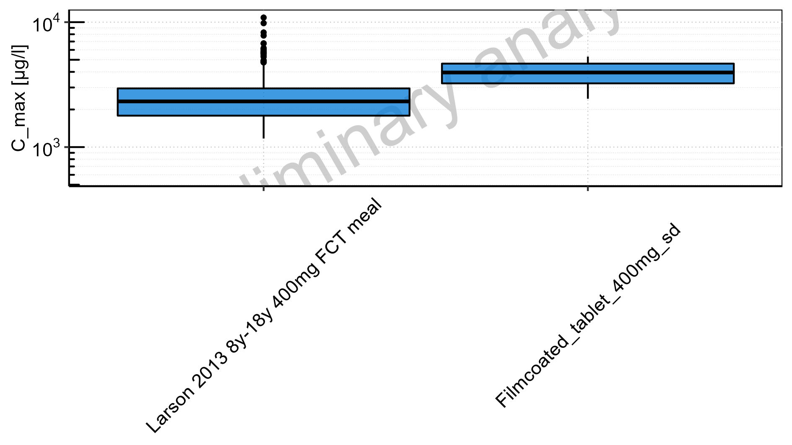

 
 

**Figure 2-2: C_max of Raltegravir for Larson 2013 8y-18y 400mg FCT meal, Filmcoated_tablet_400mg_sd shown as box-whisker plot, which indicates the 5<U+1D57><U+02B0>, 25<U+1D57><U+02B0>, 50<U+1D57><U+02B0>, 75<U+1D57><U+02B0>, 95<U+1D57><U+02B0> percentiles in linear scale.**

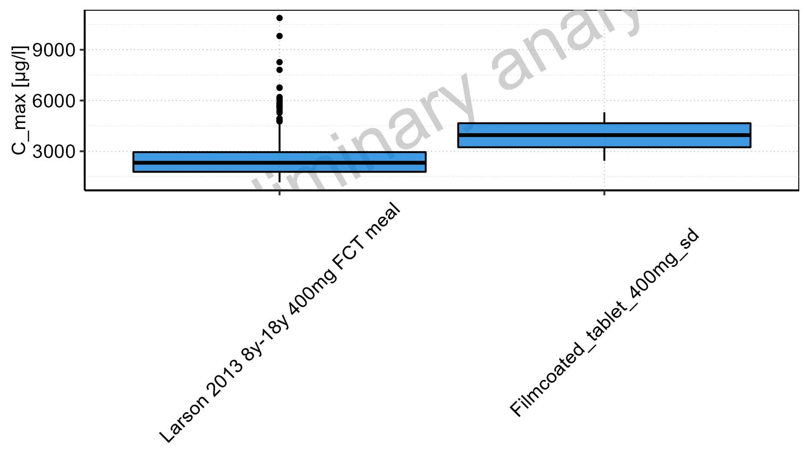

 
 

**Table 2-1: C_max of Raltegravir for Larson 2013 8y-18y 400mg FCT meal, Filmcoated_tablet_400mg_sd reported in [µg/l]**

|Population                        |N   |5<U+1D57><U+02B0> pctl |25<U+1D57><U+02B0> pctl |50<U+1D57><U+02B0> pctl |75<U+1D57><U+02B0> pctl |95<U+1D57><U+02B0> pctl |Mean    |SD      |Geo Mean |Geo SD |
|:---------------------------------|:---|:----------------------|:-----------------------|:-----------------------|:-----------------------|:-----------------------|:-------|:-------|:--------|:------|
|Larson 2013 8y-18y 400mg FCT meal |500 |1171.26                |1784.94                 |2321.55                 |2949.24                 |4651.40                 |2549.83 |1206.89 |2326.87  |1.52   |
|Filmcoated_tablet_400mg_sd        |100 |2437.79                |3236.54                 |3954.54                 |4657.56                 |5304.38                 |3940.92 |908.89  |3833.70  |1.27   |

 
 

**Figure 2-3: Age-dependence of C_max for Larson 2013 8y-18y 400mg FCT meal in comparison to Filmcoated_tablet_400mg_sd. Profiles are plotted in a logarithmic scale.**

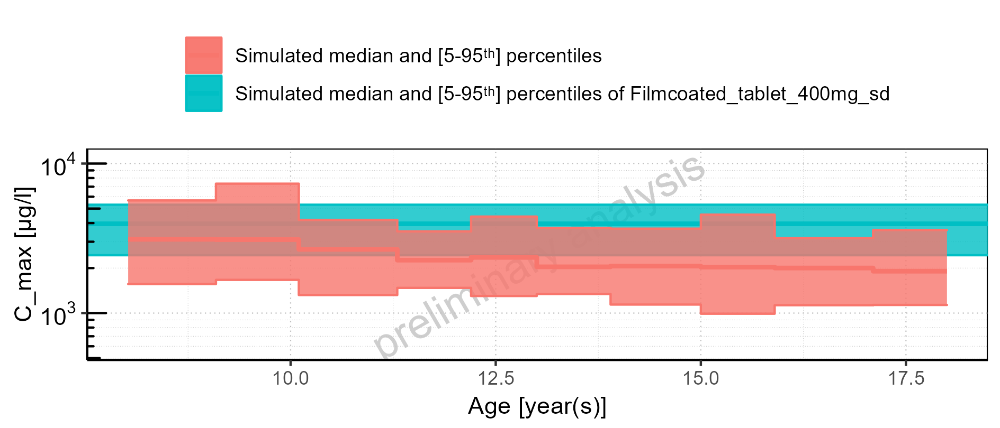

 
 

**Figure 2-4: Age-dependence of C_max for Larson 2013 8y-18y 400mg FCT meal in comparison to Filmcoated_tablet_400mg_sd. Profiles are plotted in a linear scale.**

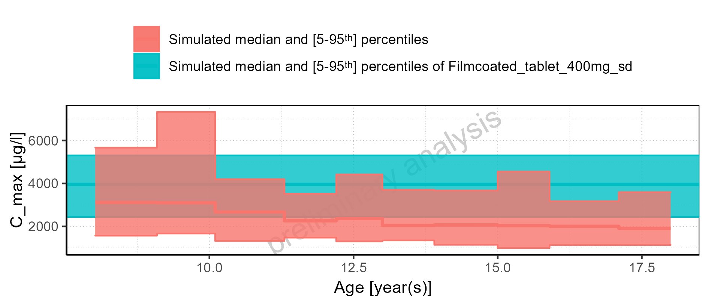

 
 

**Figure 2-5: Age-dependence of C_max for Larson 2013 8y-18y 400mg FCT meal. Profiles are plotted in a logarithmic scale.**

 
 

**Figure 2-6: Age-dependence of C_max for Larson 2013 8y-18y 400mg FCT meal. Profiles are plotted in a linear scale.**

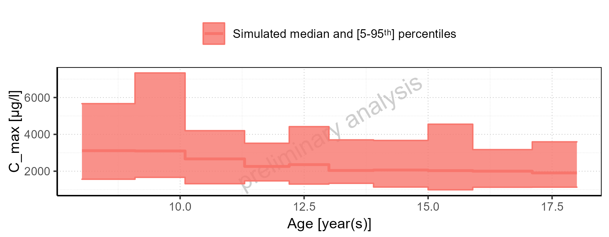

 
 

**Figure 2-7: Age-dependence of C_max for Filmcoated_tablet_400mg_sd. Profiles are plotted in a logarithmic scale.**

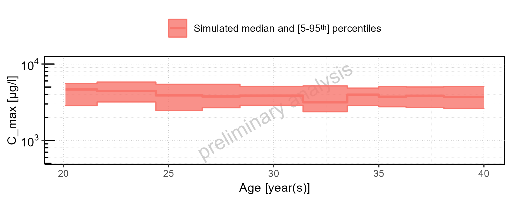

 
 

**Figure 2-8: Age-dependence of C_max for Filmcoated_tablet_400mg_sd. Profiles are plotted in a linear scale.**

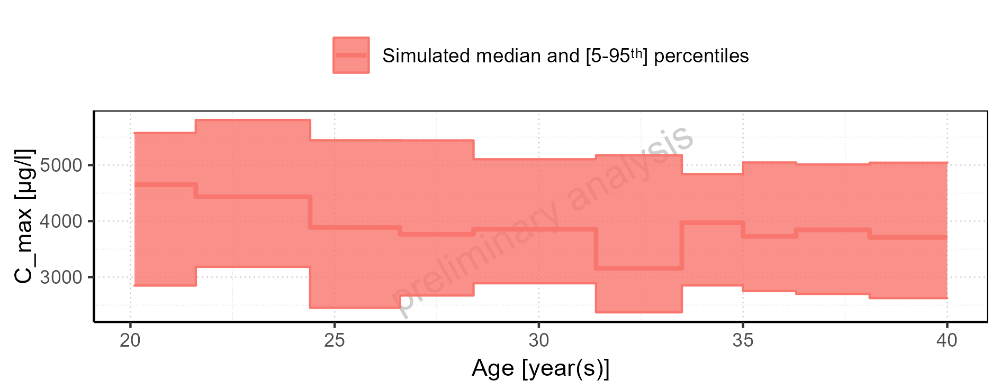

 
 

**Figure 2-9: Height-dependence of C_max for Larson 2013 8y-18y 400mg FCT meal in comparison to Filmcoated_tablet_400mg_sd. Profiles are plotted in a logarithmic scale.**

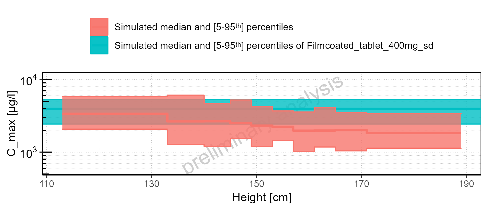

 
 

**Figure 2-10: Height-dependence of C_max for Larson 2013 8y-18y 400mg FCT meal in comparison to Filmcoated_tablet_400mg_sd. Profiles are plotted in a linear scale.**

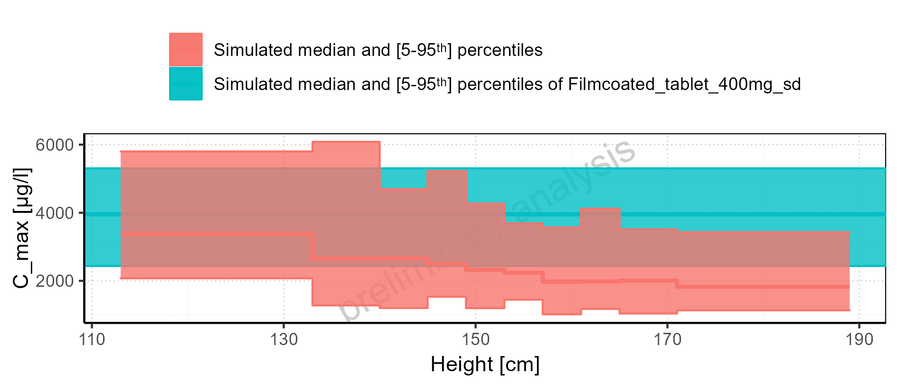

 
 

**Figure 2-11: Height-dependence of C_max for Larson 2013 8y-18y 400mg FCT meal. Profiles are plotted in a logarithmic scale.**

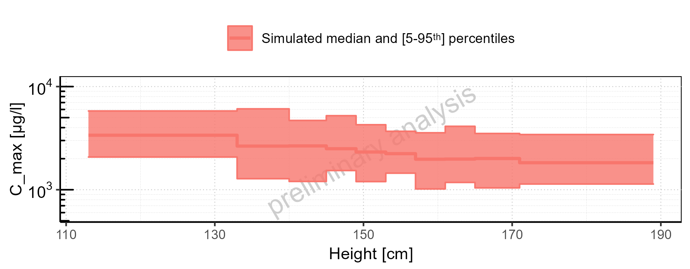

 
 

**Figure 2-12: Height-dependence of C_max for Larson 2013 8y-18y 400mg FCT meal. Profiles are plotted in a linear scale.**

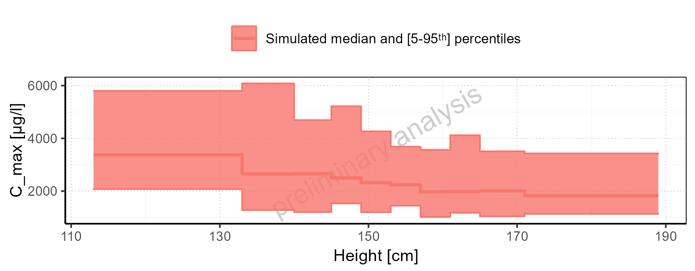

 
 

**Figure 2-13: Height-dependence of C_max for Filmcoated_tablet_400mg_sd. Profiles are plotted in a logarithmic scale.**

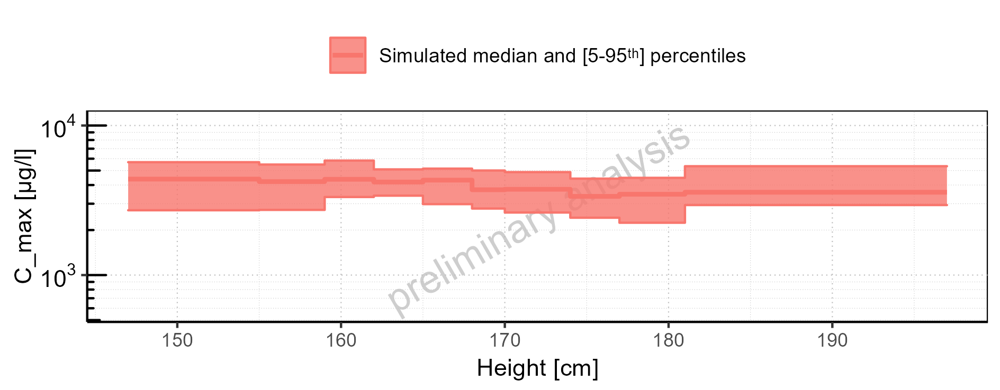

 
 

**Figure 2-14: Height-dependence of C_max for Filmcoated_tablet_400mg_sd. Profiles are plotted in a linear scale.**

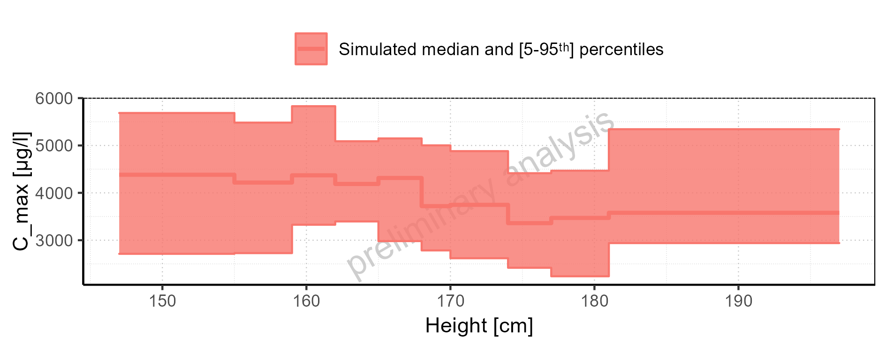

 
 

**Figure 2-15: Weight-dependence of C_max for Larson 2013 8y-18y 400mg FCT meal in comparison to Filmcoated_tablet_400mg_sd. Profiles are plotted in a logarithmic scale.**

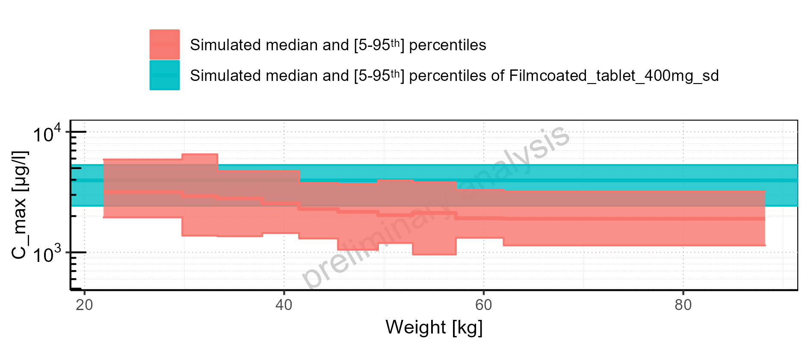

 
 

**Figure 2-16: Weight-dependence of C_max for Larson 2013 8y-18y 400mg FCT meal in comparison to Filmcoated_tablet_400mg_sd. Profiles are plotted in a linear scale.**

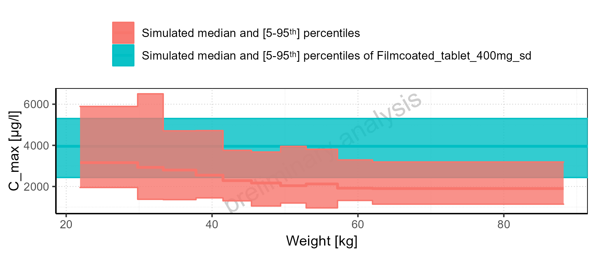

 
 

**Figure 2-17: Weight-dependence of C_max for Larson 2013 8y-18y 400mg FCT meal. Profiles are plotted in a logarithmic scale.**

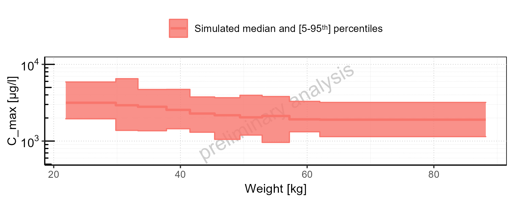

 
 

**Figure 2-18: Weight-dependence of C_max for Larson 2013 8y-18y 400mg FCT meal. Profiles are plotted in a linear scale.**

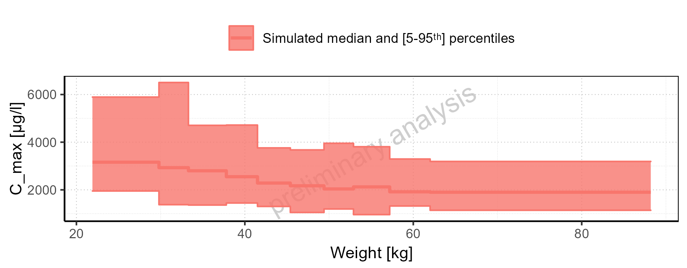

 
 

**Figure 2-19: Weight-dependence of C_max for Filmcoated_tablet_400mg_sd. Profiles are plotted in a logarithmic scale.**

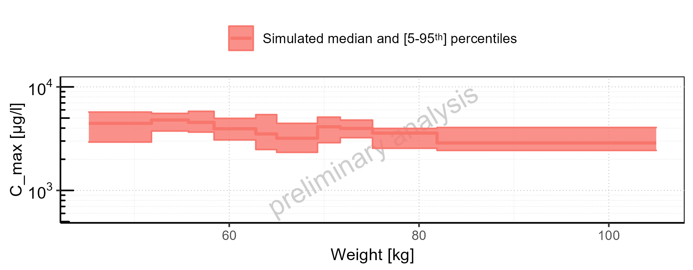

 
 

**Figure 2-20: Weight-dependence of C_max for Filmcoated_tablet_400mg_sd. Profiles are plotted in a linear scale.**

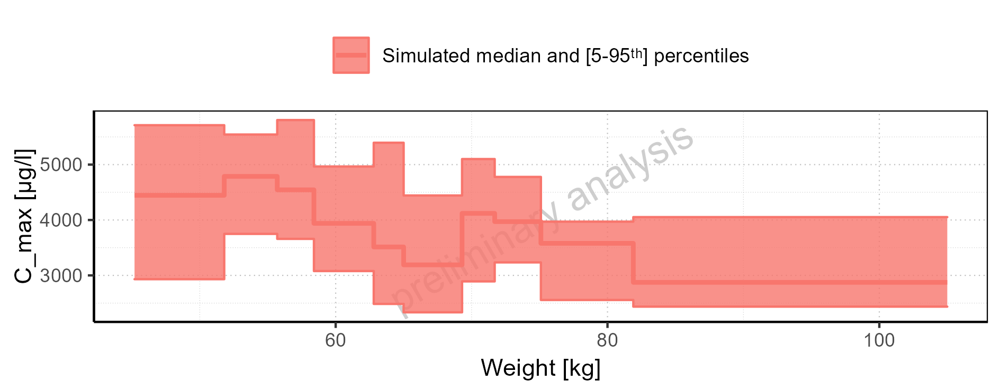

 
 

**Figure 2-21: BMI-dependence of C_max for Larson 2013 8y-18y 400mg FCT meal in comparison to Filmcoated_tablet_400mg_sd. Profiles are plotted in a logarithmic scale.**

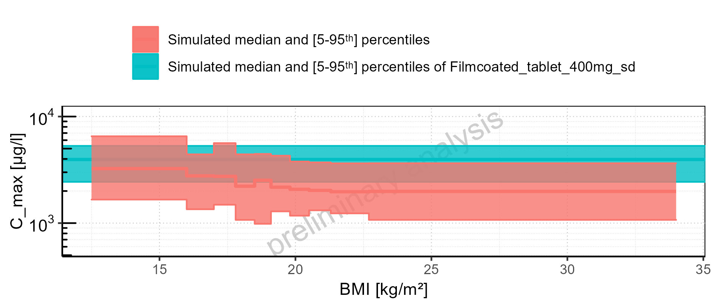

 
 

**Figure 2-22: BMI-dependence of C_max for Larson 2013 8y-18y 400mg FCT meal in comparison to Filmcoated_tablet_400mg_sd. Profiles are plotted in a linear scale.**

 
 

**Figure 2-23: BMI-dependence of C_max for Larson 2013 8y-18y 400mg FCT meal. Profiles are plotted in a logarithmic scale.**

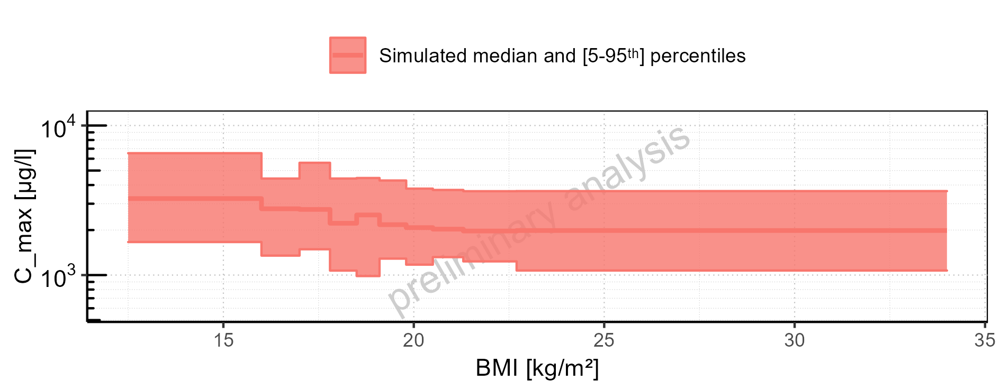

 
 

**Figure 2-24: BMI-dependence of C_max for Larson 2013 8y-18y 400mg FCT meal. Profiles are plotted in a linear scale.**

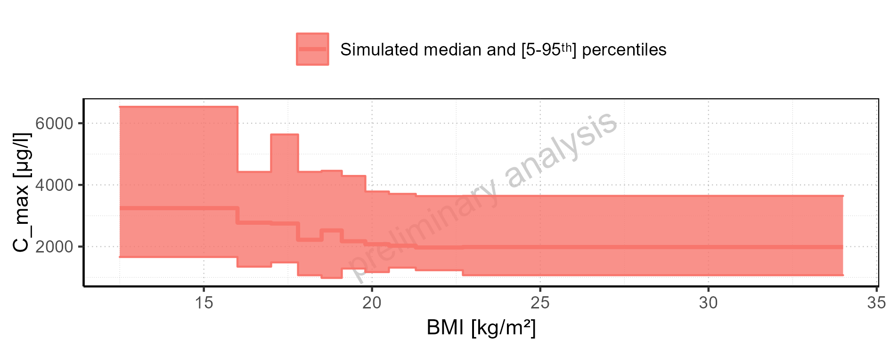

 
 

**Figure 2-25: BMI-dependence of C_max for Filmcoated_tablet_400mg_sd. Profiles are plotted in a logarithmic scale.**

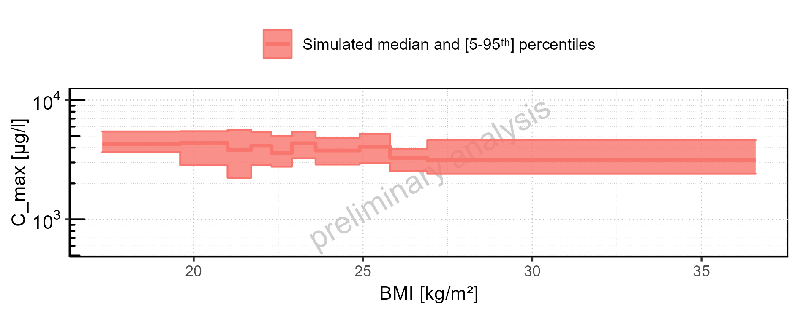

 
 

**Figure 2-26: BMI-dependence of C_max for Filmcoated_tablet_400mg_sd. Profiles are plotted in a linear scale.**

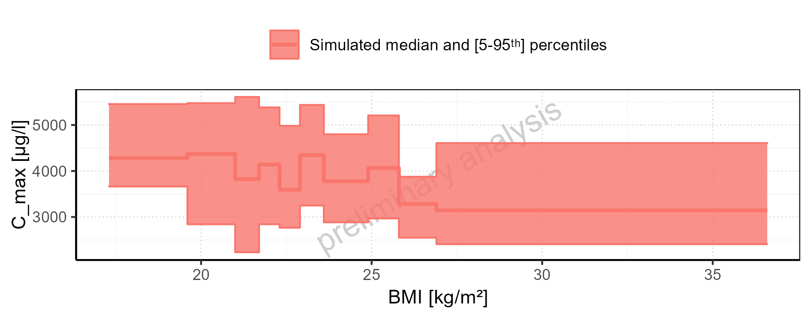

 
 

### 2.1.2 C_max_norm

**Figure 2-27: C_max_norm of Raltegravir for Larson 2013 8y-18y 400mg FCT meal, Filmcoated_tablet_400mg_sd shown as box-whisker plot, which indicates the 5<U+1D57><U+02B0>, 25<U+1D57><U+02B0>, 50<U+1D57><U+02B0>, 75<U+1D57><U+02B0>, 95<U+1D57><U+02B0> percentiles in logarithmic scale.**

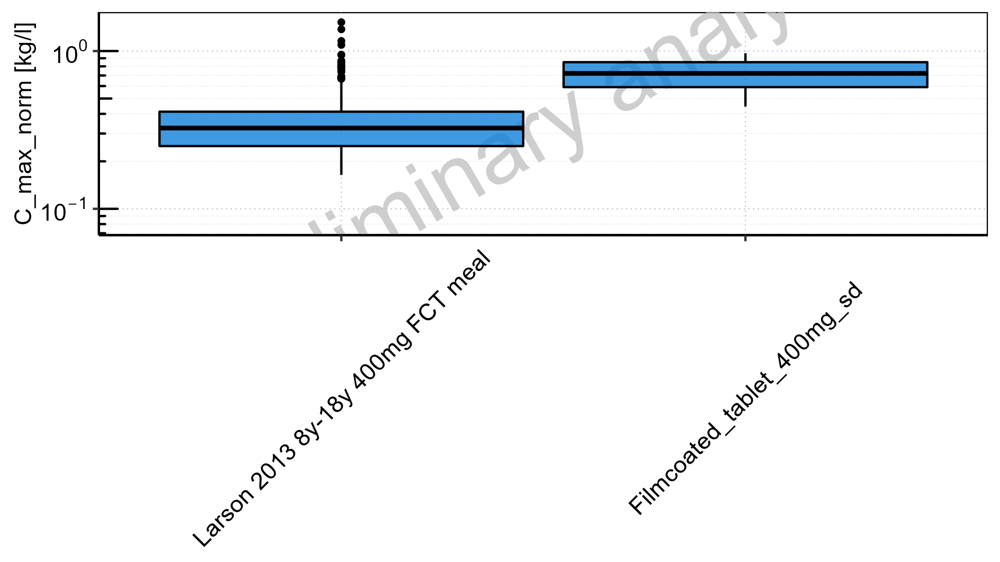

 
 

**Figure 2-28: C_max_norm of Raltegravir for Larson 2013 8y-18y 400mg FCT meal, Filmcoated_tablet_400mg_sd shown as box-whisker plot, which indicates the 5<U+1D57><U+02B0>, 25<U+1D57><U+02B0>, 50<U+1D57><U+02B0>, 75<U+1D57><U+02B0>, 95<U+1D57><U+02B0> percentiles in linear scale.**

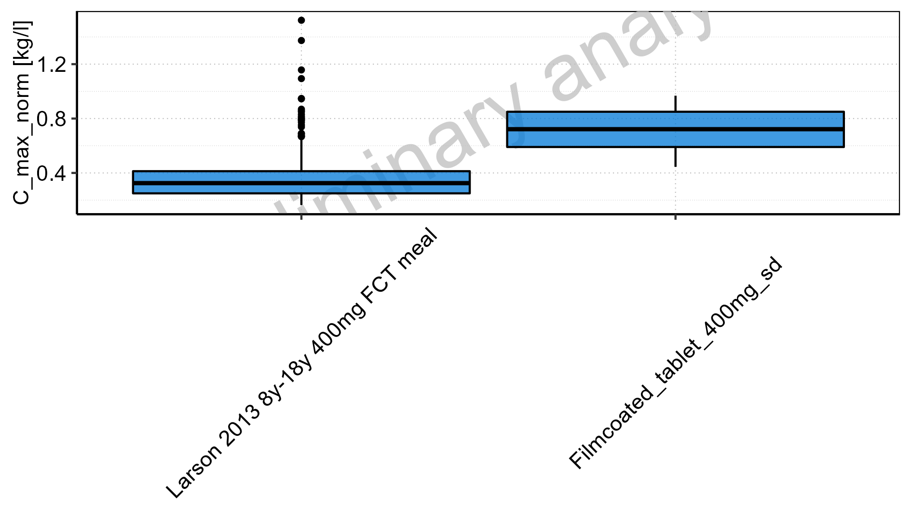

 
 

**Table 2-2: C_max_norm of Raltegravir for Larson 2013 8y-18y 400mg FCT meal, Filmcoated_tablet_400mg_sd reported in [kg/l]**

|Population                        |N   |5<U+1D57><U+02B0> pctl |25<U+1D57><U+02B0> pctl |50<U+1D57><U+02B0> pctl |75<U+1D57><U+02B0> pctl |95<U+1D57><U+02B0> pctl |Mean |SD   |Geo Mean |Geo SD |
|:---------------------------------|:---|:----------------------|:-----------------------|:-----------------------|:-----------------------|:-----------------------|:----|:----|:--------|:------|
|Larson 2013 8y-18y 400mg FCT meal |500 |0.16                   |0.25                    |0.33                    |0.41                    |0.65                    |0.36 |0.17 |0.33     |1.52   |
|Filmcoated_tablet_400mg_sd        |100 |0.44                   |0.59                    |0.72                    |0.85                    |0.97                    |0.72 |0.17 |0.70     |1.27   |

 
 

**Figure 2-29: Age-dependence of C_max_norm for Larson 2013 8y-18y 400mg FCT meal in comparison to Filmcoated_tablet_400mg_sd. Profiles are plotted in a logarithmic scale.**

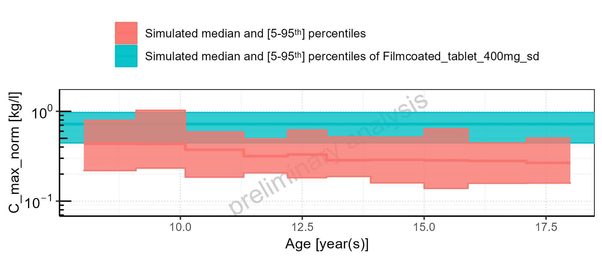

 
 

**Figure 2-30: Age-dependence of C_max_norm for Larson 2013 8y-18y 400mg FCT meal in comparison to Filmcoated_tablet_400mg_sd. Profiles are plotted in a linear scale.**

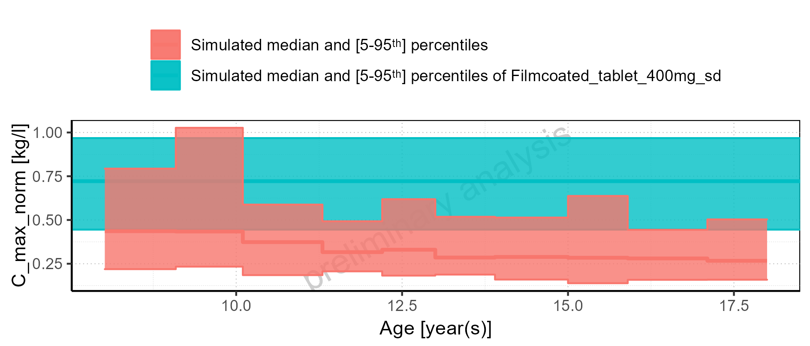

 
 

**Figure 2-31: Age-dependence of C_max_norm for Larson 2013 8y-18y 400mg FCT meal. Profiles are plotted in a logarithmic scale.**

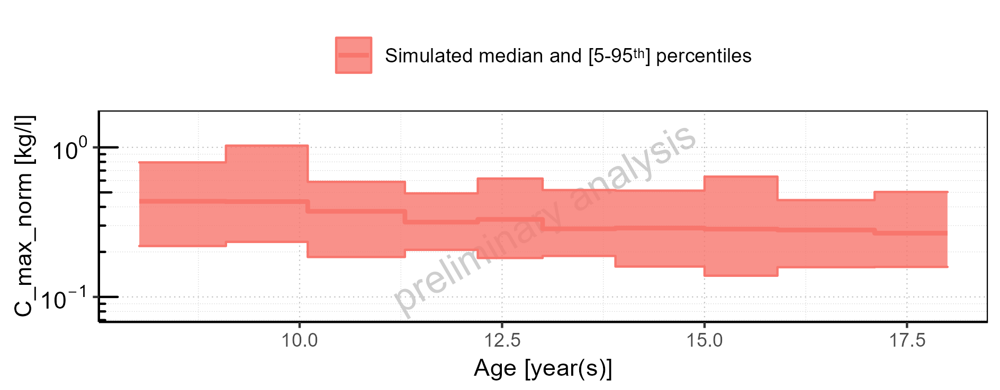

 
 

**Figure 2-32: Age-dependence of C_max_norm for Larson 2013 8y-18y 400mg FCT meal. Profiles are plotted in a linear scale.**

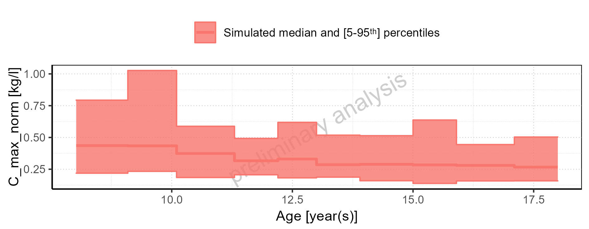

 
 

**Figure 2-33: Age-dependence of C_max_norm for Filmcoated_tablet_400mg_sd. Profiles are plotted in a logarithmic scale.**

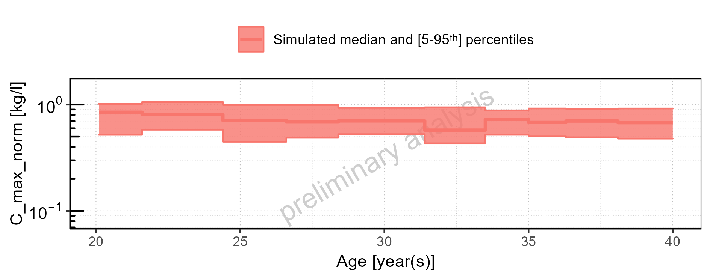

 
 

**Figure 2-34: Age-dependence of C_max_norm for Filmcoated_tablet_400mg_sd. Profiles are plotted in a linear scale.**

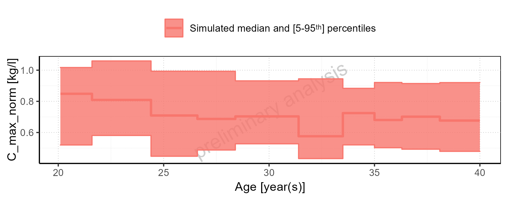

 
 

**Figure 2-35: Height-dependence of C_max_norm for Larson 2013 8y-18y 400mg FCT meal in comparison to Filmcoated_tablet_400mg_sd. Profiles are plotted in a logarithmic scale.**

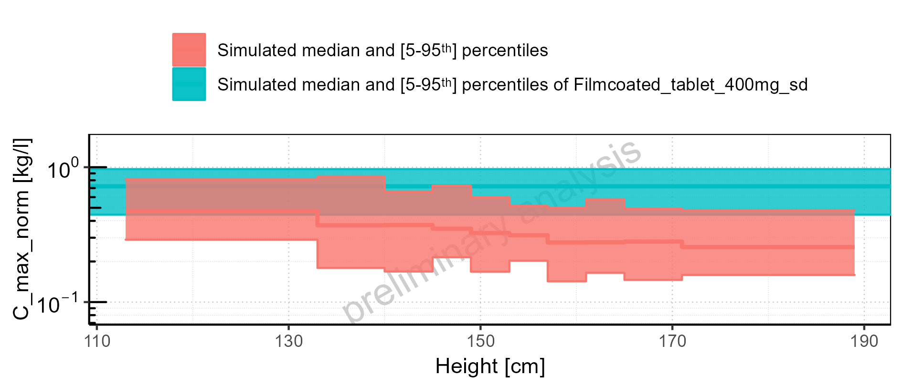

 
 

**Figure 2-36: Height-dependence of C_max_norm for Larson 2013 8y-18y 400mg FCT meal in comparison to Filmcoated_tablet_400mg_sd. Profiles are plotted in a linear scale.**

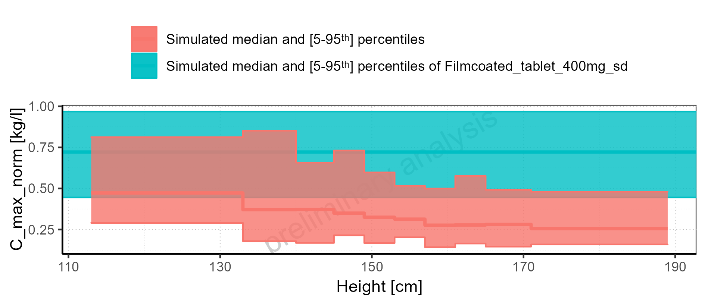

 
 

**Figure 2-37: Height-dependence of C_max_norm for Larson 2013 8y-18y 400mg FCT meal. Profiles are plotted in a logarithmic scale.**

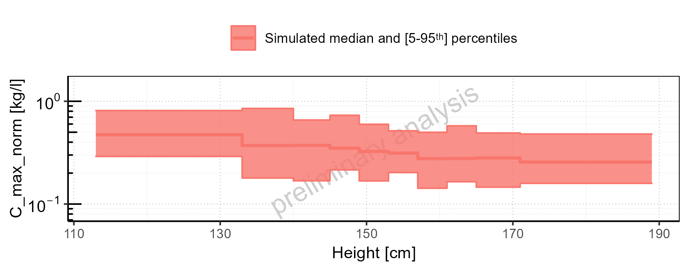

 
 

**Figure 2-38: Height-dependence of C_max_norm for Larson 2013 8y-18y 400mg FCT meal. Profiles are plotted in a linear scale.**

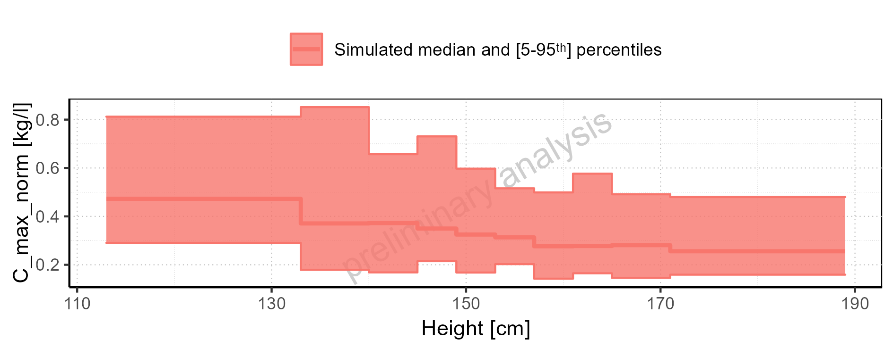

 
 

**Figure 2-39: Height-dependence of C_max_norm for Filmcoated_tablet_400mg_sd. Profiles are plotted in a logarithmic scale.**

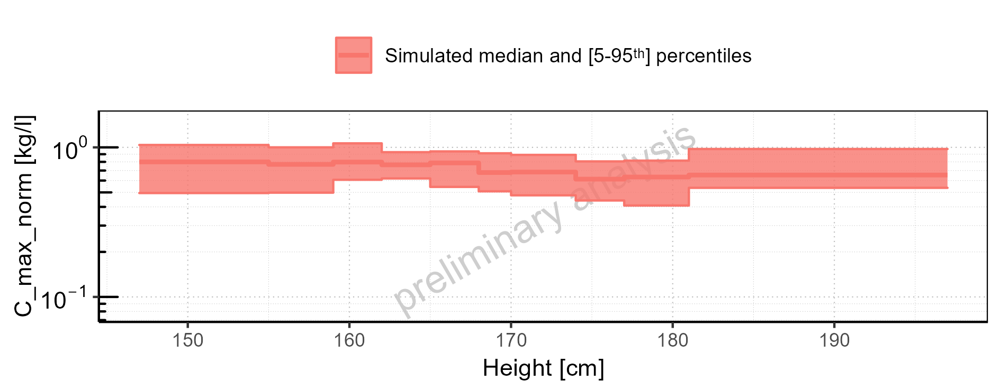

 
 

**Figure 2-40: Height-dependence of C_max_norm for Filmcoated_tablet_400mg_sd. Profiles are plotted in a linear scale.**

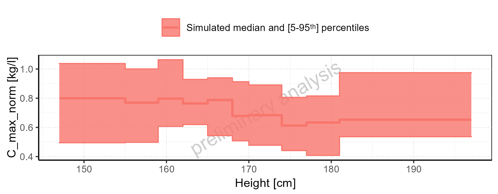

 
 

**Figure 2-41: Weight-dependence of C_max_norm for Larson 2013 8y-18y 400mg FCT meal in comparison to Filmcoated_tablet_400mg_sd. Profiles are plotted in a logarithmic scale.**

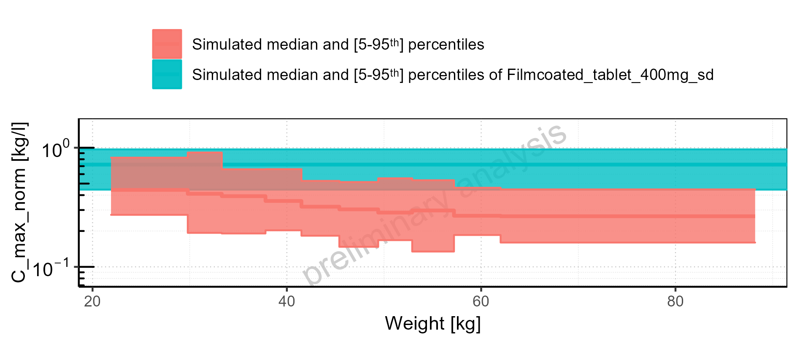

 
 

**Figure 2-42: Weight-dependence of C_max_norm for Larson 2013 8y-18y 400mg FCT meal in comparison to Filmcoated_tablet_400mg_sd. Profiles are plotted in a linear scale.**

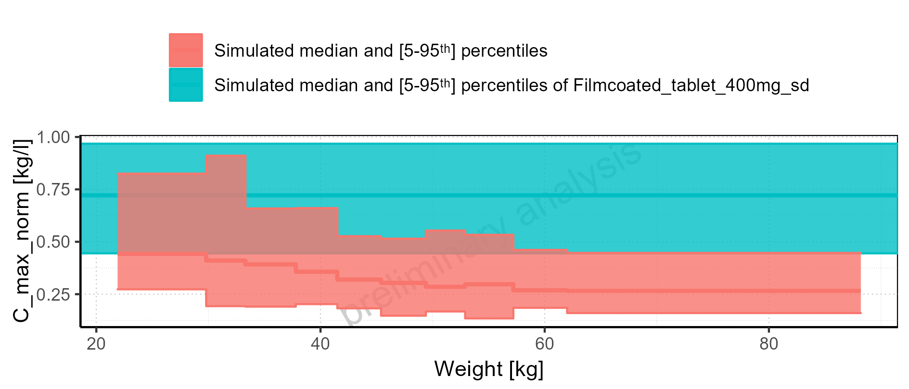

 
 

**Figure 2-43: Weight-dependence of C_max_norm for Larson 2013 8y-18y 400mg FCT meal. Profiles are plotted in a logarithmic scale.**

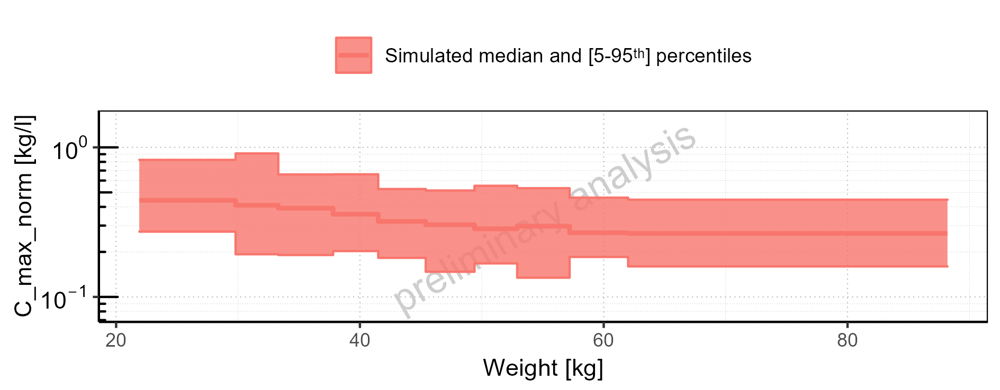

 
 

**Figure 2-44: Weight-dependence of C_max_norm for Larson 2013 8y-18y 400mg FCT meal. Profiles are plotted in a linear scale.**

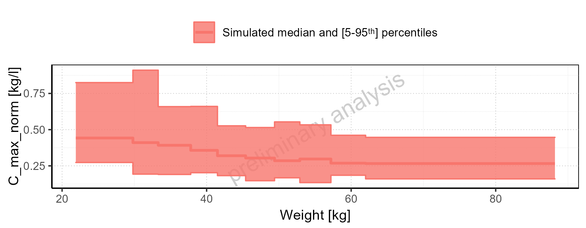

 
 

**Figure 2-45: Weight-dependence of C_max_norm for Filmcoated_tablet_400mg_sd. Profiles are plotted in a logarithmic scale.**

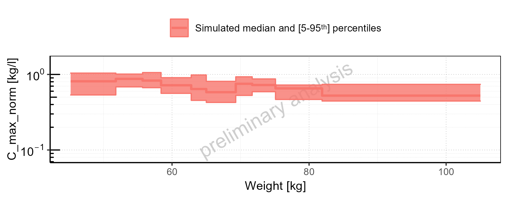

 
 

**Figure 2-46: Weight-dependence of C_max_norm for Filmcoated_tablet_400mg_sd. Profiles are plotted in a linear scale.**

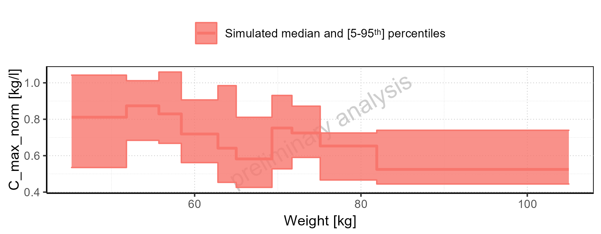

 
 

**Figure 2-47: BMI-dependence of C_max_norm for Larson 2013 8y-18y 400mg FCT meal in comparison to Filmcoated_tablet_400mg_sd. Profiles are plotted in a logarithmic scale.**

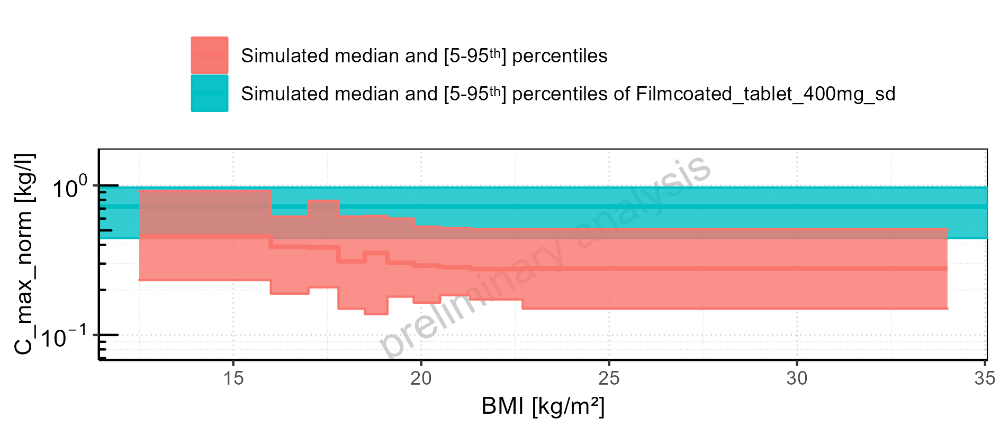

 
 

**Figure 2-48: BMI-dependence of C_max_norm for Larson 2013 8y-18y 400mg FCT meal in comparison to Filmcoated_tablet_400mg_sd. Profiles are plotted in a linear scale.**

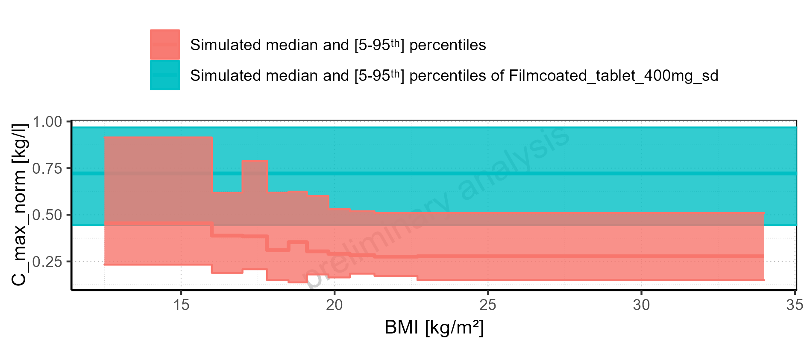

 
 

**Figure 2-49: BMI-dependence of C_max_norm for Larson 2013 8y-18y 400mg FCT meal. Profiles are plotted in a logarithmic scale.**

 
 

**Figure 2-50: BMI-dependence of C_max_norm for Larson 2013 8y-18y 400mg FCT meal. Profiles are plotted in a linear scale.**

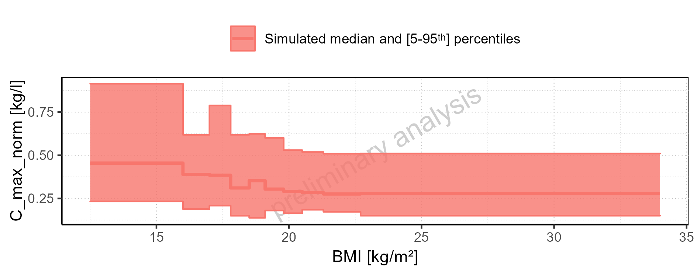

 
 

**Figure 2-51: BMI-dependence of C_max_norm for Filmcoated_tablet_400mg_sd. Profiles are plotted in a logarithmic scale.**

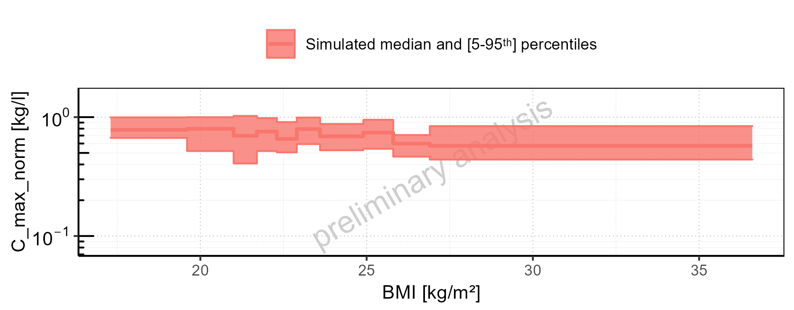

 
 

**Figure 2-52: BMI-dependence of C_max_norm for Filmcoated_tablet_400mg_sd. Profiles are plotted in a linear scale.**

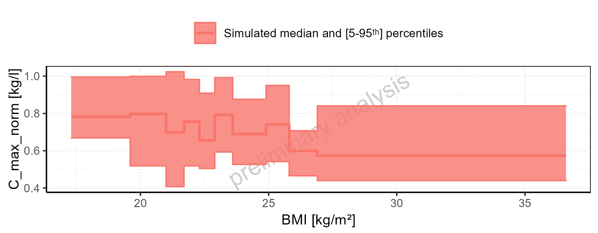

 
 

### 2.1.3 t_max

**Figure 2-53: t_max of Raltegravir for Larson 2013 8y-18y 400mg FCT meal, Filmcoated_tablet_400mg_sd shown as box-whisker plot, which indicates the 5<U+1D57><U+02B0>, 25<U+1D57><U+02B0>, 50<U+1D57><U+02B0>, 75<U+1D57><U+02B0>, 95<U+1D57><U+02B0> percentiles in logarithmic scale.**

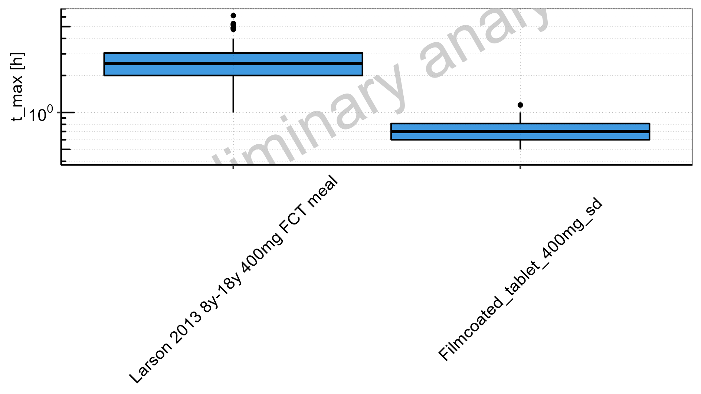

 
 

**Figure 2-54: t_max of Raltegravir for Larson 2013 8y-18y 400mg FCT meal, Filmcoated_tablet_400mg_sd shown as box-whisker plot, which indicates the 5<U+1D57><U+02B0>, 25<U+1D57><U+02B0>, 50<U+1D57><U+02B0>, 75<U+1D57><U+02B0>, 95<U+1D57><U+02B0> percentiles in linear scale.**

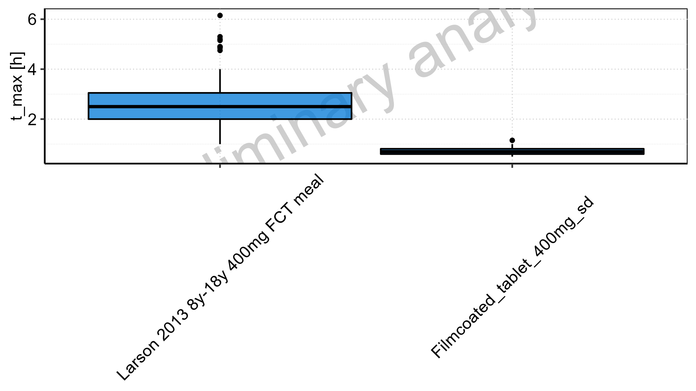

 
 

**Table 2-3: t_max of Raltegravir for Larson 2013 8y-18y 400mg FCT meal, Filmcoated_tablet_400mg_sd reported in [h]**

|Population                        |N   |5<U+1D57><U+02B0> pctl |25<U+1D57><U+02B0> pctl |50<U+1D57><U+02B0> pctl |75<U+1D57><U+02B0> pctl |95<U+1D57><U+02B0> pctl |Mean |SD   |Geo Mean |Geo SD |
|:---------------------------------|:---|:----------------------|:-----------------------|:-----------------------|:-----------------------|:-----------------------|:----|:----|:--------|:------|
|Larson 2013 8y-18y 400mg FCT meal |500 |1.00                   |2.00                    |2.50                    |3.05                    |4                       |2.54 |0.88 |2.37     |1.49   |
|Filmcoated_tablet_400mg_sd        |100 |0.50                   |0.60                    |0.70                    |0.81                    |1                       |0.73 |0.15 |0.71     |1.23   |

 
 

**Figure 2-55: Age-dependence of t_max for Larson 2013 8y-18y 400mg FCT meal in comparison to Filmcoated_tablet_400mg_sd. Profiles are plotted in a logarithmic scale.**

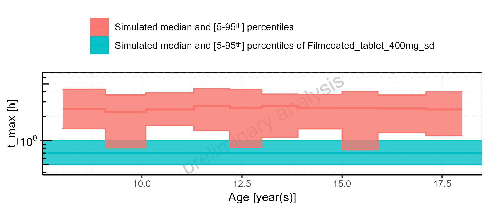

 
 

**Figure 2-56: Age-dependence of t_max for Larson 2013 8y-18y 400mg FCT meal in comparison to Filmcoated_tablet_400mg_sd. Profiles are plotted in a linear scale.**

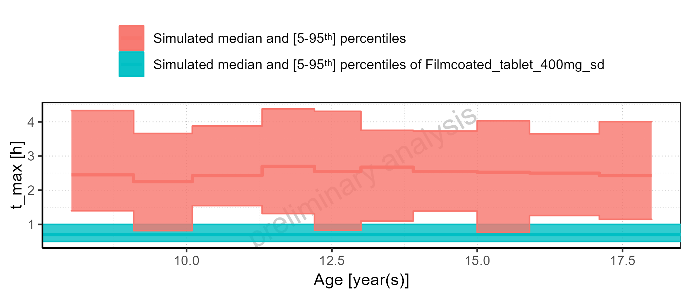

 
 

**Figure 2-57: Age-dependence of t_max for Larson 2013 8y-18y 400mg FCT meal. Profiles are plotted in a logarithmic scale.**

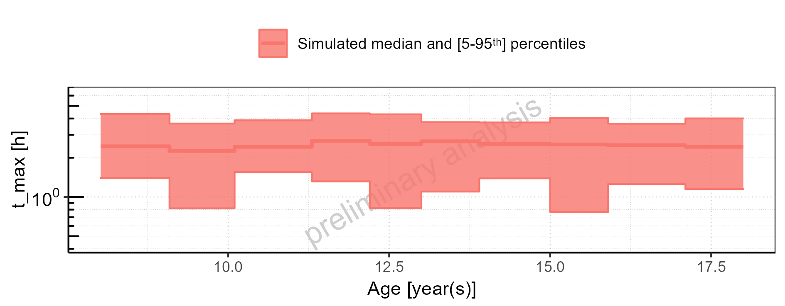

 
 

**Figure 2-58: Age-dependence of t_max for Larson 2013 8y-18y 400mg FCT meal. Profiles are plotted in a linear scale.**

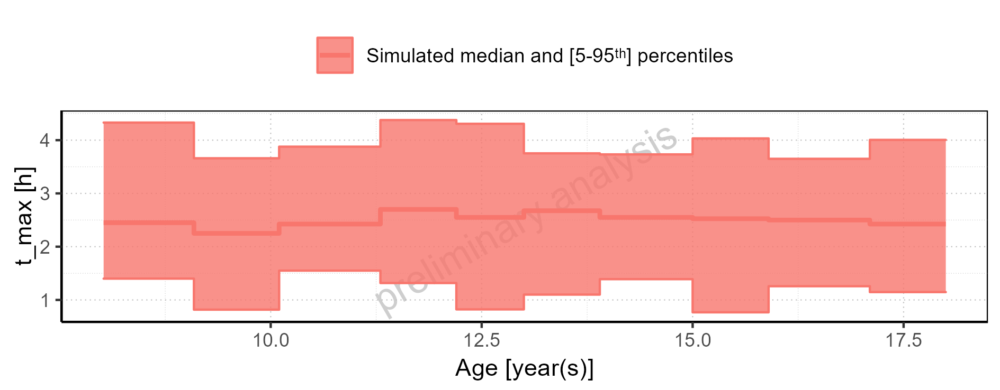

 
 

**Figure 2-59: Age-dependence of t_max for Filmcoated_tablet_400mg_sd. Profiles are plotted in a logarithmic scale.**

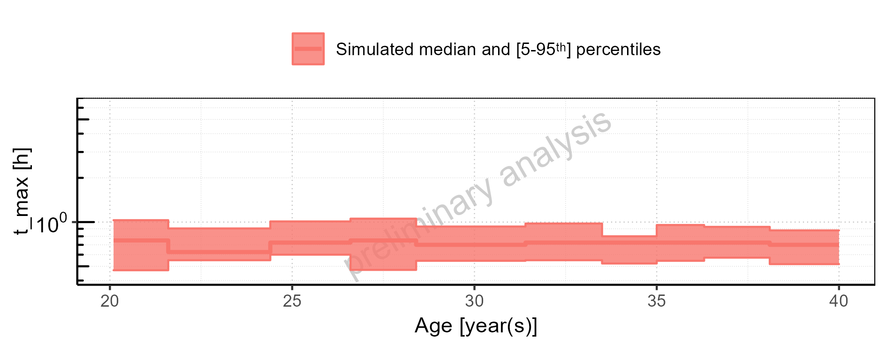

 
 

**Figure 2-60: Age-dependence of t_max for Filmcoated_tablet_400mg_sd. Profiles are plotted in a linear scale.**

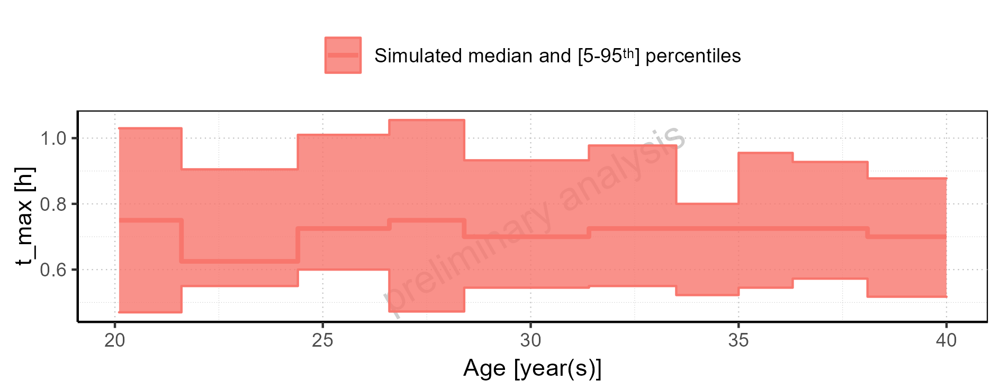

 
 

**Figure 2-61: Height-dependence of t_max for Larson 2013 8y-18y 400mg FCT meal in comparison to Filmcoated_tablet_400mg_sd. Profiles are plotted in a logarithmic scale.**

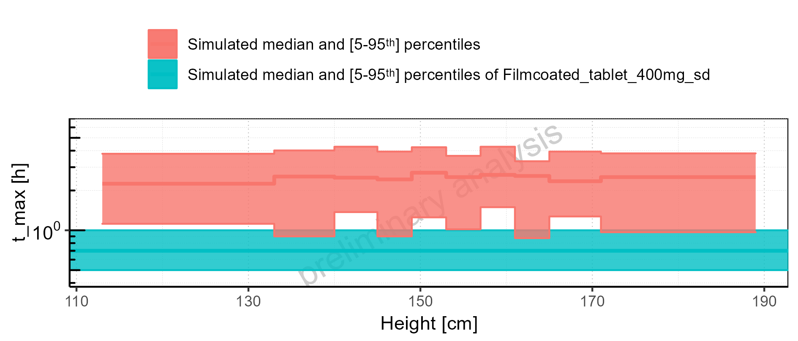

 
 

**Figure 2-62: Height-dependence of t_max for Larson 2013 8y-18y 400mg FCT meal in comparison to Filmcoated_tablet_400mg_sd. Profiles are plotted in a linear scale.**

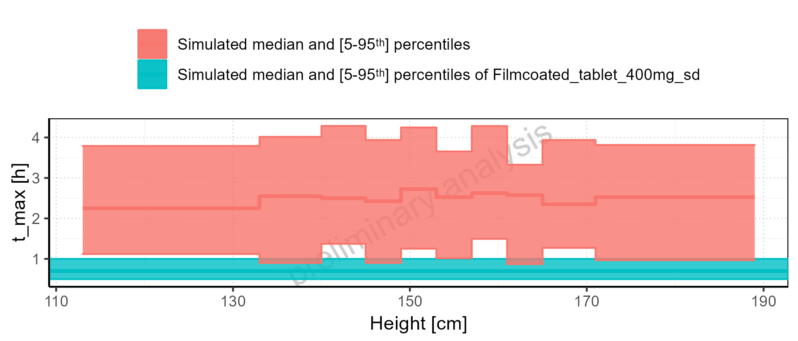

 
 

**Figure 2-63: Height-dependence of t_max for Larson 2013 8y-18y 400mg FCT meal. Profiles are plotted in a logarithmic scale.**

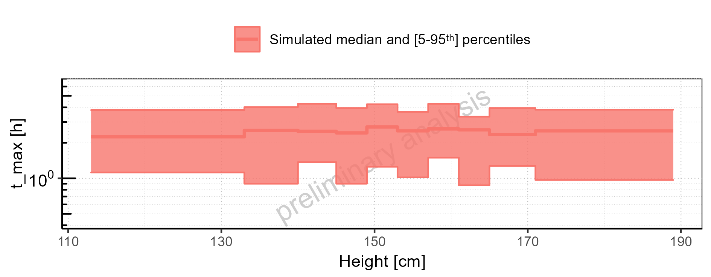

 
 

**Figure 2-64: Height-dependence of t_max for Larson 2013 8y-18y 400mg FCT meal. Profiles are plotted in a linear scale.**

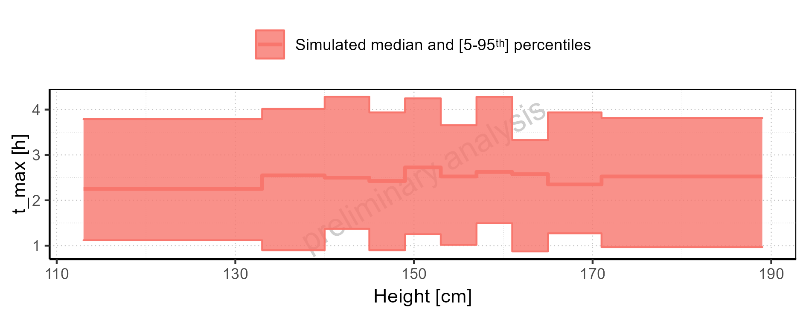

 
 

**Figure 2-65: Height-dependence of t_max for Filmcoated_tablet_400mg_sd. Profiles are plotted in a logarithmic scale.**

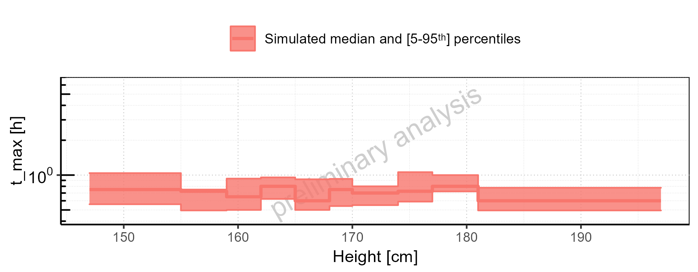

 
 

**Figure 2-66: Height-dependence of t_max for Filmcoated_tablet_400mg_sd. Profiles are plotted in a linear scale.**

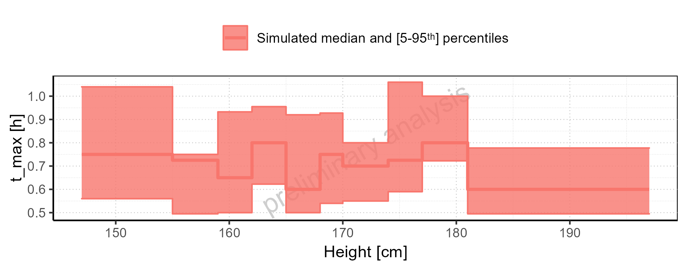

 
 

**Figure 2-67: Weight-dependence of t_max for Larson 2013 8y-18y 400mg FCT meal in comparison to Filmcoated_tablet_400mg_sd. Profiles are plotted in a logarithmic scale.**

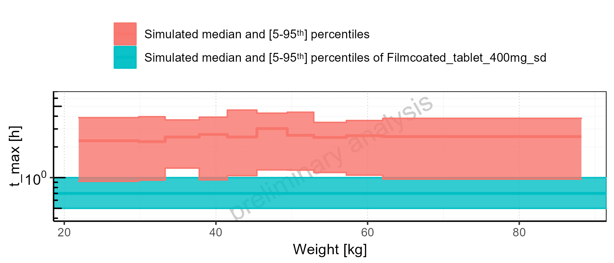

 
 

**Figure 2-68: Weight-dependence of t_max for Larson 2013 8y-18y 400mg FCT meal in comparison to Filmcoated_tablet_400mg_sd. Profiles are plotted in a linear scale.**

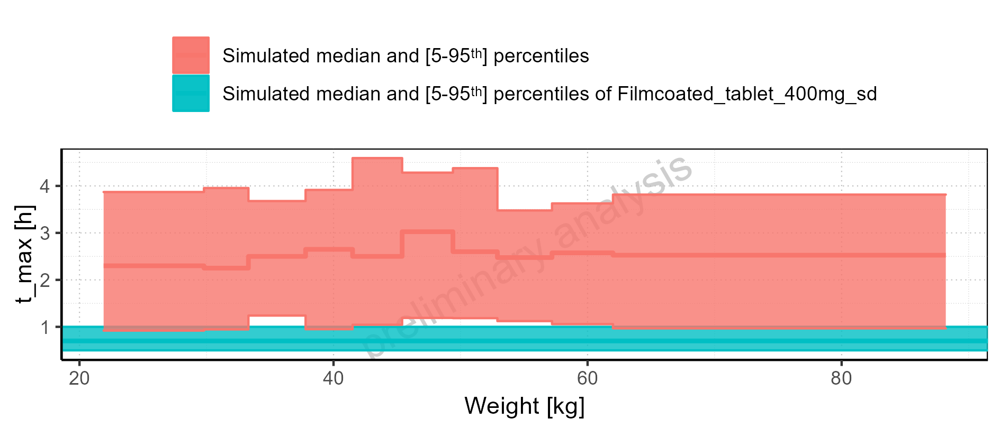

 
 

**Figure 2-69: Weight-dependence of t_max for Larson 2013 8y-18y 400mg FCT meal. Profiles are plotted in a logarithmic scale.**

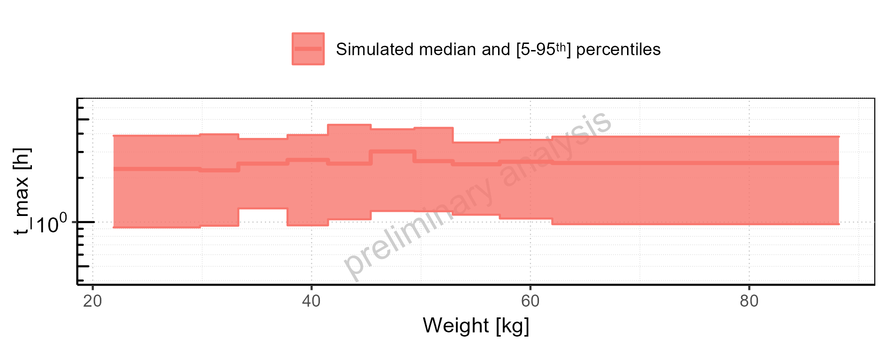

 
 

**Figure 2-70: Weight-dependence of t_max for Larson 2013 8y-18y 400mg FCT meal. Profiles are plotted in a linear scale.**

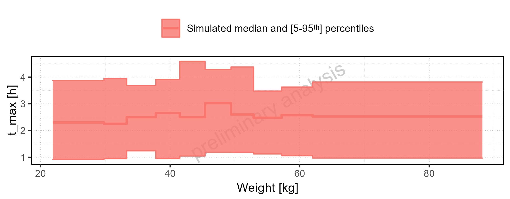

 
 

**Figure 2-71: Weight-dependence of t_max for Filmcoated_tablet_400mg_sd. Profiles are plotted in a logarithmic scale.**

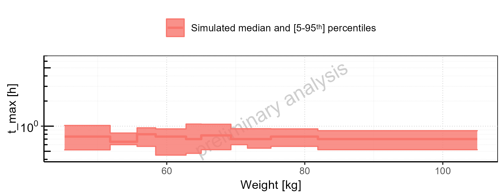

 
 

**Figure 2-72: Weight-dependence of t_max for Filmcoated_tablet_400mg_sd. Profiles are plotted in a linear scale.**

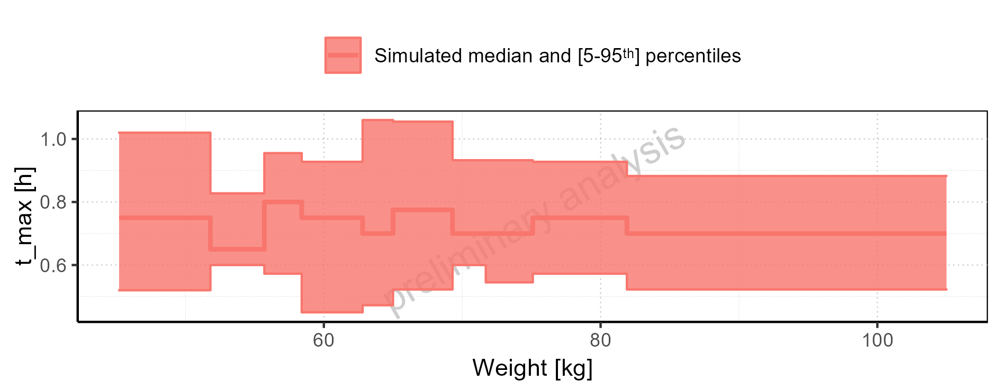

 
 

**Figure 2-73: BMI-dependence of t_max for Larson 2013 8y-18y 400mg FCT meal in comparison to Filmcoated_tablet_400mg_sd. Profiles are plotted in a logarithmic scale.**

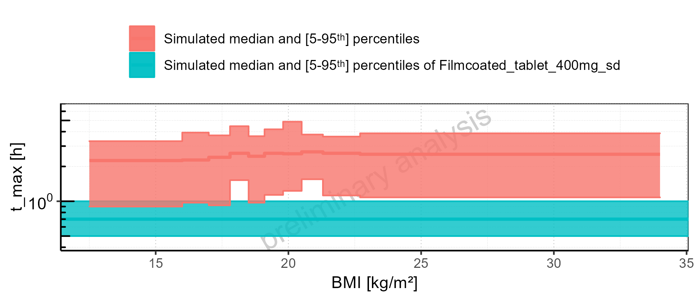

 
 

**Figure 2-74: BMI-dependence of t_max for Larson 2013 8y-18y 400mg FCT meal in comparison to Filmcoated_tablet_400mg_sd. Profiles are plotted in a linear scale.**

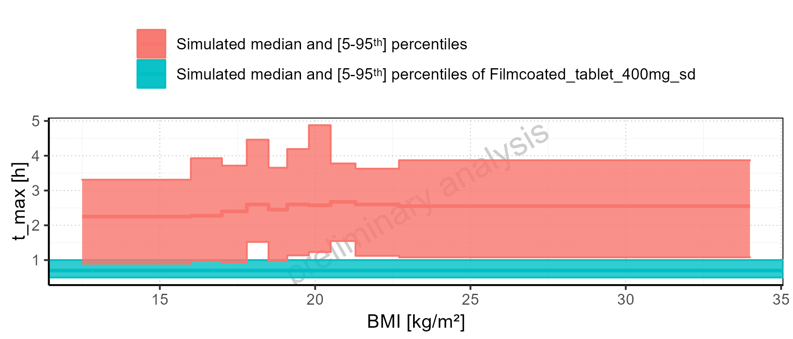

 
 

**Figure 2-75: BMI-dependence of t_max for Larson 2013 8y-18y 400mg FCT meal. Profiles are plotted in a logarithmic scale.**

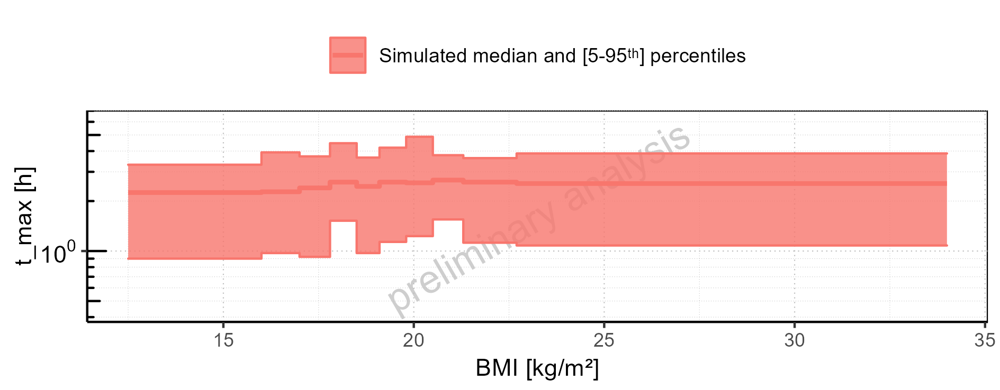

 
 

**Figure 2-76: BMI-dependence of t_max for Larson 2013 8y-18y 400mg FCT meal. Profiles are plotted in a linear scale.**

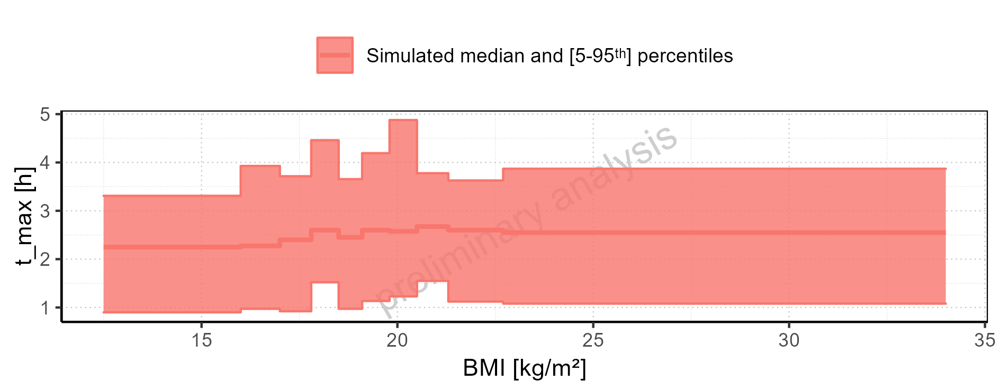

 
 

**Figure 2-77: BMI-dependence of t_max for Filmcoated_tablet_400mg_sd. Profiles are plotted in a logarithmic scale.**

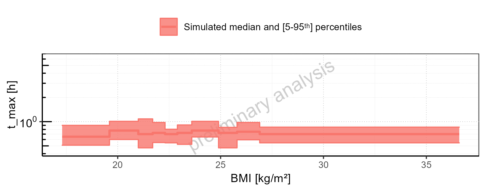

 
 

**Figure 2-78: BMI-dependence of t_max for Filmcoated_tablet_400mg_sd. Profiles are plotted in a linear scale.**

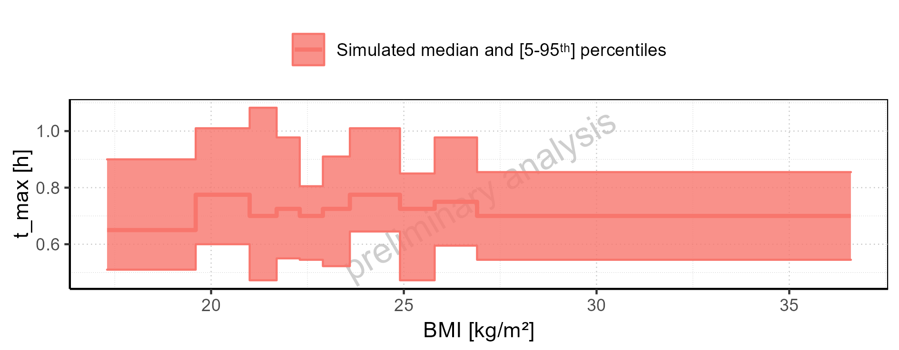

 
 

### 2.1.4 C_tEnd

**Figure 2-79: C_tEnd of Raltegravir for Larson 2013 8y-18y 400mg FCT meal, Filmcoated_tablet_400mg_sd shown as box-whisker plot, which indicates the 5<U+1D57><U+02B0>, 25<U+1D57><U+02B0>, 50<U+1D57><U+02B0>, 75<U+1D57><U+02B0>, 95<U+1D57><U+02B0> percentiles in logarithmic scale.**

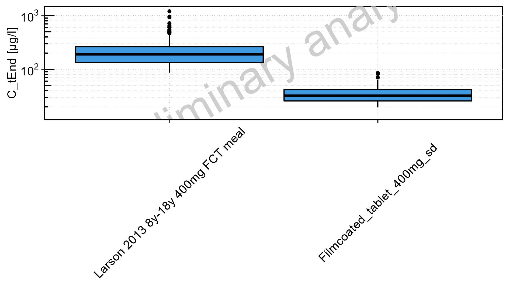

 
 

**Figure 2-80: C_tEnd of Raltegravir for Larson 2013 8y-18y 400mg FCT meal, Filmcoated_tablet_400mg_sd shown as box-whisker plot, which indicates the 5<U+1D57><U+02B0>, 25<U+1D57><U+02B0>, 50<U+1D57><U+02B0>, 75<U+1D57><U+02B0>, 95<U+1D57><U+02B0> percentiles in linear scale.**

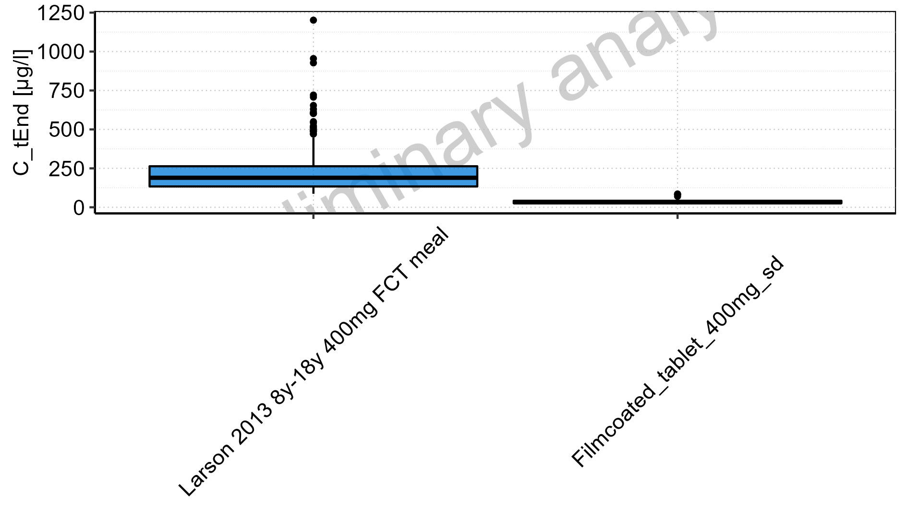

 
 

**Table 2-4: C_tEnd of Raltegravir for Larson 2013 8y-18y 400mg FCT meal, Filmcoated_tablet_400mg_sd reported in [µg/l]**

|Population                        |N   |5<U+1D57><U+02B0> pctl |25<U+1D57><U+02B0> pctl |50<U+1D57><U+02B0> pctl |75<U+1D57><U+02B0> pctl |95<U+1D57><U+02B0> pctl |Mean   |SD     |Geo Mean |Geo SD |
|:---------------------------------|:---|:----------------------|:-----------------------|:-----------------------|:-----------------------|:-----------------------|:------|:------|:--------|:------|
|Larson 2013 8y-18y 400mg FCT meal |500 |86.63                  |133.65                  |189.56                  |263.51                  |448.02                  |218.90 |129.12 |191.12   |1.67   |
|Filmcoated_tablet_400mg_sd        |100 |19.57                  |25.80                   |32.35                   |41.91                   |62.68                   |35.39  |14.21  |33.01    |1.44   |

 
 

**Figure 2-81: Age-dependence of C_tEnd for Larson 2013 8y-18y 400mg FCT meal in comparison to Filmcoated_tablet_400mg_sd. Profiles are plotted in a logarithmic scale.**

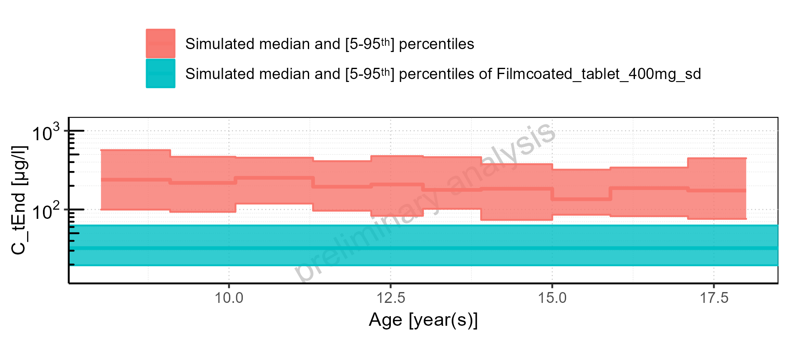

 
 

**Figure 2-82: Age-dependence of C_tEnd for Larson 2013 8y-18y 400mg FCT meal in comparison to Filmcoated_tablet_400mg_sd. Profiles are plotted in a linear scale.**

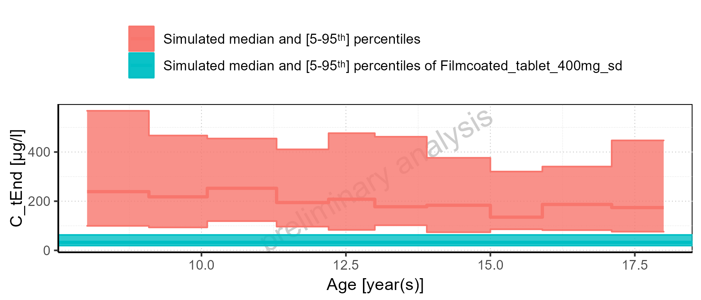

 
 

**Figure 2-83: Age-dependence of C_tEnd for Larson 2013 8y-18y 400mg FCT meal. Profiles are plotted in a logarithmic scale.**

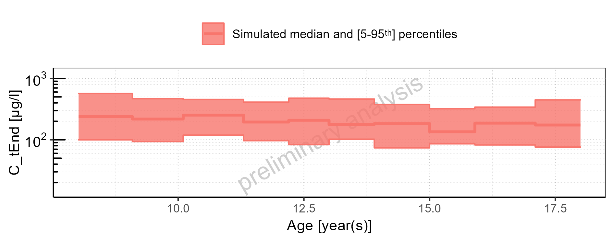

 
 

**Figure 2-84: Age-dependence of C_tEnd for Larson 2013 8y-18y 400mg FCT meal. Profiles are plotted in a linear scale.**

 
 

**Figure 2-85: Age-dependence of C_tEnd for Filmcoated_tablet_400mg_sd. Profiles are plotted in a logarithmic scale.**

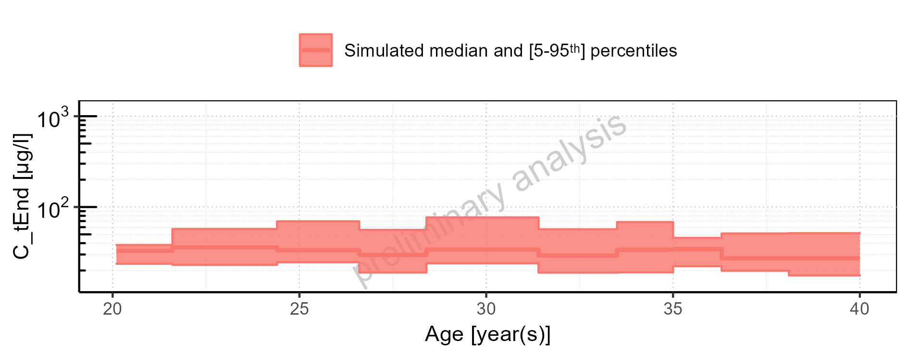

 
 

**Figure 2-86: Age-dependence of C_tEnd for Filmcoated_tablet_400mg_sd. Profiles are plotted in a linear scale.**

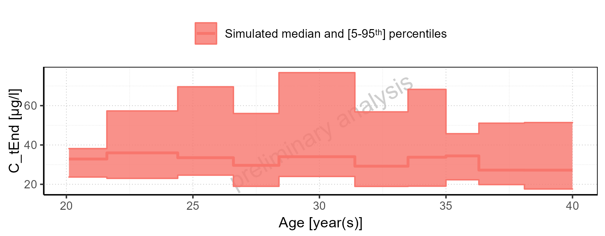

 
 

**Figure 2-87: Height-dependence of C_tEnd for Larson 2013 8y-18y 400mg FCT meal in comparison to Filmcoated_tablet_400mg_sd. Profiles are plotted in a logarithmic scale.**

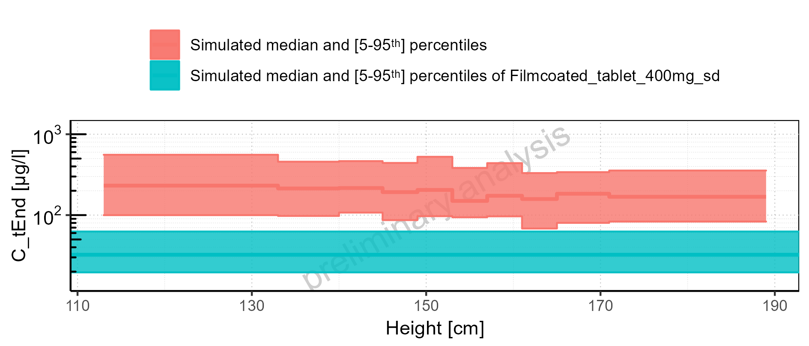

 
 

**Figure 2-88: Height-dependence of C_tEnd for Larson 2013 8y-18y 400mg FCT meal in comparison to Filmcoated_tablet_400mg_sd. Profiles are plotted in a linear scale.**

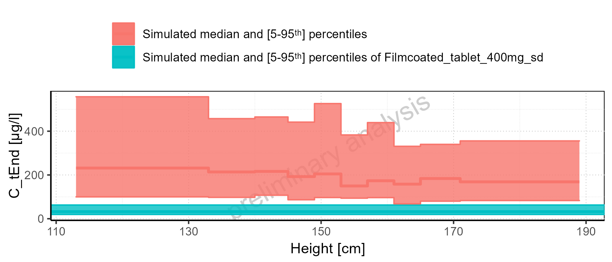

 
 

**Figure 2-89: Height-dependence of C_tEnd for Larson 2013 8y-18y 400mg FCT meal. Profiles are plotted in a logarithmic scale.**

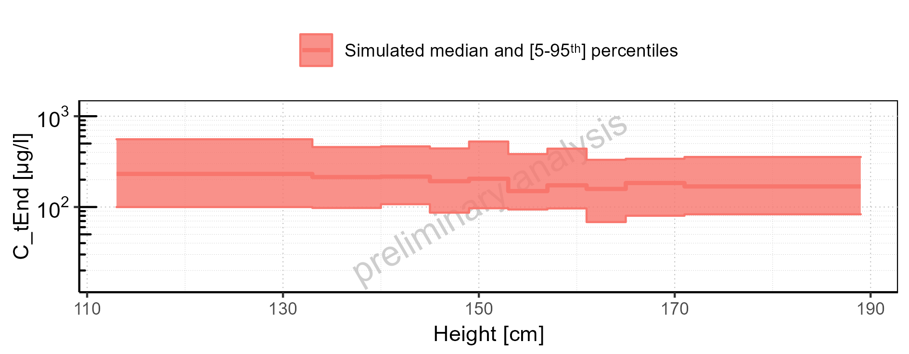

 
 

**Figure 2-90: Height-dependence of C_tEnd for Larson 2013 8y-18y 400mg FCT meal. Profiles are plotted in a linear scale.**

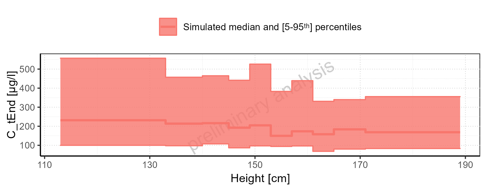

 
 

**Figure 2-91: Height-dependence of C_tEnd for Filmcoated_tablet_400mg_sd. Profiles are plotted in a logarithmic scale.**

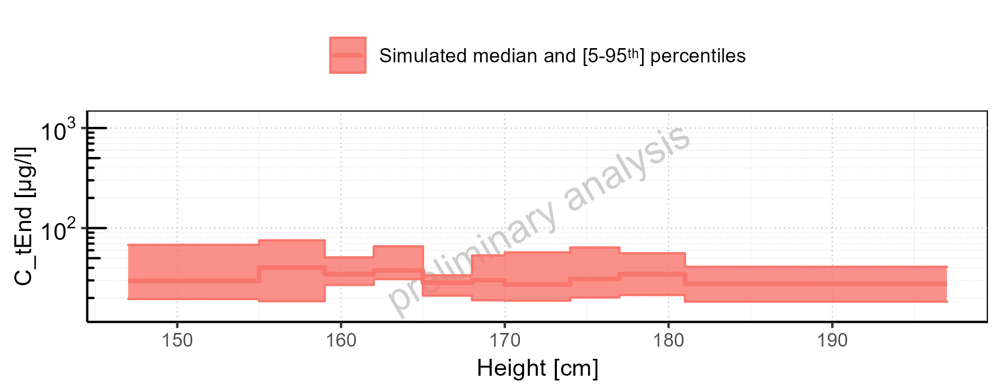

 
 

**Figure 2-92: Height-dependence of C_tEnd for Filmcoated_tablet_400mg_sd. Profiles are plotted in a linear scale.**

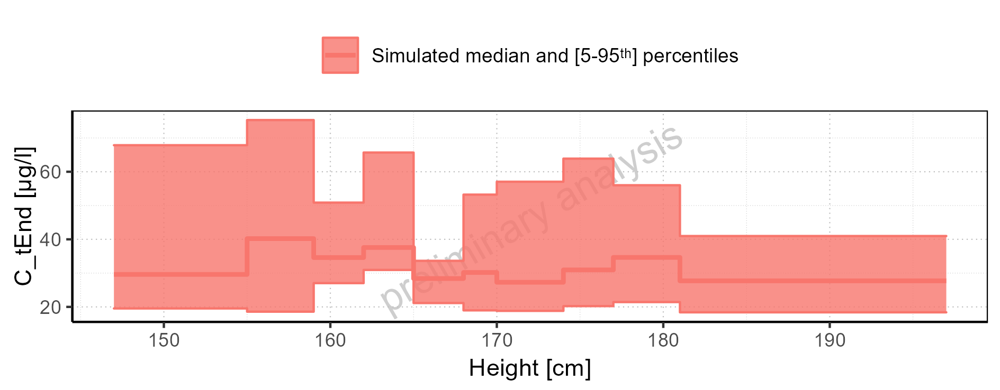

 
 

**Figure 2-93: Weight-dependence of C_tEnd for Larson 2013 8y-18y 400mg FCT meal in comparison to Filmcoated_tablet_400mg_sd. Profiles are plotted in a logarithmic scale.**

 
 

**Figure 2-94: Weight-dependence of C_tEnd for Larson 2013 8y-18y 400mg FCT meal in comparison to Filmcoated_tablet_400mg_sd. Profiles are plotted in a linear scale.**

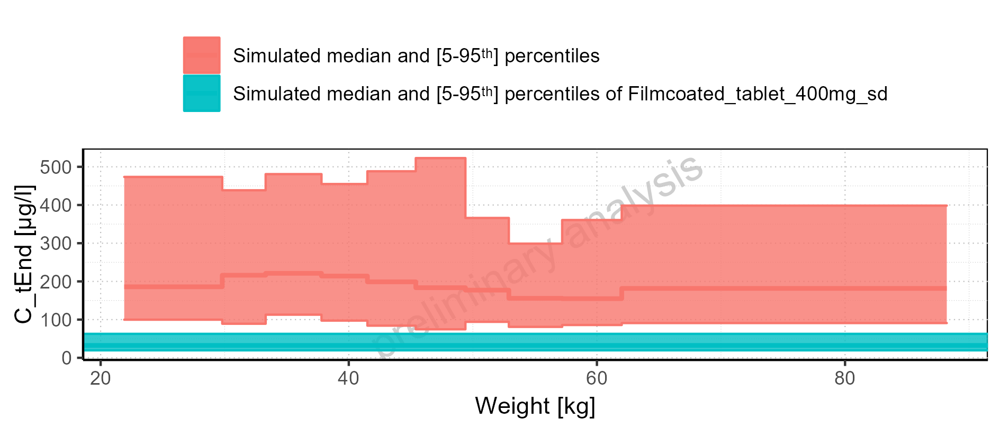

 
 

**Figure 2-95: Weight-dependence of C_tEnd for Larson 2013 8y-18y 400mg FCT meal. Profiles are plotted in a logarithmic scale.**

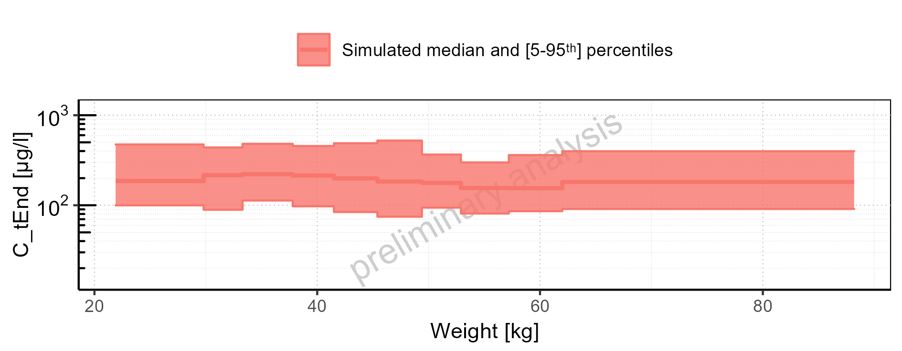

 
 

**Figure 2-96: Weight-dependence of C_tEnd for Larson 2013 8y-18y 400mg FCT meal. Profiles are plotted in a linear scale.**

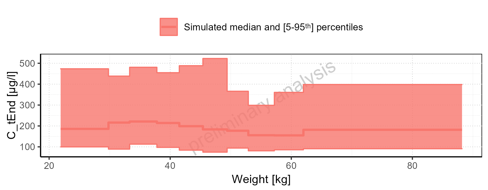

 
 

**Figure 2-97: Weight-dependence of C_tEnd for Filmcoated_tablet_400mg_sd. Profiles are plotted in a logarithmic scale.**

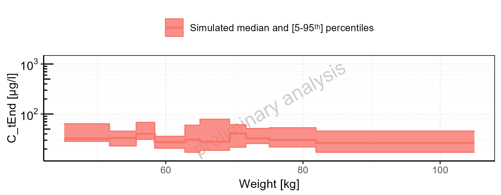

 
 

**Figure 2-98: Weight-dependence of C_tEnd for Filmcoated_tablet_400mg_sd. Profiles are plotted in a linear scale.**

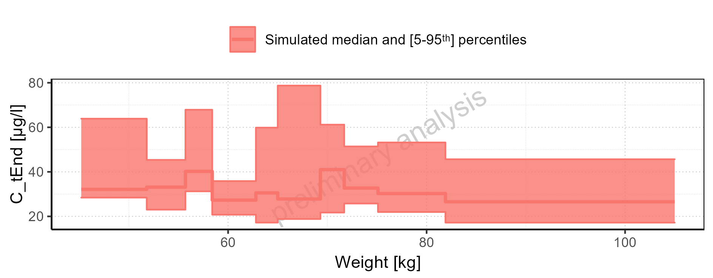

 
 

**Figure 2-99: BMI-dependence of C_tEnd for Larson 2013 8y-18y 400mg FCT meal in comparison to Filmcoated_tablet_400mg_sd. Profiles are plotted in a logarithmic scale.**

 
 

**Figure 2-100: BMI-dependence of C_tEnd for Larson 2013 8y-18y 400mg FCT meal in comparison to Filmcoated_tablet_400mg_sd. Profiles are plotted in a linear scale.**

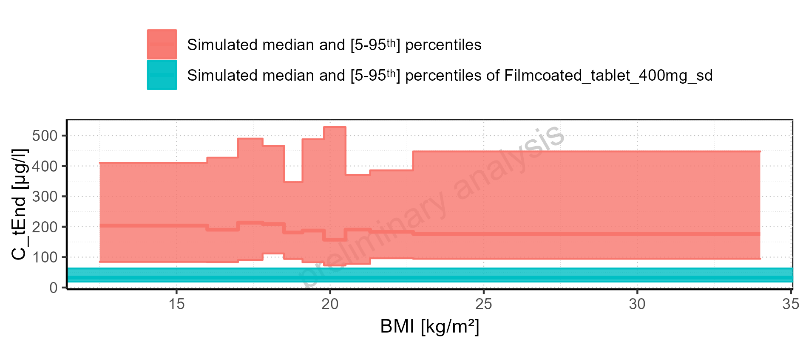

 
 

**Figure 2-101: BMI-dependence of C_tEnd for Larson 2013 8y-18y 400mg FCT meal. Profiles are plotted in a logarithmic scale.**

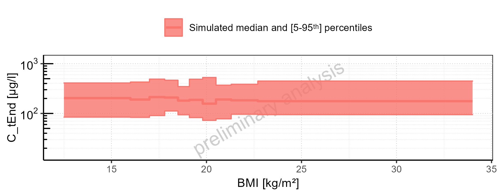

 
 

**Figure 2-102: BMI-dependence of C_tEnd for Larson 2013 8y-18y 400mg FCT meal. Profiles are plotted in a linear scale.**

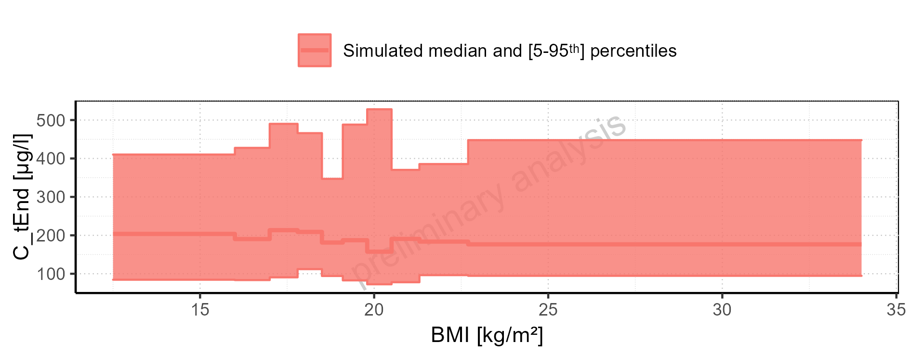

 
 

**Figure 2-103: BMI-dependence of C_tEnd for Filmcoated_tablet_400mg_sd. Profiles are plotted in a logarithmic scale.**

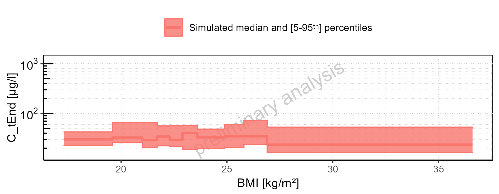

 
 

**Figure 2-104: BMI-dependence of C_tEnd for Filmcoated_tablet_400mg_sd. Profiles are plotted in a linear scale.**

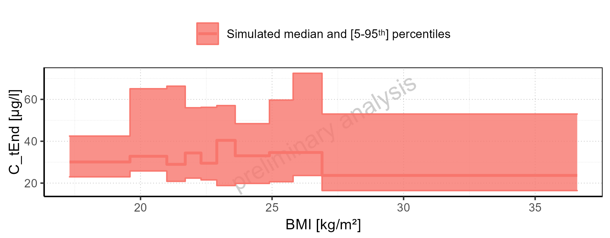

 
 

### 2.1.5 AUC

**Figure 2-105: AUC of Raltegravir for Larson 2013 8y-18y 400mg FCT meal, Filmcoated_tablet_400mg_sd shown as box-whisker plot, which indicates the 5<U+1D57><U+02B0>, 25<U+1D57><U+02B0>, 50<U+1D57><U+02B0>, 75<U+1D57><U+02B0>, 95<U+1D57><U+02B0> percentiles in logarithmic scale.**

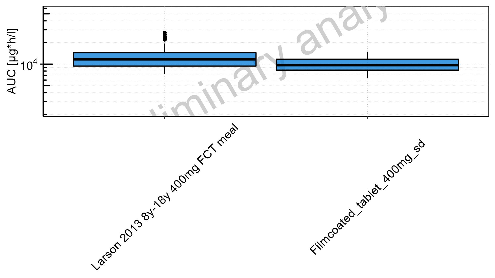

 
 

**Figure 2-106: AUC of Raltegravir for Larson 2013 8y-18y 400mg FCT meal, Filmcoated_tablet_400mg_sd shown as box-whisker plot, which indicates the 5<U+1D57><U+02B0>, 25<U+1D57><U+02B0>, 50<U+1D57><U+02B0>, 75<U+1D57><U+02B0>, 95<U+1D57><U+02B0> percentiles in linear scale.**

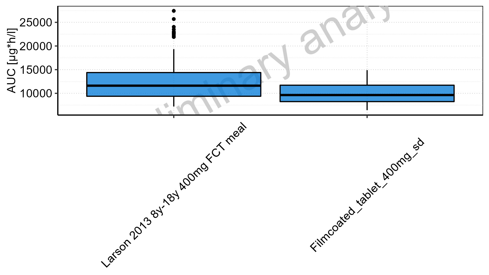

 
 

**Table 2-5: AUC of Raltegravir for Larson 2013 8y-18y 400mg FCT meal, Filmcoated_tablet_400mg_sd reported in [µg*h/l]**

|Population                        |N   |5<U+1D57><U+02B0> pctl |25<U+1D57><U+02B0> pctl |50<U+1D57><U+02B0> pctl |75<U+1D57><U+02B0> pctl |95<U+1D57><U+02B0> pctl |Mean     |SD      |Geo Mean |Geo SD |
|:---------------------------------|:---|:----------------------|:-----------------------|:-----------------------|:-----------------------|:-----------------------|:--------|:-------|:--------|:------|
|Larson 2013 8y-18y 400mg FCT meal |500 |7207.27                |9378.92                 |11615.20                |14388.94                |19343.22                |12199.86 |3756.55 |11656.08 |1.35   |
|Filmcoated_tablet_400mg_sd        |100 |6449.27                |8248.74                 |9637.50                 |11717.00                |14901.10                |10129.70 |2672.29 |9784.56  |1.31   |

 
 

**Figure 2-107: Age-dependence of AUC for Larson 2013 8y-18y 400mg FCT meal in comparison to Filmcoated_tablet_400mg_sd. Profiles are plotted in a logarithmic scale.**

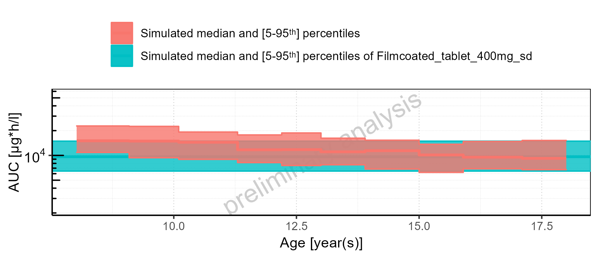

 
 

**Figure 2-108: Age-dependence of AUC for Larson 2013 8y-18y 400mg FCT meal in comparison to Filmcoated_tablet_400mg_sd. Profiles are plotted in a linear scale.**

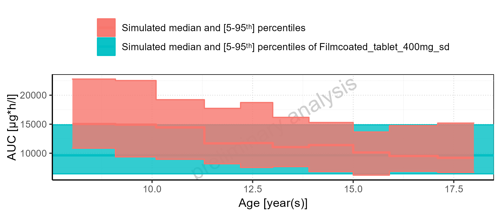

 
 

**Figure 2-109: Age-dependence of AUC for Larson 2013 8y-18y 400mg FCT meal. Profiles are plotted in a logarithmic scale.**

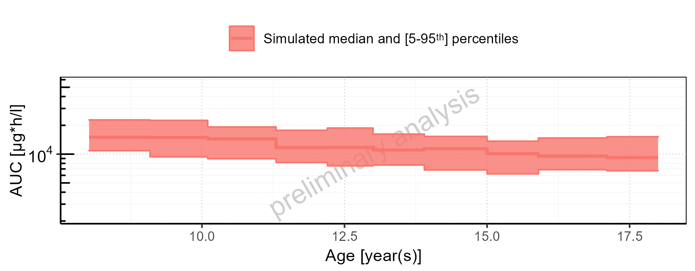

 
 

**Figure 2-110: Age-dependence of AUC for Larson 2013 8y-18y 400mg FCT meal. Profiles are plotted in a linear scale.**

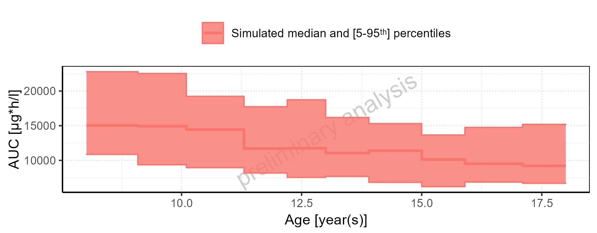

 
 

**Figure 2-111: Age-dependence of AUC for Filmcoated_tablet_400mg_sd. Profiles are plotted in a logarithmic scale.**

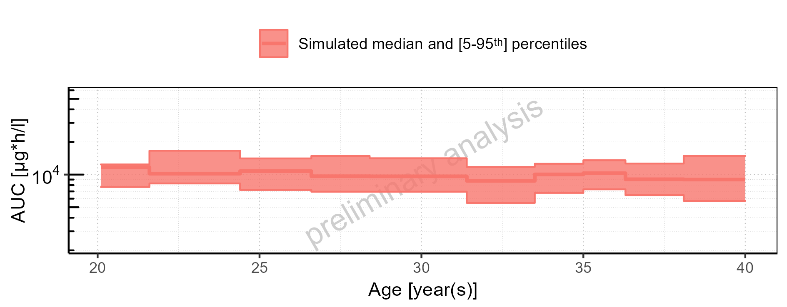

 
 

**Figure 2-112: Age-dependence of AUC for Filmcoated_tablet_400mg_sd. Profiles are plotted in a linear scale.**

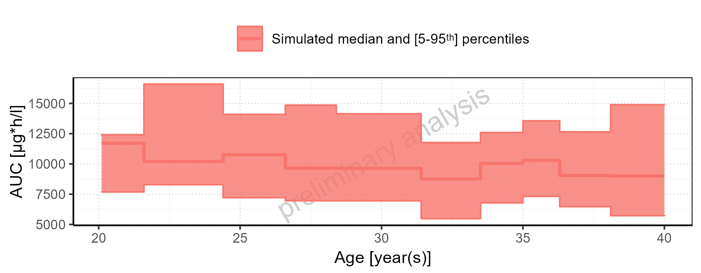

 
 

**Figure 2-113: Height-dependence of AUC for Larson 2013 8y-18y 400mg FCT meal in comparison to Filmcoated_tablet_400mg_sd. Profiles are plotted in a logarithmic scale.**

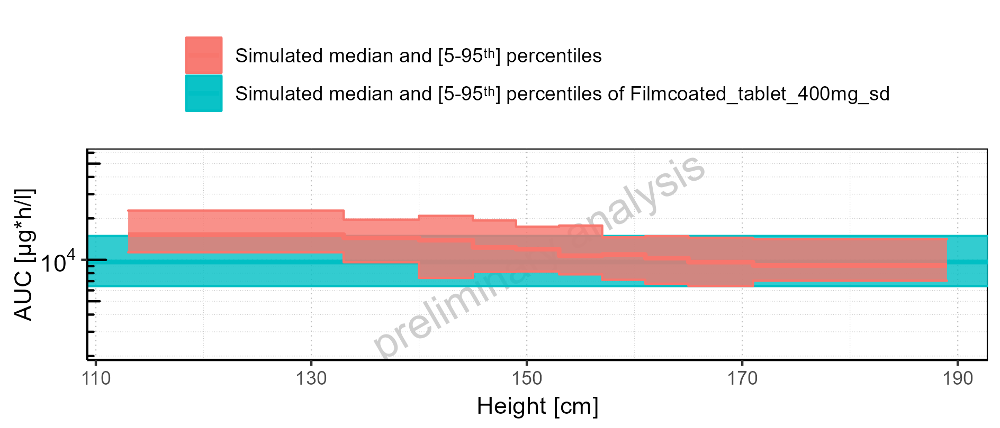

 
 

**Figure 2-114: Height-dependence of AUC for Larson 2013 8y-18y 400mg FCT meal in comparison to Filmcoated_tablet_400mg_sd. Profiles are plotted in a linear scale.**

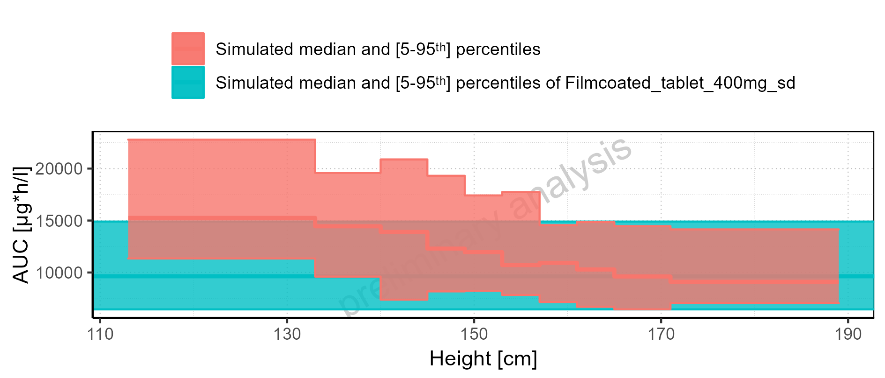

 
 

**Figure 2-115: Height-dependence of AUC for Larson 2013 8y-18y 400mg FCT meal. Profiles are plotted in a logarithmic scale.**

 
 

**Figure 2-116: Height-dependence of AUC for Larson 2013 8y-18y 400mg FCT meal. Profiles are plotted in a linear scale.**

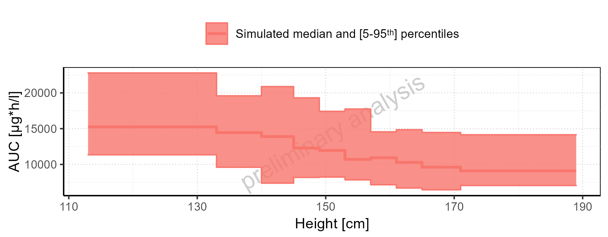

 
 

**Figure 2-117: Height-dependence of AUC for Filmcoated_tablet_400mg_sd. Profiles are plotted in a logarithmic scale.**

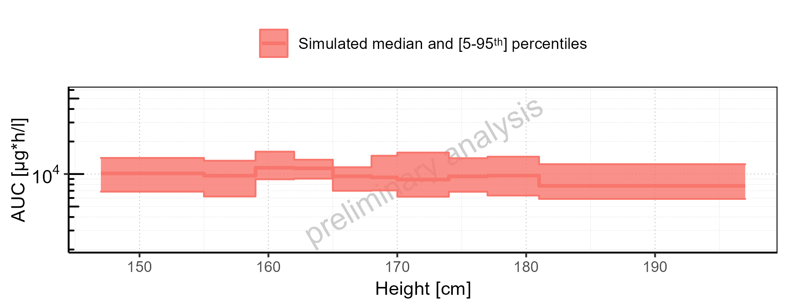

 
 

**Figure 2-118: Height-dependence of AUC for Filmcoated_tablet_400mg_sd. Profiles are plotted in a linear scale.**

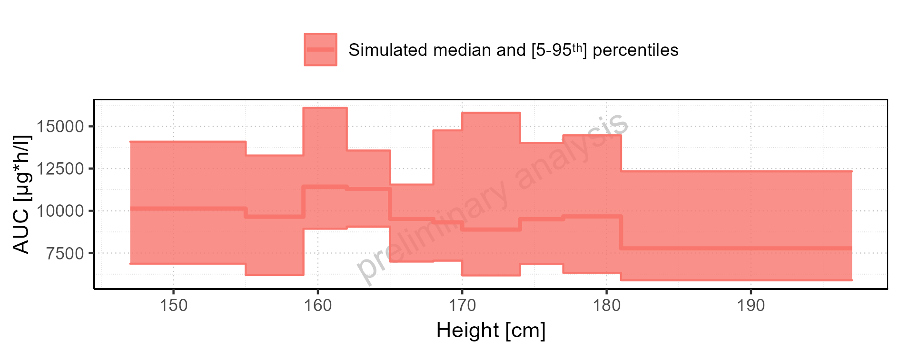

 
 

**Figure 2-119: Weight-dependence of AUC for Larson 2013 8y-18y 400mg FCT meal in comparison to Filmcoated_tablet_400mg_sd. Profiles are plotted in a logarithmic scale.**

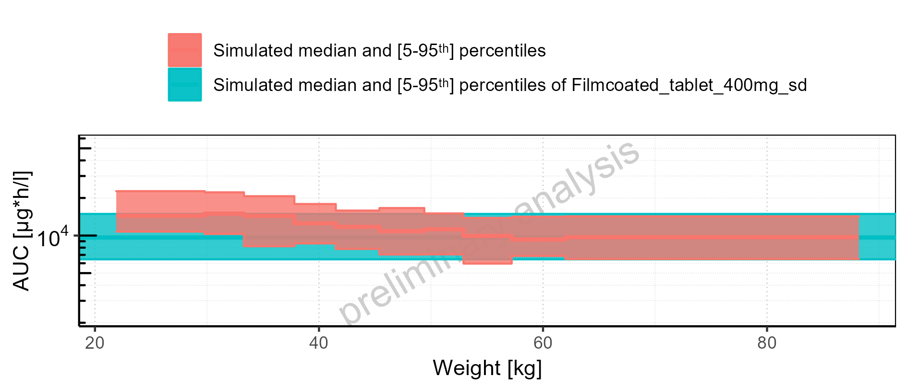

 
 

**Figure 2-120: Weight-dependence of AUC for Larson 2013 8y-18y 400mg FCT meal in comparison to Filmcoated_tablet_400mg_sd. Profiles are plotted in a linear scale.**

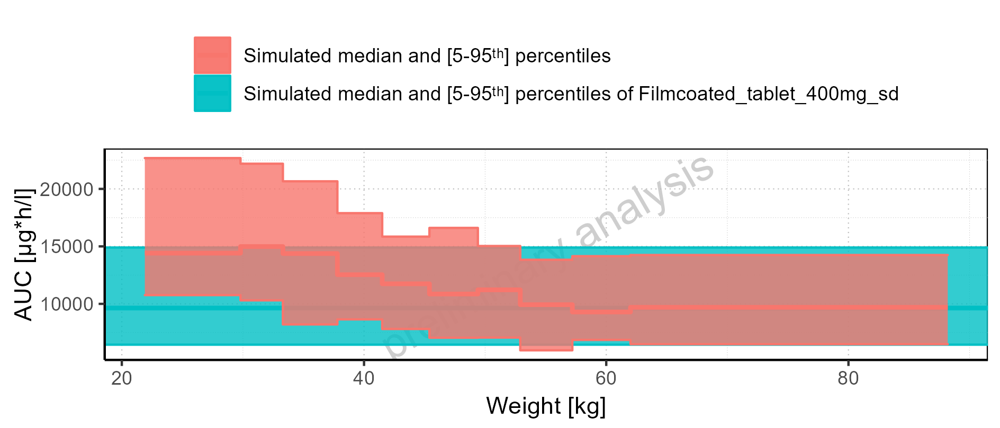

 
 

**Figure 2-121: Weight-dependence of AUC for Larson 2013 8y-18y 400mg FCT meal. Profiles are plotted in a logarithmic scale.**

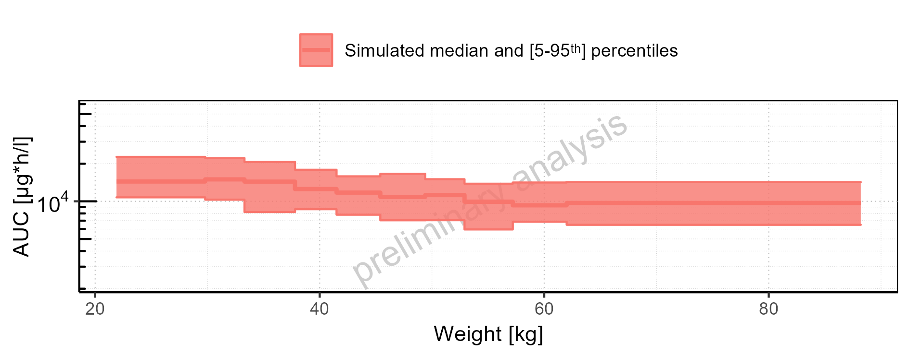

 
 

**Figure 2-122: Weight-dependence of AUC for Larson 2013 8y-18y 400mg FCT meal. Profiles are plotted in a linear scale.**

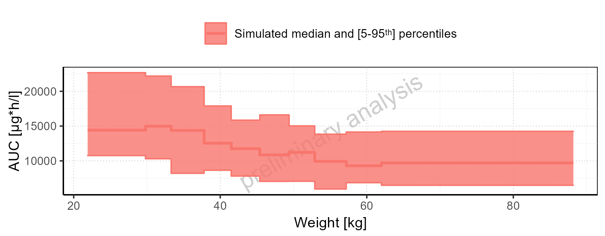

 
 

**Figure 2-123: Weight-dependence of AUC for Filmcoated_tablet_400mg_sd. Profiles are plotted in a logarithmic scale.**

 
 

**Figure 2-124: Weight-dependence of AUC for Filmcoated_tablet_400mg_sd. Profiles are plotted in a linear scale.**

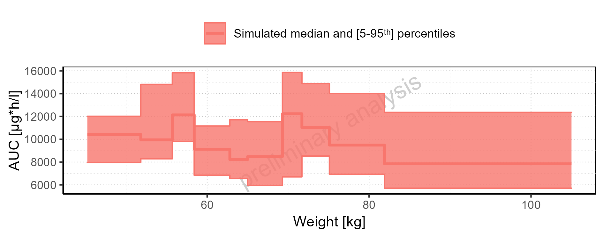

 
 

**Figure 2-125: BMI-dependence of AUC for Larson 2013 8y-18y 400mg FCT meal in comparison to Filmcoated_tablet_400mg_sd. Profiles are plotted in a logarithmic scale.**

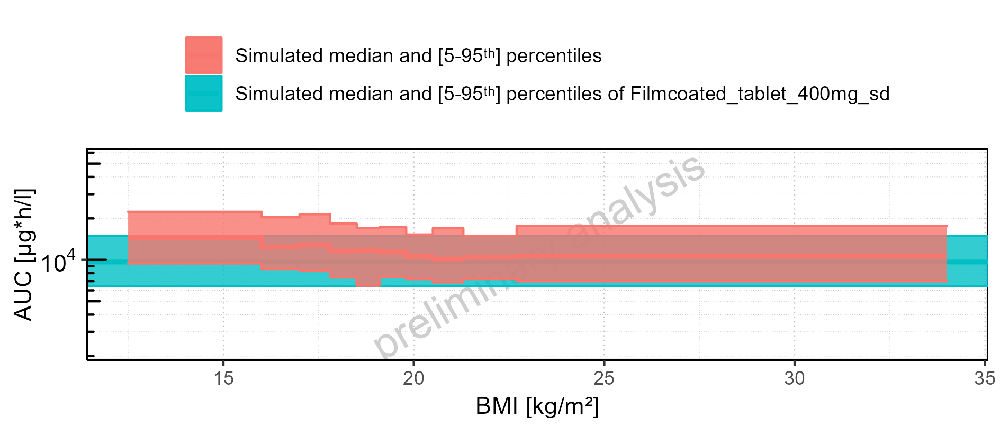

 
 

**Figure 2-126: BMI-dependence of AUC for Larson 2013 8y-18y 400mg FCT meal in comparison to Filmcoated_tablet_400mg_sd. Profiles are plotted in a linear scale.**

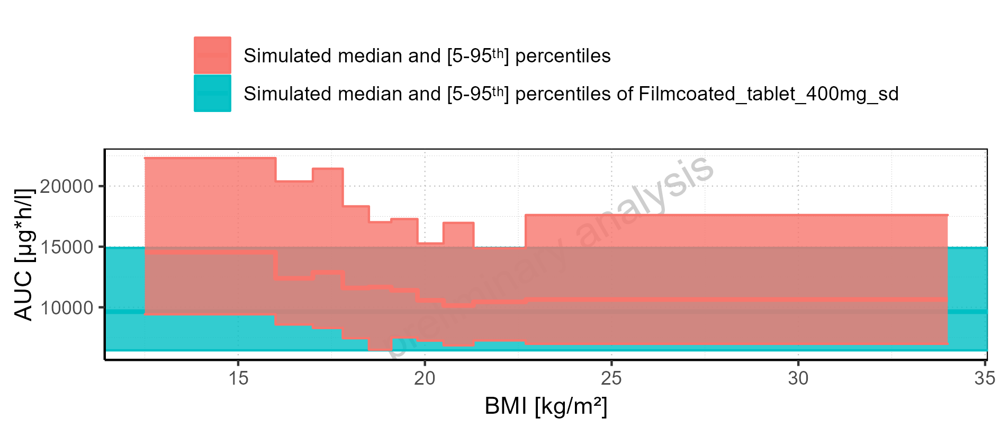

 
 

**Figure 2-127: BMI-dependence of AUC for Larson 2013 8y-18y 400mg FCT meal. Profiles are plotted in a logarithmic scale.**

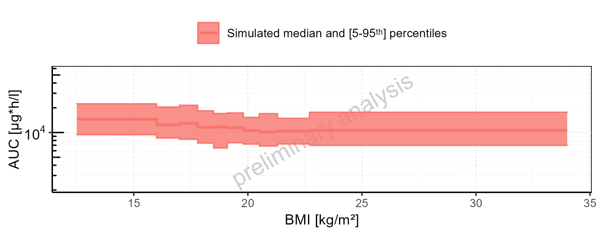

 
 

**Figure 2-128: BMI-dependence of AUC for Larson 2013 8y-18y 400mg FCT meal. Profiles are plotted in a linear scale.**

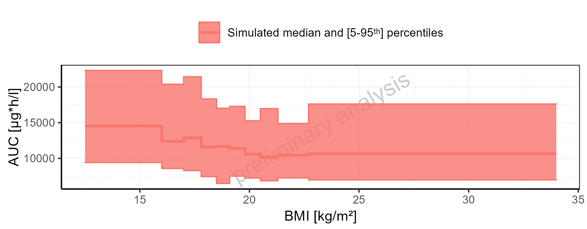

 
 

**Figure 2-129: BMI-dependence of AUC for Filmcoated_tablet_400mg_sd. Profiles are plotted in a logarithmic scale.**

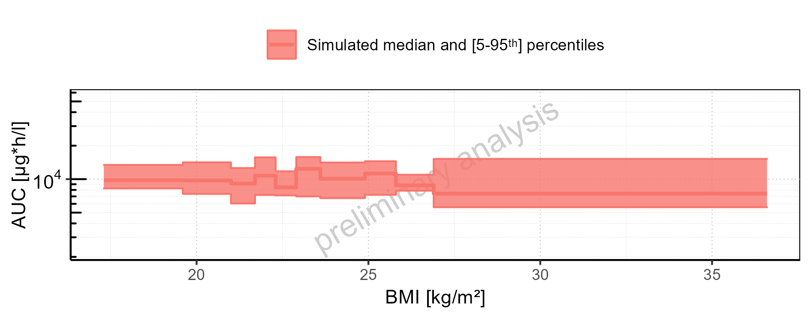

 
 

**Figure 2-130: BMI-dependence of AUC for Filmcoated_tablet_400mg_sd. Profiles are plotted in a linear scale.**

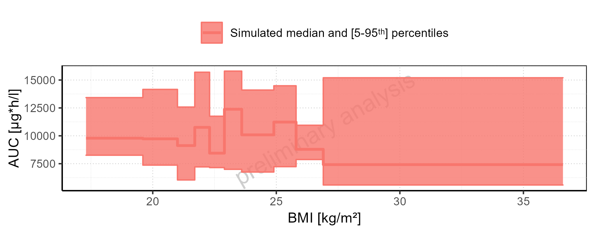

 
 

### 2.1.6 AUC_norm

**Figure 2-131: AUC_norm of Raltegravir for Larson 2013 8y-18y 400mg FCT meal, Filmcoated_tablet_400mg_sd shown as box-whisker plot, which indicates the 5<U+1D57><U+02B0>, 25<U+1D57><U+02B0>, 50<U+1D57><U+02B0>, 75<U+1D57><U+02B0>, 95<U+1D57><U+02B0> percentiles in logarithmic scale.**

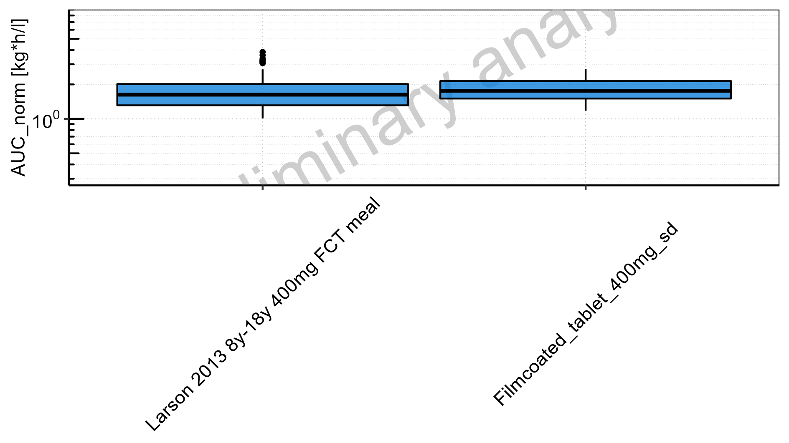

 
 

**Figure 2-132: AUC_norm of Raltegravir for Larson 2013 8y-18y 400mg FCT meal, Filmcoated_tablet_400mg_sd shown as box-whisker plot, which indicates the 5<U+1D57><U+02B0>, 25<U+1D57><U+02B0>, 50<U+1D57><U+02B0>, 75<U+1D57><U+02B0>, 95<U+1D57><U+02B0> percentiles in linear scale.**

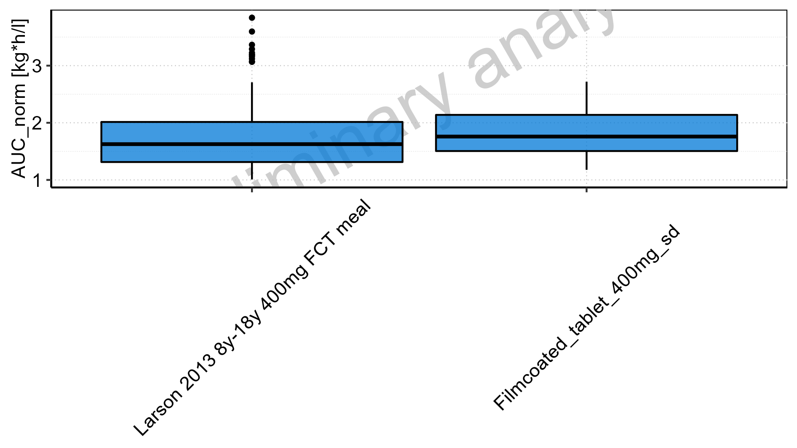

 
 

**Table 2-6: AUC_norm of Raltegravir for Larson 2013 8y-18y 400mg FCT meal, Filmcoated_tablet_400mg_sd reported in [kg*h/l]**

|Population                        |N   |5<U+1D57><U+02B0> pctl |25<U+1D57><U+02B0> pctl |50<U+1D57><U+02B0> pctl |75<U+1D57><U+02B0> pctl |95<U+1D57><U+02B0> pctl |Mean |SD   |Geo Mean |Geo SD |
|:---------------------------------|:---|:----------------------|:-----------------------|:-----------------------|:-----------------------|:-----------------------|:----|:----|:--------|:------|
|Larson 2013 8y-18y 400mg FCT meal |500 |1.01                   |1.31                    |1.63                    |2.01                    |2.71                    |1.71 |0.53 |1.63     |1.35   |
|Filmcoated_tablet_400mg_sd        |100 |1.18                   |1.51                    |1.76                    |2.14                    |2.72                    |1.85 |0.49 |1.79     |1.31   |

 
 

**Figure 2-133: Age-dependence of AUC_norm for Larson 2013 8y-18y 400mg FCT meal in comparison to Filmcoated_tablet_400mg_sd. Profiles are plotted in a logarithmic scale.**

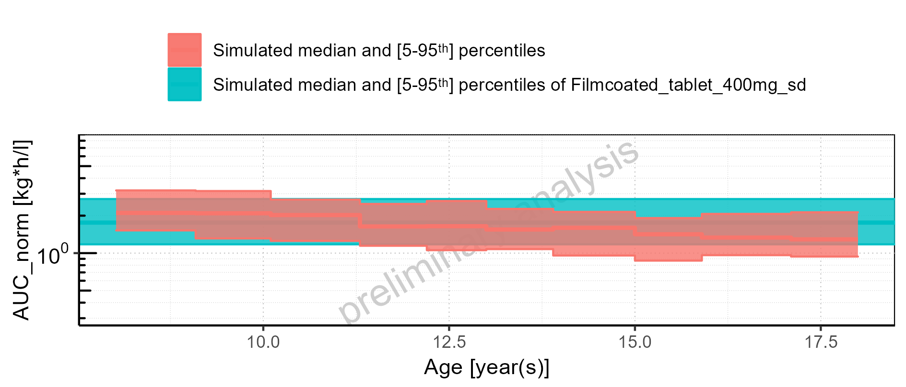

 
 

**Figure 2-134: Age-dependence of AUC_norm for Larson 2013 8y-18y 400mg FCT meal in comparison to Filmcoated_tablet_400mg_sd. Profiles are plotted in a linear scale.**

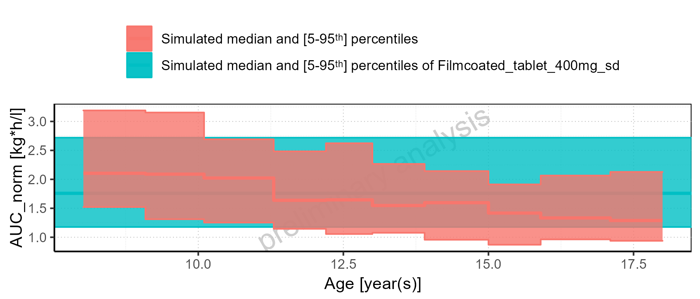

 
 

**Figure 2-135: Age-dependence of AUC_norm for Larson 2013 8y-18y 400mg FCT meal. Profiles are plotted in a logarithmic scale.**

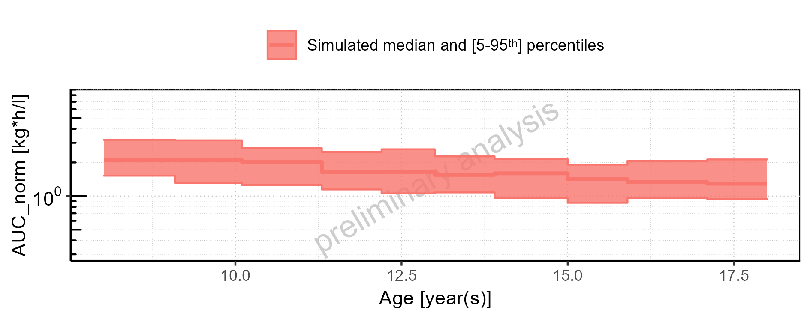

 
 

**Figure 2-136: Age-dependence of AUC_norm for Larson 2013 8y-18y 400mg FCT meal. Profiles are plotted in a linear scale.**

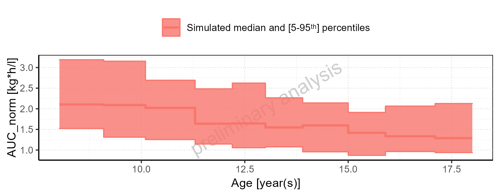

 
 

**Figure 2-137: Age-dependence of AUC_norm for Filmcoated_tablet_400mg_sd. Profiles are plotted in a logarithmic scale.**

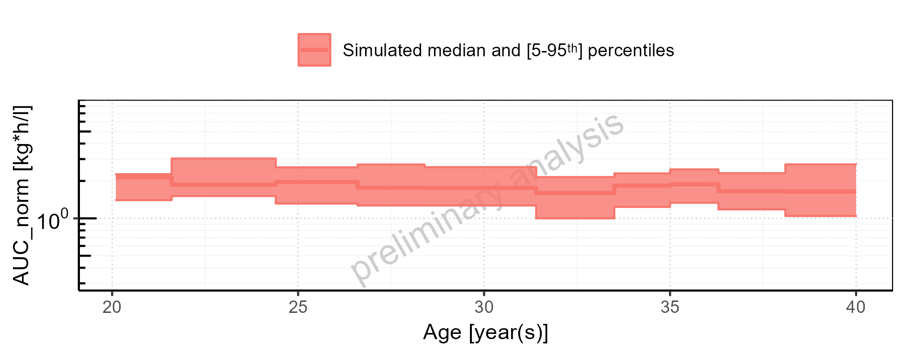

 
 

**Figure 2-138: Age-dependence of AUC_norm for Filmcoated_tablet_400mg_sd. Profiles are plotted in a linear scale.**

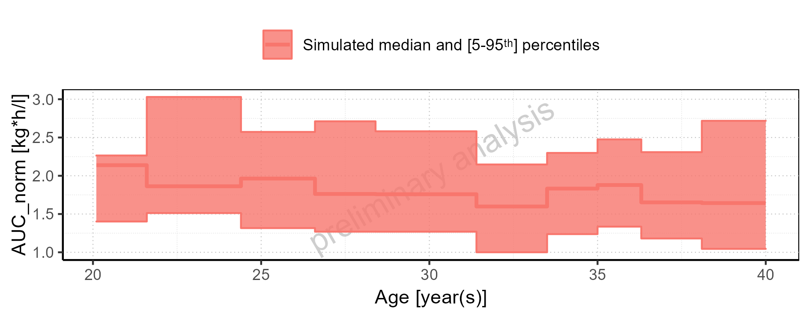

 
 

**Figure 2-139: Height-dependence of AUC_norm for Larson 2013 8y-18y 400mg FCT meal in comparison to Filmcoated_tablet_400mg_sd. Profiles are plotted in a logarithmic scale.**

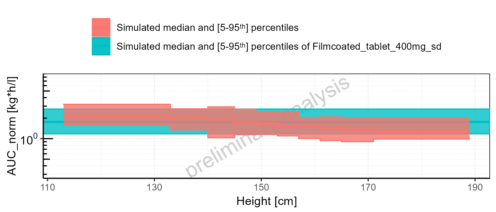

 
 

**Figure 2-140: Height-dependence of AUC_norm for Larson 2013 8y-18y 400mg FCT meal in comparison to Filmcoated_tablet_400mg_sd. Profiles are plotted in a linear scale.**

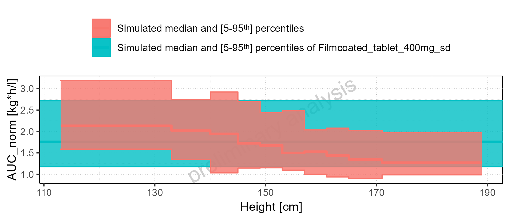

 
 

**Figure 2-141: Height-dependence of AUC_norm for Larson 2013 8y-18y 400mg FCT meal. Profiles are plotted in a logarithmic scale.**

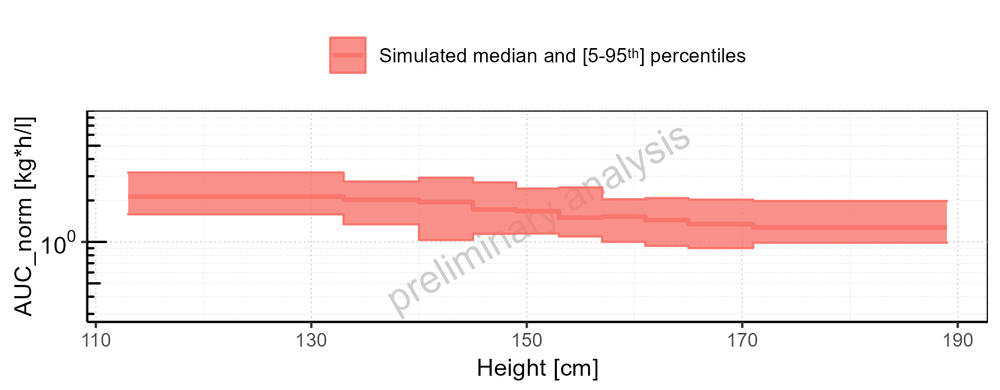

 
 

**Figure 2-142: Height-dependence of AUC_norm for Larson 2013 8y-18y 400mg FCT meal. Profiles are plotted in a linear scale.**

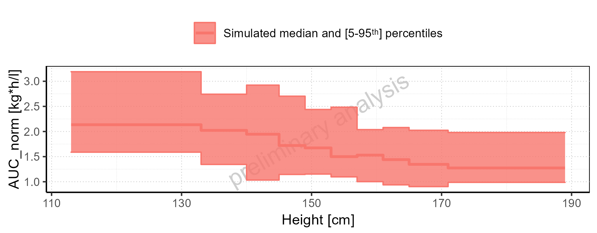

 
 

**Figure 2-143: Height-dependence of AUC_norm for Filmcoated_tablet_400mg_sd. Profiles are plotted in a logarithmic scale.**

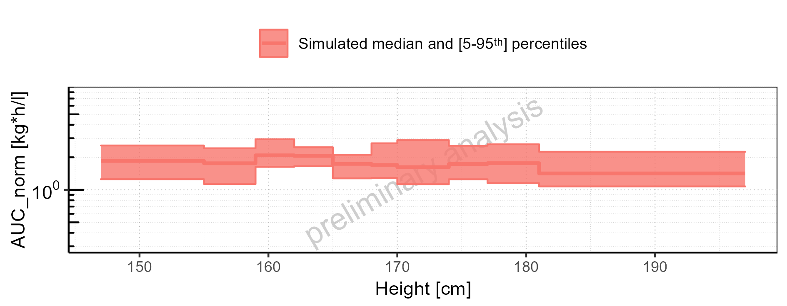

 
 

**Figure 2-144: Height-dependence of AUC_norm for Filmcoated_tablet_400mg_sd. Profiles are plotted in a linear scale.**

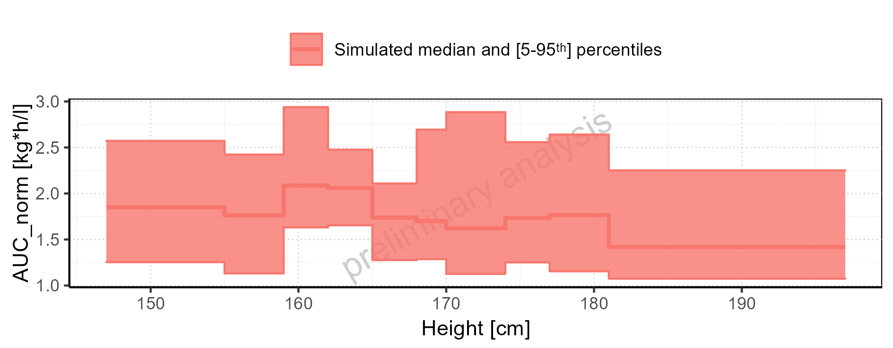

 
 

**Figure 2-145: Weight-dependence of AUC_norm for Larson 2013 8y-18y 400mg FCT meal in comparison to Filmcoated_tablet_400mg_sd. Profiles are plotted in a logarithmic scale.**

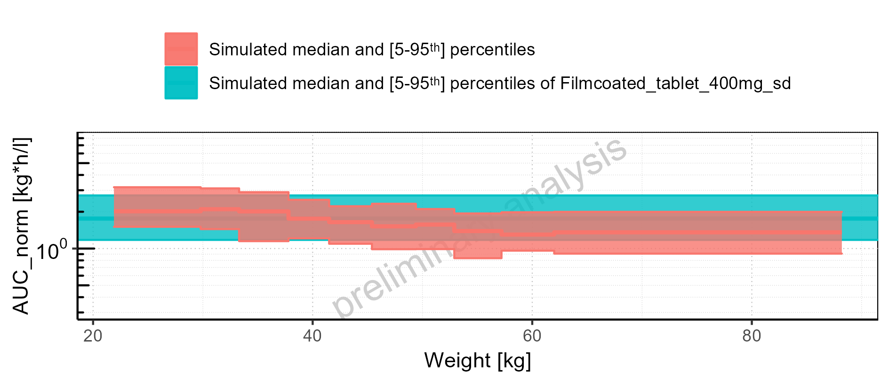

 
 

**Figure 2-146: Weight-dependence of AUC_norm for Larson 2013 8y-18y 400mg FCT meal in comparison to Filmcoated_tablet_400mg_sd. Profiles are plotted in a linear scale.**

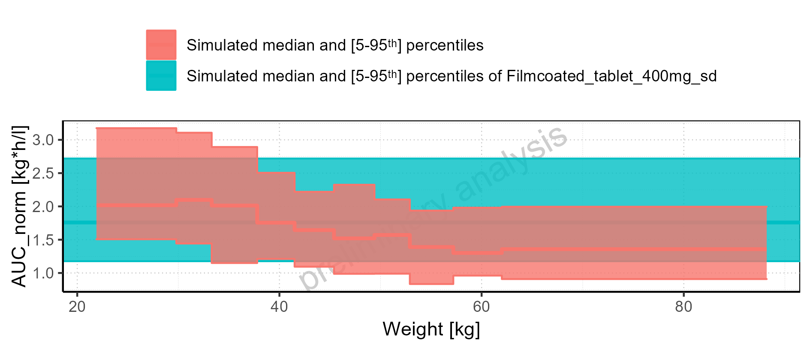

 
 

**Figure 2-147: Weight-dependence of AUC_norm for Larson 2013 8y-18y 400mg FCT meal. Profiles are plotted in a logarithmic scale.**

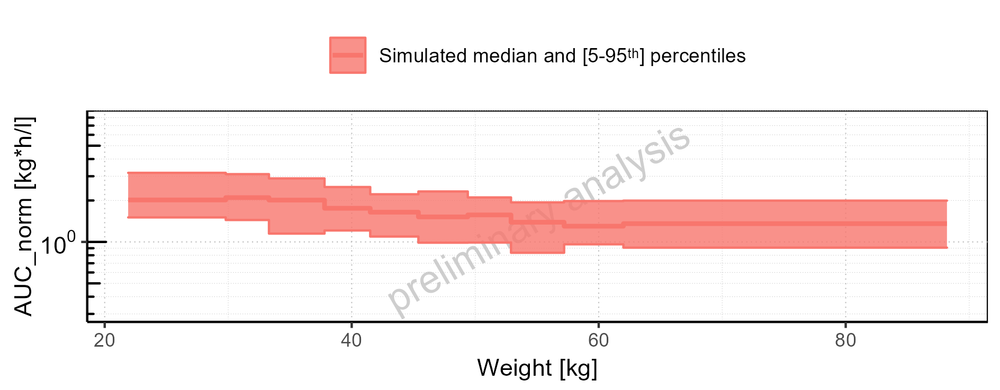

 
 

**Figure 2-148: Weight-dependence of AUC_norm for Larson 2013 8y-18y 400mg FCT meal. Profiles are plotted in a linear scale.**

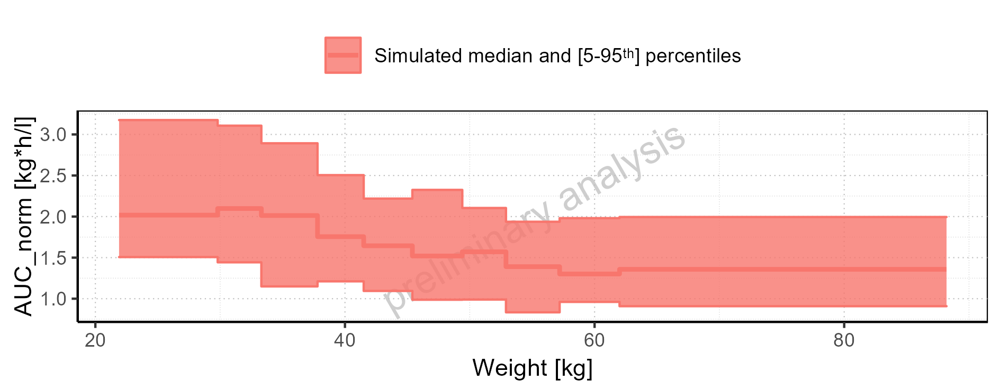

 
 

**Figure 2-149: Weight-dependence of AUC_norm for Filmcoated_tablet_400mg_sd. Profiles are plotted in a logarithmic scale.**

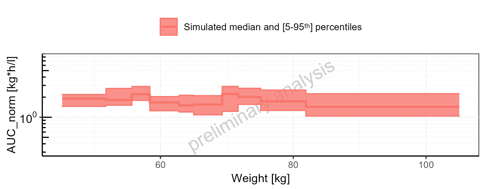

 
 

**Figure 2-150: Weight-dependence of AUC_norm for Filmcoated_tablet_400mg_sd. Profiles are plotted in a linear scale.**

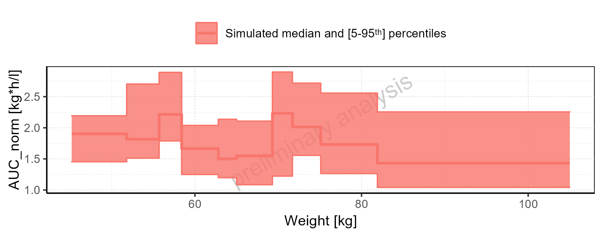

 
 

**Figure 2-151: BMI-dependence of AUC_norm for Larson 2013 8y-18y 400mg FCT meal in comparison to Filmcoated_tablet_400mg_sd. Profiles are plotted in a logarithmic scale.**

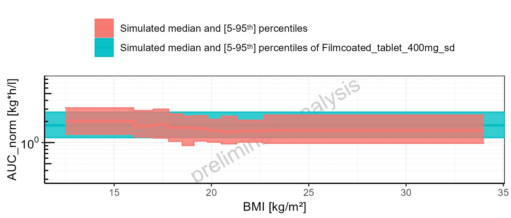

 
 

**Figure 2-152: BMI-dependence of AUC_norm for Larson 2013 8y-18y 400mg FCT meal in comparison to Filmcoated_tablet_400mg_sd. Profiles are plotted in a linear scale.**

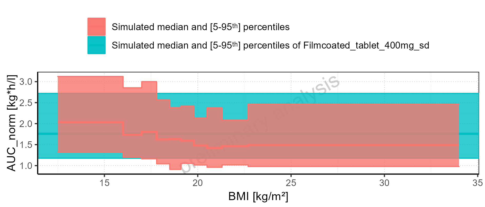

 
 

**Figure 2-153: BMI-dependence of AUC_norm for Larson 2013 8y-18y 400mg FCT meal. Profiles are plotted in a logarithmic scale.**

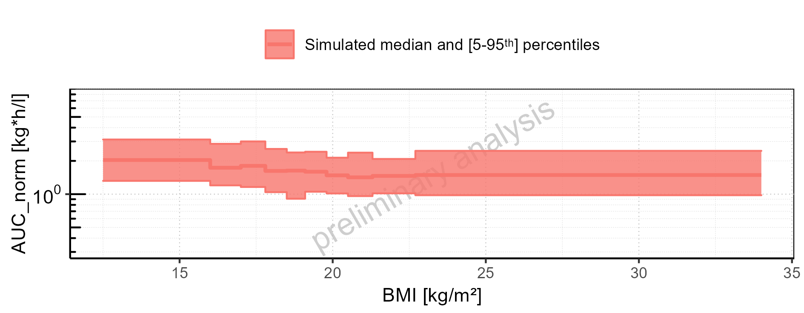

 
 

**Figure 2-154: BMI-dependence of AUC_norm for Larson 2013 8y-18y 400mg FCT meal. Profiles are plotted in a linear scale.**

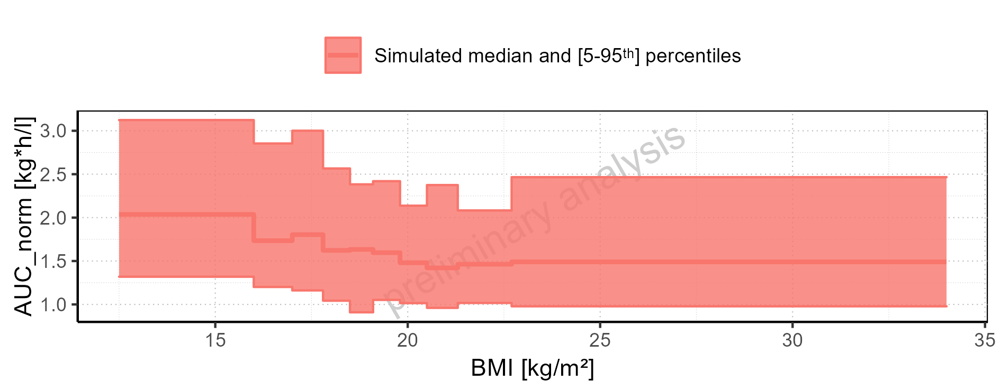

 
 

**Figure 2-155: BMI-dependence of AUC_norm for Filmcoated_tablet_400mg_sd. Profiles are plotted in a logarithmic scale.**

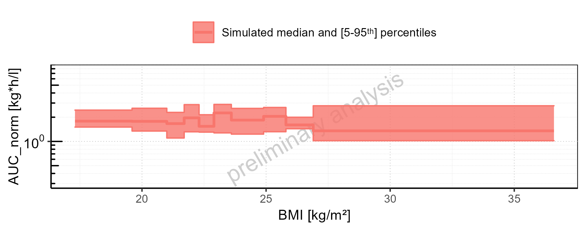

 
 

**Figure 2-156: BMI-dependence of AUC_norm for Filmcoated_tablet_400mg_sd. Profiles are plotted in a linear scale.**

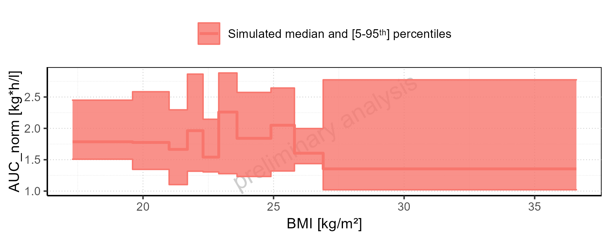

 
 

### 2.1.7 AUC_inf

**Figure 2-157: AUC_inf of Raltegravir for Larson 2013 8y-18y 400mg FCT meal, Filmcoated_tablet_400mg_sd shown as box-whisker plot, which indicates the 5<U+1D57><U+02B0>, 25<U+1D57><U+02B0>, 50<U+1D57><U+02B0>, 75<U+1D57><U+02B0>, 95<U+1D57><U+02B0> percentiles in logarithmic scale.**

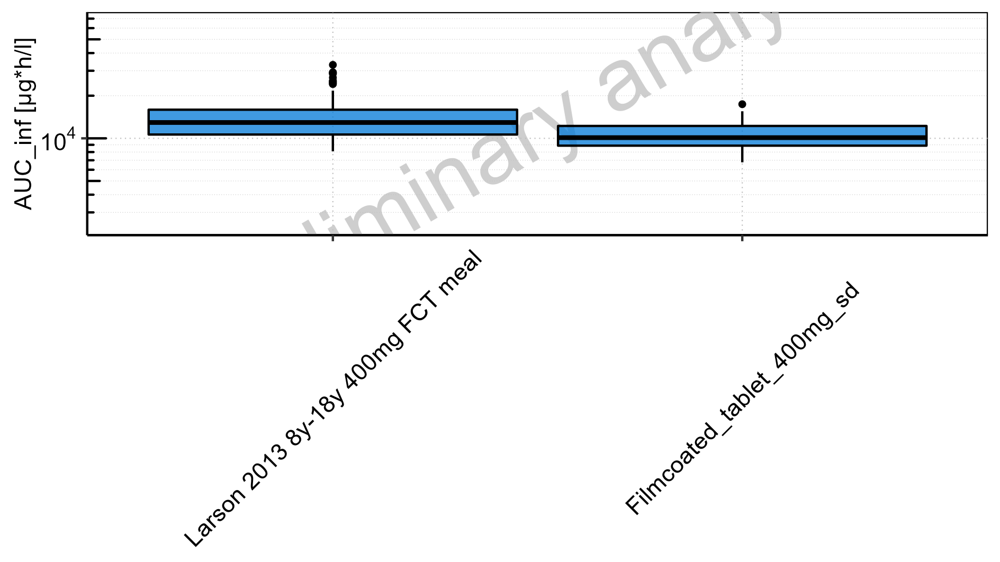

 
 

**Figure 2-158: AUC_inf of Raltegravir for Larson 2013 8y-18y 400mg FCT meal, Filmcoated_tablet_400mg_sd shown as box-whisker plot, which indicates the 5<U+1D57><U+02B0>, 25<U+1D57><U+02B0>, 50<U+1D57><U+02B0>, 75<U+1D57><U+02B0>, 95<U+1D57><U+02B0> percentiles in linear scale.**

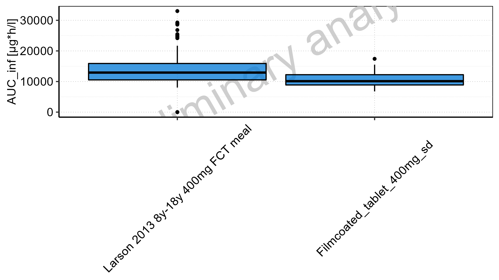

 
 

**Table 2-7: AUC_inf of Raltegravir for Larson 2013 8y-18y 400mg FCT meal, Filmcoated_tablet_400mg_sd reported in [µg*h/l]**

|Population                        |N   |5<U+1D57><U+02B0> pctl |25<U+1D57><U+02B0> pctl |50<U+1D57><U+02B0> pctl |75<U+1D57><U+02B0> pctl |95<U+1D57><U+02B0> pctl |Mean     |SD      |Geo Mean |Geo SD |
|:---------------------------------|:---|:----------------------|:-----------------------|:-----------------------|:-----------------------|:-----------------------|:--------|:-------|:--------|:------|
|Larson 2013 8y-18y 400mg FCT meal |500 |8017.56                |10533.54                |12921.05                |15892.61                |21707.95                |13652.19 |4460.23 |0.00     |-     |
|Filmcoated_tablet_400mg_sd        |100 |6771.99                |8875.70                 |10112.32                |12229.14                |15523.15                |10626.71 |2757.61 |10275.45 |1.30   |

 
 

**Figure 2-159: Age-dependence of AUC_inf for Larson 2013 8y-18y 400mg FCT meal in comparison to Filmcoated_tablet_400mg_sd. Profiles are plotted in a logarithmic scale.**

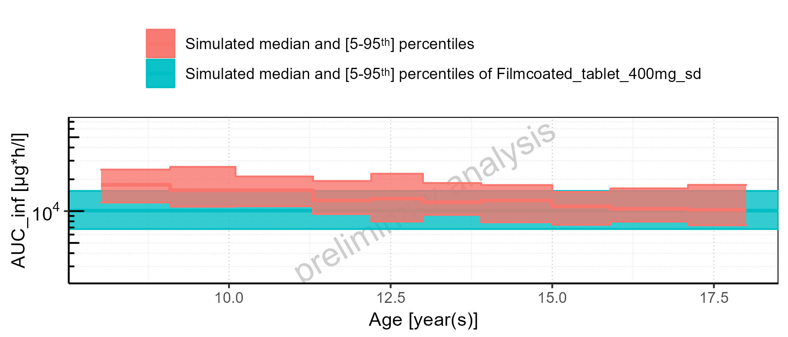

 
 

**Figure 2-160: Age-dependence of AUC_inf for Larson 2013 8y-18y 400mg FCT meal in comparison to Filmcoated_tablet_400mg_sd. Profiles are plotted in a linear scale.**

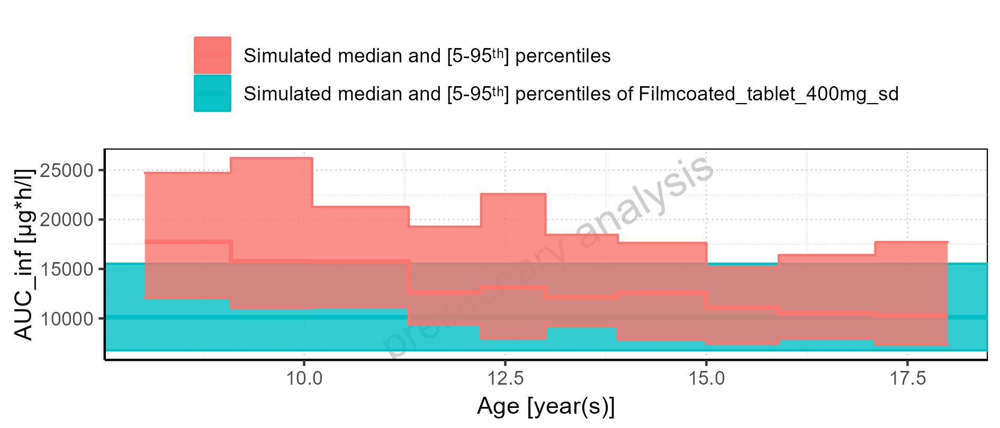

 
 

**Figure 2-161: Age-dependence of AUC_inf for Larson 2013 8y-18y 400mg FCT meal. Profiles are plotted in a logarithmic scale.**

 
 

**Figure 2-162: Age-dependence of AUC_inf for Larson 2013 8y-18y 400mg FCT meal. Profiles are plotted in a linear scale.**

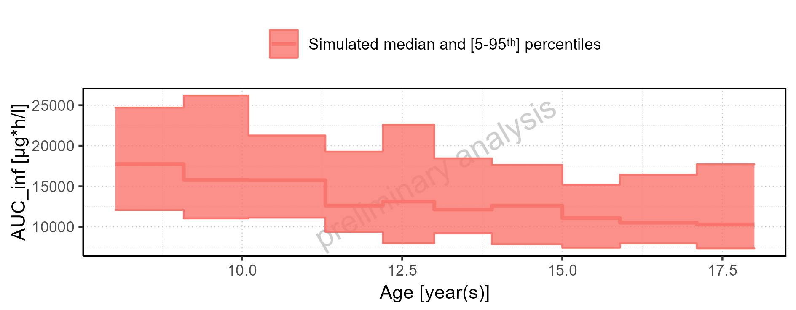

 
 

**Figure 2-163: Age-dependence of AUC_inf for Filmcoated_tablet_400mg_sd. Profiles are plotted in a logarithmic scale.**

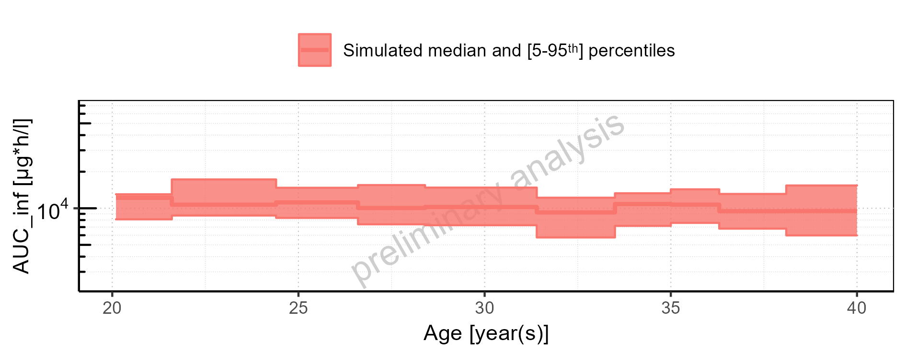

 
 

**Figure 2-164: Age-dependence of AUC_inf for Filmcoated_tablet_400mg_sd. Profiles are plotted in a linear scale.**

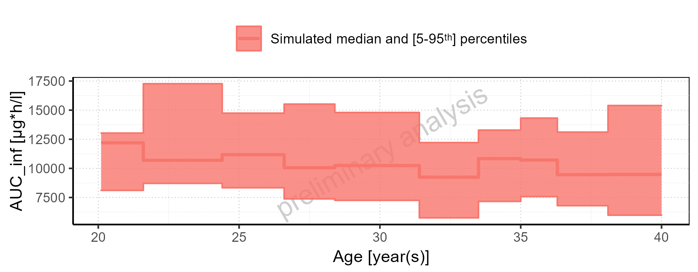

 
 

**Figure 2-165: Height-dependence of AUC_inf for Larson 2013 8y-18y 400mg FCT meal in comparison to Filmcoated_tablet_400mg_sd. Profiles are plotted in a logarithmic scale.**

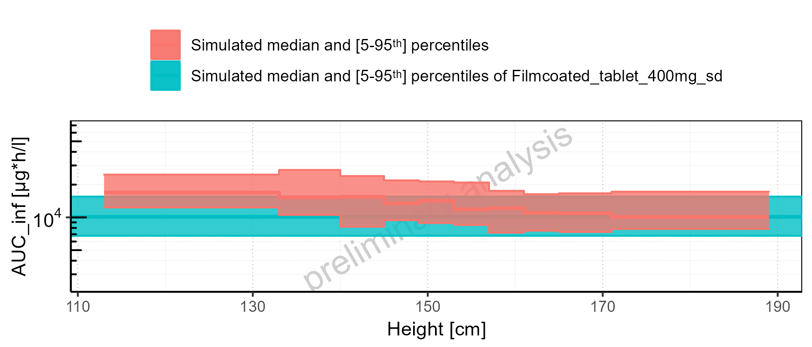

 
 

**Figure 2-166: Height-dependence of AUC_inf for Larson 2013 8y-18y 400mg FCT meal in comparison to Filmcoated_tablet_400mg_sd. Profiles are plotted in a linear scale.**

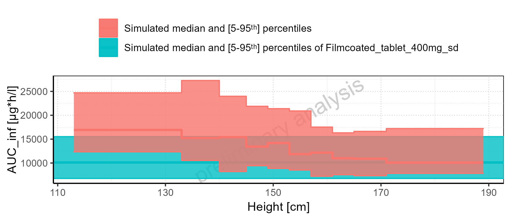

 
 

**Figure 2-167: Height-dependence of AUC_inf for Larson 2013 8y-18y 400mg FCT meal. Profiles are plotted in a logarithmic scale.**

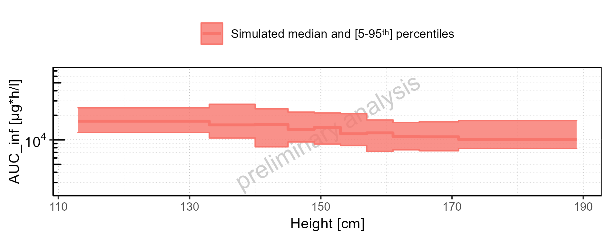

 
 

**Figure 2-168: Height-dependence of AUC_inf for Larson 2013 8y-18y 400mg FCT meal. Profiles are plotted in a linear scale.**

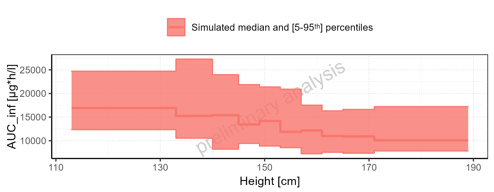

 
 

**Figure 2-169: Height-dependence of AUC_inf for Filmcoated_tablet_400mg_sd. Profiles are plotted in a logarithmic scale.**

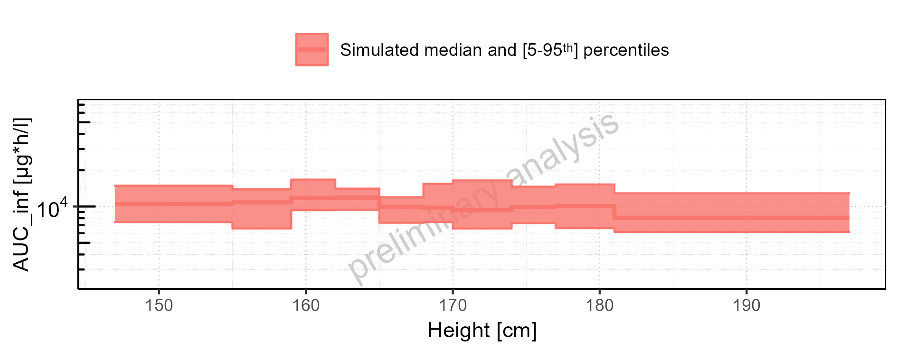

 
 

**Figure 2-170: Height-dependence of AUC_inf for Filmcoated_tablet_400mg_sd. Profiles are plotted in a linear scale.**

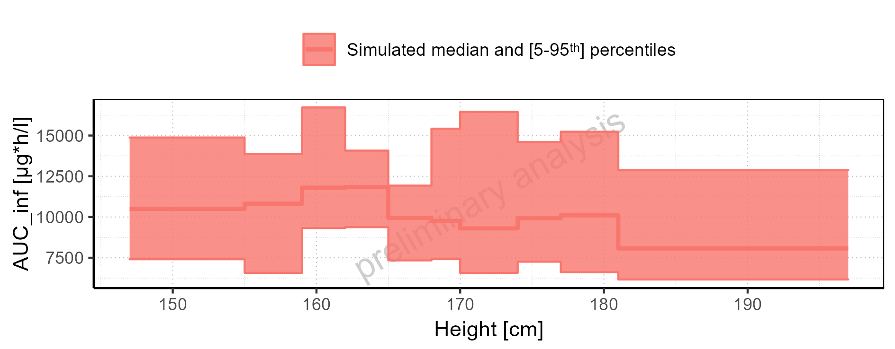

 
 

**Figure 2-171: Weight-dependence of AUC_inf for Larson 2013 8y-18y 400mg FCT meal in comparison to Filmcoated_tablet_400mg_sd. Profiles are plotted in a logarithmic scale.**

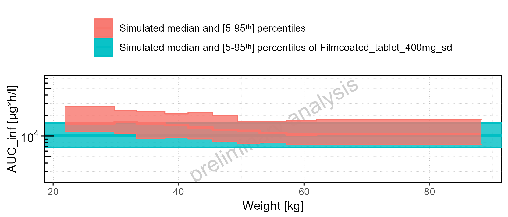

 
 

**Figure 2-172: Weight-dependence of AUC_inf for Larson 2013 8y-18y 400mg FCT meal in comparison to Filmcoated_tablet_400mg_sd. Profiles are plotted in a linear scale.**

 
 

**Figure 2-173: Weight-dependence of AUC_inf for Larson 2013 8y-18y 400mg FCT meal. Profiles are plotted in a logarithmic scale.**

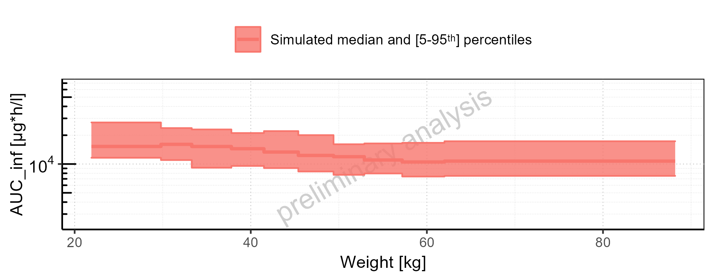

 
 

**Figure 2-174: Weight-dependence of AUC_inf for Larson 2013 8y-18y 400mg FCT meal. Profiles are plotted in a linear scale.**

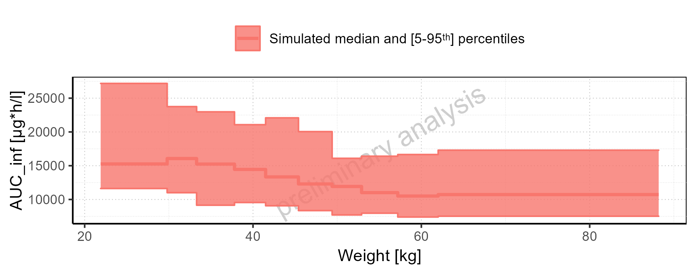

 
 

**Figure 2-175: Weight-dependence of AUC_inf for Filmcoated_tablet_400mg_sd. Profiles are plotted in a logarithmic scale.**

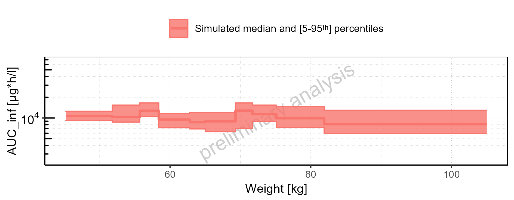

 
 

**Figure 2-176: Weight-dependence of AUC_inf for Filmcoated_tablet_400mg_sd. Profiles are plotted in a linear scale.**

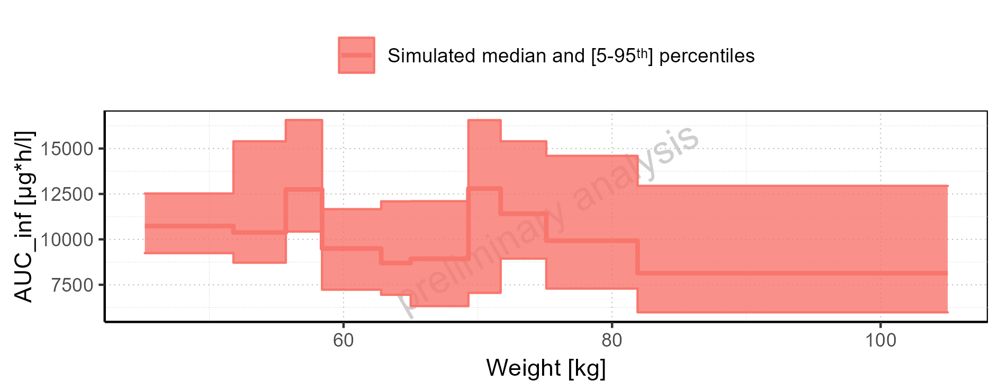

 
 

**Figure 2-177: BMI-dependence of AUC_inf for Larson 2013 8y-18y 400mg FCT meal in comparison to Filmcoated_tablet_400mg_sd. Profiles are plotted in a logarithmic scale.**

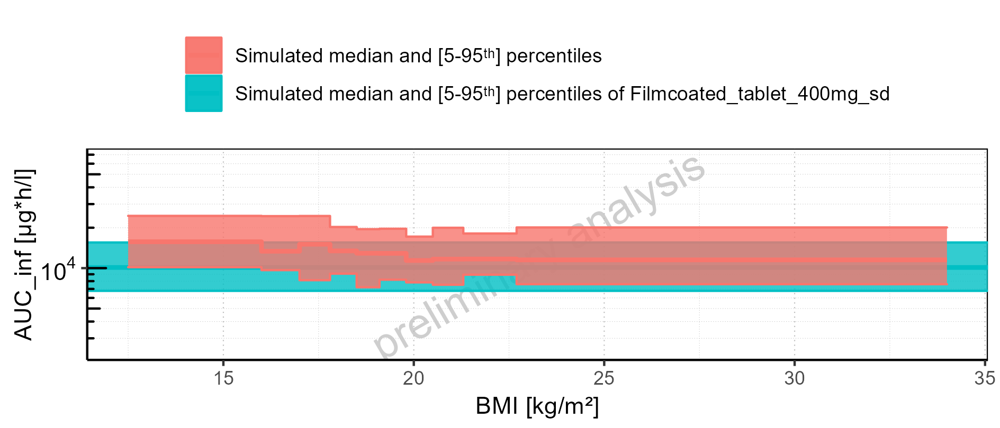

 
 

**Figure 2-178: BMI-dependence of AUC_inf for Larson 2013 8y-18y 400mg FCT meal in comparison to Filmcoated_tablet_400mg_sd. Profiles are plotted in a linear scale.**

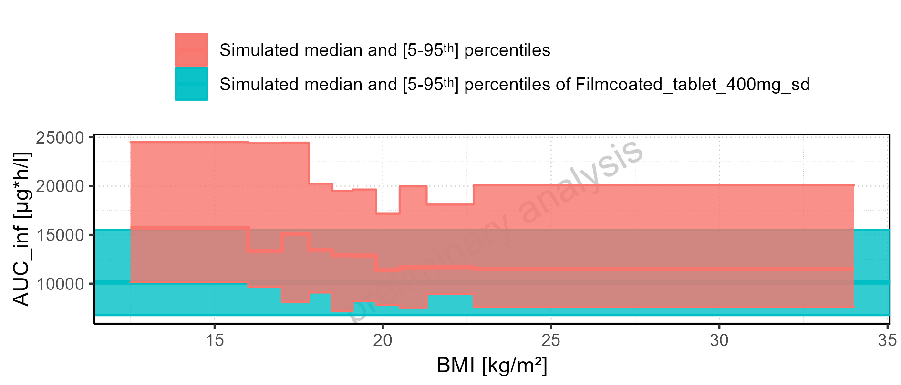

 
 

**Figure 2-179: BMI-dependence of AUC_inf for Larson 2013 8y-18y 400mg FCT meal. Profiles are plotted in a logarithmic scale.**

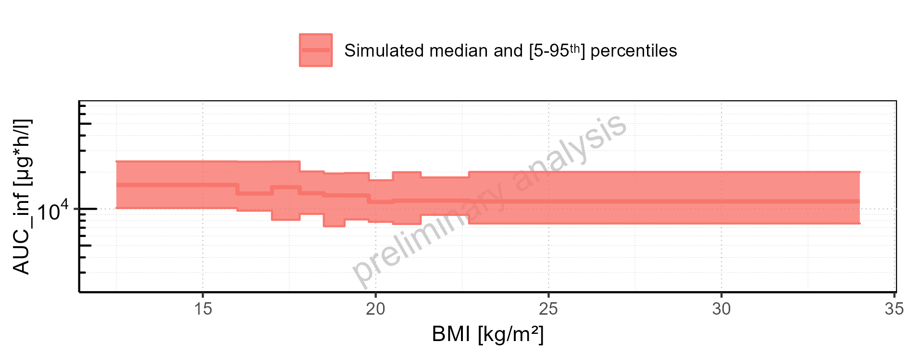

 
 

**Figure 2-180: BMI-dependence of AUC_inf for Larson 2013 8y-18y 400mg FCT meal. Profiles are plotted in a linear scale.**

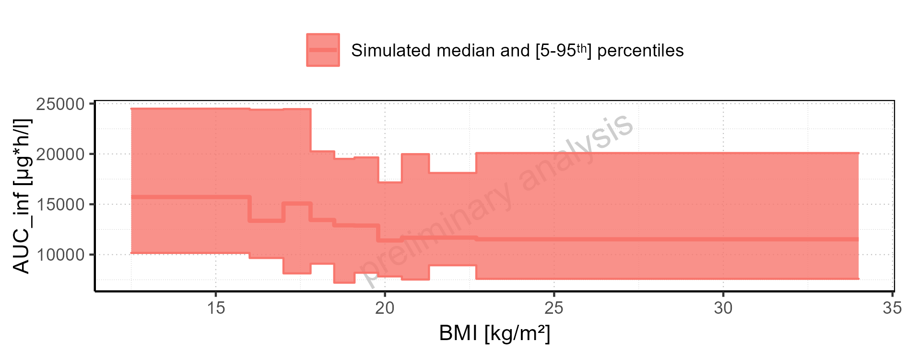

 
 

**Figure 2-181: BMI-dependence of AUC_inf for Filmcoated_tablet_400mg_sd. Profiles are plotted in a logarithmic scale.**

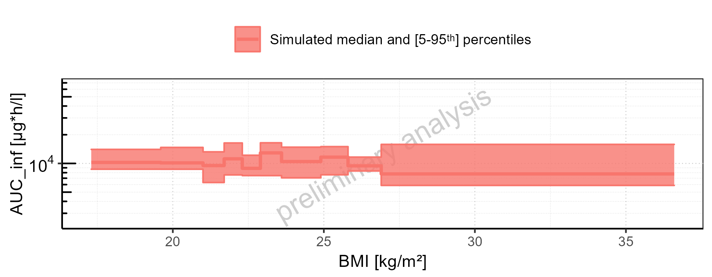

 
 

**Figure 2-182: BMI-dependence of AUC_inf for Filmcoated_tablet_400mg_sd. Profiles are plotted in a linear scale.**

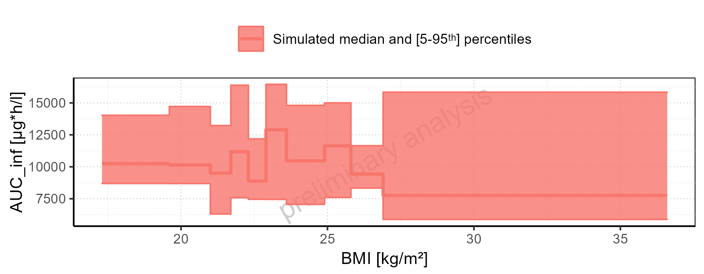

 
 

### 2.1.8 AUC_inf_norm

**Figure 2-183: AUC_inf_norm of Raltegravir for Larson 2013 8y-18y 400mg FCT meal, Filmcoated_tablet_400mg_sd shown as box-whisker plot, which indicates the 5<U+1D57><U+02B0>, 25<U+1D57><U+02B0>, 50<U+1D57><U+02B0>, 75<U+1D57><U+02B0>, 95<U+1D57><U+02B0> percentiles in logarithmic scale.**

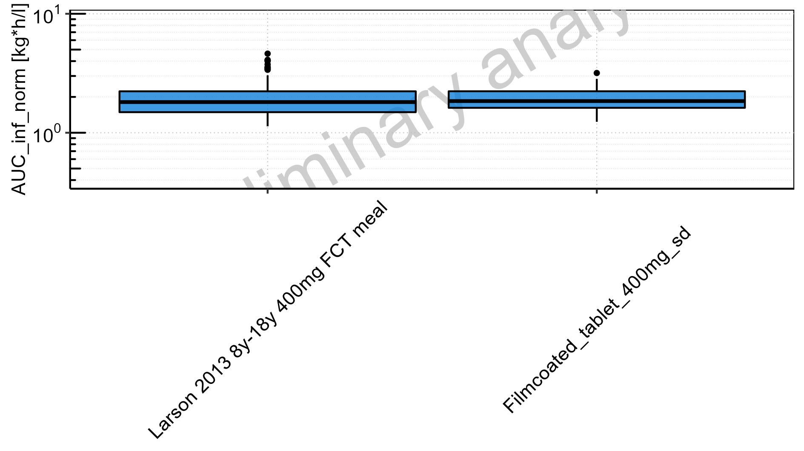

 
 

**Figure 2-184: AUC_inf_norm of Raltegravir for Larson 2013 8y-18y 400mg FCT meal, Filmcoated_tablet_400mg_sd shown as box-whisker plot, which indicates the 5<U+1D57><U+02B0>, 25<U+1D57><U+02B0>, 50<U+1D57><U+02B0>, 75<U+1D57><U+02B0>, 95<U+1D57><U+02B0> percentiles in linear scale.**

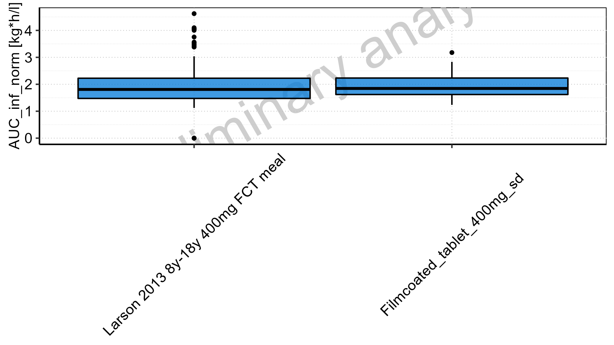

 
 

**Table 2-8: AUC_inf_norm of Raltegravir for Larson 2013 8y-18y 400mg FCT meal, Filmcoated_tablet_400mg_sd reported in [kg*h/l]**

|Population                        |N   |5<U+1D57><U+02B0> pctl |25<U+1D57><U+02B0> pctl |50<U+1D57><U+02B0> pctl |75<U+1D57><U+02B0> pctl |95<U+1D57><U+02B0> pctl |Mean |SD   |Geo Mean |Geo SD |
|:---------------------------------|:---|:----------------------|:-----------------------|:-----------------------|:-----------------------|:-----------------------|:----|:----|:--------|:------|
|Larson 2013 8y-18y 400mg FCT meal |500 |1.12                   |1.47                    |1.81                    |2.22                    |3.04                    |1.91 |0.62 |0.00     |-     |
|Filmcoated_tablet_400mg_sd        |100 |1.24                   |1.62                    |1.85                    |2.23                    |2.83                    |1.94 |0.50 |1.88     |1.30   |

 
 

**Figure 2-185: Age-dependence of AUC_inf_norm for Larson 2013 8y-18y 400mg FCT meal in comparison to Filmcoated_tablet_400mg_sd. Profiles are plotted in a logarithmic scale.**

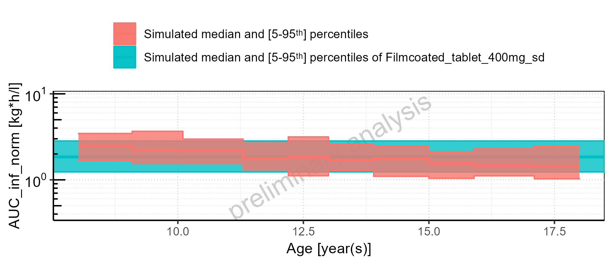

 
 

**Figure 2-186: Age-dependence of AUC_inf_norm for Larson 2013 8y-18y 400mg FCT meal in comparison to Filmcoated_tablet_400mg_sd. Profiles are plotted in a linear scale.**

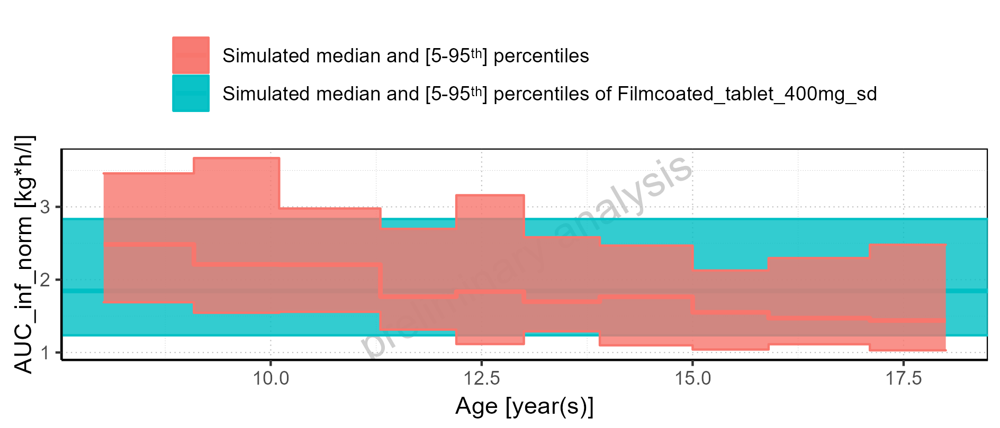

 
 

**Figure 2-187: Age-dependence of AUC_inf_norm for Larson 2013 8y-18y 400mg FCT meal. Profiles are plotted in a logarithmic scale.**

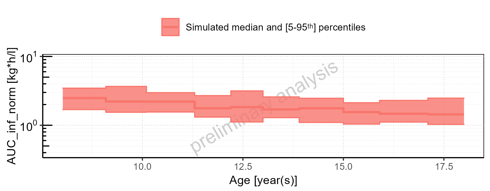

 
 

**Figure 2-188: Age-dependence of AUC_inf_norm for Larson 2013 8y-18y 400mg FCT meal. Profiles are plotted in a linear scale.**

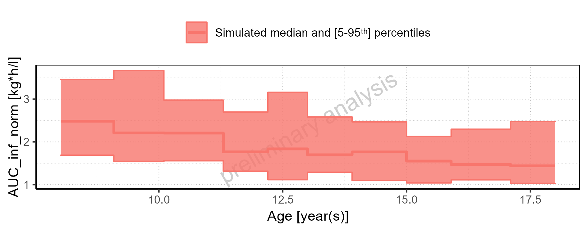

 
 

**Figure 2-189: Age-dependence of AUC_inf_norm for Filmcoated_tablet_400mg_sd. Profiles are plotted in a logarithmic scale.**

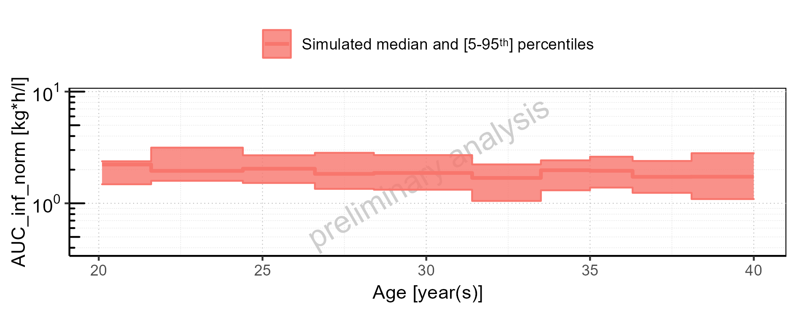

 
 

**Figure 2-190: Age-dependence of AUC_inf_norm for Filmcoated_tablet_400mg_sd. Profiles are plotted in a linear scale.**

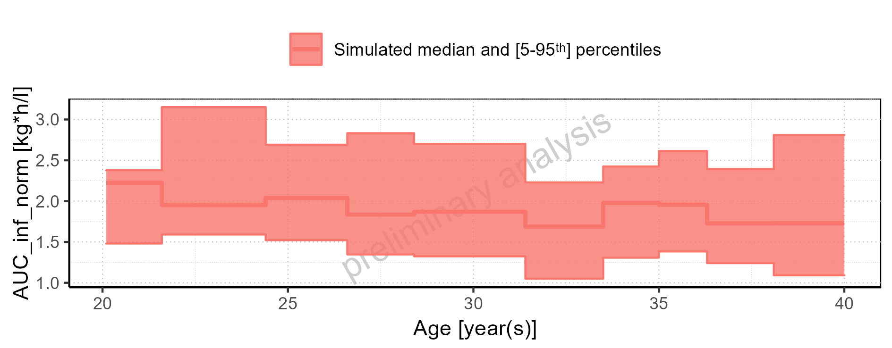

 
 

**Figure 2-191: Height-dependence of AUC_inf_norm for Larson 2013 8y-18y 400mg FCT meal in comparison to Filmcoated_tablet_400mg_sd. Profiles are plotted in a logarithmic scale.**

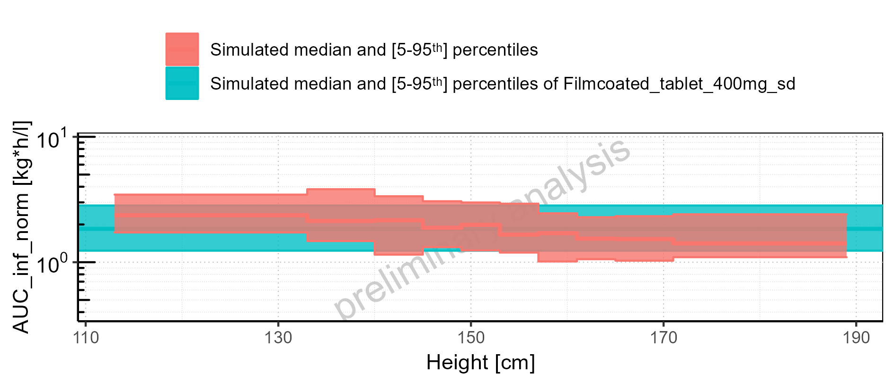

 
 

**Figure 2-192: Height-dependence of AUC_inf_norm for Larson 2013 8y-18y 400mg FCT meal in comparison to Filmcoated_tablet_400mg_sd. Profiles are plotted in a linear scale.**

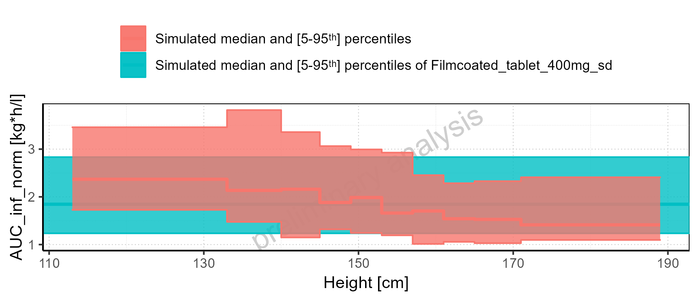

 
 

**Figure 2-193: Height-dependence of AUC_inf_norm for Larson 2013 8y-18y 400mg FCT meal. Profiles are plotted in a logarithmic scale.**

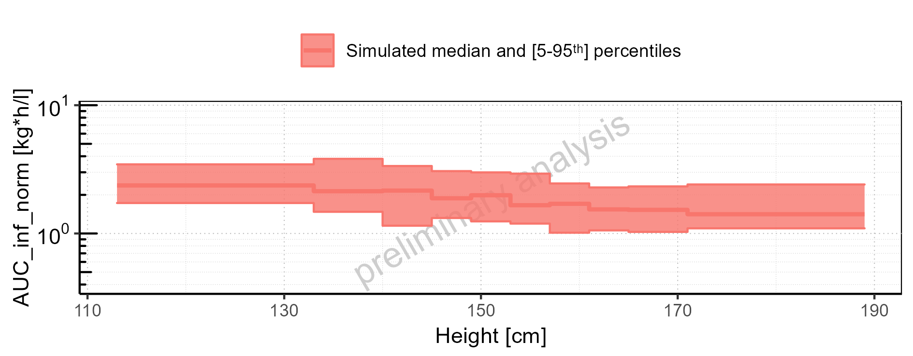

 
 

**Figure 2-194: Height-dependence of AUC_inf_norm for Larson 2013 8y-18y 400mg FCT meal. Profiles are plotted in a linear scale.**

 
 

**Figure 2-195: Height-dependence of AUC_inf_norm for Filmcoated_tablet_400mg_sd. Profiles are plotted in a logarithmic scale.**

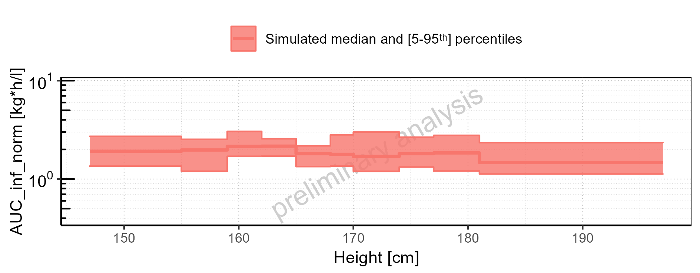

 
 

**Figure 2-196: Height-dependence of AUC_inf_norm for Filmcoated_tablet_400mg_sd. Profiles are plotted in a linear scale.**

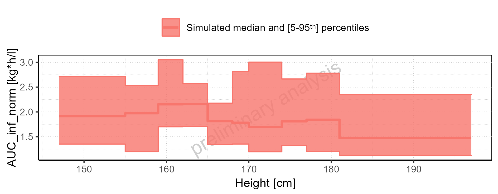

 
 

**Figure 2-197: Weight-dependence of AUC_inf_norm for Larson 2013 8y-18y 400mg FCT meal in comparison to Filmcoated_tablet_400mg_sd. Profiles are plotted in a logarithmic scale.**

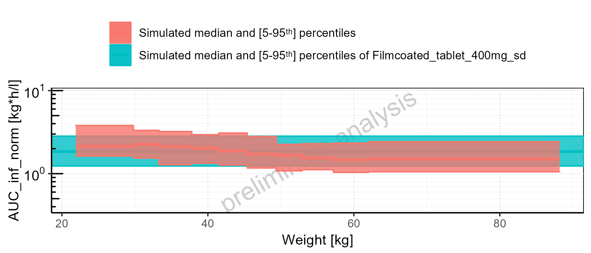

 
 

**Figure 2-198: Weight-dependence of AUC_inf_norm for Larson 2013 8y-18y 400mg FCT meal in comparison to Filmcoated_tablet_400mg_sd. Profiles are plotted in a linear scale.**

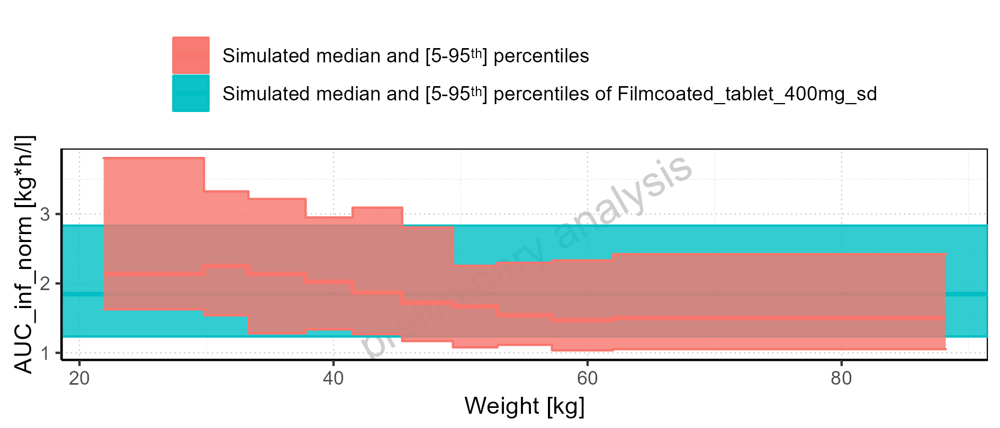

 
 

**Figure 2-199: Weight-dependence of AUC_inf_norm for Larson 2013 8y-18y 400mg FCT meal. Profiles are plotted in a logarithmic scale.**

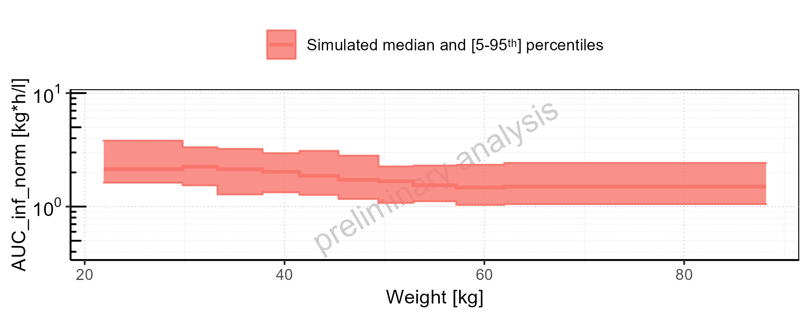

 
 

**Figure 2-200: Weight-dependence of AUC_inf_norm for Larson 2013 8y-18y 400mg FCT meal. Profiles are plotted in a linear scale.**

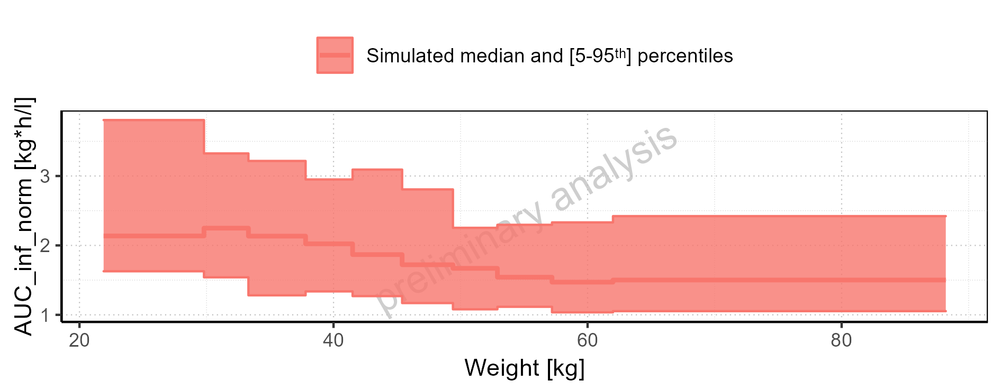

 
 

**Figure 2-201: Weight-dependence of AUC_inf_norm for Filmcoated_tablet_400mg_sd. Profiles are plotted in a logarithmic scale.**

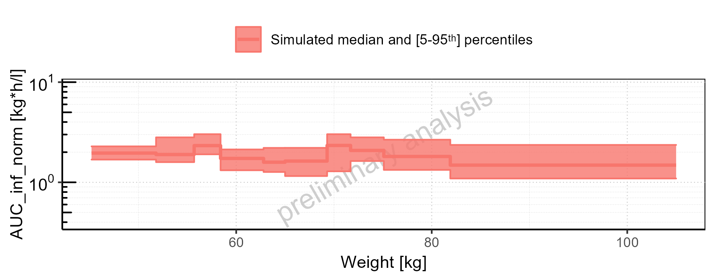

 
 

**Figure 2-202: Weight-dependence of AUC_inf_norm for Filmcoated_tablet_400mg_sd. Profiles are plotted in a linear scale.**

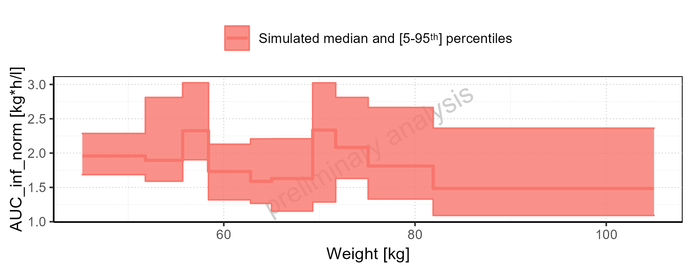

 
 

**Figure 2-203: BMI-dependence of AUC_inf_norm for Larson 2013 8y-18y 400mg FCT meal in comparison to Filmcoated_tablet_400mg_sd. Profiles are plotted in a logarithmic scale.**

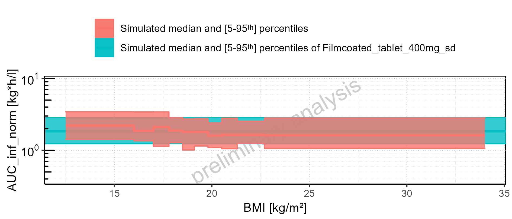

 
 

**Figure 2-204: BMI-dependence of AUC_inf_norm for Larson 2013 8y-18y 400mg FCT meal in comparison to Filmcoated_tablet_400mg_sd. Profiles are plotted in a linear scale.**

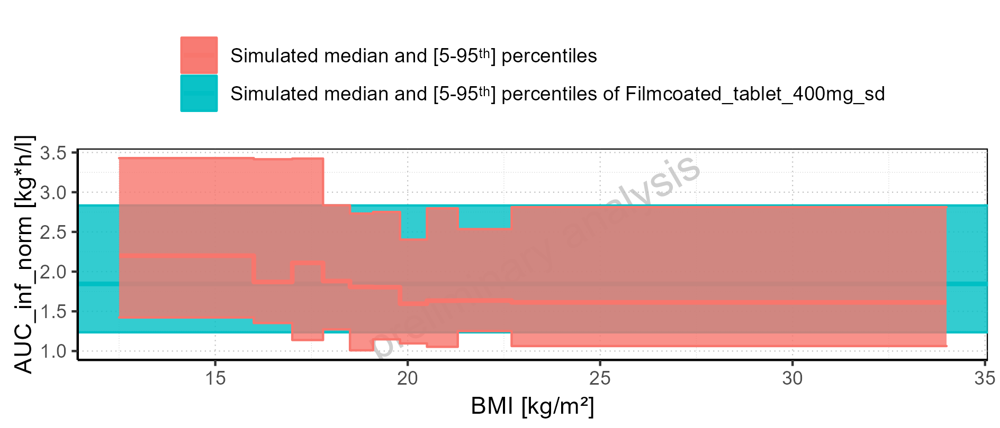

 
 

**Figure 2-205: BMI-dependence of AUC_inf_norm for Larson 2013 8y-18y 400mg FCT meal. Profiles are plotted in a logarithmic scale.**

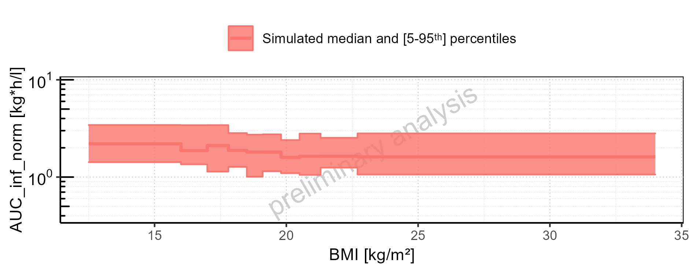

 
 

**Figure 2-206: BMI-dependence of AUC_inf_norm for Larson 2013 8y-18y 400mg FCT meal. Profiles are plotted in a linear scale.**

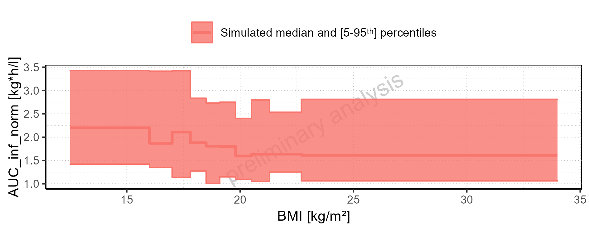

 
 

**Figure 2-207: BMI-dependence of AUC_inf_norm for Filmcoated_tablet_400mg_sd. Profiles are plotted in a logarithmic scale.**

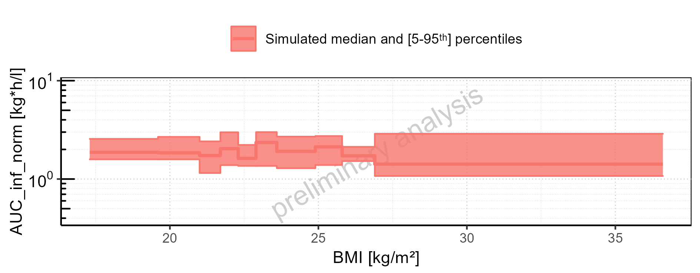

 
 

**Figure 2-208: BMI-dependence of AUC_inf_norm for Filmcoated_tablet_400mg_sd. Profiles are plotted in a linear scale.**

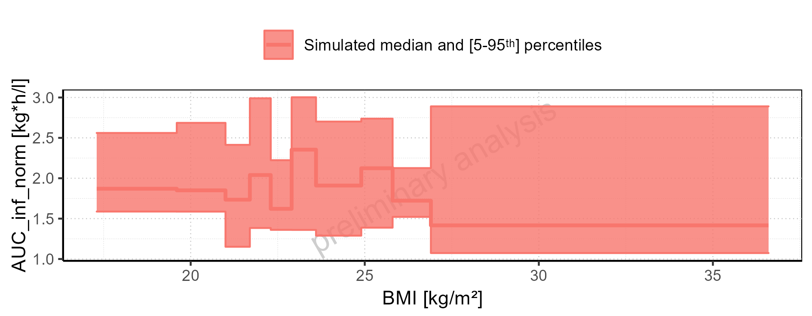

 
 

### 2.1.9 MRT

**Figure 2-209: MRT of Raltegravir for Larson 2013 8y-18y 400mg FCT meal, Filmcoated_tablet_400mg_sd shown as box-whisker plot, which indicates the 5<U+1D57><U+02B0>, 25<U+1D57><U+02B0>, 50<U+1D57><U+02B0>, 75<U+1D57><U+02B0>, 95<U+1D57><U+02B0> percentiles in logarithmic scale.**

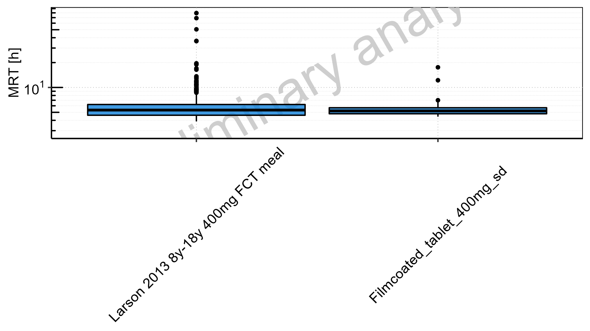

 
 

**Figure 2-210: MRT of Raltegravir for Larson 2013 8y-18y 400mg FCT meal, Filmcoated_tablet_400mg_sd shown as box-whisker plot, which indicates the 5<U+1D57><U+02B0>, 25<U+1D57><U+02B0>, 50<U+1D57><U+02B0>, 75<U+1D57><U+02B0>, 95<U+1D57><U+02B0> percentiles in linear scale.**

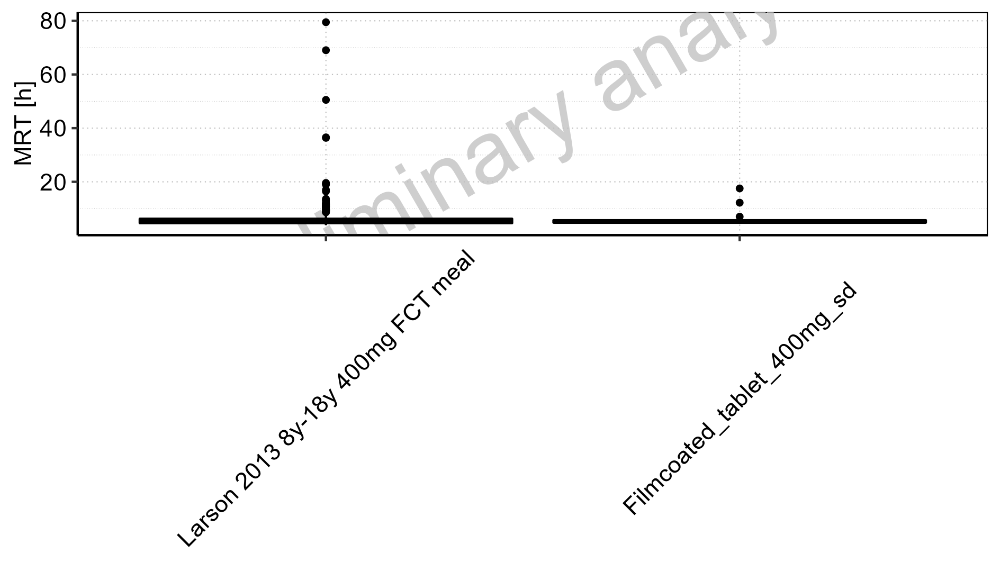

 
 

**Table 2-9: MRT of Raltegravir for Larson 2013 8y-18y 400mg FCT meal, Filmcoated_tablet_400mg_sd reported in [h]**

|Population                        |N   |5<U+1D57><U+02B0> pctl |25<U+1D57><U+02B0> pctl |50<U+1D57><U+02B0> pctl |75<U+1D57><U+02B0> pctl |95<U+1D57><U+02B0> pctl |Mean |SD   |Geo Mean |Geo SD |
|:---------------------------------|:---|:----------------------|:-----------------------|:-----------------------|:-----------------------|:-----------------------|:----|:----|:--------|:------|
|Larson 2013 8y-18y 400mg FCT meal |497 |3.88                   |4.61                    |5.32                    |6.22                    |10.31                   |6.26 |5.56 |5.64     |1.44   |
|Filmcoated_tablet_400mg_sd        |100 |4.43                   |4.80                    |5.20                    |5.68                    |6.70                    |5.44 |1.54 |5.32     |1.21   |

 
 

**Figure 2-211: Age-dependence of MRT for Larson 2013 8y-18y 400mg FCT meal in comparison to Filmcoated_tablet_400mg_sd. Profiles are plotted in a logarithmic scale.**

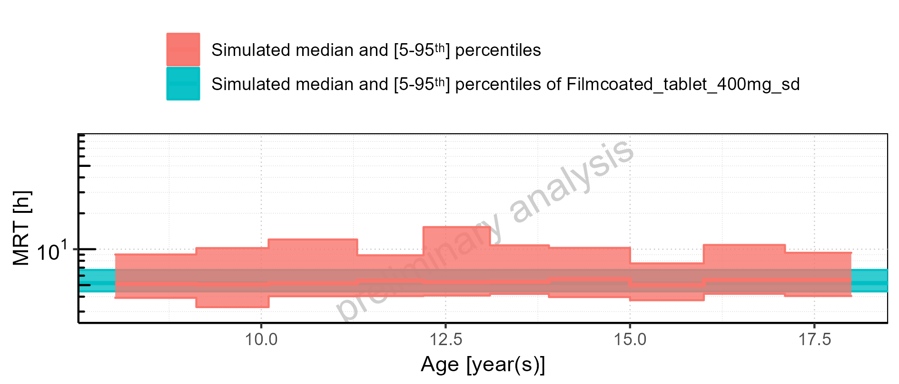

 
 

**Figure 2-212: Age-dependence of MRT for Larson 2013 8y-18y 400mg FCT meal in comparison to Filmcoated_tablet_400mg_sd. Profiles are plotted in a linear scale.**

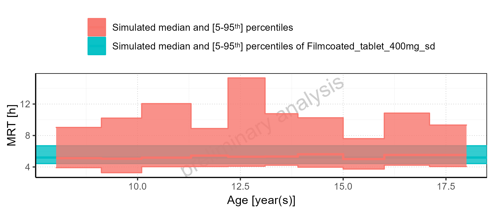

 
 

**Figure 2-213: Age-dependence of MRT for Larson 2013 8y-18y 400mg FCT meal. Profiles are plotted in a logarithmic scale.**

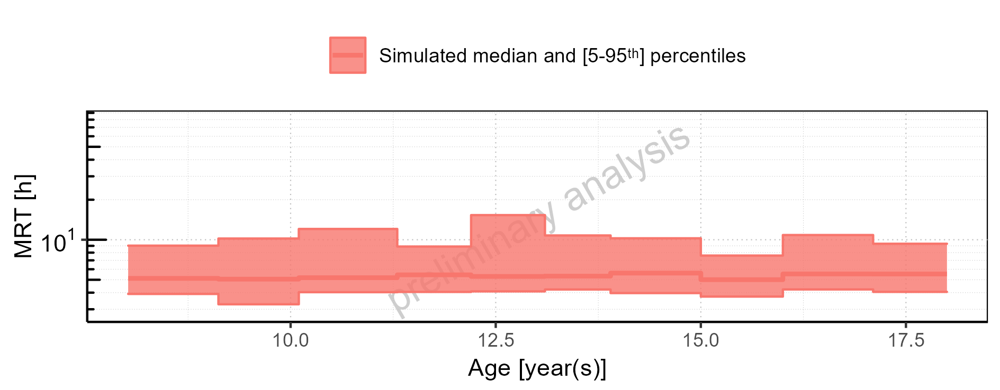

 
 

**Figure 2-214: Age-dependence of MRT for Larson 2013 8y-18y 400mg FCT meal. Profiles are plotted in a linear scale.**

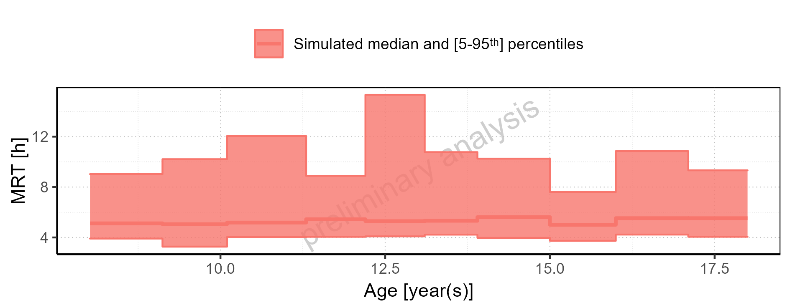

 
 

**Figure 2-215: Age-dependence of MRT for Filmcoated_tablet_400mg_sd. Profiles are plotted in a logarithmic scale.**

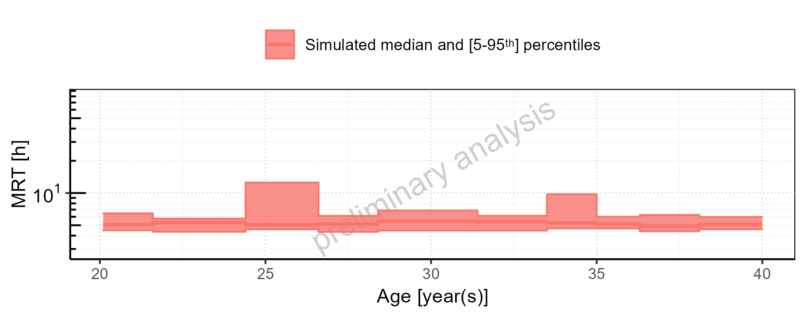

 
 

**Figure 2-216: Age-dependence of MRT for Filmcoated_tablet_400mg_sd. Profiles are plotted in a linear scale.**

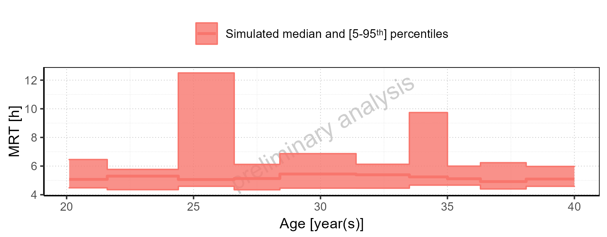

 
 

**Figure 2-217: Height-dependence of MRT for Larson 2013 8y-18y 400mg FCT meal in comparison to Filmcoated_tablet_400mg_sd. Profiles are plotted in a logarithmic scale.**

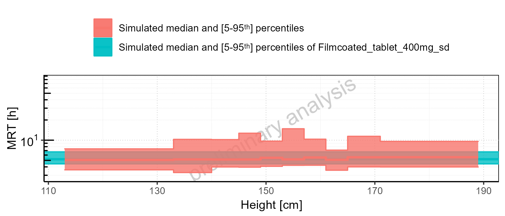

 
 

**Figure 2-218: Height-dependence of MRT for Larson 2013 8y-18y 400mg FCT meal in comparison to Filmcoated_tablet_400mg_sd. Profiles are plotted in a linear scale.**

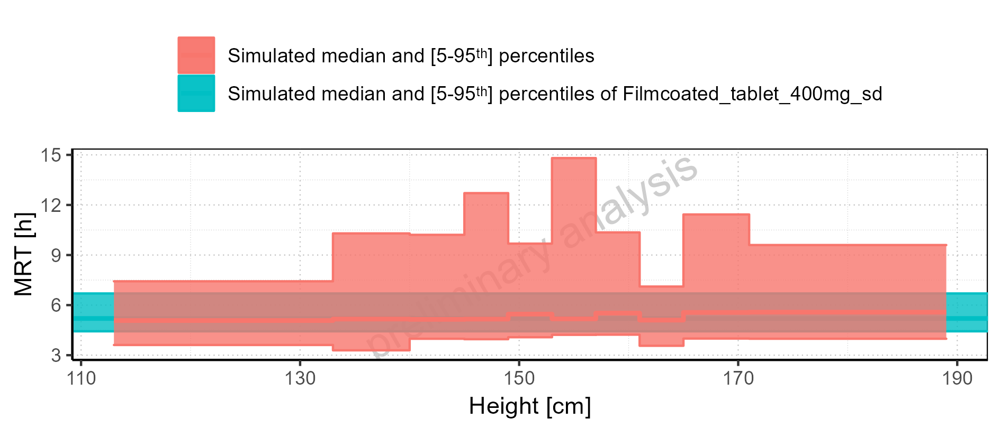

 
 

**Figure 2-219: Height-dependence of MRT for Larson 2013 8y-18y 400mg FCT meal. Profiles are plotted in a logarithmic scale.**

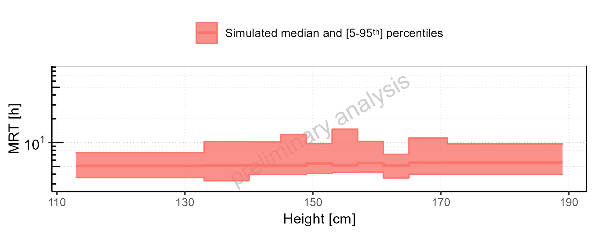

 
 

**Figure 2-220: Height-dependence of MRT for Larson 2013 8y-18y 400mg FCT meal. Profiles are plotted in a linear scale.**

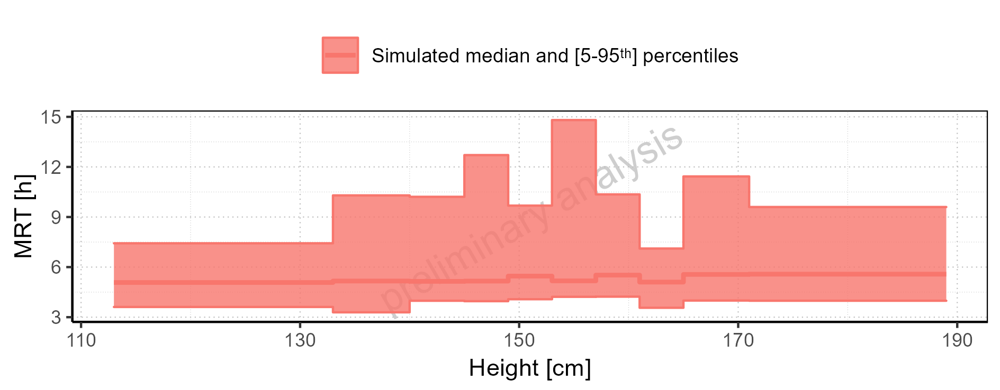

 
 

**Figure 2-221: Height-dependence of MRT for Filmcoated_tablet_400mg_sd. Profiles are plotted in a logarithmic scale.**

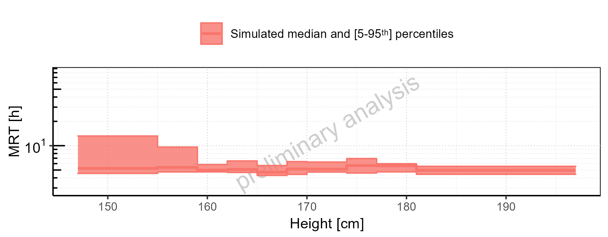

 
 

**Figure 2-222: Height-dependence of MRT for Filmcoated_tablet_400mg_sd. Profiles are plotted in a linear scale.**

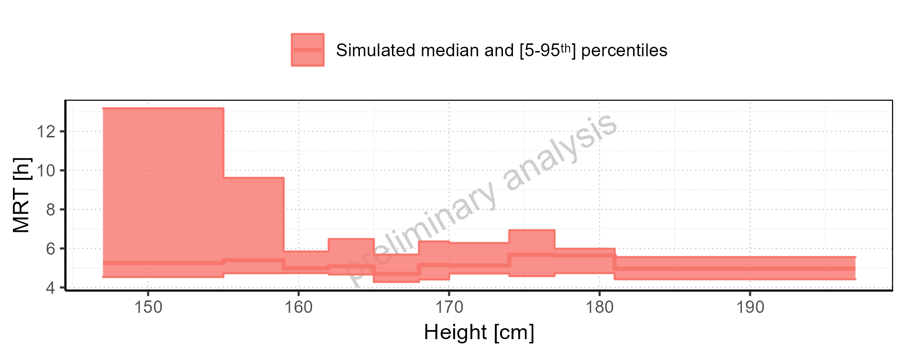

 
 

**Figure 2-223: Weight-dependence of MRT for Larson 2013 8y-18y 400mg FCT meal in comparison to Filmcoated_tablet_400mg_sd. Profiles are plotted in a logarithmic scale.**

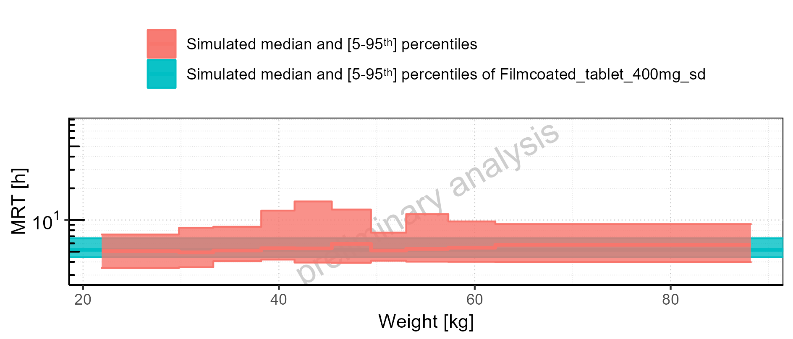

 
 

**Figure 2-224: Weight-dependence of MRT for Larson 2013 8y-18y 400mg FCT meal in comparison to Filmcoated_tablet_400mg_sd. Profiles are plotted in a linear scale.**

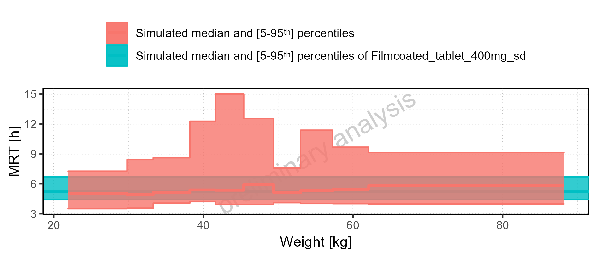

 
 

**Figure 2-225: Weight-dependence of MRT for Larson 2013 8y-18y 400mg FCT meal. Profiles are plotted in a logarithmic scale.**

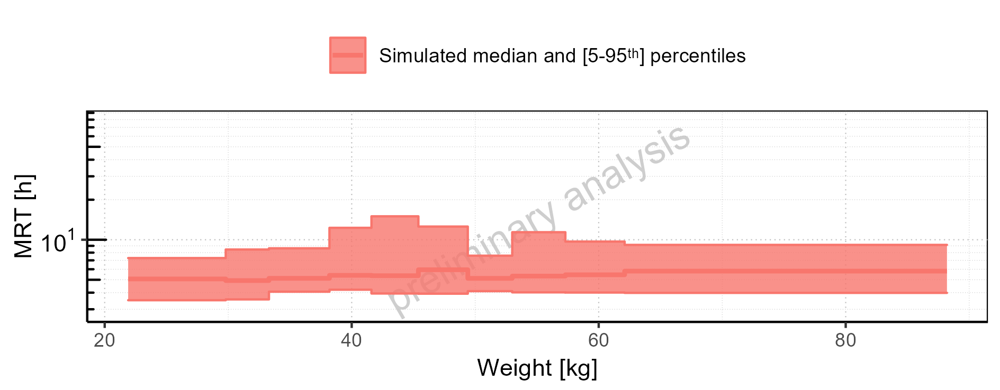

 
 

**Figure 2-226: Weight-dependence of MRT for Larson 2013 8y-18y 400mg FCT meal. Profiles are plotted in a linear scale.**

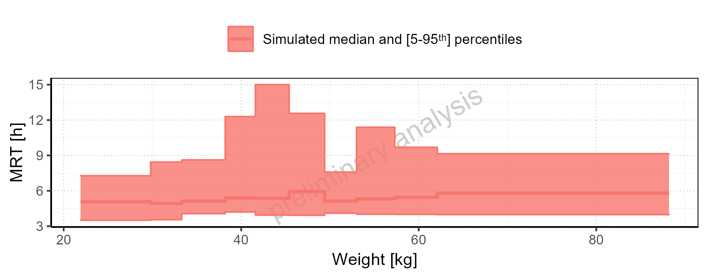

 
 

**Figure 2-227: Weight-dependence of MRT for Filmcoated_tablet_400mg_sd. Profiles are plotted in a logarithmic scale.**

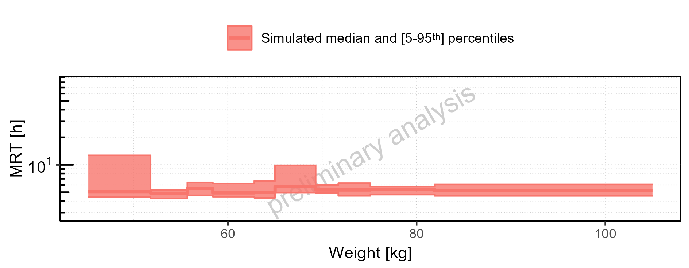

 
 

**Figure 2-228: Weight-dependence of MRT for Filmcoated_tablet_400mg_sd. Profiles are plotted in a linear scale.**

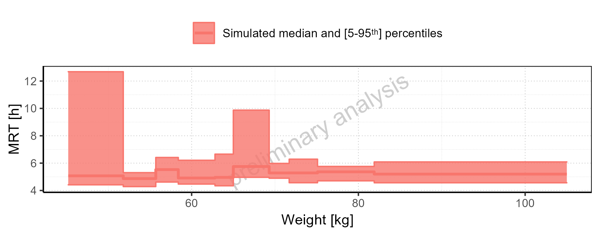

 
 

**Figure 2-229: BMI-dependence of MRT for Larson 2013 8y-18y 400mg FCT meal in comparison to Filmcoated_tablet_400mg_sd. Profiles are plotted in a logarithmic scale.**

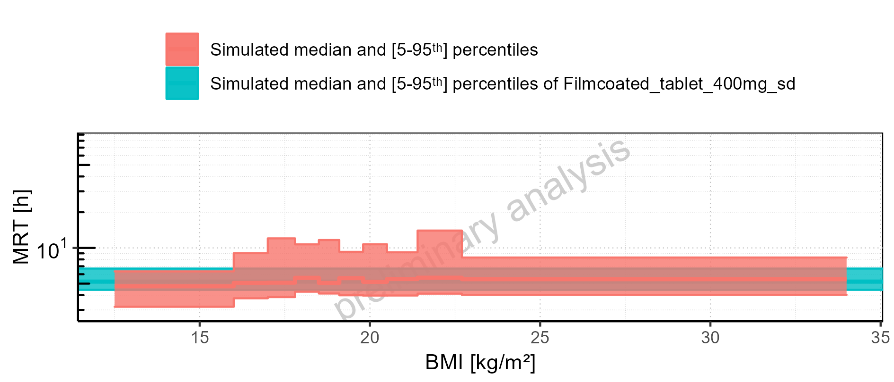

 
 

**Figure 2-230: BMI-dependence of MRT for Larson 2013 8y-18y 400mg FCT meal in comparison to Filmcoated_tablet_400mg_sd. Profiles are plotted in a linear scale.**

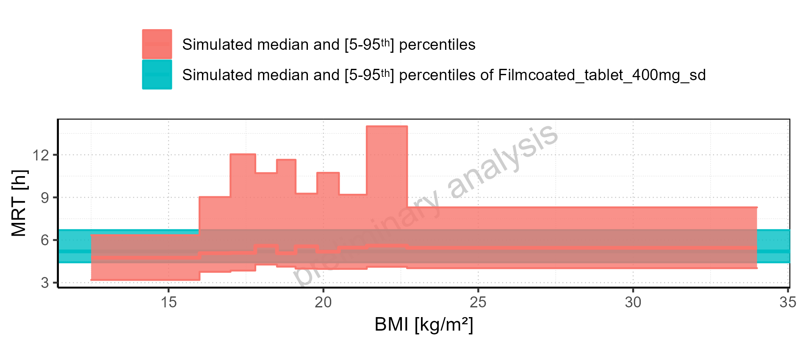

 
 

**Figure 2-231: BMI-dependence of MRT for Larson 2013 8y-18y 400mg FCT meal. Profiles are plotted in a logarithmic scale.**

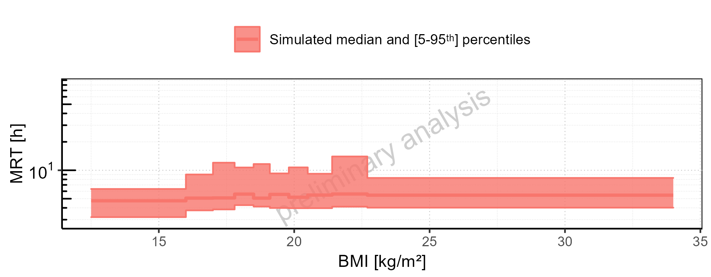

 
 

**Figure 2-232: BMI-dependence of MRT for Larson 2013 8y-18y 400mg FCT meal. Profiles are plotted in a linear scale.**

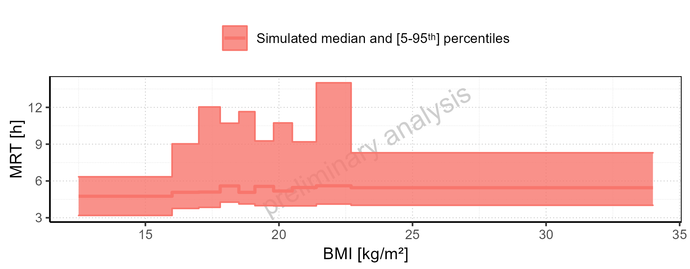

 
 

**Figure 2-233: BMI-dependence of MRT for Filmcoated_tablet_400mg_sd. Profiles are plotted in a logarithmic scale.**

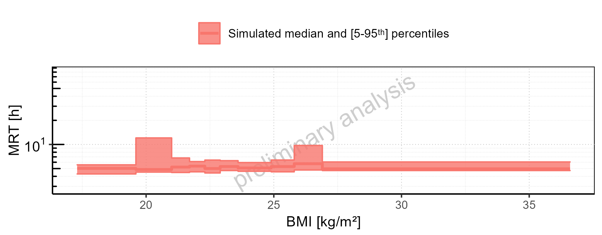

 
 

**Figure 2-234: BMI-dependence of MRT for Filmcoated_tablet_400mg_sd. Profiles are plotted in a linear scale.**

 
 

### 2.1.10 Thalf

**Figure 2-235: Thalf of Raltegravir for Larson 2013 8y-18y 400mg FCT meal, Filmcoated_tablet_400mg_sd shown as box-whisker plot, which indicates the 5<U+1D57><U+02B0>, 25<U+1D57><U+02B0>, 50<U+1D57><U+02B0>, 75<U+1D57><U+02B0>, 95<U+1D57><U+02B0> percentiles in logarithmic scale.**

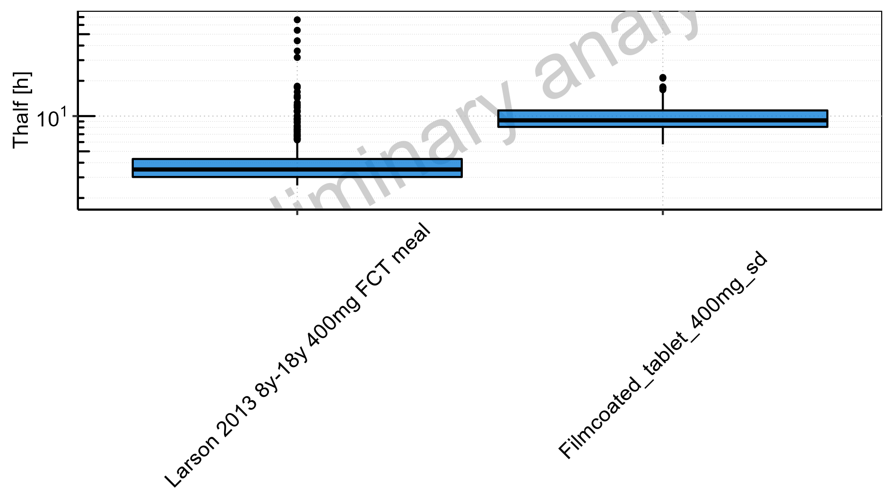

 
 

**Figure 2-236: Thalf of Raltegravir for Larson 2013 8y-18y 400mg FCT meal, Filmcoated_tablet_400mg_sd shown as box-whisker plot, which indicates the 5<U+1D57><U+02B0>, 25<U+1D57><U+02B0>, 50<U+1D57><U+02B0>, 75<U+1D57><U+02B0>, 95<U+1D57><U+02B0> percentiles in linear scale.**

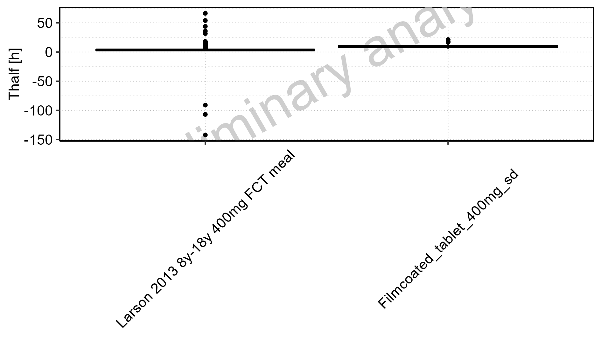

 
 

**Table 2-10: Thalf of Raltegravir for Larson 2013 8y-18y 400mg FCT meal, Filmcoated_tablet_400mg_sd reported in [h]**

|Population                        |N   |5<U+1D57><U+02B0> pctl |25<U+1D57><U+02B0> pctl |50<U+1D57><U+02B0> pctl |75<U+1D57><U+02B0> pctl |95<U+1D57><U+02B0> pctl |Mean |SD    |Geo Mean |Geo SD |
|:---------------------------------|:---|:----------------------|:-----------------------|:-----------------------|:-----------------------|:-----------------------|:----|:-----|:--------|:------|
|Larson 2013 8y-18y 400mg FCT meal |500 |2.55                   |3.01                    |3.49                    |4.30                    |9.43                    |3.90 |10.49 |-       |-     |
|Filmcoated_tablet_400mg_sd        |100 |5.74                   |8.08                    |9.20                    |11.18                   |16.81                   |9.99 |3.18  |9.55     |1.35   |

 
 

**Figure 2-237: Age-dependence of Thalf for Larson 2013 8y-18y 400mg FCT meal in comparison to Filmcoated_tablet_400mg_sd. Profiles are plotted in a logarithmic scale.**

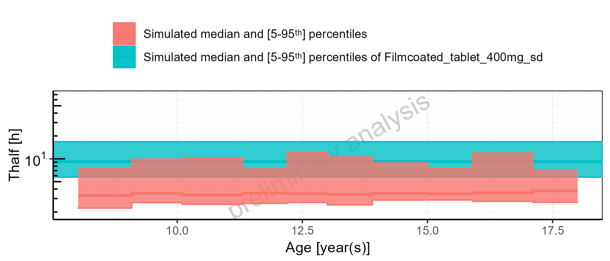

 
 

**Figure 2-238: Age-dependence of Thalf for Larson 2013 8y-18y 400mg FCT meal in comparison to Filmcoated_tablet_400mg_sd. Profiles are plotted in a linear scale.**

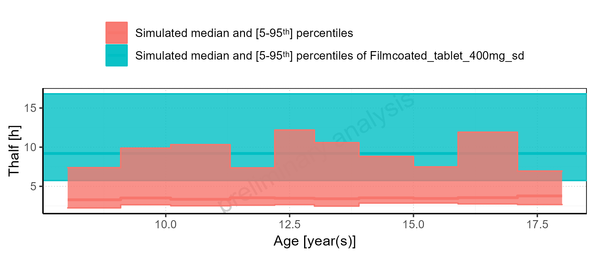

 
 

**Figure 2-239: Age-dependence of Thalf for Larson 2013 8y-18y 400mg FCT meal. Profiles are plotted in a logarithmic scale.**

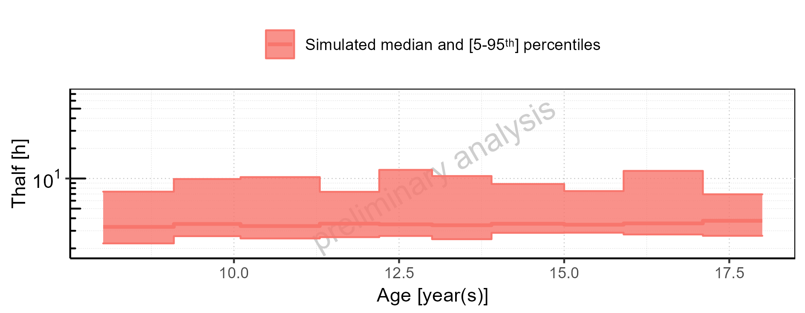

 
 

**Figure 2-240: Age-dependence of Thalf for Larson 2013 8y-18y 400mg FCT meal. Profiles are plotted in a linear scale.**

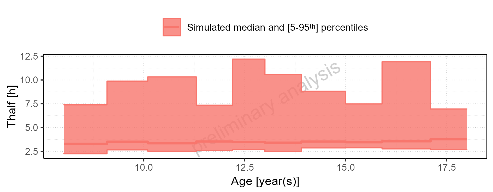

 
 

**Figure 2-241: Age-dependence of Thalf for Filmcoated_tablet_400mg_sd. Profiles are plotted in a logarithmic scale.**

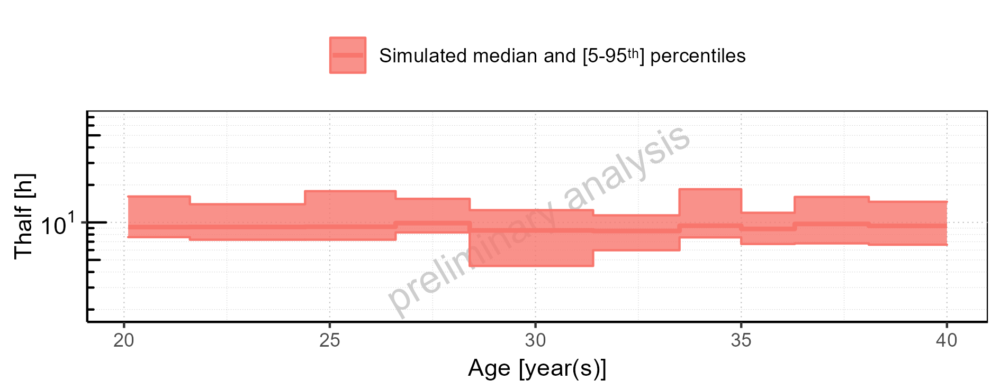

 
 

**Figure 2-242: Age-dependence of Thalf for Filmcoated_tablet_400mg_sd. Profiles are plotted in a linear scale.**

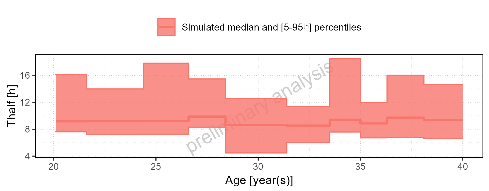

 
 

**Figure 2-243: Height-dependence of Thalf for Larson 2013 8y-18y 400mg FCT meal in comparison to Filmcoated_tablet_400mg_sd. Profiles are plotted in a logarithmic scale.**

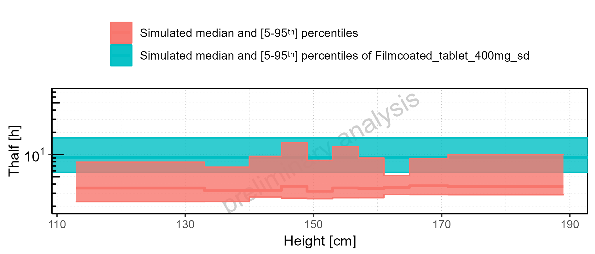

 
 

**Figure 2-244: Height-dependence of Thalf for Larson 2013 8y-18y 400mg FCT meal in comparison to Filmcoated_tablet_400mg_sd. Profiles are plotted in a linear scale.**

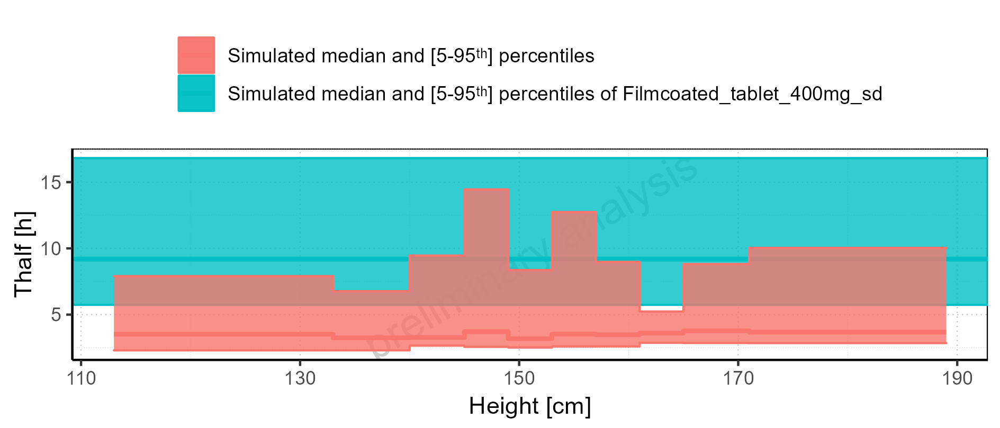

 
 

**Figure 2-245: Height-dependence of Thalf for Larson 2013 8y-18y 400mg FCT meal. Profiles are plotted in a logarithmic scale.**

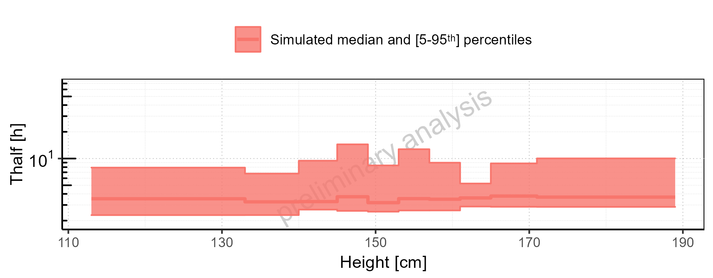

 
 

**Figure 2-246: Height-dependence of Thalf for Larson 2013 8y-18y 400mg FCT meal. Profiles are plotted in a linear scale.**

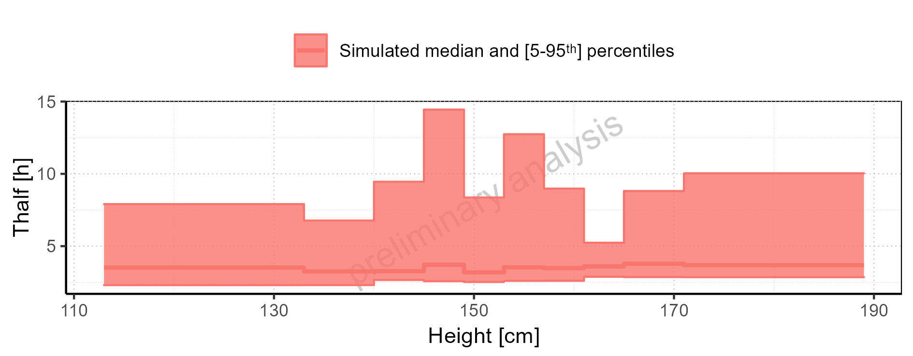

 
 

**Figure 2-247: Height-dependence of Thalf for Filmcoated_tablet_400mg_sd. Profiles are plotted in a logarithmic scale.**

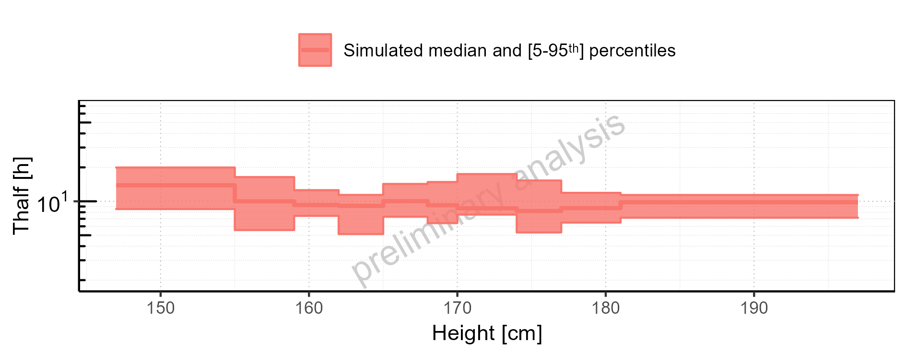

 
 

**Figure 2-248: Height-dependence of Thalf for Filmcoated_tablet_400mg_sd. Profiles are plotted in a linear scale.**

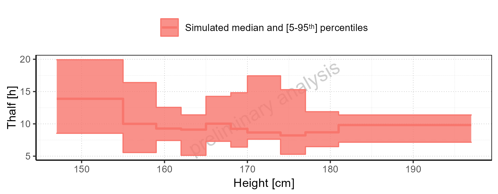

 
 

**Figure 2-249: Weight-dependence of Thalf for Larson 2013 8y-18y 400mg FCT meal in comparison to Filmcoated_tablet_400mg_sd. Profiles are plotted in a logarithmic scale.**

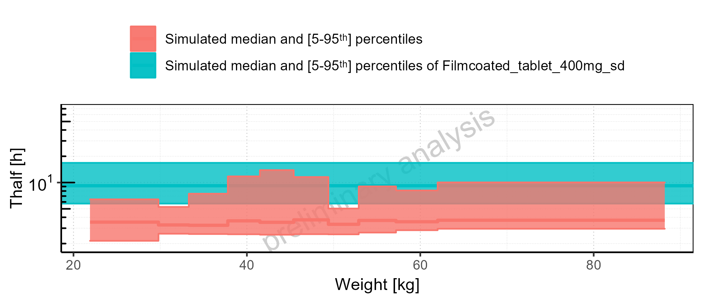

 
 

**Figure 2-250: Weight-dependence of Thalf for Larson 2013 8y-18y 400mg FCT meal in comparison to Filmcoated_tablet_400mg_sd. Profiles are plotted in a linear scale.**

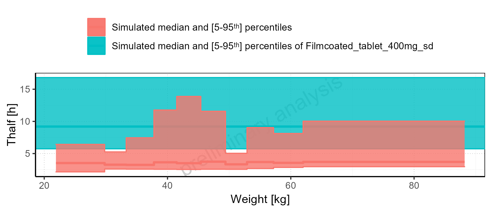

 
 

**Figure 2-251: Weight-dependence of Thalf for Larson 2013 8y-18y 400mg FCT meal. Profiles are plotted in a logarithmic scale.**

 
 

**Figure 2-252: Weight-dependence of Thalf for Larson 2013 8y-18y 400mg FCT meal. Profiles are plotted in a linear scale.**

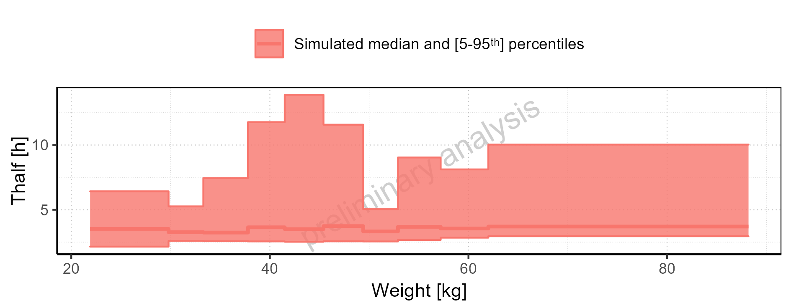

 
 

**Figure 2-253: Weight-dependence of Thalf for Filmcoated_tablet_400mg_sd. Profiles are plotted in a logarithmic scale.**

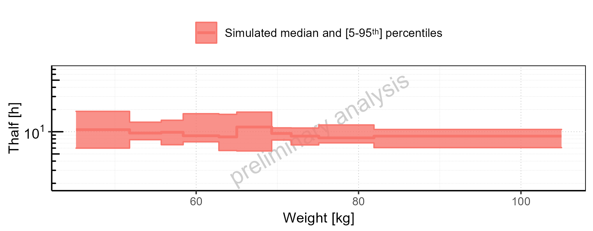

 
 

**Figure 2-254: Weight-dependence of Thalf for Filmcoated_tablet_400mg_sd. Profiles are plotted in a linear scale.**

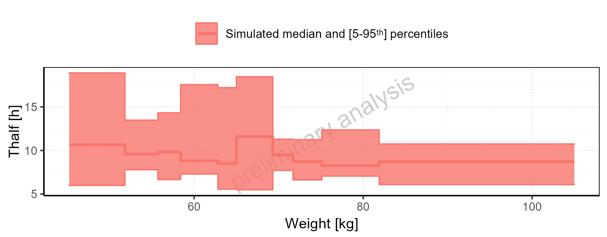

 
 

**Figure 2-255: BMI-dependence of Thalf for Larson 2013 8y-18y 400mg FCT meal in comparison to Filmcoated_tablet_400mg_sd. Profiles are plotted in a logarithmic scale.**

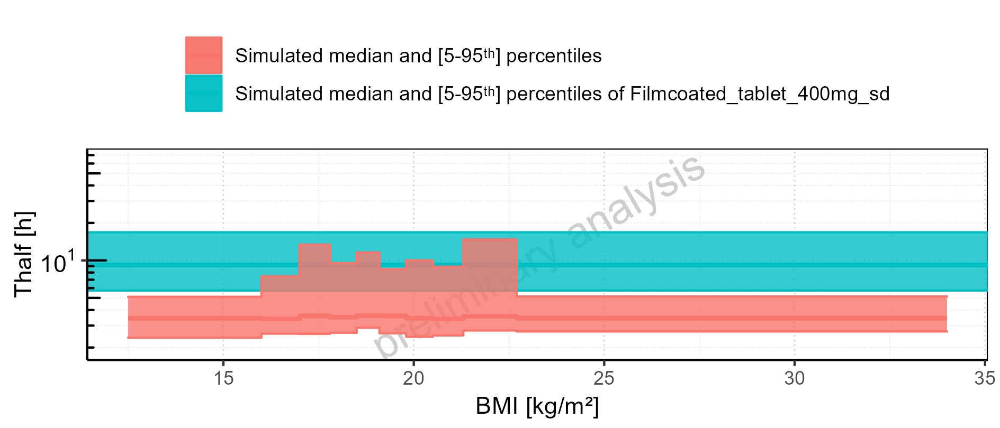

 
 

**Figure 2-256: BMI-dependence of Thalf for Larson 2013 8y-18y 400mg FCT meal in comparison to Filmcoated_tablet_400mg_sd. Profiles are plotted in a linear scale.**

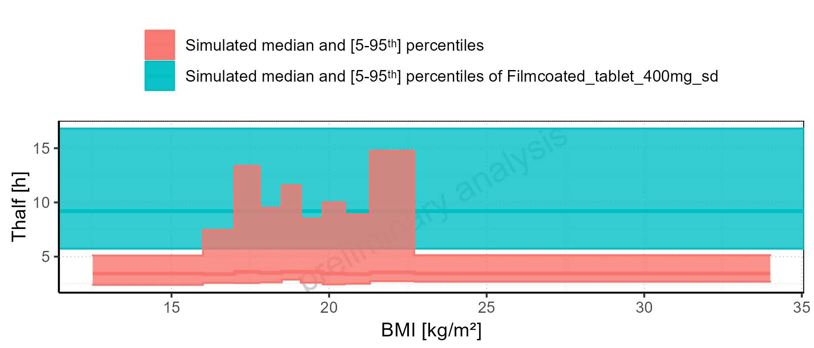

 
 

**Figure 2-257: BMI-dependence of Thalf for Larson 2013 8y-18y 400mg FCT meal. Profiles are plotted in a logarithmic scale.**

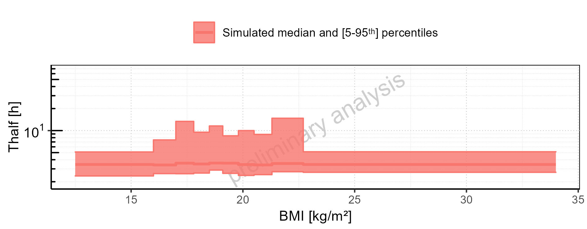

 
 

**Figure 2-258: BMI-dependence of Thalf for Larson 2013 8y-18y 400mg FCT meal. Profiles are plotted in a linear scale.**

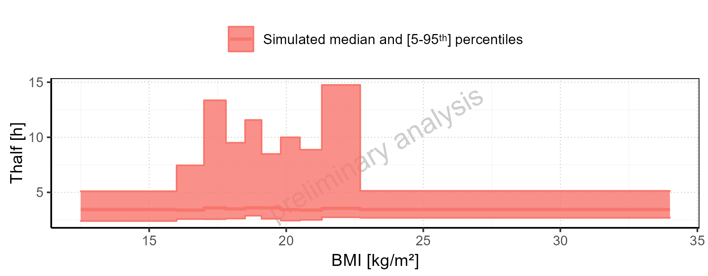

 
 

**Figure 2-259: BMI-dependence of Thalf for Filmcoated_tablet_400mg_sd. Profiles are plotted in a logarithmic scale.**

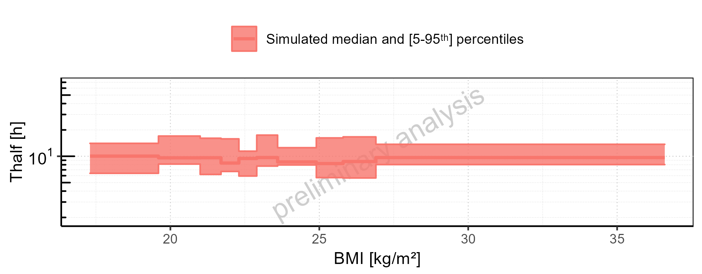

 
 

**Figure 2-260: BMI-dependence of Thalf for Filmcoated_tablet_400mg_sd. Profiles are plotted in a linear scale.**

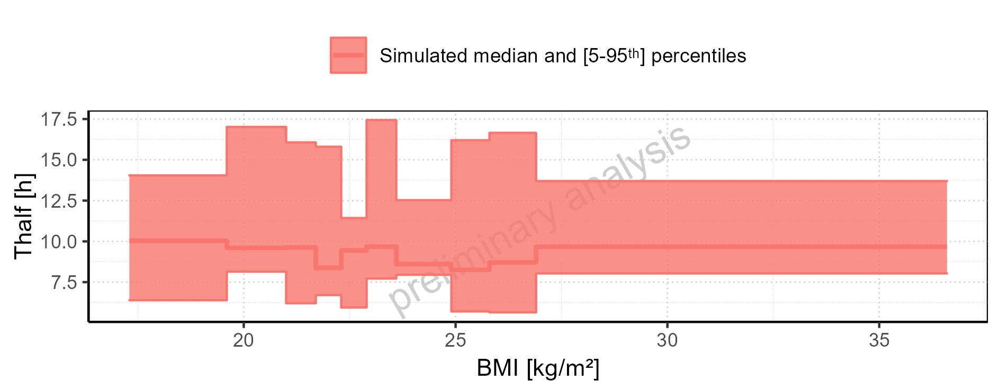

 
 

### 2.1.11 CL

**Figure 2-261: CL of Raltegravir for Larson 2013 8y-18y 400mg FCT meal, Filmcoated_tablet_400mg_sd shown as box-whisker plot, which indicates the 5<U+1D57><U+02B0>, 25<U+1D57><U+02B0>, 50<U+1D57><U+02B0>, 75<U+1D57><U+02B0>, 95<U+1D57><U+02B0> percentiles in logarithmic scale.**

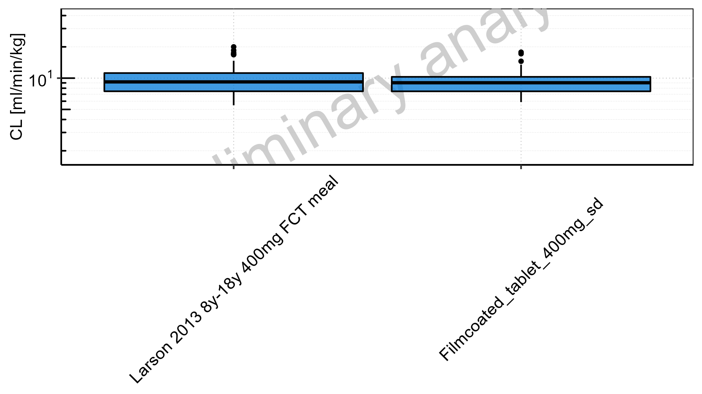

 
 

**Figure 2-262: CL of Raltegravir for Larson 2013 8y-18y 400mg FCT meal, Filmcoated_tablet_400mg_sd shown as box-whisker plot, which indicates the 5<U+1D57><U+02B0>, 25<U+1D57><U+02B0>, 50<U+1D57><U+02B0>, 75<U+1D57><U+02B0>, 95<U+1D57><U+02B0> percentiles in linear scale.**

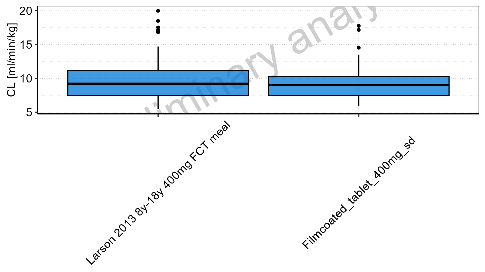

 
 

**Table 2-11: CL of Raltegravir for Larson 2013 8y-18y 400mg FCT meal, Filmcoated_tablet_400mg_sd reported in [ml/min/kg]**

|Population                        |N   |5<U+1D57><U+02B0> pctl |25<U+1D57><U+02B0> pctl |50<U+1D57><U+02B0> pctl |75<U+1D57><U+02B0> pctl |95<U+1D57><U+02B0> pctl |Mean |SD   |Geo Mean |Geo SD |
|:---------------------------------|:---|:----------------------|:-----------------------|:-----------------------|:-----------------------|:-----------------------|:----|:----|:--------|:------|
|Larson 2013 8y-18y 400mg FCT meal |497 |5.48                   |7.47                    |9.20                    |11.19                   |14.71                   |9.49 |2.84 |9.08     |1.35   |
|Filmcoated_tablet_400mg_sd        |100 |5.88                   |7.47                    |9.03                    |10.29                   |13.49                   |9.20 |2.50 |8.89     |1.30   |

 
 

**Figure 2-263: Age-dependence of CL for Larson 2013 8y-18y 400mg FCT meal in comparison to Filmcoated_tablet_400mg_sd. Profiles are plotted in a logarithmic scale.**

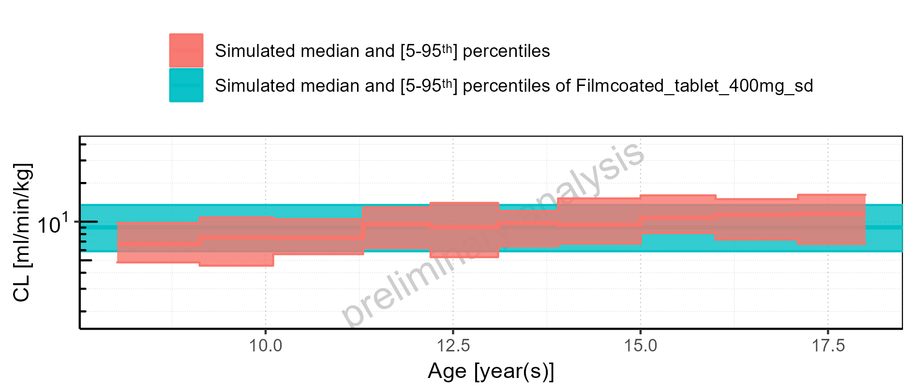

 
 

**Figure 2-264: Age-dependence of CL for Larson 2013 8y-18y 400mg FCT meal in comparison to Filmcoated_tablet_400mg_sd. Profiles are plotted in a linear scale.**

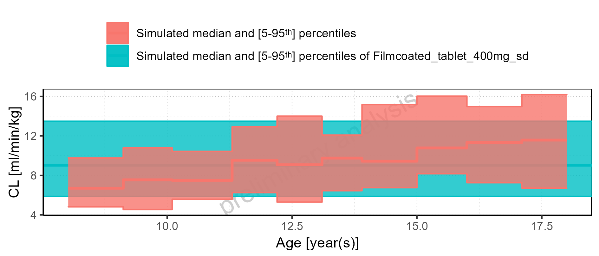

 
 

**Figure 2-265: Age-dependence of CL for Larson 2013 8y-18y 400mg FCT meal. Profiles are plotted in a logarithmic scale.**

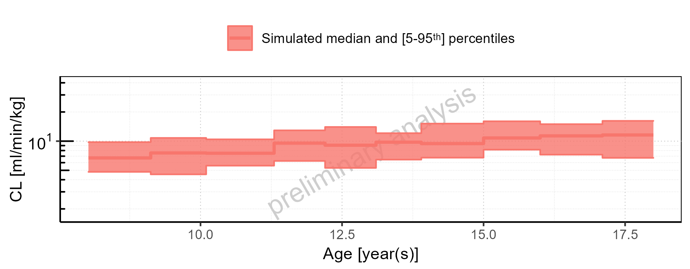

 
 

**Figure 2-266: Age-dependence of CL for Larson 2013 8y-18y 400mg FCT meal. Profiles are plotted in a linear scale.**

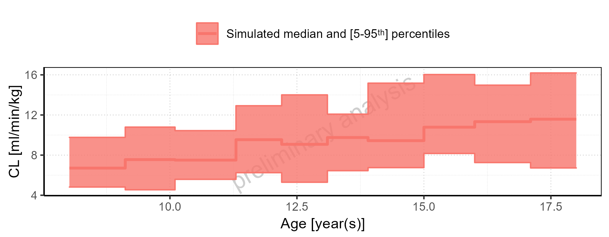

 
 

**Figure 2-267: Age-dependence of CL for Filmcoated_tablet_400mg_sd. Profiles are plotted in a logarithmic scale.**

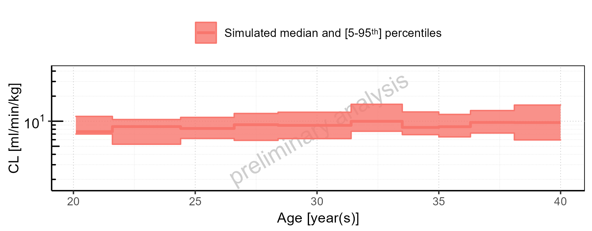

 
 

**Figure 2-268: Age-dependence of CL for Filmcoated_tablet_400mg_sd. Profiles are plotted in a linear scale.**

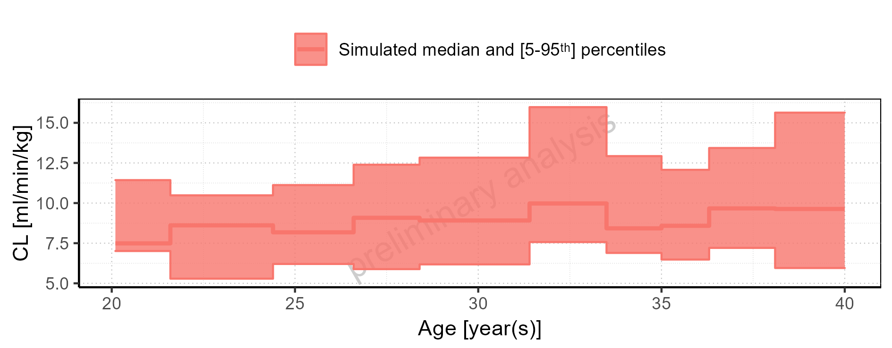

 
 

**Figure 2-269: Height-dependence of CL for Larson 2013 8y-18y 400mg FCT meal in comparison to Filmcoated_tablet_400mg_sd. Profiles are plotted in a logarithmic scale.**

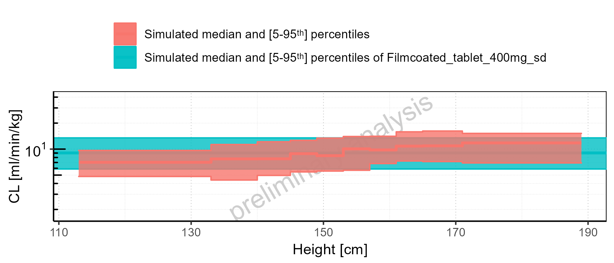

 
 

**Figure 2-270: Height-dependence of CL for Larson 2013 8y-18y 400mg FCT meal in comparison to Filmcoated_tablet_400mg_sd. Profiles are plotted in a linear scale.**

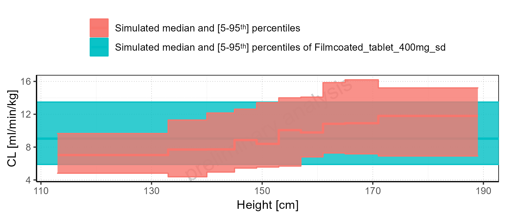

 
 

**Figure 2-271: Height-dependence of CL for Larson 2013 8y-18y 400mg FCT meal. Profiles are plotted in a logarithmic scale.**

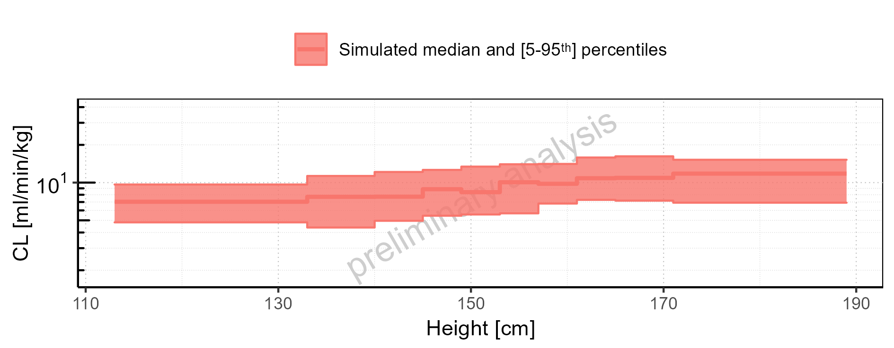

 
 

**Figure 2-272: Height-dependence of CL for Larson 2013 8y-18y 400mg FCT meal. Profiles are plotted in a linear scale.**

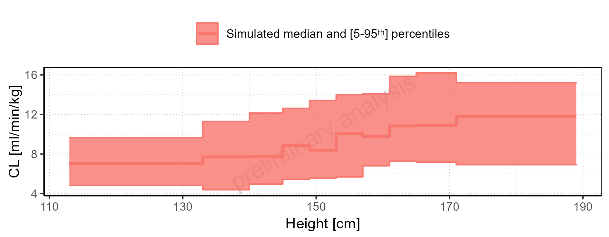

 
 

**Figure 2-273: Height-dependence of CL for Filmcoated_tablet_400mg_sd. Profiles are plotted in a logarithmic scale.**

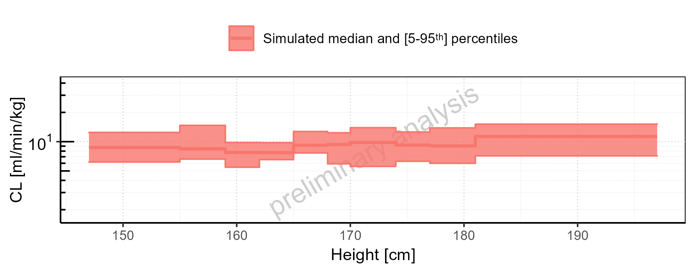

 
 

**Figure 2-274: Height-dependence of CL for Filmcoated_tablet_400mg_sd. Profiles are plotted in a linear scale.**

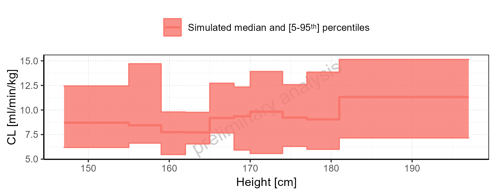

 
 

**Figure 2-275: Weight-dependence of CL for Larson 2013 8y-18y 400mg FCT meal in comparison to Filmcoated_tablet_400mg_sd. Profiles are plotted in a logarithmic scale.**

 
 

**Figure 2-276: Weight-dependence of CL for Larson 2013 8y-18y 400mg FCT meal in comparison to Filmcoated_tablet_400mg_sd. Profiles are plotted in a linear scale.**

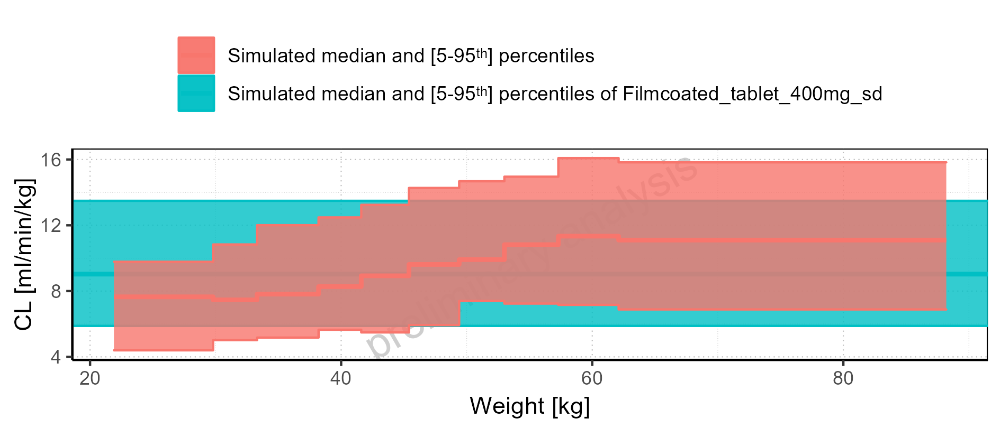

 
 

**Figure 2-277: Weight-dependence of CL for Larson 2013 8y-18y 400mg FCT meal. Profiles are plotted in a logarithmic scale.**

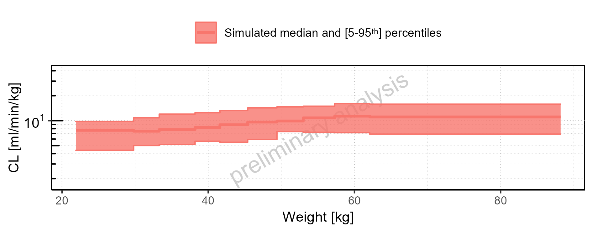

 
 

**Figure 2-278: Weight-dependence of CL for Larson 2013 8y-18y 400mg FCT meal. Profiles are plotted in a linear scale.**

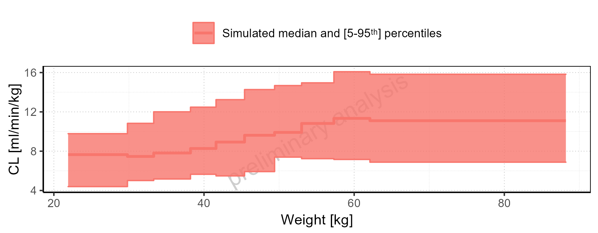

 
 

**Figure 2-279: Weight-dependence of CL for Filmcoated_tablet_400mg_sd. Profiles are plotted in a logarithmic scale.**

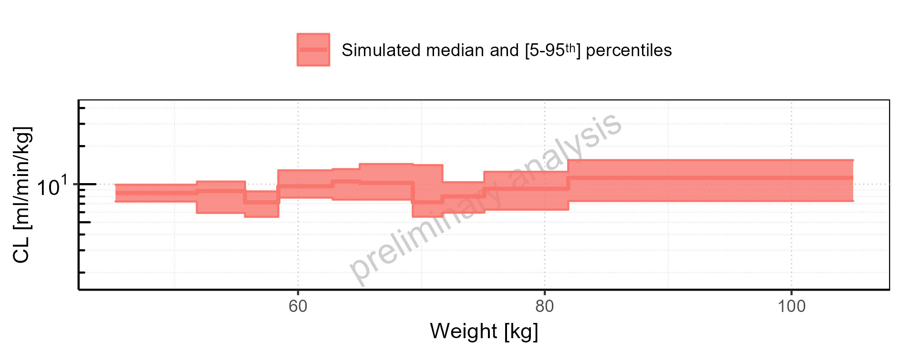

 
 

**Figure 2-280: Weight-dependence of CL for Filmcoated_tablet_400mg_sd. Profiles are plotted in a linear scale.**

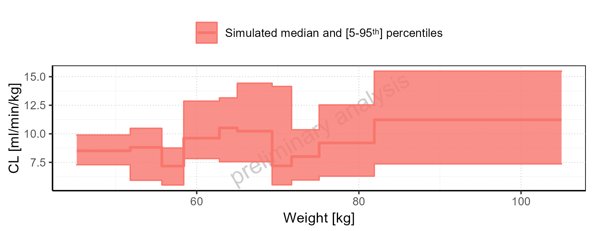

 
 

**Figure 2-281: BMI-dependence of CL for Larson 2013 8y-18y 400mg FCT meal in comparison to Filmcoated_tablet_400mg_sd. Profiles are plotted in a logarithmic scale.**

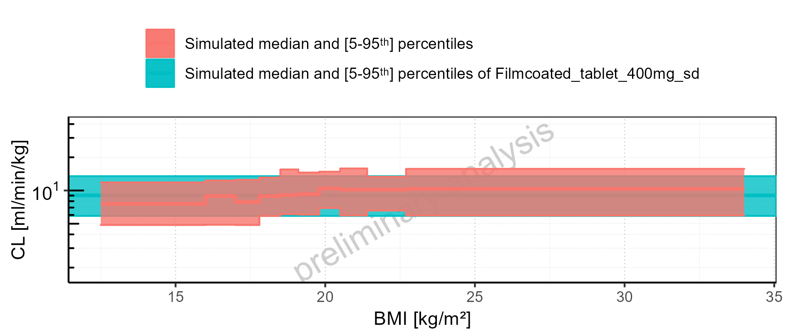

 
 

**Figure 2-282: BMI-dependence of CL for Larson 2013 8y-18y 400mg FCT meal in comparison to Filmcoated_tablet_400mg_sd. Profiles are plotted in a linear scale.**

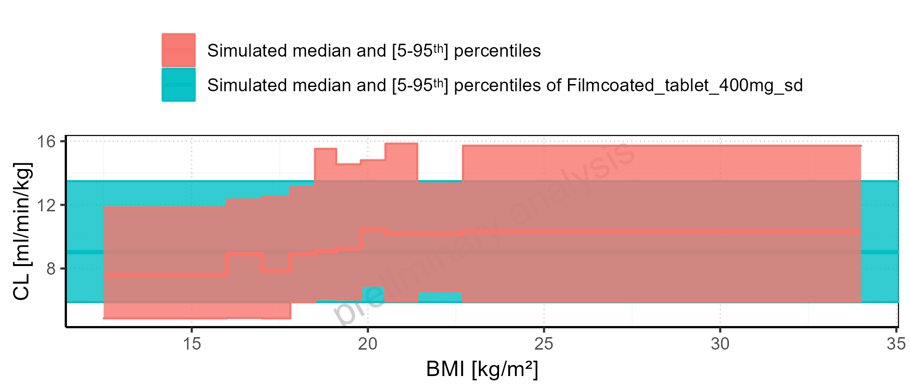

 
 

**Figure 2-283: BMI-dependence of CL for Larson 2013 8y-18y 400mg FCT meal. Profiles are plotted in a logarithmic scale.**

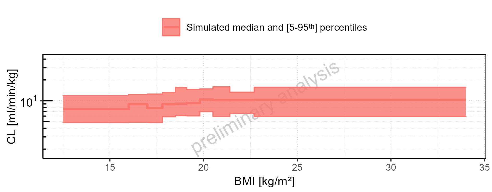

 
 

**Figure 2-284: BMI-dependence of CL for Larson 2013 8y-18y 400mg FCT meal. Profiles are plotted in a linear scale.**

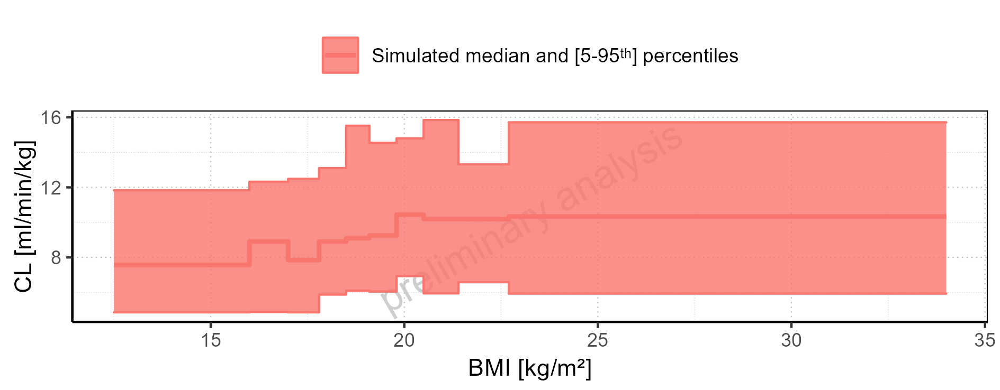

 
 

**Figure 2-285: BMI-dependence of CL for Filmcoated_tablet_400mg_sd. Profiles are plotted in a logarithmic scale.**

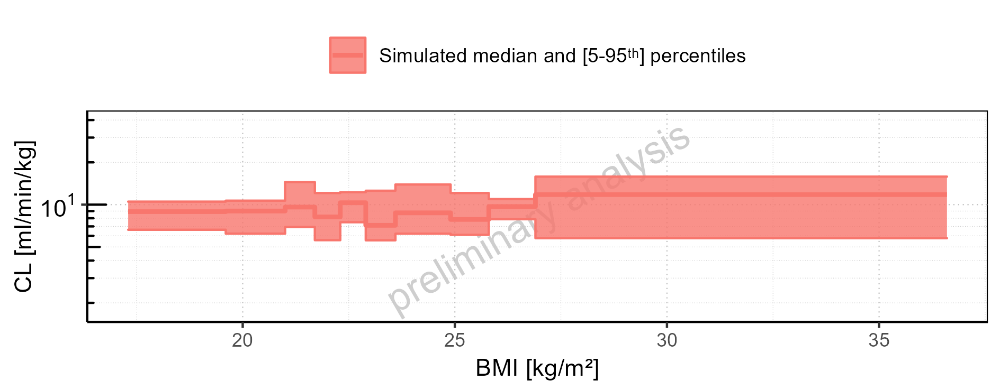

 
 

**Figure 2-286: BMI-dependence of CL for Filmcoated_tablet_400mg_sd. Profiles are plotted in a linear scale.**

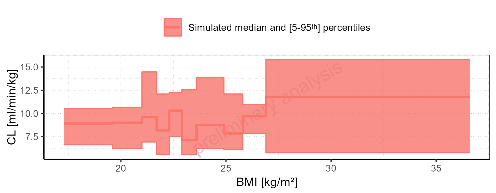

 
 

### 2.1.12 Vss

**Figure 2-287: Vss of Raltegravir for Larson 2013 8y-18y 400mg FCT meal, Filmcoated_tablet_400mg_sd shown as box-whisker plot, which indicates the 5<U+1D57><U+02B0>, 25<U+1D57><U+02B0>, 50<U+1D57><U+02B0>, 75<U+1D57><U+02B0>, 95<U+1D57><U+02B0> percentiles in logarithmic scale.**

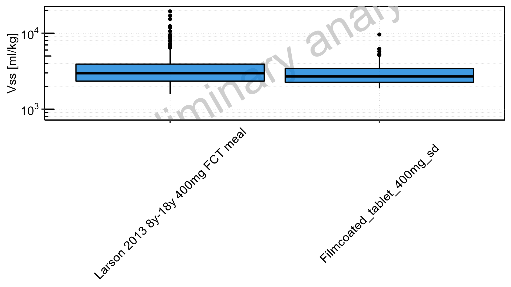

 
 

**Figure 2-288: Vss of Raltegravir for Larson 2013 8y-18y 400mg FCT meal, Filmcoated_tablet_400mg_sd shown as box-whisker plot, which indicates the 5<U+1D57><U+02B0>, 25<U+1D57><U+02B0>, 50<U+1D57><U+02B0>, 75<U+1D57><U+02B0>, 95<U+1D57><U+02B0> percentiles in linear scale.**

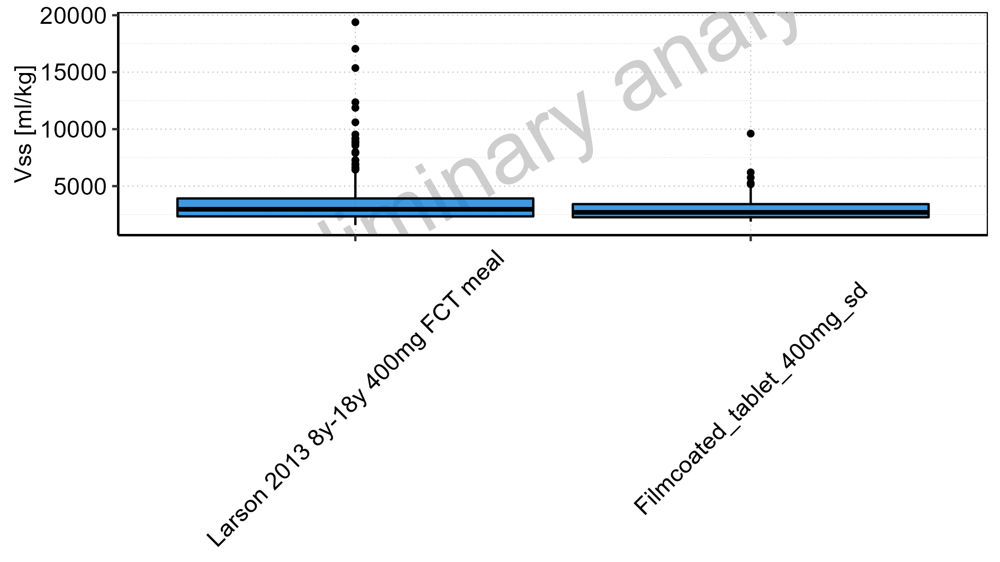

 
 

**Table 2-12: Vss of Raltegravir for Larson 2013 8y-18y 400mg FCT meal, Filmcoated_tablet_400mg_sd reported in [ml/kg]**

|Population                        |N   |5<U+1D57><U+02B0> pctl |25<U+1D57><U+02B0> pctl |50<U+1D57><U+02B0> pctl |75<U+1D57><U+02B0> pctl |95<U+1D57><U+02B0> pctl |Mean    |SD      |Geo Mean |Geo SD |
|:---------------------------------|:---|:----------------------|:-----------------------|:-----------------------|:-----------------------|:-----------------------|:-------|:-------|:--------|:------|
|Larson 2013 8y-18y 400mg FCT meal |497 |1581.09                |2341.62                 |2968.06                 |3917.84                 |6249.02                 |3396.63 |1880.06 |3071.48  |1.53   |
|Filmcoated_tablet_400mg_sd        |100 |1880.27                |2263.55                 |2695.83                 |3418.90                 |4890.56                 |2993.70 |1138.98 |2836.19  |1.37   |

 
 

**Figure 2-289: Age-dependence of Vss for Larson 2013 8y-18y 400mg FCT meal in comparison to Filmcoated_tablet_400mg_sd. Profiles are plotted in a logarithmic scale.**

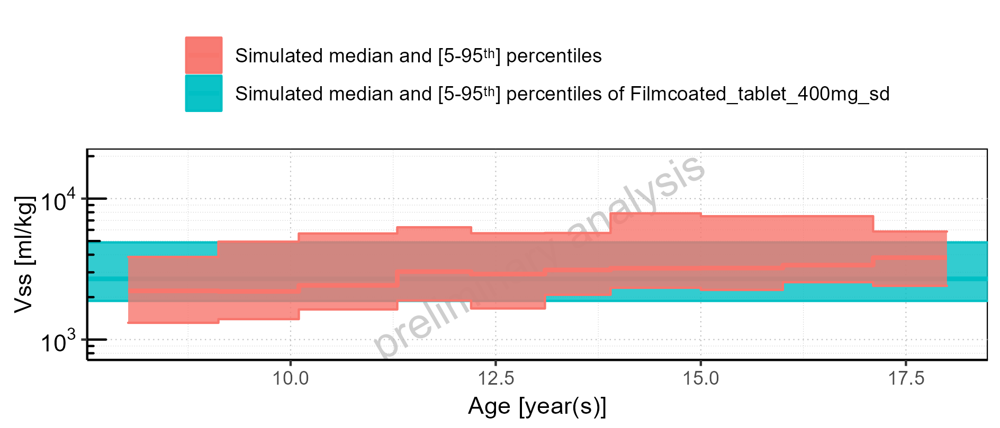

 
 

**Figure 2-290: Age-dependence of Vss for Larson 2013 8y-18y 400mg FCT meal in comparison to Filmcoated_tablet_400mg_sd. Profiles are plotted in a linear scale.**

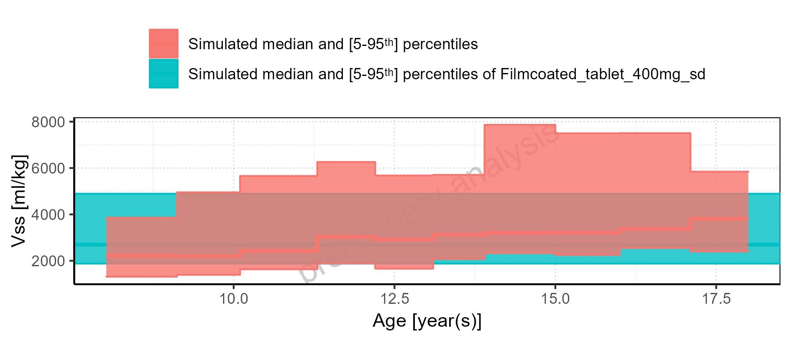

 
 

**Figure 2-291: Age-dependence of Vss for Larson 2013 8y-18y 400mg FCT meal. Profiles are plotted in a logarithmic scale.**

 
 

**Figure 2-292: Age-dependence of Vss for Larson 2013 8y-18y 400mg FCT meal. Profiles are plotted in a linear scale.**

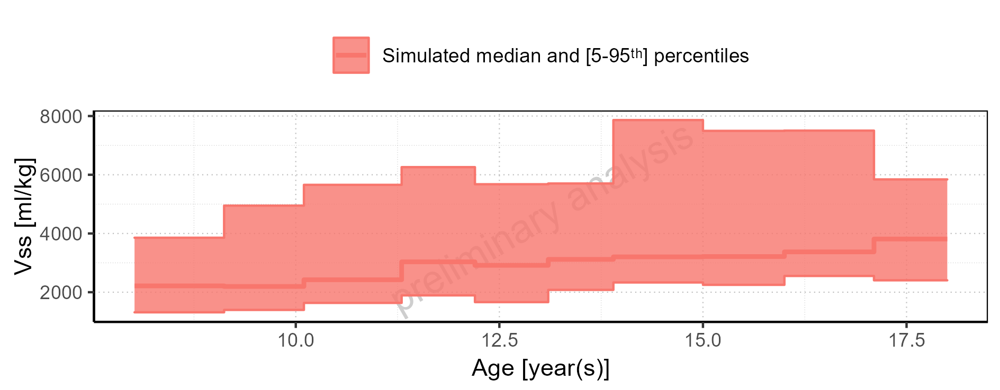

 
 

**Figure 2-293: Age-dependence of Vss for Filmcoated_tablet_400mg_sd. Profiles are plotted in a logarithmic scale.**

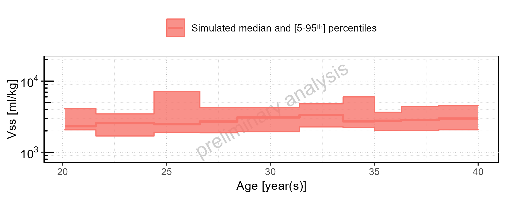

 
 

**Figure 2-294: Age-dependence of Vss for Filmcoated_tablet_400mg_sd. Profiles are plotted in a linear scale.**

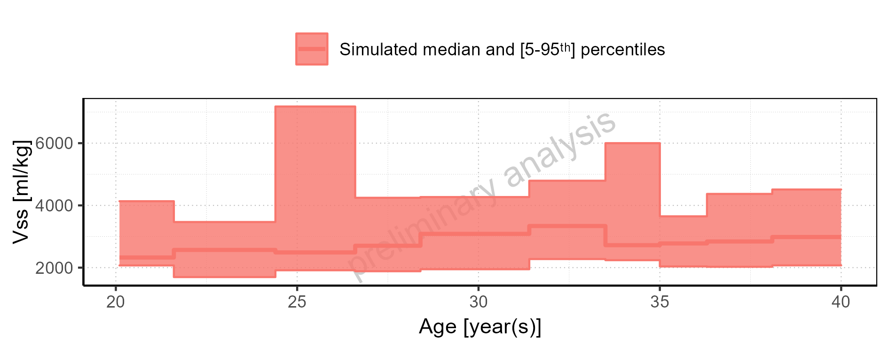

 
 

**Figure 2-295: Height-dependence of Vss for Larson 2013 8y-18y 400mg FCT meal in comparison to Filmcoated_tablet_400mg_sd. Profiles are plotted in a logarithmic scale.**

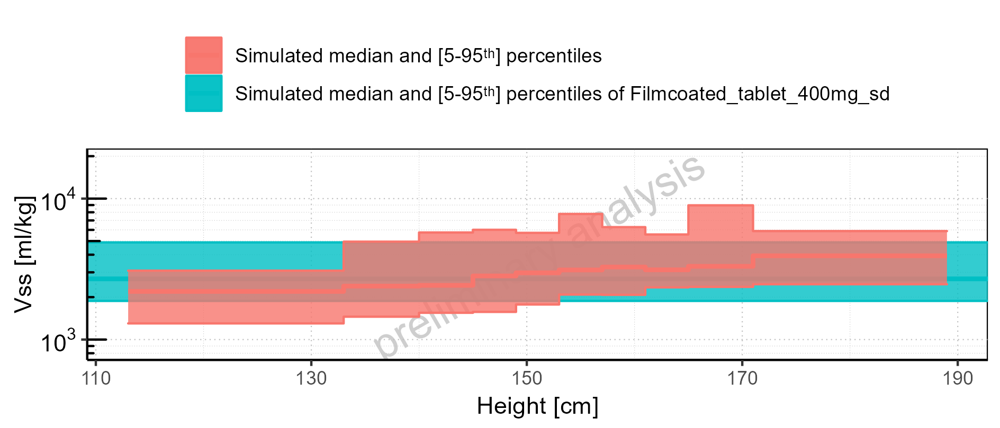

 
 

**Figure 2-296: Height-dependence of Vss for Larson 2013 8y-18y 400mg FCT meal in comparison to Filmcoated_tablet_400mg_sd. Profiles are plotted in a linear scale.**

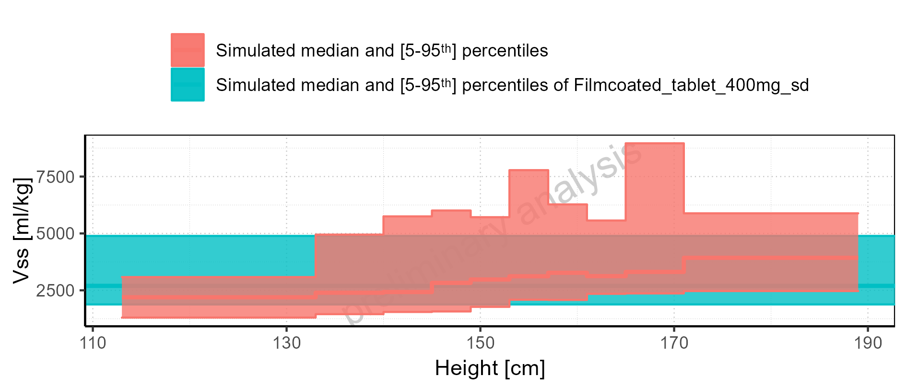

 
 

**Figure 2-297: Height-dependence of Vss for Larson 2013 8y-18y 400mg FCT meal. Profiles are plotted in a logarithmic scale.**

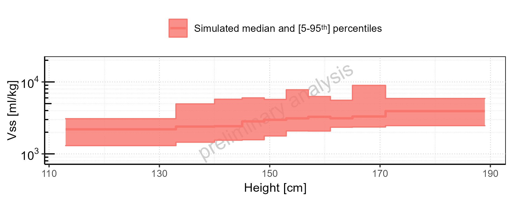

 
 

**Figure 2-298: Height-dependence of Vss for Larson 2013 8y-18y 400mg FCT meal. Profiles are plotted in a linear scale.**

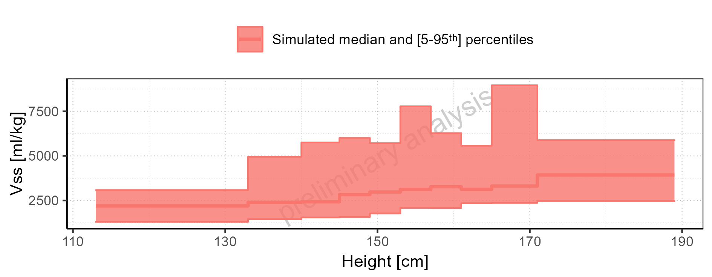

 
 

**Figure 2-299: Height-dependence of Vss for Filmcoated_tablet_400mg_sd. Profiles are plotted in a logarithmic scale.**

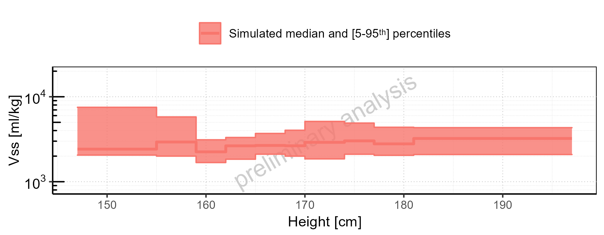

 
 

**Figure 2-300: Height-dependence of Vss for Filmcoated_tablet_400mg_sd. Profiles are plotted in a linear scale.**

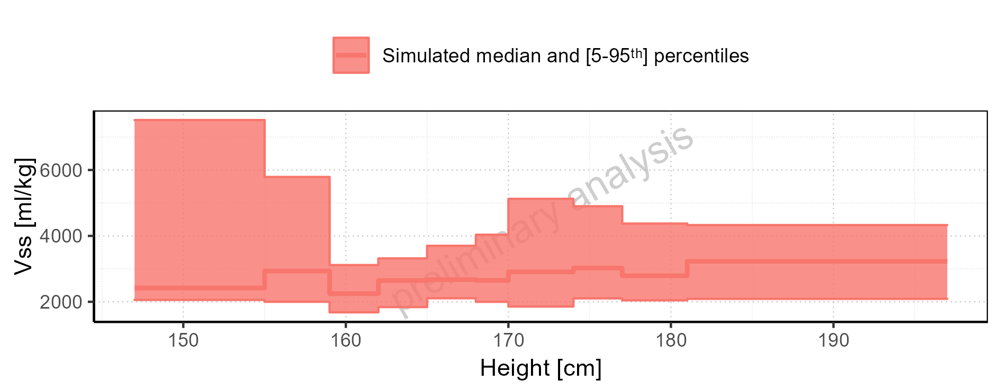

 
 

**Figure 2-301: Weight-dependence of Vss for Larson 2013 8y-18y 400mg FCT meal in comparison to Filmcoated_tablet_400mg_sd. Profiles are plotted in a logarithmic scale.**

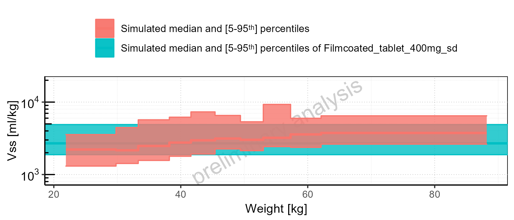

 
 

**Figure 2-302: Weight-dependence of Vss for Larson 2013 8y-18y 400mg FCT meal in comparison to Filmcoated_tablet_400mg_sd. Profiles are plotted in a linear scale.**

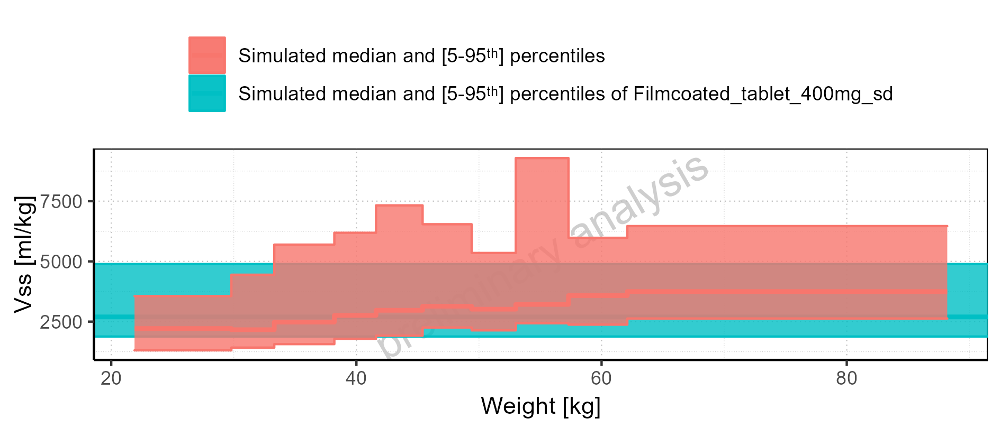

 
 

**Figure 2-303: Weight-dependence of Vss for Larson 2013 8y-18y 400mg FCT meal. Profiles are plotted in a logarithmic scale.**

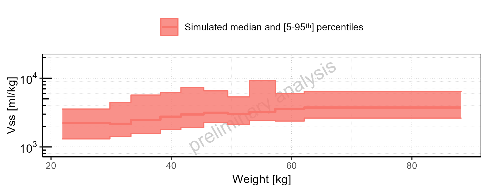

 
 

**Figure 2-304: Weight-dependence of Vss for Larson 2013 8y-18y 400mg FCT meal. Profiles are plotted in a linear scale.**

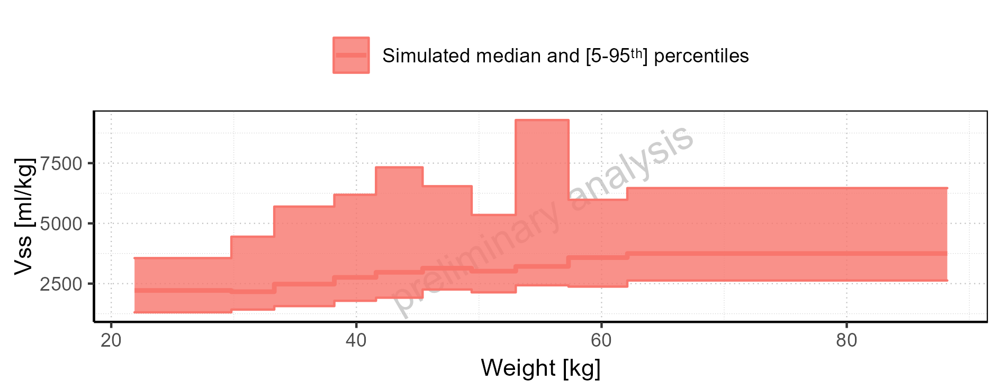

 
 

**Figure 2-305: Weight-dependence of Vss for Filmcoated_tablet_400mg_sd. Profiles are plotted in a logarithmic scale.**

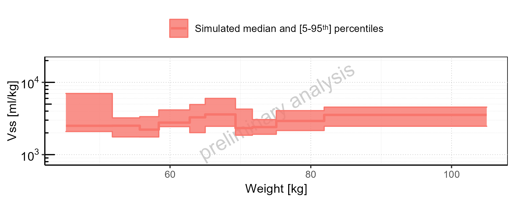

 
 

**Figure 2-306: Weight-dependence of Vss for Filmcoated_tablet_400mg_sd. Profiles are plotted in a linear scale.**

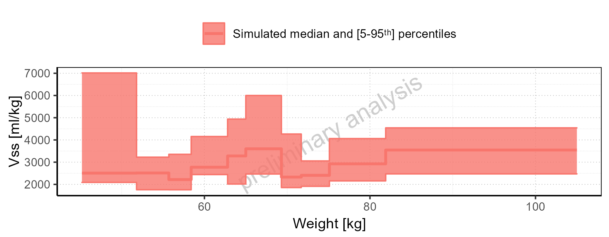

 
 

**Figure 2-307: BMI-dependence of Vss for Larson 2013 8y-18y 400mg FCT meal in comparison to Filmcoated_tablet_400mg_sd. Profiles are plotted in a logarithmic scale.**

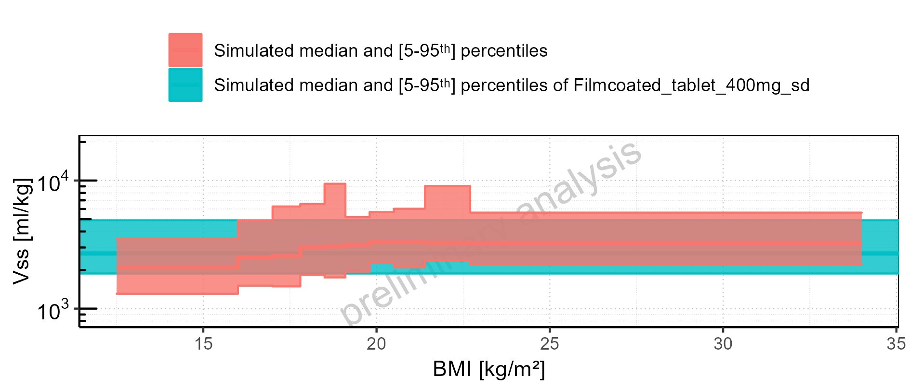

 
 

**Figure 2-308: BMI-dependence of Vss for Larson 2013 8y-18y 400mg FCT meal in comparison to Filmcoated_tablet_400mg_sd. Profiles are plotted in a linear scale.**

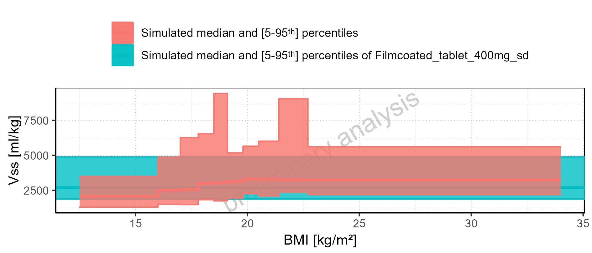

 
 

**Figure 2-309: BMI-dependence of Vss for Larson 2013 8y-18y 400mg FCT meal. Profiles are plotted in a logarithmic scale.**

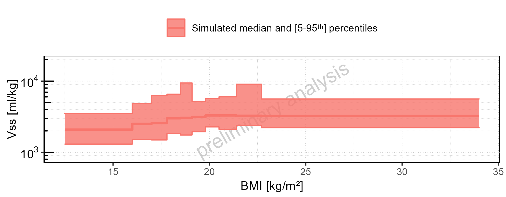

 
 

**Figure 2-310: BMI-dependence of Vss for Larson 2013 8y-18y 400mg FCT meal. Profiles are plotted in a linear scale.**

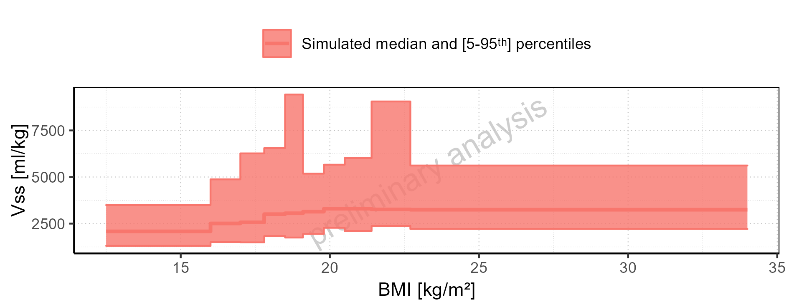

 
 

**Figure 2-311: BMI-dependence of Vss for Filmcoated_tablet_400mg_sd. Profiles are plotted in a logarithmic scale.**

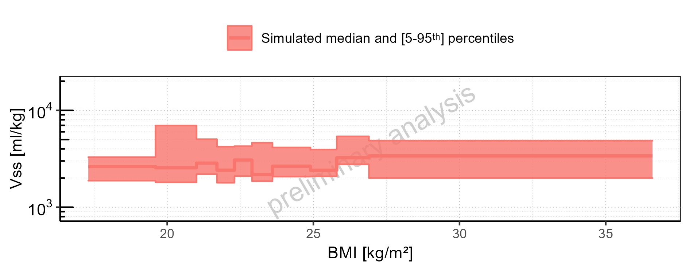

 
 

**Figure 2-312: BMI-dependence of Vss for Filmcoated_tablet_400mg_sd. Profiles are plotted in a linear scale.**

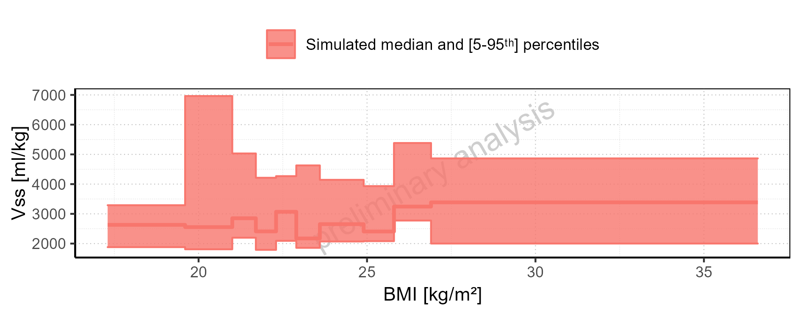

 
 

### 2.1.13 Vd

**Figure 2-313: Vd of Raltegravir for Larson 2013 8y-18y 400mg FCT meal, Filmcoated_tablet_400mg_sd shown as box-whisker plot, which indicates the 5<U+1D57><U+02B0>, 25<U+1D57><U+02B0>, 50<U+1D57><U+02B0>, 75<U+1D57><U+02B0>, 95<U+1D57><U+02B0> percentiles in logarithmic scale.**

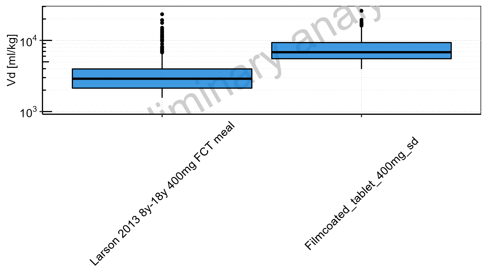

 
 

**Figure 2-314: Vd of Raltegravir for Larson 2013 8y-18y 400mg FCT meal, Filmcoated_tablet_400mg_sd shown as box-whisker plot, which indicates the 5<U+1D57><U+02B0>, 25<U+1D57><U+02B0>, 50<U+1D57><U+02B0>, 75<U+1D57><U+02B0>, 95<U+1D57><U+02B0> percentiles in linear scale.**

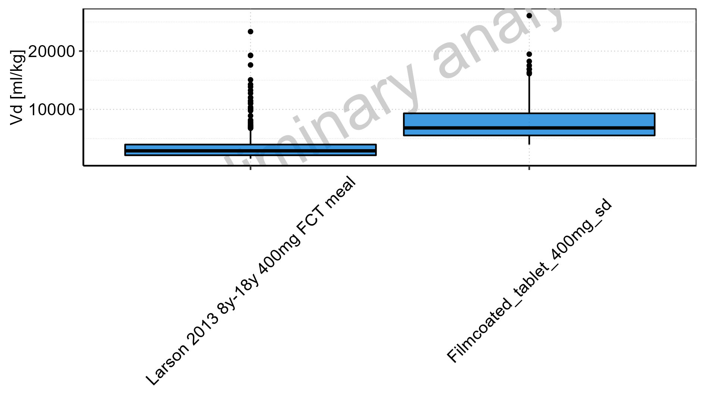

 
 

**Table 2-13: Vd of Raltegravir for Larson 2013 8y-18y 400mg FCT meal, Filmcoated_tablet_400mg_sd reported in [ml/kg]**

|Population                        |N   |5<U+1D57><U+02B0> pctl |25<U+1D57><U+02B0> pctl |50<U+1D57><U+02B0> pctl |75<U+1D57><U+02B0> pctl |95<U+1D57><U+02B0> pctl |Mean    |SD      |Geo Mean |Geo SD |
|:---------------------------------|:---|:----------------------|:-----------------------|:-----------------------|:-----------------------|:-----------------------|:-------|:-------|:--------|:------|
|Larson 2013 8y-18y 400mg FCT meal |497 |1564.17                |2133.96                 |2893.52                 |3971.83                 |7809.40                 |3610.03 |2601.88 |3089.07  |1.67   |
|Filmcoated_tablet_400mg_sd        |100 |3961.86                |5531.19                 |6823.96                 |9325.52                 |16886.12                |8090.43 |4000.17 |7343.52  |1.53   |

 
 

**Figure 2-315: Age-dependence of Vd for Larson 2013 8y-18y 400mg FCT meal in comparison to Filmcoated_tablet_400mg_sd. Profiles are plotted in a logarithmic scale.**

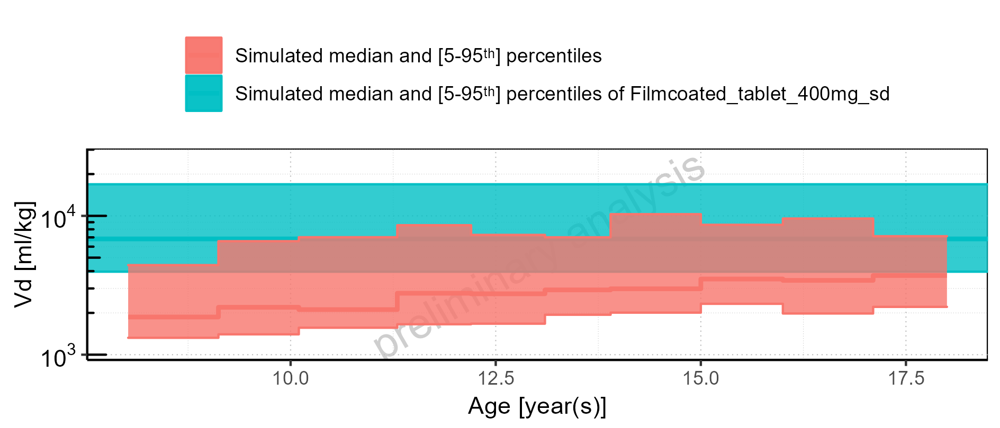

 
 

**Figure 2-316: Age-dependence of Vd for Larson 2013 8y-18y 400mg FCT meal in comparison to Filmcoated_tablet_400mg_sd. Profiles are plotted in a linear scale.**

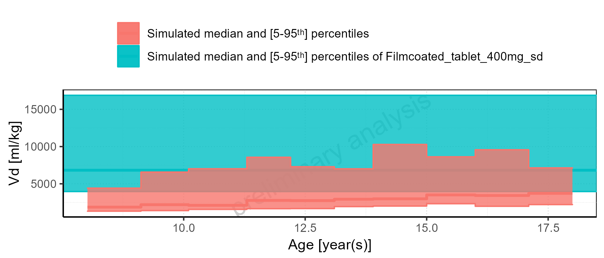

 
 

**Figure 2-317: Age-dependence of Vd for Larson 2013 8y-18y 400mg FCT meal. Profiles are plotted in a logarithmic scale.**

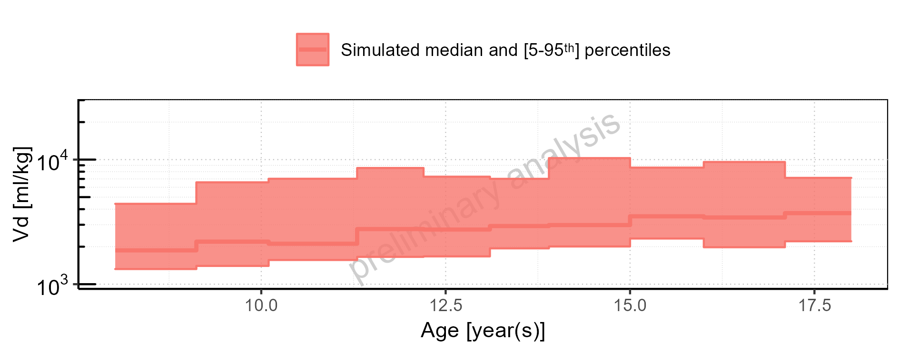

 
 

**Figure 2-318: Age-dependence of Vd for Larson 2013 8y-18y 400mg FCT meal. Profiles are plotted in a linear scale.**

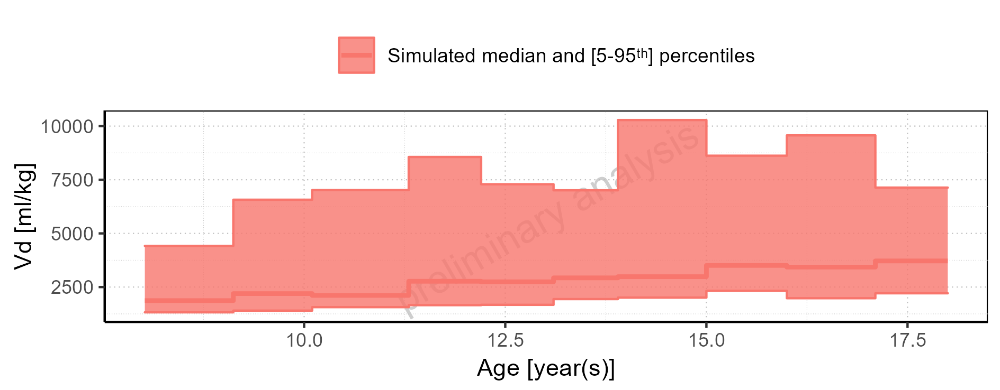

 
 

**Figure 2-319: Age-dependence of Vd for Filmcoated_tablet_400mg_sd. Profiles are plotted in a logarithmic scale.**

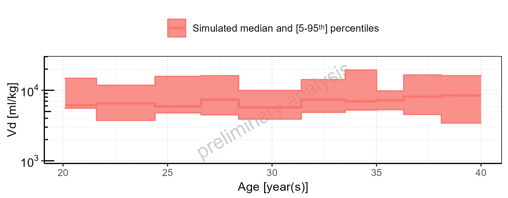

 
 

**Figure 2-320: Age-dependence of Vd for Filmcoated_tablet_400mg_sd. Profiles are plotted in a linear scale.**

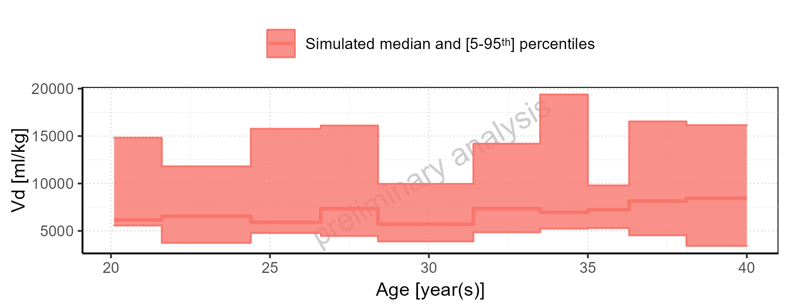

 
 

**Figure 2-321: Height-dependence of Vd for Larson 2013 8y-18y 400mg FCT meal in comparison to Filmcoated_tablet_400mg_sd. Profiles are plotted in a logarithmic scale.**

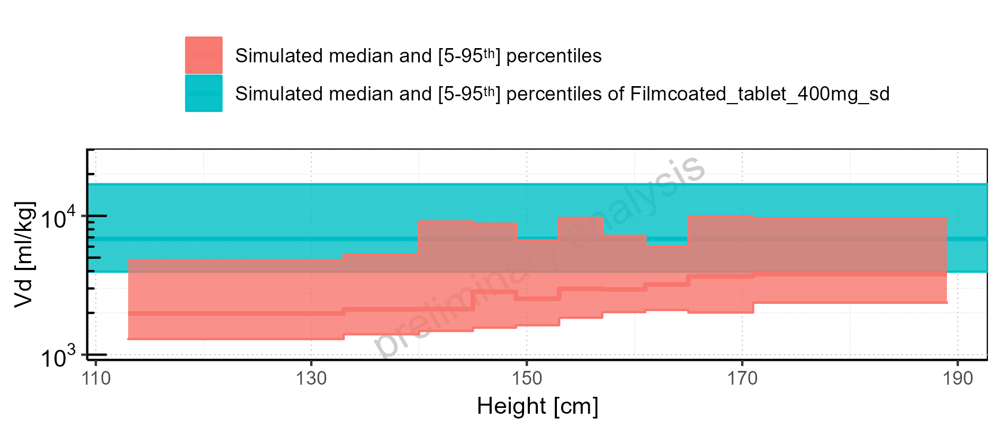

 
 

**Figure 2-322: Height-dependence of Vd for Larson 2013 8y-18y 400mg FCT meal in comparison to Filmcoated_tablet_400mg_sd. Profiles are plotted in a linear scale.**

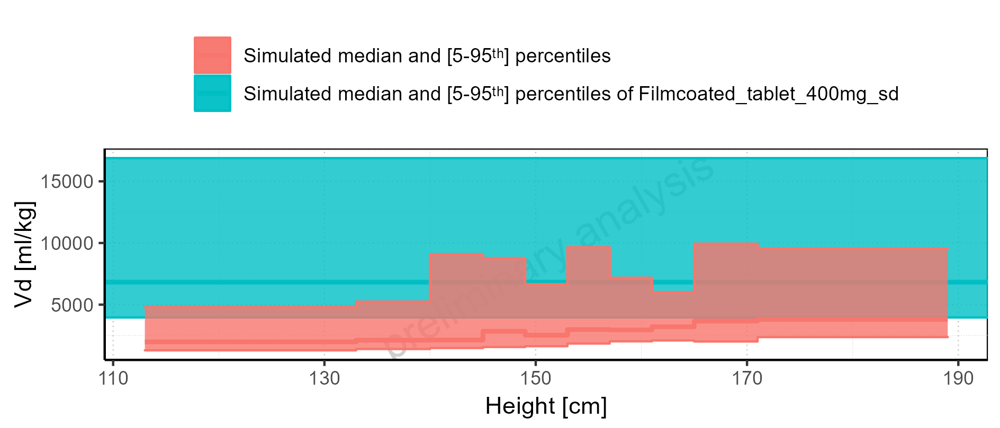

 
 

**Figure 2-323: Height-dependence of Vd for Larson 2013 8y-18y 400mg FCT meal. Profiles are plotted in a logarithmic scale.**

 
 

**Figure 2-324: Height-dependence of Vd for Larson 2013 8y-18y 400mg FCT meal. Profiles are plotted in a linear scale.**

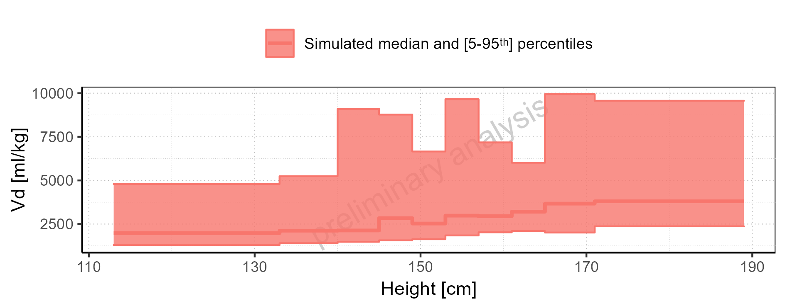

 
 

**Figure 2-325: Height-dependence of Vd for Filmcoated_tablet_400mg_sd. Profiles are plotted in a logarithmic scale.**

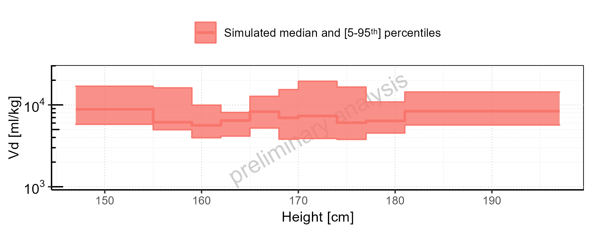

 
 

**Figure 2-326: Height-dependence of Vd for Filmcoated_tablet_400mg_sd. Profiles are plotted in a linear scale.**

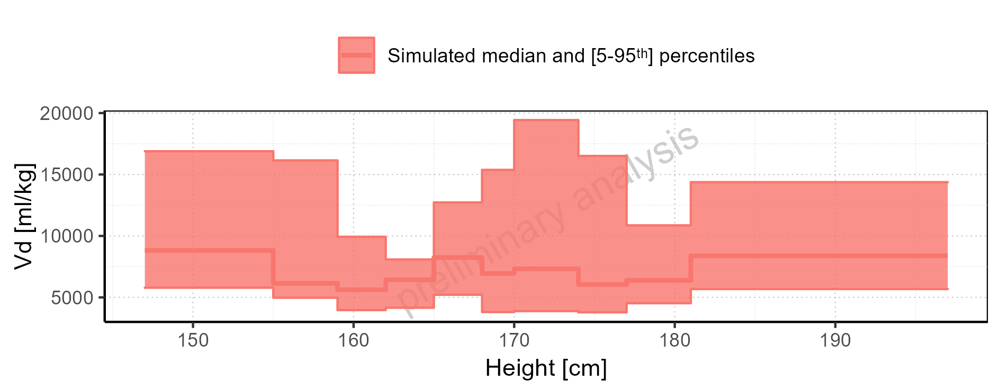

 
 

**Figure 2-327: Weight-dependence of Vd for Larson 2013 8y-18y 400mg FCT meal in comparison to Filmcoated_tablet_400mg_sd. Profiles are plotted in a logarithmic scale.**

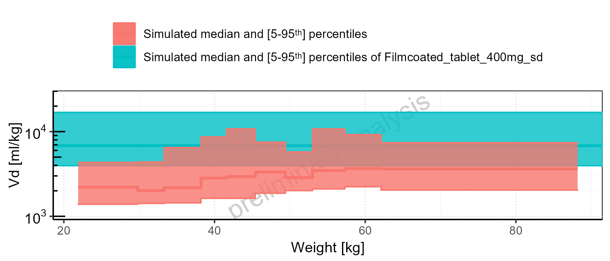

 
 

**Figure 2-328: Weight-dependence of Vd for Larson 2013 8y-18y 400mg FCT meal in comparison to Filmcoated_tablet_400mg_sd. Profiles are plotted in a linear scale.**

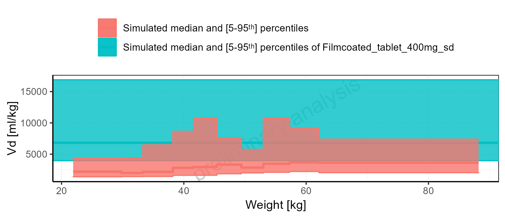

 
 

**Figure 2-329: Weight-dependence of Vd for Larson 2013 8y-18y 400mg FCT meal. Profiles are plotted in a logarithmic scale.**

 
 

**Figure 2-330: Weight-dependence of Vd for Larson 2013 8y-18y 400mg FCT meal. Profiles are plotted in a linear scale.**

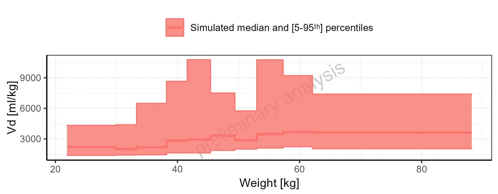

 
 

**Figure 2-331: Weight-dependence of Vd for Filmcoated_tablet_400mg_sd. Profiles are plotted in a logarithmic scale.**

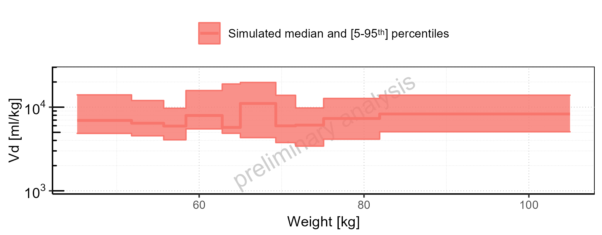

 
 

**Figure 2-332: Weight-dependence of Vd for Filmcoated_tablet_400mg_sd. Profiles are plotted in a linear scale.**

 
 

**Figure 2-333: BMI-dependence of Vd for Larson 2013 8y-18y 400mg FCT meal in comparison to Filmcoated_tablet_400mg_sd. Profiles are plotted in a logarithmic scale.**

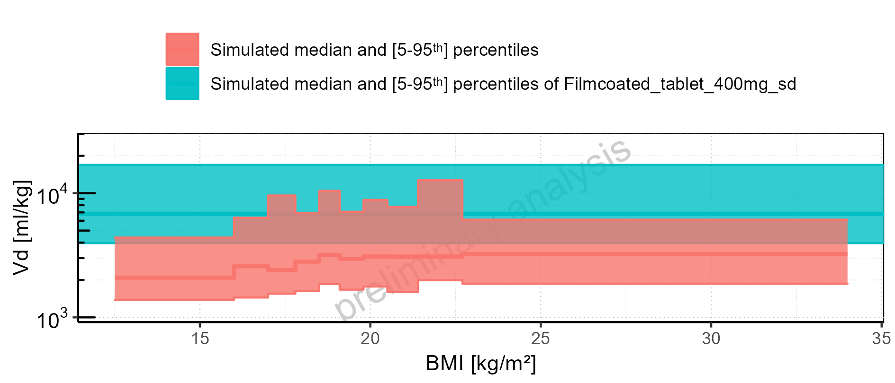

 
 

**Figure 2-334: BMI-dependence of Vd for Larson 2013 8y-18y 400mg FCT meal in comparison to Filmcoated_tablet_400mg_sd. Profiles are plotted in a linear scale.**

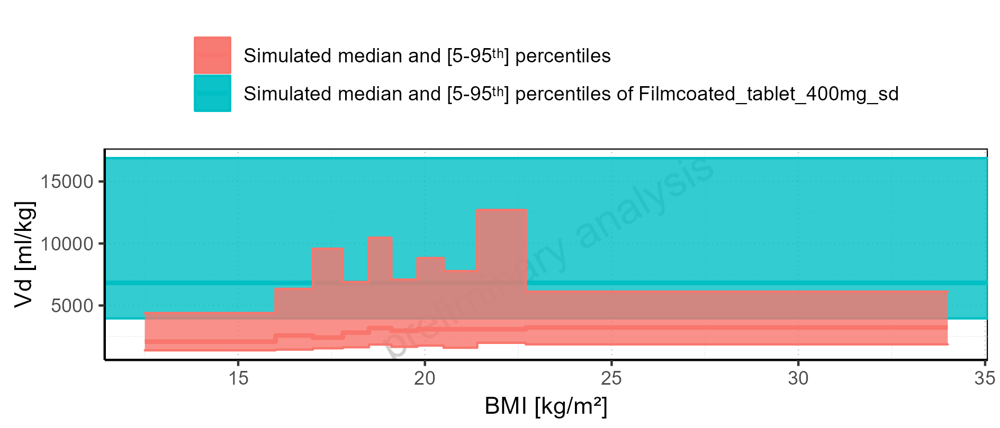

 
 

**Figure 2-335: BMI-dependence of Vd for Larson 2013 8y-18y 400mg FCT meal. Profiles are plotted in a logarithmic scale.**

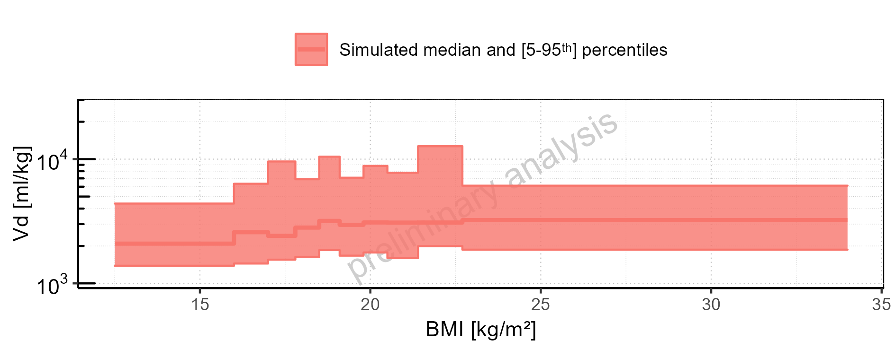

 
 

**Figure 2-336: BMI-dependence of Vd for Larson 2013 8y-18y 400mg FCT meal. Profiles are plotted in a linear scale.**

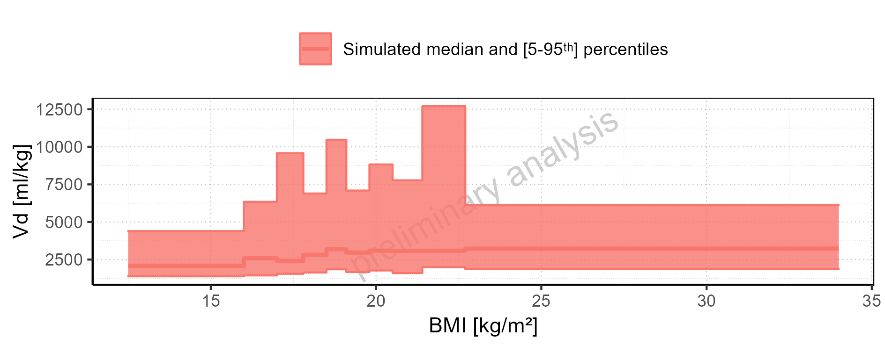

 
 

**Figure 2-337: BMI-dependence of Vd for Filmcoated_tablet_400mg_sd. Profiles are plotted in a logarithmic scale.**

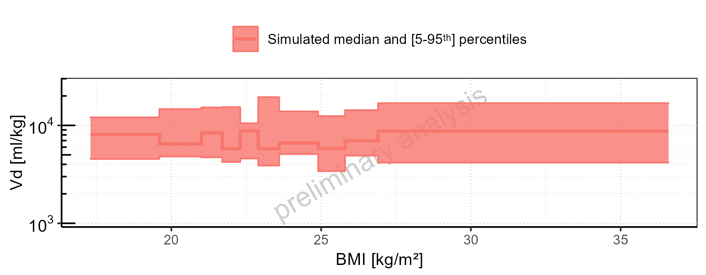

 
 

**Figure 2-338: BMI-dependence of Vd for Filmcoated_tablet_400mg_sd. Profiles are plotted in a linear scale.**

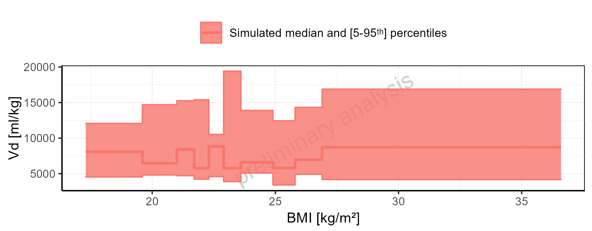

 
 

# 3 Time profiles and residual plots

## 3.1 Time profiles and residual plots for Filmcoated_tablet_400mg_sd

**Figure 3-1: Time profiles for Filmcoated_tablet_400mg_sd. Data source: Data/Raltegravir_PK.txt .. Time profiles are plotted in a linear scale.**

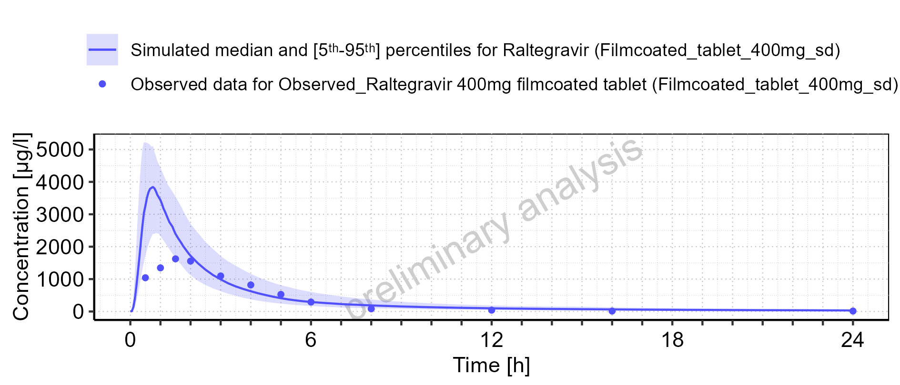

 
 

**Figure 3-2: Time profiles for Filmcoated_tablet_400mg_sd. Data source: Data/Raltegravir_PK.txt .. Time profiles are plotted in a logarithmic scale.**

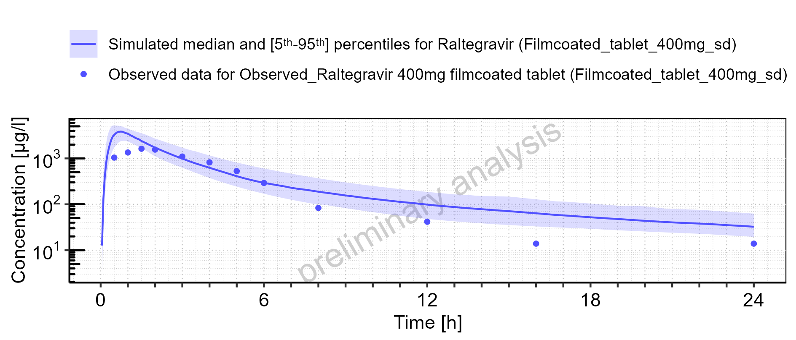

 
 

**Figure 3-3: Predicted (median) vs observed for Filmcoated_tablet_400mg_sd. Data source: Data/Raltegravir_PK.txt .. Predictions and observations are plotted in a linear scale.**

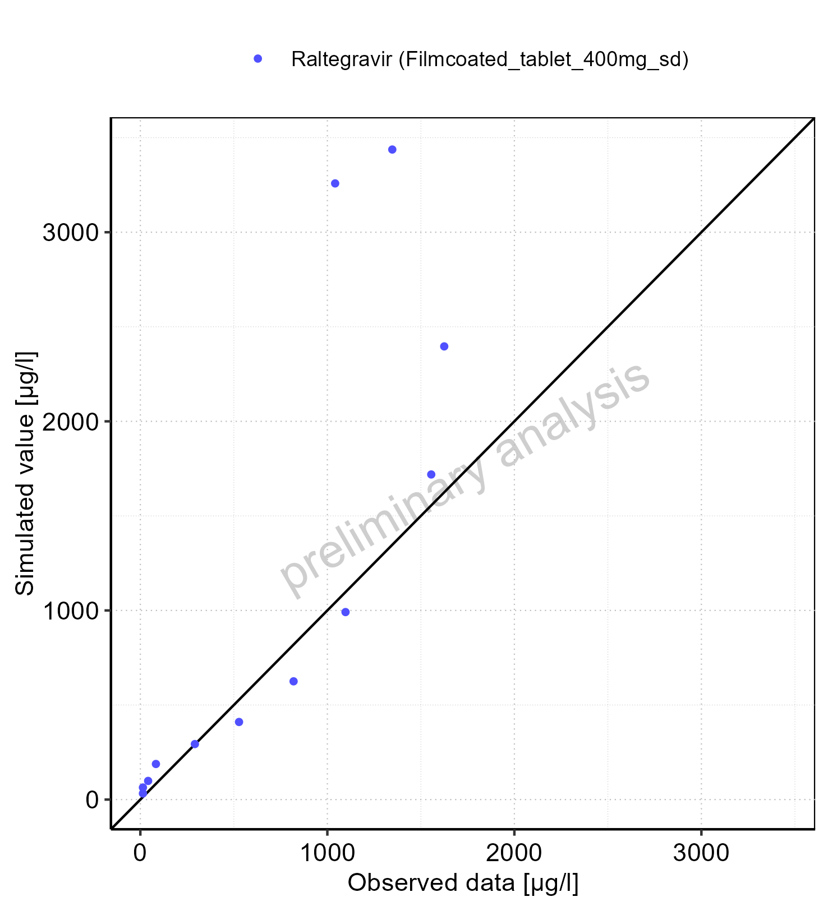

 
 

**Figure 3-4: Predicted (median) vs observed for Filmcoated_tablet_400mg_sd. Data source: Data/Raltegravir_PK.txt .. Predictions and observations are plotted in a logarithmic scale.**

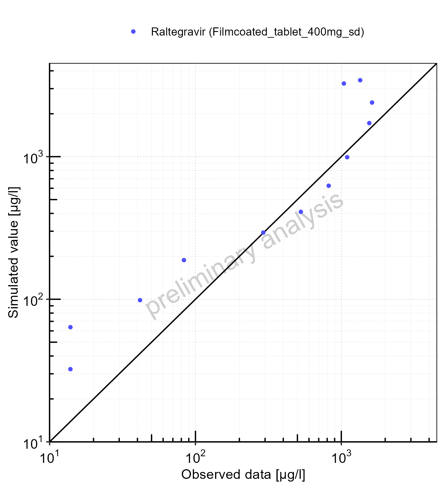

 
 

**Figure 3-5: Logarithmic residuals vs predicted (median) values for Filmcoated_tablet_400mg_sd. Data source: Data/Raltegravir_PK.txt .**

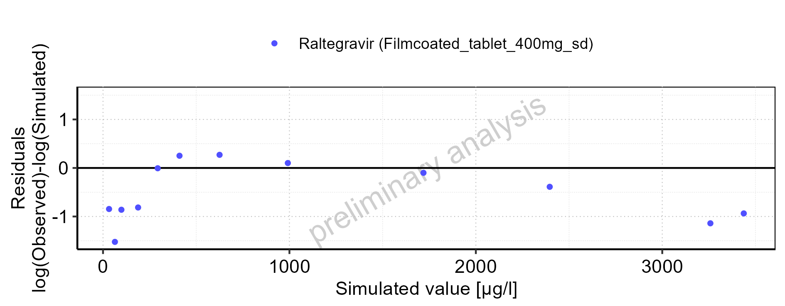

 
 

**Figure 3-6: Logarithmic residuals vs time values for Filmcoated_tablet_400mg_sd. Data source: Data/Raltegravir_PK.txt .**

 
 

**Figure 3-7: Logarithmic residuals distribution (stacked) for Filmcoated_tablet_400mg_sd. Data source: Data/Raltegravir_PK.txt .**

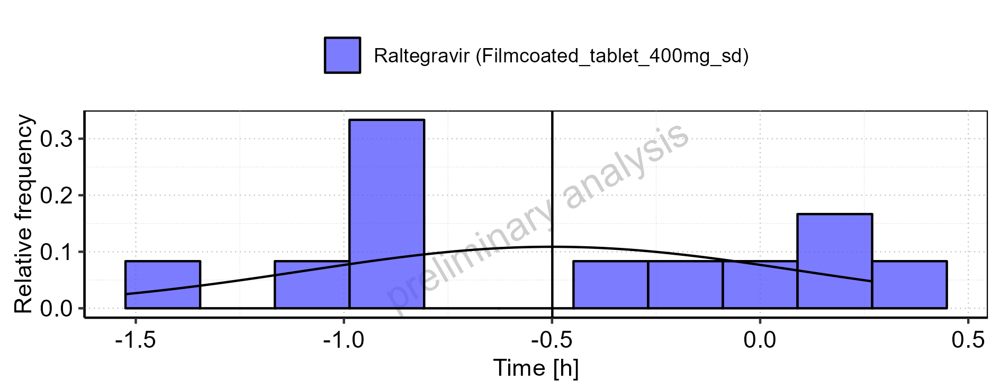

 
 

**Figure 3-8: Logarithmic residuals for Filmcoated_tablet_400mg_sd as quantile-quantile plot. Data source: Data/Raltegravir_PK.txt .**

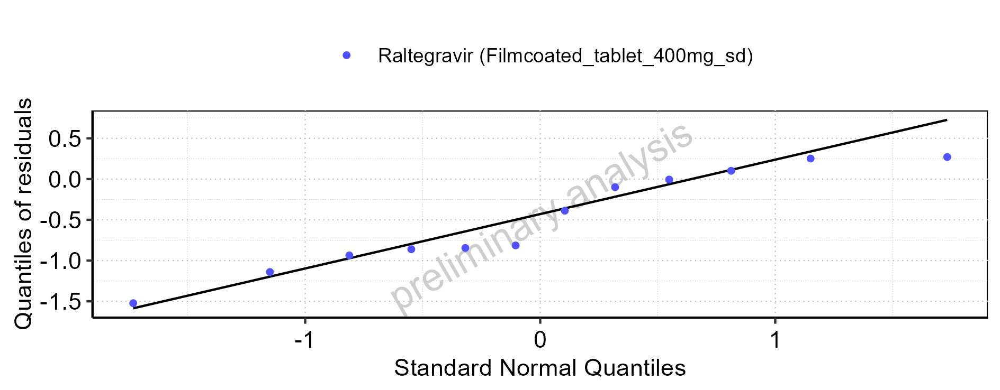

 
 

## 3.2 Time profiles and residual plots for Larson 2013 8y-18y 400mg FCT meal

**Figure 3-9: Time profiles for Larson 2013 8y-18y 400mg FCT meal. Data source: Data/Raltegravir_PK.txt .. Time profiles are plotted in a linear scale.**

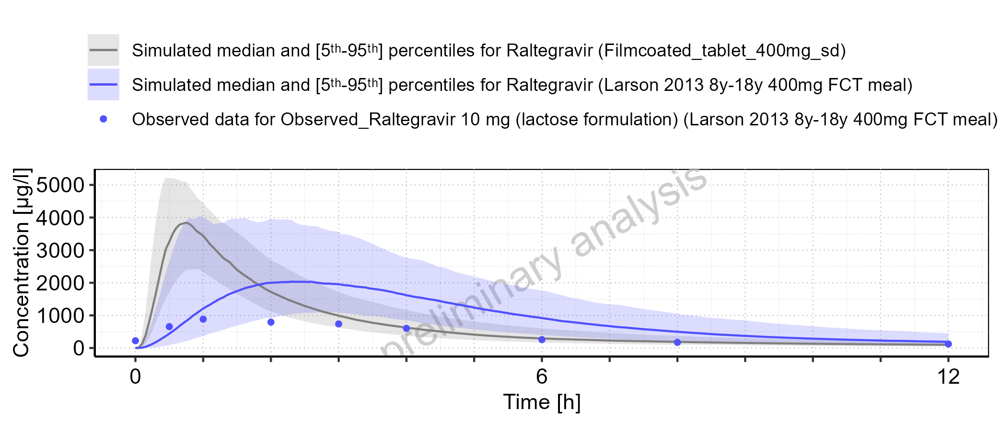

 
 

**Figure 3-10: Time profiles for Larson 2013 8y-18y 400mg FCT meal. Data source: Data/Raltegravir_PK.txt .. Time profiles are plotted in a logarithmic scale.**

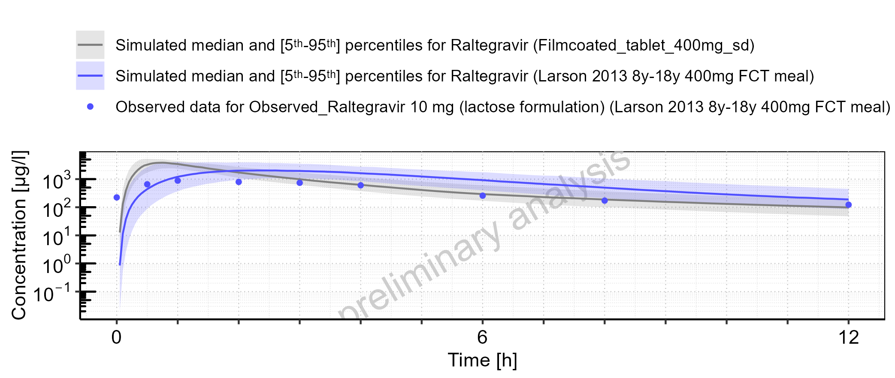

 
 

**Figure 3-11: Predicted (median) vs observed for Larson 2013 8y-18y 400mg FCT meal. Data source: Data/Raltegravir_PK.txt .. Predictions and observations are plotted in a linear scale.**

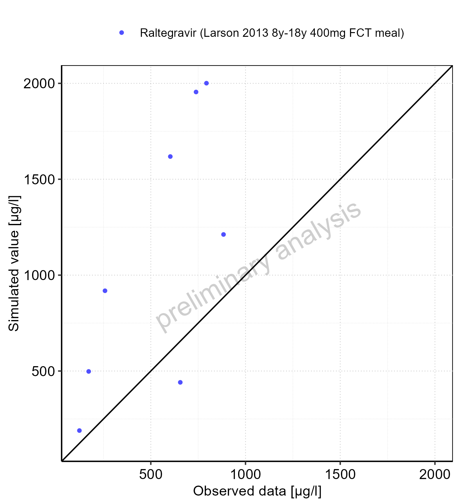

 
 

**Figure 3-12: Predicted (median) vs observed for Larson 2013 8y-18y 400mg FCT meal. Data source: Data/Raltegravir_PK.txt .. Predictions and observations are plotted in a logarithmic scale.**

 
 

**Figure 3-13: Logarithmic residuals vs predicted (median) values for Larson 2013 8y-18y 400mg FCT meal. Data source: Data/Raltegravir_PK.txt .**

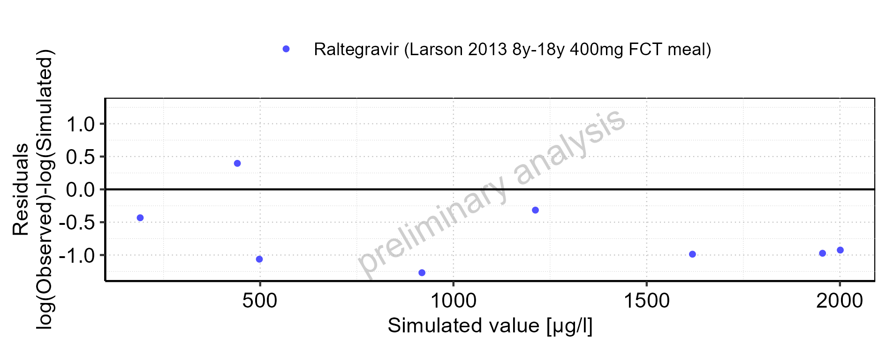

 
 

**Figure 3-14: Logarithmic residuals vs time values for Larson 2013 8y-18y 400mg FCT meal. Data source: Data/Raltegravir_PK.txt .**

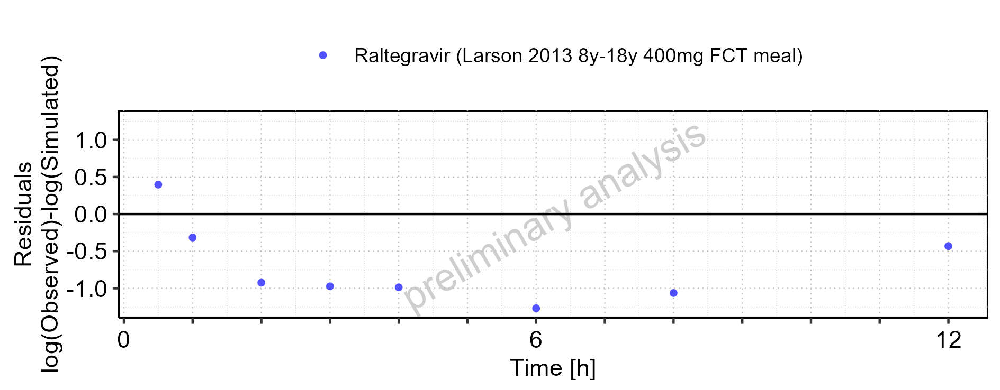

 
 

**Figure 3-15: Logarithmic residuals distribution (stacked) for Larson 2013 8y-18y 400mg FCT meal. Data source: Data/Raltegravir_PK.txt .**

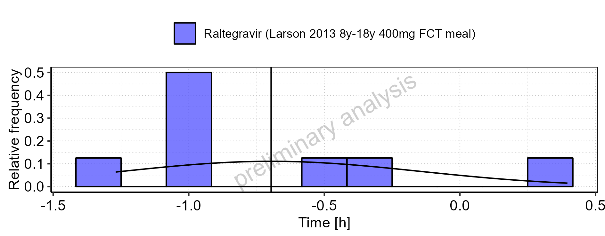

 
 

**Figure 3-16: Logarithmic residuals for Larson 2013 8y-18y 400mg FCT meal as quantile-quantile plot. Data source: Data/Raltegravir_PK.txt .**

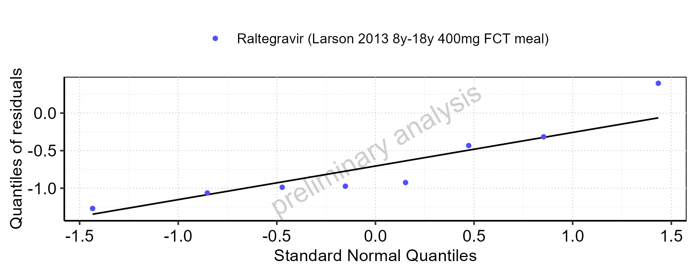

 
 

## 3.3 Residuals across all simulations

**Figure 3-17: Predicted vs observed for Raltegravir across Filmcoated_tablet_400mg_sd, Larson 2013 8y-18y 400mg FCT meal. Predictions and observations are plotted in a linear scale.**

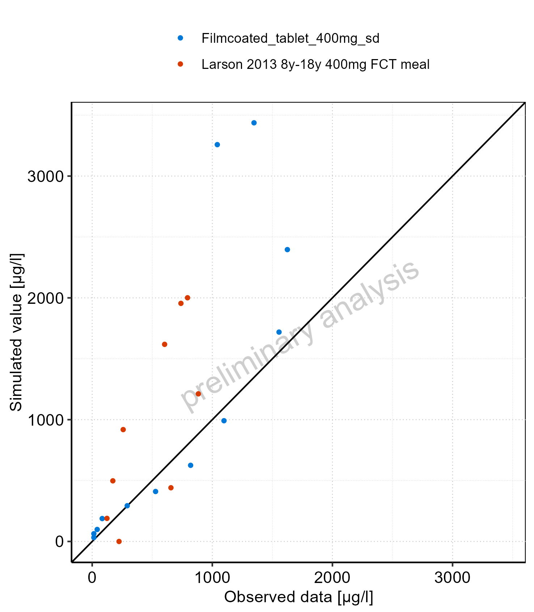

 
 

**Figure 3-18: Predicted vs observed for Raltegravir across Filmcoated_tablet_400mg_sd, Larson 2013 8y-18y 400mg FCT meal. Predictions and observations are plotted in a logarithmic scale.**

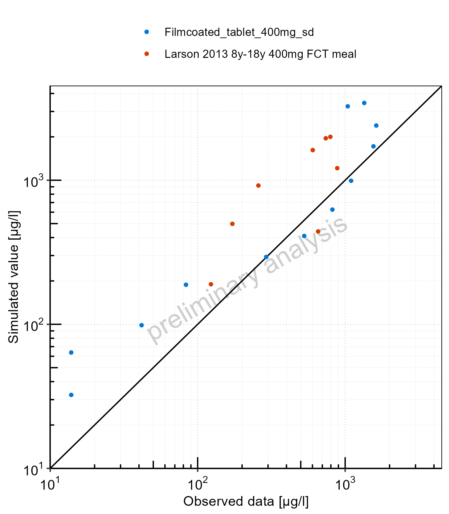

 
 

**Figure 3-19: Logarithmic residuals vs predicted values for Raltegravir across Filmcoated_tablet_400mg_sd, Larson 2013 8y-18y 400mg FCT meal**

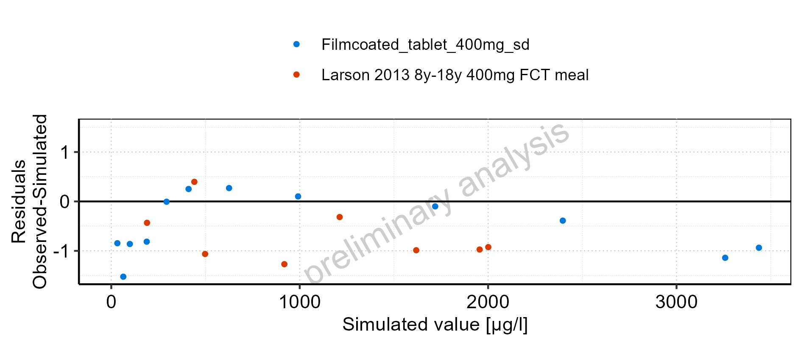

 
 

**Figure 3-20: Logarithmic residuals vs time values for Raltegravir across Filmcoated_tablet_400mg_sd, Larson 2013 8y-18y 400mg FCT meal**

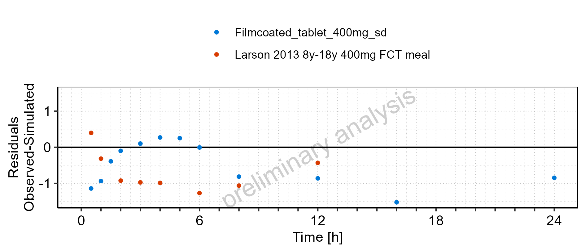

 
 

**Figure 3-21: Logarithmic residuals distribution (stacked) for Raltegravir across Filmcoated_tablet_400mg_sd, Larson 2013 8y-18y 400mg FCT meal**

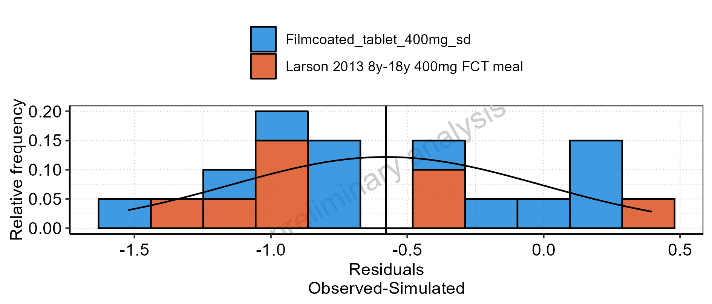

 
 

**Figure 3-22: Logarithmic residuals for Raltegravir across Filmcoated_tablet_400mg_sd, Larson 2013 8y-18y 400mg FCT meal as quantile-quantile plot**

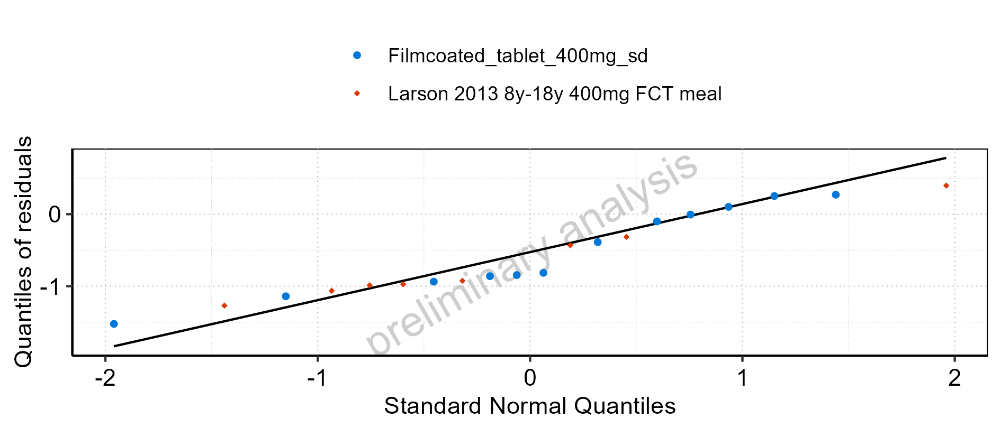

 
 

# 4 Demography

## 4.1 Age-dependence

### 4.1.1 Dependence of Height

#### 4.1.1.1 For Larson 2013 8y-18y 400mg FCT meal

**Figure 4-1: Age-dependence of Height for Larson 2013 8y-18y 400mg FCT meal in comparison to Filmcoated_tablet_400mg_sd. Profiles are plotted in a linear scale.**

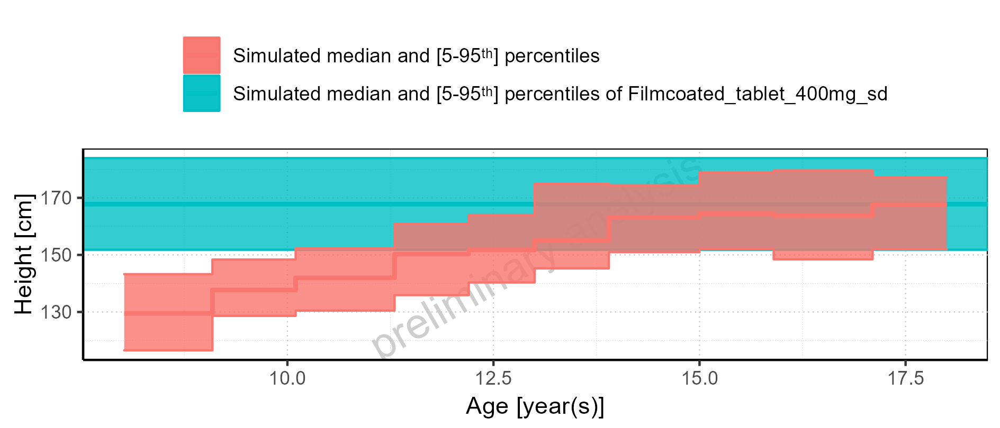

 
 

**Figure 4-2: Age-dependence of Height for Larson 2013 8y-18y 400mg FCT meal in comparison to Filmcoated_tablet_400mg_sd. Profiles are plotted in a logarithmic scale.**

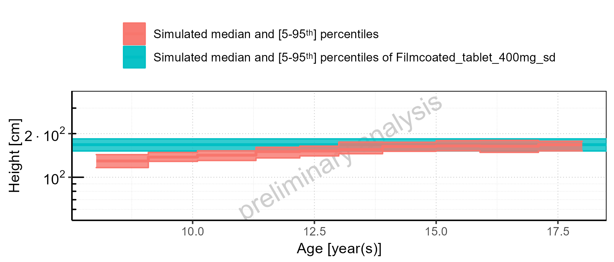

 
 

#### 4.1.1.2 For Larson 2013 8y-18y 400mg FCT meal

**Figure 4-3: Age-dependence of Height for Larson 2013 8y-18y 400mg FCT meal. Profiles are plotted in a linear scale.**

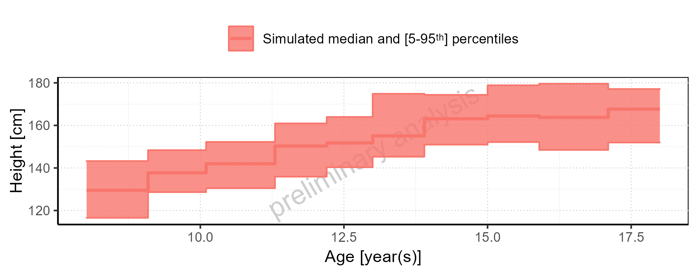

 
 

**Figure 4-4: Age-dependence of Height for Larson 2013 8y-18y 400mg FCT meal. Profiles are plotted in a logarithmic scale.**

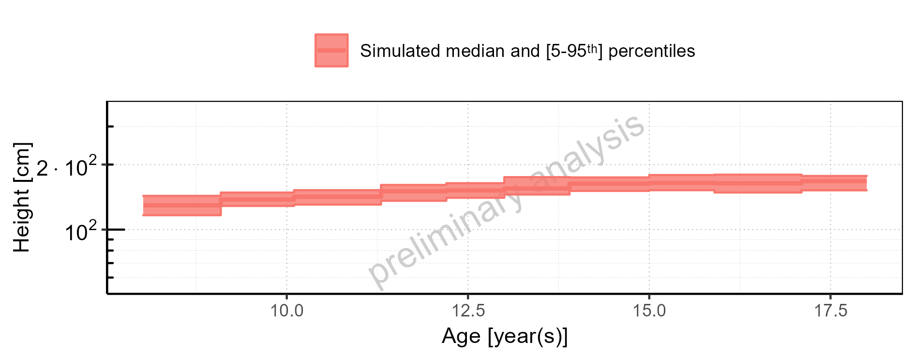

 
 

#### 4.1.1.3 For Filmcoated_tablet_400mg_sd

**Figure 4-5: Age-dependence of Height for Filmcoated_tablet_400mg_sd. Profiles are plotted in a linear scale.**

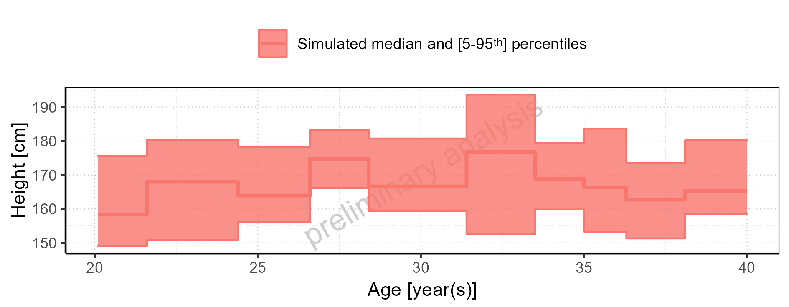

 
 

**Figure 4-6: Age-dependence of Height for Filmcoated_tablet_400mg_sd. Profiles are plotted in a logarithmic scale.**

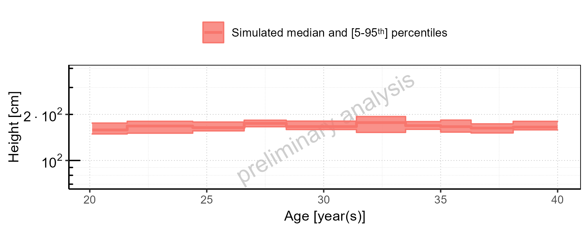

 
 

### 4.1.2 Dependence of Weight

#### 4.1.2.1 For Larson 2013 8y-18y 400mg FCT meal

**Figure 4-7: Age-dependence of Weight for Larson 2013 8y-18y 400mg FCT meal in comparison to Filmcoated_tablet_400mg_sd. Profiles are plotted in a linear scale.**

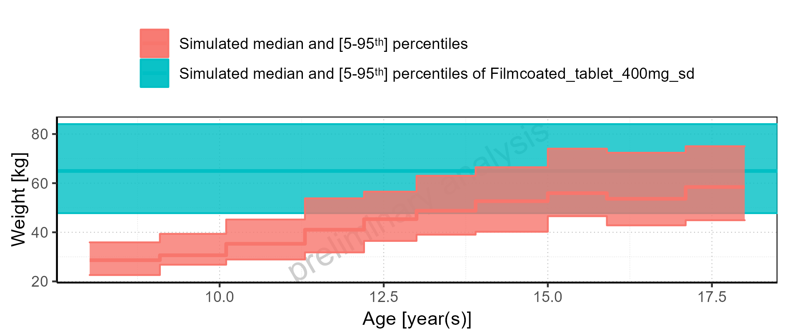

 
 

**Figure 4-8: Age-dependence of Weight for Larson 2013 8y-18y 400mg FCT meal in comparison to Filmcoated_tablet_400mg_sd. Profiles are plotted in a logarithmic scale.**

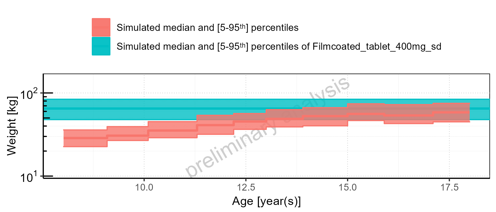

 
 

#### 4.1.2.2 For Larson 2013 8y-18y 400mg FCT meal

**Figure 4-9: Age-dependence of Weight for Larson 2013 8y-18y 400mg FCT meal. Profiles are plotted in a linear scale.**

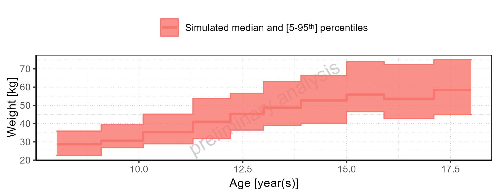

 
 

**Figure 4-10: Age-dependence of Weight for Larson 2013 8y-18y 400mg FCT meal. Profiles are plotted in a logarithmic scale.**

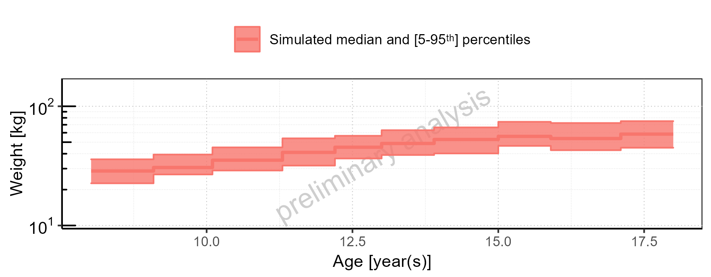

 
 

#### 4.1.2.3 For Filmcoated_tablet_400mg_sd

**Figure 4-11: Age-dependence of Weight for Filmcoated_tablet_400mg_sd. Profiles are plotted in a linear scale.**

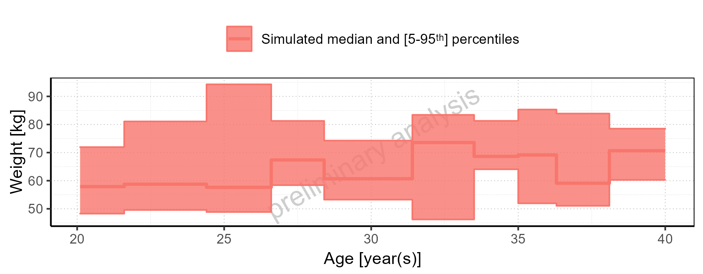

 
 

**Figure 4-12: Age-dependence of Weight for Filmcoated_tablet_400mg_sd. Profiles are plotted in a logarithmic scale.**

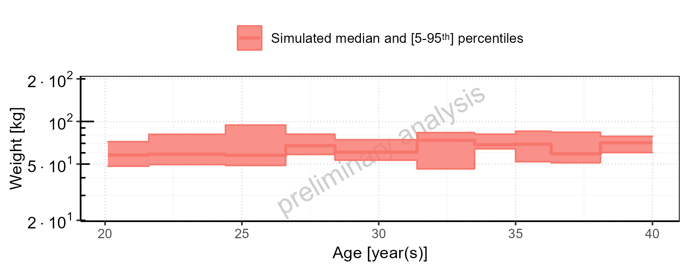

 
 

### 4.1.3 Dependence of BMI

#### 4.1.3.1 For Larson 2013 8y-18y 400mg FCT meal

**Figure 4-13: Age-dependence of BMI for Larson 2013 8y-18y 400mg FCT meal in comparison to Filmcoated_tablet_400mg_sd. Profiles are plotted in a linear scale.**

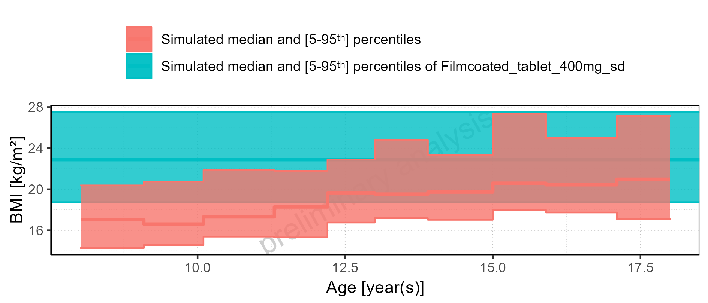

 
 

**Figure 4-14: Age-dependence of BMI for Larson 2013 8y-18y 400mg FCT meal in comparison to Filmcoated_tablet_400mg_sd. Profiles are plotted in a logarithmic scale.**

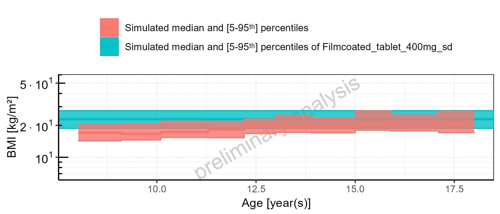

 
 

#### 4.1.3.2 For Larson 2013 8y-18y 400mg FCT meal

**Figure 4-15: Age-dependence of BMI for Larson 2013 8y-18y 400mg FCT meal. Profiles are plotted in a linear scale.**

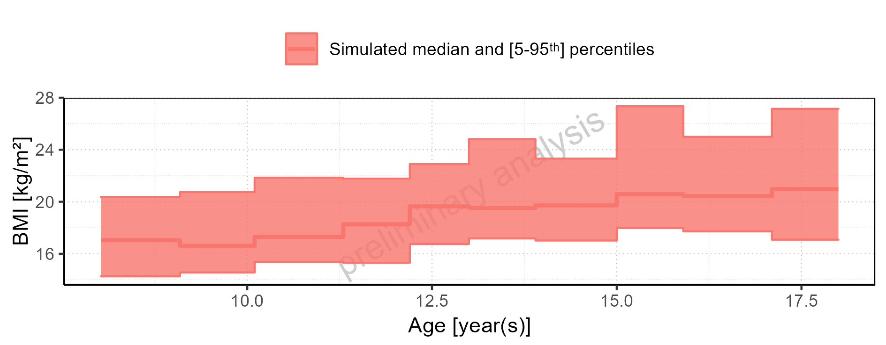

 
 

**Figure 4-16: Age-dependence of BMI for Larson 2013 8y-18y 400mg FCT meal. Profiles are plotted in a logarithmic scale.**

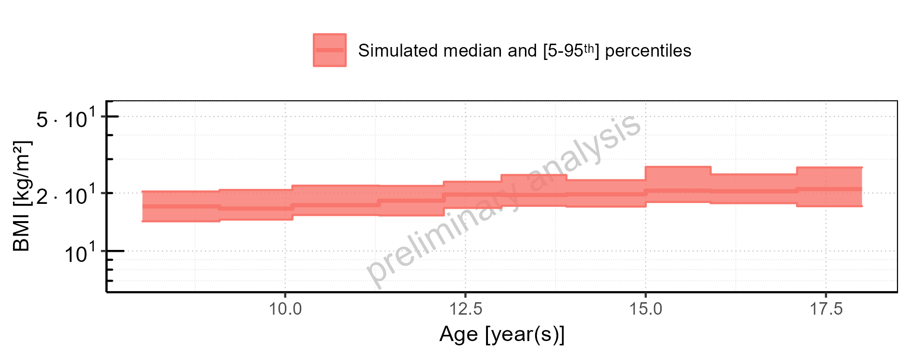

 
 

#### 4.1.3.3 For Filmcoated_tablet_400mg_sd

**Figure 4-17: Age-dependence of BMI for Filmcoated_tablet_400mg_sd. Profiles are plotted in a linear scale.**

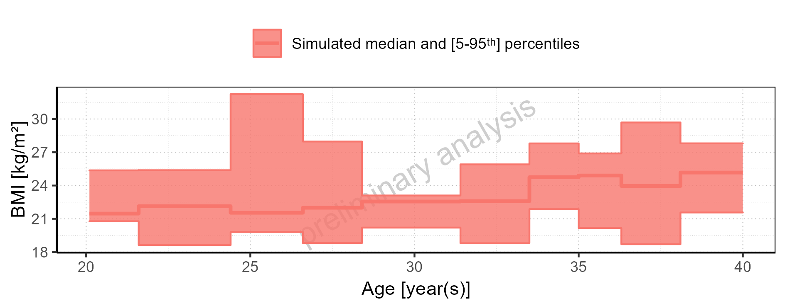

 
 

**Figure 4-18: Age-dependence of BMI for Filmcoated_tablet_400mg_sd. Profiles are plotted in a logarithmic scale.**

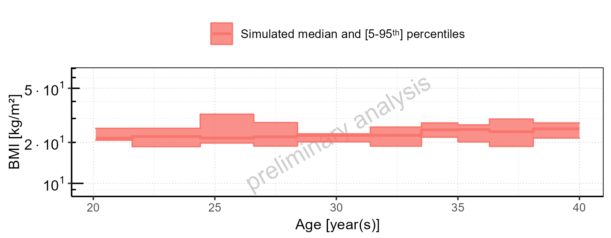

 
 

