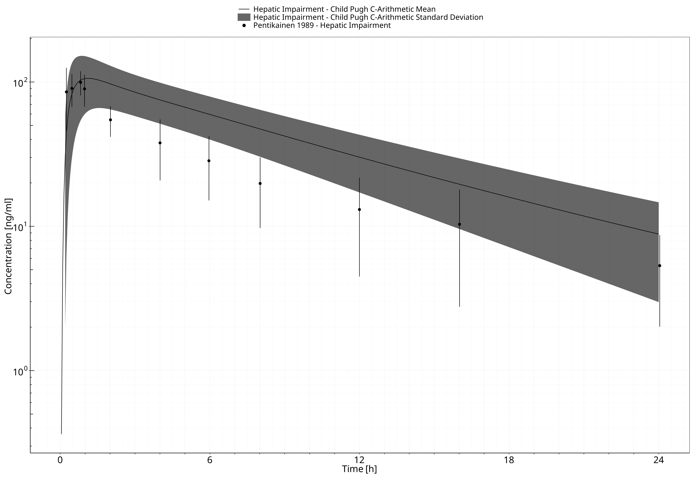
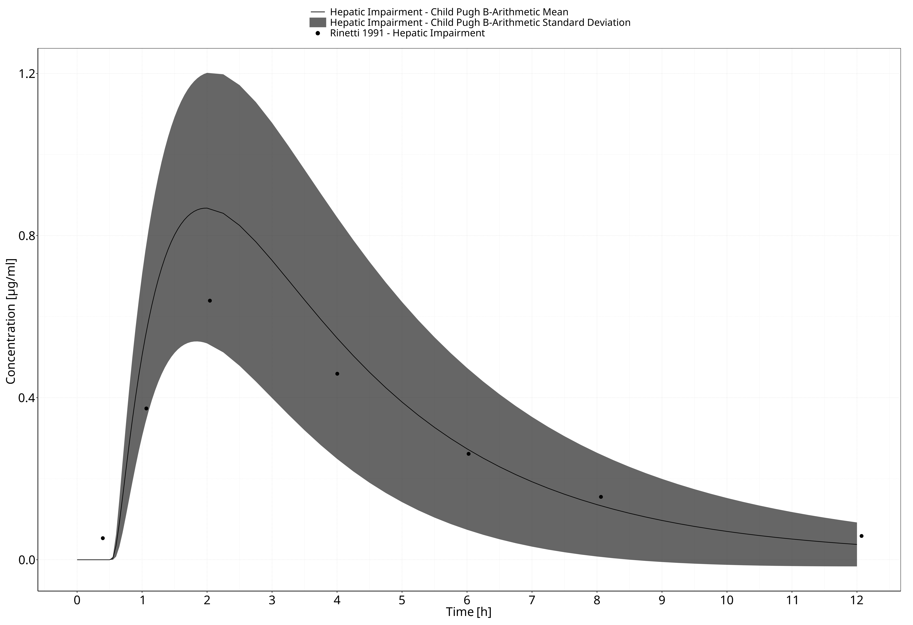

# Table of Contents

 * [1 Introduction ](#undefined-section-1)
 * [2 HI Population Development ](#undefined-section-2)
 * [3 Compounds ](#undefined-section-3)
   * [3.1 Alfentanil ](#undefined-section-4)
     * [3.1.1 Alfentanil in a Healthy Population ](#alfentanil_healthy)
     * [3.1.2 Alfentanil in a HI Population ](#alfentanil_hi)
   * [3.2 Levetiracetam ](#undefined-section-7)
     * [3.2.1 Levetiracetam in a Healthy Population ](#levetiracetam_healthy)
     * [3.2.2 Levetiracetam in a HI Population ](#levetiracetam_hi)
   * [3.3 Lidocaine ](#undefined-section-10)
     * [3.3.1 Lidocaine in a Healthy Population ](#lidocaine_healthy)
     * [3.3.2 Lidocaine in a HI Population ](#lidocaine_hi)
   * [3.4 Metoprolol ](#undefined-section-13)
     * [3.4.1 Metoprolol in a Healthy Population ](#metoprolol_healthy)
     * [3.4.2 Metoprolol in a HI Population ](#metoprolol_hi)
   * [3.5 Midazolam ](#undefined-section-16)
     * [3.5.1 Midazolam in a Healthy Population ](#midazolam_healthy)
     * [3.5.2 Midazolam in a HI Population ](#midazolam_hi)
   * [3.6 Omeprazole ](#undefined-section-19)
     * [3.6.1 Omeprazole in a Healthy Population ](#omeprazole_healthy)
     * [3.6.2 Omeprazole in a HI Population ](#omeprazole_hi)
   * [3.7 Sildenafil ](#undefined-section-22)
     * [3.7.1 Sildenafil in a Healthy Population ](#sildenafil_healthy)
     * [3.7.2 Sildenafil in a HI Population ](#sildenafil_hi)
   * [3.8 Theophylline ](#undefined-section-25)
     * [3.8.1 Theophylline in a Healthy Population ](#theophylline_healthy)
     * [3.8.2 Theophylline in a HI Population ](#theophylline_hi)
 * [4 References ](#undefined-section-28)

# 1 Introduction 

The presented qualification report performs simulations of drug disposition and pharmacokinetics (PK) in subjects with hepatic impairment (HI) to qualify the parameterization of the foundational anatomy and physiology parameters for virtual populations with HI in the Open Systems Pharmacology (OSP) Suite.

The liver is an important biotransformation site that serves key roles in the metabolism and clearance of drugs and toxins. HI is defined by a loss of functional hepatocytes which leads to connective tissue and nodule formation in the liver. The resulting pathophysiology of hepatic impairment is multifactorial; however, several outcomes are apparent. Hepatic impairment is often associated with shunting of blood around the cirrhotic liver which can lead to encephalopathy, decreased drug protein binding, hyperbilirubinemia, and the development of ascites and varices. To describe the disease progression (severity) and estimated prognosis with these factors in consideration, the Child-Pugh score was developed. The Child-Pugh score is designated as A (Mild: 5-6), B (Moderate: 7-9), or C (Severe: =10). It is calculated from summing the scores derived from the **Table** shown below. 

**Table. Child-Pugh scoring determined by factors affected by HI**

| **Factor**             | **1**    | **2**    | **3**    |
|------------------------|----------|----------|----------|
| Bilirubin (M)          | <34      | 34-51    | >51      | 
| Albumin (g/dL)         | >3.5     | 3-3.5    | <3       |
| Prothrombin time (INR) | <1.7     | 1.7-2.3  | >2.3     |
| Ascites                | None     | Slight   | Moderate |
| Encephalopathy         | None     | Minimal  | Advanced |

Quantitative anatomical and physiological changes observed in hepatically impaired individuals have an impact on drug PK. These modifications include changes in blood flows (decreased portal and renal blood flow, and incrased hepatic arterial blood flow), cardiac output (increased), plasma binding protein concentrations (decreased), hematocrit (decreased), hepatic intrinsic clearance, and renal intrinsic clearance. With respect to hepatic intrinsic clearance, several enzymes (CYP3A4, CYP1A2, CYP2E1, etc.) are known to be affected in the disease process.

This report build upon the work by Edginton and Willmann (1) and Johnson, Boussery (2) to qualify the parameterization of a HI population implemented in PK-Sim. Section 2 describes the generation of HI populations. Section 3 evaluates the predicted effects of HI on the PK of 9 compounds: alfentanil, caffeine, levetiractam, metoprolol, midazolam, nifedipine, omeprazole, sildenafil, and theophylline. Evaluation for each compound is comprised of two steps: the initial model calibration against a healthy population, followed by an extension to populations of subjects with relevant severities of HI. 

# 2 HI Population Development 

HI population development followed the physiological scaling methods by Edginton and Willmann (1) and Johnson, Boussery (2). The set of modified parameters are presented in the **Table** below. The values for each Child-Pugh score and parameter are considered "disease factors", which are multiplied by values of a healthy adult to produce the HI state.

**Table. HI disease factors for each HI parameter across Child-Pugh scores**

| **Parameter**                                 | **Child-Pugh A** | **Child-Pugh B** | **Child-Pugh C** |
|-----------------------------------------------|------------------|------------------|------------------|
| Blood flow: Portal                            | 0.4              | 0.36             | 0.04             |
| Blood flow: Hepatic arterial                  | 1.3              | 2.3              | 3.4              |
| Blood flow: Renal                             | 0.88             | 0.65             | 0.48             |
| Blood flow: Other organs*                     | 1.75             | 2.25             | 2.75             |
| Cardiac Index                                 | 1.11             | 1.27             | 1.36             |
| Plasma binding protein: Albumin               | 0.81             | 0.68             | 0.5              |
| Plasma binding protein: a1-acid-glycoprotein  | 0.6              | 0.56             | 0.3              |
| Hematocrit                                    | 0.92             | 0.88             | 0.83             |
| Hepatic intrinsic CL: CYP3A4                  | 1                | 0.4              | 0.4              |
| Hepatic intrinsic CL: CYP1A2                  | 1                | 0.1              | 0.1              |
| Hepatic intrinsic CL: CYP2E1                  | 1                | 0.83             | 0.83             |
| Hepatic intrinsic CL: CYP2A6                  | 0.89             | 0.62             | 0.32             |
| Hepatic intrinsic CL: CYP2B6                  | 1                | 0.9              | 0.8              |
| Hepatic intrinsic CL: CYP2C8                  | 0.69             | 0.52             | 0.32             |
| Hepatic intrinsic CL: CYP2C9                  | 0.69             | 0.51             | 0.33             |
| Hepatic intrinsic CL: CYP2C18                 | 0.32             | 0.26             | 0.12             |
| Hepatic intrinsic CL: CYP2C19                 | 0.32             | 0.26             | 0.12             |
| Hepatic intrinsic CL: CYP2D6                  | 0.76             | 0.33             | 0.11             |
| Glomerular filtration rate (GFR)              | 1                | 0.7              | 0.36             |
*Values from Edginton and Willmann (1); however, this evaluation report uses the method presented in https://github.com/Open-Systems-Pharmacology/Forum/discussions/1341, and thus the "other organs" blood flow varies slightly across individuals.

## Blood flow scaling

Portal, hepatic arterial, and renal blood flows were scaled according to the disease factor reported for each Child-Pugh severity (**Table**). All three blood flow processes were adjustd in PK-Sim by defining Individual > Anatomy & Physiology > Physiology > Flow Rates > Blood Flow Rates. Portal blood flow in the HI population was defined by the Portal Vein specific blood flow rate times the disease factor. Hepatic arterial blood flow was adjusted from applying the functional liver mass disease factor (Anatomy > Organ Volums > Liver) and adjusting the specific blood flow rate of the liver to attain the result of applying the hepatic arterial disease factor to liver blood flow rate. Renal blood flow was adjusted via application of the disease factor to kidney specific blood flow rate. The blood flow of other organs was adjusted based on the cardiac index, defined as cardiac output divided by body surface area, reported in the **Table**. The methods reported in https://github.com/Open-Systems-Pharmacology/Forum/discussions/1341 were applied.

## Plasma binding proteins and hematocrit scaling

The fraction unbound in the HI state was determined using methods by Edginton and Willmann (1). The albumin/plasma or a1-acid glycoprotein/plasma partition coefficient of the compound was defined as K_protein. First, K_protein was determined for healthy individuals by rearranging: fu_healthy = 1 / [(1-f_protein_healthy) + (f_protein_healthy)*K_protein]. Where, fu_healthy represents the fraction of unbound drug in a healthy individual, and f_protein_healthy represents the volume fraction of plasma binding protein in healthy (albumin 0.022 and a1-acid glycoprotein 0.0004). Next, fu_diseased was calculated from the aforementioned equation with the calculated K_protein and f_protein_diseased values presented in the **Table**. 

Hematocrit values from Individual > Anatomy & Physiology > Physiology > Tissue and body fluid physiology > Hematocrit, were adjusted to 0.39, 0.37, and 0.35 for Child-Pugh A, B, and C, respectively (**Table**). 

## Hepatic intrinsic clearance scaling

Reduction in an enzyme’s specific clearance was attributed to decreased fraction of functional liver volume and fraction of enzyme-specific activity per unit of protein in livers. With the former already adjusted in liver organ size, the latter was accounted for by multiplying the disease factor (**Table**) by the enzyme reference concentration. This report expands on the work by Edginton and Willmann (1) through incorporating additional enzymes accounted for by Johnson, Boussery (2).

## Renal intrinsic clearance scaling

The disease factor (**Table**) was applied to Glomerular filtration (Compound > ADME > Transport & Excretion > Renal Clearances > Glomerular Filtration). 

# 3 Compounds 

The method to generate virtual populations with HI was qualified by testing its predictive performance when used in combination with PBPK models for healthy subjects in order to predict the PK of drugs in patients with HI from literature.

The method was evaluated using ten compounds and considers subjects with HI with a range of Child-Pugh score severities and modes of administration (all severities: caffeine PO, levetiracetam IV, omeprazole IV and PO; A and B only: sildenafil IV and PO; and B and C only: alfentanil IV, metoprolol IV and PO, midazolam IV and PO, nifedipine PO, and theophylline IV). IV and PO administrations were developed and evaluated only if their respective plasma concentration-time profiles in the HI population were published in the literature. The objective was to determine success of the population generation method by comparing the predicted pharmacokinetics in HI to clinical pharmacokinetic data from literature.

Each subsection that follows will contain an introduction to the test compound, a description of the healthy PBPK model development, and the subsequent translation to a population with HI.

## 3.1 Alfentanil 

Alfenatanil is a potent, synthetic opioid used to provide analgesia for various surgical procedures and in patients admitted within intensive care units. Alfentanil is typically administered intravenously and offers several advantages to alternative analgesics due to its potency at the opioid receptor and quick onset of effect (3).

In this section, the general absorption, distribution, metabolism, and excretion (ADME) (**Table 1**), the healthy PBPK model source, and translation to a population with HI for alfentanil are described.

**Table 1. General ADME of alfentanil (4, 5)**

| BCS classification | N/A |
| Linear kinetics    | Potentially exhibiting non-linear kinetics at very high doses (6) |
| Plasma half-life   | IV: 1.59 hours (6) |
| fe,unchanged       | Urine: <1% (7) |
| Bioavailability    | N/A |
| Distribution       | Average volume of distribution in patients receiving analgesia with alfentanil is 0.75 L/h/kg (5). Highly protein bound (90%). IV: 27.2 L (6). |
| Metabolism         | Metabolized exclusively by CYP3A4 (8) |
| Clearance          | Not a substrate for P-gp (9). IV: 14.3 L/h (6). |

The alfentanil healthy PBPK model is reported in the OSP alfentanil report (4) and was based on the development by Hanke, Frechen (5) with an application of CYP3A4 metabolism and glomerular filtration. The model developed in healthy adults serves as the foundation when applying physiological changes endured with HI to simulate the PK of alfentanil across the disease spectrum. 

### 3.1.1 Alfentanil in a Healthy Population 

#### IV model

Alfentanil physiochemical properties and ADME parameters were incorporated from the model developed by Hanke, Frechen (5). **Table 1** presents the drug specific parameters of alfentanil and the values used in the healthy adult IV model.

The healthy PBPK model development was based on single dose IV PK studies described in the OSP alfentanil report (4) and Hanke, Frechen (5). These doses consisted of 0.015 mg/kg, 0.02 mg/kg, 0.05 mg/kg, and 1 mg/kg.

**Table 1. Physicochemical properties and ADME of alfentanil for the final IV model**

| **Physicochemical properties**    |                                      |
|--|--|
| Octanol:water coefficient (logP)           | 1.85 Log Units |
| Fraction unbound in plasma (fu) | 0.1 |
| Molecular weight (MW)                      | 416.42 g/mol |
| pKa                                        | 6.5 |
| Water solubility                           | 992 mg/mL |
| **ADME**                                   |                             |
| Partition coefficient                      | Rodgers and Rowland |
| Cell permeability                          | PK-Sim Standard |
| CYP3A4 concentration                       | 4.32 µM |
| CYP3A4 specific clearance                  | 0.34 1/min |
| GFR fraction                               | 0.06 |

### 3.1.2 Alfentanil in a HI Population 

#### IV model

With the drug-specific parameters fixed, the healthy PBPK model was translated to a HI-PBPK model. Stages of HI used in the simulations were defined by the Child-Pugh score. A population with Child-Pugh B and C was created according to the patient demographics of the population enrolled by Ferrier, Marty (10) (**Table 2**). The Child-Pugh scores were not defined in Ferrier, Marty (10), and thus reported information such as plasma albumin concentrations and total bilirubin were used to classify.

**Table 2. HI population demographics for alfentanil IV administration**

| **Study** | **Dose and administration** | **Cohort** | **N** | **Age (years)** | **Weight (kg)** |
|--|--|--|--|--|--|
| Ferrier, Marty (10) | 0.05 mg/kg IV bolus | HI population: European females (45%) and males with estimated Child-Pugh B and C | 11 | 56 [range: 39-69] | 60 [range: 43-73] |
| Ferrier, Marty (10) | 0.05 mg/kg IV bolus | Control population: European | 10 | 45 [range: 25-66] | 59 [range: 34-84] |

Simulated PK of alfentanil after a single IV bolus dose of 0.05 mg/kg in patients with Child-Pugh B and C are presented in **Figure 1** and **Figure 2**, repectively. Simulations of the average healthy control are included for comparison.

**Figure 3-1: Ferrier 1985, Alfentanil iv 0.05 mg/kg - log**

 
 

**Figure 3-2: Ferrier 1985, Alfentanil iv 0.05 mg/kg - log**

 
 

**Figure 3-3: Time Profile Analysis**

 
 

**Figure 3-4: Time Profile Analysis**

 
 

## 3.2 Levetiracetam 

Levetiracetam is an antiepileptic used for the treatment of patients with partial seizures, with or without secondary generalization (22, 23). The mechanism of antiseizure activity has not been fully elucidated, however, animal models have shown that levetiracetam binds to synaptic vescle proteins SV2A modulating neurotransporter release (24).

In this section, the general ADME (**Table 1**), the healthy PBPK model source, and translation to a population with HI for levetiracetam are described.

**Table 1. General ADME of levetiracetam (25)**

| BCS classification | I |
| Linear kinetics    | Linear up to a dose of 5,000 mg (26) |
| Plasma half-life   | 6-8 hours |
| fe,unchanged       | Urine: 66% (22, 27) |
| Bioavailability    | >95% (28) |
| Distribution       | Volume of distribution in healthy individuals is 0.5-0.7 L/kg. Almost exclusively unbound in plasma (97%) (22) |
| Metabolism         | Does not involve the cytochrome P450 system as th major metabolic pathway involves enzymatic hydrolysis within the blood (22, 28). |
| Clearance          | Renal excretion (22) |

The levetiracetam healthy PBPK model was based on the development by Sinha, Karatza (25) with an application of esterase activity in blood and glomerular filtration. The model developed in healthy adults serves as the foundation when applying physiological changes endured with HI to simulate the PK of levetiracetam across the disease spectrum.

### 3.2.1 Levetiracetam in a Healthy Population 

#### IV/PO model

Levetiracetam physiochemical properties and ADME parameters were incorporated from the model developed by Sinha, Karatza (25). **Table 1** presents the drug specific parameters of levetiracetam and the values used in the healthy adult IV model.

The healthy PBPK model development was based on single dose IV and oral PK studies described in Sinha, Karatza (25). These doses consisted of 500 mg, 1000 mg, and 2000 mg.

**Table 1. Physicochemical properties and ADME of caffeine for the final IV/PO model**

| **Physicochemical properties**    |                                      |
|--|--|
| Octanol:water coefficient (logP)           | -0.64 Log Units |
| Fraction unbound in plasma (fu) | 0.97 |
| Molecular weight (MW)                      | 170.21 g/mol |
| pKa                                        | Neutral |
| Water solubility                           | 1,040 mg/mL |
| **ADME**                                   |                             |
| Partition coefficient                      | Rodgers and Rowland |
| Cell permeability                          | PK-Sim Standard |
| RBC esterase concentration                 | 1 µM |
| RBC esterase KM                 | 439 µM |
| RBC esterase Vmax               | 8,000 pmol/min/mL |
| GFR fraction                               | 0.4 |
| Specific intestinal permeability (transcellular) | 1.84E-3 cm/min |
| **Oral absorption parameters**             |                             |
| Formulation: Tablet T50%, T90%, T100% | 5 min, 10 min, 15 min |
T50%, T90%, T100%: Time to disolve 50%, 90%, and 100% tablet strength, respectively (25).

### 3.2.2 Levetiracetam in a HI Population 

#### Oral model

With the drug-specific parameters fixed, the healthy PBPK model was translated to a HI-PBPK model. Stages of HI used in the simulations were defined by the Child-Pugh score. A population with Child-Pugh A, B, and C was created according to the patient demographics of the population enrolled by Brockmöller, Thomsen (29) (**Table 2**). The Child-Pugh scores were defined in this study.

**Table 2. HI population demographics for levetiracetam oral administration**

| **Study** | **Dose and administration** | **Cohort** | **N** | **Age (years)** | **Weight (kg)** |
|--|--|--|--|--|--|
| Brockmöller, Thomsen (29) | 1000 mg single dose PO | European male patients Child-Pugh A | 5 | 50 ± 8 | 89 ± 16 |
| Brockmöller, Thomsen (29) | 1000 mg single dose PO | European male patients Child-Pugh B | 6 | 53 ± 5 | 87 ± 12 |
| Brockmöller, Thomsen (29) | 1000 mg single dose PO | European male patients Child-Pugh C | 5 | 51 ± 6 | 74 ± 3 |

Simulated PK of levetiracetam administered as a 1000 mg oral single dose in patients with Child-Pugh A, B, and C are presented in **Figure 1**, **Figure 2**, and **Figure 3**, respectively. These population HI-PBPK simulations were evaluated against observed plasma concentration-time profiles from Brockmöller, Thomsen (29).

**Figure 3-5: Time Profile Analysis**

 
 

**Figure 3-6: Time Profile Analysis**

 
 

**Figure 3-7: Time Profile Analysis**

 
 

**Figure 3-8: Time Profile Analysis**

 
 

**Figure 3-9: Time Profile Analysis**

 
 

**Figure 3-10: Time Profile Analysis**

 
 

## 3.3 Lidocaine 

Levetiracetam is an antiepileptic used for the treatment of patients with partial seizures, with or without secondary generalization (22, 23). The mechanism of antiseizure activity has not been fully elucidated, however, animal models have shown that levetiracetam binds to synaptic vescle proteins SV2A modulating neurotransporter release (24).

In this section, the general ADME (**Table 1**), the healthy PBPK model source, and translation to a population with HI for levetiracetam are described.

**Table 1. General ADME of levetiracetam (25)**

| BCS classification | I |
| Linear kinetics    | Linear up to a dose of 5,000 mg (26) |
| Plasma half-life   | 6-8 hours |
| fe,unchanged       | Urine: 66% (22, 27) |
| Bioavailability    | >95% (28) |
| Distribution       | Volume of distribution in healthy individuals is 0.5-0.7 L/kg. Almost exclusively unbound in plasma (97%) (22) |
| Metabolism         | Does not involve the cytochrome P450 system as th major metabolic pathway involves enzymatic hydrolysis within the blood (22, 28). |
| Clearance          | Renal excretion (22) |

The levetiracetam healthy PBPK model was based on the development by Sinha, Karatza (25) with an application of esterase activity in blood and glomerular filtration. The model developed in healthy adults serves as the foundation when applying physiological changes endured with HI to simulate the PK of levetiracetam across the disease spectrum.

### 3.3.1 Lidocaine in a Healthy Population 

#### IV/PO model

Levetiracetam physiochemical properties and ADME parameters were incorporated from the model developed by Sinha, Karatza (25). **Table 1** presents the drug specific parameters of levetiracetam and the values used in the healthy adult IV model.

The healthy PBPK model development was based on single dose IV and oral PK studies described in Sinha, Karatza (25). These doses consisted of 500 mg, 1000 mg, and 2000 mg.

**Table 1. Physicochemical properties and ADME of caffeine for the final IV/PO model**

| **Physicochemical properties**    |                                      |
|--|--|
| Octanol:water coefficient (logP)           | -0.64 Log Units |
| Fraction unbound in plasma (fu) | 0.97 |
| Molecular weight (MW)                      | 170.21 g/mol |
| pKa                                        | Neutral |
| Water solubility                           | 1,040 mg/mL |
| **ADME**                                   |                             |
| Partition coefficient                      | Rodgers and Rowland |
| Cell permeability                          | PK-Sim Standard |
| RBC esterase concentration                 | 1 µM |
| RBC esterase KM                 | 439 µM |
| RBC esterase Vmax               | 8,000 pmol/min/mL |
| GFR fraction                               | 0.4 |
| Specific intestinal permeability (transcellular) | 1.84E-3 cm/min |
| **Oral absorption parameters**             |                             |
| Formulation: Tablet T50%, T90%, T100% | 5 min, 10 min, 15 min |
T50%, T90%, T100%: Time to disolve 50%, 90%, and 100% tablet strength, respectively (25).

### 3.3.2 Lidocaine in a HI Population 

#### Oral model

With the drug-specific parameters fixed, the healthy PBPK model was translated to a HI-PBPK model. Stages of HI used in the simulations were defined by the Child-Pugh score. A population with Child-Pugh A, B, and C was created according to the patient demographics of the population enrolled by Brockmöller, Thomsen (29) (**Table 2**). The Child-Pugh scores were defined in this study.

**Table 2. HI population demographics for levetiracetam oral administration**

| **Study** | **Dose and administration** | **Cohort** | **N** | **Age (years)** | **Weight (kg)** |
|--|--|--|--|--|--|
| Brockmöller, Thomsen (29) | 1000 mg single dose PO | European male patients Child-Pugh A | 5 | 50 ± 8 | 89 ± 16 |
| Brockmöller, Thomsen (29) | 1000 mg single dose PO | European male patients Child-Pugh B | 6 | 53 ± 5 | 87 ± 12 |
| Brockmöller, Thomsen (29) | 1000 mg single dose PO | European male patients Child-Pugh C | 5 | 51 ± 6 | 74 ± 3 |

Simulated PK of levetiracetam administered as a 1000 mg oral single dose in patients with Child-Pugh A, B, and C are presented in **Figure 1**, **Figure 2**, and **Figure 3**, respectively. These population HI-PBPK simulations were evaluated against observed plasma concentration-time profiles from Brockmöller, Thomsen (29).

## 3.4 Metoprolol 

Metoprolol is a cardioselective beta-1-adregenic receptor inhibitor that competitively inhibits beta-1-receptors specific to cardiac cells. It is approved for the treatment of angina, heart failure, myocardial infarction, atrial fibrillation/flutter, and hypertension.

In this section, the general ADME (**Table 1**), the healthy PBPK model source, and translation to a population with HI for metoprolol are described.

**Table 1. General ADME of metoprolol (30, 31)**

| BCS classification | I |
| Linear kinetics    | Plasma concentrations in patients with angina pectoris were linearly related to oral doses of 50-400 mg. |
| Plasma half-life   | 3-7 hours |
| fe,unchanged       | >95% of oral dose recovered in urine as unchanged drug and metabolites. Urine IV: 10%; PO: 5%. |
| Bioavailability    | Absorbed over a large part of the gastrointestinal tract. F is normally 100%, but can reduce to 40% in CYP2D6 poor metabolizers (32). |
| Distribution       | Distributes rapidly between blood and extravascular with 1-2% of total drug amount localized in blood at apparent distribution equilibrium. 12% are bound to plasma proteins (33). |
| Metabolism         | Extensively metabolized by CYP2D6 as the primary enzyme. |
| Clearance          | Mainly excreted by the kidneys, 0.8 L/min (34) |

The metoprolol healthy PBPK model was based on the development by Rüdesheim, Wojtyniak (31) with an application of CYP2D6 metabolism and glomerular filtration. The model developed in healthy adults serves as the foundation when applying physiological changes endured with HI to simulate the PK of metoprolol across the disease spectrum.

### 3.4.1 Metoprolol in a Healthy Population 

#### IV model

Metoprolol physiochemical properties and ADME parameters were incorporated from the model developed by Rüdesheim, Wojtyniak (31). **Table 1** presents the drug specific parameters of metoprolol and the values used in the healthy adult IV model.

The healthy PBPK model development was based on multiple IV PK studies described in the OSP metoprolol report (30) and by Rüdesheim, Wojtyniak (31).

**Table 1. Physicochemical properties and ADME of metoprolol for the final IV model**

| **Physicochemical properties**    |                                      |
|--|--|
| Octanol:water coefficient (logP)           | 1.77 Log Units |
| Fraction unbound in plasma (fu) | 0.88 |
| Molecular weight (MW)                      | 267.36 g/mol |
| pKa                                        | 9.7 (base) |
| Water solubility                           | 1 g/mL (tartrate) |
| **ADME**                                   |                             |
| Partition coefficient                      | Rodgers and Rowland |
| Cell permeability                          | PK-Sim Standard |
| CYP2D6 concentration                       | 0.4 µM |
| CYP2D6 KM, R-metoprolol         | 8.82 µM |
| CYP2D6 Kcat, S-metoprolol)      | 9.87 1/min |
| CYP2D6 KM, S-metoprolol         | 12.43 µM |
| CYP2D6 Kcat, R-metoprolol)      | 8.21 1/min |
| GFR                                        | 1 |
| Specific intestinal permeability (transcellular) | 4.14E-5 cm/min |

#### Oral model

The healthy PBPK model development was based on multiple oral PK studies described in the OSP metoprolol report (30) and by Rüdesheim, Wojtyniak (31). Absorption parameters in the oral model included metoprolol tartate tablet described by a Weibull distribution with dissolution half-tim of 12.31 min and shape 0.72.

### 3.4.2 Metoprolol in a HI Population 

#### IV model

With the drug-specific parameters fixed, the healthy PBPK model was translated to a HI-PBPK model. Stages of HI used in the simulations were defined by the Child-Pugh score. A population with Child-Pugh A, B, and C was created according to the patient demographics of the population enrolled by Regårdh, Jordö (35) (**Table 2**). The Child-Pugh scores were not defined in these studies and limited clinical variabls were reported to fully assess Child-Pugh status. Based on the clinical variables that were reportd, the study population likely consisted of patients classified as Child-Pugh A and B.

**Table 2. HI population demographics for metoprolol IV administration**

| **Study** | **Dose and administration** | **Cohort** | **N** | **Age (years)** | **Weight (kg)** |
|--|--|--|--|--|--|
| Regårdh, Jordö (35) | 20 mg IV bolus | European female (50%) and male patients with Child-Pugh scores A and B | 10 | 50 ± 8 | 89 ± 16 |

Simulated PK of metoprolol administered as a single 20 mg IV bolus in patients with Child-Pugh A and B presented in **Figure 1** and **Figure 2**, respectively. An evaluation of predicted versus observed AUC8 from patients enrolled in Regårdh, Jordö (35) is presented in **Table 3**. 

**Table 3. Evaluation of metoprolol IV HI-PBPK model-predicted vs observed AUC8 from Regårdh, Jordö (35)**

| **Study** | **Predicted AUC8 (nmol•h/L)** | **Observed AUC8 (nmol•h/L)** | **Fold-error** |
|--|--|--|--|
| Regårdh, Jordö (35), Child-Pugh A | 2992.91 | 2606 ± 504 | 1.15 |
| Regårdh, Jordö (35), Child-Pugh B | 3027.71 | 2606 ± 504 | 1.15 |

#### Oral model

Simulated PK of metoprolol administered as 50 mg oral single dose in patients with Child-Pugh A and B presented in **Figure 3** and **Figure 4**, respectively. An evaluation of predicted versus observed AUC8 from patients enrolled in Regårdh, Jordö (35) is presented in **Table 4**. 

**Table 4. Evaluation of metoprolol oral HI-PBPK model-predicted vs observed clearance from Regårdh, Jordö (35)**

| **Study** | **Predicted AUC8 (nmol•h/L)** | **Observed AUC8 (nmol•h/L)** | **Fold-error** |
|--|--|--|--|
| Regårdh, Jordö (35), Child-Pugh A | 5421.23 | 5347 ± 1236 | 0.99 |
| Regårdh, Jordö (35), Child-Pugh B | 5955.86 | 5347 ± 1236 | 1.11 |

**Figure 3-11: Time Profile Analysis**

 
 

**Figure 3-12: Time Profile Analysis**

 
 

**Figure 3-13: Time Profile Analysis**

 
 

**Figure 3-14: Time Profile Analysis**

 
 

**Figure 3-15: Time Profile Analysis**

 
 

**Figure 3-16: Time Profile Analysis**

 
 

**Figure 3-17: Time Profile Analysis**

 
 

**Figure 3-18: Time Profile Analysis**

 
 

## 3.5 Midazolam 

Midazolam is a benzodiazepine used to induce drowsiness and anxiety relief before surgery and certain procedures. The drug is also indicated for the management of acute seizures. Midazolam acts through increasing the activity of GABA to produce sedative effects.

In this section, the general ADME (**Table 1**), the healthy PBPK model source, and translation to a population with HI for midazolam are described.

**Table 1. General ADME of midazolam (5, 36, 37)**

| BCS classification | I |
| Linear kinetics    | Yes, between 0.15 mg/kg and 0.3 mg/kg IV doses; non-linear at 0.45 mg/kg and 0.6mg/kg doses. |
| Plasma half-life   | 3 hours [Range: 1.8-6.4 hours] |
| fe,unchanged       | Urine: 0.011-0.028% (38) |
| Bioavailability    | >90% determined from IM administration |
| Distribution       | 94% protein bound. Volume of distribution ranges from 1-3.1 L/kg. |
| Metabolism         | Metabolized by CYP3A4 and UGT1A4. |
| Clearance          | 0.25-0.54 L/h/kg. |

The midazolam healthy PBPK model was based on the development by Hanke, Frechen (5) with an application of CYP3A4 and UGT1A4 metabolism and glomerular filtration. The model developed in healthy adults serves as the foundation when applying physiological changes endured with HI to simulate the PK of midazolam across the disease spectrum.

### 3.5.1 Midazolam in a Healthy Population 

#### IV/PO model

Midazolam physiochemical properties and ADME parameters were incorporated from the model developed by Hanke, Frechen (5). **Table 1** presents the drug specific parameters of midazolam and the values used in the healthy adult IV/PO model.

The healthy PBPK model development was based on single dose IV and oral PK studies described in the OSP midazolam report (36) and by Hanke, Frechen (5). The studies involved a variety of doses, such as 0.05 mg/kg IV bolus, 1 mg solution to 40 mg tablet, etc. 

**Table 1. Physicochemical properties and ADME of midazolam for the final IV/PO model**

| **Physicochemical properties**    |                                      |
|--|--|
| Octanol:water coefficient (logP)           | 2.9 Log Units |
| Fraction unbound in plasma (fu) | 0.03 |
| Molecular weight (MW)                      | 325.78 g/mol |
| pKa                                        | 6.2 (base), 10.95 (acid) |
| Water solubility                           | 0.13 mg/mL |
| **ADME**                                   |                             |
| Partition coefficient                      | Rodgers and Rowland |
| Cell permeability                          | PK-Sim Standard |
| CYP3A4 concentration                       | 4.32 µM |
| CYP3A4 KM                       | 4 µM |
| CYP3A4 Kcat                     | 8.76 1/min |
| UGT1A4 concentration                       | 2.32 µM |
| UGT1A4 KM                       | 37.8 µM |
| UGT1A4 Kcat                     | 3.59 1/min |
| GFR                                        | 0.64 |
| Specific intestinal permeability (transcellular) | 1.44E-4 cm/min |
| **Oral absorption parameters**             |                             |
| Formulation: Tablet; Weibull dissolution time (50% dissolved), lag time, dissolution shape | 0.0107 min, 0 min, 4.38 |

### 3.5.2 Midazolam in a HI Population 

#### IV model

With the drug-specific parameters fixed, the healthy PBPK model was translated to a HI-PBPK model. Stages of HI used in the simulations were defined by the Child-Pugh score. Two PK studies, Macgilchrist, Birnie (42) and Pentikäinen, Välisalmi (43), were used to evaluate the HI-PBPK model with IV administration (**Table 2**). 

A population with Child-Pugh A, B, and C was created according to the patient demographics of the population enrolled by Macgilchrist, Birnie (42). Similarly, a population with Child-Pugh B and C was created according to the patient demographics of the population enrolled by Pentikäinen, Välisalmi (43). The Child-Pugh scores were not defined in these studies, and thus reported information such as plasma albumin concentrations, total bilirubin, etc. were used to classify. 

**Table 2. HI population demographics for midazolam IV administration**

| **Study** | **Dose and administration** | **Cohort** | **N** | **Age (years)** | **Weight (kg)** |
|--|--|--|--|--|--|
| Macgilchrist, Birnie (42) | 0.075 mg/kg IV bolus | European patients with estimated Child-Pugh scores A-C | 7 | 39-54 | 71.3 ± 4.3 |
| Pentikäinen, Välisalmi (43) | 7.5 mg IV bolus | European male patients with estimated Child-Pugh scores B and C | 7 | 48 ± 13.9 | 85.1 ± 12.2 |

Simulated PK of midazolam administered as a 0.075 mg/kg IV bolus in patients with Child-Pugh A, B, and C are presented in **Figure 1**, **Figure 2**, and **Figure 3**, respectively. An evaluation of predicted versus observed PK parameters from patients enrolled in Macgilchrist, Birnie (42) is presented in **Table 3**. 

**Table 3. Evaluation of midazolam IV HI-PBPK model-predicted vs observed PK parameters from Macgilchrist, Birnie (42)**

| **Study** | **Predicted clearance (mL/min/kg)** | **Observed clearance (mL/min/kg)** | **Fold-error** | **Predicted half-life (h)** | **Observed half-life (h)** | **Fold-error** | 
|--|--|--|--|--|--|--|
| Macgilchrist, Birnie (42), control | 6.3 | 10.4 ± 1.3 | 0.61 | 2.67 | 1.6 ± 0.3 | 1.67 |
| Macgilchrist, Birnie (42), HI population | Child-Pugh A: 4.85; B: 2.93; C: 1.85 | 5.4 ± 1 | A: 0.89; B: 0.54; C: 0.34 | A: 3.58; B: 5.64; C: 10.5 | 3.9 ± 0.8 | A: 0.92; B: 1.45; C: 2.69 |

Simulated PK of midazolam administered as a 7.5 mg IV bolus in patients with Child-Pugh B and C are presented in **Figure 3** and **Figure 4**, respectively. An evaluation of predicted versus observed AUC8 and clearance from patients enrolled in Pentikäinen, Välisalmi (43) is presented in **Table 4**. 

**Table 4. Evaluation of midazolam IV HI-PBPK model-predicted predicted vs observed AUC8 and clearance from Pentikäinen, Välisalmi (43)**

| **Study** | **Predicted AUC8 (µg•h/L)** | **Observed AUC8 (µg•h/L)** | **Fold-error** | **Predicted clearance (mL/min/kg)** | **Observed clearance (mL/min/kg)** | **Fold-error** |
|--|--|--|--|--|--|--|
| Pentikäinen, Välisalmi (43), control | 296.61 | 298 ± 25 | 0.99 | 5.81 | 5.63 ± 0.43 | 1.04 |
| Pentikäinen, Välisalmi (43), HI population | Child-Pugh B: 698.45; C: 1171.57 | 543 ± 93 | B: 1.29; C: 2.16 | B: 2.35; C: 1.54 | 3.34 ± 0.6 | B: 0.7; C: 0.46 |

#### Oral model

Two studies, Pentikäinen, Välisalmi (43) and Andersen, Pedersen (44), were used to evaluate the HI-PBPK model with oral administration (**Table 5**). Unlike Macgilchrist, Birnie (42) and Pentikäinen, Välisalmi (43), Andersen, Pedersen (44) categorized their patients based on Child-Pugh scores A-C. 

**Table 5. HI population demographics for midazolam oral administration**

| **Study** | **Dose and administration** | **Cohort** | **N** | **Age (years)** | **Weight (kg)** |
|--|--|--|--|--|--|
| Pentikäinen, Välisalmi (43) | 15 mg oral single dose 3 days after receiving IV bolus | European male patients with estimated Child-Pugh scores B and C | 7 | 48 ± 13.9 | 85.1 ± 12.2 |
| Andersen, Pedersen (44) | 15 mg oral single dose | European females (30%) and males with Child-Pugh A-C | A: 6; B: 1; C: 3 | 30-79 | Not reported |

Simulated PK of midazolam administered as a 15 mg oral single dose in patients with Child-Pugh B and C are presented in **Figure 4** and **Figure 5**, respectively. An evaluation of predicted versus observed AUC8 and Cmax from patients enrolled in Pentikäinen, Välisalmi (43) is presented in **Table 6**. 

**Table 6. Evaluation of midazolam oral HI-PBPK model-predicted predicted vs observed AUC8 and Cmax from Pentikäinen, Välisalmi (43)**

| **Study** | **Predicted AUC8 (µg•h/L)** | **Observed AUC8 (µg•h/L)** | **Fold-error** | **Predicted Cmax (µg/L)** | **Observed Cmax (µg/mL)** | **Fold-error** |
|--|--|--|--|--|--|--|
| Pentikäinen, Välisalmi (43), control | 260.9 | 362 ± 61 | 0.72 | 70.69 | 90 ± 14 | 0.79 |
| Pentikäinen, Välisalmi (43), HI population | Child-Pugh B: 880.49; C: 1289.16 | 576 ± 89 | B: 1.53; C: 2.24 | B: 76.96; C: 54.04 | 129 ± 24 | B: 0.59; C: 0.41 |

Finally, an evaluation of predicted versus observed AUC8 and Cmax from patients enrolled in Andersen, Pedersen (44) is presented in **Table 7**. 

**Table 7. Evaluation of midazolam oral HI-PBPK model-predicted predicted vs observed AUC8 and Cmax from Andersen, Pedersen (44)**

| **Study** | **Predicted AUC8 (µg•h/L)** | **Observed AUC8 (µg•h/L)** | **Fold-error** | **Predicted Cmax (µg/L)** | **Observed Cmax (µg/mL)** | **Fold-error** |
|--|--|--|--|--|--|--|
| Andersen, Pedersen (44), HI population | Child-Pugh A: 19507.72; B: 65209.07; C: 79644.66 | 24700 | A: 0.79; B: 2.64; C: 3.22 | A: 57.92; B: 97.06; C: 56.21 | 87 | A: 0.67; B: 1.12; C: 0.65 |

**Figure 3-19: Time Profile Analysis**

 
 

**Figure 3-20: Time Profile Analysis**

 
 

**Figure 3-21: Time Profile Analysis**

 
 

**Figure 3-22: Time Profile Analysis**

 
 

**Figure 3-23: Time Profile Analysis**

 
 

**Figure 3-24: Time Profile Analysis**

 
 

**Figure 3-25: Time Profile Analysis**

 
 

**Figure 3-26: Time Profile Analysis**

 
 

**Figure 3-27: Time Profile Analysis**

 
 

**Figure 3-28: Time Profile Analysis**

 
 

**Figure 3-29: Time Profile Analysis**

 
 

**Figure 3-30: Time Profile Analysis**

 
 

**Figure 3-31: Time Profile Analysis**

 
 

**Figure 3-32: Time Profile Analysis**

 
 

## 3.6 Omeprazole 

Omeprazole is a proton pump inhibitor that acts to reduce the amount of acid in the stomach. It is commonly used to prevent and treat stomach ulcers, and to treat indigestion, heartburn, and acid reflux. 

In this section, the general ADME (**Table 1**), the healthy PBPK model source, and translation to a population with HI for omeprazole are described.

**Table 1. General ADME of omeprazole (48, 49)**

| BCS classification | II |
| Linear kinetics    | At higher doses exhibits non-linear kinetics. |
| Plasma half-life   | <1 hour |
| fe,unchanged       | No unchanged omeprazole found in urine nor feces (50). |
| Bioavailability    | 40%. Absorption takes place in the small intestine and usually completed within 3-6 hours. |
| Distribution       | Apparent volume of distribution is 0.3 L/kg. 97% plasma protein bound. |
| Metabolism         | Primarily metabolized by CYP2C19. Also metabolized by CYP3A4. |
| Clearance          | 80% of oral dose excreted as metabolites in urine. Remainder of dose excreted in feces, primarily from bile secretion. |

The omeprazole healthy PBPK model was based on the development by Kanacher, Lindauer (49) with an application of CYP2C19 and CYP3A4 metabolism, and renal clearance. The model developed in healthy adults serves as the foundation when applying physiological changes endured with HI to simulate the PK of omeprazole across the disease spectrum.

### 3.6.1 Omeprazole in a Healthy Population 

#### IV model

Omeprazole physiochemical properties and ADME parameters were incorporated from the model developed by Kanacher, Lindauer (49). **Table 1** presents the drug specific parameters of omeprazole and the values used in the healthy adult IV model.

The healthy PBPK model development was based on multiple IV PK studies with 10, 20, 40, or 80 mg dosing schedules described in the OSP omeprazole report (48) and by Kanacher, Lindauer (49). 

**Table 1. Physicochemical properties and ADME of omeprazole for the final IV model**

| **Physicochemical properties**    |                                      |
|--|--|
| Octanol:water coefficient (logP)           | 1.68 Log Units |
| Fraction unbound in plasma (fu) | 0.03 |
| Molecular weight (MW)                      | 345.4 g/mol |
| pKa                                        | 9.29 (acid), 4.77 (base) |
| Water solubility                           | 0.36 mg/mL |
| **ADME**                                   |                             |
| Partition coefficient                      | Rodgers and Rowland |
| Cell permeability                          | PK-Sim Standard |
| CYP2C19 concentration                      | 0.76 µM |
| CYP2C19 specific clearance                 | 13.98 1/min |
| CYP3A4 concentration                       | 4.32 µM |
| CYP3A4 specific clearance                  | 0.37 1/min |
| Renal elimination                          | 0.037 L/h |
| Specific intestinal permeability (transcellular) | 9.79E-5 cm/min |

#### Oral model

The healthy PBPK model development was based on multiple oral PK studies described in the OSP omeprazole report (48) and by Kanacher, Lindauer (49). Absorption parameters in the oral model included omeprazole capsule described by a Weibull distribution with dissolution half-time of 41.65 min, lag time of 30 min, and shape 1.02.

### 3.6.2 Omeprazole in a HI Population 

#### IV model

With the drug-specific parameters fixed, the healthy PBPK model was translated to a HI-PBPK model. Stages of HI used in the simulations were defined by the Child-Pugh score. A population with Child-Pugh A, B, and C was created according to the patient demographics of the population enrolled by Andersen, Olsson (51) and Piqué, Feu (52) (**Table 2**). 

**Table 2. HI population demographics for omeprazole IV administration**

| **Study** | **Dose and administration** | **Cohort** | **N** | **Age (years)** | **Weight (kg)** |
|--|--|--|--|--|--|
| Andersen, Olsson (51) | 20 mg IV infusion over 5 min single dose | European female (50%) and male patients with Child-Pugh scores A, B, and C | A: 3; B: 4; C: 1 | 40-80 | 56-119 |
| Piqué, Feu (52) | 80 mg bolus over 30 min followed by a continuous infusion of 8 mg/h for 47.5 hours | European female (62%) and male patients with Child-Pugh scores A, B, and C | A: 5; B: 4; C: 4 | 38-74 | Not reported |

Simulated PK of omeprazole administered as 20 mg IV infusion over 5 min in patients with Child-Pugh A, B, and C presented in **Figure 1**, **Figure 2**, and **Figure 3**, respectively. An evaluation of predicted versus observed clearance from patients enrolled in Andersen, Olsson (51) is presented in **Table 3**. 

**Table 3. Evaluation of omeprazole IV HI-PBPK model-predicted vs observed clearance from Andersen, Olsson (51)**

| **Study** | **Predicted clearance (mL/min)** | **Observed clearance (mL/min)** | **Fold-error** |
|--|--|--|--|
| Andersen, Olsson (51), Control | 290.85 | 594 ± 50 | 0.49 |
| Andersen, Olsson (51), HI population | Child-Pugh A: 137.74; B: 116.15; C: 72.94 | 67 ± 5 | A: 2.06; B: 1.72; C: 1.09 |

The comparison of observed PK from Piqué, Feu (52) versus simulated PK of omeprazole administered as 80 mg bolus over 30 min followed by a continuous infusion of 8 mg/h for 47.5 hours in patients with Child-Pugh A, B, and C is presented in **Figure 4**, **Figure 5**, and **Figure 6**, respectively.

#### Oral model

Evaluation of the oral model used observed data from Rinetti, Regazzi (53)(**Table 4**). Based on limited clinical data presented, it was estimated that patients with Child-Pugh A-C were enrolled.

**Table 4. HI population demographics for omeprazole oral administration**

| **Study** | **Dose and administration** | **Cohort** | **N** | **Age (years)** | **Weight (kg)** |
|--|--|--|--|--|--|
| Rinetti, Regazzi (53) | 20 mg single oral dose | European female (25%) and male patients with estimated Child-Pugh scores A, B, and C | 8 | 26-42 | 52-93 |

Simulated PK of omeprazole administered as 20 mg oral single dose in patients with Child-Pugh A, B, and C presented in **Figure 7**, **Figure 8**, and **Figure 9**, respectively. An evaluation of predicted versus observed AUC8 and Cmax from patients enrolled in Rinetti, Regazzi (53) is presented in **Table 5**. 

**Table 5. Evaluation of omeprazole oral HI-PBPK model-predicted vs observed AUC8 and Cmax from Rinetti, Regazzi (53)**

| **Study** | **Predicted AUC8 (nmol•h/L)** | **Observed AUC8 (nmol•h/L)** | **Fold-error** | **Predicted Cmax (µg/mL)** | **Observed Cmax (µg/mL)** | **Fold-error** |
|--|--|--|--|--|--|--|
| Rinetti, Regazzi (53), HI population | Child-Pugh A: 3.23; B: 4.59; C: 10.7 | 4.11 ± 1.86 | A: 0.79; B 1.12; C: 1.17 | 0.74 ± 0.14 | A: 1.12; B: 1.27; C: 1.58 |

**Figure 3-33: Time Profile Analysis**

 
 

**Figure 3-34: Time Profile Analysis**

 
 

**Figure 3-35: Time Profile Analysis**

 
 

**Figure 3-36: Time Profile Analysis**

 
 

**Figure 3-37: Time Profile Analysis**

 
 

**Figure 3-38: Time Profile Analysis**

 
 

**Figure 3-39: Time Profile Analysis**

 
 

**Figure 3-40: Time Profile Analysis**

 
 

## 3.7 Sildenafil 

Sildenafil is a phosphodiesterase 5 (PDE5) inhibitor, approved for use in the treatment of erectile dysfunction and pulmonary hypertension. It exhibits its vasodilatory effects by promoting the accumulation of intracellular cGMP, resulting in the enhancement of nitric-oxide mediated vasodilation (54, 55).

In this section, the general ADME (**Table 1**), the healthy PBPK model source, and translation to a population with HI for sildenafil are described.

**Table 1. General ADME of sildenafil (58)**

| BCS classification | II |
| Linear kinetics    | Yes |
| Plasma half-life   | IV: 3.92 (56); PO: 4.07 (56) |
| fe,unchanged       | Urine: 13% (57) |
| Bioavailability    | 0.41 (56) |
| Distribution       | 234 L (56). >99% protein bound. |
| Metabolism         | Metabolized by CYP3A4, CYP2C9, and CYP2C19. |
| Clearance          | 40.8 L/h (56) |

The sildenafil healthy PBPK model was based on the development by the OSP Community (58) with an application of CYP3A4, CYP2C9, and CYP2C19 mediated clearance. The model developed in healthy adults serves as the foundation when applying physiological changes endured with HI to simulate the PK of sildenafil across the disease spectrum.

### 3.7.1 Sildenafil in a Healthy Population 

#### IV/PO model

Sildenafil physiochemical properties and ADME parameters were incorporated from the model developed by the OSP Community (58). **Table 1** presents the drug specific parameters of sildenafil and the values used in the healthy adult IV/PO model.

The healthy PBPK model development was based on single dose IV and oral PK studies described in the OSP sildenafil report (58). The studies involved a doses of 25 mg, 40 mg, 50 mg, and 80 mg with IV administration, and doses of 20 mg, 50 mg, and 100 mg with oral administration. 

**Table 1. Physicochemical properties and ADME of sildenafil for the final IV/PO model**

| **Physicochemical properties**    |                                      |
|--|--|
| Octanol:water coefficient (logP)           | 2.84 Log Units |
| Fraction unbound in plasma (fu) | 0.04 |
| Molecular weight (MW)                      | 474.58 g/mol |
| pKa                                        | 5.97 |
| Water solubility                           | 100 mg/L |
| **ADME**                                   |                             |
| Partition coefficient                      | Rodgers and Rowland |
| Cell permeability                          | PK-Sim Standard |
| CYP3A4 concentration                       | 4.32 µM |
| CYP3A4 KM                       | 23.1 µM |
| CYP3A4 Kcat                     | 1.78 1/min |
| CYP2C9 concentration                       | 3.84 µM |
| CYP2C9 KM                       | 9.6 µM |
| CYP2C9 Kcat                     | 3.52 1/min |
| CYP2C19 concentration                      | 0.76 µM |
| CYP2C19 KM                      | 23.1 µM |
| CYP2C19 Kcat                    | 1.78 1/min |
| CLren                           | 0.64 |
| Specific intestinal permeability (transcellular) | 4.48E-4 cm/min |
| **Oral absorption parameters**             |                             |
| Formulation: Tablet; Weibull dissolution time (50% dissolved), lag time, dissolution shape | 4.16 min, 0 min, 1.37 |

### 3.7.2 Sildenafil in a HI Population 

#### Oral model

With the drug-specific parameters fixed, the healthy PBPK model was translated to a HI-PBPK model. Stages of HI used in the simulations were defined by the Child-Pugh score. Muirhead, Wilner (59) was used to evaluate the HI-PBPK model with oral administration (**Table 2**). 

A population with Child-Pugh A and B was created according to the patient demographics of the population enrolled by Muirhead, Wilner (59). The study included patients with biopsy confirmd hepatic cirrhosis classified with Child-Pugh A and B.

**Table 2. HI population demographics for sildenafil oral administration**

| **Study** | **Dose and administration** | **Cohort** | **N** | **Age (years)** | **Weight (kg)** |
|--|--|--|--|--|--|
| Muirhead, Wilner (59) | 50 mg oral single dose | American male patients with Child-Pugh scores A and B | A: 7; B: 5 | 32-63 | Not reported |

Simulated PK of sildenafil administered as a 50 mg oral single dose in patients with Child-Pugh A and B are presented in **Figure 1** and **Figure 2**, respectively. An evaluation of predicted versus observed AUC8 and Cmax from patients enrolled in Muirhad, Wilner (59) is presented in **Table 3**. 

**Table 3. Evaluation of sildenafil oral HI-PBPK model-predicted vs observed AUC8 and Cmax from Muirhead, Wilner (59)**

| **Study** | **Predicted AUC8 (ng•h/mL)** | **Observed AUC8 (ng•h/mL)** | **Fold-error** | **Predicted Cmax (ng/mL)** | **Observed Cmax (ng/mL)** | **Fold-error** |
|--|--|--|--|--|--|--|
| Muirhead, Wilner (59), control | 708.73 | 664 ± 254 | 1.07 | 149.78 | 155 ± 56 | 0.97 |
| Muirhead, Wilner (59), HI population | Child-Pugh A: 886.15; B: 2230.03 | 1225 ± 296 | A: 0.72; B: 1.82 | A: 135.5; B: 202.09 | 228 ± 131 | B: 0.6; C: 0.89 |

**Figure 3-41: Time Profile Analysis**

 
 

**Figure 3-42: Time Profile Analysis**

 
 

**Figure 3-43: Time Profile Analysis**

 
 

**Figure 3-44: Time Profile Analysis**

 
 

## 3.8 Theophylline 

Theophylline is a methylxanthine that is administer either orally or intravenously for the management of asthma or chronic obstructive pulmonary disease (COPD) (60). Theophylline induces its bronchodilatory effects through antagonism and inhibition of the adenosine and phosphodiesterase pathways, respectively (61, 62).

In this section, the general ADME (**Table 1**), the healthy PBPK model source, and translation to a population with HI for theophylline are described.

**Table 1. General ADME of theophylline (12, 63)**

| BCS classification | N/A |
| Linear kinetics    | Potentially exhibiting non-linear kinetics at very high doses (64) |
| Plasma half-life   | IV: 4.8-6.7 hours (65) |
| fe,unchanged       | Urine: 14-17% (65) |
| Bioavailability    | N/A |
| Distribution       | Average volume of distribution in patients receiving analgesia with alfentanil is 0.5 L/h/kg (65). Fraction unbound: 0.28 (66). |
| Metabolism         | Metabolized by CYP1A2 and CYP2E1 (65). |
| Clearance          | IV: 0.057-0.072 L/h/kg (65). |

The theophylline healthy PBPK model is reported in the OSP theophylline report (63) and was based on the development by Britz, Hanke (12) with an application of CYP1A2 and CYP2E1 metabolism, and renal clearance by glomerular filtration. The model developed in healthy adults serves as the foundation when applying physiological changes endured with HI to simulate the PK of theophylline across the disease spectrum. 

### 3.8.1 Theophylline in a Healthy Population 

#### IV model

Theophylline physiochemical properties and ADME parameters were incorporated from the model developed by Britz, Hanke (12). **Table 1** presents the drug specific parameters of theophylline and the values used in the healthy adult IV model.

The healthy PBPK model development was based on single or multiple dose IV PK studies described by Britz, Hanke (12). These doses consisted of 2.37 mg/kg to 426.6 mg.

**Table 1. Physicochemical properties and ADME of theophylline for the final IV model**

| **Physicochemical properties**    |                                      |
|--|--|
| Octanol:water coefficient (logP)           | 0.41 Log Units |
| Fraction unbound in plasma (fu) | 0.28 |
| Molecular weight (MW)                      | 180.17 g/mol |
| pKa                                        | 8.77 (acid), 11.5 (base), 13.5 (base) |
| Water solubility                           | 8.33 mg/mL |
| **ADME**                                   |                             |
| Partition coefficient                      | PK-Sim Standard |
| Cell permeability                          | PK-Sim Standard |
| CYP1A2 concentration                       | 1.8 µM |
| CYP1A2 KM                       | 0.23 mM |
| CYP1A2 Kcat                     | 103.4 1/min |
| CYP2E1 concentration                       | 1.96 µM |
| CYP2E1 KM                       | 13.3 mM |
| CYP2E1 Kcat                     | 103.4 1/min |
| GFR fraction                               | 0.22 |

### 3.8.2 Theophylline in a HI Population 

#### IV model

With the drug-specific parameters fixed, the healthy PBPK model was translated to a HI-PBPK model. Stages of HI used in the simulations were defined by the Child-Pugh score. A population with Child-Pugh B and C was created according to the patient demographics of the population enrolled by Froomes, Morgan (67) (**Table 2**). 

**Table 2. HI population demographics for theophylline IV administration**

| **Study** | **Dose and administration** | **Cohort** | **N** | **Age (years)** | **Weight (kg)** |
|--|--|--|--|--|--|
| Froomes, Morgan (67) | 3 mg/kg IV infusion over 10 min | HI population: European females (40%) and males with Child-Pugh B and C | B: 3; C: 7 | 47.5 [range: 39-64] | Not reported |

Froomes, Morgan (67) observed versus simulated clarance and half-life of theophylline after a 3 mg/kg IV infusion over 10 min in patients with Child-Pugh B and C are presented in **Table 3**. 

| **Study** | **Predicted clearance (mL/min)** | **Observed clearance (mL/min)** | **Fold-error** | **Predicted half-life (h)** | **Observed half-life (h)** | **Fold-error** |
|--|--|--|--|--|--|--|
| Froomes, Morgan (67), Child-Pugh B | 26.48 [Range: 14.16-54.58] | 19.03 [Range: 13.4-23.9] | 1.39 | 23.39 | 23 ± 10 | 1.02 |
| Froomes, Morgan (67), Child-Pugh C | 6.5 [Range: 2.64-13.33] | 27.98 [Range: 19.8-35] | 0.23 | 44.08 | 23 ± 10 | 1.92 |

**Figure 3-45: Time Profile Analysis**

 
 

**Figure 3-46: Time Profile Analysis**

 
 

**Figure 3-47: Time Profile Analysis**

 
 

**Figure 3-48: Time Profile Analysis**

 
 

# 4 References 

1.	Edginton AN, Willmann S. Physiology-based simulations of a pathological condition: prediction of pharmacokinetics in patients with liver cirrhosis. Clin Pharmacokinet. 2008;47(11):743-52.
2.	Johnson TN, Boussery K, Rowland-Yeo K, Tucker GT, Rostami-Hodjegan A. A semi-mechanistic model to predict the effects of liver cirrhosis on drug clearance. Clin Pharmacokinet. 2010;49(3):189-206.
3.	Scholz J, Steinfath M, Schulz M. Clinical pharmacokinetics of alfentanil, fentanyl and sufentanil. An update. Clin Pharmacokinet. 1996;31(4):275-92.
4.	Open Systems Pharmacology - PBPK Model Library - Alfentanil [Internet]. 2020 [cited October 24, 2022]. Available from: https://github.com/Open-Systems-Pharmacology/Alfentanil-Model.
5.	Hanke N, Frechen S, Moj D, Britz H, Eissing T, Wendl T, et al. PBPK Models for CYP3A4 and P-gp DDI Prediction: A Modeling Network of Rifampicin, Itraconazole, Clarithromycin, Midazolam, Alfentanil, and Digoxin. CPT Pharmacometrics Syst Pharmacol. 2018;7(10):647-59.
6.	Bower S, Hull CJ. Comparative pharmacokinetics of fentanyl and alfentanil. Br J Anaesth. 1982;54(8):871-7.
7.	Meuldermans W, Van Peer A, Hendrickx J, Woestenborghs R, Lauwers W, Heykants J, et al. Alfentanil pharmacokinetics and metabolism in humans. Anesthesiology. 1988;69(4):527-34.
8.	Phimmasone S, Kharasch ED. A pilot evaluation of alfentanil-induced miosis as a noninvasive probe for hepatic cytochrome P450 3A4 (CYP3A4) activity in humans. Clin Pharmacol Ther. 2001;70(6):505-17.
9.	Wandel C, Kim R, Wood M, Wood A. Interaction of morphine, fentanyl, sufentanil, alfentanil, and loperamide with the efflux drug transporter P-glycoprotein. Anesthesiology. 2002;96(4):913-20.
10.	Ferrier C, Marty J, Bouffard Y, Haberer JP, Levron JC, Duvaldestin P. Alfentanil pharmacokinetics in patients with cirrhosis. Anesthesiology. 1985;62(4):480-4.
11.	Open Systems Pharmacology - PBPK Model Library - Caffeine [Internet]. 2019 [cited October 24, 2022]. Available from: https://github.com/Open-Systems-Pharmacology/Example_Caffeine.
12.	Britz H, Hanke N, Volz AK, Spigset O, Schwab M, Eissing T, et al. Physiologically-Based Pharmacokinetic Models for CYP1A2 Drug-Drug Interaction Prediction: A Modeling Network of Fluvoxamine, Theophylline, Caffeine, Rifampicin, and Midazolam. CPT Pharmacometrics Syst Pharmacol. 2019;8(5):296-307.
13.	Newton R, Broughton LJ, Lind MJ, Morrison PJ, Rogers HJ, Bradbrook ID. Plasma and salivary pharmacokinetics of caffeine in man. Eur J Clin Pharmacol. 1981;21(1):45-52.
14.	Busto U, Bendayan R, Sellers EM. Clinical pharmacokinetics of non-opiate abused drugs. Clin Pharmacokinet. 1989;16(1):1-26.
15.	Brachtel D, Richter E. Absolute bioavailability of caffeine from a tablet formulation. J Hepatol. 1992;16(3):385.
16.	Grzegorzewski J, Bartsch F, Köller A, König M. Pharmacokinetics of Caffeine: A Systematic Analysis of Reported Data for Application in Metabolic Phenotyping and Liver Function Testing. Front Pharmacol. 2021;12:752826.
17.	Blanchard J, Sawers SJ. The absolute bioavailability of caffeine in man. Eur J Clin Pharmacol. 1983;24(1):93-8.
18.	Lelo A, Birkett DJ, Robson RA, Miners JO. Comparative pharmacokinetics of caffeine and its primary demethylated metabolites paraxanthine, theobromine and theophylline in man. Br J Clin Pharmacol. 1986;22(2):177-82.
19.	Arnaud M. Metabolism of caffeine and other components of coffee.  Caffeine, Coffee and Health. New York: Raven Press; 1993.
20.	Desmond PV, Patwardhan RV, Johnson RF, Schenker S. Impaired elimination of caffeine in cirrhosis. Dig Dis Sci. 1980;25(3):193-7.
21.	Lewis FW, Rector WG, Jr. Caffeine clearance in cirrhosis. The value of simplified determinations of liver metabolic capacity. J Hepatol. 1992;14(2-3):157-62.
22.	Patsalos PN. Clinical pharmacokinetics of levetiracetam. Clin Pharmacokinet. 2004;43(11):707-24.
23.	Cereghino JJ, Biton V, Abou-Khalil B, Dreifuss F, Gauer LJ, Leppik I. Levetiracetam for partial seizures: results of a double-blind, randomized clinical trial. Neurology. 2000;55(2):236-42.
24.	Wright C, Downing J, Mungall D, Khan O, Williams A, Fonkem E, et al. Clinical pharmacology and pharmacokinetics of levetiracetam. Front Neurol. 2013;4:192.
25.	Sinha J, Karatza E, Gonzalez D. Physiologically-based pharmacokinetic modeling of oxcarbazepine and levetiracetam during adjunctive antiepileptic therapy in children and adolescents. CPT Pharmacometrics Syst Pharmacol. 2022;11(2):225-39.
26.	Radtke RA. Pharmacokinetics of Levetiracetam. Epilepsia. 2001;42(s4):24-7.
27.	Patsalos PN. Pharmacokinetic profile of levetiracetam: toward ideal characteristics. Pharmacol Ther. 2000;85(2):77-85.
28.	Coupez R, Nicolas JM, Browne TR. Levetiracetam, a new antiepileptic agent: lack of in vitro and in vivo pharmacokinetic interaction with valproic acid. Epilepsia. 2003;44(2):171-8.
29.	Brockmöller J, Thomsen T, Wittstock M, Coupez R, Lochs H, Roots I. Pharmacokinetics of levetiracetam in patients with moderate to severe liver cirrhosis (Child-Pugh classes A, B, and C): characterization by dynamic liver function tests. Clin Pharmacol Ther. 2005;77(6):529-41.
30.	Open Systems Pharmacology - PBPK Model Library - Metoprolol [Internet]. 2020 [cited October 24, 2022]. Available from: https://github.com/Open-Systems-Pharmacology/Metoprolol-Model.
31.	Rüdesheim S, Wojtyniak JG, Selzer D, Hanke N, Mahfoud F, Schwab M, et al. Physiologically Based Pharmacokinetic Modeling of Metoprolol Enantiomers and a-Hydroxymetoprolol to Describe CYP2D6 Drug-Gene Interactions. Pharmaceutics. 2020;12(12).
32.	Kirchheiner J, Heesch C, Bauer S, Meisel C, Seringer A, Goldammer M, et al. Impact of the ultrarapid metabolizer genotype of cytochrome P450 2D6 on metoprolol pharmacokinetics and pharmacodynamics. Clin Pharmacol Ther. 2004;76(4):302-12.
33.	Plosker GL, Clissold SP. Controlled release metoprolol formulations. A review of their pharmacodynamic and pharmacokinetic properties, and therapeutic use in hypertension and ischaemic heart disease. Drugs. 1992;43(3):382-414.
34.	Jordö L, Attman PO, Aurell M, Johansson L, Johnsson G, Regårdh CG. Pharmacokinetic and pharmacodynamic properties of metoprolol in patients with impaired renal function. Clin Pharmacokinet. 1980;5(2):169-80.
35.	Regårdh CG, Jordö L, Ervik M, Lundborg P, Olsson R, Rönn O. Pharmacokinetics of metoprolol in patients with hepatic cirrhosis. Clin Pharmacokinet. 1981;6(5):375-88.
36.	Open Systems Pharmacology - PBPK Model Library - Midazolam [Internet]. 2022 [cited October 24, 2022]. Available from: https://github.com/Open-Systems-Pharmacology/Midazolam-Model.
37.	Fresenius Kabi. Midazolam Package Insert. 2017.
38.	Smith MT, Eadie MJ, Brophy TO. The pharmacokinetics of midazolam in man. Eur J Clin Pharmacol. 1981;19(4):271-8.
39.	Hohmann N, Kocheise F, Carls A, Burhenne J, Haefeli WE, Mikus G. Midazolam microdose to determine systemic and pre-systemic metabolic CYP3A activity in humans. Br J Clin Pharmacol. 2015;79(2):278-85.
40.	Hyland R, Osborne T, Payne A, Kempshall S, Logan YR, Ezzeddine K, et al. In vitro and in vivo glucuronidation of midazolam in humans. Br J Clin Pharmacol. 2009;67(4):445-54.
41.	Thummel KE, O'Shea D, Paine MF, Shen DD, Kunze KL, Perkins JD, et al. Oral first-pass elimination of midazolam involves both gastrointestinal and hepatic CYP3A-mediated metabolism. Clin Pharmacol Ther. 1996;59(5):491-502.
42.	MacGilchrist AJ, Birnie GG, Cook A, Scobie G, Murray T, Watkinson G, et al. Pharmacokinetics and pharmacodynamics of intravenous midazolam in patients with severe alcoholic cirrhosis. Gut. 1986;27(2):190-5.
43.	Pentikäinen PJ, Välisalmi L, Himberg JJ, Crevoisier C. Pharmacokinetics of midazolam following intravenous and oral administration in patients with chronic liver disease and in healthy subjects. J Clin Pharmacol. 1989;29(3):272-7.
44.	Andersen V, Pedersen N, Larsen NE, Sonne J, Larsen S. Intestinal first pass metabolism of midazolam in liver cirrhosis --effect of grapefruit juice. Br J Clin Pharmacol. 2002;54(2):120-4.
45.	Dallmann A, Ince I, Coboeken K, Eissing T, Hempel G. A Physiologically Based Pharmacokinetic Model for Pregnant Women to Predict the Pharmacokinetics of Drugs Metabolized Via Several Enzymatic Pathways. Clin Pharmacokinet. 2018;57(6):749-68.
46.	Taburet AM, Singlas E, Colin JN, Banzet O, Thibonnier M, Corvol P. Pharmacokinetic studies of nifedipine tablet. Correlation with antihypertensive effects. Hypertension. 1983;5(4 Pt 2):Ii29-33.
47.	Ene MD, Roberts CJ. Pharmacokinetics of nifedipine after oral administration in chronic liver disease. J Clin Pharmacol. 1987;27(12):1001-4.
48.	Open Systems Pharmacology Community. Open Systems Pharmacology - PBPK Model Library - Omeprazole. 2022.
49.	Kanacher T, Lindauer A, Mezzalana E, Michon I, Veau C, Mantilla JDG, et al. A Physiologically-Based Pharmacokinetic (PBPK) Model Network for the Prediction of CYP1A2 and CYP2C19 Drug-Drug-Gene Interactions with Fluvoxamine, Omeprazole, S-mephenytoin, Moclobemide, Tizanidine, Mexiletine, Ethinylestradiol, and Caffeine. Pharmaceutics. 2020;12(12).
50.	Cederberg C, Andersson T, Skånberg I. Omeprazole: Pharmacokinetics and Metabolism in Man. Scandinavian Journal of Gastroenterology. 1989;24(sup166):33-40.
51.	Andersson T, Olsson R, Regårdh CG, Skånberg I. Pharmacokinetics of [14C]omeprazole in patients with liver cirrhosis. Clin Pharmacokinet. 1993;24(1):71-8.
52.	Piqué JM, Feu F, de Prada G, Röhss K, Hasselgren G. Pharmacokinetics of omeprazole given by continuous intravenous infusion to patients with varying degrees of hepatic dysfunction. Clin Pharmacokinet. 2002;41(12):999-1004.
53.	Rinetti M, Regazzi MB, Villani P, Tizzoni M, Sivelli R. Pharmacokinetics of omeprazole in cirrhotic patients. Arzneimittelforschung. 1991;41(4):420-2.
54.	Galiè N, Ghofrani HA, Torbicki A, Barst RJ, Rubin LJ, Badesch D, et al. Sildenafil citrate therapy for pulmonary arterial hypertension. N Engl J Med. 2005;353(20):2148-57.
55.	Tantini B, Manes A, Fiumana E, Pignatti C, Guarnieri C, Zannoli R, et al. Antiproliferative effect of sildenafil on human pulmonary artery smooth muscle cells. Basic Res Cardiol. 2005;100(2):131-8.
56.	Nichols DJ, Muirhead GJ, Harness JA. Pharmacokinetics of sildenafil after single oral doses in healthy male subjects: absolute bioavailability, food effects and dose proportionality. Br J Clin Pharmacol. 2002;53 Suppl 1(Suppl 1):5s-12s.
57.	Pfizer. Revatio Product Monograph - Sildenafil Oral Suspension. 2014.
58.	Open Systems Pharmacology - PBPK Model Library - Sildenafil [Internet]. 2022 [cited October 24, 2022]. Available from: https://github.com/Open-Systems-Pharmacology/Sildenafil-Model.
59.	Muirhead GJ, Wilner K, Colburn W, Haug-Pihale G, Rouviex B. The effects of age and renal and hepatic impairment on the pharmacokinetics of sildenafil. Br J Clin Pharmacol. 2002;53 Suppl 1(Suppl 1):21s-30s.
60.	Barnes PJ. Theophylline. Am J Respir Crit Care Med. 2013;188(8):901-6.
61.	Rabe KF, Magnussen H, Dent G. Theophylline and selective PDE inhibitors as bronchodilators and smooth muscle relaxants. Eur Respir J. 1995;8(4):637-42.
62.	Polosa R, Blackburn MR. Adenosine receptors as targets for therapeutic intervention in asthma and chronic obstructive pulmonary disease. Trends Pharmacol Sci. 2009;30(10):528-35.
63.	Open Systems Pharmacology - PBPK Model Library - Theophylline [Internet]. 2019 [cited October 24, 2022]. Available from: https://github.com/Open-Systems-Pharmacology/Theophylline-Model.
64.	Butts JD, Secrest B, Berger R. Nonlinear theophylline pharmacokinetics. A preventable cause of iatrogenic theophylline toxic reactions. Arch Intern Med. 1991;151(10):2073-7.
65.	Ogilvie RI. Clinical pharmacokinetics of theophylline. Clin Pharmacokinet. 1978;3(4):267-93.
66.	Simons KJ, Simons FE, Briggs CJ, Lo L. Theophylline protein binding in humans. J Pharm Sci. 1979;68(2):252-3.
67.	Froomes PR, Morgan DJ, Smallwood RA, Angus PW. Comparative effects of oxygen supplementation on theophylline and acetaminophen clearance in human cirrhosis. Gastroenterology. 1999;116(4):915-20.

