# Sensitivity Analysis `<w:bookmarkStart w:id="sensitivity-analysis" w:name="sensitivity-analysis"/><w:bookmarkEnd w:id="sensitivity-analysis"/>`{=openxml}


## Sensitivity Analysis for Raltegravir 10 mg (lactose formulation) `<w:bookmarkStart w:id="sensitivity-analysis-raltegravir_10_mg__lactose_formulation_" w:name="sensitivity-analysis-raltegravir_10_mg__lactose_formulation_"/><w:bookmarkEnd w:id="sensitivity-analysis-raltegravir_10_mg__lactose_formulation_"/>`{=openxml}


```{=openxml}
<w:br w:type="page"/>
```

`<w:bookmarkStart w:id="figure-1-1" w:name="figure-1-1"/><w:bookmarkEnd w:id="figure-1-1"/>`{=openxml}

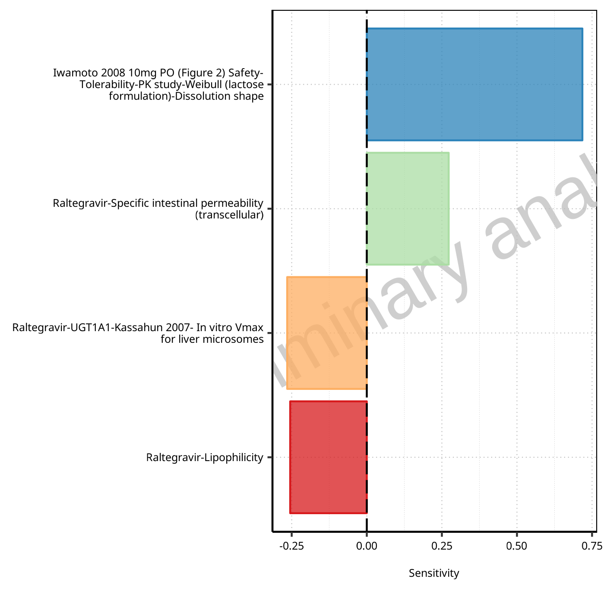


**Figure 1-1: Most sensitive parameters for C_max of Raltegravir.**


<br>
<br>


```{=openxml}
<w:br w:type="page"/>
```

`<w:bookmarkStart w:id="figure-1-2" w:name="figure-1-2"/><w:bookmarkEnd w:id="figure-1-2"/>`{=openxml}

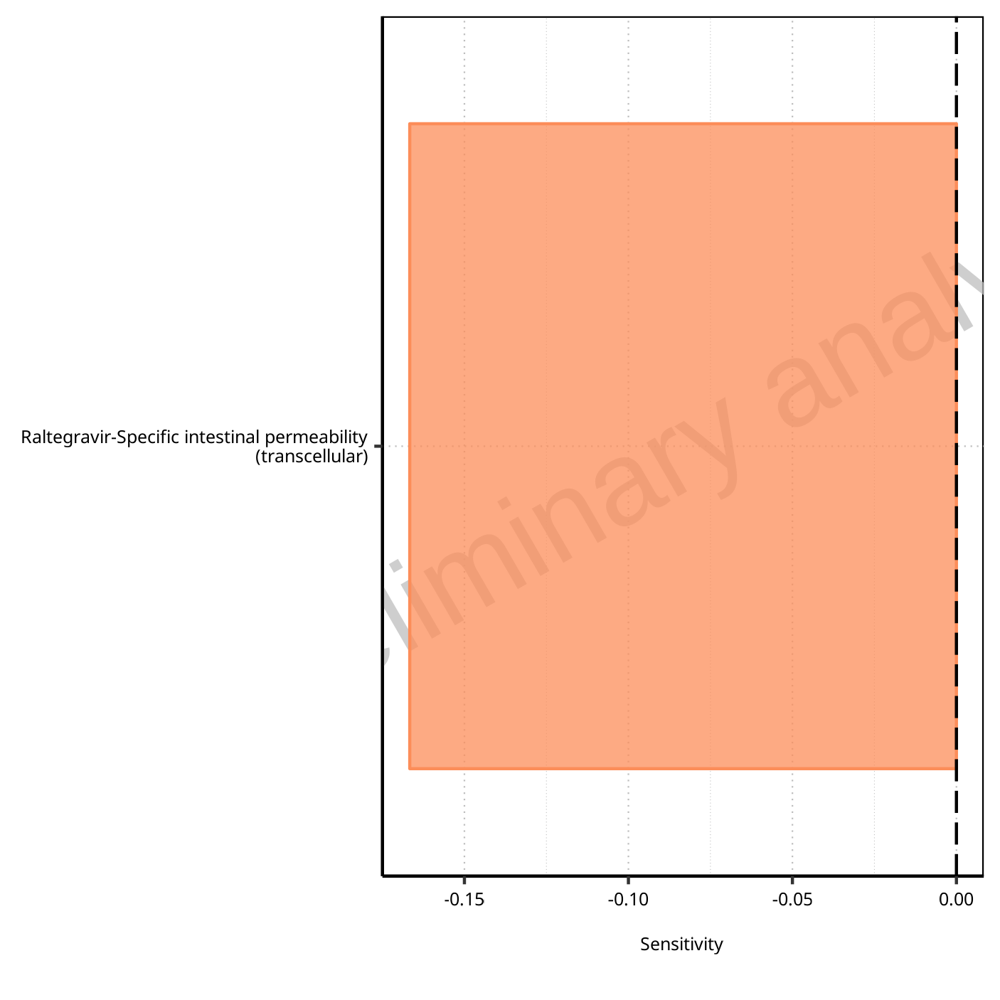


**Figure 1-2: Most sensitive parameters for t_max of Raltegravir.**


<br>
<br>


```{=openxml}
<w:br w:type="page"/>
```

`<w:bookmarkStart w:id="figure-1-3" w:name="figure-1-3"/><w:bookmarkEnd w:id="figure-1-3"/>`{=openxml}

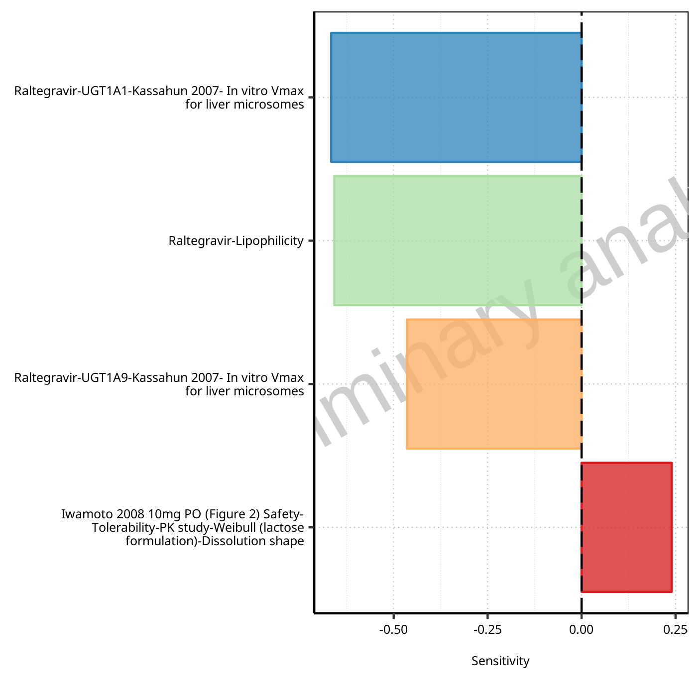


**Figure 1-3: Most sensitive parameters for C_tEnd of Raltegravir.**


<br>
<br>


```{=openxml}
<w:br w:type="page"/>
```

`<w:bookmarkStart w:id="figure-1-4" w:name="figure-1-4"/><w:bookmarkEnd w:id="figure-1-4"/>`{=openxml}

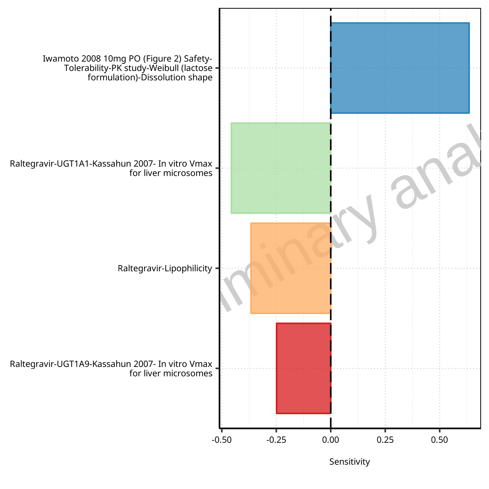


**Figure 1-4: Most sensitive parameters for AUC of Raltegravir.**


<br>
<br>


```{=openxml}
<w:br w:type="page"/>
```

`<w:bookmarkStart w:id="figure-1-5" w:name="figure-1-5"/><w:bookmarkEnd w:id="figure-1-5"/>`{=openxml}


**Figure 1-5: Most sensitive parameters for AUC_inf of Raltegravir.**


<br>
<br>


```{=openxml}
<w:br w:type="page"/>
```

`<w:bookmarkStart w:id="figure-1-6" w:name="figure-1-6"/><w:bookmarkEnd w:id="figure-1-6"/>`{=openxml}

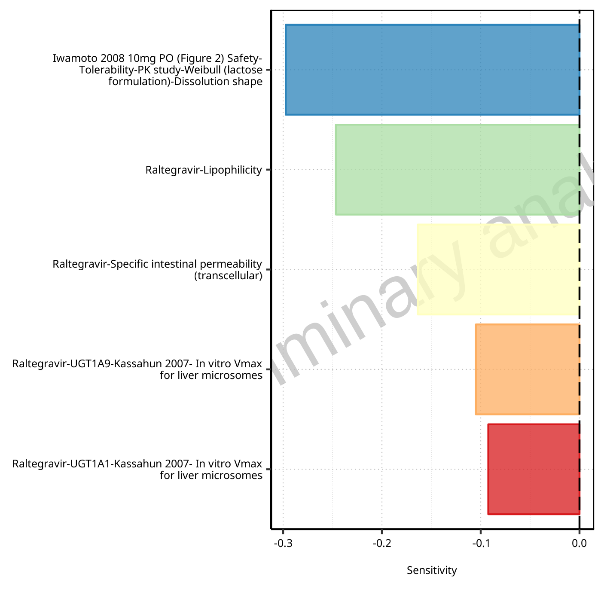


**Figure 1-6: Most sensitive parameters for MRT of Raltegravir.**


<br>
<br>


```{=openxml}
<w:br w:type="page"/>
```

`<w:bookmarkStart w:id="figure-1-7" w:name="figure-1-7"/><w:bookmarkEnd w:id="figure-1-7"/>`{=openxml}

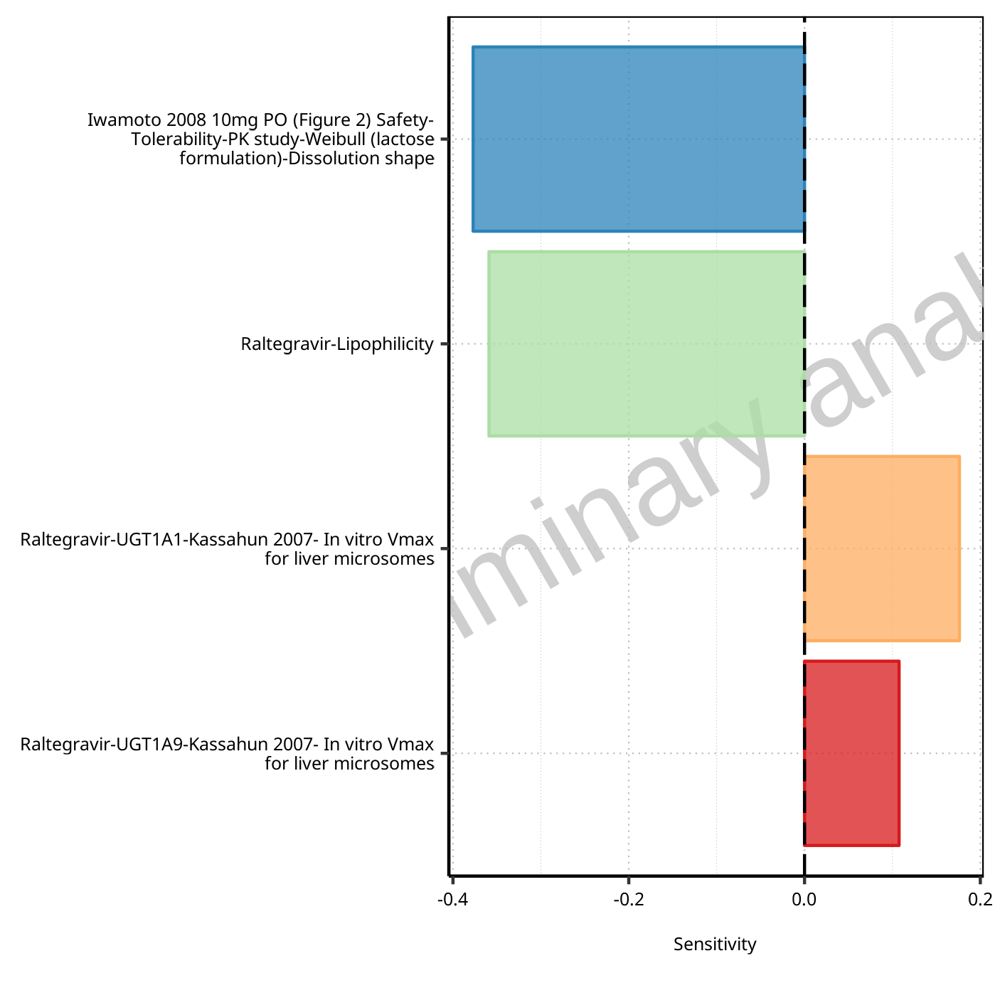


**Figure 1-7: Most sensitive parameters for Thalf of Raltegravir.**


<br>
<br>


```{=openxml}
<w:br w:type="page"/>
```

`<w:bookmarkStart w:id="figure-1-8" w:name="figure-1-8"/><w:bookmarkEnd w:id="figure-1-8"/>`{=openxml}

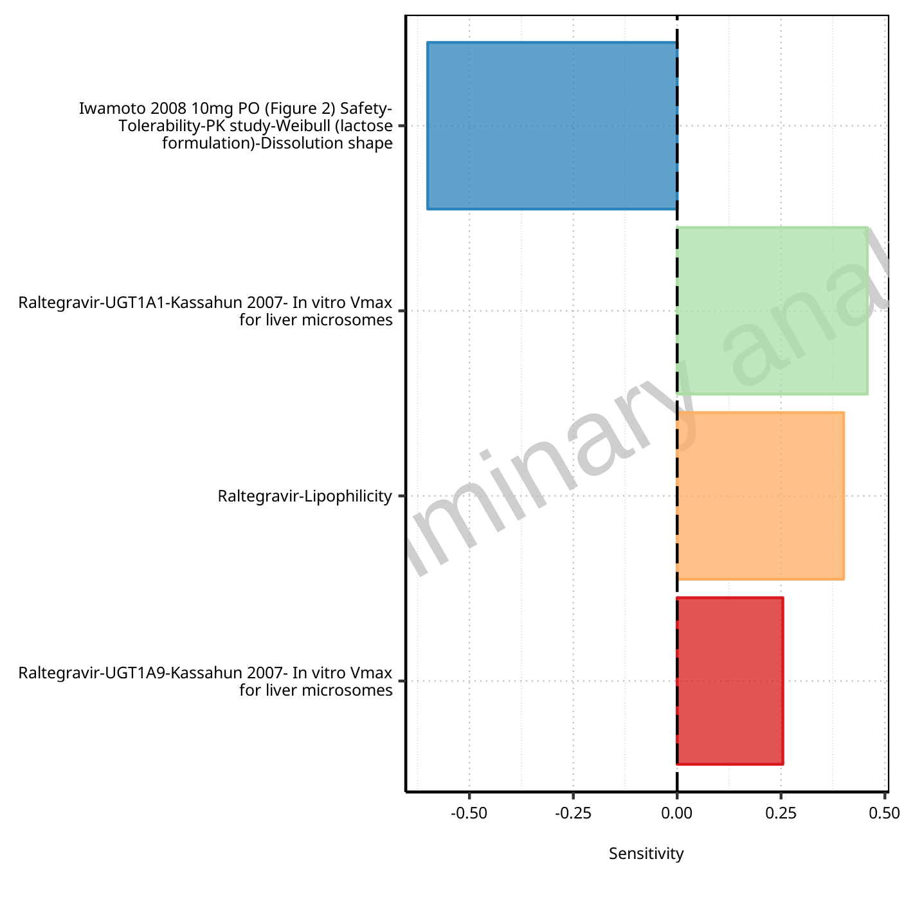


**Figure 1-8: Most sensitive parameters for CL of Raltegravir.**


<br>
<br>


```{=openxml}
<w:br w:type="page"/>
```

`<w:bookmarkStart w:id="figure-1-9" w:name="figure-1-9"/><w:bookmarkEnd w:id="figure-1-9"/>`{=openxml}

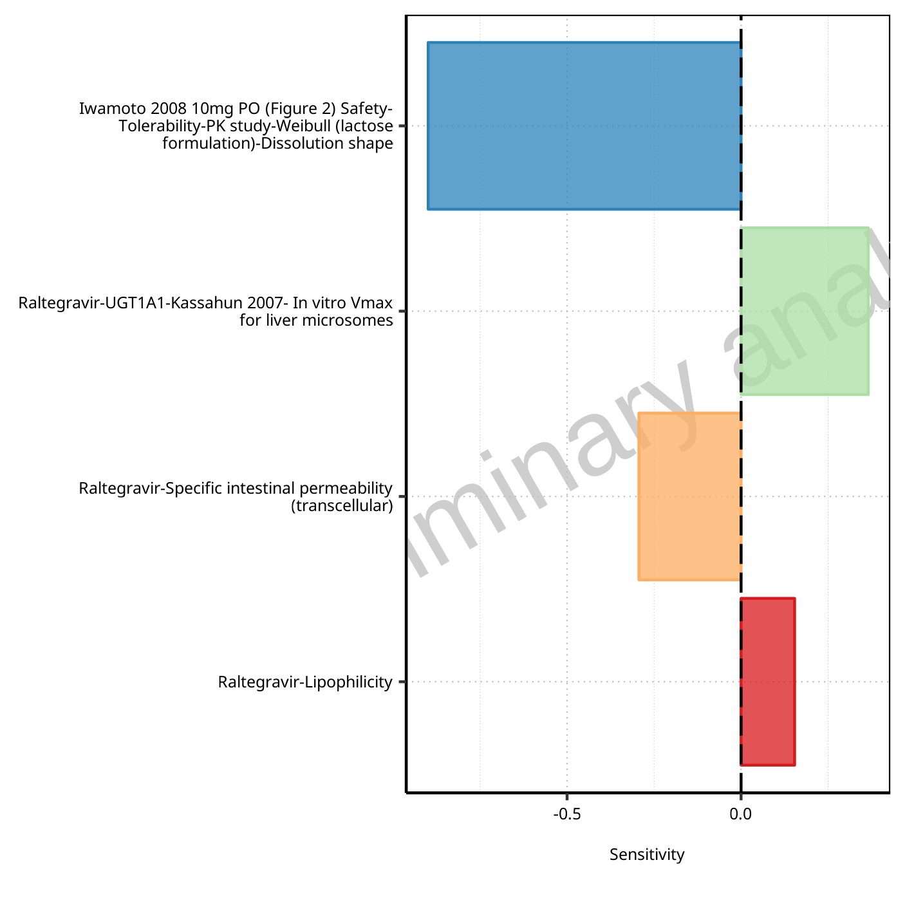


**Figure 1-9: Most sensitive parameters for Vss of Raltegravir.**


<br>
<br>


```{=openxml}
<w:br w:type="page"/>
```

`<w:bookmarkStart w:id="figure-1-10" w:name="figure-1-10"/><w:bookmarkEnd w:id="figure-1-10"/>`{=openxml}

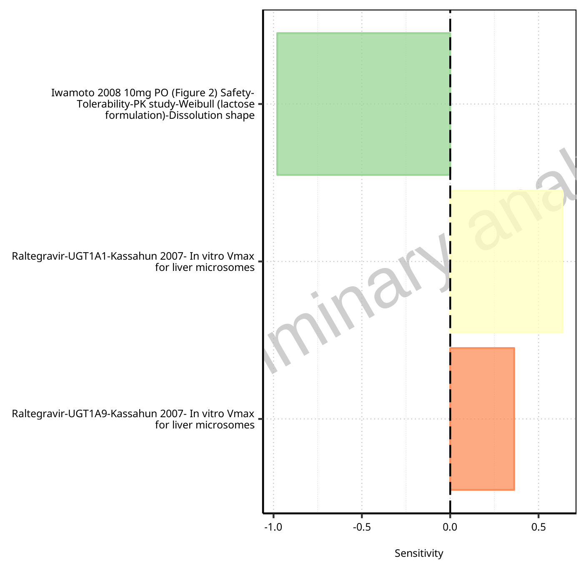


**Figure 1-10: Most sensitive parameters for Vd of Raltegravir.**


<br>
<br>


## Sensitivity Analysis for Raltegravir 100 mg filmcoated tablet md `<w:bookmarkStart w:id="sensitivity-analysis-raltegravir_100_mg_filmcoated_tablet_md" w:name="sensitivity-analysis-raltegravir_100_mg_filmcoated_tablet_md"/><w:bookmarkEnd w:id="sensitivity-analysis-raltegravir_100_mg_filmcoated_tablet_md"/>`{=openxml}


```{=openxml}
<w:br w:type="page"/>
```

`<w:bookmarkStart w:id="figure-1-11" w:name="figure-1-11"/><w:bookmarkEnd w:id="figure-1-11"/>`{=openxml}


**Figure 1-11: Most sensitive parameters for C_max of Raltegravir.**


<br>
<br>


```{=openxml}
<w:br w:type="page"/>
```

`<w:bookmarkStart w:id="figure-1-12" w:name="figure-1-12"/><w:bookmarkEnd w:id="figure-1-12"/>`{=openxml}

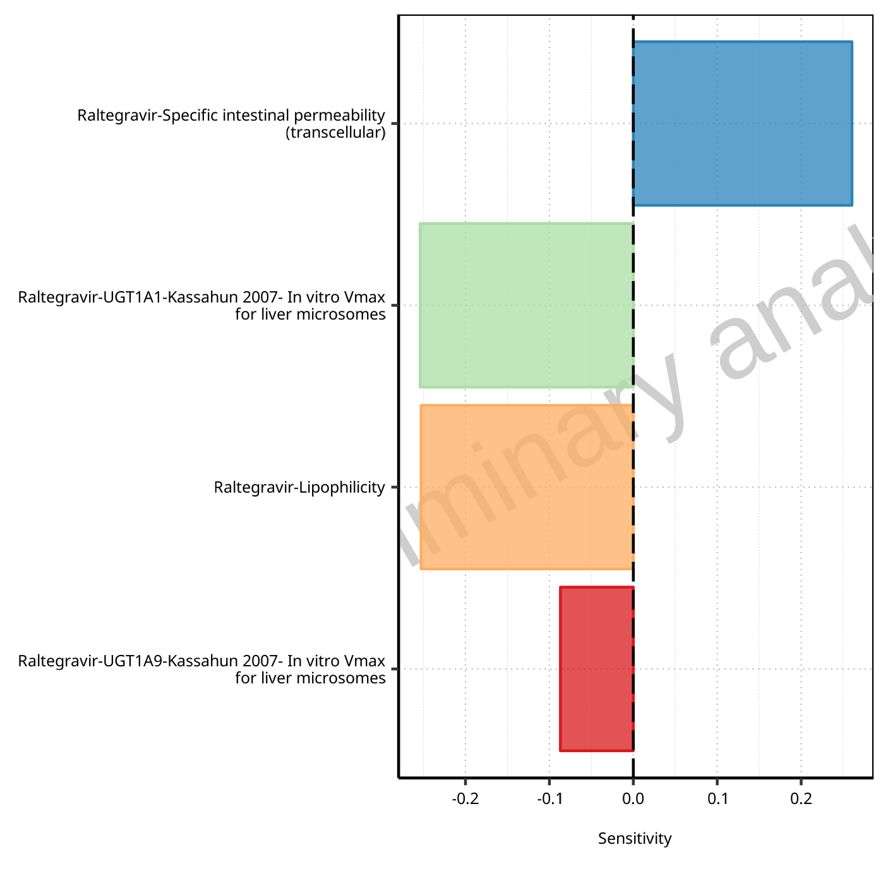


**Figure 1-12: Most sensitive parameters for C_max_t1_t2 of Raltegravir.**


<br>
<br>


```{=openxml}
<w:br w:type="page"/>
```

`<w:bookmarkStart w:id="figure-1-13" w:name="figure-1-13"/><w:bookmarkEnd w:id="figure-1-13"/>`{=openxml}

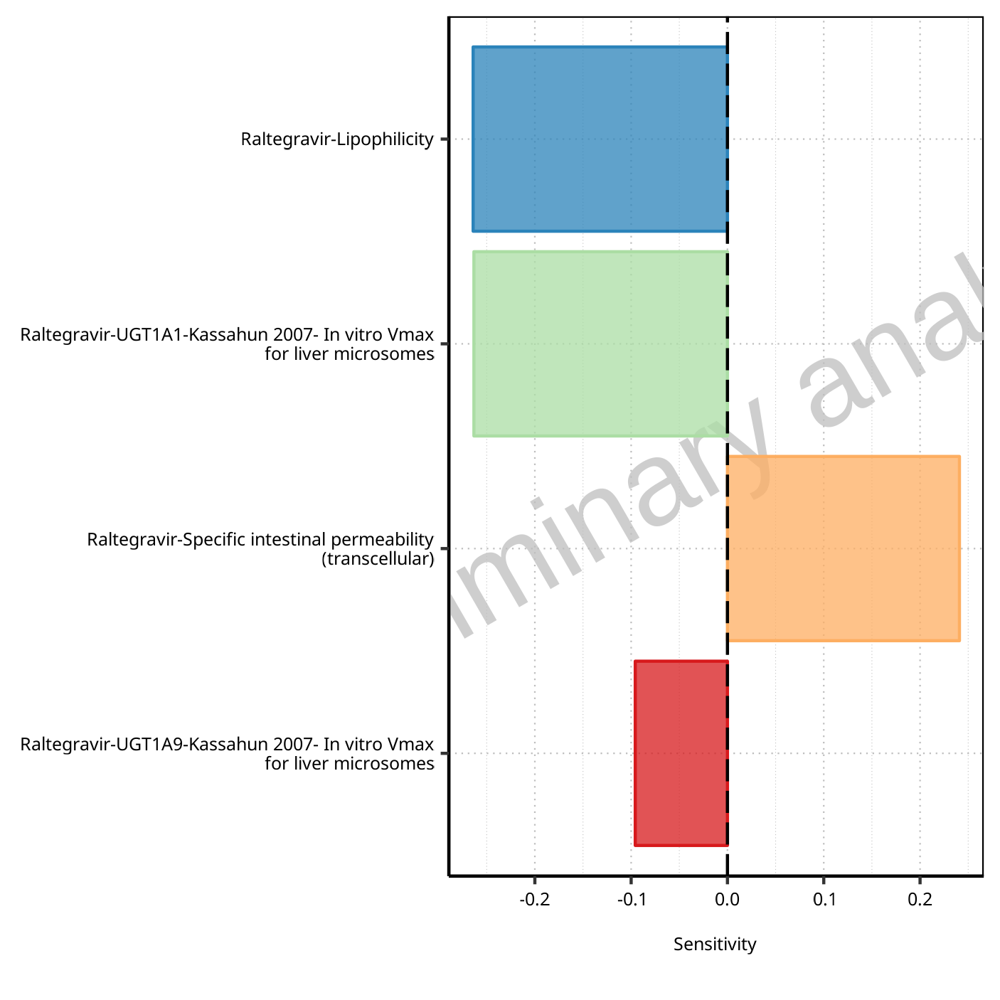


**Figure 1-13: Most sensitive parameters for C_max_tLast_tEnd of Raltegravir.**


<br>
<br>


```{=openxml}
<w:br w:type="page"/>
```

`<w:bookmarkStart w:id="figure-1-14" w:name="figure-1-14"/><w:bookmarkEnd w:id="figure-1-14"/>`{=openxml}

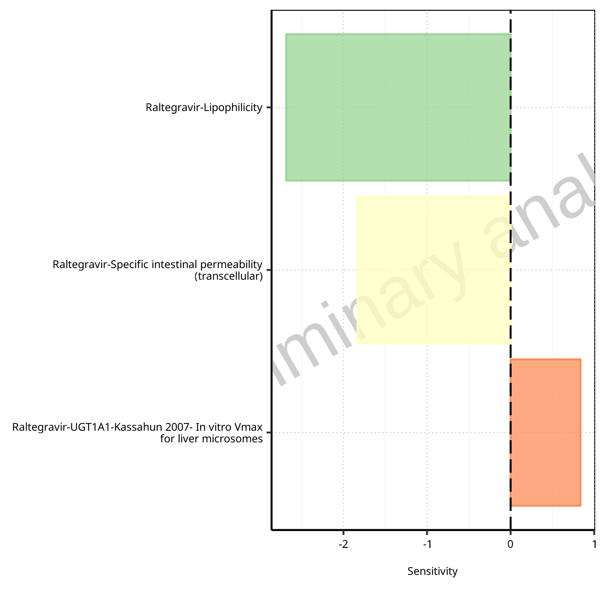


**Figure 1-14: Most sensitive parameters for t_max of Raltegravir.**


<br>
<br>


```{=openxml}
<w:br w:type="page"/>
```

`<w:bookmarkStart w:id="figure-1-15" w:name="figure-1-15"/><w:bookmarkEnd w:id="figure-1-15"/>`{=openxml}


**Figure 1-15: Most sensitive parameters for t_max_t1_t2 of Raltegravir.**


<br>
<br>


```{=openxml}
<w:br w:type="page"/>
```

`<w:bookmarkStart w:id="figure-1-16" w:name="figure-1-16"/><w:bookmarkEnd w:id="figure-1-16"/>`{=openxml}


**Figure 1-16: Most sensitive parameters for t_max_tLast_tEnd of Raltegravir.**


<br>
<br>


```{=openxml}
<w:br w:type="page"/>
```

`<w:bookmarkStart w:id="figure-1-17" w:name="figure-1-17"/><w:bookmarkEnd w:id="figure-1-17"/>`{=openxml}


**Figure 1-17: Most sensitive parameters for C_trough_t2 of Raltegravir.**


<br>
<br>


```{=openxml}
<w:br w:type="page"/>
```

`<w:bookmarkStart w:id="figure-1-18" w:name="figure-1-18"/><w:bookmarkEnd w:id="figure-1-18"/>`{=openxml}


**Figure 1-18: Most sensitive parameters for C_trough_tLast of Raltegravir.**


<br>
<br>


```{=openxml}
<w:br w:type="page"/>
```

`<w:bookmarkStart w:id="figure-1-19" w:name="figure-1-19"/><w:bookmarkEnd w:id="figure-1-19"/>`{=openxml}

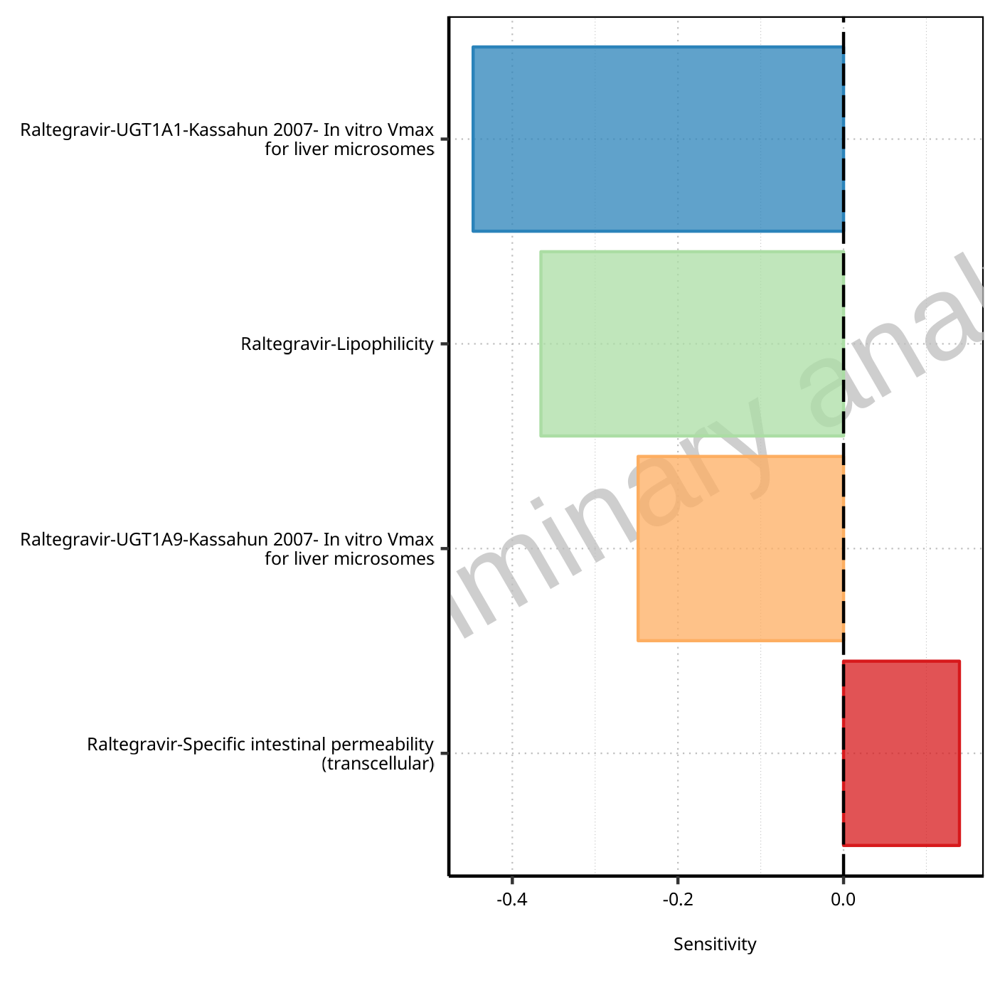


**Figure 1-19: Most sensitive parameters for AUC_t1_t2 of Raltegravir.**


<br>
<br>


```{=openxml}
<w:br w:type="page"/>
```

`<w:bookmarkStart w:id="figure-1-20" w:name="figure-1-20"/><w:bookmarkEnd w:id="figure-1-20"/>`{=openxml}


**Figure 1-20: Most sensitive parameters for AUC_tLast_minus_1_tLast of Raltegravir.**


<br>
<br>


```{=openxml}
<w:br w:type="page"/>
```

`<w:bookmarkStart w:id="figure-1-21" w:name="figure-1-21"/><w:bookmarkEnd w:id="figure-1-21"/>`{=openxml}

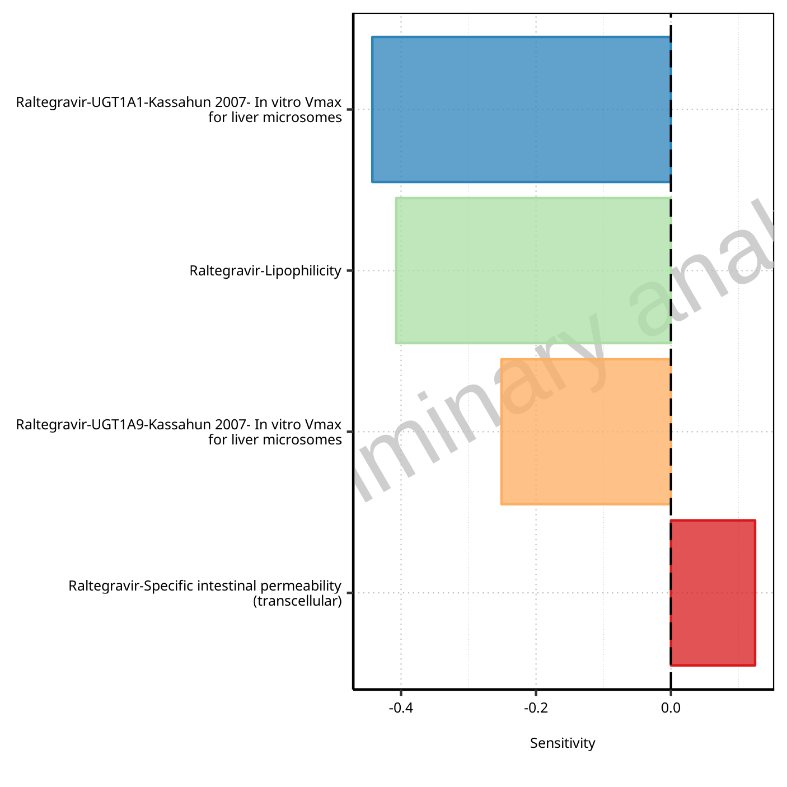


**Figure 1-21: Most sensitive parameters for AUC_inf_t1 of Raltegravir.**


<br>
<br>


```{=openxml}
<w:br w:type="page"/>
```

`<w:bookmarkStart w:id="figure-1-22" w:name="figure-1-22"/><w:bookmarkEnd w:id="figure-1-22"/>`{=openxml}


**Figure 1-22: Most sensitive parameters for AUC_inf_tLast of Raltegravir.**


<br>
<br>


```{=openxml}
<w:br w:type="page"/>
```

`<w:bookmarkStart w:id="figure-1-23" w:name="figure-1-23"/><w:bookmarkEnd w:id="figure-1-23"/>`{=openxml}

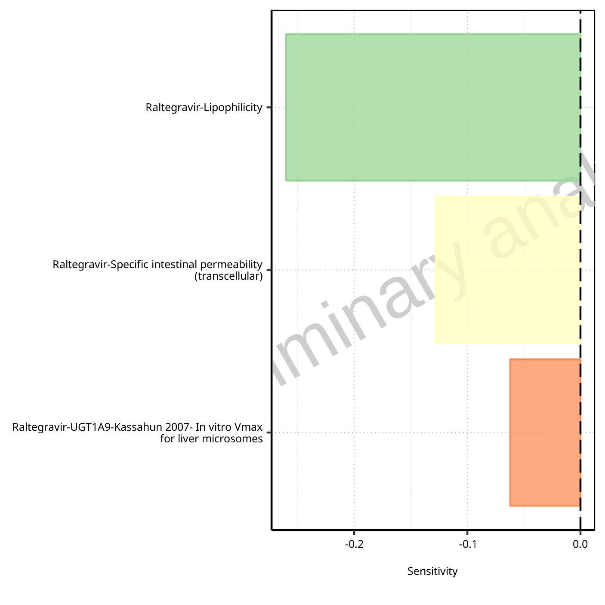


**Figure 1-23: Most sensitive parameters for MRT of Raltegravir.**


<br>
<br>


```{=openxml}
<w:br w:type="page"/>
```

`<w:bookmarkStart w:id="figure-1-24" w:name="figure-1-24"/><w:bookmarkEnd w:id="figure-1-24"/>`{=openxml}

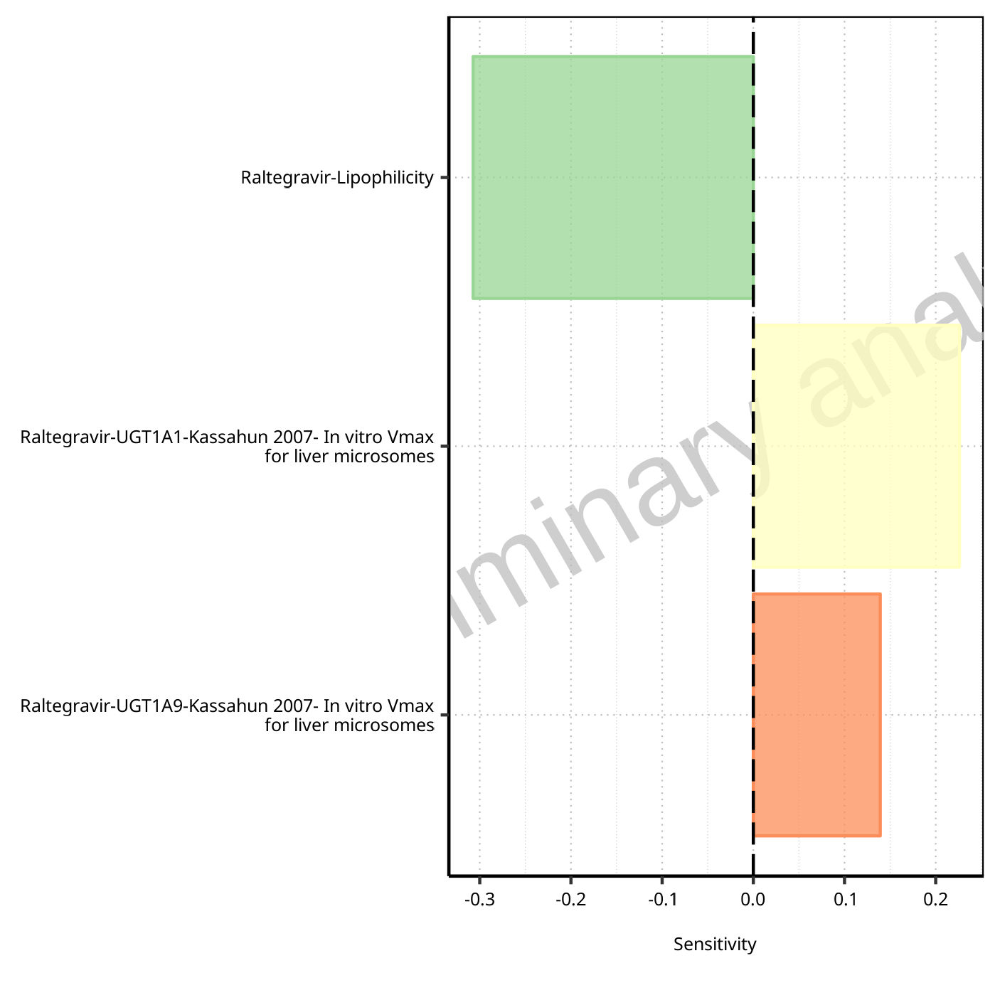


**Figure 1-24: Most sensitive parameters for Thalf of Raltegravir.**


<br>
<br>


```{=openxml}
<w:br w:type="page"/>
```

`<w:bookmarkStart w:id="figure-1-25" w:name="figure-1-25"/><w:bookmarkEnd w:id="figure-1-25"/>`{=openxml}

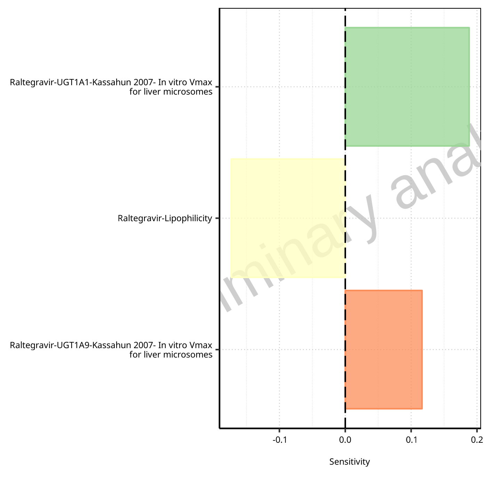


**Figure 1-25: Most sensitive parameters for Thalf_tLast_tEnd of Raltegravir.**


<br>
<br>


## Sensitivity Analysis for Raltegravir 200 mg filmcoated tablet md `<w:bookmarkStart w:id="sensitivity-analysis-raltegravir_200_mg_filmcoated_tablet_md" w:name="sensitivity-analysis-raltegravir_200_mg_filmcoated_tablet_md"/><w:bookmarkEnd w:id="sensitivity-analysis-raltegravir_200_mg_filmcoated_tablet_md"/>`{=openxml}


```{=openxml}
<w:br w:type="page"/>
```

`<w:bookmarkStart w:id="figure-1-26" w:name="figure-1-26"/><w:bookmarkEnd w:id="figure-1-26"/>`{=openxml}


**Figure 1-26: Most sensitive parameters for C_max of Raltegravir.**


<br>
<br>


```{=openxml}
<w:br w:type="page"/>
```

`<w:bookmarkStart w:id="figure-1-27" w:name="figure-1-27"/><w:bookmarkEnd w:id="figure-1-27"/>`{=openxml}

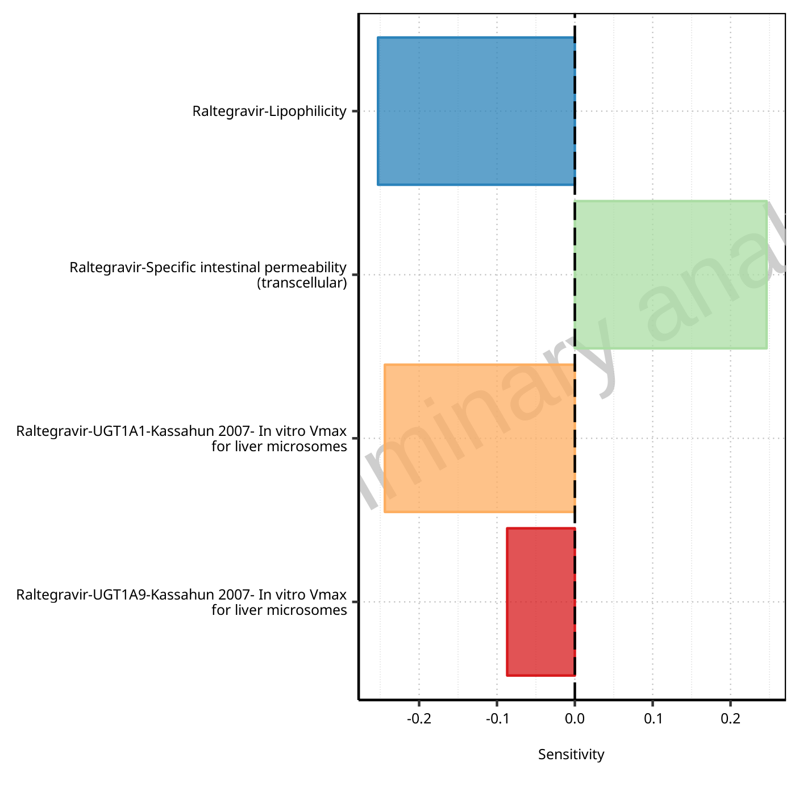


**Figure 1-27: Most sensitive parameters for C_max_t1_t2 of Raltegravir.**


<br>
<br>


```{=openxml}
<w:br w:type="page"/>
```

`<w:bookmarkStart w:id="figure-1-28" w:name="figure-1-28"/><w:bookmarkEnd w:id="figure-1-28"/>`{=openxml}

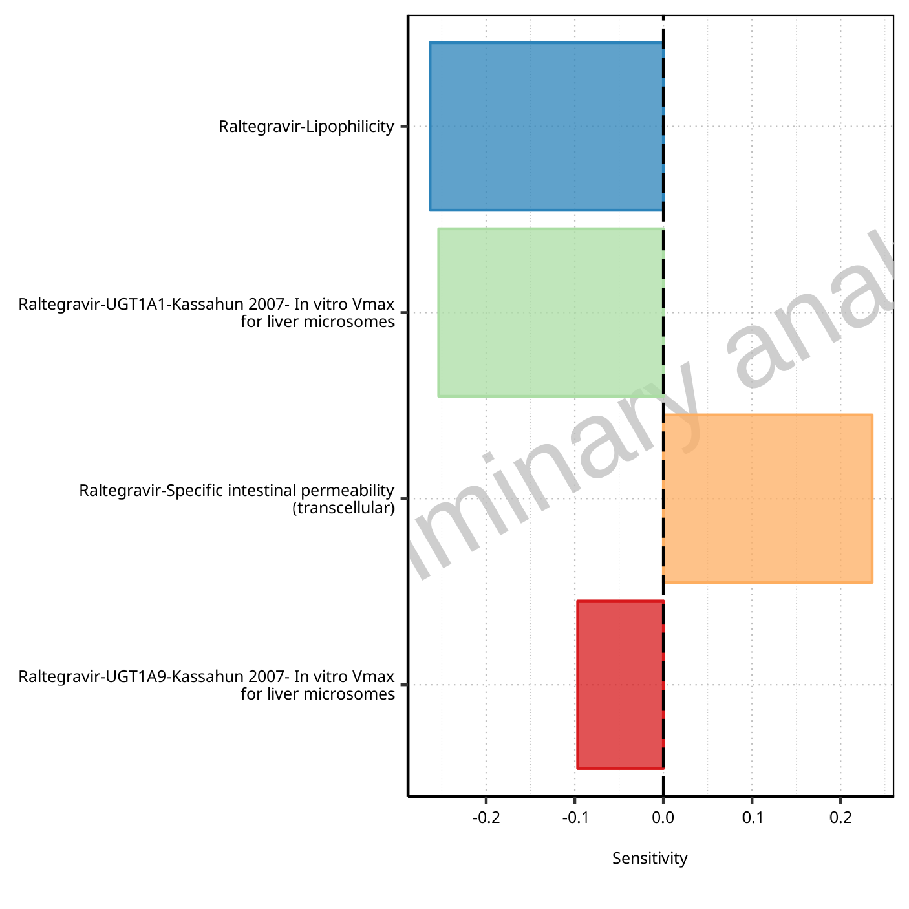


**Figure 1-28: Most sensitive parameters for C_max_tLast_tEnd of Raltegravir.**


<br>
<br>


```{=openxml}
<w:br w:type="page"/>
```

`<w:bookmarkStart w:id="figure-1-29" w:name="figure-1-29"/><w:bookmarkEnd w:id="figure-1-29"/>`{=openxml}

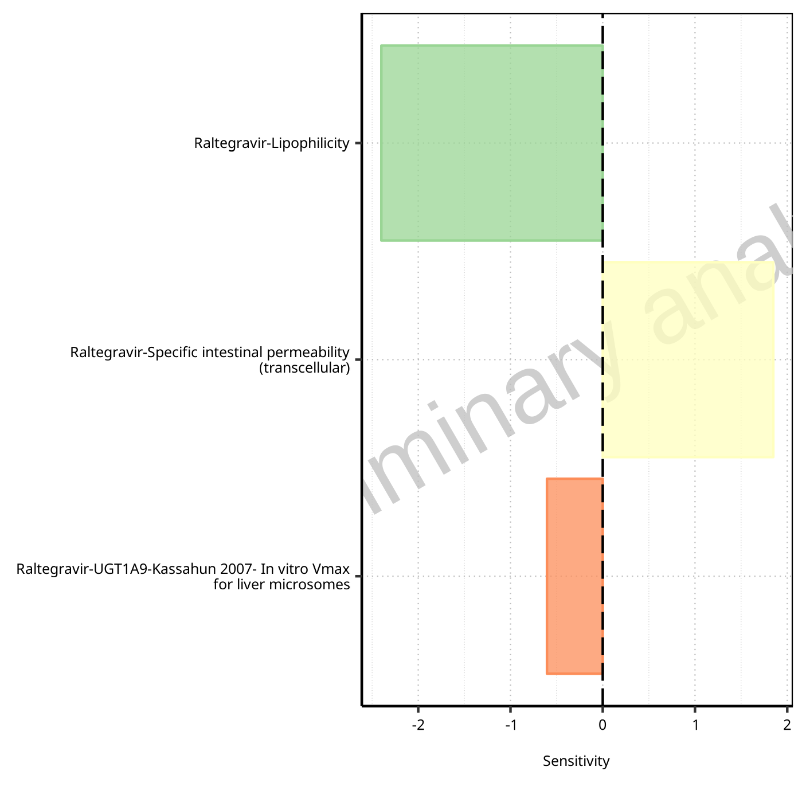


**Figure 1-29: Most sensitive parameters for t_max of Raltegravir.**


<br>
<br>


```{=openxml}
<w:br w:type="page"/>
```

`<w:bookmarkStart w:id="figure-1-30" w:name="figure-1-30"/><w:bookmarkEnd w:id="figure-1-30"/>`{=openxml}

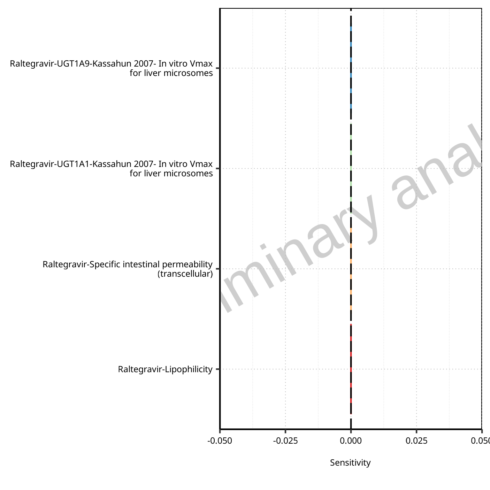


**Figure 1-30: Most sensitive parameters for t_max_t1_t2 of Raltegravir.**


<br>
<br>


```{=openxml}
<w:br w:type="page"/>
```

`<w:bookmarkStart w:id="figure-1-31" w:name="figure-1-31"/><w:bookmarkEnd w:id="figure-1-31"/>`{=openxml}


**Figure 1-31: Most sensitive parameters for t_max_tLast_tEnd of Raltegravir.**


<br>
<br>


```{=openxml}
<w:br w:type="page"/>
```

`<w:bookmarkStart w:id="figure-1-32" w:name="figure-1-32"/><w:bookmarkEnd w:id="figure-1-32"/>`{=openxml}

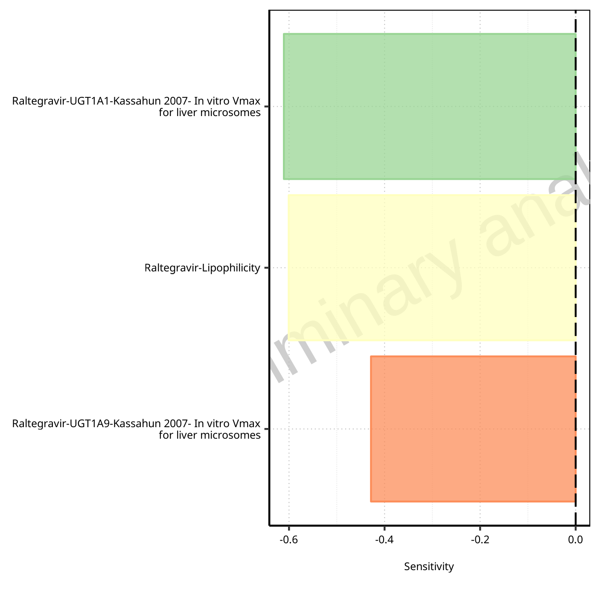


**Figure 1-32: Most sensitive parameters for C_trough_t2 of Raltegravir.**


<br>
<br>


```{=openxml}
<w:br w:type="page"/>
```

`<w:bookmarkStart w:id="figure-1-33" w:name="figure-1-33"/><w:bookmarkEnd w:id="figure-1-33"/>`{=openxml}

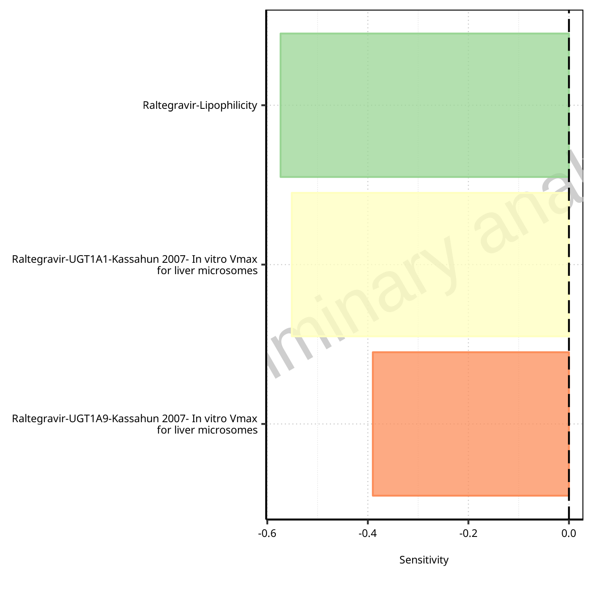


**Figure 1-33: Most sensitive parameters for C_trough_tLast of Raltegravir.**


<br>
<br>


```{=openxml}
<w:br w:type="page"/>
```

`<w:bookmarkStart w:id="figure-1-34" w:name="figure-1-34"/><w:bookmarkEnd w:id="figure-1-34"/>`{=openxml}


**Figure 1-34: Most sensitive parameters for AUC_t1_t2 of Raltegravir.**


<br>
<br>


```{=openxml}
<w:br w:type="page"/>
```

`<w:bookmarkStart w:id="figure-1-35" w:name="figure-1-35"/><w:bookmarkEnd w:id="figure-1-35"/>`{=openxml}


**Figure 1-35: Most sensitive parameters for AUC_tLast_minus_1_tLast of Raltegravir.**


<br>
<br>


```{=openxml}
<w:br w:type="page"/>
```

`<w:bookmarkStart w:id="figure-1-36" w:name="figure-1-36"/><w:bookmarkEnd w:id="figure-1-36"/>`{=openxml}

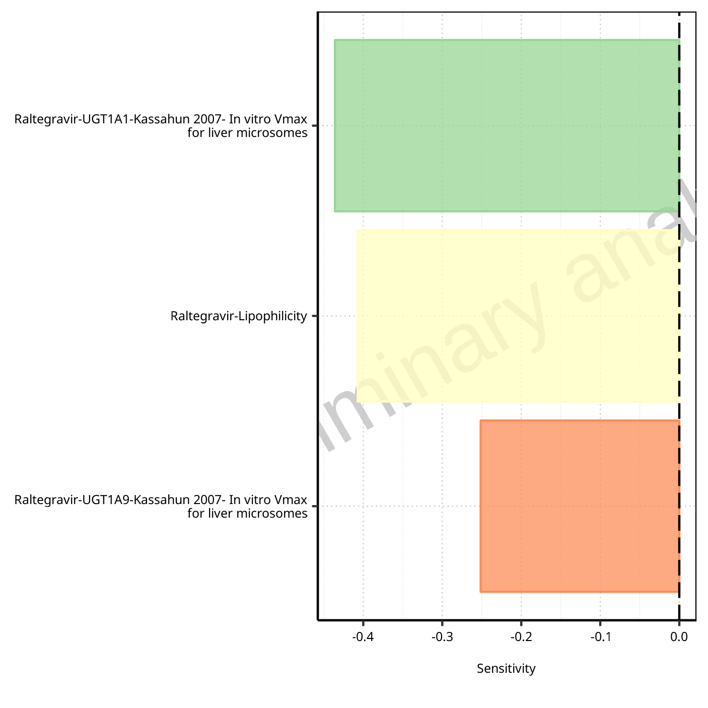


**Figure 1-36: Most sensitive parameters for AUC_inf_t1 of Raltegravir.**


<br>
<br>


```{=openxml}
<w:br w:type="page"/>
```

`<w:bookmarkStart w:id="figure-1-37" w:name="figure-1-37"/><w:bookmarkEnd w:id="figure-1-37"/>`{=openxml}

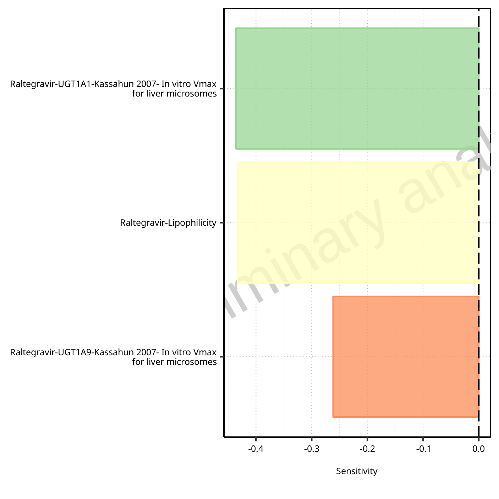


**Figure 1-37: Most sensitive parameters for AUC_inf_tLast of Raltegravir.**


<br>
<br>


```{=openxml}
<w:br w:type="page"/>
```

`<w:bookmarkStart w:id="figure-1-38" w:name="figure-1-38"/><w:bookmarkEnd w:id="figure-1-38"/>`{=openxml}


**Figure 1-38: Most sensitive parameters for MRT of Raltegravir.**


<br>
<br>


```{=openxml}
<w:br w:type="page"/>
```

`<w:bookmarkStart w:id="figure-1-39" w:name="figure-1-39"/><w:bookmarkEnd w:id="figure-1-39"/>`{=openxml}


**Figure 1-39: Most sensitive parameters for Thalf of Raltegravir.**


<br>
<br>


```{=openxml}
<w:br w:type="page"/>
```

`<w:bookmarkStart w:id="figure-1-40" w:name="figure-1-40"/><w:bookmarkEnd w:id="figure-1-40"/>`{=openxml}


**Figure 1-40: Most sensitive parameters for Thalf_tLast_tEnd of Raltegravir.**


<br>
<br>


## Sensitivity Analysis for Filmcoated_tablet_400mg_sd `<w:bookmarkStart w:id="sensitivity-analysis-filmcoated_tablet_400mg_sd" w:name="sensitivity-analysis-filmcoated_tablet_400mg_sd"/><w:bookmarkEnd w:id="sensitivity-analysis-filmcoated_tablet_400mg_sd"/>`{=openxml}


```{=openxml}
<w:br w:type="page"/>
```

`<w:bookmarkStart w:id="figure-1-41" w:name="figure-1-41"/><w:bookmarkEnd w:id="figure-1-41"/>`{=openxml}

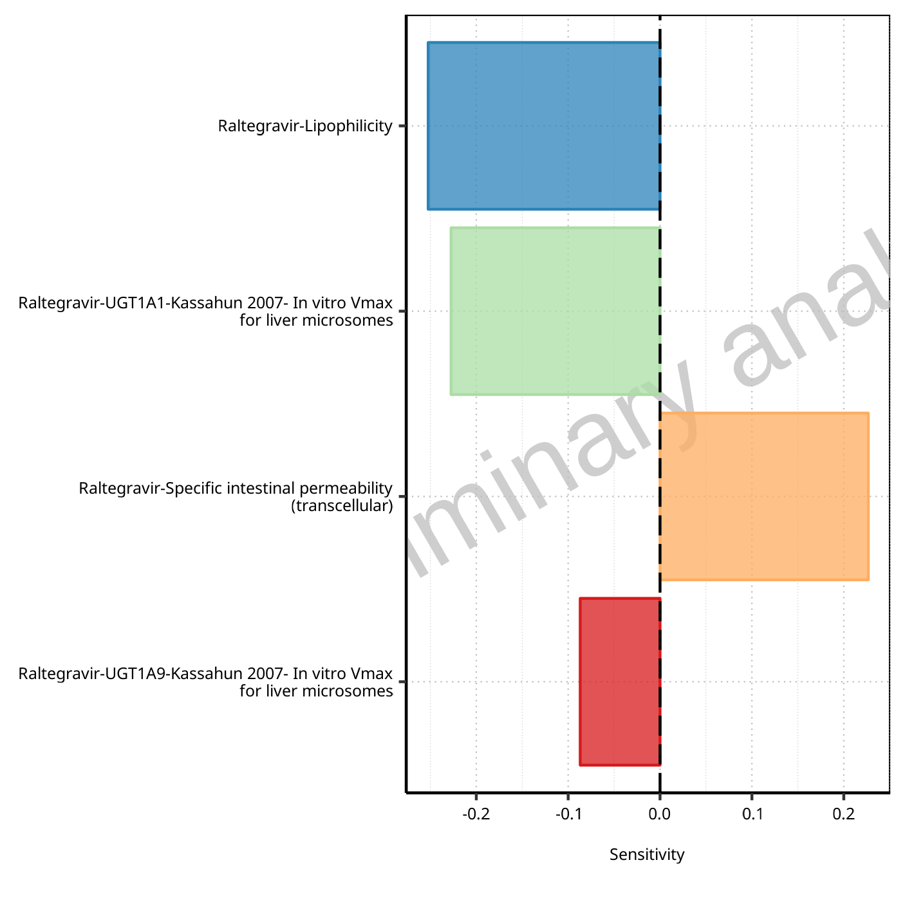


**Figure 1-41: Most sensitive parameters for C_max of Raltegravir.**


<br>
<br>


```{=openxml}
<w:br w:type="page"/>
```

`<w:bookmarkStart w:id="figure-1-42" w:name="figure-1-42"/><w:bookmarkEnd w:id="figure-1-42"/>`{=openxml}


**Figure 1-42: Most sensitive parameters for t_max of Raltegravir.**


<br>
<br>


```{=openxml}
<w:br w:type="page"/>
```

`<w:bookmarkStart w:id="figure-1-43" w:name="figure-1-43"/><w:bookmarkEnd w:id="figure-1-43"/>`{=openxml}

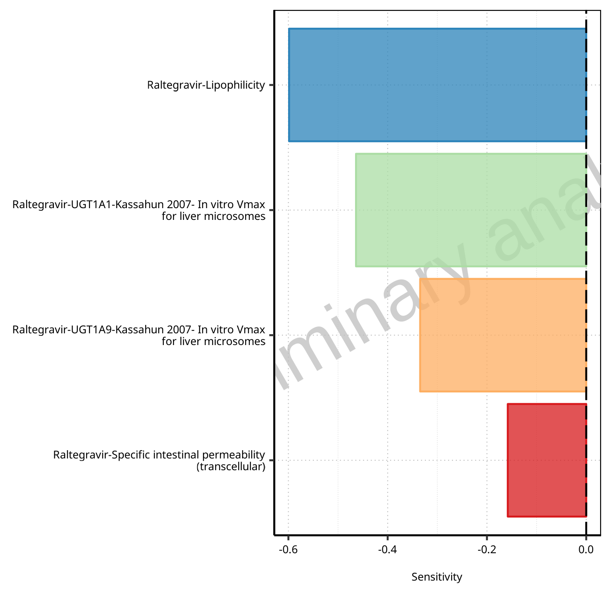


**Figure 1-43: Most sensitive parameters for C_tEnd of Raltegravir.**


<br>
<br>


```{=openxml}
<w:br w:type="page"/>
```

`<w:bookmarkStart w:id="figure-1-44" w:name="figure-1-44"/><w:bookmarkEnd w:id="figure-1-44"/>`{=openxml}


**Figure 1-44: Most sensitive parameters for AUC of Raltegravir.**


<br>
<br>


```{=openxml}
<w:br w:type="page"/>
```

`<w:bookmarkStart w:id="figure-1-45" w:name="figure-1-45"/><w:bookmarkEnd w:id="figure-1-45"/>`{=openxml}

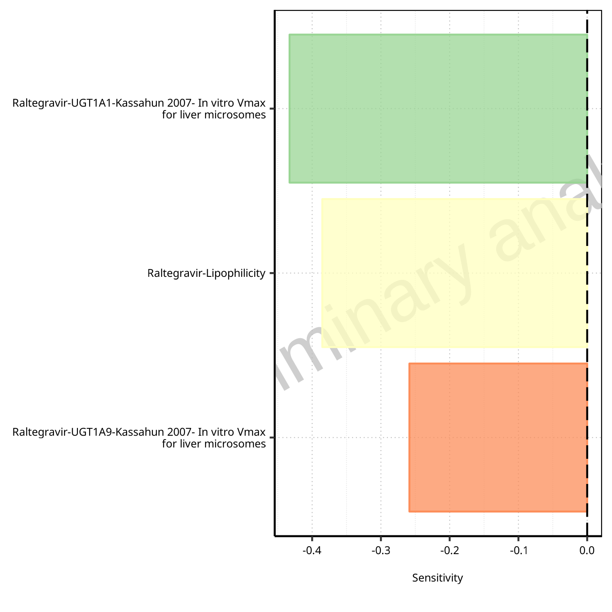


**Figure 1-45: Most sensitive parameters for AUC_inf of Raltegravir.**


<br>
<br>


```{=openxml}
<w:br w:type="page"/>
```

`<w:bookmarkStart w:id="figure-1-46" w:name="figure-1-46"/><w:bookmarkEnd w:id="figure-1-46"/>`{=openxml}

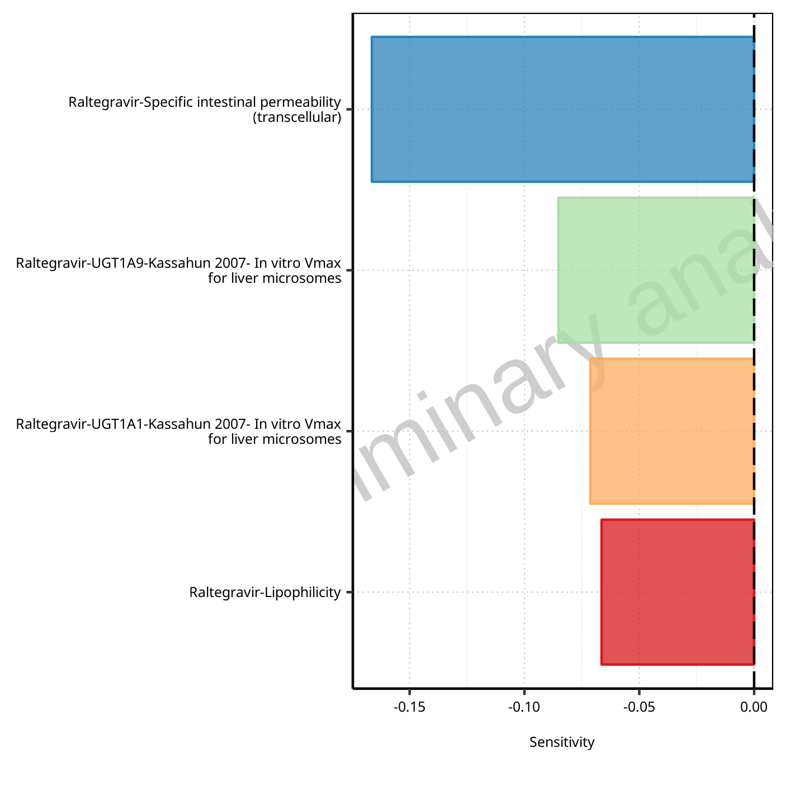


**Figure 1-46: Most sensitive parameters for MRT of Raltegravir.**


<br>
<br>


```{=openxml}
<w:br w:type="page"/>
```

`<w:bookmarkStart w:id="figure-1-47" w:name="figure-1-47"/><w:bookmarkEnd w:id="figure-1-47"/>`{=openxml}

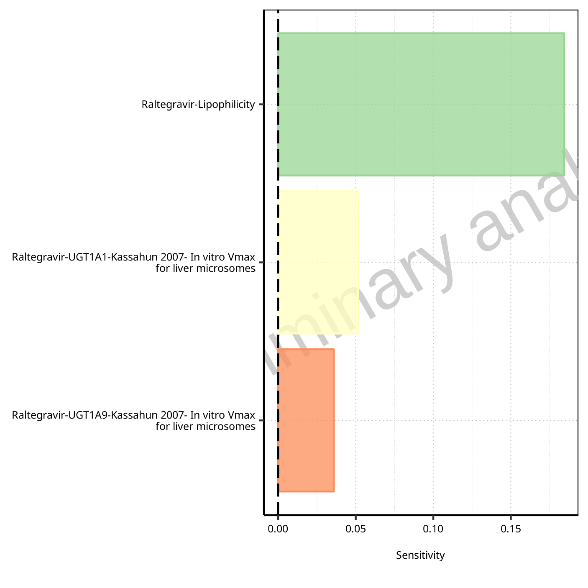


**Figure 1-47: Most sensitive parameters for Thalf of Raltegravir.**


<br>
<br>


```{=openxml}
<w:br w:type="page"/>
```

`<w:bookmarkStart w:id="figure-1-48" w:name="figure-1-48"/><w:bookmarkEnd w:id="figure-1-48"/>`{=openxml}

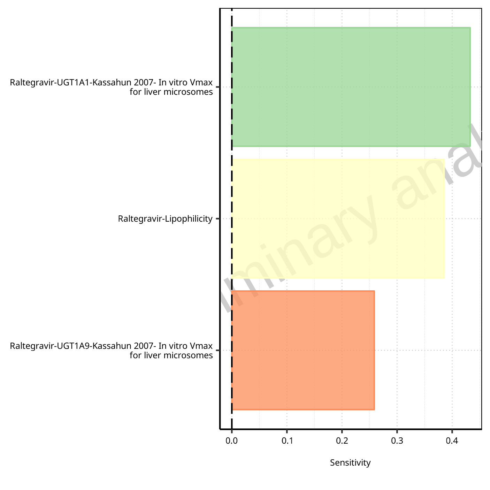


**Figure 1-48: Most sensitive parameters for CL of Raltegravir.**


<br>
<br>


```{=openxml}
<w:br w:type="page"/>
```

`<w:bookmarkStart w:id="figure-1-49" w:name="figure-1-49"/><w:bookmarkEnd w:id="figure-1-49"/>`{=openxml}

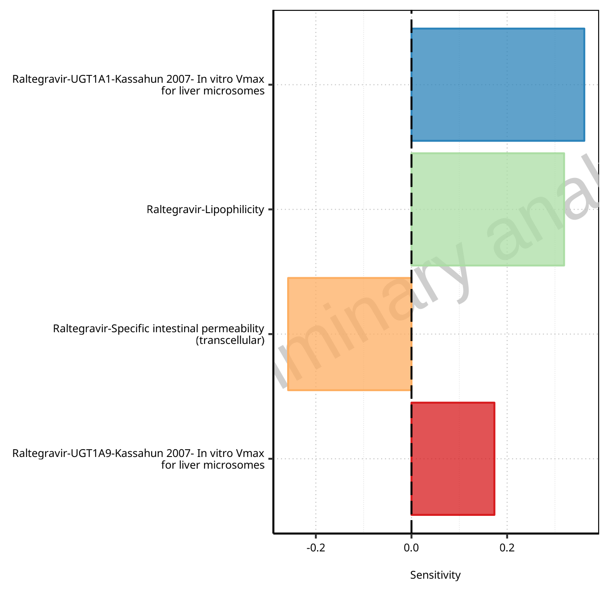


**Figure 1-49: Most sensitive parameters for Vss of Raltegravir.**


<br>
<br>


```{=openxml}
<w:br w:type="page"/>
```

`<w:bookmarkStart w:id="figure-1-50" w:name="figure-1-50"/><w:bookmarkEnd w:id="figure-1-50"/>`{=openxml}


**Figure 1-50: Most sensitive parameters for Vd of Raltegravir.**


<br>
<br>


## Sensitivity Analysis for Raltegravir 400 mg filmcoated tablet md `<w:bookmarkStart w:id="sensitivity-analysis-raltegravir_400_mg_filmcoated_tablet_md" w:name="sensitivity-analysis-raltegravir_400_mg_filmcoated_tablet_md"/><w:bookmarkEnd w:id="sensitivity-analysis-raltegravir_400_mg_filmcoated_tablet_md"/>`{=openxml}


```{=openxml}
<w:br w:type="page"/>
```

`<w:bookmarkStart w:id="figure-1-51" w:name="figure-1-51"/><w:bookmarkEnd w:id="figure-1-51"/>`{=openxml}

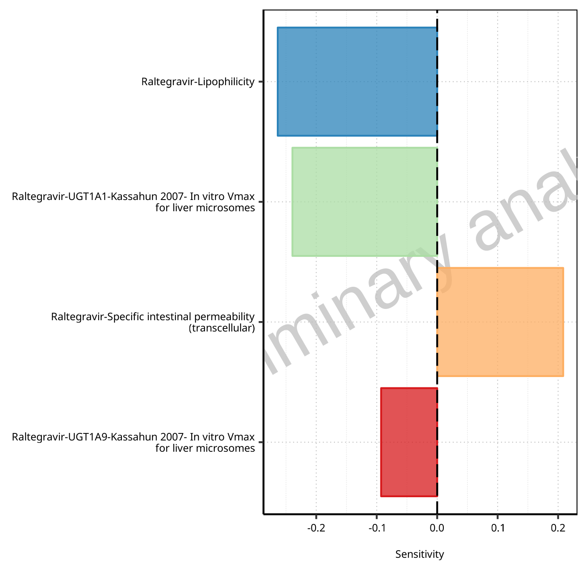


**Figure 1-51: Most sensitive parameters for C_max of Raltegravir.**


<br>
<br>


```{=openxml}
<w:br w:type="page"/>
```

`<w:bookmarkStart w:id="figure-1-52" w:name="figure-1-52"/><w:bookmarkEnd w:id="figure-1-52"/>`{=openxml}


**Figure 1-52: Most sensitive parameters for C_max_t1_t2 of Raltegravir.**


<br>
<br>


```{=openxml}
<w:br w:type="page"/>
```

`<w:bookmarkStart w:id="figure-1-53" w:name="figure-1-53"/><w:bookmarkEnd w:id="figure-1-53"/>`{=openxml}


**Figure 1-53: Most sensitive parameters for C_max_tLast_tEnd of Raltegravir.**


<br>
<br>


```{=openxml}
<w:br w:type="page"/>
```

`<w:bookmarkStart w:id="figure-1-54" w:name="figure-1-54"/><w:bookmarkEnd w:id="figure-1-54"/>`{=openxml}

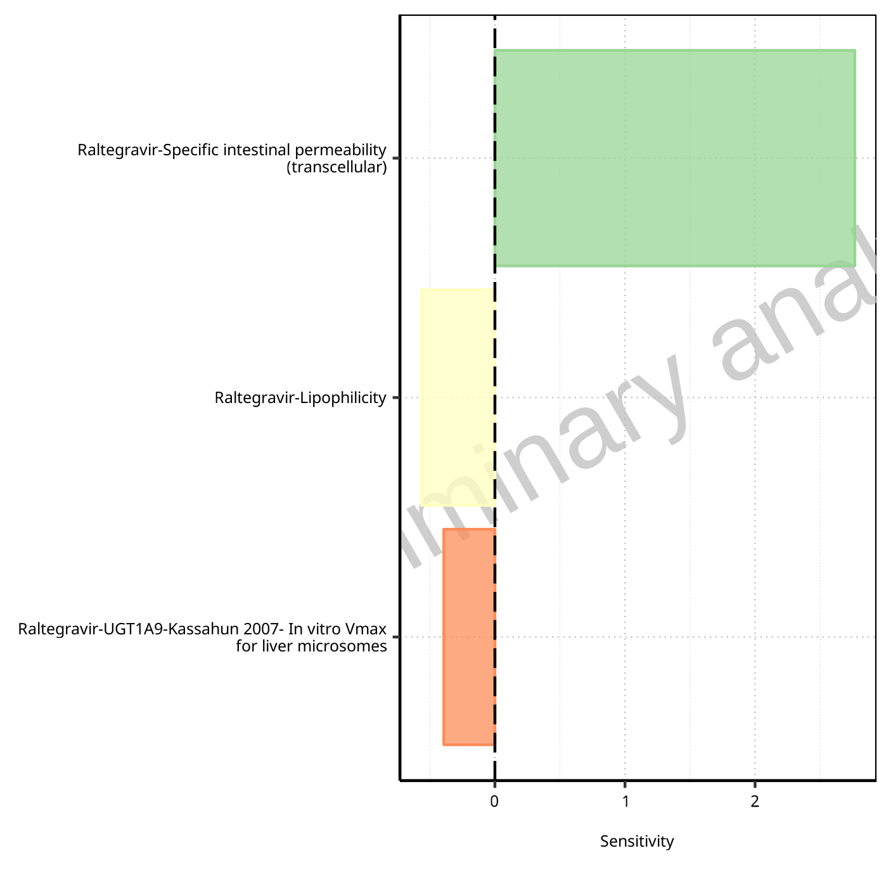


**Figure 1-54: Most sensitive parameters for t_max of Raltegravir.**


<br>
<br>


```{=openxml}
<w:br w:type="page"/>
```

`<w:bookmarkStart w:id="figure-1-55" w:name="figure-1-55"/><w:bookmarkEnd w:id="figure-1-55"/>`{=openxml}


**Figure 1-55: Most sensitive parameters for t_max_t1_t2 of Raltegravir.**


<br>
<br>


```{=openxml}
<w:br w:type="page"/>
```

`<w:bookmarkStart w:id="figure-1-56" w:name="figure-1-56"/><w:bookmarkEnd w:id="figure-1-56"/>`{=openxml}


**Figure 1-56: Most sensitive parameters for t_max_tLast_tEnd of Raltegravir.**


<br>
<br>


```{=openxml}
<w:br w:type="page"/>
```

`<w:bookmarkStart w:id="figure-1-57" w:name="figure-1-57"/><w:bookmarkEnd w:id="figure-1-57"/>`{=openxml}


**Figure 1-57: Most sensitive parameters for C_trough_t2 of Raltegravir.**


<br>
<br>


```{=openxml}
<w:br w:type="page"/>
```

`<w:bookmarkStart w:id="figure-1-58" w:name="figure-1-58"/><w:bookmarkEnd w:id="figure-1-58"/>`{=openxml}


**Figure 1-58: Most sensitive parameters for C_trough_tLast of Raltegravir.**


<br>
<br>


```{=openxml}
<w:br w:type="page"/>
```

`<w:bookmarkStart w:id="figure-1-59" w:name="figure-1-59"/><w:bookmarkEnd w:id="figure-1-59"/>`{=openxml}

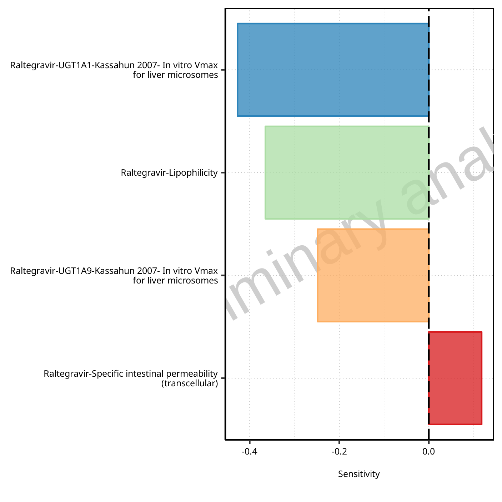


**Figure 1-59: Most sensitive parameters for AUC_t1_t2 of Raltegravir.**


<br>
<br>


```{=openxml}
<w:br w:type="page"/>
```

`<w:bookmarkStart w:id="figure-1-60" w:name="figure-1-60"/><w:bookmarkEnd w:id="figure-1-60"/>`{=openxml}


**Figure 1-60: Most sensitive parameters for AUC_tLast_minus_1_tLast of Raltegravir.**


<br>
<br>


```{=openxml}
<w:br w:type="page"/>
```

`<w:bookmarkStart w:id="figure-1-61" w:name="figure-1-61"/><w:bookmarkEnd w:id="figure-1-61"/>`{=openxml}


**Figure 1-61: Most sensitive parameters for AUC_inf_t1 of Raltegravir.**


<br>
<br>


```{=openxml}
<w:br w:type="page"/>
```

`<w:bookmarkStart w:id="figure-1-62" w:name="figure-1-62"/><w:bookmarkEnd w:id="figure-1-62"/>`{=openxml}

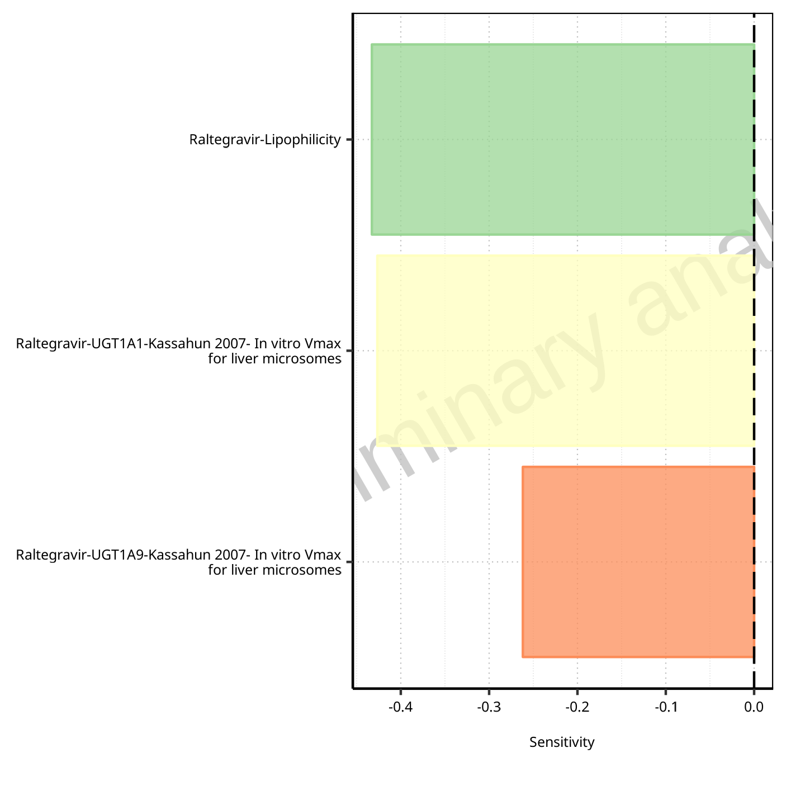


**Figure 1-62: Most sensitive parameters for AUC_inf_tLast of Raltegravir.**


<br>
<br>


```{=openxml}
<w:br w:type="page"/>
```

`<w:bookmarkStart w:id="figure-1-63" w:name="figure-1-63"/><w:bookmarkEnd w:id="figure-1-63"/>`{=openxml}

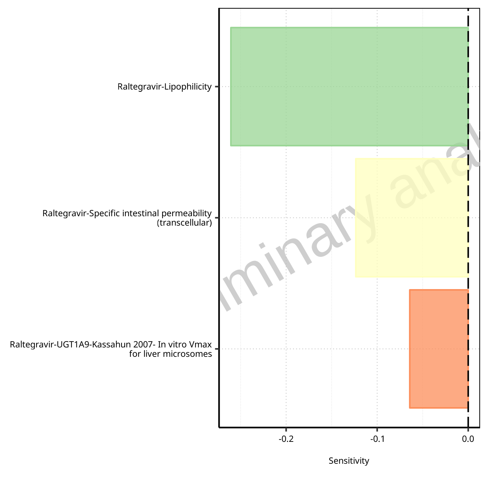


**Figure 1-63: Most sensitive parameters for MRT of Raltegravir.**


<br>
<br>


```{=openxml}
<w:br w:type="page"/>
```

`<w:bookmarkStart w:id="figure-1-64" w:name="figure-1-64"/><w:bookmarkEnd w:id="figure-1-64"/>`{=openxml}

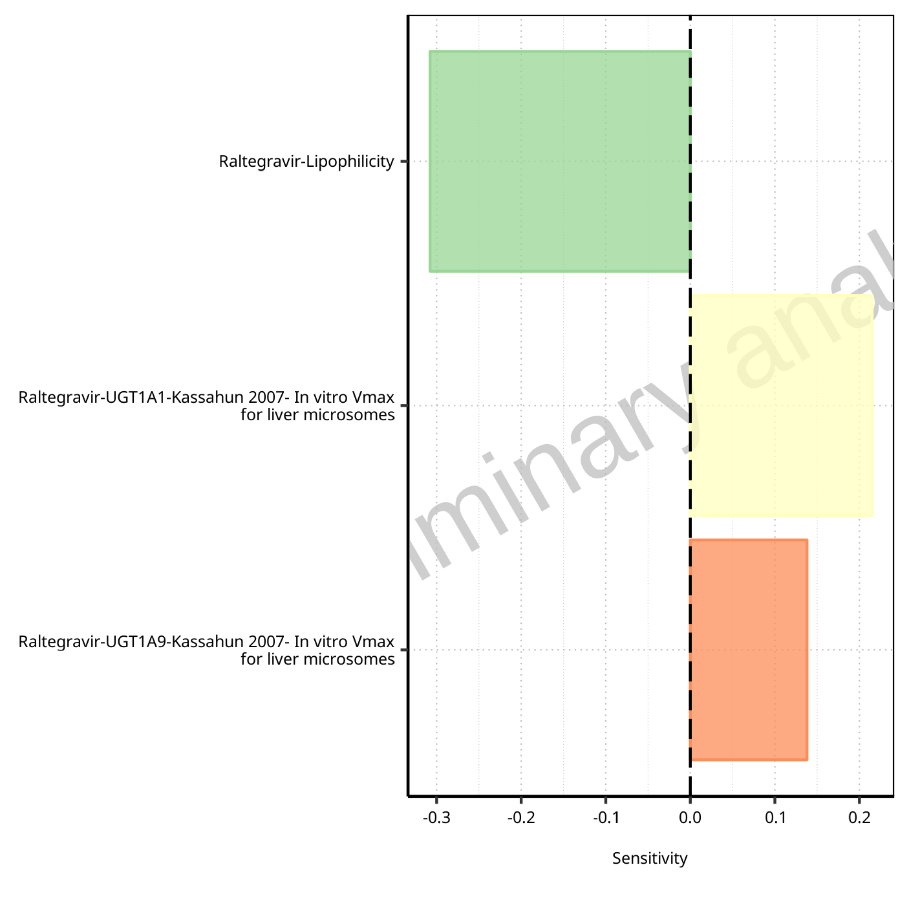


**Figure 1-64: Most sensitive parameters for Thalf of Raltegravir.**


<br>
<br>


```{=openxml}
<w:br w:type="page"/>
```

`<w:bookmarkStart w:id="figure-1-65" w:name="figure-1-65"/><w:bookmarkEnd w:id="figure-1-65"/>`{=openxml}

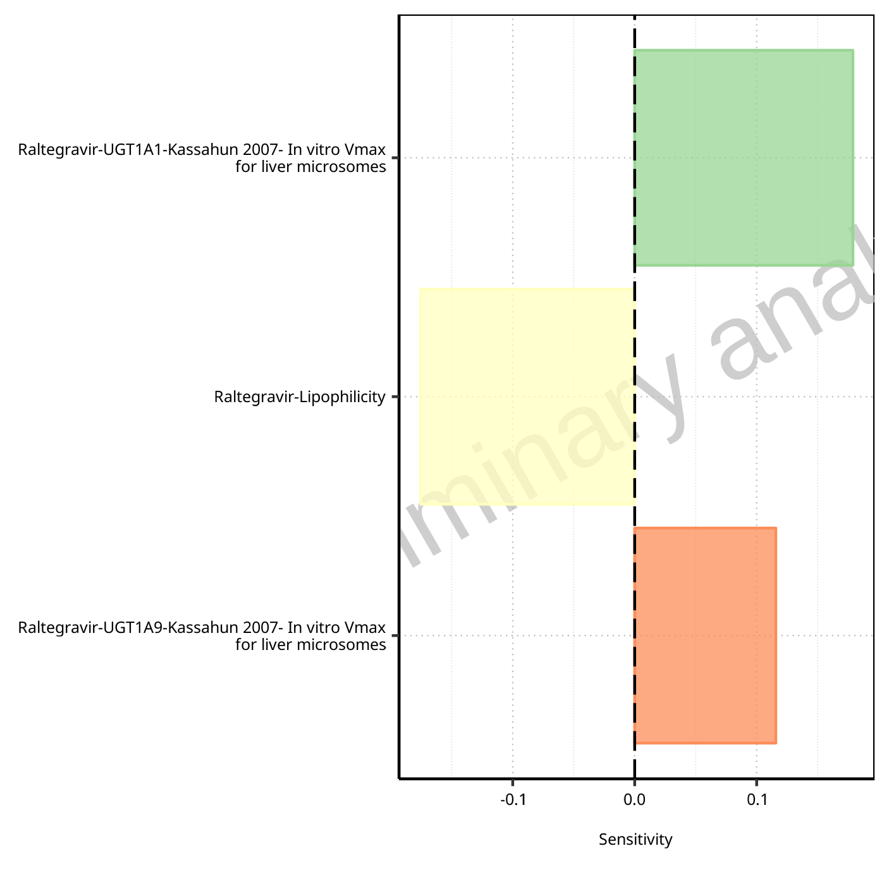


**Figure 1-65: Most sensitive parameters for Thalf_tLast_tEnd of Raltegravir.**


<br>
<br>


## Sensitivity Analysis for Raltegravir 400mg chewable fasted `<w:bookmarkStart w:id="sensitivity-analysis-raltegravir_400mg_chewable_fasted" w:name="sensitivity-analysis-raltegravir_400mg_chewable_fasted"/><w:bookmarkEnd w:id="sensitivity-analysis-raltegravir_400mg_chewable_fasted"/>`{=openxml}


```{=openxml}
<w:br w:type="page"/>
```

`<w:bookmarkStart w:id="figure-1-66" w:name="figure-1-66"/><w:bookmarkEnd w:id="figure-1-66"/>`{=openxml}

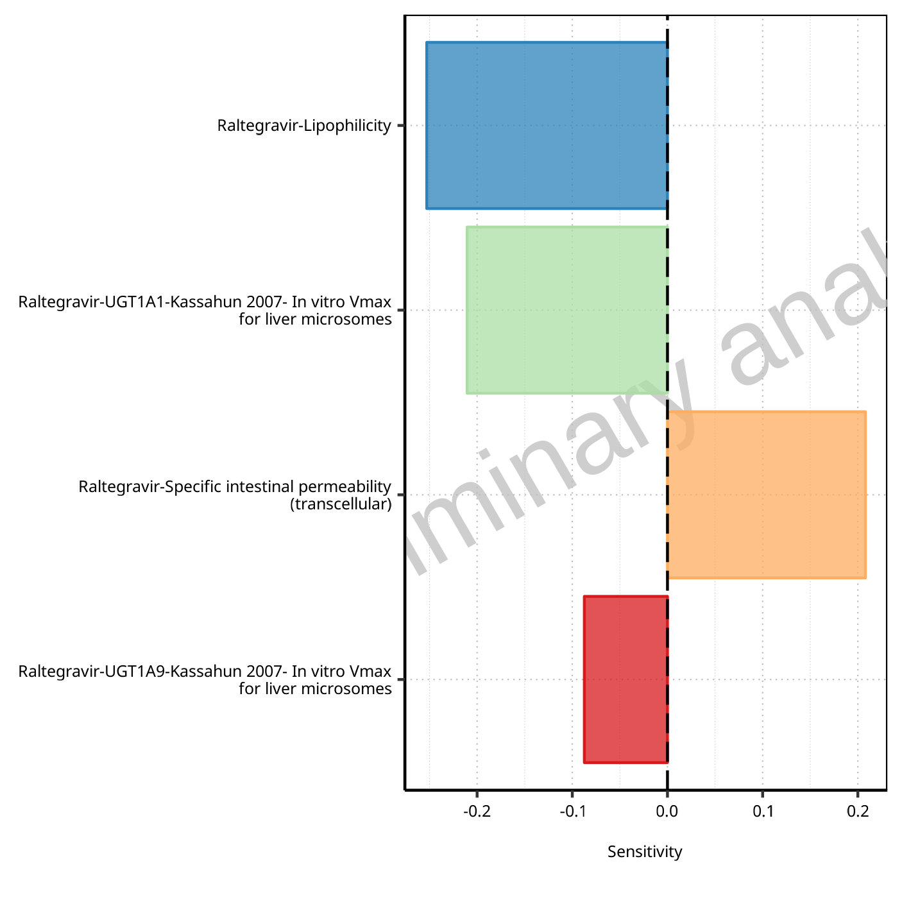


**Figure 1-66: Most sensitive parameters for C_max of Raltegravir.**


<br>
<br>


```{=openxml}
<w:br w:type="page"/>
```

`<w:bookmarkStart w:id="figure-1-67" w:name="figure-1-67"/><w:bookmarkEnd w:id="figure-1-67"/>`{=openxml}


**Figure 1-67: Most sensitive parameters for t_max of Raltegravir.**


<br>
<br>


```{=openxml}
<w:br w:type="page"/>
```

`<w:bookmarkStart w:id="figure-1-68" w:name="figure-1-68"/><w:bookmarkEnd w:id="figure-1-68"/>`{=openxml}

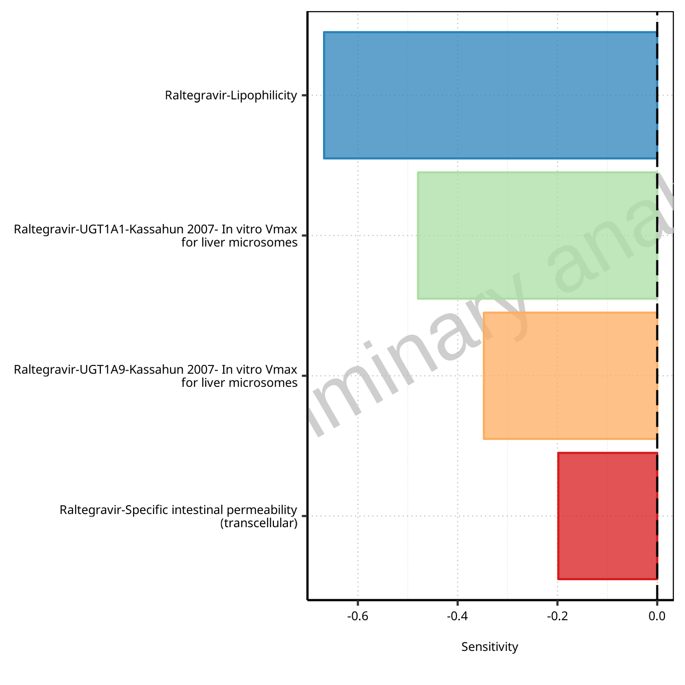


**Figure 1-68: Most sensitive parameters for C_tEnd of Raltegravir.**


<br>
<br>


```{=openxml}
<w:br w:type="page"/>
```

`<w:bookmarkStart w:id="figure-1-69" w:name="figure-1-69"/><w:bookmarkEnd w:id="figure-1-69"/>`{=openxml}


**Figure 1-69: Most sensitive parameters for AUC of Raltegravir.**


<br>
<br>


```{=openxml}
<w:br w:type="page"/>
```

`<w:bookmarkStart w:id="figure-1-70" w:name="figure-1-70"/><w:bookmarkEnd w:id="figure-1-70"/>`{=openxml}


**Figure 1-70: Most sensitive parameters for AUC_inf of Raltegravir.**


<br>
<br>


```{=openxml}
<w:br w:type="page"/>
```

`<w:bookmarkStart w:id="figure-1-71" w:name="figure-1-71"/><w:bookmarkEnd w:id="figure-1-71"/>`{=openxml}

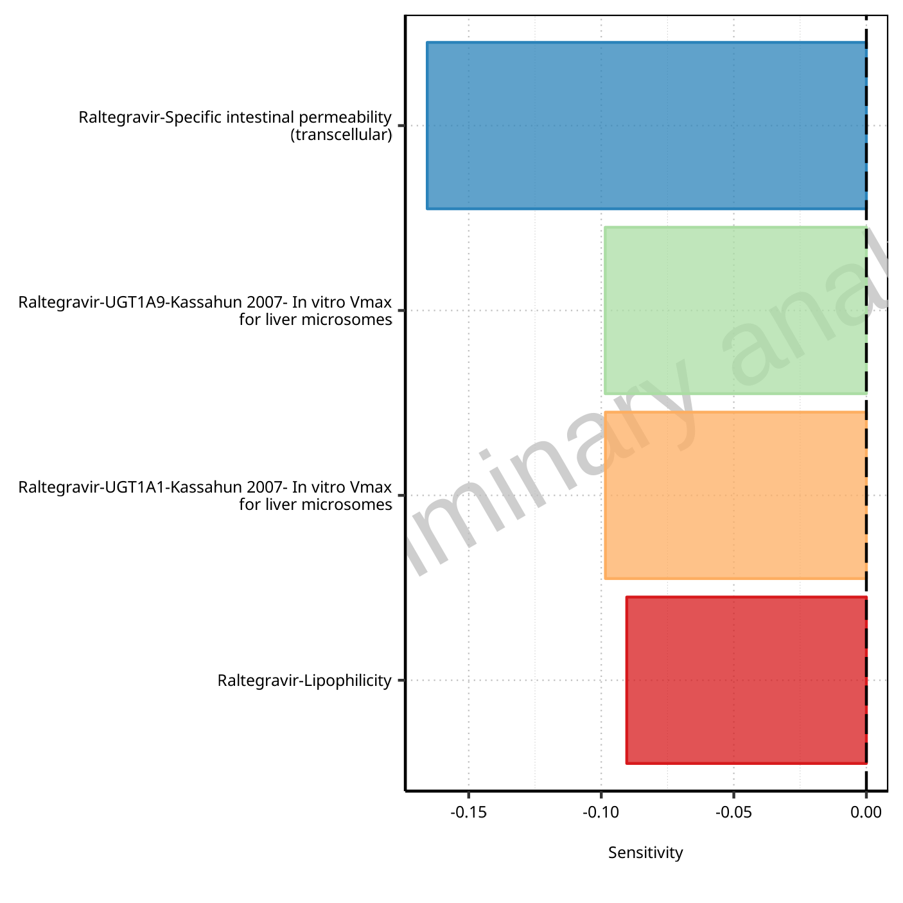


**Figure 1-71: Most sensitive parameters for MRT of Raltegravir.**


<br>
<br>


```{=openxml}
<w:br w:type="page"/>
```

`<w:bookmarkStart w:id="figure-1-72" w:name="figure-1-72"/><w:bookmarkEnd w:id="figure-1-72"/>`{=openxml}

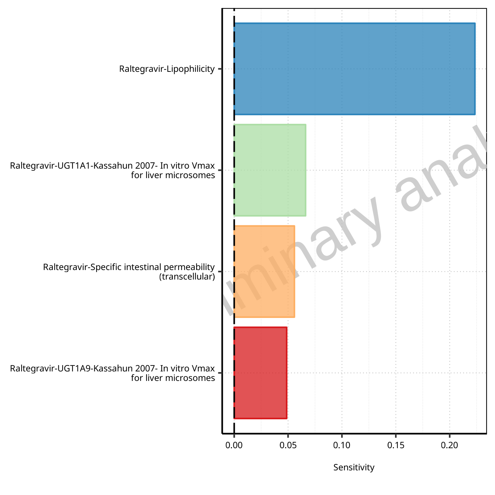


**Figure 1-72: Most sensitive parameters for Thalf of Raltegravir.**


<br>
<br>


```{=openxml}
<w:br w:type="page"/>
```

`<w:bookmarkStart w:id="figure-1-73" w:name="figure-1-73"/><w:bookmarkEnd w:id="figure-1-73"/>`{=openxml}


**Figure 1-73: Most sensitive parameters for CL of Raltegravir.**


<br>
<br>


```{=openxml}
<w:br w:type="page"/>
```

`<w:bookmarkStart w:id="figure-1-74" w:name="figure-1-74"/><w:bookmarkEnd w:id="figure-1-74"/>`{=openxml}

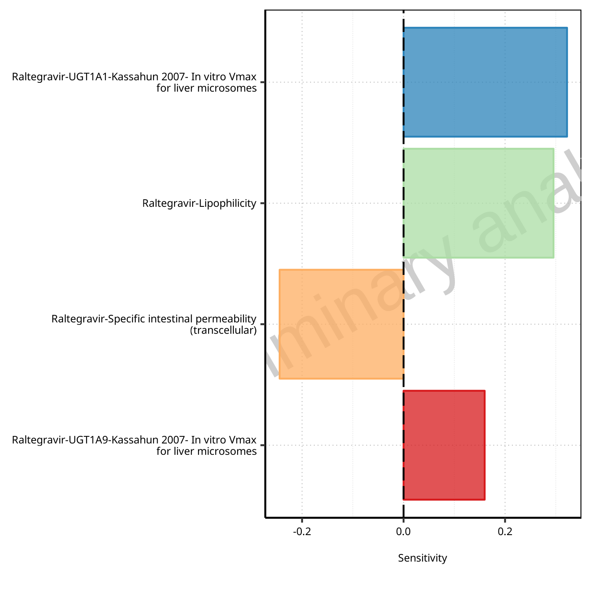


**Figure 1-74: Most sensitive parameters for Vss of Raltegravir.**


<br>
<br>


```{=openxml}
<w:br w:type="page"/>
```

`<w:bookmarkStart w:id="figure-1-75" w:name="figure-1-75"/><w:bookmarkEnd w:id="figure-1-75"/>`{=openxml}


**Figure 1-75: Most sensitive parameters for Vd of Raltegravir.**


<br>
<br>


## Sensitivity Analysis for Raltegravir 400mg chewable fed `<w:bookmarkStart w:id="sensitivity-analysis-raltegravir_400mg_chewable_fed" w:name="sensitivity-analysis-raltegravir_400mg_chewable_fed"/><w:bookmarkEnd w:id="sensitivity-analysis-raltegravir_400mg_chewable_fed"/>`{=openxml}


```{=openxml}
<w:br w:type="page"/>
```

`<w:bookmarkStart w:id="figure-1-76" w:name="figure-1-76"/><w:bookmarkEnd w:id="figure-1-76"/>`{=openxml}

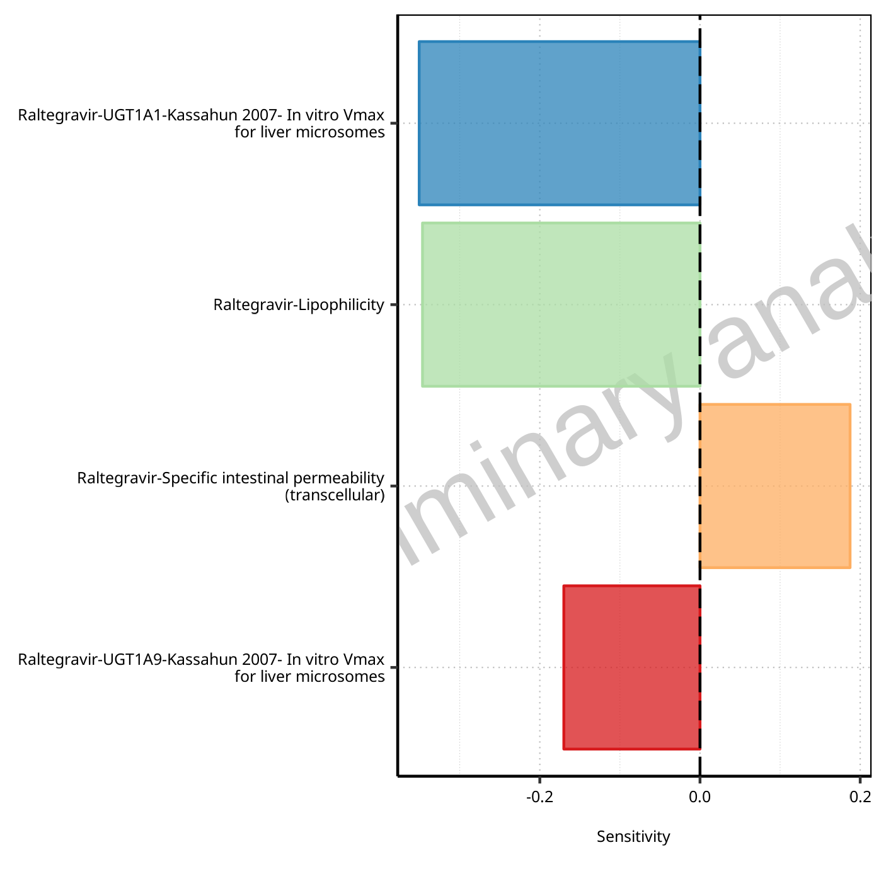


**Figure 1-76: Most sensitive parameters for C_max of Raltegravir.**


<br>
<br>


```{=openxml}
<w:br w:type="page"/>
```

`<w:bookmarkStart w:id="figure-1-77" w:name="figure-1-77"/><w:bookmarkEnd w:id="figure-1-77"/>`{=openxml}


**Figure 1-77: Most sensitive parameters for t_max of Raltegravir.**


<br>
<br>


```{=openxml}
<w:br w:type="page"/>
```

`<w:bookmarkStart w:id="figure-1-78" w:name="figure-1-78"/><w:bookmarkEnd w:id="figure-1-78"/>`{=openxml}

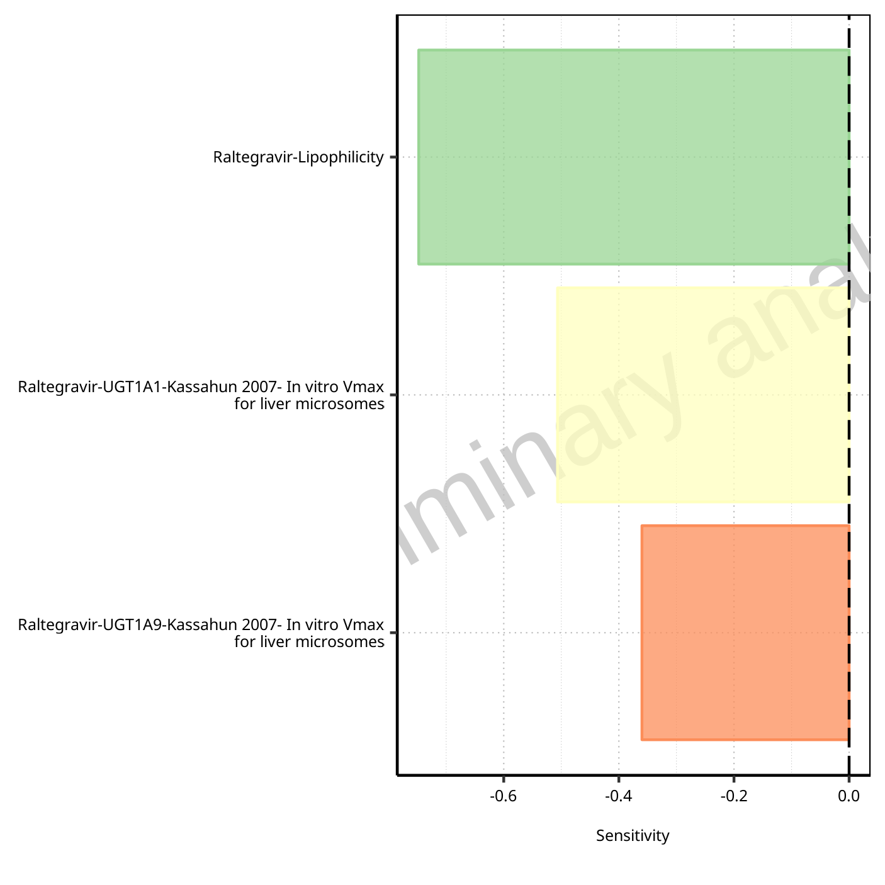


**Figure 1-78: Most sensitive parameters for C_tEnd of Raltegravir.**


<br>
<br>


```{=openxml}
<w:br w:type="page"/>
```

`<w:bookmarkStart w:id="figure-1-79" w:name="figure-1-79"/><w:bookmarkEnd w:id="figure-1-79"/>`{=openxml}

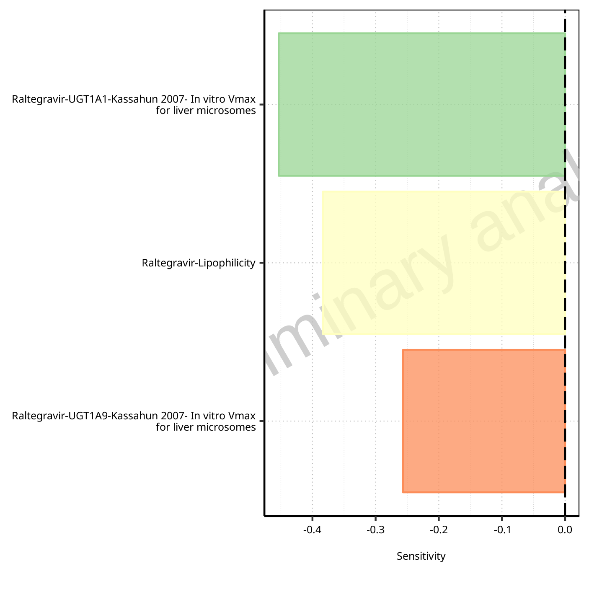


**Figure 1-79: Most sensitive parameters for AUC of Raltegravir.**


<br>
<br>


```{=openxml}
<w:br w:type="page"/>
```

`<w:bookmarkStart w:id="figure-1-80" w:name="figure-1-80"/><w:bookmarkEnd w:id="figure-1-80"/>`{=openxml}


**Figure 1-80: Most sensitive parameters for AUC_inf of Raltegravir.**


<br>
<br>


```{=openxml}
<w:br w:type="page"/>
```

`<w:bookmarkStart w:id="figure-1-81" w:name="figure-1-81"/><w:bookmarkEnd w:id="figure-1-81"/>`{=openxml}

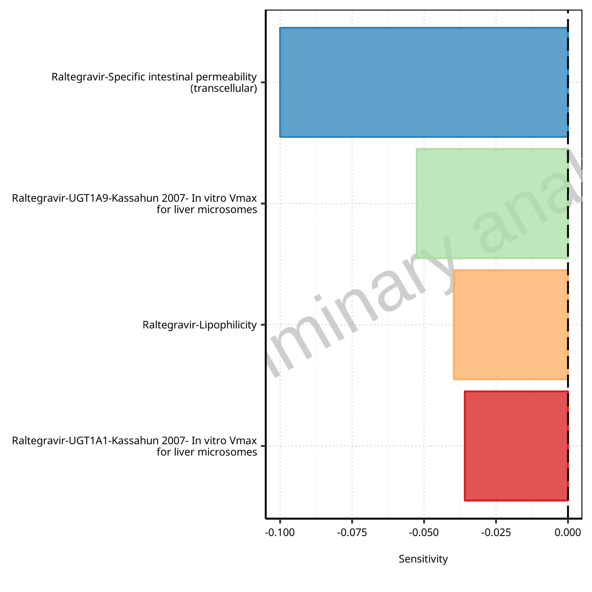


**Figure 1-81: Most sensitive parameters for MRT of Raltegravir.**


<br>
<br>


```{=openxml}
<w:br w:type="page"/>
```

`<w:bookmarkStart w:id="figure-1-82" w:name="figure-1-82"/><w:bookmarkEnd w:id="figure-1-82"/>`{=openxml}

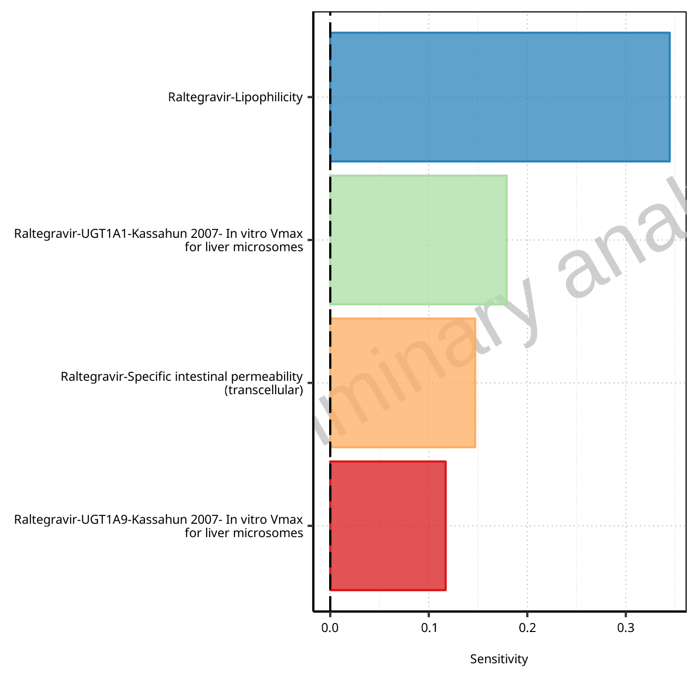


**Figure 1-82: Most sensitive parameters for Thalf of Raltegravir.**


<br>
<br>


```{=openxml}
<w:br w:type="page"/>
```

`<w:bookmarkStart w:id="figure-1-83" w:name="figure-1-83"/><w:bookmarkEnd w:id="figure-1-83"/>`{=openxml}

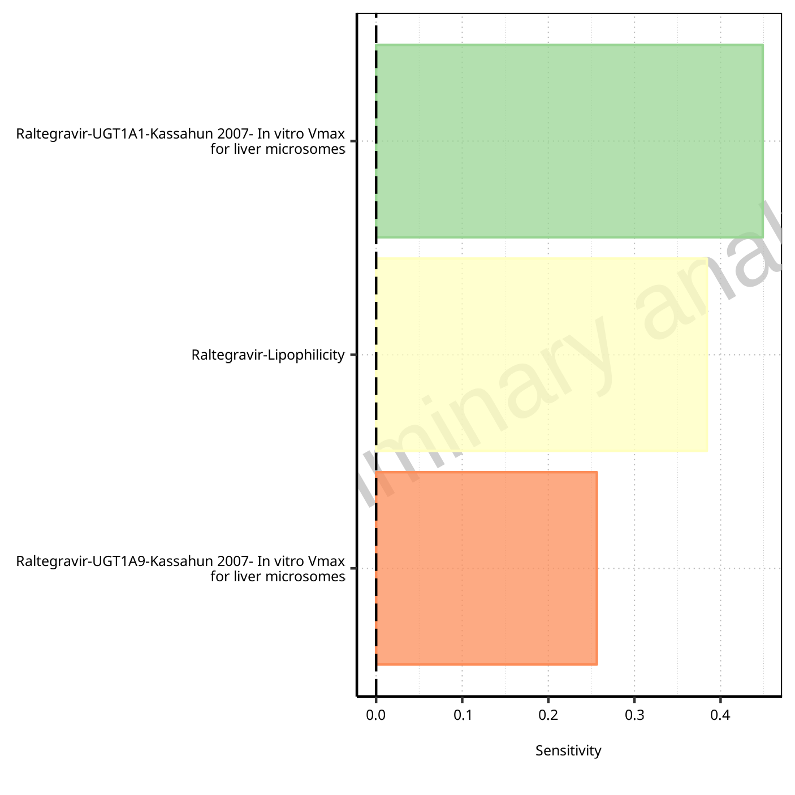


**Figure 1-83: Most sensitive parameters for CL of Raltegravir.**


<br>
<br>


```{=openxml}
<w:br w:type="page"/>
```

`<w:bookmarkStart w:id="figure-1-84" w:name="figure-1-84"/><w:bookmarkEnd w:id="figure-1-84"/>`{=openxml}

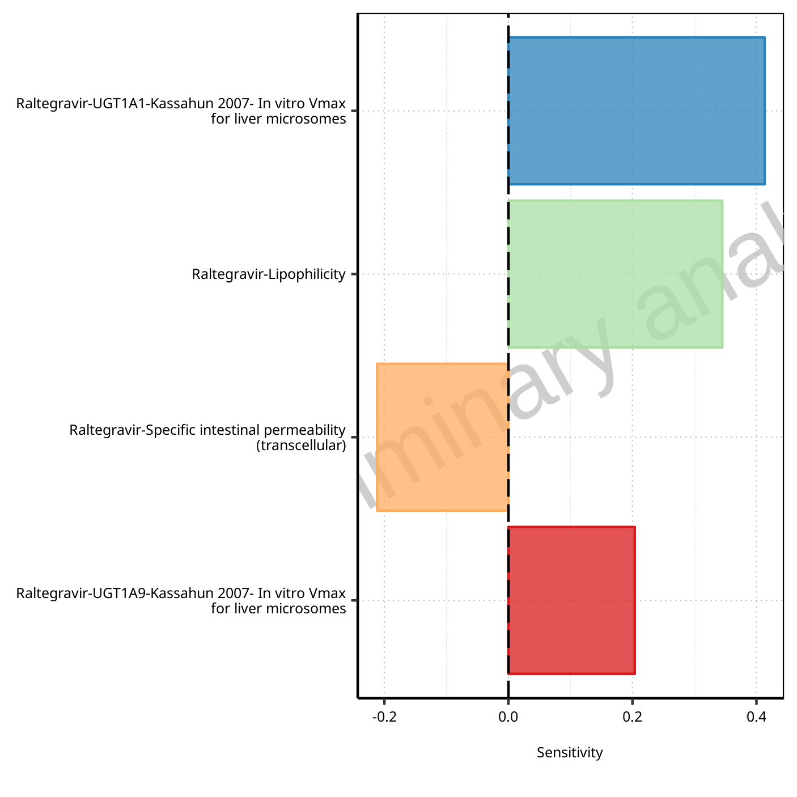


**Figure 1-84: Most sensitive parameters for Vss of Raltegravir.**


<br>
<br>


```{=openxml}
<w:br w:type="page"/>
```

`<w:bookmarkStart w:id="figure-1-85" w:name="figure-1-85"/><w:bookmarkEnd w:id="figure-1-85"/>`{=openxml}

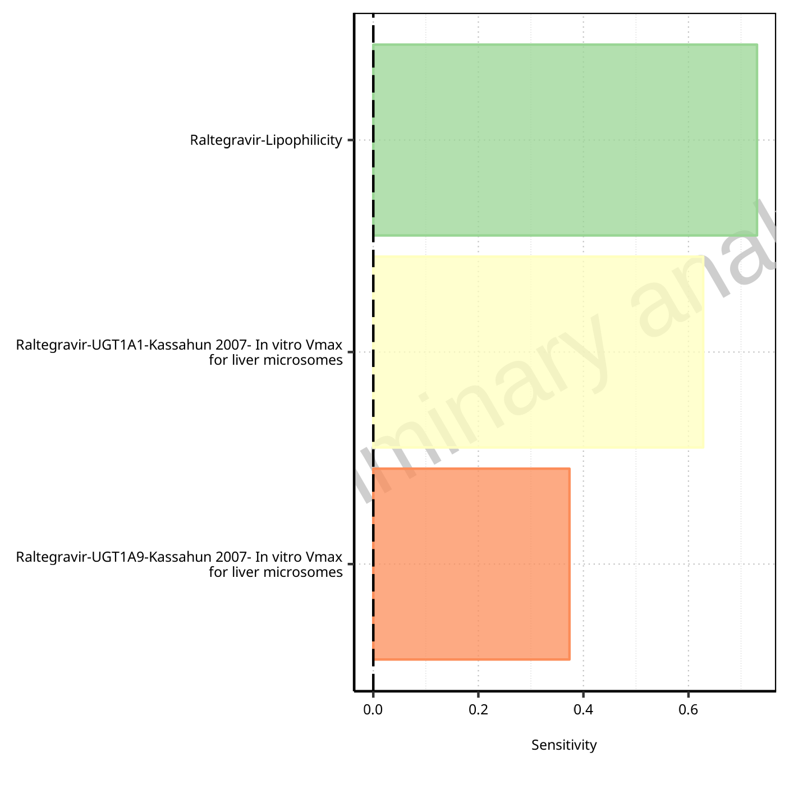


**Figure 1-85: Most sensitive parameters for Vd of Raltegravir.**


<br>
<br>


## Sensitivity Analysis for Raltegravir 400mg (granules in suspension) `<w:bookmarkStart w:id="sensitivity-analysis-raltegravir_400mg__granules_in_suspension_" w:name="sensitivity-analysis-raltegravir_400mg__granules_in_suspension_"/><w:bookmarkEnd w:id="sensitivity-analysis-raltegravir_400mg__granules_in_suspension_"/>`{=openxml}


```{=openxml}
<w:br w:type="page"/>
```

`<w:bookmarkStart w:id="figure-1-86" w:name="figure-1-86"/><w:bookmarkEnd w:id="figure-1-86"/>`{=openxml}

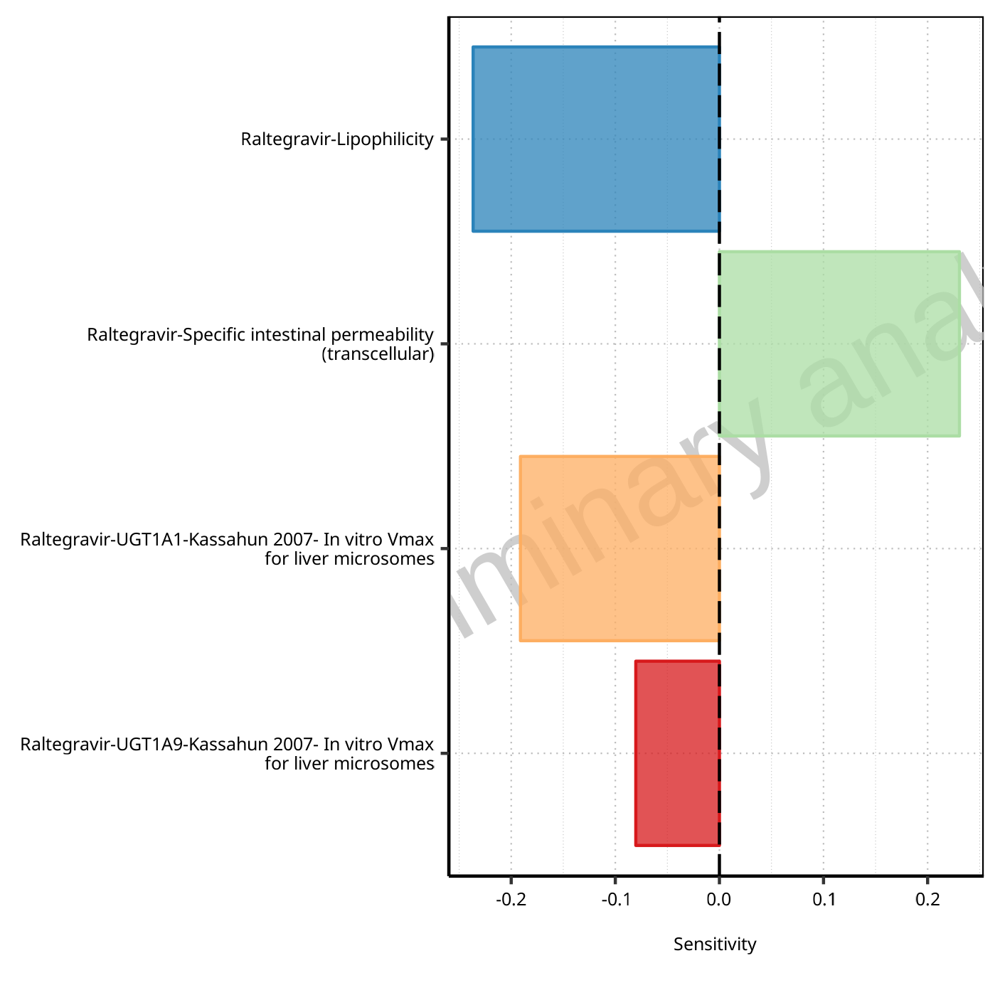


**Figure 1-86: Most sensitive parameters for C_max of Raltegravir.**


<br>
<br>


```{=openxml}
<w:br w:type="page"/>
```

`<w:bookmarkStart w:id="figure-1-87" w:name="figure-1-87"/><w:bookmarkEnd w:id="figure-1-87"/>`{=openxml}


**Figure 1-87: Most sensitive parameters for t_max of Raltegravir.**


<br>
<br>


```{=openxml}
<w:br w:type="page"/>
```

`<w:bookmarkStart w:id="figure-1-88" w:name="figure-1-88"/><w:bookmarkEnd w:id="figure-1-88"/>`{=openxml}

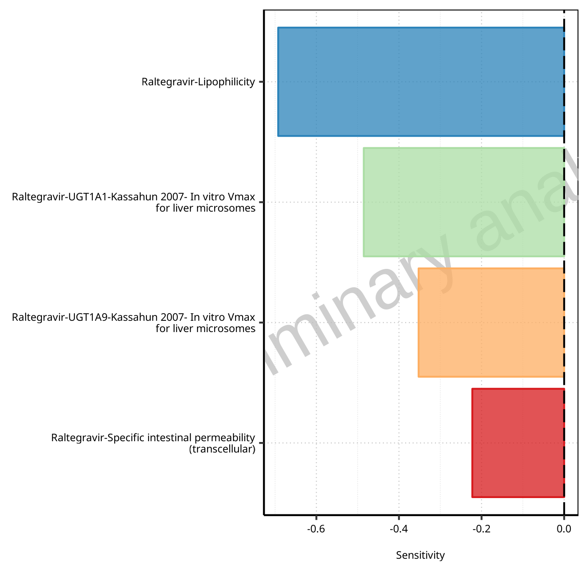


**Figure 1-88: Most sensitive parameters for C_tEnd of Raltegravir.**


<br>
<br>


```{=openxml}
<w:br w:type="page"/>
```

`<w:bookmarkStart w:id="figure-1-89" w:name="figure-1-89"/><w:bookmarkEnd w:id="figure-1-89"/>`{=openxml}


**Figure 1-89: Most sensitive parameters for AUC of Raltegravir.**


<br>
<br>


```{=openxml}
<w:br w:type="page"/>
```

`<w:bookmarkStart w:id="figure-1-90" w:name="figure-1-90"/><w:bookmarkEnd w:id="figure-1-90"/>`{=openxml}

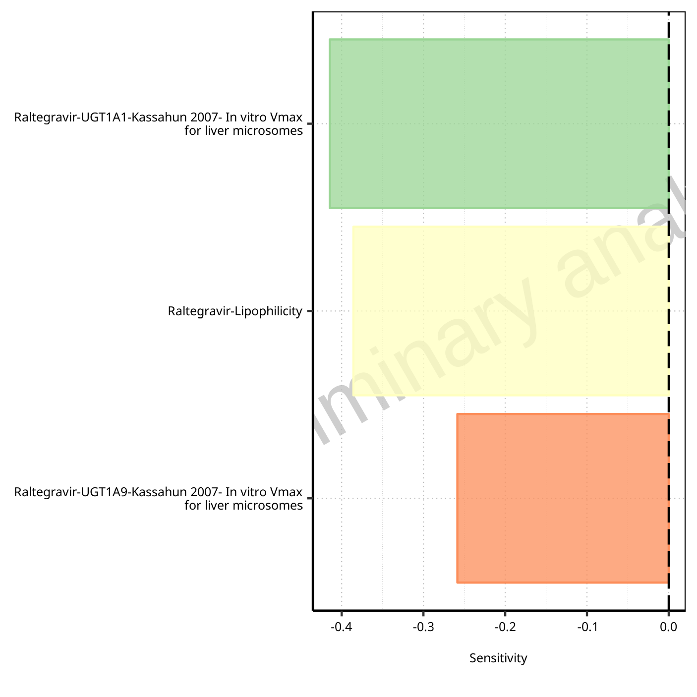


**Figure 1-90: Most sensitive parameters for AUC_inf of Raltegravir.**


<br>
<br>


```{=openxml}
<w:br w:type="page"/>
```

`<w:bookmarkStart w:id="figure-1-91" w:name="figure-1-91"/><w:bookmarkEnd w:id="figure-1-91"/>`{=openxml}

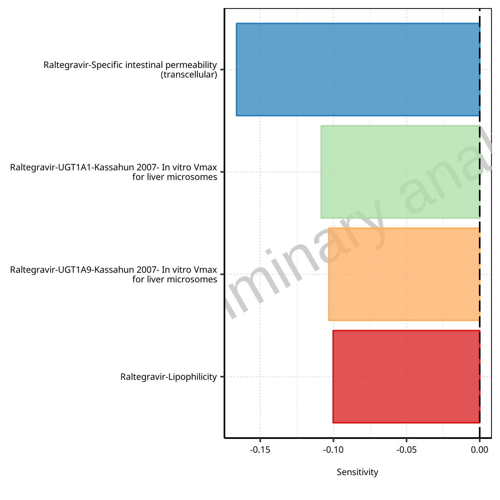


**Figure 1-91: Most sensitive parameters for MRT of Raltegravir.**


<br>
<br>


```{=openxml}
<w:br w:type="page"/>
```

`<w:bookmarkStart w:id="figure-1-92" w:name="figure-1-92"/><w:bookmarkEnd w:id="figure-1-92"/>`{=openxml}

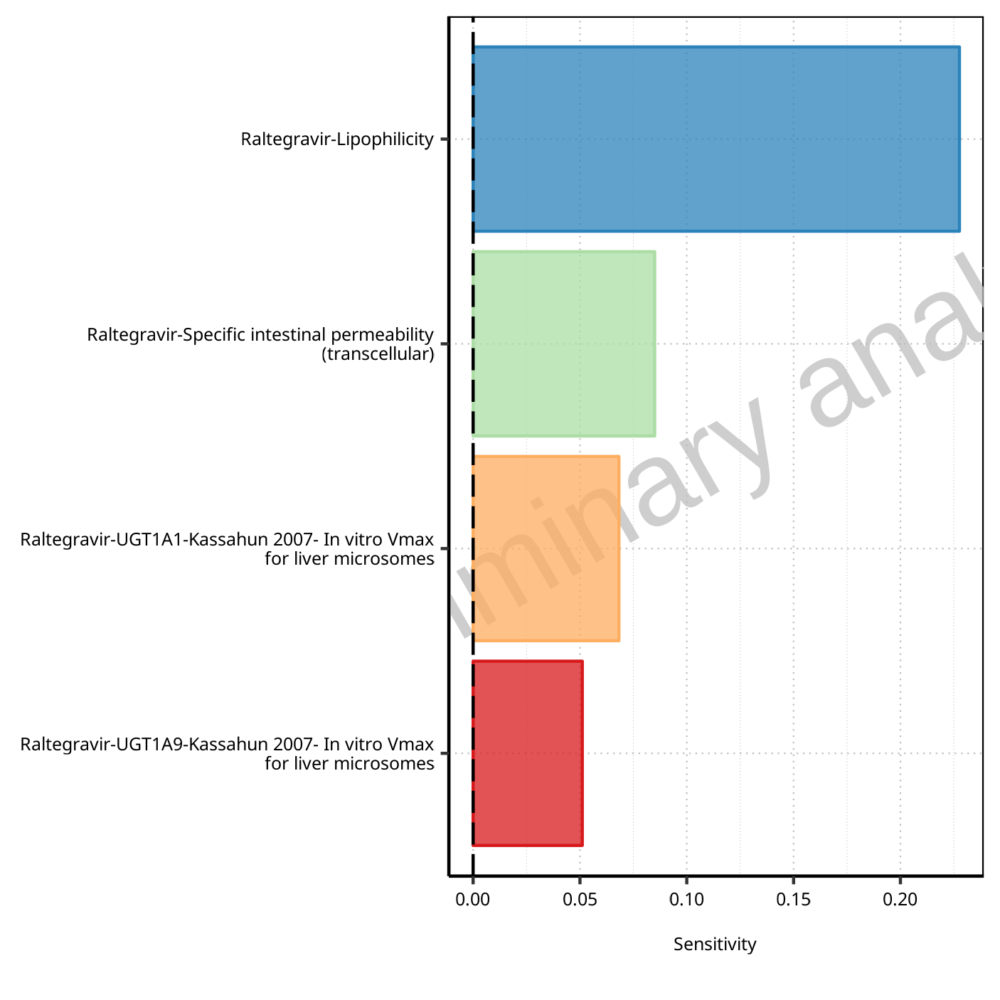


**Figure 1-92: Most sensitive parameters for Thalf of Raltegravir.**


<br>
<br>


```{=openxml}
<w:br w:type="page"/>
```

`<w:bookmarkStart w:id="figure-1-93" w:name="figure-1-93"/><w:bookmarkEnd w:id="figure-1-93"/>`{=openxml}

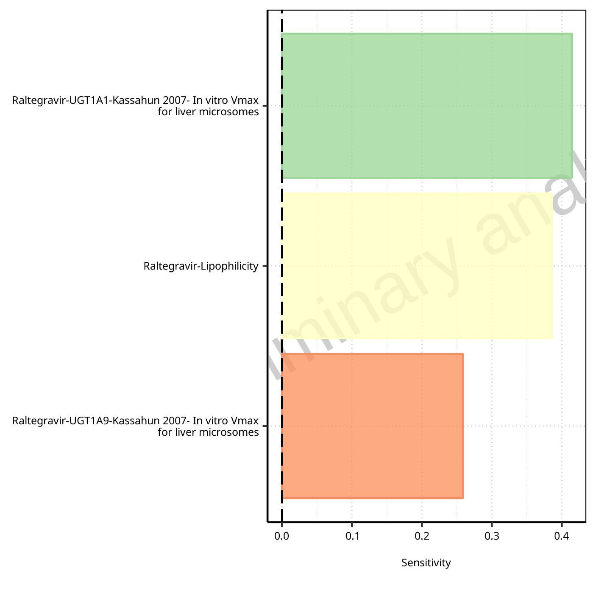


**Figure 1-93: Most sensitive parameters for CL of Raltegravir.**


<br>
<br>


```{=openxml}
<w:br w:type="page"/>
```

`<w:bookmarkStart w:id="figure-1-94" w:name="figure-1-94"/><w:bookmarkEnd w:id="figure-1-94"/>`{=openxml}

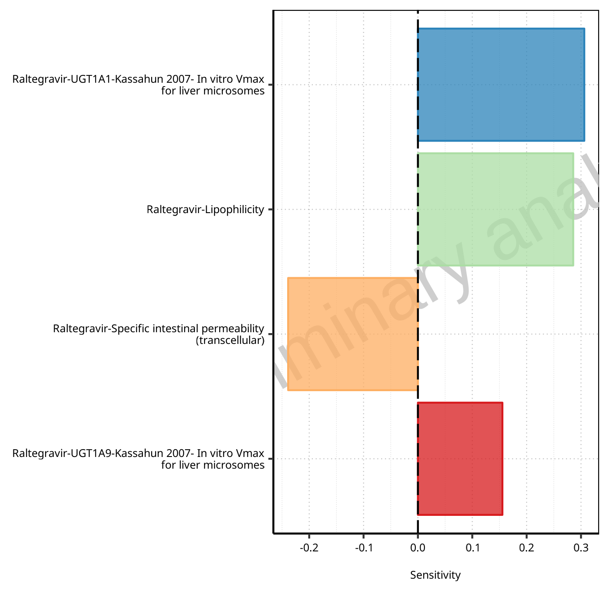


**Figure 1-94: Most sensitive parameters for Vss of Raltegravir.**


<br>
<br>


```{=openxml}
<w:br w:type="page"/>
```

`<w:bookmarkStart w:id="figure-1-95" w:name="figure-1-95"/><w:bookmarkEnd w:id="figure-1-95"/>`{=openxml}

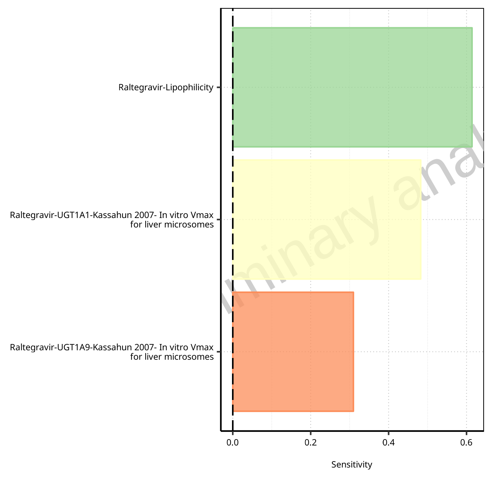


**Figure 1-95: Most sensitive parameters for Vd of Raltegravir.**


<br>
<br>


# PK parameters `<w:bookmarkStart w:id="pk-parameters" w:name="pk-parameters"/><w:bookmarkEnd w:id="pk-parameters"/>`{=openxml}


## PK parameters for Raltegravir 10 mg (lactose formulation) `<w:bookmarkStart w:id="pk-parameters-raltegravir_10_mg__lactose_formulation_" w:name="pk-parameters-raltegravir_10_mg__lactose_formulation_"/><w:bookmarkEnd w:id="pk-parameters-raltegravir_10_mg__lactose_formulation_"/>`{=openxml}


```{=openxml}
<w:br w:type="page"/>
```

`<w:bookmarkStart w:id="table-2-1" w:name="table-2-1"/><w:bookmarkEnd w:id="table-2-1"/>`{=openxml}

**Table 2-1: PK parameters for Raltegravir 10 mg (lactose formulation)**


|Path        |Parameter    |Value   |Unit      |
|:-----------|:------------|:-------|:---------|
|Raltegravir |C_max        |110.49  |µg/l      |
|Raltegravir |C_max_norm   |0.81    |kg/l      |
|Raltegravir |t_max        |0.75    |h         |
|Raltegravir |C_tEnd       |1.96    |µg/l      |
|Raltegravir |AUC          |241.61  |µg*h/l    |
|Raltegravir |AUC_norm     |1.76    |kg*h/l    |
|Raltegravir |AUC_inf      |255.14  |µg*h/l    |
|Raltegravir |AUC_inf_norm |1.86    |kg*h/l    |
|Raltegravir |MRT          |3.33    |h         |
|Raltegravir |Thalf        |4.79    |h         |
|Raltegravir |CL           |8.95    |ml/min/kg |
|Raltegravir |Vss          |1787.57 |ml/kg     |
|Raltegravir |Vd           |3713.90 |ml/kg     |


<br>
<br>


## PK parameters for Raltegravir 100 mg filmcoated tablet md `<w:bookmarkStart w:id="pk-parameters-raltegravir_100_mg_filmcoated_tablet_md" w:name="pk-parameters-raltegravir_100_mg_filmcoated_tablet_md"/><w:bookmarkEnd w:id="pk-parameters-raltegravir_100_mg_filmcoated_tablet_md"/>`{=openxml}


```{=openxml}
<w:br w:type="page"/>
```

`<w:bookmarkStart w:id="table-2-2" w:name="table-2-2"/><w:bookmarkEnd w:id="table-2-2"/>`{=openxml}

**Table 2-2: PK parameters for Raltegravir 100 mg filmcoated tablet md**


|Path        |Parameter                    |Value   |Unit   |
|:-----------|:----------------------------|:-------|:------|
|Raltegravir |C_max                        |893.50  |µg/l   |
|Raltegravir |C_max_norm                   |0.03    |kg/l   |
|Raltegravir |C_max_t1_t2                  |863.16  |µg/l   |
|Raltegravir |C_max_t1_t2_norm             |0.63    |kg/l   |
|Raltegravir |C_max_tLast_tEnd             |892.65  |µg/l   |
|Raltegravir |C_max_tLast_tEnd_norm        |0.65    |kg/l   |
|Raltegravir |t_max                        |168.75  |h      |
|Raltegravir |t_max_t1_t2                  |0.75    |h      |
|Raltegravir |t_max_tLast_tEnd             |228.75  |h      |
|Raltegravir |C_trough_t2                  |19.66   |µg/l   |
|Raltegravir |C_trough_tLast               |31.92   |µg/l   |
|Raltegravir |AUC_t1_t2                    |1978.76 |µg*h/l |
|Raltegravir |AUC_t1_t2_norm               |1.44    |kg*h/l |
|Raltegravir |AUC_tLast_minus_1_tLast      |2218.73 |µg*h/l |
|Raltegravir |AUC_tLast_minus_1_tLast_norm |1.62    |kg*h/l |
|Raltegravir |AUC_inf_t1                   |2144.35 |µg*h/l |
|Raltegravir |AUC_inf_t1_norm              |1.57    |kg*h/l |
|Raltegravir |AUC_inf_tLast                |2536.55 |µg*h/l |
|Raltegravir |AUC_inf_tLast_norm           |1.85    |kg*h/l |
|Raltegravir |MRT                          |3.96    |h      |
|Raltegravir |Thalf                        |5.84    |h      |
|Raltegravir |Thalf_tLast_tEnd             |6.90    |h      |


<br>
<br>


## PK parameters for Raltegravir 200 mg filmcoated tablet md `<w:bookmarkStart w:id="pk-parameters-raltegravir_200_mg_filmcoated_tablet_md" w:name="pk-parameters-raltegravir_200_mg_filmcoated_tablet_md"/><w:bookmarkEnd w:id="pk-parameters-raltegravir_200_mg_filmcoated_tablet_md"/>`{=openxml}


```{=openxml}
<w:br w:type="page"/>
```

`<w:bookmarkStart w:id="table-2-3" w:name="table-2-3"/><w:bookmarkEnd w:id="table-2-3"/>`{=openxml}

**Table 2-3: PK parameters for Raltegravir 200 mg filmcoated tablet md**


|Path        |Parameter                    |Value   |Unit   |
|:-----------|:----------------------------|:-------|:------|
|Raltegravir |C_max                        |1811.96 |µg/l   |
|Raltegravir |C_max_norm                   |0.03    |kg/l   |
|Raltegravir |C_max_t1_t2                  |1748.66 |µg/l   |
|Raltegravir |C_max_t1_t2_norm             |0.64    |kg/l   |
|Raltegravir |C_max_tLast_tEnd             |1808.60 |µg/l   |
|Raltegravir |C_max_tLast_tEnd_norm        |0.66    |kg/l   |
|Raltegravir |t_max                        |204.75  |h      |
|Raltegravir |t_max_t1_t2                  |0.75    |h      |
|Raltegravir |t_max_tLast_tEnd             |228.75  |h      |
|Raltegravir |C_trough_t2                  |39.47   |µg/l   |
|Raltegravir |C_trough_tLast               |64.03   |µg/l   |
|Raltegravir |AUC_t1_t2                    |3998.12 |µg*h/l |
|Raltegravir |AUC_t1_t2_norm               |1.46    |kg*h/l |
|Raltegravir |AUC_tLast_minus_1_tLast      |4480.74 |µg*h/l |
|Raltegravir |AUC_tLast_minus_1_tLast_norm |1.64    |kg*h/l |
|Raltegravir |AUC_inf_t1                   |4329.13 |µg*h/l |
|Raltegravir |AUC_inf_t1_norm              |1.58    |kg*h/l |
|Raltegravir |AUC_inf_tLast                |5115.69 |µg*h/l |
|Raltegravir |AUC_inf_tLast_norm           |1.87    |kg*h/l |
|Raltegravir |MRT                          |3.94    |h      |
|Raltegravir |Thalf                        |5.81    |h      |
|Raltegravir |Thalf_tLast_tEnd             |6.87    |h      |


<br>
<br>


## PK parameters for Filmcoated_tablet_400mg_sd `<w:bookmarkStart w:id="pk-parameters-filmcoated_tablet_400mg_sd" w:name="pk-parameters-filmcoated_tablet_400mg_sd"/><w:bookmarkEnd w:id="pk-parameters-filmcoated_tablet_400mg_sd"/>`{=openxml}


```{=openxml}
<w:br w:type="page"/>
```

`<w:bookmarkStart w:id="table-2-4" w:name="table-2-4"/><w:bookmarkEnd w:id="table-2-4"/>`{=openxml}

**Table 2-4: PK parameters for Filmcoated_tablet_400mg_sd**


|Path        |Parameter    |Value   |Unit      |
|:-----------|:------------|:-------|:---------|
|Raltegravir |C_max        |3568.56 |µg/l      |
|Raltegravir |C_max_norm   |0.65    |kg/l      |
|Raltegravir |t_max        |0.75    |h         |
|Raltegravir |C_tEnd       |28.27   |µg/l      |
|Raltegravir |AUC          |8703.65 |µg*h/l    |
|Raltegravir |AUC_norm     |1.59    |kg*h/l    |
|Raltegravir |AUC_inf      |9072.43 |µg*h/l    |
|Raltegravir |AUC_inf_norm |1.66    |kg*h/l    |
|Raltegravir |MRT          |4.89    |h         |
|Raltegravir |Thalf        |9.04    |h         |
|Raltegravir |CL           |10.07   |ml/min/kg |
|Raltegravir |Vss          |2954.74 |ml/kg     |
|Raltegravir |Vd           |7878.98 |ml/kg     |


<br>
<br>


## PK parameters for Raltegravir 400 mg filmcoated tablet md `<w:bookmarkStart w:id="pk-parameters-raltegravir_400_mg_filmcoated_tablet_md" w:name="pk-parameters-raltegravir_400_mg_filmcoated_tablet_md"/><w:bookmarkEnd w:id="pk-parameters-raltegravir_400_mg_filmcoated_tablet_md"/>`{=openxml}


```{=openxml}
<w:br w:type="page"/>
```

`<w:bookmarkStart w:id="table-2-5" w:name="table-2-5"/><w:bookmarkEnd w:id="table-2-5"/>`{=openxml}

**Table 2-5: PK parameters for Raltegravir 400 mg filmcoated tablet md**


|Path        |Parameter                    |Value    |Unit   |
|:-----------|:----------------------------|:--------|:------|
|Raltegravir |C_max                        |3691.84  |µg/l   |
|Raltegravir |C_max_norm                   |0.03     |kg/l   |
|Raltegravir |C_max_t1_t2                  |3569.01  |µg/l   |
|Raltegravir |C_max_t1_t2_norm             |0.65     |kg/l   |
|Raltegravir |C_max_tLast_tEnd             |3689.99  |µg/l   |
|Raltegravir |C_max_tLast_tEnd_norm        |0.67     |kg/l   |
|Raltegravir |t_max                        |72.75    |h      |
|Raltegravir |t_max_t1_t2                  |0.75     |h      |
|Raltegravir |t_max_tLast_tEnd             |228.75   |h      |
|Raltegravir |C_trough_t2                  |79.75    |µg/l   |
|Raltegravir |C_trough_tLast               |129.19   |µg/l   |
|Raltegravir |AUC_t1_t2                    |8128.05  |µg*h/l |
|Raltegravir |AUC_t1_t2_norm               |1.48     |kg*h/l |
|Raltegravir |AUC_tLast_minus_1_tLast      |9098.53  |µg*h/l |
|Raltegravir |AUC_tLast_minus_1_tLast_norm |1.66     |kg*h/l |
|Raltegravir |AUC_inf_t1                   |8798.72  |µg*h/l |
|Raltegravir |AUC_inf_t1_norm              |1.61     |kg*h/l |
|Raltegravir |AUC_inf_tLast                |10365.92 |µg*h/l |
|Raltegravir |AUC_inf_tLast_norm           |1.89     |kg*h/l |
|Raltegravir |MRT                          |3.93     |h      |
|Raltegravir |Thalf                        |5.83     |h      |
|Raltegravir |Thalf_tLast_tEnd             |6.80     |h      |


<br>
<br>


## PK parameters for Raltegravir 400mg chewable fasted `<w:bookmarkStart w:id="pk-parameters-raltegravir_400mg_chewable_fasted" w:name="pk-parameters-raltegravir_400mg_chewable_fasted"/><w:bookmarkEnd w:id="pk-parameters-raltegravir_400mg_chewable_fasted"/>`{=openxml}


```{=openxml}
<w:br w:type="page"/>
```

`<w:bookmarkStart w:id="table-2-6" w:name="table-2-6"/><w:bookmarkEnd w:id="table-2-6"/>`{=openxml}

**Table 2-6: PK parameters for Raltegravir 400mg chewable fasted**


|Path        |Parameter    |Value    |Unit      |
|:-----------|:------------|:--------|:---------|
|Raltegravir |C_max        |6330.52  |µg/l      |
|Raltegravir |C_max_norm   |1.16     |kg/l      |
|Raltegravir |t_max        |0.75     |h         |
|Raltegravir |C_tEnd       |35.84    |µg/l      |
|Raltegravir |AUC          |14694.82 |µg*h/l    |
|Raltegravir |AUC_norm     |2.68     |kg*h/l    |
|Raltegravir |AUC_inf      |15124.21 |µg*h/l    |
|Raltegravir |AUC_inf_norm |2.76     |kg*h/l    |
|Raltegravir |MRT          |4.19     |h         |
|Raltegravir |Thalf        |8.31     |h         |
|Raltegravir |CL           |6.04     |ml/min/kg |
|Raltegravir |Vss          |1516.69  |ml/kg     |
|Raltegravir |Vd           |4340.96  |ml/kg     |


<br>
<br>


## PK parameters for Raltegravir 400mg chewable fed `<w:bookmarkStart w:id="pk-parameters-raltegravir_400mg_chewable_fed" w:name="pk-parameters-raltegravir_400mg_chewable_fed"/><w:bookmarkEnd w:id="pk-parameters-raltegravir_400mg_chewable_fed"/>`{=openxml}


```{=openxml}
<w:br w:type="page"/>
```

`<w:bookmarkStart w:id="table-2-7" w:name="table-2-7"/><w:bookmarkEnd w:id="table-2-7"/>`{=openxml}

**Table 2-7: PK parameters for Raltegravir 400mg chewable fed**


|Path        |Parameter    |Value    |Unit      |
|:-----------|:------------|:--------|:---------|
|Raltegravir |C_max        |2580.44  |µg/l      |
|Raltegravir |C_max_norm   |0.47     |kg/l      |
|Raltegravir |t_max        |2.50     |h         |
|Raltegravir |C_tEnd       |35.93    |µg/l      |
|Raltegravir |AUC          |14119.09 |µg*h/l    |
|Raltegravir |AUC_norm     |2.58     |kg*h/l    |
|Raltegravir |AUC_inf      |14606.36 |µg*h/l    |
|Raltegravir |AUC_inf_norm |2.67     |kg*h/l    |
|Raltegravir |MRT          |5.99     |h         |
|Raltegravir |Thalf        |9.40     |h         |
|Raltegravir |CL           |6.25     |ml/min/kg |
|Raltegravir |Vss          |2246.85  |ml/kg     |
|Raltegravir |Vd           |5087.80  |ml/kg     |


<br>
<br>


## PK parameters for Raltegravir 400mg (granules in suspension) `<w:bookmarkStart w:id="pk-parameters-raltegravir_400mg__granules_in_suspension_" w:name="pk-parameters-raltegravir_400mg__granules_in_suspension_"/><w:bookmarkEnd w:id="pk-parameters-raltegravir_400mg__granules_in_suspension_"/>`{=openxml}


```{=openxml}
<w:br w:type="page"/>
```

`<w:bookmarkStart w:id="table-2-8" w:name="table-2-8"/><w:bookmarkEnd w:id="table-2-8"/>`{=openxml}

**Table 2-8: PK parameters for Raltegravir 400mg (granules in suspension)**


|Path        |Parameter    |Value    |Unit      |
|:-----------|:------------|:--------|:---------|
|Raltegravir |C_max        |8156.79  |µg/l      |
|Raltegravir |C_max_norm   |1.49     |kg/l      |
|Raltegravir |t_max        |0.70     |h         |
|Raltegravir |C_tEnd       |42.19    |µg/l      |
|Raltegravir |AUC          |18791.01 |µg*h/l    |
|Raltegravir |AUC_norm     |3.43     |kg*h/l    |
|Raltegravir |AUC_inf      |19278.71 |µg*h/l    |
|Raltegravir |AUC_inf_norm |3.52     |kg*h/l    |
|Raltegravir |MRT          |4.02     |h         |
|Raltegravir |Thalf        |8.01     |h         |
|Raltegravir |CL           |4.74     |ml/min/kg |
|Raltegravir |Vss          |1142.66  |ml/kg     |
|Raltegravir |Vd           |3285.73  |ml/kg     |


<br>
<br>


# Absorption `<w:bookmarkStart w:id="absorption" w:name="absorption"/><w:bookmarkEnd w:id="absorption"/>`{=openxml}


## Absorption for Raltegravir 10 mg (lactose formulation) `<w:bookmarkStart w:id="absorption-raltegravir_10_mg__lactose_formulation_" w:name="absorption-raltegravir_10_mg__lactose_formulation_"/><w:bookmarkEnd w:id="absorption-raltegravir_10_mg__lactose_formulation_"/>`{=openxml}


```{=openxml}
<w:br w:type="page"/>
```

`<w:bookmarkStart w:id="figure-3-1" w:name="figure-3-1"/><w:bookmarkEnd w:id="figure-3-1"/>`{=openxml}

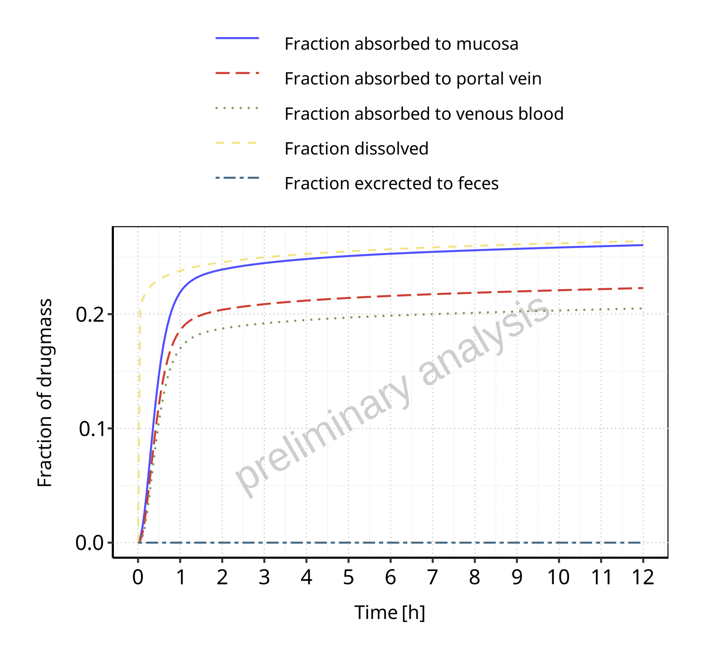


**Figure 3-1: Absorption of Raltegravir**


<br>
<br>


## Absorption for Raltegravir 100 mg filmcoated tablet md `<w:bookmarkStart w:id="absorption-raltegravir_100_mg_filmcoated_tablet_md" w:name="absorption-raltegravir_100_mg_filmcoated_tablet_md"/><w:bookmarkEnd w:id="absorption-raltegravir_100_mg_filmcoated_tablet_md"/>`{=openxml}


```{=openxml}
<w:br w:type="page"/>
```

`<w:bookmarkStart w:id="figure-3-2" w:name="figure-3-2"/><w:bookmarkEnd w:id="figure-3-2"/>`{=openxml}


**Figure 3-2: Absorption of Raltegravir**


<br>
<br>


## Absorption for Raltegravir 200 mg filmcoated tablet md `<w:bookmarkStart w:id="absorption-raltegravir_200_mg_filmcoated_tablet_md" w:name="absorption-raltegravir_200_mg_filmcoated_tablet_md"/><w:bookmarkEnd w:id="absorption-raltegravir_200_mg_filmcoated_tablet_md"/>`{=openxml}


```{=openxml}
<w:br w:type="page"/>
```

`<w:bookmarkStart w:id="figure-3-3" w:name="figure-3-3"/><w:bookmarkEnd w:id="figure-3-3"/>`{=openxml}


**Figure 3-3: Absorption of Raltegravir**


<br>
<br>


## Absorption for Filmcoated_tablet_400mg_sd `<w:bookmarkStart w:id="absorption-filmcoated_tablet_400mg_sd" w:name="absorption-filmcoated_tablet_400mg_sd"/><w:bookmarkEnd w:id="absorption-filmcoated_tablet_400mg_sd"/>`{=openxml}


```{=openxml}
<w:br w:type="page"/>
```

`<w:bookmarkStart w:id="figure-3-4" w:name="figure-3-4"/><w:bookmarkEnd w:id="figure-3-4"/>`{=openxml}

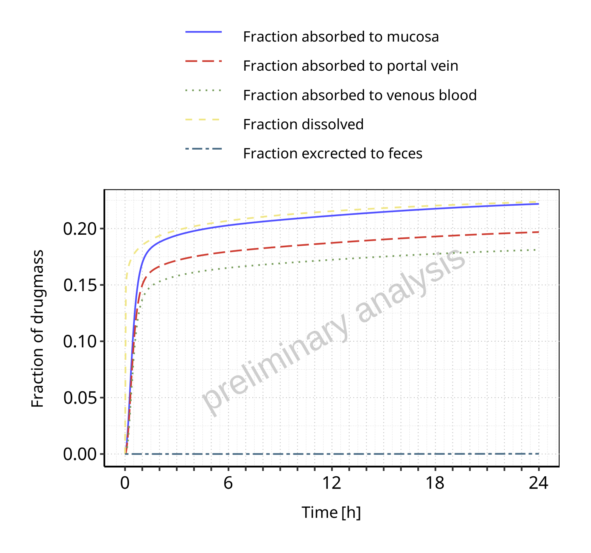


**Figure 3-4: Absorption of Raltegravir**


<br>
<br>


## Absorption for Raltegravir 400 mg filmcoated tablet md `<w:bookmarkStart w:id="absorption-raltegravir_400_mg_filmcoated_tablet_md" w:name="absorption-raltegravir_400_mg_filmcoated_tablet_md"/><w:bookmarkEnd w:id="absorption-raltegravir_400_mg_filmcoated_tablet_md"/>`{=openxml}


```{=openxml}
<w:br w:type="page"/>
```

`<w:bookmarkStart w:id="figure-3-5" w:name="figure-3-5"/><w:bookmarkEnd w:id="figure-3-5"/>`{=openxml}

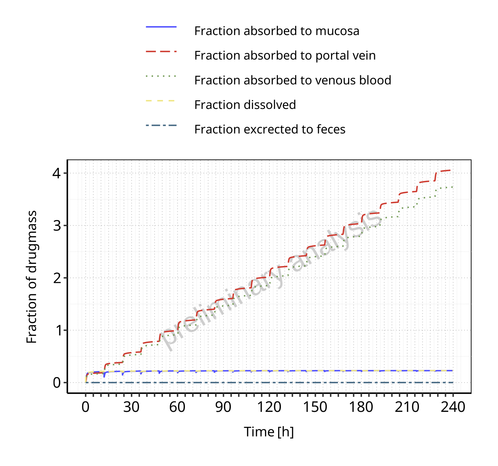


**Figure 3-5: Absorption of Raltegravir**


<br>
<br>


## Absorption for Raltegravir 400mg chewable fasted `<w:bookmarkStart w:id="absorption-raltegravir_400mg_chewable_fasted" w:name="absorption-raltegravir_400mg_chewable_fasted"/><w:bookmarkEnd w:id="absorption-raltegravir_400mg_chewable_fasted"/>`{=openxml}


```{=openxml}
<w:br w:type="page"/>
```

`<w:bookmarkStart w:id="figure-3-6" w:name="figure-3-6"/><w:bookmarkEnd w:id="figure-3-6"/>`{=openxml}

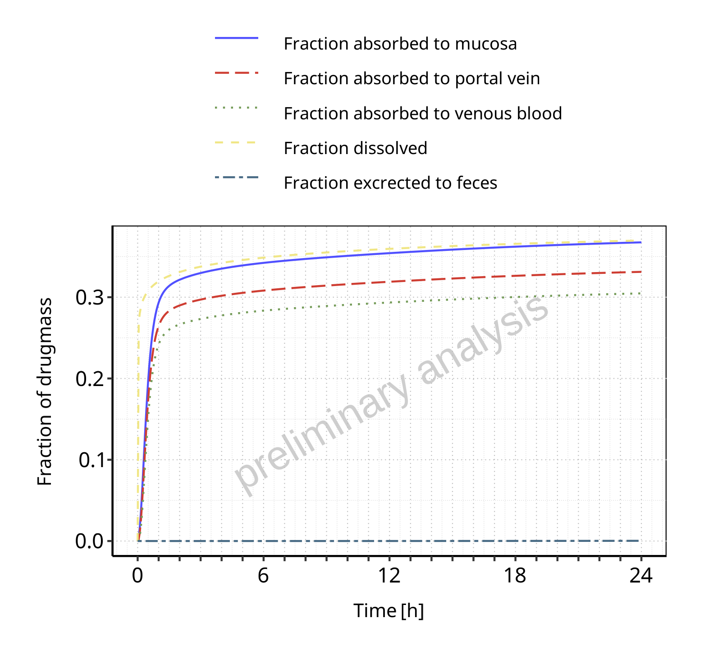


**Figure 3-6: Absorption of Raltegravir**


<br>
<br>


## Absorption for Raltegravir 400mg chewable fed `<w:bookmarkStart w:id="absorption-raltegravir_400mg_chewable_fed" w:name="absorption-raltegravir_400mg_chewable_fed"/><w:bookmarkEnd w:id="absorption-raltegravir_400mg_chewable_fed"/>`{=openxml}


```{=openxml}
<w:br w:type="page"/>
```

`<w:bookmarkStart w:id="figure-3-7" w:name="figure-3-7"/><w:bookmarkEnd w:id="figure-3-7"/>`{=openxml}

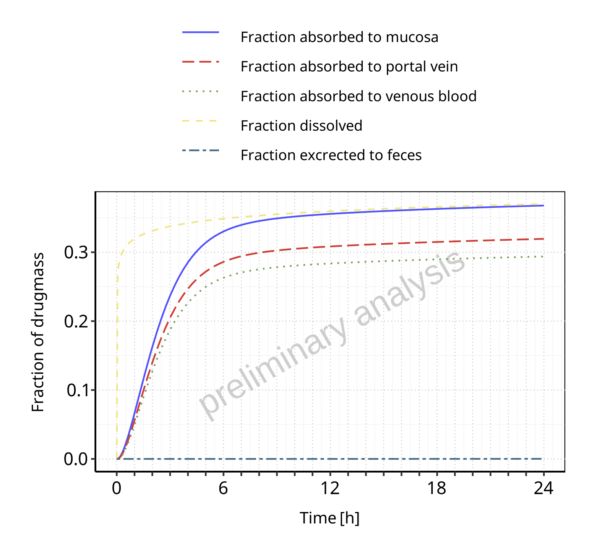


**Figure 3-7: Absorption of Raltegravir**


<br>
<br>


## Absorption for Raltegravir 400mg (granules in suspension) `<w:bookmarkStart w:id="absorption-raltegravir_400mg__granules_in_suspension_" w:name="absorption-raltegravir_400mg__granules_in_suspension_"/><w:bookmarkEnd w:id="absorption-raltegravir_400mg__granules_in_suspension_"/>`{=openxml}


```{=openxml}
<w:br w:type="page"/>
```

`<w:bookmarkStart w:id="figure-3-8" w:name="figure-3-8"/><w:bookmarkEnd w:id="figure-3-8"/>`{=openxml}

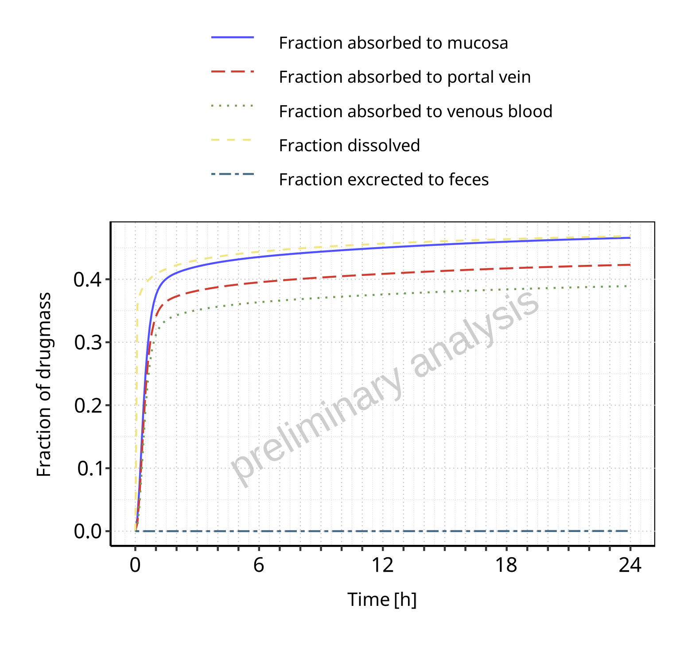


**Figure 3-8: Absorption of Raltegravir**


<br>
<br>


# Mass Balance `<w:bookmarkStart w:id="mass-balance" w:name="mass-balance"/><w:bookmarkEnd w:id="mass-balance"/>`{=openxml}


## Mass Balance for Raltegravir 10 mg (lactose formulation) `<w:bookmarkStart w:id="mass-balance-raltegravir_10_mg__lactose_formulation_" w:name="mass-balance-raltegravir_10_mg__lactose_formulation_"/><w:bookmarkEnd w:id="mass-balance-raltegravir_10_mg__lactose_formulation_"/>`{=openxml}


### Mass Balance for Raltegravir `<w:bookmarkStart w:id="1_mass_balance" w:name="1_mass_balance"/><w:bookmarkEnd w:id="1_mass_balance"/>`{=openxml}


```{=openxml}
<w:br w:type="page"/>
```

`<w:bookmarkStart w:id="figure-4-1" w:name="figure-4-1"/><w:bookmarkEnd w:id="figure-4-1"/>`{=openxml}

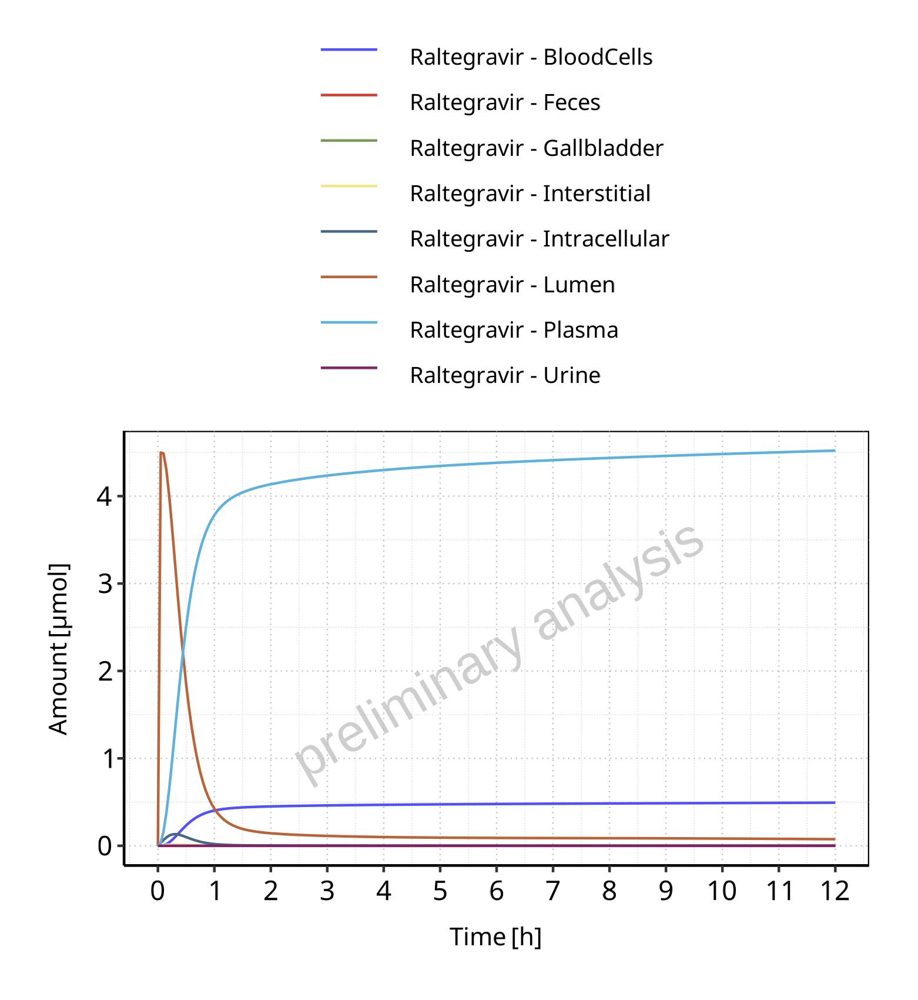


**Figure 4-1: Amount of drug vs time within the different compartments for Raltegravir**


<br>
<br>


```{=openxml}
<w:br w:type="page"/>
```

`<w:bookmarkStart w:id="figure-4-2" w:name="figure-4-2"/><w:bookmarkEnd w:id="figure-4-2"/>`{=openxml}

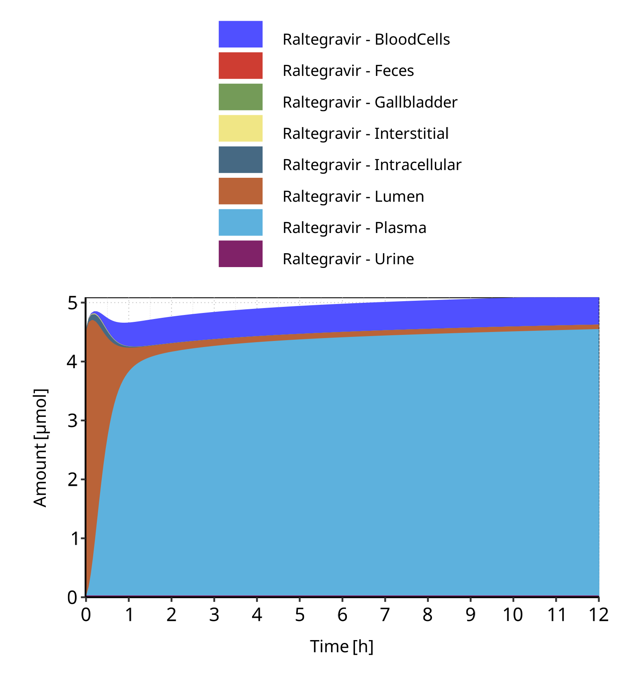


**Figure 4-2: Cumulated amount of drug vs time within the different compartments for Raltegravir**


<br>
<br>


```{=openxml}
<w:br w:type="page"/>
```

`<w:bookmarkStart w:id="figure-4-3" w:name="figure-4-3"/><w:bookmarkEnd w:id="figure-4-3"/>`{=openxml}

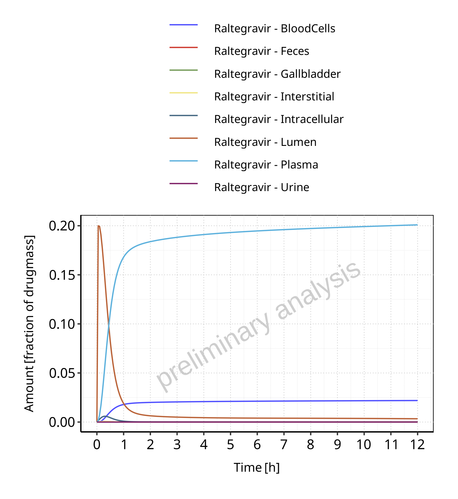


**Figure 4-3: Amount of drug vs time within the different compartments normalized to applicated drugmass for Raltegravir**


<br>
<br>


```{=openxml}
<w:br w:type="page"/>
```

`<w:bookmarkStart w:id="figure-4-4" w:name="figure-4-4"/><w:bookmarkEnd w:id="figure-4-4"/>`{=openxml}

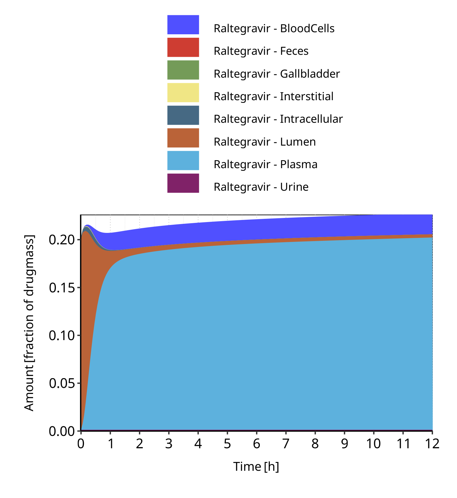


**Figure 4-4: Cumulated amount of drug vs time within the different compartments normalized to applicated drugmass for Raltegravir**


<br>
<br>


```{=openxml}
<w:br w:type="page"/>
```

`<w:bookmarkStart w:id="figure-4-5" w:name="figure-4-5"/><w:bookmarkEnd w:id="figure-4-5"/>`{=openxml}

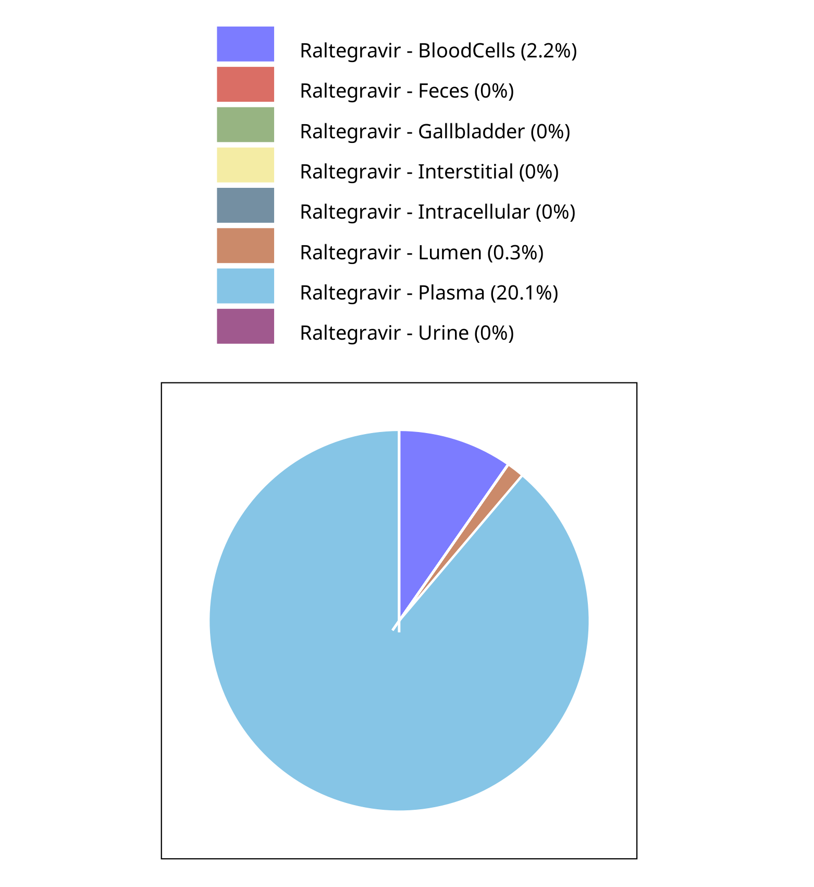


**Figure 4-5: Fraction of drug within the different compartments at 12.00h for Raltegravir**


<br>
<br>


## Mass Balance for Raltegravir 100 mg filmcoated tablet md `<w:bookmarkStart w:id="mass-balance-raltegravir_100_mg_filmcoated_tablet_md" w:name="mass-balance-raltegravir_100_mg_filmcoated_tablet_md"/><w:bookmarkEnd w:id="mass-balance-raltegravir_100_mg_filmcoated_tablet_md"/>`{=openxml}


### Mass Balance for Raltegravir `<w:bookmarkStart w:id="1_mass_balance" w:name="1_mass_balance"/><w:bookmarkEnd w:id="1_mass_balance"/>`{=openxml}


```{=openxml}
<w:br w:type="page"/>
```

`<w:bookmarkStart w:id="figure-4-6" w:name="figure-4-6"/><w:bookmarkEnd w:id="figure-4-6"/>`{=openxml}

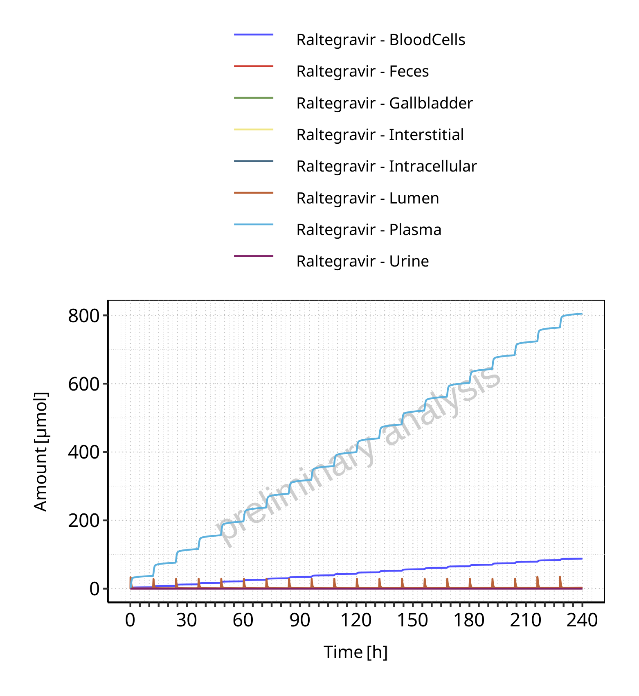


**Figure 4-6: Amount of drug vs time within the different compartments for Raltegravir**


<br>
<br>


```{=openxml}
<w:br w:type="page"/>
```

`<w:bookmarkStart w:id="figure-4-7" w:name="figure-4-7"/><w:bookmarkEnd w:id="figure-4-7"/>`{=openxml}

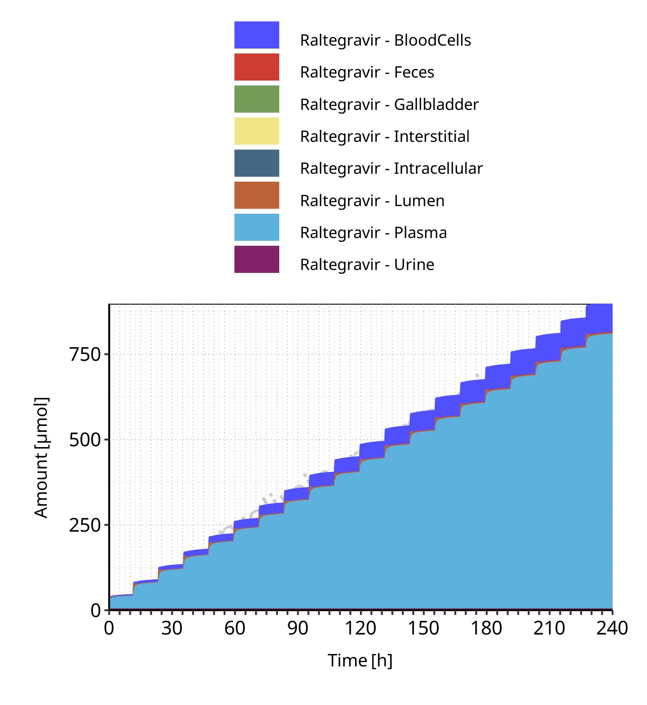


**Figure 4-7: Cumulated amount of drug vs time within the different compartments for Raltegravir**


<br>
<br>


```{=openxml}
<w:br w:type="page"/>
```

`<w:bookmarkStart w:id="figure-4-8" w:name="figure-4-8"/><w:bookmarkEnd w:id="figure-4-8"/>`{=openxml}

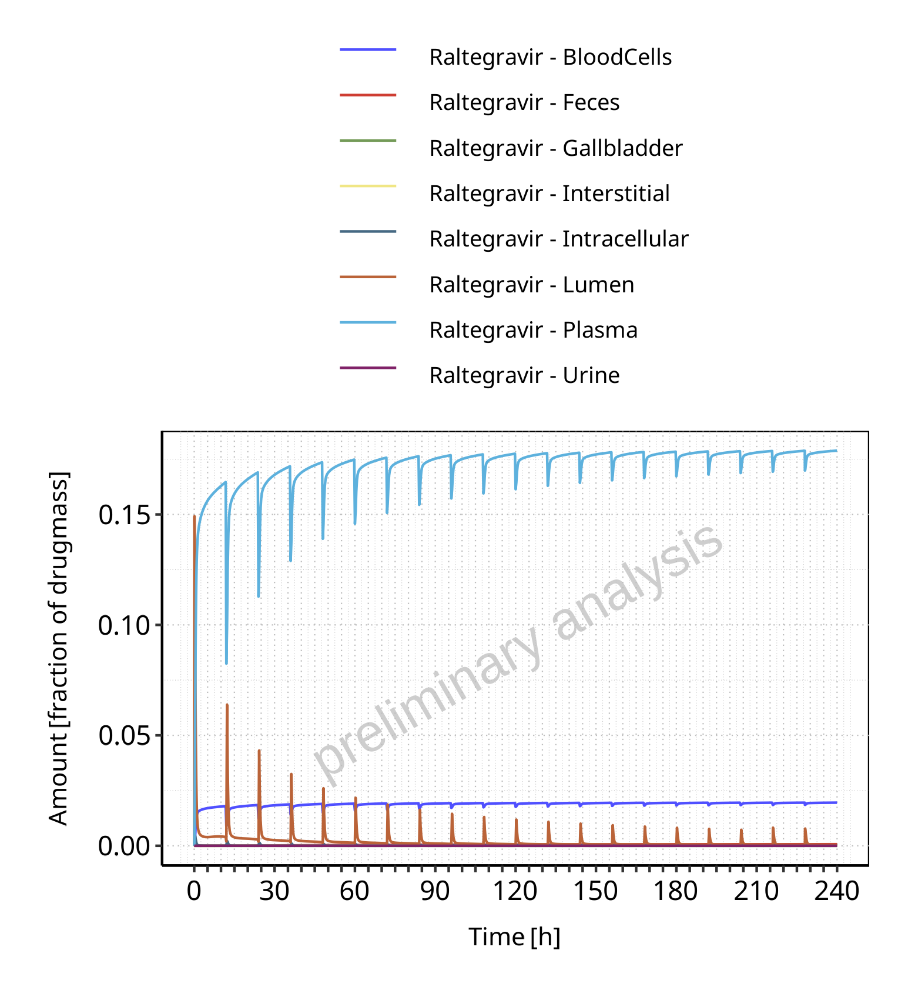


**Figure 4-8: Amount of drug vs time within the different compartments normalized to applicated drugmass for Raltegravir**


<br>
<br>


```{=openxml}
<w:br w:type="page"/>
```

`<w:bookmarkStart w:id="figure-4-9" w:name="figure-4-9"/><w:bookmarkEnd w:id="figure-4-9"/>`{=openxml}

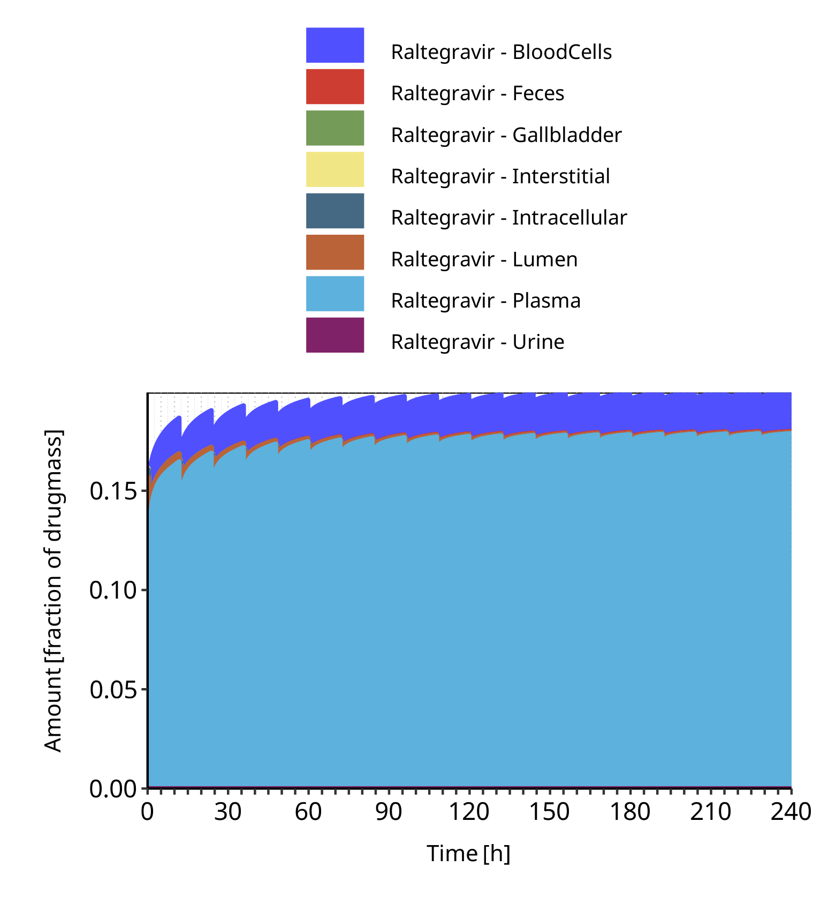


**Figure 4-9: Cumulated amount of drug vs time within the different compartments normalized to applicated drugmass for Raltegravir**


<br>
<br>


```{=openxml}
<w:br w:type="page"/>
```

`<w:bookmarkStart w:id="figure-4-10" w:name="figure-4-10"/><w:bookmarkEnd w:id="figure-4-10"/>`{=openxml}


**Figure 4-10: Fraction of drug within the different compartments at 240.00h for Raltegravir**


<br>
<br>


## Mass Balance for Raltegravir 200 mg filmcoated tablet md `<w:bookmarkStart w:id="mass-balance-raltegravir_200_mg_filmcoated_tablet_md" w:name="mass-balance-raltegravir_200_mg_filmcoated_tablet_md"/><w:bookmarkEnd w:id="mass-balance-raltegravir_200_mg_filmcoated_tablet_md"/>`{=openxml}


### Mass Balance for Raltegravir `<w:bookmarkStart w:id="1_mass_balance" w:name="1_mass_balance"/><w:bookmarkEnd w:id="1_mass_balance"/>`{=openxml}


```{=openxml}
<w:br w:type="page"/>
```

`<w:bookmarkStart w:id="figure-4-11" w:name="figure-4-11"/><w:bookmarkEnd w:id="figure-4-11"/>`{=openxml}

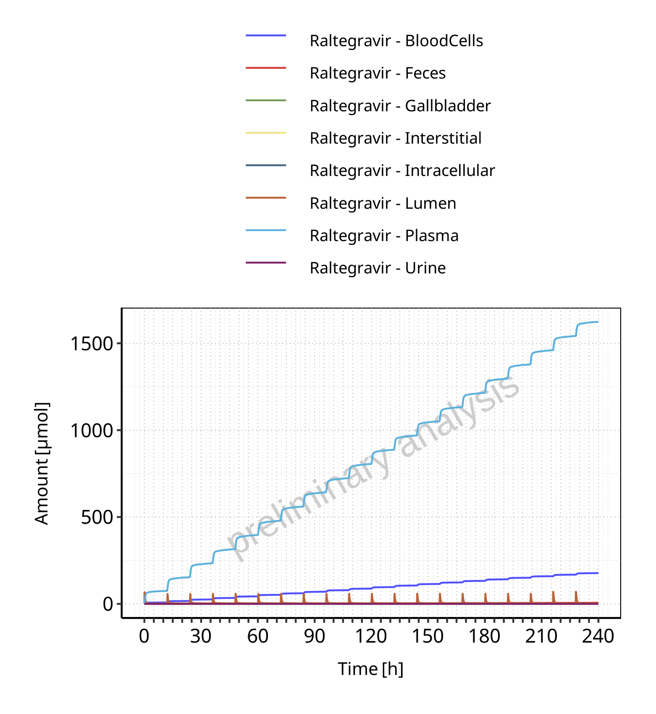


**Figure 4-11: Amount of drug vs time within the different compartments for Raltegravir**


<br>
<br>


```{=openxml}
<w:br w:type="page"/>
```

`<w:bookmarkStart w:id="figure-4-12" w:name="figure-4-12"/><w:bookmarkEnd w:id="figure-4-12"/>`{=openxml}


**Figure 4-12: Cumulated amount of drug vs time within the different compartments for Raltegravir**


<br>
<br>


```{=openxml}
<w:br w:type="page"/>
```

`<w:bookmarkStart w:id="figure-4-13" w:name="figure-4-13"/><w:bookmarkEnd w:id="figure-4-13"/>`{=openxml}


**Figure 4-13: Amount of drug vs time within the different compartments normalized to applicated drugmass for Raltegravir**


<br>
<br>


```{=openxml}
<w:br w:type="page"/>
```

`<w:bookmarkStart w:id="figure-4-14" w:name="figure-4-14"/><w:bookmarkEnd w:id="figure-4-14"/>`{=openxml}

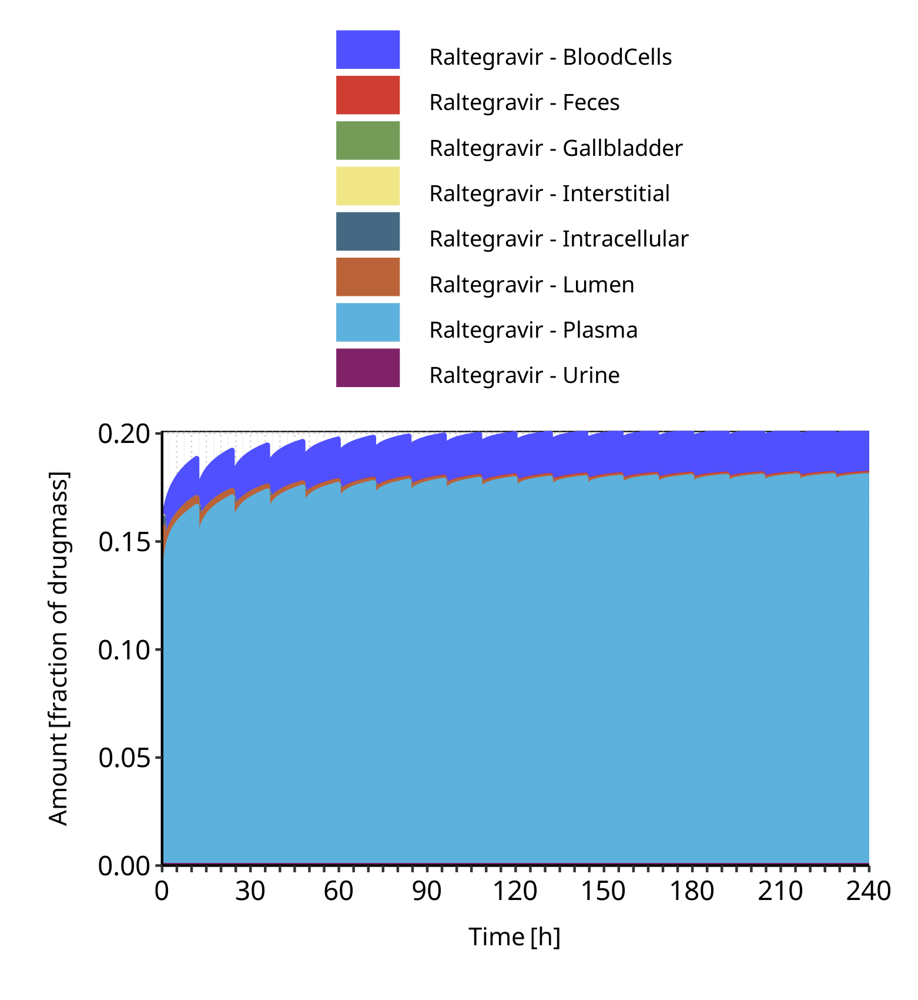


**Figure 4-14: Cumulated amount of drug vs time within the different compartments normalized to applicated drugmass for Raltegravir**


<br>
<br>


```{=openxml}
<w:br w:type="page"/>
```

`<w:bookmarkStart w:id="figure-4-15" w:name="figure-4-15"/><w:bookmarkEnd w:id="figure-4-15"/>`{=openxml}


**Figure 4-15: Fraction of drug within the different compartments at 240.00h for Raltegravir**


<br>
<br>


## Mass Balance for Filmcoated_tablet_400mg_sd `<w:bookmarkStart w:id="mass-balance-filmcoated_tablet_400mg_sd" w:name="mass-balance-filmcoated_tablet_400mg_sd"/><w:bookmarkEnd w:id="mass-balance-filmcoated_tablet_400mg_sd"/>`{=openxml}


### Mass Balance for Raltegravir `<w:bookmarkStart w:id="1_mass_balance" w:name="1_mass_balance"/><w:bookmarkEnd w:id="1_mass_balance"/>`{=openxml}


```{=openxml}
<w:br w:type="page"/>
```

`<w:bookmarkStart w:id="figure-4-16" w:name="figure-4-16"/><w:bookmarkEnd w:id="figure-4-16"/>`{=openxml}

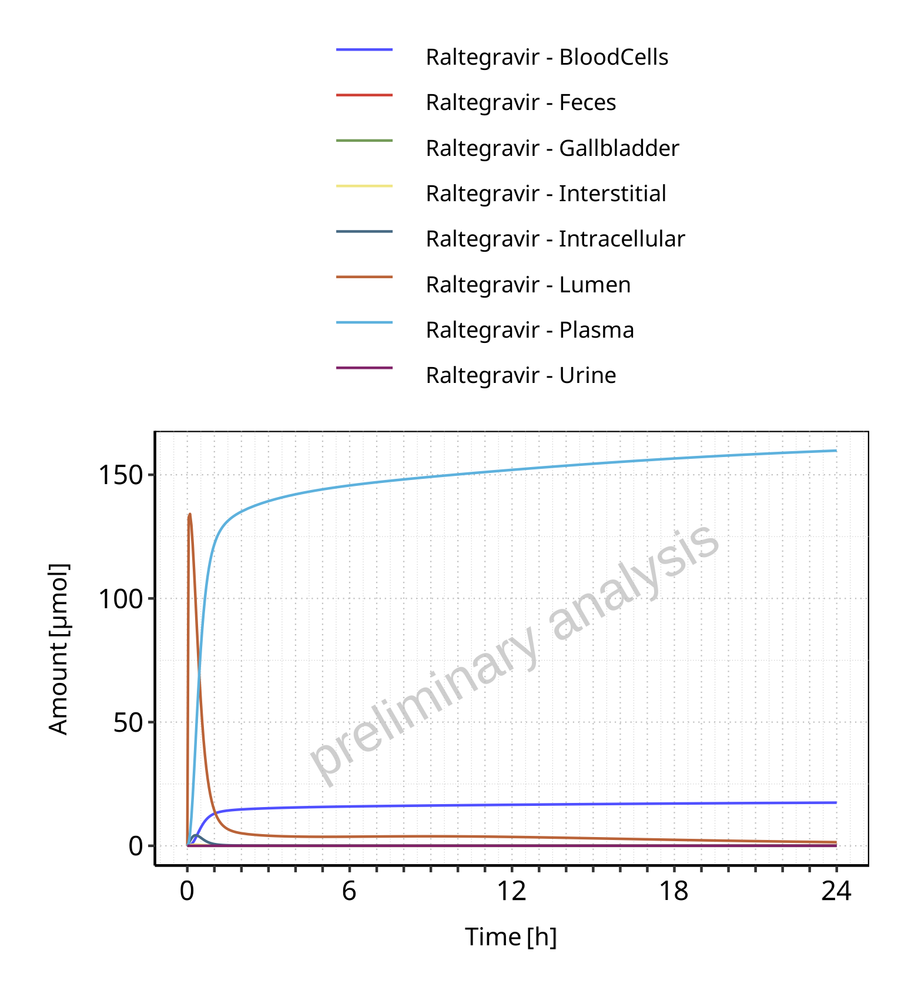


**Figure 4-16: Amount of drug vs time within the different compartments for Raltegravir**


<br>
<br>


```{=openxml}
<w:br w:type="page"/>
```

`<w:bookmarkStart w:id="figure-4-17" w:name="figure-4-17"/><w:bookmarkEnd w:id="figure-4-17"/>`{=openxml}

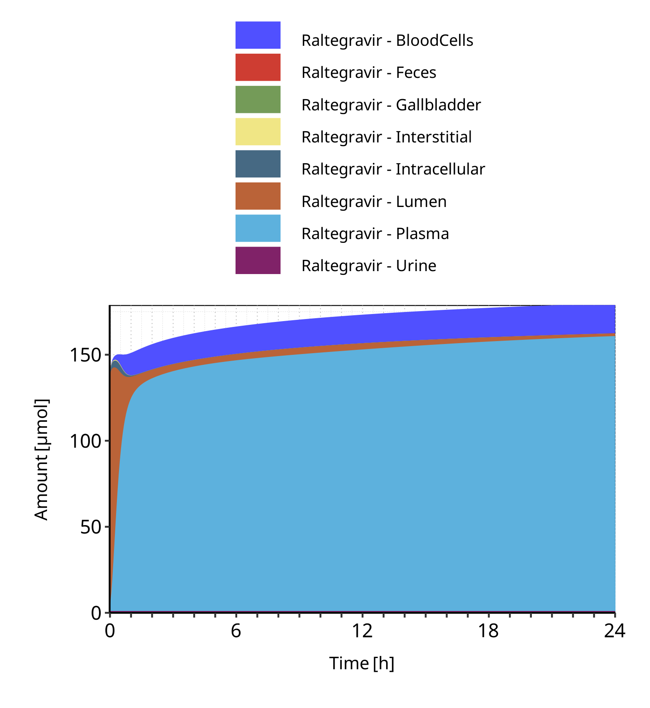


**Figure 4-17: Cumulated amount of drug vs time within the different compartments for Raltegravir**


<br>
<br>


```{=openxml}
<w:br w:type="page"/>
```

`<w:bookmarkStart w:id="figure-4-18" w:name="figure-4-18"/><w:bookmarkEnd w:id="figure-4-18"/>`{=openxml}

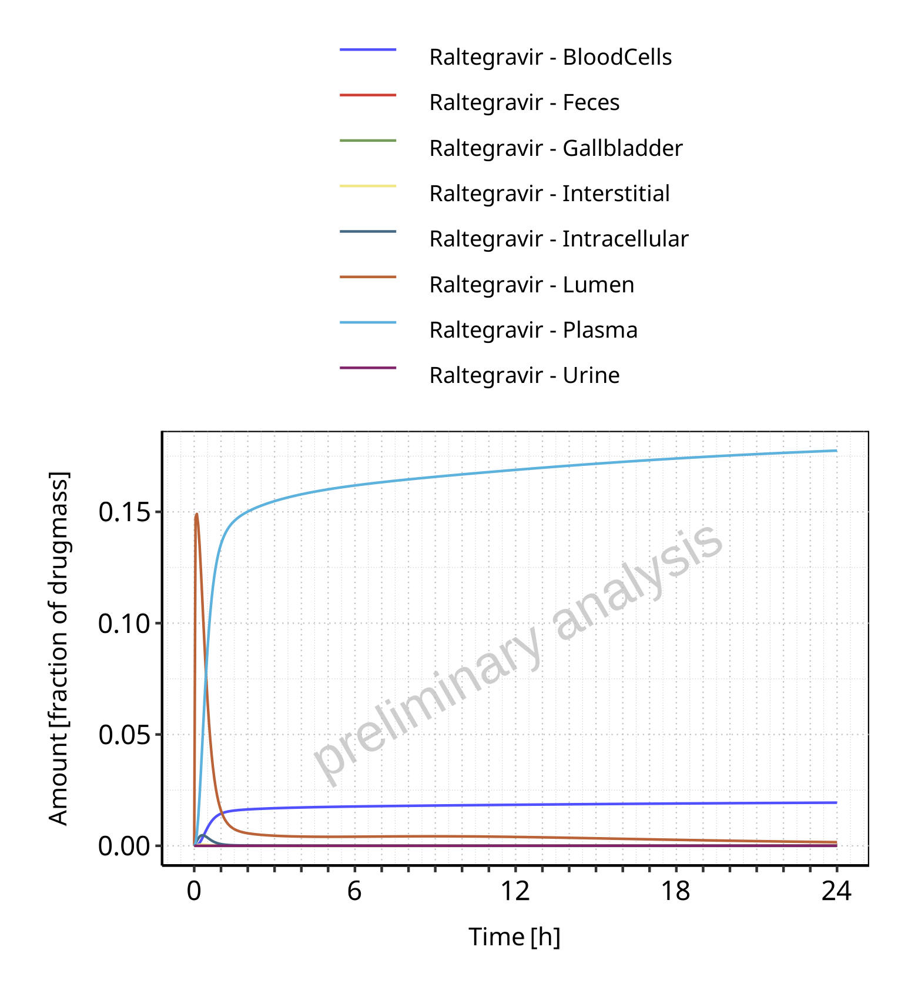


**Figure 4-18: Amount of drug vs time within the different compartments normalized to applicated drugmass for Raltegravir**


<br>
<br>


```{=openxml}
<w:br w:type="page"/>
```

`<w:bookmarkStart w:id="figure-4-19" w:name="figure-4-19"/><w:bookmarkEnd w:id="figure-4-19"/>`{=openxml}

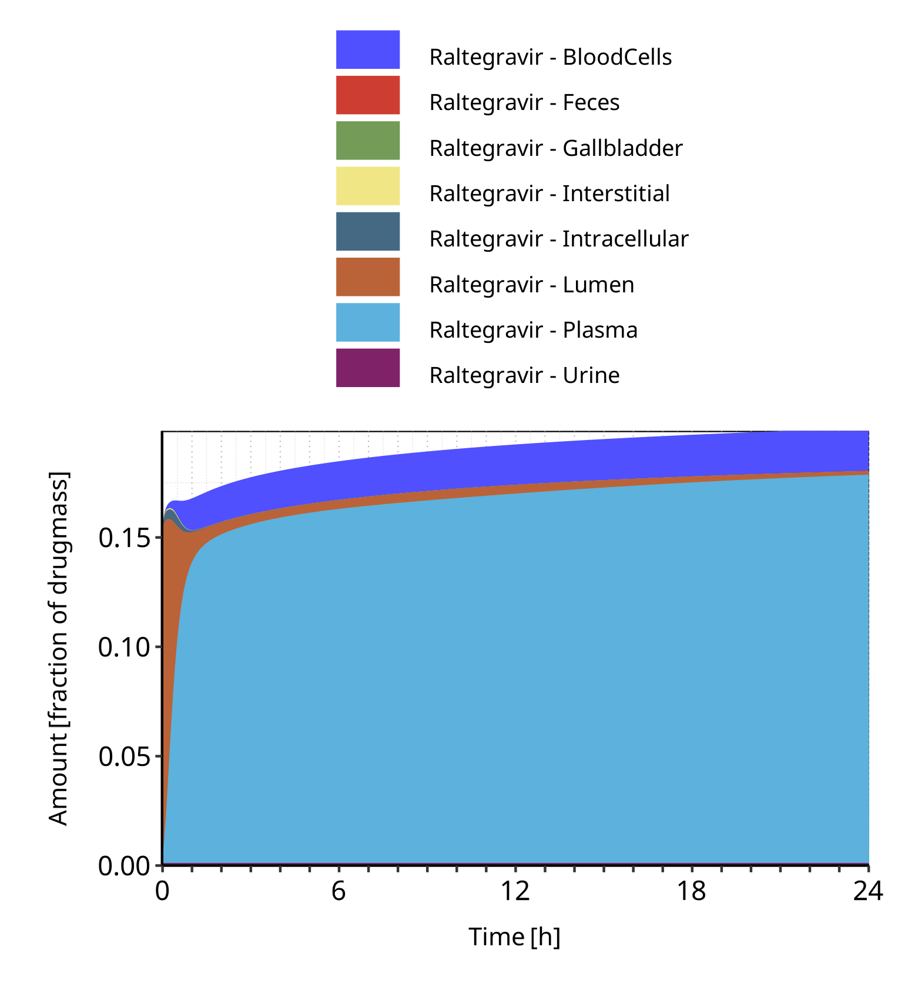


**Figure 4-19: Cumulated amount of drug vs time within the different compartments normalized to applicated drugmass for Raltegravir**


<br>
<br>


```{=openxml}
<w:br w:type="page"/>
```

`<w:bookmarkStart w:id="figure-4-20" w:name="figure-4-20"/><w:bookmarkEnd w:id="figure-4-20"/>`{=openxml}


**Figure 4-20: Fraction of drug within the different compartments at 24.00h for Raltegravir**


<br>
<br>


## Mass Balance for Raltegravir 400 mg filmcoated tablet md `<w:bookmarkStart w:id="mass-balance-raltegravir_400_mg_filmcoated_tablet_md" w:name="mass-balance-raltegravir_400_mg_filmcoated_tablet_md"/><w:bookmarkEnd w:id="mass-balance-raltegravir_400_mg_filmcoated_tablet_md"/>`{=openxml}


### Mass Balance for Raltegravir `<w:bookmarkStart w:id="1_mass_balance" w:name="1_mass_balance"/><w:bookmarkEnd w:id="1_mass_balance"/>`{=openxml}


```{=openxml}
<w:br w:type="page"/>
```

`<w:bookmarkStart w:id="figure-4-21" w:name="figure-4-21"/><w:bookmarkEnd w:id="figure-4-21"/>`{=openxml}


**Figure 4-21: Amount of drug vs time within the different compartments for Raltegravir**


<br>
<br>


```{=openxml}
<w:br w:type="page"/>
```

`<w:bookmarkStart w:id="figure-4-22" w:name="figure-4-22"/><w:bookmarkEnd w:id="figure-4-22"/>`{=openxml}

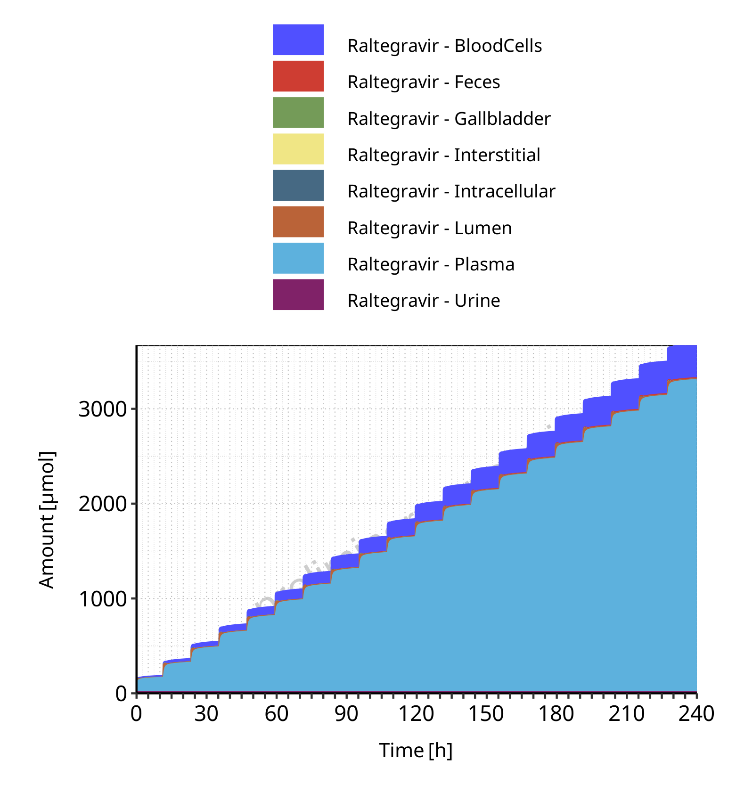


**Figure 4-22: Cumulated amount of drug vs time within the different compartments for Raltegravir**


<br>
<br>


```{=openxml}
<w:br w:type="page"/>
```

`<w:bookmarkStart w:id="figure-4-23" w:name="figure-4-23"/><w:bookmarkEnd w:id="figure-4-23"/>`{=openxml}

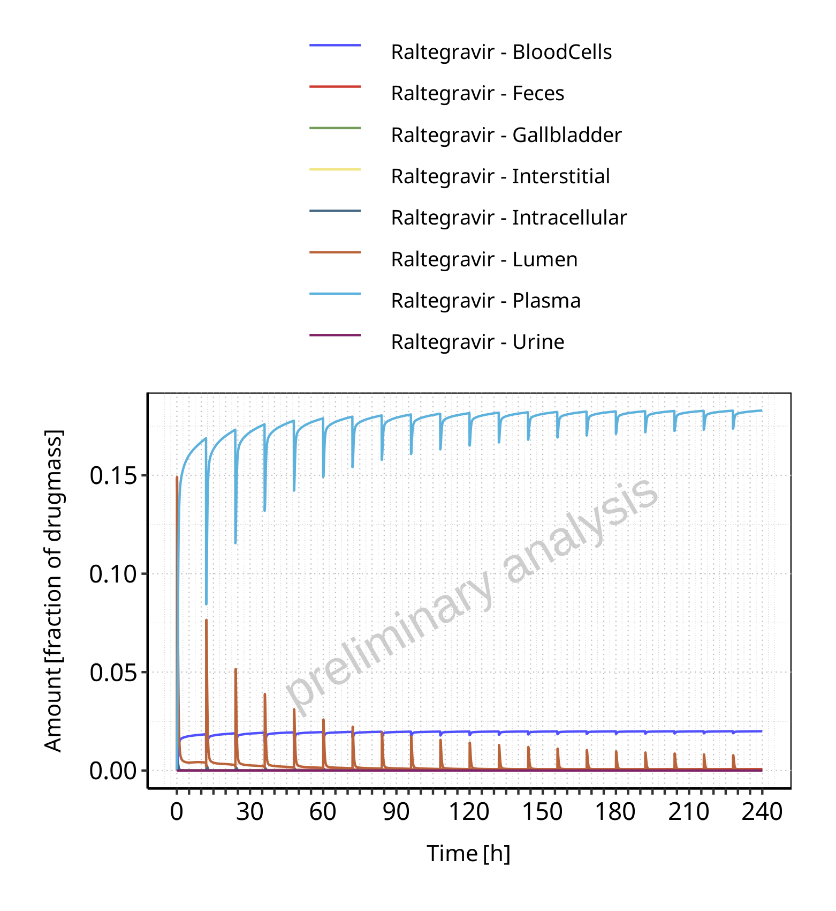


**Figure 4-23: Amount of drug vs time within the different compartments normalized to applicated drugmass for Raltegravir**


<br>
<br>


```{=openxml}
<w:br w:type="page"/>
```

`<w:bookmarkStart w:id="figure-4-24" w:name="figure-4-24"/><w:bookmarkEnd w:id="figure-4-24"/>`{=openxml}


**Figure 4-24: Cumulated amount of drug vs time within the different compartments normalized to applicated drugmass for Raltegravir**


<br>
<br>


```{=openxml}
<w:br w:type="page"/>
```

`<w:bookmarkStart w:id="figure-4-25" w:name="figure-4-25"/><w:bookmarkEnd w:id="figure-4-25"/>`{=openxml}


**Figure 4-25: Fraction of drug within the different compartments at 240.00h for Raltegravir**


<br>
<br>


## Mass Balance for Raltegravir 400mg chewable fasted `<w:bookmarkStart w:id="mass-balance-raltegravir_400mg_chewable_fasted" w:name="mass-balance-raltegravir_400mg_chewable_fasted"/><w:bookmarkEnd w:id="mass-balance-raltegravir_400mg_chewable_fasted"/>`{=openxml}


### Mass Balance for Raltegravir `<w:bookmarkStart w:id="1_mass_balance" w:name="1_mass_balance"/><w:bookmarkEnd w:id="1_mass_balance"/>`{=openxml}


```{=openxml}
<w:br w:type="page"/>
```

`<w:bookmarkStart w:id="figure-4-26" w:name="figure-4-26"/><w:bookmarkEnd w:id="figure-4-26"/>`{=openxml}

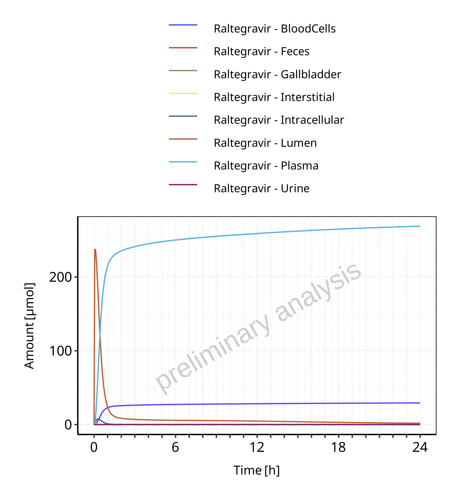


**Figure 4-26: Amount of drug vs time within the different compartments for Raltegravir**


<br>
<br>


```{=openxml}
<w:br w:type="page"/>
```

`<w:bookmarkStart w:id="figure-4-27" w:name="figure-4-27"/><w:bookmarkEnd w:id="figure-4-27"/>`{=openxml}


**Figure 4-27: Cumulated amount of drug vs time within the different compartments for Raltegravir**


<br>
<br>


```{=openxml}
<w:br w:type="page"/>
```

`<w:bookmarkStart w:id="figure-4-28" w:name="figure-4-28"/><w:bookmarkEnd w:id="figure-4-28"/>`{=openxml}

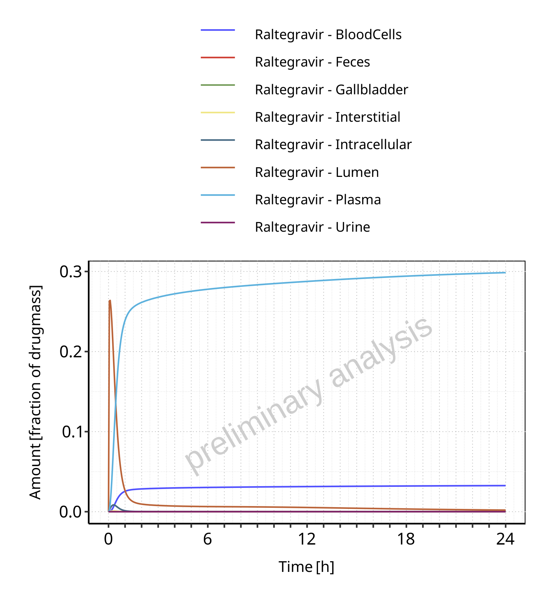


**Figure 4-28: Amount of drug vs time within the different compartments normalized to applicated drugmass for Raltegravir**


<br>
<br>


```{=openxml}
<w:br w:type="page"/>
```

`<w:bookmarkStart w:id="figure-4-29" w:name="figure-4-29"/><w:bookmarkEnd w:id="figure-4-29"/>`{=openxml}


**Figure 4-29: Cumulated amount of drug vs time within the different compartments normalized to applicated drugmass for Raltegravir**


<br>
<br>


```{=openxml}
<w:br w:type="page"/>
```

`<w:bookmarkStart w:id="figure-4-30" w:name="figure-4-30"/><w:bookmarkEnd w:id="figure-4-30"/>`{=openxml}


**Figure 4-30: Fraction of drug within the different compartments at 24.00h for Raltegravir**


<br>
<br>


## Mass Balance for Raltegravir 400mg chewable fed `<w:bookmarkStart w:id="mass-balance-raltegravir_400mg_chewable_fed" w:name="mass-balance-raltegravir_400mg_chewable_fed"/><w:bookmarkEnd w:id="mass-balance-raltegravir_400mg_chewable_fed"/>`{=openxml}


### Mass Balance for Raltegravir `<w:bookmarkStart w:id="1_mass_balance" w:name="1_mass_balance"/><w:bookmarkEnd w:id="1_mass_balance"/>`{=openxml}


```{=openxml}
<w:br w:type="page"/>
```

`<w:bookmarkStart w:id="figure-4-31" w:name="figure-4-31"/><w:bookmarkEnd w:id="figure-4-31"/>`{=openxml}


**Figure 4-31: Amount of drug vs time within the different compartments for Raltegravir**


<br>
<br>


```{=openxml}
<w:br w:type="page"/>
```

`<w:bookmarkStart w:id="figure-4-32" w:name="figure-4-32"/><w:bookmarkEnd w:id="figure-4-32"/>`{=openxml}

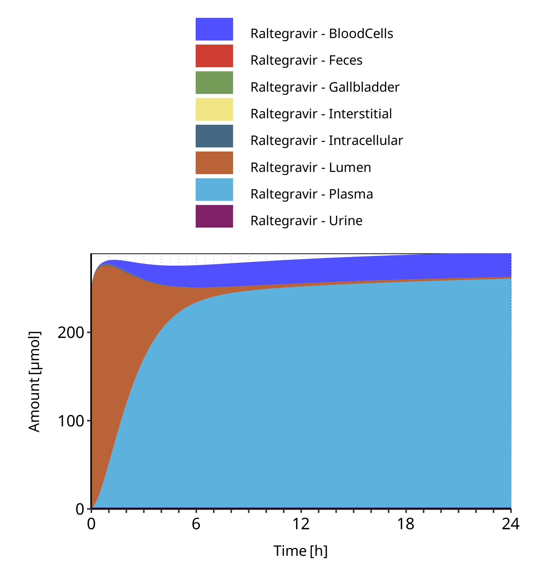


**Figure 4-32: Cumulated amount of drug vs time within the different compartments for Raltegravir**


<br>
<br>


```{=openxml}
<w:br w:type="page"/>
```

`<w:bookmarkStart w:id="figure-4-33" w:name="figure-4-33"/><w:bookmarkEnd w:id="figure-4-33"/>`{=openxml}

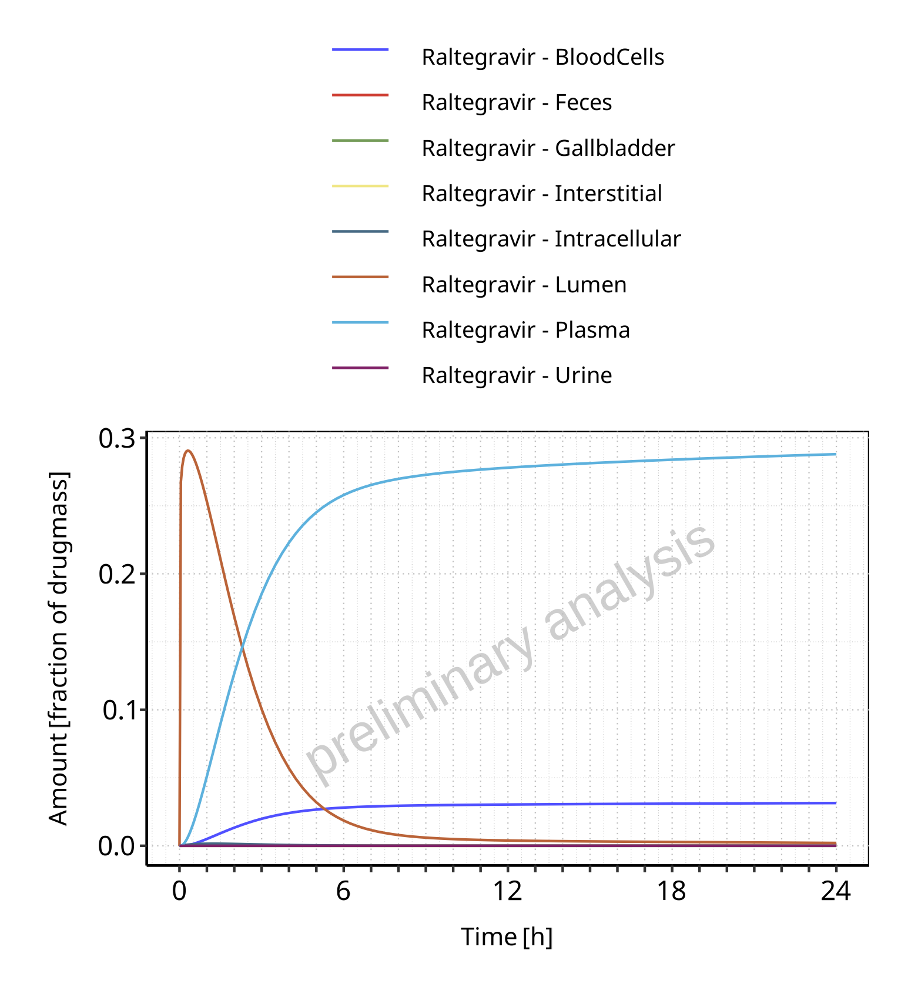


**Figure 4-33: Amount of drug vs time within the different compartments normalized to applicated drugmass for Raltegravir**


<br>
<br>


```{=openxml}
<w:br w:type="page"/>
```

`<w:bookmarkStart w:id="figure-4-34" w:name="figure-4-34"/><w:bookmarkEnd w:id="figure-4-34"/>`{=openxml}

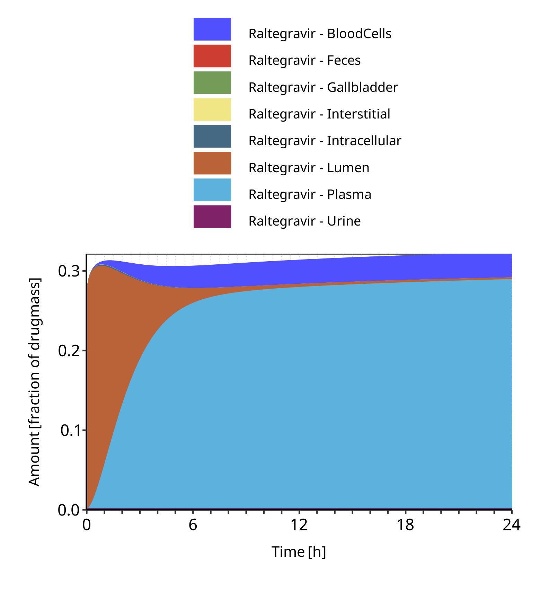


**Figure 4-34: Cumulated amount of drug vs time within the different compartments normalized to applicated drugmass for Raltegravir**


<br>
<br>


```{=openxml}
<w:br w:type="page"/>
```

`<w:bookmarkStart w:id="figure-4-35" w:name="figure-4-35"/><w:bookmarkEnd w:id="figure-4-35"/>`{=openxml}


**Figure 4-35: Fraction of drug within the different compartments at 24.00h for Raltegravir**


<br>
<br>


## Mass Balance for Raltegravir 400mg (granules in suspension) `<w:bookmarkStart w:id="mass-balance-raltegravir_400mg__granules_in_suspension_" w:name="mass-balance-raltegravir_400mg__granules_in_suspension_"/><w:bookmarkEnd w:id="mass-balance-raltegravir_400mg__granules_in_suspension_"/>`{=openxml}


### Mass Balance for Raltegravir `<w:bookmarkStart w:id="1_mass_balance" w:name="1_mass_balance"/><w:bookmarkEnd w:id="1_mass_balance"/>`{=openxml}


```{=openxml}
<w:br w:type="page"/>
```

`<w:bookmarkStart w:id="figure-4-36" w:name="figure-4-36"/><w:bookmarkEnd w:id="figure-4-36"/>`{=openxml}

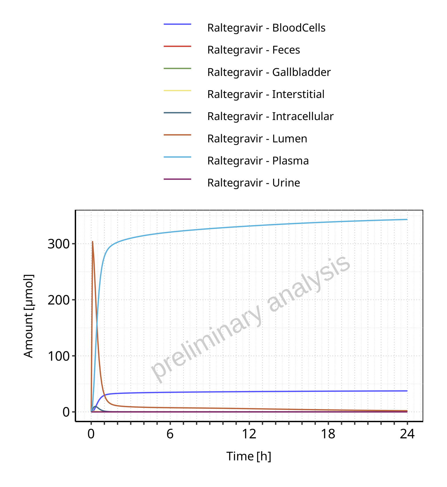


**Figure 4-36: Amount of drug vs time within the different compartments for Raltegravir**


<br>
<br>


```{=openxml}
<w:br w:type="page"/>
```

`<w:bookmarkStart w:id="figure-4-37" w:name="figure-4-37"/><w:bookmarkEnd w:id="figure-4-37"/>`{=openxml}


**Figure 4-37: Cumulated amount of drug vs time within the different compartments for Raltegravir**


<br>
<br>


```{=openxml}
<w:br w:type="page"/>
```

`<w:bookmarkStart w:id="figure-4-38" w:name="figure-4-38"/><w:bookmarkEnd w:id="figure-4-38"/>`{=openxml}


**Figure 4-38: Amount of drug vs time within the different compartments normalized to applicated drugmass for Raltegravir**


<br>
<br>


```{=openxml}
<w:br w:type="page"/>
```

`<w:bookmarkStart w:id="figure-4-39" w:name="figure-4-39"/><w:bookmarkEnd w:id="figure-4-39"/>`{=openxml}

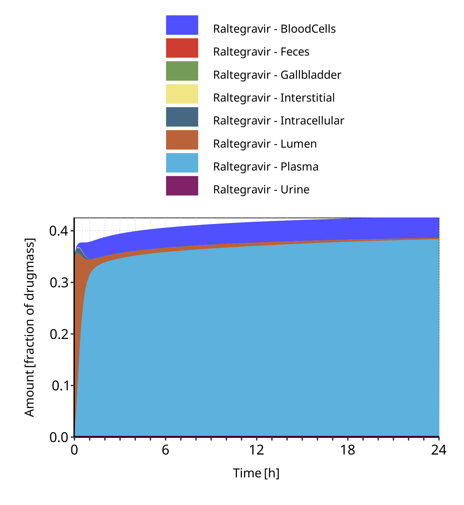


**Figure 4-39: Cumulated amount of drug vs time within the different compartments normalized to applicated drugmass for Raltegravir**


<br>
<br>


```{=openxml}
<w:br w:type="page"/>
```

`<w:bookmarkStart w:id="figure-4-40" w:name="figure-4-40"/><w:bookmarkEnd w:id="figure-4-40"/>`{=openxml}


**Figure 4-40: Fraction of drug within the different compartments at 24.00h for Raltegravir**


<br>
<br>


# Time profiles and residual plots `<w:bookmarkStart w:id="time-profiles" w:name="time-profiles"/><w:bookmarkEnd w:id="time-profiles"/>`{=openxml}


## Time profiles and residual plots for Raltegravir 10 mg (lactose formulation) `<w:bookmarkStart w:id="time-profiles-raltegravir_10_mg__lactose_formulation_" w:name="time-profiles-raltegravir_10_mg__lactose_formulation_"/><w:bookmarkEnd w:id="time-profiles-raltegravir_10_mg__lactose_formulation_"/>`{=openxml}


```{=openxml}
<w:br w:type="page"/>
```

`<w:bookmarkStart w:id="figure-5-1" w:name="figure-5-1"/><w:bookmarkEnd w:id="figure-5-1"/>`{=openxml}

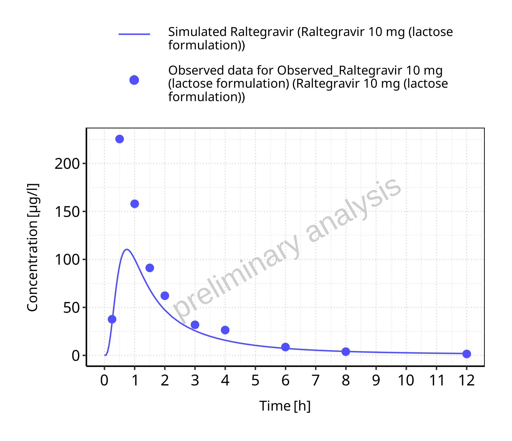


**Figure 5-1: Time profiles for Raltegravir 10 mg (lactose formulation). Data source: Data/Raltegravir_PK.txt. Time profiles are plotted in a linear scale.**


<br>
<br>


```{=openxml}
<w:br w:type="page"/>
```

`<w:bookmarkStart w:id="figure-5-2" w:name="figure-5-2"/><w:bookmarkEnd w:id="figure-5-2"/>`{=openxml}

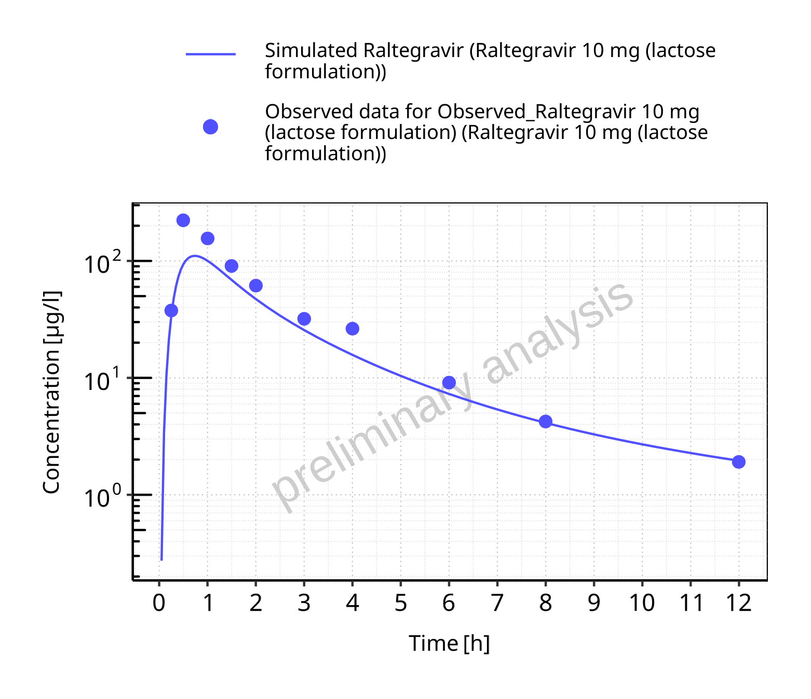


**Figure 5-2: Time profiles for Raltegravir 10 mg (lactose formulation). Data source: Data/Raltegravir_PK.txt. Time profiles are plotted in a logarithmic scale.**


<br>
<br>


```{=openxml}
<w:br w:type="page"/>
```

`<w:bookmarkStart w:id="figure-5-3" w:name="figure-5-3"/><w:bookmarkEnd w:id="figure-5-3"/>`{=openxml}

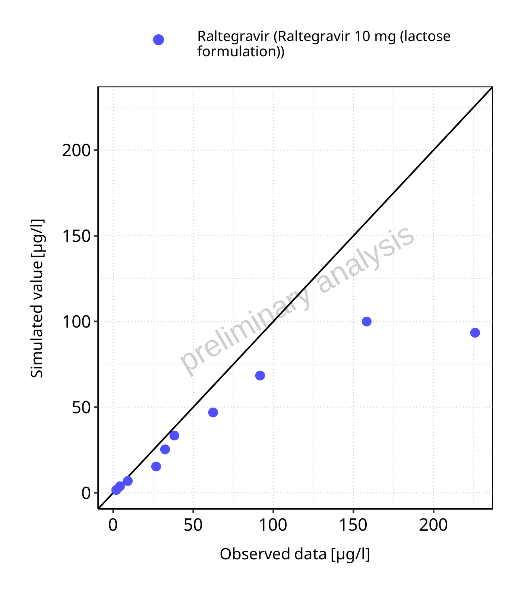


**Figure 5-3: Predicted vs observed for Raltegravir 10 mg (lactose formulation). Data source: Data/Raltegravir_PK.txt. Predictions and observations are plotted in a linear scale.**


<br>
<br>


```{=openxml}
<w:br w:type="page"/>
```

`<w:bookmarkStart w:id="figure-5-4" w:name="figure-5-4"/><w:bookmarkEnd w:id="figure-5-4"/>`{=openxml}


**Figure 5-4: Predicted vs observed for Raltegravir 10 mg (lactose formulation). Data source: Data/Raltegravir_PK.txt. Predictions and observations are plotted in a logarithmic scale.**


<br>
<br>


```{=openxml}
<w:br w:type="page"/>
```

`<w:bookmarkStart w:id="figure-5-5" w:name="figure-5-5"/><w:bookmarkEnd w:id="figure-5-5"/>`{=openxml}

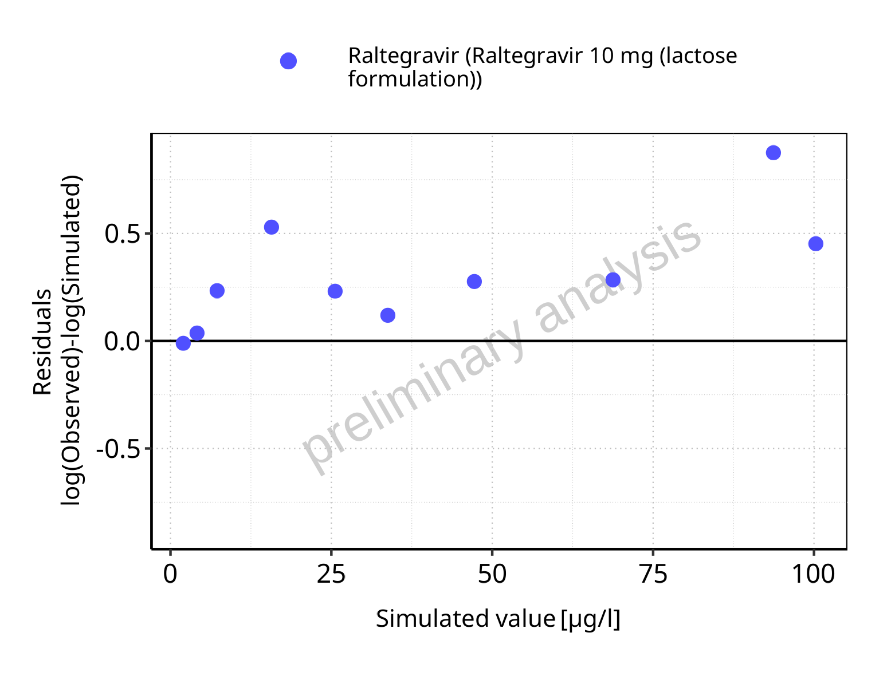


**Figure 5-5: Logarithmic residuals vs predicted values for Raltegravir 10 mg (lactose formulation). Data source: Data/Raltegravir_PK.txt.**


<br>
<br>


```{=openxml}
<w:br w:type="page"/>
```

`<w:bookmarkStart w:id="figure-5-6" w:name="figure-5-6"/><w:bookmarkEnd w:id="figure-5-6"/>`{=openxml}

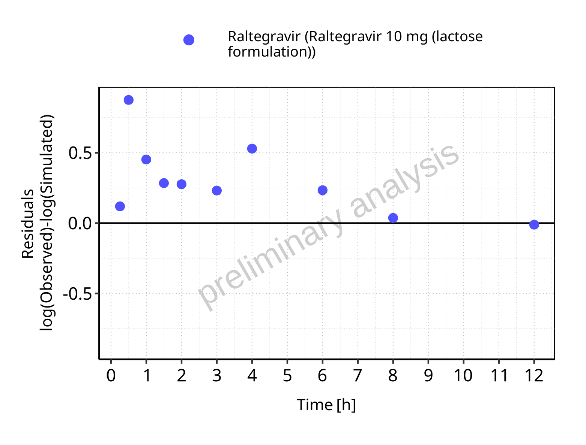


**Figure 5-6: Logarithmic residuals vs time values for Raltegravir 10 mg (lactose formulation). Data source: Data/Raltegravir_PK.txt.**


<br>
<br>


```{=openxml}
<w:br w:type="page"/>
```

`<w:bookmarkStart w:id="figure-5-7" w:name="figure-5-7"/><w:bookmarkEnd w:id="figure-5-7"/>`{=openxml}

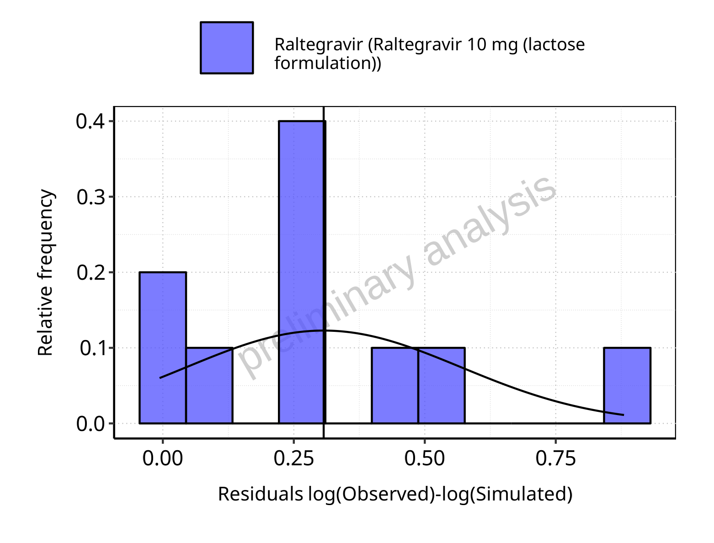


**Figure 5-7: Logarithmic residuals distribution (stacked) for Raltegravir 10 mg (lactose formulation). Data source: Data/Raltegravir_PK.txt.**


<br>
<br>


```{=openxml}
<w:br w:type="page"/>
```

`<w:bookmarkStart w:id="figure-5-8" w:name="figure-5-8"/><w:bookmarkEnd w:id="figure-5-8"/>`{=openxml}

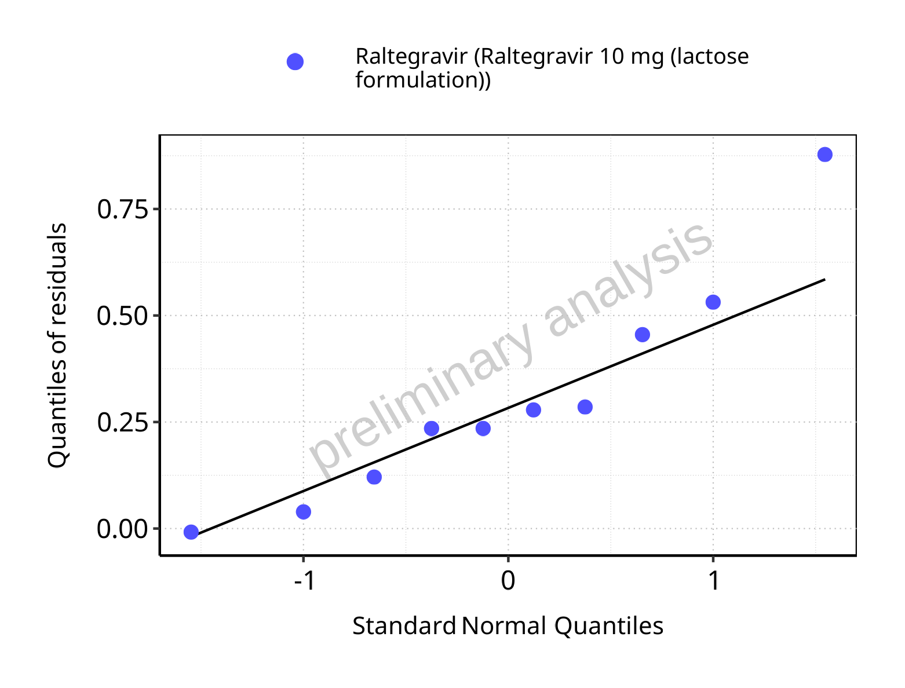


**Figure 5-8: Logarithmic residuals for Raltegravir 10 mg (lactose formulation) as quantile-quantile plot. Data source: Data/Raltegravir_PK.txt.**


<br>
<br>


## Time profiles and residual plots for Raltegravir 100 mg filmcoated tablet md `<w:bookmarkStart w:id="time-profiles-raltegravir_100_mg_filmcoated_tablet_md" w:name="time-profiles-raltegravir_100_mg_filmcoated_tablet_md"/><w:bookmarkEnd w:id="time-profiles-raltegravir_100_mg_filmcoated_tablet_md"/>`{=openxml}


### For total simulation time range `<w:bookmarkStart w:id="goodness-of-fit-raltegravir_100_mg_filmcoated_tablet_md-total" w:name="goodness-of-fit-raltegravir_100_mg_filmcoated_tablet_md-total"/><w:bookmarkEnd w:id="goodness-of-fit-raltegravir_100_mg_filmcoated_tablet_md-total"/>`{=openxml}


```{=openxml}
<w:br w:type="page"/>
```

`<w:bookmarkStart w:id="figure-5-9" w:name="figure-5-9"/><w:bookmarkEnd w:id="figure-5-9"/>`{=openxml}

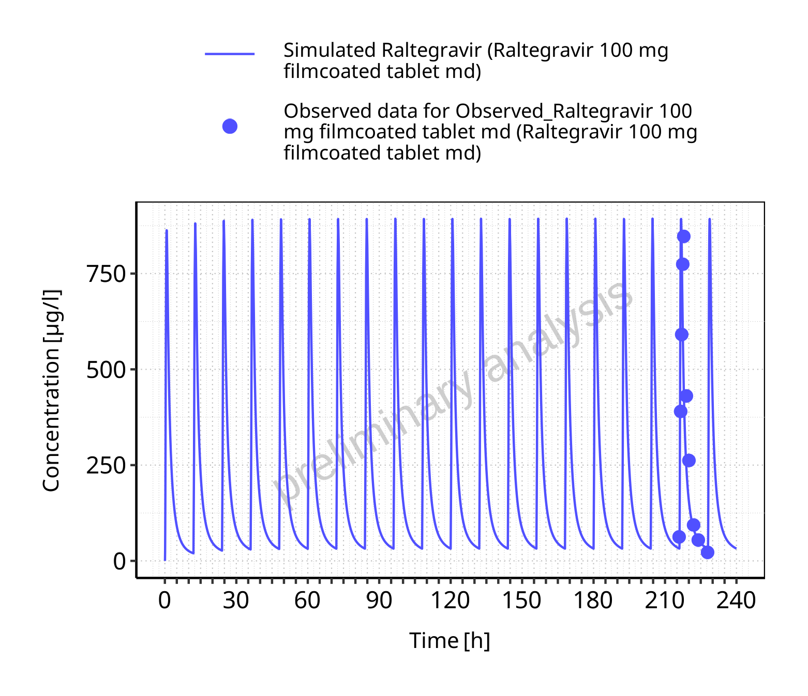


**Figure 5-9: Time profiles for Raltegravir 100 mg filmcoated tablet md. Data source: Data/Raltegravir_PK.txt. Time profiles are plotted in a linear scale.**


<br>
<br>


```{=openxml}
<w:br w:type="page"/>
```

`<w:bookmarkStart w:id="figure-5-10" w:name="figure-5-10"/><w:bookmarkEnd w:id="figure-5-10"/>`{=openxml}

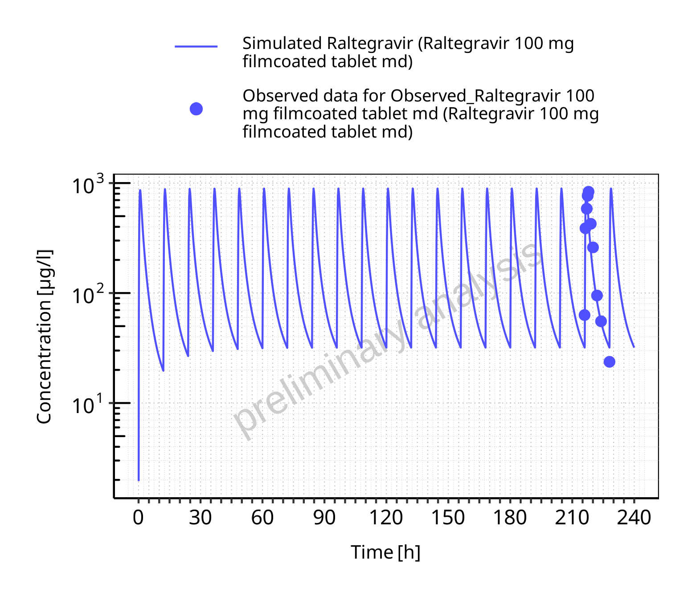


**Figure 5-10: Time profiles for Raltegravir 100 mg filmcoated tablet md. Data source: Data/Raltegravir_PK.txt. Time profiles are plotted in a logarithmic scale.**


<br>
<br>


```{=openxml}
<w:br w:type="page"/>
```

`<w:bookmarkStart w:id="figure-5-11" w:name="figure-5-11"/><w:bookmarkEnd w:id="figure-5-11"/>`{=openxml}

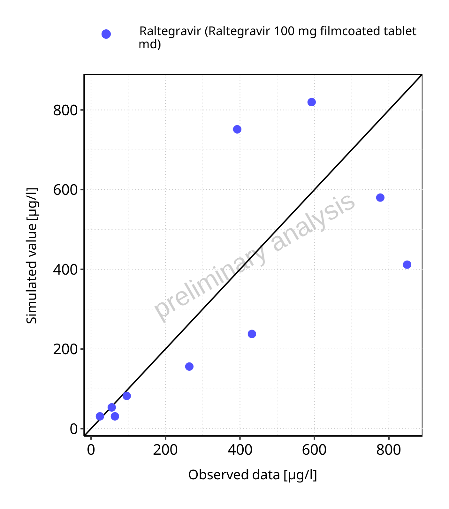


**Figure 5-11: Predicted vs observed for Raltegravir 100 mg filmcoated tablet md. Data source: Data/Raltegravir_PK.txt. Predictions and observations are plotted in a linear scale.**


<br>
<br>


```{=openxml}
<w:br w:type="page"/>
```

`<w:bookmarkStart w:id="figure-5-12" w:name="figure-5-12"/><w:bookmarkEnd w:id="figure-5-12"/>`{=openxml}


**Figure 5-12: Predicted vs observed for Raltegravir 100 mg filmcoated tablet md. Data source: Data/Raltegravir_PK.txt. Predictions and observations are plotted in a logarithmic scale.**


<br>
<br>


```{=openxml}
<w:br w:type="page"/>
```

`<w:bookmarkStart w:id="figure-5-13" w:name="figure-5-13"/><w:bookmarkEnd w:id="figure-5-13"/>`{=openxml}

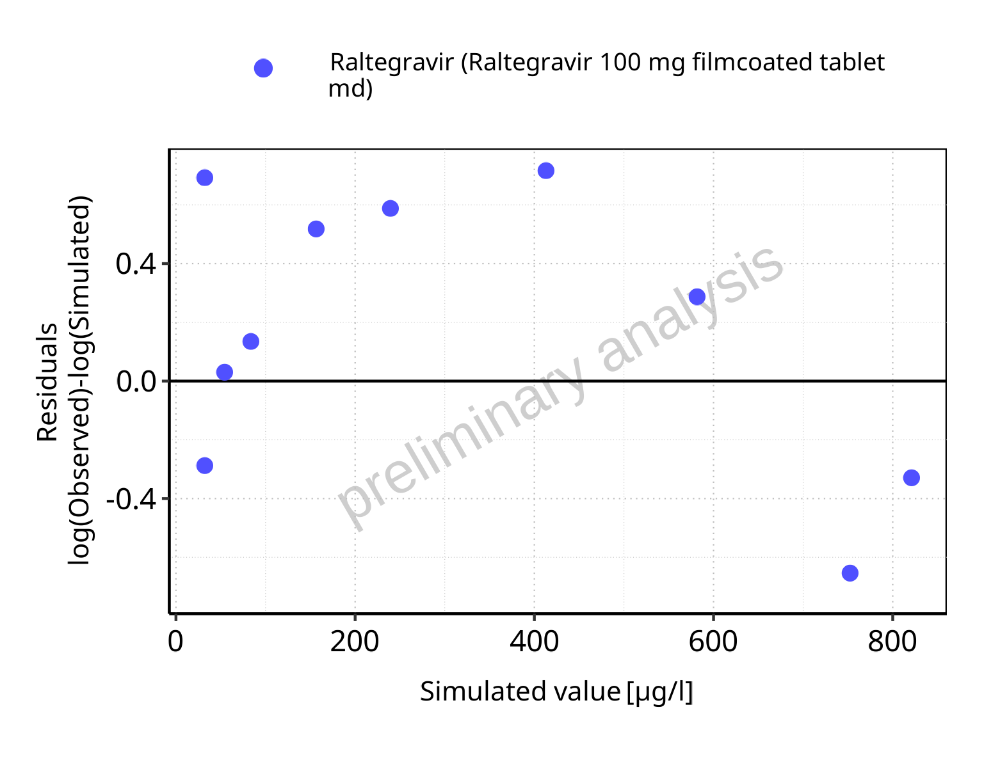


**Figure 5-13: Logarithmic residuals vs predicted values for Raltegravir 100 mg filmcoated tablet md. Data source: Data/Raltegravir_PK.txt.**


<br>
<br>


```{=openxml}
<w:br w:type="page"/>
```

`<w:bookmarkStart w:id="figure-5-14" w:name="figure-5-14"/><w:bookmarkEnd w:id="figure-5-14"/>`{=openxml}


**Figure 5-14: Logarithmic residuals vs time values for Raltegravir 100 mg filmcoated tablet md. Data source: Data/Raltegravir_PK.txt.**


<br>
<br>


```{=openxml}
<w:br w:type="page"/>
```

`<w:bookmarkStart w:id="figure-5-15" w:name="figure-5-15"/><w:bookmarkEnd w:id="figure-5-15"/>`{=openxml}

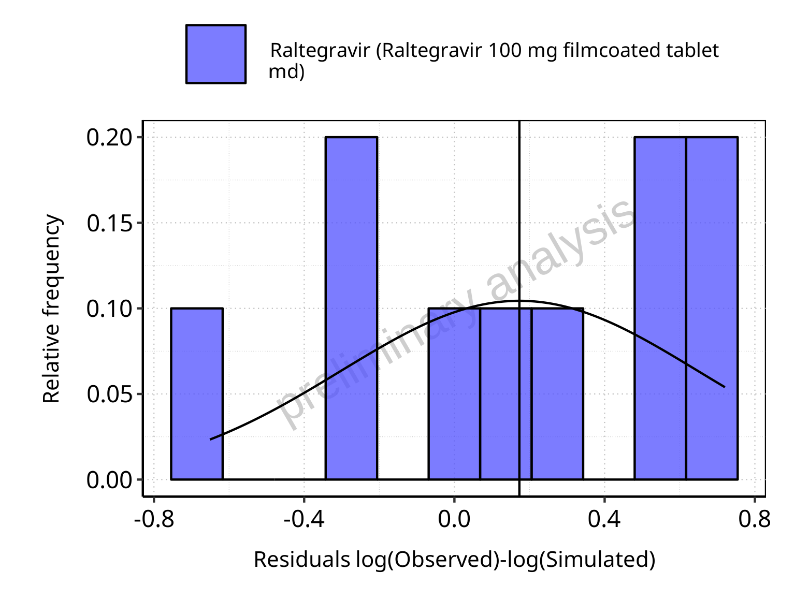


**Figure 5-15: Logarithmic residuals distribution (stacked) for Raltegravir 100 mg filmcoated tablet md. Data source: Data/Raltegravir_PK.txt.**


<br>
<br>


```{=openxml}
<w:br w:type="page"/>
```

`<w:bookmarkStart w:id="figure-5-16" w:name="figure-5-16"/><w:bookmarkEnd w:id="figure-5-16"/>`{=openxml}

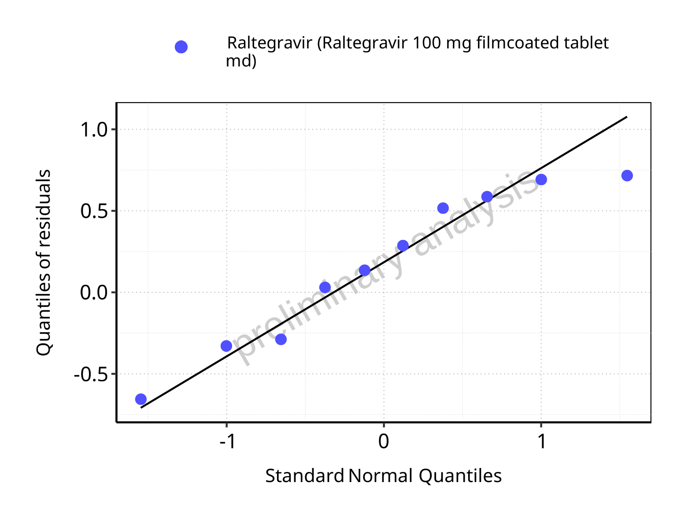


**Figure 5-16: Logarithmic residuals for Raltegravir 100 mg filmcoated tablet md as quantile-quantile plot. Data source: Data/Raltegravir_PK.txt.**


<br>
<br>


### For first application range `<w:bookmarkStart w:id="goodness-of-fit-raltegravir_100_mg_filmcoated_tablet_md-first" w:name="goodness-of-fit-raltegravir_100_mg_filmcoated_tablet_md-first"/><w:bookmarkEnd w:id="goodness-of-fit-raltegravir_100_mg_filmcoated_tablet_md-first"/>`{=openxml}


```{=openxml}
<w:br w:type="page"/>
```

`<w:bookmarkStart w:id="figure-5-17" w:name="figure-5-17"/><w:bookmarkEnd w:id="figure-5-17"/>`{=openxml}

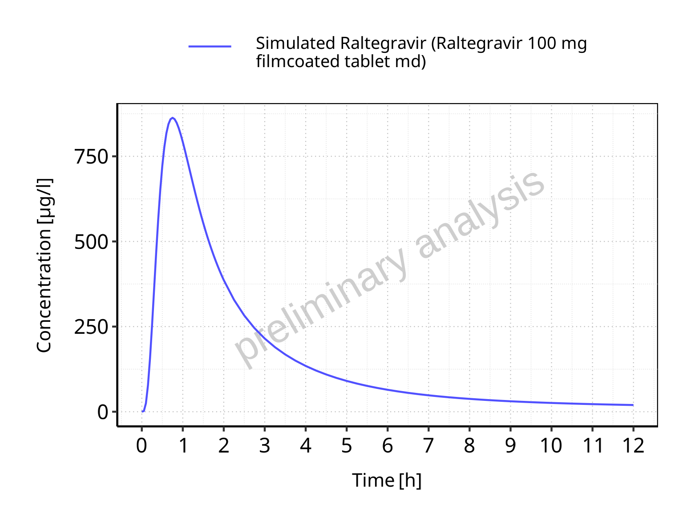


**Figure 5-17: Time profiles for Raltegravir 100 mg filmcoated tablet md. Data source: Data/Raltegravir_PK.txt. Time profiles are plotted in a linear scale.**


<br>
<br>


```{=openxml}
<w:br w:type="page"/>
```

`<w:bookmarkStart w:id="figure-5-18" w:name="figure-5-18"/><w:bookmarkEnd w:id="figure-5-18"/>`{=openxml}

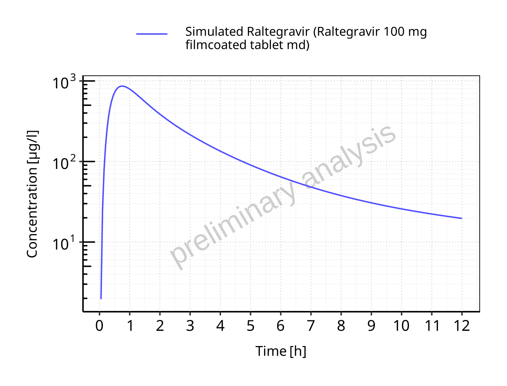


**Figure 5-18: Time profiles for Raltegravir 100 mg filmcoated tablet md. Data source: Data/Raltegravir_PK.txt. Time profiles are plotted in a logarithmic scale.**


<br>
<br>


### For last application range `<w:bookmarkStart w:id="goodness-of-fit-raltegravir_100_mg_filmcoated_tablet_md-last" w:name="goodness-of-fit-raltegravir_100_mg_filmcoated_tablet_md-last"/><w:bookmarkEnd w:id="goodness-of-fit-raltegravir_100_mg_filmcoated_tablet_md-last"/>`{=openxml}


```{=openxml}
<w:br w:type="page"/>
```

`<w:bookmarkStart w:id="figure-5-19" w:name="figure-5-19"/><w:bookmarkEnd w:id="figure-5-19"/>`{=openxml}

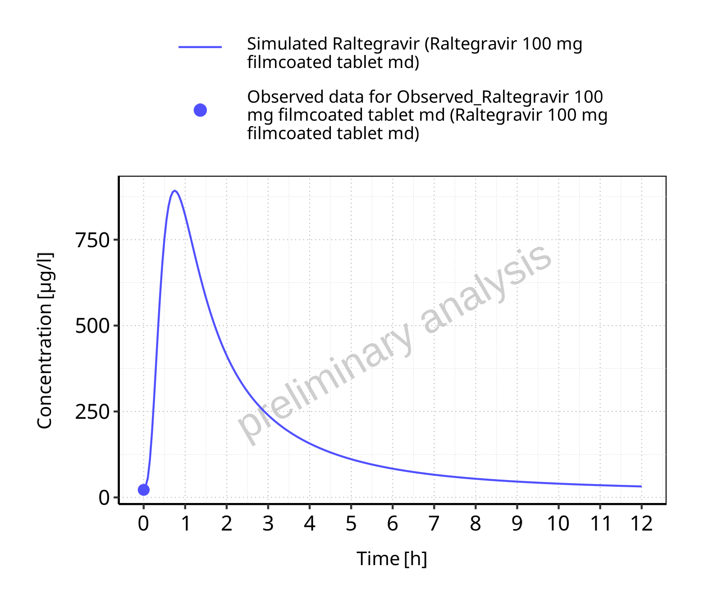


**Figure 5-19: Time profiles for Raltegravir 100 mg filmcoated tablet md. Data source: Data/Raltegravir_PK.txt. Time profiles are plotted in a linear scale.**


<br>
<br>


```{=openxml}
<w:br w:type="page"/>
```

`<w:bookmarkStart w:id="figure-5-20" w:name="figure-5-20"/><w:bookmarkEnd w:id="figure-5-20"/>`{=openxml}

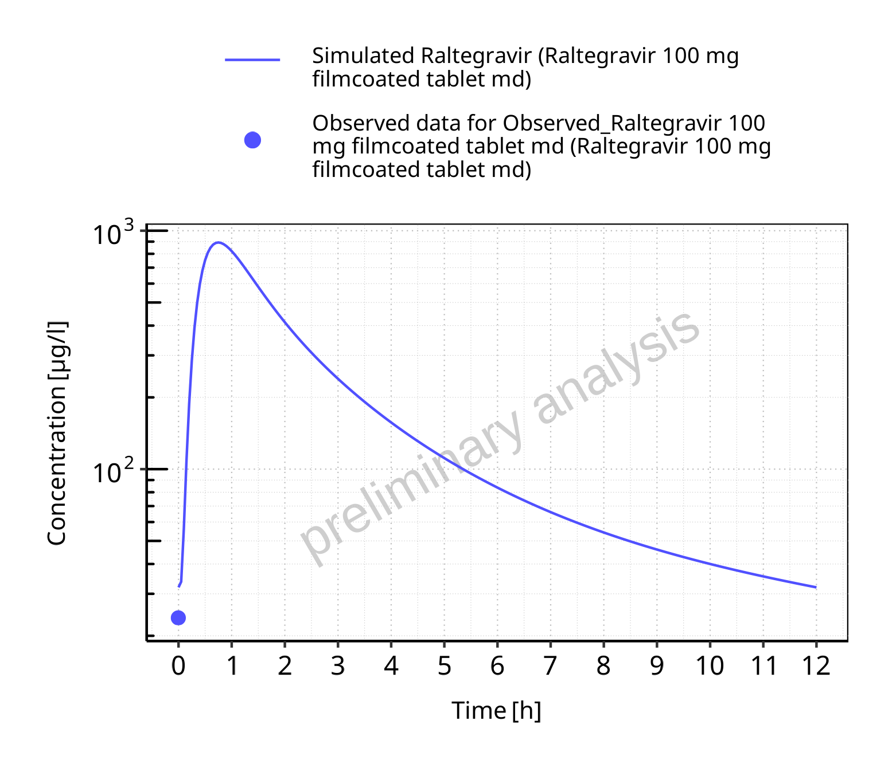


**Figure 5-20: Time profiles for Raltegravir 100 mg filmcoated tablet md. Data source: Data/Raltegravir_PK.txt. Time profiles are plotted in a logarithmic scale.**


<br>
<br>


```{=openxml}
<w:br w:type="page"/>
```

`<w:bookmarkStart w:id="figure-5-21" w:name="figure-5-21"/><w:bookmarkEnd w:id="figure-5-21"/>`{=openxml}

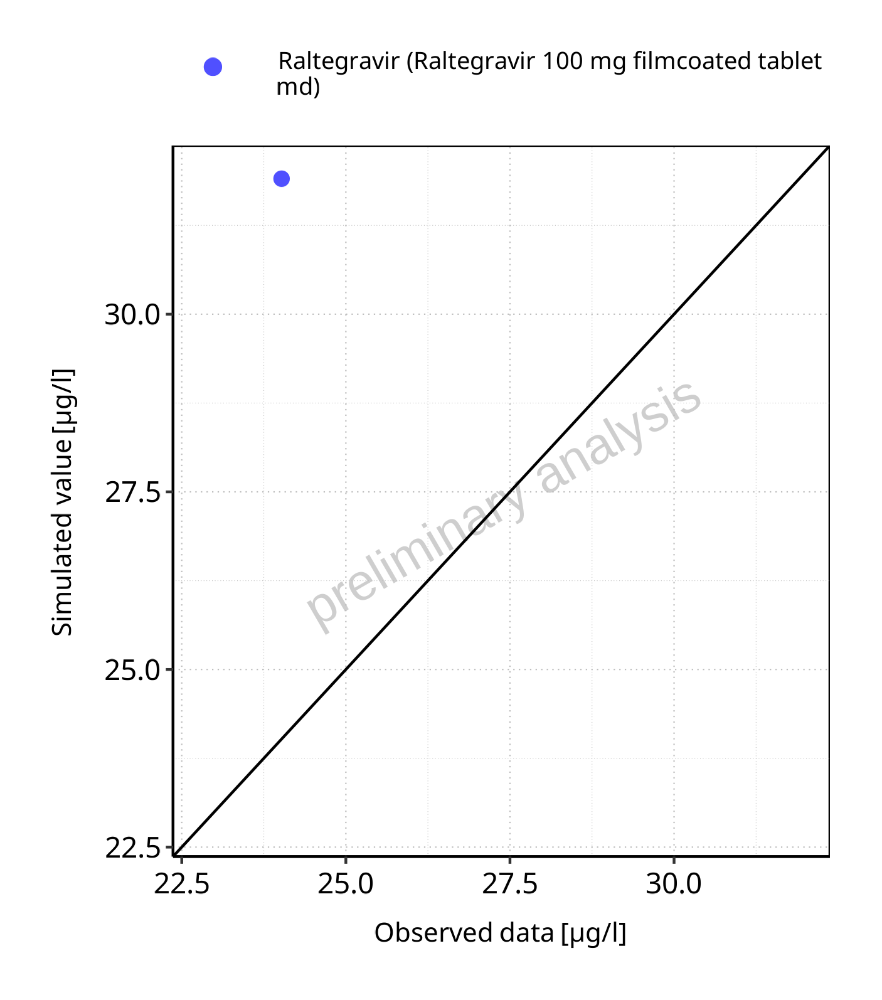


**Figure 5-21: Predicted vs observed for Raltegravir 100 mg filmcoated tablet md. Data source: Data/Raltegravir_PK.txt. Predictions and observations are plotted in a linear scale.**


<br>
<br>


```{=openxml}
<w:br w:type="page"/>
```

`<w:bookmarkStart w:id="figure-5-22" w:name="figure-5-22"/><w:bookmarkEnd w:id="figure-5-22"/>`{=openxml}


**Figure 5-22: Predicted vs observed for Raltegravir 100 mg filmcoated tablet md. Data source: Data/Raltegravir_PK.txt. Predictions and observations are plotted in a logarithmic scale.**


<br>
<br>


```{=openxml}
<w:br w:type="page"/>
```

`<w:bookmarkStart w:id="figure-5-23" w:name="figure-5-23"/><w:bookmarkEnd w:id="figure-5-23"/>`{=openxml}

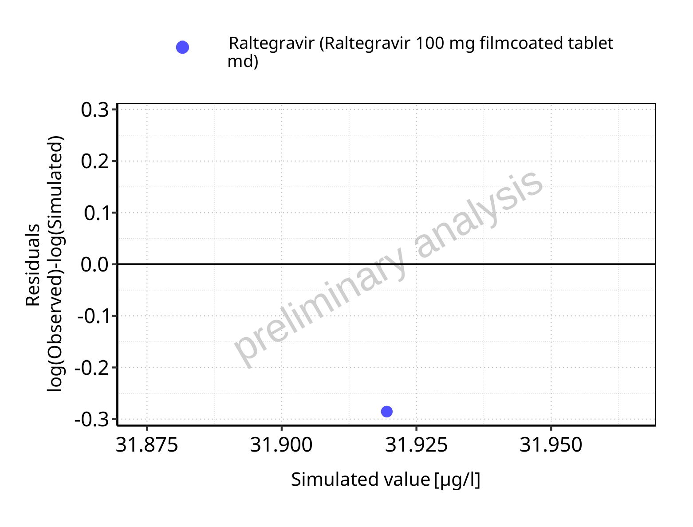


**Figure 5-23: Logarithmic residuals vs predicted values for Raltegravir 100 mg filmcoated tablet md. Data source: Data/Raltegravir_PK.txt.**


<br>
<br>


```{=openxml}
<w:br w:type="page"/>
```

`<w:bookmarkStart w:id="figure-5-24" w:name="figure-5-24"/><w:bookmarkEnd w:id="figure-5-24"/>`{=openxml}


**Figure 5-24: Logarithmic residuals vs time values for Raltegravir 100 mg filmcoated tablet md. Data source: Data/Raltegravir_PK.txt.**


<br>
<br>


```{=openxml}
<w:br w:type="page"/>
```

`<w:bookmarkStart w:id="figure-5-25" w:name="figure-5-25"/><w:bookmarkEnd w:id="figure-5-25"/>`{=openxml}


**Figure 5-25: Logarithmic residuals distribution (stacked) for Raltegravir 100 mg filmcoated tablet md. Data source: Data/Raltegravir_PK.txt.**


<br>
<br>


```{=openxml}
<w:br w:type="page"/>
```

`<w:bookmarkStart w:id="figure-5-26" w:name="figure-5-26"/><w:bookmarkEnd w:id="figure-5-26"/>`{=openxml}

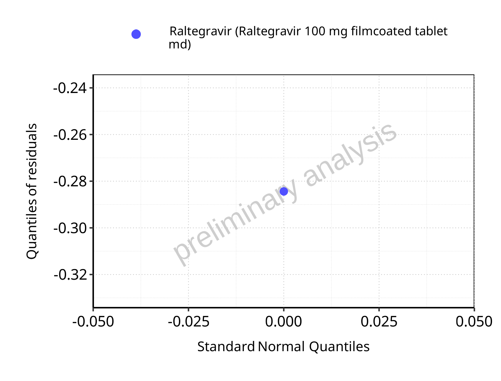


**Figure 5-26: Logarithmic residuals for Raltegravir 100 mg filmcoated tablet md as quantile-quantile plot. Data source: Data/Raltegravir_PK.txt.**


<br>
<br>


## Time profiles and residual plots for Raltegravir 200 mg filmcoated tablet md `<w:bookmarkStart w:id="time-profiles-raltegravir_200_mg_filmcoated_tablet_md" w:name="time-profiles-raltegravir_200_mg_filmcoated_tablet_md"/><w:bookmarkEnd w:id="time-profiles-raltegravir_200_mg_filmcoated_tablet_md"/>`{=openxml}


### For total simulation time range `<w:bookmarkStart w:id="goodness-of-fit-raltegravir_200_mg_filmcoated_tablet_md-total" w:name="goodness-of-fit-raltegravir_200_mg_filmcoated_tablet_md-total"/><w:bookmarkEnd w:id="goodness-of-fit-raltegravir_200_mg_filmcoated_tablet_md-total"/>`{=openxml}


```{=openxml}
<w:br w:type="page"/>
```

`<w:bookmarkStart w:id="figure-5-27" w:name="figure-5-27"/><w:bookmarkEnd w:id="figure-5-27"/>`{=openxml}


**Figure 5-27: Time profiles for Raltegravir 200 mg filmcoated tablet md. Data source: Data/Raltegravir_PK.txt. Time profiles are plotted in a linear scale.**


<br>
<br>


```{=openxml}
<w:br w:type="page"/>
```

`<w:bookmarkStart w:id="figure-5-28" w:name="figure-5-28"/><w:bookmarkEnd w:id="figure-5-28"/>`{=openxml}

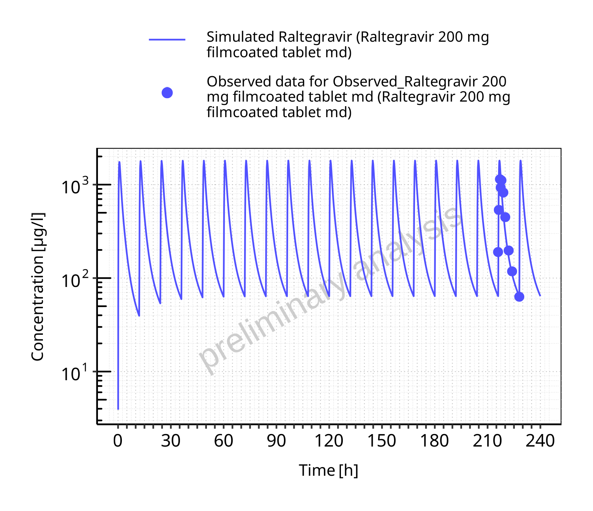


**Figure 5-28: Time profiles for Raltegravir 200 mg filmcoated tablet md. Data source: Data/Raltegravir_PK.txt. Time profiles are plotted in a logarithmic scale.**


<br>
<br>


```{=openxml}
<w:br w:type="page"/>
```

`<w:bookmarkStart w:id="figure-5-29" w:name="figure-5-29"/><w:bookmarkEnd w:id="figure-5-29"/>`{=openxml}

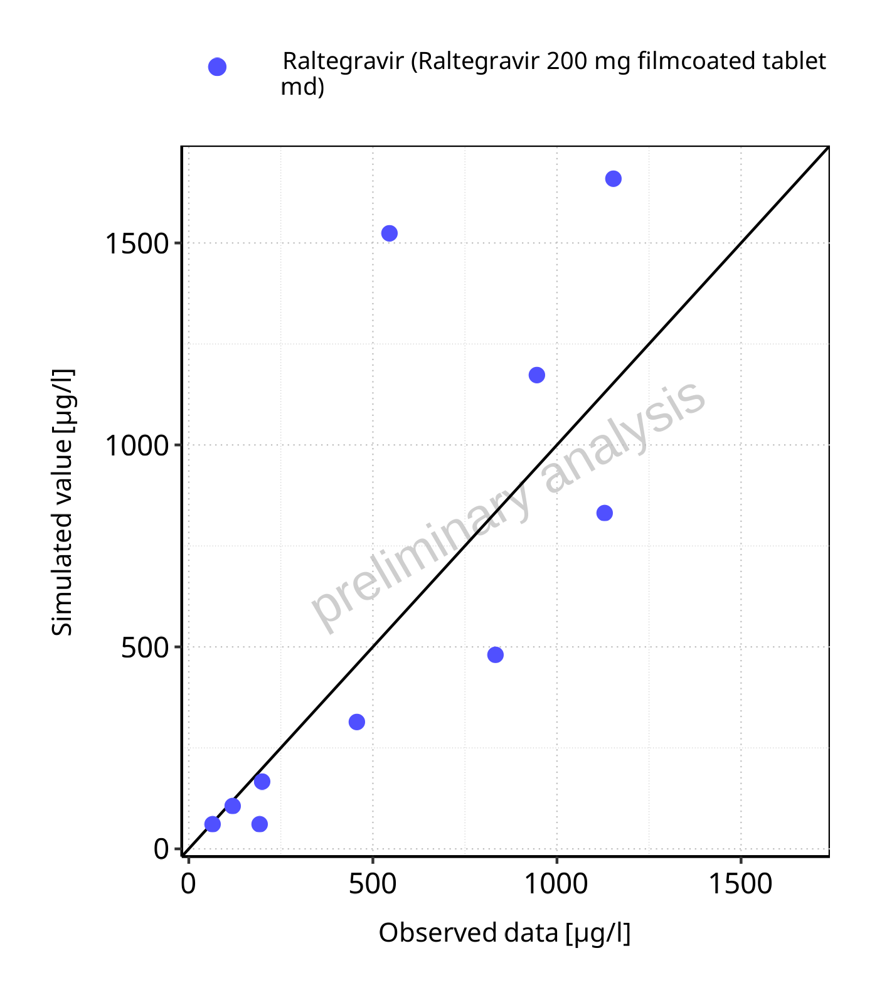


**Figure 5-29: Predicted vs observed for Raltegravir 200 mg filmcoated tablet md. Data source: Data/Raltegravir_PK.txt. Predictions and observations are plotted in a linear scale.**


<br>
<br>


```{=openxml}
<w:br w:type="page"/>
```

`<w:bookmarkStart w:id="figure-5-30" w:name="figure-5-30"/><w:bookmarkEnd w:id="figure-5-30"/>`{=openxml}


**Figure 5-30: Predicted vs observed for Raltegravir 200 mg filmcoated tablet md. Data source: Data/Raltegravir_PK.txt. Predictions and observations are plotted in a logarithmic scale.**


<br>
<br>


```{=openxml}
<w:br w:type="page"/>
```

`<w:bookmarkStart w:id="figure-5-31" w:name="figure-5-31"/><w:bookmarkEnd w:id="figure-5-31"/>`{=openxml}

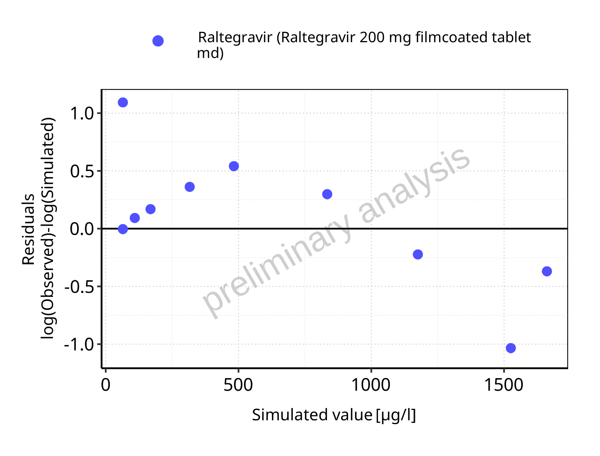


**Figure 5-31: Logarithmic residuals vs predicted values for Raltegravir 200 mg filmcoated tablet md. Data source: Data/Raltegravir_PK.txt.**


<br>
<br>


```{=openxml}
<w:br w:type="page"/>
```

`<w:bookmarkStart w:id="figure-5-32" w:name="figure-5-32"/><w:bookmarkEnd w:id="figure-5-32"/>`{=openxml}

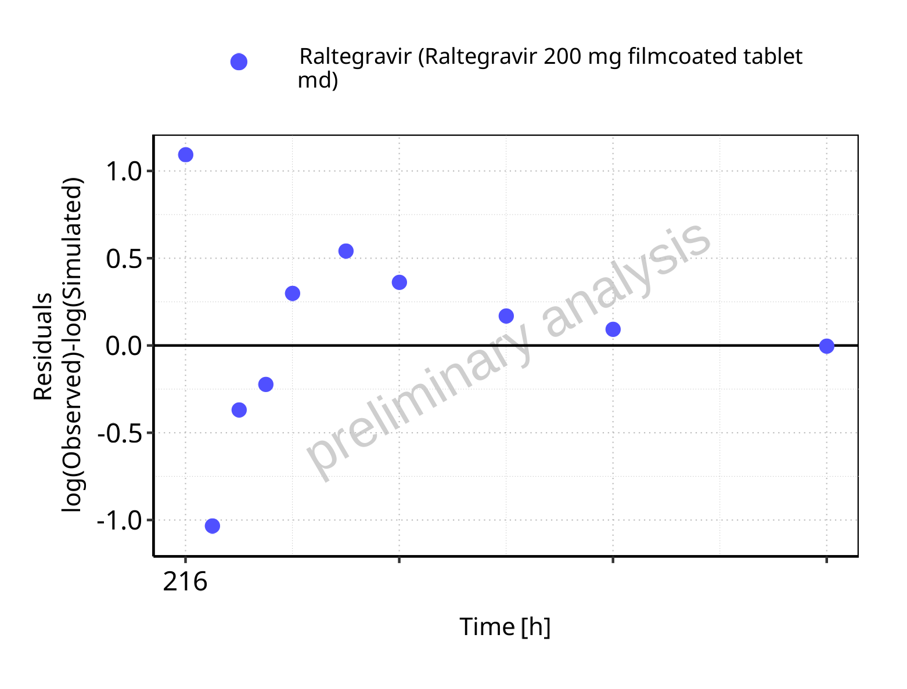


**Figure 5-32: Logarithmic residuals vs time values for Raltegravir 200 mg filmcoated tablet md. Data source: Data/Raltegravir_PK.txt.**


<br>
<br>


```{=openxml}
<w:br w:type="page"/>
```

`<w:bookmarkStart w:id="figure-5-33" w:name="figure-5-33"/><w:bookmarkEnd w:id="figure-5-33"/>`{=openxml}

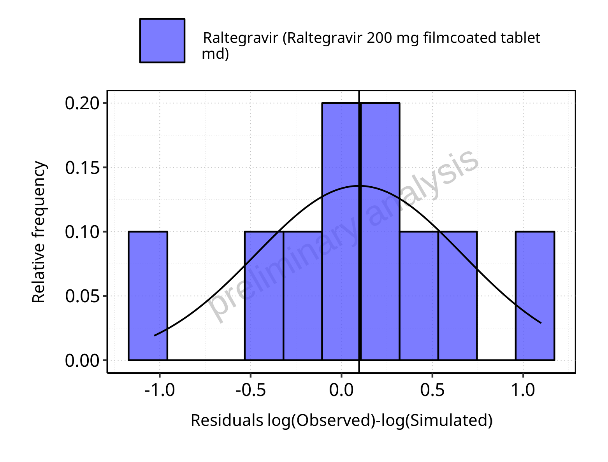


**Figure 5-33: Logarithmic residuals distribution (stacked) for Raltegravir 200 mg filmcoated tablet md. Data source: Data/Raltegravir_PK.txt.**


<br>
<br>


```{=openxml}
<w:br w:type="page"/>
```

`<w:bookmarkStart w:id="figure-5-34" w:name="figure-5-34"/><w:bookmarkEnd w:id="figure-5-34"/>`{=openxml}

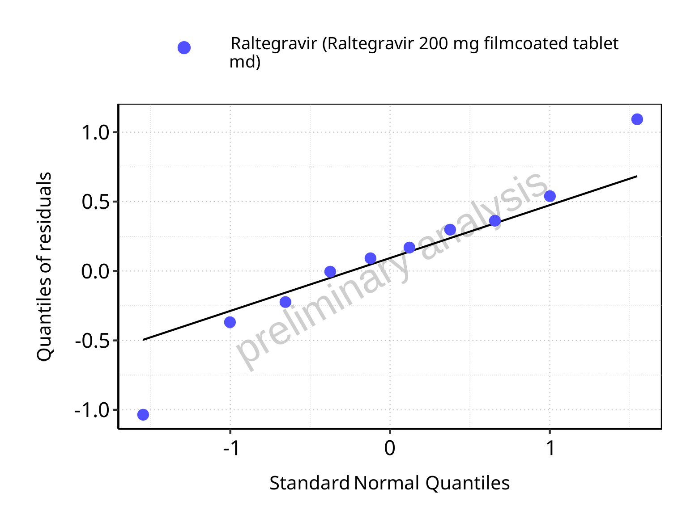


**Figure 5-34: Logarithmic residuals for Raltegravir 200 mg filmcoated tablet md as quantile-quantile plot. Data source: Data/Raltegravir_PK.txt.**


<br>
<br>


### For first application range `<w:bookmarkStart w:id="goodness-of-fit-raltegravir_200_mg_filmcoated_tablet_md-first" w:name="goodness-of-fit-raltegravir_200_mg_filmcoated_tablet_md-first"/><w:bookmarkEnd w:id="goodness-of-fit-raltegravir_200_mg_filmcoated_tablet_md-first"/>`{=openxml}


```{=openxml}
<w:br w:type="page"/>
```

`<w:bookmarkStart w:id="figure-5-35" w:name="figure-5-35"/><w:bookmarkEnd w:id="figure-5-35"/>`{=openxml}

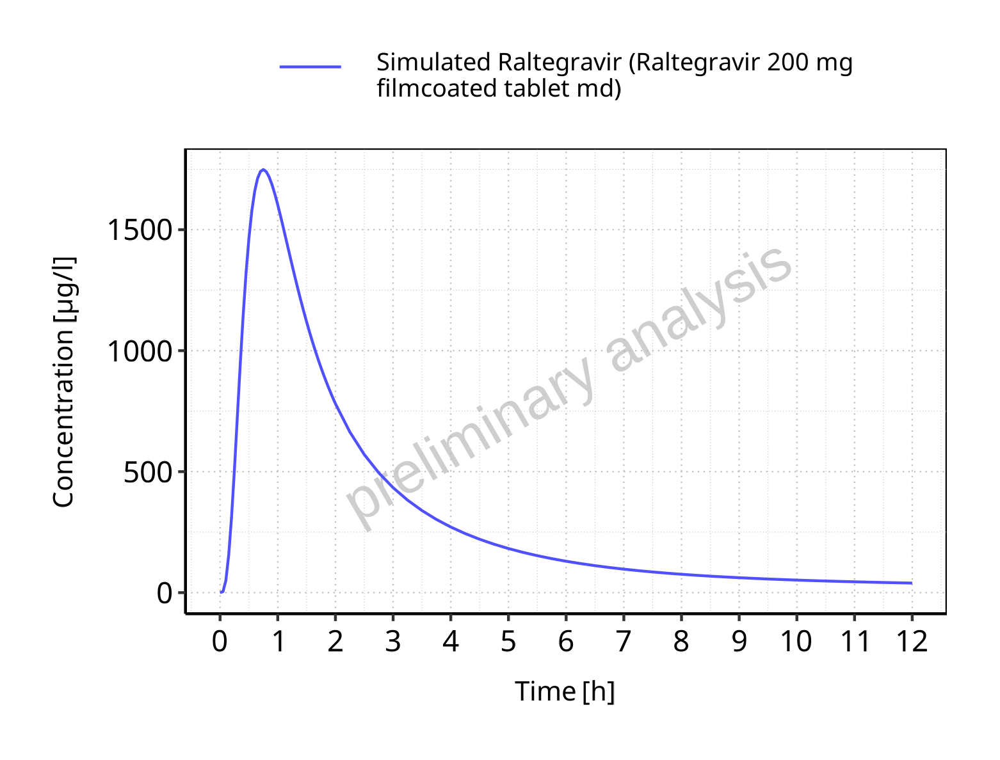


**Figure 5-35: Time profiles for Raltegravir 200 mg filmcoated tablet md. Data source: Data/Raltegravir_PK.txt. Time profiles are plotted in a linear scale.**


<br>
<br>


```{=openxml}
<w:br w:type="page"/>
```

`<w:bookmarkStart w:id="figure-5-36" w:name="figure-5-36"/><w:bookmarkEnd w:id="figure-5-36"/>`{=openxml}

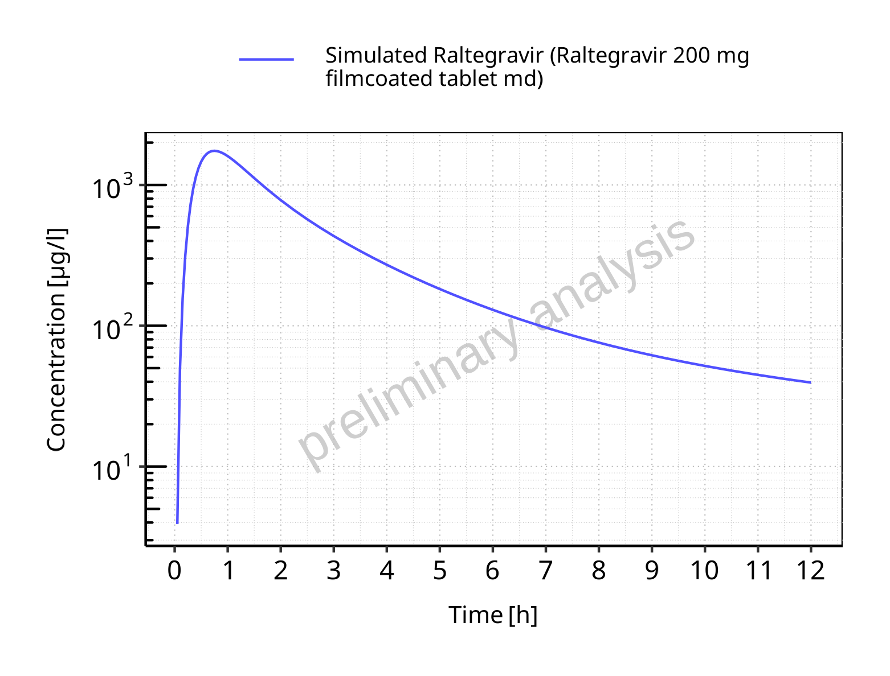


**Figure 5-36: Time profiles for Raltegravir 200 mg filmcoated tablet md. Data source: Data/Raltegravir_PK.txt. Time profiles are plotted in a logarithmic scale.**


<br>
<br>


### For last application range `<w:bookmarkStart w:id="goodness-of-fit-raltegravir_200_mg_filmcoated_tablet_md-last" w:name="goodness-of-fit-raltegravir_200_mg_filmcoated_tablet_md-last"/><w:bookmarkEnd w:id="goodness-of-fit-raltegravir_200_mg_filmcoated_tablet_md-last"/>`{=openxml}


```{=openxml}
<w:br w:type="page"/>
```

`<w:bookmarkStart w:id="figure-5-37" w:name="figure-5-37"/><w:bookmarkEnd w:id="figure-5-37"/>`{=openxml}


**Figure 5-37: Time profiles for Raltegravir 200 mg filmcoated tablet md. Data source: Data/Raltegravir_PK.txt. Time profiles are plotted in a linear scale.**


<br>
<br>


```{=openxml}
<w:br w:type="page"/>
```

`<w:bookmarkStart w:id="figure-5-38" w:name="figure-5-38"/><w:bookmarkEnd w:id="figure-5-38"/>`{=openxml}

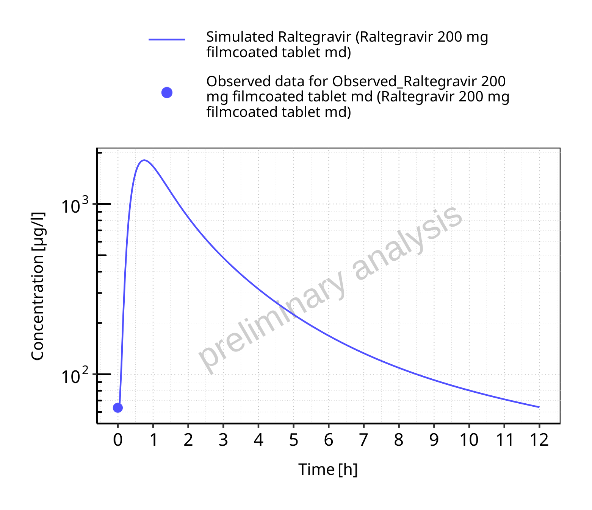


**Figure 5-38: Time profiles for Raltegravir 200 mg filmcoated tablet md. Data source: Data/Raltegravir_PK.txt. Time profiles are plotted in a logarithmic scale.**


<br>
<br>


```{=openxml}
<w:br w:type="page"/>
```

`<w:bookmarkStart w:id="figure-5-39" w:name="figure-5-39"/><w:bookmarkEnd w:id="figure-5-39"/>`{=openxml}

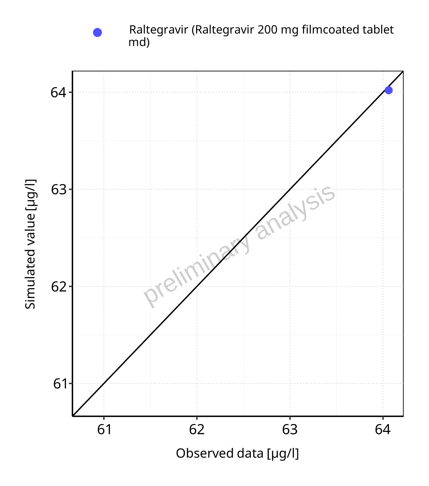


**Figure 5-39: Predicted vs observed for Raltegravir 200 mg filmcoated tablet md. Data source: Data/Raltegravir_PK.txt. Predictions and observations are plotted in a linear scale.**


<br>
<br>


```{=openxml}
<w:br w:type="page"/>
```

`<w:bookmarkStart w:id="figure-5-40" w:name="figure-5-40"/><w:bookmarkEnd w:id="figure-5-40"/>`{=openxml}


**Figure 5-40: Predicted vs observed for Raltegravir 200 mg filmcoated tablet md. Data source: Data/Raltegravir_PK.txt. Predictions and observations are plotted in a logarithmic scale.**


<br>
<br>


```{=openxml}
<w:br w:type="page"/>
```

`<w:bookmarkStart w:id="figure-5-41" w:name="figure-5-41"/><w:bookmarkEnd w:id="figure-5-41"/>`{=openxml}

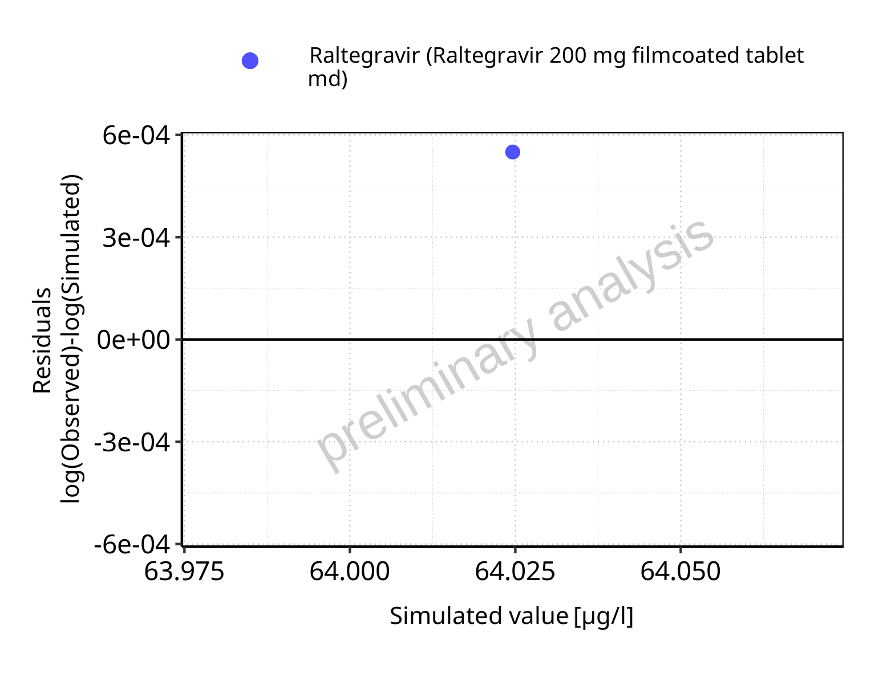


**Figure 5-41: Logarithmic residuals vs predicted values for Raltegravir 200 mg filmcoated tablet md. Data source: Data/Raltegravir_PK.txt.**


<br>
<br>


```{=openxml}
<w:br w:type="page"/>
```

`<w:bookmarkStart w:id="figure-5-42" w:name="figure-5-42"/><w:bookmarkEnd w:id="figure-5-42"/>`{=openxml}

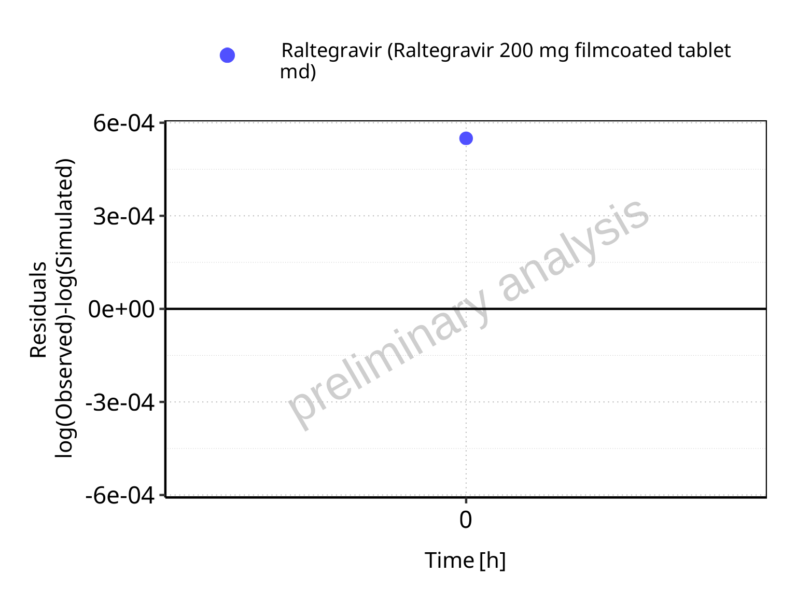


**Figure 5-42: Logarithmic residuals vs time values for Raltegravir 200 mg filmcoated tablet md. Data source: Data/Raltegravir_PK.txt.**


<br>
<br>


```{=openxml}
<w:br w:type="page"/>
```

`<w:bookmarkStart w:id="figure-5-43" w:name="figure-5-43"/><w:bookmarkEnd w:id="figure-5-43"/>`{=openxml}


**Figure 5-43: Logarithmic residuals distribution (stacked) for Raltegravir 200 mg filmcoated tablet md. Data source: Data/Raltegravir_PK.txt.**


<br>
<br>


```{=openxml}
<w:br w:type="page"/>
```

`<w:bookmarkStart w:id="figure-5-44" w:name="figure-5-44"/><w:bookmarkEnd w:id="figure-5-44"/>`{=openxml}

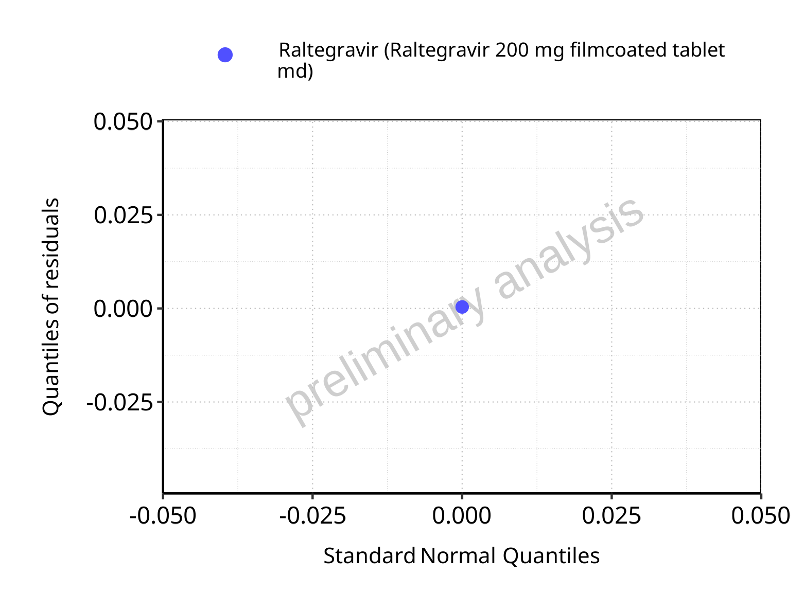


**Figure 5-44: Logarithmic residuals for Raltegravir 200 mg filmcoated tablet md as quantile-quantile plot. Data source: Data/Raltegravir_PK.txt.**


<br>
<br>


## Time profiles and residual plots for Filmcoated_tablet_400mg_sd `<w:bookmarkStart w:id="time-profiles-filmcoated_tablet_400mg_sd" w:name="time-profiles-filmcoated_tablet_400mg_sd"/><w:bookmarkEnd w:id="time-profiles-filmcoated_tablet_400mg_sd"/>`{=openxml}


```{=openxml}
<w:br w:type="page"/>
```

`<w:bookmarkStart w:id="figure-5-45" w:name="figure-5-45"/><w:bookmarkEnd w:id="figure-5-45"/>`{=openxml}

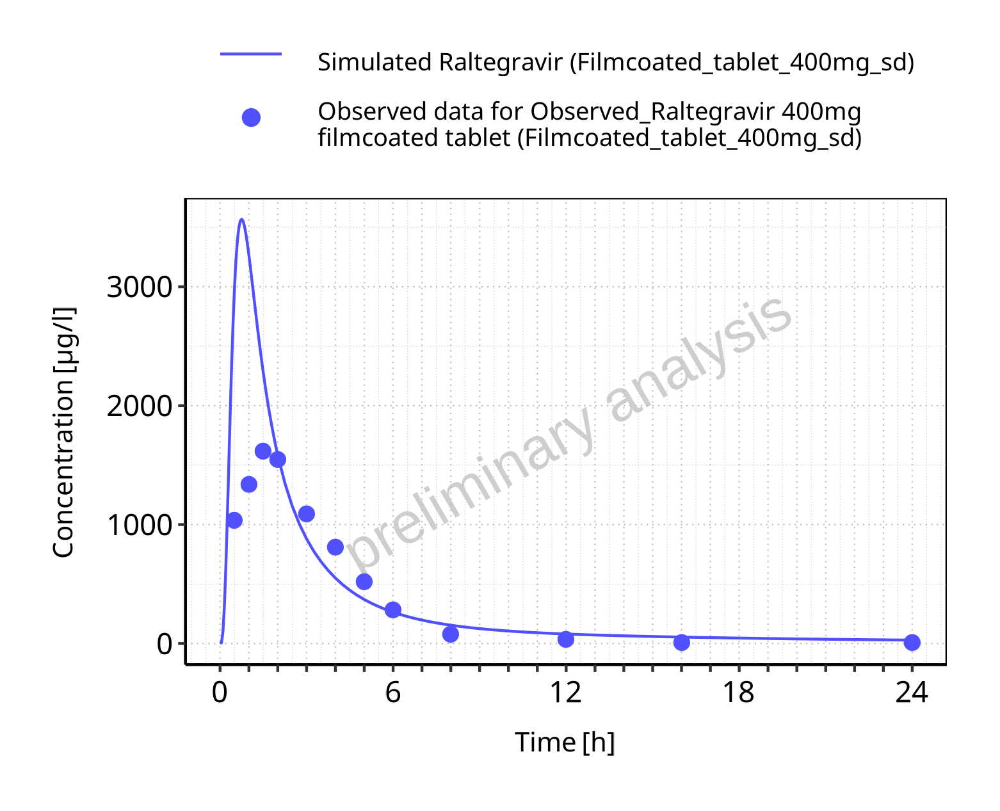


**Figure 5-45: Time profiles for Filmcoated_tablet_400mg_sd. Data source: Data/Raltegravir_PK.txt. Time profiles are plotted in a linear scale.**


<br>
<br>


```{=openxml}
<w:br w:type="page"/>
```

`<w:bookmarkStart w:id="figure-5-46" w:name="figure-5-46"/><w:bookmarkEnd w:id="figure-5-46"/>`{=openxml}

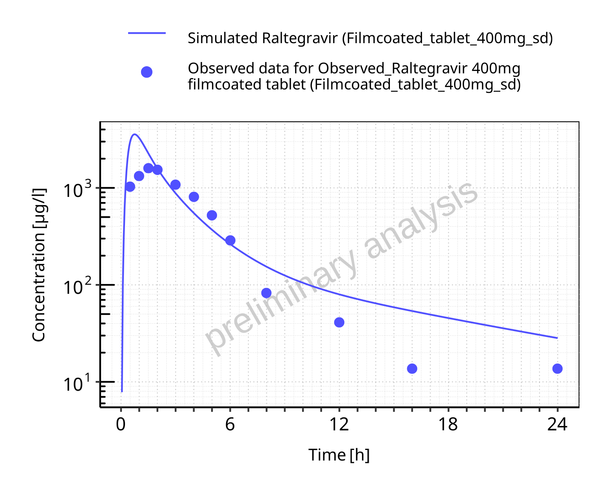


**Figure 5-46: Time profiles for Filmcoated_tablet_400mg_sd. Data source: Data/Raltegravir_PK.txt. Time profiles are plotted in a logarithmic scale.**


<br>
<br>


```{=openxml}
<w:br w:type="page"/>
```

`<w:bookmarkStart w:id="figure-5-47" w:name="figure-5-47"/><w:bookmarkEnd w:id="figure-5-47"/>`{=openxml}

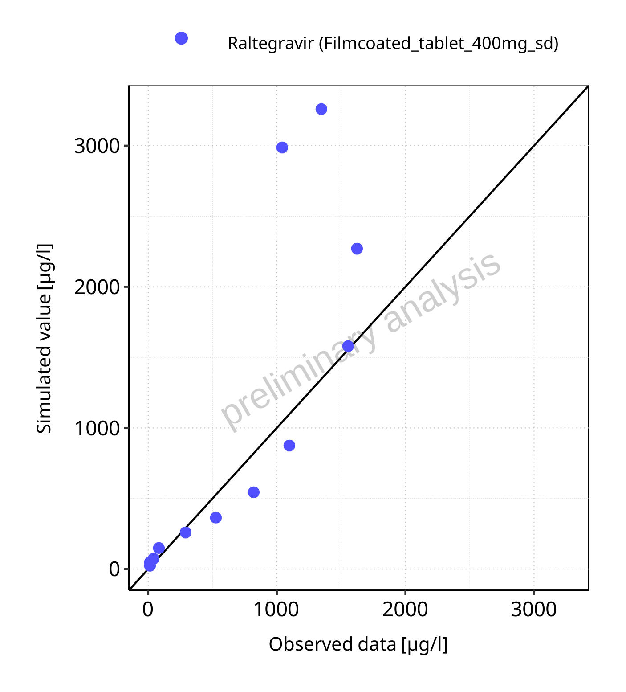


**Figure 5-47: Predicted vs observed for Filmcoated_tablet_400mg_sd. Data source: Data/Raltegravir_PK.txt. Predictions and observations are plotted in a linear scale.**


<br>
<br>


```{=openxml}
<w:br w:type="page"/>
```

`<w:bookmarkStart w:id="figure-5-48" w:name="figure-5-48"/><w:bookmarkEnd w:id="figure-5-48"/>`{=openxml}


**Figure 5-48: Predicted vs observed for Filmcoated_tablet_400mg_sd. Data source: Data/Raltegravir_PK.txt. Predictions and observations are plotted in a logarithmic scale.**


<br>
<br>


```{=openxml}
<w:br w:type="page"/>
```

`<w:bookmarkStart w:id="figure-5-49" w:name="figure-5-49"/><w:bookmarkEnd w:id="figure-5-49"/>`{=openxml}

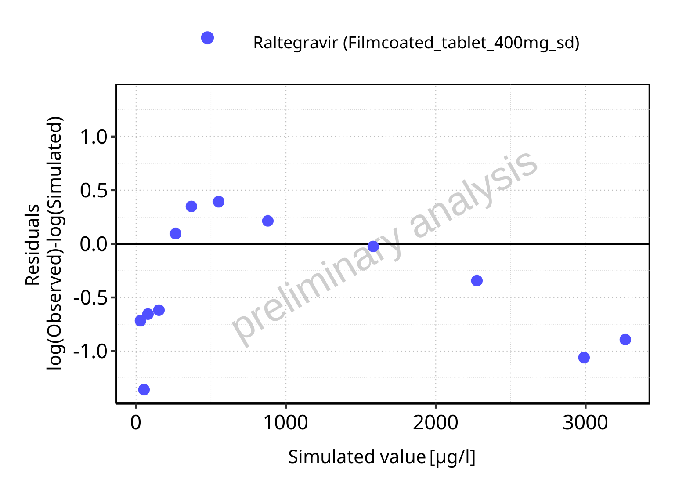


**Figure 5-49: Logarithmic residuals vs predicted values for Filmcoated_tablet_400mg_sd. Data source: Data/Raltegravir_PK.txt.**


<br>
<br>


```{=openxml}
<w:br w:type="page"/>
```

`<w:bookmarkStart w:id="figure-5-50" w:name="figure-5-50"/><w:bookmarkEnd w:id="figure-5-50"/>`{=openxml}

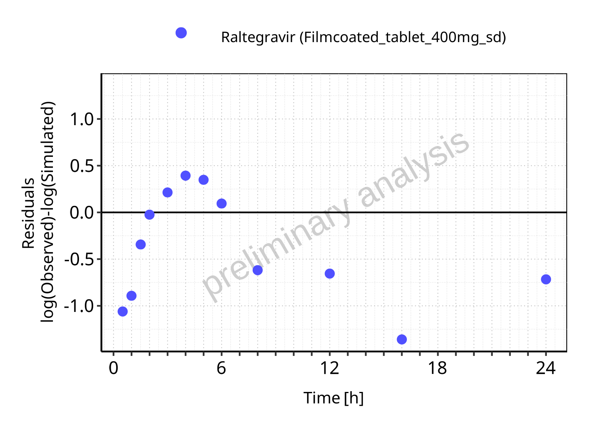


**Figure 5-50: Logarithmic residuals vs time values for Filmcoated_tablet_400mg_sd. Data source: Data/Raltegravir_PK.txt.**


<br>
<br>


```{=openxml}
<w:br w:type="page"/>
```

`<w:bookmarkStart w:id="figure-5-51" w:name="figure-5-51"/><w:bookmarkEnd w:id="figure-5-51"/>`{=openxml}

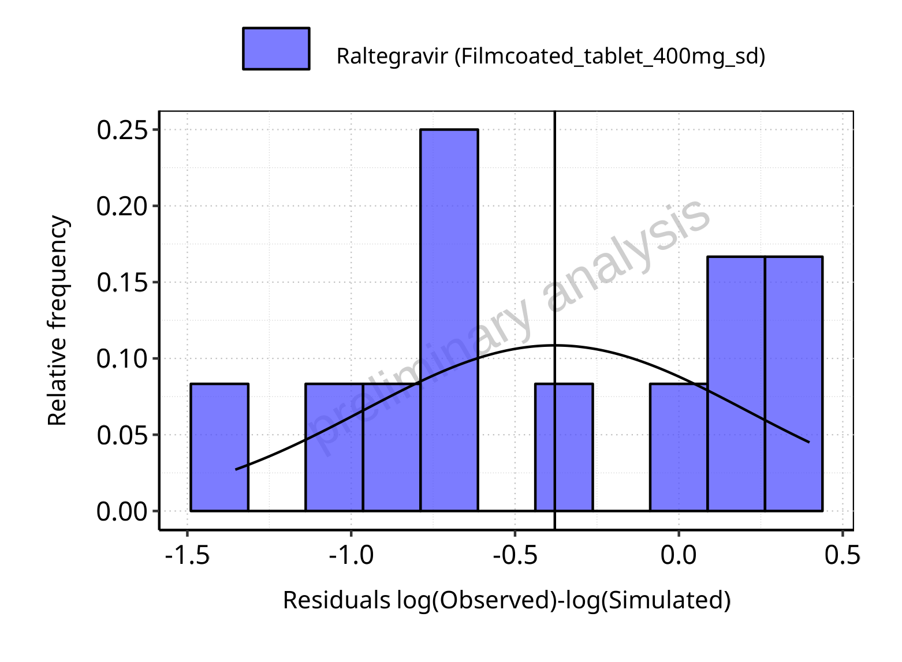


**Figure 5-51: Logarithmic residuals distribution (stacked) for Filmcoated_tablet_400mg_sd. Data source: Data/Raltegravir_PK.txt.**


<br>
<br>


```{=openxml}
<w:br w:type="page"/>
```

`<w:bookmarkStart w:id="figure-5-52" w:name="figure-5-52"/><w:bookmarkEnd w:id="figure-5-52"/>`{=openxml}

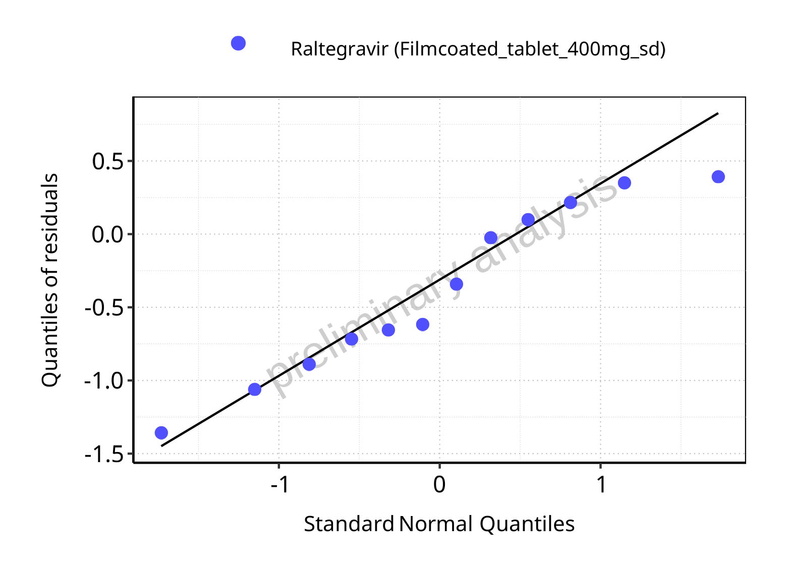


**Figure 5-52: Logarithmic residuals for Filmcoated_tablet_400mg_sd as quantile-quantile plot. Data source: Data/Raltegravir_PK.txt.**


<br>
<br>


## Time profiles and residual plots for Raltegravir 400 mg filmcoated tablet md `<w:bookmarkStart w:id="time-profiles-raltegravir_400_mg_filmcoated_tablet_md" w:name="time-profiles-raltegravir_400_mg_filmcoated_tablet_md"/><w:bookmarkEnd w:id="time-profiles-raltegravir_400_mg_filmcoated_tablet_md"/>`{=openxml}


### For total simulation time range `<w:bookmarkStart w:id="goodness-of-fit-raltegravir_400_mg_filmcoated_tablet_md-total" w:name="goodness-of-fit-raltegravir_400_mg_filmcoated_tablet_md-total"/><w:bookmarkEnd w:id="goodness-of-fit-raltegravir_400_mg_filmcoated_tablet_md-total"/>`{=openxml}


```{=openxml}
<w:br w:type="page"/>
```

`<w:bookmarkStart w:id="figure-5-53" w:name="figure-5-53"/><w:bookmarkEnd w:id="figure-5-53"/>`{=openxml}

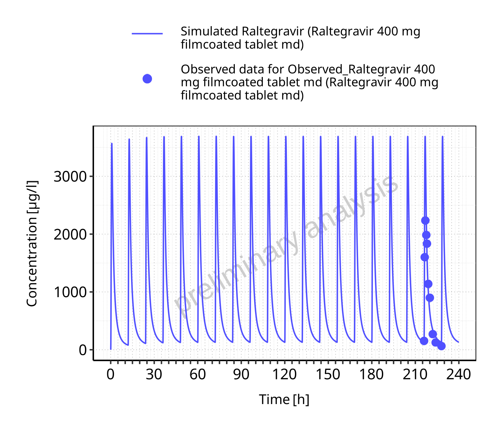


**Figure 5-53: Time profiles for Raltegravir 400 mg filmcoated tablet md. Data source: Data/Raltegravir_PK.txt. Time profiles are plotted in a linear scale.**


<br>
<br>


```{=openxml}
<w:br w:type="page"/>
```

`<w:bookmarkStart w:id="figure-5-54" w:name="figure-5-54"/><w:bookmarkEnd w:id="figure-5-54"/>`{=openxml}

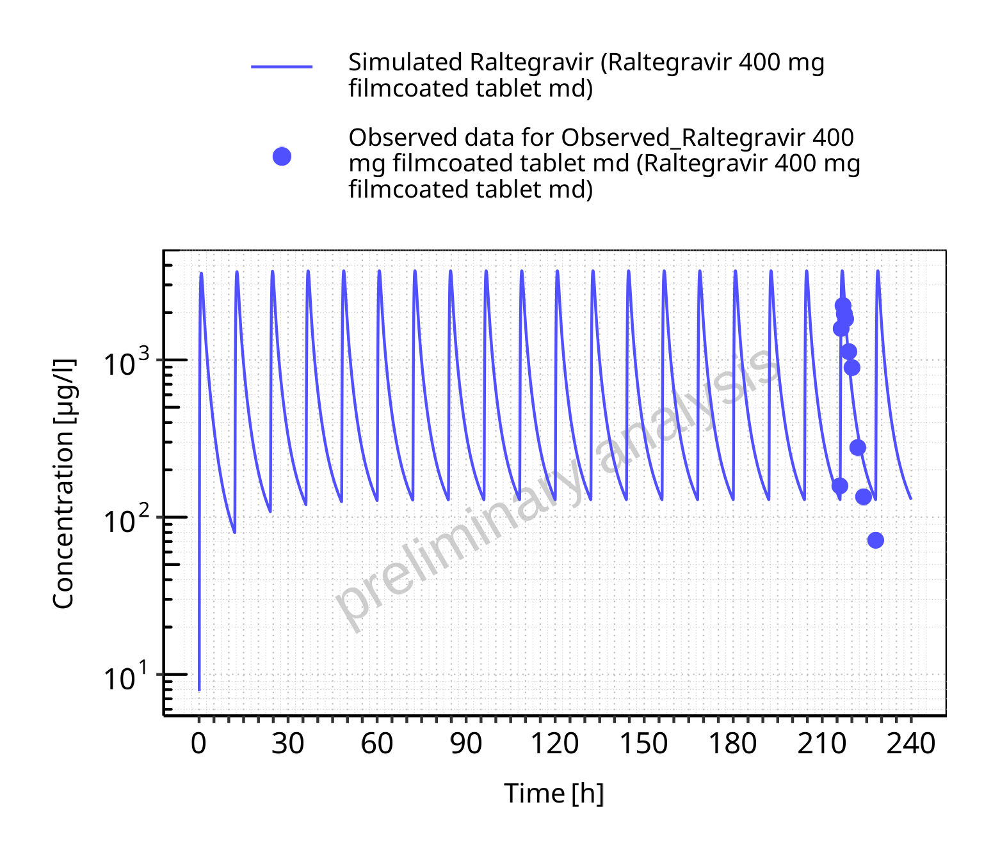


**Figure 5-54: Time profiles for Raltegravir 400 mg filmcoated tablet md. Data source: Data/Raltegravir_PK.txt. Time profiles are plotted in a logarithmic scale.**


<br>
<br>


```{=openxml}
<w:br w:type="page"/>
```

`<w:bookmarkStart w:id="figure-5-55" w:name="figure-5-55"/><w:bookmarkEnd w:id="figure-5-55"/>`{=openxml}

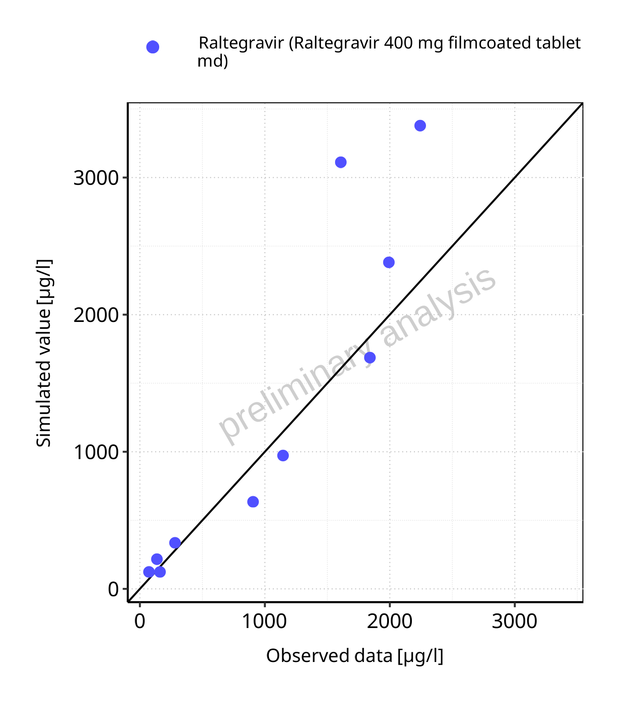


**Figure 5-55: Predicted vs observed for Raltegravir 400 mg filmcoated tablet md. Data source: Data/Raltegravir_PK.txt. Predictions and observations are plotted in a linear scale.**


<br>
<br>


```{=openxml}
<w:br w:type="page"/>
```

`<w:bookmarkStart w:id="figure-5-56" w:name="figure-5-56"/><w:bookmarkEnd w:id="figure-5-56"/>`{=openxml}


**Figure 5-56: Predicted vs observed for Raltegravir 400 mg filmcoated tablet md. Data source: Data/Raltegravir_PK.txt. Predictions and observations are plotted in a logarithmic scale.**


<br>
<br>


```{=openxml}
<w:br w:type="page"/>
```

`<w:bookmarkStart w:id="figure-5-57" w:name="figure-5-57"/><w:bookmarkEnd w:id="figure-5-57"/>`{=openxml}

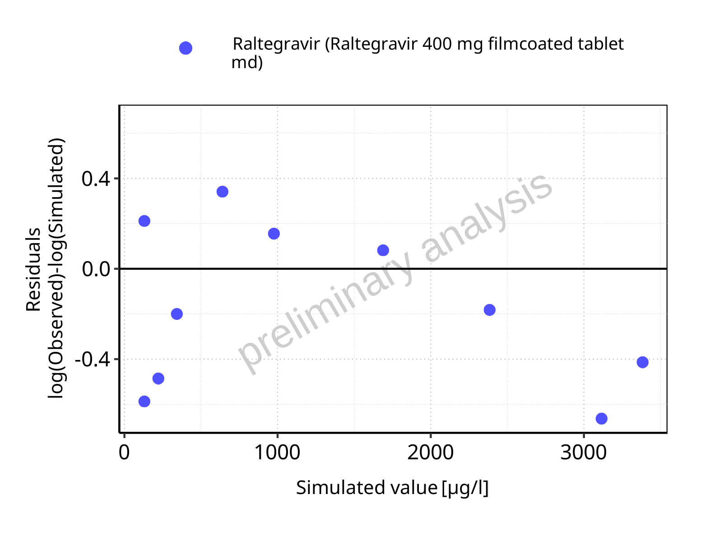


**Figure 5-57: Logarithmic residuals vs predicted values for Raltegravir 400 mg filmcoated tablet md. Data source: Data/Raltegravir_PK.txt.**


<br>
<br>


```{=openxml}
<w:br w:type="page"/>
```

`<w:bookmarkStart w:id="figure-5-58" w:name="figure-5-58"/><w:bookmarkEnd w:id="figure-5-58"/>`{=openxml}

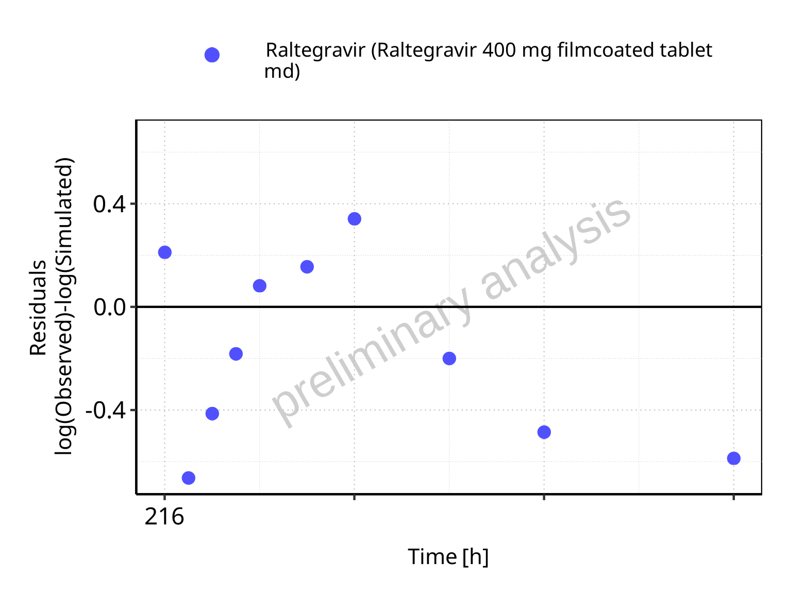


**Figure 5-58: Logarithmic residuals vs time values for Raltegravir 400 mg filmcoated tablet md. Data source: Data/Raltegravir_PK.txt.**


<br>
<br>


```{=openxml}
<w:br w:type="page"/>
```

`<w:bookmarkStart w:id="figure-5-59" w:name="figure-5-59"/><w:bookmarkEnd w:id="figure-5-59"/>`{=openxml}

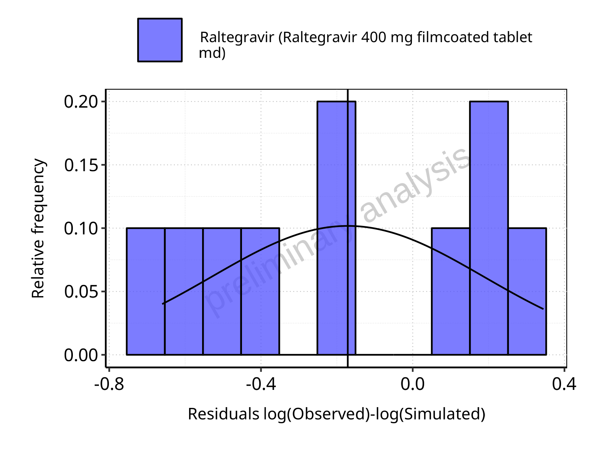


**Figure 5-59: Logarithmic residuals distribution (stacked) for Raltegravir 400 mg filmcoated tablet md. Data source: Data/Raltegravir_PK.txt.**


<br>
<br>


```{=openxml}
<w:br w:type="page"/>
```

`<w:bookmarkStart w:id="figure-5-60" w:name="figure-5-60"/><w:bookmarkEnd w:id="figure-5-60"/>`{=openxml}

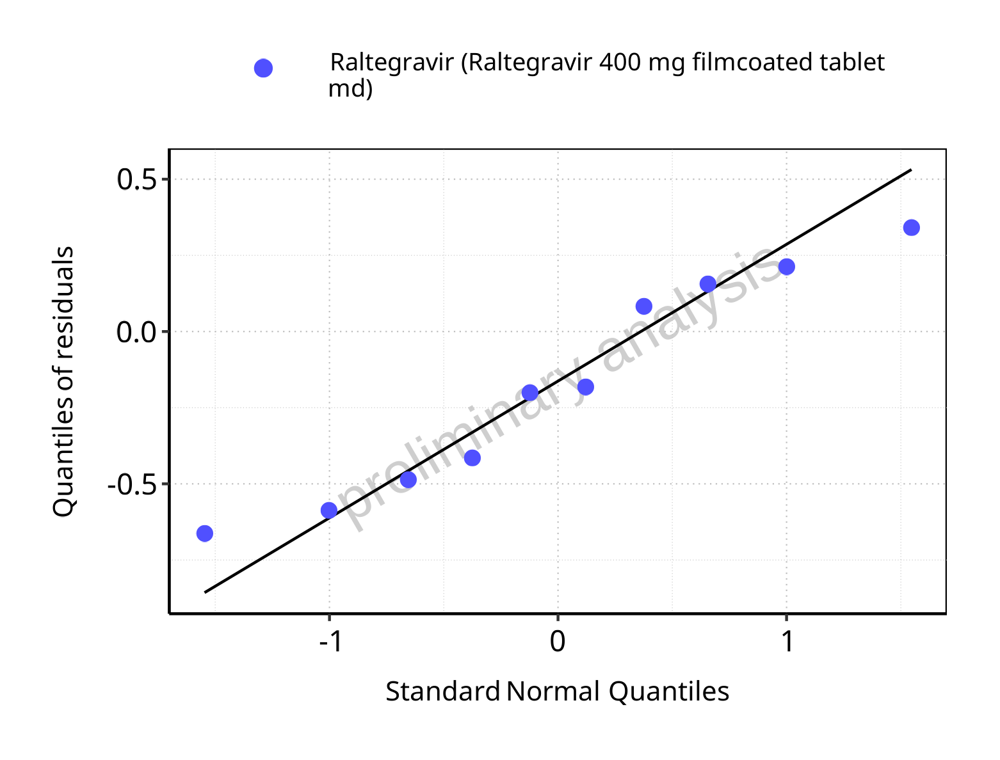


**Figure 5-60: Logarithmic residuals for Raltegravir 400 mg filmcoated tablet md as quantile-quantile plot. Data source: Data/Raltegravir_PK.txt.**


<br>
<br>


### For first application range `<w:bookmarkStart w:id="goodness-of-fit-raltegravir_400_mg_filmcoated_tablet_md-first" w:name="goodness-of-fit-raltegravir_400_mg_filmcoated_tablet_md-first"/><w:bookmarkEnd w:id="goodness-of-fit-raltegravir_400_mg_filmcoated_tablet_md-first"/>`{=openxml}


```{=openxml}
<w:br w:type="page"/>
```

`<w:bookmarkStart w:id="figure-5-61" w:name="figure-5-61"/><w:bookmarkEnd w:id="figure-5-61"/>`{=openxml}

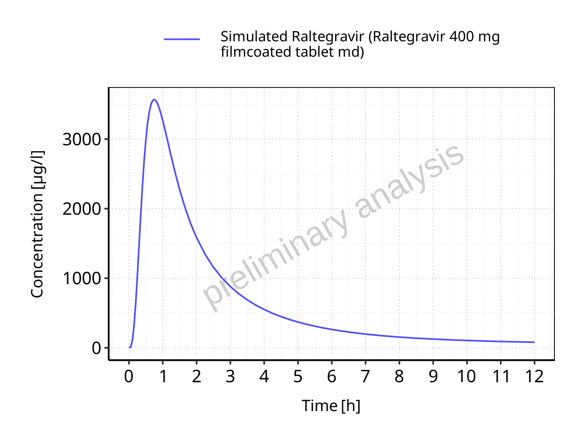


**Figure 5-61: Time profiles for Raltegravir 400 mg filmcoated tablet md. Data source: Data/Raltegravir_PK.txt. Time profiles are plotted in a linear scale.**


<br>
<br>


```{=openxml}
<w:br w:type="page"/>
```

`<w:bookmarkStart w:id="figure-5-62" w:name="figure-5-62"/><w:bookmarkEnd w:id="figure-5-62"/>`{=openxml}

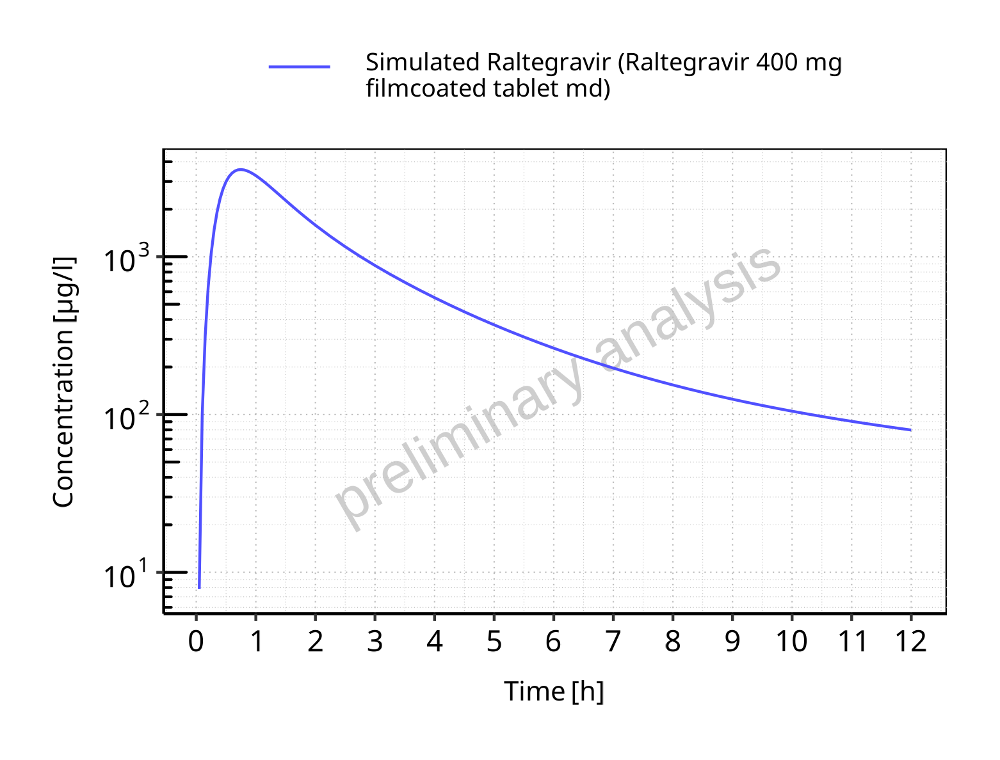


**Figure 5-62: Time profiles for Raltegravir 400 mg filmcoated tablet md. Data source: Data/Raltegravir_PK.txt. Time profiles are plotted in a logarithmic scale.**


<br>
<br>


### For last application range `<w:bookmarkStart w:id="goodness-of-fit-raltegravir_400_mg_filmcoated_tablet_md-last" w:name="goodness-of-fit-raltegravir_400_mg_filmcoated_tablet_md-last"/><w:bookmarkEnd w:id="goodness-of-fit-raltegravir_400_mg_filmcoated_tablet_md-last"/>`{=openxml}


```{=openxml}
<w:br w:type="page"/>
```

`<w:bookmarkStart w:id="figure-5-63" w:name="figure-5-63"/><w:bookmarkEnd w:id="figure-5-63"/>`{=openxml}

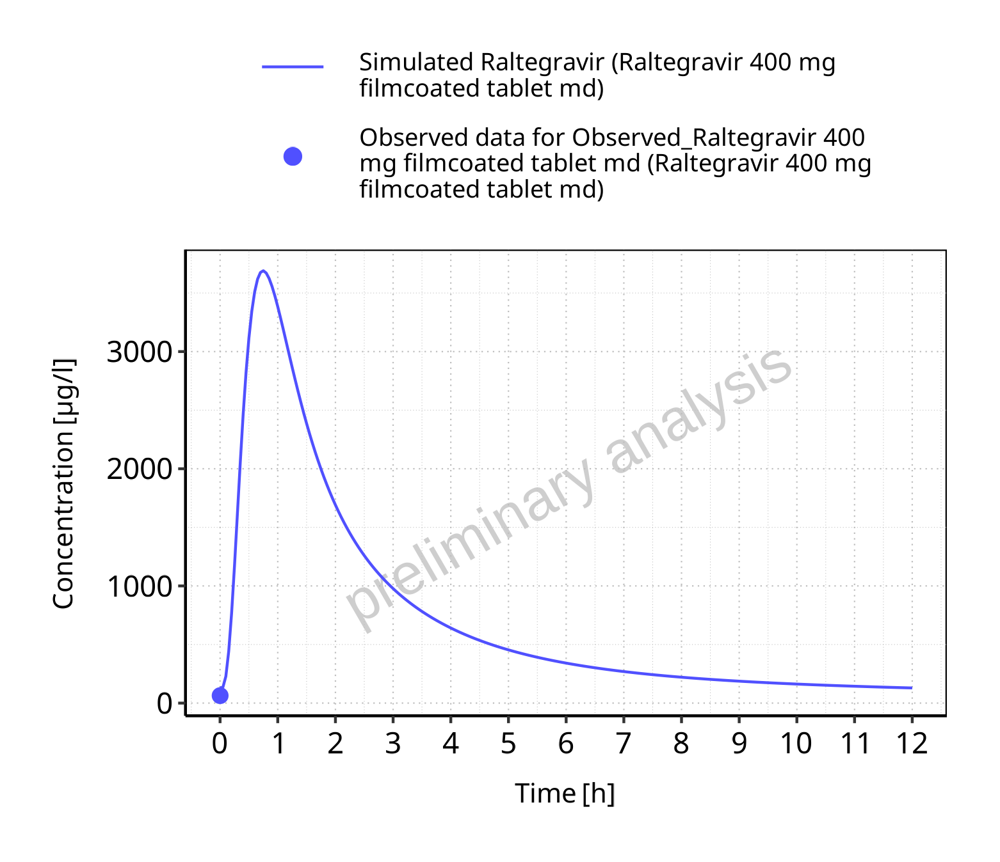


**Figure 5-63: Time profiles for Raltegravir 400 mg filmcoated tablet md. Data source: Data/Raltegravir_PK.txt. Time profiles are plotted in a linear scale.**


<br>
<br>


```{=openxml}
<w:br w:type="page"/>
```

`<w:bookmarkStart w:id="figure-5-64" w:name="figure-5-64"/><w:bookmarkEnd w:id="figure-5-64"/>`{=openxml}

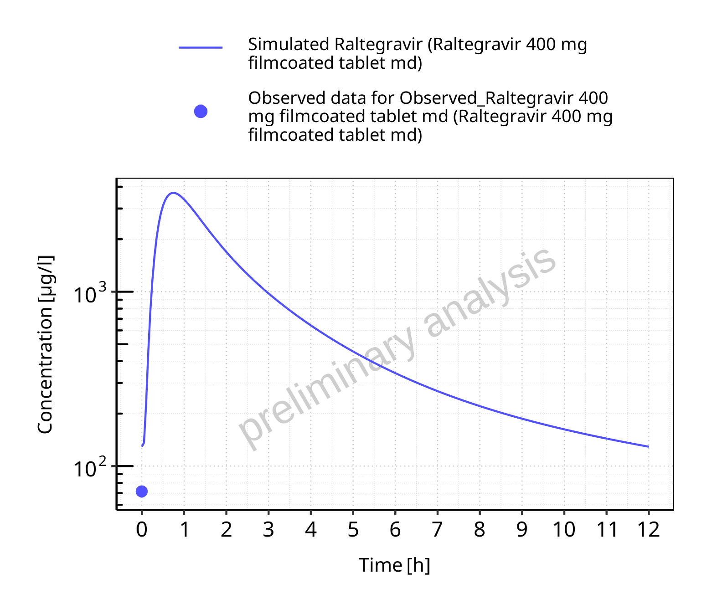


**Figure 5-64: Time profiles for Raltegravir 400 mg filmcoated tablet md. Data source: Data/Raltegravir_PK.txt. Time profiles are plotted in a logarithmic scale.**


<br>
<br>


```{=openxml}
<w:br w:type="page"/>
```

`<w:bookmarkStart w:id="figure-5-65" w:name="figure-5-65"/><w:bookmarkEnd w:id="figure-5-65"/>`{=openxml}

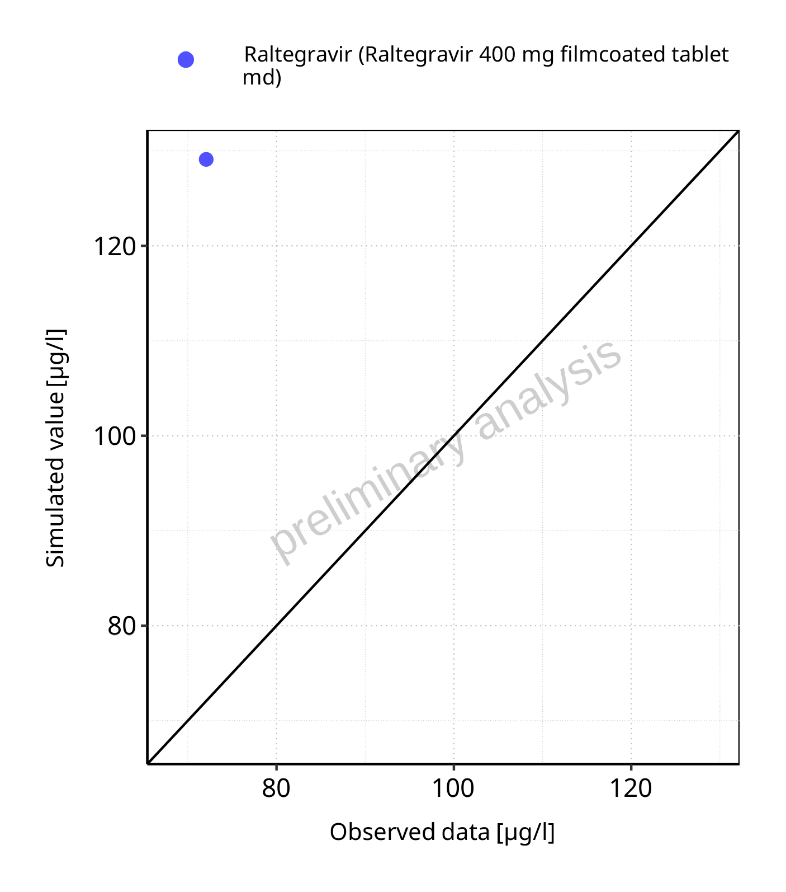


**Figure 5-65: Predicted vs observed for Raltegravir 400 mg filmcoated tablet md. Data source: Data/Raltegravir_PK.txt. Predictions and observations are plotted in a linear scale.**


<br>
<br>


```{=openxml}
<w:br w:type="page"/>
```

`<w:bookmarkStart w:id="figure-5-66" w:name="figure-5-66"/><w:bookmarkEnd w:id="figure-5-66"/>`{=openxml}


**Figure 5-66: Predicted vs observed for Raltegravir 400 mg filmcoated tablet md. Data source: Data/Raltegravir_PK.txt. Predictions and observations are plotted in a logarithmic scale.**


<br>
<br>


```{=openxml}
<w:br w:type="page"/>
```

`<w:bookmarkStart w:id="figure-5-67" w:name="figure-5-67"/><w:bookmarkEnd w:id="figure-5-67"/>`{=openxml}

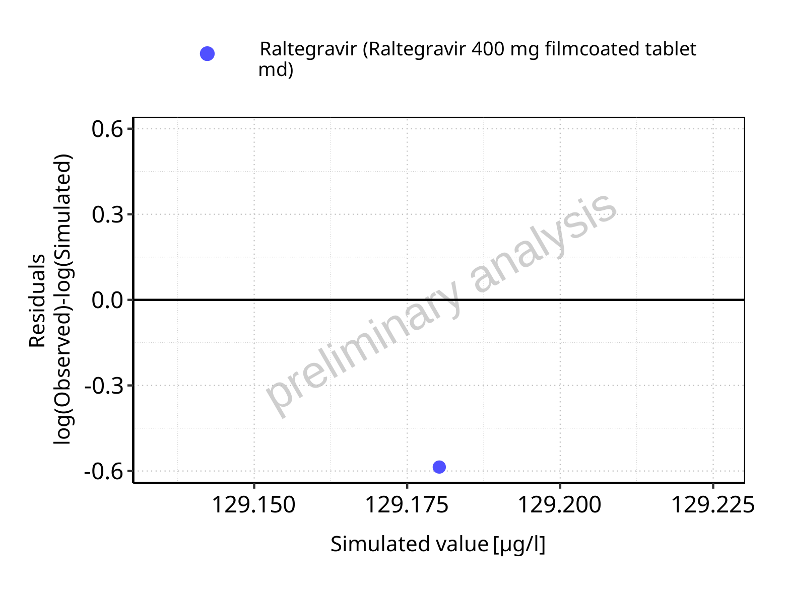


**Figure 5-67: Logarithmic residuals vs predicted values for Raltegravir 400 mg filmcoated tablet md. Data source: Data/Raltegravir_PK.txt.**


<br>
<br>


```{=openxml}
<w:br w:type="page"/>
```

`<w:bookmarkStart w:id="figure-5-68" w:name="figure-5-68"/><w:bookmarkEnd w:id="figure-5-68"/>`{=openxml}

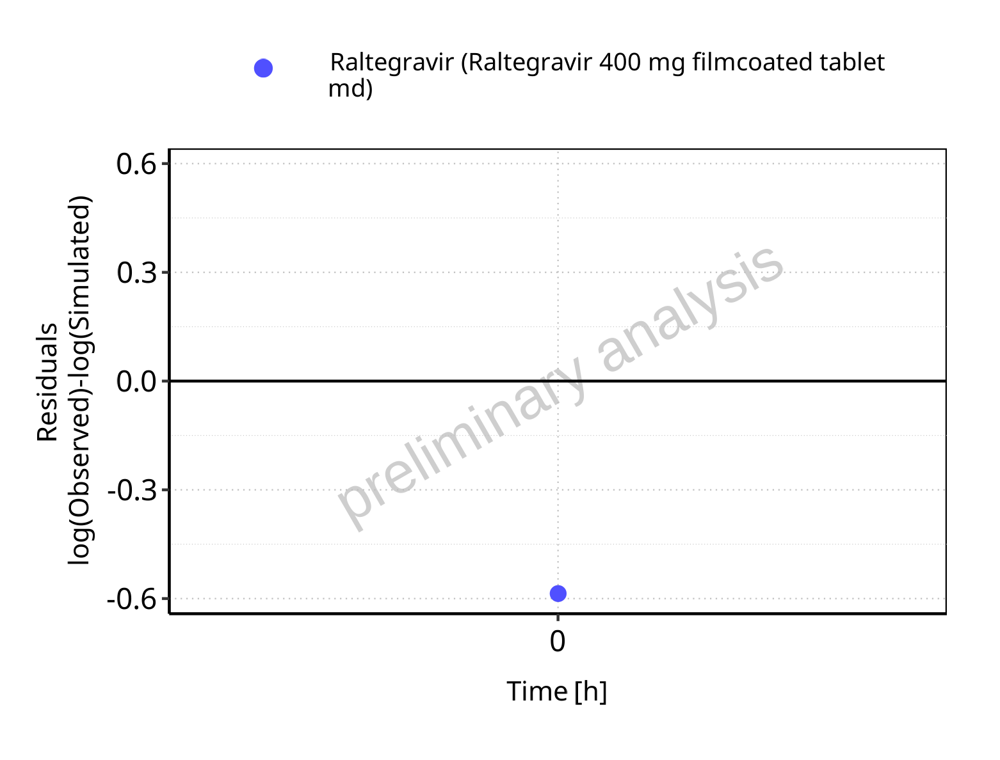


**Figure 5-68: Logarithmic residuals vs time values for Raltegravir 400 mg filmcoated tablet md. Data source: Data/Raltegravir_PK.txt.**


<br>
<br>


```{=openxml}
<w:br w:type="page"/>
```

`<w:bookmarkStart w:id="figure-5-69" w:name="figure-5-69"/><w:bookmarkEnd w:id="figure-5-69"/>`{=openxml}

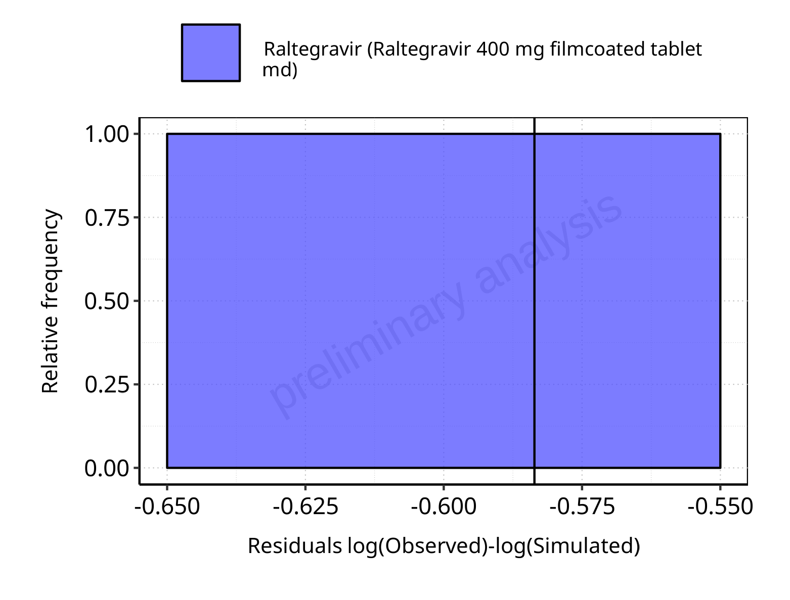


**Figure 5-69: Logarithmic residuals distribution (stacked) for Raltegravir 400 mg filmcoated tablet md. Data source: Data/Raltegravir_PK.txt.**


<br>
<br>


```{=openxml}
<w:br w:type="page"/>
```

`<w:bookmarkStart w:id="figure-5-70" w:name="figure-5-70"/><w:bookmarkEnd w:id="figure-5-70"/>`{=openxml}

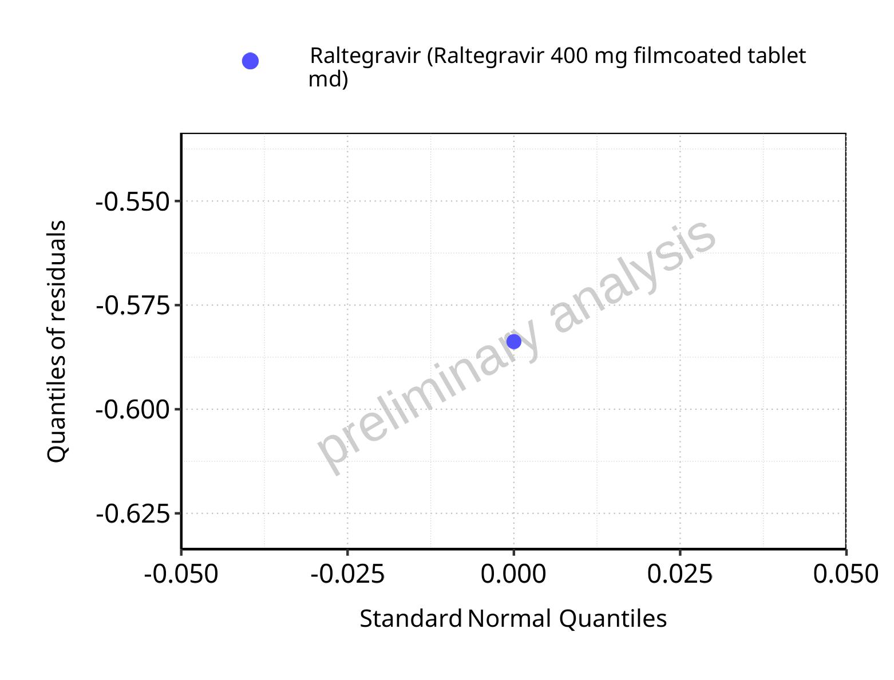


**Figure 5-70: Logarithmic residuals for Raltegravir 400 mg filmcoated tablet md as quantile-quantile plot. Data source: Data/Raltegravir_PK.txt.**


<br>
<br>


## Time profiles and residual plots for Raltegravir 400mg chewable fasted `<w:bookmarkStart w:id="time-profiles-raltegravir_400mg_chewable_fasted" w:name="time-profiles-raltegravir_400mg_chewable_fasted"/><w:bookmarkEnd w:id="time-profiles-raltegravir_400mg_chewable_fasted"/>`{=openxml}


```{=openxml}
<w:br w:type="page"/>
```

`<w:bookmarkStart w:id="figure-5-71" w:name="figure-5-71"/><w:bookmarkEnd w:id="figure-5-71"/>`{=openxml}

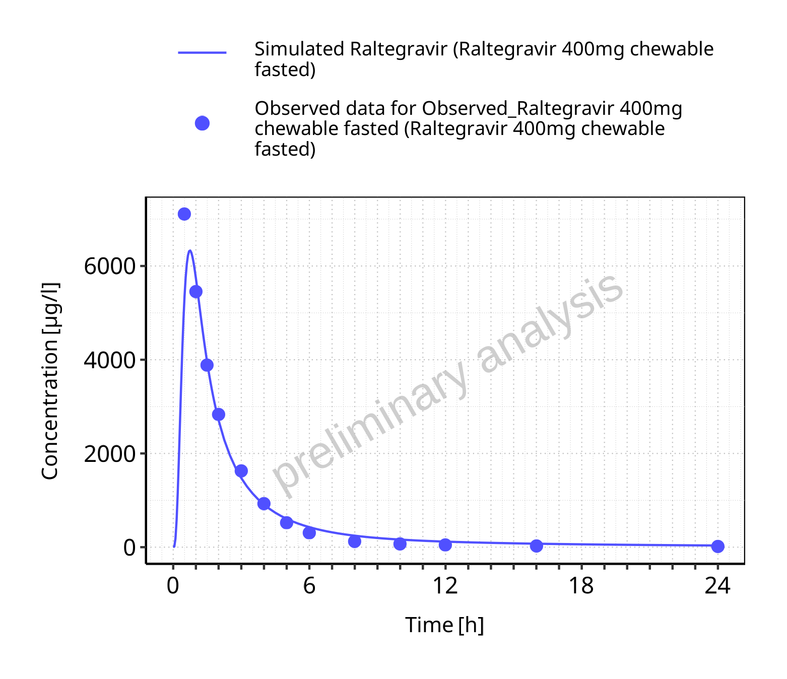


**Figure 5-71: Time profiles for Raltegravir 400mg chewable fasted. Data source: Data/Raltegravir_PK.txt. Time profiles are plotted in a linear scale.**


<br>
<br>


```{=openxml}
<w:br w:type="page"/>
```

`<w:bookmarkStart w:id="figure-5-72" w:name="figure-5-72"/><w:bookmarkEnd w:id="figure-5-72"/>`{=openxml}

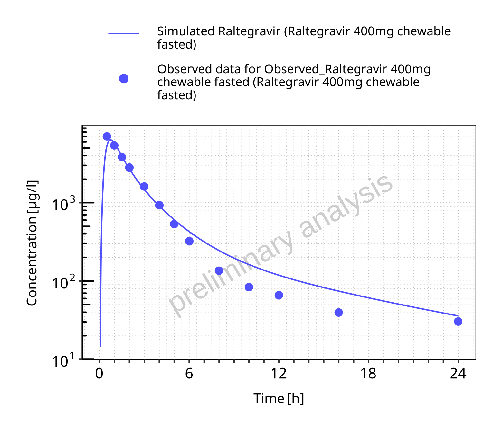


**Figure 5-72: Time profiles for Raltegravir 400mg chewable fasted. Data source: Data/Raltegravir_PK.txt. Time profiles are plotted in a logarithmic scale.**


<br>
<br>


```{=openxml}
<w:br w:type="page"/>
```

`<w:bookmarkStart w:id="figure-5-73" w:name="figure-5-73"/><w:bookmarkEnd w:id="figure-5-73"/>`{=openxml}

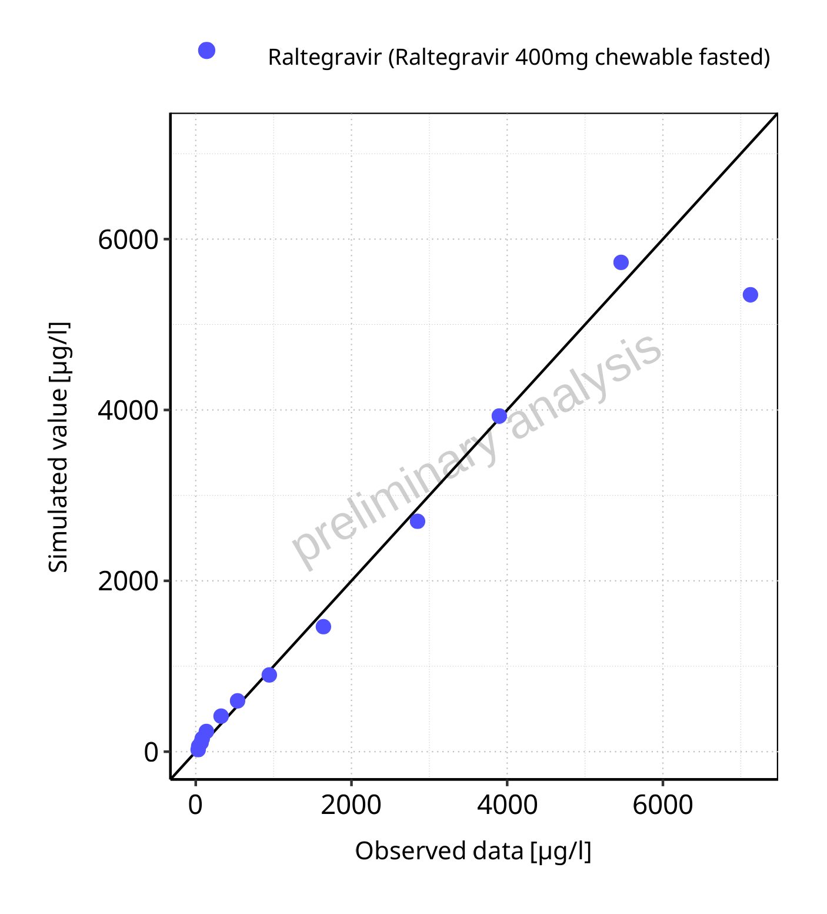


**Figure 5-73: Predicted vs observed for Raltegravir 400mg chewable fasted. Data source: Data/Raltegravir_PK.txt. Predictions and observations are plotted in a linear scale.**


<br>
<br>


```{=openxml}
<w:br w:type="page"/>
```

`<w:bookmarkStart w:id="figure-5-74" w:name="figure-5-74"/><w:bookmarkEnd w:id="figure-5-74"/>`{=openxml}


**Figure 5-74: Predicted vs observed for Raltegravir 400mg chewable fasted. Data source: Data/Raltegravir_PK.txt. Predictions and observations are plotted in a logarithmic scale.**


<br>
<br>


```{=openxml}
<w:br w:type="page"/>
```

`<w:bookmarkStart w:id="figure-5-75" w:name="figure-5-75"/><w:bookmarkEnd w:id="figure-5-75"/>`{=openxml}

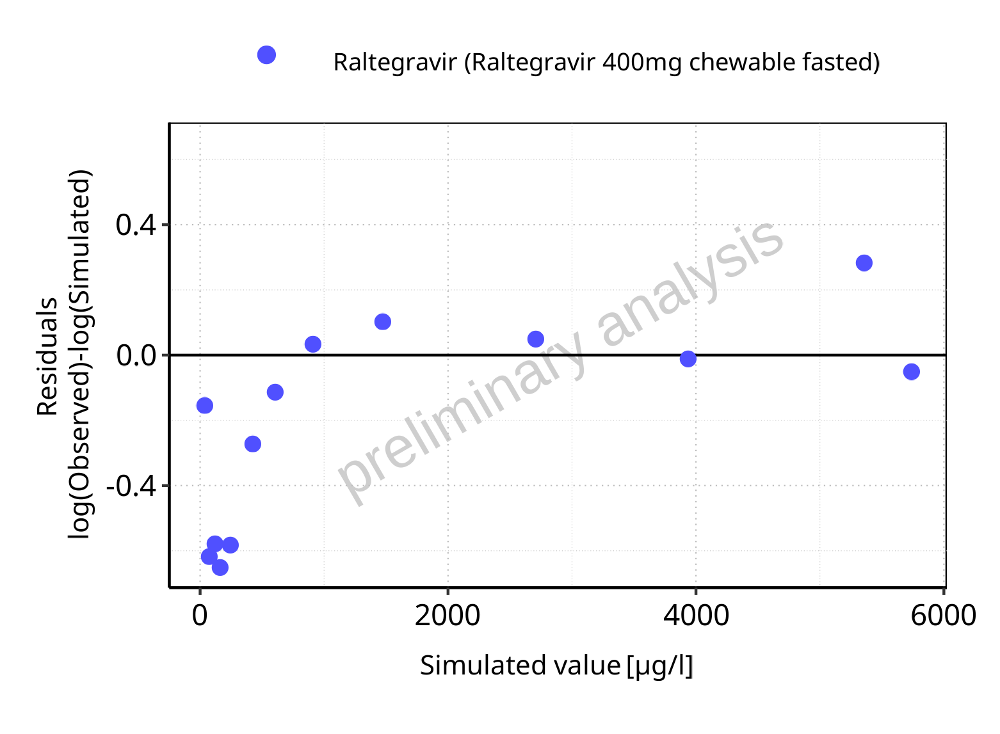


**Figure 5-75: Logarithmic residuals vs predicted values for Raltegravir 400mg chewable fasted. Data source: Data/Raltegravir_PK.txt.**


<br>
<br>


```{=openxml}
<w:br w:type="page"/>
```

`<w:bookmarkStart w:id="figure-5-76" w:name="figure-5-76"/><w:bookmarkEnd w:id="figure-5-76"/>`{=openxml}

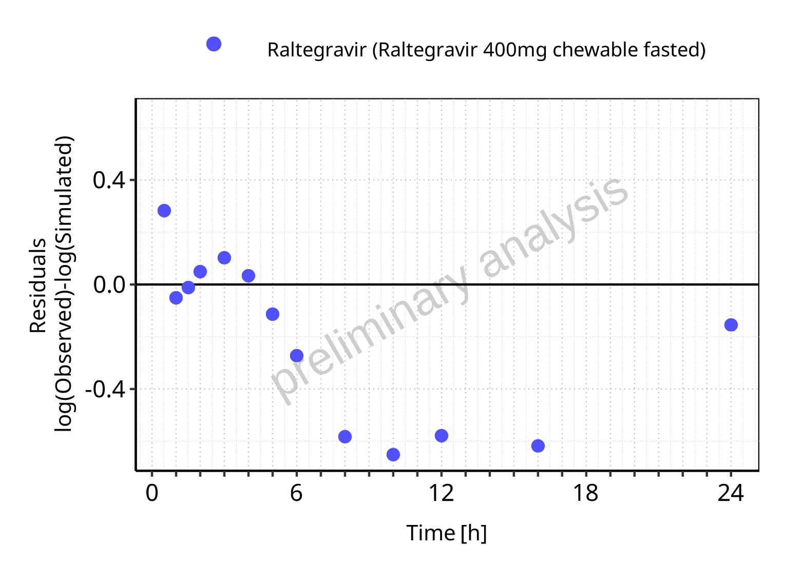


**Figure 5-76: Logarithmic residuals vs time values for Raltegravir 400mg chewable fasted. Data source: Data/Raltegravir_PK.txt.**


<br>
<br>


```{=openxml}
<w:br w:type="page"/>
```

`<w:bookmarkStart w:id="figure-5-77" w:name="figure-5-77"/><w:bookmarkEnd w:id="figure-5-77"/>`{=openxml}

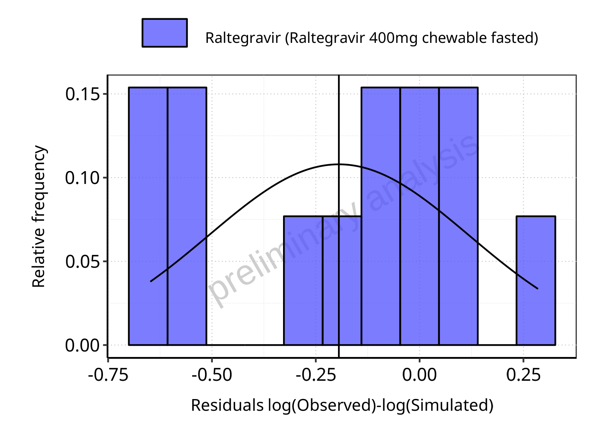


**Figure 5-77: Logarithmic residuals distribution (stacked) for Raltegravir 400mg chewable fasted. Data source: Data/Raltegravir_PK.txt.**


<br>
<br>


```{=openxml}
<w:br w:type="page"/>
```

`<w:bookmarkStart w:id="figure-5-78" w:name="figure-5-78"/><w:bookmarkEnd w:id="figure-5-78"/>`{=openxml}

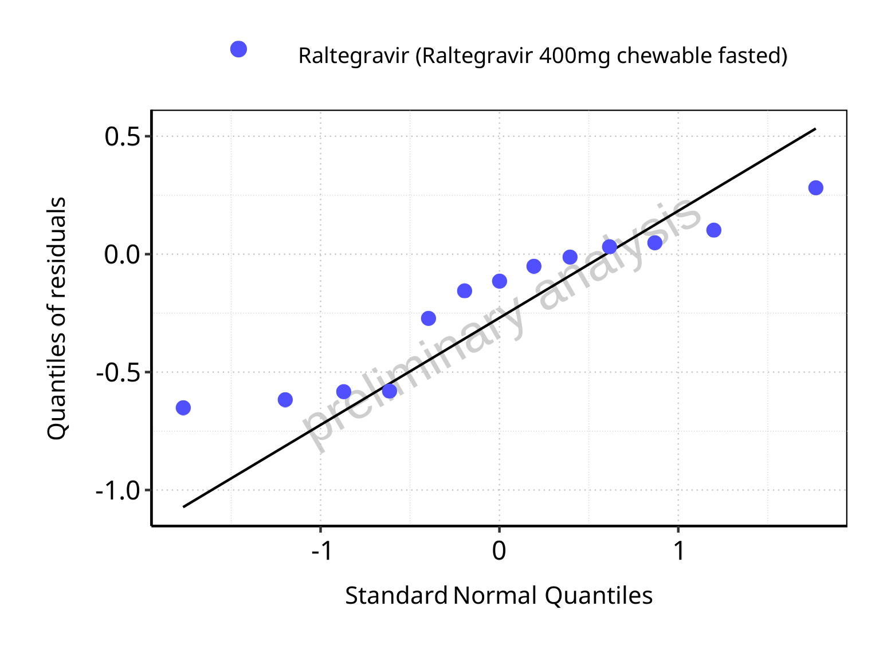


**Figure 5-78: Logarithmic residuals for Raltegravir 400mg chewable fasted as quantile-quantile plot. Data source: Data/Raltegravir_PK.txt.**


<br>
<br>


## Time profiles and residual plots for Raltegravir 400mg chewable fed `<w:bookmarkStart w:id="time-profiles-raltegravir_400mg_chewable_fed" w:name="time-profiles-raltegravir_400mg_chewable_fed"/><w:bookmarkEnd w:id="time-profiles-raltegravir_400mg_chewable_fed"/>`{=openxml}


```{=openxml}
<w:br w:type="page"/>
```

`<w:bookmarkStart w:id="figure-5-79" w:name="figure-5-79"/><w:bookmarkEnd w:id="figure-5-79"/>`{=openxml}

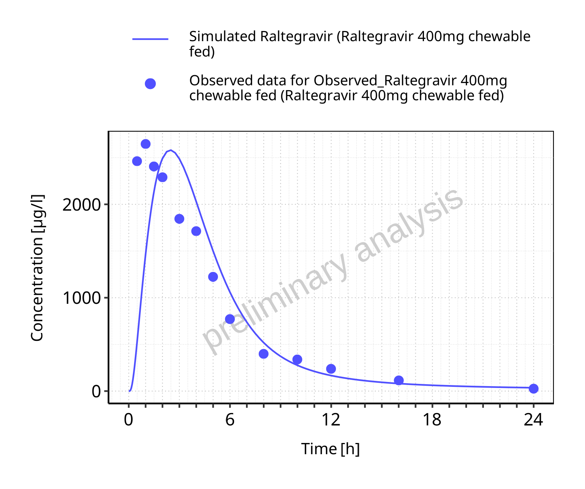


**Figure 5-79: Time profiles for Raltegravir 400mg chewable fed. Data source: Data/Raltegravir_PK.txt. Time profiles are plotted in a linear scale.**


<br>
<br>


```{=openxml}
<w:br w:type="page"/>
```

`<w:bookmarkStart w:id="figure-5-80" w:name="figure-5-80"/><w:bookmarkEnd w:id="figure-5-80"/>`{=openxml}

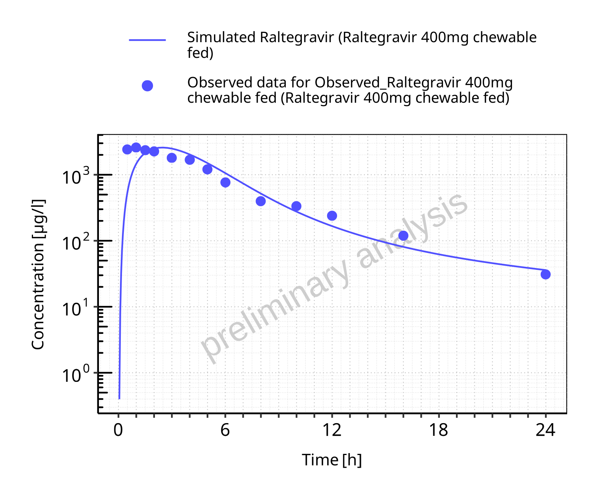


**Figure 5-80: Time profiles for Raltegravir 400mg chewable fed. Data source: Data/Raltegravir_PK.txt. Time profiles are plotted in a logarithmic scale.**


<br>
<br>


```{=openxml}
<w:br w:type="page"/>
```

`<w:bookmarkStart w:id="figure-5-81" w:name="figure-5-81"/><w:bookmarkEnd w:id="figure-5-81"/>`{=openxml}

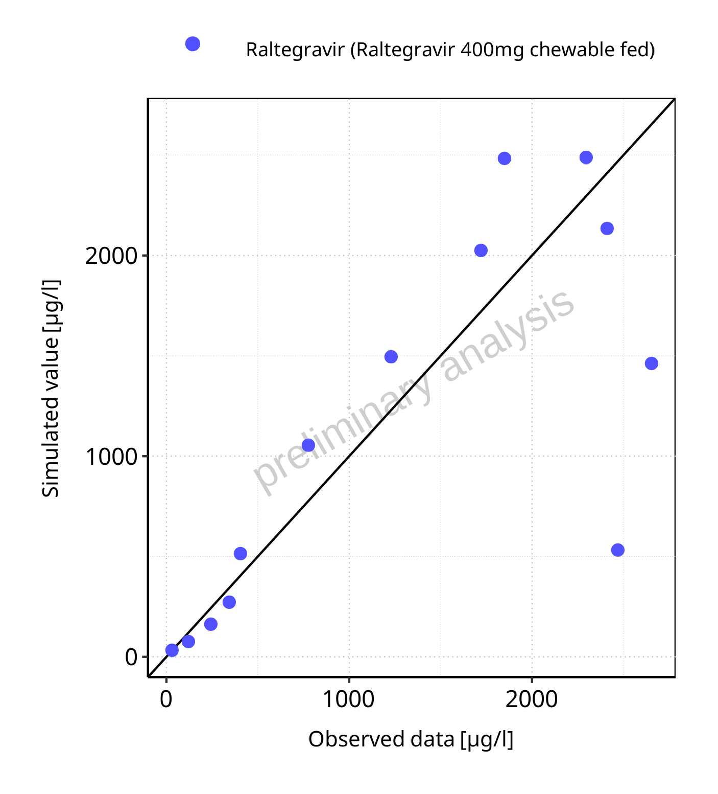


**Figure 5-81: Predicted vs observed for Raltegravir 400mg chewable fed. Data source: Data/Raltegravir_PK.txt. Predictions and observations are plotted in a linear scale.**


<br>
<br>


```{=openxml}
<w:br w:type="page"/>
```

`<w:bookmarkStart w:id="figure-5-82" w:name="figure-5-82"/><w:bookmarkEnd w:id="figure-5-82"/>`{=openxml}


**Figure 5-82: Predicted vs observed for Raltegravir 400mg chewable fed. Data source: Data/Raltegravir_PK.txt. Predictions and observations are plotted in a logarithmic scale.**


<br>
<br>


```{=openxml}
<w:br w:type="page"/>
```

`<w:bookmarkStart w:id="figure-5-83" w:name="figure-5-83"/><w:bookmarkEnd w:id="figure-5-83"/>`{=openxml}

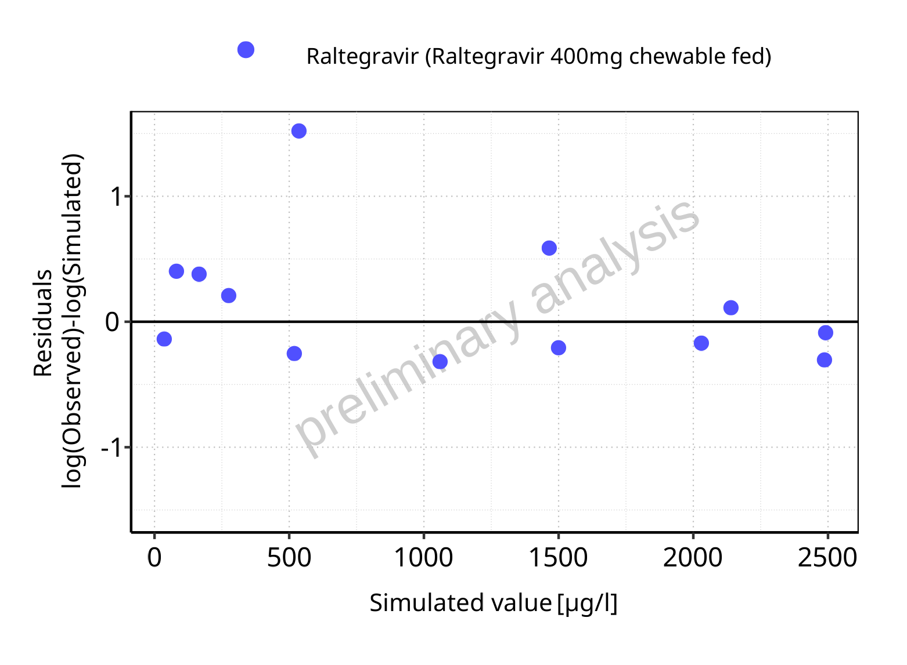


**Figure 5-83: Logarithmic residuals vs predicted values for Raltegravir 400mg chewable fed. Data source: Data/Raltegravir_PK.txt.**


<br>
<br>


```{=openxml}
<w:br w:type="page"/>
```

`<w:bookmarkStart w:id="figure-5-84" w:name="figure-5-84"/><w:bookmarkEnd w:id="figure-5-84"/>`{=openxml}

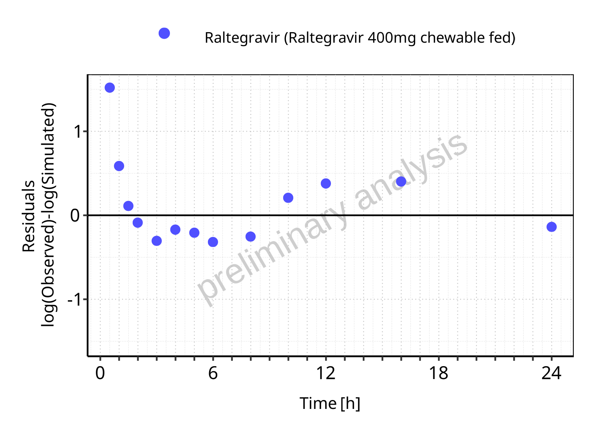


**Figure 5-84: Logarithmic residuals vs time values for Raltegravir 400mg chewable fed. Data source: Data/Raltegravir_PK.txt.**


<br>
<br>


```{=openxml}
<w:br w:type="page"/>
```

`<w:bookmarkStart w:id="figure-5-85" w:name="figure-5-85"/><w:bookmarkEnd w:id="figure-5-85"/>`{=openxml}

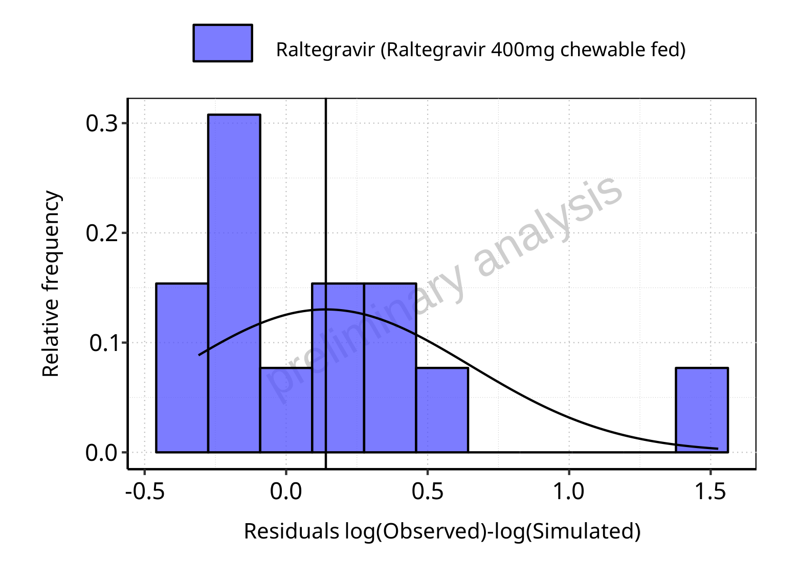


**Figure 5-85: Logarithmic residuals distribution (stacked) for Raltegravir 400mg chewable fed. Data source: Data/Raltegravir_PK.txt.**


<br>
<br>


```{=openxml}
<w:br w:type="page"/>
```

`<w:bookmarkStart w:id="figure-5-86" w:name="figure-5-86"/><w:bookmarkEnd w:id="figure-5-86"/>`{=openxml}


**Figure 5-86: Logarithmic residuals for Raltegravir 400mg chewable fed as quantile-quantile plot. Data source: Data/Raltegravir_PK.txt.**


<br>
<br>


## Time profiles and residual plots for Raltegravir 400mg (granules in suspension) `<w:bookmarkStart w:id="time-profiles-raltegravir_400mg__granules_in_suspension_" w:name="time-profiles-raltegravir_400mg__granules_in_suspension_"/><w:bookmarkEnd w:id="time-profiles-raltegravir_400mg__granules_in_suspension_"/>`{=openxml}


```{=openxml}
<w:br w:type="page"/>
```

`<w:bookmarkStart w:id="figure-5-87" w:name="figure-5-87"/><w:bookmarkEnd w:id="figure-5-87"/>`{=openxml}

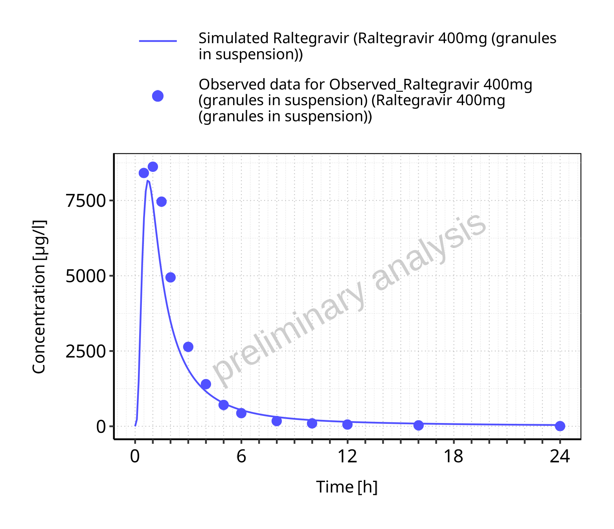


**Figure 5-87: Time profiles for Raltegravir 400mg (granules in suspension). Data source: Data/Raltegravir_PK.txt. Time profiles are plotted in a linear scale.**


<br>
<br>


```{=openxml}
<w:br w:type="page"/>
```

`<w:bookmarkStart w:id="figure-5-88" w:name="figure-5-88"/><w:bookmarkEnd w:id="figure-5-88"/>`{=openxml}


**Figure 5-88: Time profiles for Raltegravir 400mg (granules in suspension). Data source: Data/Raltegravir_PK.txt. Time profiles are plotted in a logarithmic scale.**


<br>
<br>


```{=openxml}
<w:br w:type="page"/>
```

`<w:bookmarkStart w:id="figure-5-89" w:name="figure-5-89"/><w:bookmarkEnd w:id="figure-5-89"/>`{=openxml}

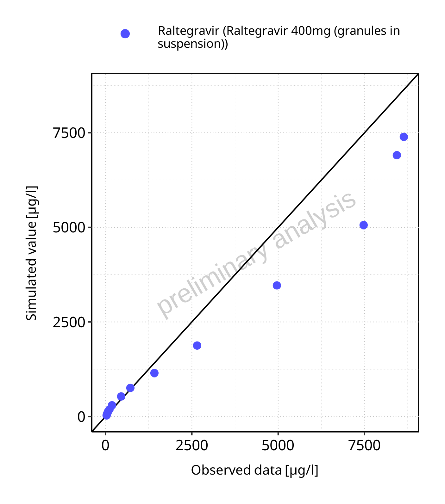


**Figure 5-89: Predicted vs observed for Raltegravir 400mg (granules in suspension). Data source: Data/Raltegravir_PK.txt. Predictions and observations are plotted in a linear scale.**


<br>
<br>


```{=openxml}
<w:br w:type="page"/>
```

`<w:bookmarkStart w:id="figure-5-90" w:name="figure-5-90"/><w:bookmarkEnd w:id="figure-5-90"/>`{=openxml}


**Figure 5-90: Predicted vs observed for Raltegravir 400mg (granules in suspension). Data source: Data/Raltegravir_PK.txt. Predictions and observations are plotted in a logarithmic scale.**


<br>
<br>


```{=openxml}
<w:br w:type="page"/>
```

`<w:bookmarkStart w:id="figure-5-91" w:name="figure-5-91"/><w:bookmarkEnd w:id="figure-5-91"/>`{=openxml}

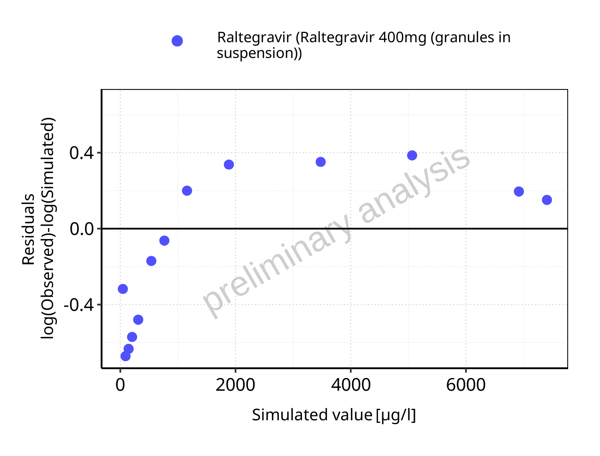


**Figure 5-91: Logarithmic residuals vs predicted values for Raltegravir 400mg (granules in suspension). Data source: Data/Raltegravir_PK.txt.**


<br>
<br>


```{=openxml}
<w:br w:type="page"/>
```

`<w:bookmarkStart w:id="figure-5-92" w:name="figure-5-92"/><w:bookmarkEnd w:id="figure-5-92"/>`{=openxml}

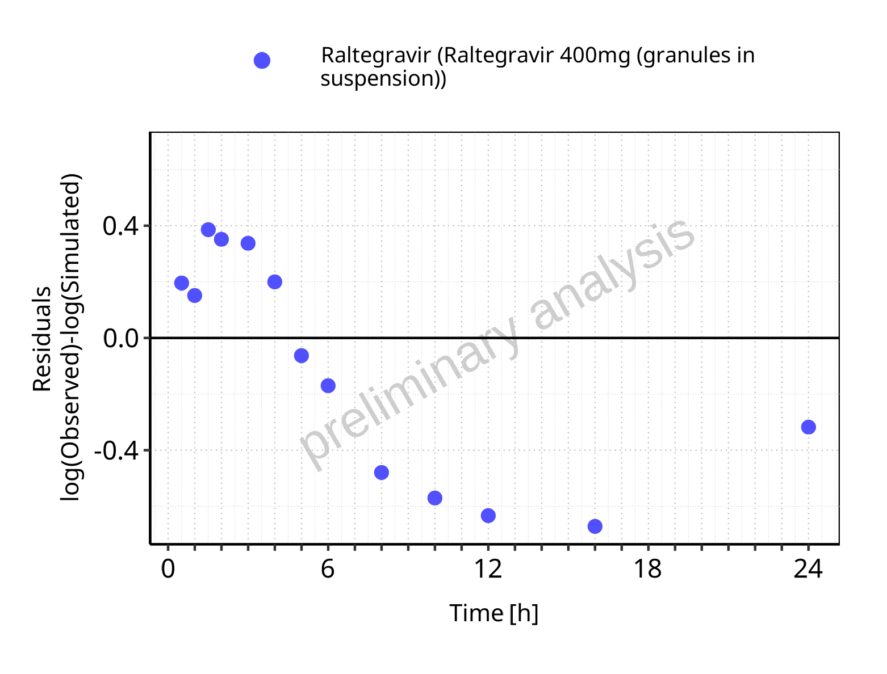


**Figure 5-92: Logarithmic residuals vs time values for Raltegravir 400mg (granules in suspension). Data source: Data/Raltegravir_PK.txt.**


<br>
<br>


```{=openxml}
<w:br w:type="page"/>
```

`<w:bookmarkStart w:id="figure-5-93" w:name="figure-5-93"/><w:bookmarkEnd w:id="figure-5-93"/>`{=openxml}

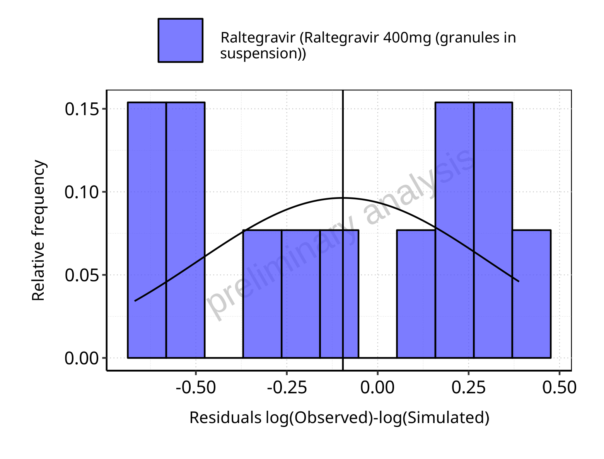


**Figure 5-93: Logarithmic residuals distribution (stacked) for Raltegravir 400mg (granules in suspension). Data source: Data/Raltegravir_PK.txt.**


<br>
<br>


```{=openxml}
<w:br w:type="page"/>
```

`<w:bookmarkStart w:id="figure-5-94" w:name="figure-5-94"/><w:bookmarkEnd w:id="figure-5-94"/>`{=openxml}

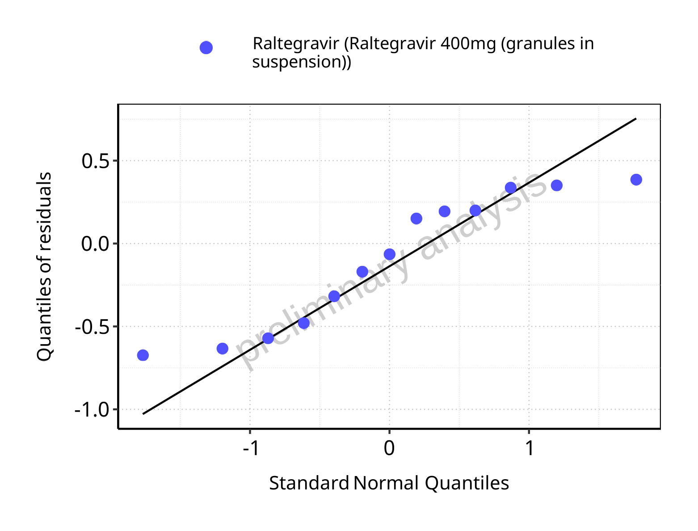


**Figure 5-94: Logarithmic residuals for Raltegravir 400mg (granules in suspension) as quantile-quantile plot. Data source: Data/Raltegravir_PK.txt.**


<br>
<br>


## Residuals across all simulations `<w:bookmarkStart w:id="time-profiles-residuals-across-all-simulations" w:name="time-profiles-residuals-across-all-simulations"/><w:bookmarkEnd w:id="time-profiles-residuals-across-all-simulations"/>`{=openxml}


```{=openxml}
<w:br w:type="page"/>
```

`<w:bookmarkStart w:id="figure-5-95" w:name="figure-5-95"/><w:bookmarkEnd w:id="figure-5-95"/>`{=openxml}

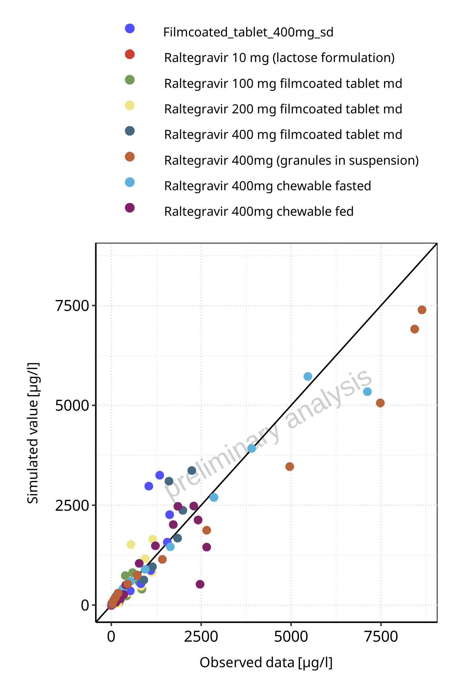


**Figure 5-95: Predicted vs observed for Raltegravir across Raltegravir 10 mg (lactose formulation), Raltegravir 100 mg filmcoated tablet md, Raltegravir 200 mg filmcoated tablet md, Filmcoated_tablet_400mg_sd, Raltegravir 400 mg filmcoated tablet md, Raltegravir 400mg chewable fasted, Raltegravir 400mg chewable fed, Raltegravir 400mg (granules in suspension). Predictions and observations are plotted in a linear scale.**


<br>
<br>


```{=openxml}
<w:br w:type="page"/>
```

`<w:bookmarkStart w:id="figure-5-96" w:name="figure-5-96"/><w:bookmarkEnd w:id="figure-5-96"/>`{=openxml}

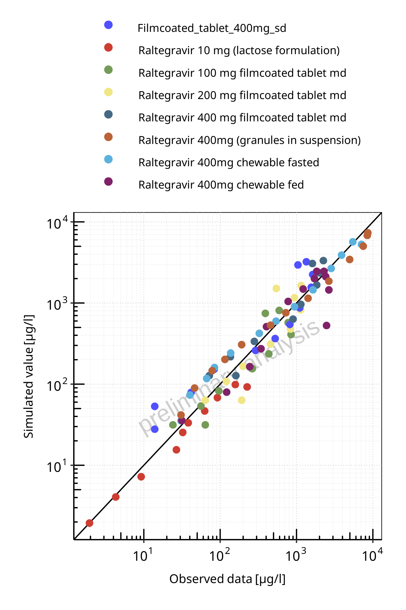


**Figure 5-96: Predicted vs observed for Raltegravir across Raltegravir 10 mg (lactose formulation), Raltegravir 100 mg filmcoated tablet md, Raltegravir 200 mg filmcoated tablet md, Filmcoated_tablet_400mg_sd, Raltegravir 400 mg filmcoated tablet md, Raltegravir 400mg chewable fasted, Raltegravir 400mg chewable fed, Raltegravir 400mg (granules in suspension). Predictions and observations are plotted in a logarithmic scale.**


<br>
<br>


```{=openxml}
<w:br w:type="page"/>
```

`<w:bookmarkStart w:id="figure-5-97" w:name="figure-5-97"/><w:bookmarkEnd w:id="figure-5-97"/>`{=openxml}

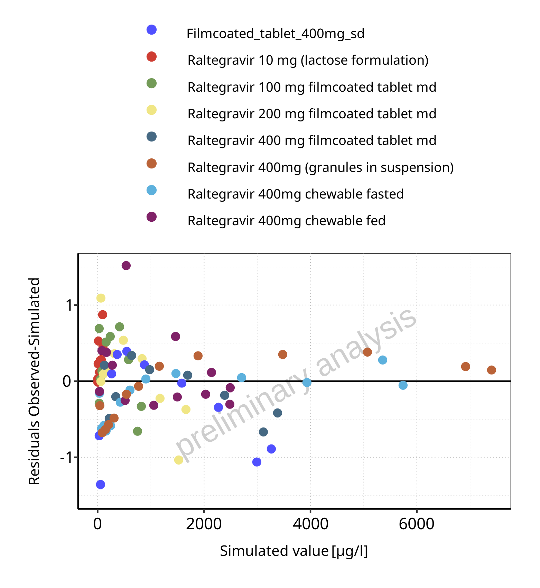


**Figure 5-97: Logarithmic residuals vs predicted values for Raltegravir across Raltegravir 10 mg (lactose formulation), Raltegravir 100 mg filmcoated tablet md, Raltegravir 200 mg filmcoated tablet md, Filmcoated_tablet_400mg_sd, Raltegravir 400 mg filmcoated tablet md, Raltegravir 400mg chewable fasted, Raltegravir 400mg chewable fed, Raltegravir 400mg (granules in suspension).**


<br>
<br>


```{=openxml}
<w:br w:type="page"/>
```

`<w:bookmarkStart w:id="figure-5-98" w:name="figure-5-98"/><w:bookmarkEnd w:id="figure-5-98"/>`{=openxml}

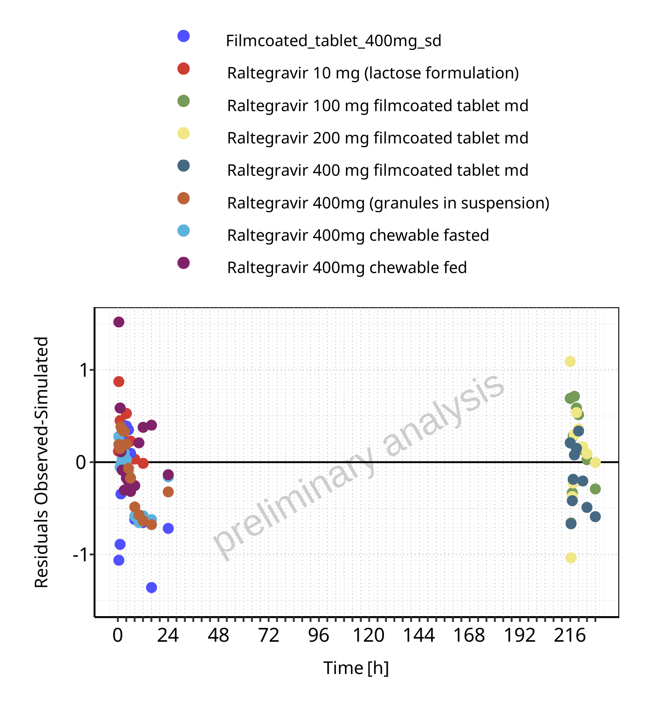


**Figure 5-98: Logarithmic residuals vs time values for Raltegravir across Raltegravir 10 mg (lactose formulation), Raltegravir 100 mg filmcoated tablet md, Raltegravir 200 mg filmcoated tablet md, Filmcoated_tablet_400mg_sd, Raltegravir 400 mg filmcoated tablet md, Raltegravir 400mg chewable fasted, Raltegravir 400mg chewable fed, Raltegravir 400mg (granules in suspension).**


<br>
<br>


```{=openxml}
<w:br w:type="page"/>
```

`<w:bookmarkStart w:id="figure-5-99" w:name="figure-5-99"/><w:bookmarkEnd w:id="figure-5-99"/>`{=openxml}

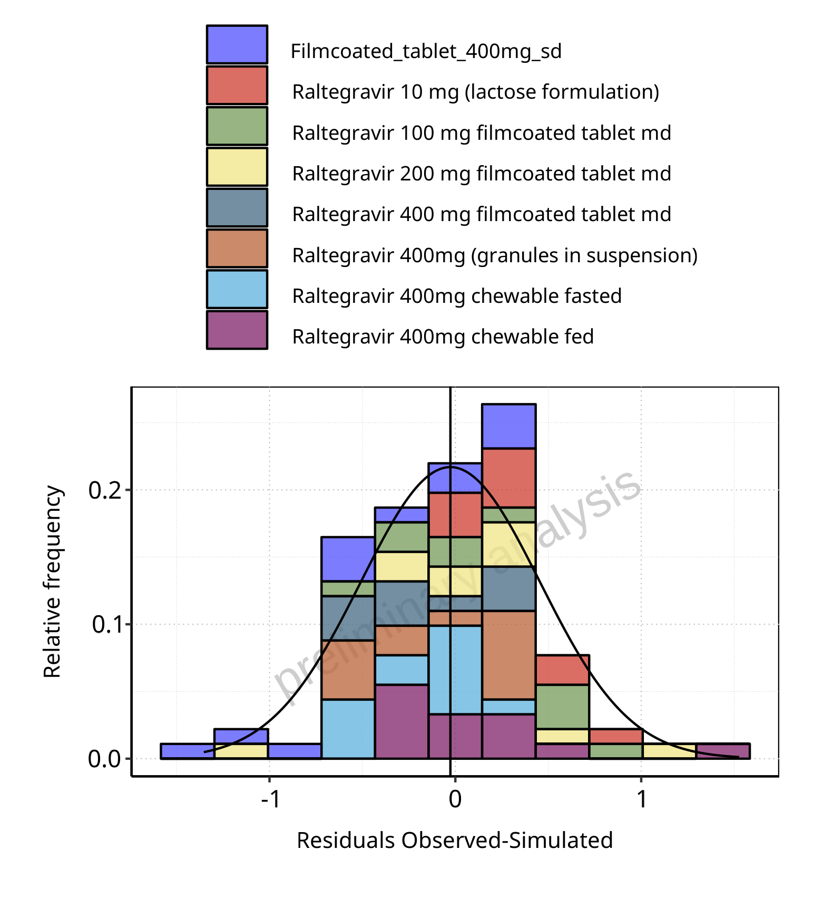


**Figure 5-99: Logarithmic residuals distribution (stacked) for Raltegravir across Raltegravir 10 mg (lactose formulation), Raltegravir 100 mg filmcoated tablet md, Raltegravir 200 mg filmcoated tablet md, Filmcoated_tablet_400mg_sd, Raltegravir 400 mg filmcoated tablet md, Raltegravir 400mg chewable fasted, Raltegravir 400mg chewable fed, Raltegravir 400mg (granules in suspension).**


<br>
<br>


```{=openxml}
<w:br w:type="page"/>
```

`<w:bookmarkStart w:id="figure-5-100" w:name="figure-5-100"/><w:bookmarkEnd w:id="figure-5-100"/>`{=openxml}

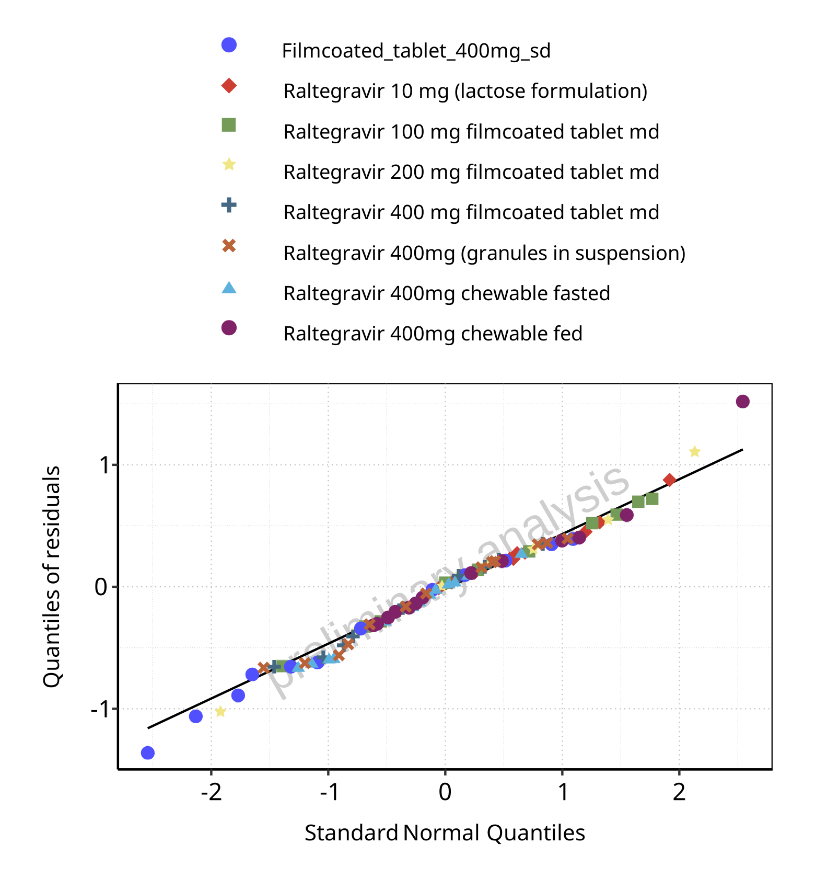


**Figure 5-100: Logarithmic residuals for Raltegravir across Raltegravir 10 mg (lactose formulation), Raltegravir 100 mg filmcoated tablet md, Raltegravir 200 mg filmcoated tablet md, Filmcoated_tablet_400mg_sd, Raltegravir 400 mg filmcoated tablet md, Raltegravir 400mg chewable fasted, Raltegravir 400mg chewable fed, Raltegravir 400mg (granules in suspension) as quantile-quantile plot.**


<br>
<br>


