# Sensitivity Analysis `<w:bookmarkStart w:id="sensitivity-analysis" w:name="sensitivity-analysis"/><w:bookmarkEnd w:id="sensitivity-analysis"/>`{=openxml}


```{=openxml}
<w:br w:type="page"/>
```

`<w:bookmarkStart w:id="figure-1-1" w:name="figure-1-1"/><w:bookmarkEnd w:id="figure-1-1"/>`{=openxml}

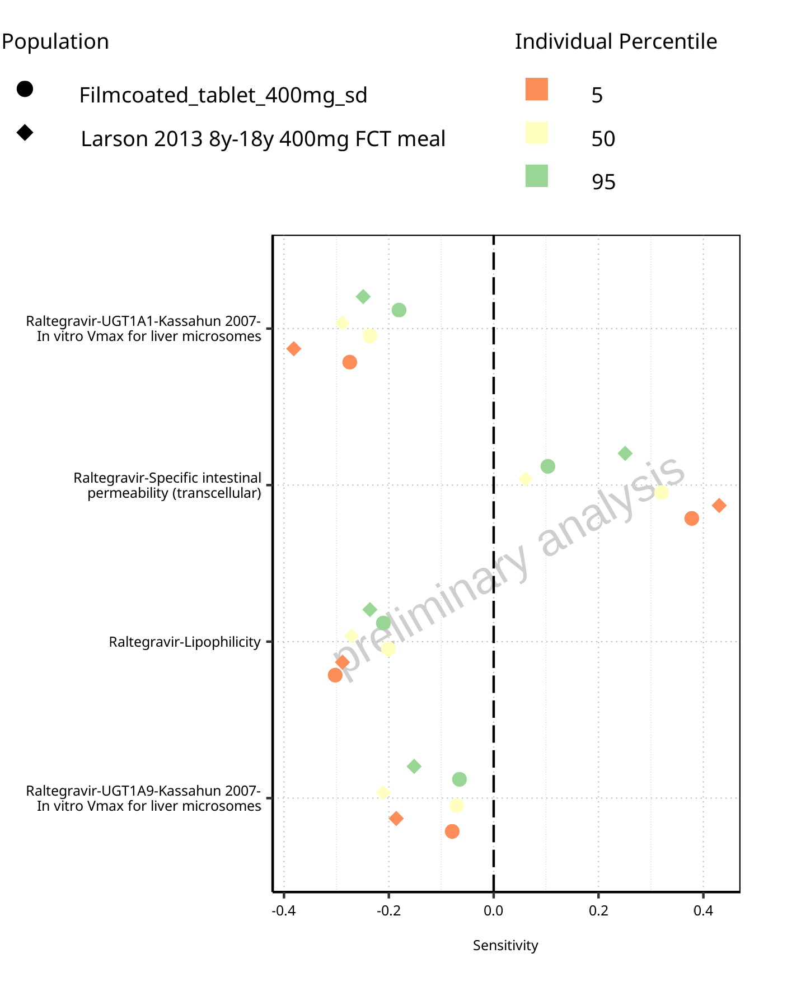


**Figure 1-1: Most sensitive parameters for C_max of Raltegravir for individuals at percentiles 5, 50, 95 for Larson 2013 8y-18y 400mg FCT meal, Filmcoated_tablet_400mg_sd.**


<br>
<br>


```{=openxml}
<w:br w:type="page"/>
```

`<w:bookmarkStart w:id="figure-1-2" w:name="figure-1-2"/><w:bookmarkEnd w:id="figure-1-2"/>`{=openxml}

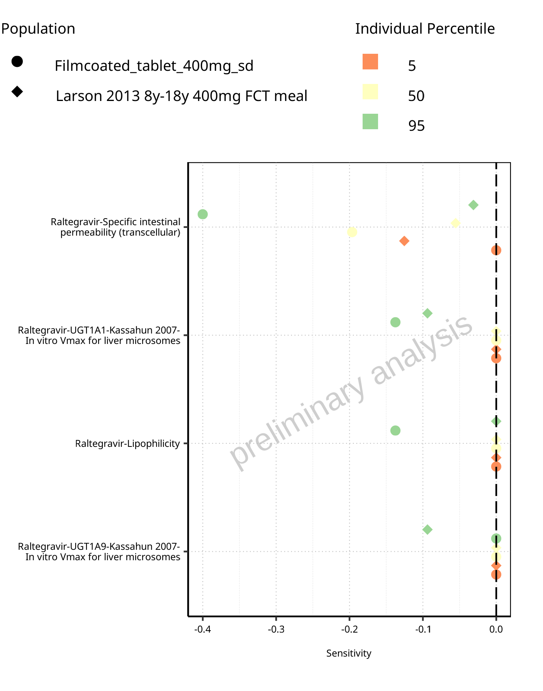


**Figure 1-2: Most sensitive parameters for t_max of Raltegravir for individuals at percentiles 5, 50, 95 for Filmcoated_tablet_400mg_sd, Larson 2013 8y-18y 400mg FCT meal.**


<br>
<br>


```{=openxml}
<w:br w:type="page"/>
```

`<w:bookmarkStart w:id="figure-1-3" w:name="figure-1-3"/><w:bookmarkEnd w:id="figure-1-3"/>`{=openxml}

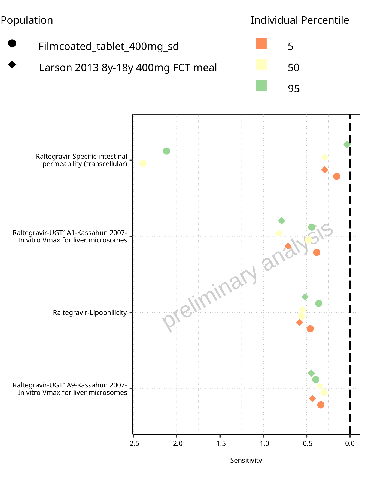


**Figure 1-3: Most sensitive parameters for C_tEnd of Raltegravir for individuals at percentiles 5, 50, 95 for Filmcoated_tablet_400mg_sd, Larson 2013 8y-18y 400mg FCT meal.**


<br>
<br>


```{=openxml}
<w:br w:type="page"/>
```

`<w:bookmarkStart w:id="figure-1-4" w:name="figure-1-4"/><w:bookmarkEnd w:id="figure-1-4"/>`{=openxml}

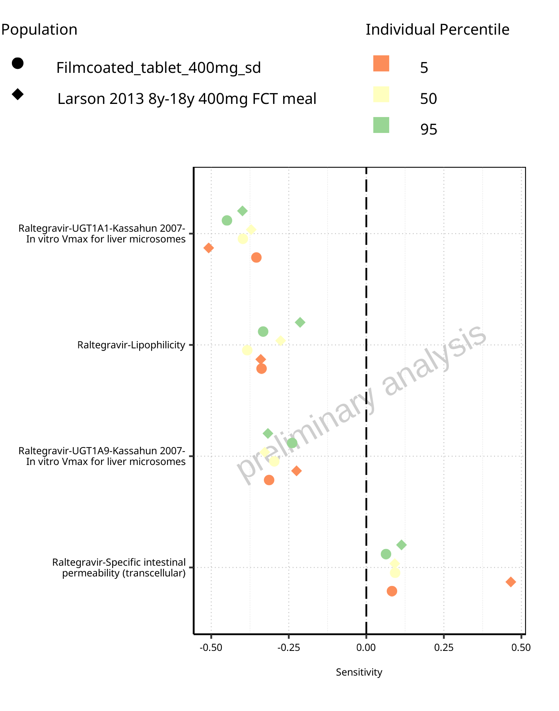


**Figure 1-4: Most sensitive parameters for AUC of Raltegravir for individuals at percentiles 5, 50, 95 for Larson 2013 8y-18y 400mg FCT meal, Filmcoated_tablet_400mg_sd.**


<br>
<br>


```{=openxml}
<w:br w:type="page"/>
```

`<w:bookmarkStart w:id="figure-1-5" w:name="figure-1-5"/><w:bookmarkEnd w:id="figure-1-5"/>`{=openxml}

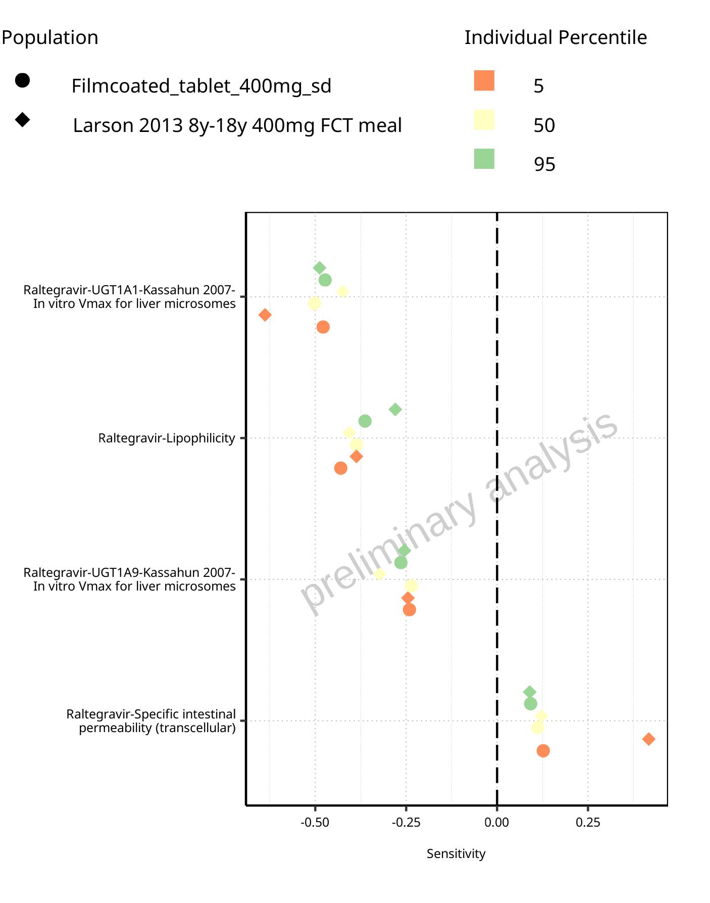


**Figure 1-5: Most sensitive parameters for AUC_inf of Raltegravir for individuals at percentiles 5, 50, 95 for Larson 2013 8y-18y 400mg FCT meal, Filmcoated_tablet_400mg_sd.**


<br>
<br>


```{=openxml}
<w:br w:type="page"/>
```

`<w:bookmarkStart w:id="figure-1-6" w:name="figure-1-6"/><w:bookmarkEnd w:id="figure-1-6"/>`{=openxml}

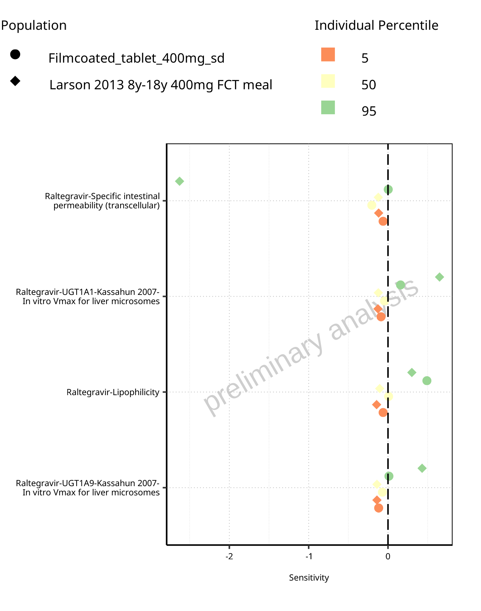


**Figure 1-6: Most sensitive parameters for MRT of Raltegravir for individuals at percentiles 5, 50, 95 for Larson 2013 8y-18y 400mg FCT meal, Filmcoated_tablet_400mg_sd.**


<br>
<br>


```{=openxml}
<w:br w:type="page"/>
```

`<w:bookmarkStart w:id="figure-1-7" w:name="figure-1-7"/><w:bookmarkEnd w:id="figure-1-7"/>`{=openxml}

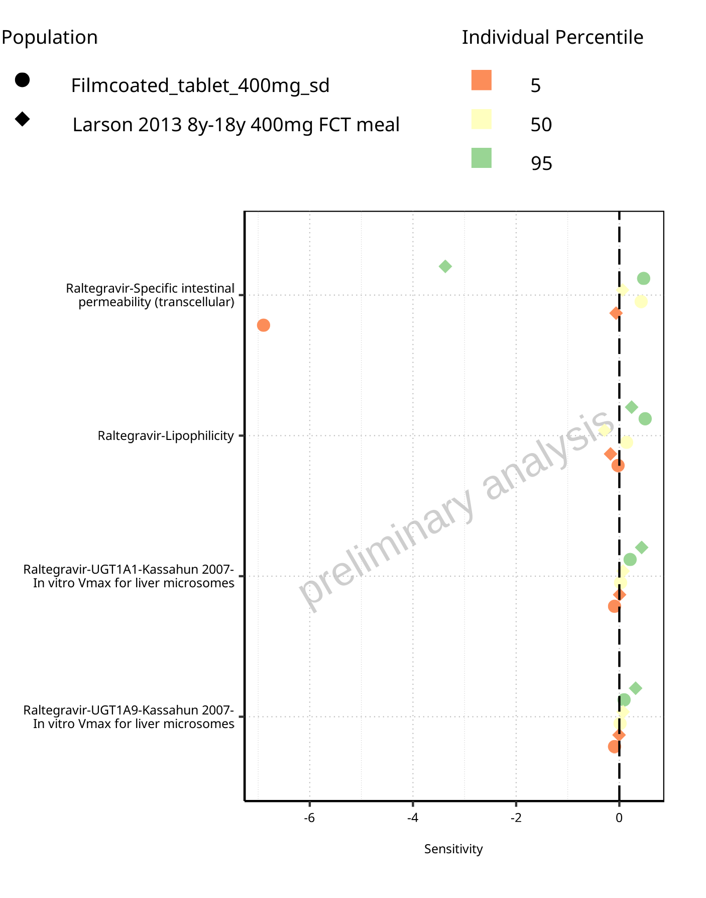


**Figure 1-7: Most sensitive parameters for Thalf of Raltegravir for individuals at percentiles 5, 50, 95 for Filmcoated_tablet_400mg_sd, Larson 2013 8y-18y 400mg FCT meal.**


<br>
<br>


```{=openxml}
<w:br w:type="page"/>
```

`<w:bookmarkStart w:id="figure-1-8" w:name="figure-1-8"/><w:bookmarkEnd w:id="figure-1-8"/>`{=openxml}

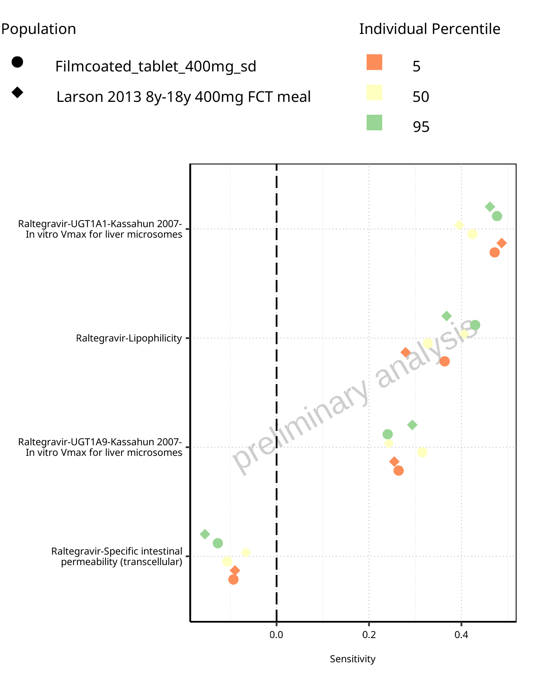


**Figure 1-8: Most sensitive parameters for CL of Raltegravir for individuals at percentiles 5, 50, 95 for Larson 2013 8y-18y 400mg FCT meal, Filmcoated_tablet_400mg_sd.**


<br>
<br>


```{=openxml}
<w:br w:type="page"/>
```

`<w:bookmarkStart w:id="figure-1-9" w:name="figure-1-9"/><w:bookmarkEnd w:id="figure-1-9"/>`{=openxml}

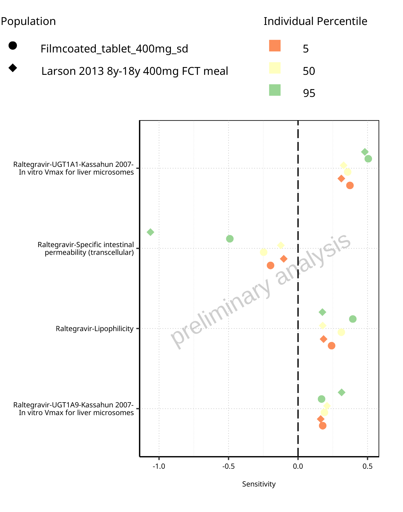


**Figure 1-9: Most sensitive parameters for Vss of Raltegravir for individuals at percentiles 5, 50, 95 for Larson 2013 8y-18y 400mg FCT meal, Filmcoated_tablet_400mg_sd.**


<br>
<br>


```{=openxml}
<w:br w:type="page"/>
```

`<w:bookmarkStart w:id="figure-1-10" w:name="figure-1-10"/><w:bookmarkEnd w:id="figure-1-10"/>`{=openxml}

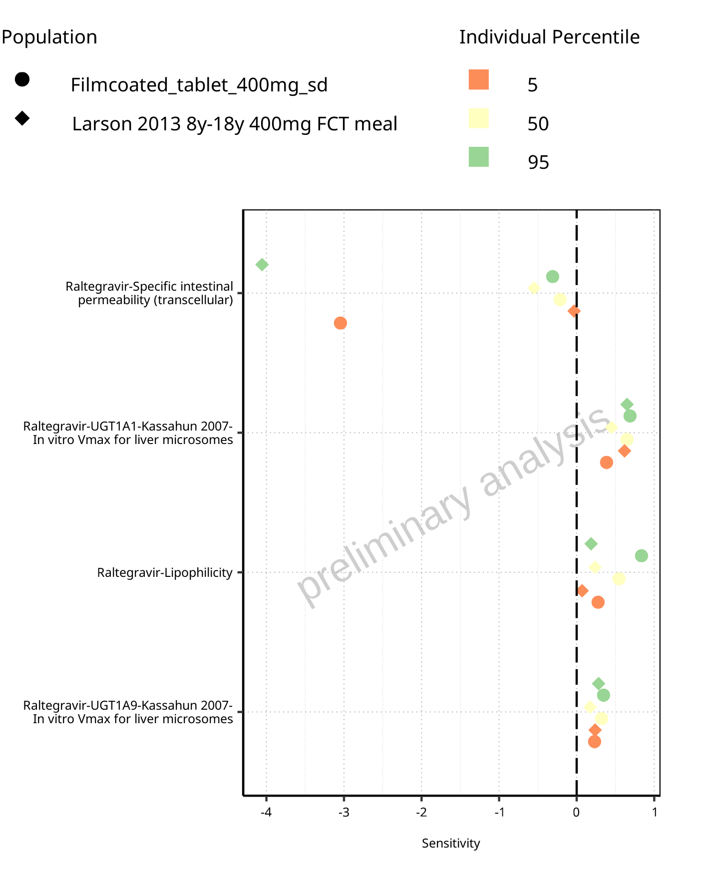


**Figure 1-10: Most sensitive parameters for Vd of Raltegravir for individuals at percentiles 5, 50, 95 for Larson 2013 8y-18y 400mg FCT meal, Filmcoated_tablet_400mg_sd.**


<br>
<br>


# PK parameters `<w:bookmarkStart w:id="pk-parameters" w:name="pk-parameters"/><w:bookmarkEnd w:id="pk-parameters"/>`{=openxml}


## PK Parameters of Raltegravir `<w:bookmarkStart w:id="1_pk_parameters_organism_peripheralvenousblood_raltegravir_plasma__peripheral_venous_blood_" w:name="1_pk_parameters_organism_peripheralvenousblood_raltegravir_plasma__peripheral_venous_blood_"/><w:bookmarkEnd w:id="1_pk_parameters_organism_peripheralvenousblood_raltegravir_plasma__peripheral_venous_blood_"/>`{=openxml}


### C_max `<w:bookmarkStart w:id="2_pk_parameters_organism_peripheralvenousblood_raltegravir_plasma__peripheral_venous_blood__c_max" w:name="2_pk_parameters_organism_peripheralvenousblood_raltegravir_plasma__peripheral_venous_blood__c_max"/><w:bookmarkEnd w:id="2_pk_parameters_organism_peripheralvenousblood_raltegravir_plasma__peripheral_venous_blood__c_max"/>`{=openxml}


```{=openxml}
<w:br w:type="page"/>
```

`<w:bookmarkStart w:id="figure-2-1" w:name="figure-2-1"/><w:bookmarkEnd w:id="figure-2-1"/>`{=openxml}

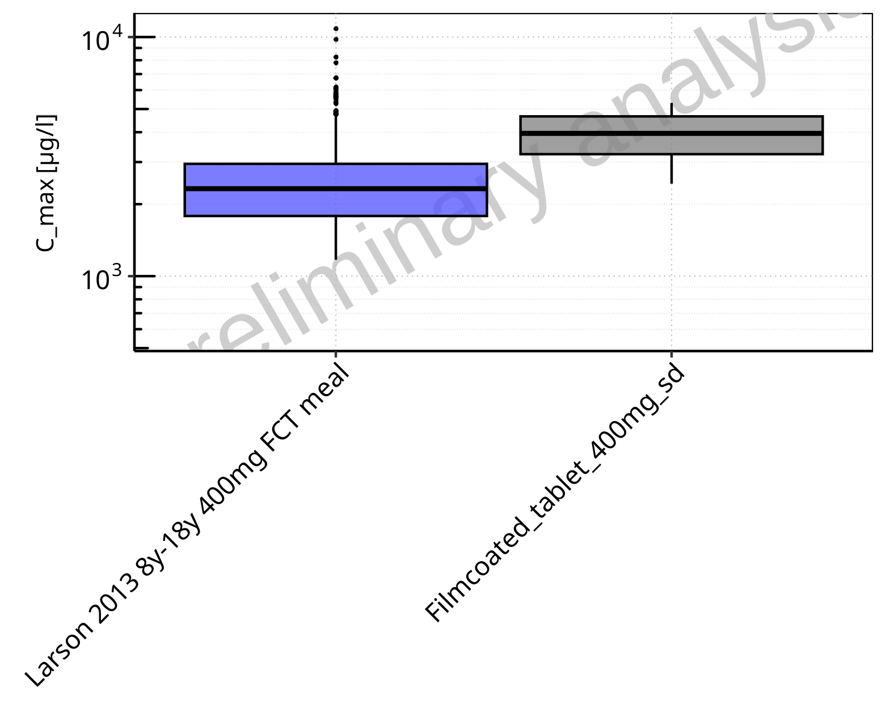


**Figure 2-1: C_max of Raltegravir for Larson 2013 8y-18y 400mg FCT meal, Filmcoated_tablet_400mg_sd shown as box-whisker plot, which indicates  the 5^th^, 25^th^, 50^th^, 75^th^, 95^th^ percentiles in logarithmic scale.**


<br>
<br>


```{=openxml}
<w:br w:type="page"/>
```

`<w:bookmarkStart w:id="figure-2-2" w:name="figure-2-2"/><w:bookmarkEnd w:id="figure-2-2"/>`{=openxml}


**Figure 2-2: C_max of Raltegravir for Larson 2013 8y-18y 400mg FCT meal, Filmcoated_tablet_400mg_sd shown as box-whisker plot, which indicates  the 5^th^, 25^th^, 50^th^, 75^th^, 95^th^ percentiles in linear scale.**


<br>
<br>


```{=openxml}
<w:br w:type="page"/>
```

`<w:bookmarkStart w:id="table-2-1" w:name="table-2-1"/><w:bookmarkEnd w:id="table-2-1"/>`{=openxml}

**Table 2-1: Population statistics summarizing C_max of Raltegravir for Larson 2013 8y-18y 400mg FCT meal, Filmcoated_tablet_400mg_sd reported in [µg/l]**


|Population                        |N   |5^th^ pctl |25^th^ pctl |50^th^ pctl |75^th^ pctl |95^th^ pctl |Mean    |SD      |Geo Mean |Geo SD |
|:---------------------------------|:---|:-------------------|:--------------------|:--------------------|:--------------------|:--------------------|:-------|:-------|:--------|:------|
|Larson 2013 8y-18y 400mg FCT meal |500 |1171.26             |1784.94              |2321.55              |2949.24              |4651.40              |2549.83 |1206.89 |2326.87  |1.52   |
|Filmcoated_tablet_400mg_sd        |100 |2437.79             |3236.54              |3954.54              |4657.56              |5304.38              |3940.92 |908.89  |3833.70  |1.27   |


<br>
<br>


```{=openxml}
<w:br w:type="page"/>
```

`<w:bookmarkStart w:id="figure-2-3" w:name="figure-2-3"/><w:bookmarkEnd w:id="figure-2-3"/>`{=openxml}

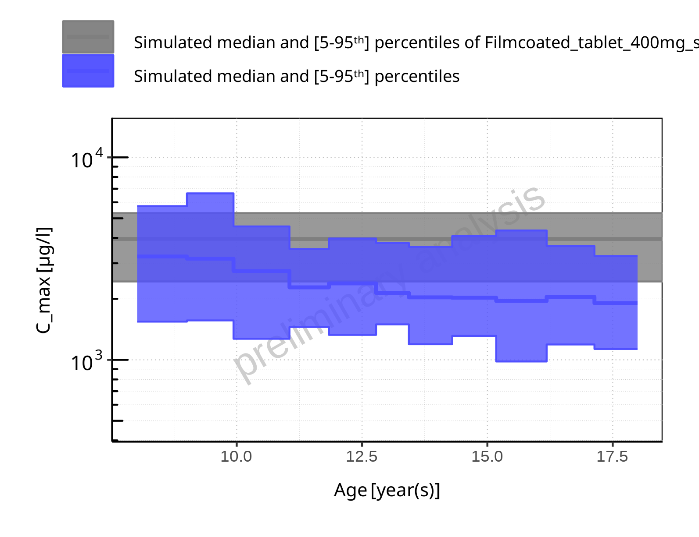


**Figure 2-3: Age-dependence of C_max for Larson 2013 8y-18y 400mg FCT meal in comparison to Filmcoated_tablet_400mg_sd. Profiles are plotted in a logarithmic scale.**


<br>
<br>


```{=openxml}
<w:br w:type="page"/>
```

`<w:bookmarkStart w:id="figure-2-4" w:name="figure-2-4"/><w:bookmarkEnd w:id="figure-2-4"/>`{=openxml}

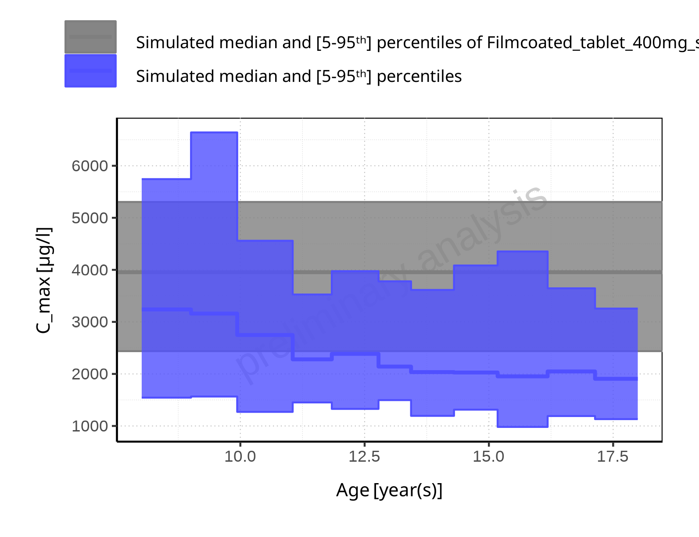


**Figure 2-4: Age-dependence of C_max for Larson 2013 8y-18y 400mg FCT meal in comparison to Filmcoated_tablet_400mg_sd. Profiles are plotted in a linear scale.**


<br>
<br>


```{=openxml}
<w:br w:type="page"/>
```

`<w:bookmarkStart w:id="figure-2-5" w:name="figure-2-5"/><w:bookmarkEnd w:id="figure-2-5"/>`{=openxml}

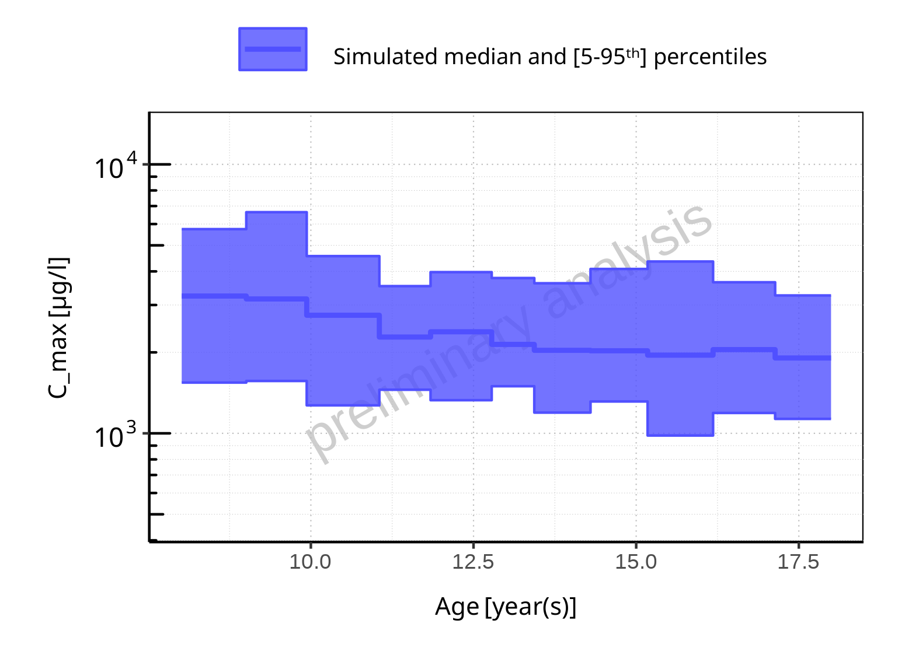


**Figure 2-5: Age-dependence of C_max for Larson 2013 8y-18y 400mg FCT meal. Profiles are plotted in a logarithmic scale.**


<br>
<br>


```{=openxml}
<w:br w:type="page"/>
```

`<w:bookmarkStart w:id="figure-2-6" w:name="figure-2-6"/><w:bookmarkEnd w:id="figure-2-6"/>`{=openxml}

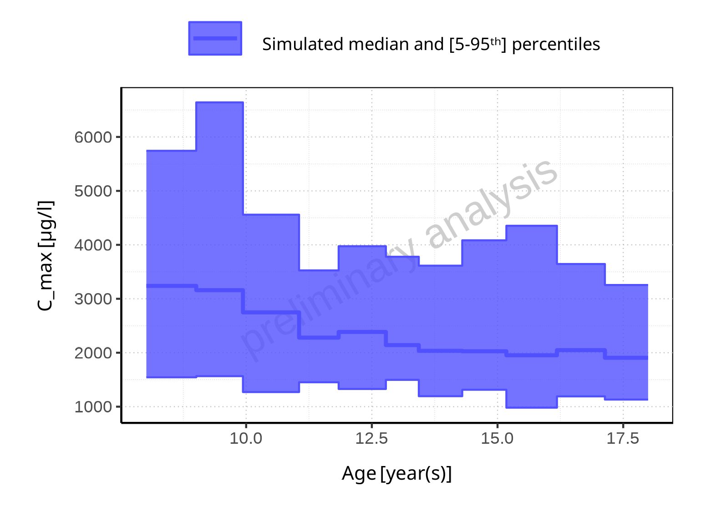


**Figure 2-6: Age-dependence of C_max for Larson 2013 8y-18y 400mg FCT meal. Profiles are plotted in a linear scale.**


<br>
<br>


```{=openxml}
<w:br w:type="page"/>
```

`<w:bookmarkStart w:id="figure-2-7" w:name="figure-2-7"/><w:bookmarkEnd w:id="figure-2-7"/>`{=openxml}

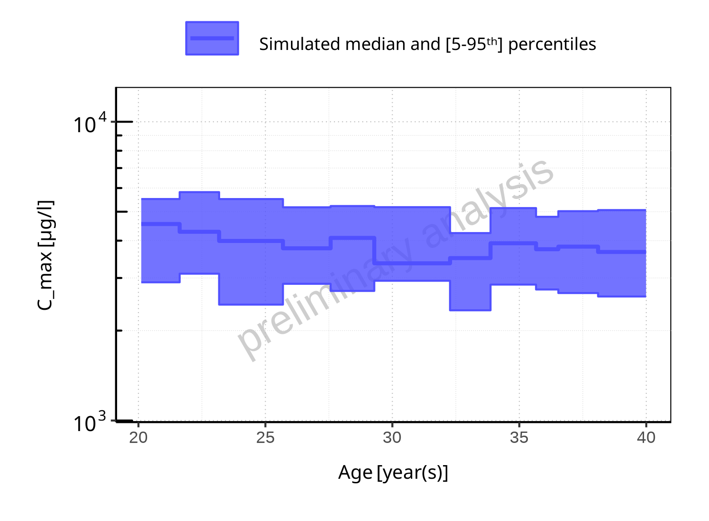


**Figure 2-7: Age-dependence of C_max for Filmcoated_tablet_400mg_sd. Profiles are plotted in a logarithmic scale.**


<br>
<br>


```{=openxml}
<w:br w:type="page"/>
```

`<w:bookmarkStart w:id="figure-2-8" w:name="figure-2-8"/><w:bookmarkEnd w:id="figure-2-8"/>`{=openxml}

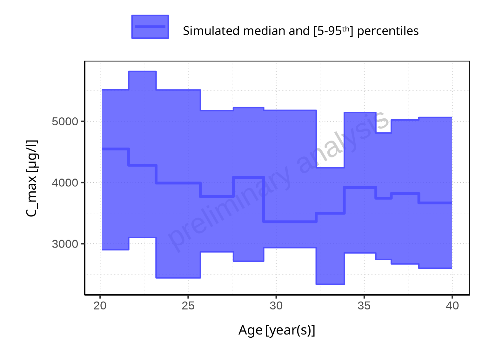


**Figure 2-8: Age-dependence of C_max for Filmcoated_tablet_400mg_sd. Profiles are plotted in a linear scale.**


<br>
<br>


```{=openxml}
<w:br w:type="page"/>
```

`<w:bookmarkStart w:id="figure-2-9" w:name="figure-2-9"/><w:bookmarkEnd w:id="figure-2-9"/>`{=openxml}

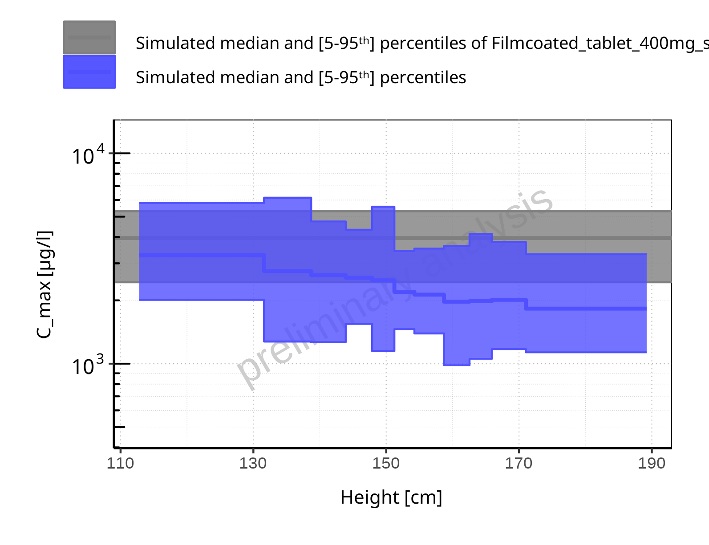


**Figure 2-9: Height-dependence of C_max for Larson 2013 8y-18y 400mg FCT meal in comparison to Filmcoated_tablet_400mg_sd. Profiles are plotted in a logarithmic scale.**


<br>
<br>


```{=openxml}
<w:br w:type="page"/>
```

`<w:bookmarkStart w:id="figure-2-10" w:name="figure-2-10"/><w:bookmarkEnd w:id="figure-2-10"/>`{=openxml}

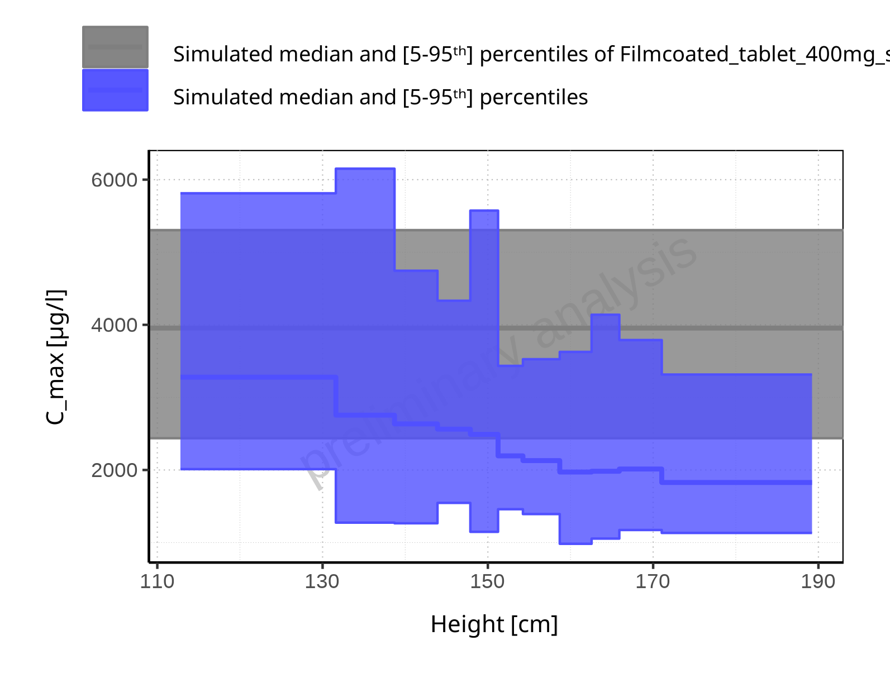


**Figure 2-10: Height-dependence of C_max for Larson 2013 8y-18y 400mg FCT meal in comparison to Filmcoated_tablet_400mg_sd. Profiles are plotted in a linear scale.**


<br>
<br>


```{=openxml}
<w:br w:type="page"/>
```

`<w:bookmarkStart w:id="figure-2-11" w:name="figure-2-11"/><w:bookmarkEnd w:id="figure-2-11"/>`{=openxml}

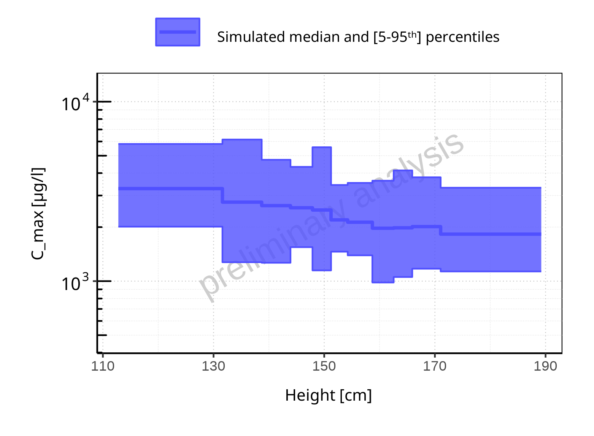


**Figure 2-11: Height-dependence of C_max for Larson 2013 8y-18y 400mg FCT meal. Profiles are plotted in a logarithmic scale.**


<br>
<br>


```{=openxml}
<w:br w:type="page"/>
```

`<w:bookmarkStart w:id="figure-2-12" w:name="figure-2-12"/><w:bookmarkEnd w:id="figure-2-12"/>`{=openxml}

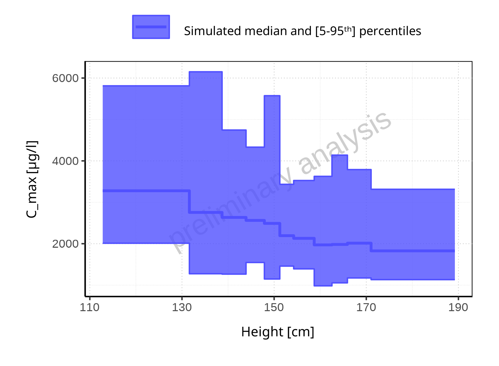


**Figure 2-12: Height-dependence of C_max for Larson 2013 8y-18y 400mg FCT meal. Profiles are plotted in a linear scale.**


<br>
<br>


```{=openxml}
<w:br w:type="page"/>
```

`<w:bookmarkStart w:id="figure-2-13" w:name="figure-2-13"/><w:bookmarkEnd w:id="figure-2-13"/>`{=openxml}

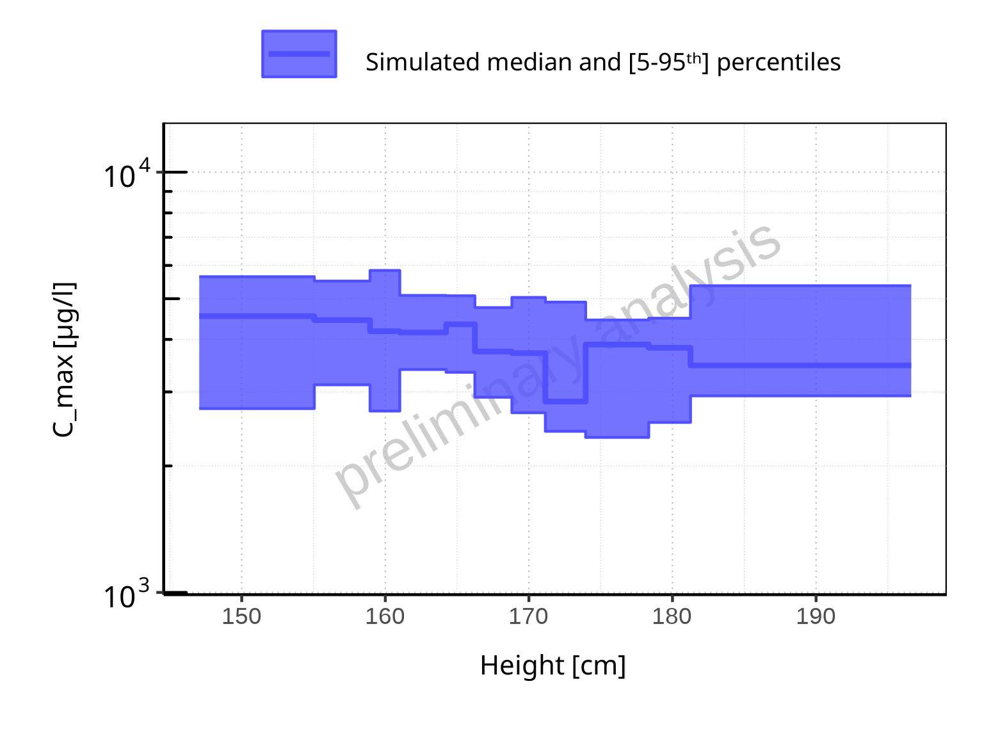


**Figure 2-13: Height-dependence of C_max for Filmcoated_tablet_400mg_sd. Profiles are plotted in a logarithmic scale.**


<br>
<br>


```{=openxml}
<w:br w:type="page"/>
```

`<w:bookmarkStart w:id="figure-2-14" w:name="figure-2-14"/><w:bookmarkEnd w:id="figure-2-14"/>`{=openxml}

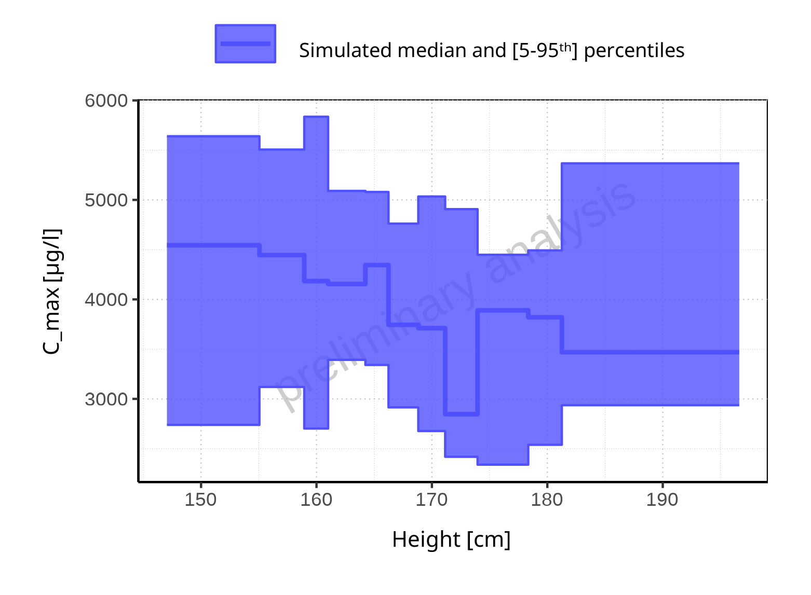


**Figure 2-14: Height-dependence of C_max for Filmcoated_tablet_400mg_sd. Profiles are plotted in a linear scale.**


<br>
<br>


```{=openxml}
<w:br w:type="page"/>
```

`<w:bookmarkStart w:id="figure-2-15" w:name="figure-2-15"/><w:bookmarkEnd w:id="figure-2-15"/>`{=openxml}

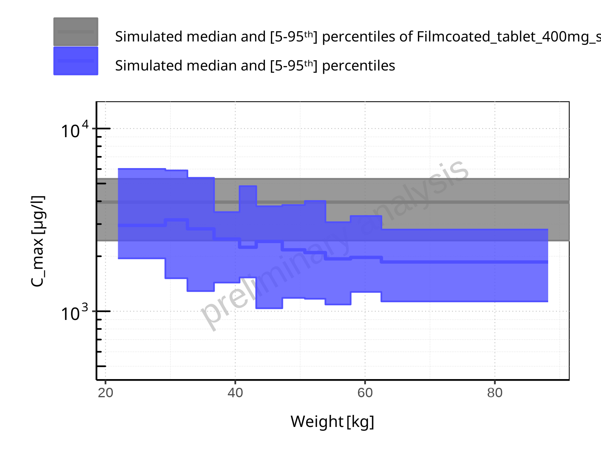


**Figure 2-15: Weight-dependence of C_max for Larson 2013 8y-18y 400mg FCT meal in comparison to Filmcoated_tablet_400mg_sd. Profiles are plotted in a logarithmic scale.**


<br>
<br>


```{=openxml}
<w:br w:type="page"/>
```

`<w:bookmarkStart w:id="figure-2-16" w:name="figure-2-16"/><w:bookmarkEnd w:id="figure-2-16"/>`{=openxml}

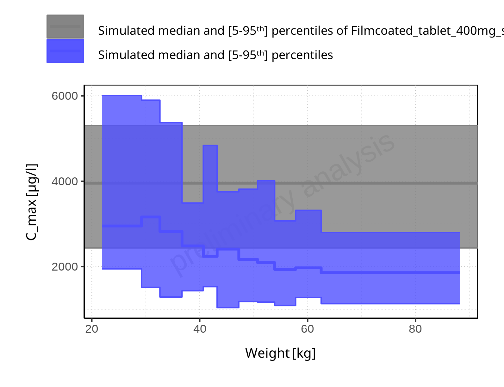


**Figure 2-16: Weight-dependence of C_max for Larson 2013 8y-18y 400mg FCT meal in comparison to Filmcoated_tablet_400mg_sd. Profiles are plotted in a linear scale.**


<br>
<br>


```{=openxml}
<w:br w:type="page"/>
```

`<w:bookmarkStart w:id="figure-2-17" w:name="figure-2-17"/><w:bookmarkEnd w:id="figure-2-17"/>`{=openxml}

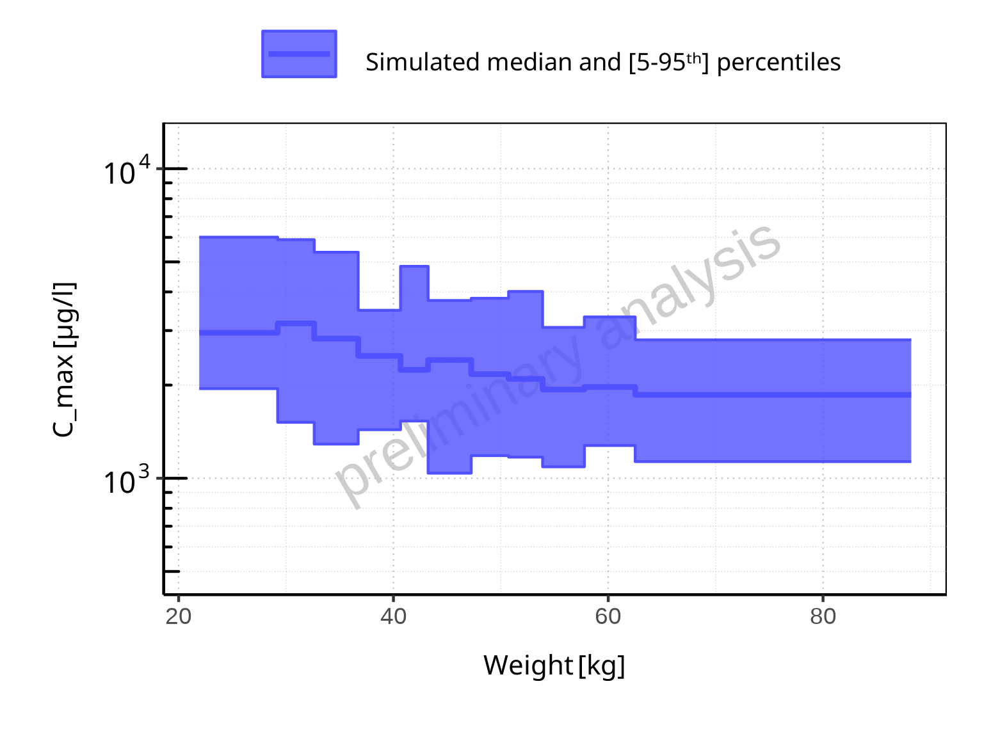


**Figure 2-17: Weight-dependence of C_max for Larson 2013 8y-18y 400mg FCT meal. Profiles are plotted in a logarithmic scale.**


<br>
<br>


```{=openxml}
<w:br w:type="page"/>
```

`<w:bookmarkStart w:id="figure-2-18" w:name="figure-2-18"/><w:bookmarkEnd w:id="figure-2-18"/>`{=openxml}

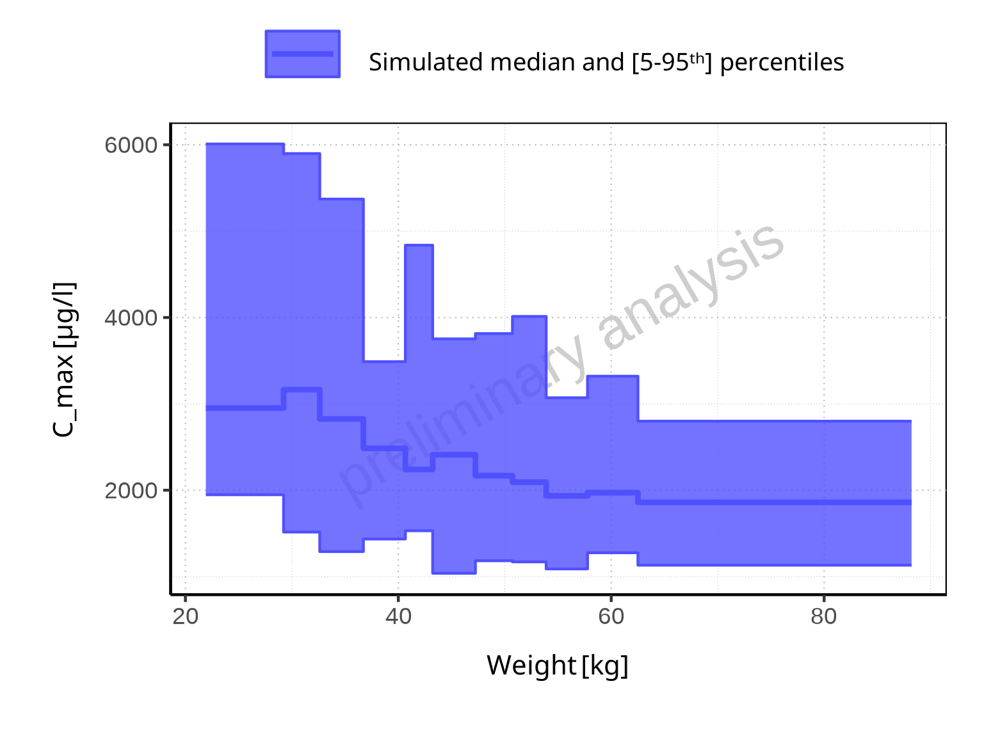


**Figure 2-18: Weight-dependence of C_max for Larson 2013 8y-18y 400mg FCT meal. Profiles are plotted in a linear scale.**


<br>
<br>


```{=openxml}
<w:br w:type="page"/>
```

`<w:bookmarkStart w:id="figure-2-19" w:name="figure-2-19"/><w:bookmarkEnd w:id="figure-2-19"/>`{=openxml}

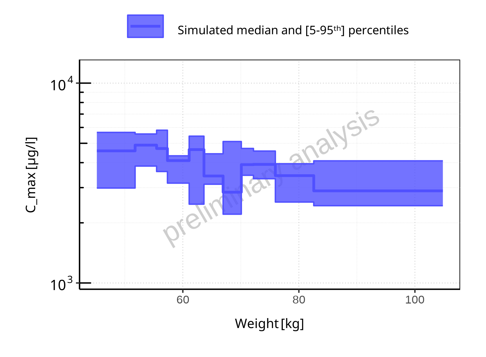


**Figure 2-19: Weight-dependence of C_max for Filmcoated_tablet_400mg_sd. Profiles are plotted in a logarithmic scale.**


<br>
<br>


```{=openxml}
<w:br w:type="page"/>
```

`<w:bookmarkStart w:id="figure-2-20" w:name="figure-2-20"/><w:bookmarkEnd w:id="figure-2-20"/>`{=openxml}

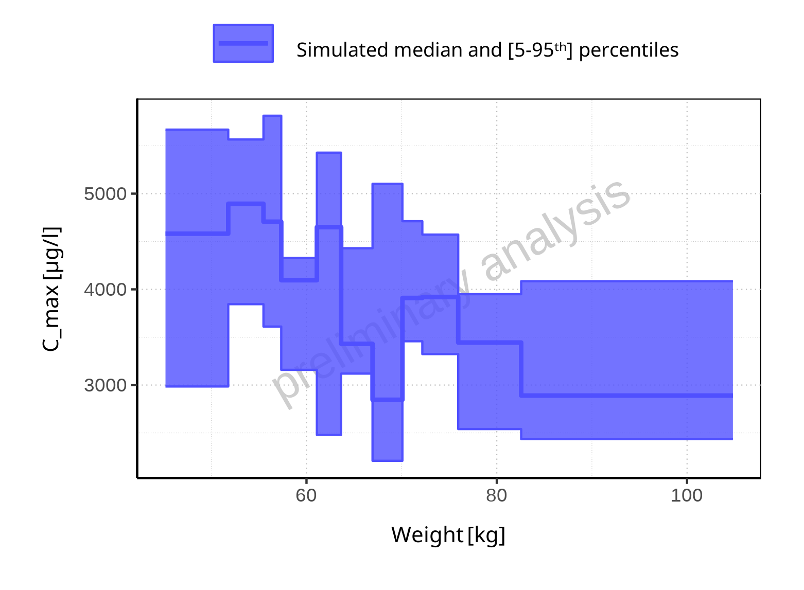


**Figure 2-20: Weight-dependence of C_max for Filmcoated_tablet_400mg_sd. Profiles are plotted in a linear scale.**


<br>
<br>


```{=openxml}
<w:br w:type="page"/>
```

`<w:bookmarkStart w:id="figure-2-21" w:name="figure-2-21"/><w:bookmarkEnd w:id="figure-2-21"/>`{=openxml}

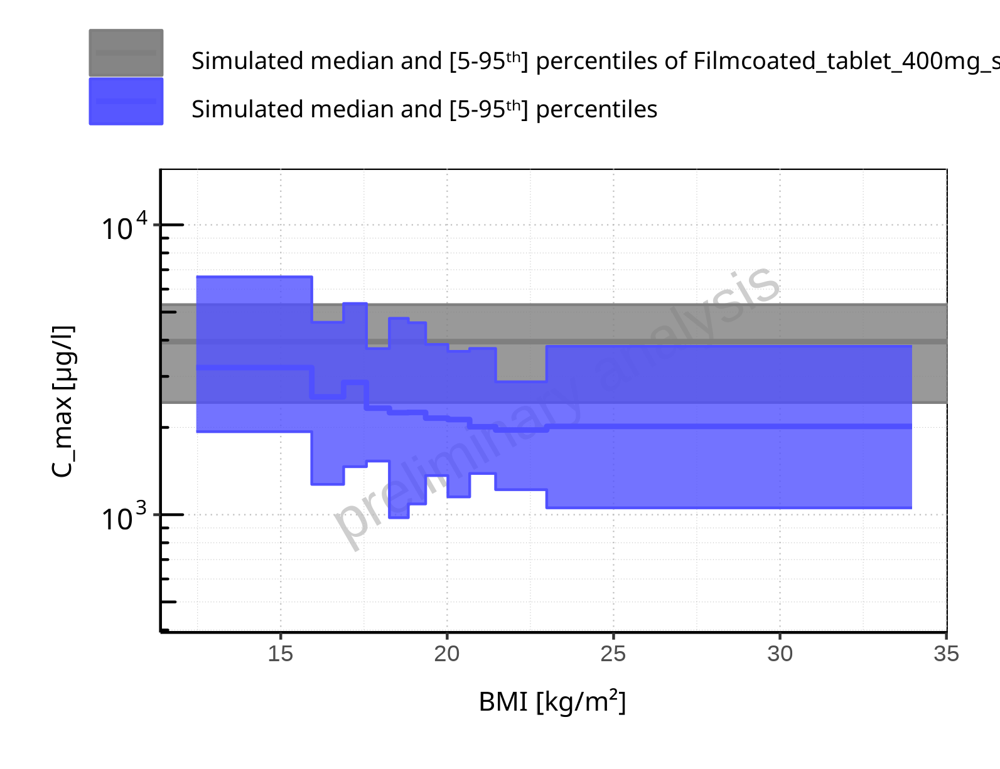


**Figure 2-21: BMI-dependence of C_max for Larson 2013 8y-18y 400mg FCT meal in comparison to Filmcoated_tablet_400mg_sd. Profiles are plotted in a logarithmic scale.**


<br>
<br>


```{=openxml}
<w:br w:type="page"/>
```

`<w:bookmarkStart w:id="figure-2-22" w:name="figure-2-22"/><w:bookmarkEnd w:id="figure-2-22"/>`{=openxml}

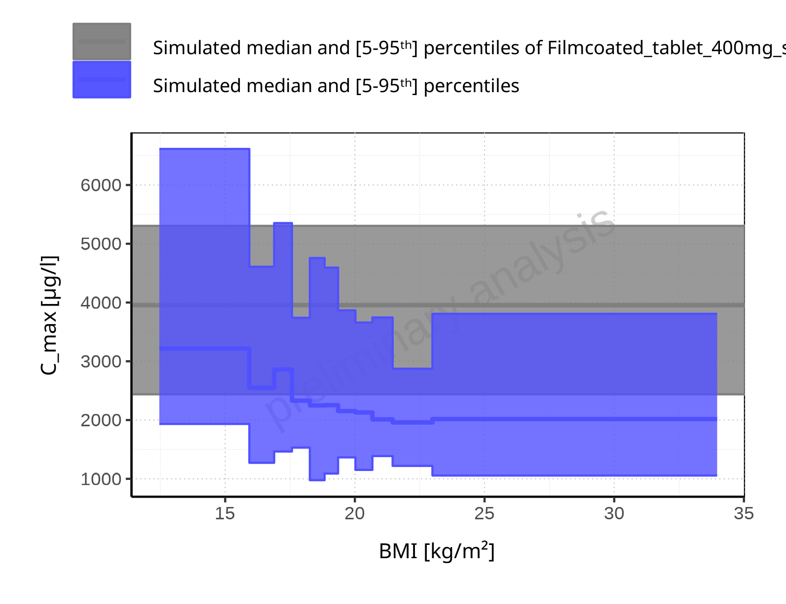


**Figure 2-22: BMI-dependence of C_max for Larson 2013 8y-18y 400mg FCT meal in comparison to Filmcoated_tablet_400mg_sd. Profiles are plotted in a linear scale.**


<br>
<br>


```{=openxml}
<w:br w:type="page"/>
```

`<w:bookmarkStart w:id="figure-2-23" w:name="figure-2-23"/><w:bookmarkEnd w:id="figure-2-23"/>`{=openxml}

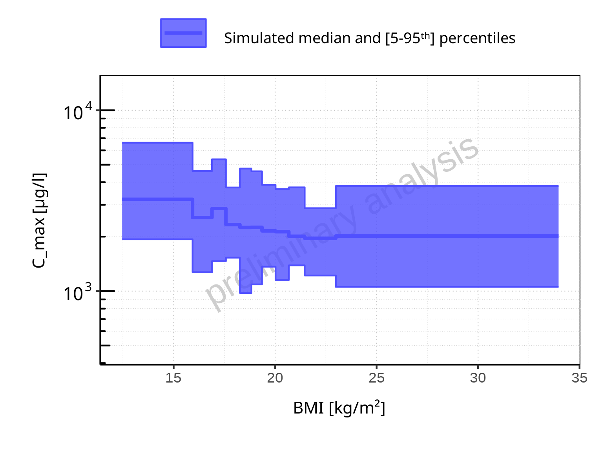


**Figure 2-23: BMI-dependence of C_max for Larson 2013 8y-18y 400mg FCT meal. Profiles are plotted in a logarithmic scale.**


<br>
<br>


```{=openxml}
<w:br w:type="page"/>
```

`<w:bookmarkStart w:id="figure-2-24" w:name="figure-2-24"/><w:bookmarkEnd w:id="figure-2-24"/>`{=openxml}

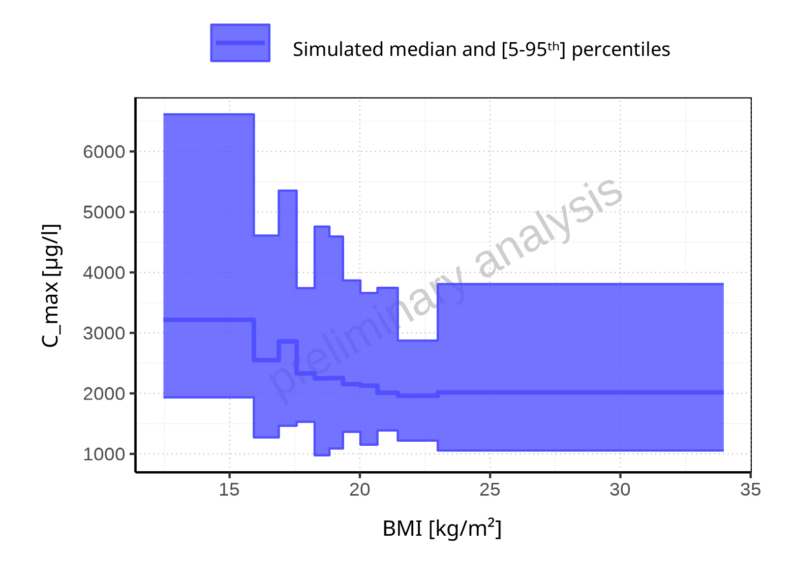


**Figure 2-24: BMI-dependence of C_max for Larson 2013 8y-18y 400mg FCT meal. Profiles are plotted in a linear scale.**


<br>
<br>


```{=openxml}
<w:br w:type="page"/>
```

`<w:bookmarkStart w:id="figure-2-25" w:name="figure-2-25"/><w:bookmarkEnd w:id="figure-2-25"/>`{=openxml}

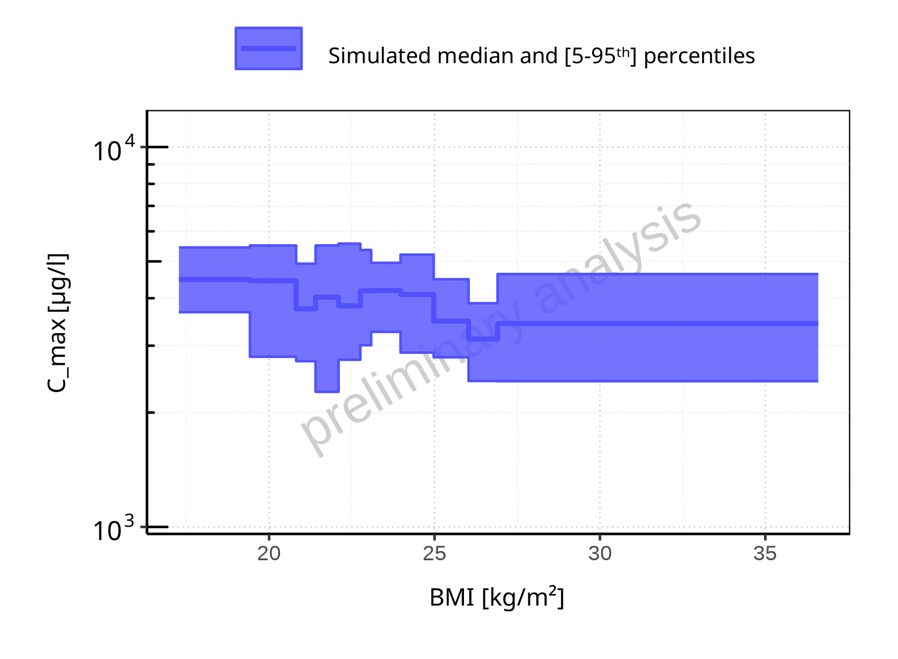


**Figure 2-25: BMI-dependence of C_max for Filmcoated_tablet_400mg_sd. Profiles are plotted in a logarithmic scale.**


<br>
<br>


```{=openxml}
<w:br w:type="page"/>
```

`<w:bookmarkStart w:id="figure-2-26" w:name="figure-2-26"/><w:bookmarkEnd w:id="figure-2-26"/>`{=openxml}

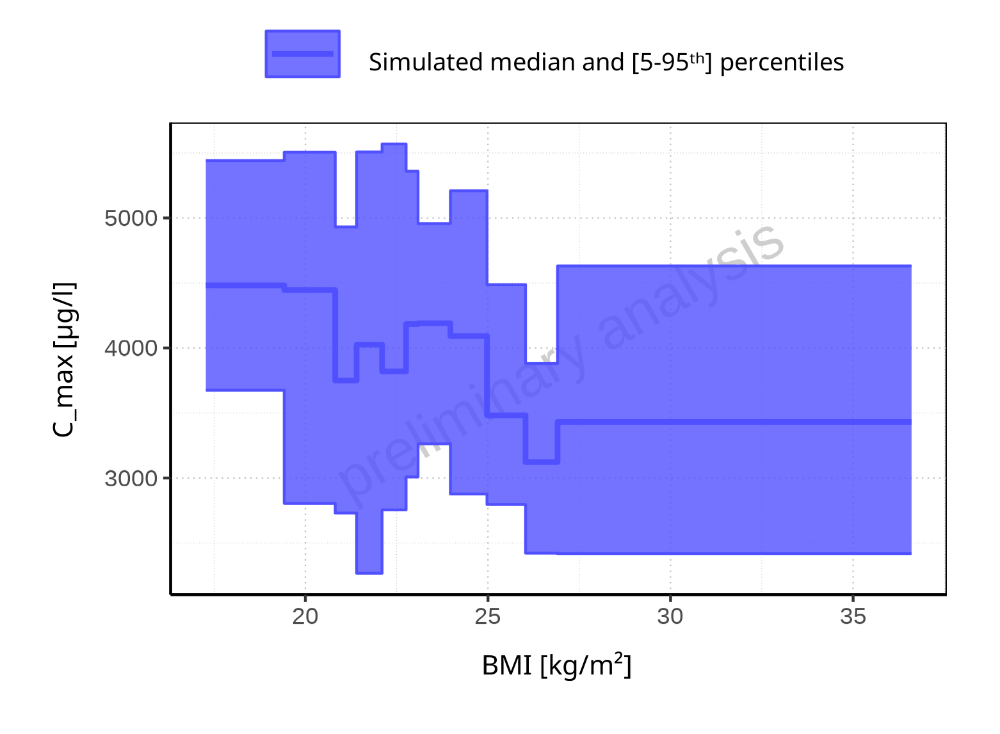


**Figure 2-26: BMI-dependence of C_max for Filmcoated_tablet_400mg_sd. Profiles are plotted in a linear scale.**


<br>
<br>


```{=openxml}
<w:br w:type="page"/>
```

`<w:bookmarkStart w:id="figure-2-27" w:name="figure-2-27"/><w:bookmarkEnd w:id="figure-2-27"/>`{=openxml}

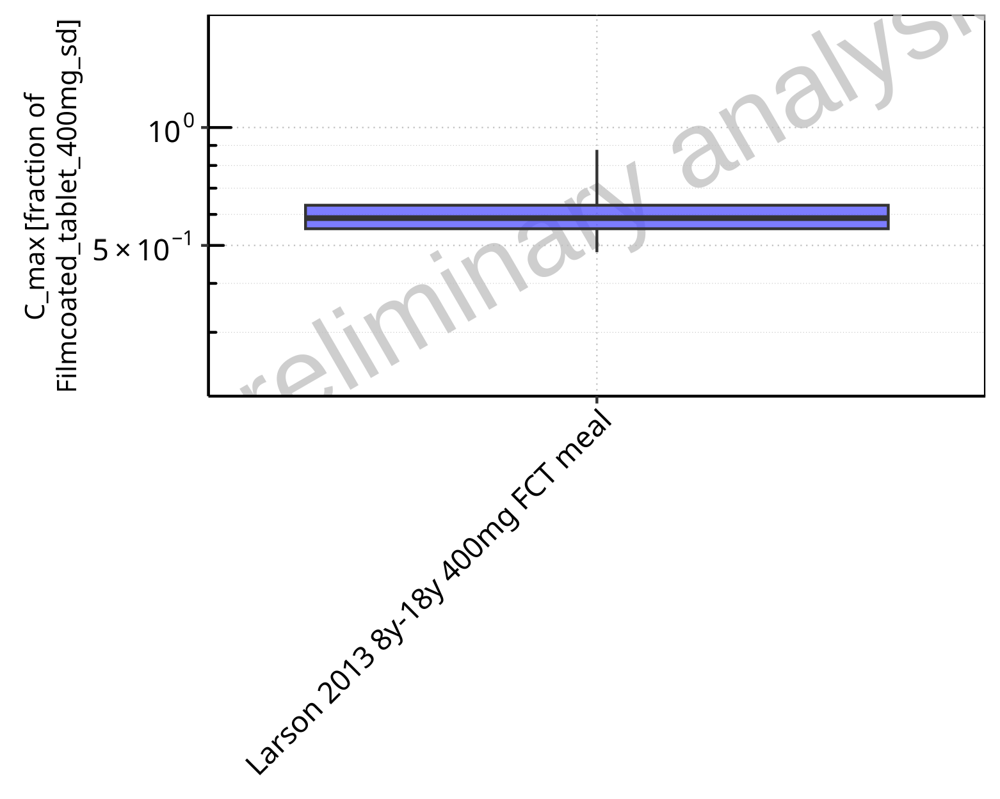


**Figure 2-27: Ratio of population summary statistics of C_max of Raltegravir  for  Larson 2013 8y-18y 400mg FCT meal in comparison to Filmcoated_tablet_400mg_sd shown as box-whisker plot, which indicates ratios of the 5^th^, 25^th^, 50^th^, 75^th^, 95^th^ percentiles in logarithmic scale.**


<br>
<br>


```{=openxml}
<w:br w:type="page"/>
```

`<w:bookmarkStart w:id="figure-2-28" w:name="figure-2-28"/><w:bookmarkEnd w:id="figure-2-28"/>`{=openxml}

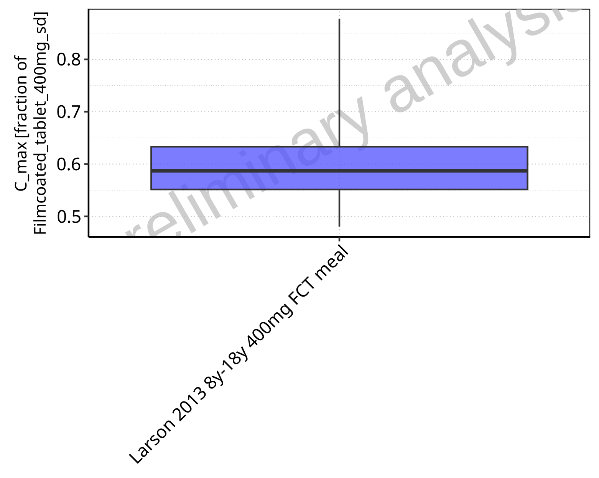


**Figure 2-28: Ratio of population summary statistics of C_max of Raltegravir  for  Larson 2013 8y-18y 400mg FCT meal in comparison to Filmcoated_tablet_400mg_sd shown as box-whisker plot, which indicates ratios of the 5^th^, 25^th^, 50^th^, 75^th^, 95^th^ percentiles in linear scale.**


<br>
<br>


```{=openxml}
<w:br w:type="page"/>
```

`<w:bookmarkStart w:id="table-2-2" w:name="table-2-2"/><w:bookmarkEnd w:id="table-2-2"/>`{=openxml}

**Table 2-2: Ratio of population summary statistics of C_max of Raltegravir  for  Larson 2013 8y-18y 400mg FCT meal in comparison to Filmcoated_tablet_400mg_sd**


|Population                        |N   |5^th^ pctl |25^th^ pctl |50^th^ pctl |75^th^ pctl |95^th^ pctl |Mean |SD   |Geo Mean |Geo SD |
|:---------------------------------|:---|:-------------------|:--------------------|:--------------------|:--------------------|:--------------------|:----|:----|:--------|:------|
|Larson 2013 8y-18y 400mg FCT meal |500 |0.48                |0.55                 |0.59                 |0.63                 |0.88                 |0.65 |1.33 |0.61     |1.20   |


<br>
<br>


### C_max_norm `<w:bookmarkStart w:id="31_pk_parameters_organism_peripheralvenousblood_raltegravir_plasma__peripheral_venous_blood__c_max_norm" w:name="31_pk_parameters_organism_peripheralvenousblood_raltegravir_plasma__peripheral_venous_blood__c_max_norm"/><w:bookmarkEnd w:id="31_pk_parameters_organism_peripheralvenousblood_raltegravir_plasma__peripheral_venous_blood__c_max_norm"/>`{=openxml}


```{=openxml}
<w:br w:type="page"/>
```

`<w:bookmarkStart w:id="figure-2-29" w:name="figure-2-29"/><w:bookmarkEnd w:id="figure-2-29"/>`{=openxml}

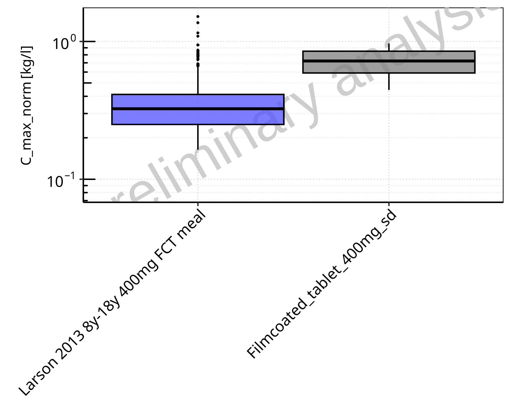


**Figure 2-29: C_max_norm of Raltegravir for Larson 2013 8y-18y 400mg FCT meal, Filmcoated_tablet_400mg_sd shown as box-whisker plot, which indicates  the 5^th^, 25^th^, 50^th^, 75^th^, 95^th^ percentiles in logarithmic scale.**


<br>
<br>


```{=openxml}
<w:br w:type="page"/>
```

`<w:bookmarkStart w:id="figure-2-30" w:name="figure-2-30"/><w:bookmarkEnd w:id="figure-2-30"/>`{=openxml}

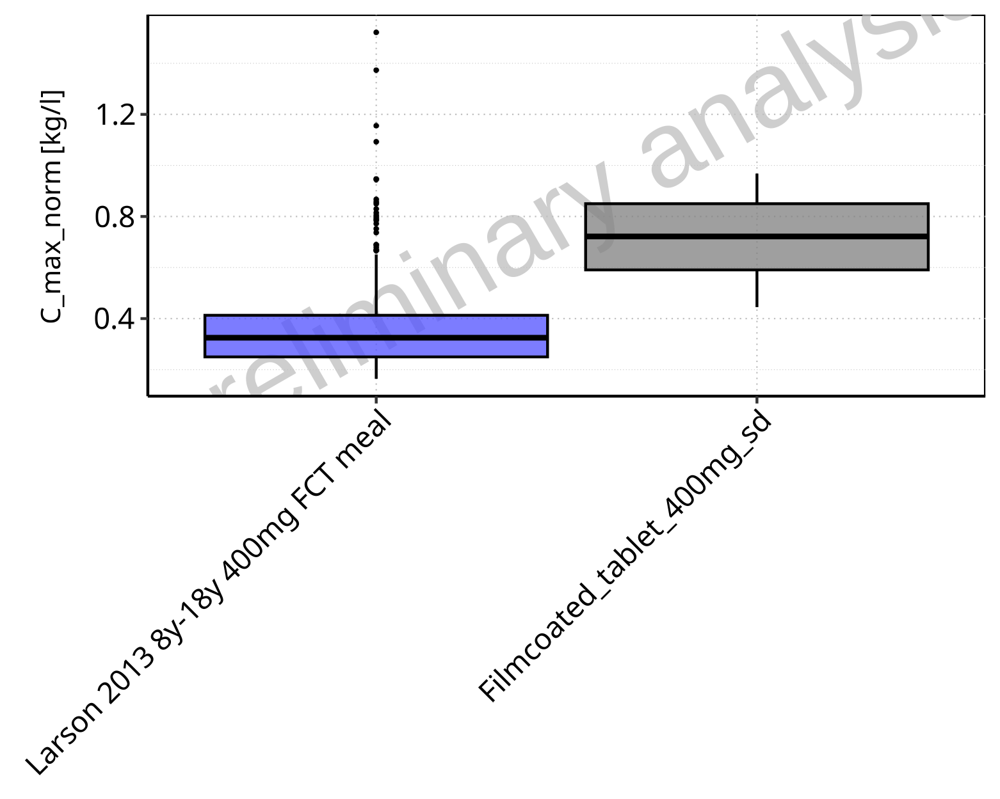


**Figure 2-30: C_max_norm of Raltegravir for Larson 2013 8y-18y 400mg FCT meal, Filmcoated_tablet_400mg_sd shown as box-whisker plot, which indicates  the 5^th^, 25^th^, 50^th^, 75^th^, 95^th^ percentiles in linear scale.**


<br>
<br>


```{=openxml}
<w:br w:type="page"/>
```

`<w:bookmarkStart w:id="table-2-3" w:name="table-2-3"/><w:bookmarkEnd w:id="table-2-3"/>`{=openxml}

**Table 2-3: Population statistics summarizing C_max_norm of Raltegravir for Larson 2013 8y-18y 400mg FCT meal, Filmcoated_tablet_400mg_sd reported in [kg/l]**


|Population                        |N   |5^th^ pctl |25^th^ pctl |50^th^ pctl |75^th^ pctl |95^th^ pctl |Mean |SD   |Geo Mean |Geo SD |
|:---------------------------------|:---|:-------------------|:--------------------|:--------------------|:--------------------|:--------------------|:----|:----|:--------|:------|
|Larson 2013 8y-18y 400mg FCT meal |500 |0.16                |0.25                 |0.33                 |0.41                 |0.65                 |0.36 |0.17 |0.33     |1.52   |
|Filmcoated_tablet_400mg_sd        |100 |0.44                |0.59                 |0.72                 |0.85                 |0.97                 |0.72 |0.17 |0.70     |1.27   |


<br>
<br>


```{=openxml}
<w:br w:type="page"/>
```

`<w:bookmarkStart w:id="figure-2-31" w:name="figure-2-31"/><w:bookmarkEnd w:id="figure-2-31"/>`{=openxml}

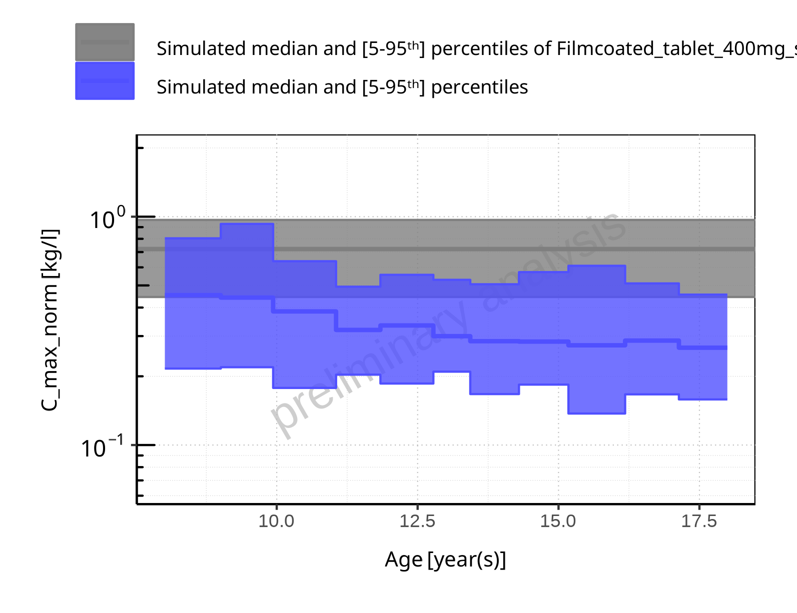


**Figure 2-31: Age-dependence of C_max_norm for Larson 2013 8y-18y 400mg FCT meal in comparison to Filmcoated_tablet_400mg_sd. Profiles are plotted in a logarithmic scale.**


<br>
<br>


```{=openxml}
<w:br w:type="page"/>
```

`<w:bookmarkStart w:id="figure-2-32" w:name="figure-2-32"/><w:bookmarkEnd w:id="figure-2-32"/>`{=openxml}

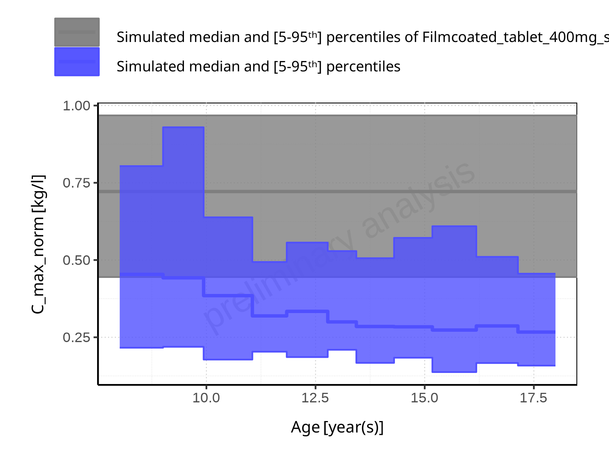


**Figure 2-32: Age-dependence of C_max_norm for Larson 2013 8y-18y 400mg FCT meal in comparison to Filmcoated_tablet_400mg_sd. Profiles are plotted in a linear scale.**


<br>
<br>


```{=openxml}
<w:br w:type="page"/>
```

`<w:bookmarkStart w:id="figure-2-33" w:name="figure-2-33"/><w:bookmarkEnd w:id="figure-2-33"/>`{=openxml}

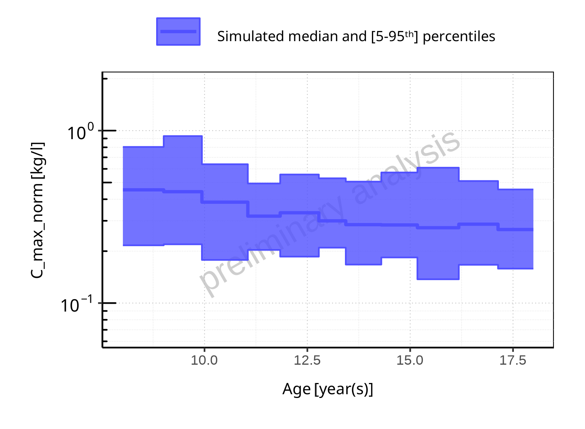


**Figure 2-33: Age-dependence of C_max_norm for Larson 2013 8y-18y 400mg FCT meal. Profiles are plotted in a logarithmic scale.**


<br>
<br>


```{=openxml}
<w:br w:type="page"/>
```

`<w:bookmarkStart w:id="figure-2-34" w:name="figure-2-34"/><w:bookmarkEnd w:id="figure-2-34"/>`{=openxml}

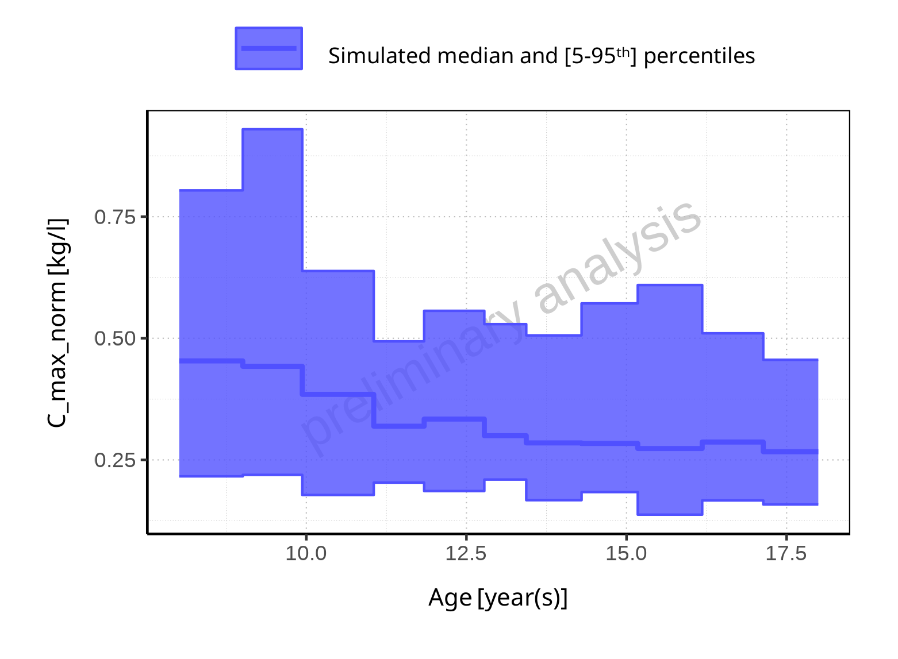


**Figure 2-34: Age-dependence of C_max_norm for Larson 2013 8y-18y 400mg FCT meal. Profiles are plotted in a linear scale.**


<br>
<br>


```{=openxml}
<w:br w:type="page"/>
```

`<w:bookmarkStart w:id="figure-2-35" w:name="figure-2-35"/><w:bookmarkEnd w:id="figure-2-35"/>`{=openxml}

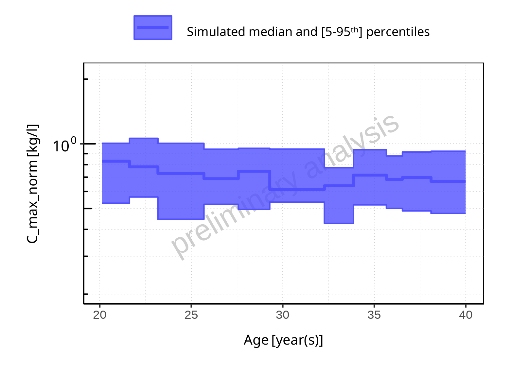


**Figure 2-35: Age-dependence of C_max_norm for Filmcoated_tablet_400mg_sd. Profiles are plotted in a logarithmic scale.**


<br>
<br>


```{=openxml}
<w:br w:type="page"/>
```

`<w:bookmarkStart w:id="figure-2-36" w:name="figure-2-36"/><w:bookmarkEnd w:id="figure-2-36"/>`{=openxml}

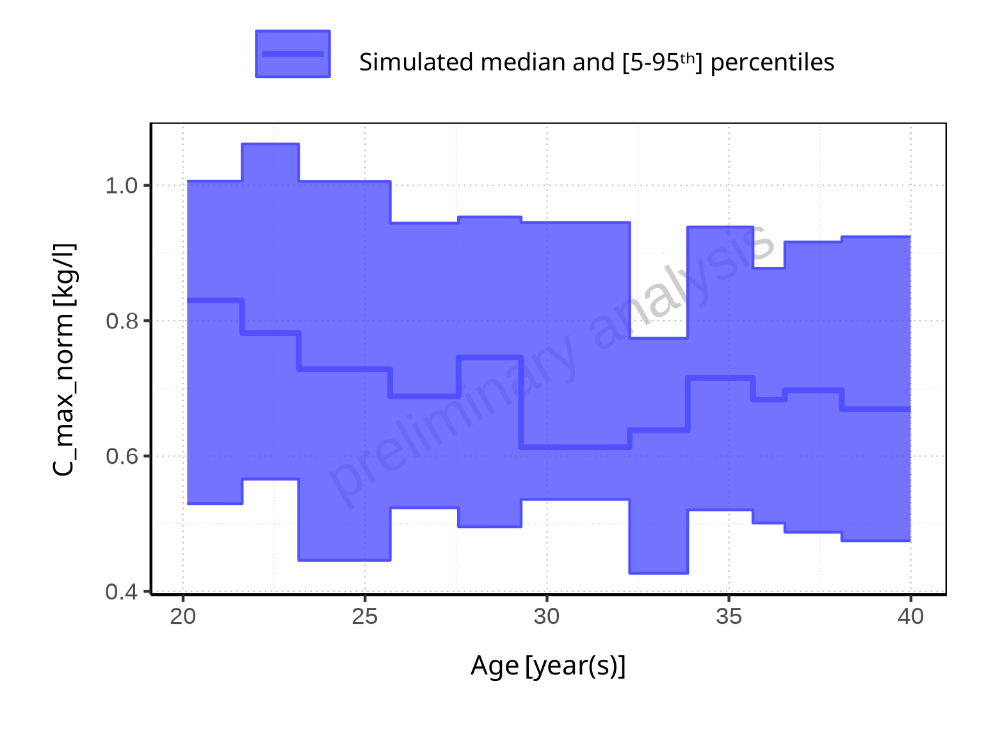


**Figure 2-36: Age-dependence of C_max_norm for Filmcoated_tablet_400mg_sd. Profiles are plotted in a linear scale.**


<br>
<br>


```{=openxml}
<w:br w:type="page"/>
```

`<w:bookmarkStart w:id="figure-2-37" w:name="figure-2-37"/><w:bookmarkEnd w:id="figure-2-37"/>`{=openxml}

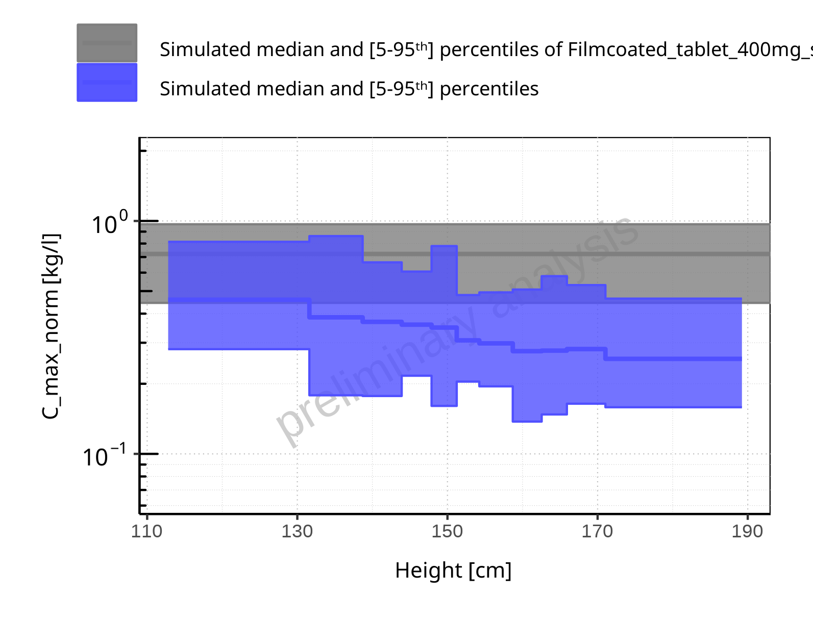


**Figure 2-37: Height-dependence of C_max_norm for Larson 2013 8y-18y 400mg FCT meal in comparison to Filmcoated_tablet_400mg_sd. Profiles are plotted in a logarithmic scale.**


<br>
<br>


```{=openxml}
<w:br w:type="page"/>
```

`<w:bookmarkStart w:id="figure-2-38" w:name="figure-2-38"/><w:bookmarkEnd w:id="figure-2-38"/>`{=openxml}

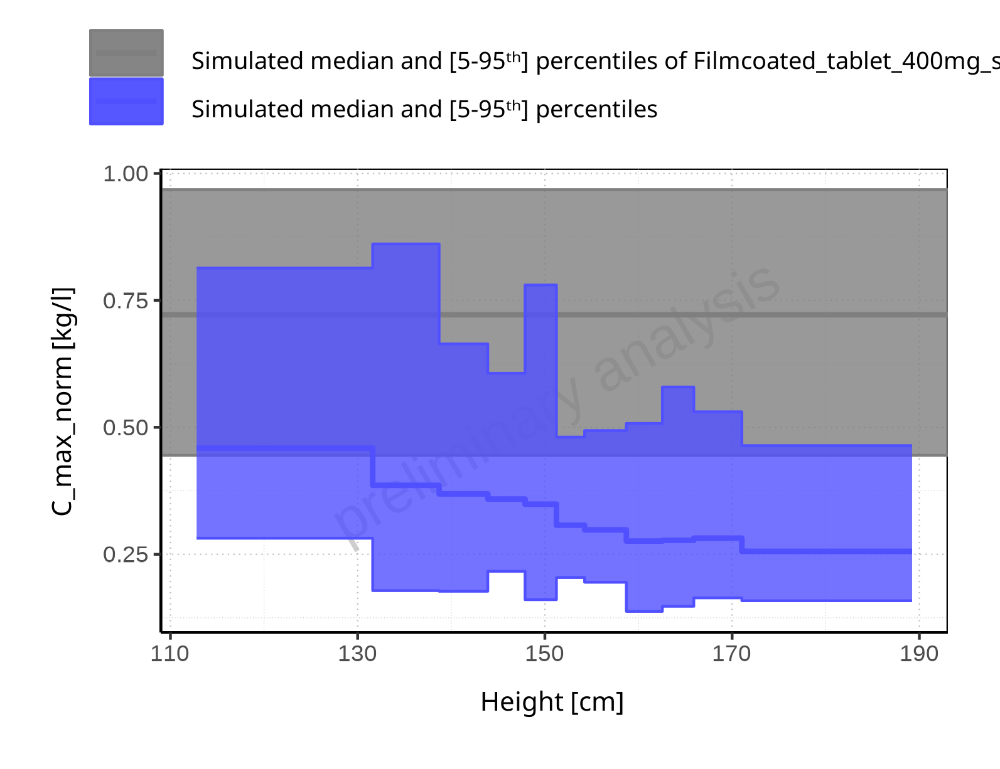


**Figure 2-38: Height-dependence of C_max_norm for Larson 2013 8y-18y 400mg FCT meal in comparison to Filmcoated_tablet_400mg_sd. Profiles are plotted in a linear scale.**


<br>
<br>


```{=openxml}
<w:br w:type="page"/>
```

`<w:bookmarkStart w:id="figure-2-39" w:name="figure-2-39"/><w:bookmarkEnd w:id="figure-2-39"/>`{=openxml}

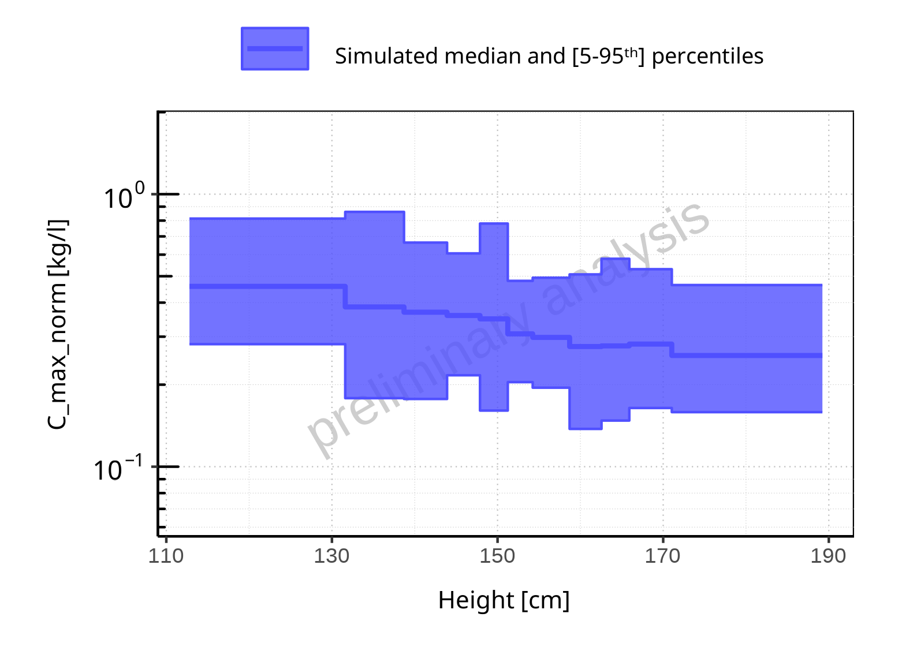


**Figure 2-39: Height-dependence of C_max_norm for Larson 2013 8y-18y 400mg FCT meal. Profiles are plotted in a logarithmic scale.**


<br>
<br>


```{=openxml}
<w:br w:type="page"/>
```

`<w:bookmarkStart w:id="figure-2-40" w:name="figure-2-40"/><w:bookmarkEnd w:id="figure-2-40"/>`{=openxml}

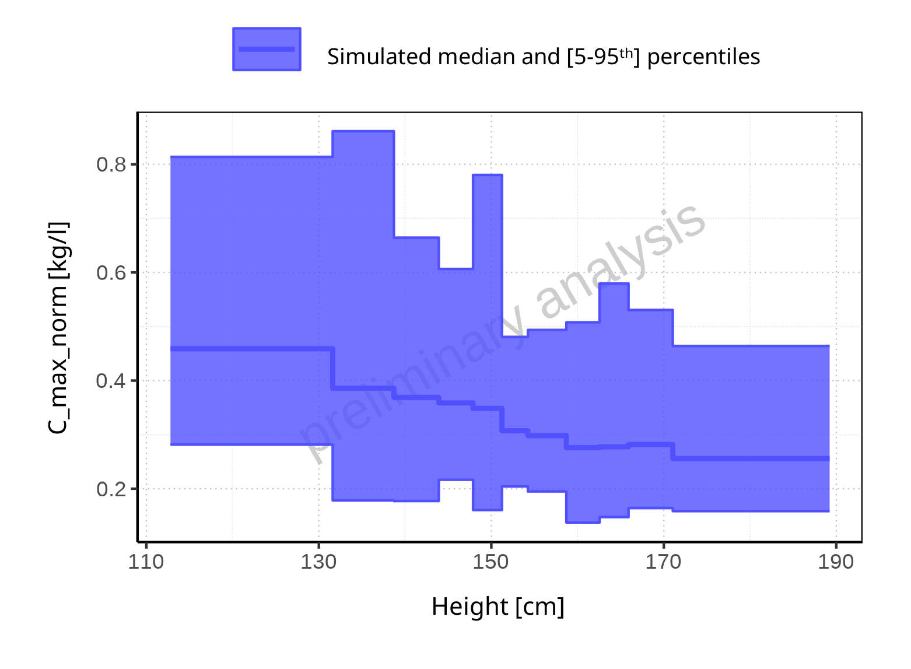


**Figure 2-40: Height-dependence of C_max_norm for Larson 2013 8y-18y 400mg FCT meal. Profiles are plotted in a linear scale.**


<br>
<br>


```{=openxml}
<w:br w:type="page"/>
```

`<w:bookmarkStart w:id="figure-2-41" w:name="figure-2-41"/><w:bookmarkEnd w:id="figure-2-41"/>`{=openxml}

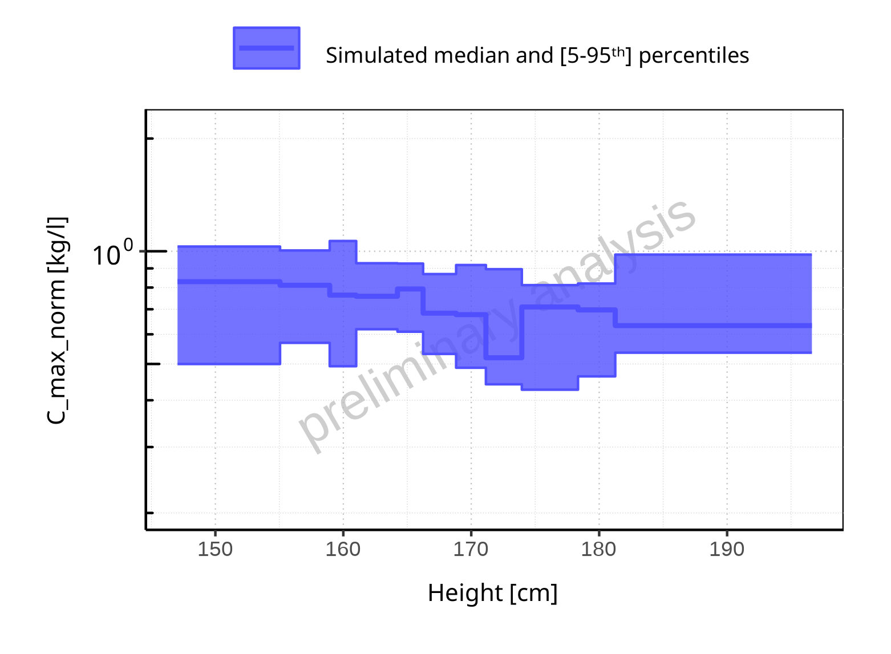


**Figure 2-41: Height-dependence of C_max_norm for Filmcoated_tablet_400mg_sd. Profiles are plotted in a logarithmic scale.**


<br>
<br>


```{=openxml}
<w:br w:type="page"/>
```

`<w:bookmarkStart w:id="figure-2-42" w:name="figure-2-42"/><w:bookmarkEnd w:id="figure-2-42"/>`{=openxml}

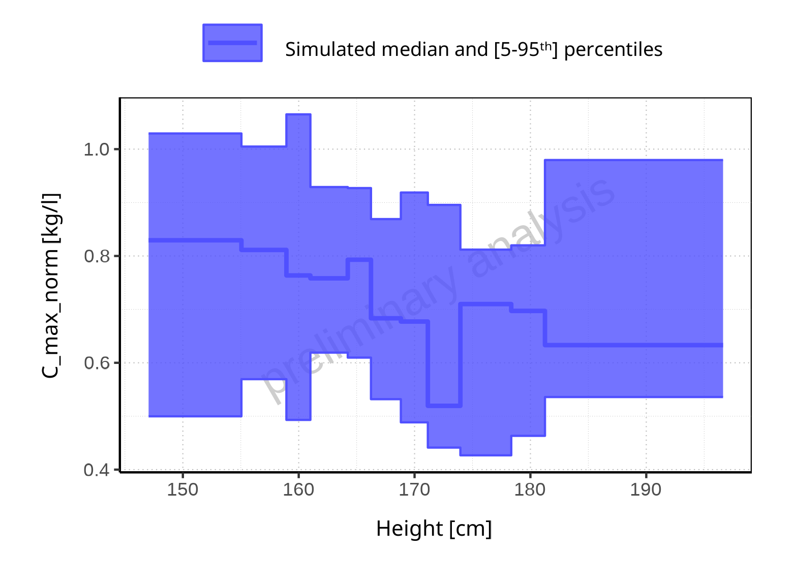


**Figure 2-42: Height-dependence of C_max_norm for Filmcoated_tablet_400mg_sd. Profiles are plotted in a linear scale.**


<br>
<br>


```{=openxml}
<w:br w:type="page"/>
```

`<w:bookmarkStart w:id="figure-2-43" w:name="figure-2-43"/><w:bookmarkEnd w:id="figure-2-43"/>`{=openxml}

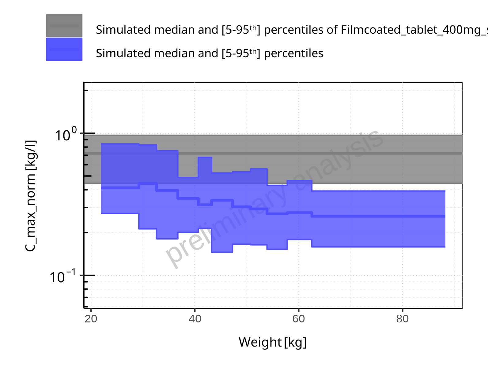


**Figure 2-43: Weight-dependence of C_max_norm for Larson 2013 8y-18y 400mg FCT meal in comparison to Filmcoated_tablet_400mg_sd. Profiles are plotted in a logarithmic scale.**


<br>
<br>


```{=openxml}
<w:br w:type="page"/>
```

`<w:bookmarkStart w:id="figure-2-44" w:name="figure-2-44"/><w:bookmarkEnd w:id="figure-2-44"/>`{=openxml}

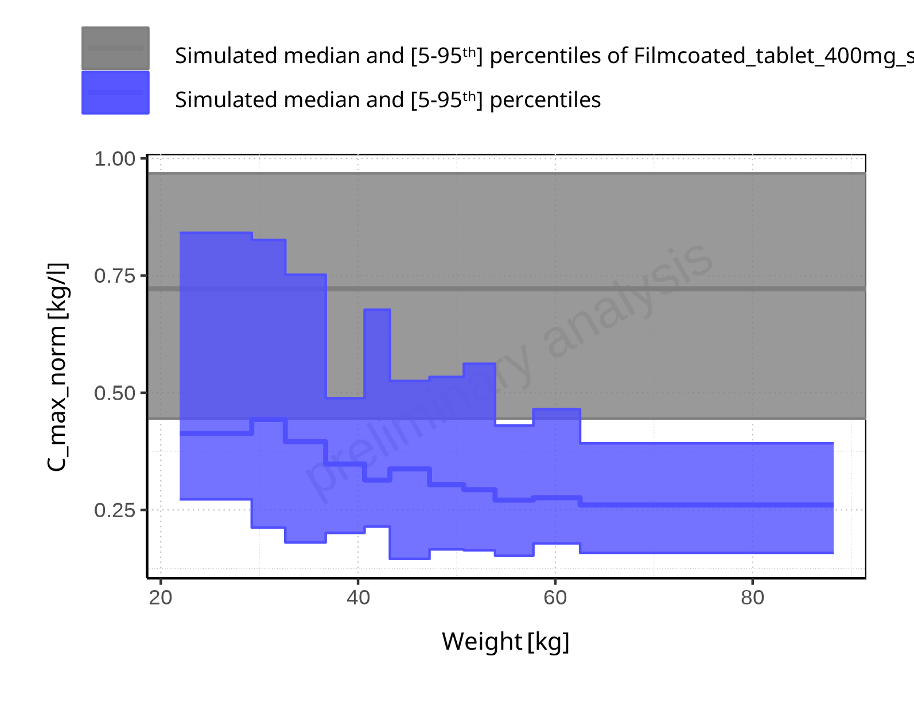


**Figure 2-44: Weight-dependence of C_max_norm for Larson 2013 8y-18y 400mg FCT meal in comparison to Filmcoated_tablet_400mg_sd. Profiles are plotted in a linear scale.**


<br>
<br>


```{=openxml}
<w:br w:type="page"/>
```

`<w:bookmarkStart w:id="figure-2-45" w:name="figure-2-45"/><w:bookmarkEnd w:id="figure-2-45"/>`{=openxml}

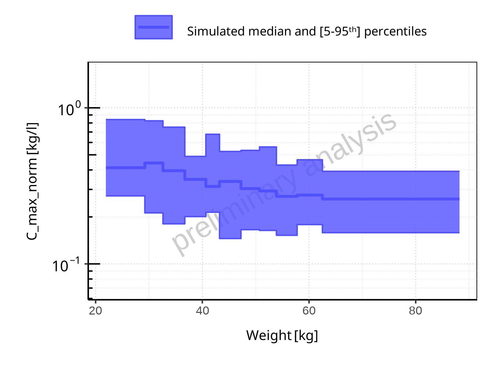


**Figure 2-45: Weight-dependence of C_max_norm for Larson 2013 8y-18y 400mg FCT meal. Profiles are plotted in a logarithmic scale.**


<br>
<br>


```{=openxml}
<w:br w:type="page"/>
```

`<w:bookmarkStart w:id="figure-2-46" w:name="figure-2-46"/><w:bookmarkEnd w:id="figure-2-46"/>`{=openxml}

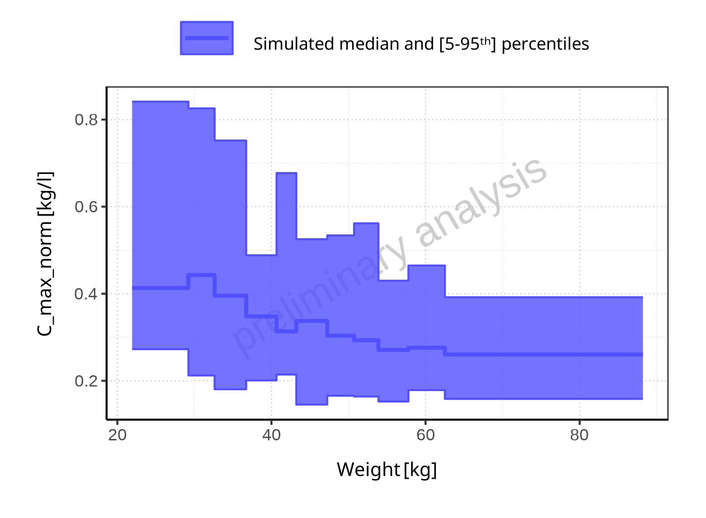


**Figure 2-46: Weight-dependence of C_max_norm for Larson 2013 8y-18y 400mg FCT meal. Profiles are plotted in a linear scale.**


<br>
<br>


```{=openxml}
<w:br w:type="page"/>
```

`<w:bookmarkStart w:id="figure-2-47" w:name="figure-2-47"/><w:bookmarkEnd w:id="figure-2-47"/>`{=openxml}

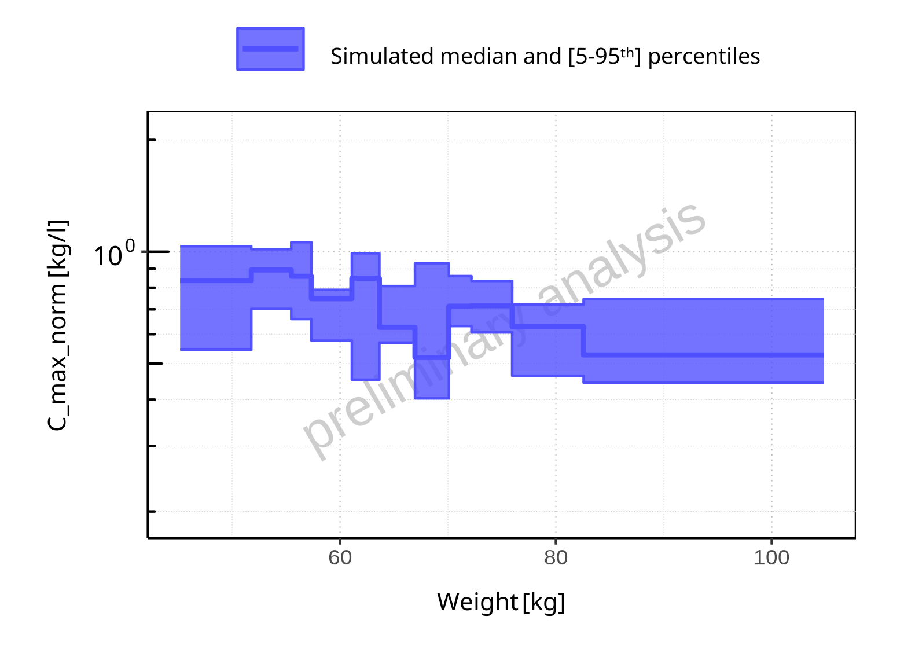


**Figure 2-47: Weight-dependence of C_max_norm for Filmcoated_tablet_400mg_sd. Profiles are plotted in a logarithmic scale.**


<br>
<br>


```{=openxml}
<w:br w:type="page"/>
```

`<w:bookmarkStart w:id="figure-2-48" w:name="figure-2-48"/><w:bookmarkEnd w:id="figure-2-48"/>`{=openxml}

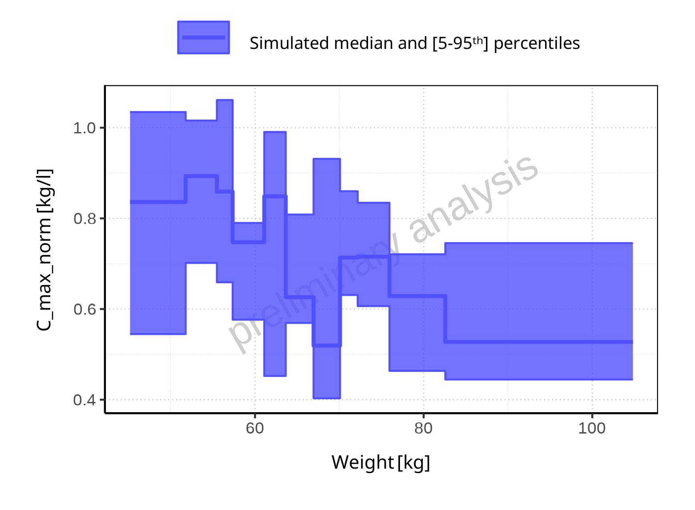


**Figure 2-48: Weight-dependence of C_max_norm for Filmcoated_tablet_400mg_sd. Profiles are plotted in a linear scale.**


<br>
<br>


```{=openxml}
<w:br w:type="page"/>
```

`<w:bookmarkStart w:id="figure-2-49" w:name="figure-2-49"/><w:bookmarkEnd w:id="figure-2-49"/>`{=openxml}

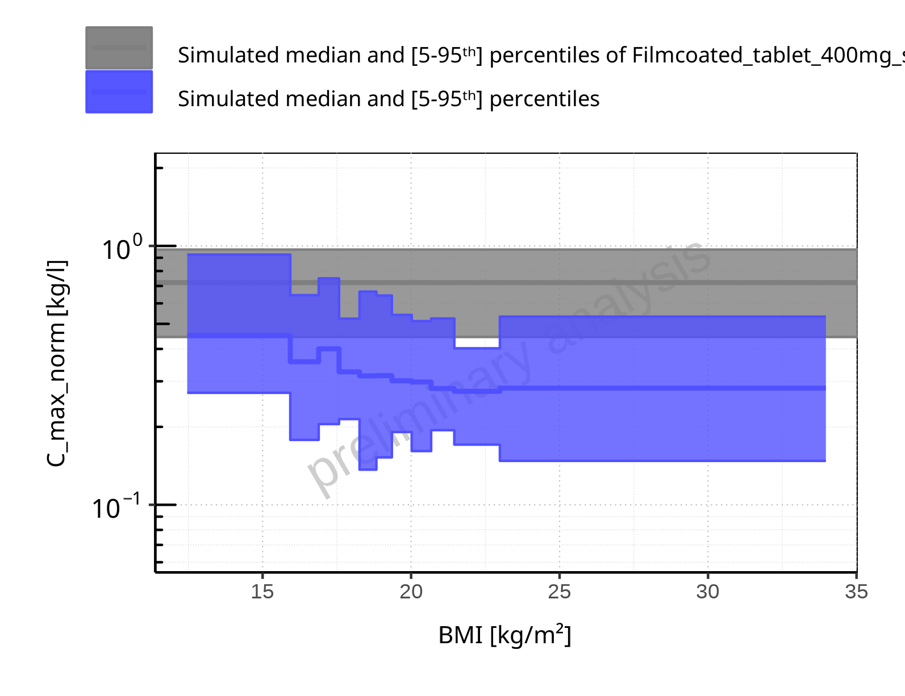


**Figure 2-49: BMI-dependence of C_max_norm for Larson 2013 8y-18y 400mg FCT meal in comparison to Filmcoated_tablet_400mg_sd. Profiles are plotted in a logarithmic scale.**


<br>
<br>


```{=openxml}
<w:br w:type="page"/>
```

`<w:bookmarkStart w:id="figure-2-50" w:name="figure-2-50"/><w:bookmarkEnd w:id="figure-2-50"/>`{=openxml}

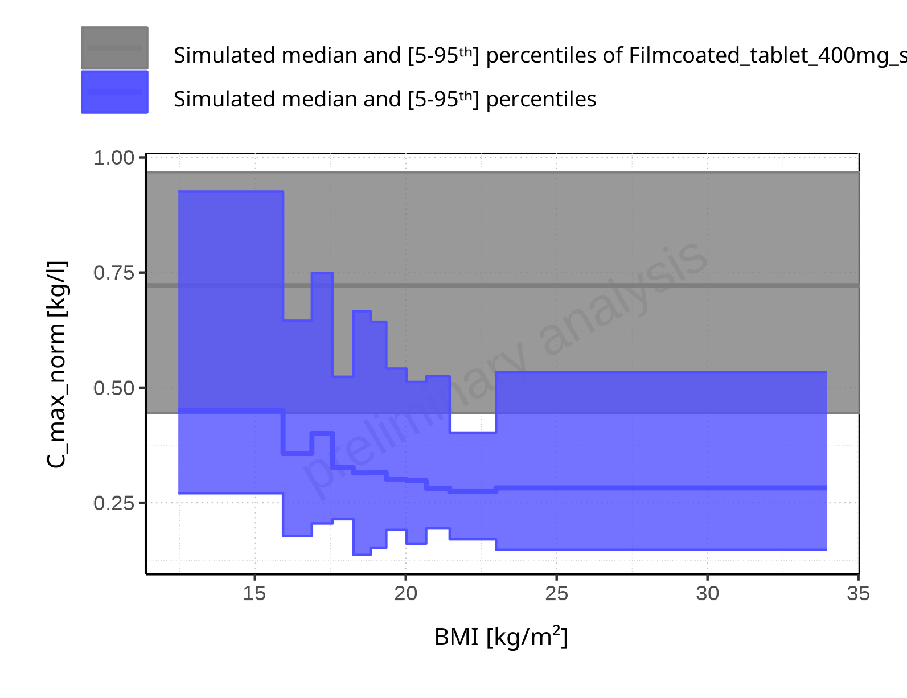


**Figure 2-50: BMI-dependence of C_max_norm for Larson 2013 8y-18y 400mg FCT meal in comparison to Filmcoated_tablet_400mg_sd. Profiles are plotted in a linear scale.**


<br>
<br>


```{=openxml}
<w:br w:type="page"/>
```

`<w:bookmarkStart w:id="figure-2-51" w:name="figure-2-51"/><w:bookmarkEnd w:id="figure-2-51"/>`{=openxml}

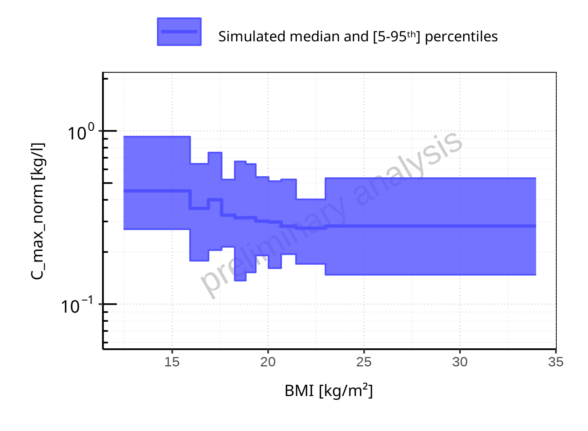


**Figure 2-51: BMI-dependence of C_max_norm for Larson 2013 8y-18y 400mg FCT meal. Profiles are plotted in a logarithmic scale.**


<br>
<br>


```{=openxml}
<w:br w:type="page"/>
```

`<w:bookmarkStart w:id="figure-2-52" w:name="figure-2-52"/><w:bookmarkEnd w:id="figure-2-52"/>`{=openxml}

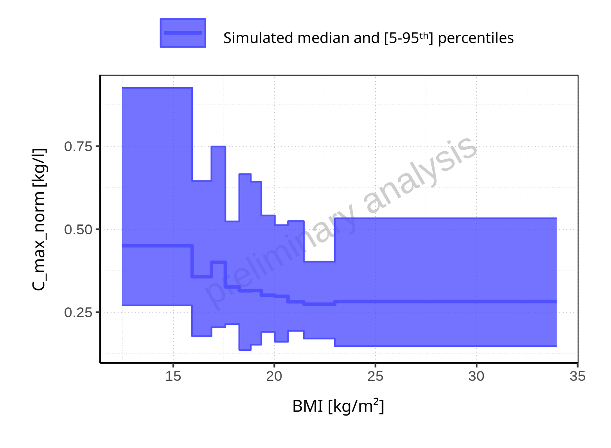


**Figure 2-52: BMI-dependence of C_max_norm for Larson 2013 8y-18y 400mg FCT meal. Profiles are plotted in a linear scale.**


<br>
<br>


```{=openxml}
<w:br w:type="page"/>
```

`<w:bookmarkStart w:id="figure-2-53" w:name="figure-2-53"/><w:bookmarkEnd w:id="figure-2-53"/>`{=openxml}

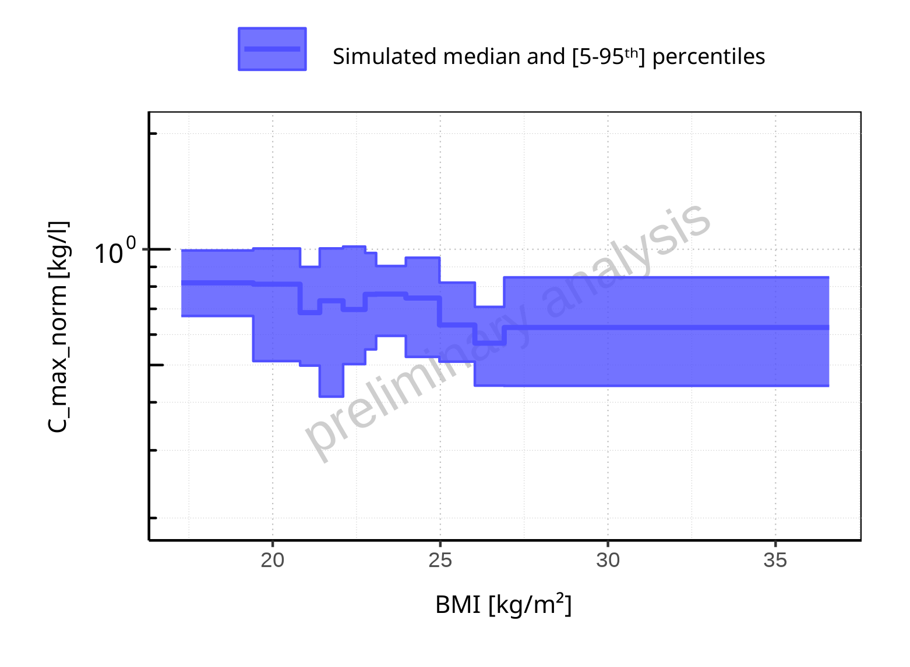


**Figure 2-53: BMI-dependence of C_max_norm for Filmcoated_tablet_400mg_sd. Profiles are plotted in a logarithmic scale.**


<br>
<br>


```{=openxml}
<w:br w:type="page"/>
```

`<w:bookmarkStart w:id="figure-2-54" w:name="figure-2-54"/><w:bookmarkEnd w:id="figure-2-54"/>`{=openxml}

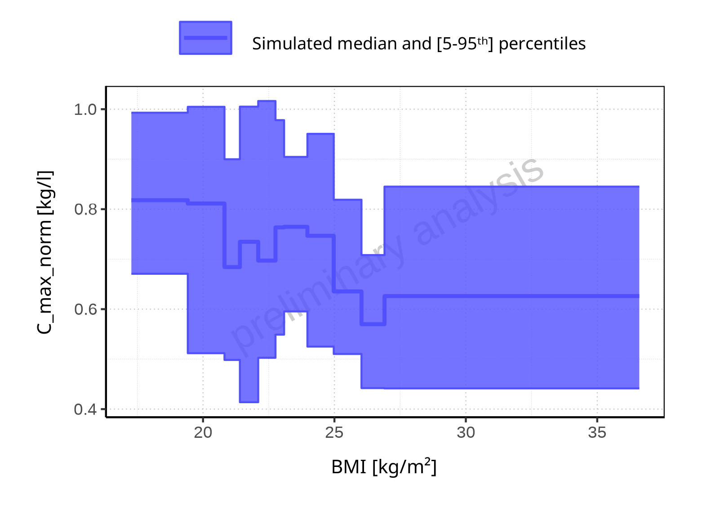


**Figure 2-54: BMI-dependence of C_max_norm for Filmcoated_tablet_400mg_sd. Profiles are plotted in a linear scale.**


<br>
<br>


```{=openxml}
<w:br w:type="page"/>
```

`<w:bookmarkStart w:id="figure-2-55" w:name="figure-2-55"/><w:bookmarkEnd w:id="figure-2-55"/>`{=openxml}

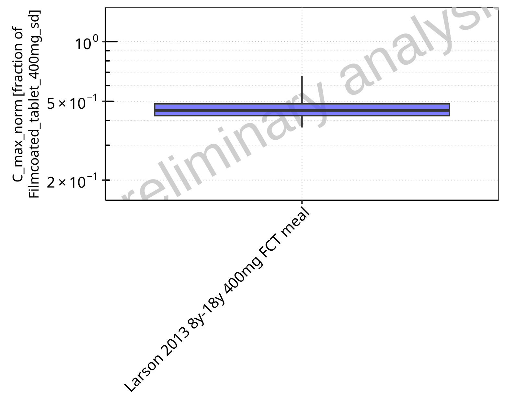


**Figure 2-55: Ratio of population summary statistics of C_max_norm of Raltegravir  for  Larson 2013 8y-18y 400mg FCT meal in comparison to Filmcoated_tablet_400mg_sd shown as box-whisker plot, which indicates ratios of the 5^th^, 25^th^, 50^th^, 75^th^, 95^th^ percentiles in logarithmic scale.**


<br>
<br>


```{=openxml}
<w:br w:type="page"/>
```

`<w:bookmarkStart w:id="figure-2-56" w:name="figure-2-56"/><w:bookmarkEnd w:id="figure-2-56"/>`{=openxml}

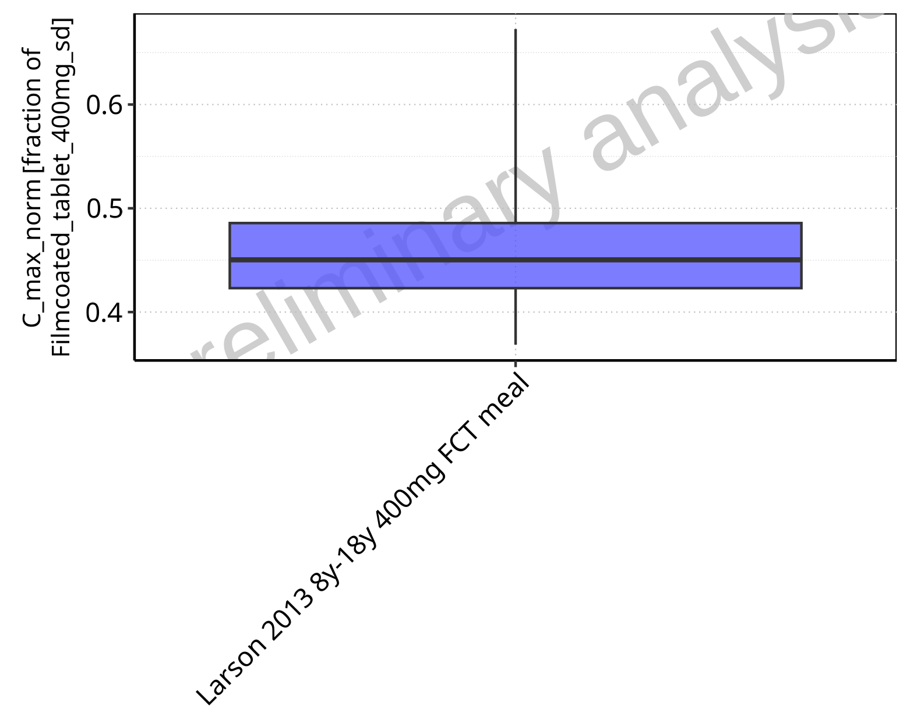


**Figure 2-56: Ratio of population summary statistics of C_max_norm of Raltegravir  for  Larson 2013 8y-18y 400mg FCT meal in comparison to Filmcoated_tablet_400mg_sd shown as box-whisker plot, which indicates ratios of the 5^th^, 25^th^, 50^th^, 75^th^, 95^th^ percentiles in linear scale.**


<br>
<br>


```{=openxml}
<w:br w:type="page"/>
```

`<w:bookmarkStart w:id="table-2-4" w:name="table-2-4"/><w:bookmarkEnd w:id="table-2-4"/>`{=openxml}

**Table 2-4: Ratio of population summary statistics of C_max_norm of Raltegravir  for  Larson 2013 8y-18y 400mg FCT meal in comparison to Filmcoated_tablet_400mg_sd**


|Population                        |N   |5^th^ pctl |25^th^ pctl |50^th^ pctl |75^th^ pctl |95^th^ pctl |Mean |SD   |Geo Mean |Geo SD |
|:---------------------------------|:---|:-------------------|:--------------------|:--------------------|:--------------------|:--------------------|:----|:----|:--------|:------|
|Larson 2013 8y-18y 400mg FCT meal |500 |0.37                |0.42                 |0.45                 |0.49                 |0.67                 |0.50 |1.02 |0.47     |1.20   |


<br>
<br>


### t_max `<w:bookmarkStart w:id="60_pk_parameters_organism_peripheralvenousblood_raltegravir_plasma__peripheral_venous_blood__t_max" w:name="60_pk_parameters_organism_peripheralvenousblood_raltegravir_plasma__peripheral_venous_blood__t_max"/><w:bookmarkEnd w:id="60_pk_parameters_organism_peripheralvenousblood_raltegravir_plasma__peripheral_venous_blood__t_max"/>`{=openxml}


```{=openxml}
<w:br w:type="page"/>
```

`<w:bookmarkStart w:id="figure-2-57" w:name="figure-2-57"/><w:bookmarkEnd w:id="figure-2-57"/>`{=openxml}

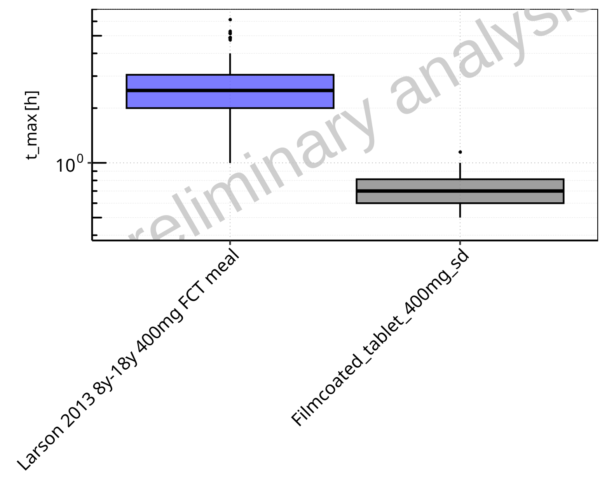


**Figure 2-57: t_max of Raltegravir for Larson 2013 8y-18y 400mg FCT meal, Filmcoated_tablet_400mg_sd shown as box-whisker plot, which indicates  the 5^th^, 25^th^, 50^th^, 75^th^, 95^th^ percentiles in logarithmic scale.**


<br>
<br>


```{=openxml}
<w:br w:type="page"/>
```

`<w:bookmarkStart w:id="figure-2-58" w:name="figure-2-58"/><w:bookmarkEnd w:id="figure-2-58"/>`{=openxml}

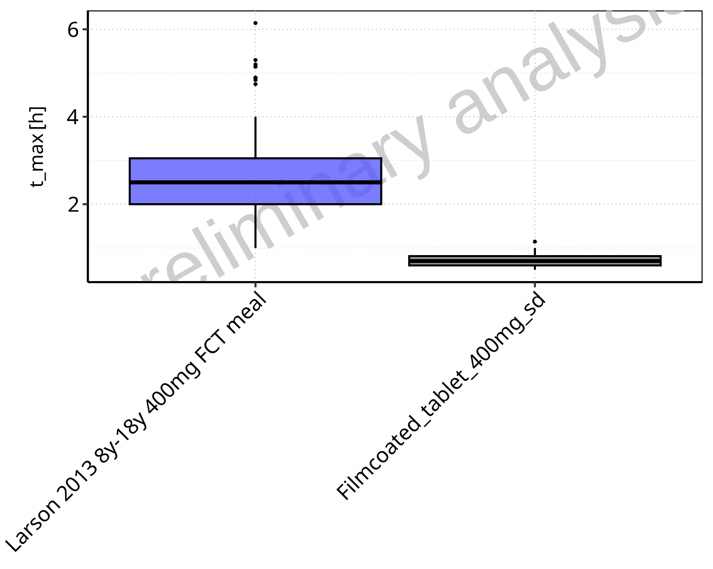


**Figure 2-58: t_max of Raltegravir for Larson 2013 8y-18y 400mg FCT meal, Filmcoated_tablet_400mg_sd shown as box-whisker plot, which indicates  the 5^th^, 25^th^, 50^th^, 75^th^, 95^th^ percentiles in linear scale.**


<br>
<br>


```{=openxml}
<w:br w:type="page"/>
```

`<w:bookmarkStart w:id="table-2-5" w:name="table-2-5"/><w:bookmarkEnd w:id="table-2-5"/>`{=openxml}

**Table 2-5: Population statistics summarizing t_max of Raltegravir for Larson 2013 8y-18y 400mg FCT meal, Filmcoated_tablet_400mg_sd reported in [h]**


|Population                        |N   |5^th^ pctl |25^th^ pctl |50^th^ pctl |75^th^ pctl |95^th^ pctl |Mean |SD   |Geo Mean |Geo SD |
|:---------------------------------|:---|:-------------------|:--------------------|:--------------------|:--------------------|:--------------------|:----|:----|:--------|:------|
|Larson 2013 8y-18y 400mg FCT meal |500 |1.00                |2.00                 |2.50                 |3.05                 |4                    |2.54 |0.88 |2.37     |1.49   |
|Filmcoated_tablet_400mg_sd        |100 |0.50                |0.60                 |0.70                 |0.81                 |1                    |0.73 |0.15 |0.71     |1.23   |


<br>
<br>


```{=openxml}
<w:br w:type="page"/>
```

`<w:bookmarkStart w:id="figure-2-59" w:name="figure-2-59"/><w:bookmarkEnd w:id="figure-2-59"/>`{=openxml}

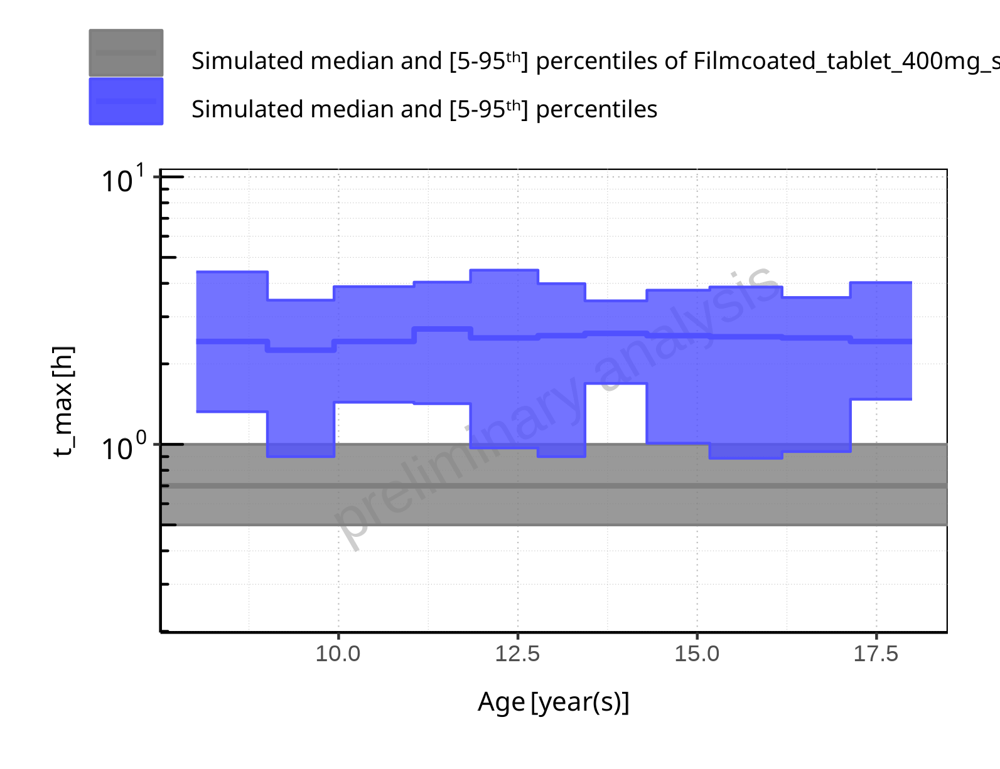


**Figure 2-59: Age-dependence of t_max for Larson 2013 8y-18y 400mg FCT meal in comparison to Filmcoated_tablet_400mg_sd. Profiles are plotted in a logarithmic scale.**


<br>
<br>


```{=openxml}
<w:br w:type="page"/>
```

`<w:bookmarkStart w:id="figure-2-60" w:name="figure-2-60"/><w:bookmarkEnd w:id="figure-2-60"/>`{=openxml}

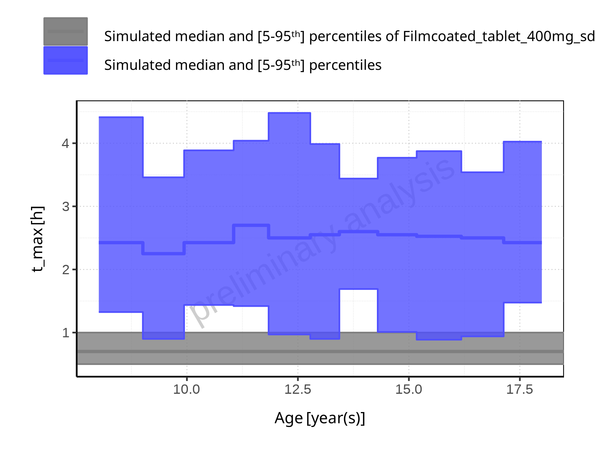


**Figure 2-60: Age-dependence of t_max for Larson 2013 8y-18y 400mg FCT meal in comparison to Filmcoated_tablet_400mg_sd. Profiles are plotted in a linear scale.**


<br>
<br>


```{=openxml}
<w:br w:type="page"/>
```

`<w:bookmarkStart w:id="figure-2-61" w:name="figure-2-61"/><w:bookmarkEnd w:id="figure-2-61"/>`{=openxml}

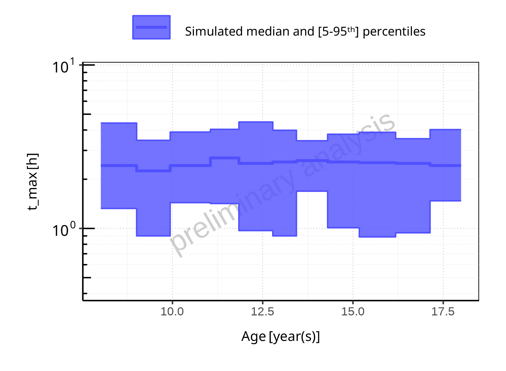


**Figure 2-61: Age-dependence of t_max for Larson 2013 8y-18y 400mg FCT meal. Profiles are plotted in a logarithmic scale.**


<br>
<br>


```{=openxml}
<w:br w:type="page"/>
```

`<w:bookmarkStart w:id="figure-2-62" w:name="figure-2-62"/><w:bookmarkEnd w:id="figure-2-62"/>`{=openxml}

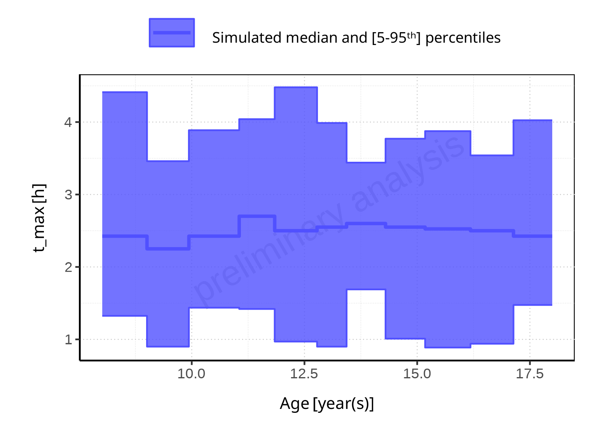


**Figure 2-62: Age-dependence of t_max for Larson 2013 8y-18y 400mg FCT meal. Profiles are plotted in a linear scale.**


<br>
<br>


```{=openxml}
<w:br w:type="page"/>
```

`<w:bookmarkStart w:id="figure-2-63" w:name="figure-2-63"/><w:bookmarkEnd w:id="figure-2-63"/>`{=openxml}

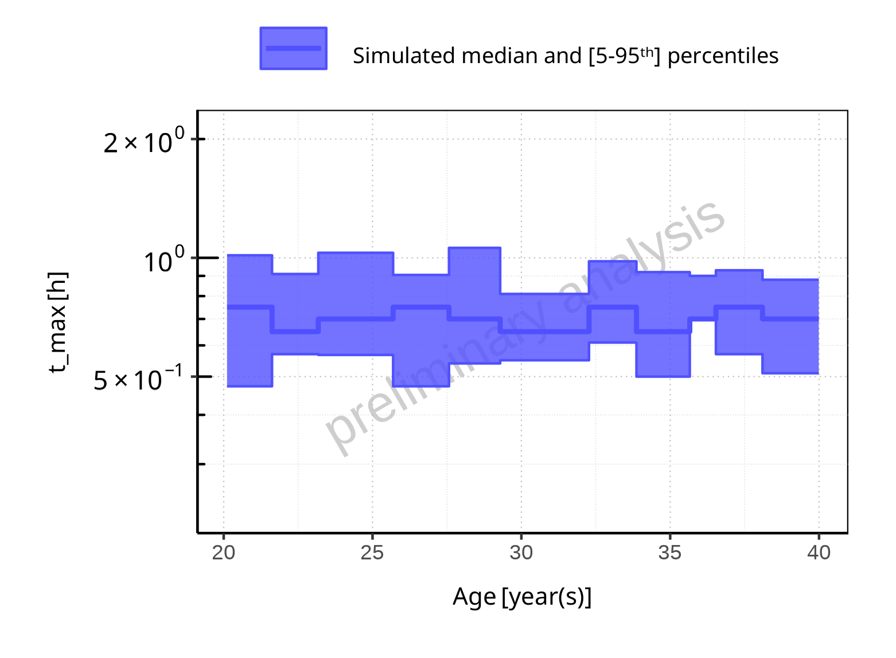


**Figure 2-63: Age-dependence of t_max for Filmcoated_tablet_400mg_sd. Profiles are plotted in a logarithmic scale.**


<br>
<br>


```{=openxml}
<w:br w:type="page"/>
```

`<w:bookmarkStart w:id="figure-2-64" w:name="figure-2-64"/><w:bookmarkEnd w:id="figure-2-64"/>`{=openxml}

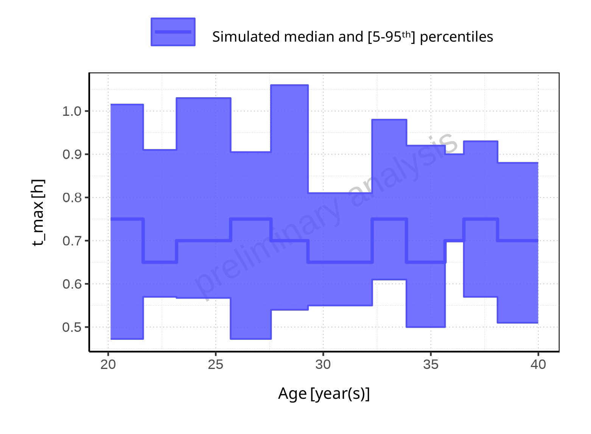


**Figure 2-64: Age-dependence of t_max for Filmcoated_tablet_400mg_sd. Profiles are plotted in a linear scale.**


<br>
<br>


```{=openxml}
<w:br w:type="page"/>
```

`<w:bookmarkStart w:id="figure-2-65" w:name="figure-2-65"/><w:bookmarkEnd w:id="figure-2-65"/>`{=openxml}


**Figure 2-65: Height-dependence of t_max for Larson 2013 8y-18y 400mg FCT meal in comparison to Filmcoated_tablet_400mg_sd. Profiles are plotted in a logarithmic scale.**


<br>
<br>


```{=openxml}
<w:br w:type="page"/>
```

`<w:bookmarkStart w:id="figure-2-66" w:name="figure-2-66"/><w:bookmarkEnd w:id="figure-2-66"/>`{=openxml}

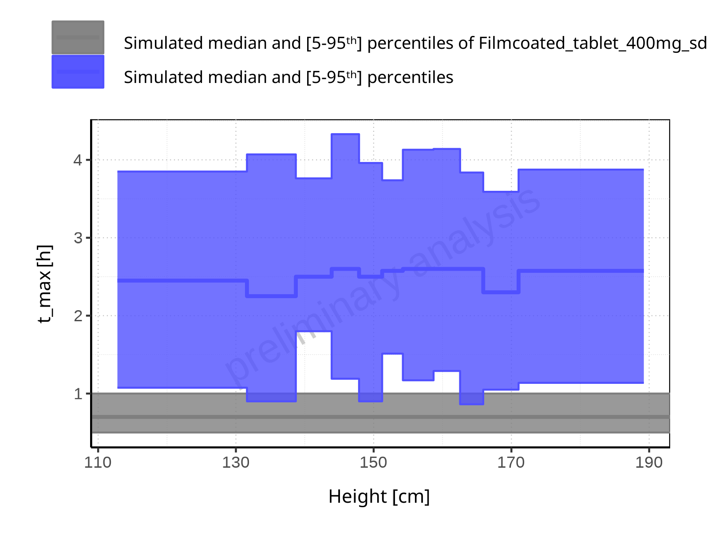


**Figure 2-66: Height-dependence of t_max for Larson 2013 8y-18y 400mg FCT meal in comparison to Filmcoated_tablet_400mg_sd. Profiles are plotted in a linear scale.**


<br>
<br>


```{=openxml}
<w:br w:type="page"/>
```

`<w:bookmarkStart w:id="figure-2-67" w:name="figure-2-67"/><w:bookmarkEnd w:id="figure-2-67"/>`{=openxml}

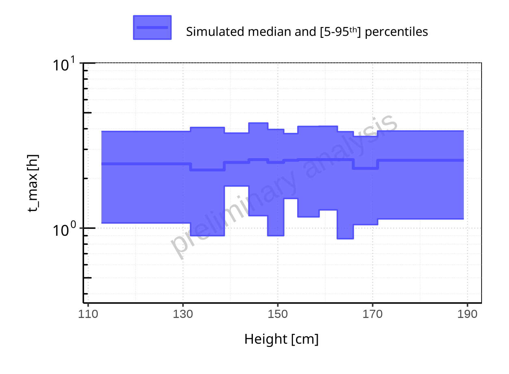


**Figure 2-67: Height-dependence of t_max for Larson 2013 8y-18y 400mg FCT meal. Profiles are plotted in a logarithmic scale.**


<br>
<br>


```{=openxml}
<w:br w:type="page"/>
```

`<w:bookmarkStart w:id="figure-2-68" w:name="figure-2-68"/><w:bookmarkEnd w:id="figure-2-68"/>`{=openxml}

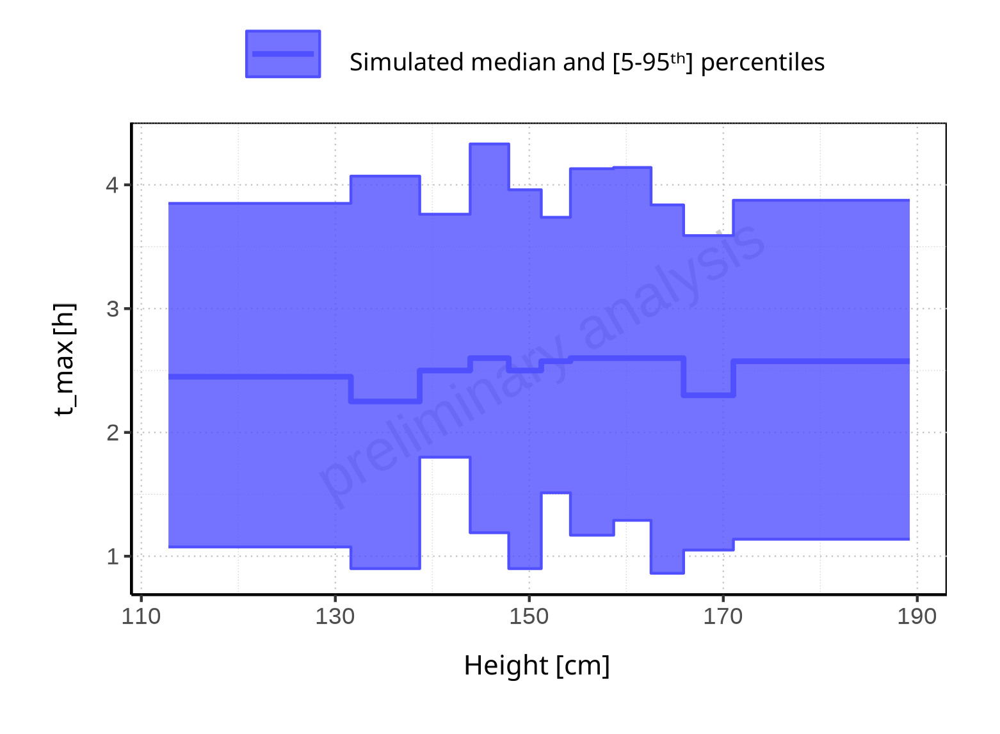


**Figure 2-68: Height-dependence of t_max for Larson 2013 8y-18y 400mg FCT meal. Profiles are plotted in a linear scale.**


<br>
<br>


```{=openxml}
<w:br w:type="page"/>
```

`<w:bookmarkStart w:id="figure-2-69" w:name="figure-2-69"/><w:bookmarkEnd w:id="figure-2-69"/>`{=openxml}

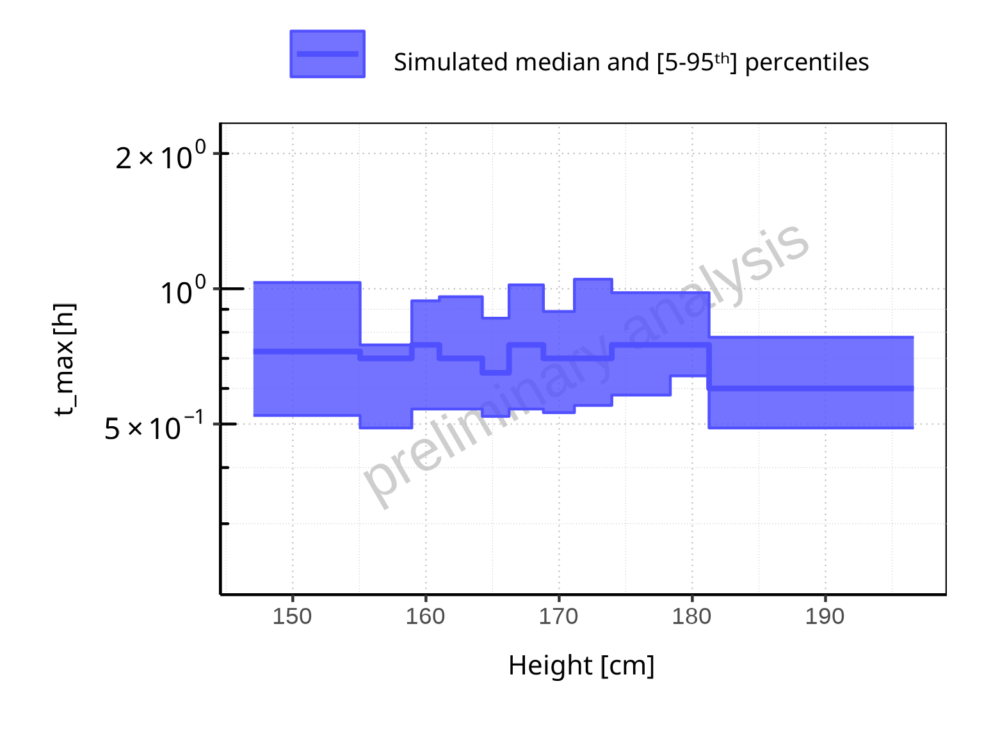


**Figure 2-69: Height-dependence of t_max for Filmcoated_tablet_400mg_sd. Profiles are plotted in a logarithmic scale.**


<br>
<br>


```{=openxml}
<w:br w:type="page"/>
```

`<w:bookmarkStart w:id="figure-2-70" w:name="figure-2-70"/><w:bookmarkEnd w:id="figure-2-70"/>`{=openxml}

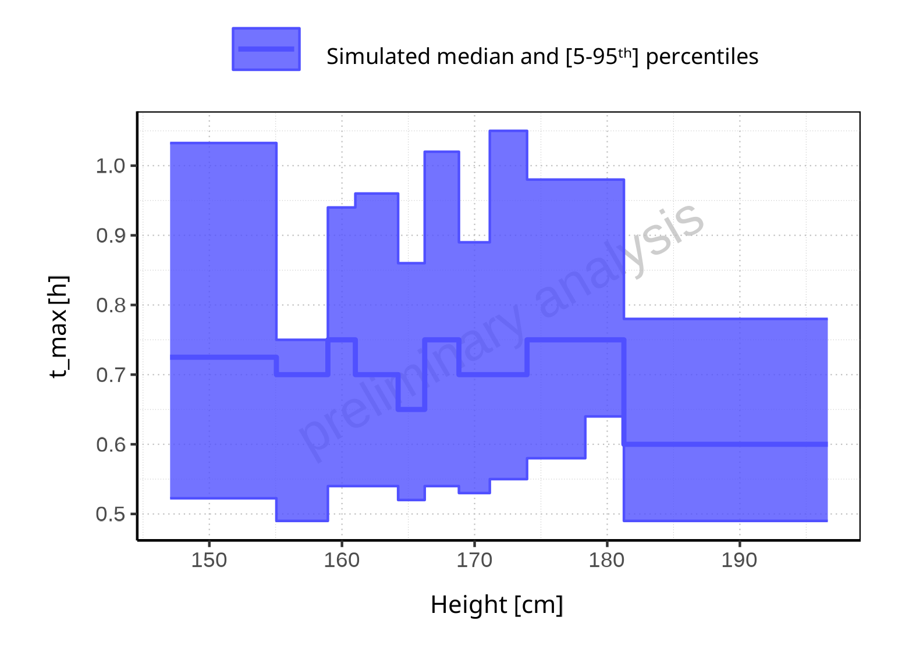


**Figure 2-70: Height-dependence of t_max for Filmcoated_tablet_400mg_sd. Profiles are plotted in a linear scale.**


<br>
<br>


```{=openxml}
<w:br w:type="page"/>
```

`<w:bookmarkStart w:id="figure-2-71" w:name="figure-2-71"/><w:bookmarkEnd w:id="figure-2-71"/>`{=openxml}

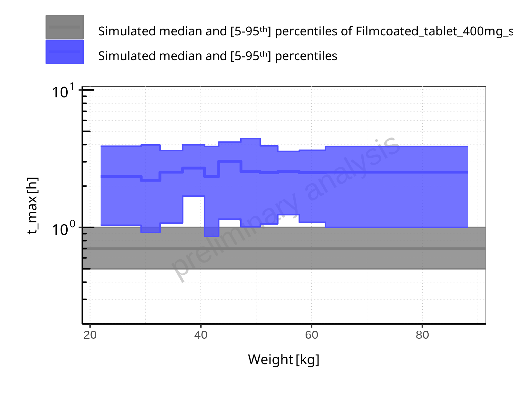


**Figure 2-71: Weight-dependence of t_max for Larson 2013 8y-18y 400mg FCT meal in comparison to Filmcoated_tablet_400mg_sd. Profiles are plotted in a logarithmic scale.**


<br>
<br>


```{=openxml}
<w:br w:type="page"/>
```

`<w:bookmarkStart w:id="figure-2-72" w:name="figure-2-72"/><w:bookmarkEnd w:id="figure-2-72"/>`{=openxml}

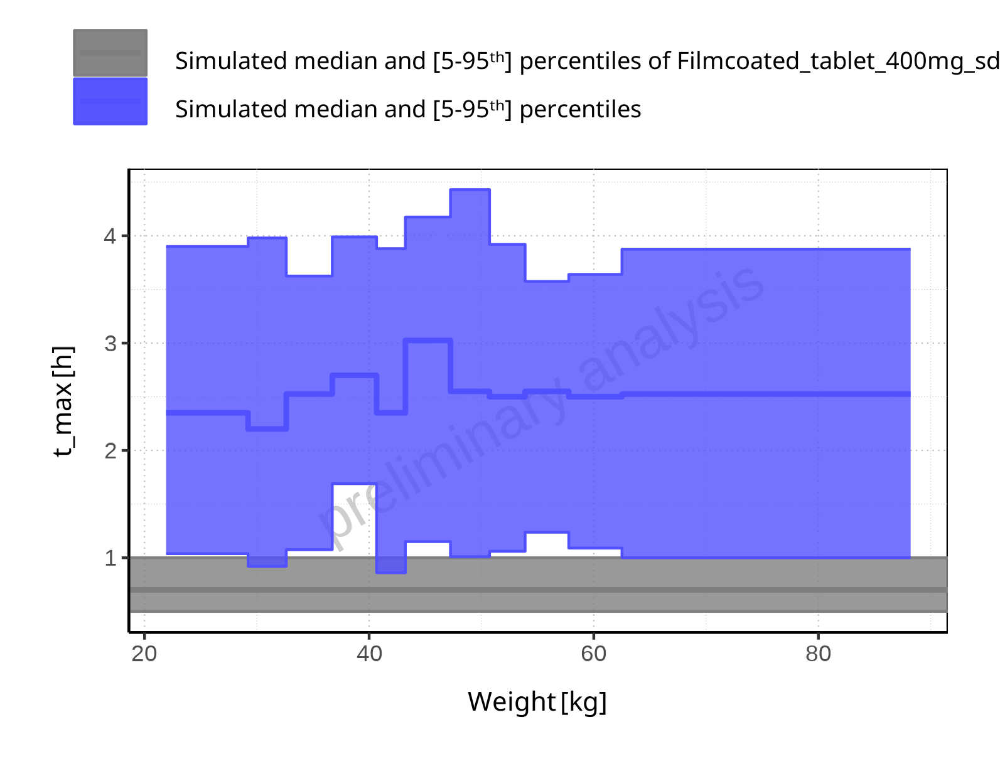


**Figure 2-72: Weight-dependence of t_max for Larson 2013 8y-18y 400mg FCT meal in comparison to Filmcoated_tablet_400mg_sd. Profiles are plotted in a linear scale.**


<br>
<br>


```{=openxml}
<w:br w:type="page"/>
```

`<w:bookmarkStart w:id="figure-2-73" w:name="figure-2-73"/><w:bookmarkEnd w:id="figure-2-73"/>`{=openxml}


**Figure 2-73: Weight-dependence of t_max for Larson 2013 8y-18y 400mg FCT meal. Profiles are plotted in a logarithmic scale.**


<br>
<br>


```{=openxml}
<w:br w:type="page"/>
```

`<w:bookmarkStart w:id="figure-2-74" w:name="figure-2-74"/><w:bookmarkEnd w:id="figure-2-74"/>`{=openxml}

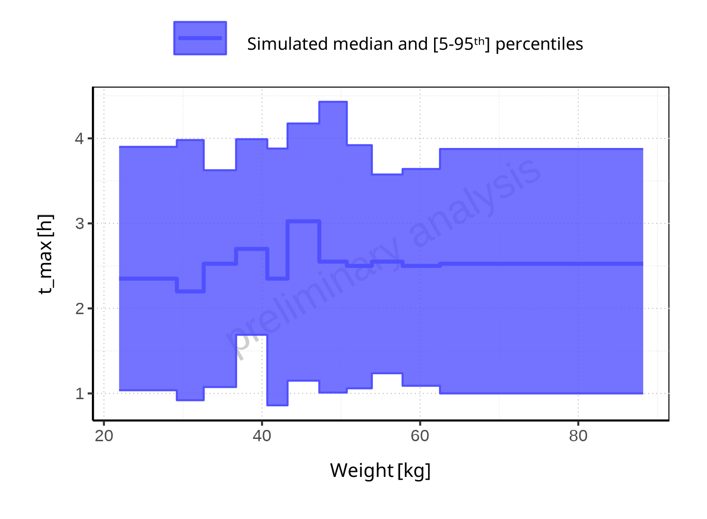


**Figure 2-74: Weight-dependence of t_max for Larson 2013 8y-18y 400mg FCT meal. Profiles are plotted in a linear scale.**


<br>
<br>


```{=openxml}
<w:br w:type="page"/>
```

`<w:bookmarkStart w:id="figure-2-75" w:name="figure-2-75"/><w:bookmarkEnd w:id="figure-2-75"/>`{=openxml}

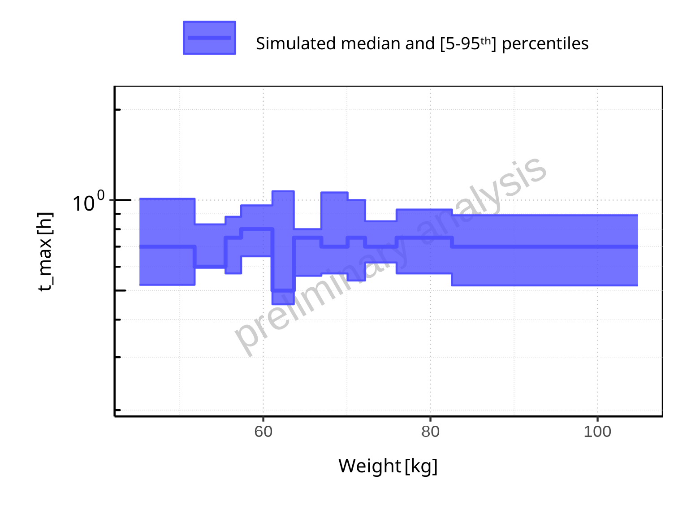


**Figure 2-75: Weight-dependence of t_max for Filmcoated_tablet_400mg_sd. Profiles are plotted in a logarithmic scale.**


<br>
<br>


```{=openxml}
<w:br w:type="page"/>
```

`<w:bookmarkStart w:id="figure-2-76" w:name="figure-2-76"/><w:bookmarkEnd w:id="figure-2-76"/>`{=openxml}

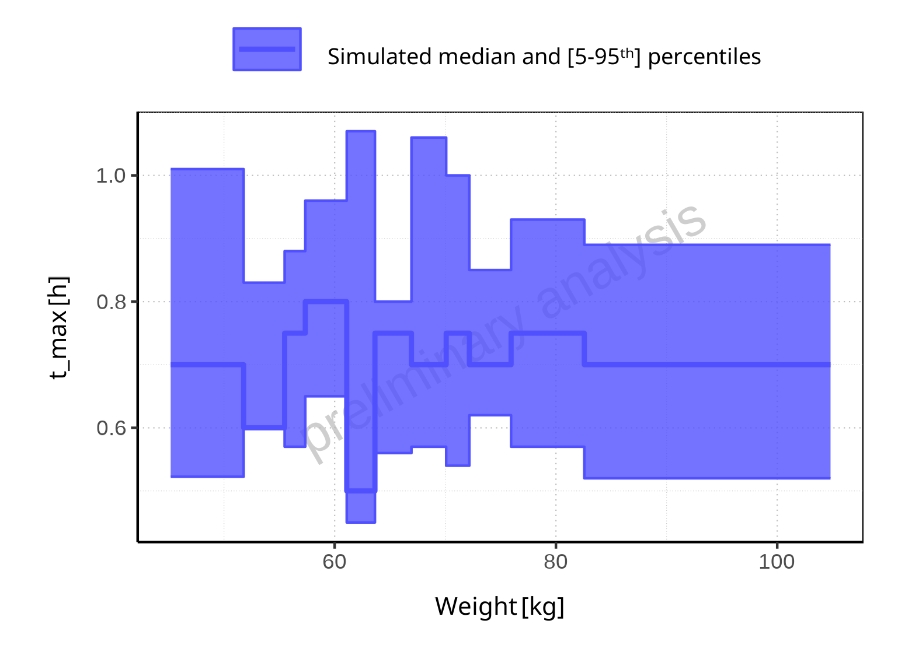


**Figure 2-76: Weight-dependence of t_max for Filmcoated_tablet_400mg_sd. Profiles are plotted in a linear scale.**


<br>
<br>


```{=openxml}
<w:br w:type="page"/>
```

`<w:bookmarkStart w:id="figure-2-77" w:name="figure-2-77"/><w:bookmarkEnd w:id="figure-2-77"/>`{=openxml}

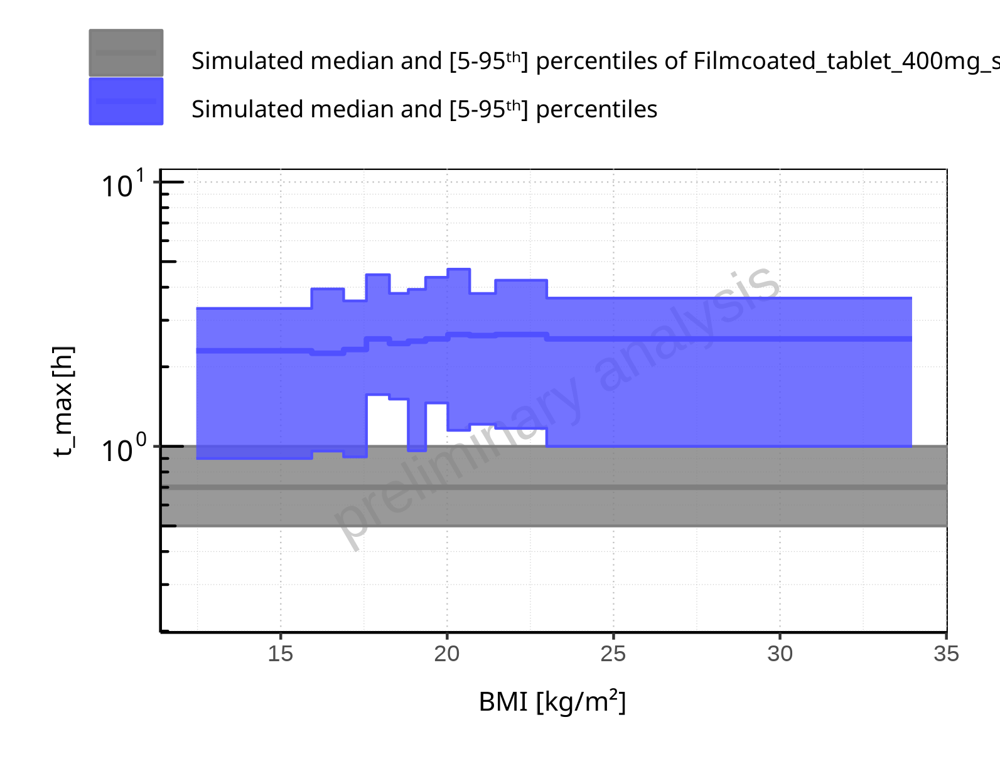


**Figure 2-77: BMI-dependence of t_max for Larson 2013 8y-18y 400mg FCT meal in comparison to Filmcoated_tablet_400mg_sd. Profiles are plotted in a logarithmic scale.**


<br>
<br>


```{=openxml}
<w:br w:type="page"/>
```

`<w:bookmarkStart w:id="figure-2-78" w:name="figure-2-78"/><w:bookmarkEnd w:id="figure-2-78"/>`{=openxml}

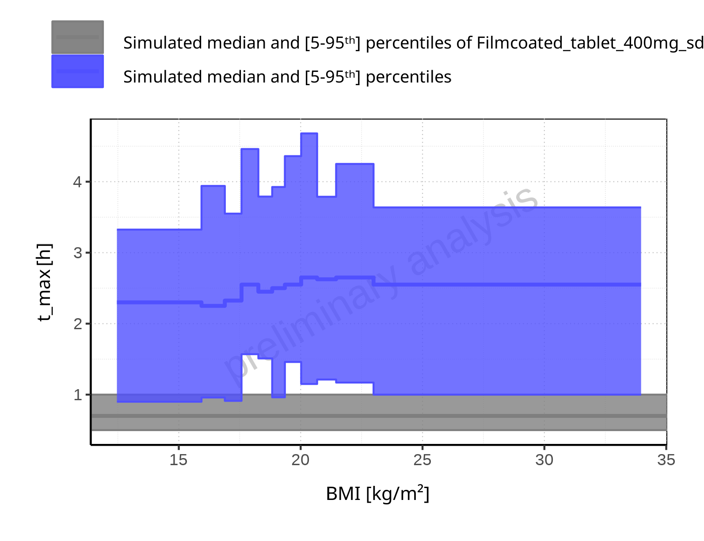


**Figure 2-78: BMI-dependence of t_max for Larson 2013 8y-18y 400mg FCT meal in comparison to Filmcoated_tablet_400mg_sd. Profiles are plotted in a linear scale.**


<br>
<br>


```{=openxml}
<w:br w:type="page"/>
```

`<w:bookmarkStart w:id="figure-2-79" w:name="figure-2-79"/><w:bookmarkEnd w:id="figure-2-79"/>`{=openxml}

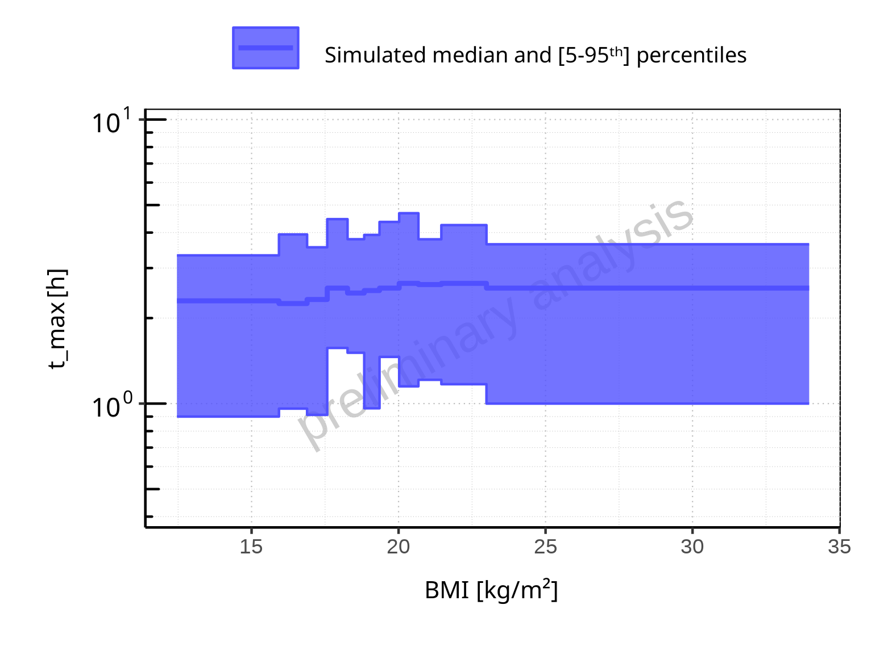


**Figure 2-79: BMI-dependence of t_max for Larson 2013 8y-18y 400mg FCT meal. Profiles are plotted in a logarithmic scale.**


<br>
<br>


```{=openxml}
<w:br w:type="page"/>
```

`<w:bookmarkStart w:id="figure-2-80" w:name="figure-2-80"/><w:bookmarkEnd w:id="figure-2-80"/>`{=openxml}

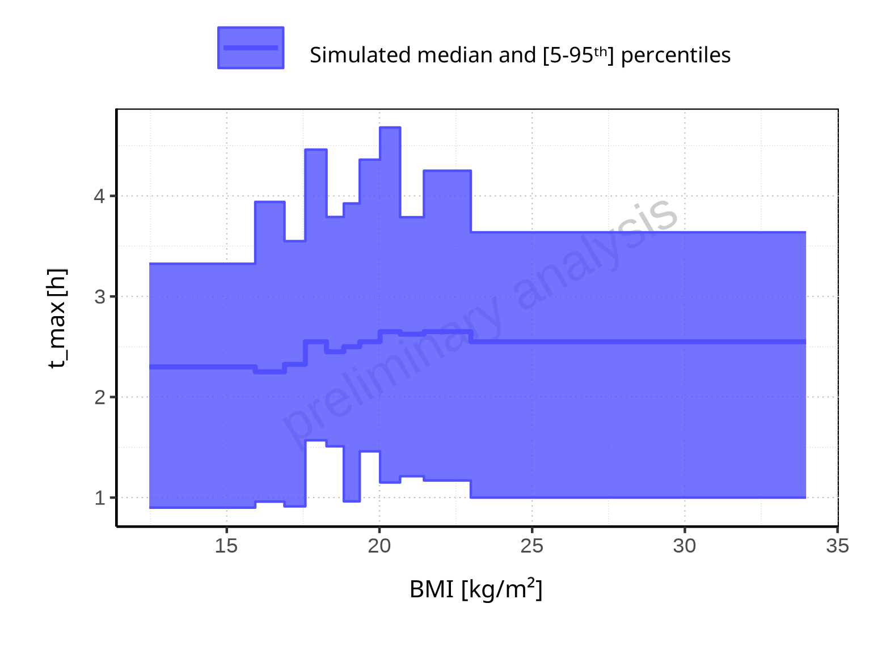


**Figure 2-80: BMI-dependence of t_max for Larson 2013 8y-18y 400mg FCT meal. Profiles are plotted in a linear scale.**


<br>
<br>


```{=openxml}
<w:br w:type="page"/>
```

`<w:bookmarkStart w:id="figure-2-81" w:name="figure-2-81"/><w:bookmarkEnd w:id="figure-2-81"/>`{=openxml}

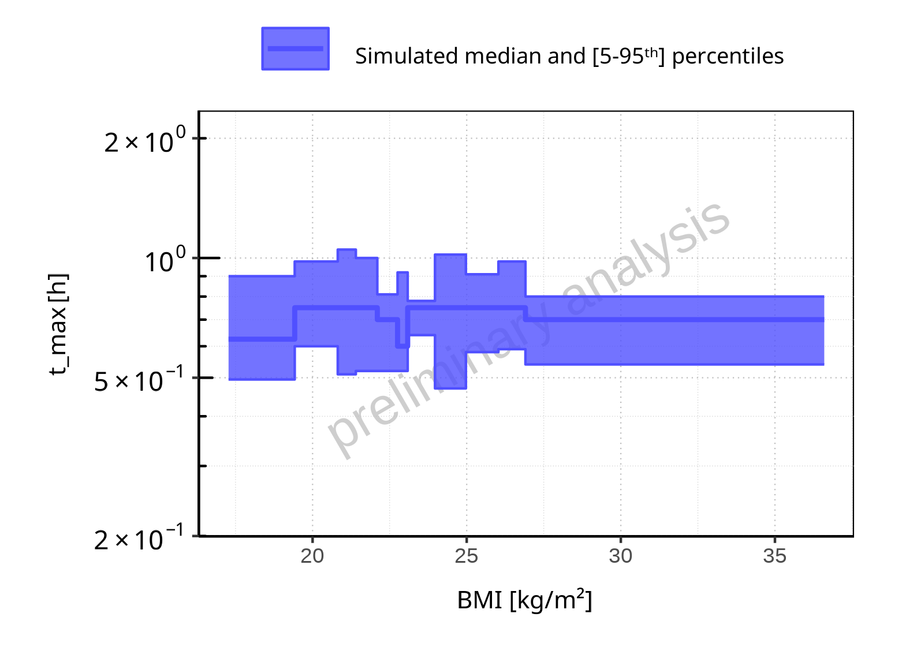


**Figure 2-81: BMI-dependence of t_max for Filmcoated_tablet_400mg_sd. Profiles are plotted in a logarithmic scale.**


<br>
<br>


```{=openxml}
<w:br w:type="page"/>
```

`<w:bookmarkStart w:id="figure-2-82" w:name="figure-2-82"/><w:bookmarkEnd w:id="figure-2-82"/>`{=openxml}

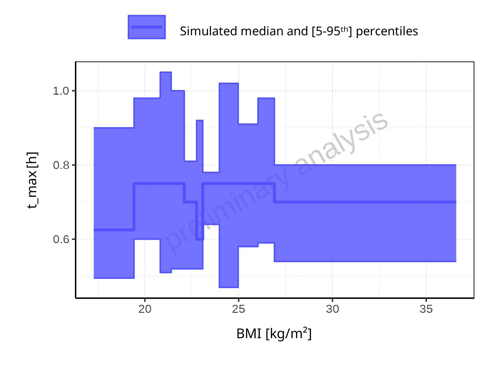


**Figure 2-82: BMI-dependence of t_max for Filmcoated_tablet_400mg_sd. Profiles are plotted in a linear scale.**


<br>
<br>


```{=openxml}
<w:br w:type="page"/>
```

`<w:bookmarkStart w:id="figure-2-83" w:name="figure-2-83"/><w:bookmarkEnd w:id="figure-2-83"/>`{=openxml}

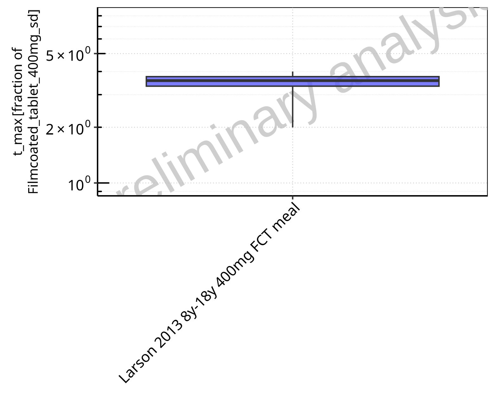


**Figure 2-83: Ratio of population summary statistics of t_max of Raltegravir  for  Larson 2013 8y-18y 400mg FCT meal in comparison to Filmcoated_tablet_400mg_sd shown as box-whisker plot, which indicates ratios of the 5^th^, 25^th^, 50^th^, 75^th^, 95^th^ percentiles in logarithmic scale.**


<br>
<br>


```{=openxml}
<w:br w:type="page"/>
```

`<w:bookmarkStart w:id="figure-2-84" w:name="figure-2-84"/><w:bookmarkEnd w:id="figure-2-84"/>`{=openxml}

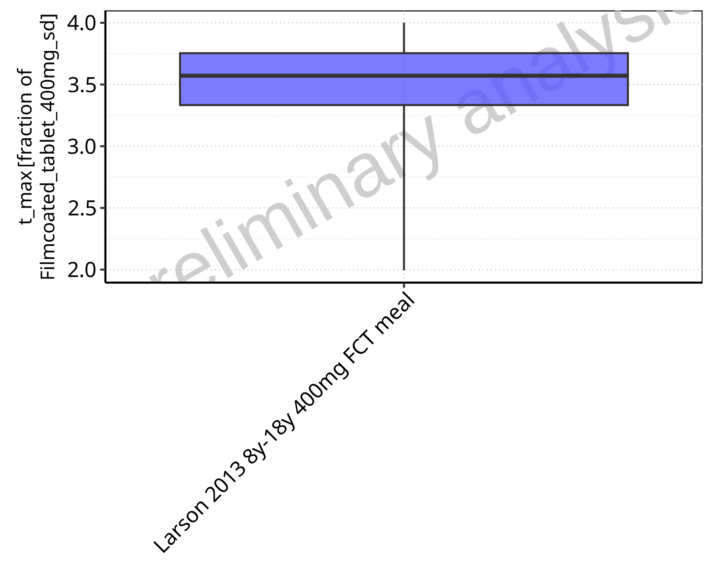


**Figure 2-84: Ratio of population summary statistics of t_max of Raltegravir  for  Larson 2013 8y-18y 400mg FCT meal in comparison to Filmcoated_tablet_400mg_sd shown as box-whisker plot, which indicates ratios of the 5^th^, 25^th^, 50^th^, 75^th^, 95^th^ percentiles in linear scale.**


<br>
<br>


```{=openxml}
<w:br w:type="page"/>
```

`<w:bookmarkStart w:id="table-2-6" w:name="table-2-6"/><w:bookmarkEnd w:id="table-2-6"/>`{=openxml}

**Table 2-6: Ratio of population summary statistics of t_max of Raltegravir  for  Larson 2013 8y-18y 400mg FCT meal in comparison to Filmcoated_tablet_400mg_sd**


|Population                        |N   |5^th^ pctl |25^th^ pctl |50^th^ pctl |75^th^ pctl |95^th^ pctl |Mean |SD   |Geo Mean |Geo SD |
|:---------------------------------|:---|:-------------------|:--------------------|:--------------------|:--------------------|:--------------------|:----|:----|:--------|:------|
|Larson 2013 8y-18y 400mg FCT meal |500 |2.00                |3.33                 |3.57                 |3.75                 |4                    |3.49 |5.79 |3.32     |1.20   |


<br>
<br>


### C_tEnd `<w:bookmarkStart w:id="89_pk_parameters_organism_peripheralvenousblood_raltegravir_plasma__peripheral_venous_blood__c_tend" w:name="89_pk_parameters_organism_peripheralvenousblood_raltegravir_plasma__peripheral_venous_blood__c_tend"/><w:bookmarkEnd w:id="89_pk_parameters_organism_peripheralvenousblood_raltegravir_plasma__peripheral_venous_blood__c_tend"/>`{=openxml}


```{=openxml}
<w:br w:type="page"/>
```

`<w:bookmarkStart w:id="figure-2-85" w:name="figure-2-85"/><w:bookmarkEnd w:id="figure-2-85"/>`{=openxml}

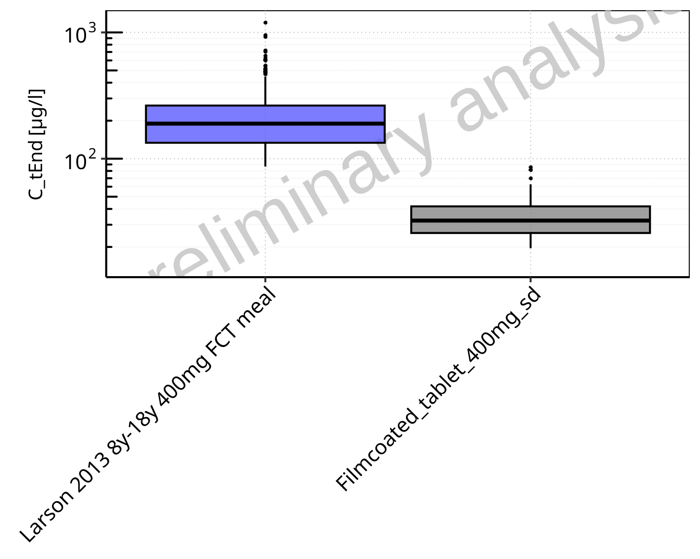


**Figure 2-85: C_tEnd of Raltegravir for Larson 2013 8y-18y 400mg FCT meal, Filmcoated_tablet_400mg_sd shown as box-whisker plot, which indicates  the 5^th^, 25^th^, 50^th^, 75^th^, 95^th^ percentiles in logarithmic scale.**


<br>
<br>


```{=openxml}
<w:br w:type="page"/>
```

`<w:bookmarkStart w:id="figure-2-86" w:name="figure-2-86"/><w:bookmarkEnd w:id="figure-2-86"/>`{=openxml}

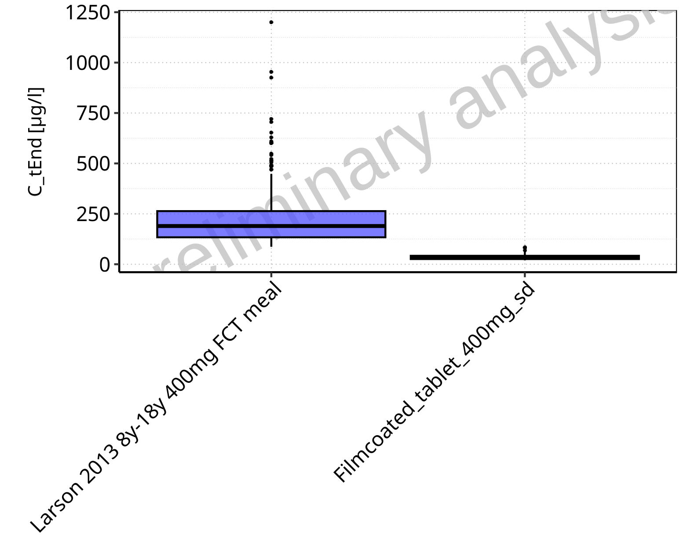


**Figure 2-86: C_tEnd of Raltegravir for Larson 2013 8y-18y 400mg FCT meal, Filmcoated_tablet_400mg_sd shown as box-whisker plot, which indicates  the 5^th^, 25^th^, 50^th^, 75^th^, 95^th^ percentiles in linear scale.**


<br>
<br>


```{=openxml}
<w:br w:type="page"/>
```

`<w:bookmarkStart w:id="table-2-7" w:name="table-2-7"/><w:bookmarkEnd w:id="table-2-7"/>`{=openxml}

**Table 2-7: Population statistics summarizing C_tEnd of Raltegravir for Larson 2013 8y-18y 400mg FCT meal, Filmcoated_tablet_400mg_sd reported in [µg/l]**


|Population                        |N   |5^th^ pctl |25^th^ pctl |50^th^ pctl |75^th^ pctl |95^th^ pctl |Mean   |SD     |Geo Mean |Geo SD |
|:---------------------------------|:---|:-------------------|:--------------------|:--------------------|:--------------------|:--------------------|:------|:------|:--------|:------|
|Larson 2013 8y-18y 400mg FCT meal |500 |86.63               |133.65               |189.56               |263.51               |448.02               |218.90 |129.12 |191.12   |1.67   |
|Filmcoated_tablet_400mg_sd        |100 |19.57               |25.80                |32.35                |41.91                |62.68                |35.39  |14.21  |33.01    |1.44   |


<br>
<br>


```{=openxml}
<w:br w:type="page"/>
```

`<w:bookmarkStart w:id="figure-2-87" w:name="figure-2-87"/><w:bookmarkEnd w:id="figure-2-87"/>`{=openxml}

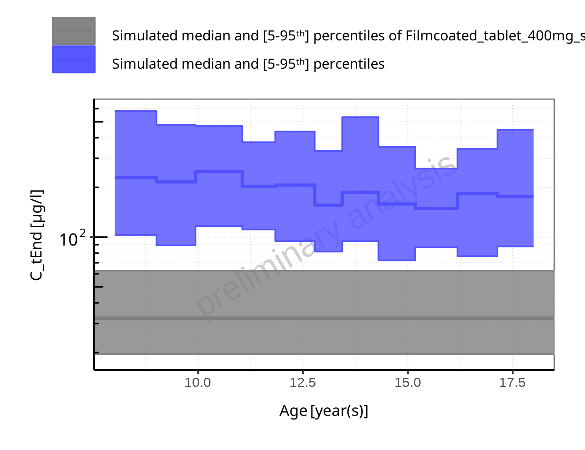


**Figure 2-87: Age-dependence of C_tEnd for Larson 2013 8y-18y 400mg FCT meal in comparison to Filmcoated_tablet_400mg_sd. Profiles are plotted in a logarithmic scale.**


<br>
<br>


```{=openxml}
<w:br w:type="page"/>
```

`<w:bookmarkStart w:id="figure-2-88" w:name="figure-2-88"/><w:bookmarkEnd w:id="figure-2-88"/>`{=openxml}

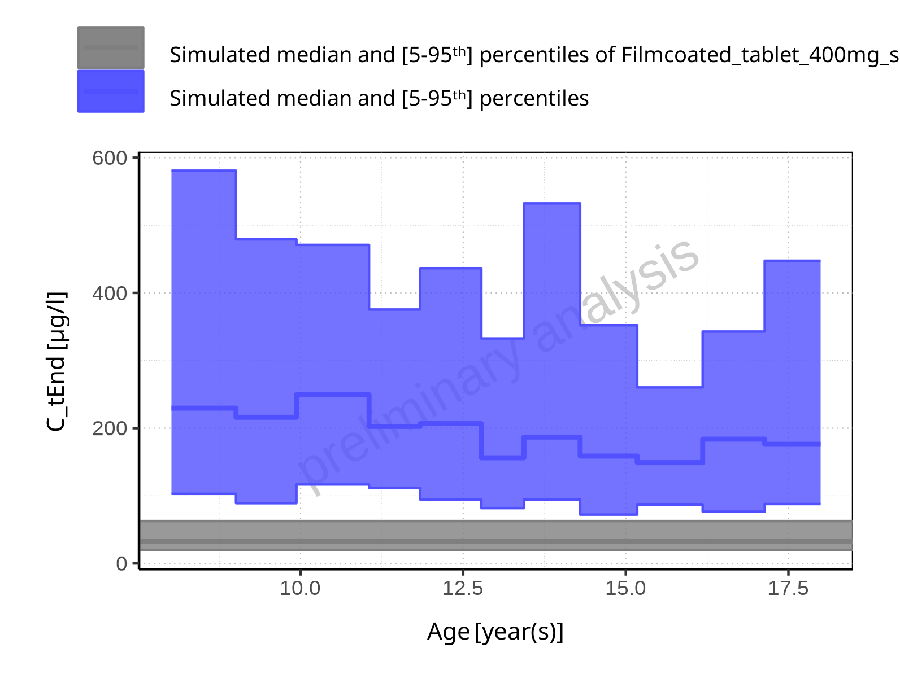


**Figure 2-88: Age-dependence of C_tEnd for Larson 2013 8y-18y 400mg FCT meal in comparison to Filmcoated_tablet_400mg_sd. Profiles are plotted in a linear scale.**


<br>
<br>


```{=openxml}
<w:br w:type="page"/>
```

`<w:bookmarkStart w:id="figure-2-89" w:name="figure-2-89"/><w:bookmarkEnd w:id="figure-2-89"/>`{=openxml}

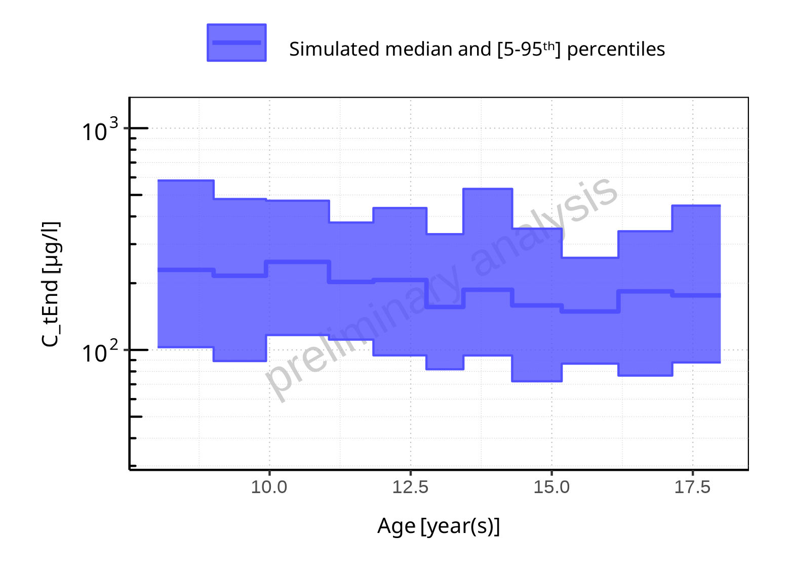


**Figure 2-89: Age-dependence of C_tEnd for Larson 2013 8y-18y 400mg FCT meal. Profiles are plotted in a logarithmic scale.**


<br>
<br>


```{=openxml}
<w:br w:type="page"/>
```

`<w:bookmarkStart w:id="figure-2-90" w:name="figure-2-90"/><w:bookmarkEnd w:id="figure-2-90"/>`{=openxml}

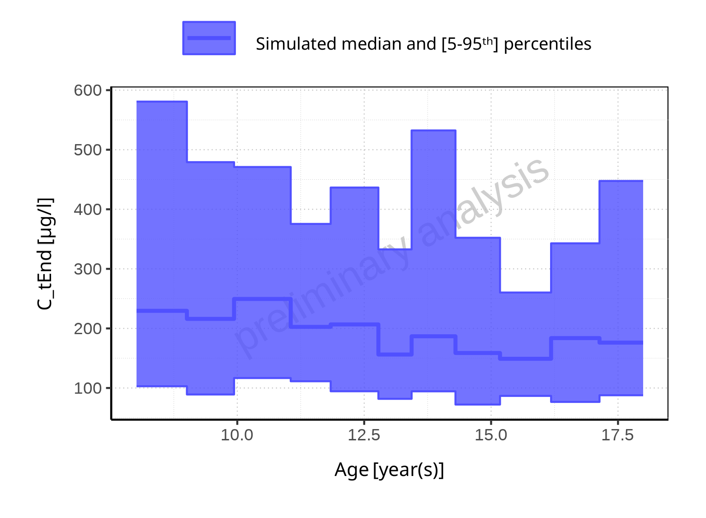


**Figure 2-90: Age-dependence of C_tEnd for Larson 2013 8y-18y 400mg FCT meal. Profiles are plotted in a linear scale.**


<br>
<br>


```{=openxml}
<w:br w:type="page"/>
```

`<w:bookmarkStart w:id="figure-2-91" w:name="figure-2-91"/><w:bookmarkEnd w:id="figure-2-91"/>`{=openxml}

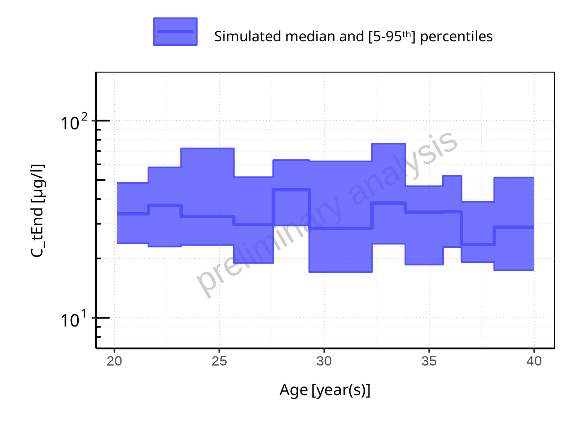


**Figure 2-91: Age-dependence of C_tEnd for Filmcoated_tablet_400mg_sd. Profiles are plotted in a logarithmic scale.**


<br>
<br>


```{=openxml}
<w:br w:type="page"/>
```

`<w:bookmarkStart w:id="figure-2-92" w:name="figure-2-92"/><w:bookmarkEnd w:id="figure-2-92"/>`{=openxml}

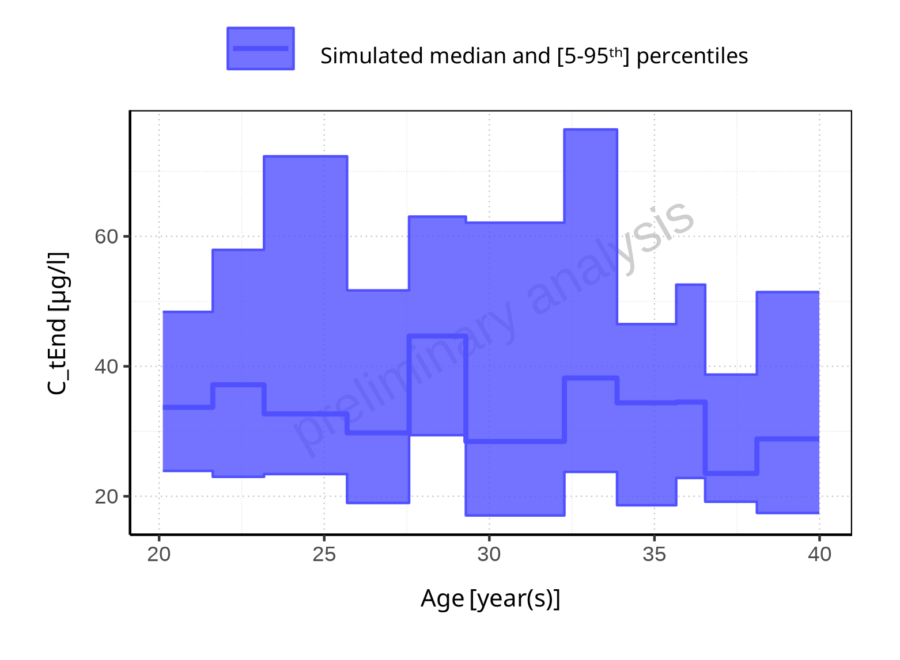


**Figure 2-92: Age-dependence of C_tEnd for Filmcoated_tablet_400mg_sd. Profiles are plotted in a linear scale.**


<br>
<br>


```{=openxml}
<w:br w:type="page"/>
```

`<w:bookmarkStart w:id="figure-2-93" w:name="figure-2-93"/><w:bookmarkEnd w:id="figure-2-93"/>`{=openxml}

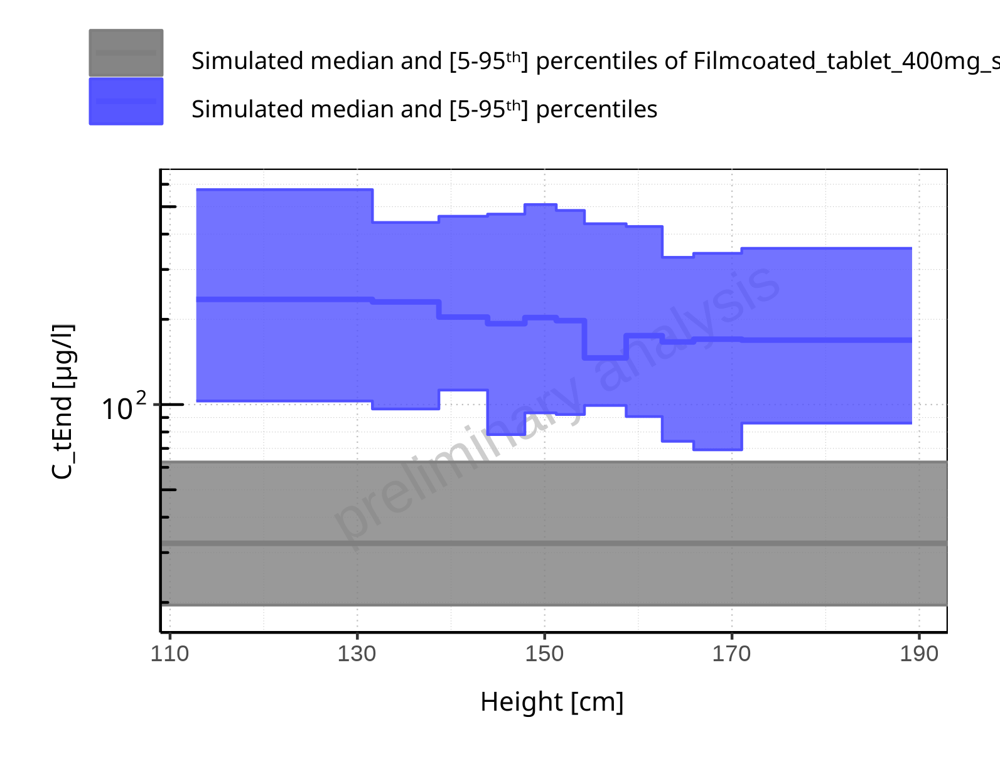


**Figure 2-93: Height-dependence of C_tEnd for Larson 2013 8y-18y 400mg FCT meal in comparison to Filmcoated_tablet_400mg_sd. Profiles are plotted in a logarithmic scale.**


<br>
<br>


```{=openxml}
<w:br w:type="page"/>
```

`<w:bookmarkStart w:id="figure-2-94" w:name="figure-2-94"/><w:bookmarkEnd w:id="figure-2-94"/>`{=openxml}

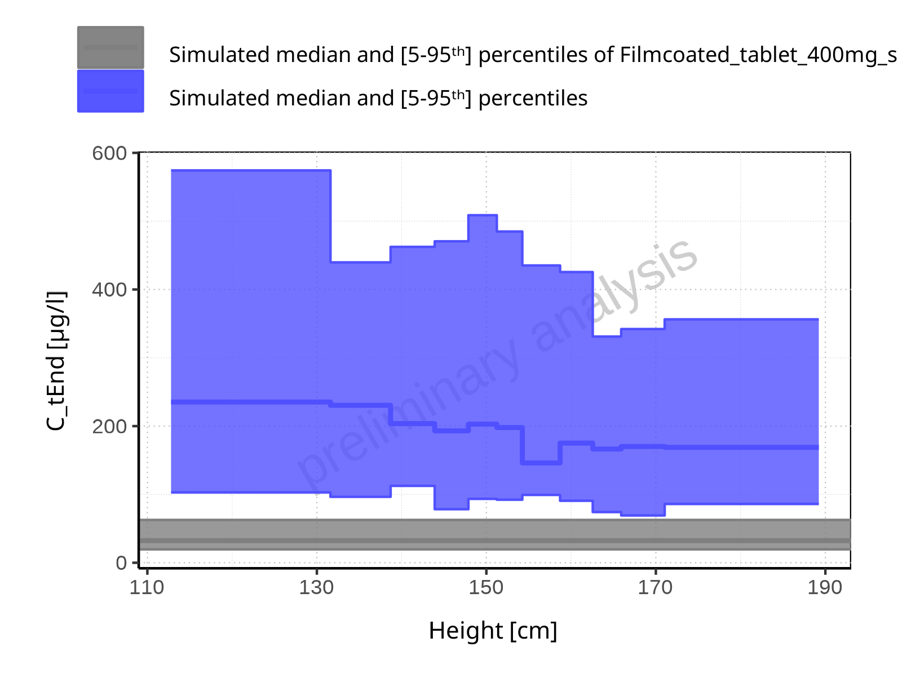


**Figure 2-94: Height-dependence of C_tEnd for Larson 2013 8y-18y 400mg FCT meal in comparison to Filmcoated_tablet_400mg_sd. Profiles are plotted in a linear scale.**


<br>
<br>


```{=openxml}
<w:br w:type="page"/>
```

`<w:bookmarkStart w:id="figure-2-95" w:name="figure-2-95"/><w:bookmarkEnd w:id="figure-2-95"/>`{=openxml}

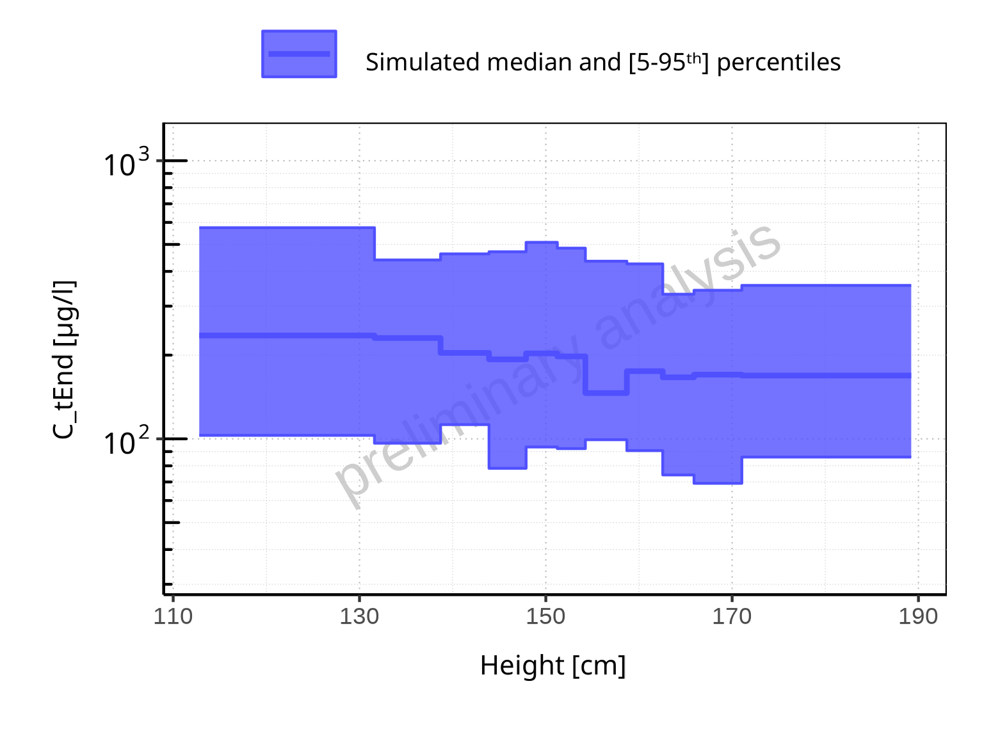


**Figure 2-95: Height-dependence of C_tEnd for Larson 2013 8y-18y 400mg FCT meal. Profiles are plotted in a logarithmic scale.**


<br>
<br>


```{=openxml}
<w:br w:type="page"/>
```

`<w:bookmarkStart w:id="figure-2-96" w:name="figure-2-96"/><w:bookmarkEnd w:id="figure-2-96"/>`{=openxml}

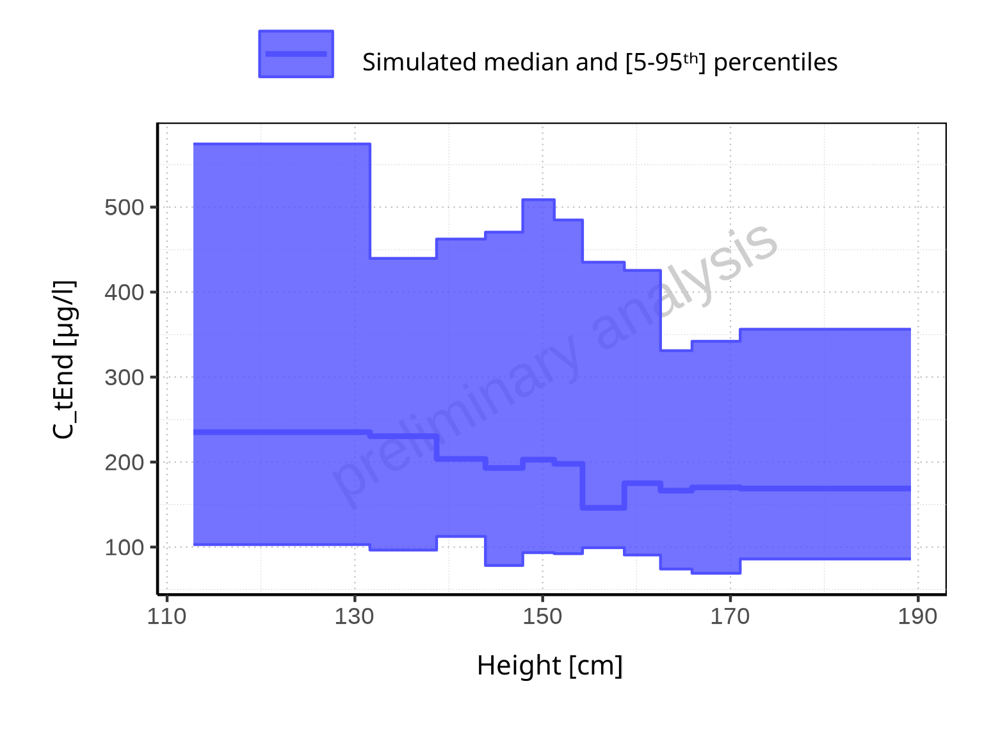


**Figure 2-96: Height-dependence of C_tEnd for Larson 2013 8y-18y 400mg FCT meal. Profiles are plotted in a linear scale.**


<br>
<br>


```{=openxml}
<w:br w:type="page"/>
```

`<w:bookmarkStart w:id="figure-2-97" w:name="figure-2-97"/><w:bookmarkEnd w:id="figure-2-97"/>`{=openxml}

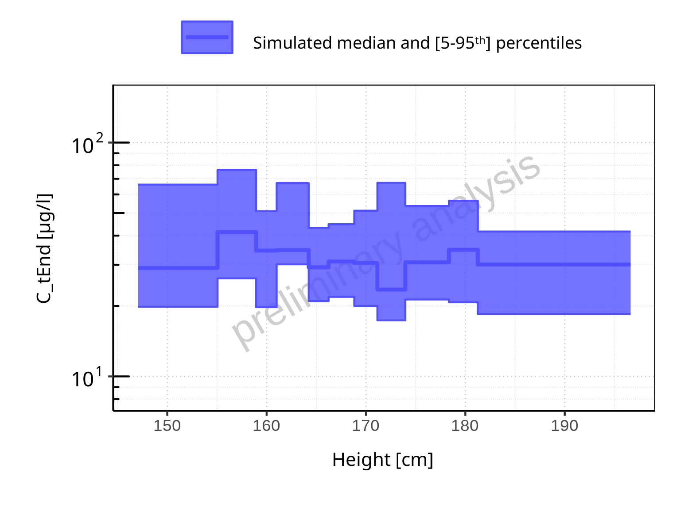


**Figure 2-97: Height-dependence of C_tEnd for Filmcoated_tablet_400mg_sd. Profiles are plotted in a logarithmic scale.**


<br>
<br>


```{=openxml}
<w:br w:type="page"/>
```

`<w:bookmarkStart w:id="figure-2-98" w:name="figure-2-98"/><w:bookmarkEnd w:id="figure-2-98"/>`{=openxml}

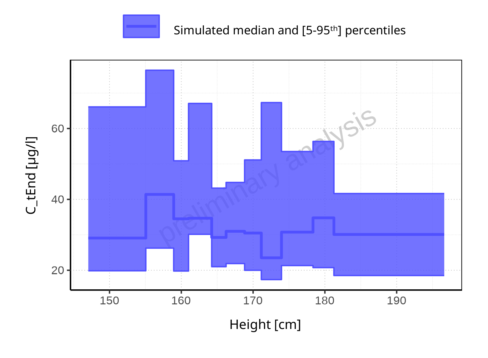


**Figure 2-98: Height-dependence of C_tEnd for Filmcoated_tablet_400mg_sd. Profiles are plotted in a linear scale.**


<br>
<br>


```{=openxml}
<w:br w:type="page"/>
```

`<w:bookmarkStart w:id="figure-2-99" w:name="figure-2-99"/><w:bookmarkEnd w:id="figure-2-99"/>`{=openxml}

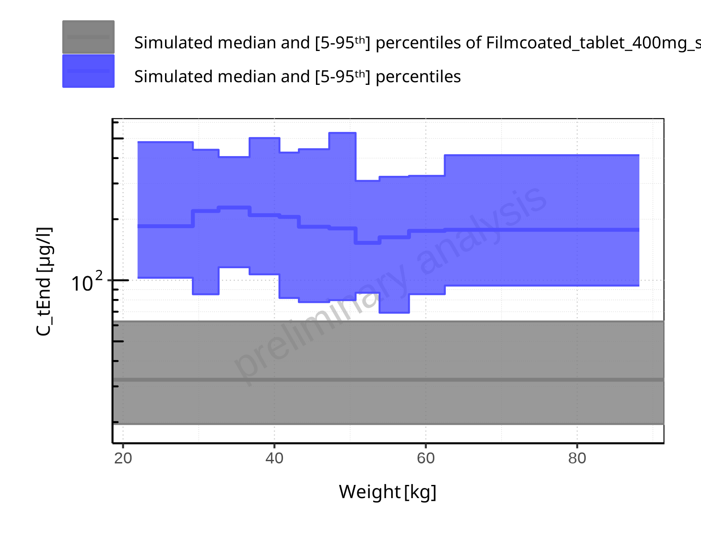


**Figure 2-99: Weight-dependence of C_tEnd for Larson 2013 8y-18y 400mg FCT meal in comparison to Filmcoated_tablet_400mg_sd. Profiles are plotted in a logarithmic scale.**


<br>
<br>


```{=openxml}
<w:br w:type="page"/>
```

`<w:bookmarkStart w:id="figure-2-100" w:name="figure-2-100"/><w:bookmarkEnd w:id="figure-2-100"/>`{=openxml}

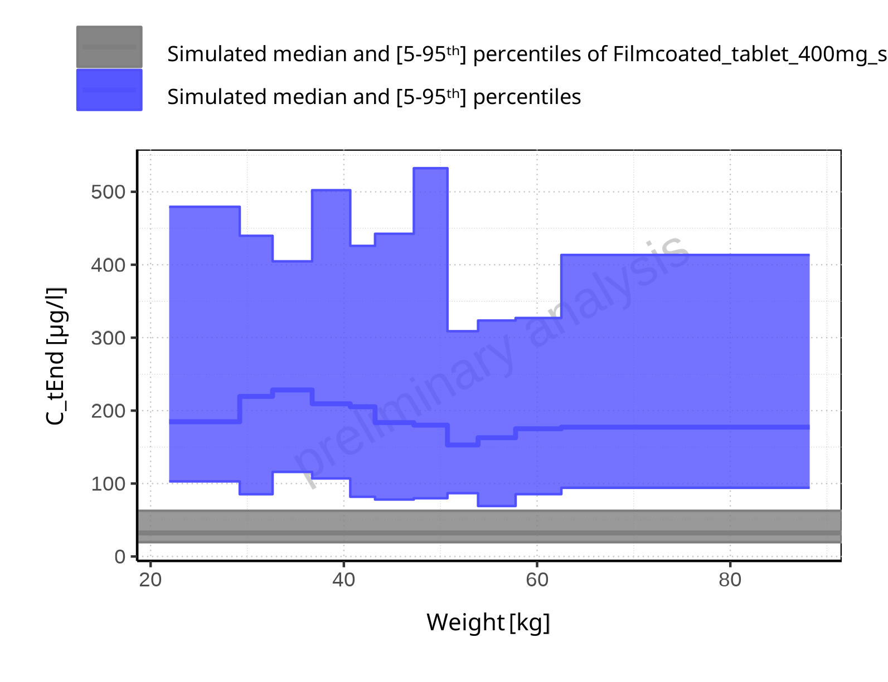


**Figure 2-100: Weight-dependence of C_tEnd for Larson 2013 8y-18y 400mg FCT meal in comparison to Filmcoated_tablet_400mg_sd. Profiles are plotted in a linear scale.**


<br>
<br>


```{=openxml}
<w:br w:type="page"/>
```

`<w:bookmarkStart w:id="figure-2-101" w:name="figure-2-101"/><w:bookmarkEnd w:id="figure-2-101"/>`{=openxml}

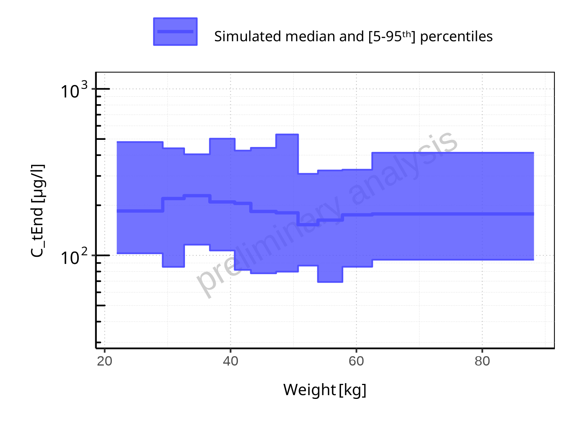


**Figure 2-101: Weight-dependence of C_tEnd for Larson 2013 8y-18y 400mg FCT meal. Profiles are plotted in a logarithmic scale.**


<br>
<br>


```{=openxml}
<w:br w:type="page"/>
```

`<w:bookmarkStart w:id="figure-2-102" w:name="figure-2-102"/><w:bookmarkEnd w:id="figure-2-102"/>`{=openxml}

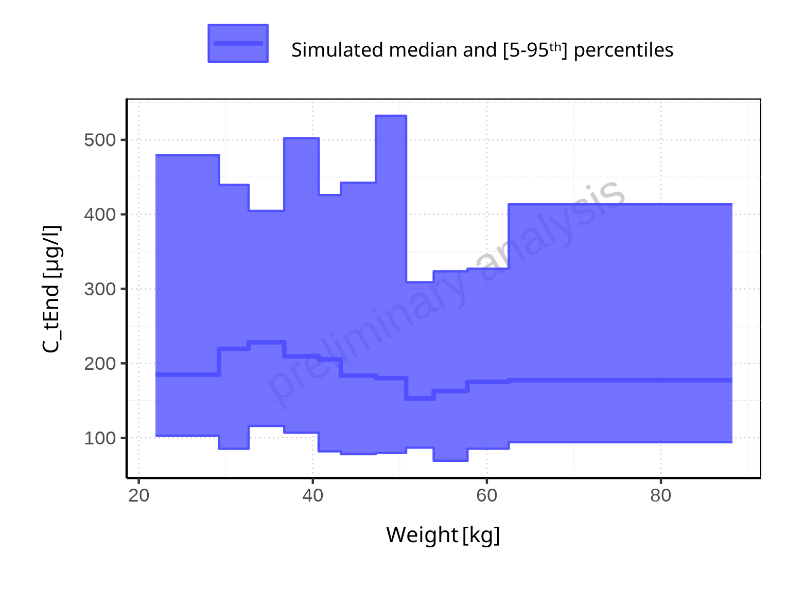


**Figure 2-102: Weight-dependence of C_tEnd for Larson 2013 8y-18y 400mg FCT meal. Profiles are plotted in a linear scale.**


<br>
<br>


```{=openxml}
<w:br w:type="page"/>
```

`<w:bookmarkStart w:id="figure-2-103" w:name="figure-2-103"/><w:bookmarkEnd w:id="figure-2-103"/>`{=openxml}


**Figure 2-103: Weight-dependence of C_tEnd for Filmcoated_tablet_400mg_sd. Profiles are plotted in a logarithmic scale.**


<br>
<br>


```{=openxml}
<w:br w:type="page"/>
```

`<w:bookmarkStart w:id="figure-2-104" w:name="figure-2-104"/><w:bookmarkEnd w:id="figure-2-104"/>`{=openxml}

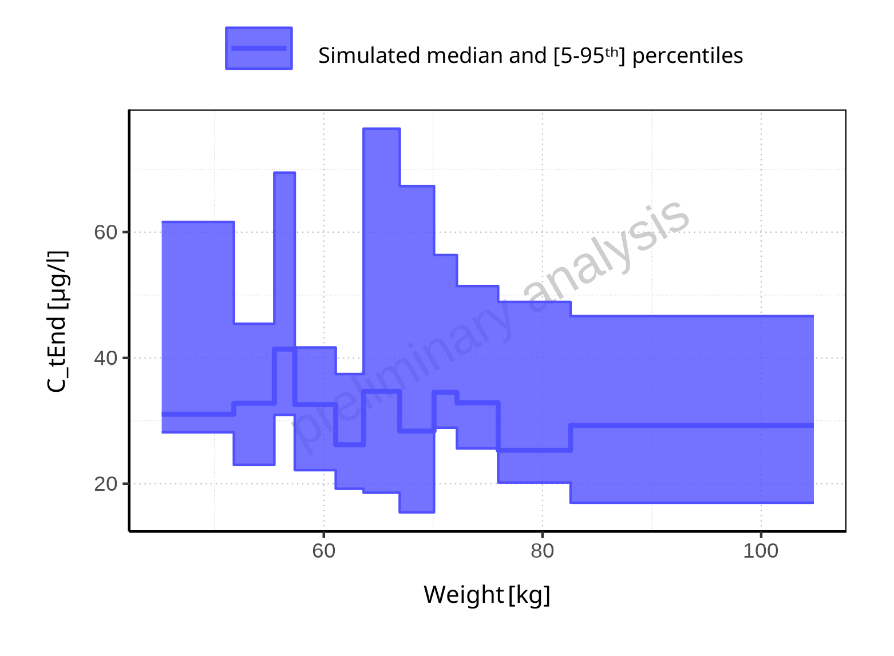


**Figure 2-104: Weight-dependence of C_tEnd for Filmcoated_tablet_400mg_sd. Profiles are plotted in a linear scale.**


<br>
<br>


```{=openxml}
<w:br w:type="page"/>
```

`<w:bookmarkStart w:id="figure-2-105" w:name="figure-2-105"/><w:bookmarkEnd w:id="figure-2-105"/>`{=openxml}

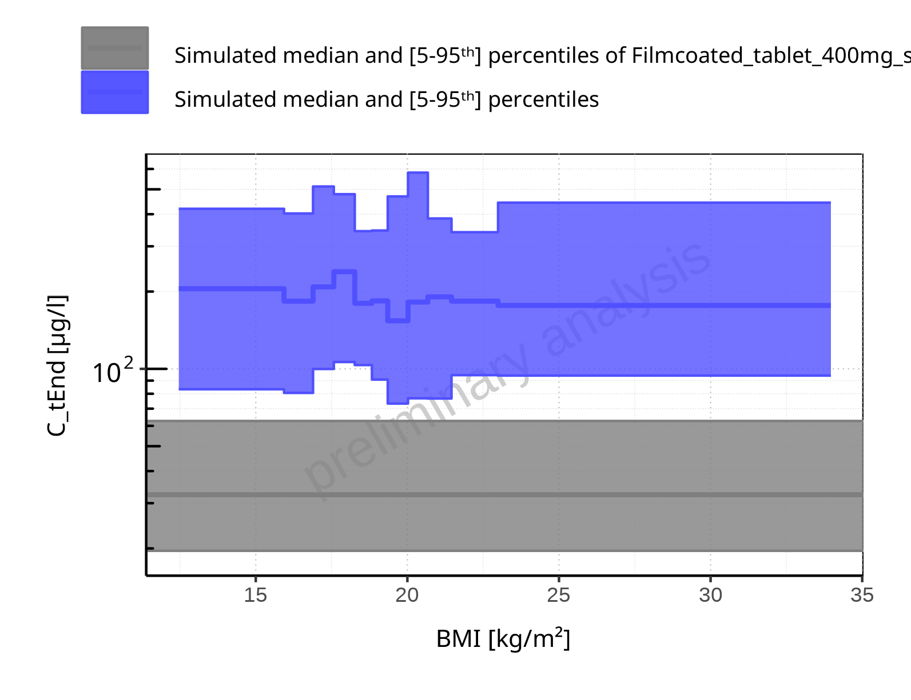


**Figure 2-105: BMI-dependence of C_tEnd for Larson 2013 8y-18y 400mg FCT meal in comparison to Filmcoated_tablet_400mg_sd. Profiles are plotted in a logarithmic scale.**


<br>
<br>


```{=openxml}
<w:br w:type="page"/>
```

`<w:bookmarkStart w:id="figure-2-106" w:name="figure-2-106"/><w:bookmarkEnd w:id="figure-2-106"/>`{=openxml}

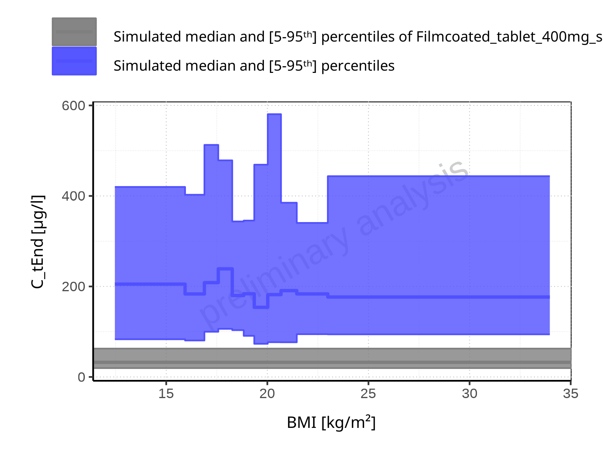


**Figure 2-106: BMI-dependence of C_tEnd for Larson 2013 8y-18y 400mg FCT meal in comparison to Filmcoated_tablet_400mg_sd. Profiles are plotted in a linear scale.**


<br>
<br>


```{=openxml}
<w:br w:type="page"/>
```

`<w:bookmarkStart w:id="figure-2-107" w:name="figure-2-107"/><w:bookmarkEnd w:id="figure-2-107"/>`{=openxml}

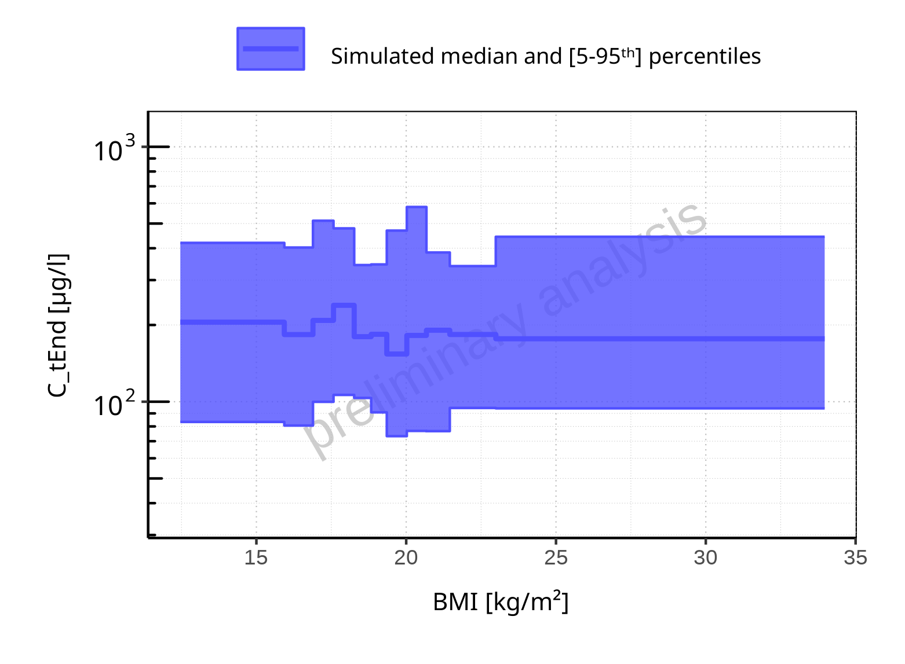


**Figure 2-107: BMI-dependence of C_tEnd for Larson 2013 8y-18y 400mg FCT meal. Profiles are plotted in a logarithmic scale.**


<br>
<br>


```{=openxml}
<w:br w:type="page"/>
```

`<w:bookmarkStart w:id="figure-2-108" w:name="figure-2-108"/><w:bookmarkEnd w:id="figure-2-108"/>`{=openxml}

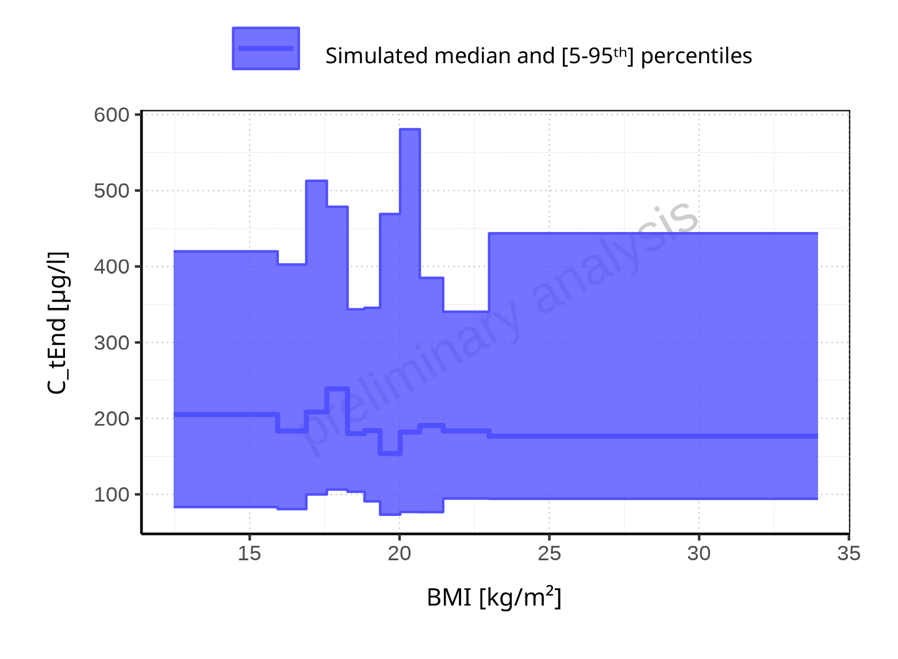


**Figure 2-108: BMI-dependence of C_tEnd for Larson 2013 8y-18y 400mg FCT meal. Profiles are plotted in a linear scale.**


<br>
<br>


```{=openxml}
<w:br w:type="page"/>
```

`<w:bookmarkStart w:id="figure-2-109" w:name="figure-2-109"/><w:bookmarkEnd w:id="figure-2-109"/>`{=openxml}

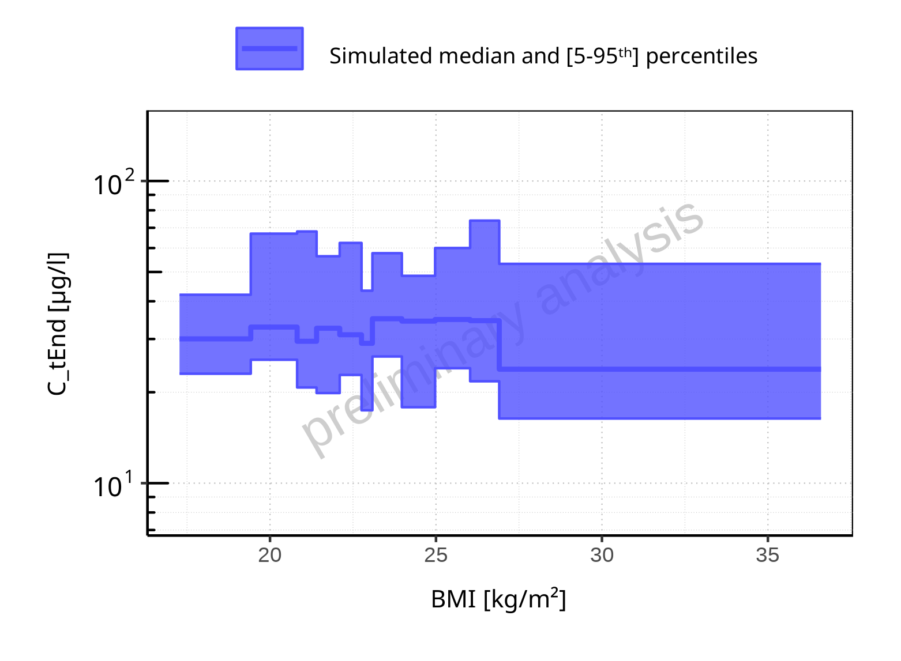


**Figure 2-109: BMI-dependence of C_tEnd for Filmcoated_tablet_400mg_sd. Profiles are plotted in a logarithmic scale.**


<br>
<br>


```{=openxml}
<w:br w:type="page"/>
```

`<w:bookmarkStart w:id="figure-2-110" w:name="figure-2-110"/><w:bookmarkEnd w:id="figure-2-110"/>`{=openxml}

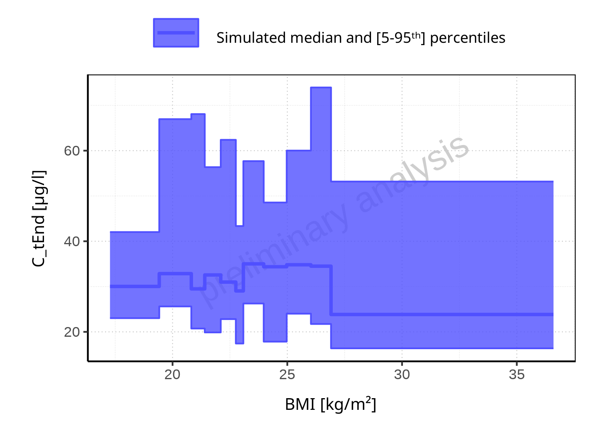


**Figure 2-110: BMI-dependence of C_tEnd for Filmcoated_tablet_400mg_sd. Profiles are plotted in a linear scale.**


<br>
<br>


```{=openxml}
<w:br w:type="page"/>
```

`<w:bookmarkStart w:id="figure-2-111" w:name="figure-2-111"/><w:bookmarkEnd w:id="figure-2-111"/>`{=openxml}

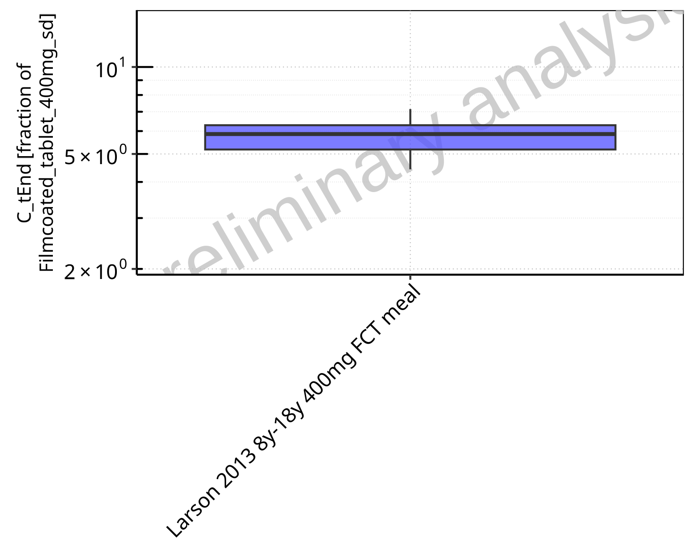


**Figure 2-111: Ratio of population summary statistics of C_tEnd of Raltegravir  for  Larson 2013 8y-18y 400mg FCT meal in comparison to Filmcoated_tablet_400mg_sd shown as box-whisker plot, which indicates ratios of the 5^th^, 25^th^, 50^th^, 75^th^, 95^th^ percentiles in logarithmic scale.**


<br>
<br>


```{=openxml}
<w:br w:type="page"/>
```

`<w:bookmarkStart w:id="figure-2-112" w:name="figure-2-112"/><w:bookmarkEnd w:id="figure-2-112"/>`{=openxml}

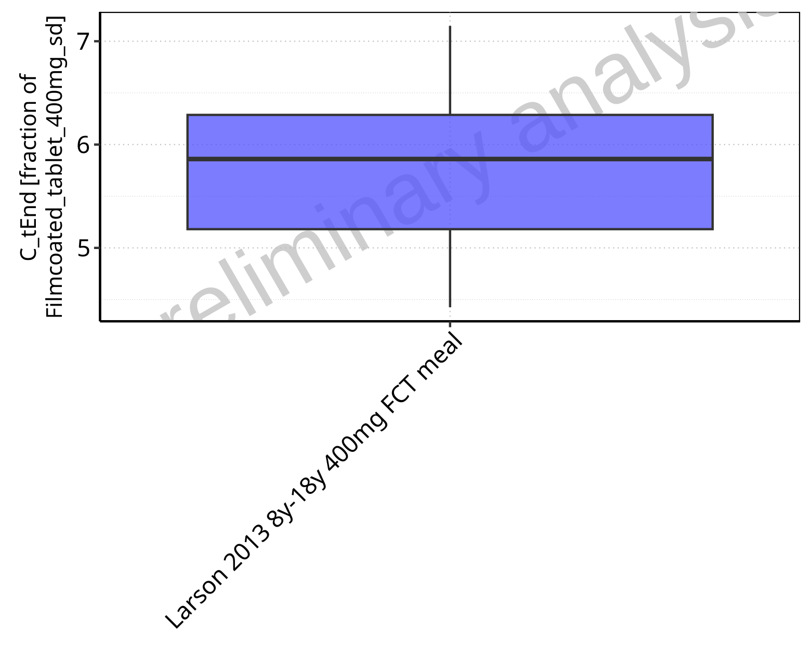


**Figure 2-112: Ratio of population summary statistics of C_tEnd of Raltegravir  for  Larson 2013 8y-18y 400mg FCT meal in comparison to Filmcoated_tablet_400mg_sd shown as box-whisker plot, which indicates ratios of the 5^th^, 25^th^, 50^th^, 75^th^, 95^th^ percentiles in linear scale.**


<br>
<br>


```{=openxml}
<w:br w:type="page"/>
```

`<w:bookmarkStart w:id="table-2-8" w:name="table-2-8"/><w:bookmarkEnd w:id="table-2-8"/>`{=openxml}

**Table 2-8: Ratio of population summary statistics of C_tEnd of Raltegravir  for  Larson 2013 8y-18y 400mg FCT meal in comparison to Filmcoated_tablet_400mg_sd**


|Population                        |N   |5^th^ pctl |25^th^ pctl |50^th^ pctl |75^th^ pctl |95^th^ pctl |Mean |SD   |Geo Mean |Geo SD |
|:---------------------------------|:---|:-------------------|:--------------------|:--------------------|:--------------------|:--------------------|:----|:----|:--------|:------|
|Larson 2013 8y-18y 400mg FCT meal |500 |4.43                |5.18                 |5.86                 |6.29                 |7.15                 |6.19 |9.09 |5.79     |1.15   |


<br>
<br>


### AUC `<w:bookmarkStart w:id="118_pk_parameters_organism_peripheralvenousblood_raltegravir_plasma__peripheral_venous_blood__auc_tend" w:name="118_pk_parameters_organism_peripheralvenousblood_raltegravir_plasma__peripheral_venous_blood__auc_tend"/><w:bookmarkEnd w:id="118_pk_parameters_organism_peripheralvenousblood_raltegravir_plasma__peripheral_venous_blood__auc_tend"/>`{=openxml}


```{=openxml}
<w:br w:type="page"/>
```

`<w:bookmarkStart w:id="figure-2-113" w:name="figure-2-113"/><w:bookmarkEnd w:id="figure-2-113"/>`{=openxml}

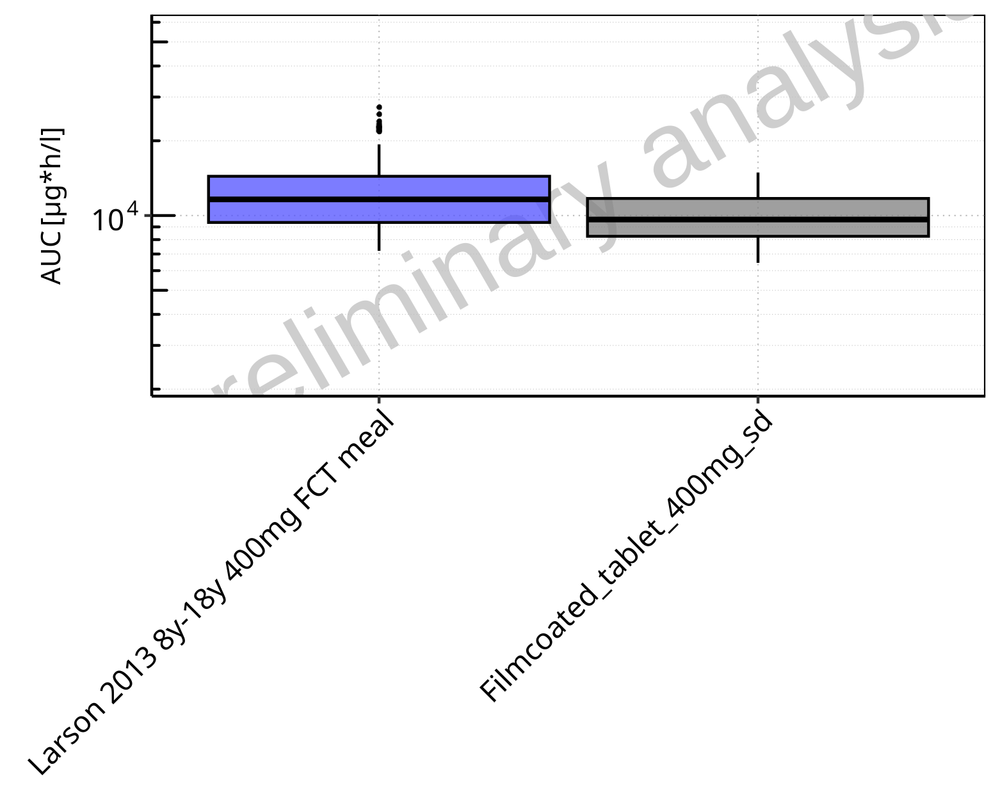


**Figure 2-113: AUC of Raltegravir for Larson 2013 8y-18y 400mg FCT meal, Filmcoated_tablet_400mg_sd shown as box-whisker plot, which indicates  the 5^th^, 25^th^, 50^th^, 75^th^, 95^th^ percentiles in logarithmic scale.**


<br>
<br>


```{=openxml}
<w:br w:type="page"/>
```

`<w:bookmarkStart w:id="figure-2-114" w:name="figure-2-114"/><w:bookmarkEnd w:id="figure-2-114"/>`{=openxml}


**Figure 2-114: AUC of Raltegravir for Larson 2013 8y-18y 400mg FCT meal, Filmcoated_tablet_400mg_sd shown as box-whisker plot, which indicates  the 5^th^, 25^th^, 50^th^, 75^th^, 95^th^ percentiles in linear scale.**


<br>
<br>


```{=openxml}
<w:br w:type="page"/>
```

`<w:bookmarkStart w:id="table-2-9" w:name="table-2-9"/><w:bookmarkEnd w:id="table-2-9"/>`{=openxml}

**Table 2-9: Population statistics summarizing AUC of Raltegravir for Larson 2013 8y-18y 400mg FCT meal, Filmcoated_tablet_400mg_sd reported in [µg*h/l]**


|Population                        |N   |5^th^ pctl |25^th^ pctl |50^th^ pctl |75^th^ pctl |95^th^ pctl |Mean     |SD      |Geo Mean |Geo SD |
|:---------------------------------|:---|:-------------------|:--------------------|:--------------------|:--------------------|:--------------------|:--------|:-------|:--------|:------|
|Larson 2013 8y-18y 400mg FCT meal |500 |7207.27             |9378.92              |11615.20             |14388.94             |19343.22             |12199.86 |3756.55 |11656.08 |1.35   |
|Filmcoated_tablet_400mg_sd        |100 |6449.27             |8248.74              |9637.50              |11717.00             |14901.10             |10129.70 |2672.29 |9784.56  |1.31   |


<br>
<br>


```{=openxml}
<w:br w:type="page"/>
```

`<w:bookmarkStart w:id="figure-2-115" w:name="figure-2-115"/><w:bookmarkEnd w:id="figure-2-115"/>`{=openxml}

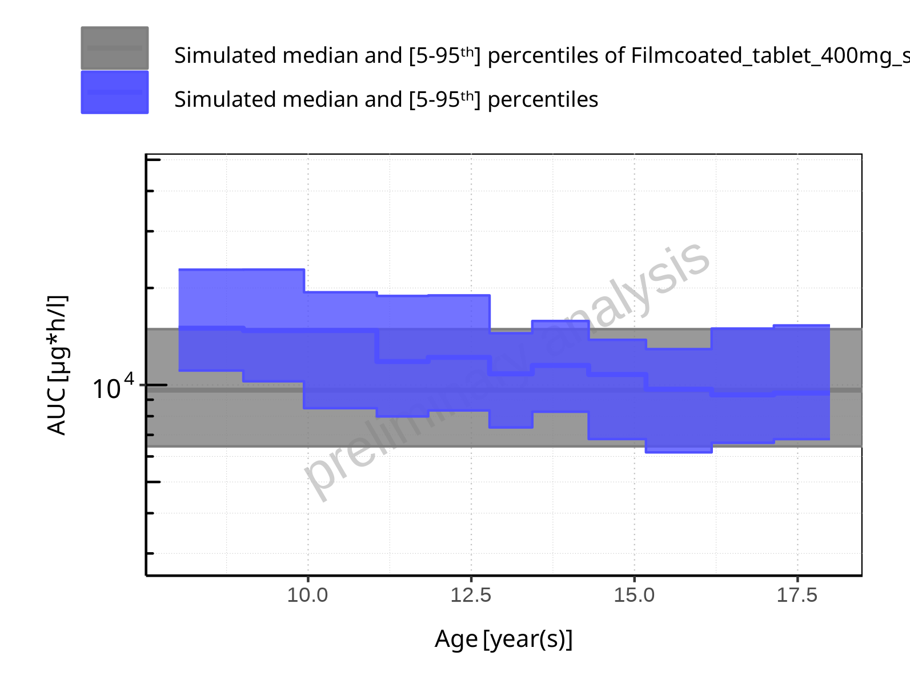


**Figure 2-115: Age-dependence of AUC for Larson 2013 8y-18y 400mg FCT meal in comparison to Filmcoated_tablet_400mg_sd. Profiles are plotted in a logarithmic scale.**


<br>
<br>


```{=openxml}
<w:br w:type="page"/>
```

`<w:bookmarkStart w:id="figure-2-116" w:name="figure-2-116"/><w:bookmarkEnd w:id="figure-2-116"/>`{=openxml}

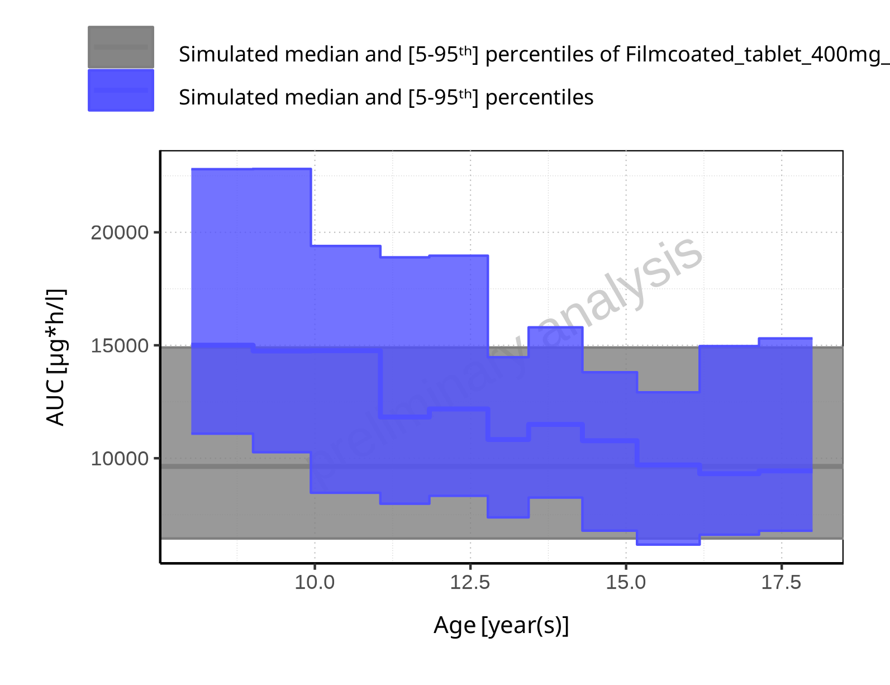


**Figure 2-116: Age-dependence of AUC for Larson 2013 8y-18y 400mg FCT meal in comparison to Filmcoated_tablet_400mg_sd. Profiles are plotted in a linear scale.**


<br>
<br>


```{=openxml}
<w:br w:type="page"/>
```

`<w:bookmarkStart w:id="figure-2-117" w:name="figure-2-117"/><w:bookmarkEnd w:id="figure-2-117"/>`{=openxml}

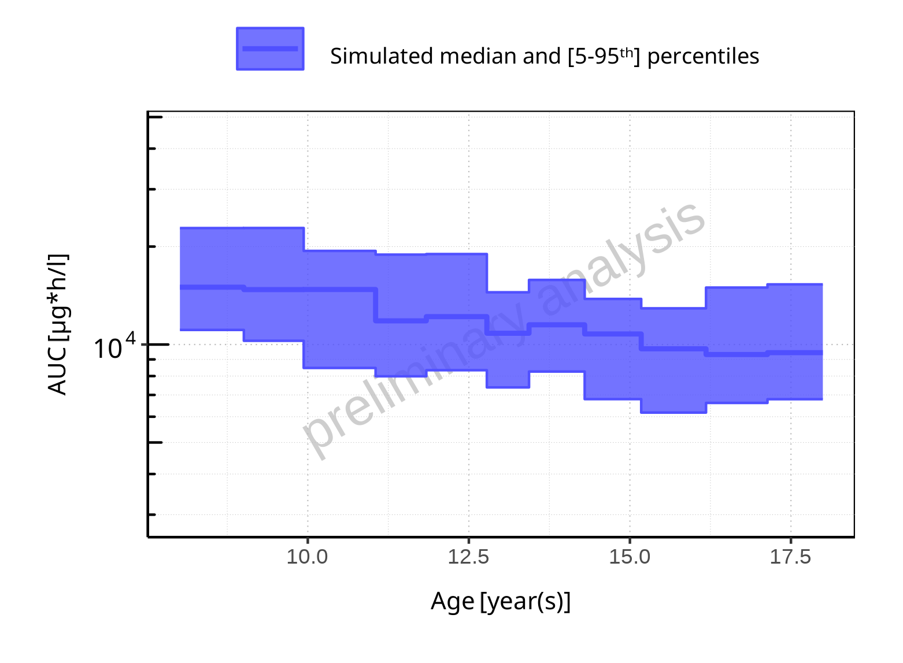


**Figure 2-117: Age-dependence of AUC for Larson 2013 8y-18y 400mg FCT meal. Profiles are plotted in a logarithmic scale.**


<br>
<br>


```{=openxml}
<w:br w:type="page"/>
```

`<w:bookmarkStart w:id="figure-2-118" w:name="figure-2-118"/><w:bookmarkEnd w:id="figure-2-118"/>`{=openxml}

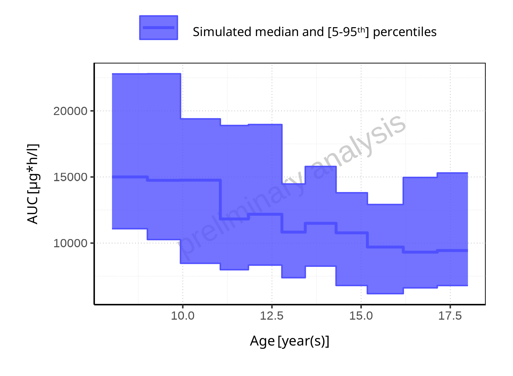


**Figure 2-118: Age-dependence of AUC for Larson 2013 8y-18y 400mg FCT meal. Profiles are plotted in a linear scale.**


<br>
<br>


```{=openxml}
<w:br w:type="page"/>
```

`<w:bookmarkStart w:id="figure-2-119" w:name="figure-2-119"/><w:bookmarkEnd w:id="figure-2-119"/>`{=openxml}

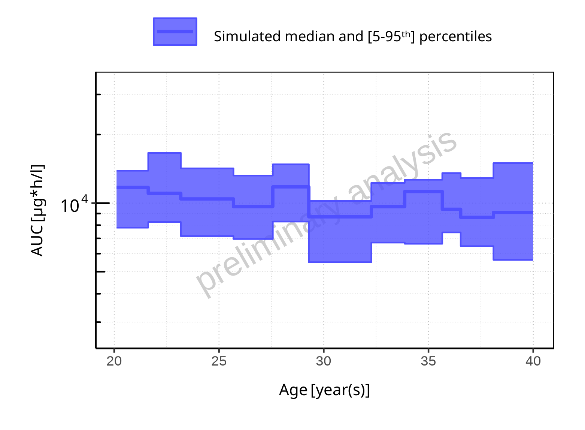


**Figure 2-119: Age-dependence of AUC for Filmcoated_tablet_400mg_sd. Profiles are plotted in a logarithmic scale.**


<br>
<br>


```{=openxml}
<w:br w:type="page"/>
```

`<w:bookmarkStart w:id="figure-2-120" w:name="figure-2-120"/><w:bookmarkEnd w:id="figure-2-120"/>`{=openxml}

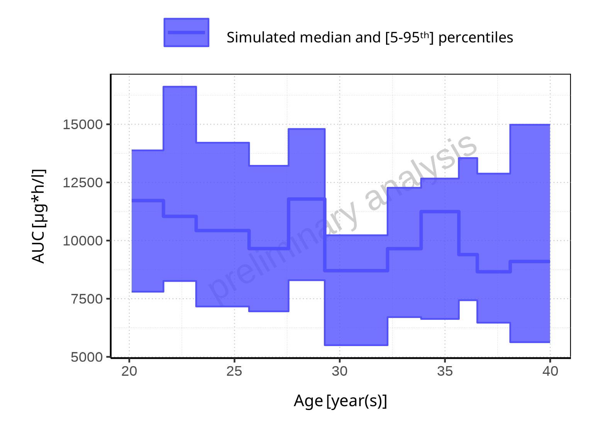


**Figure 2-120: Age-dependence of AUC for Filmcoated_tablet_400mg_sd. Profiles are plotted in a linear scale.**


<br>
<br>


```{=openxml}
<w:br w:type="page"/>
```

`<w:bookmarkStart w:id="figure-2-121" w:name="figure-2-121"/><w:bookmarkEnd w:id="figure-2-121"/>`{=openxml}

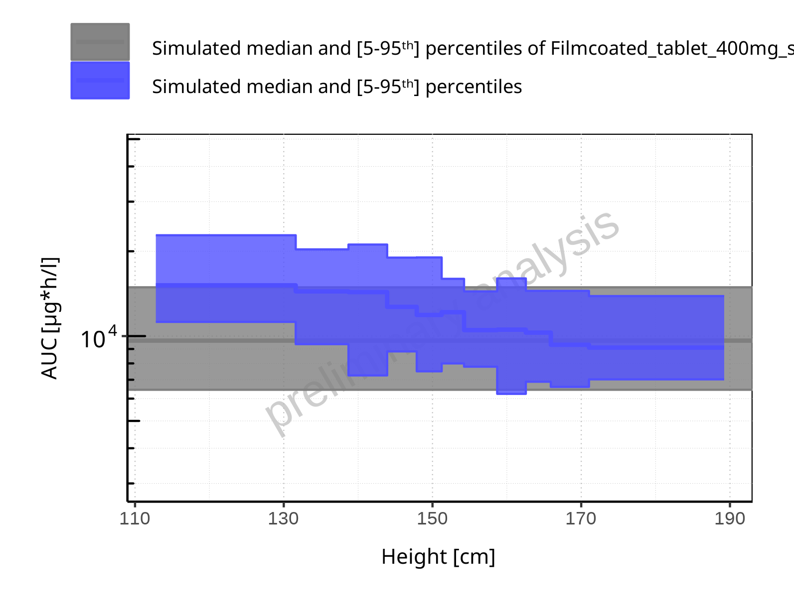


**Figure 2-121: Height-dependence of AUC for Larson 2013 8y-18y 400mg FCT meal in comparison to Filmcoated_tablet_400mg_sd. Profiles are plotted in a logarithmic scale.**


<br>
<br>


```{=openxml}
<w:br w:type="page"/>
```

`<w:bookmarkStart w:id="figure-2-122" w:name="figure-2-122"/><w:bookmarkEnd w:id="figure-2-122"/>`{=openxml}

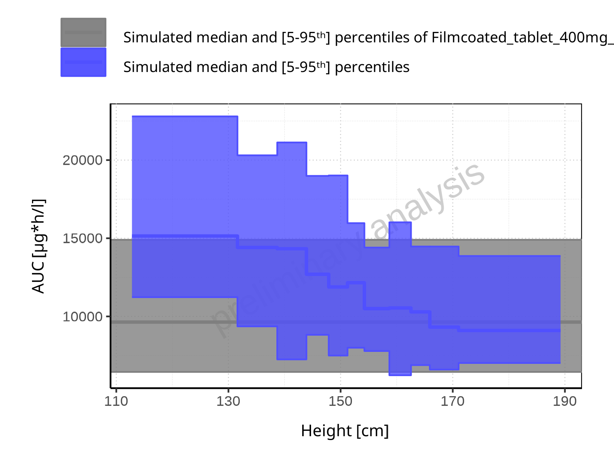


**Figure 2-122: Height-dependence of AUC for Larson 2013 8y-18y 400mg FCT meal in comparison to Filmcoated_tablet_400mg_sd. Profiles are plotted in a linear scale.**


<br>
<br>


```{=openxml}
<w:br w:type="page"/>
```

`<w:bookmarkStart w:id="figure-2-123" w:name="figure-2-123"/><w:bookmarkEnd w:id="figure-2-123"/>`{=openxml}

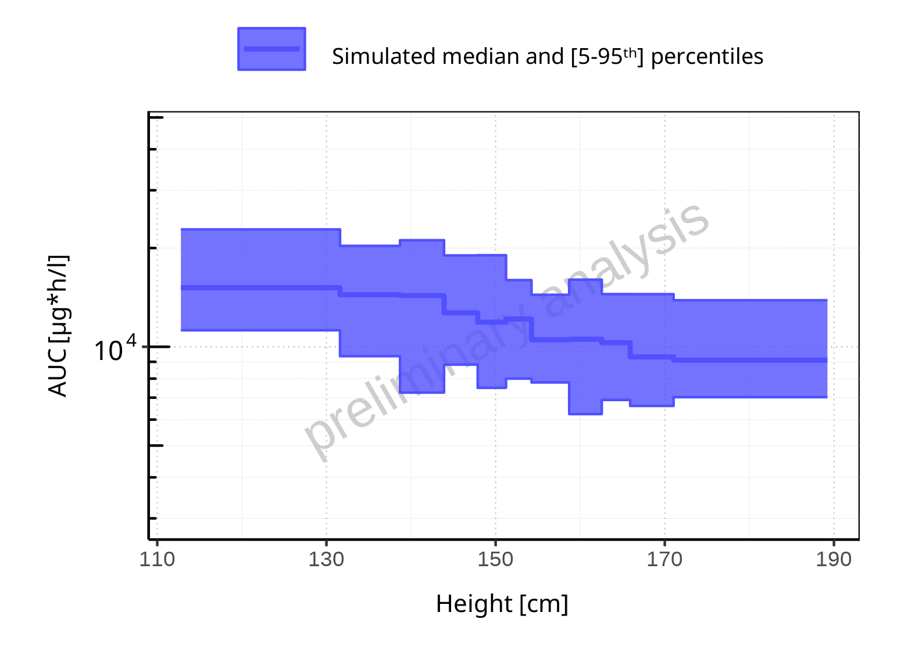


**Figure 2-123: Height-dependence of AUC for Larson 2013 8y-18y 400mg FCT meal. Profiles are plotted in a logarithmic scale.**


<br>
<br>


```{=openxml}
<w:br w:type="page"/>
```

`<w:bookmarkStart w:id="figure-2-124" w:name="figure-2-124"/><w:bookmarkEnd w:id="figure-2-124"/>`{=openxml}

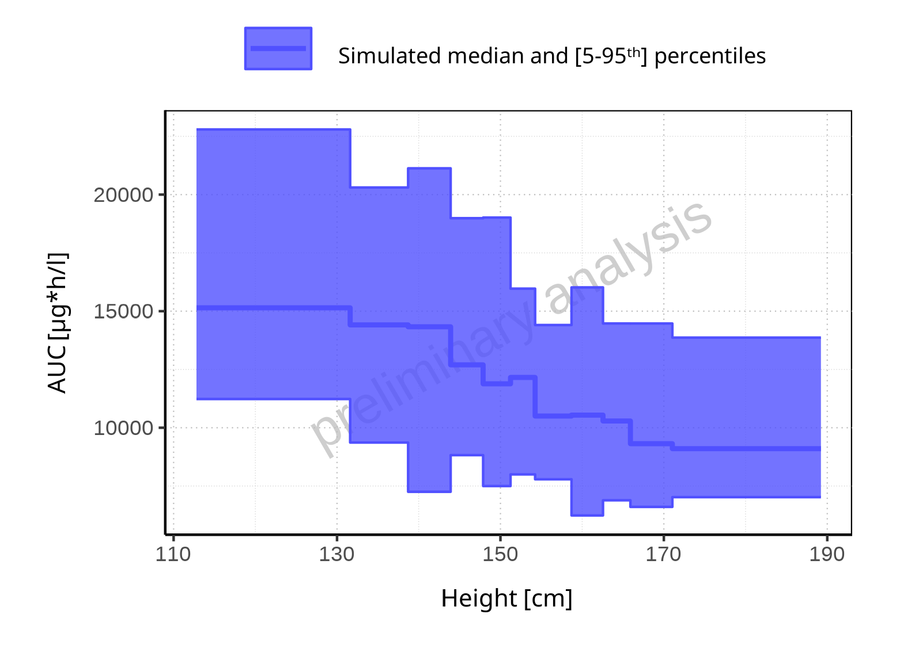


**Figure 2-124: Height-dependence of AUC for Larson 2013 8y-18y 400mg FCT meal. Profiles are plotted in a linear scale.**


<br>
<br>


```{=openxml}
<w:br w:type="page"/>
```

`<w:bookmarkStart w:id="figure-2-125" w:name="figure-2-125"/><w:bookmarkEnd w:id="figure-2-125"/>`{=openxml}

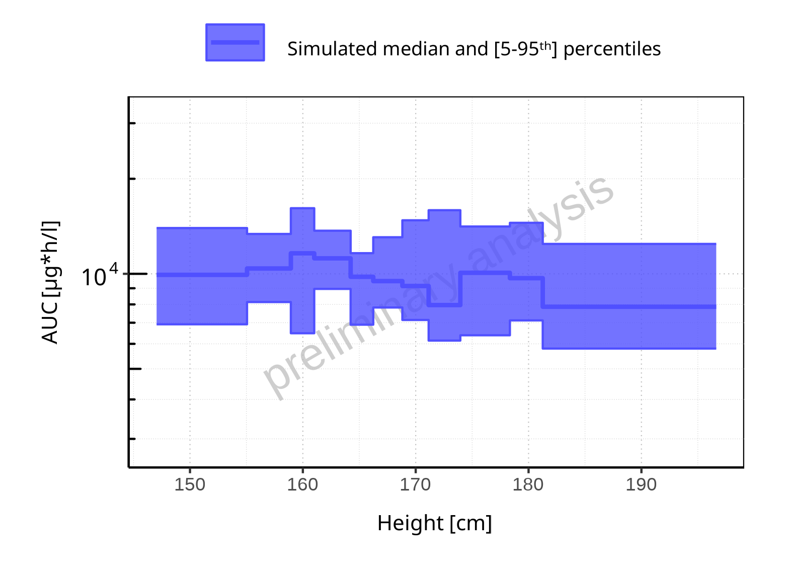


**Figure 2-125: Height-dependence of AUC for Filmcoated_tablet_400mg_sd. Profiles are plotted in a logarithmic scale.**


<br>
<br>


```{=openxml}
<w:br w:type="page"/>
```

`<w:bookmarkStart w:id="figure-2-126" w:name="figure-2-126"/><w:bookmarkEnd w:id="figure-2-126"/>`{=openxml}

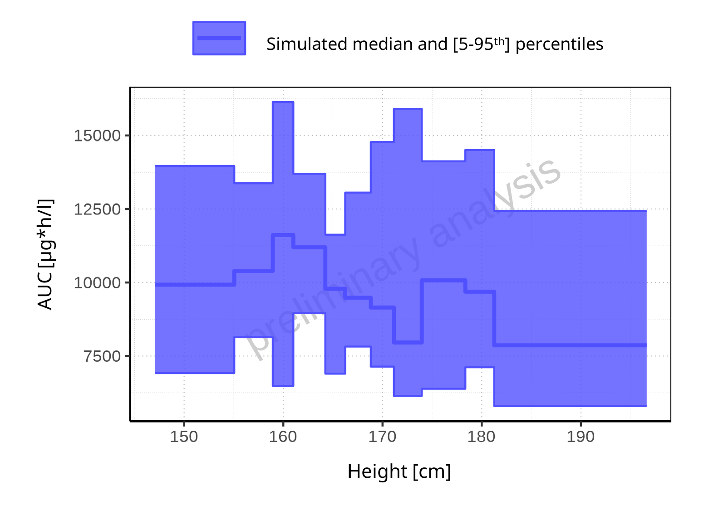


**Figure 2-126: Height-dependence of AUC for Filmcoated_tablet_400mg_sd. Profiles are plotted in a linear scale.**


<br>
<br>


```{=openxml}
<w:br w:type="page"/>
```

`<w:bookmarkStart w:id="figure-2-127" w:name="figure-2-127"/><w:bookmarkEnd w:id="figure-2-127"/>`{=openxml}

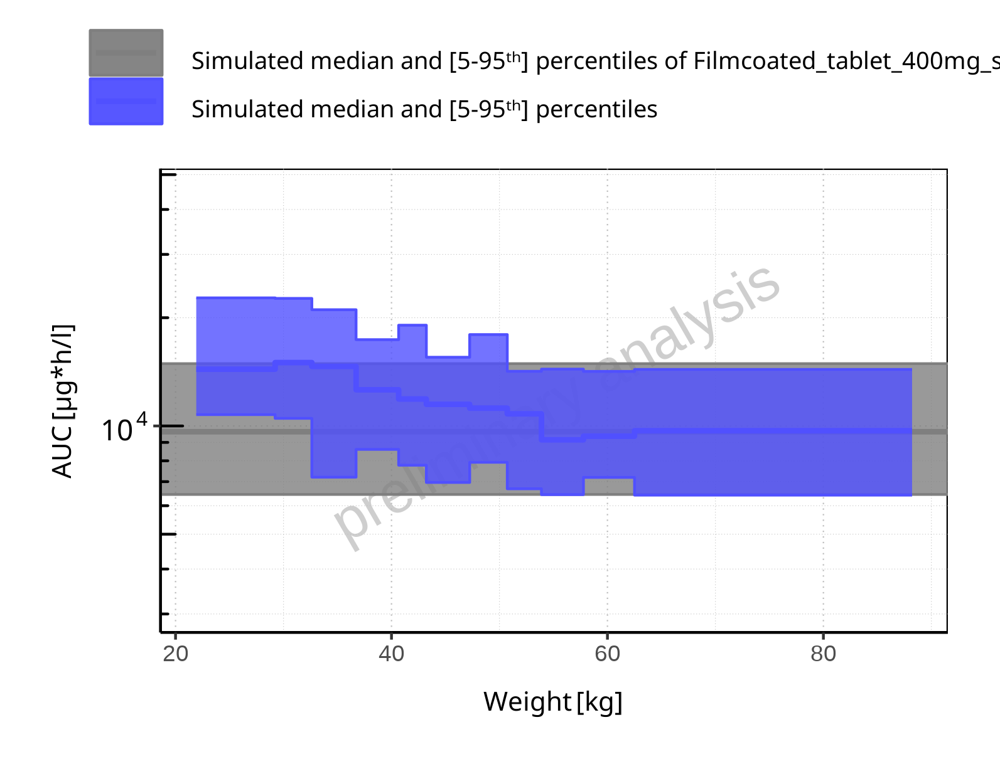


**Figure 2-127: Weight-dependence of AUC for Larson 2013 8y-18y 400mg FCT meal in comparison to Filmcoated_tablet_400mg_sd. Profiles are plotted in a logarithmic scale.**


<br>
<br>


```{=openxml}
<w:br w:type="page"/>
```

`<w:bookmarkStart w:id="figure-2-128" w:name="figure-2-128"/><w:bookmarkEnd w:id="figure-2-128"/>`{=openxml}

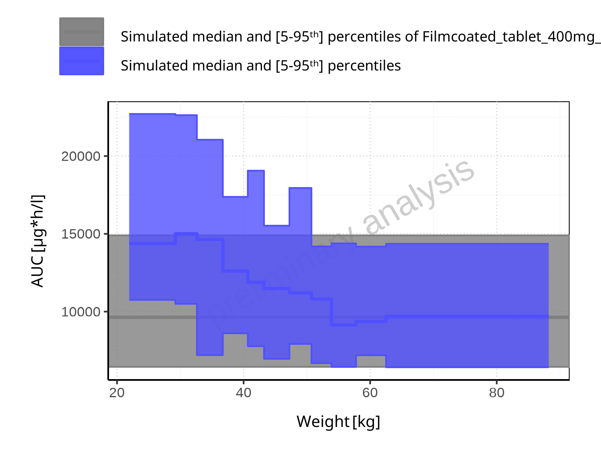


**Figure 2-128: Weight-dependence of AUC for Larson 2013 8y-18y 400mg FCT meal in comparison to Filmcoated_tablet_400mg_sd. Profiles are plotted in a linear scale.**


<br>
<br>


```{=openxml}
<w:br w:type="page"/>
```

`<w:bookmarkStart w:id="figure-2-129" w:name="figure-2-129"/><w:bookmarkEnd w:id="figure-2-129"/>`{=openxml}

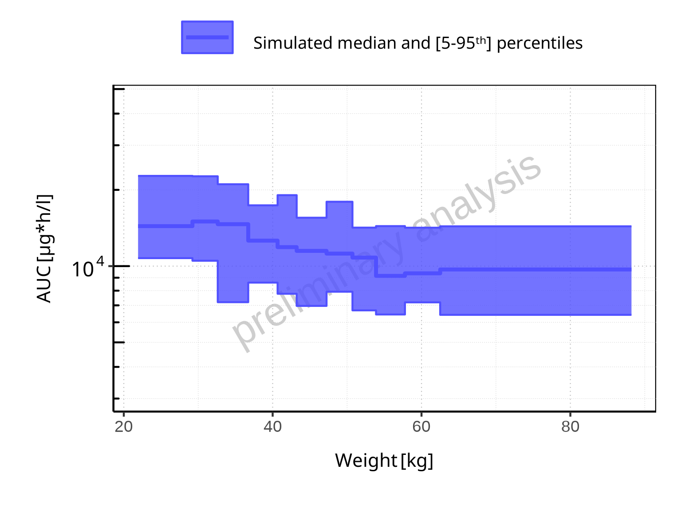


**Figure 2-129: Weight-dependence of AUC for Larson 2013 8y-18y 400mg FCT meal. Profiles are plotted in a logarithmic scale.**


<br>
<br>


```{=openxml}
<w:br w:type="page"/>
```

`<w:bookmarkStart w:id="figure-2-130" w:name="figure-2-130"/><w:bookmarkEnd w:id="figure-2-130"/>`{=openxml}

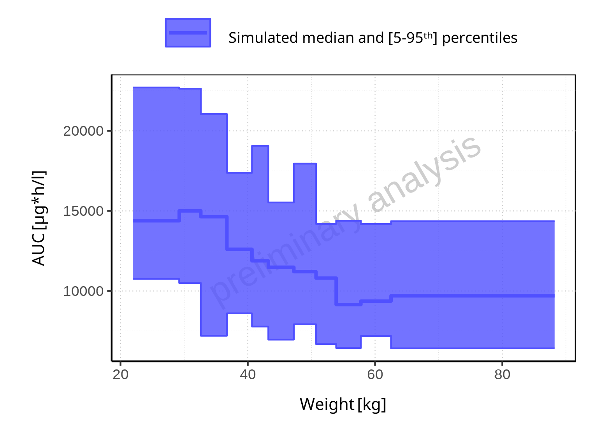


**Figure 2-130: Weight-dependence of AUC for Larson 2013 8y-18y 400mg FCT meal. Profiles are plotted in a linear scale.**


<br>
<br>


```{=openxml}
<w:br w:type="page"/>
```

`<w:bookmarkStart w:id="figure-2-131" w:name="figure-2-131"/><w:bookmarkEnd w:id="figure-2-131"/>`{=openxml}

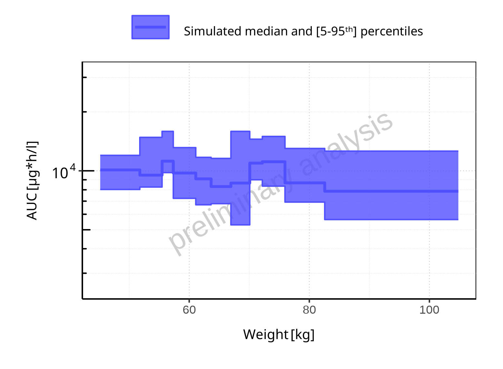


**Figure 2-131: Weight-dependence of AUC for Filmcoated_tablet_400mg_sd. Profiles are plotted in a logarithmic scale.**


<br>
<br>


```{=openxml}
<w:br w:type="page"/>
```

`<w:bookmarkStart w:id="figure-2-132" w:name="figure-2-132"/><w:bookmarkEnd w:id="figure-2-132"/>`{=openxml}

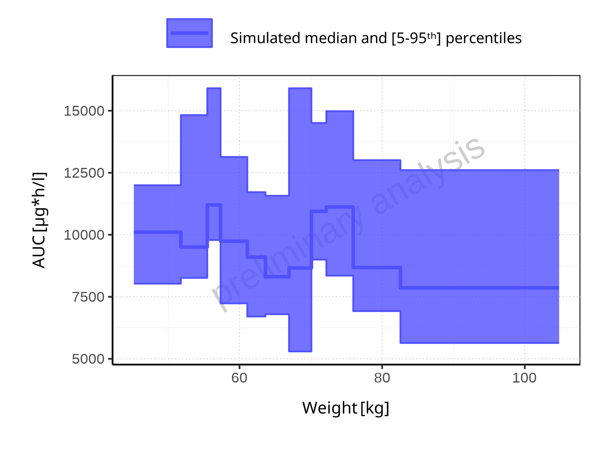


**Figure 2-132: Weight-dependence of AUC for Filmcoated_tablet_400mg_sd. Profiles are plotted in a linear scale.**


<br>
<br>


```{=openxml}
<w:br w:type="page"/>
```

`<w:bookmarkStart w:id="figure-2-133" w:name="figure-2-133"/><w:bookmarkEnd w:id="figure-2-133"/>`{=openxml}

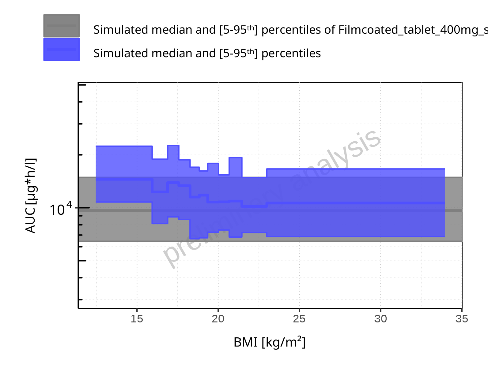


**Figure 2-133: BMI-dependence of AUC for Larson 2013 8y-18y 400mg FCT meal in comparison to Filmcoated_tablet_400mg_sd. Profiles are plotted in a logarithmic scale.**


<br>
<br>


```{=openxml}
<w:br w:type="page"/>
```

`<w:bookmarkStart w:id="figure-2-134" w:name="figure-2-134"/><w:bookmarkEnd w:id="figure-2-134"/>`{=openxml}

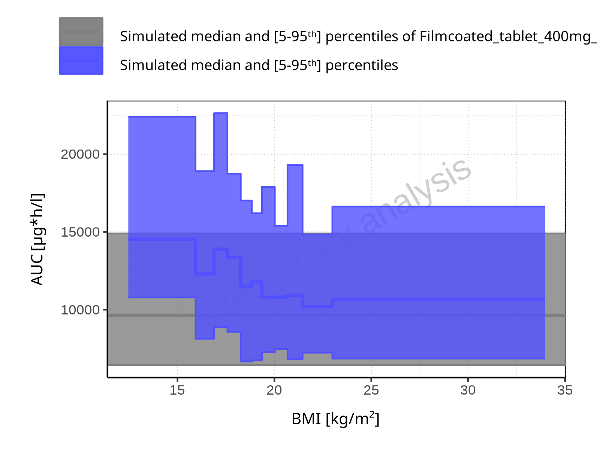


**Figure 2-134: BMI-dependence of AUC for Larson 2013 8y-18y 400mg FCT meal in comparison to Filmcoated_tablet_400mg_sd. Profiles are plotted in a linear scale.**


<br>
<br>


```{=openxml}
<w:br w:type="page"/>
```

`<w:bookmarkStart w:id="figure-2-135" w:name="figure-2-135"/><w:bookmarkEnd w:id="figure-2-135"/>`{=openxml}

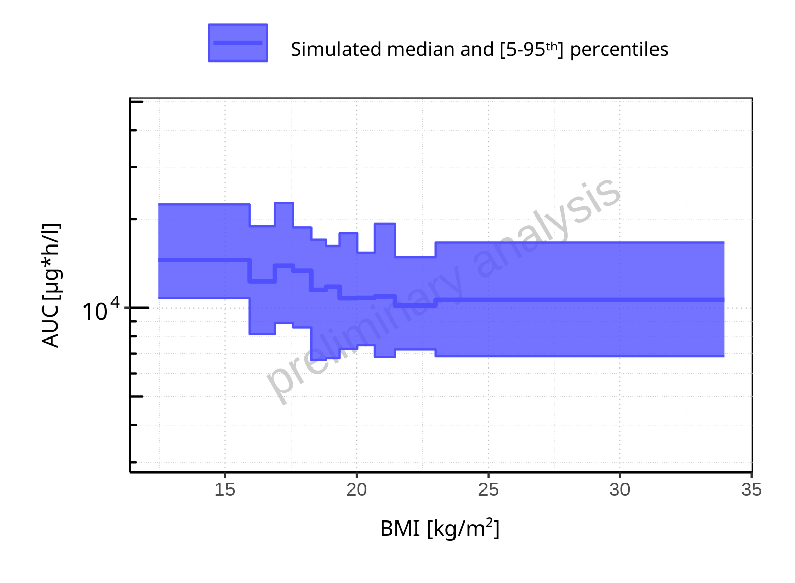


**Figure 2-135: BMI-dependence of AUC for Larson 2013 8y-18y 400mg FCT meal. Profiles are plotted in a logarithmic scale.**


<br>
<br>


```{=openxml}
<w:br w:type="page"/>
```

`<w:bookmarkStart w:id="figure-2-136" w:name="figure-2-136"/><w:bookmarkEnd w:id="figure-2-136"/>`{=openxml}

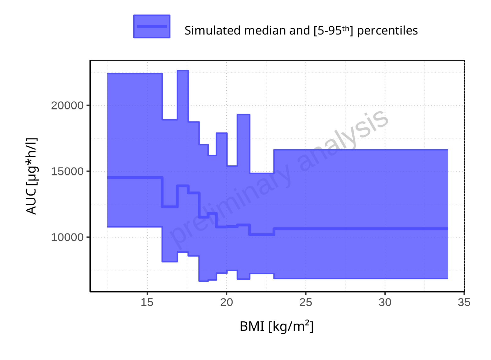


**Figure 2-136: BMI-dependence of AUC for Larson 2013 8y-18y 400mg FCT meal. Profiles are plotted in a linear scale.**


<br>
<br>


```{=openxml}
<w:br w:type="page"/>
```

`<w:bookmarkStart w:id="figure-2-137" w:name="figure-2-137"/><w:bookmarkEnd w:id="figure-2-137"/>`{=openxml}

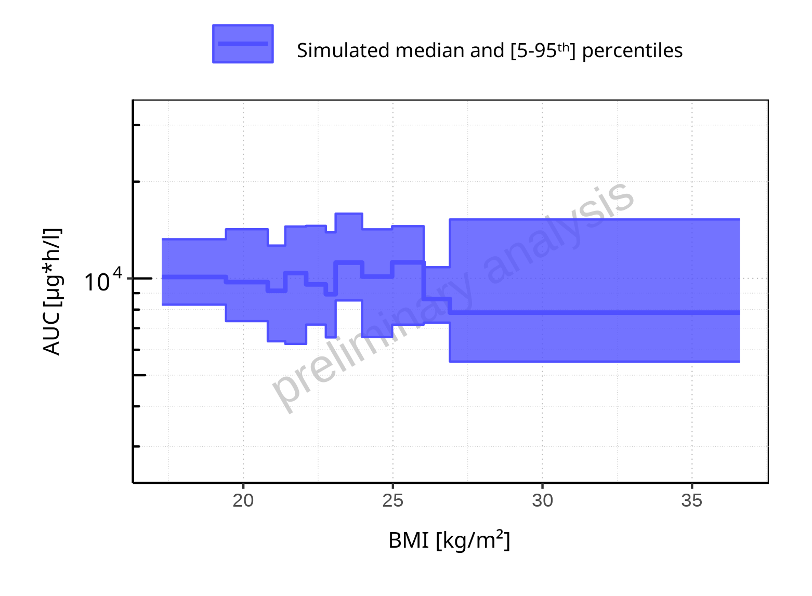


**Figure 2-137: BMI-dependence of AUC for Filmcoated_tablet_400mg_sd. Profiles are plotted in a logarithmic scale.**


<br>
<br>


```{=openxml}
<w:br w:type="page"/>
```

`<w:bookmarkStart w:id="figure-2-138" w:name="figure-2-138"/><w:bookmarkEnd w:id="figure-2-138"/>`{=openxml}

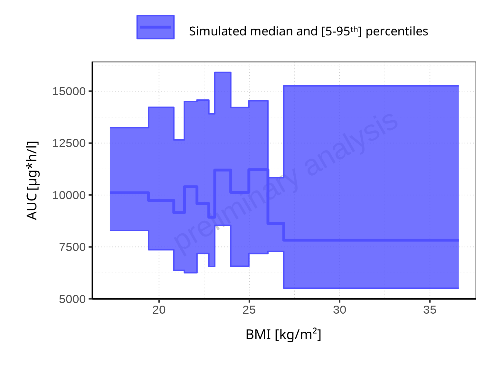


**Figure 2-138: BMI-dependence of AUC for Filmcoated_tablet_400mg_sd. Profiles are plotted in a linear scale.**


<br>
<br>


```{=openxml}
<w:br w:type="page"/>
```

`<w:bookmarkStart w:id="figure-2-139" w:name="figure-2-139"/><w:bookmarkEnd w:id="figure-2-139"/>`{=openxml}

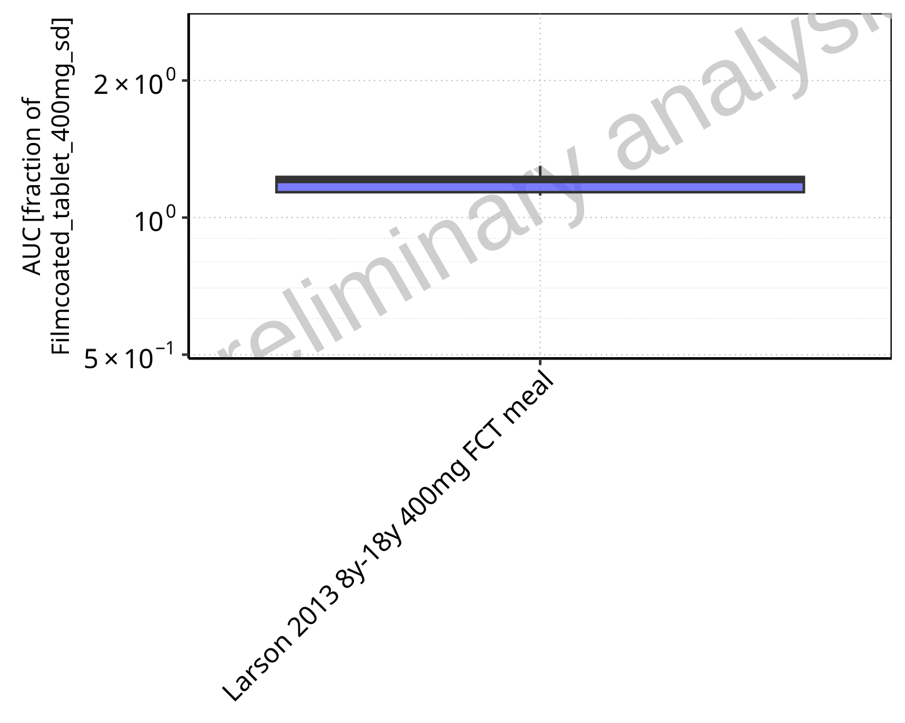


**Figure 2-139: Ratio of population summary statistics of AUC of Raltegravir  for  Larson 2013 8y-18y 400mg FCT meal in comparison to Filmcoated_tablet_400mg_sd shown as box-whisker plot, which indicates ratios of the 5^th^, 25^th^, 50^th^, 75^th^, 95^th^ percentiles in logarithmic scale.**


<br>
<br>


```{=openxml}
<w:br w:type="page"/>
```

`<w:bookmarkStart w:id="figure-2-140" w:name="figure-2-140"/><w:bookmarkEnd w:id="figure-2-140"/>`{=openxml}

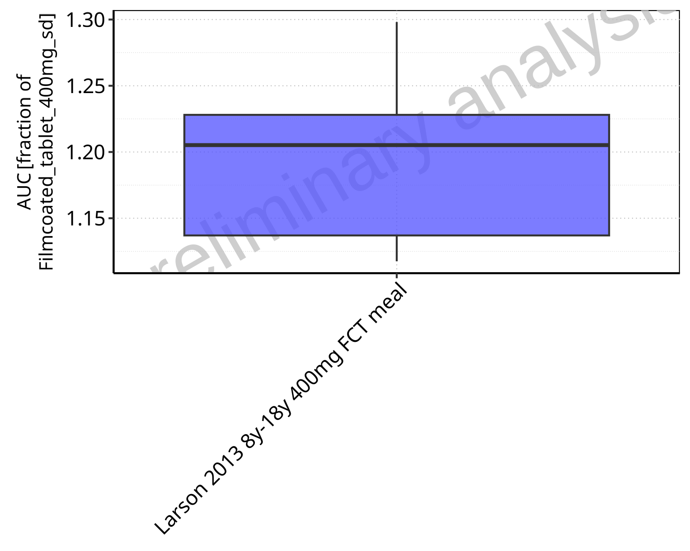


**Figure 2-140: Ratio of population summary statistics of AUC of Raltegravir  for  Larson 2013 8y-18y 400mg FCT meal in comparison to Filmcoated_tablet_400mg_sd shown as box-whisker plot, which indicates ratios of the 5^th^, 25^th^, 50^th^, 75^th^, 95^th^ percentiles in linear scale.**


<br>
<br>


```{=openxml}
<w:br w:type="page"/>
```

`<w:bookmarkStart w:id="table-2-10" w:name="table-2-10"/><w:bookmarkEnd w:id="table-2-10"/>`{=openxml}

**Table 2-10: Ratio of population summary statistics of AUC of Raltegravir  for  Larson 2013 8y-18y 400mg FCT meal in comparison to Filmcoated_tablet_400mg_sd**


|Population                        |N   |5^th^ pctl |25^th^ pctl |50^th^ pctl |75^th^ pctl |95^th^ pctl |Mean |SD   |Geo Mean |Geo SD |
|:---------------------------------|:---|:-------------------|:--------------------|:--------------------|:--------------------|:--------------------|:----|:----|:--------|:------|
|Larson 2013 8y-18y 400mg FCT meal |500 |1.12                |1.14                 |1.21                 |1.23                 |1.30                 |1.20 |1.41 |1.19     |1.04   |


<br>
<br>


### AUC_norm `<w:bookmarkStart w:id="147_pk_parameters_organism_peripheralvenousblood_raltegravir_plasma__peripheral_venous_blood__auc_tend_norm" w:name="147_pk_parameters_organism_peripheralvenousblood_raltegravir_plasma__peripheral_venous_blood__auc_tend_norm"/><w:bookmarkEnd w:id="147_pk_parameters_organism_peripheralvenousblood_raltegravir_plasma__peripheral_venous_blood__auc_tend_norm"/>`{=openxml}


```{=openxml}
<w:br w:type="page"/>
```

`<w:bookmarkStart w:id="figure-2-141" w:name="figure-2-141"/><w:bookmarkEnd w:id="figure-2-141"/>`{=openxml}

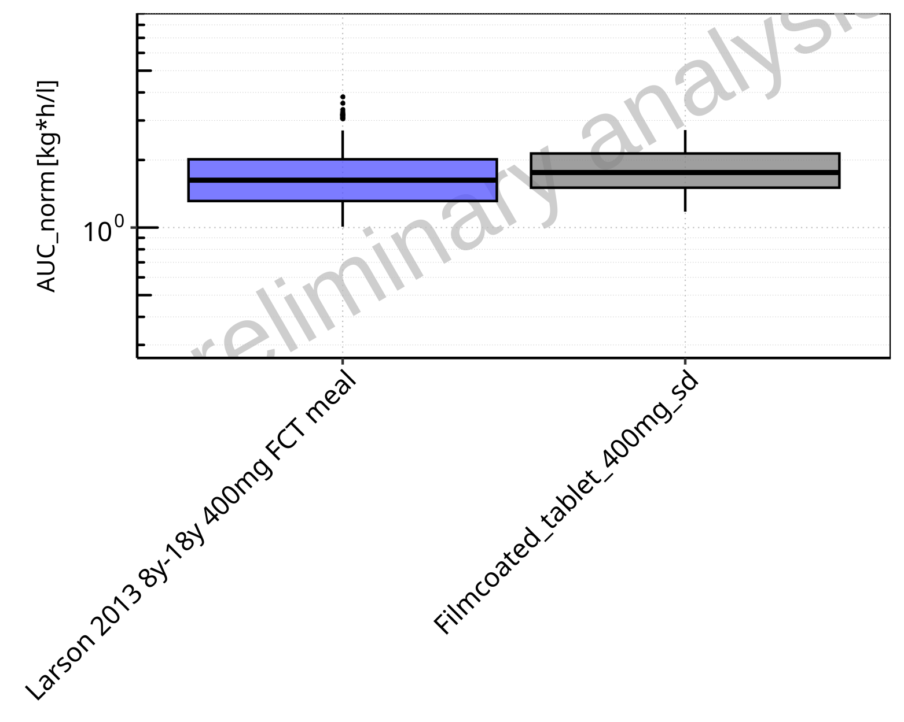


**Figure 2-141: AUC_norm of Raltegravir for Larson 2013 8y-18y 400mg FCT meal, Filmcoated_tablet_400mg_sd shown as box-whisker plot, which indicates  the 5^th^, 25^th^, 50^th^, 75^th^, 95^th^ percentiles in logarithmic scale.**


<br>
<br>


```{=openxml}
<w:br w:type="page"/>
```

`<w:bookmarkStart w:id="figure-2-142" w:name="figure-2-142"/><w:bookmarkEnd w:id="figure-2-142"/>`{=openxml}

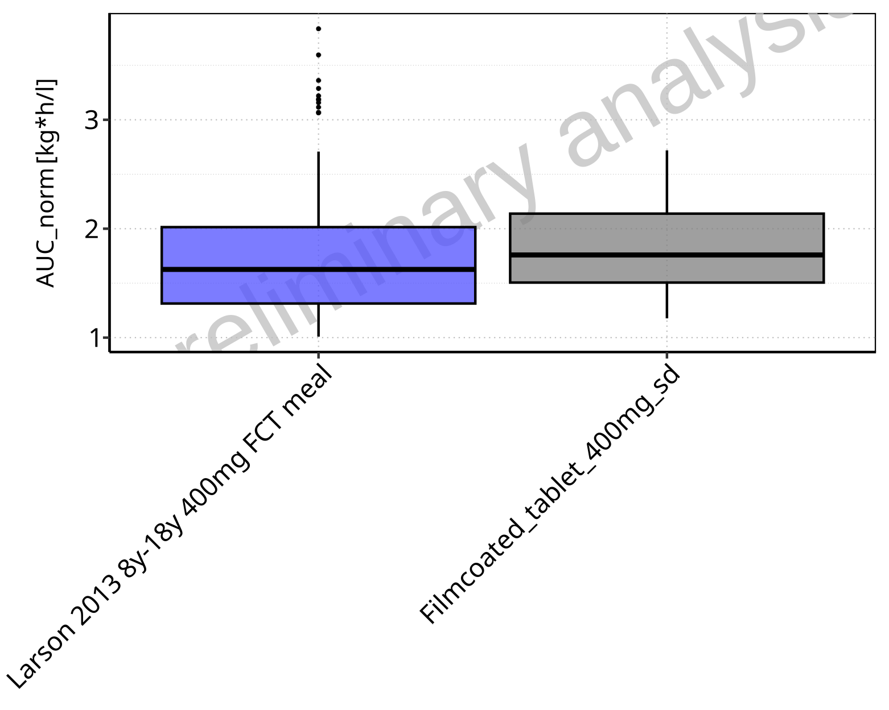


**Figure 2-142: AUC_norm of Raltegravir for Larson 2013 8y-18y 400mg FCT meal, Filmcoated_tablet_400mg_sd shown as box-whisker plot, which indicates  the 5^th^, 25^th^, 50^th^, 75^th^, 95^th^ percentiles in linear scale.**


<br>
<br>


```{=openxml}
<w:br w:type="page"/>
```

`<w:bookmarkStart w:id="table-2-11" w:name="table-2-11"/><w:bookmarkEnd w:id="table-2-11"/>`{=openxml}

**Table 2-11: Population statistics summarizing AUC_norm of Raltegravir for Larson 2013 8y-18y 400mg FCT meal, Filmcoated_tablet_400mg_sd reported in [kg*h/l]**


|Population                        |N   |5^th^ pctl |25^th^ pctl |50^th^ pctl |75^th^ pctl |95^th^ pctl |Mean |SD   |Geo Mean |Geo SD |
|:---------------------------------|:---|:-------------------|:--------------------|:--------------------|:--------------------|:--------------------|:----|:----|:--------|:------|
|Larson 2013 8y-18y 400mg FCT meal |500 |1.01                |1.31                 |1.63                 |2.01                 |2.71                 |1.71 |0.53 |1.63     |1.35   |
|Filmcoated_tablet_400mg_sd        |100 |1.18                |1.51                 |1.76                 |2.14                 |2.72                 |1.85 |0.49 |1.79     |1.31   |


<br>
<br>


```{=openxml}
<w:br w:type="page"/>
```

`<w:bookmarkStart w:id="figure-2-143" w:name="figure-2-143"/><w:bookmarkEnd w:id="figure-2-143"/>`{=openxml}

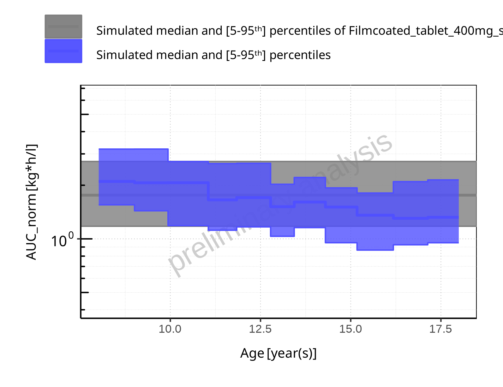


**Figure 2-143: Age-dependence of AUC_norm for Larson 2013 8y-18y 400mg FCT meal in comparison to Filmcoated_tablet_400mg_sd. Profiles are plotted in a logarithmic scale.**


<br>
<br>


```{=openxml}
<w:br w:type="page"/>
```

`<w:bookmarkStart w:id="figure-2-144" w:name="figure-2-144"/><w:bookmarkEnd w:id="figure-2-144"/>`{=openxml}

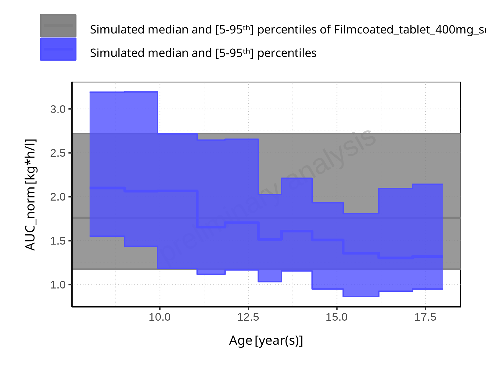


**Figure 2-144: Age-dependence of AUC_norm for Larson 2013 8y-18y 400mg FCT meal in comparison to Filmcoated_tablet_400mg_sd. Profiles are plotted in a linear scale.**


<br>
<br>


```{=openxml}
<w:br w:type="page"/>
```

`<w:bookmarkStart w:id="figure-2-145" w:name="figure-2-145"/><w:bookmarkEnd w:id="figure-2-145"/>`{=openxml}

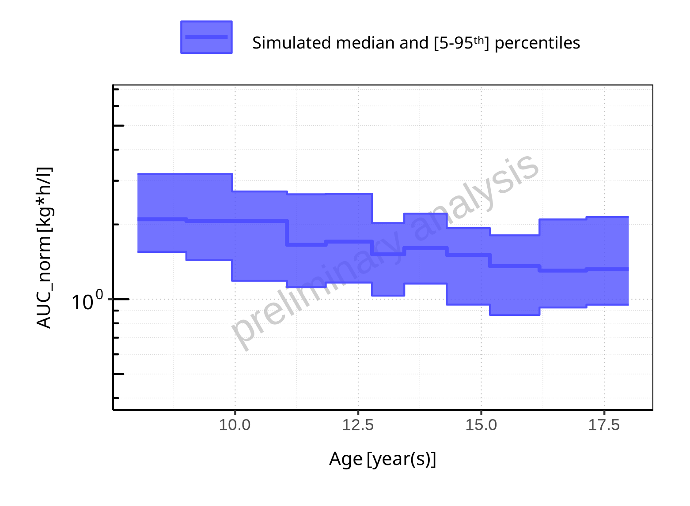


**Figure 2-145: Age-dependence of AUC_norm for Larson 2013 8y-18y 400mg FCT meal. Profiles are plotted in a logarithmic scale.**


<br>
<br>


```{=openxml}
<w:br w:type="page"/>
```

`<w:bookmarkStart w:id="figure-2-146" w:name="figure-2-146"/><w:bookmarkEnd w:id="figure-2-146"/>`{=openxml}

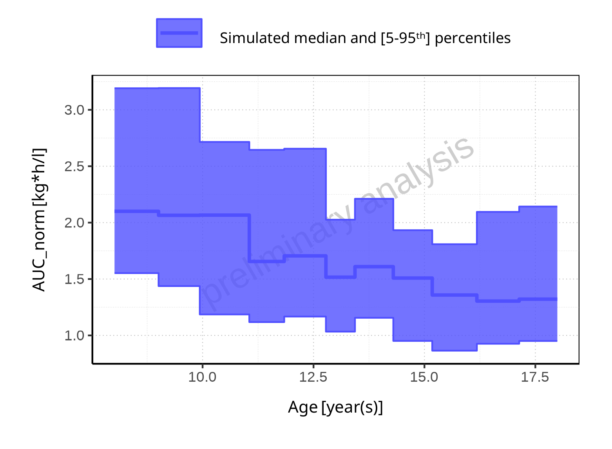


**Figure 2-146: Age-dependence of AUC_norm for Larson 2013 8y-18y 400mg FCT meal. Profiles are plotted in a linear scale.**


<br>
<br>


```{=openxml}
<w:br w:type="page"/>
```

`<w:bookmarkStart w:id="figure-2-147" w:name="figure-2-147"/><w:bookmarkEnd w:id="figure-2-147"/>`{=openxml}

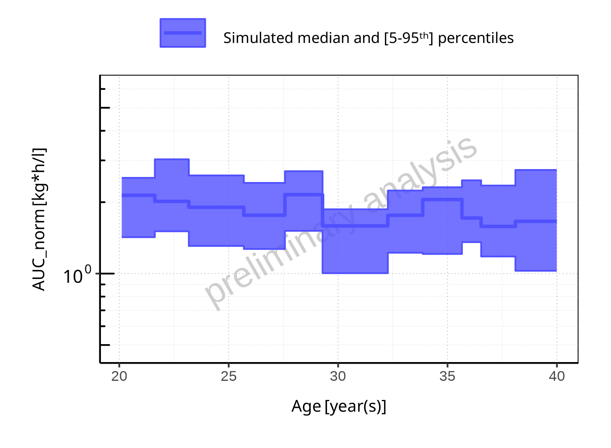


**Figure 2-147: Age-dependence of AUC_norm for Filmcoated_tablet_400mg_sd. Profiles are plotted in a logarithmic scale.**


<br>
<br>


```{=openxml}
<w:br w:type="page"/>
```

`<w:bookmarkStart w:id="figure-2-148" w:name="figure-2-148"/><w:bookmarkEnd w:id="figure-2-148"/>`{=openxml}

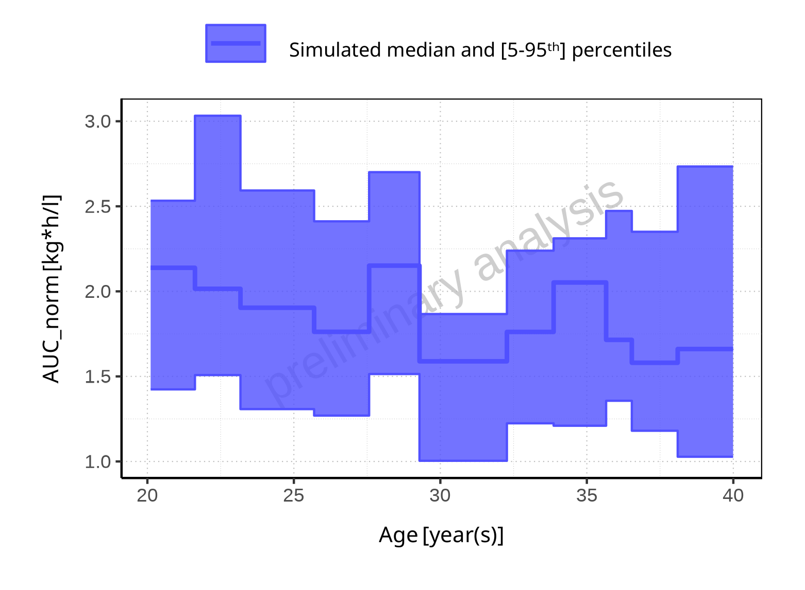


**Figure 2-148: Age-dependence of AUC_norm for Filmcoated_tablet_400mg_sd. Profiles are plotted in a linear scale.**


<br>
<br>


```{=openxml}
<w:br w:type="page"/>
```

`<w:bookmarkStart w:id="figure-2-149" w:name="figure-2-149"/><w:bookmarkEnd w:id="figure-2-149"/>`{=openxml}

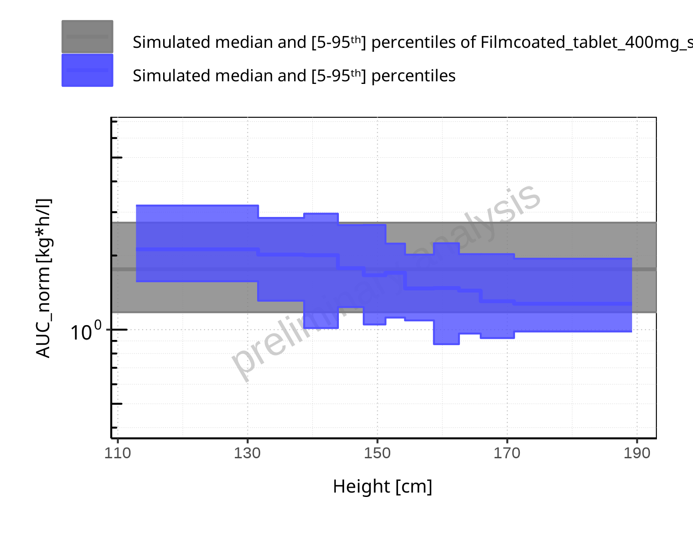


**Figure 2-149: Height-dependence of AUC_norm for Larson 2013 8y-18y 400mg FCT meal in comparison to Filmcoated_tablet_400mg_sd. Profiles are plotted in a logarithmic scale.**


<br>
<br>


```{=openxml}
<w:br w:type="page"/>
```

`<w:bookmarkStart w:id="figure-2-150" w:name="figure-2-150"/><w:bookmarkEnd w:id="figure-2-150"/>`{=openxml}

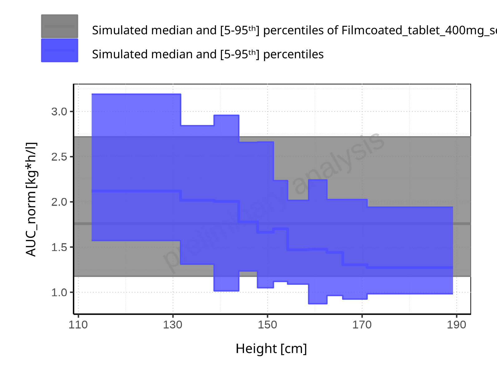


**Figure 2-150: Height-dependence of AUC_norm for Larson 2013 8y-18y 400mg FCT meal in comparison to Filmcoated_tablet_400mg_sd. Profiles are plotted in a linear scale.**


<br>
<br>


```{=openxml}
<w:br w:type="page"/>
```

`<w:bookmarkStart w:id="figure-2-151" w:name="figure-2-151"/><w:bookmarkEnd w:id="figure-2-151"/>`{=openxml}

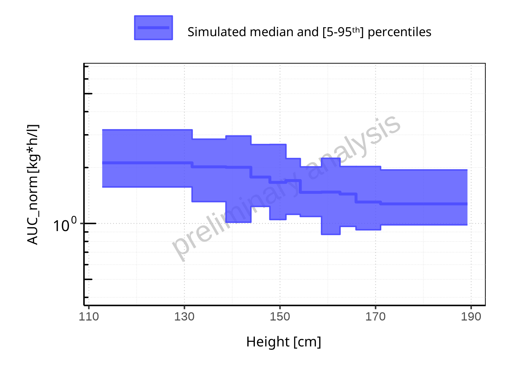


**Figure 2-151: Height-dependence of AUC_norm for Larson 2013 8y-18y 400mg FCT meal. Profiles are plotted in a logarithmic scale.**


<br>
<br>


```{=openxml}
<w:br w:type="page"/>
```

`<w:bookmarkStart w:id="figure-2-152" w:name="figure-2-152"/><w:bookmarkEnd w:id="figure-2-152"/>`{=openxml}

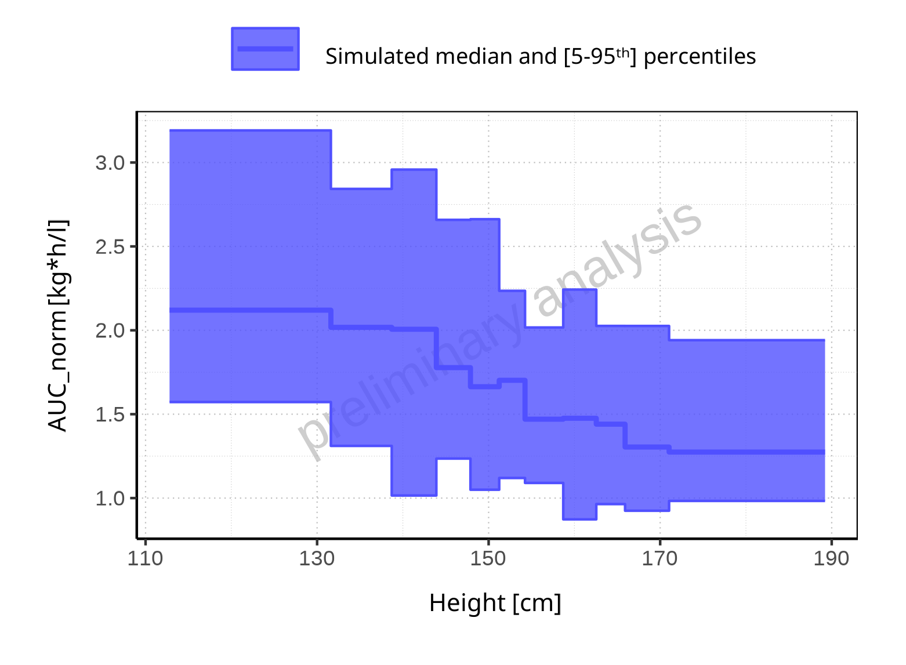


**Figure 2-152: Height-dependence of AUC_norm for Larson 2013 8y-18y 400mg FCT meal. Profiles are plotted in a linear scale.**


<br>
<br>


```{=openxml}
<w:br w:type="page"/>
```

`<w:bookmarkStart w:id="figure-2-153" w:name="figure-2-153"/><w:bookmarkEnd w:id="figure-2-153"/>`{=openxml}

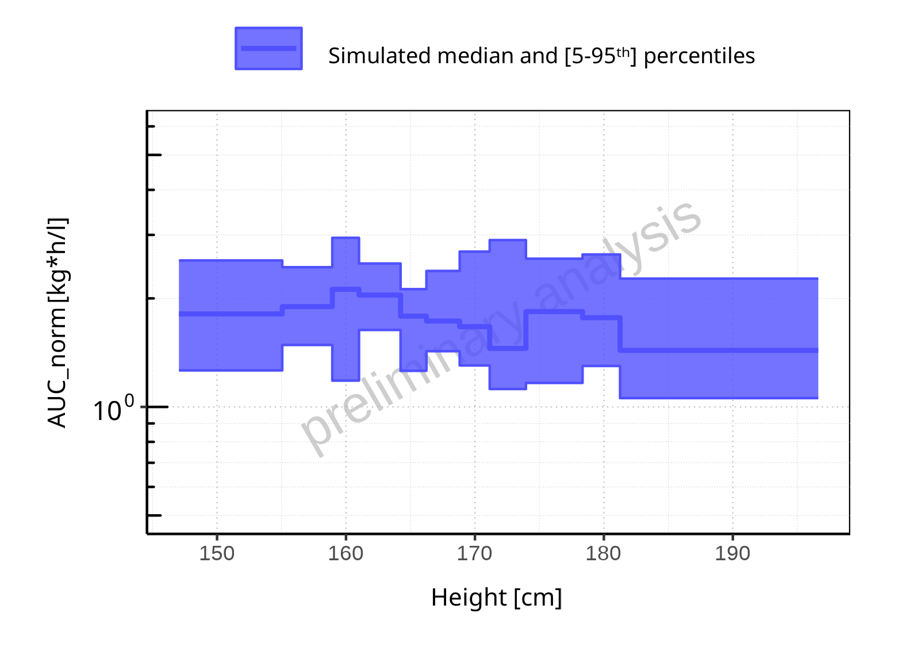


**Figure 2-153: Height-dependence of AUC_norm for Filmcoated_tablet_400mg_sd. Profiles are plotted in a logarithmic scale.**


<br>
<br>


```{=openxml}
<w:br w:type="page"/>
```

`<w:bookmarkStart w:id="figure-2-154" w:name="figure-2-154"/><w:bookmarkEnd w:id="figure-2-154"/>`{=openxml}

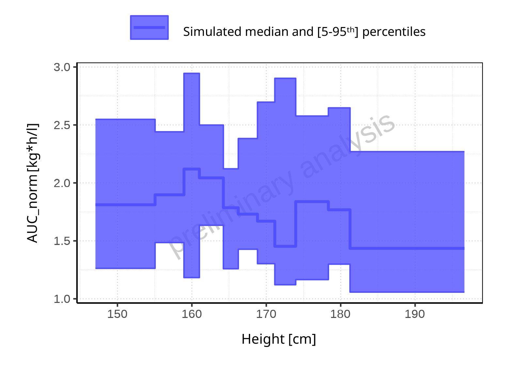


**Figure 2-154: Height-dependence of AUC_norm for Filmcoated_tablet_400mg_sd. Profiles are plotted in a linear scale.**


<br>
<br>


```{=openxml}
<w:br w:type="page"/>
```

`<w:bookmarkStart w:id="figure-2-155" w:name="figure-2-155"/><w:bookmarkEnd w:id="figure-2-155"/>`{=openxml}

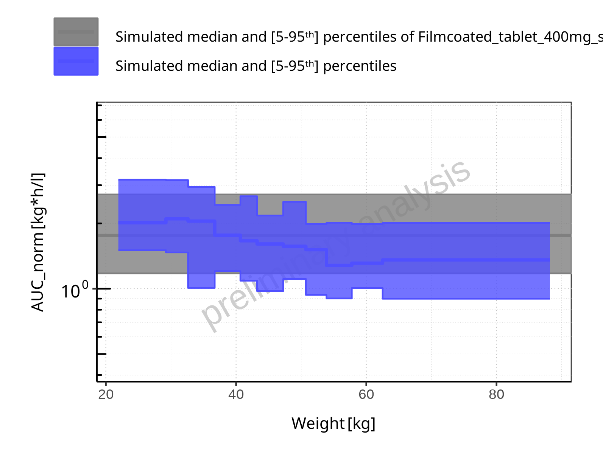


**Figure 2-155: Weight-dependence of AUC_norm for Larson 2013 8y-18y 400mg FCT meal in comparison to Filmcoated_tablet_400mg_sd. Profiles are plotted in a logarithmic scale.**


<br>
<br>


```{=openxml}
<w:br w:type="page"/>
```

`<w:bookmarkStart w:id="figure-2-156" w:name="figure-2-156"/><w:bookmarkEnd w:id="figure-2-156"/>`{=openxml}

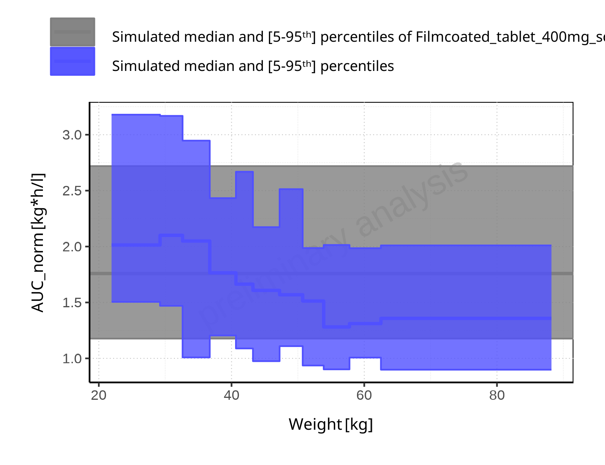


**Figure 2-156: Weight-dependence of AUC_norm for Larson 2013 8y-18y 400mg FCT meal in comparison to Filmcoated_tablet_400mg_sd. Profiles are plotted in a linear scale.**


<br>
<br>


```{=openxml}
<w:br w:type="page"/>
```

`<w:bookmarkStart w:id="figure-2-157" w:name="figure-2-157"/><w:bookmarkEnd w:id="figure-2-157"/>`{=openxml}

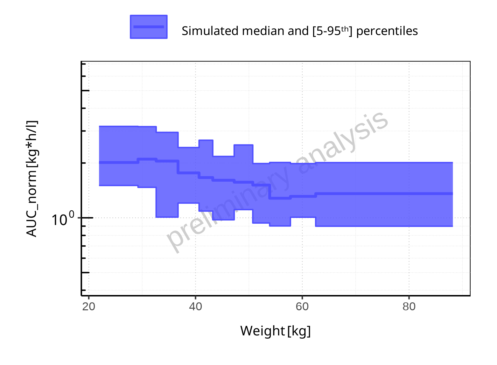


**Figure 2-157: Weight-dependence of AUC_norm for Larson 2013 8y-18y 400mg FCT meal. Profiles are plotted in a logarithmic scale.**


<br>
<br>


```{=openxml}
<w:br w:type="page"/>
```

`<w:bookmarkStart w:id="figure-2-158" w:name="figure-2-158"/><w:bookmarkEnd w:id="figure-2-158"/>`{=openxml}

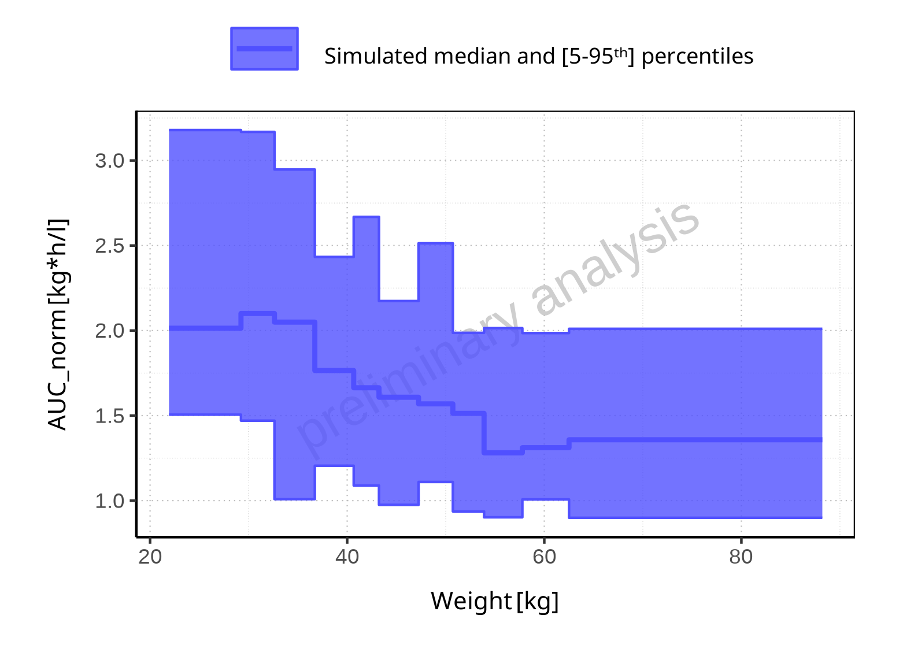


**Figure 2-158: Weight-dependence of AUC_norm for Larson 2013 8y-18y 400mg FCT meal. Profiles are plotted in a linear scale.**


<br>
<br>


```{=openxml}
<w:br w:type="page"/>
```

`<w:bookmarkStart w:id="figure-2-159" w:name="figure-2-159"/><w:bookmarkEnd w:id="figure-2-159"/>`{=openxml}

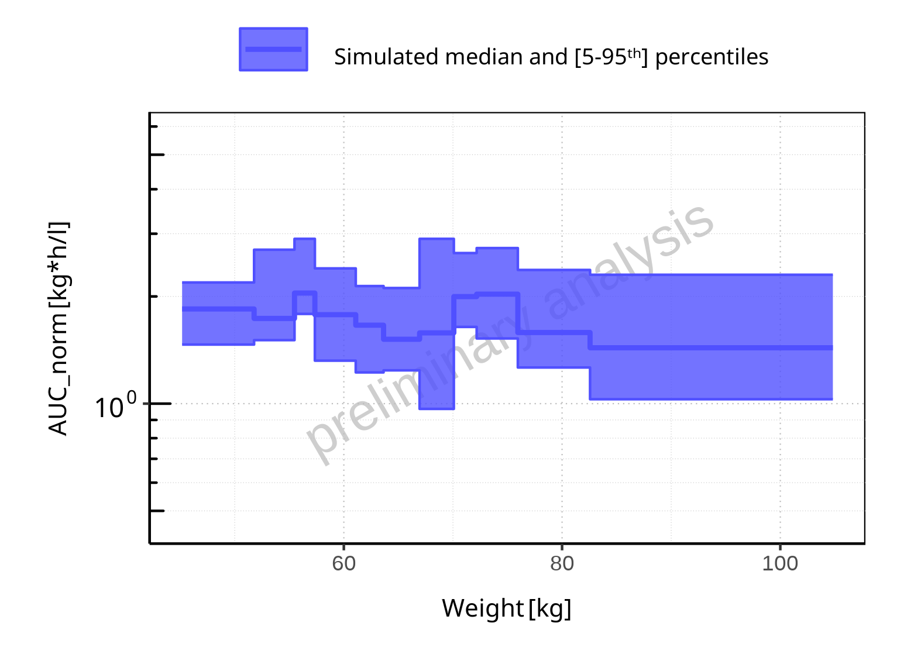


**Figure 2-159: Weight-dependence of AUC_norm for Filmcoated_tablet_400mg_sd. Profiles are plotted in a logarithmic scale.**


<br>
<br>


```{=openxml}
<w:br w:type="page"/>
```

`<w:bookmarkStart w:id="figure-2-160" w:name="figure-2-160"/><w:bookmarkEnd w:id="figure-2-160"/>`{=openxml}

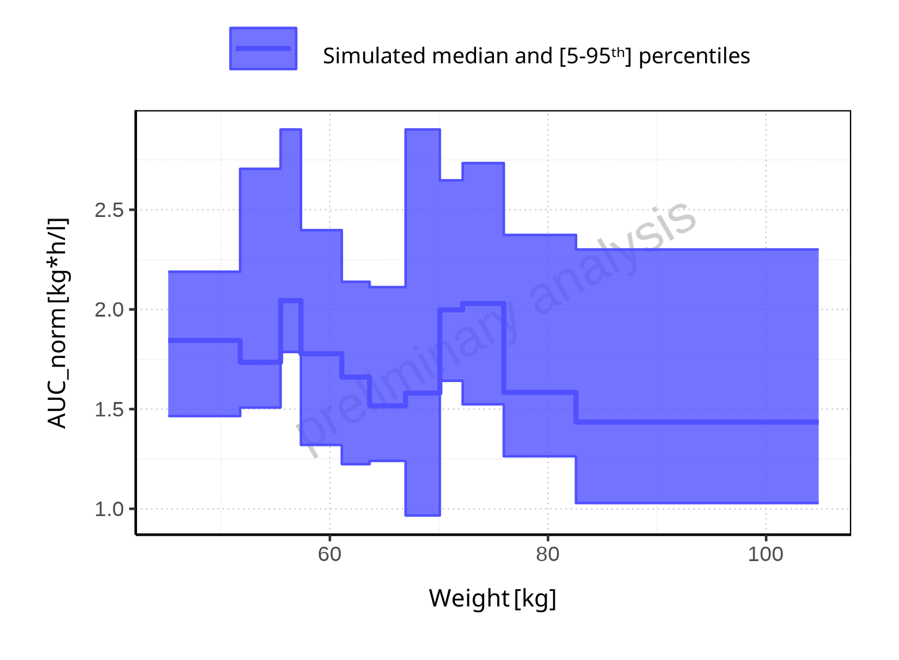


**Figure 2-160: Weight-dependence of AUC_norm for Filmcoated_tablet_400mg_sd. Profiles are plotted in a linear scale.**


<br>
<br>


```{=openxml}
<w:br w:type="page"/>
```

`<w:bookmarkStart w:id="figure-2-161" w:name="figure-2-161"/><w:bookmarkEnd w:id="figure-2-161"/>`{=openxml}

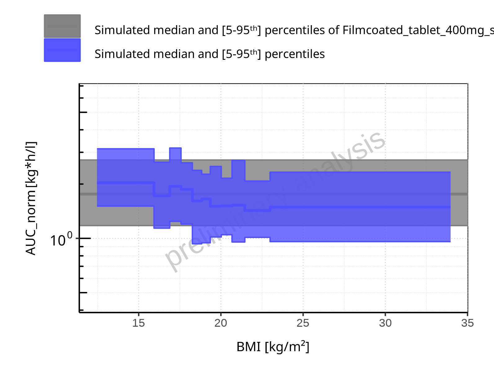


**Figure 2-161: BMI-dependence of AUC_norm for Larson 2013 8y-18y 400mg FCT meal in comparison to Filmcoated_tablet_400mg_sd. Profiles are plotted in a logarithmic scale.**


<br>
<br>


```{=openxml}
<w:br w:type="page"/>
```

`<w:bookmarkStart w:id="figure-2-162" w:name="figure-2-162"/><w:bookmarkEnd w:id="figure-2-162"/>`{=openxml}

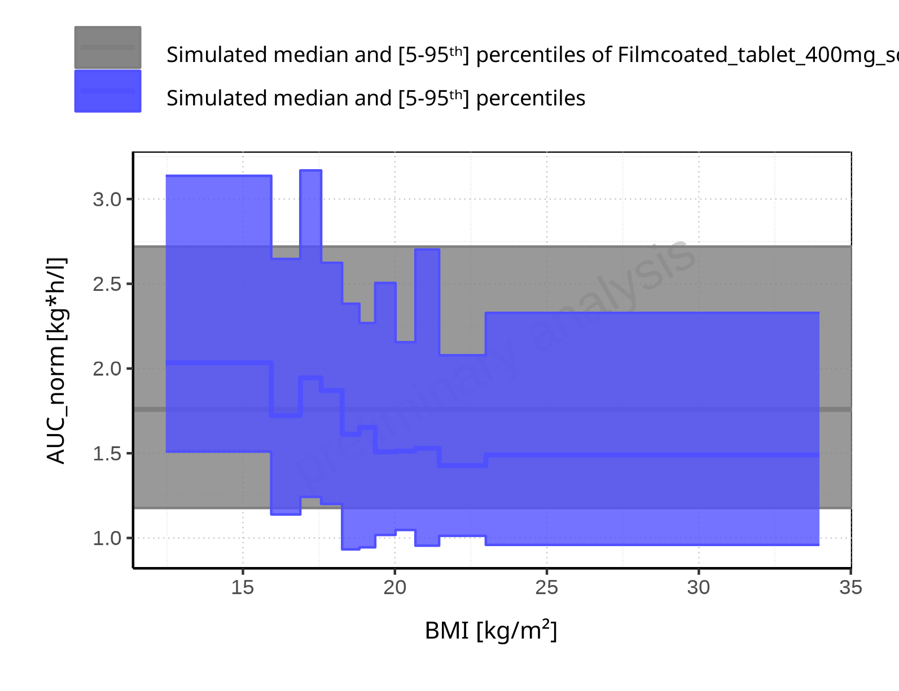


**Figure 2-162: BMI-dependence of AUC_norm for Larson 2013 8y-18y 400mg FCT meal in comparison to Filmcoated_tablet_400mg_sd. Profiles are plotted in a linear scale.**


<br>
<br>


```{=openxml}
<w:br w:type="page"/>
```

`<w:bookmarkStart w:id="figure-2-163" w:name="figure-2-163"/><w:bookmarkEnd w:id="figure-2-163"/>`{=openxml}


**Figure 2-163: BMI-dependence of AUC_norm for Larson 2013 8y-18y 400mg FCT meal. Profiles are plotted in a logarithmic scale.**


<br>
<br>


```{=openxml}
<w:br w:type="page"/>
```

`<w:bookmarkStart w:id="figure-2-164" w:name="figure-2-164"/><w:bookmarkEnd w:id="figure-2-164"/>`{=openxml}


**Figure 2-164: BMI-dependence of AUC_norm for Larson 2013 8y-18y 400mg FCT meal. Profiles are plotted in a linear scale.**


<br>
<br>


```{=openxml}
<w:br w:type="page"/>
```

`<w:bookmarkStart w:id="figure-2-165" w:name="figure-2-165"/><w:bookmarkEnd w:id="figure-2-165"/>`{=openxml}

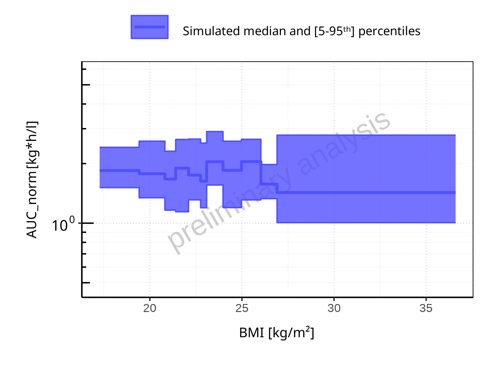


**Figure 2-165: BMI-dependence of AUC_norm for Filmcoated_tablet_400mg_sd. Profiles are plotted in a logarithmic scale.**


<br>
<br>


```{=openxml}
<w:br w:type="page"/>
```

`<w:bookmarkStart w:id="figure-2-166" w:name="figure-2-166"/><w:bookmarkEnd w:id="figure-2-166"/>`{=openxml}

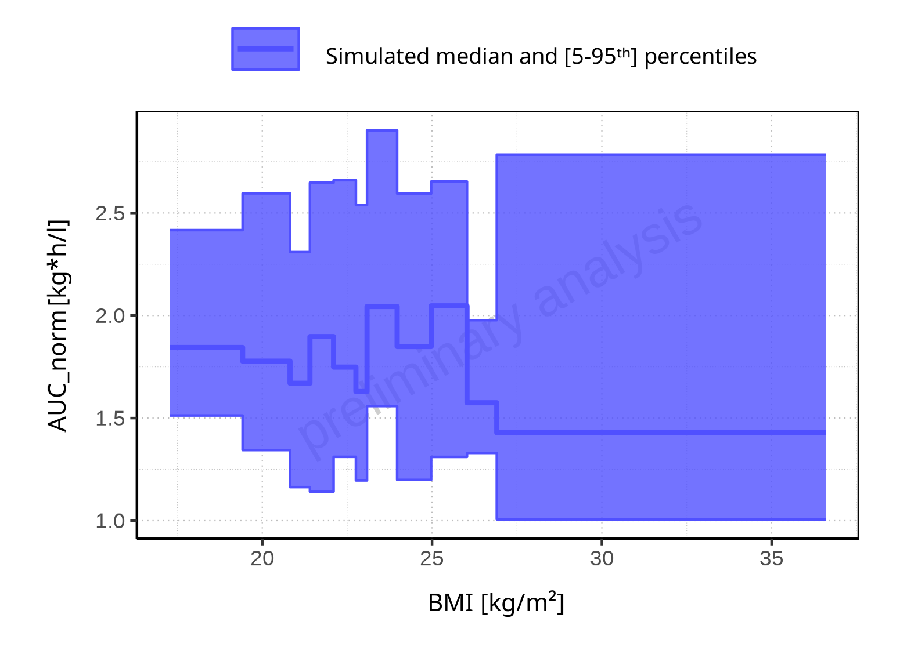


**Figure 2-166: BMI-dependence of AUC_norm for Filmcoated_tablet_400mg_sd. Profiles are plotted in a linear scale.**


<br>
<br>


```{=openxml}
<w:br w:type="page"/>
```

`<w:bookmarkStart w:id="figure-2-167" w:name="figure-2-167"/><w:bookmarkEnd w:id="figure-2-167"/>`{=openxml}

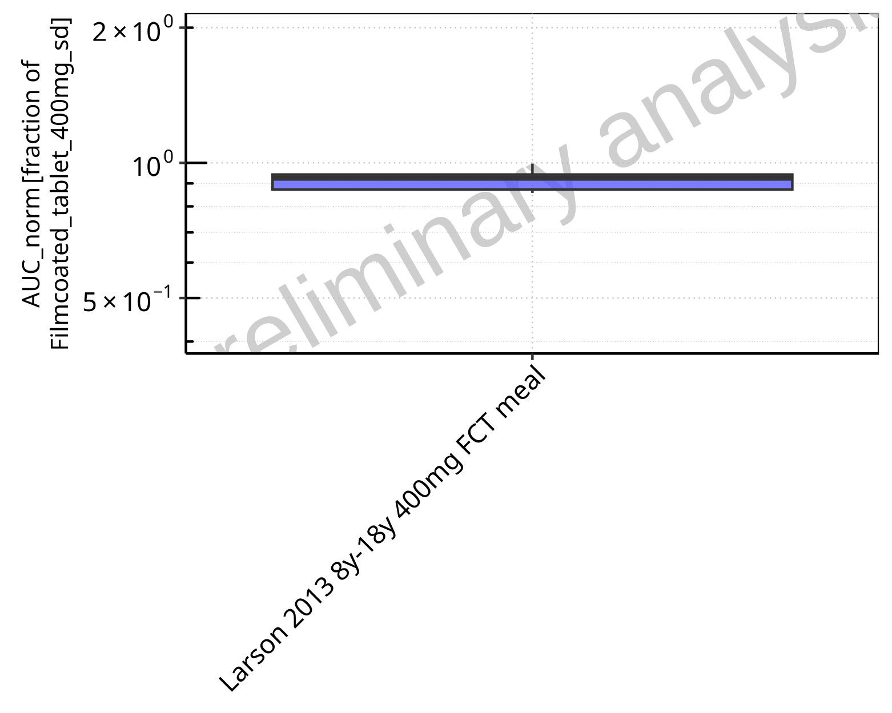


**Figure 2-167: Ratio of population summary statistics of AUC_norm of Raltegravir  for  Larson 2013 8y-18y 400mg FCT meal in comparison to Filmcoated_tablet_400mg_sd shown as box-whisker plot, which indicates ratios of the 5^th^, 25^th^, 50^th^, 75^th^, 95^th^ percentiles in logarithmic scale.**


<br>
<br>


```{=openxml}
<w:br w:type="page"/>
```

`<w:bookmarkStart w:id="figure-2-168" w:name="figure-2-168"/><w:bookmarkEnd w:id="figure-2-168"/>`{=openxml}

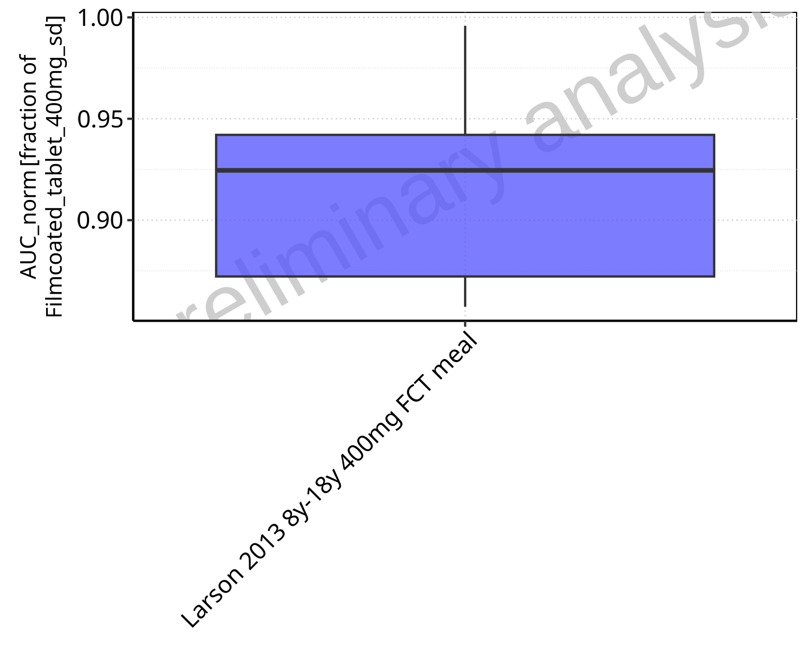


**Figure 2-168: Ratio of population summary statistics of AUC_norm of Raltegravir  for  Larson 2013 8y-18y 400mg FCT meal in comparison to Filmcoated_tablet_400mg_sd shown as box-whisker plot, which indicates ratios of the 5^th^, 25^th^, 50^th^, 75^th^, 95^th^ percentiles in linear scale.**


<br>
<br>


```{=openxml}
<w:br w:type="page"/>
```

`<w:bookmarkStart w:id="table-2-12" w:name="table-2-12"/><w:bookmarkEnd w:id="table-2-12"/>`{=openxml}

**Table 2-12: Ratio of population summary statistics of AUC_norm of Raltegravir  for  Larson 2013 8y-18y 400mg FCT meal in comparison to Filmcoated_tablet_400mg_sd**


|Population                        |N   |5^th^ pctl |25^th^ pctl |50^th^ pctl |75^th^ pctl |95^th^ pctl |Mean |SD   |Geo Mean |Geo SD |
|:---------------------------------|:---|:-------------------|:--------------------|:--------------------|:--------------------|:--------------------|:----|:----|:--------|:------|
|Larson 2013 8y-18y 400mg FCT meal |500 |0.86                |0.87                 |0.92                 |0.94                 |1.00                 |0.92 |1.08 |0.91     |1.04   |


<br>
<br>


### AUC_inf `<w:bookmarkStart w:id="176_pk_parameters_organism_peripheralvenousblood_raltegravir_plasma__peripheral_venous_blood__auc_inf" w:name="176_pk_parameters_organism_peripheralvenousblood_raltegravir_plasma__peripheral_venous_blood__auc_inf"/><w:bookmarkEnd w:id="176_pk_parameters_organism_peripheralvenousblood_raltegravir_plasma__peripheral_venous_blood__auc_inf"/>`{=openxml}


```{=openxml}
<w:br w:type="page"/>
```

`<w:bookmarkStart w:id="figure-2-169" w:name="figure-2-169"/><w:bookmarkEnd w:id="figure-2-169"/>`{=openxml}

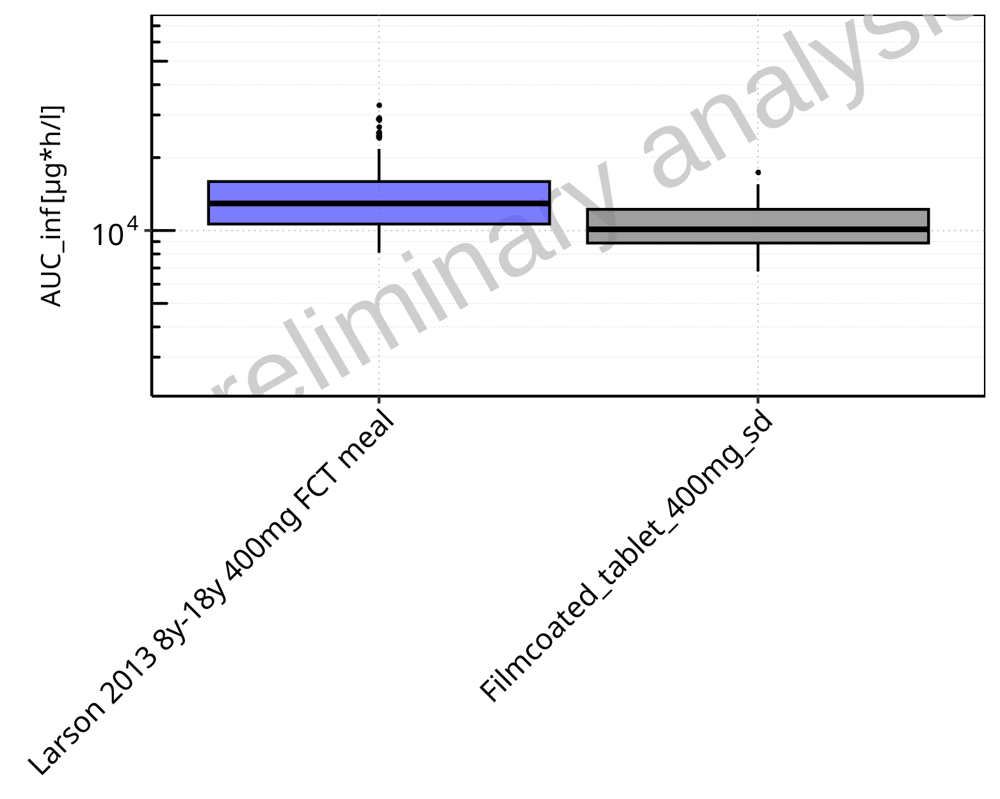


**Figure 2-169: AUC_inf of Raltegravir for Larson 2013 8y-18y 400mg FCT meal, Filmcoated_tablet_400mg_sd shown as box-whisker plot, which indicates  the 5^th^, 25^th^, 50^th^, 75^th^, 95^th^ percentiles in logarithmic scale.**


<br>
<br>


```{=openxml}
<w:br w:type="page"/>
```

`<w:bookmarkStart w:id="figure-2-170" w:name="figure-2-170"/><w:bookmarkEnd w:id="figure-2-170"/>`{=openxml}

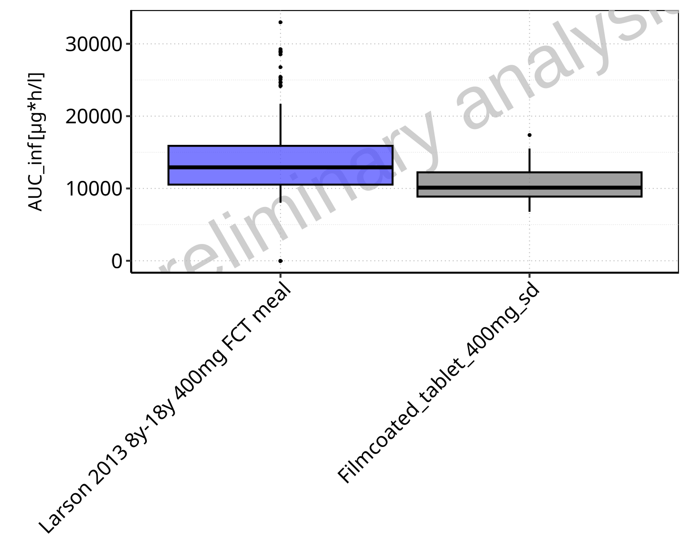


**Figure 2-170: AUC_inf of Raltegravir for Larson 2013 8y-18y 400mg FCT meal, Filmcoated_tablet_400mg_sd shown as box-whisker plot, which indicates  the 5^th^, 25^th^, 50^th^, 75^th^, 95^th^ percentiles in linear scale.**


<br>
<br>


```{=openxml}
<w:br w:type="page"/>
```

`<w:bookmarkStart w:id="table-2-13" w:name="table-2-13"/><w:bookmarkEnd w:id="table-2-13"/>`{=openxml}

**Table 2-13: Population statistics summarizing AUC_inf of Raltegravir for Larson 2013 8y-18y 400mg FCT meal, Filmcoated_tablet_400mg_sd reported in [µg*h/l]**


|Population                        |N   |5^th^ pctl |25^th^ pctl |50^th^ pctl |75^th^ pctl |95^th^ pctl |Mean     |SD      |Geo Mean |Geo SD |
|:---------------------------------|:---|:-------------------|:--------------------|:--------------------|:--------------------|:--------------------|:--------|:-------|:--------|:------|
|Larson 2013 8y-18y 400mg FCT meal |500 |8017.56             |10533.54             |12921.05             |15892.61             |21707.95             |13652.19 |4460.23 |0.00     |-     |
|Filmcoated_tablet_400mg_sd        |100 |6771.99             |8875.70              |10112.32             |12229.14             |15523.15             |10626.71 |2757.61 |10275.45 |1.30   |


<br>
<br>


```{=openxml}
<w:br w:type="page"/>
```

`<w:bookmarkStart w:id="figure-2-171" w:name="figure-2-171"/><w:bookmarkEnd w:id="figure-2-171"/>`{=openxml}

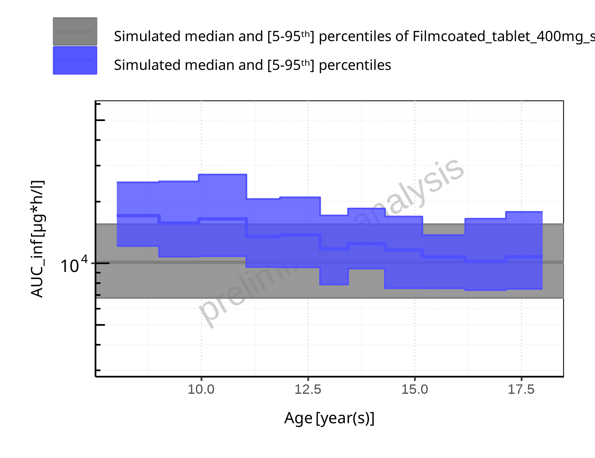


**Figure 2-171: Age-dependence of AUC_inf for Larson 2013 8y-18y 400mg FCT meal in comparison to Filmcoated_tablet_400mg_sd. Profiles are plotted in a logarithmic scale.**


<br>
<br>


```{=openxml}
<w:br w:type="page"/>
```

`<w:bookmarkStart w:id="figure-2-172" w:name="figure-2-172"/><w:bookmarkEnd w:id="figure-2-172"/>`{=openxml}

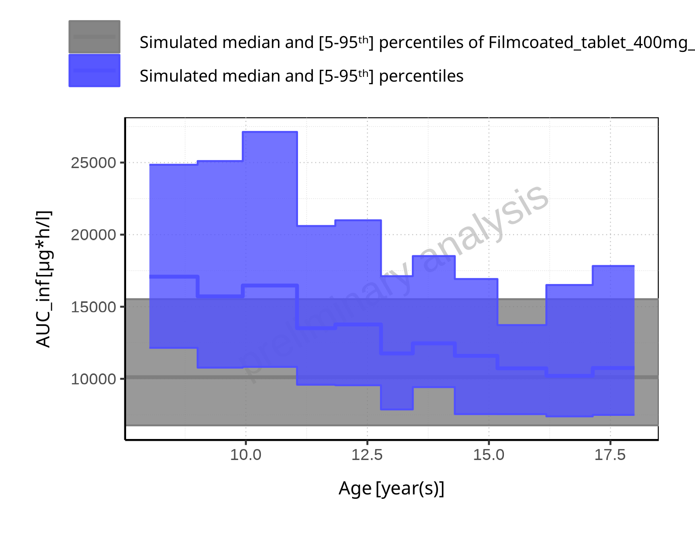


**Figure 2-172: Age-dependence of AUC_inf for Larson 2013 8y-18y 400mg FCT meal in comparison to Filmcoated_tablet_400mg_sd. Profiles are plotted in a linear scale.**


<br>
<br>


```{=openxml}
<w:br w:type="page"/>
```

`<w:bookmarkStart w:id="figure-2-173" w:name="figure-2-173"/><w:bookmarkEnd w:id="figure-2-173"/>`{=openxml}

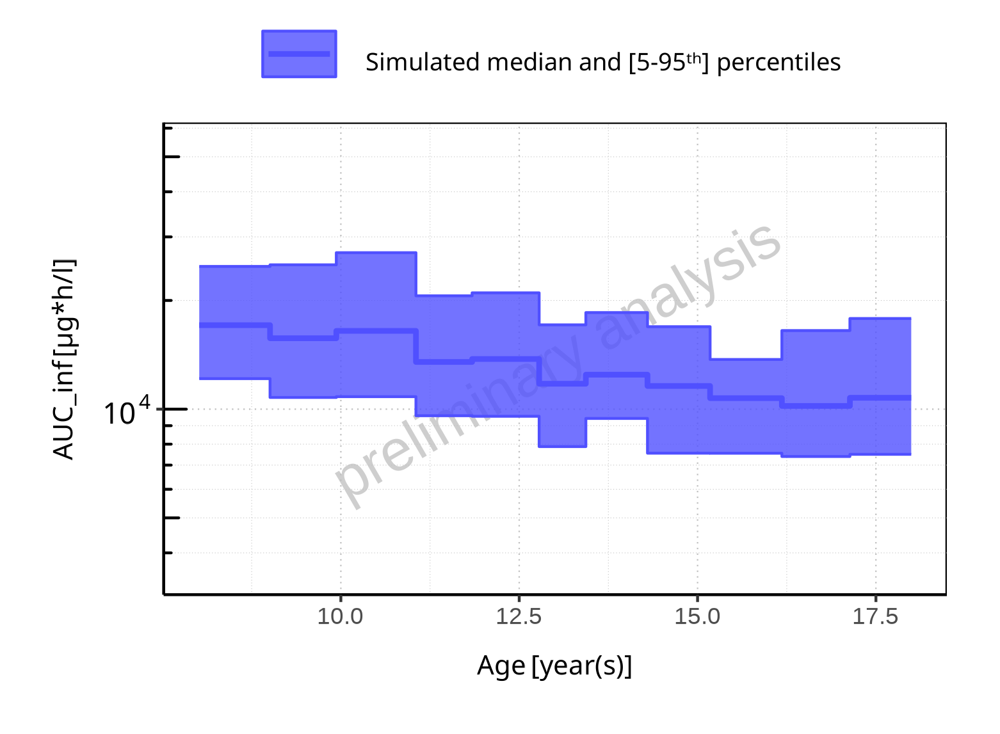


**Figure 2-173: Age-dependence of AUC_inf for Larson 2013 8y-18y 400mg FCT meal. Profiles are plotted in a logarithmic scale.**


<br>
<br>


```{=openxml}
<w:br w:type="page"/>
```

`<w:bookmarkStart w:id="figure-2-174" w:name="figure-2-174"/><w:bookmarkEnd w:id="figure-2-174"/>`{=openxml}

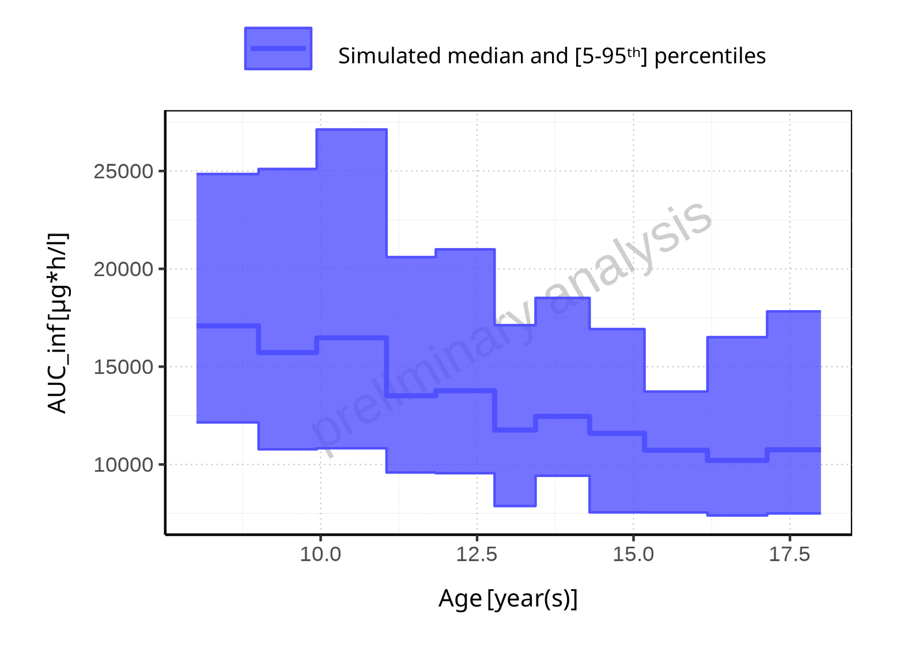


**Figure 2-174: Age-dependence of AUC_inf for Larson 2013 8y-18y 400mg FCT meal. Profiles are plotted in a linear scale.**


<br>
<br>


```{=openxml}
<w:br w:type="page"/>
```

`<w:bookmarkStart w:id="figure-2-175" w:name="figure-2-175"/><w:bookmarkEnd w:id="figure-2-175"/>`{=openxml}

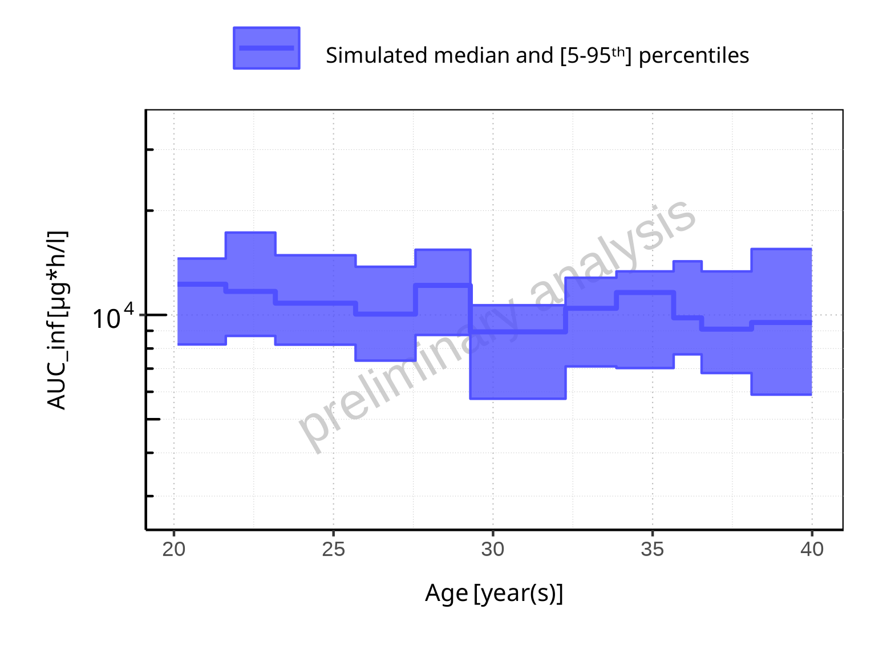


**Figure 2-175: Age-dependence of AUC_inf for Filmcoated_tablet_400mg_sd. Profiles are plotted in a logarithmic scale.**


<br>
<br>


```{=openxml}
<w:br w:type="page"/>
```

`<w:bookmarkStart w:id="figure-2-176" w:name="figure-2-176"/><w:bookmarkEnd w:id="figure-2-176"/>`{=openxml}

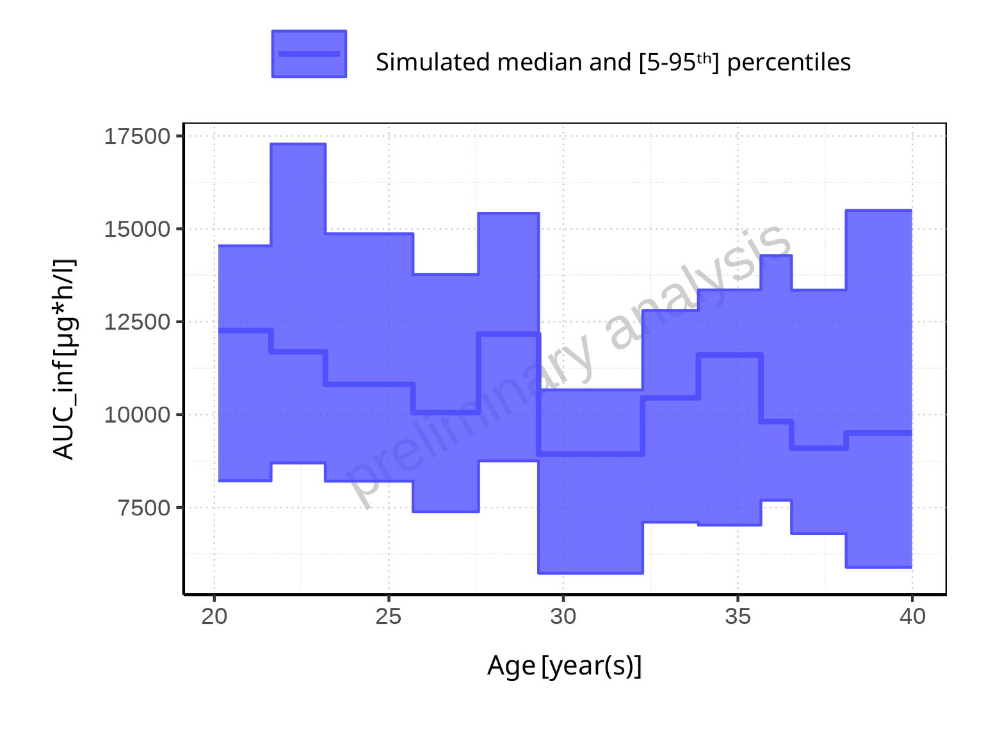


**Figure 2-176: Age-dependence of AUC_inf for Filmcoated_tablet_400mg_sd. Profiles are plotted in a linear scale.**


<br>
<br>


```{=openxml}
<w:br w:type="page"/>
```

`<w:bookmarkStart w:id="figure-2-177" w:name="figure-2-177"/><w:bookmarkEnd w:id="figure-2-177"/>`{=openxml}

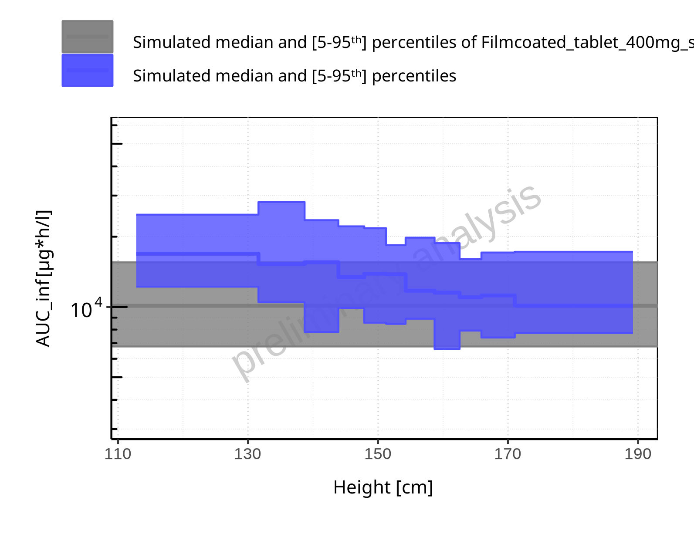


**Figure 2-177: Height-dependence of AUC_inf for Larson 2013 8y-18y 400mg FCT meal in comparison to Filmcoated_tablet_400mg_sd. Profiles are plotted in a logarithmic scale.**


<br>
<br>


```{=openxml}
<w:br w:type="page"/>
```

`<w:bookmarkStart w:id="figure-2-178" w:name="figure-2-178"/><w:bookmarkEnd w:id="figure-2-178"/>`{=openxml}

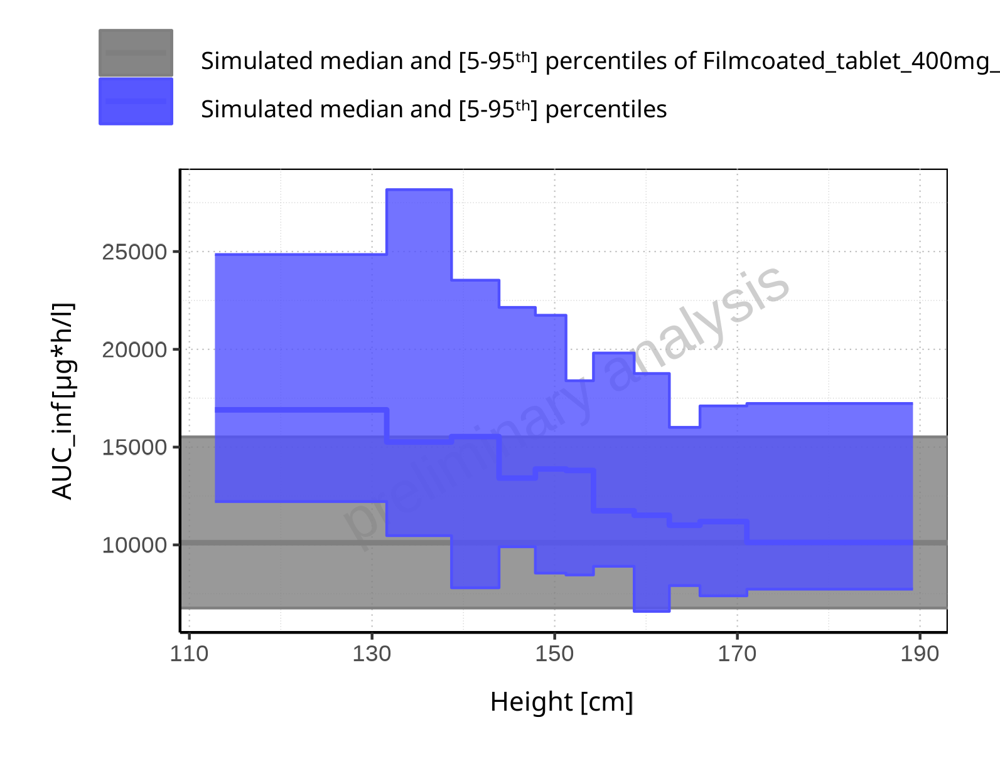


**Figure 2-178: Height-dependence of AUC_inf for Larson 2013 8y-18y 400mg FCT meal in comparison to Filmcoated_tablet_400mg_sd. Profiles are plotted in a linear scale.**


<br>
<br>


```{=openxml}
<w:br w:type="page"/>
```

`<w:bookmarkStart w:id="figure-2-179" w:name="figure-2-179"/><w:bookmarkEnd w:id="figure-2-179"/>`{=openxml}

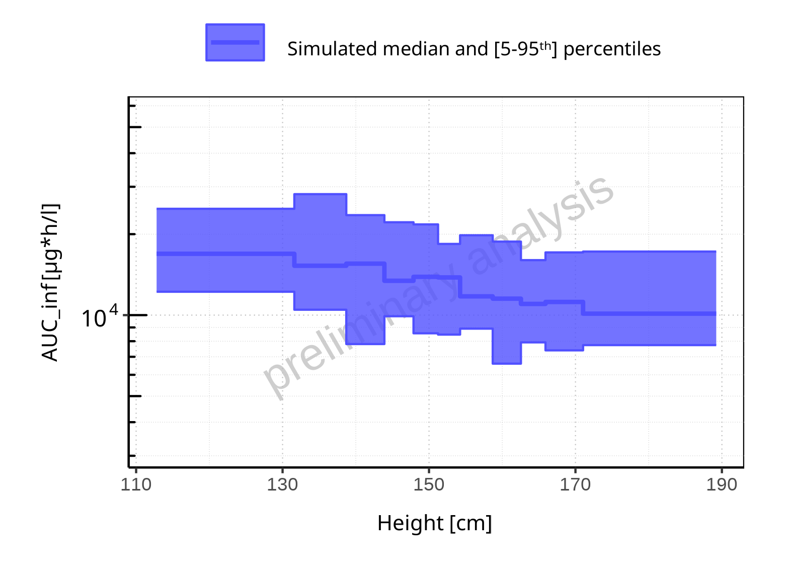


**Figure 2-179: Height-dependence of AUC_inf for Larson 2013 8y-18y 400mg FCT meal. Profiles are plotted in a logarithmic scale.**


<br>
<br>


```{=openxml}
<w:br w:type="page"/>
```

`<w:bookmarkStart w:id="figure-2-180" w:name="figure-2-180"/><w:bookmarkEnd w:id="figure-2-180"/>`{=openxml}

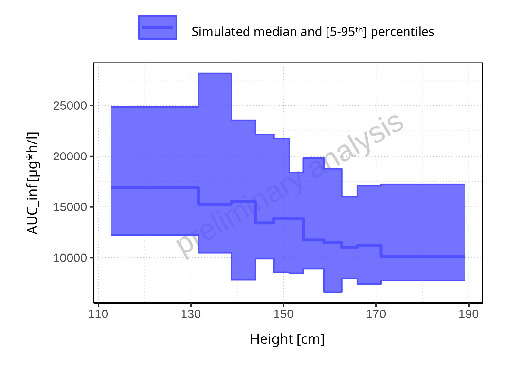


**Figure 2-180: Height-dependence of AUC_inf for Larson 2013 8y-18y 400mg FCT meal. Profiles are plotted in a linear scale.**


<br>
<br>


```{=openxml}
<w:br w:type="page"/>
```

`<w:bookmarkStart w:id="figure-2-181" w:name="figure-2-181"/><w:bookmarkEnd w:id="figure-2-181"/>`{=openxml}

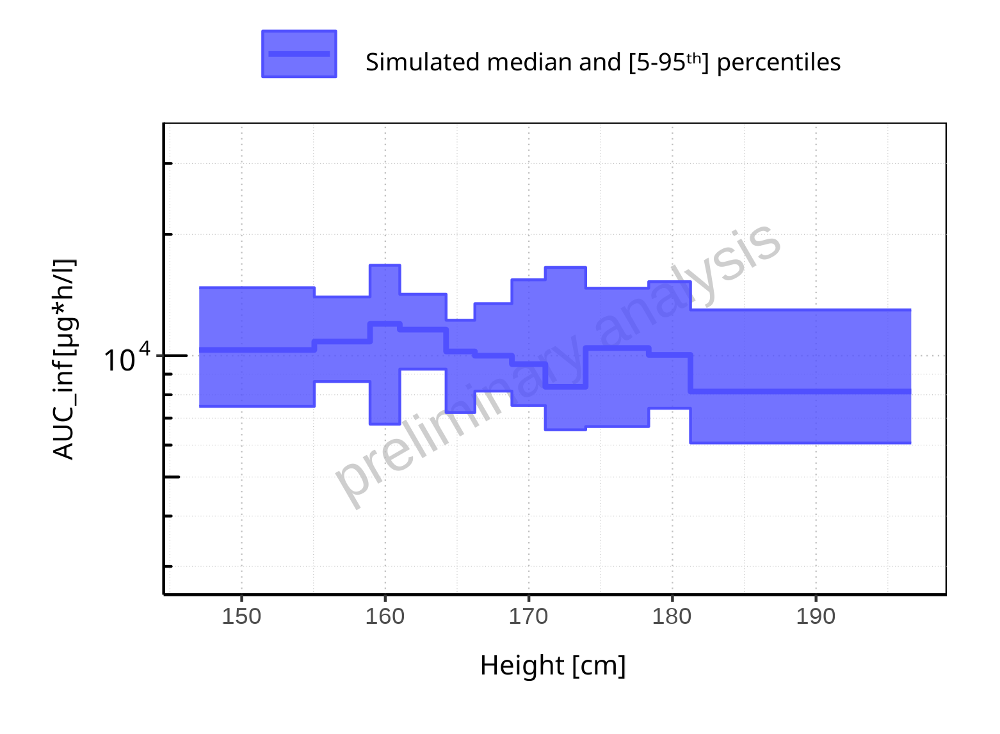


**Figure 2-181: Height-dependence of AUC_inf for Filmcoated_tablet_400mg_sd. Profiles are plotted in a logarithmic scale.**


<br>
<br>


```{=openxml}
<w:br w:type="page"/>
```

`<w:bookmarkStart w:id="figure-2-182" w:name="figure-2-182"/><w:bookmarkEnd w:id="figure-2-182"/>`{=openxml}

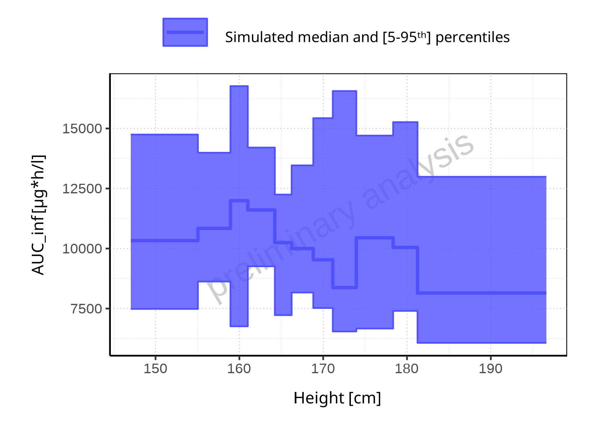


**Figure 2-182: Height-dependence of AUC_inf for Filmcoated_tablet_400mg_sd. Profiles are plotted in a linear scale.**


<br>
<br>


```{=openxml}
<w:br w:type="page"/>
```

`<w:bookmarkStart w:id="figure-2-183" w:name="figure-2-183"/><w:bookmarkEnd w:id="figure-2-183"/>`{=openxml}

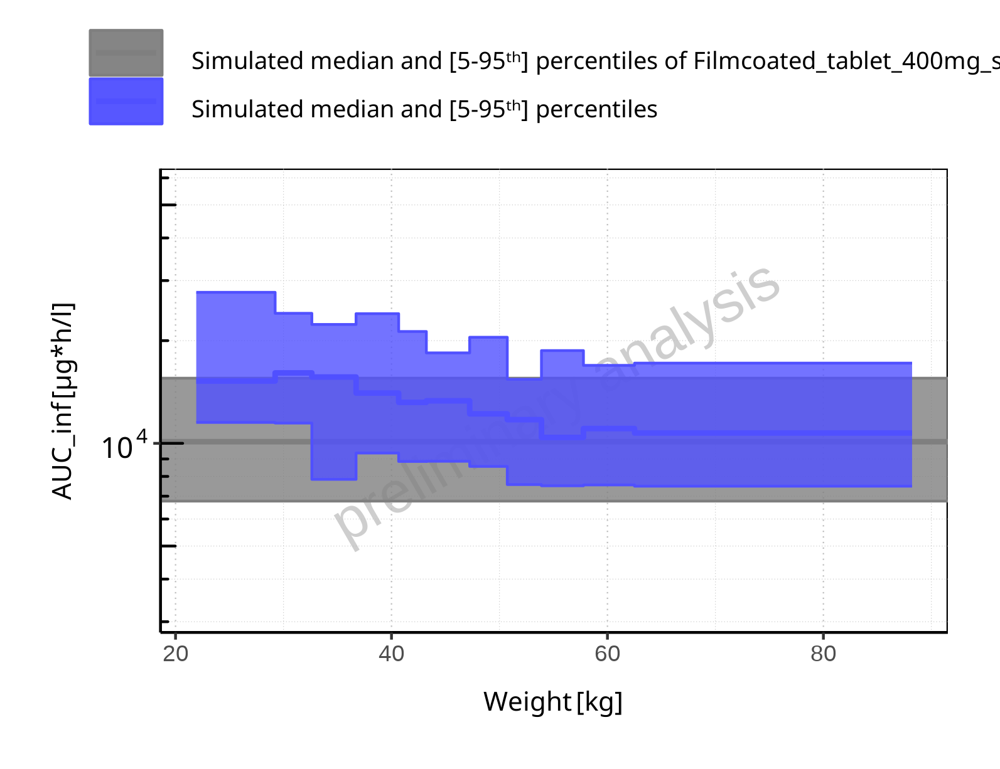


**Figure 2-183: Weight-dependence of AUC_inf for Larson 2013 8y-18y 400mg FCT meal in comparison to Filmcoated_tablet_400mg_sd. Profiles are plotted in a logarithmic scale.**


<br>
<br>


```{=openxml}
<w:br w:type="page"/>
```

`<w:bookmarkStart w:id="figure-2-184" w:name="figure-2-184"/><w:bookmarkEnd w:id="figure-2-184"/>`{=openxml}

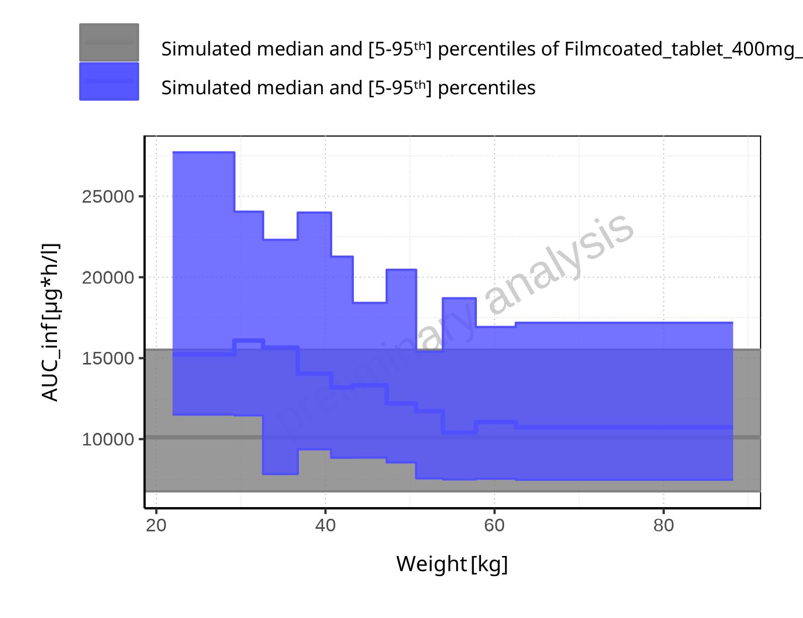


**Figure 2-184: Weight-dependence of AUC_inf for Larson 2013 8y-18y 400mg FCT meal in comparison to Filmcoated_tablet_400mg_sd. Profiles are plotted in a linear scale.**


<br>
<br>


```{=openxml}
<w:br w:type="page"/>
```

`<w:bookmarkStart w:id="figure-2-185" w:name="figure-2-185"/><w:bookmarkEnd w:id="figure-2-185"/>`{=openxml}

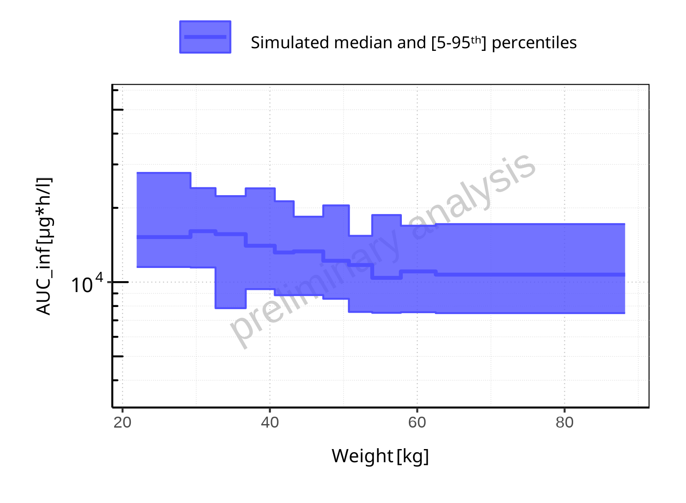


**Figure 2-185: Weight-dependence of AUC_inf for Larson 2013 8y-18y 400mg FCT meal. Profiles are plotted in a logarithmic scale.**


<br>
<br>


```{=openxml}
<w:br w:type="page"/>
```

`<w:bookmarkStart w:id="figure-2-186" w:name="figure-2-186"/><w:bookmarkEnd w:id="figure-2-186"/>`{=openxml}

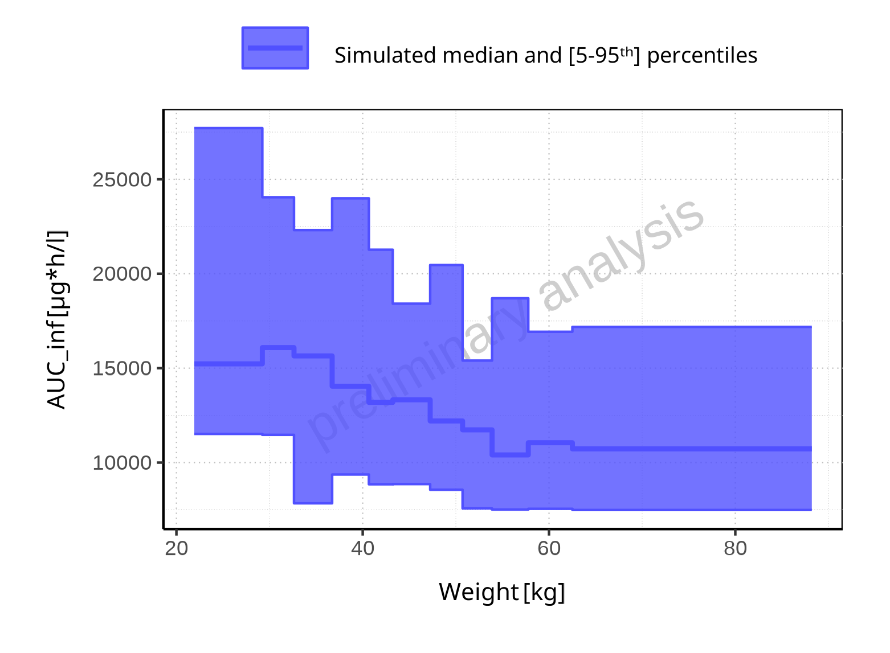


**Figure 2-186: Weight-dependence of AUC_inf for Larson 2013 8y-18y 400mg FCT meal. Profiles are plotted in a linear scale.**


<br>
<br>


```{=openxml}
<w:br w:type="page"/>
```

`<w:bookmarkStart w:id="figure-2-187" w:name="figure-2-187"/><w:bookmarkEnd w:id="figure-2-187"/>`{=openxml}

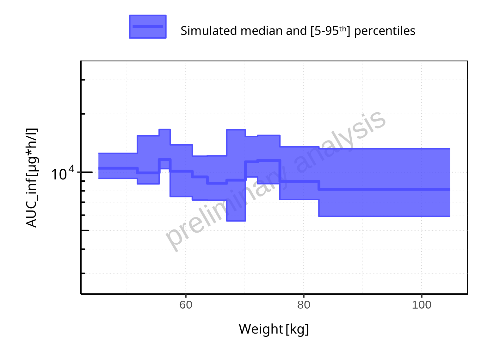


**Figure 2-187: Weight-dependence of AUC_inf for Filmcoated_tablet_400mg_sd. Profiles are plotted in a logarithmic scale.**


<br>
<br>


```{=openxml}
<w:br w:type="page"/>
```

`<w:bookmarkStart w:id="figure-2-188" w:name="figure-2-188"/><w:bookmarkEnd w:id="figure-2-188"/>`{=openxml}

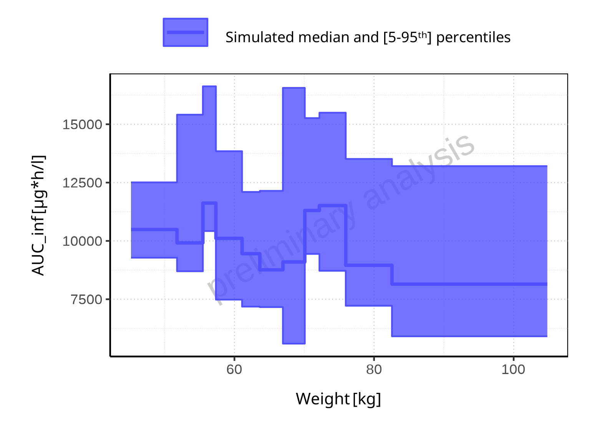


**Figure 2-188: Weight-dependence of AUC_inf for Filmcoated_tablet_400mg_sd. Profiles are plotted in a linear scale.**


<br>
<br>


```{=openxml}
<w:br w:type="page"/>
```

`<w:bookmarkStart w:id="figure-2-189" w:name="figure-2-189"/><w:bookmarkEnd w:id="figure-2-189"/>`{=openxml}

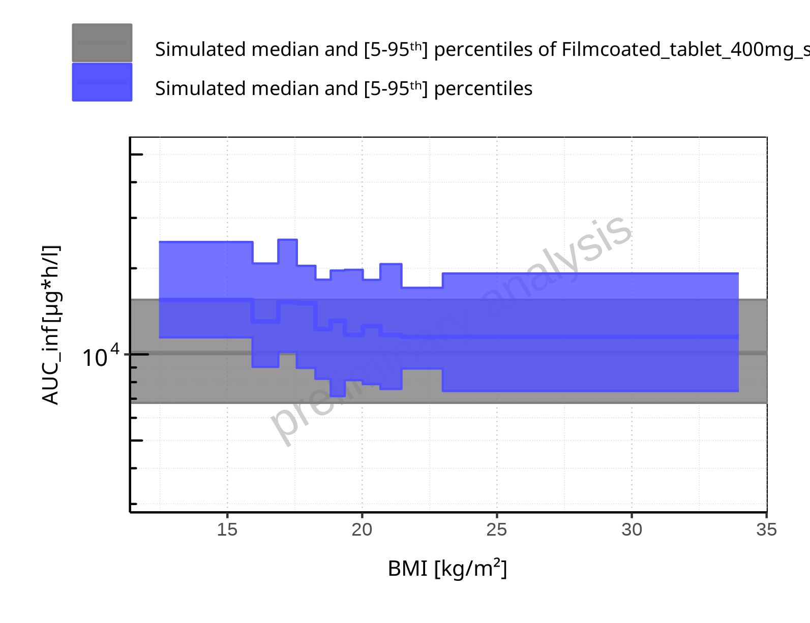


**Figure 2-189: BMI-dependence of AUC_inf for Larson 2013 8y-18y 400mg FCT meal in comparison to Filmcoated_tablet_400mg_sd. Profiles are plotted in a logarithmic scale.**


<br>
<br>


```{=openxml}
<w:br w:type="page"/>
```

`<w:bookmarkStart w:id="figure-2-190" w:name="figure-2-190"/><w:bookmarkEnd w:id="figure-2-190"/>`{=openxml}

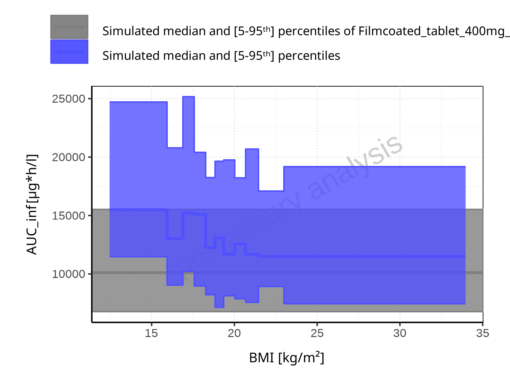


**Figure 2-190: BMI-dependence of AUC_inf for Larson 2013 8y-18y 400mg FCT meal in comparison to Filmcoated_tablet_400mg_sd. Profiles are plotted in a linear scale.**


<br>
<br>


```{=openxml}
<w:br w:type="page"/>
```

`<w:bookmarkStart w:id="figure-2-191" w:name="figure-2-191"/><w:bookmarkEnd w:id="figure-2-191"/>`{=openxml}

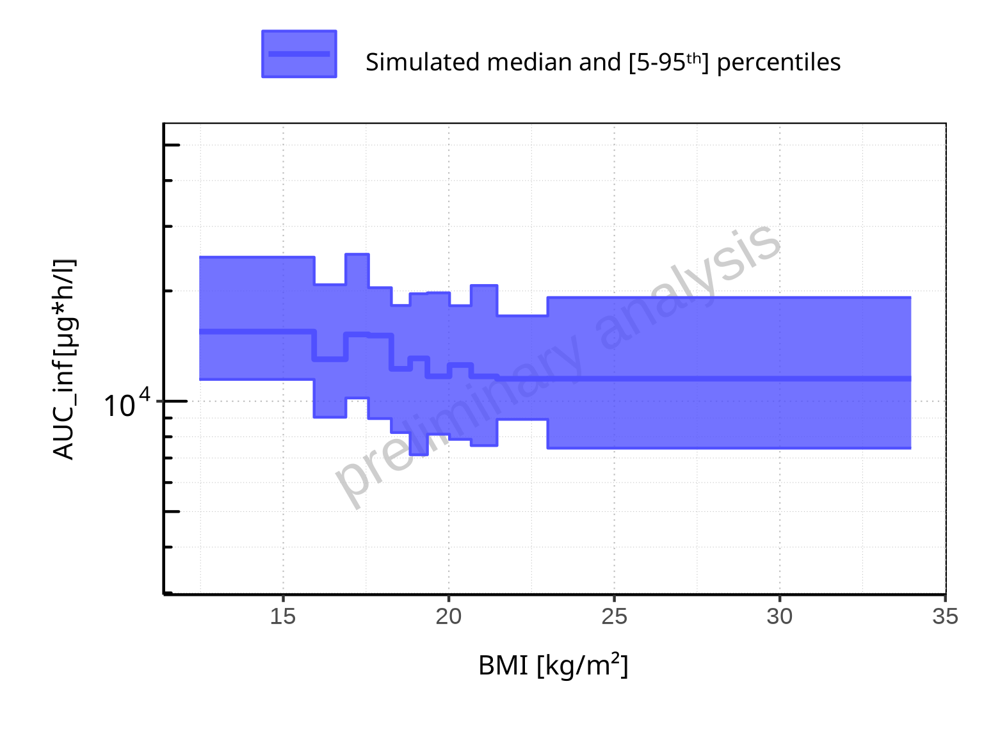


**Figure 2-191: BMI-dependence of AUC_inf for Larson 2013 8y-18y 400mg FCT meal. Profiles are plotted in a logarithmic scale.**


<br>
<br>


```{=openxml}
<w:br w:type="page"/>
```

`<w:bookmarkStart w:id="figure-2-192" w:name="figure-2-192"/><w:bookmarkEnd w:id="figure-2-192"/>`{=openxml}

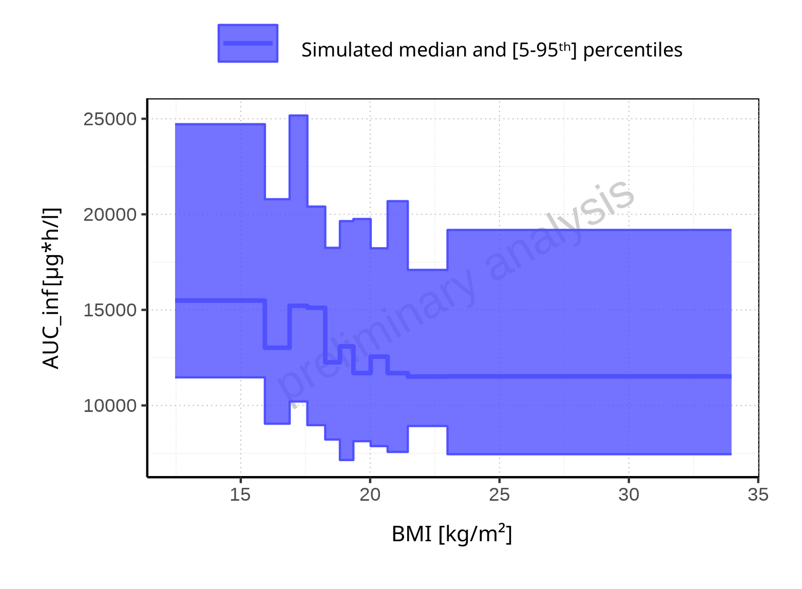


**Figure 2-192: BMI-dependence of AUC_inf for Larson 2013 8y-18y 400mg FCT meal. Profiles are plotted in a linear scale.**


<br>
<br>


```{=openxml}
<w:br w:type="page"/>
```

`<w:bookmarkStart w:id="figure-2-193" w:name="figure-2-193"/><w:bookmarkEnd w:id="figure-2-193"/>`{=openxml}

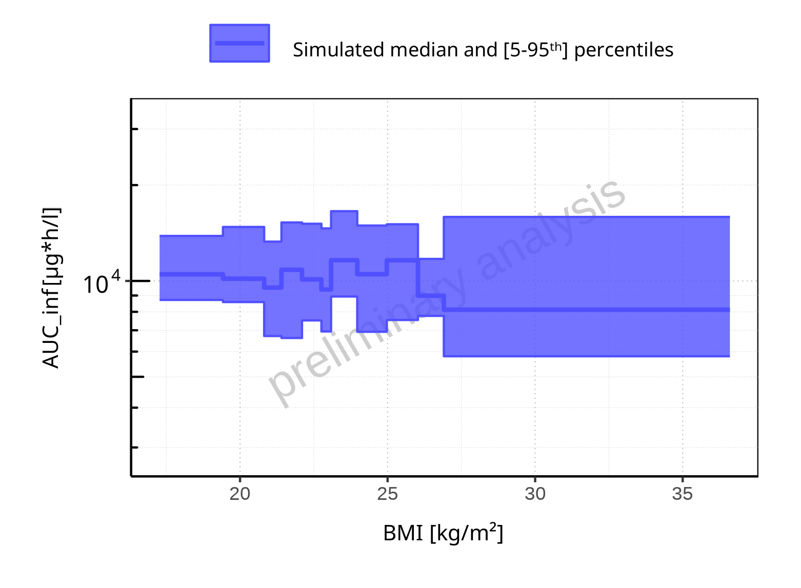


**Figure 2-193: BMI-dependence of AUC_inf for Filmcoated_tablet_400mg_sd. Profiles are plotted in a logarithmic scale.**


<br>
<br>


```{=openxml}
<w:br w:type="page"/>
```

`<w:bookmarkStart w:id="figure-2-194" w:name="figure-2-194"/><w:bookmarkEnd w:id="figure-2-194"/>`{=openxml}

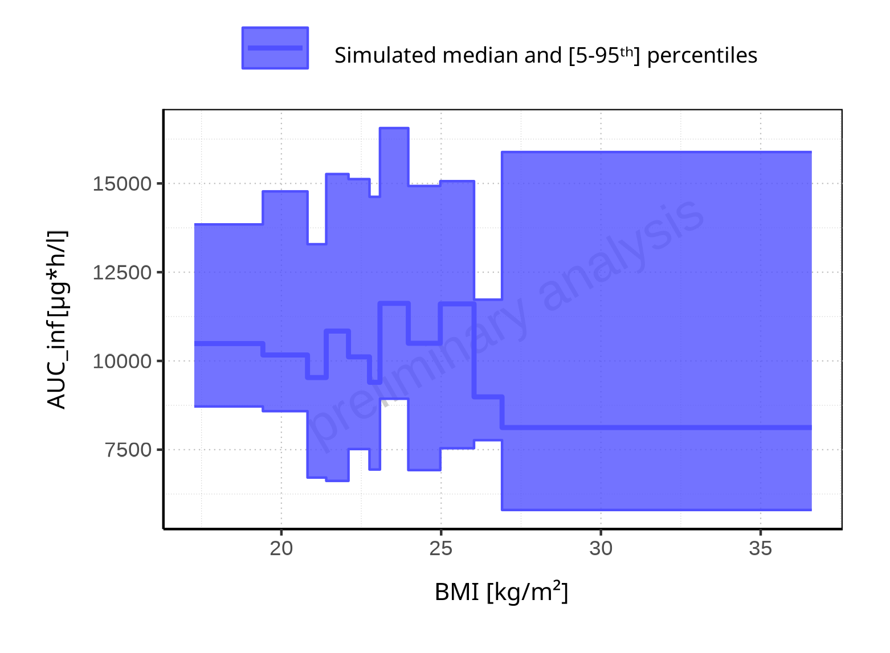


**Figure 2-194: BMI-dependence of AUC_inf for Filmcoated_tablet_400mg_sd. Profiles are plotted in a linear scale.**


<br>
<br>


```{=openxml}
<w:br w:type="page"/>
```

`<w:bookmarkStart w:id="figure-2-195" w:name="figure-2-195"/><w:bookmarkEnd w:id="figure-2-195"/>`{=openxml}

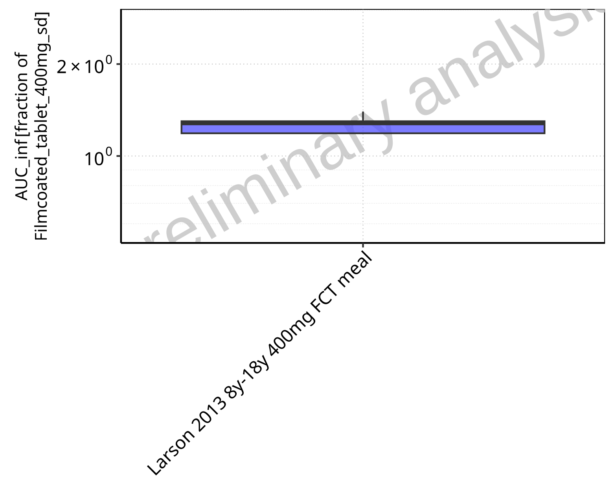


**Figure 2-195: Ratio of population summary statistics of AUC_inf of Raltegravir  for  Larson 2013 8y-18y 400mg FCT meal in comparison to Filmcoated_tablet_400mg_sd shown as box-whisker plot, which indicates ratios of the 5^th^, 25^th^, 50^th^, 75^th^, 95^th^ percentiles in logarithmic scale.**


<br>
<br>


```{=openxml}
<w:br w:type="page"/>
```

`<w:bookmarkStart w:id="figure-2-196" w:name="figure-2-196"/><w:bookmarkEnd w:id="figure-2-196"/>`{=openxml}

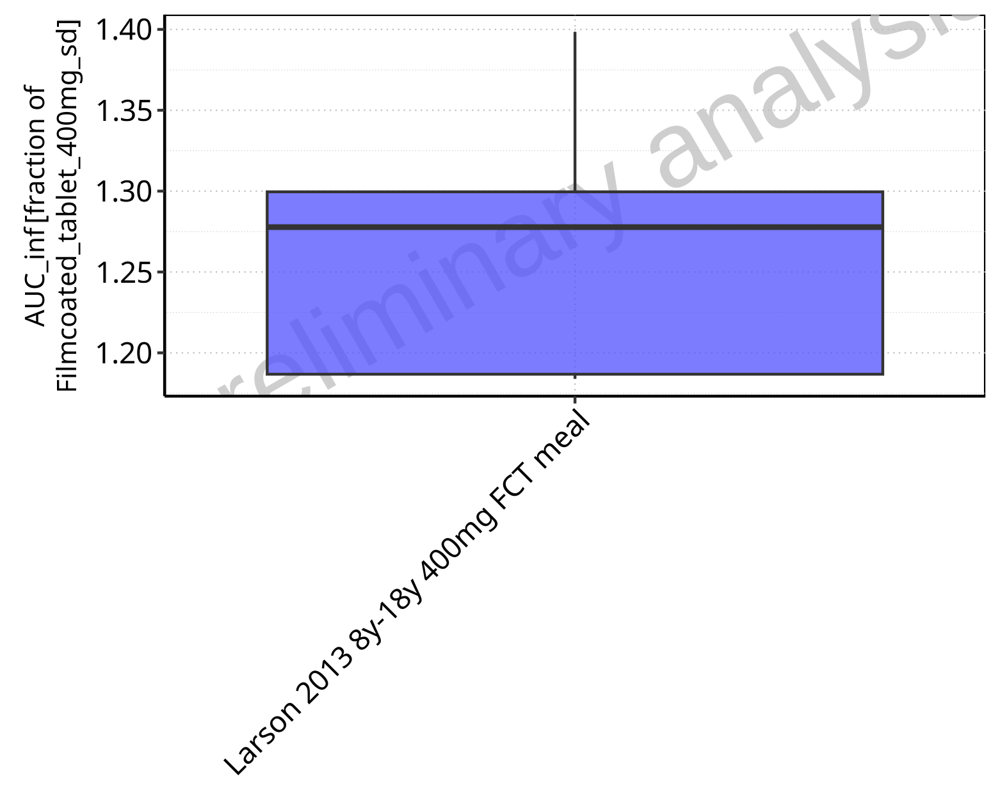


**Figure 2-196: Ratio of population summary statistics of AUC_inf of Raltegravir  for  Larson 2013 8y-18y 400mg FCT meal in comparison to Filmcoated_tablet_400mg_sd shown as box-whisker plot, which indicates ratios of the 5^th^, 25^th^, 50^th^, 75^th^, 95^th^ percentiles in linear scale.**


<br>
<br>


```{=openxml}
<w:br w:type="page"/>
```

`<w:bookmarkStart w:id="table-2-14" w:name="table-2-14"/><w:bookmarkEnd w:id="table-2-14"/>`{=openxml}

**Table 2-14: Ratio of population summary statistics of AUC_inf of Raltegravir  for  Larson 2013 8y-18y 400mg FCT meal in comparison to Filmcoated_tablet_400mg_sd**


|Population                        |N   |5^th^ pctl |25^th^ pctl |50^th^ pctl |75^th^ pctl |95^th^ pctl |Mean |SD   |Geo Mean |Geo SD |
|:---------------------------------|:---|:-------------------|:--------------------|:--------------------|:--------------------|:--------------------|:----|:----|:--------|:------|
|Larson 2013 8y-18y 400mg FCT meal |500 |1.18                |1.19                 |1.28                 |1.30                 |1.40                 |1.28 |1.62 |0        |-     |


<br>
<br>


### AUC_inf_norm `<w:bookmarkStart w:id="205_pk_parameters_organism_peripheralvenousblood_raltegravir_plasma__peripheral_venous_blood__auc_inf_norm" w:name="205_pk_parameters_organism_peripheralvenousblood_raltegravir_plasma__peripheral_venous_blood__auc_inf_norm"/><w:bookmarkEnd w:id="205_pk_parameters_organism_peripheralvenousblood_raltegravir_plasma__peripheral_venous_blood__auc_inf_norm"/>`{=openxml}


```{=openxml}
<w:br w:type="page"/>
```

`<w:bookmarkStart w:id="figure-2-197" w:name="figure-2-197"/><w:bookmarkEnd w:id="figure-2-197"/>`{=openxml}

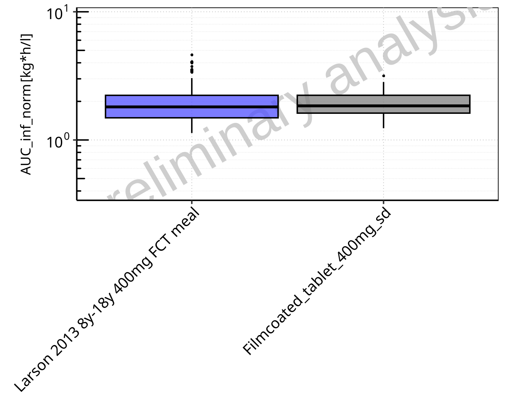


**Figure 2-197: AUC_inf_norm of Raltegravir for Larson 2013 8y-18y 400mg FCT meal, Filmcoated_tablet_400mg_sd shown as box-whisker plot, which indicates  the 5^th^, 25^th^, 50^th^, 75^th^, 95^th^ percentiles in logarithmic scale.**


<br>
<br>


```{=openxml}
<w:br w:type="page"/>
```

`<w:bookmarkStart w:id="figure-2-198" w:name="figure-2-198"/><w:bookmarkEnd w:id="figure-2-198"/>`{=openxml}

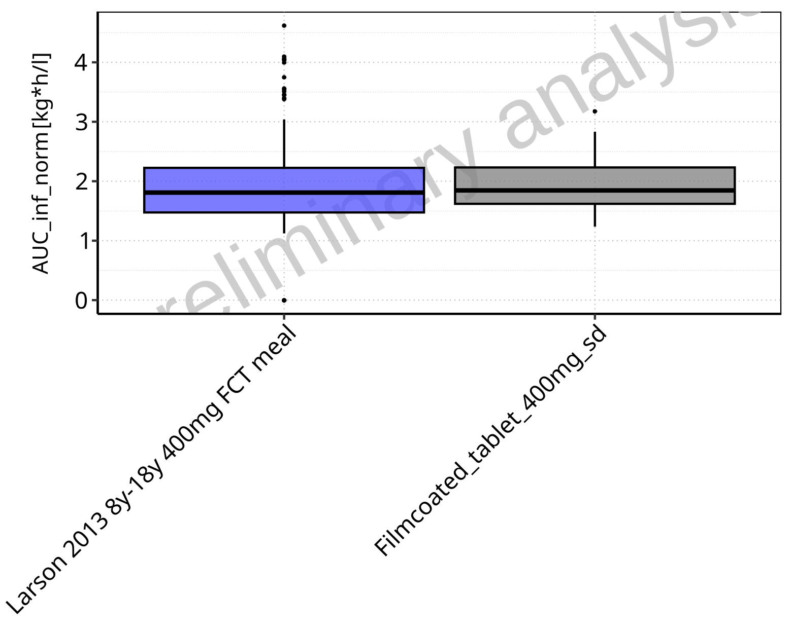


**Figure 2-198: AUC_inf_norm of Raltegravir for Larson 2013 8y-18y 400mg FCT meal, Filmcoated_tablet_400mg_sd shown as box-whisker plot, which indicates  the 5^th^, 25^th^, 50^th^, 75^th^, 95^th^ percentiles in linear scale.**


<br>
<br>


```{=openxml}
<w:br w:type="page"/>
```

`<w:bookmarkStart w:id="table-2-15" w:name="table-2-15"/><w:bookmarkEnd w:id="table-2-15"/>`{=openxml}

**Table 2-15: Population statistics summarizing AUC_inf_norm of Raltegravir for Larson 2013 8y-18y 400mg FCT meal, Filmcoated_tablet_400mg_sd reported in [kg*h/l]**


|Population                        |N   |5^th^ pctl |25^th^ pctl |50^th^ pctl |75^th^ pctl |95^th^ pctl |Mean |SD   |Geo Mean |Geo SD |
|:---------------------------------|:---|:-------------------|:--------------------|:--------------------|:--------------------|:--------------------|:----|:----|:--------|:------|
|Larson 2013 8y-18y 400mg FCT meal |500 |1.12                |1.47                 |1.81                 |2.22                 |3.04                 |1.91 |0.62 |0.00     |-     |
|Filmcoated_tablet_400mg_sd        |100 |1.24                |1.62                 |1.85                 |2.23                 |2.83                 |1.94 |0.50 |1.88     |1.30   |


<br>
<br>


```{=openxml}
<w:br w:type="page"/>
```

`<w:bookmarkStart w:id="figure-2-199" w:name="figure-2-199"/><w:bookmarkEnd w:id="figure-2-199"/>`{=openxml}

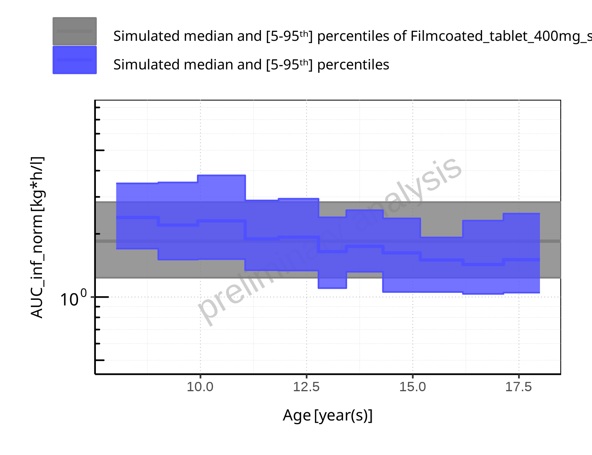


**Figure 2-199: Age-dependence of AUC_inf_norm for Larson 2013 8y-18y 400mg FCT meal in comparison to Filmcoated_tablet_400mg_sd. Profiles are plotted in a logarithmic scale.**


<br>
<br>


```{=openxml}
<w:br w:type="page"/>
```

`<w:bookmarkStart w:id="figure-2-200" w:name="figure-2-200"/><w:bookmarkEnd w:id="figure-2-200"/>`{=openxml}

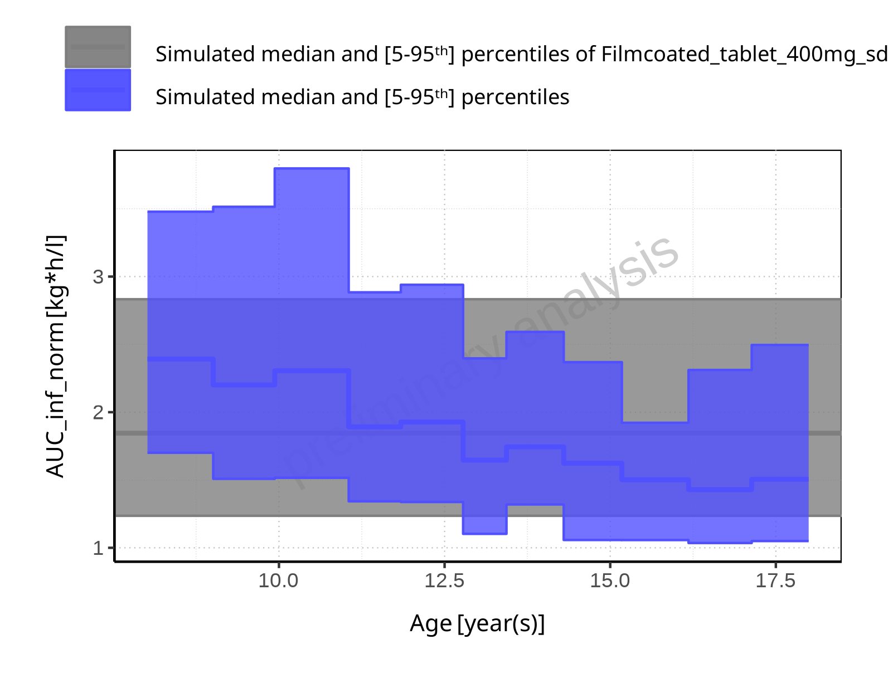


**Figure 2-200: Age-dependence of AUC_inf_norm for Larson 2013 8y-18y 400mg FCT meal in comparison to Filmcoated_tablet_400mg_sd. Profiles are plotted in a linear scale.**


<br>
<br>


```{=openxml}
<w:br w:type="page"/>
```

`<w:bookmarkStart w:id="figure-2-201" w:name="figure-2-201"/><w:bookmarkEnd w:id="figure-2-201"/>`{=openxml}

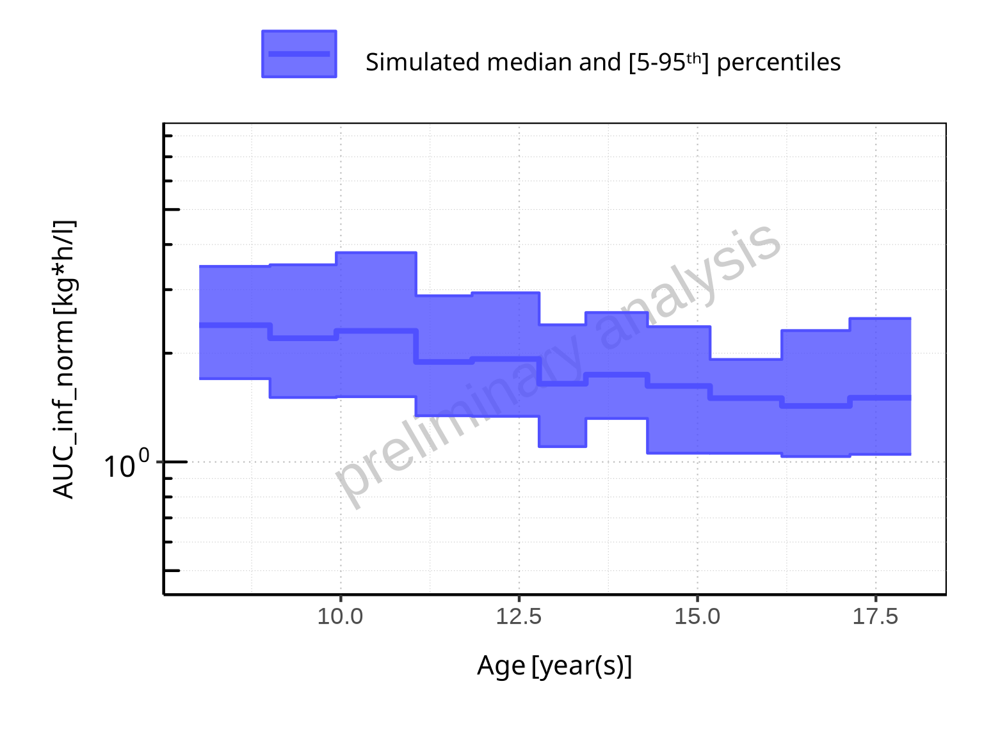


**Figure 2-201: Age-dependence of AUC_inf_norm for Larson 2013 8y-18y 400mg FCT meal. Profiles are plotted in a logarithmic scale.**


<br>
<br>


```{=openxml}
<w:br w:type="page"/>
```

`<w:bookmarkStart w:id="figure-2-202" w:name="figure-2-202"/><w:bookmarkEnd w:id="figure-2-202"/>`{=openxml}

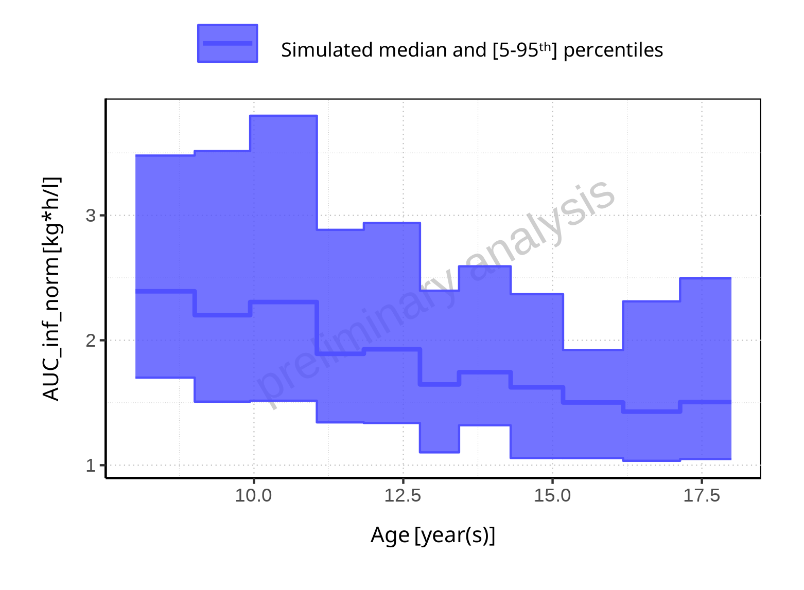


**Figure 2-202: Age-dependence of AUC_inf_norm for Larson 2013 8y-18y 400mg FCT meal. Profiles are plotted in a linear scale.**


<br>
<br>


```{=openxml}
<w:br w:type="page"/>
```

`<w:bookmarkStart w:id="figure-2-203" w:name="figure-2-203"/><w:bookmarkEnd w:id="figure-2-203"/>`{=openxml}

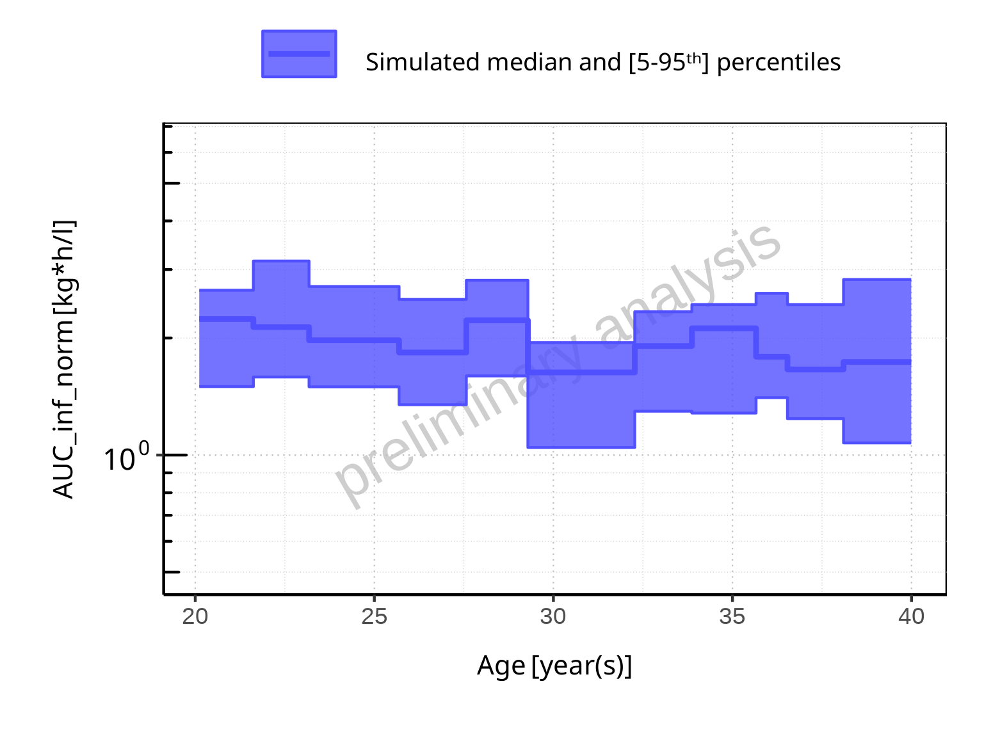


**Figure 2-203: Age-dependence of AUC_inf_norm for Filmcoated_tablet_400mg_sd. Profiles are plotted in a logarithmic scale.**


<br>
<br>


```{=openxml}
<w:br w:type="page"/>
```

`<w:bookmarkStart w:id="figure-2-204" w:name="figure-2-204"/><w:bookmarkEnd w:id="figure-2-204"/>`{=openxml}

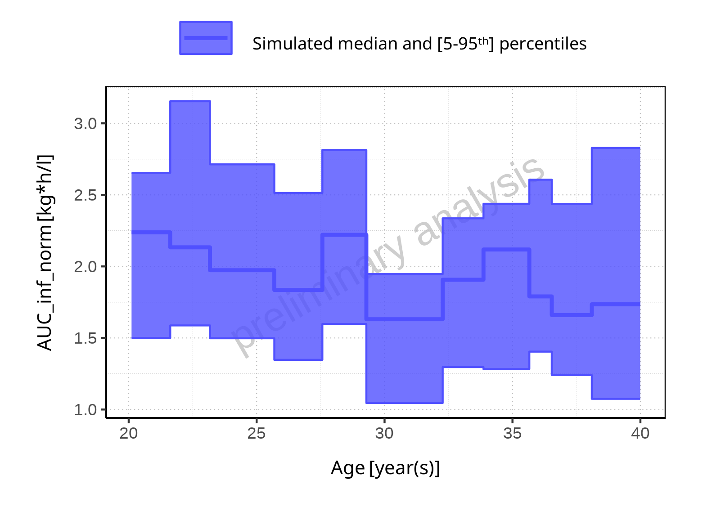


**Figure 2-204: Age-dependence of AUC_inf_norm for Filmcoated_tablet_400mg_sd. Profiles are plotted in a linear scale.**


<br>
<br>


```{=openxml}
<w:br w:type="page"/>
```

`<w:bookmarkStart w:id="figure-2-205" w:name="figure-2-205"/><w:bookmarkEnd w:id="figure-2-205"/>`{=openxml}

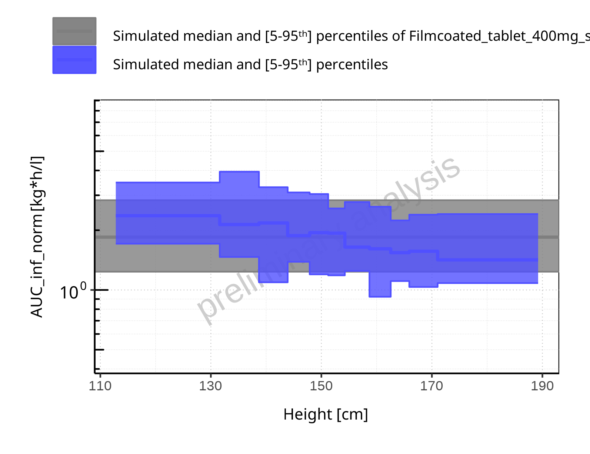


**Figure 2-205: Height-dependence of AUC_inf_norm for Larson 2013 8y-18y 400mg FCT meal in comparison to Filmcoated_tablet_400mg_sd. Profiles are plotted in a logarithmic scale.**


<br>
<br>


```{=openxml}
<w:br w:type="page"/>
```

`<w:bookmarkStart w:id="figure-2-206" w:name="figure-2-206"/><w:bookmarkEnd w:id="figure-2-206"/>`{=openxml}

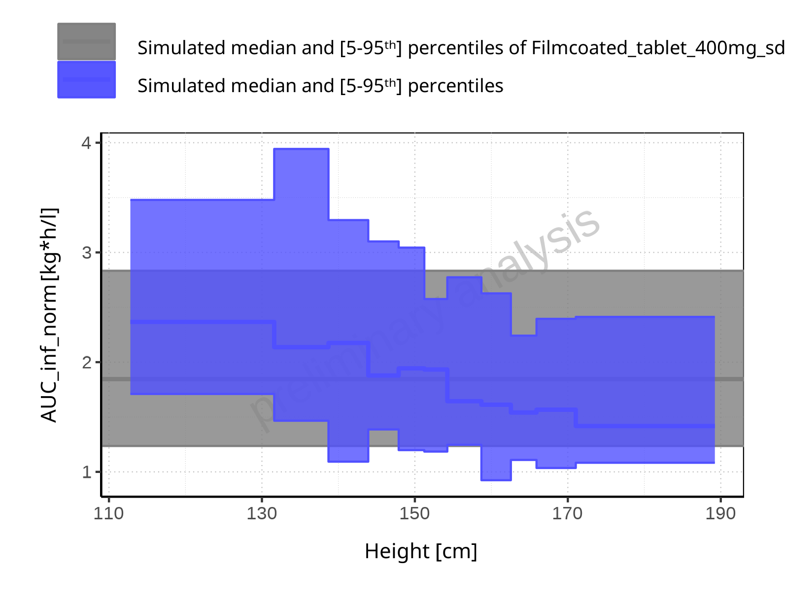


**Figure 2-206: Height-dependence of AUC_inf_norm for Larson 2013 8y-18y 400mg FCT meal in comparison to Filmcoated_tablet_400mg_sd. Profiles are plotted in a linear scale.**


<br>
<br>


```{=openxml}
<w:br w:type="page"/>
```

`<w:bookmarkStart w:id="figure-2-207" w:name="figure-2-207"/><w:bookmarkEnd w:id="figure-2-207"/>`{=openxml}

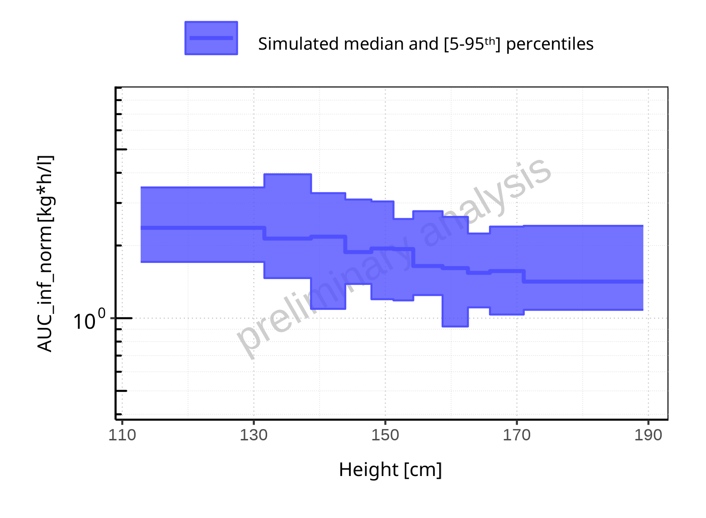


**Figure 2-207: Height-dependence of AUC_inf_norm for Larson 2013 8y-18y 400mg FCT meal. Profiles are plotted in a logarithmic scale.**


<br>
<br>


```{=openxml}
<w:br w:type="page"/>
```

`<w:bookmarkStart w:id="figure-2-208" w:name="figure-2-208"/><w:bookmarkEnd w:id="figure-2-208"/>`{=openxml}

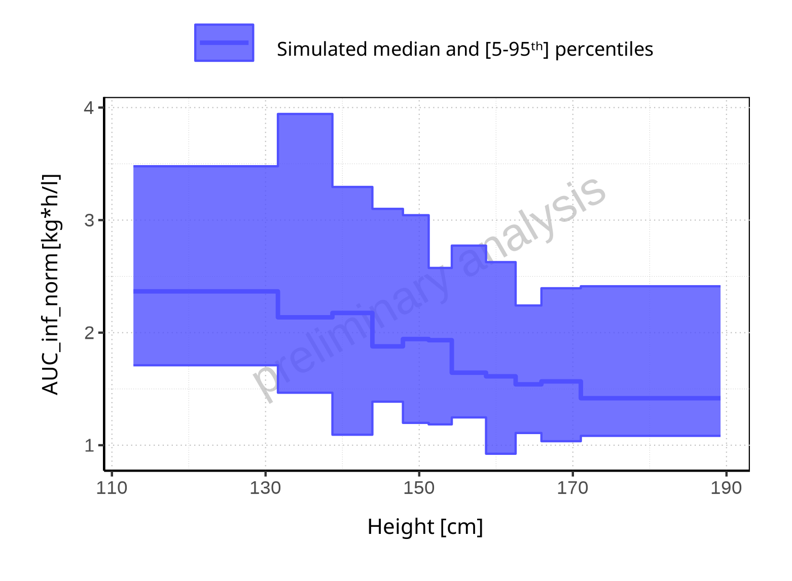


**Figure 2-208: Height-dependence of AUC_inf_norm for Larson 2013 8y-18y 400mg FCT meal. Profiles are plotted in a linear scale.**


<br>
<br>


```{=openxml}
<w:br w:type="page"/>
```

`<w:bookmarkStart w:id="figure-2-209" w:name="figure-2-209"/><w:bookmarkEnd w:id="figure-2-209"/>`{=openxml}

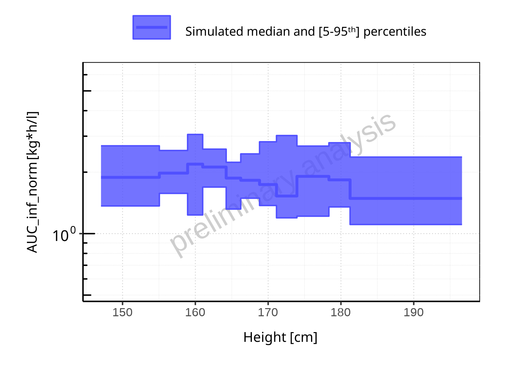


**Figure 2-209: Height-dependence of AUC_inf_norm for Filmcoated_tablet_400mg_sd. Profiles are plotted in a logarithmic scale.**


<br>
<br>


```{=openxml}
<w:br w:type="page"/>
```

`<w:bookmarkStart w:id="figure-2-210" w:name="figure-2-210"/><w:bookmarkEnd w:id="figure-2-210"/>`{=openxml}

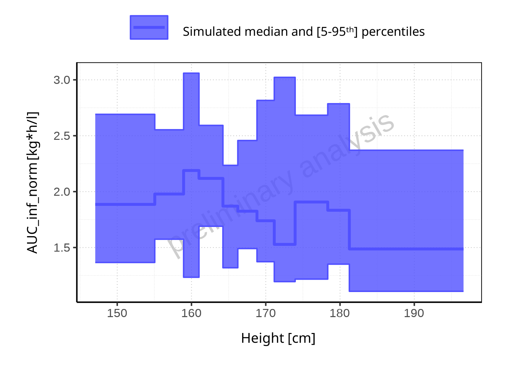


**Figure 2-210: Height-dependence of AUC_inf_norm for Filmcoated_tablet_400mg_sd. Profiles are plotted in a linear scale.**


<br>
<br>


```{=openxml}
<w:br w:type="page"/>
```

`<w:bookmarkStart w:id="figure-2-211" w:name="figure-2-211"/><w:bookmarkEnd w:id="figure-2-211"/>`{=openxml}

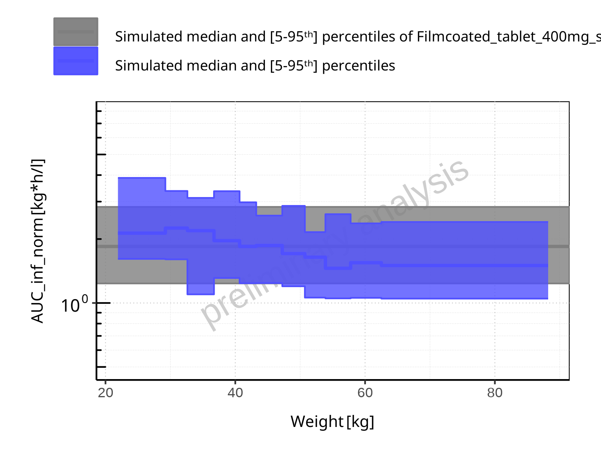


**Figure 2-211: Weight-dependence of AUC_inf_norm for Larson 2013 8y-18y 400mg FCT meal in comparison to Filmcoated_tablet_400mg_sd. Profiles are plotted in a logarithmic scale.**


<br>
<br>


```{=openxml}
<w:br w:type="page"/>
```

`<w:bookmarkStart w:id="figure-2-212" w:name="figure-2-212"/><w:bookmarkEnd w:id="figure-2-212"/>`{=openxml}

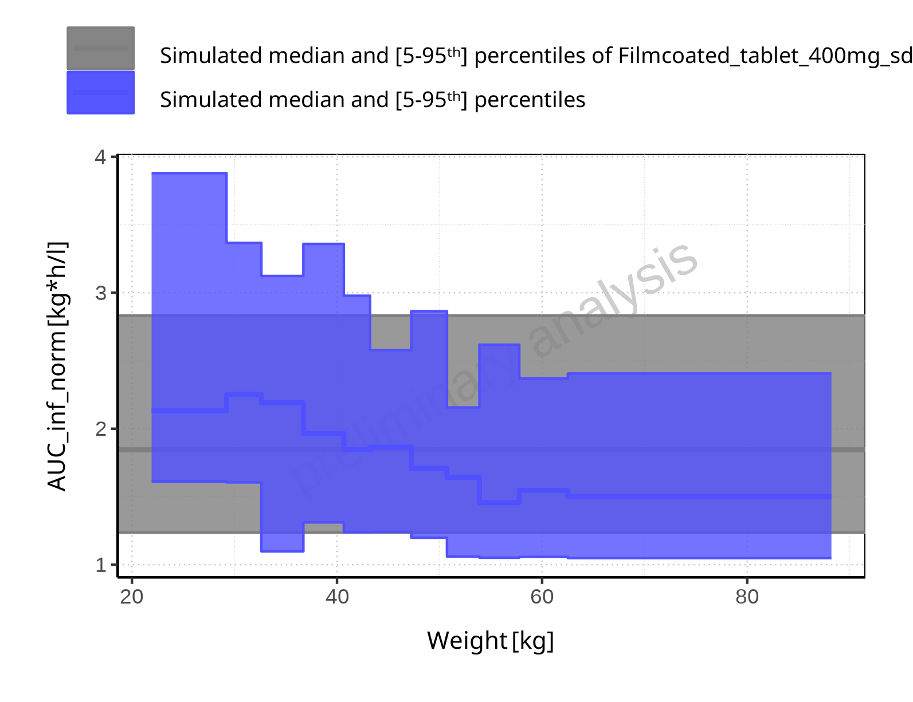


**Figure 2-212: Weight-dependence of AUC_inf_norm for Larson 2013 8y-18y 400mg FCT meal in comparison to Filmcoated_tablet_400mg_sd. Profiles are plotted in a linear scale.**


<br>
<br>


```{=openxml}
<w:br w:type="page"/>
```

`<w:bookmarkStart w:id="figure-2-213" w:name="figure-2-213"/><w:bookmarkEnd w:id="figure-2-213"/>`{=openxml}

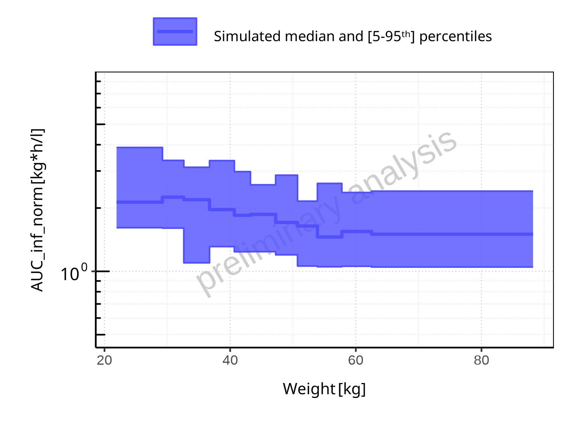


**Figure 2-213: Weight-dependence of AUC_inf_norm for Larson 2013 8y-18y 400mg FCT meal. Profiles are plotted in a logarithmic scale.**


<br>
<br>


```{=openxml}
<w:br w:type="page"/>
```

`<w:bookmarkStart w:id="figure-2-214" w:name="figure-2-214"/><w:bookmarkEnd w:id="figure-2-214"/>`{=openxml}

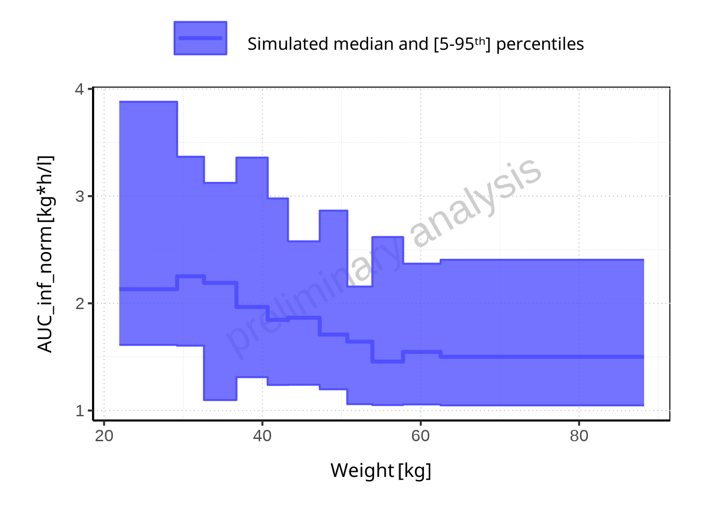


**Figure 2-214: Weight-dependence of AUC_inf_norm for Larson 2013 8y-18y 400mg FCT meal. Profiles are plotted in a linear scale.**


<br>
<br>


```{=openxml}
<w:br w:type="page"/>
```

`<w:bookmarkStart w:id="figure-2-215" w:name="figure-2-215"/><w:bookmarkEnd w:id="figure-2-215"/>`{=openxml}

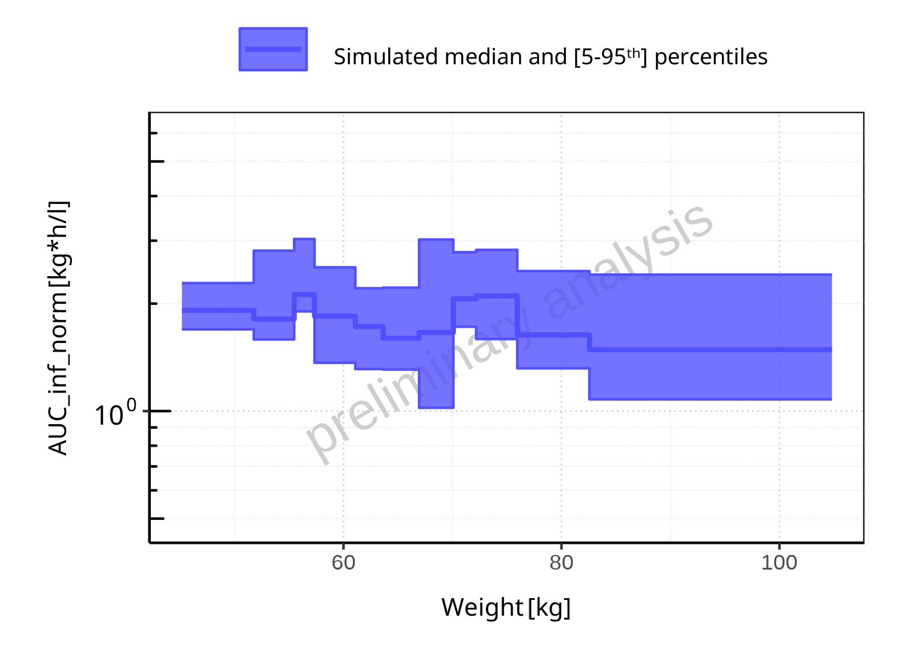


**Figure 2-215: Weight-dependence of AUC_inf_norm for Filmcoated_tablet_400mg_sd. Profiles are plotted in a logarithmic scale.**


<br>
<br>


```{=openxml}
<w:br w:type="page"/>
```

`<w:bookmarkStart w:id="figure-2-216" w:name="figure-2-216"/><w:bookmarkEnd w:id="figure-2-216"/>`{=openxml}

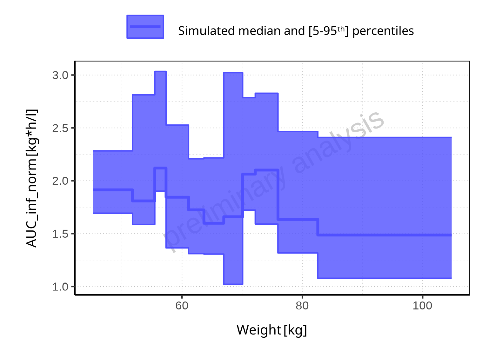


**Figure 2-216: Weight-dependence of AUC_inf_norm for Filmcoated_tablet_400mg_sd. Profiles are plotted in a linear scale.**


<br>
<br>


```{=openxml}
<w:br w:type="page"/>
```

`<w:bookmarkStart w:id="figure-2-217" w:name="figure-2-217"/><w:bookmarkEnd w:id="figure-2-217"/>`{=openxml}

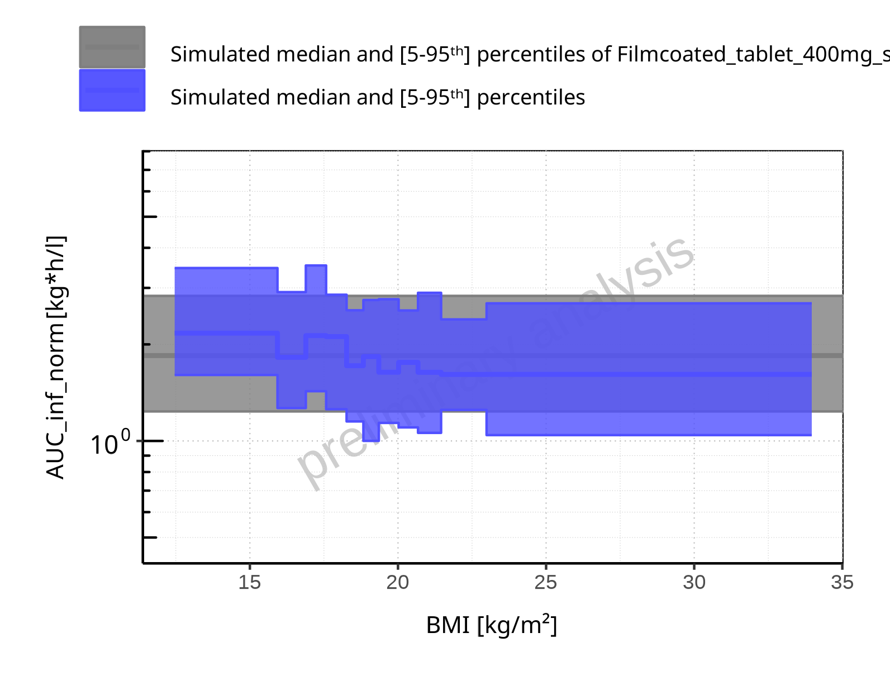


**Figure 2-217: BMI-dependence of AUC_inf_norm for Larson 2013 8y-18y 400mg FCT meal in comparison to Filmcoated_tablet_400mg_sd. Profiles are plotted in a logarithmic scale.**


<br>
<br>


```{=openxml}
<w:br w:type="page"/>
```

`<w:bookmarkStart w:id="figure-2-218" w:name="figure-2-218"/><w:bookmarkEnd w:id="figure-2-218"/>`{=openxml}

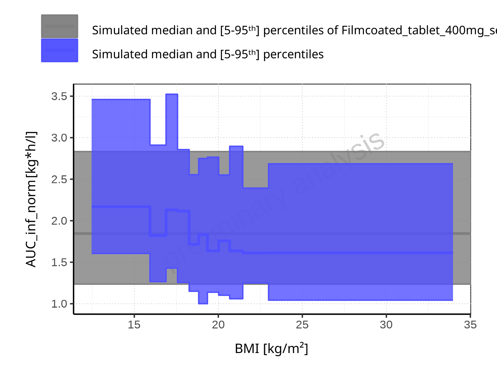


**Figure 2-218: BMI-dependence of AUC_inf_norm for Larson 2013 8y-18y 400mg FCT meal in comparison to Filmcoated_tablet_400mg_sd. Profiles are plotted in a linear scale.**


<br>
<br>


```{=openxml}
<w:br w:type="page"/>
```

`<w:bookmarkStart w:id="figure-2-219" w:name="figure-2-219"/><w:bookmarkEnd w:id="figure-2-219"/>`{=openxml}

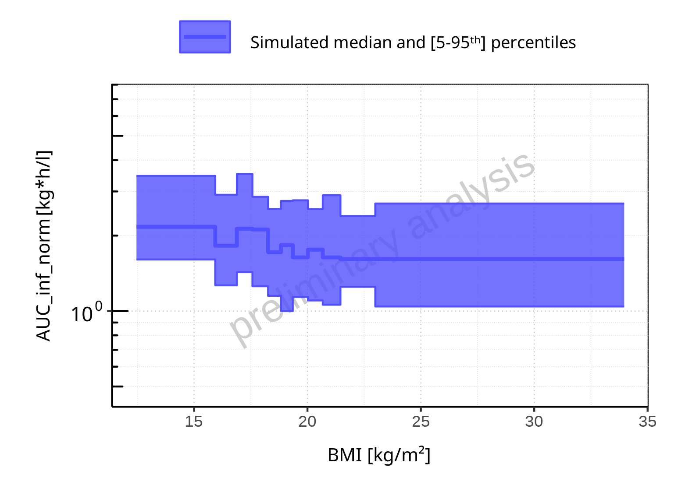


**Figure 2-219: BMI-dependence of AUC_inf_norm for Larson 2013 8y-18y 400mg FCT meal. Profiles are plotted in a logarithmic scale.**


<br>
<br>


```{=openxml}
<w:br w:type="page"/>
```

`<w:bookmarkStart w:id="figure-2-220" w:name="figure-2-220"/><w:bookmarkEnd w:id="figure-2-220"/>`{=openxml}

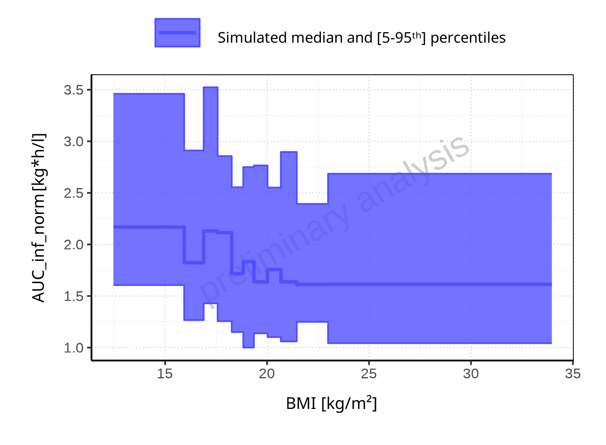


**Figure 2-220: BMI-dependence of AUC_inf_norm for Larson 2013 8y-18y 400mg FCT meal. Profiles are plotted in a linear scale.**


<br>
<br>


```{=openxml}
<w:br w:type="page"/>
```

`<w:bookmarkStart w:id="figure-2-221" w:name="figure-2-221"/><w:bookmarkEnd w:id="figure-2-221"/>`{=openxml}


**Figure 2-221: BMI-dependence of AUC_inf_norm for Filmcoated_tablet_400mg_sd. Profiles are plotted in a logarithmic scale.**


<br>
<br>


```{=openxml}
<w:br w:type="page"/>
```

`<w:bookmarkStart w:id="figure-2-222" w:name="figure-2-222"/><w:bookmarkEnd w:id="figure-2-222"/>`{=openxml}

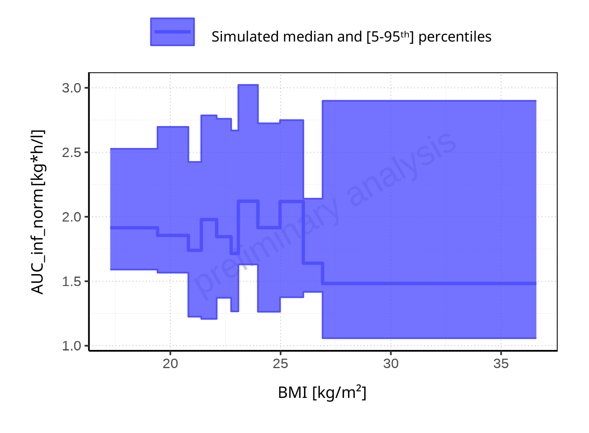


**Figure 2-222: BMI-dependence of AUC_inf_norm for Filmcoated_tablet_400mg_sd. Profiles are plotted in a linear scale.**


<br>
<br>


```{=openxml}
<w:br w:type="page"/>
```

`<w:bookmarkStart w:id="figure-2-223" w:name="figure-2-223"/><w:bookmarkEnd w:id="figure-2-223"/>`{=openxml}

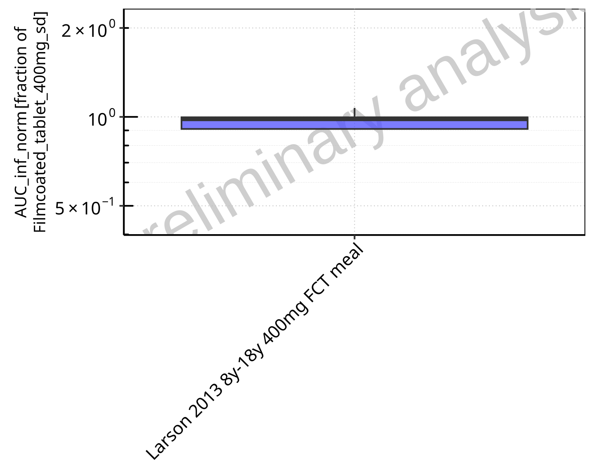


**Figure 2-223: Ratio of population summary statistics of AUC_inf_norm of Raltegravir  for  Larson 2013 8y-18y 400mg FCT meal in comparison to Filmcoated_tablet_400mg_sd shown as box-whisker plot, which indicates ratios of the 5^th^, 25^th^, 50^th^, 75^th^, 95^th^ percentiles in logarithmic scale.**


<br>
<br>


```{=openxml}
<w:br w:type="page"/>
```

`<w:bookmarkStart w:id="figure-2-224" w:name="figure-2-224"/><w:bookmarkEnd w:id="figure-2-224"/>`{=openxml}

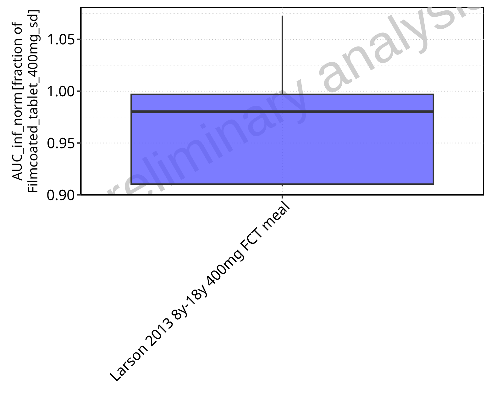


**Figure 2-224: Ratio of population summary statistics of AUC_inf_norm of Raltegravir  for  Larson 2013 8y-18y 400mg FCT meal in comparison to Filmcoated_tablet_400mg_sd shown as box-whisker plot, which indicates ratios of the 5^th^, 25^th^, 50^th^, 75^th^, 95^th^ percentiles in linear scale.**


<br>
<br>


```{=openxml}
<w:br w:type="page"/>
```

`<w:bookmarkStart w:id="table-2-16" w:name="table-2-16"/><w:bookmarkEnd w:id="table-2-16"/>`{=openxml}

**Table 2-16: Ratio of population summary statistics of AUC_inf_norm of Raltegravir  for  Larson 2013 8y-18y 400mg FCT meal in comparison to Filmcoated_tablet_400mg_sd**


|Population                        |N   |5^th^ pctl |25^th^ pctl |50^th^ pctl |75^th^ pctl |95^th^ pctl |Mean |SD   |Geo Mean |Geo SD |
|:---------------------------------|:---|:-------------------|:--------------------|:--------------------|:--------------------|:--------------------|:----|:----|:--------|:------|
|Larson 2013 8y-18y 400mg FCT meal |500 |0.91                |0.91                 |0.98                 |1.00                 |1.07                 |0.99 |1.24 |0        |-     |


<br>
<br>


### MRT `<w:bookmarkStart w:id="234_pk_parameters_organism_peripheralvenousblood_raltegravir_plasma__peripheral_venous_blood__mrt" w:name="234_pk_parameters_organism_peripheralvenousblood_raltegravir_plasma__peripheral_venous_blood__mrt"/><w:bookmarkEnd w:id="234_pk_parameters_organism_peripheralvenousblood_raltegravir_plasma__peripheral_venous_blood__mrt"/>`{=openxml}


```{=openxml}
<w:br w:type="page"/>
```

`<w:bookmarkStart w:id="figure-2-225" w:name="figure-2-225"/><w:bookmarkEnd w:id="figure-2-225"/>`{=openxml}

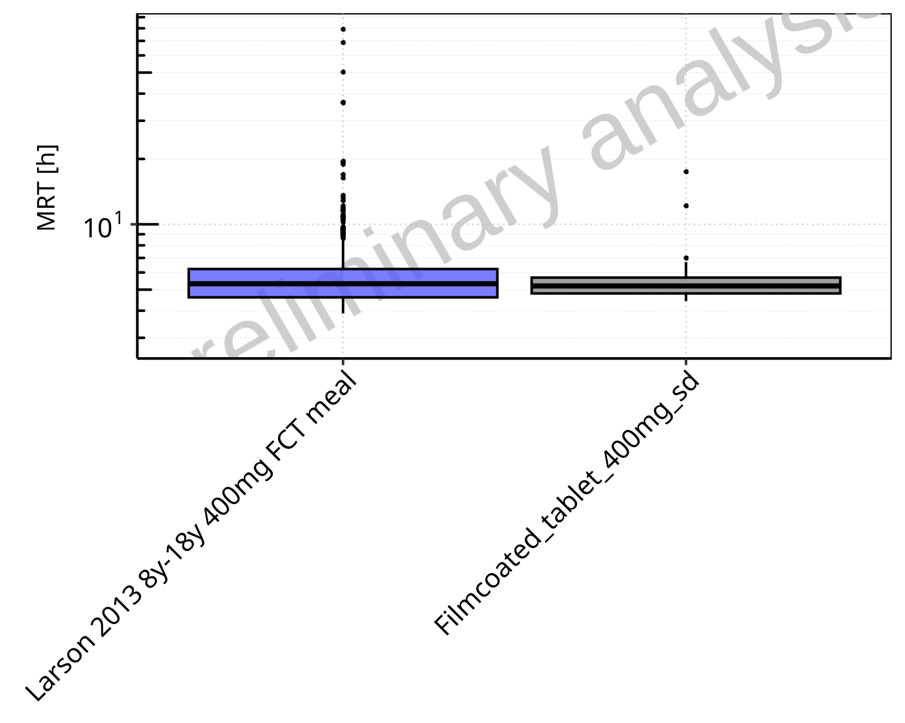


**Figure 2-225: MRT of Raltegravir for Larson 2013 8y-18y 400mg FCT meal, Filmcoated_tablet_400mg_sd shown as box-whisker plot, which indicates  the 5^th^, 25^th^, 50^th^, 75^th^, 95^th^ percentiles in logarithmic scale.**


<br>
<br>


```{=openxml}
<w:br w:type="page"/>
```

`<w:bookmarkStart w:id="figure-2-226" w:name="figure-2-226"/><w:bookmarkEnd w:id="figure-2-226"/>`{=openxml}

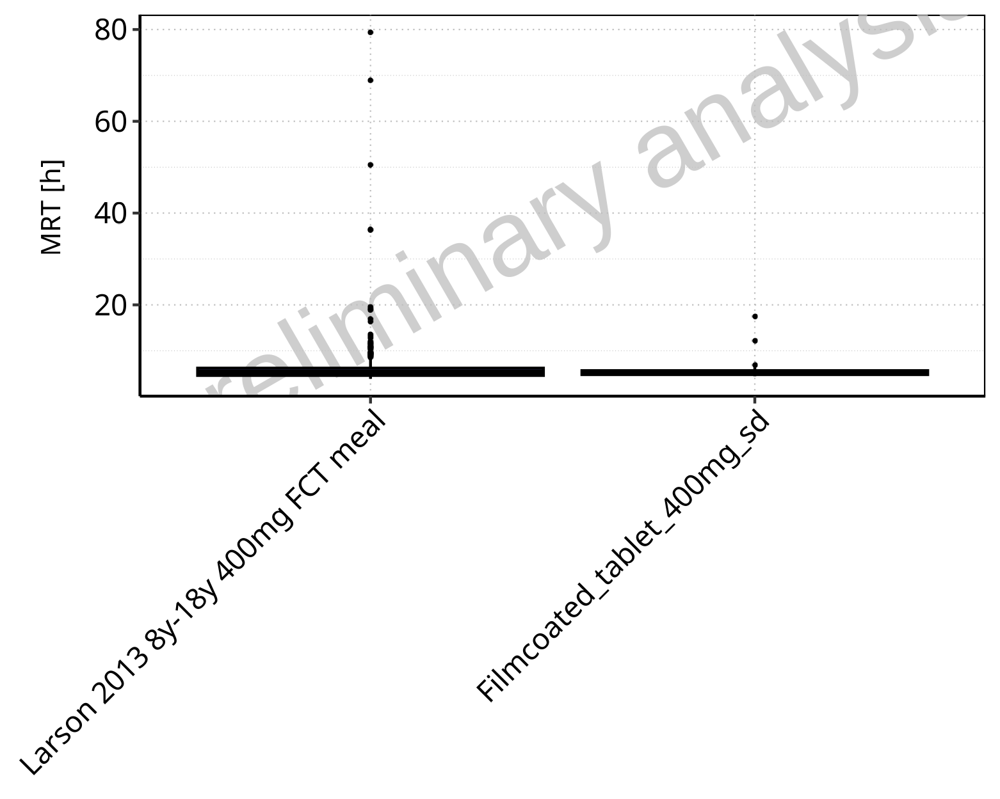


**Figure 2-226: MRT of Raltegravir for Larson 2013 8y-18y 400mg FCT meal, Filmcoated_tablet_400mg_sd shown as box-whisker plot, which indicates  the 5^th^, 25^th^, 50^th^, 75^th^, 95^th^ percentiles in linear scale.**


<br>
<br>


```{=openxml}
<w:br w:type="page"/>
```

`<w:bookmarkStart w:id="table-2-17" w:name="table-2-17"/><w:bookmarkEnd w:id="table-2-17"/>`{=openxml}

**Table 2-17: Population statistics summarizing MRT of Raltegravir for Larson 2013 8y-18y 400mg FCT meal, Filmcoated_tablet_400mg_sd reported in [h]**


|Population                        |N   |5^th^ pctl |25^th^ pctl |50^th^ pctl |75^th^ pctl |95^th^ pctl |Mean |SD   |Geo Mean |Geo SD |
|:---------------------------------|:---|:-------------------|:--------------------|:--------------------|:--------------------|:--------------------|:----|:----|:--------|:------|
|Larson 2013 8y-18y 400mg FCT meal |497 |3.88                |4.61                 |5.32                 |6.22                 |10.31                |6.26 |5.56 |5.64     |1.44   |
|Filmcoated_tablet_400mg_sd        |100 |4.43                |4.80                 |5.20                 |5.68                 |6.70                 |5.44 |1.54 |5.32     |1.21   |


<br>
<br>


```{=openxml}
<w:br w:type="page"/>
```

`<w:bookmarkStart w:id="figure-2-227" w:name="figure-2-227"/><w:bookmarkEnd w:id="figure-2-227"/>`{=openxml}

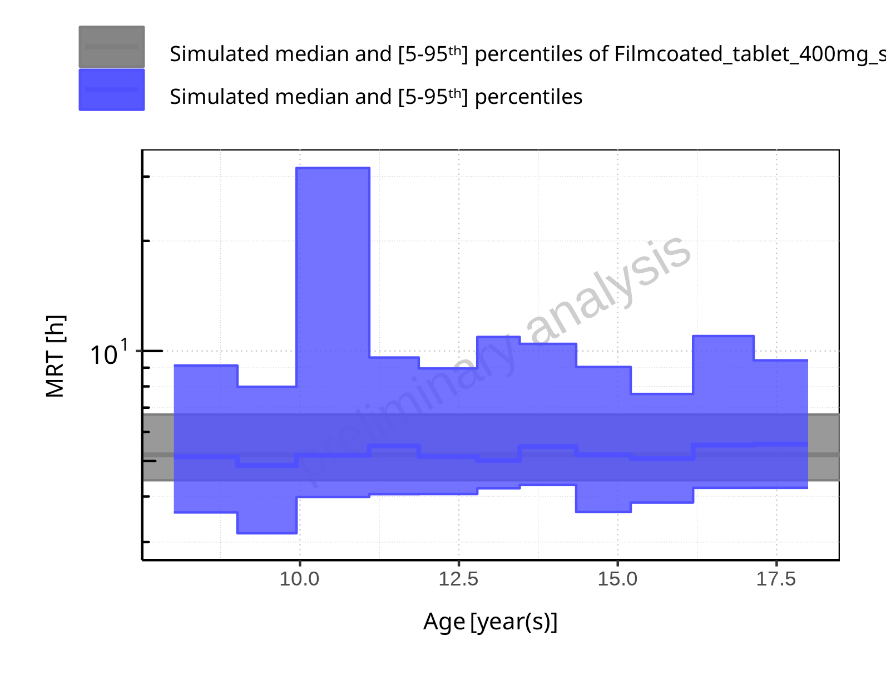


**Figure 2-227: Age-dependence of MRT for Larson 2013 8y-18y 400mg FCT meal in comparison to Filmcoated_tablet_400mg_sd. Profiles are plotted in a logarithmic scale.**


<br>
<br>


```{=openxml}
<w:br w:type="page"/>
```

`<w:bookmarkStart w:id="figure-2-228" w:name="figure-2-228"/><w:bookmarkEnd w:id="figure-2-228"/>`{=openxml}

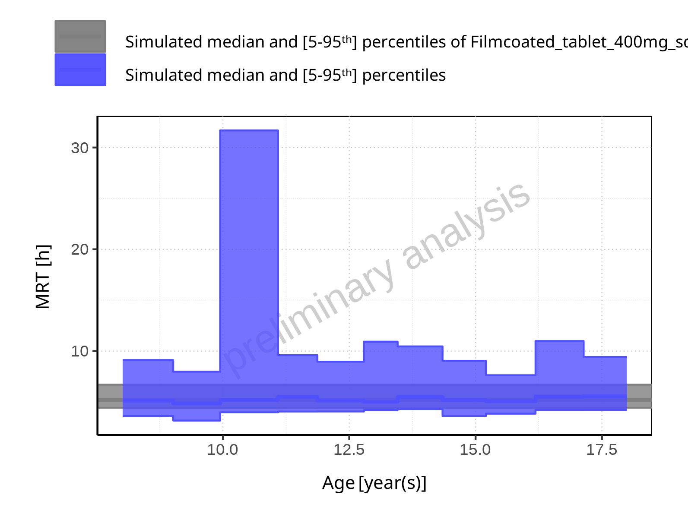


**Figure 2-228: Age-dependence of MRT for Larson 2013 8y-18y 400mg FCT meal in comparison to Filmcoated_tablet_400mg_sd. Profiles are plotted in a linear scale.**


<br>
<br>


```{=openxml}
<w:br w:type="page"/>
```

`<w:bookmarkStart w:id="figure-2-229" w:name="figure-2-229"/><w:bookmarkEnd w:id="figure-2-229"/>`{=openxml}

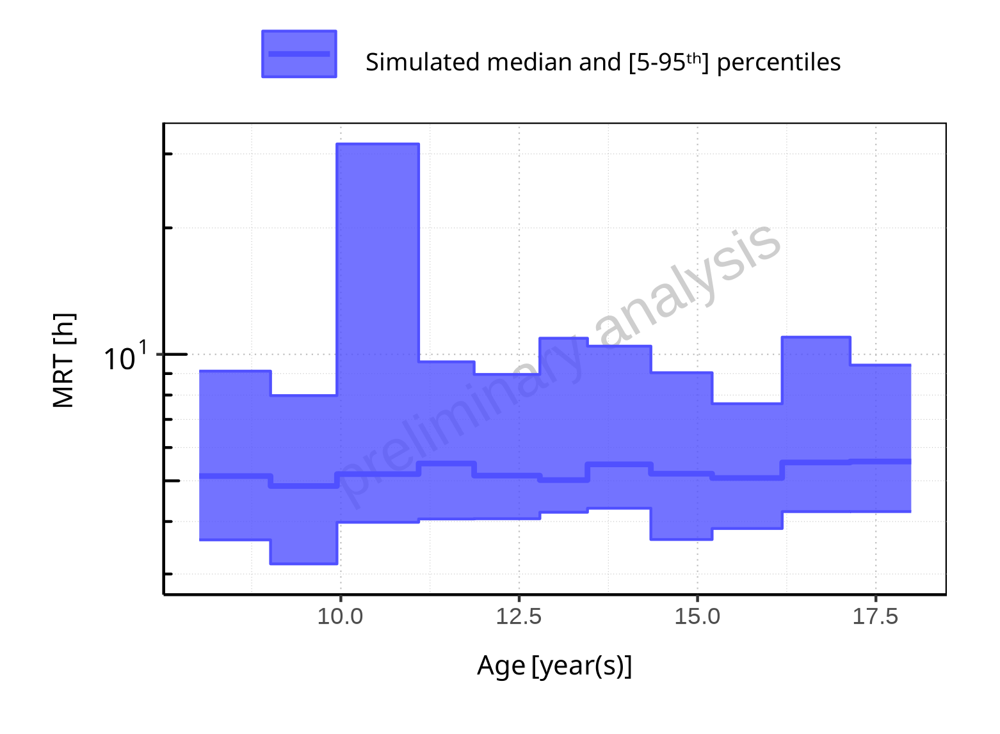


**Figure 2-229: Age-dependence of MRT for Larson 2013 8y-18y 400mg FCT meal. Profiles are plotted in a logarithmic scale.**


<br>
<br>


```{=openxml}
<w:br w:type="page"/>
```

`<w:bookmarkStart w:id="figure-2-230" w:name="figure-2-230"/><w:bookmarkEnd w:id="figure-2-230"/>`{=openxml}

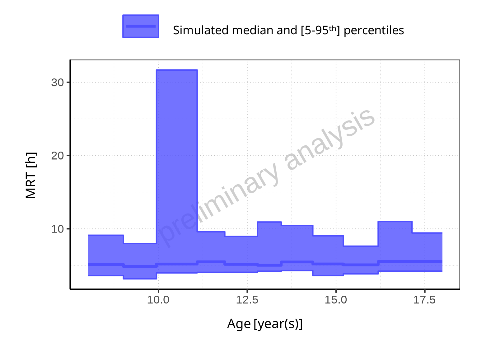


**Figure 2-230: Age-dependence of MRT for Larson 2013 8y-18y 400mg FCT meal. Profiles are plotted in a linear scale.**


<br>
<br>


```{=openxml}
<w:br w:type="page"/>
```

`<w:bookmarkStart w:id="figure-2-231" w:name="figure-2-231"/><w:bookmarkEnd w:id="figure-2-231"/>`{=openxml}

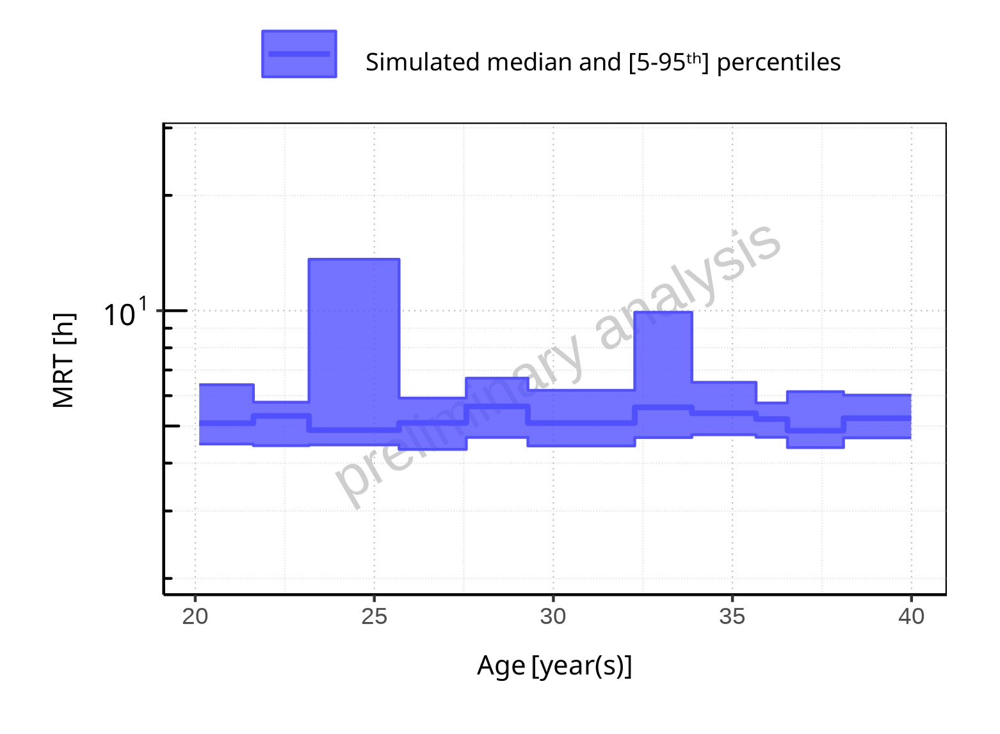


**Figure 2-231: Age-dependence of MRT for Filmcoated_tablet_400mg_sd. Profiles are plotted in a logarithmic scale.**


<br>
<br>


```{=openxml}
<w:br w:type="page"/>
```

`<w:bookmarkStart w:id="figure-2-232" w:name="figure-2-232"/><w:bookmarkEnd w:id="figure-2-232"/>`{=openxml}

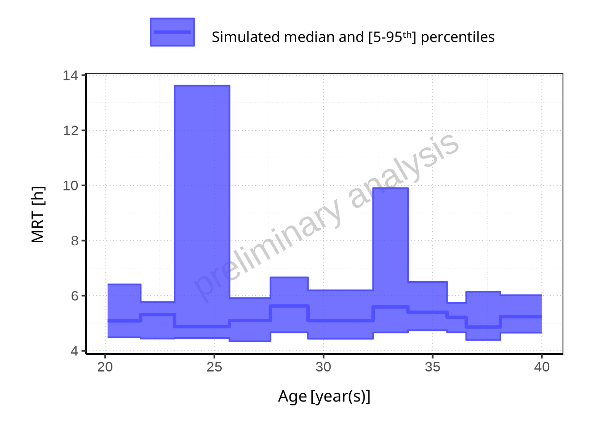


**Figure 2-232: Age-dependence of MRT for Filmcoated_tablet_400mg_sd. Profiles are plotted in a linear scale.**


<br>
<br>


```{=openxml}
<w:br w:type="page"/>
```

`<w:bookmarkStart w:id="figure-2-233" w:name="figure-2-233"/><w:bookmarkEnd w:id="figure-2-233"/>`{=openxml}

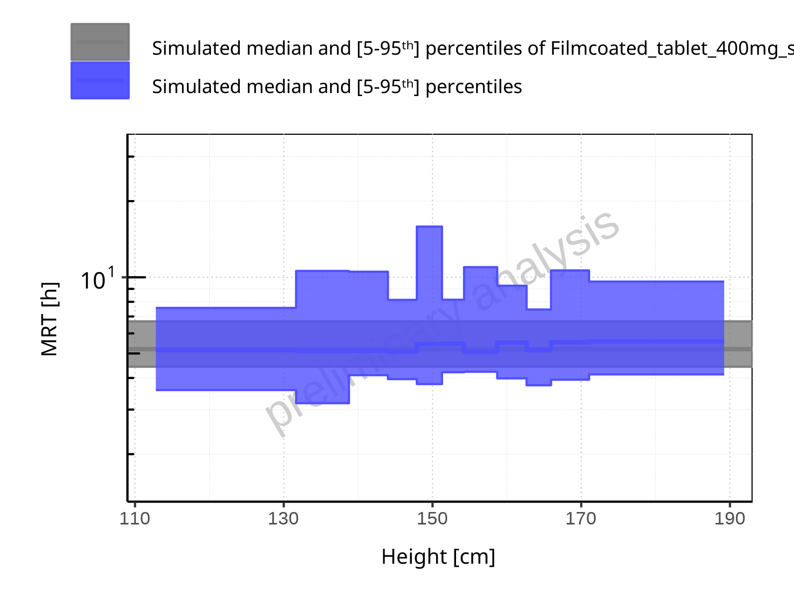


**Figure 2-233: Height-dependence of MRT for Larson 2013 8y-18y 400mg FCT meal in comparison to Filmcoated_tablet_400mg_sd. Profiles are plotted in a logarithmic scale.**


<br>
<br>


```{=openxml}
<w:br w:type="page"/>
```

`<w:bookmarkStart w:id="figure-2-234" w:name="figure-2-234"/><w:bookmarkEnd w:id="figure-2-234"/>`{=openxml}

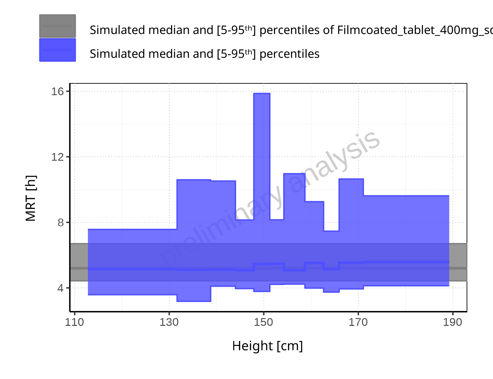


**Figure 2-234: Height-dependence of MRT for Larson 2013 8y-18y 400mg FCT meal in comparison to Filmcoated_tablet_400mg_sd. Profiles are plotted in a linear scale.**


<br>
<br>


```{=openxml}
<w:br w:type="page"/>
```

`<w:bookmarkStart w:id="figure-2-235" w:name="figure-2-235"/><w:bookmarkEnd w:id="figure-2-235"/>`{=openxml}

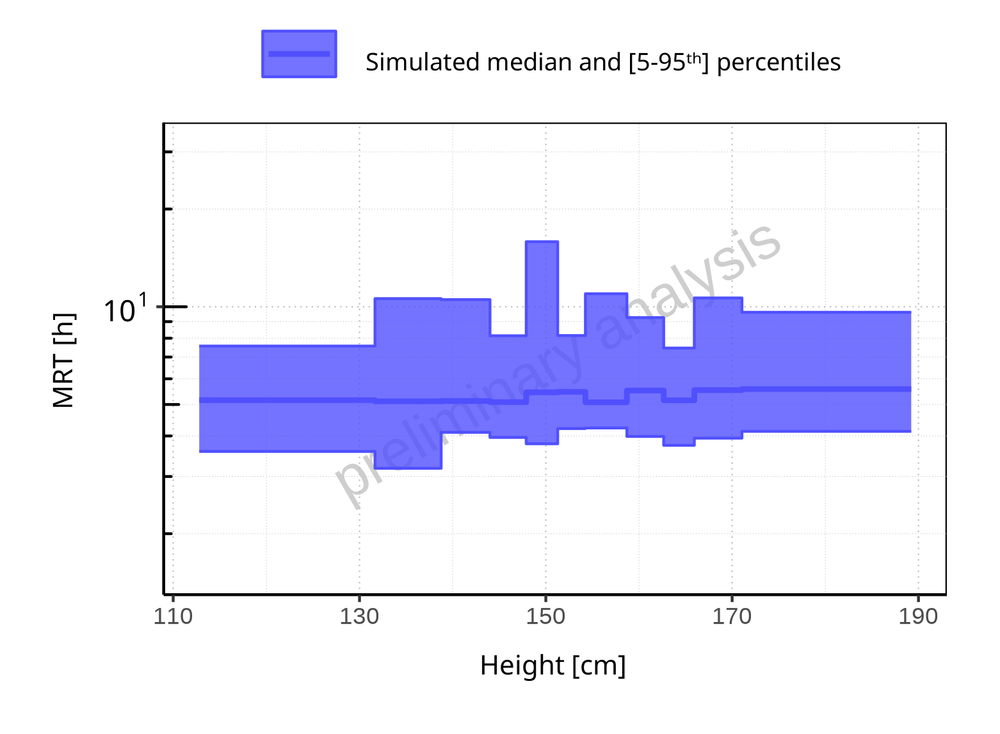


**Figure 2-235: Height-dependence of MRT for Larson 2013 8y-18y 400mg FCT meal. Profiles are plotted in a logarithmic scale.**


<br>
<br>


```{=openxml}
<w:br w:type="page"/>
```

`<w:bookmarkStart w:id="figure-2-236" w:name="figure-2-236"/><w:bookmarkEnd w:id="figure-2-236"/>`{=openxml}

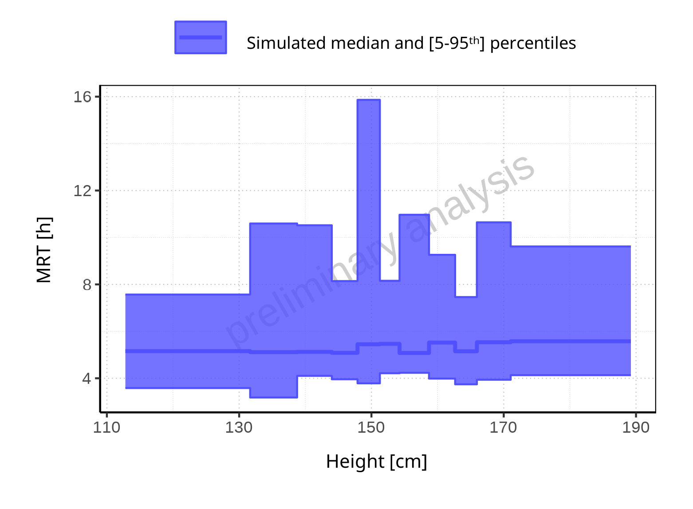


**Figure 2-236: Height-dependence of MRT for Larson 2013 8y-18y 400mg FCT meal. Profiles are plotted in a linear scale.**


<br>
<br>


```{=openxml}
<w:br w:type="page"/>
```

`<w:bookmarkStart w:id="figure-2-237" w:name="figure-2-237"/><w:bookmarkEnd w:id="figure-2-237"/>`{=openxml}

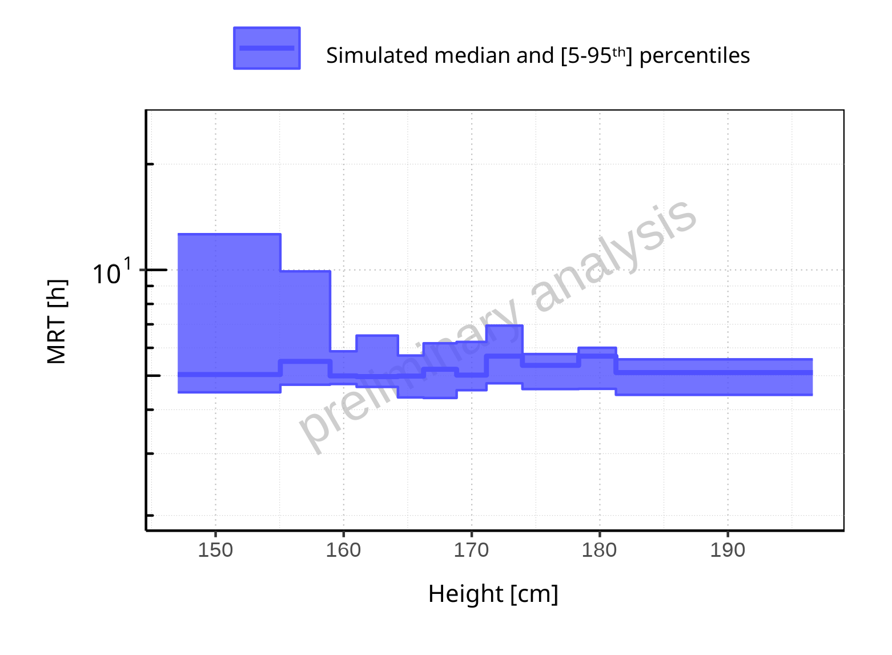


**Figure 2-237: Height-dependence of MRT for Filmcoated_tablet_400mg_sd. Profiles are plotted in a logarithmic scale.**


<br>
<br>


```{=openxml}
<w:br w:type="page"/>
```

`<w:bookmarkStart w:id="figure-2-238" w:name="figure-2-238"/><w:bookmarkEnd w:id="figure-2-238"/>`{=openxml}

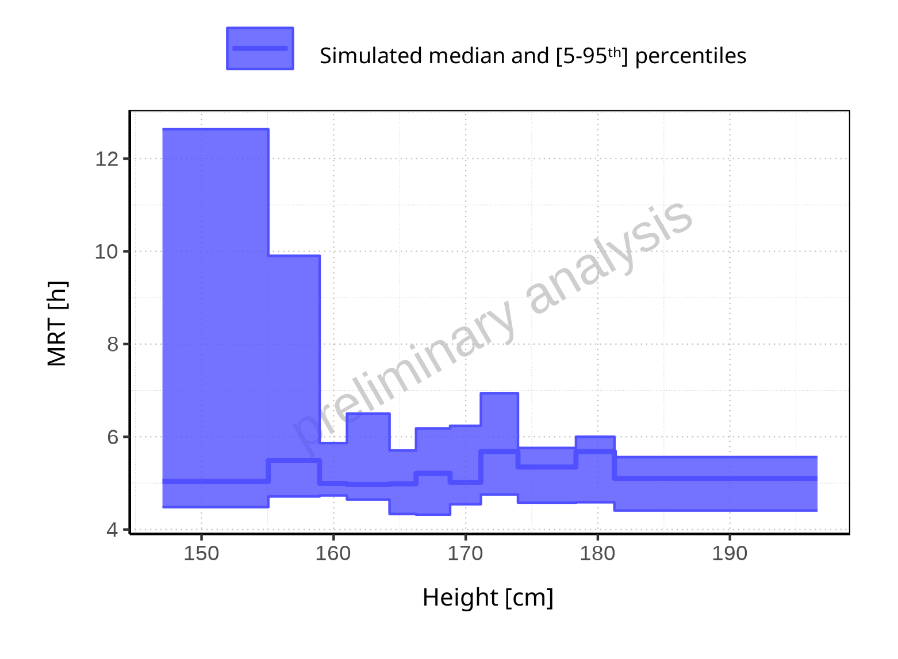


**Figure 2-238: Height-dependence of MRT for Filmcoated_tablet_400mg_sd. Profiles are plotted in a linear scale.**


<br>
<br>


```{=openxml}
<w:br w:type="page"/>
```

`<w:bookmarkStart w:id="figure-2-239" w:name="figure-2-239"/><w:bookmarkEnd w:id="figure-2-239"/>`{=openxml}

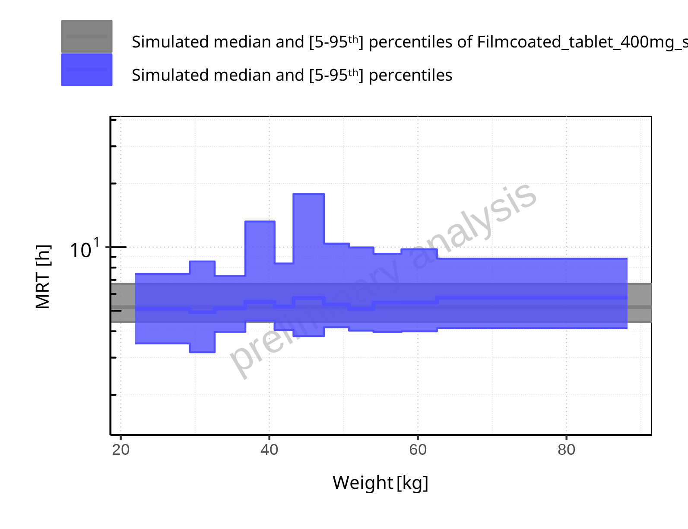


**Figure 2-239: Weight-dependence of MRT for Larson 2013 8y-18y 400mg FCT meal in comparison to Filmcoated_tablet_400mg_sd. Profiles are plotted in a logarithmic scale.**


<br>
<br>


```{=openxml}
<w:br w:type="page"/>
```

`<w:bookmarkStart w:id="figure-2-240" w:name="figure-2-240"/><w:bookmarkEnd w:id="figure-2-240"/>`{=openxml}

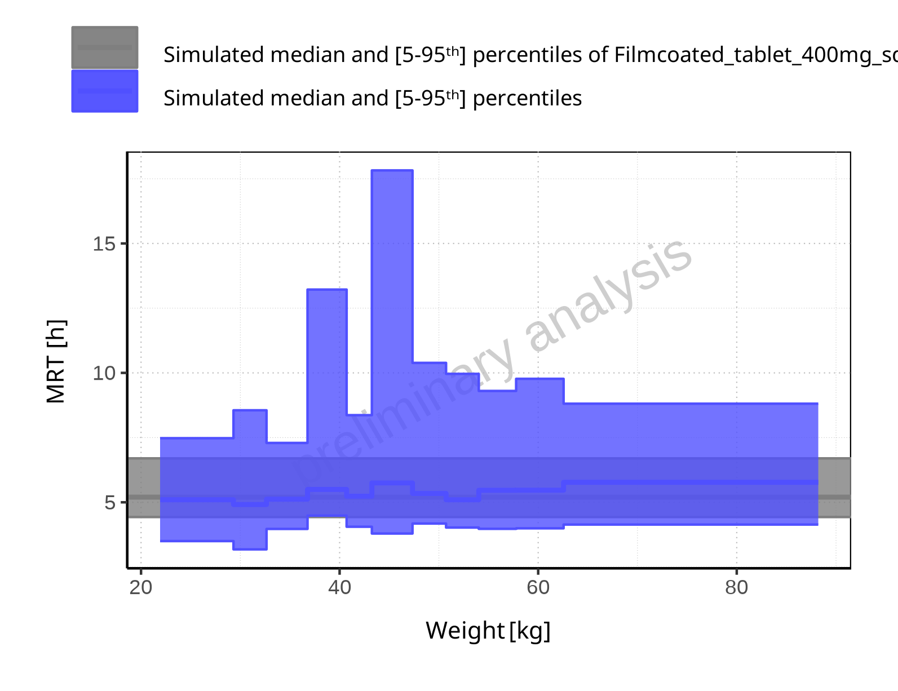


**Figure 2-240: Weight-dependence of MRT for Larson 2013 8y-18y 400mg FCT meal in comparison to Filmcoated_tablet_400mg_sd. Profiles are plotted in a linear scale.**


<br>
<br>


```{=openxml}
<w:br w:type="page"/>
```

`<w:bookmarkStart w:id="figure-2-241" w:name="figure-2-241"/><w:bookmarkEnd w:id="figure-2-241"/>`{=openxml}

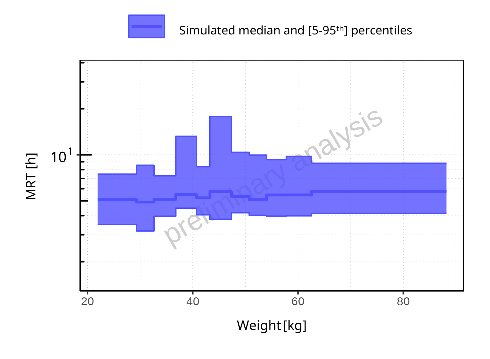


**Figure 2-241: Weight-dependence of MRT for Larson 2013 8y-18y 400mg FCT meal. Profiles are plotted in a logarithmic scale.**


<br>
<br>


```{=openxml}
<w:br w:type="page"/>
```

`<w:bookmarkStart w:id="figure-2-242" w:name="figure-2-242"/><w:bookmarkEnd w:id="figure-2-242"/>`{=openxml}

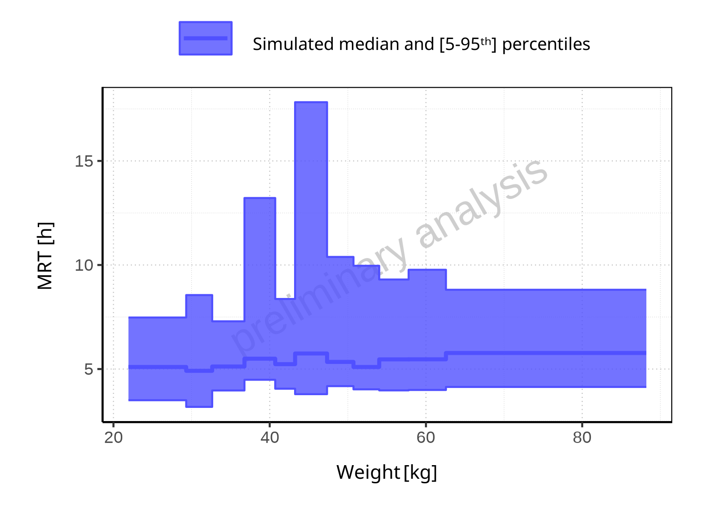


**Figure 2-242: Weight-dependence of MRT for Larson 2013 8y-18y 400mg FCT meal. Profiles are plotted in a linear scale.**


<br>
<br>


```{=openxml}
<w:br w:type="page"/>
```

`<w:bookmarkStart w:id="figure-2-243" w:name="figure-2-243"/><w:bookmarkEnd w:id="figure-2-243"/>`{=openxml}

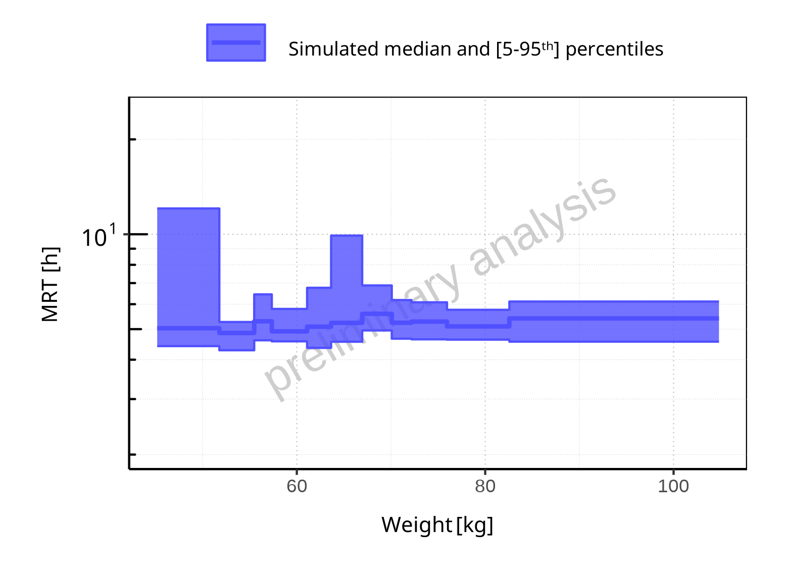


**Figure 2-243: Weight-dependence of MRT for Filmcoated_tablet_400mg_sd. Profiles are plotted in a logarithmic scale.**


<br>
<br>


```{=openxml}
<w:br w:type="page"/>
```

`<w:bookmarkStart w:id="figure-2-244" w:name="figure-2-244"/><w:bookmarkEnd w:id="figure-2-244"/>`{=openxml}

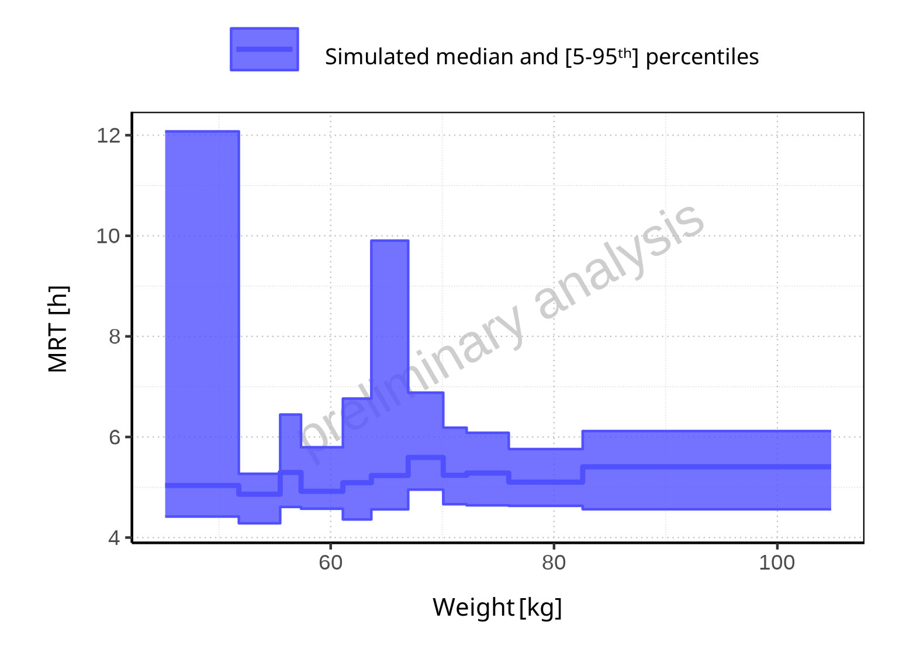


**Figure 2-244: Weight-dependence of MRT for Filmcoated_tablet_400mg_sd. Profiles are plotted in a linear scale.**


<br>
<br>


```{=openxml}
<w:br w:type="page"/>
```

`<w:bookmarkStart w:id="figure-2-245" w:name="figure-2-245"/><w:bookmarkEnd w:id="figure-2-245"/>`{=openxml}

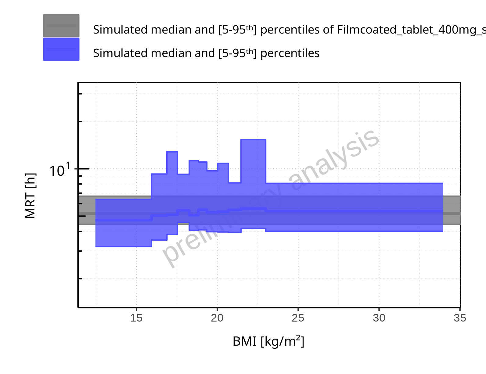


**Figure 2-245: BMI-dependence of MRT for Larson 2013 8y-18y 400mg FCT meal in comparison to Filmcoated_tablet_400mg_sd. Profiles are plotted in a logarithmic scale.**


<br>
<br>


```{=openxml}
<w:br w:type="page"/>
```

`<w:bookmarkStart w:id="figure-2-246" w:name="figure-2-246"/><w:bookmarkEnd w:id="figure-2-246"/>`{=openxml}

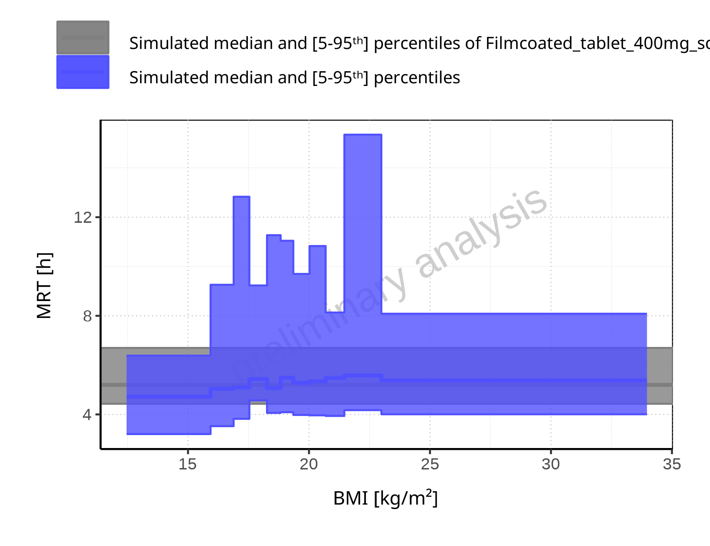


**Figure 2-246: BMI-dependence of MRT for Larson 2013 8y-18y 400mg FCT meal in comparison to Filmcoated_tablet_400mg_sd. Profiles are plotted in a linear scale.**


<br>
<br>


```{=openxml}
<w:br w:type="page"/>
```

`<w:bookmarkStart w:id="figure-2-247" w:name="figure-2-247"/><w:bookmarkEnd w:id="figure-2-247"/>`{=openxml}

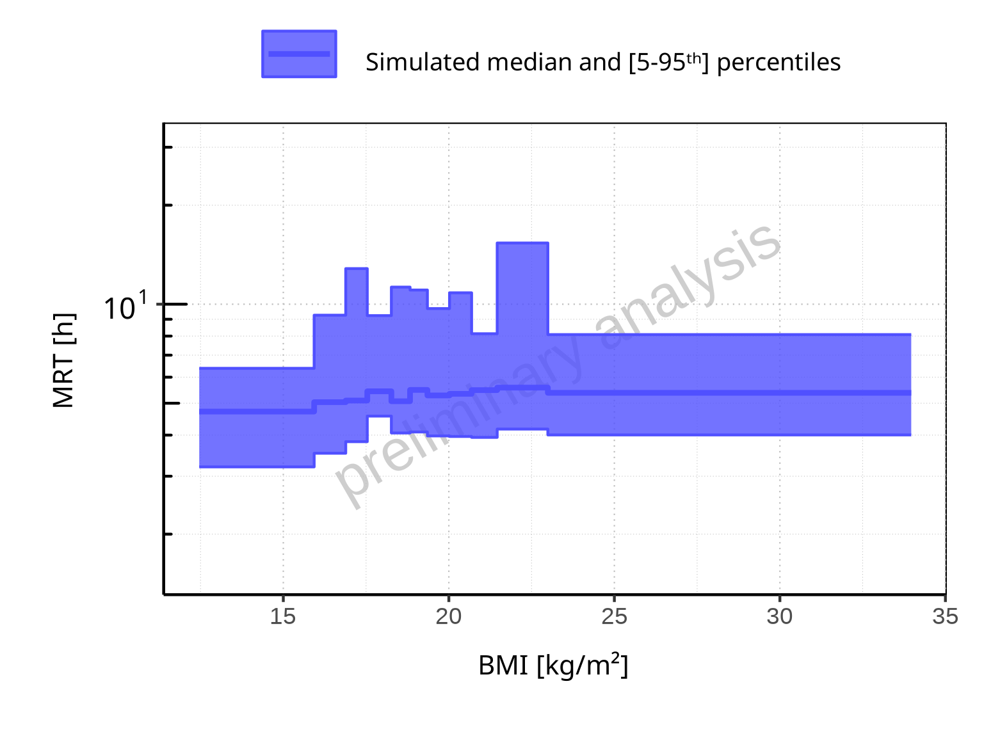


**Figure 2-247: BMI-dependence of MRT for Larson 2013 8y-18y 400mg FCT meal. Profiles are plotted in a logarithmic scale.**


<br>
<br>


```{=openxml}
<w:br w:type="page"/>
```

`<w:bookmarkStart w:id="figure-2-248" w:name="figure-2-248"/><w:bookmarkEnd w:id="figure-2-248"/>`{=openxml}

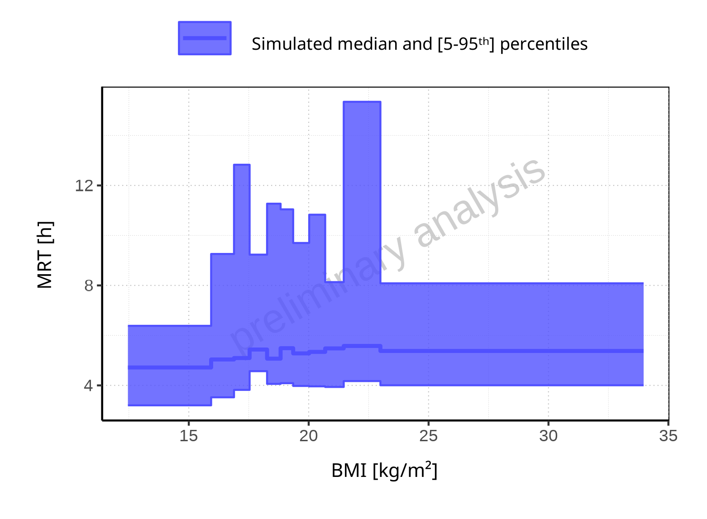


**Figure 2-248: BMI-dependence of MRT for Larson 2013 8y-18y 400mg FCT meal. Profiles are plotted in a linear scale.**


<br>
<br>


```{=openxml}
<w:br w:type="page"/>
```

`<w:bookmarkStart w:id="figure-2-249" w:name="figure-2-249"/><w:bookmarkEnd w:id="figure-2-249"/>`{=openxml}

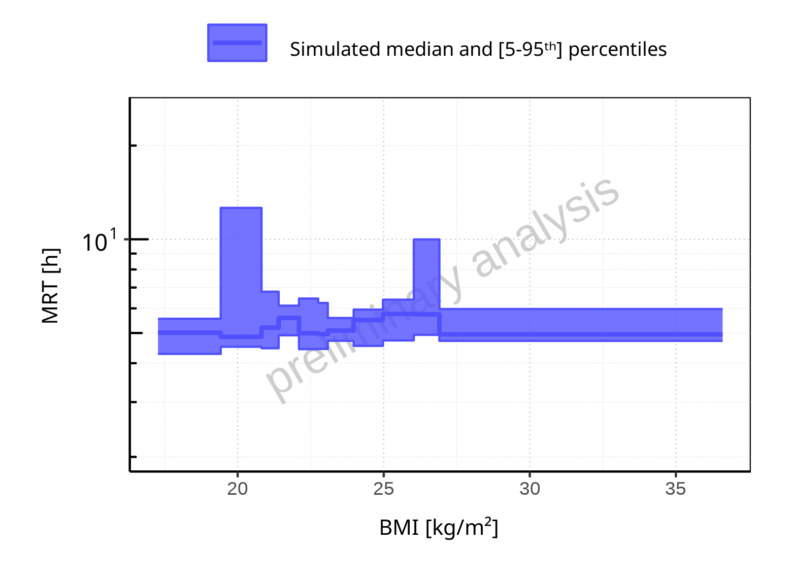


**Figure 2-249: BMI-dependence of MRT for Filmcoated_tablet_400mg_sd. Profiles are plotted in a logarithmic scale.**


<br>
<br>


```{=openxml}
<w:br w:type="page"/>
```

`<w:bookmarkStart w:id="figure-2-250" w:name="figure-2-250"/><w:bookmarkEnd w:id="figure-2-250"/>`{=openxml}

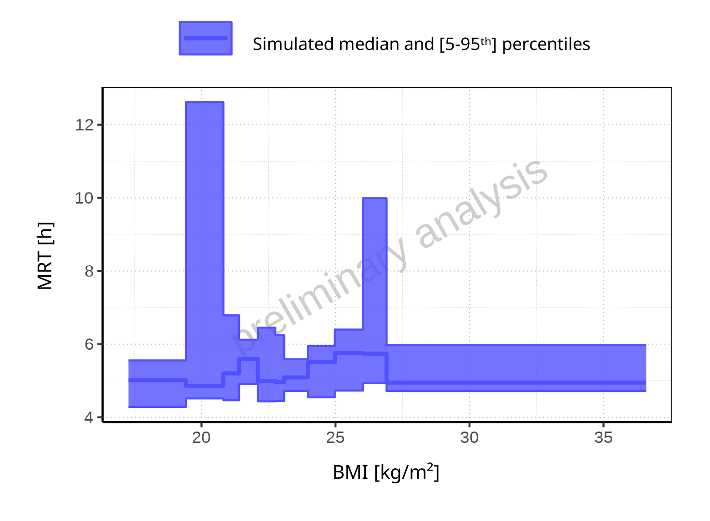


**Figure 2-250: BMI-dependence of MRT for Filmcoated_tablet_400mg_sd. Profiles are plotted in a linear scale.**


<br>
<br>


```{=openxml}
<w:br w:type="page"/>
```

`<w:bookmarkStart w:id="figure-2-251" w:name="figure-2-251"/><w:bookmarkEnd w:id="figure-2-251"/>`{=openxml}

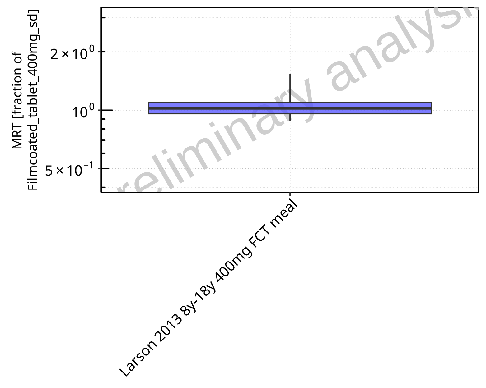


**Figure 2-251: Ratio of population summary statistics of MRT of Raltegravir  for  Larson 2013 8y-18y 400mg FCT meal in comparison to Filmcoated_tablet_400mg_sd shown as box-whisker plot, which indicates ratios of the 5^th^, 25^th^, 50^th^, 75^th^, 95^th^ percentiles in logarithmic scale.**


<br>
<br>


```{=openxml}
<w:br w:type="page"/>
```

`<w:bookmarkStart w:id="figure-2-252" w:name="figure-2-252"/><w:bookmarkEnd w:id="figure-2-252"/>`{=openxml}

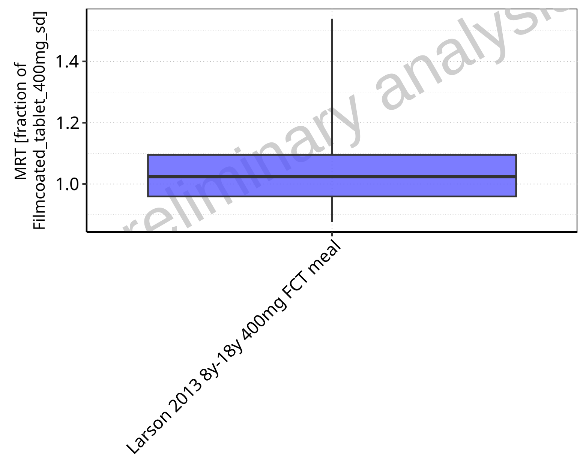


**Figure 2-252: Ratio of population summary statistics of MRT of Raltegravir  for  Larson 2013 8y-18y 400mg FCT meal in comparison to Filmcoated_tablet_400mg_sd shown as box-whisker plot, which indicates ratios of the 5^th^, 25^th^, 50^th^, 75^th^, 95^th^ percentiles in linear scale.**


<br>
<br>


```{=openxml}
<w:br w:type="page"/>
```

`<w:bookmarkStart w:id="table-2-18" w:name="table-2-18"/><w:bookmarkEnd w:id="table-2-18"/>`{=openxml}

**Table 2-18: Ratio of population summary statistics of MRT of Raltegravir  for  Larson 2013 8y-18y 400mg FCT meal in comparison to Filmcoated_tablet_400mg_sd**


|Population                        |N   |5^th^ pctl |25^th^ pctl |50^th^ pctl |75^th^ pctl |95^th^ pctl |Mean |SD   |Geo Mean |Geo SD |
|:---------------------------------|:---|:-------------------|:--------------------|:--------------------|:--------------------|:--------------------|:----|:----|:--------|:------|
|Larson 2013 8y-18y 400mg FCT meal |497 |0.88                |0.96                 |1.02                 |1.09                 |1.54                 |1.15 |3.62 |1.06     |1.19   |


<br>
<br>


### Thalf `<w:bookmarkStart w:id="263_pk_parameters_organism_peripheralvenousblood_raltegravir_plasma__peripheral_venous_blood__thalf" w:name="263_pk_parameters_organism_peripheralvenousblood_raltegravir_plasma__peripheral_venous_blood__thalf"/><w:bookmarkEnd w:id="263_pk_parameters_organism_peripheralvenousblood_raltegravir_plasma__peripheral_venous_blood__thalf"/>`{=openxml}


```{=openxml}
<w:br w:type="page"/>
```

`<w:bookmarkStart w:id="figure-2-253" w:name="figure-2-253"/><w:bookmarkEnd w:id="figure-2-253"/>`{=openxml}

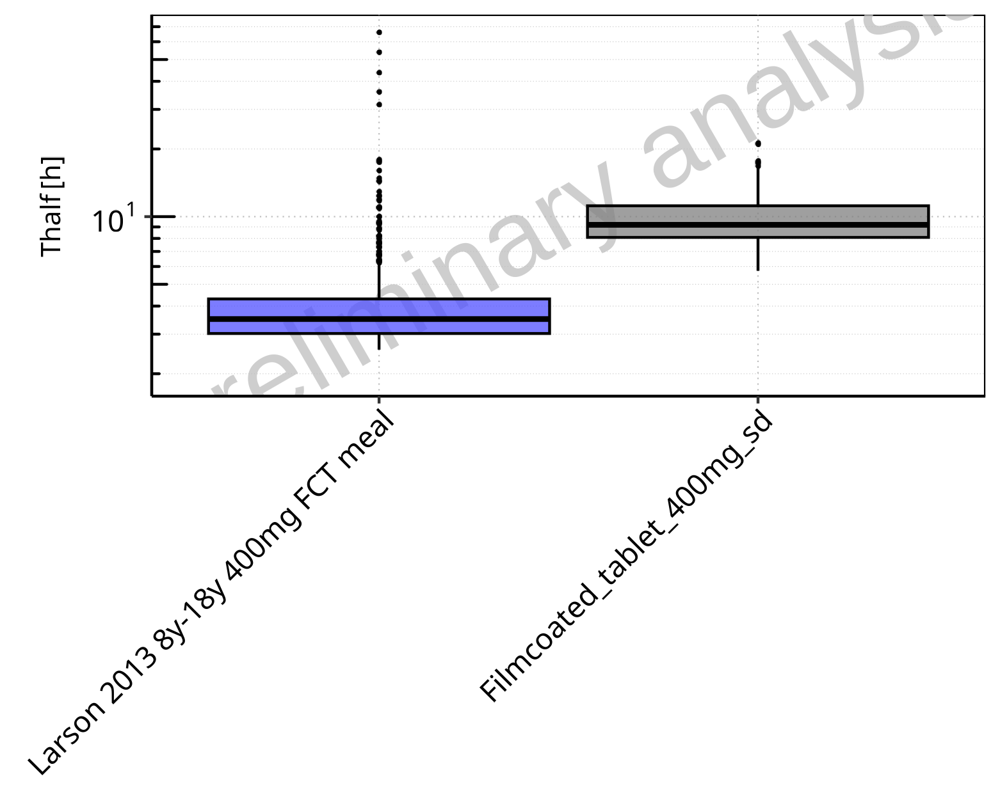


**Figure 2-253: Thalf of Raltegravir for Larson 2013 8y-18y 400mg FCT meal, Filmcoated_tablet_400mg_sd shown as box-whisker plot, which indicates  the 5^th^, 25^th^, 50^th^, 75^th^, 95^th^ percentiles in logarithmic scale.**


<br>
<br>


```{=openxml}
<w:br w:type="page"/>
```

`<w:bookmarkStart w:id="figure-2-254" w:name="figure-2-254"/><w:bookmarkEnd w:id="figure-2-254"/>`{=openxml}

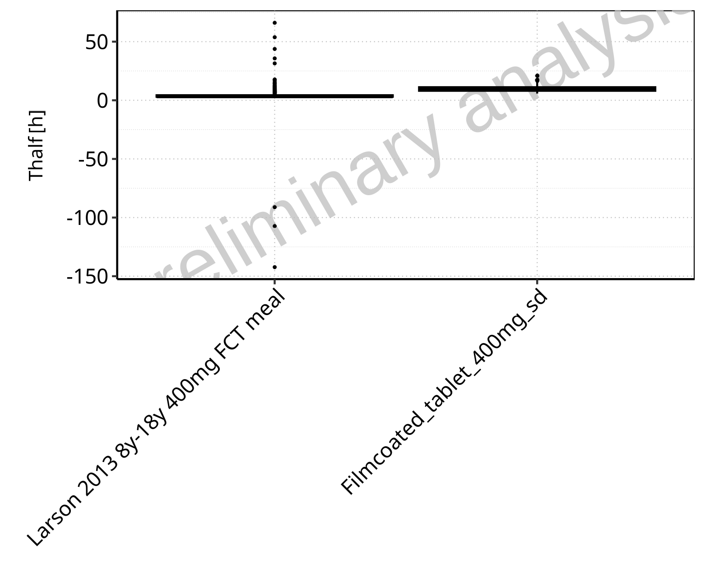


**Figure 2-254: Thalf of Raltegravir for Larson 2013 8y-18y 400mg FCT meal, Filmcoated_tablet_400mg_sd shown as box-whisker plot, which indicates  the 5^th^, 25^th^, 50^th^, 75^th^, 95^th^ percentiles in linear scale.**


<br>
<br>


```{=openxml}
<w:br w:type="page"/>
```

`<w:bookmarkStart w:id="table-2-19" w:name="table-2-19"/><w:bookmarkEnd w:id="table-2-19"/>`{=openxml}

**Table 2-19: Population statistics summarizing Thalf of Raltegravir for Larson 2013 8y-18y 400mg FCT meal, Filmcoated_tablet_400mg_sd reported in [h]**


|Population                        |N   |5^th^ pctl |25^th^ pctl |50^th^ pctl |75^th^ pctl |95^th^ pctl |Mean |SD    |Geo Mean |Geo SD |
|:---------------------------------|:---|:-------------------|:--------------------|:--------------------|:--------------------|:--------------------|:----|:-----|:--------|:------|
|Larson 2013 8y-18y 400mg FCT meal |500 |2.55                |3.01                 |3.49                 |4.30                 |9.43                 |3.90 |10.49 |-       |-     |
|Filmcoated_tablet_400mg_sd        |100 |5.74                |8.08                 |9.20                 |11.18                |16.81                |9.99 |3.18  |9.55     |1.35   |


<br>
<br>


```{=openxml}
<w:br w:type="page"/>
```

`<w:bookmarkStart w:id="figure-2-255" w:name="figure-2-255"/><w:bookmarkEnd w:id="figure-2-255"/>`{=openxml}

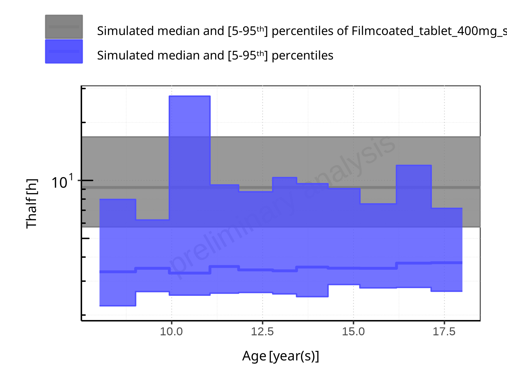


**Figure 2-255: Age-dependence of Thalf for Larson 2013 8y-18y 400mg FCT meal in comparison to Filmcoated_tablet_400mg_sd. Profiles are plotted in a logarithmic scale.**


<br>
<br>


```{=openxml}
<w:br w:type="page"/>
```

`<w:bookmarkStart w:id="figure-2-256" w:name="figure-2-256"/><w:bookmarkEnd w:id="figure-2-256"/>`{=openxml}

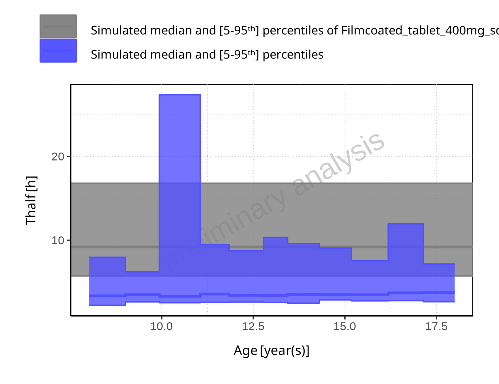


**Figure 2-256: Age-dependence of Thalf for Larson 2013 8y-18y 400mg FCT meal in comparison to Filmcoated_tablet_400mg_sd. Profiles are plotted in a linear scale.**


<br>
<br>


```{=openxml}
<w:br w:type="page"/>
```

`<w:bookmarkStart w:id="figure-2-257" w:name="figure-2-257"/><w:bookmarkEnd w:id="figure-2-257"/>`{=openxml}

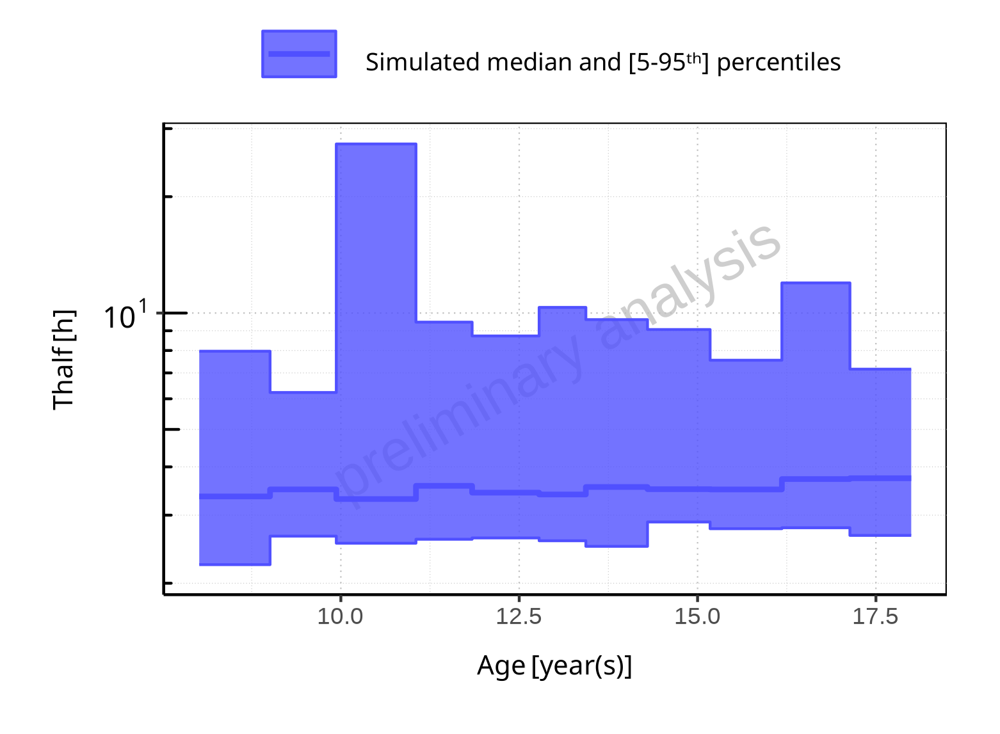


**Figure 2-257: Age-dependence of Thalf for Larson 2013 8y-18y 400mg FCT meal. Profiles are plotted in a logarithmic scale.**


<br>
<br>


```{=openxml}
<w:br w:type="page"/>
```

`<w:bookmarkStart w:id="figure-2-258" w:name="figure-2-258"/><w:bookmarkEnd w:id="figure-2-258"/>`{=openxml}

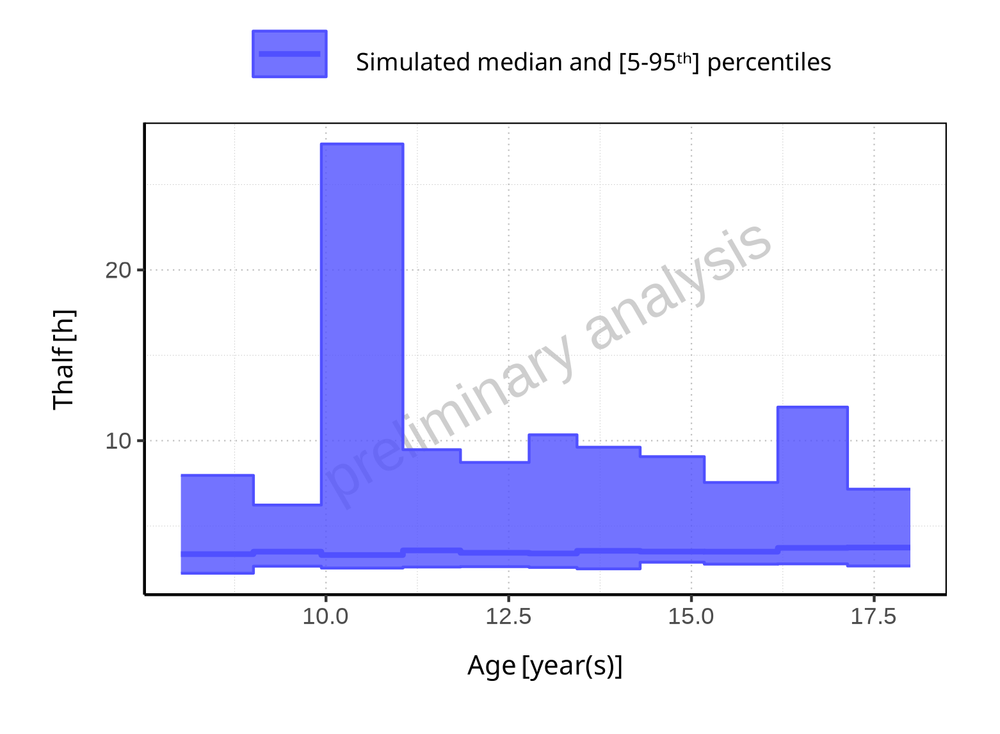


**Figure 2-258: Age-dependence of Thalf for Larson 2013 8y-18y 400mg FCT meal. Profiles are plotted in a linear scale.**


<br>
<br>


```{=openxml}
<w:br w:type="page"/>
```

`<w:bookmarkStart w:id="figure-2-259" w:name="figure-2-259"/><w:bookmarkEnd w:id="figure-2-259"/>`{=openxml}

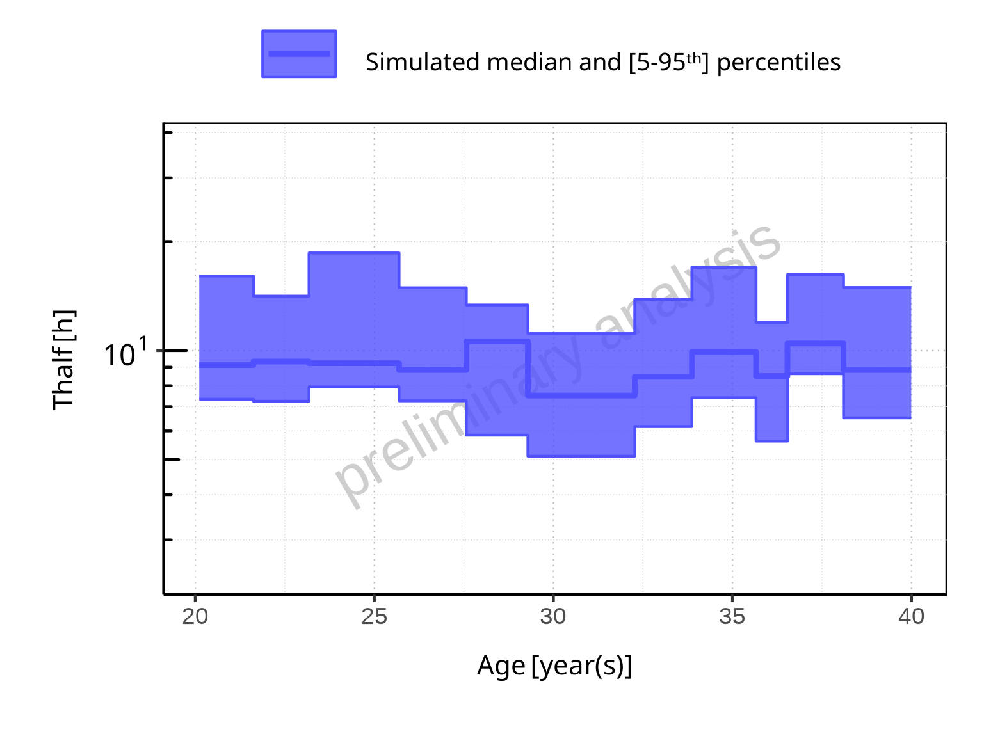


**Figure 2-259: Age-dependence of Thalf for Filmcoated_tablet_400mg_sd. Profiles are plotted in a logarithmic scale.**


<br>
<br>


```{=openxml}
<w:br w:type="page"/>
```

`<w:bookmarkStart w:id="figure-2-260" w:name="figure-2-260"/><w:bookmarkEnd w:id="figure-2-260"/>`{=openxml}

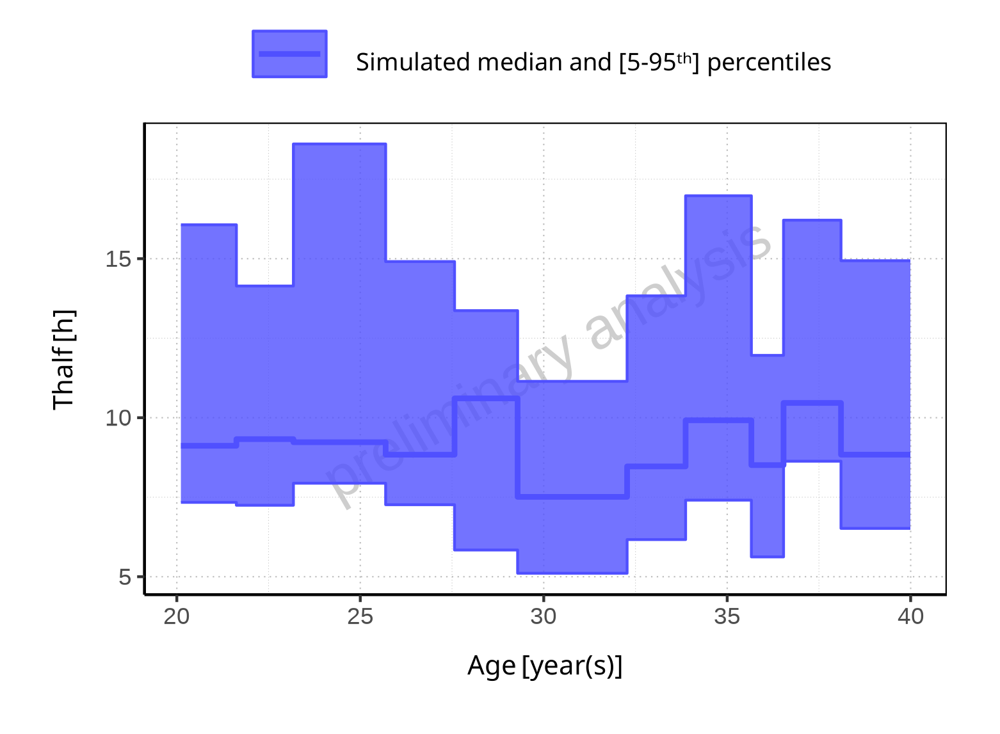


**Figure 2-260: Age-dependence of Thalf for Filmcoated_tablet_400mg_sd. Profiles are plotted in a linear scale.**


<br>
<br>


```{=openxml}
<w:br w:type="page"/>
```

`<w:bookmarkStart w:id="figure-2-261" w:name="figure-2-261"/><w:bookmarkEnd w:id="figure-2-261"/>`{=openxml}

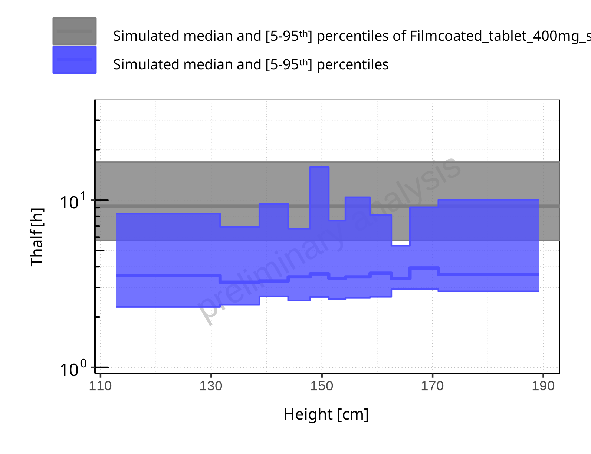


**Figure 2-261: Height-dependence of Thalf for Larson 2013 8y-18y 400mg FCT meal in comparison to Filmcoated_tablet_400mg_sd. Profiles are plotted in a logarithmic scale.**


<br>
<br>


```{=openxml}
<w:br w:type="page"/>
```

`<w:bookmarkStart w:id="figure-2-262" w:name="figure-2-262"/><w:bookmarkEnd w:id="figure-2-262"/>`{=openxml}

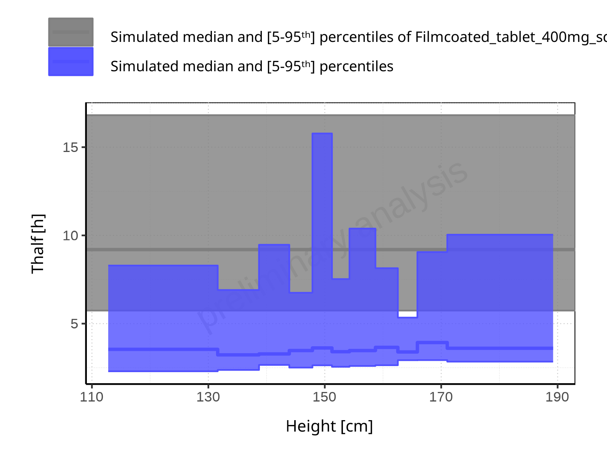


**Figure 2-262: Height-dependence of Thalf for Larson 2013 8y-18y 400mg FCT meal in comparison to Filmcoated_tablet_400mg_sd. Profiles are plotted in a linear scale.**


<br>
<br>


```{=openxml}
<w:br w:type="page"/>
```

`<w:bookmarkStart w:id="figure-2-263" w:name="figure-2-263"/><w:bookmarkEnd w:id="figure-2-263"/>`{=openxml}

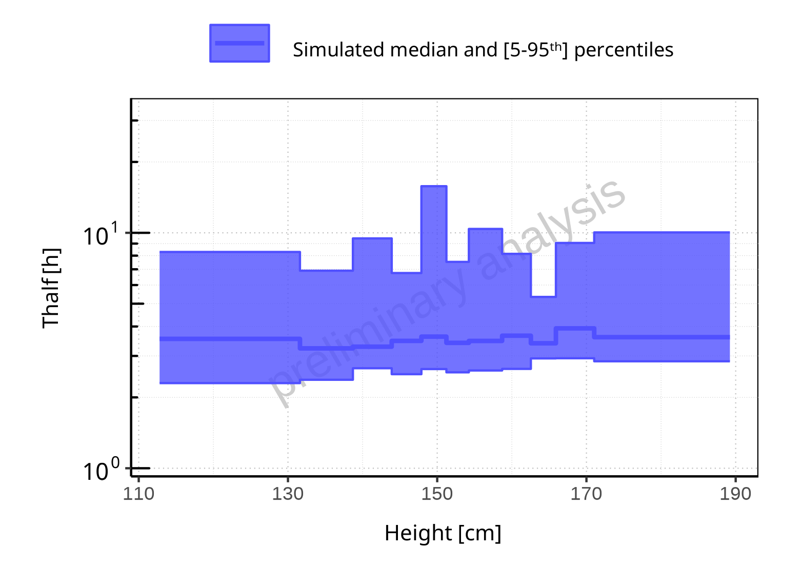


**Figure 2-263: Height-dependence of Thalf for Larson 2013 8y-18y 400mg FCT meal. Profiles are plotted in a logarithmic scale.**


<br>
<br>


```{=openxml}
<w:br w:type="page"/>
```

`<w:bookmarkStart w:id="figure-2-264" w:name="figure-2-264"/><w:bookmarkEnd w:id="figure-2-264"/>`{=openxml}

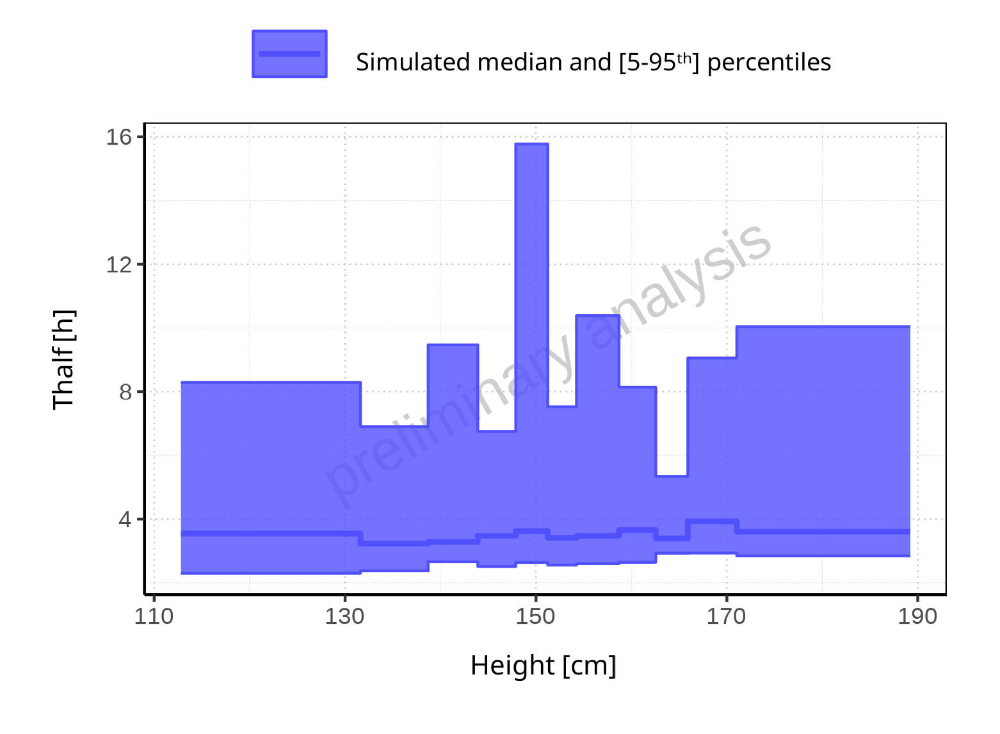


**Figure 2-264: Height-dependence of Thalf for Larson 2013 8y-18y 400mg FCT meal. Profiles are plotted in a linear scale.**


<br>
<br>


```{=openxml}
<w:br w:type="page"/>
```

`<w:bookmarkStart w:id="figure-2-265" w:name="figure-2-265"/><w:bookmarkEnd w:id="figure-2-265"/>`{=openxml}

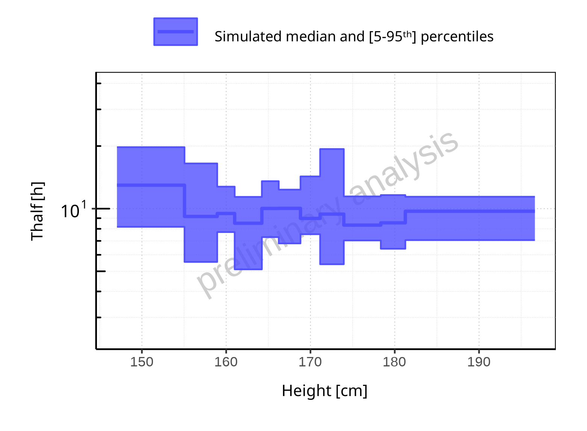


**Figure 2-265: Height-dependence of Thalf for Filmcoated_tablet_400mg_sd. Profiles are plotted in a logarithmic scale.**


<br>
<br>


```{=openxml}
<w:br w:type="page"/>
```

`<w:bookmarkStart w:id="figure-2-266" w:name="figure-2-266"/><w:bookmarkEnd w:id="figure-2-266"/>`{=openxml}

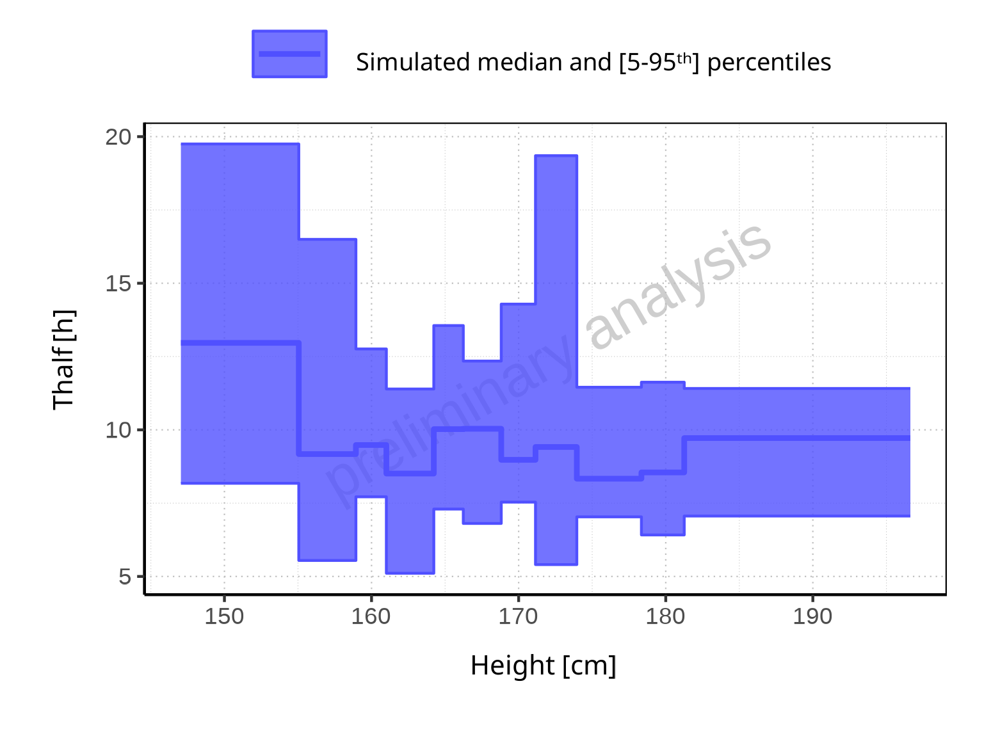


**Figure 2-266: Height-dependence of Thalf for Filmcoated_tablet_400mg_sd. Profiles are plotted in a linear scale.**


<br>
<br>


```{=openxml}
<w:br w:type="page"/>
```

`<w:bookmarkStart w:id="figure-2-267" w:name="figure-2-267"/><w:bookmarkEnd w:id="figure-2-267"/>`{=openxml}

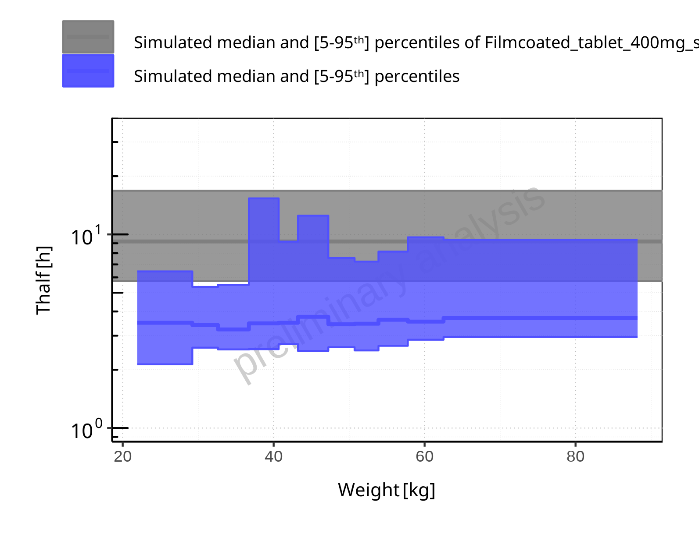


**Figure 2-267: Weight-dependence of Thalf for Larson 2013 8y-18y 400mg FCT meal in comparison to Filmcoated_tablet_400mg_sd. Profiles are plotted in a logarithmic scale.**


<br>
<br>


```{=openxml}
<w:br w:type="page"/>
```

`<w:bookmarkStart w:id="figure-2-268" w:name="figure-2-268"/><w:bookmarkEnd w:id="figure-2-268"/>`{=openxml}

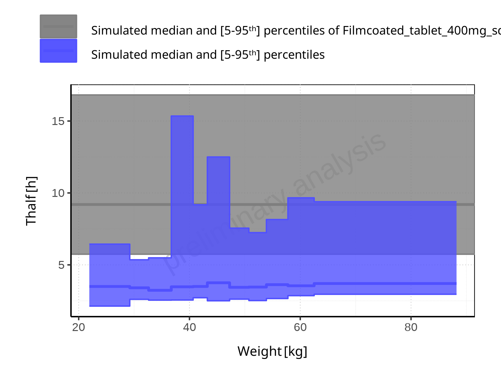


**Figure 2-268: Weight-dependence of Thalf for Larson 2013 8y-18y 400mg FCT meal in comparison to Filmcoated_tablet_400mg_sd. Profiles are plotted in a linear scale.**


<br>
<br>


```{=openxml}
<w:br w:type="page"/>
```

`<w:bookmarkStart w:id="figure-2-269" w:name="figure-2-269"/><w:bookmarkEnd w:id="figure-2-269"/>`{=openxml}

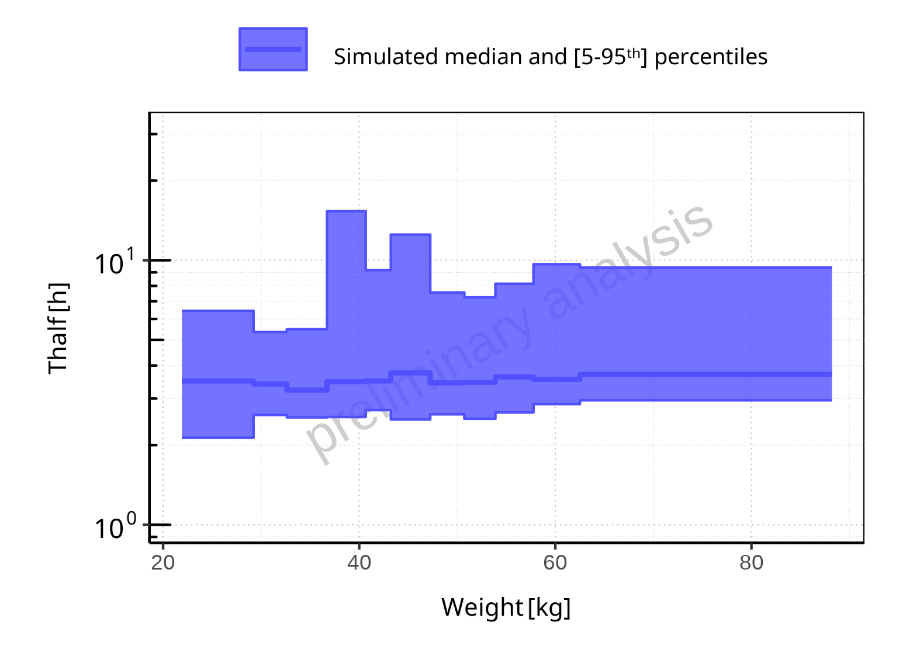


**Figure 2-269: Weight-dependence of Thalf for Larson 2013 8y-18y 400mg FCT meal. Profiles are plotted in a logarithmic scale.**


<br>
<br>


```{=openxml}
<w:br w:type="page"/>
```

`<w:bookmarkStart w:id="figure-2-270" w:name="figure-2-270"/><w:bookmarkEnd w:id="figure-2-270"/>`{=openxml}

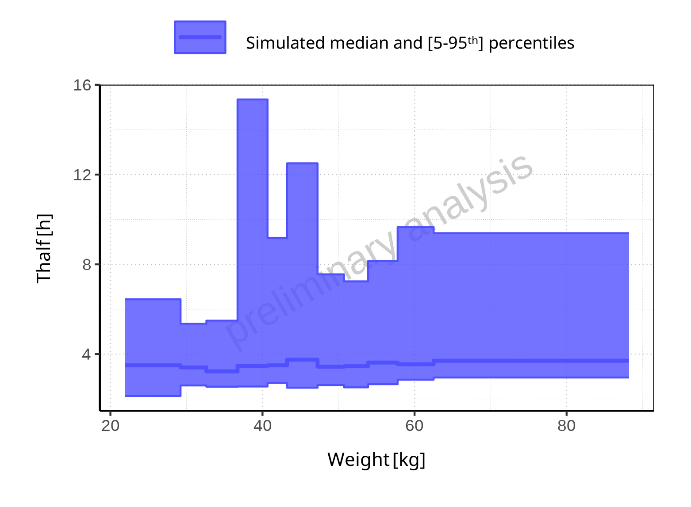


**Figure 2-270: Weight-dependence of Thalf for Larson 2013 8y-18y 400mg FCT meal. Profiles are plotted in a linear scale.**


<br>
<br>


```{=openxml}
<w:br w:type="page"/>
```

`<w:bookmarkStart w:id="figure-2-271" w:name="figure-2-271"/><w:bookmarkEnd w:id="figure-2-271"/>`{=openxml}

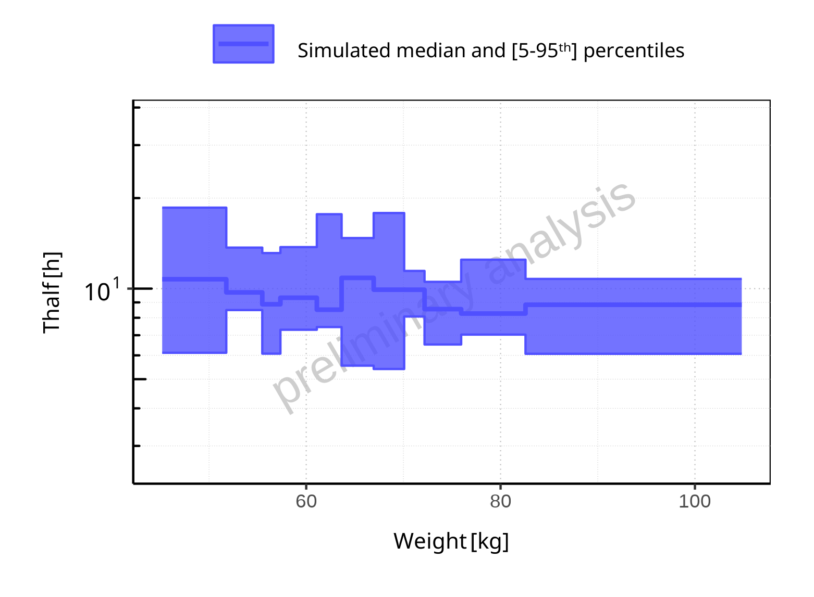


**Figure 2-271: Weight-dependence of Thalf for Filmcoated_tablet_400mg_sd. Profiles are plotted in a logarithmic scale.**


<br>
<br>


```{=openxml}
<w:br w:type="page"/>
```

`<w:bookmarkStart w:id="figure-2-272" w:name="figure-2-272"/><w:bookmarkEnd w:id="figure-2-272"/>`{=openxml}

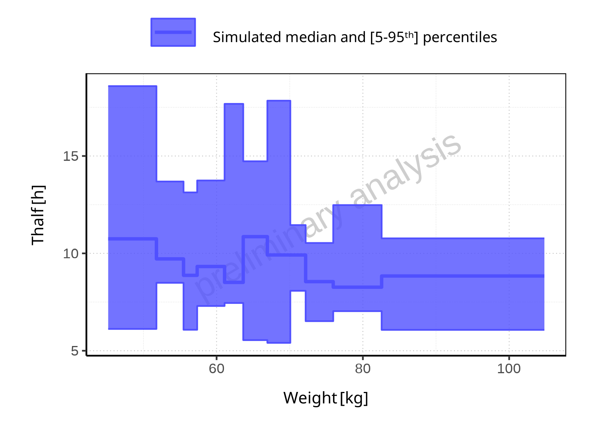


**Figure 2-272: Weight-dependence of Thalf for Filmcoated_tablet_400mg_sd. Profiles are plotted in a linear scale.**


<br>
<br>


```{=openxml}
<w:br w:type="page"/>
```

`<w:bookmarkStart w:id="figure-2-273" w:name="figure-2-273"/><w:bookmarkEnd w:id="figure-2-273"/>`{=openxml}

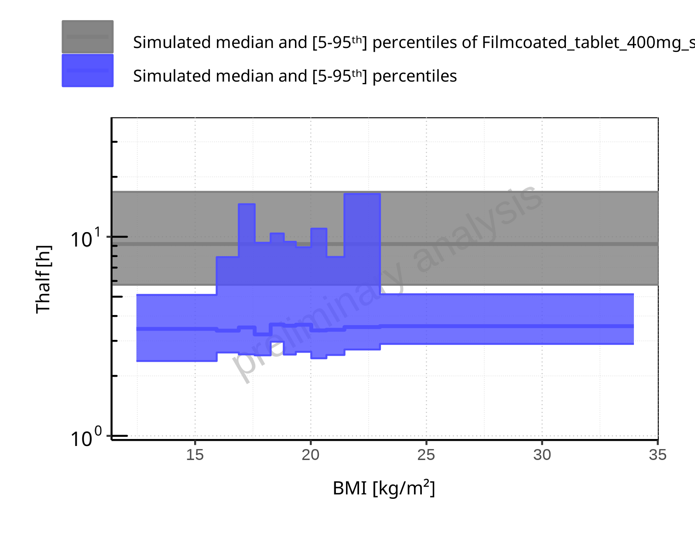


**Figure 2-273: BMI-dependence of Thalf for Larson 2013 8y-18y 400mg FCT meal in comparison to Filmcoated_tablet_400mg_sd. Profiles are plotted in a logarithmic scale.**


<br>
<br>


```{=openxml}
<w:br w:type="page"/>
```

`<w:bookmarkStart w:id="figure-2-274" w:name="figure-2-274"/><w:bookmarkEnd w:id="figure-2-274"/>`{=openxml}

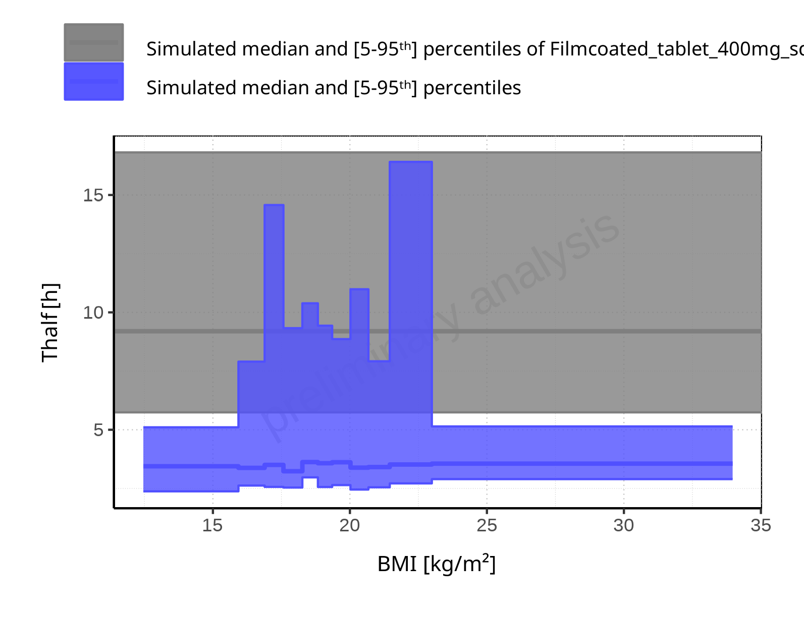


**Figure 2-274: BMI-dependence of Thalf for Larson 2013 8y-18y 400mg FCT meal in comparison to Filmcoated_tablet_400mg_sd. Profiles are plotted in a linear scale.**


<br>
<br>


```{=openxml}
<w:br w:type="page"/>
```

`<w:bookmarkStart w:id="figure-2-275" w:name="figure-2-275"/><w:bookmarkEnd w:id="figure-2-275"/>`{=openxml}

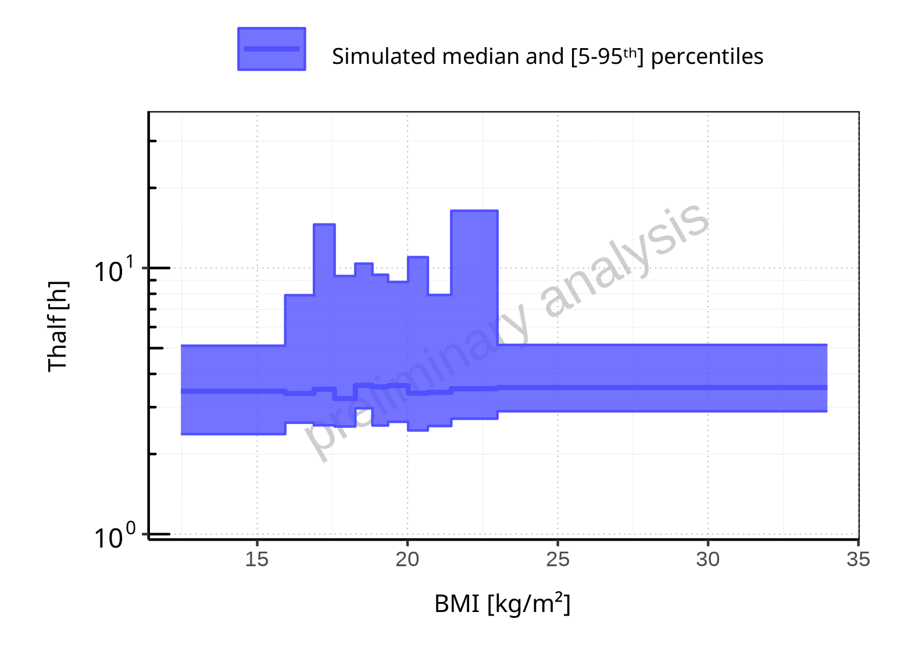


**Figure 2-275: BMI-dependence of Thalf for Larson 2013 8y-18y 400mg FCT meal. Profiles are plotted in a logarithmic scale.**


<br>
<br>


```{=openxml}
<w:br w:type="page"/>
```

`<w:bookmarkStart w:id="figure-2-276" w:name="figure-2-276"/><w:bookmarkEnd w:id="figure-2-276"/>`{=openxml}

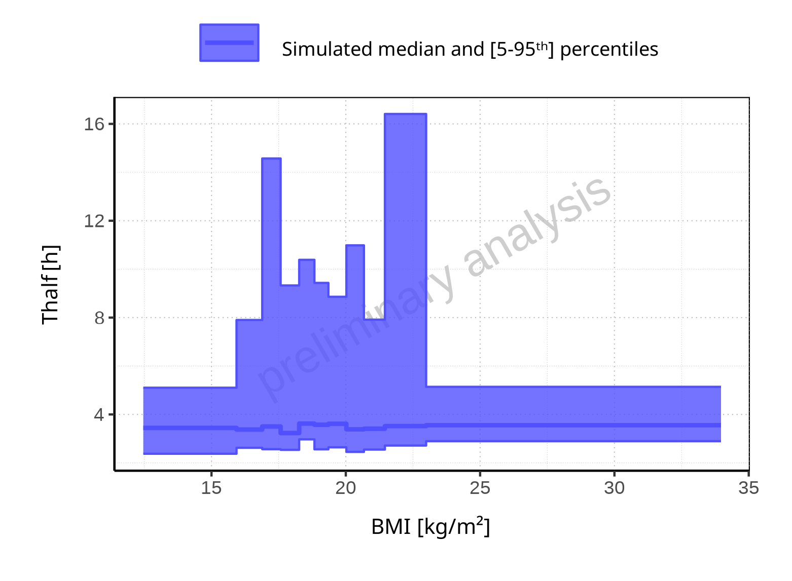


**Figure 2-276: BMI-dependence of Thalf for Larson 2013 8y-18y 400mg FCT meal. Profiles are plotted in a linear scale.**


<br>
<br>


```{=openxml}
<w:br w:type="page"/>
```

`<w:bookmarkStart w:id="figure-2-277" w:name="figure-2-277"/><w:bookmarkEnd w:id="figure-2-277"/>`{=openxml}

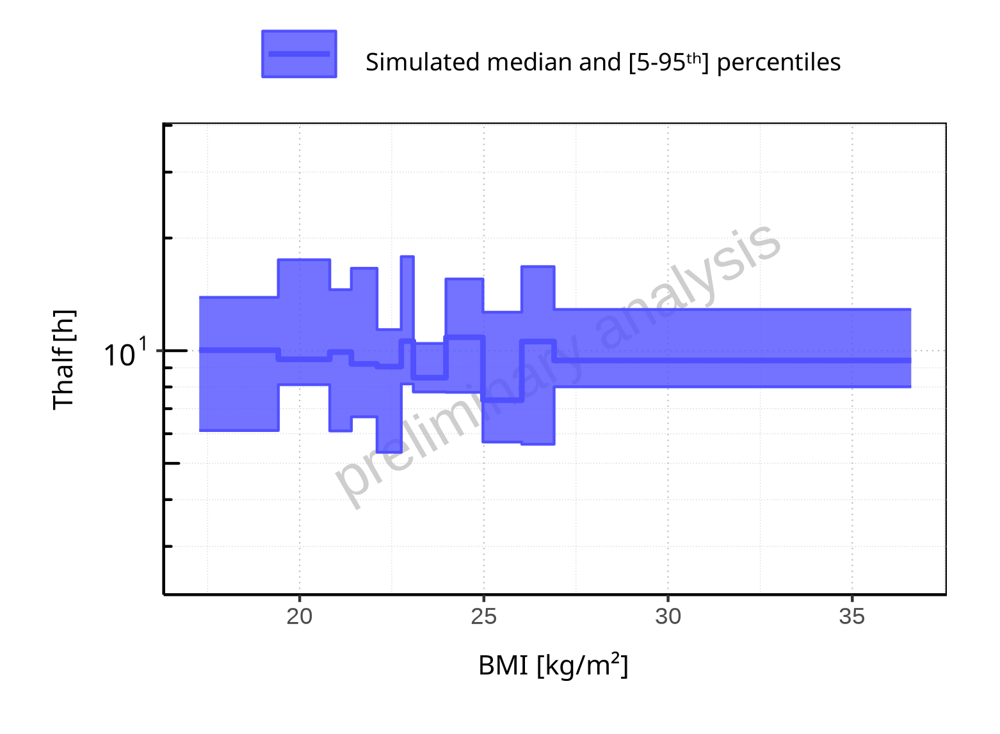


**Figure 2-277: BMI-dependence of Thalf for Filmcoated_tablet_400mg_sd. Profiles are plotted in a logarithmic scale.**


<br>
<br>


```{=openxml}
<w:br w:type="page"/>
```

`<w:bookmarkStart w:id="figure-2-278" w:name="figure-2-278"/><w:bookmarkEnd w:id="figure-2-278"/>`{=openxml}


**Figure 2-278: BMI-dependence of Thalf for Filmcoated_tablet_400mg_sd. Profiles are plotted in a linear scale.**


<br>
<br>


```{=openxml}
<w:br w:type="page"/>
```

`<w:bookmarkStart w:id="figure-2-279" w:name="figure-2-279"/><w:bookmarkEnd w:id="figure-2-279"/>`{=openxml}

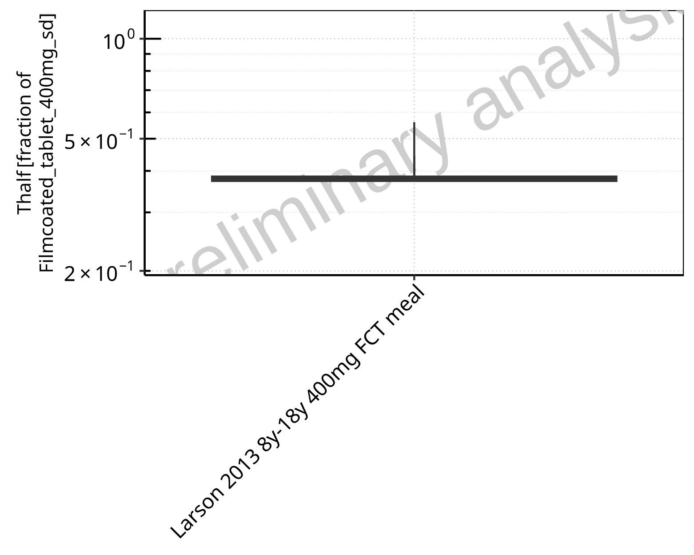


**Figure 2-279: Ratio of population summary statistics of Thalf of Raltegravir  for  Larson 2013 8y-18y 400mg FCT meal in comparison to Filmcoated_tablet_400mg_sd shown as box-whisker plot, which indicates ratios of the 5^th^, 25^th^, 50^th^, 75^th^, 95^th^ percentiles in logarithmic scale.**


<br>
<br>


```{=openxml}
<w:br w:type="page"/>
```

`<w:bookmarkStart w:id="figure-2-280" w:name="figure-2-280"/><w:bookmarkEnd w:id="figure-2-280"/>`{=openxml}

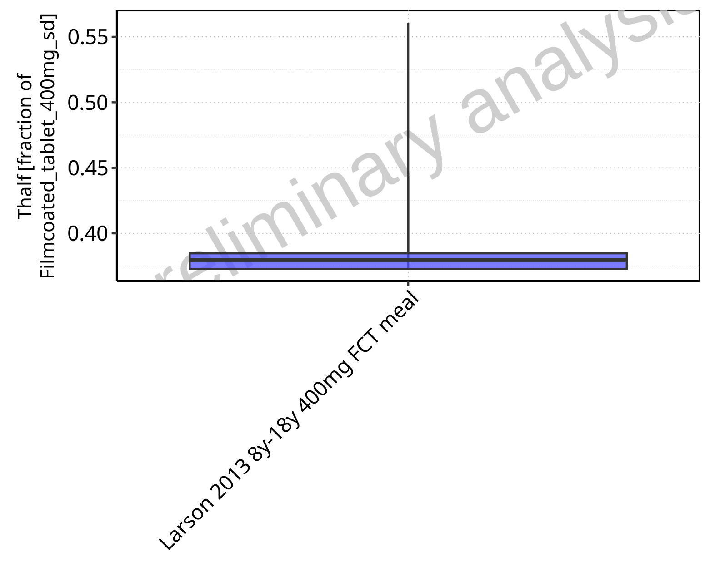


**Figure 2-280: Ratio of population summary statistics of Thalf of Raltegravir  for  Larson 2013 8y-18y 400mg FCT meal in comparison to Filmcoated_tablet_400mg_sd shown as box-whisker plot, which indicates ratios of the 5^th^, 25^th^, 50^th^, 75^th^, 95^th^ percentiles in linear scale.**


<br>
<br>


```{=openxml}
<w:br w:type="page"/>
```

`<w:bookmarkStart w:id="table-2-20" w:name="table-2-20"/><w:bookmarkEnd w:id="table-2-20"/>`{=openxml}

**Table 2-20: Ratio of population summary statistics of Thalf of Raltegravir  for  Larson 2013 8y-18y 400mg FCT meal in comparison to Filmcoated_tablet_400mg_sd**


|Population                        |N   |5^th^ pctl |25^th^ pctl |50^th^ pctl |75^th^ pctl |95^th^ pctl |Mean |SD   |Geo Mean |Geo SD |
|:---------------------------------|:---|:-------------------|:--------------------|:--------------------|:--------------------|:--------------------|:----|:----|:--------|:------|
|Larson 2013 8y-18y 400mg FCT meal |500 |0.44                |0.37                 |0.38                 |0.38                 |0.56                 |0.39 |3.30 |-       |-     |


<br>
<br>


### CL `<w:bookmarkStart w:id="292_pk_parameters_organism_peripheralvenousblood_raltegravir_plasma__peripheral_venous_blood__cl" w:name="292_pk_parameters_organism_peripheralvenousblood_raltegravir_plasma__peripheral_venous_blood__cl"/><w:bookmarkEnd w:id="292_pk_parameters_organism_peripheralvenousblood_raltegravir_plasma__peripheral_venous_blood__cl"/>`{=openxml}


```{=openxml}
<w:br w:type="page"/>
```

`<w:bookmarkStart w:id="figure-2-281" w:name="figure-2-281"/><w:bookmarkEnd w:id="figure-2-281"/>`{=openxml}

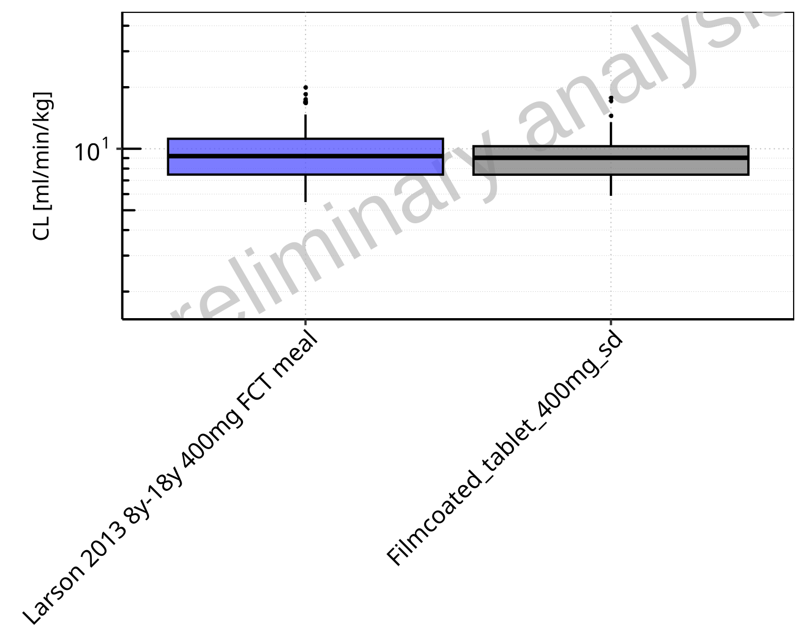


**Figure 2-281: CL of Raltegravir for Larson 2013 8y-18y 400mg FCT meal, Filmcoated_tablet_400mg_sd shown as box-whisker plot, which indicates  the 5^th^, 25^th^, 50^th^, 75^th^, 95^th^ percentiles in logarithmic scale.**


<br>
<br>


```{=openxml}
<w:br w:type="page"/>
```

`<w:bookmarkStart w:id="figure-2-282" w:name="figure-2-282"/><w:bookmarkEnd w:id="figure-2-282"/>`{=openxml}

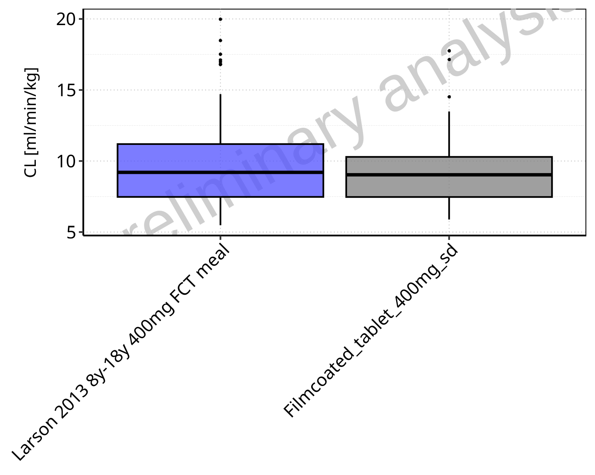


**Figure 2-282: CL of Raltegravir for Larson 2013 8y-18y 400mg FCT meal, Filmcoated_tablet_400mg_sd shown as box-whisker plot, which indicates  the 5^th^, 25^th^, 50^th^, 75^th^, 95^th^ percentiles in linear scale.**


<br>
<br>


```{=openxml}
<w:br w:type="page"/>
```

`<w:bookmarkStart w:id="table-2-21" w:name="table-2-21"/><w:bookmarkEnd w:id="table-2-21"/>`{=openxml}

**Table 2-21: Population statistics summarizing CL of Raltegravir for Larson 2013 8y-18y 400mg FCT meal, Filmcoated_tablet_400mg_sd reported in [ml/min/kg]**


|Population                        |N   |5^th^ pctl |25^th^ pctl |50^th^ pctl |75^th^ pctl |95^th^ pctl |Mean |SD   |Geo Mean |Geo SD |
|:---------------------------------|:---|:-------------------|:--------------------|:--------------------|:--------------------|:--------------------|:----|:----|:--------|:------|
|Larson 2013 8y-18y 400mg FCT meal |497 |5.48                |7.47                 |9.20                 |11.19                |14.71                |9.49 |2.84 |9.08     |1.35   |
|Filmcoated_tablet_400mg_sd        |100 |5.88                |7.47                 |9.03                 |10.29                |13.49                |9.20 |2.50 |8.89     |1.30   |


<br>
<br>


```{=openxml}
<w:br w:type="page"/>
```

`<w:bookmarkStart w:id="figure-2-283" w:name="figure-2-283"/><w:bookmarkEnd w:id="figure-2-283"/>`{=openxml}

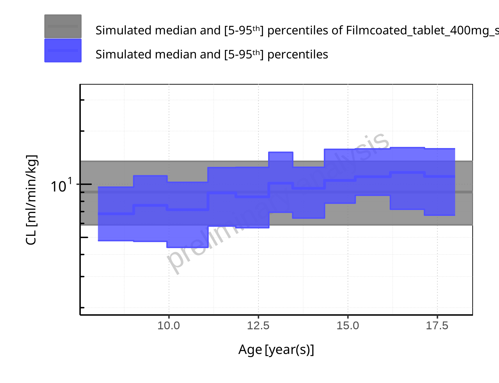


**Figure 2-283: Age-dependence of CL for Larson 2013 8y-18y 400mg FCT meal in comparison to Filmcoated_tablet_400mg_sd. Profiles are plotted in a logarithmic scale.**


<br>
<br>


```{=openxml}
<w:br w:type="page"/>
```

`<w:bookmarkStart w:id="figure-2-284" w:name="figure-2-284"/><w:bookmarkEnd w:id="figure-2-284"/>`{=openxml}

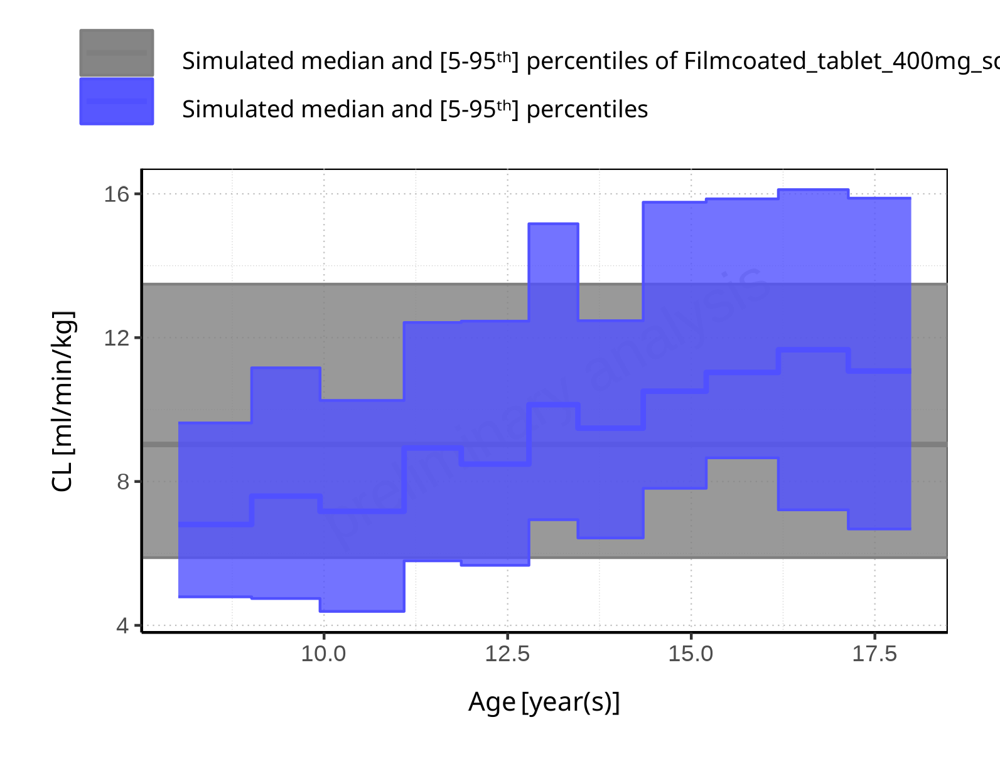


**Figure 2-284: Age-dependence of CL for Larson 2013 8y-18y 400mg FCT meal in comparison to Filmcoated_tablet_400mg_sd. Profiles are plotted in a linear scale.**


<br>
<br>


```{=openxml}
<w:br w:type="page"/>
```

`<w:bookmarkStart w:id="figure-2-285" w:name="figure-2-285"/><w:bookmarkEnd w:id="figure-2-285"/>`{=openxml}

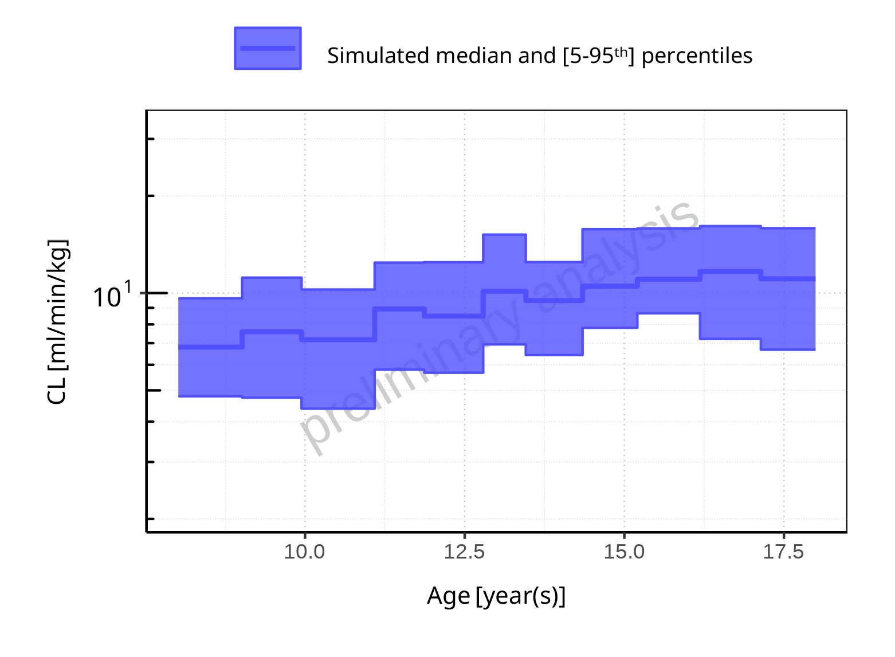


**Figure 2-285: Age-dependence of CL for Larson 2013 8y-18y 400mg FCT meal. Profiles are plotted in a logarithmic scale.**


<br>
<br>


```{=openxml}
<w:br w:type="page"/>
```

`<w:bookmarkStart w:id="figure-2-286" w:name="figure-2-286"/><w:bookmarkEnd w:id="figure-2-286"/>`{=openxml}

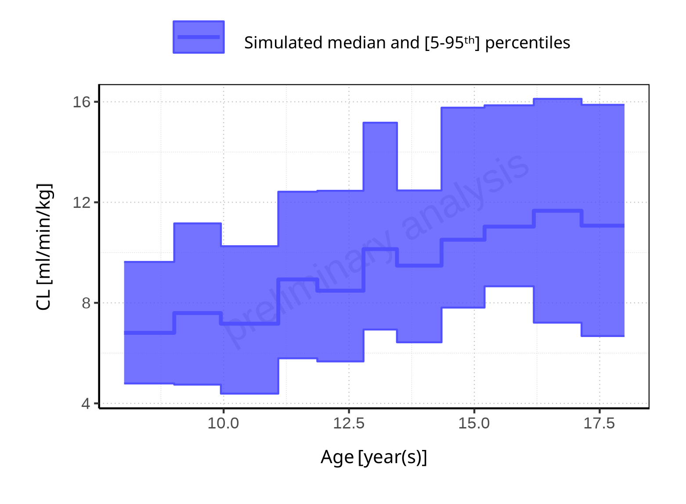


**Figure 2-286: Age-dependence of CL for Larson 2013 8y-18y 400mg FCT meal. Profiles are plotted in a linear scale.**


<br>
<br>


```{=openxml}
<w:br w:type="page"/>
```

`<w:bookmarkStart w:id="figure-2-287" w:name="figure-2-287"/><w:bookmarkEnd w:id="figure-2-287"/>`{=openxml}

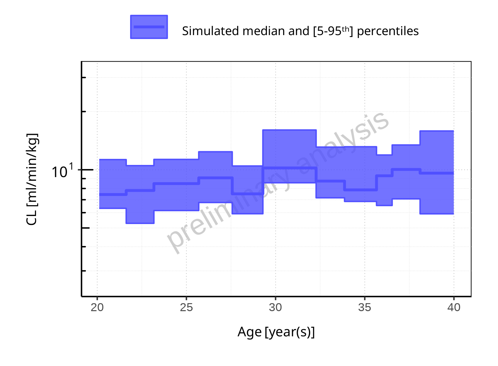


**Figure 2-287: Age-dependence of CL for Filmcoated_tablet_400mg_sd. Profiles are plotted in a logarithmic scale.**


<br>
<br>


```{=openxml}
<w:br w:type="page"/>
```

`<w:bookmarkStart w:id="figure-2-288" w:name="figure-2-288"/><w:bookmarkEnd w:id="figure-2-288"/>`{=openxml}

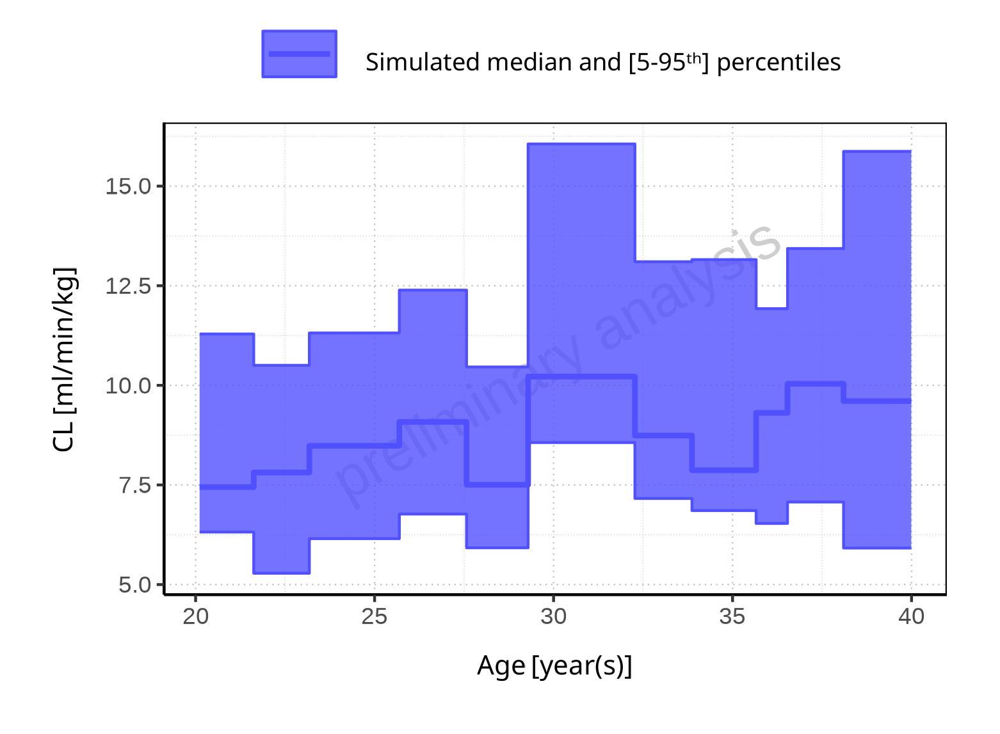


**Figure 2-288: Age-dependence of CL for Filmcoated_tablet_400mg_sd. Profiles are plotted in a linear scale.**


<br>
<br>


```{=openxml}
<w:br w:type="page"/>
```

`<w:bookmarkStart w:id="figure-2-289" w:name="figure-2-289"/><w:bookmarkEnd w:id="figure-2-289"/>`{=openxml}

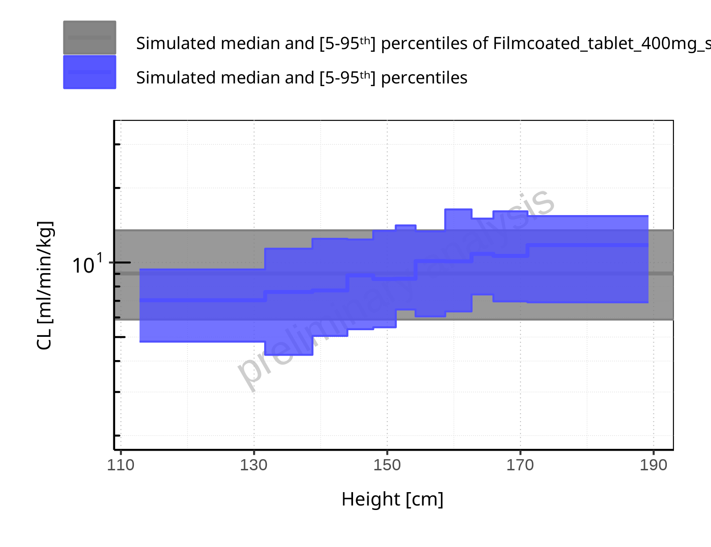


**Figure 2-289: Height-dependence of CL for Larson 2013 8y-18y 400mg FCT meal in comparison to Filmcoated_tablet_400mg_sd. Profiles are plotted in a logarithmic scale.**


<br>
<br>


```{=openxml}
<w:br w:type="page"/>
```

`<w:bookmarkStart w:id="figure-2-290" w:name="figure-2-290"/><w:bookmarkEnd w:id="figure-2-290"/>`{=openxml}

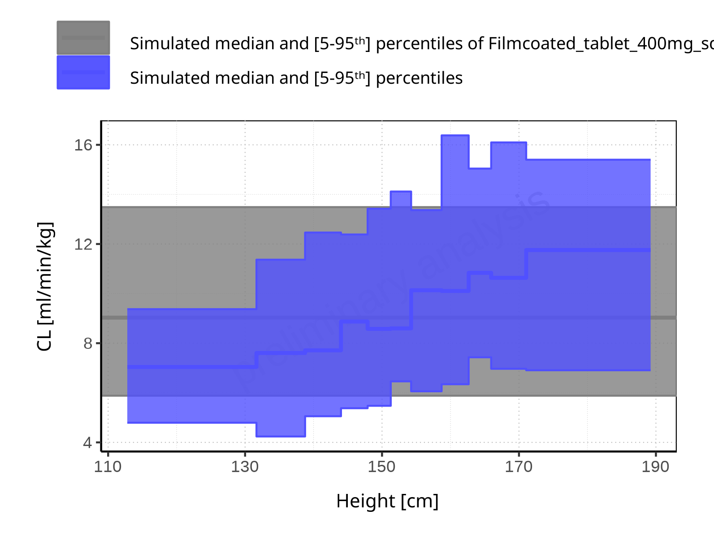


**Figure 2-290: Height-dependence of CL for Larson 2013 8y-18y 400mg FCT meal in comparison to Filmcoated_tablet_400mg_sd. Profiles are plotted in a linear scale.**


<br>
<br>


```{=openxml}
<w:br w:type="page"/>
```

`<w:bookmarkStart w:id="figure-2-291" w:name="figure-2-291"/><w:bookmarkEnd w:id="figure-2-291"/>`{=openxml}

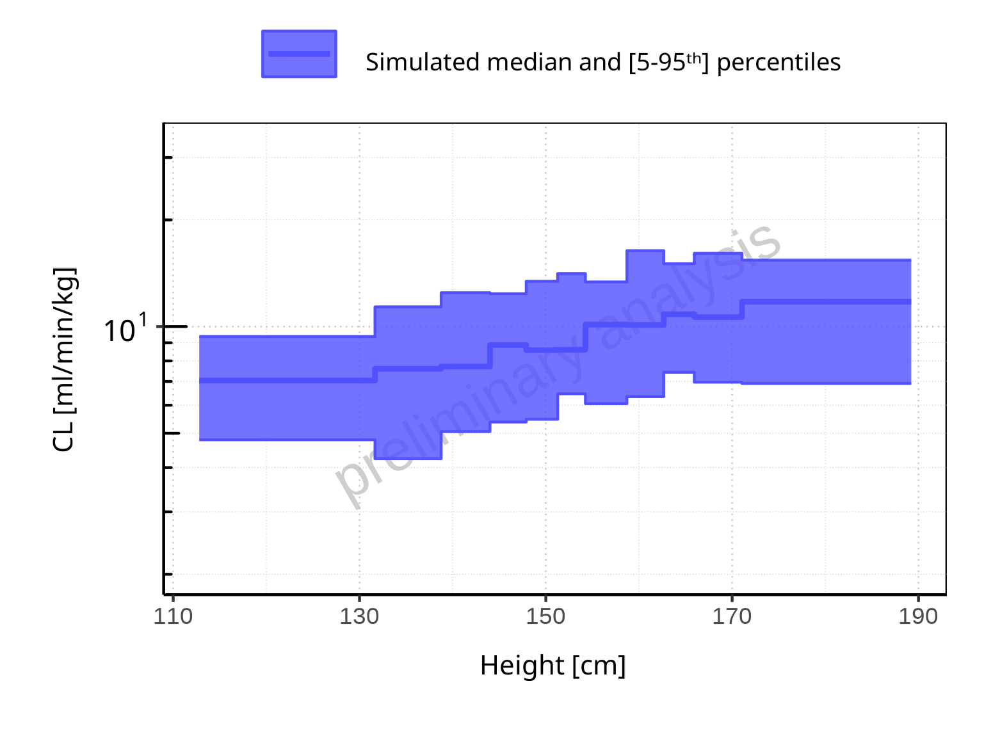


**Figure 2-291: Height-dependence of CL for Larson 2013 8y-18y 400mg FCT meal. Profiles are plotted in a logarithmic scale.**


<br>
<br>


```{=openxml}
<w:br w:type="page"/>
```

`<w:bookmarkStart w:id="figure-2-292" w:name="figure-2-292"/><w:bookmarkEnd w:id="figure-2-292"/>`{=openxml}

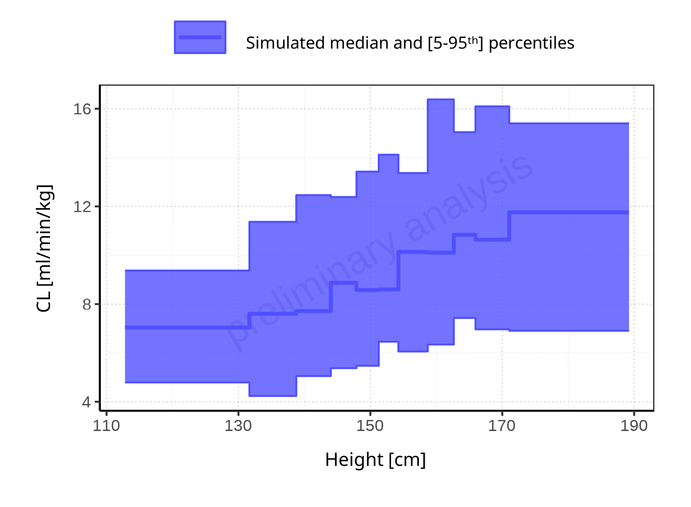


**Figure 2-292: Height-dependence of CL for Larson 2013 8y-18y 400mg FCT meal. Profiles are plotted in a linear scale.**


<br>
<br>


```{=openxml}
<w:br w:type="page"/>
```

`<w:bookmarkStart w:id="figure-2-293" w:name="figure-2-293"/><w:bookmarkEnd w:id="figure-2-293"/>`{=openxml}

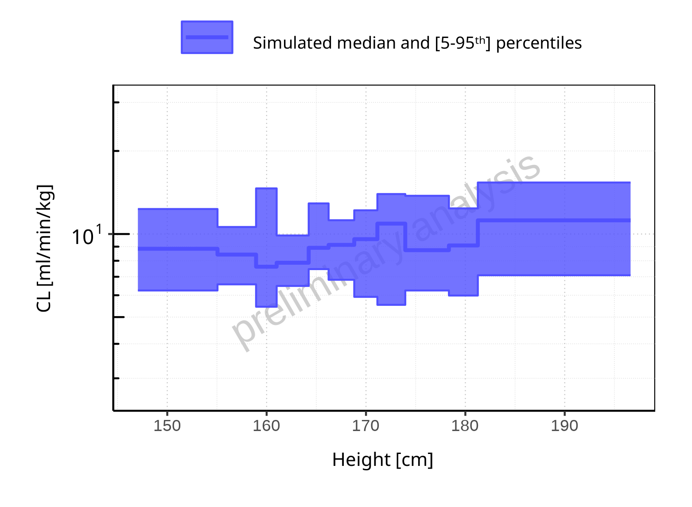


**Figure 2-293: Height-dependence of CL for Filmcoated_tablet_400mg_sd. Profiles are plotted in a logarithmic scale.**


<br>
<br>


```{=openxml}
<w:br w:type="page"/>
```

`<w:bookmarkStart w:id="figure-2-294" w:name="figure-2-294"/><w:bookmarkEnd w:id="figure-2-294"/>`{=openxml}

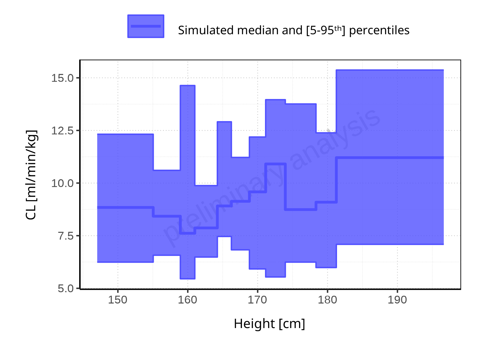


**Figure 2-294: Height-dependence of CL for Filmcoated_tablet_400mg_sd. Profiles are plotted in a linear scale.**


<br>
<br>


```{=openxml}
<w:br w:type="page"/>
```

`<w:bookmarkStart w:id="figure-2-295" w:name="figure-2-295"/><w:bookmarkEnd w:id="figure-2-295"/>`{=openxml}

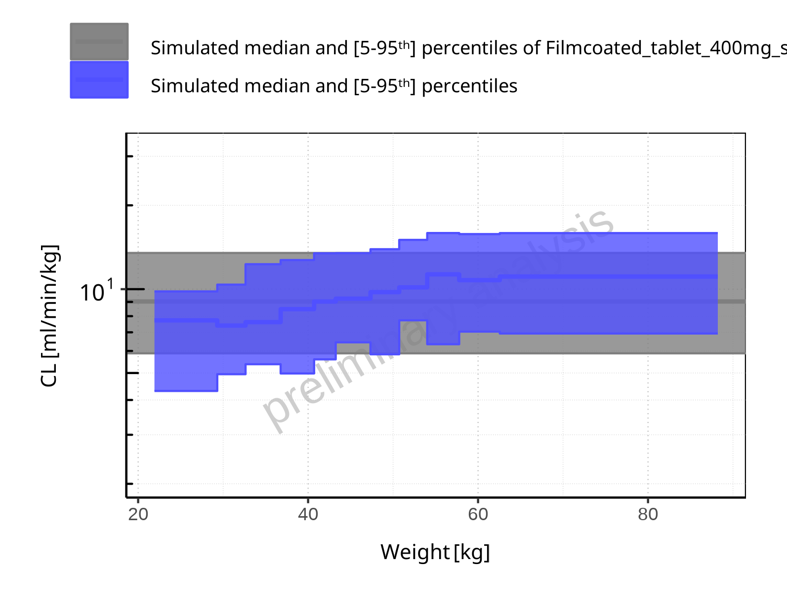


**Figure 2-295: Weight-dependence of CL for Larson 2013 8y-18y 400mg FCT meal in comparison to Filmcoated_tablet_400mg_sd. Profiles are plotted in a logarithmic scale.**


<br>
<br>


```{=openxml}
<w:br w:type="page"/>
```

`<w:bookmarkStart w:id="figure-2-296" w:name="figure-2-296"/><w:bookmarkEnd w:id="figure-2-296"/>`{=openxml}

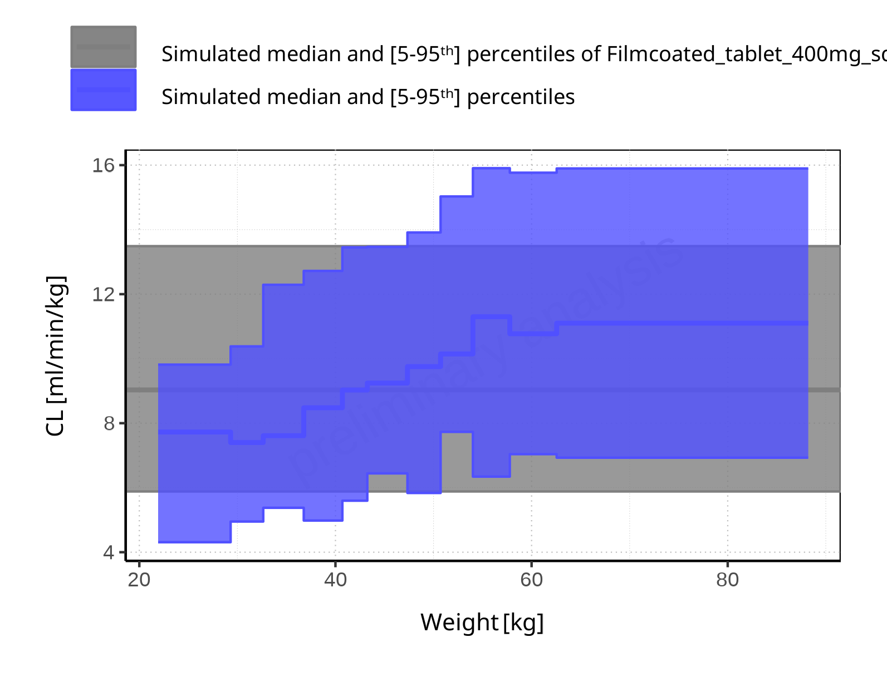


**Figure 2-296: Weight-dependence of CL for Larson 2013 8y-18y 400mg FCT meal in comparison to Filmcoated_tablet_400mg_sd. Profiles are plotted in a linear scale.**


<br>
<br>


```{=openxml}
<w:br w:type="page"/>
```

`<w:bookmarkStart w:id="figure-2-297" w:name="figure-2-297"/><w:bookmarkEnd w:id="figure-2-297"/>`{=openxml}

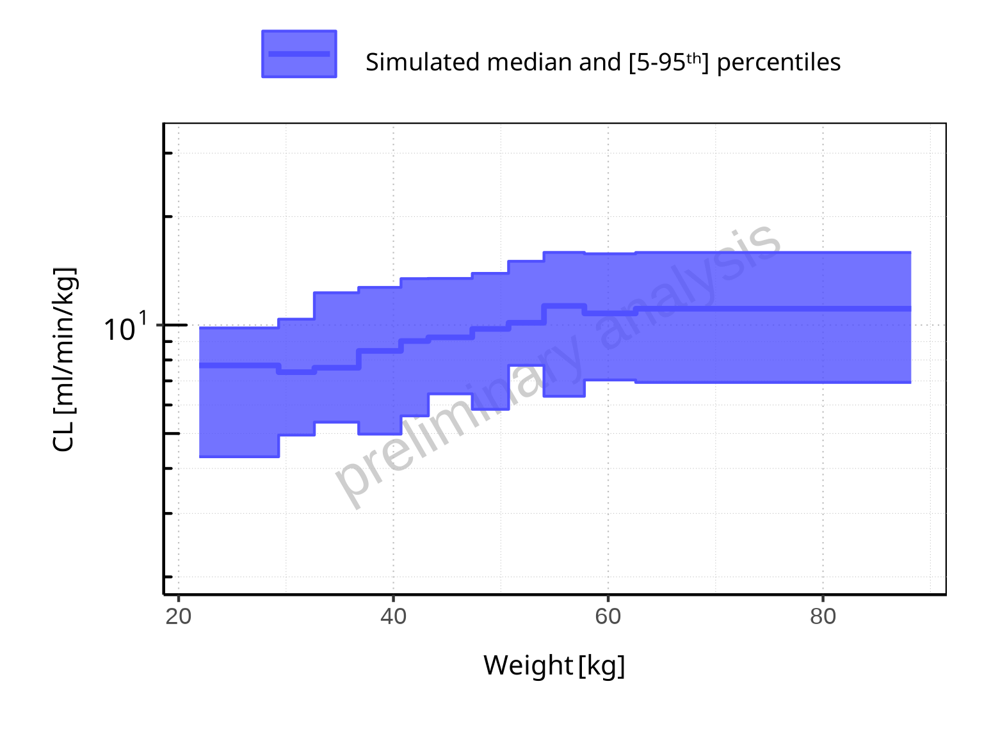


**Figure 2-297: Weight-dependence of CL for Larson 2013 8y-18y 400mg FCT meal. Profiles are plotted in a logarithmic scale.**


<br>
<br>


```{=openxml}
<w:br w:type="page"/>
```

`<w:bookmarkStart w:id="figure-2-298" w:name="figure-2-298"/><w:bookmarkEnd w:id="figure-2-298"/>`{=openxml}

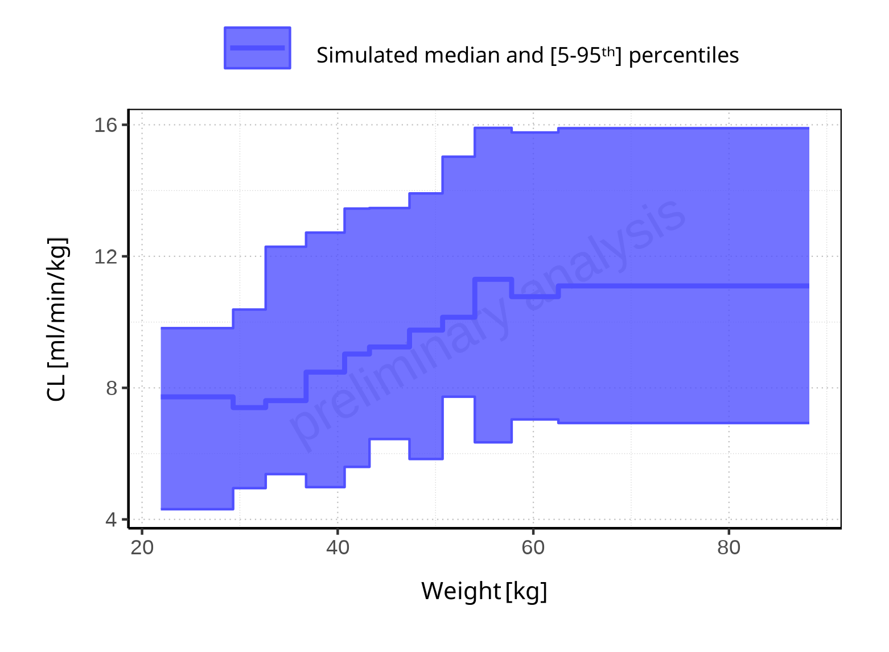


**Figure 2-298: Weight-dependence of CL for Larson 2013 8y-18y 400mg FCT meal. Profiles are plotted in a linear scale.**


<br>
<br>


```{=openxml}
<w:br w:type="page"/>
```

`<w:bookmarkStart w:id="figure-2-299" w:name="figure-2-299"/><w:bookmarkEnd w:id="figure-2-299"/>`{=openxml}

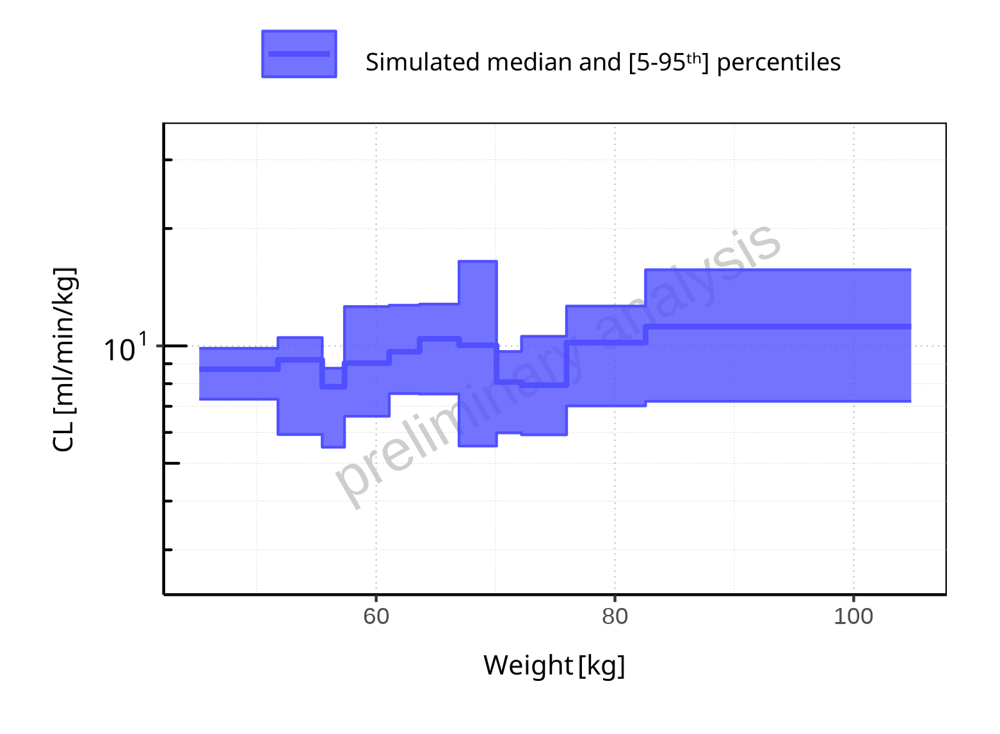


**Figure 2-299: Weight-dependence of CL for Filmcoated_tablet_400mg_sd. Profiles are plotted in a logarithmic scale.**


<br>
<br>


```{=openxml}
<w:br w:type="page"/>
```

`<w:bookmarkStart w:id="figure-2-300" w:name="figure-2-300"/><w:bookmarkEnd w:id="figure-2-300"/>`{=openxml}

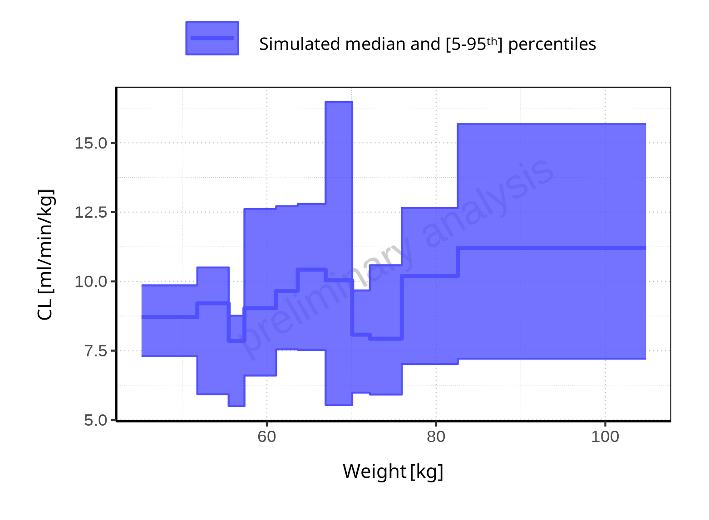


**Figure 2-300: Weight-dependence of CL for Filmcoated_tablet_400mg_sd. Profiles are plotted in a linear scale.**


<br>
<br>


```{=openxml}
<w:br w:type="page"/>
```

`<w:bookmarkStart w:id="figure-2-301" w:name="figure-2-301"/><w:bookmarkEnd w:id="figure-2-301"/>`{=openxml}

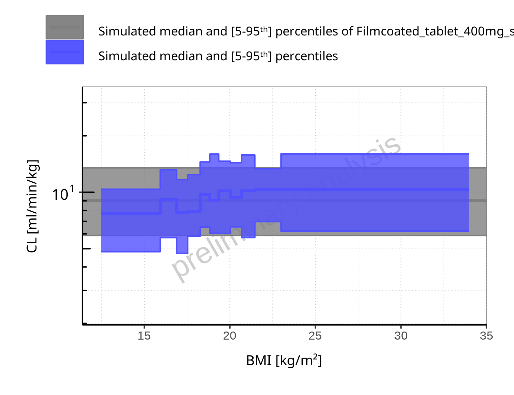


**Figure 2-301: BMI-dependence of CL for Larson 2013 8y-18y 400mg FCT meal in comparison to Filmcoated_tablet_400mg_sd. Profiles are plotted in a logarithmic scale.**


<br>
<br>


```{=openxml}
<w:br w:type="page"/>
```

`<w:bookmarkStart w:id="figure-2-302" w:name="figure-2-302"/><w:bookmarkEnd w:id="figure-2-302"/>`{=openxml}


**Figure 2-302: BMI-dependence of CL for Larson 2013 8y-18y 400mg FCT meal in comparison to Filmcoated_tablet_400mg_sd. Profiles are plotted in a linear scale.**


<br>
<br>


```{=openxml}
<w:br w:type="page"/>
```

`<w:bookmarkStart w:id="figure-2-303" w:name="figure-2-303"/><w:bookmarkEnd w:id="figure-2-303"/>`{=openxml}

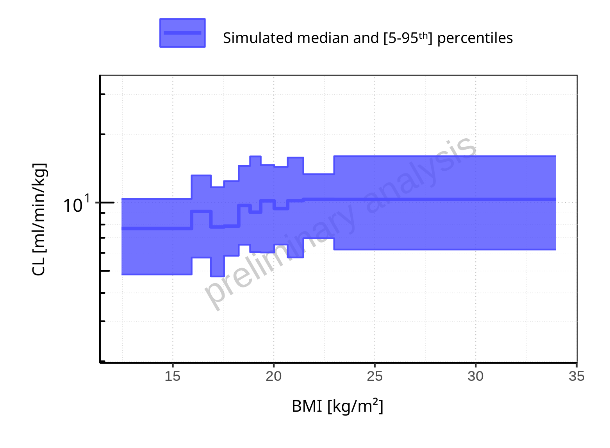


**Figure 2-303: BMI-dependence of CL for Larson 2013 8y-18y 400mg FCT meal. Profiles are plotted in a logarithmic scale.**


<br>
<br>


```{=openxml}
<w:br w:type="page"/>
```

`<w:bookmarkStart w:id="figure-2-304" w:name="figure-2-304"/><w:bookmarkEnd w:id="figure-2-304"/>`{=openxml}

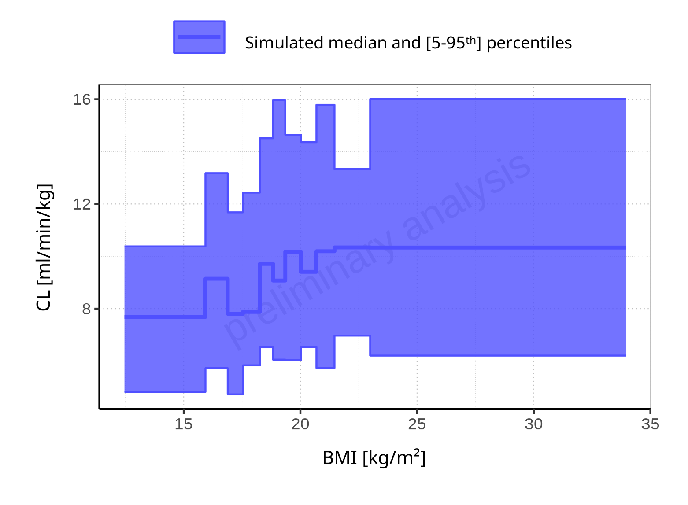


**Figure 2-304: BMI-dependence of CL for Larson 2013 8y-18y 400mg FCT meal. Profiles are plotted in a linear scale.**


<br>
<br>


```{=openxml}
<w:br w:type="page"/>
```

`<w:bookmarkStart w:id="figure-2-305" w:name="figure-2-305"/><w:bookmarkEnd w:id="figure-2-305"/>`{=openxml}

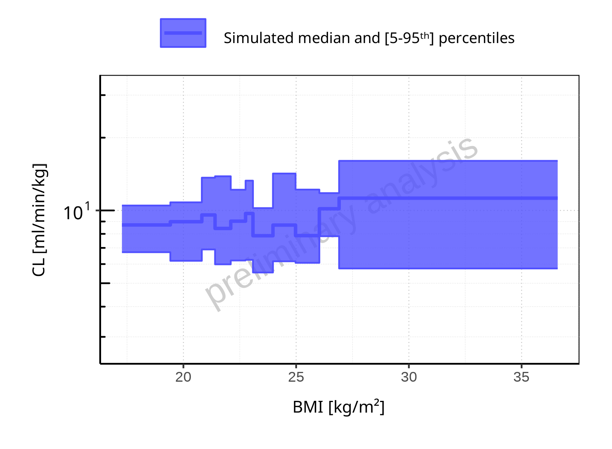


**Figure 2-305: BMI-dependence of CL for Filmcoated_tablet_400mg_sd. Profiles are plotted in a logarithmic scale.**


<br>
<br>


```{=openxml}
<w:br w:type="page"/>
```

`<w:bookmarkStart w:id="figure-2-306" w:name="figure-2-306"/><w:bookmarkEnd w:id="figure-2-306"/>`{=openxml}

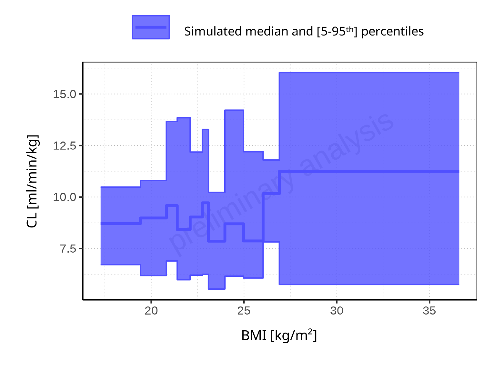


**Figure 2-306: BMI-dependence of CL for Filmcoated_tablet_400mg_sd. Profiles are plotted in a linear scale.**


<br>
<br>


```{=openxml}
<w:br w:type="page"/>
```

`<w:bookmarkStart w:id="figure-2-307" w:name="figure-2-307"/><w:bookmarkEnd w:id="figure-2-307"/>`{=openxml}

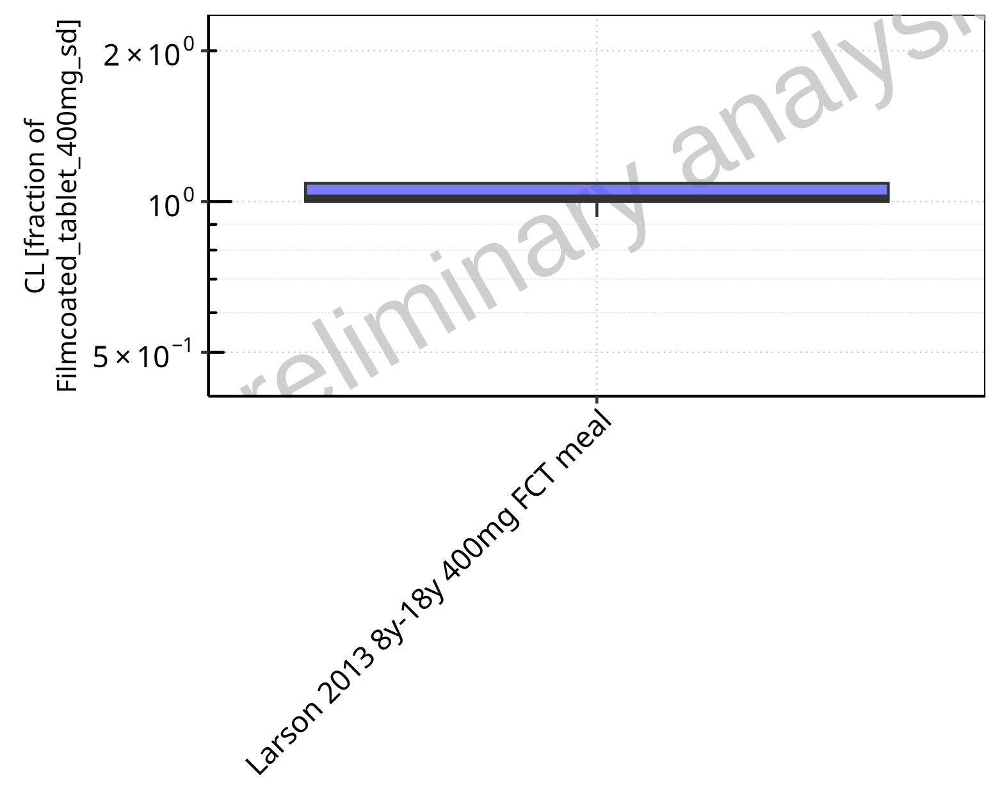


**Figure 2-307: Ratio of population summary statistics of CL of Raltegravir  for  Larson 2013 8y-18y 400mg FCT meal in comparison to Filmcoated_tablet_400mg_sd shown as box-whisker plot, which indicates ratios of the 5^th^, 25^th^, 50^th^, 75^th^, 95^th^ percentiles in logarithmic scale.**


<br>
<br>


```{=openxml}
<w:br w:type="page"/>
```

`<w:bookmarkStart w:id="figure-2-308" w:name="figure-2-308"/><w:bookmarkEnd w:id="figure-2-308"/>`{=openxml}

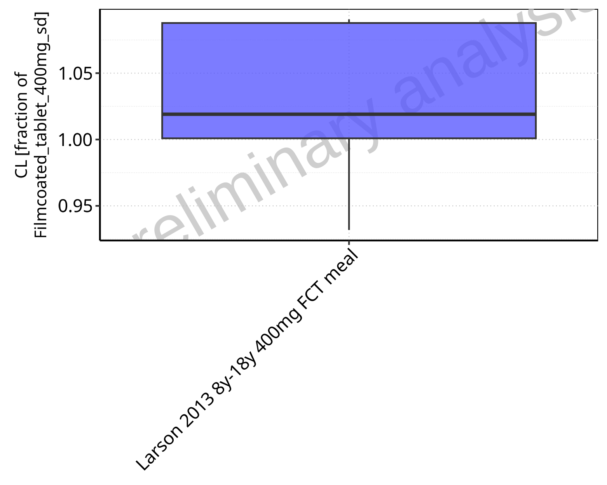


**Figure 2-308: Ratio of population summary statistics of CL of Raltegravir  for  Larson 2013 8y-18y 400mg FCT meal in comparison to Filmcoated_tablet_400mg_sd shown as box-whisker plot, which indicates ratios of the 5^th^, 25^th^, 50^th^, 75^th^, 95^th^ percentiles in linear scale.**


<br>
<br>


```{=openxml}
<w:br w:type="page"/>
```

`<w:bookmarkStart w:id="table-2-22" w:name="table-2-22"/><w:bookmarkEnd w:id="table-2-22"/>`{=openxml}

**Table 2-22: Ratio of population summary statistics of CL of Raltegravir  for  Larson 2013 8y-18y 400mg FCT meal in comparison to Filmcoated_tablet_400mg_sd**


|Population                        |N   |5^th^ pctl |25^th^ pctl |50^th^ pctl |75^th^ pctl |95^th^ pctl |Mean |SD   |Geo Mean |Geo SD |
|:---------------------------------|:---|:-------------------|:--------------------|:--------------------|:--------------------|:--------------------|:----|:----|:--------|:------|
|Larson 2013 8y-18y 400mg FCT meal |497 |0.93                |1.00                 |1.02                 |1.09                 |1.09                 |1.03 |1.13 |1.02     |1.04   |


<br>
<br>


### Vss `<w:bookmarkStart w:id="321_pk_parameters_organism_peripheralvenousblood_raltegravir_plasma__peripheral_venous_blood__vss" w:name="321_pk_parameters_organism_peripheralvenousblood_raltegravir_plasma__peripheral_venous_blood__vss"/><w:bookmarkEnd w:id="321_pk_parameters_organism_peripheralvenousblood_raltegravir_plasma__peripheral_venous_blood__vss"/>`{=openxml}


```{=openxml}
<w:br w:type="page"/>
```

`<w:bookmarkStart w:id="figure-2-309" w:name="figure-2-309"/><w:bookmarkEnd w:id="figure-2-309"/>`{=openxml}

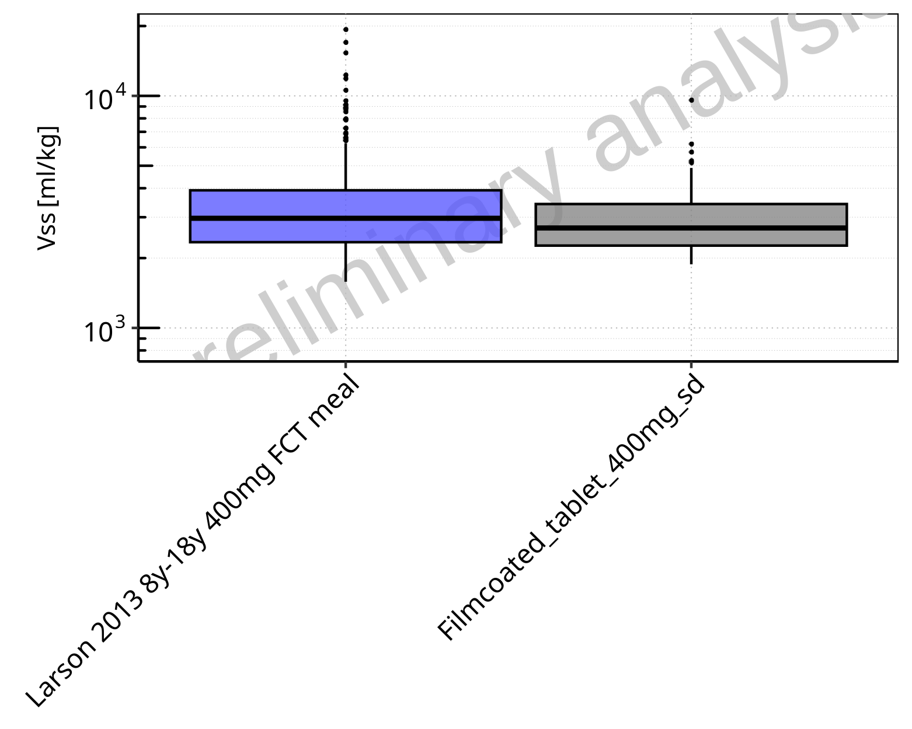


**Figure 2-309: Vss of Raltegravir for Larson 2013 8y-18y 400mg FCT meal, Filmcoated_tablet_400mg_sd shown as box-whisker plot, which indicates  the 5^th^, 25^th^, 50^th^, 75^th^, 95^th^ percentiles in logarithmic scale.**


<br>
<br>


```{=openxml}
<w:br w:type="page"/>
```

`<w:bookmarkStart w:id="figure-2-310" w:name="figure-2-310"/><w:bookmarkEnd w:id="figure-2-310"/>`{=openxml}

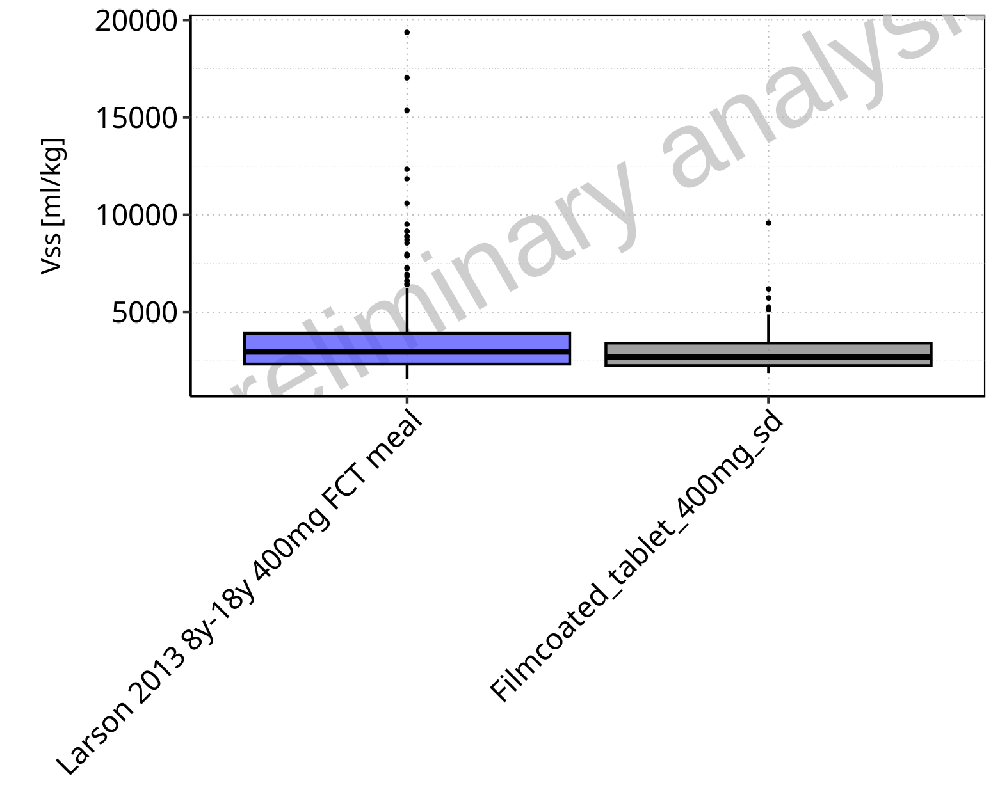


**Figure 2-310: Vss of Raltegravir for Larson 2013 8y-18y 400mg FCT meal, Filmcoated_tablet_400mg_sd shown as box-whisker plot, which indicates  the 5^th^, 25^th^, 50^th^, 75^th^, 95^th^ percentiles in linear scale.**


<br>
<br>


```{=openxml}
<w:br w:type="page"/>
```

`<w:bookmarkStart w:id="table-2-23" w:name="table-2-23"/><w:bookmarkEnd w:id="table-2-23"/>`{=openxml}

**Table 2-23: Population statistics summarizing Vss of Raltegravir for Larson 2013 8y-18y 400mg FCT meal, Filmcoated_tablet_400mg_sd reported in [ml/kg]**


|Population                        |N   |5^th^ pctl |25^th^ pctl |50^th^ pctl |75^th^ pctl |95^th^ pctl |Mean    |SD      |Geo Mean |Geo SD |
|:---------------------------------|:---|:-------------------|:--------------------|:--------------------|:--------------------|:--------------------|:-------|:-------|:--------|:------|
|Larson 2013 8y-18y 400mg FCT meal |497 |1581.09             |2341.62              |2968.06              |3917.84              |6249.02              |3396.63 |1880.06 |3071.48  |1.53   |
|Filmcoated_tablet_400mg_sd        |100 |1880.27             |2263.55              |2695.83              |3418.90              |4890.56              |2993.70 |1138.98 |2836.19  |1.37   |


<br>
<br>


```{=openxml}
<w:br w:type="page"/>
```

`<w:bookmarkStart w:id="figure-2-311" w:name="figure-2-311"/><w:bookmarkEnd w:id="figure-2-311"/>`{=openxml}


**Figure 2-311: Age-dependence of Vss for Larson 2013 8y-18y 400mg FCT meal in comparison to Filmcoated_tablet_400mg_sd. Profiles are plotted in a logarithmic scale.**


<br>
<br>


```{=openxml}
<w:br w:type="page"/>
```

`<w:bookmarkStart w:id="figure-2-312" w:name="figure-2-312"/><w:bookmarkEnd w:id="figure-2-312"/>`{=openxml}

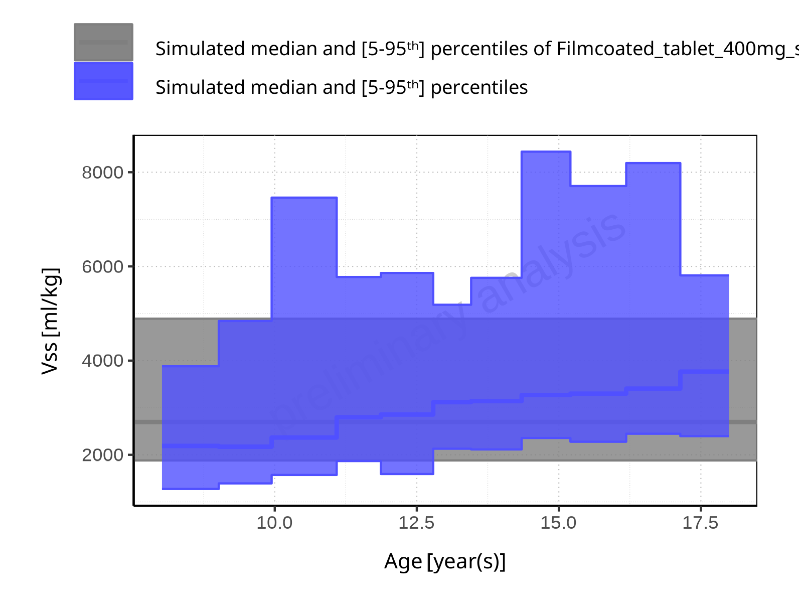


**Figure 2-312: Age-dependence of Vss for Larson 2013 8y-18y 400mg FCT meal in comparison to Filmcoated_tablet_400mg_sd. Profiles are plotted in a linear scale.**


<br>
<br>


```{=openxml}
<w:br w:type="page"/>
```

`<w:bookmarkStart w:id="figure-2-313" w:name="figure-2-313"/><w:bookmarkEnd w:id="figure-2-313"/>`{=openxml}

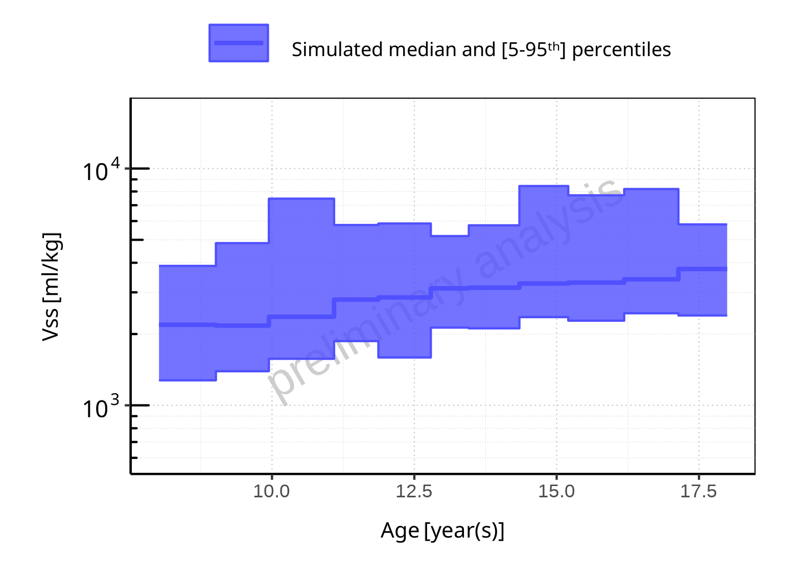


**Figure 2-313: Age-dependence of Vss for Larson 2013 8y-18y 400mg FCT meal. Profiles are plotted in a logarithmic scale.**


<br>
<br>


```{=openxml}
<w:br w:type="page"/>
```

`<w:bookmarkStart w:id="figure-2-314" w:name="figure-2-314"/><w:bookmarkEnd w:id="figure-2-314"/>`{=openxml}

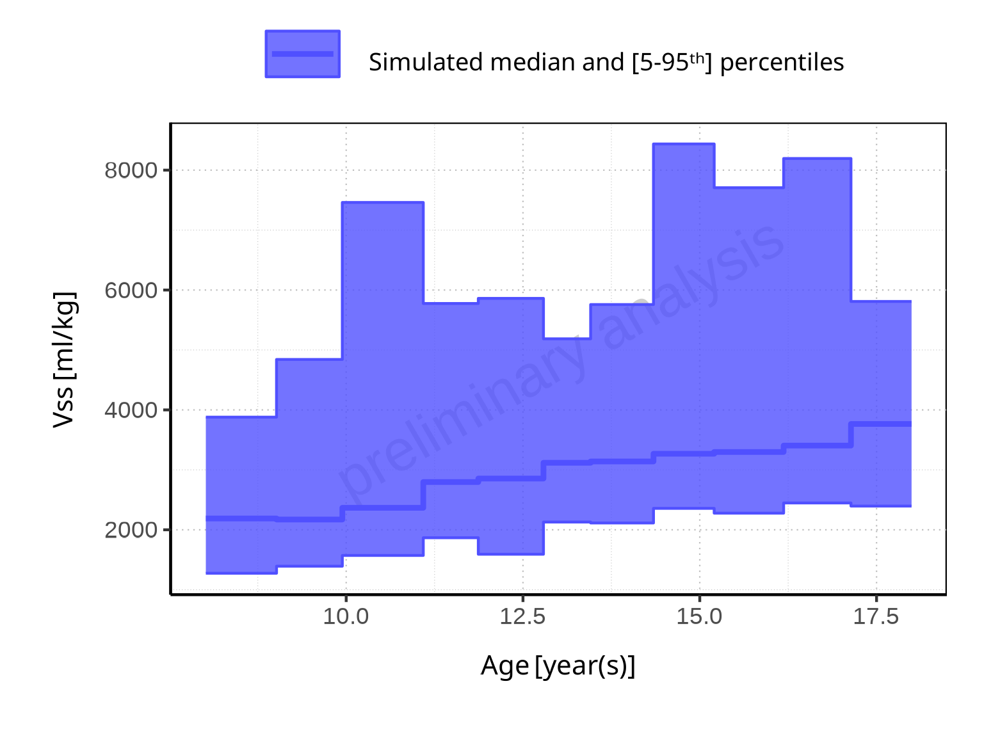


**Figure 2-314: Age-dependence of Vss for Larson 2013 8y-18y 400mg FCT meal. Profiles are plotted in a linear scale.**


<br>
<br>


```{=openxml}
<w:br w:type="page"/>
```

`<w:bookmarkStart w:id="figure-2-315" w:name="figure-2-315"/><w:bookmarkEnd w:id="figure-2-315"/>`{=openxml}


**Figure 2-315: Age-dependence of Vss for Filmcoated_tablet_400mg_sd. Profiles are plotted in a logarithmic scale.**


<br>
<br>


```{=openxml}
<w:br w:type="page"/>
```

`<w:bookmarkStart w:id="figure-2-316" w:name="figure-2-316"/><w:bookmarkEnd w:id="figure-2-316"/>`{=openxml}

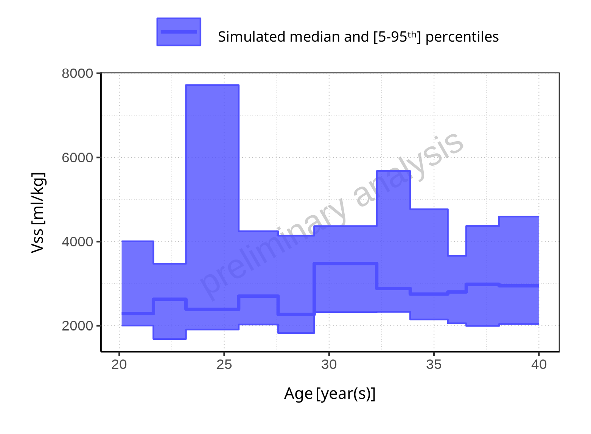


**Figure 2-316: Age-dependence of Vss for Filmcoated_tablet_400mg_sd. Profiles are plotted in a linear scale.**


<br>
<br>


```{=openxml}
<w:br w:type="page"/>
```

`<w:bookmarkStart w:id="figure-2-317" w:name="figure-2-317"/><w:bookmarkEnd w:id="figure-2-317"/>`{=openxml}

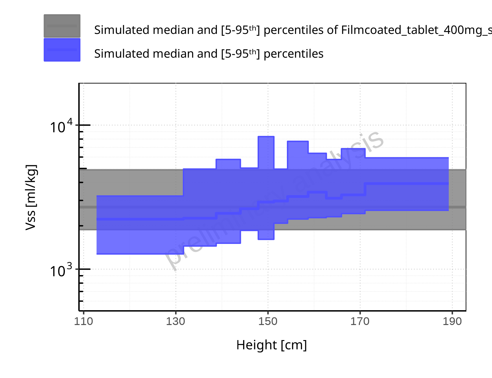


**Figure 2-317: Height-dependence of Vss for Larson 2013 8y-18y 400mg FCT meal in comparison to Filmcoated_tablet_400mg_sd. Profiles are plotted in a logarithmic scale.**


<br>
<br>


```{=openxml}
<w:br w:type="page"/>
```

`<w:bookmarkStart w:id="figure-2-318" w:name="figure-2-318"/><w:bookmarkEnd w:id="figure-2-318"/>`{=openxml}

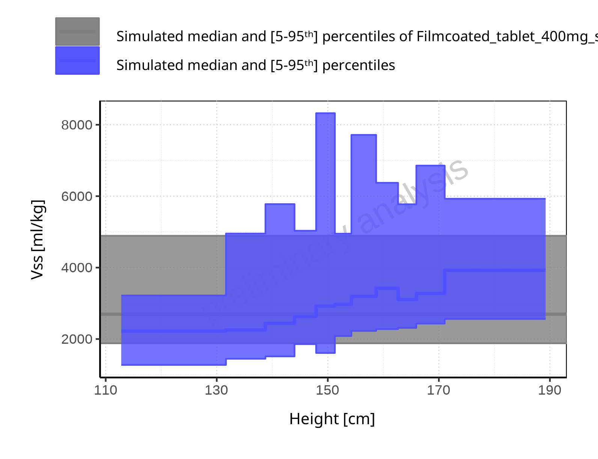


**Figure 2-318: Height-dependence of Vss for Larson 2013 8y-18y 400mg FCT meal in comparison to Filmcoated_tablet_400mg_sd. Profiles are plotted in a linear scale.**


<br>
<br>


```{=openxml}
<w:br w:type="page"/>
```

`<w:bookmarkStart w:id="figure-2-319" w:name="figure-2-319"/><w:bookmarkEnd w:id="figure-2-319"/>`{=openxml}

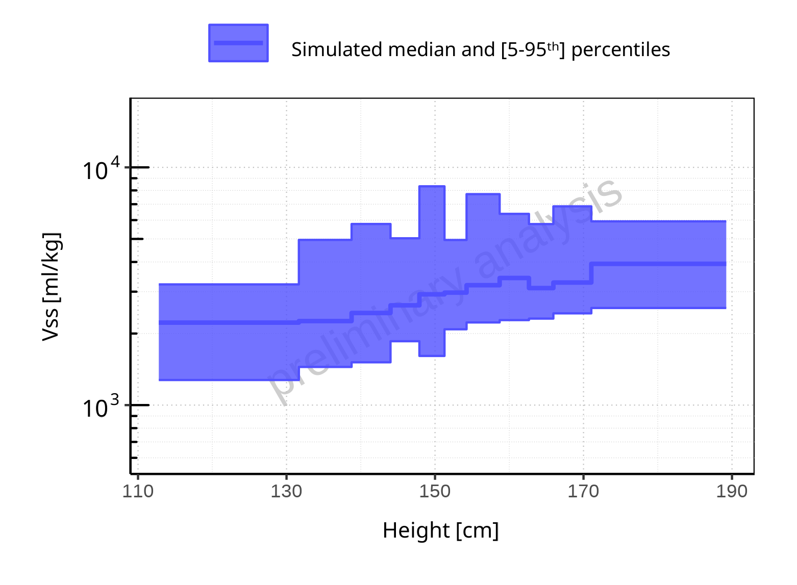


**Figure 2-319: Height-dependence of Vss for Larson 2013 8y-18y 400mg FCT meal. Profiles are plotted in a logarithmic scale.**


<br>
<br>


```{=openxml}
<w:br w:type="page"/>
```

`<w:bookmarkStart w:id="figure-2-320" w:name="figure-2-320"/><w:bookmarkEnd w:id="figure-2-320"/>`{=openxml}

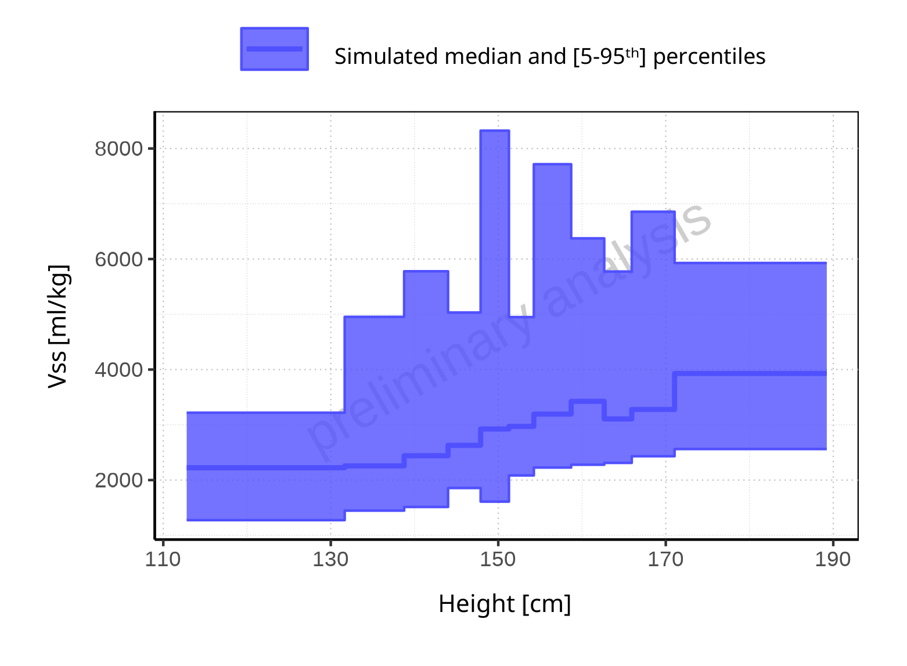


**Figure 2-320: Height-dependence of Vss for Larson 2013 8y-18y 400mg FCT meal. Profiles are plotted in a linear scale.**


<br>
<br>


```{=openxml}
<w:br w:type="page"/>
```

`<w:bookmarkStart w:id="figure-2-321" w:name="figure-2-321"/><w:bookmarkEnd w:id="figure-2-321"/>`{=openxml}

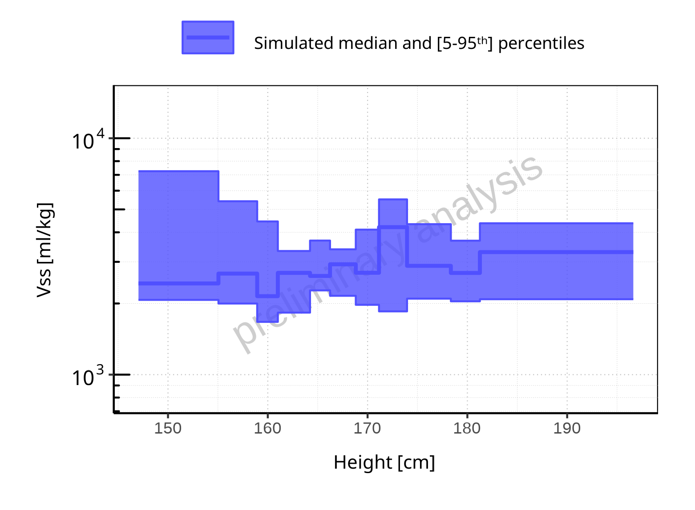


**Figure 2-321: Height-dependence of Vss for Filmcoated_tablet_400mg_sd. Profiles are plotted in a logarithmic scale.**


<br>
<br>


```{=openxml}
<w:br w:type="page"/>
```

`<w:bookmarkStart w:id="figure-2-322" w:name="figure-2-322"/><w:bookmarkEnd w:id="figure-2-322"/>`{=openxml}

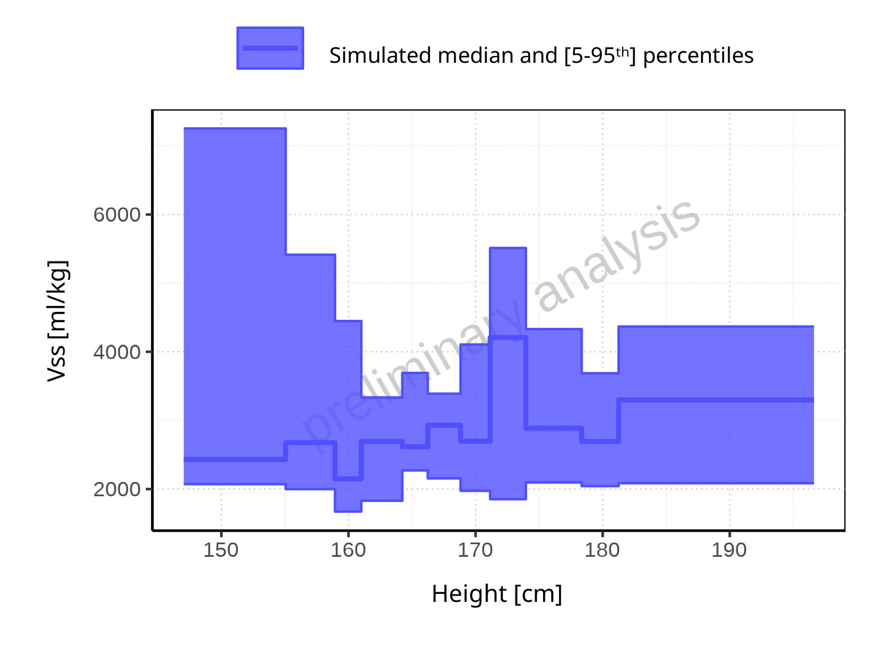


**Figure 2-322: Height-dependence of Vss for Filmcoated_tablet_400mg_sd. Profiles are plotted in a linear scale.**


<br>
<br>


```{=openxml}
<w:br w:type="page"/>
```

`<w:bookmarkStart w:id="figure-2-323" w:name="figure-2-323"/><w:bookmarkEnd w:id="figure-2-323"/>`{=openxml}

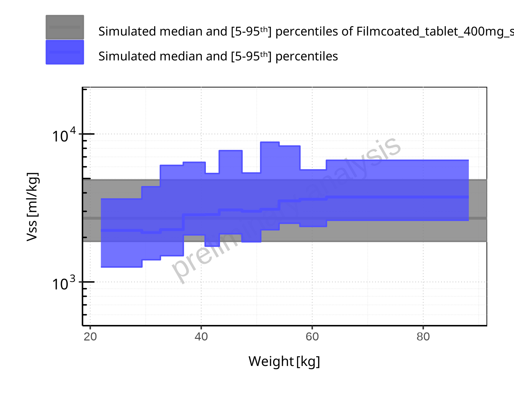


**Figure 2-323: Weight-dependence of Vss for Larson 2013 8y-18y 400mg FCT meal in comparison to Filmcoated_tablet_400mg_sd. Profiles are plotted in a logarithmic scale.**


<br>
<br>


```{=openxml}
<w:br w:type="page"/>
```

`<w:bookmarkStart w:id="figure-2-324" w:name="figure-2-324"/><w:bookmarkEnd w:id="figure-2-324"/>`{=openxml}

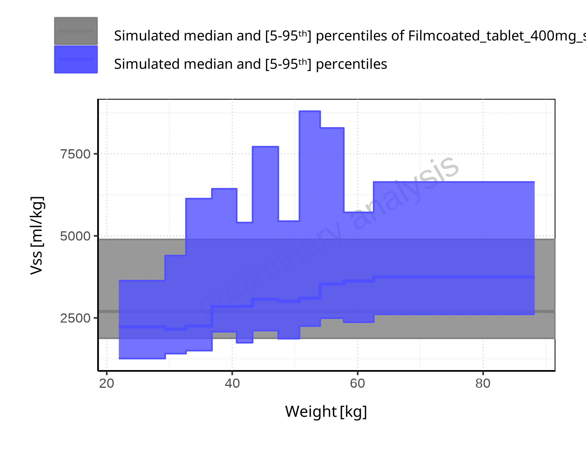


**Figure 2-324: Weight-dependence of Vss for Larson 2013 8y-18y 400mg FCT meal in comparison to Filmcoated_tablet_400mg_sd. Profiles are plotted in a linear scale.**


<br>
<br>


```{=openxml}
<w:br w:type="page"/>
```

`<w:bookmarkStart w:id="figure-2-325" w:name="figure-2-325"/><w:bookmarkEnd w:id="figure-2-325"/>`{=openxml}

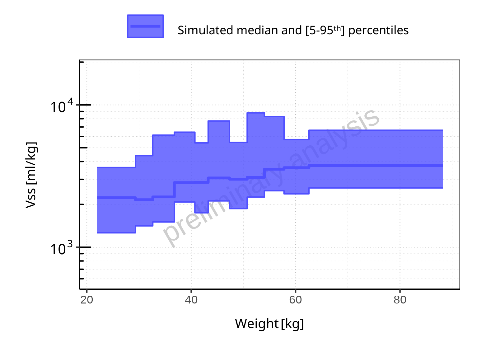


**Figure 2-325: Weight-dependence of Vss for Larson 2013 8y-18y 400mg FCT meal. Profiles are plotted in a logarithmic scale.**


<br>
<br>


```{=openxml}
<w:br w:type="page"/>
```

`<w:bookmarkStart w:id="figure-2-326" w:name="figure-2-326"/><w:bookmarkEnd w:id="figure-2-326"/>`{=openxml}

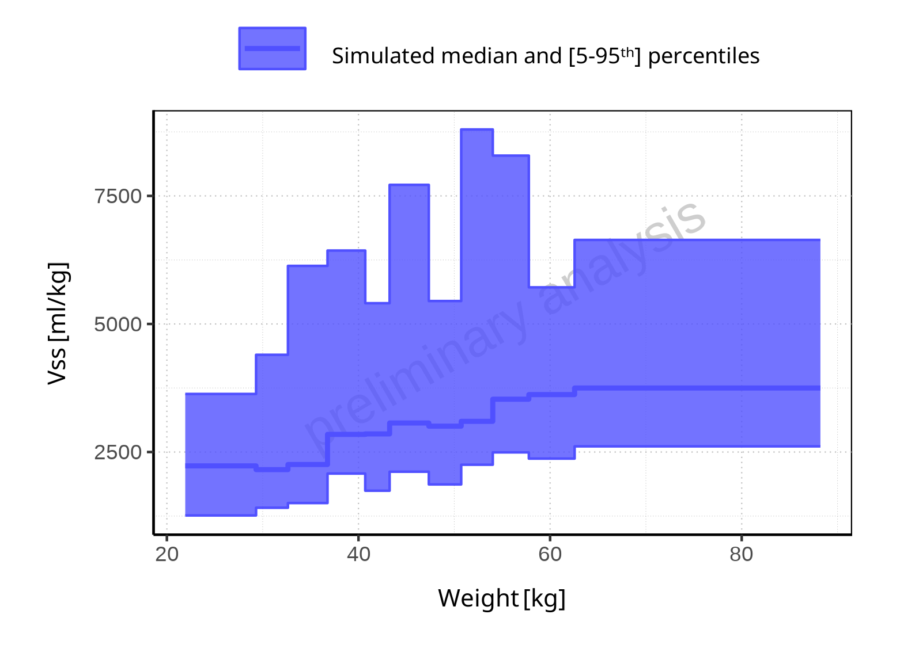


**Figure 2-326: Weight-dependence of Vss for Larson 2013 8y-18y 400mg FCT meal. Profiles are plotted in a linear scale.**


<br>
<br>


```{=openxml}
<w:br w:type="page"/>
```

`<w:bookmarkStart w:id="figure-2-327" w:name="figure-2-327"/><w:bookmarkEnd w:id="figure-2-327"/>`{=openxml}

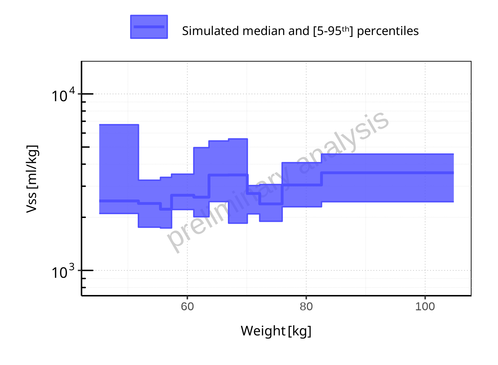


**Figure 2-327: Weight-dependence of Vss for Filmcoated_tablet_400mg_sd. Profiles are plotted in a logarithmic scale.**


<br>
<br>


```{=openxml}
<w:br w:type="page"/>
```

`<w:bookmarkStart w:id="figure-2-328" w:name="figure-2-328"/><w:bookmarkEnd w:id="figure-2-328"/>`{=openxml}

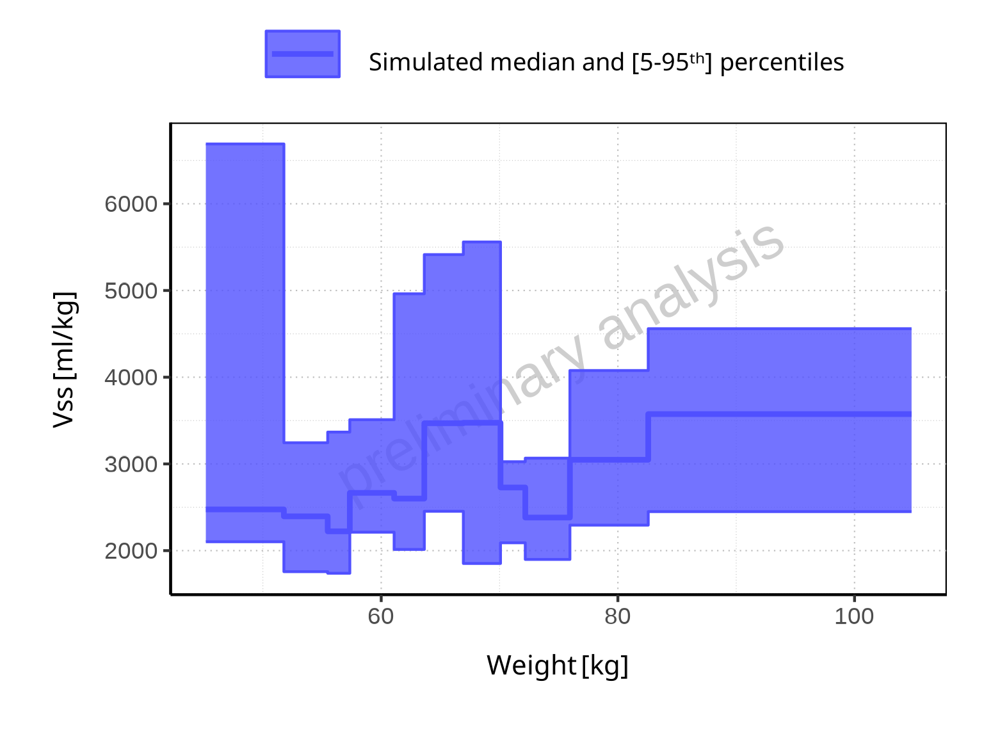


**Figure 2-328: Weight-dependence of Vss for Filmcoated_tablet_400mg_sd. Profiles are plotted in a linear scale.**


<br>
<br>


```{=openxml}
<w:br w:type="page"/>
```

`<w:bookmarkStart w:id="figure-2-329" w:name="figure-2-329"/><w:bookmarkEnd w:id="figure-2-329"/>`{=openxml}

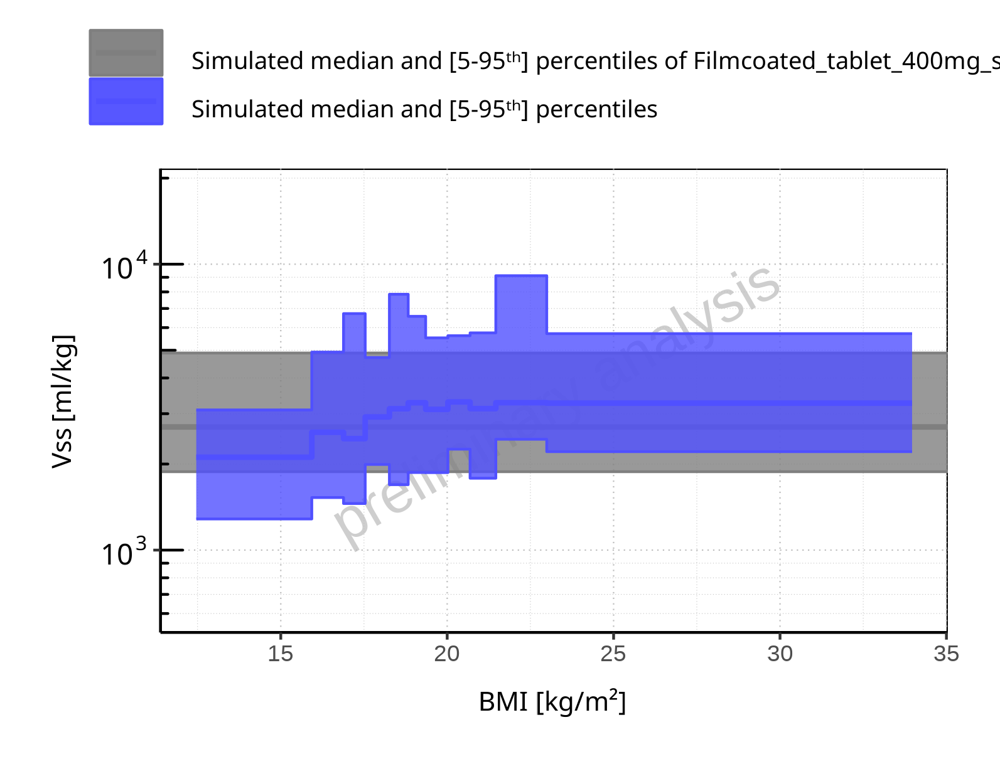


**Figure 2-329: BMI-dependence of Vss for Larson 2013 8y-18y 400mg FCT meal in comparison to Filmcoated_tablet_400mg_sd. Profiles are plotted in a logarithmic scale.**


<br>
<br>


```{=openxml}
<w:br w:type="page"/>
```

`<w:bookmarkStart w:id="figure-2-330" w:name="figure-2-330"/><w:bookmarkEnd w:id="figure-2-330"/>`{=openxml}

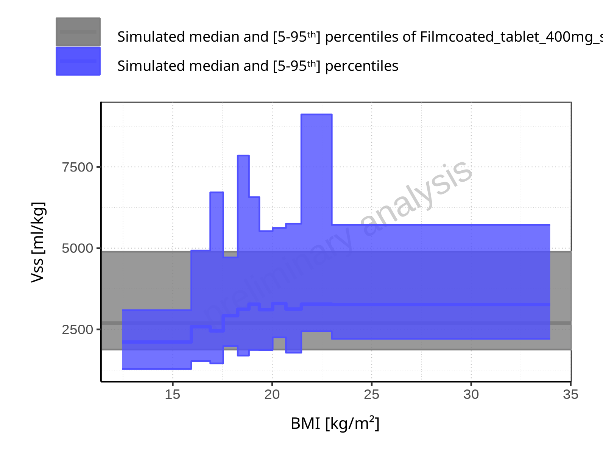


**Figure 2-330: BMI-dependence of Vss for Larson 2013 8y-18y 400mg FCT meal in comparison to Filmcoated_tablet_400mg_sd. Profiles are plotted in a linear scale.**


<br>
<br>


```{=openxml}
<w:br w:type="page"/>
```

`<w:bookmarkStart w:id="figure-2-331" w:name="figure-2-331"/><w:bookmarkEnd w:id="figure-2-331"/>`{=openxml}

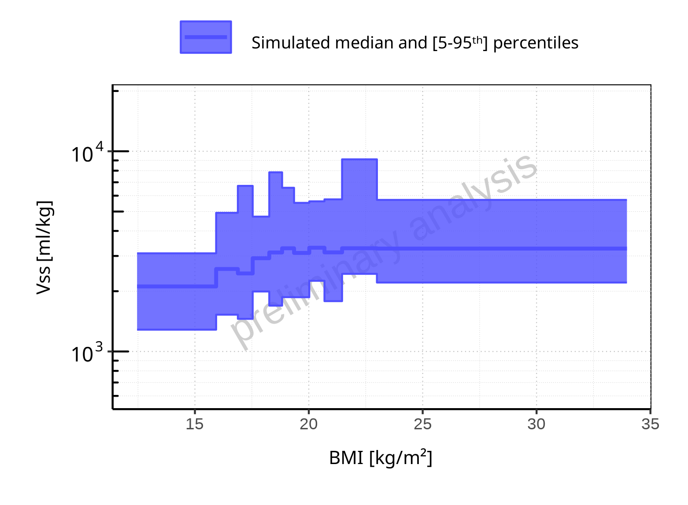


**Figure 2-331: BMI-dependence of Vss for Larson 2013 8y-18y 400mg FCT meal. Profiles are plotted in a logarithmic scale.**


<br>
<br>


```{=openxml}
<w:br w:type="page"/>
```

`<w:bookmarkStart w:id="figure-2-332" w:name="figure-2-332"/><w:bookmarkEnd w:id="figure-2-332"/>`{=openxml}

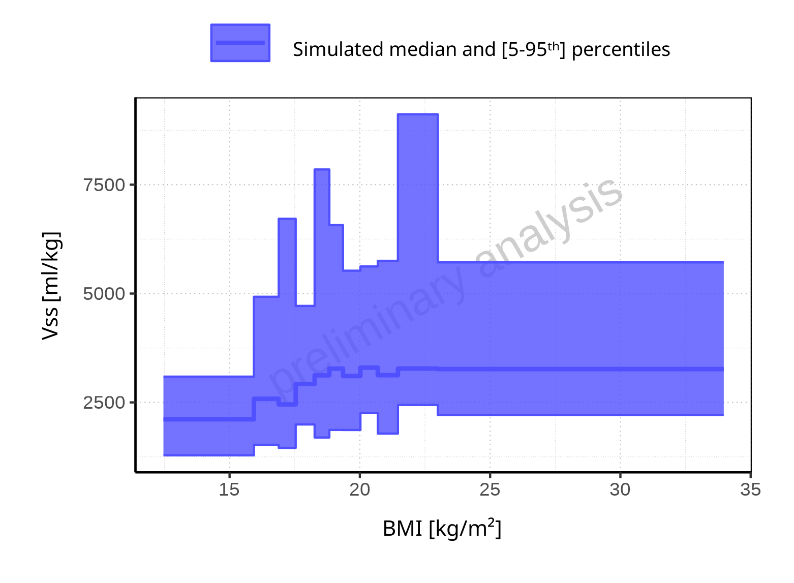


**Figure 2-332: BMI-dependence of Vss for Larson 2013 8y-18y 400mg FCT meal. Profiles are plotted in a linear scale.**


<br>
<br>


```{=openxml}
<w:br w:type="page"/>
```

`<w:bookmarkStart w:id="figure-2-333" w:name="figure-2-333"/><w:bookmarkEnd w:id="figure-2-333"/>`{=openxml}

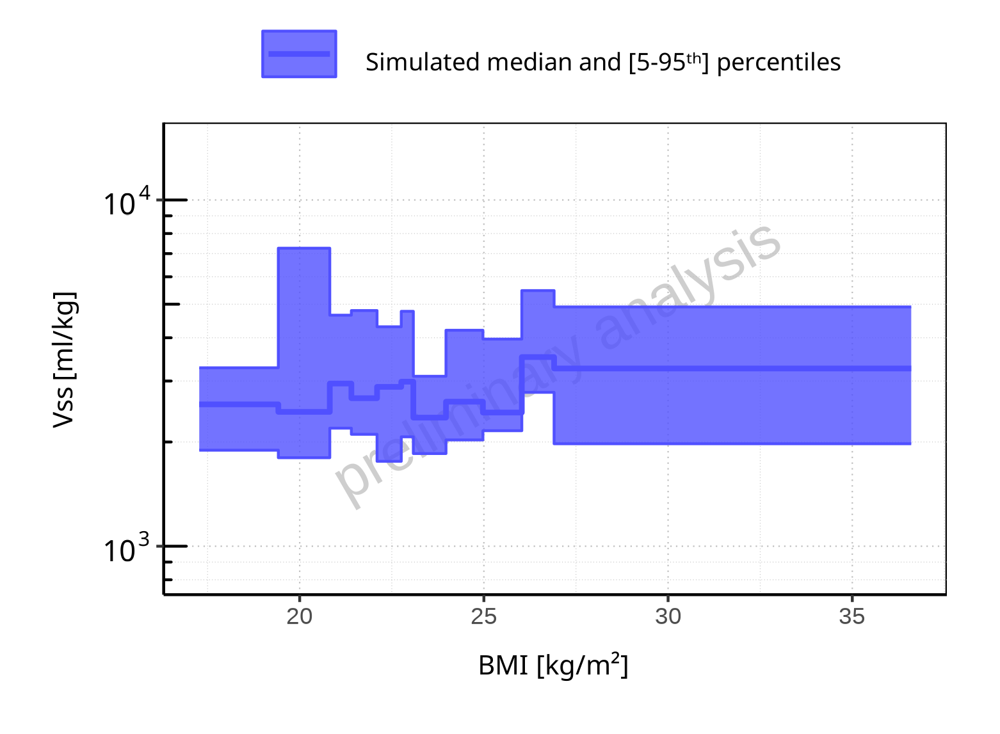


**Figure 2-333: BMI-dependence of Vss for Filmcoated_tablet_400mg_sd. Profiles are plotted in a logarithmic scale.**


<br>
<br>


```{=openxml}
<w:br w:type="page"/>
```

`<w:bookmarkStart w:id="figure-2-334" w:name="figure-2-334"/><w:bookmarkEnd w:id="figure-2-334"/>`{=openxml}

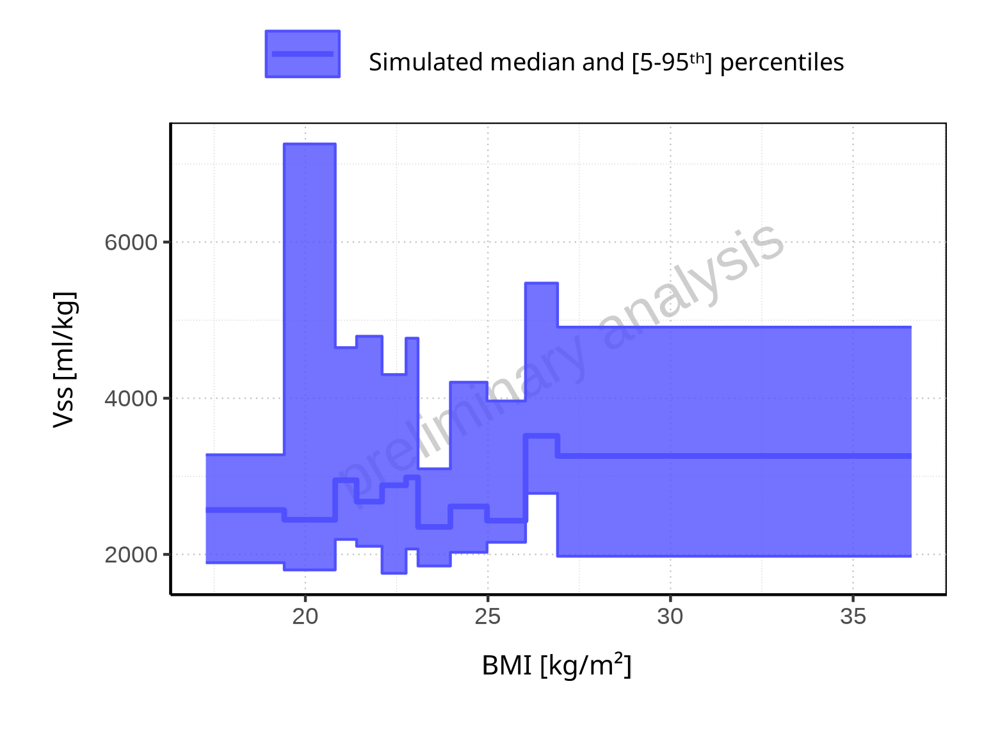


**Figure 2-334: BMI-dependence of Vss for Filmcoated_tablet_400mg_sd. Profiles are plotted in a linear scale.**


<br>
<br>


```{=openxml}
<w:br w:type="page"/>
```

`<w:bookmarkStart w:id="figure-2-335" w:name="figure-2-335"/><w:bookmarkEnd w:id="figure-2-335"/>`{=openxml}

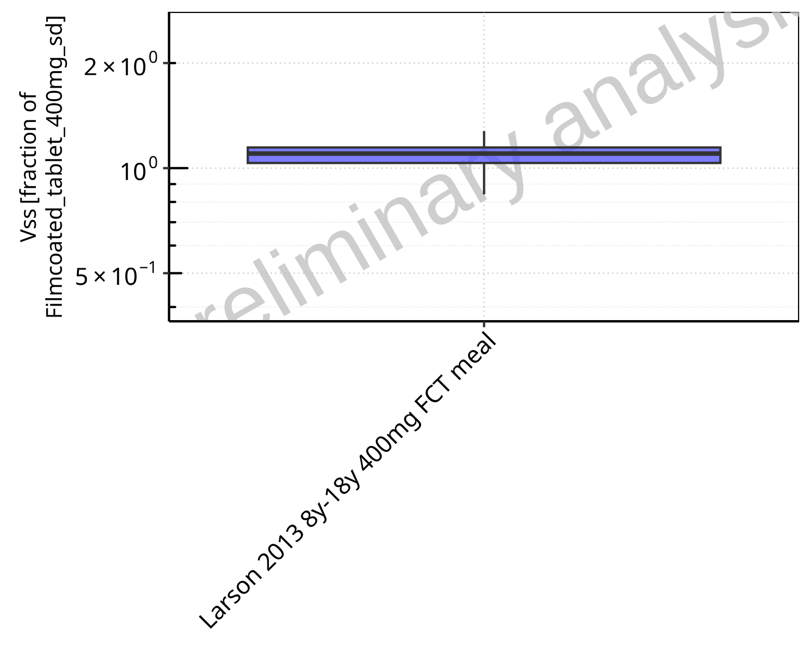


**Figure 2-335: Ratio of population summary statistics of Vss of Raltegravir  for  Larson 2013 8y-18y 400mg FCT meal in comparison to Filmcoated_tablet_400mg_sd shown as box-whisker plot, which indicates ratios of the 5^th^, 25^th^, 50^th^, 75^th^, 95^th^ percentiles in logarithmic scale.**


<br>
<br>


```{=openxml}
<w:br w:type="page"/>
```

`<w:bookmarkStart w:id="figure-2-336" w:name="figure-2-336"/><w:bookmarkEnd w:id="figure-2-336"/>`{=openxml}

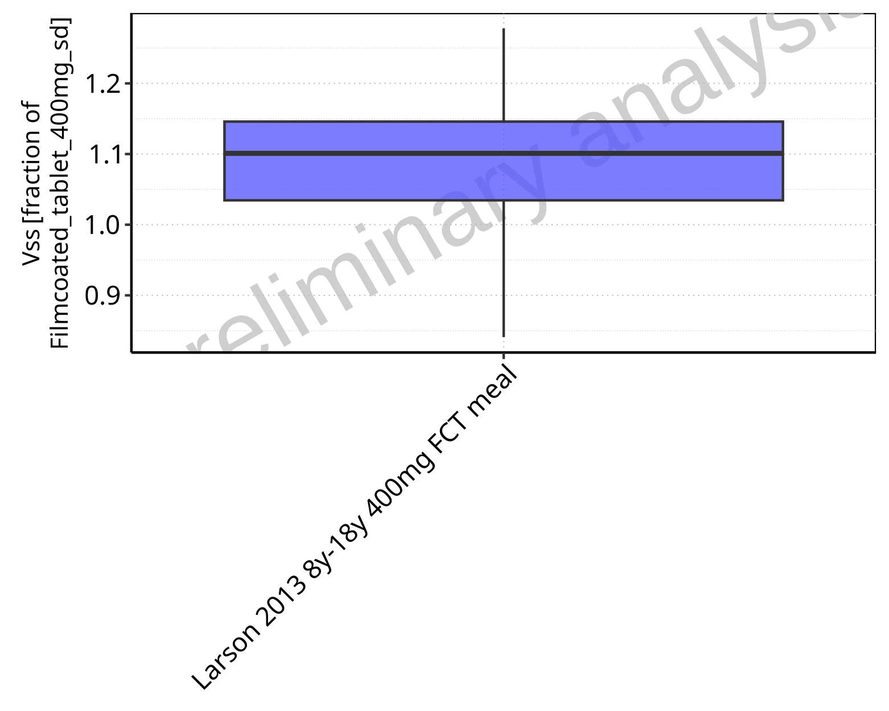


**Figure 2-336: Ratio of population summary statistics of Vss of Raltegravir  for  Larson 2013 8y-18y 400mg FCT meal in comparison to Filmcoated_tablet_400mg_sd shown as box-whisker plot, which indicates ratios of the 5^th^, 25^th^, 50^th^, 75^th^, 95^th^ percentiles in linear scale.**


<br>
<br>


```{=openxml}
<w:br w:type="page"/>
```

`<w:bookmarkStart w:id="table-2-24" w:name="table-2-24"/><w:bookmarkEnd w:id="table-2-24"/>`{=openxml}

**Table 2-24: Ratio of population summary statistics of Vss of Raltegravir  for  Larson 2013 8y-18y 400mg FCT meal in comparison to Filmcoated_tablet_400mg_sd**


|Population                        |N   |5^th^ pctl |25^th^ pctl |50^th^ pctl |75^th^ pctl |95^th^ pctl |Mean |SD   |Geo Mean |Geo SD |
|:---------------------------------|:---|:-------------------|:--------------------|:--------------------|:--------------------|:--------------------|:----|:----|:--------|:------|
|Larson 2013 8y-18y 400mg FCT meal |497 |0.84                |1.03                 |1.10                 |1.15                 |1.28                 |1.13 |1.65 |1.08     |1.12   |


<br>
<br>


### Vd `<w:bookmarkStart w:id="350_pk_parameters_organism_peripheralvenousblood_raltegravir_plasma__peripheral_venous_blood__vd" w:name="350_pk_parameters_organism_peripheralvenousblood_raltegravir_plasma__peripheral_venous_blood__vd"/><w:bookmarkEnd w:id="350_pk_parameters_organism_peripheralvenousblood_raltegravir_plasma__peripheral_venous_blood__vd"/>`{=openxml}


```{=openxml}
<w:br w:type="page"/>
```

`<w:bookmarkStart w:id="figure-2-337" w:name="figure-2-337"/><w:bookmarkEnd w:id="figure-2-337"/>`{=openxml}

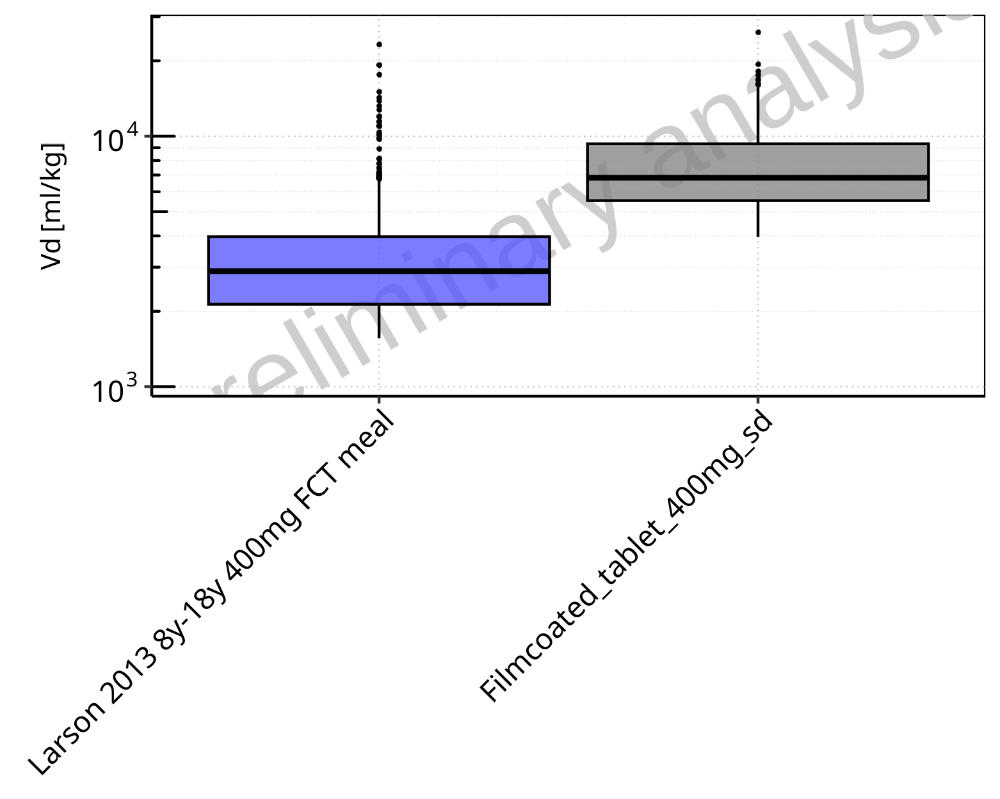


**Figure 2-337: Vd of Raltegravir for Larson 2013 8y-18y 400mg FCT meal, Filmcoated_tablet_400mg_sd shown as box-whisker plot, which indicates  the 5^th^, 25^th^, 50^th^, 75^th^, 95^th^ percentiles in logarithmic scale.**


<br>
<br>


```{=openxml}
<w:br w:type="page"/>
```

`<w:bookmarkStart w:id="figure-2-338" w:name="figure-2-338"/><w:bookmarkEnd w:id="figure-2-338"/>`{=openxml}


**Figure 2-338: Vd of Raltegravir for Larson 2013 8y-18y 400mg FCT meal, Filmcoated_tablet_400mg_sd shown as box-whisker plot, which indicates  the 5^th^, 25^th^, 50^th^, 75^th^, 95^th^ percentiles in linear scale.**


<br>
<br>


```{=openxml}
<w:br w:type="page"/>
```

`<w:bookmarkStart w:id="table-2-25" w:name="table-2-25"/><w:bookmarkEnd w:id="table-2-25"/>`{=openxml}

**Table 2-25: Population statistics summarizing Vd of Raltegravir for Larson 2013 8y-18y 400mg FCT meal, Filmcoated_tablet_400mg_sd reported in [ml/kg]**


|Population                        |N   |5^th^ pctl |25^th^ pctl |50^th^ pctl |75^th^ pctl |95^th^ pctl |Mean    |SD      |Geo Mean |Geo SD |
|:---------------------------------|:---|:-------------------|:--------------------|:--------------------|:--------------------|:--------------------|:-------|:-------|:--------|:------|
|Larson 2013 8y-18y 400mg FCT meal |497 |1564.17             |2133.96              |2893.52              |3971.83              |7809.40              |3610.03 |2601.88 |3089.07  |1.67   |
|Filmcoated_tablet_400mg_sd        |100 |3961.86             |5531.19              |6823.96              |9325.52              |16886.12             |8090.43 |4000.17 |7343.52  |1.53   |


<br>
<br>


```{=openxml}
<w:br w:type="page"/>
```

`<w:bookmarkStart w:id="figure-2-339" w:name="figure-2-339"/><w:bookmarkEnd w:id="figure-2-339"/>`{=openxml}

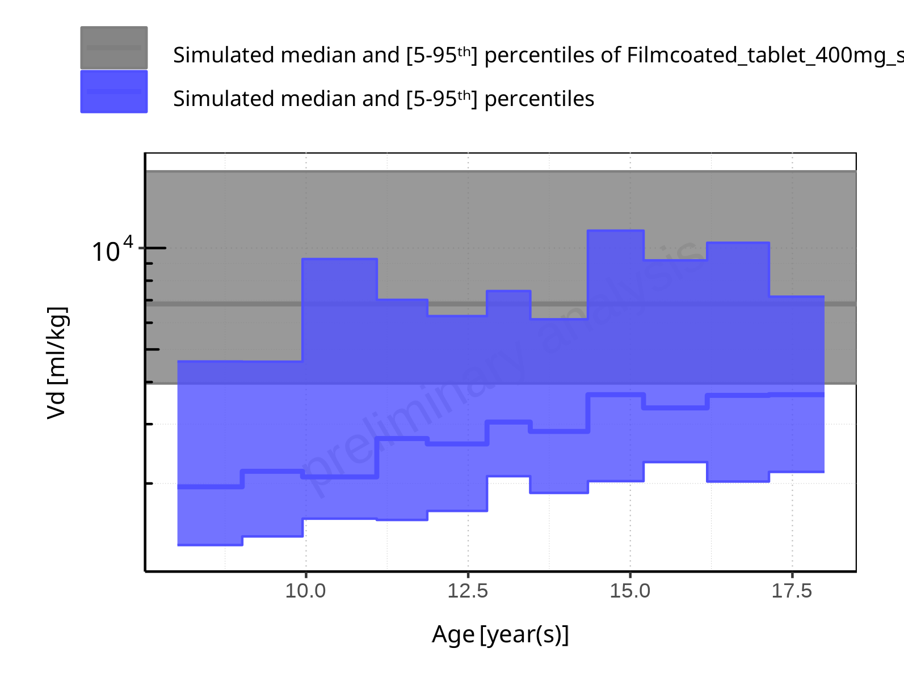


**Figure 2-339: Age-dependence of Vd for Larson 2013 8y-18y 400mg FCT meal in comparison to Filmcoated_tablet_400mg_sd. Profiles are plotted in a logarithmic scale.**


<br>
<br>


```{=openxml}
<w:br w:type="page"/>
```

`<w:bookmarkStart w:id="figure-2-340" w:name="figure-2-340"/><w:bookmarkEnd w:id="figure-2-340"/>`{=openxml}

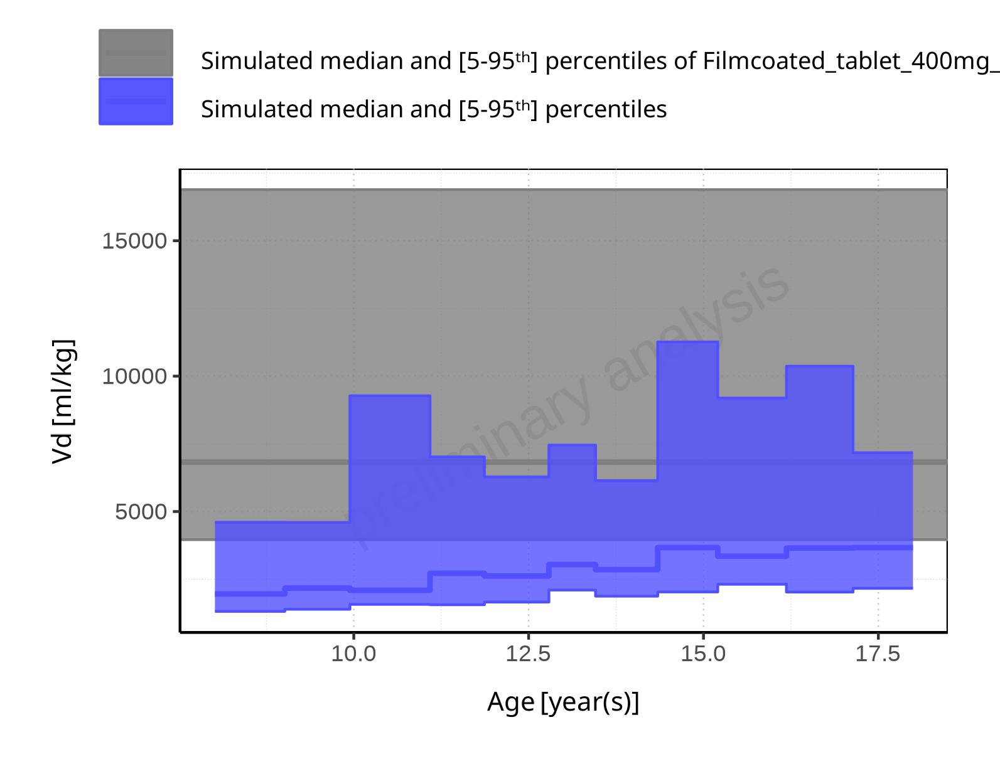


**Figure 2-340: Age-dependence of Vd for Larson 2013 8y-18y 400mg FCT meal in comparison to Filmcoated_tablet_400mg_sd. Profiles are plotted in a linear scale.**


<br>
<br>


```{=openxml}
<w:br w:type="page"/>
```

`<w:bookmarkStart w:id="figure-2-341" w:name="figure-2-341"/><w:bookmarkEnd w:id="figure-2-341"/>`{=openxml}

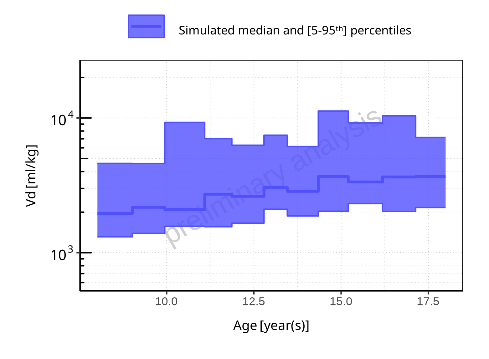


**Figure 2-341: Age-dependence of Vd for Larson 2013 8y-18y 400mg FCT meal. Profiles are plotted in a logarithmic scale.**


<br>
<br>


```{=openxml}
<w:br w:type="page"/>
```

`<w:bookmarkStart w:id="figure-2-342" w:name="figure-2-342"/><w:bookmarkEnd w:id="figure-2-342"/>`{=openxml}

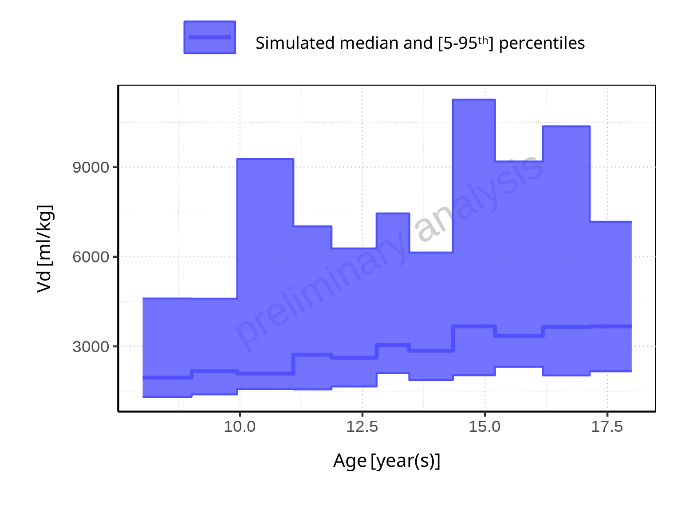


**Figure 2-342: Age-dependence of Vd for Larson 2013 8y-18y 400mg FCT meal. Profiles are plotted in a linear scale.**


<br>
<br>


```{=openxml}
<w:br w:type="page"/>
```

`<w:bookmarkStart w:id="figure-2-343" w:name="figure-2-343"/><w:bookmarkEnd w:id="figure-2-343"/>`{=openxml}

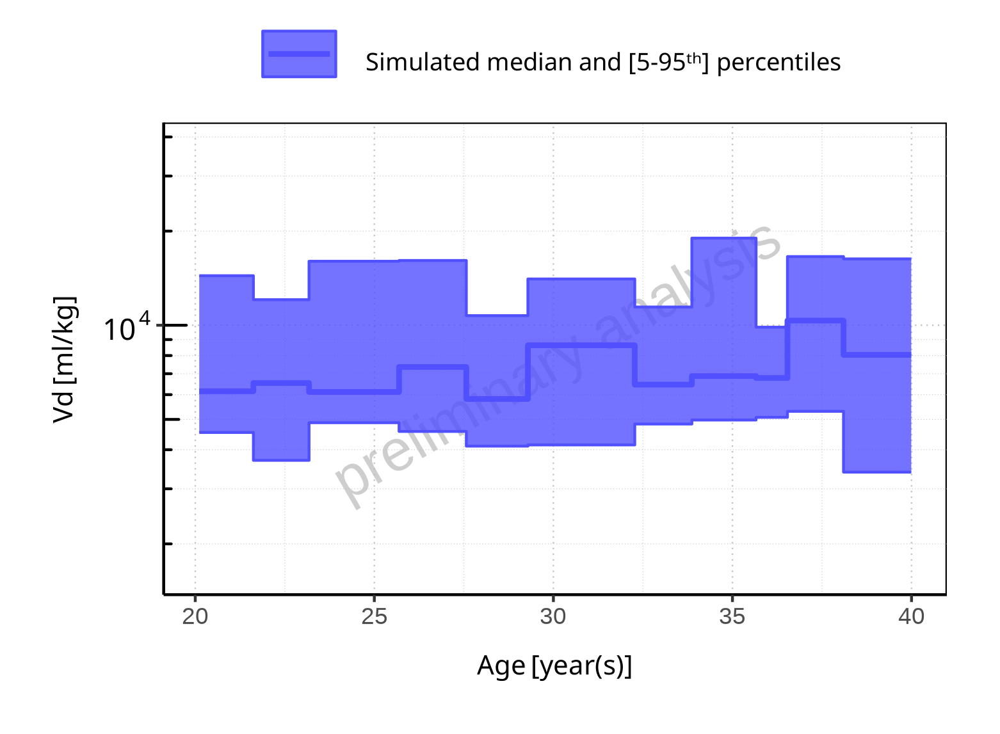


**Figure 2-343: Age-dependence of Vd for Filmcoated_tablet_400mg_sd. Profiles are plotted in a logarithmic scale.**


<br>
<br>


```{=openxml}
<w:br w:type="page"/>
```

`<w:bookmarkStart w:id="figure-2-344" w:name="figure-2-344"/><w:bookmarkEnd w:id="figure-2-344"/>`{=openxml}

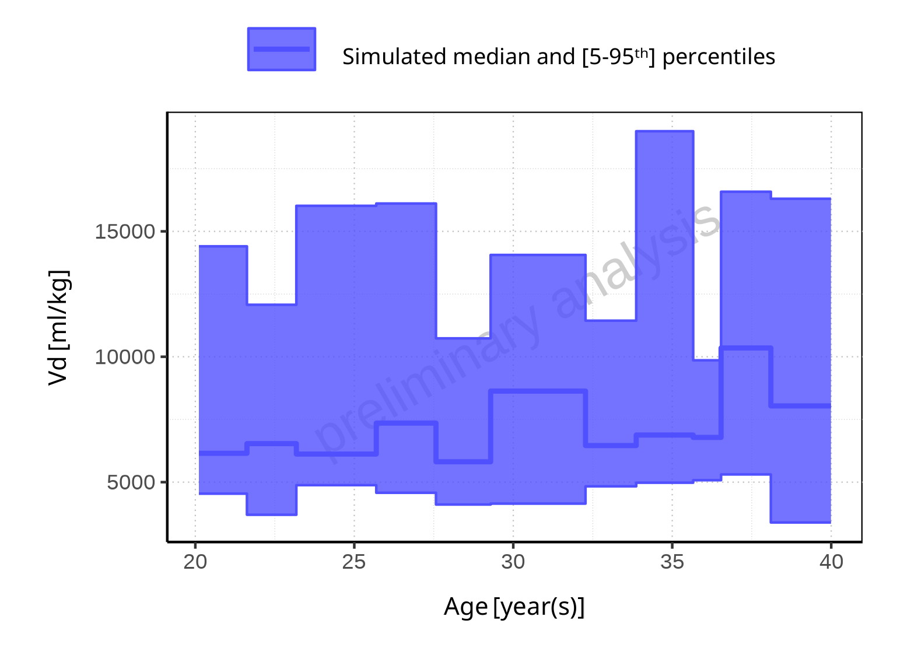


**Figure 2-344: Age-dependence of Vd for Filmcoated_tablet_400mg_sd. Profiles are plotted in a linear scale.**


<br>
<br>


```{=openxml}
<w:br w:type="page"/>
```

`<w:bookmarkStart w:id="figure-2-345" w:name="figure-2-345"/><w:bookmarkEnd w:id="figure-2-345"/>`{=openxml}

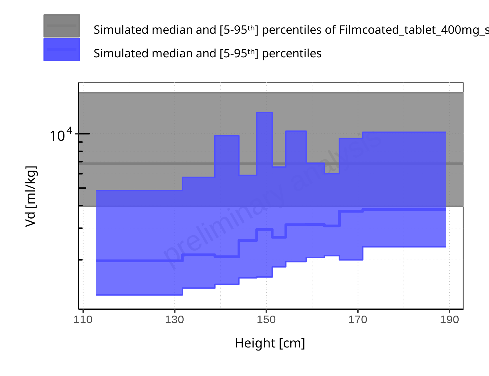


**Figure 2-345: Height-dependence of Vd for Larson 2013 8y-18y 400mg FCT meal in comparison to Filmcoated_tablet_400mg_sd. Profiles are plotted in a logarithmic scale.**


<br>
<br>


```{=openxml}
<w:br w:type="page"/>
```

`<w:bookmarkStart w:id="figure-2-346" w:name="figure-2-346"/><w:bookmarkEnd w:id="figure-2-346"/>`{=openxml}

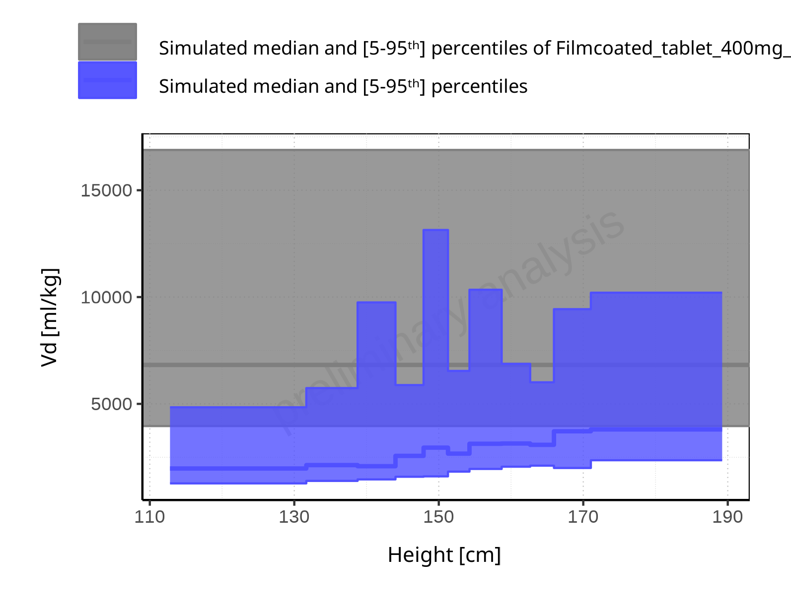


**Figure 2-346: Height-dependence of Vd for Larson 2013 8y-18y 400mg FCT meal in comparison to Filmcoated_tablet_400mg_sd. Profiles are plotted in a linear scale.**


<br>
<br>


```{=openxml}
<w:br w:type="page"/>
```

`<w:bookmarkStart w:id="figure-2-347" w:name="figure-2-347"/><w:bookmarkEnd w:id="figure-2-347"/>`{=openxml}

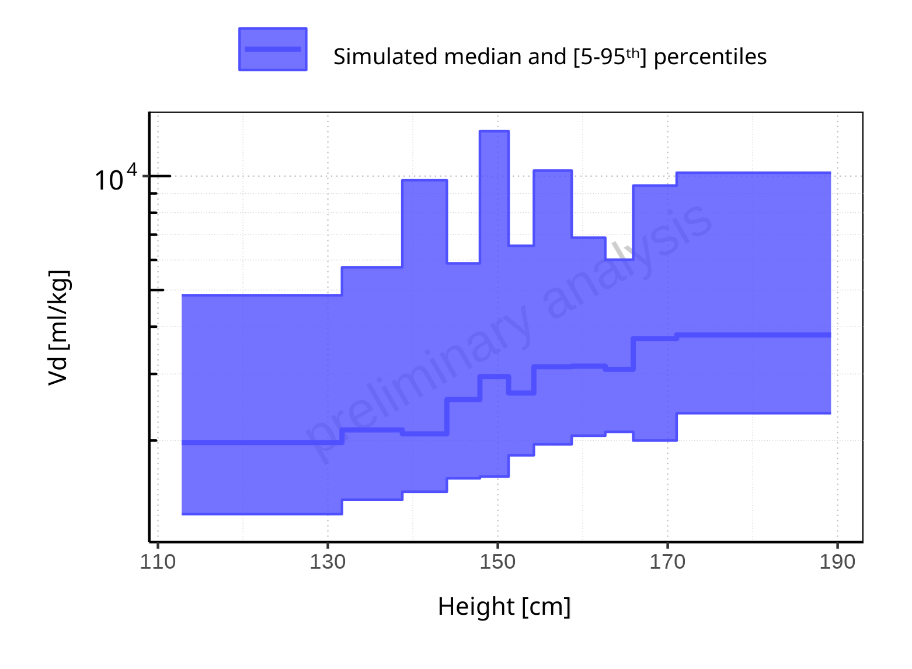


**Figure 2-347: Height-dependence of Vd for Larson 2013 8y-18y 400mg FCT meal. Profiles are plotted in a logarithmic scale.**


<br>
<br>


```{=openxml}
<w:br w:type="page"/>
```

`<w:bookmarkStart w:id="figure-2-348" w:name="figure-2-348"/><w:bookmarkEnd w:id="figure-2-348"/>`{=openxml}

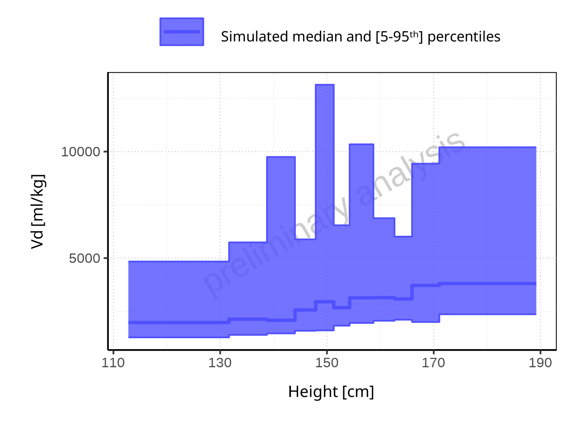


**Figure 2-348: Height-dependence of Vd for Larson 2013 8y-18y 400mg FCT meal. Profiles are plotted in a linear scale.**


<br>
<br>


```{=openxml}
<w:br w:type="page"/>
```

`<w:bookmarkStart w:id="figure-2-349" w:name="figure-2-349"/><w:bookmarkEnd w:id="figure-2-349"/>`{=openxml}


**Figure 2-349: Height-dependence of Vd for Filmcoated_tablet_400mg_sd. Profiles are plotted in a logarithmic scale.**


<br>
<br>


```{=openxml}
<w:br w:type="page"/>
```

`<w:bookmarkStart w:id="figure-2-350" w:name="figure-2-350"/><w:bookmarkEnd w:id="figure-2-350"/>`{=openxml}

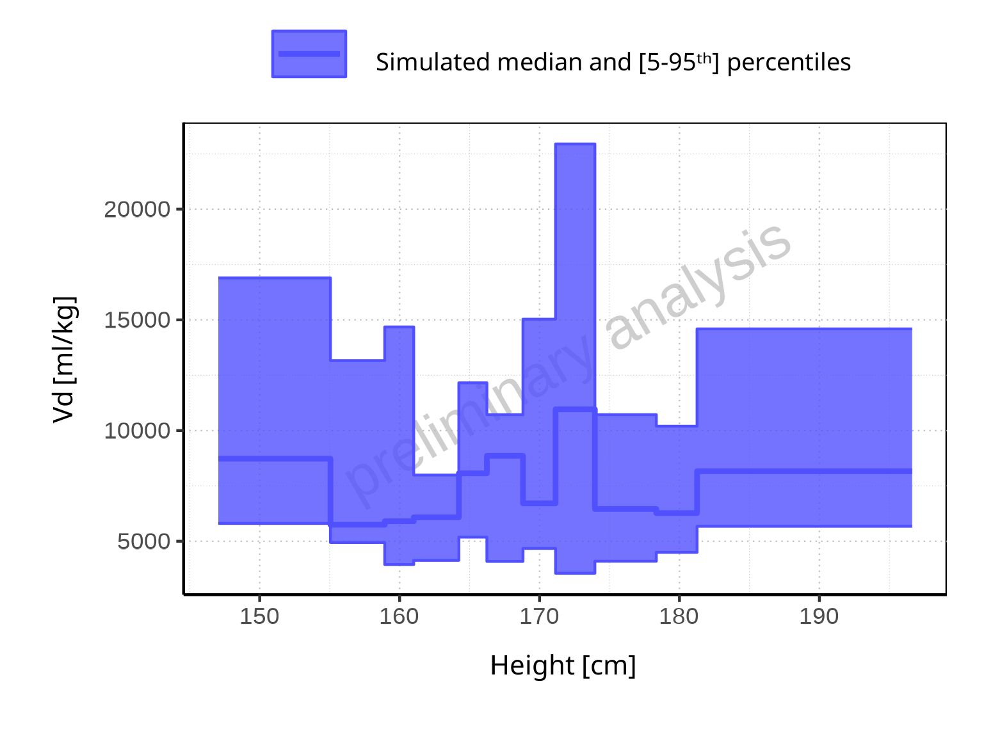


**Figure 2-350: Height-dependence of Vd for Filmcoated_tablet_400mg_sd. Profiles are plotted in a linear scale.**


<br>
<br>


```{=openxml}
<w:br w:type="page"/>
```

`<w:bookmarkStart w:id="figure-2-351" w:name="figure-2-351"/><w:bookmarkEnd w:id="figure-2-351"/>`{=openxml}

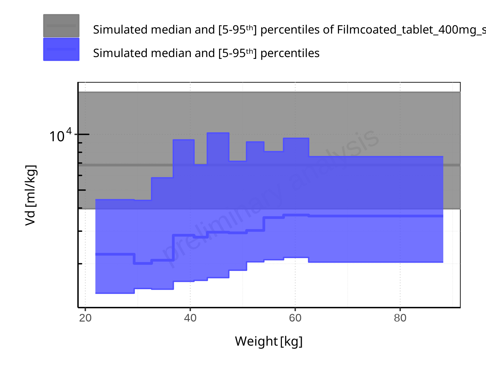


**Figure 2-351: Weight-dependence of Vd for Larson 2013 8y-18y 400mg FCT meal in comparison to Filmcoated_tablet_400mg_sd. Profiles are plotted in a logarithmic scale.**


<br>
<br>


```{=openxml}
<w:br w:type="page"/>
```

`<w:bookmarkStart w:id="figure-2-352" w:name="figure-2-352"/><w:bookmarkEnd w:id="figure-2-352"/>`{=openxml}

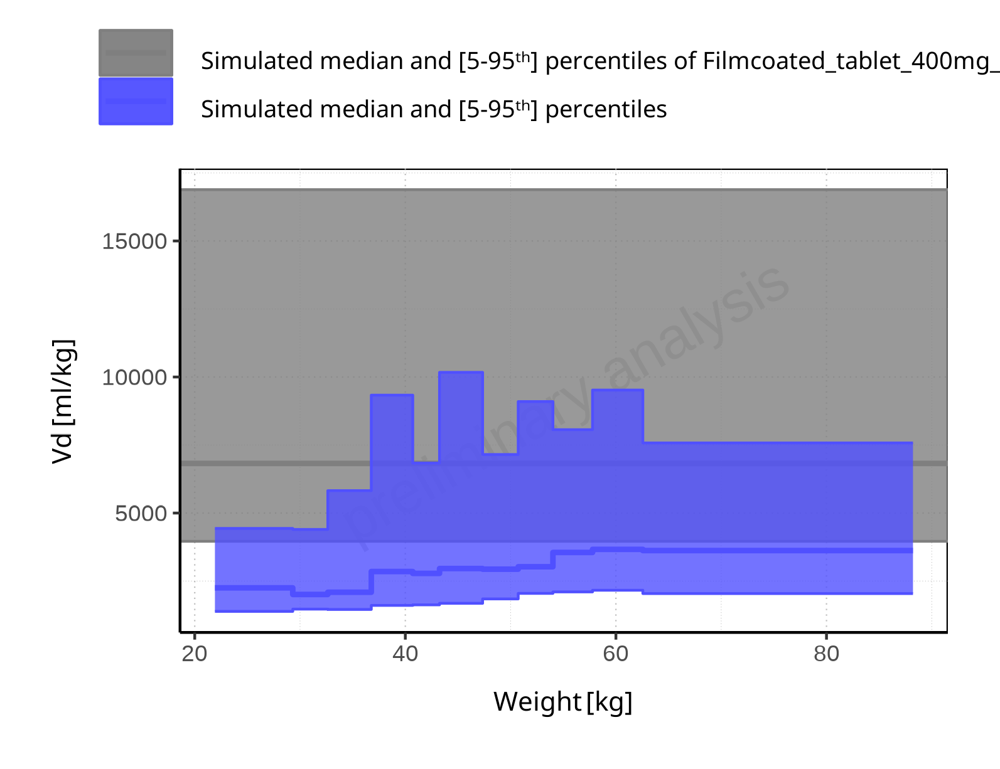


**Figure 2-352: Weight-dependence of Vd for Larson 2013 8y-18y 400mg FCT meal in comparison to Filmcoated_tablet_400mg_sd. Profiles are plotted in a linear scale.**


<br>
<br>


```{=openxml}
<w:br w:type="page"/>
```

`<w:bookmarkStart w:id="figure-2-353" w:name="figure-2-353"/><w:bookmarkEnd w:id="figure-2-353"/>`{=openxml}

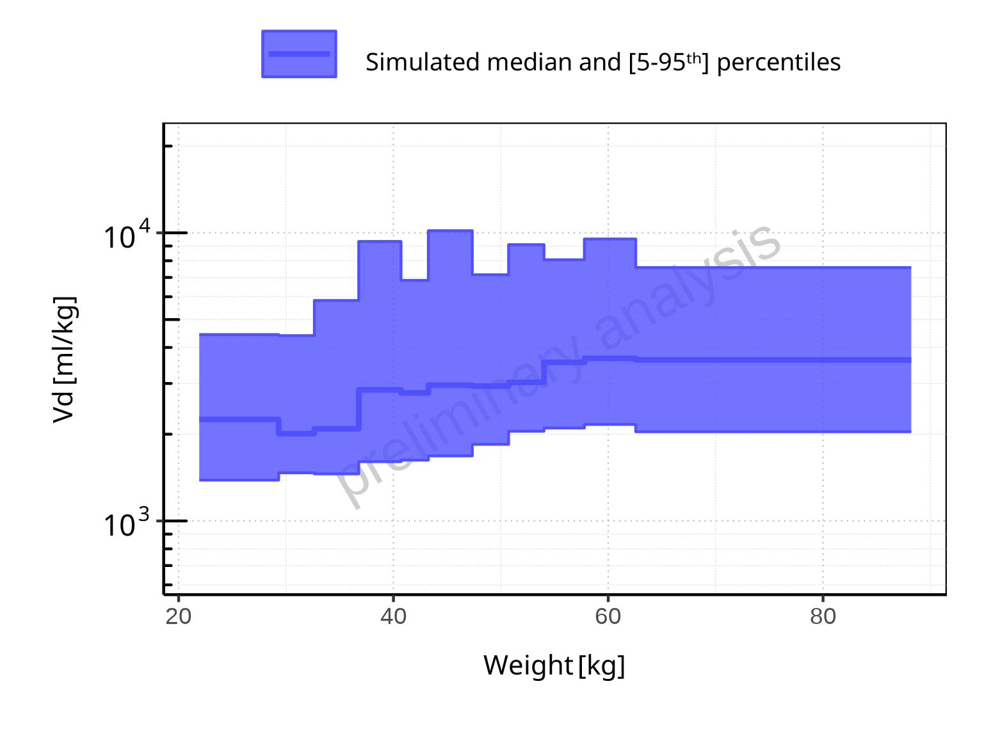


**Figure 2-353: Weight-dependence of Vd for Larson 2013 8y-18y 400mg FCT meal. Profiles are plotted in a logarithmic scale.**


<br>
<br>


```{=openxml}
<w:br w:type="page"/>
```

`<w:bookmarkStart w:id="figure-2-354" w:name="figure-2-354"/><w:bookmarkEnd w:id="figure-2-354"/>`{=openxml}

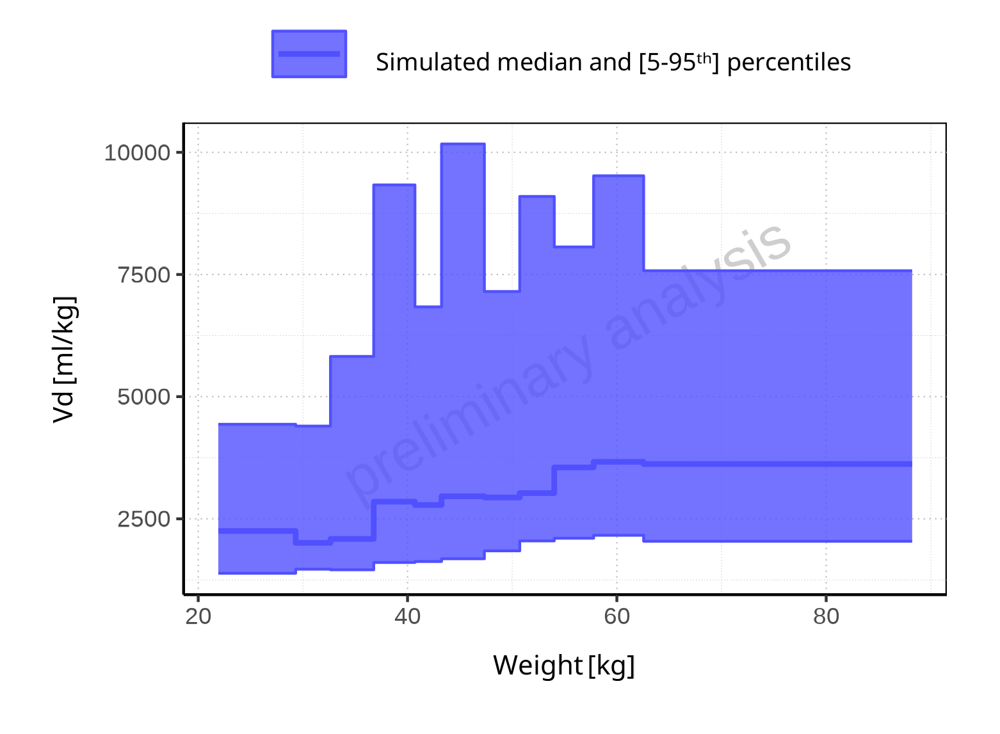


**Figure 2-354: Weight-dependence of Vd for Larson 2013 8y-18y 400mg FCT meal. Profiles are plotted in a linear scale.**


<br>
<br>


```{=openxml}
<w:br w:type="page"/>
```

`<w:bookmarkStart w:id="figure-2-355" w:name="figure-2-355"/><w:bookmarkEnd w:id="figure-2-355"/>`{=openxml}

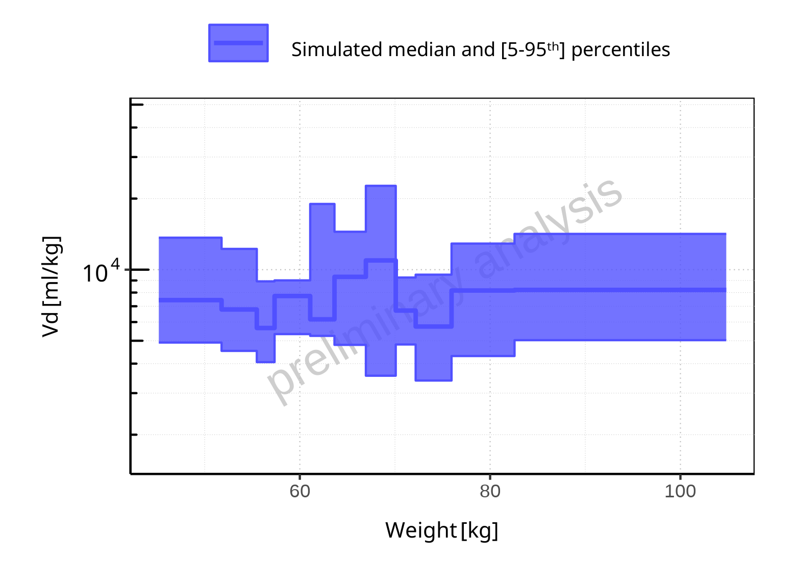


**Figure 2-355: Weight-dependence of Vd for Filmcoated_tablet_400mg_sd. Profiles are plotted in a logarithmic scale.**


<br>
<br>


```{=openxml}
<w:br w:type="page"/>
```

`<w:bookmarkStart w:id="figure-2-356" w:name="figure-2-356"/><w:bookmarkEnd w:id="figure-2-356"/>`{=openxml}

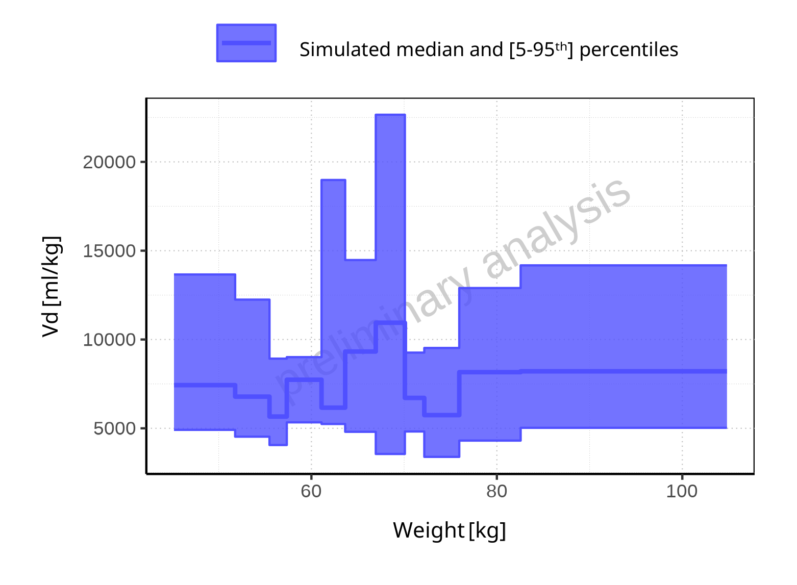


**Figure 2-356: Weight-dependence of Vd for Filmcoated_tablet_400mg_sd. Profiles are plotted in a linear scale.**


<br>
<br>


```{=openxml}
<w:br w:type="page"/>
```

`<w:bookmarkStart w:id="figure-2-357" w:name="figure-2-357"/><w:bookmarkEnd w:id="figure-2-357"/>`{=openxml}

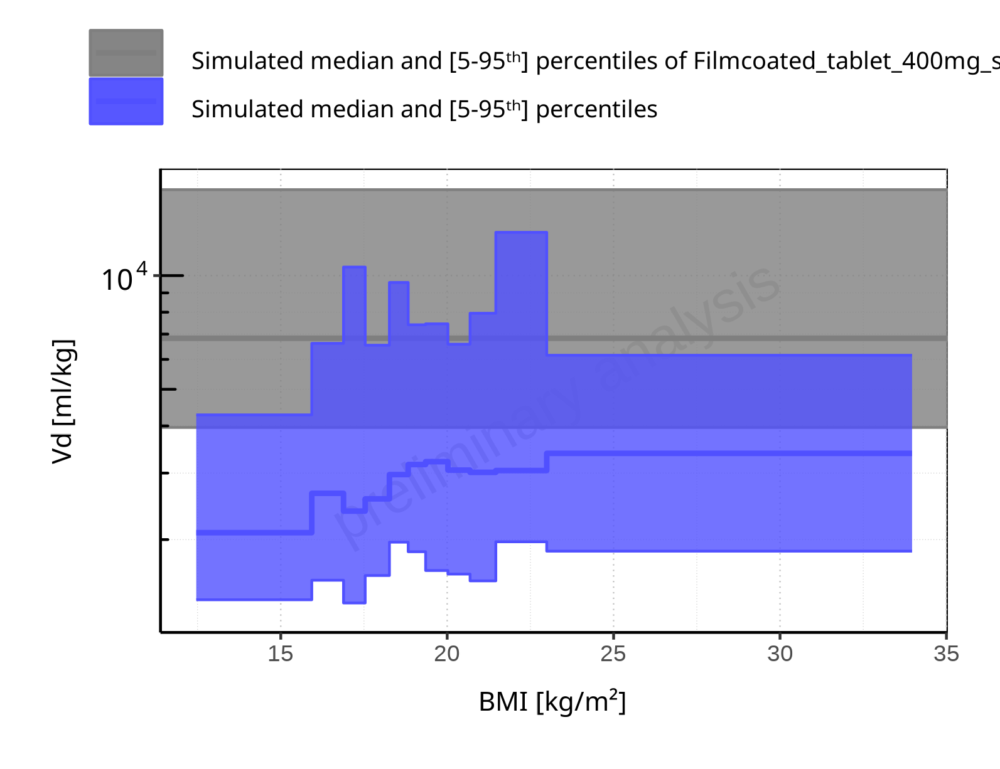


**Figure 2-357: BMI-dependence of Vd for Larson 2013 8y-18y 400mg FCT meal in comparison to Filmcoated_tablet_400mg_sd. Profiles are plotted in a logarithmic scale.**


<br>
<br>


```{=openxml}
<w:br w:type="page"/>
```

`<w:bookmarkStart w:id="figure-2-358" w:name="figure-2-358"/><w:bookmarkEnd w:id="figure-2-358"/>`{=openxml}

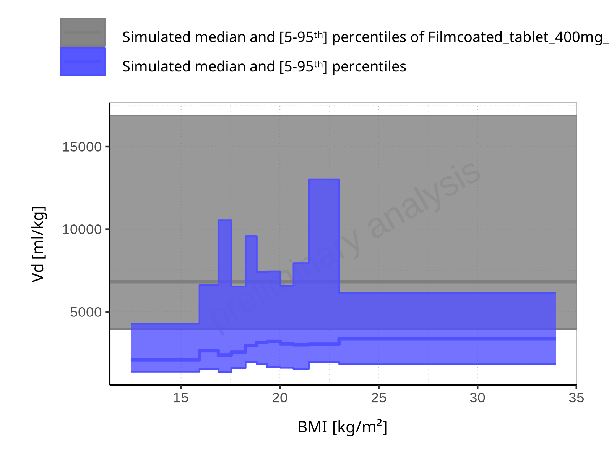


**Figure 2-358: BMI-dependence of Vd for Larson 2013 8y-18y 400mg FCT meal in comparison to Filmcoated_tablet_400mg_sd. Profiles are plotted in a linear scale.**


<br>
<br>


```{=openxml}
<w:br w:type="page"/>
```

`<w:bookmarkStart w:id="figure-2-359" w:name="figure-2-359"/><w:bookmarkEnd w:id="figure-2-359"/>`{=openxml}

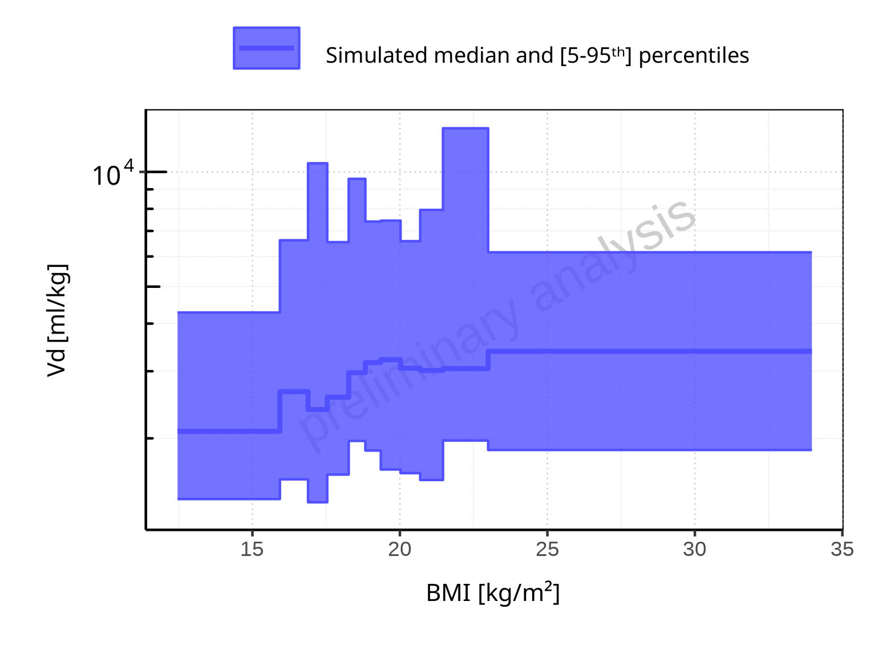


**Figure 2-359: BMI-dependence of Vd for Larson 2013 8y-18y 400mg FCT meal. Profiles are plotted in a logarithmic scale.**


<br>
<br>


```{=openxml}
<w:br w:type="page"/>
```

`<w:bookmarkStart w:id="figure-2-360" w:name="figure-2-360"/><w:bookmarkEnd w:id="figure-2-360"/>`{=openxml}

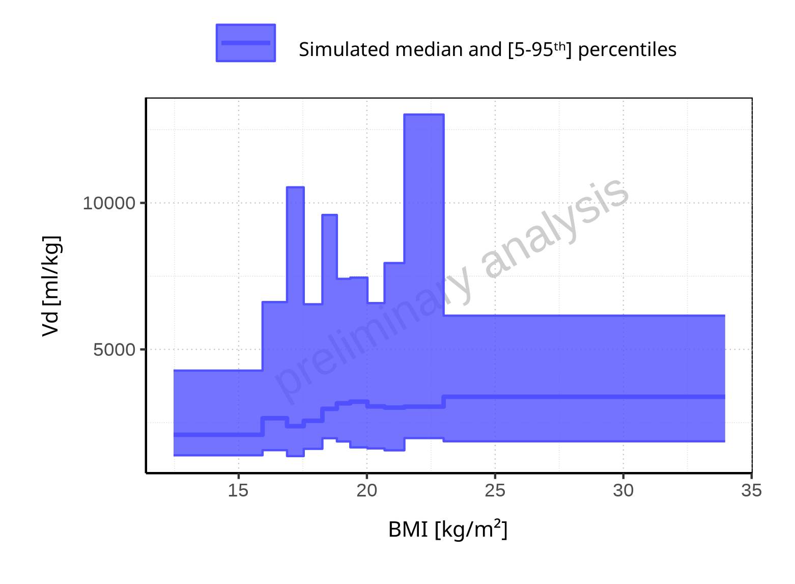


**Figure 2-360: BMI-dependence of Vd for Larson 2013 8y-18y 400mg FCT meal. Profiles are plotted in a linear scale.**


<br>
<br>


```{=openxml}
<w:br w:type="page"/>
```

`<w:bookmarkStart w:id="figure-2-361" w:name="figure-2-361"/><w:bookmarkEnd w:id="figure-2-361"/>`{=openxml}

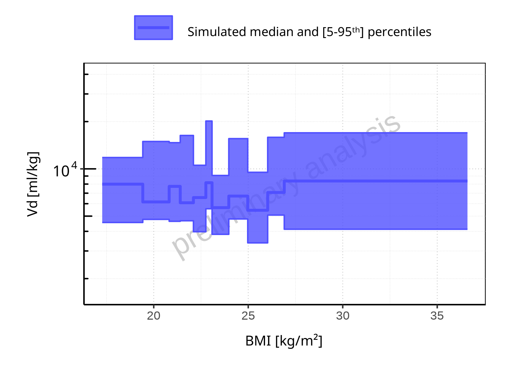


**Figure 2-361: BMI-dependence of Vd for Filmcoated_tablet_400mg_sd. Profiles are plotted in a logarithmic scale.**


<br>
<br>


```{=openxml}
<w:br w:type="page"/>
```

`<w:bookmarkStart w:id="figure-2-362" w:name="figure-2-362"/><w:bookmarkEnd w:id="figure-2-362"/>`{=openxml}

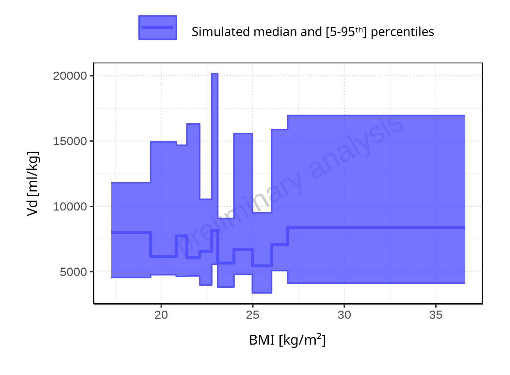


**Figure 2-362: BMI-dependence of Vd for Filmcoated_tablet_400mg_sd. Profiles are plotted in a linear scale.**


<br>
<br>


```{=openxml}
<w:br w:type="page"/>
```

`<w:bookmarkStart w:id="figure-2-363" w:name="figure-2-363"/><w:bookmarkEnd w:id="figure-2-363"/>`{=openxml}

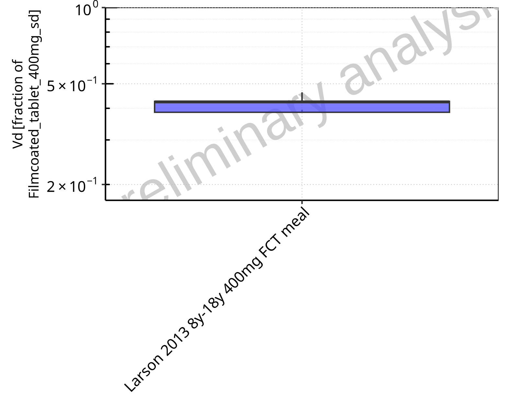


**Figure 2-363: Ratio of population summary statistics of Vd of Raltegravir  for  Larson 2013 8y-18y 400mg FCT meal in comparison to Filmcoated_tablet_400mg_sd shown as box-whisker plot, which indicates ratios of the 5^th^, 25^th^, 50^th^, 75^th^, 95^th^ percentiles in logarithmic scale.**


<br>
<br>


```{=openxml}
<w:br w:type="page"/>
```

`<w:bookmarkStart w:id="figure-2-364" w:name="figure-2-364"/><w:bookmarkEnd w:id="figure-2-364"/>`{=openxml}

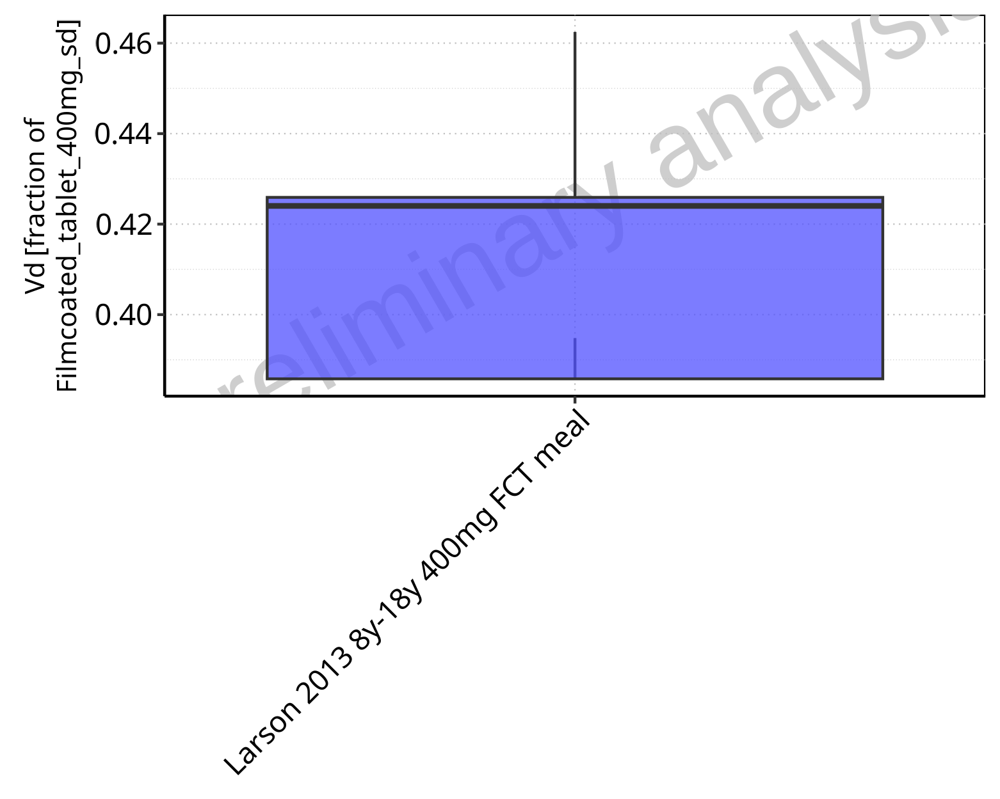


**Figure 2-364: Ratio of population summary statistics of Vd of Raltegravir  for  Larson 2013 8y-18y 400mg FCT meal in comparison to Filmcoated_tablet_400mg_sd shown as box-whisker plot, which indicates ratios of the 5^th^, 25^th^, 50^th^, 75^th^, 95^th^ percentiles in linear scale.**


<br>
<br>


```{=openxml}
<w:br w:type="page"/>
```

`<w:bookmarkStart w:id="table-2-26" w:name="table-2-26"/><w:bookmarkEnd w:id="table-2-26"/>`{=openxml}

**Table 2-26: Ratio of population summary statistics of Vd of Raltegravir  for  Larson 2013 8y-18y 400mg FCT meal in comparison to Filmcoated_tablet_400mg_sd**


|Population                        |N   |5^th^ pctl |25^th^ pctl |50^th^ pctl |75^th^ pctl |95^th^ pctl |Mean |SD   |Geo Mean |Geo SD |
|:---------------------------------|:---|:-------------------|:--------------------|:--------------------|:--------------------|:--------------------|:----|:----|:--------|:------|
|Larson 2013 8y-18y 400mg FCT meal |497 |0.39                |0.39                 |0.42                 |0.43                 |0.46                 |0.45 |0.65 |0.42     |1.09   |


<br>
<br>


# Time profiles and residual plots `<w:bookmarkStart w:id="time-profiles" w:name="time-profiles"/><w:bookmarkEnd w:id="time-profiles"/>`{=openxml}


## Time profiles and residual plots for Filmcoated_tablet_400mg_sd `<w:bookmarkStart w:id="time-profiles-filmcoated_tablet_400mg_sd" w:name="time-profiles-filmcoated_tablet_400mg_sd"/><w:bookmarkEnd w:id="time-profiles-filmcoated_tablet_400mg_sd"/>`{=openxml}


```{=openxml}
<w:br w:type="page"/>
```

`<w:bookmarkStart w:id="figure-3-1" w:name="figure-3-1"/><w:bookmarkEnd w:id="figure-3-1"/>`{=openxml}

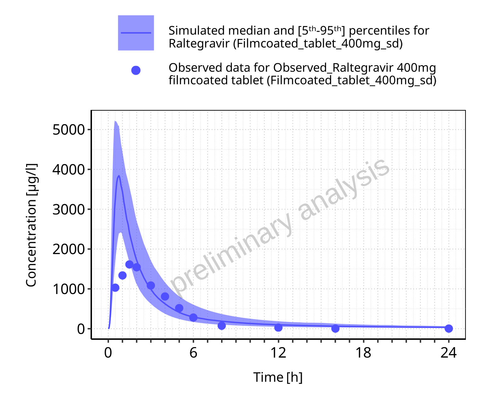


**Figure 3-1: Time profiles for Filmcoated_tablet_400mg_sd. Data source: Data/Raltegravir_PK.txt. Time profiles are plotted in a linear scale.**


<br>
<br>


```{=openxml}
<w:br w:type="page"/>
```

`<w:bookmarkStart w:id="figure-3-2" w:name="figure-3-2"/><w:bookmarkEnd w:id="figure-3-2"/>`{=openxml}

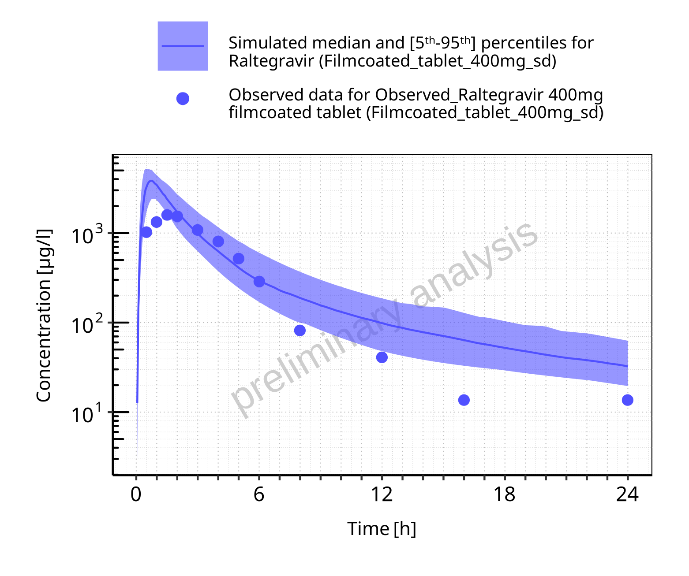


**Figure 3-2: Time profiles for Filmcoated_tablet_400mg_sd. Data source: Data/Raltegravir_PK.txt. Time profiles are plotted in a logarithmic scale.**


<br>
<br>


```{=openxml}
<w:br w:type="page"/>
```

`<w:bookmarkStart w:id="figure-3-3" w:name="figure-3-3"/><w:bookmarkEnd w:id="figure-3-3"/>`{=openxml}

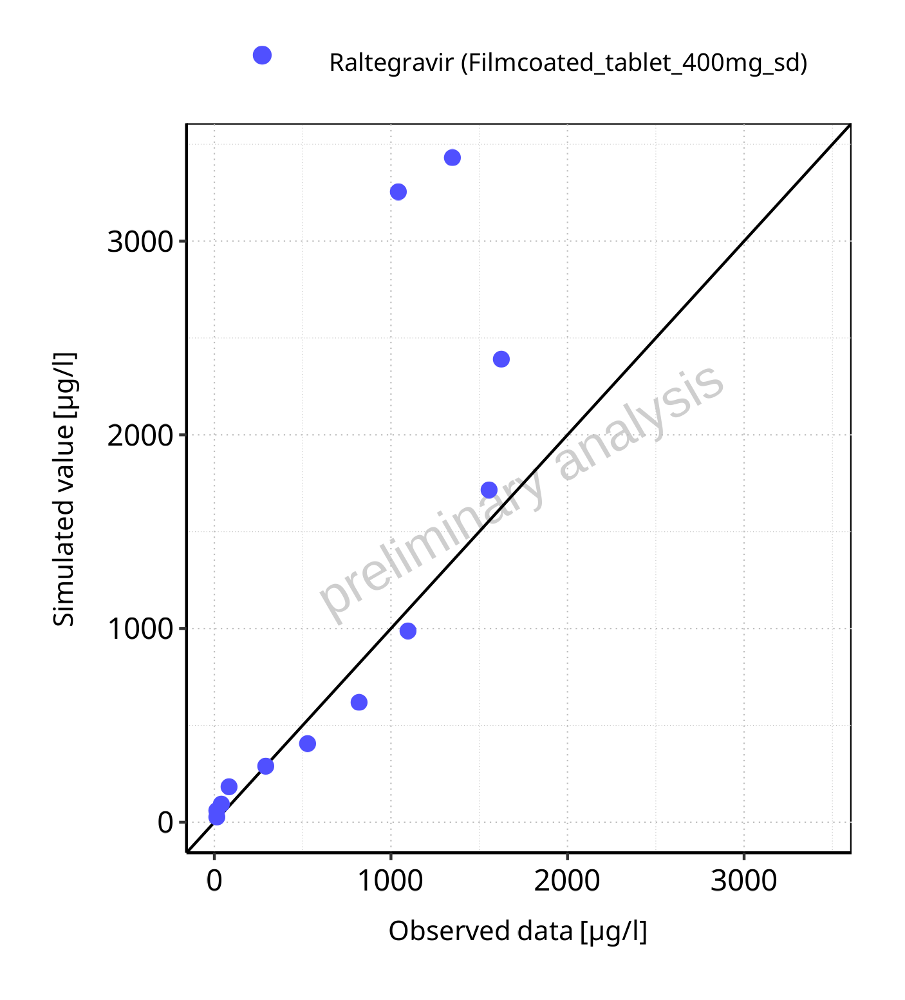


**Figure 3-3: Predicted (median) vs observed for Filmcoated_tablet_400mg_sd. Data source: Data/Raltegravir_PK.txt. Predictions and observations are plotted in a linear scale.**


<br>
<br>


```{=openxml}
<w:br w:type="page"/>
```

`<w:bookmarkStart w:id="figure-3-4" w:name="figure-3-4"/><w:bookmarkEnd w:id="figure-3-4"/>`{=openxml}


**Figure 3-4: Predicted (median) vs observed for Filmcoated_tablet_400mg_sd. Data source: Data/Raltegravir_PK.txt. Predictions and observations are plotted in a logarithmic scale.**


<br>
<br>


```{=openxml}
<w:br w:type="page"/>
```

`<w:bookmarkStart w:id="figure-3-5" w:name="figure-3-5"/><w:bookmarkEnd w:id="figure-3-5"/>`{=openxml}

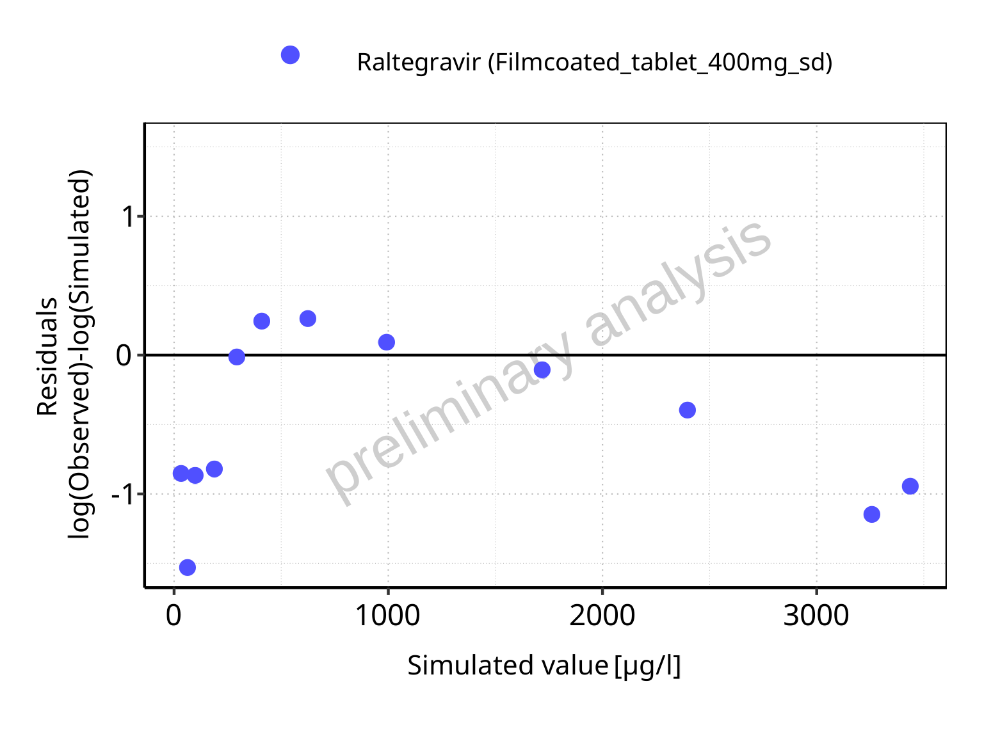


**Figure 3-5: Logarithmic residuals vs predicted (median) values for Filmcoated_tablet_400mg_sd. Data source: Data/Raltegravir_PK.txt.**


<br>
<br>


```{=openxml}
<w:br w:type="page"/>
```

`<w:bookmarkStart w:id="figure-3-6" w:name="figure-3-6"/><w:bookmarkEnd w:id="figure-3-6"/>`{=openxml}

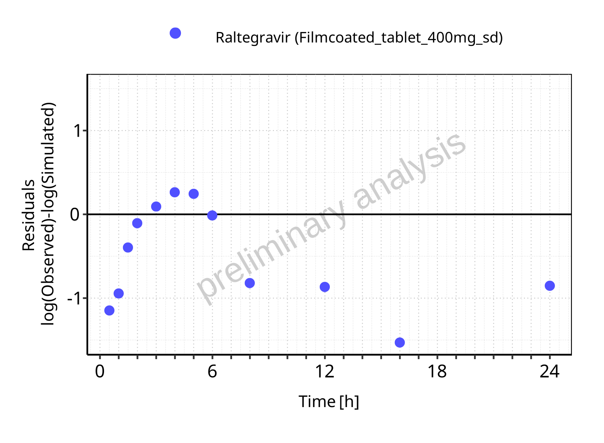


**Figure 3-6: Logarithmic residuals vs time values for Filmcoated_tablet_400mg_sd. Data source: Data/Raltegravir_PK.txt.**


<br>
<br>


```{=openxml}
<w:br w:type="page"/>
```

`<w:bookmarkStart w:id="figure-3-7" w:name="figure-3-7"/><w:bookmarkEnd w:id="figure-3-7"/>`{=openxml}

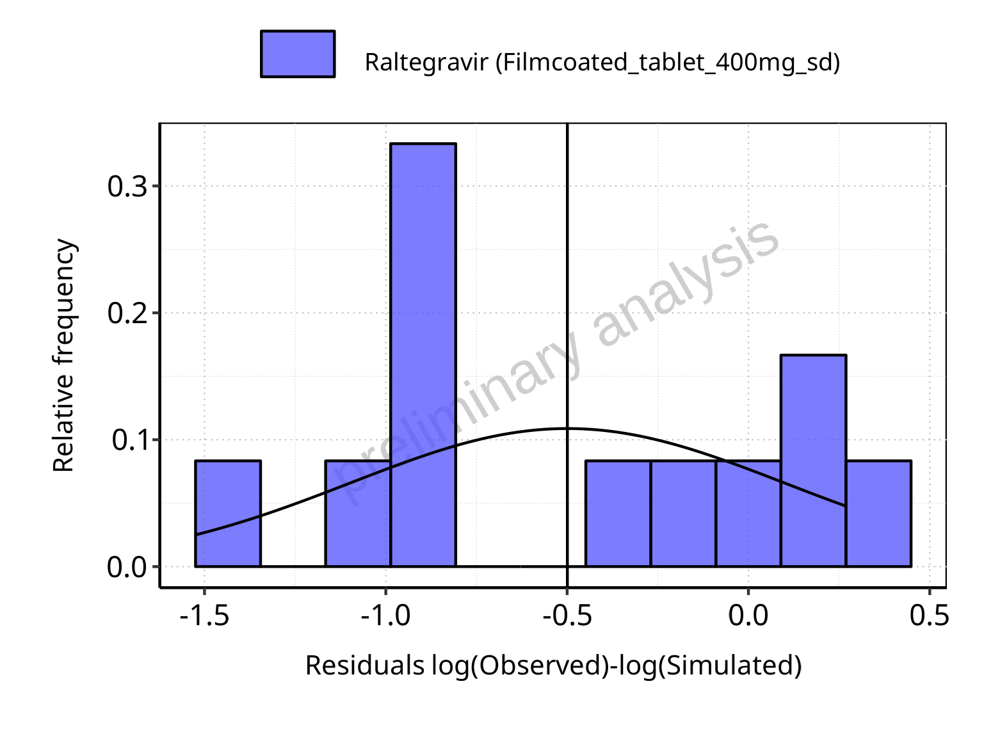


**Figure 3-7: Logarithmic residuals distribution (stacked) for Filmcoated_tablet_400mg_sd. Data source: Data/Raltegravir_PK.txt.**


<br>
<br>


```{=openxml}
<w:br w:type="page"/>
```

`<w:bookmarkStart w:id="figure-3-8" w:name="figure-3-8"/><w:bookmarkEnd w:id="figure-3-8"/>`{=openxml}

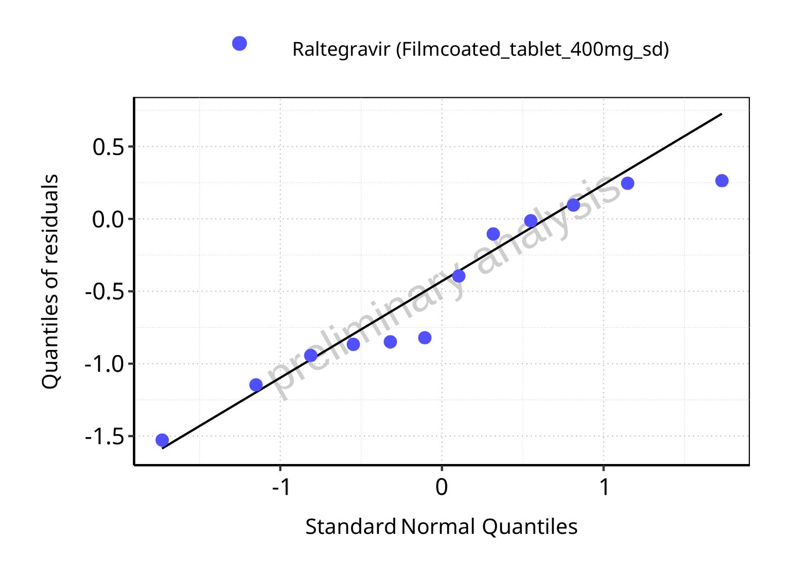


**Figure 3-8: Logarithmic residuals for Filmcoated_tablet_400mg_sd as quantile-quantile plot. Data source: Data/Raltegravir_PK.txt.**


<br>
<br>


## Time profiles and residual plots for Larson 2013 8y-18y 400mg FCT meal `<w:bookmarkStart w:id="time-profiles-larson_2013_8y_18y_400mg_fct_meal" w:name="time-profiles-larson_2013_8y_18y_400mg_fct_meal"/><w:bookmarkEnd w:id="time-profiles-larson_2013_8y_18y_400mg_fct_meal"/>`{=openxml}


```{=openxml}
<w:br w:type="page"/>
```

`<w:bookmarkStart w:id="figure-3-9" w:name="figure-3-9"/><w:bookmarkEnd w:id="figure-3-9"/>`{=openxml}

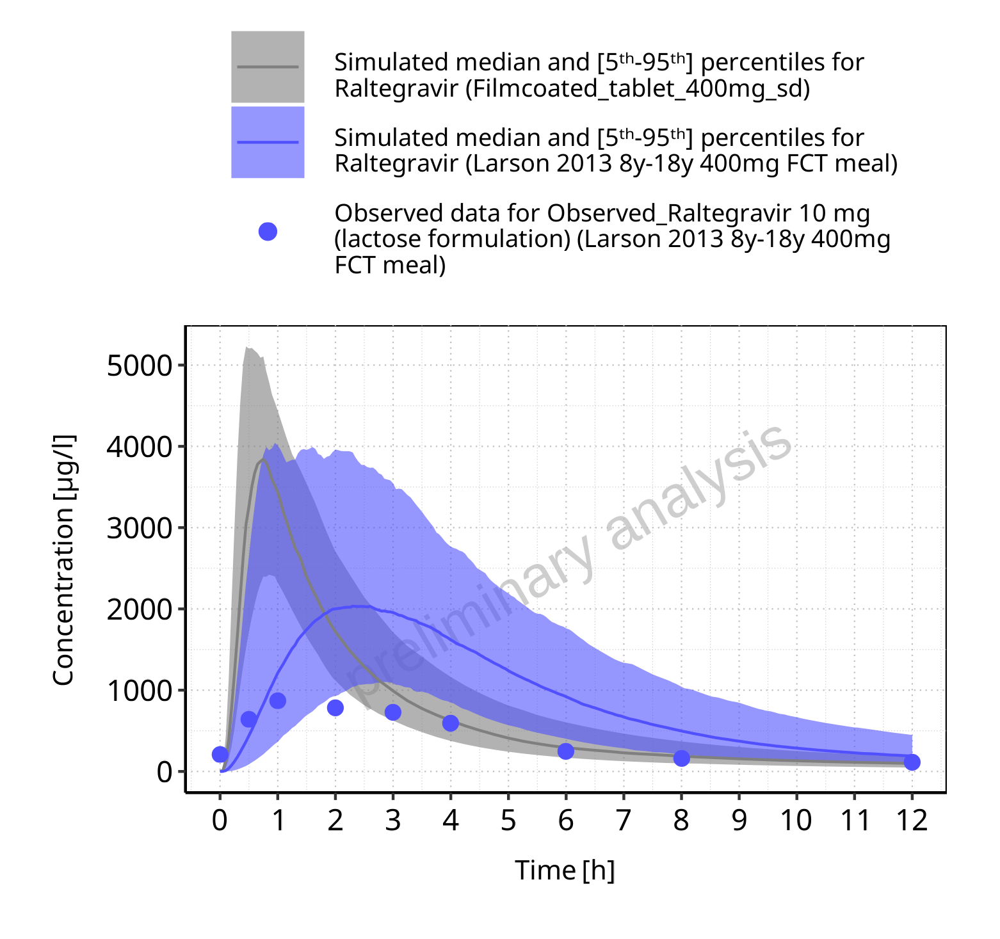


**Figure 3-9: Time profiles for Larson 2013 8y-18y 400mg FCT meal. Data source: Data/Raltegravir_PK.txt. Time profiles are plotted in a linear scale.**


<br>
<br>


```{=openxml}
<w:br w:type="page"/>
```

`<w:bookmarkStart w:id="figure-3-10" w:name="figure-3-10"/><w:bookmarkEnd w:id="figure-3-10"/>`{=openxml}

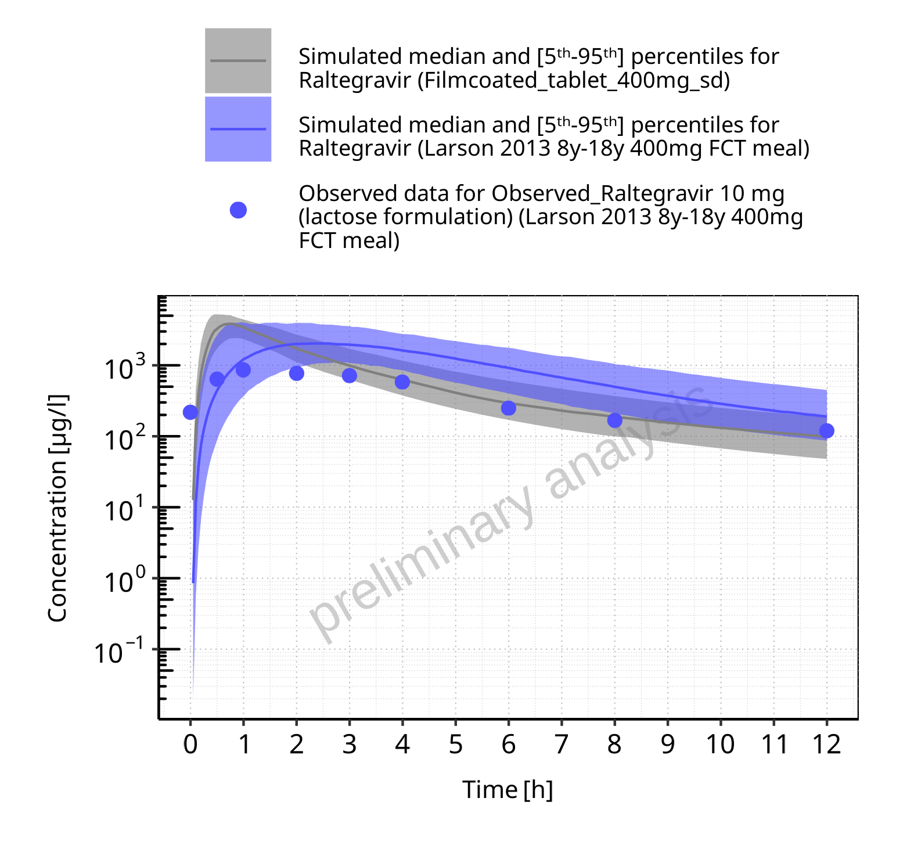


**Figure 3-10: Time profiles for Larson 2013 8y-18y 400mg FCT meal. Data source: Data/Raltegravir_PK.txt. Time profiles are plotted in a logarithmic scale.**


<br>
<br>


```{=openxml}
<w:br w:type="page"/>
```

`<w:bookmarkStart w:id="figure-3-11" w:name="figure-3-11"/><w:bookmarkEnd w:id="figure-3-11"/>`{=openxml}

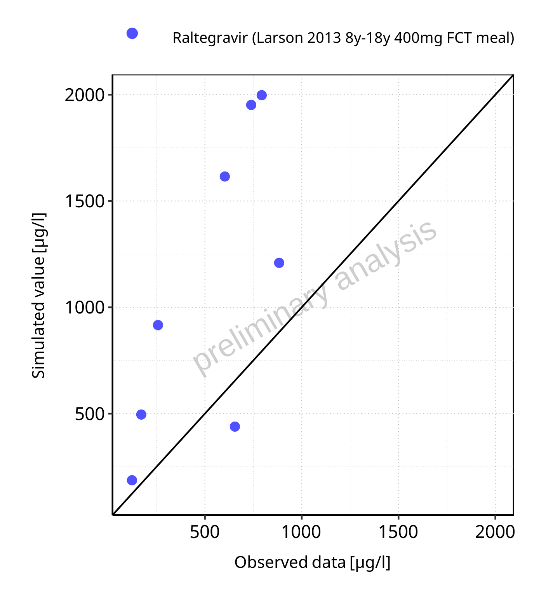


**Figure 3-11: Predicted (median) vs observed for Larson 2013 8y-18y 400mg FCT meal. Data source: Data/Raltegravir_PK.txt. Predictions and observations are plotted in a linear scale.**


<br>
<br>


```{=openxml}
<w:br w:type="page"/>
```

`<w:bookmarkStart w:id="figure-3-12" w:name="figure-3-12"/><w:bookmarkEnd w:id="figure-3-12"/>`{=openxml}


**Figure 3-12: Predicted (median) vs observed for Larson 2013 8y-18y 400mg FCT meal. Data source: Data/Raltegravir_PK.txt. Predictions and observations are plotted in a logarithmic scale.**


<br>
<br>


```{=openxml}
<w:br w:type="page"/>
```

`<w:bookmarkStart w:id="figure-3-13" w:name="figure-3-13"/><w:bookmarkEnd w:id="figure-3-13"/>`{=openxml}

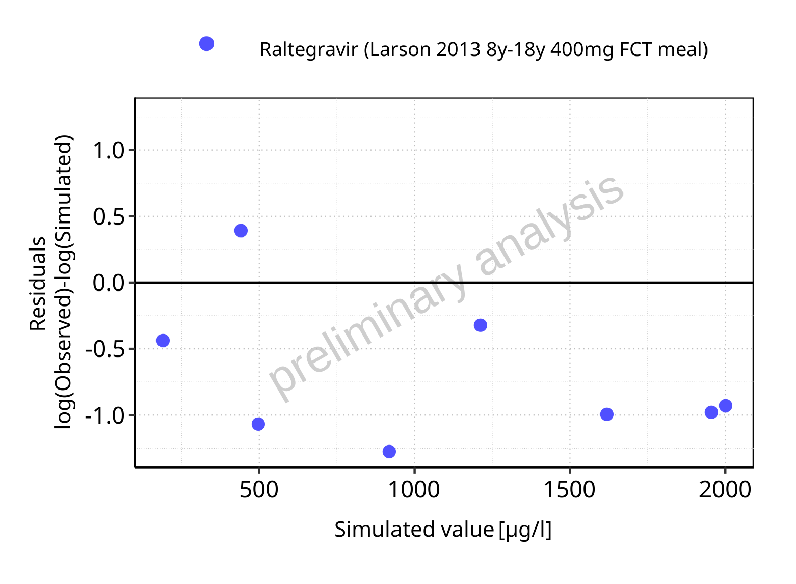


**Figure 3-13: Logarithmic residuals vs predicted (median) values for Larson 2013 8y-18y 400mg FCT meal. Data source: Data/Raltegravir_PK.txt.**


<br>
<br>


```{=openxml}
<w:br w:type="page"/>
```

`<w:bookmarkStart w:id="figure-3-14" w:name="figure-3-14"/><w:bookmarkEnd w:id="figure-3-14"/>`{=openxml}

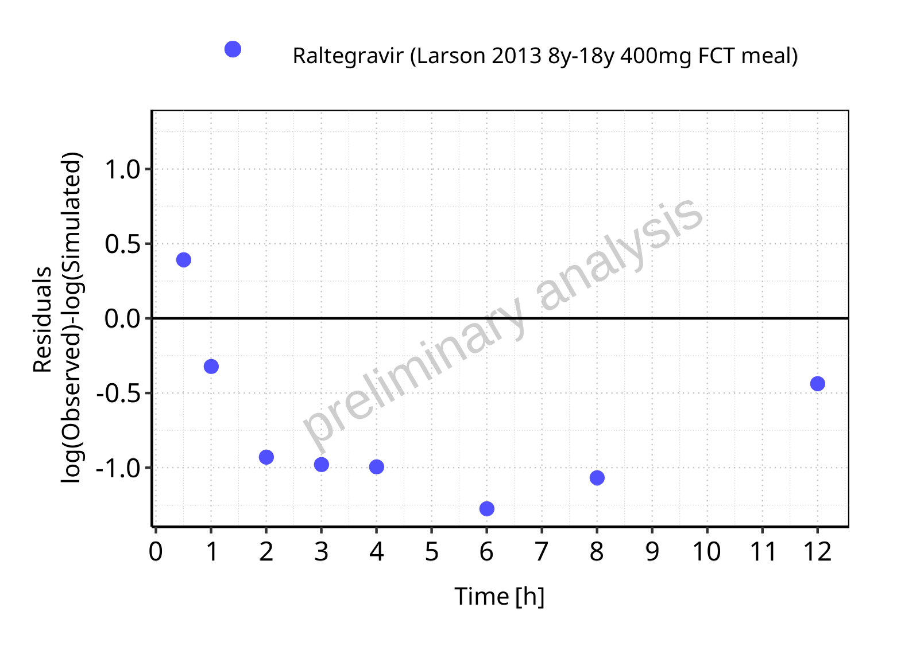


**Figure 3-14: Logarithmic residuals vs time values for Larson 2013 8y-18y 400mg FCT meal. Data source: Data/Raltegravir_PK.txt.**


<br>
<br>


```{=openxml}
<w:br w:type="page"/>
```

`<w:bookmarkStart w:id="figure-3-15" w:name="figure-3-15"/><w:bookmarkEnd w:id="figure-3-15"/>`{=openxml}

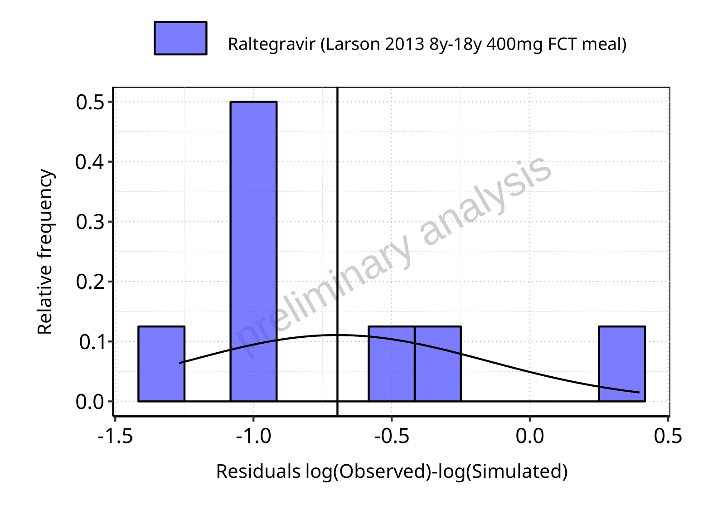


**Figure 3-15: Logarithmic residuals distribution (stacked) for Larson 2013 8y-18y 400mg FCT meal. Data source: Data/Raltegravir_PK.txt.**


<br>
<br>


```{=openxml}
<w:br w:type="page"/>
```

`<w:bookmarkStart w:id="figure-3-16" w:name="figure-3-16"/><w:bookmarkEnd w:id="figure-3-16"/>`{=openxml}

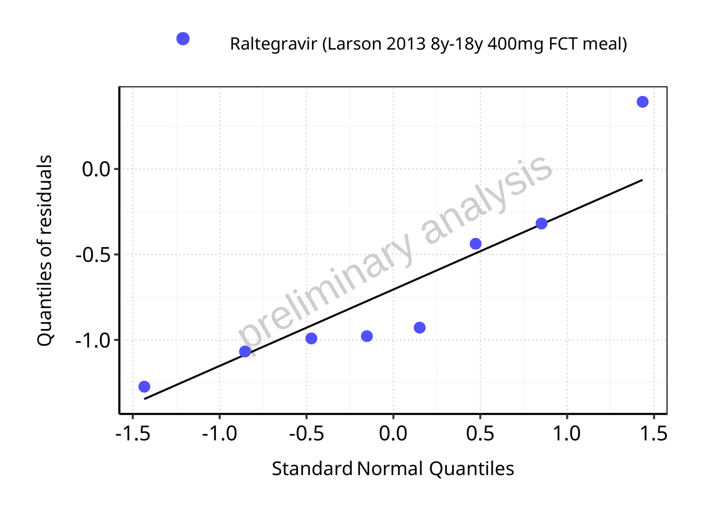


**Figure 3-16: Logarithmic residuals for Larson 2013 8y-18y 400mg FCT meal as quantile-quantile plot. Data source: Data/Raltegravir_PK.txt.**


<br>
<br>


## Residuals across all simulations `<w:bookmarkStart w:id="time-profiles-residuals-across-all-simulations" w:name="time-profiles-residuals-across-all-simulations"/><w:bookmarkEnd w:id="time-profiles-residuals-across-all-simulations"/>`{=openxml}


```{=openxml}
<w:br w:type="page"/>
```

`<w:bookmarkStart w:id="figure-3-17" w:name="figure-3-17"/><w:bookmarkEnd w:id="figure-3-17"/>`{=openxml}

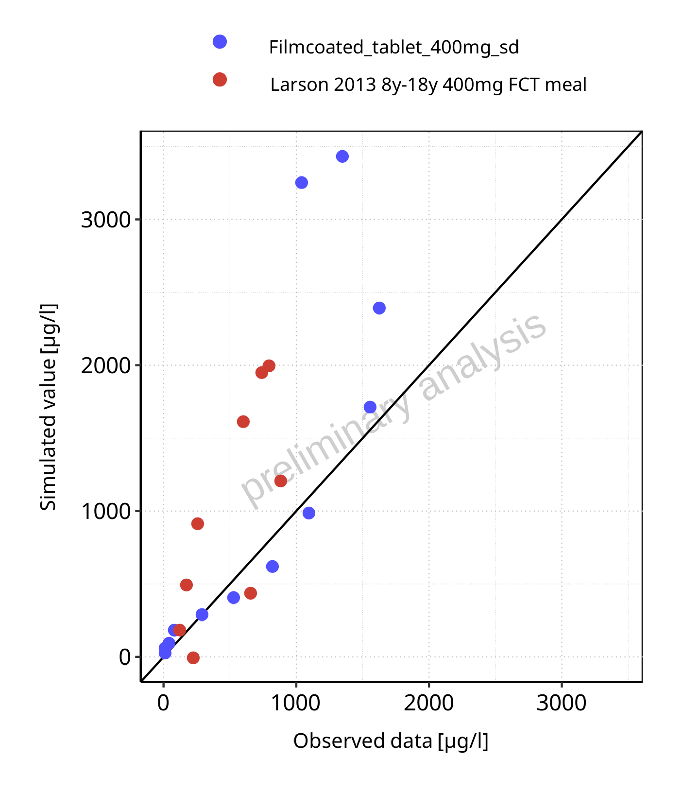


**Figure 3-17: Predicted vs observed for Raltegravir across Filmcoated_tablet_400mg_sd, Larson 2013 8y-18y 400mg FCT meal. Predictions and observations are plotted in a linear scale.**


<br>
<br>


```{=openxml}
<w:br w:type="page"/>
```

`<w:bookmarkStart w:id="figure-3-18" w:name="figure-3-18"/><w:bookmarkEnd w:id="figure-3-18"/>`{=openxml}

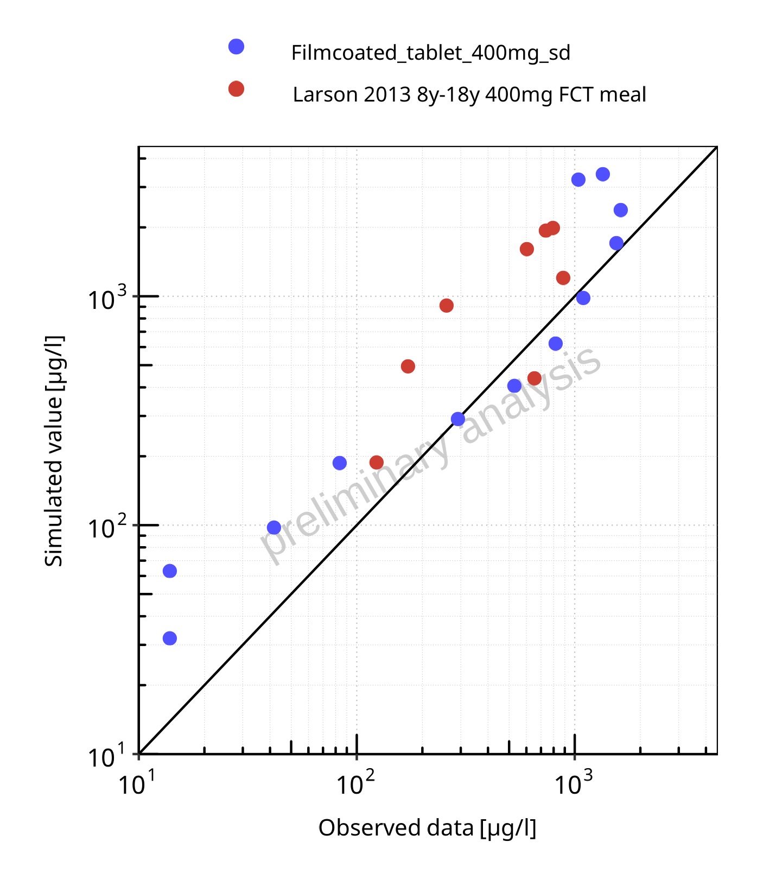


**Figure 3-18: Predicted vs observed for Raltegravir across Filmcoated_tablet_400mg_sd, Larson 2013 8y-18y 400mg FCT meal. Predictions and observations are plotted in a logarithmic scale.**


<br>
<br>


```{=openxml}
<w:br w:type="page"/>
```

`<w:bookmarkStart w:id="figure-3-19" w:name="figure-3-19"/><w:bookmarkEnd w:id="figure-3-19"/>`{=openxml}

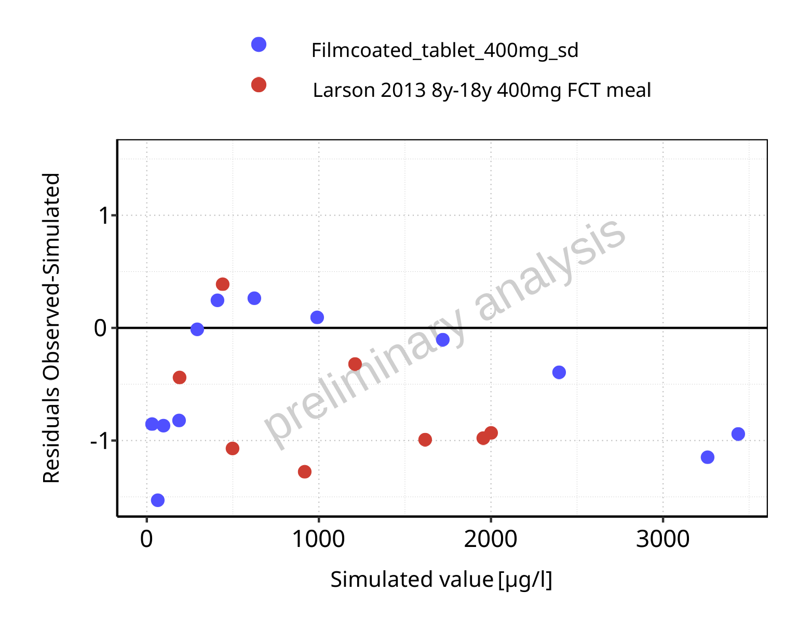


**Figure 3-19: Logarithmic residuals vs predicted values for Raltegravir across Filmcoated_tablet_400mg_sd, Larson 2013 8y-18y 400mg FCT meal.**


<br>
<br>


```{=openxml}
<w:br w:type="page"/>
```

`<w:bookmarkStart w:id="figure-3-20" w:name="figure-3-20"/><w:bookmarkEnd w:id="figure-3-20"/>`{=openxml}

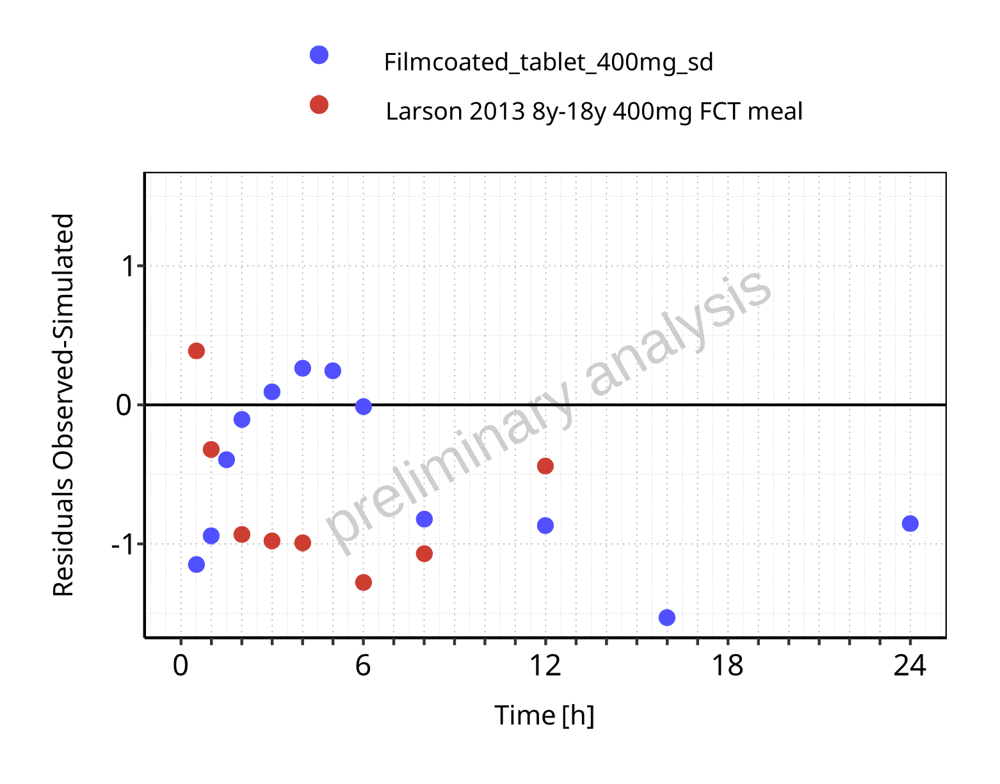


**Figure 3-20: Logarithmic residuals vs time values for Raltegravir across Filmcoated_tablet_400mg_sd, Larson 2013 8y-18y 400mg FCT meal.**


<br>
<br>


```{=openxml}
<w:br w:type="page"/>
```

`<w:bookmarkStart w:id="figure-3-21" w:name="figure-3-21"/><w:bookmarkEnd w:id="figure-3-21"/>`{=openxml}

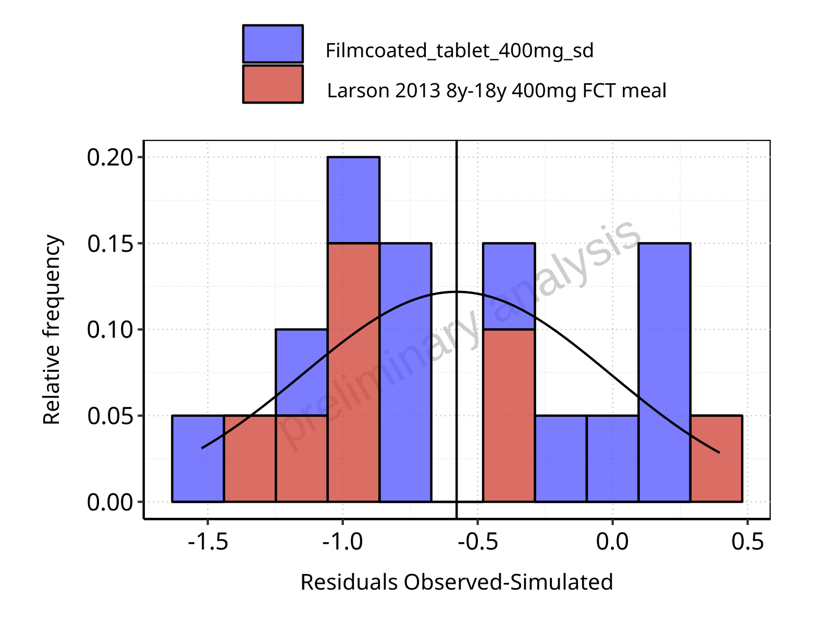


**Figure 3-21: Logarithmic residuals distribution (stacked) for Raltegravir across Filmcoated_tablet_400mg_sd, Larson 2013 8y-18y 400mg FCT meal.**


<br>
<br>


```{=openxml}
<w:br w:type="page"/>
```

`<w:bookmarkStart w:id="figure-3-22" w:name="figure-3-22"/><w:bookmarkEnd w:id="figure-3-22"/>`{=openxml}

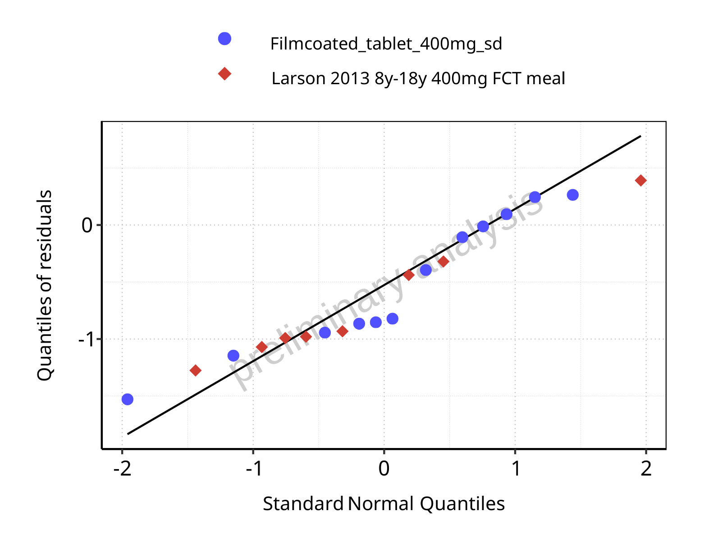


**Figure 3-22: Logarithmic residuals for Raltegravir across Filmcoated_tablet_400mg_sd, Larson 2013 8y-18y 400mg FCT meal as quantile-quantile plot.**


<br>
<br>


# Demography `<w:bookmarkStart w:id="demography" w:name="demography"/><w:bookmarkEnd w:id="demography"/>`{=openxml}


## Age-dependence `<w:bookmarkStart w:id="1_demography_organism_age" w:name="1_demography_organism_age"/><w:bookmarkEnd w:id="1_demography_organism_age"/>`{=openxml}


### Height `<w:bookmarkStart w:id="2_demography_organism_age_organism_height" w:name="2_demography_organism_age_organism_height"/><w:bookmarkEnd w:id="2_demography_organism_age_organism_height"/>`{=openxml}


#### For Larson 2013 8y-18y 400mg FCT meal `<w:bookmarkStart w:id="3_demography_organism_age_organism_height" w:name="3_demography_organism_age_organism_height"/><w:bookmarkEnd w:id="3_demography_organism_age_organism_height"/>`{=openxml}


```{=openxml}
<w:br w:type="page"/>
```

`<w:bookmarkStart w:id="figure-4-1" w:name="figure-4-1"/><w:bookmarkEnd w:id="figure-4-1"/>`{=openxml}

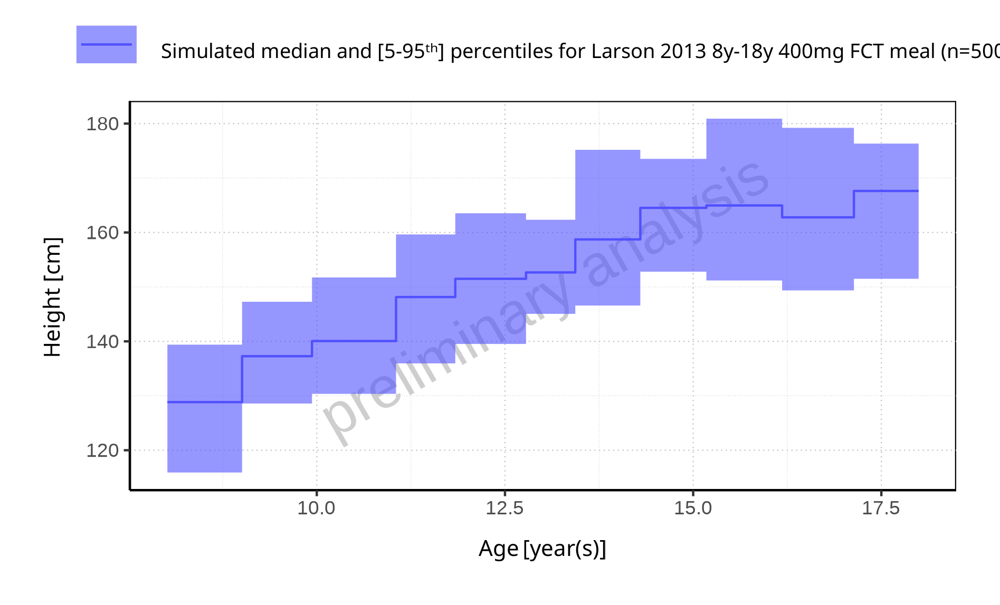


**Figure 4-1: Age-dependence of Height for Larson 2013 8y-18y 400mg FCT meal. Profiles are plotted in a linear scale**


<br>
<br>


```{=openxml}
<w:br w:type="page"/>
```

`<w:bookmarkStart w:id="figure-4-2" w:name="figure-4-2"/><w:bookmarkEnd w:id="figure-4-2"/>`{=openxml}

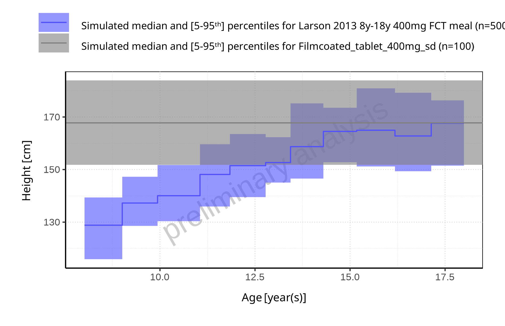


**Figure 4-2: Age-dependence of Height for Larson 2013 8y-18y 400mg FCT meal in comparison to Filmcoated_tablet_400mg_sd. Profiles are plotted in a linear scale**


<br>
<br>


#### For Filmcoated_tablet_400mg_sd `<w:bookmarkStart w:id="6_demography_organism_age_organism_height" w:name="6_demography_organism_age_organism_height"/><w:bookmarkEnd w:id="6_demography_organism_age_organism_height"/>`{=openxml}


```{=openxml}
<w:br w:type="page"/>
```

`<w:bookmarkStart w:id="figure-4-3" w:name="figure-4-3"/><w:bookmarkEnd w:id="figure-4-3"/>`{=openxml}

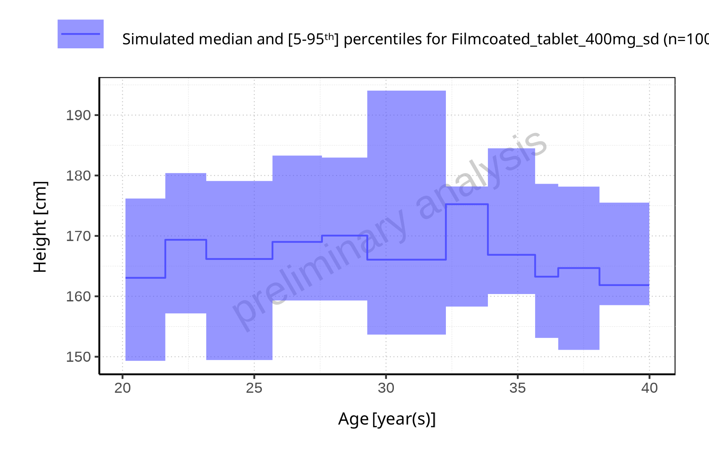


**Figure 4-3: Age-dependence of Height for Filmcoated_tablet_400mg_sd. Profiles are plotted in a linear scale**


<br>
<br>


### Weight `<w:bookmarkStart w:id="8_demography_organism_age_organism_weight" w:name="8_demography_organism_age_organism_weight"/><w:bookmarkEnd w:id="8_demography_organism_age_organism_weight"/>`{=openxml}


#### For Larson 2013 8y-18y 400mg FCT meal `<w:bookmarkStart w:id="9_demography_organism_age_organism_weight" w:name="9_demography_organism_age_organism_weight"/><w:bookmarkEnd w:id="9_demography_organism_age_organism_weight"/>`{=openxml}


```{=openxml}
<w:br w:type="page"/>
```

`<w:bookmarkStart w:id="figure-4-4" w:name="figure-4-4"/><w:bookmarkEnd w:id="figure-4-4"/>`{=openxml}

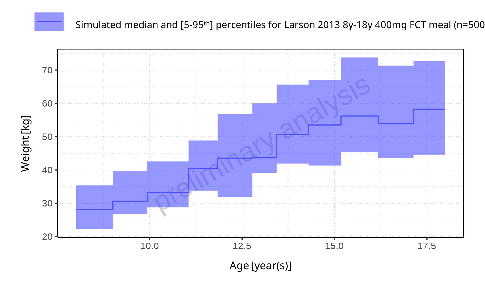


**Figure 4-4: Age-dependence of Weight for Larson 2013 8y-18y 400mg FCT meal. Profiles are plotted in a linear scale**


<br>
<br>


```{=openxml}
<w:br w:type="page"/>
```

`<w:bookmarkStart w:id="figure-4-5" w:name="figure-4-5"/><w:bookmarkEnd w:id="figure-4-5"/>`{=openxml}

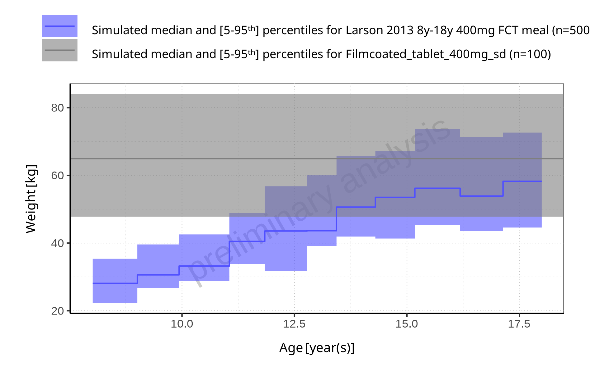


**Figure 4-5: Age-dependence of Weight for Larson 2013 8y-18y 400mg FCT meal in comparison to Filmcoated_tablet_400mg_sd. Profiles are plotted in a linear scale**


<br>
<br>


#### For Filmcoated_tablet_400mg_sd `<w:bookmarkStart w:id="12_demography_organism_age_organism_weight" w:name="12_demography_organism_age_organism_weight"/><w:bookmarkEnd w:id="12_demography_organism_age_organism_weight"/>`{=openxml}


```{=openxml}
<w:br w:type="page"/>
```

`<w:bookmarkStart w:id="figure-4-6" w:name="figure-4-6"/><w:bookmarkEnd w:id="figure-4-6"/>`{=openxml}

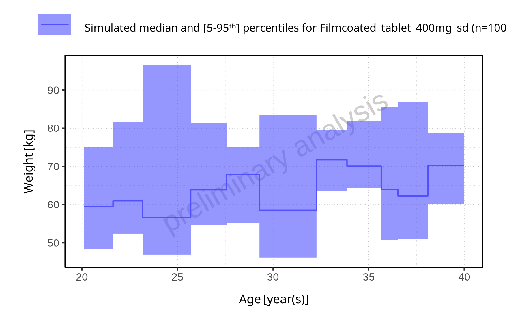


**Figure 4-6: Age-dependence of Weight for Filmcoated_tablet_400mg_sd. Profiles are plotted in a linear scale**


<br>
<br>


### BMI `<w:bookmarkStart w:id="14_demography_organism_age_organism_bmi" w:name="14_demography_organism_age_organism_bmi"/><w:bookmarkEnd w:id="14_demography_organism_age_organism_bmi"/>`{=openxml}


#### For Larson 2013 8y-18y 400mg FCT meal `<w:bookmarkStart w:id="15_demography_organism_age_organism_bmi" w:name="15_demography_organism_age_organism_bmi"/><w:bookmarkEnd w:id="15_demography_organism_age_organism_bmi"/>`{=openxml}


```{=openxml}
<w:br w:type="page"/>
```

`<w:bookmarkStart w:id="figure-4-7" w:name="figure-4-7"/><w:bookmarkEnd w:id="figure-4-7"/>`{=openxml}

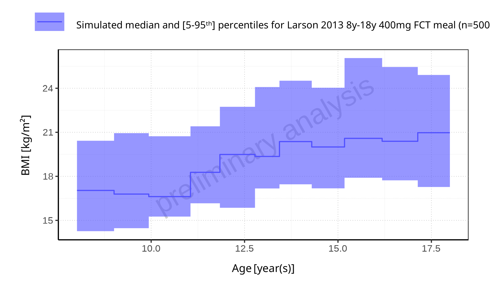


**Figure 4-7: Age-dependence of BMI for Larson 2013 8y-18y 400mg FCT meal. Profiles are plotted in a linear scale**


<br>
<br>


```{=openxml}
<w:br w:type="page"/>
```

`<w:bookmarkStart w:id="figure-4-8" w:name="figure-4-8"/><w:bookmarkEnd w:id="figure-4-8"/>`{=openxml}

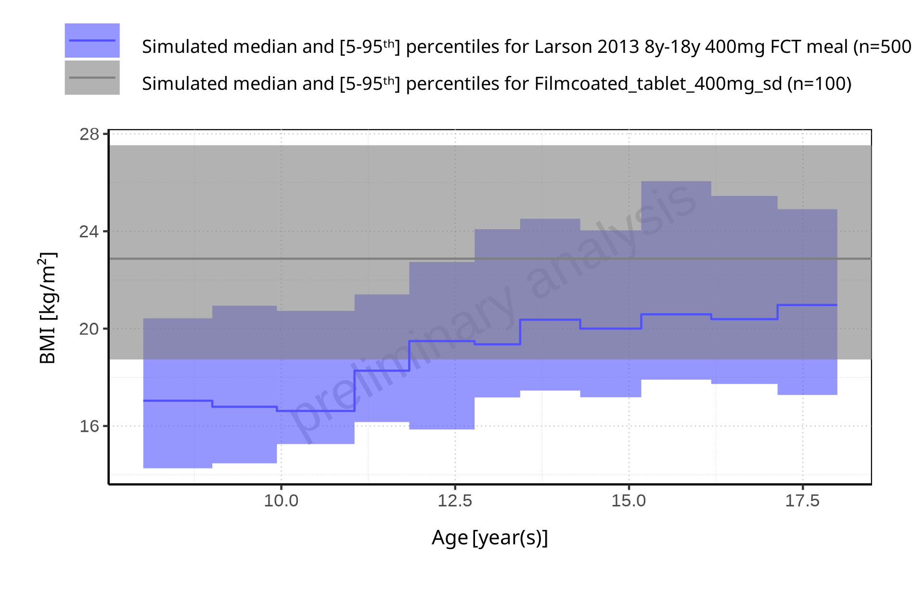


**Figure 4-8: Age-dependence of BMI for Larson 2013 8y-18y 400mg FCT meal in comparison to Filmcoated_tablet_400mg_sd. Profiles are plotted in a linear scale**


<br>
<br>


#### For Filmcoated_tablet_400mg_sd `<w:bookmarkStart w:id="18_demography_organism_age_organism_bmi" w:name="18_demography_organism_age_organism_bmi"/><w:bookmarkEnd w:id="18_demography_organism_age_organism_bmi"/>`{=openxml}


```{=openxml}
<w:br w:type="page"/>
```

`<w:bookmarkStart w:id="figure-4-9" w:name="figure-4-9"/><w:bookmarkEnd w:id="figure-4-9"/>`{=openxml}

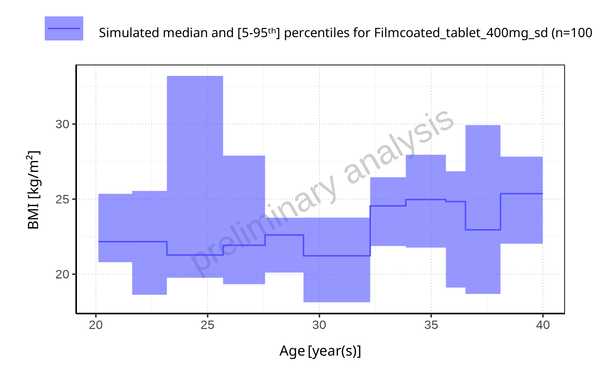


**Figure 4-9: Age-dependence of BMI for Filmcoated_tablet_400mg_sd. Profiles are plotted in a linear scale**


<br>
<br>


