# Table of Contents

 * [1 Sensitivity Analysis ](#sensitivity-analysis)
 * [2 PK parameters ](#pk-parameters)
   * [2.1 PK Parameters of Raltegravir ](#1_pk_parameters_organism_peripheralvenousblood_raltegravir_plasma__peripheral_venous_blood_)
     * [2.1.1 C_max ](#2_pk_parameters_organism_peripheralvenousblood_raltegravir_plasma__peripheral_venous_blood__c_max)
     * [2.1.2 C_max_norm ](#31_pk_parameters_organism_peripheralvenousblood_raltegravir_plasma__peripheral_venous_blood__c_max_norm)
     * [2.1.3 t_max ](#60_pk_parameters_organism_peripheralvenousblood_raltegravir_plasma__peripheral_venous_blood__t_max)
     * [2.1.4 C_tEnd ](#89_pk_parameters_organism_peripheralvenousblood_raltegravir_plasma__peripheral_venous_blood__c_tend)
     * [2.1.5 AUC ](#118_pk_parameters_organism_peripheralvenousblood_raltegravir_plasma__peripheral_venous_blood__auc_tend)
     * [2.1.6 AUC_norm ](#147_pk_parameters_organism_peripheralvenousblood_raltegravir_plasma__peripheral_venous_blood__auc_tend_norm)
     * [2.1.7 AUC_inf ](#176_pk_parameters_organism_peripheralvenousblood_raltegravir_plasma__peripheral_venous_blood__auc_inf)
     * [2.1.8 AUC_inf_norm ](#205_pk_parameters_organism_peripheralvenousblood_raltegravir_plasma__peripheral_venous_blood__auc_inf_norm)
     * [2.1.9 MRT ](#234_pk_parameters_organism_peripheralvenousblood_raltegravir_plasma__peripheral_venous_blood__mrt)
     * [2.1.10 Thalf ](#263_pk_parameters_organism_peripheralvenousblood_raltegravir_plasma__peripheral_venous_blood__thalf)
     * [2.1.11 CL ](#292_pk_parameters_organism_peripheralvenousblood_raltegravir_plasma__peripheral_venous_blood__cl)
     * [2.1.12 Vss ](#321_pk_parameters_organism_peripheralvenousblood_raltegravir_plasma__peripheral_venous_blood__vss)
     * [2.1.13 Vd ](#350_pk_parameters_organism_peripheralvenousblood_raltegravir_plasma__peripheral_venous_blood__vd)
 * [3 Time profiles and residual plots ](#time-profiles)
   * [3.1 Time profiles and residual plots for Filmcoated_tablet_400mg_sd ](#time-profiles-filmcoated_tablet_400mg_sd)
   * [3.2 Time profiles and residual plots for Larson 2013 8y-18y 400mg FCT meal ](#time-profiles-larson_2013_8y_18y_400mg_fct_meal)
   * [3.3 Residuals across all simulations ](#time-profiles-residuals-across-all-simulations)
 * [4 Demography ](#demography)
   * [4.1 Age-dependence ](#1_demography_organism_age)
     * [4.1.1 Height ](#2_demography_organism_age_organism_height)
       * [4.1.1.1 For Larson 2013 8y-18y 400mg FCT meal ](#3_demography_organism_age_organism_height)
       * [4.1.1.2 For Filmcoated_tablet_400mg_sd ](#6_demography_organism_age_organism_height)
     * [4.1.2 Weight ](#8_demography_organism_age_organism_weight)
       * [4.1.2.1 For Larson 2013 8y-18y 400mg FCT meal ](#9_demography_organism_age_organism_weight)
       * [4.1.2.2 For Filmcoated_tablet_400mg_sd ](#12_demography_organism_age_organism_weight)
     * [4.1.3 BMI ](#14_demography_organism_age_organism_bmi)
       * [4.1.3.1 For Larson 2013 8y-18y 400mg FCT meal ](#15_demography_organism_age_organism_bmi)
       * [4.1.3.2 For Filmcoated_tablet_400mg_sd ](#18_demography_organism_age_organism_bmi)

# 1 Sensitivity Analysis 

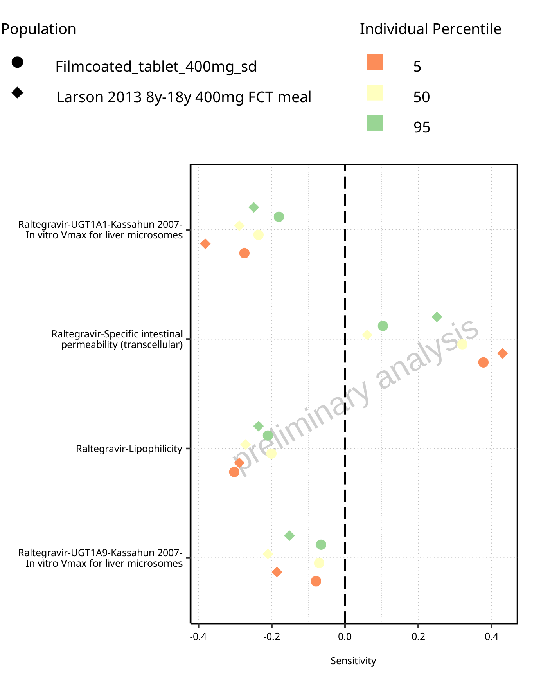

**Figure 1-1: Most sensitive parameters for C_max of Raltegravir for individuals at percentiles 5, 50, 95 for Larson 2013 8y-18y 400mg FCT meal, Filmcoated_tablet_400mg_sd.**

 
 

**Figure 1-2: Most sensitive parameters for t_max of Raltegravir for individuals at percentiles 5, 50, 95 for Filmcoated_tablet_400mg_sd, Larson 2013 8y-18y 400mg FCT meal.**

 
 

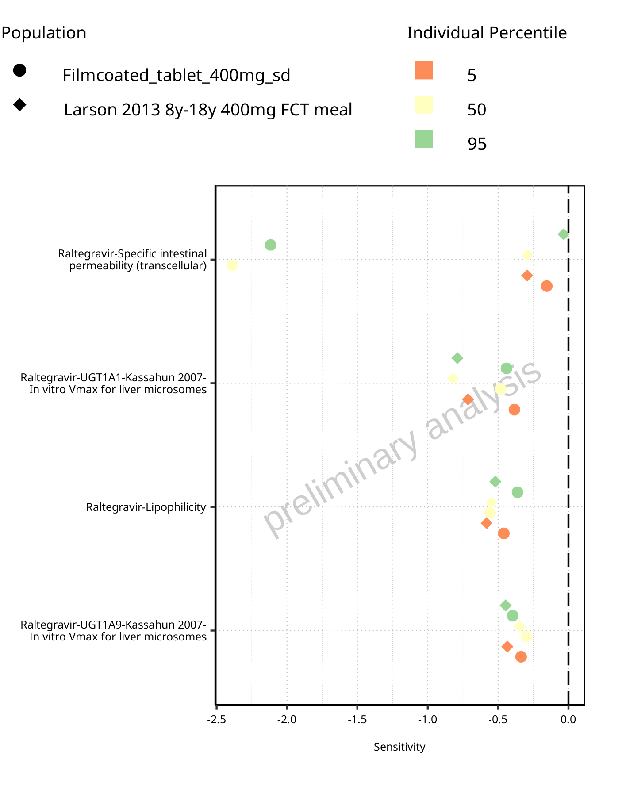

**Figure 1-3: Most sensitive parameters for C_tEnd of Raltegravir for individuals at percentiles 5, 50, 95 for Filmcoated_tablet_400mg_sd, Larson 2013 8y-18y 400mg FCT meal.**

 
 

**Figure 1-4: Most sensitive parameters for AUC of Raltegravir for individuals at percentiles 5, 50, 95 for Larson 2013 8y-18y 400mg FCT meal, Filmcoated_tablet_400mg_sd.**

 
 

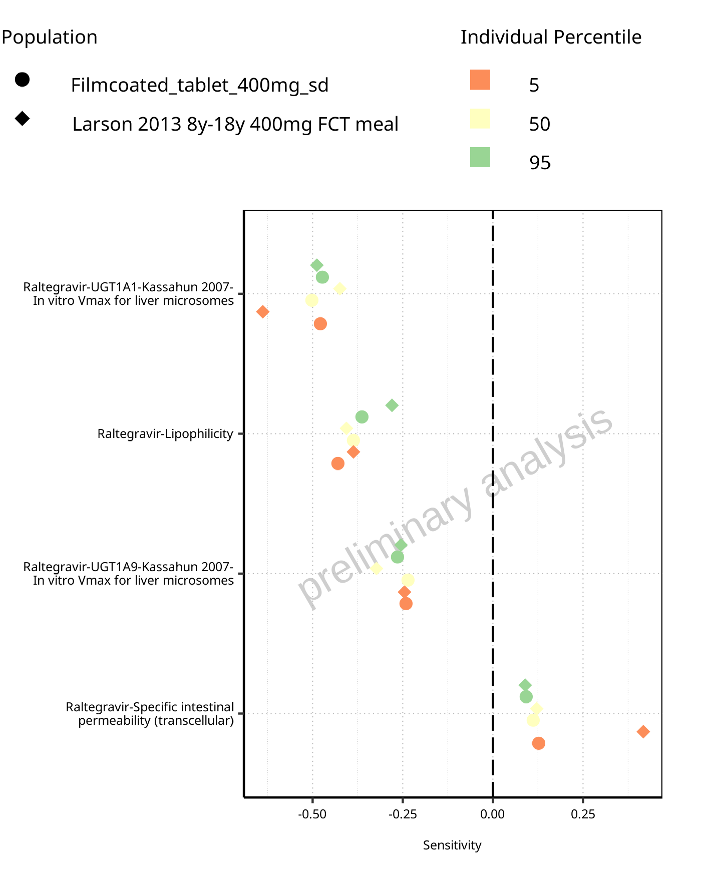

**Figure 1-5: Most sensitive parameters for AUC_inf of Raltegravir for individuals at percentiles 5, 50, 95 for Larson 2013 8y-18y 400mg FCT meal, Filmcoated_tablet_400mg_sd.**

 
 

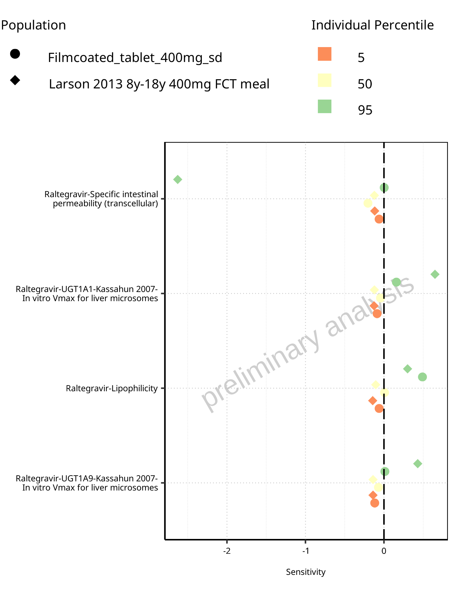

**Figure 1-6: Most sensitive parameters for MRT of Raltegravir for individuals at percentiles 5, 50, 95 for Larson 2013 8y-18y 400mg FCT meal, Filmcoated_tablet_400mg_sd.**

 
 

**Figure 1-7: Most sensitive parameters for Thalf of Raltegravir for individuals at percentiles 5, 50, 95 for Filmcoated_tablet_400mg_sd, Larson 2013 8y-18y 400mg FCT meal.**

 
 

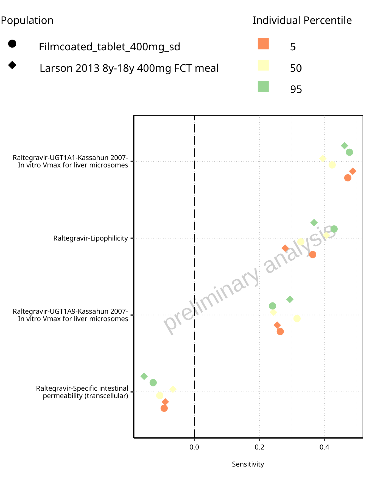

**Figure 1-8: Most sensitive parameters for CL of Raltegravir for individuals at percentiles 5, 50, 95 for Larson 2013 8y-18y 400mg FCT meal, Filmcoated_tablet_400mg_sd.**

 
 

**Figure 1-9: Most sensitive parameters for Vss of Raltegravir for individuals at percentiles 5, 50, 95 for Larson 2013 8y-18y 400mg FCT meal, Filmcoated_tablet_400mg_sd.**

 
 

**Figure 1-10: Most sensitive parameters for Vd of Raltegravir for individuals at percentiles 5, 50, 95 for Larson 2013 8y-18y 400mg FCT meal, Filmcoated_tablet_400mg_sd.**

 
 

# 2 PK parameters 

## 2.1 PK Parameters of Raltegravir 

### 2.1.1 C_max 

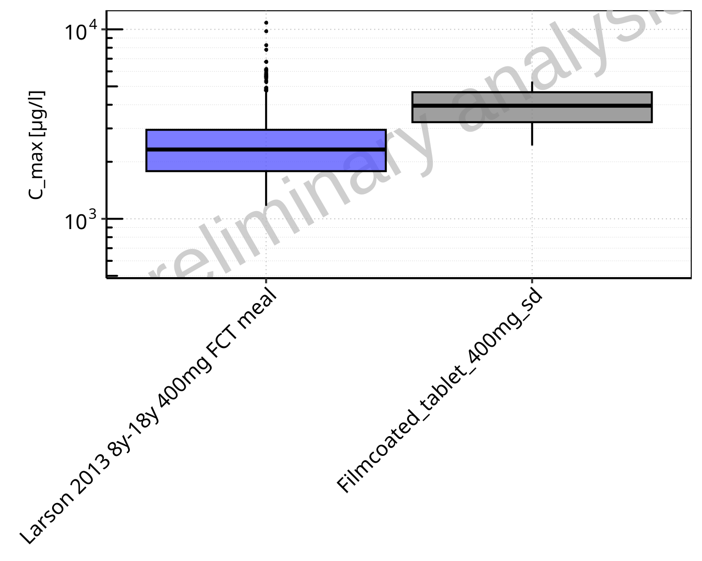

**Figure 2-1: C_max of Raltegravir for Larson 2013 8y-18y 400mg FCT meal, Filmcoated_tablet_400mg_sd shown as box-whisker plot, which indicates  the 5th, 25th, 50th, 75th, 95th percentiles in logarithmic scale.**

 
 

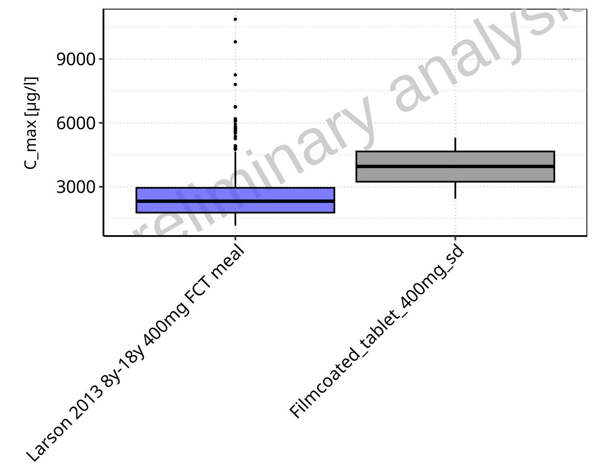

**Figure 2-2: C_max of Raltegravir for Larson 2013 8y-18y 400mg FCT meal, Filmcoated_tablet_400mg_sd shown as box-whisker plot, which indicates  the 5th, 25th, 50th, 75th, 95th percentiles in linear scale.**

 
 

**Table 2-1: Population statistics summarizing C_max of Raltegravir for Larson 2013 8y-18y 400mg FCT meal, Filmcoated_tablet_400mg_sd reported in [µg/l]**

|Population                        |N   |5th pctl |25th pctl |50th pctl |75th pctl |95th pctl |Mean    |SD      |Geo Mean |Geo SD |
|:---------------------------------|:---|:-------------------|:--------------------|:--------------------|:--------------------|:--------------------|:-------|:-------|:--------|:------|
|Larson 2013 8y-18y 400mg FCT meal |500 |1171.26             |1784.94              |2321.55              |2949.24              |4651.40              |2549.83 |1206.89 |2326.87  |1.52   |
|Filmcoated_tablet_400mg_sd        |100 |2437.79             |3236.54              |3954.54              |4657.56              |5304.38              |3940.92 |908.89  |3833.70  |1.27   |

 
 

**Figure 2-3: Age-dependence of C_max for Larson 2013 8y-18y 400mg FCT meal in comparison to Filmcoated_tablet_400mg_sd. Profiles are plotted in a logarithmic scale.**

 
 

**Figure 2-4: Age-dependence of C_max for Larson 2013 8y-18y 400mg FCT meal in comparison to Filmcoated_tablet_400mg_sd. Profiles are plotted in a linear scale.**

 
 

**Figure 2-5: Age-dependence of C_max for Larson 2013 8y-18y 400mg FCT meal. Profiles are plotted in a logarithmic scale.**

 
 

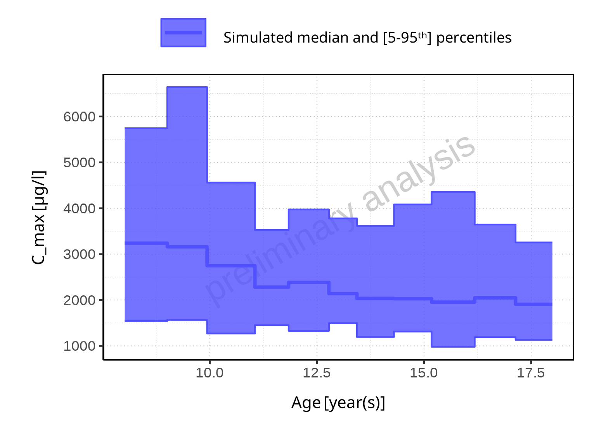

**Figure 2-6: Age-dependence of C_max for Larson 2013 8y-18y 400mg FCT meal. Profiles are plotted in a linear scale.**

 
 

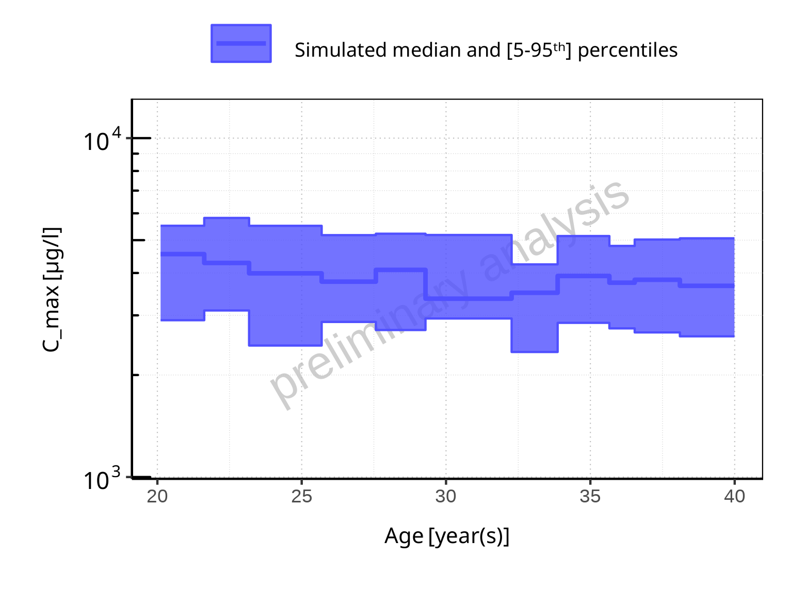

**Figure 2-7: Age-dependence of C_max for Filmcoated_tablet_400mg_sd. Profiles are plotted in a logarithmic scale.**

 
 

**Figure 2-8: Age-dependence of C_max for Filmcoated_tablet_400mg_sd. Profiles are plotted in a linear scale.**

 
 

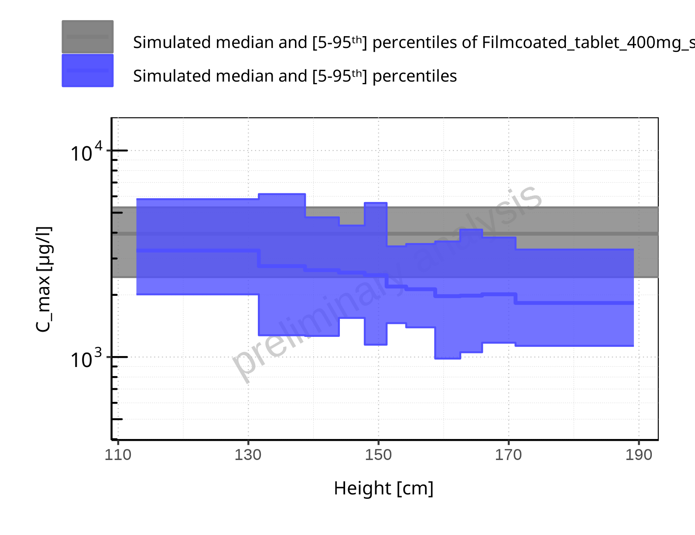

**Figure 2-9: Height-dependence of C_max for Larson 2013 8y-18y 400mg FCT meal in comparison to Filmcoated_tablet_400mg_sd. Profiles are plotted in a logarithmic scale.**

 
 

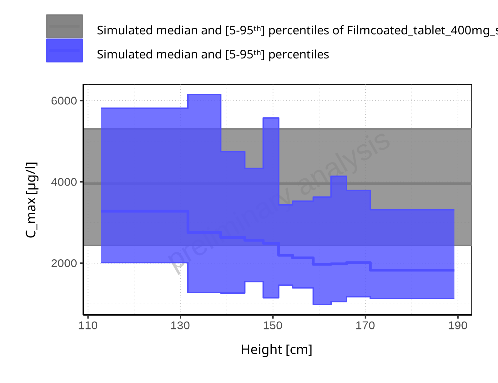

**Figure 2-10: Height-dependence of C_max for Larson 2013 8y-18y 400mg FCT meal in comparison to Filmcoated_tablet_400mg_sd. Profiles are plotted in a linear scale.**

 
 

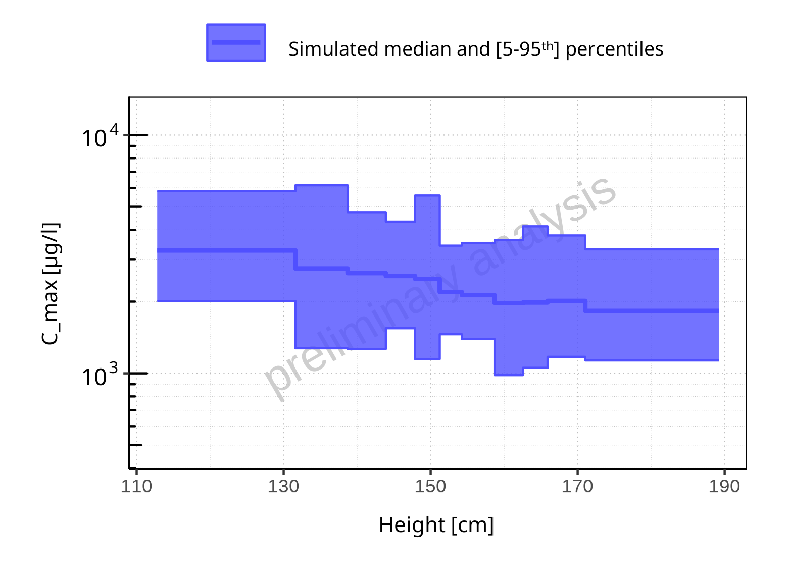

**Figure 2-11: Height-dependence of C_max for Larson 2013 8y-18y 400mg FCT meal. Profiles are plotted in a logarithmic scale.**

 
 

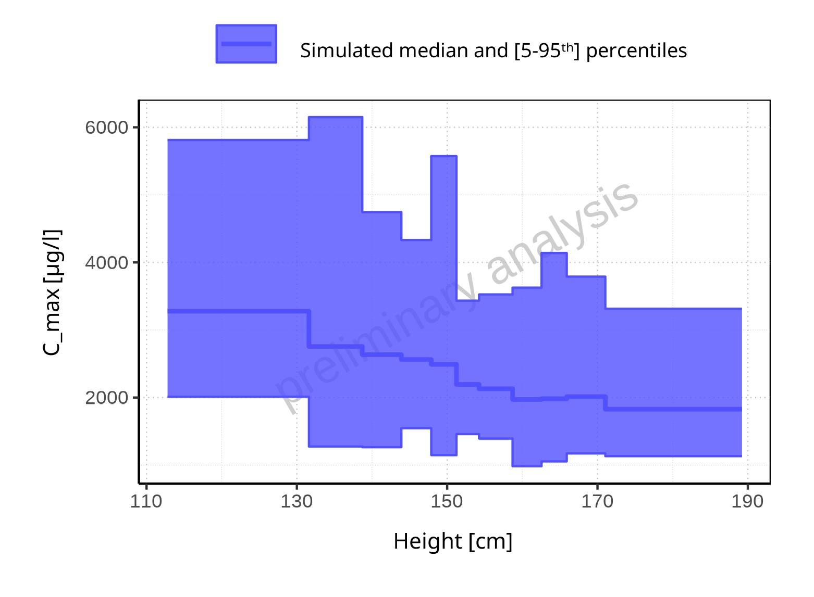

**Figure 2-12: Height-dependence of C_max for Larson 2013 8y-18y 400mg FCT meal. Profiles are plotted in a linear scale.**

 
 

**Figure 2-13: Height-dependence of C_max for Filmcoated_tablet_400mg_sd. Profiles are plotted in a logarithmic scale.**

 
 

**Figure 2-14: Height-dependence of C_max for Filmcoated_tablet_400mg_sd. Profiles are plotted in a linear scale.**

 
 

**Figure 2-15: Weight-dependence of C_max for Larson 2013 8y-18y 400mg FCT meal in comparison to Filmcoated_tablet_400mg_sd. Profiles are plotted in a logarithmic scale.**

 
 

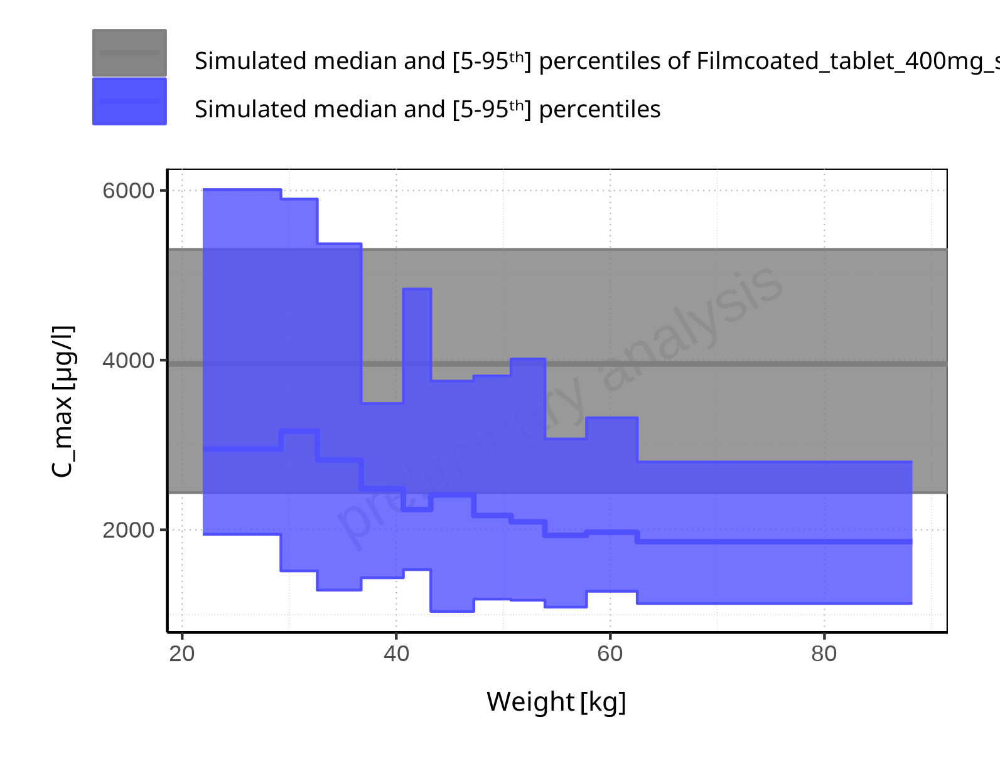

**Figure 2-16: Weight-dependence of C_max for Larson 2013 8y-18y 400mg FCT meal in comparison to Filmcoated_tablet_400mg_sd. Profiles are plotted in a linear scale.**

 
 

**Figure 2-17: Weight-dependence of C_max for Larson 2013 8y-18y 400mg FCT meal. Profiles are plotted in a logarithmic scale.**

 
 

**Figure 2-18: Weight-dependence of C_max for Larson 2013 8y-18y 400mg FCT meal. Profiles are plotted in a linear scale.**

 
 

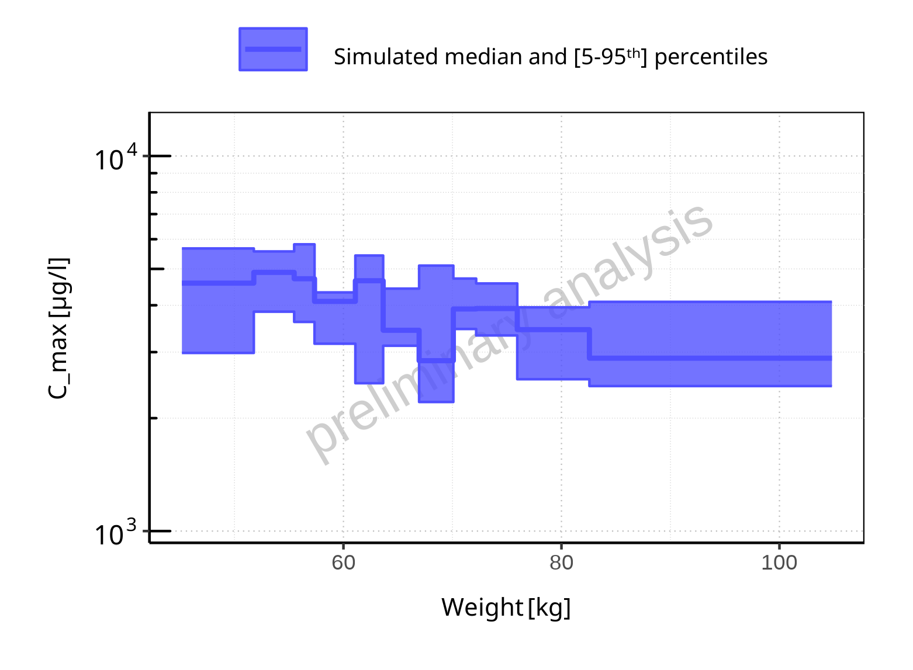

**Figure 2-19: Weight-dependence of C_max for Filmcoated_tablet_400mg_sd. Profiles are plotted in a logarithmic scale.**

 
 

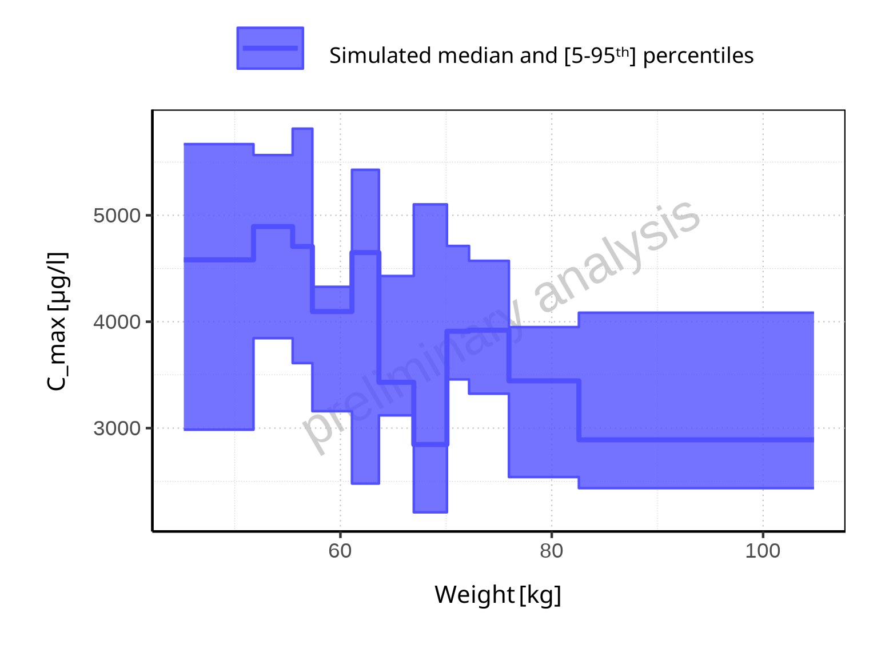

**Figure 2-20: Weight-dependence of C_max for Filmcoated_tablet_400mg_sd. Profiles are plotted in a linear scale.**

 
 

**Figure 2-21: BMI-dependence of C_max for Larson 2013 8y-18y 400mg FCT meal in comparison to Filmcoated_tablet_400mg_sd. Profiles are plotted in a logarithmic scale.**

 
 

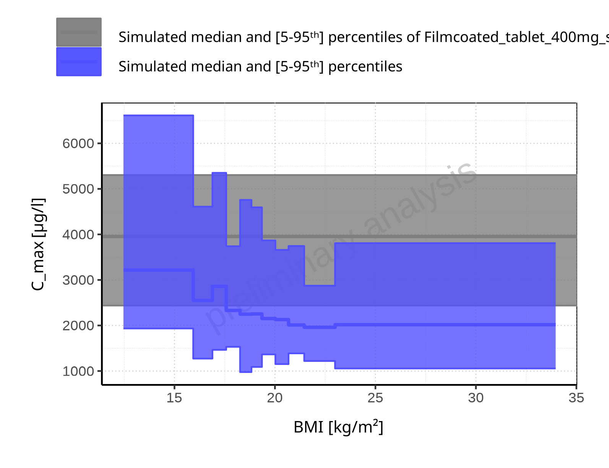

**Figure 2-22: BMI-dependence of C_max for Larson 2013 8y-18y 400mg FCT meal in comparison to Filmcoated_tablet_400mg_sd. Profiles are plotted in a linear scale.**

 
 

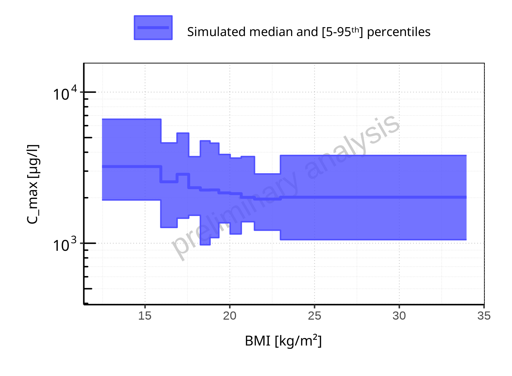

**Figure 2-23: BMI-dependence of C_max for Larson 2013 8y-18y 400mg FCT meal. Profiles are plotted in a logarithmic scale.**

 
 

**Figure 2-24: BMI-dependence of C_max for Larson 2013 8y-18y 400mg FCT meal. Profiles are plotted in a linear scale.**

 
 

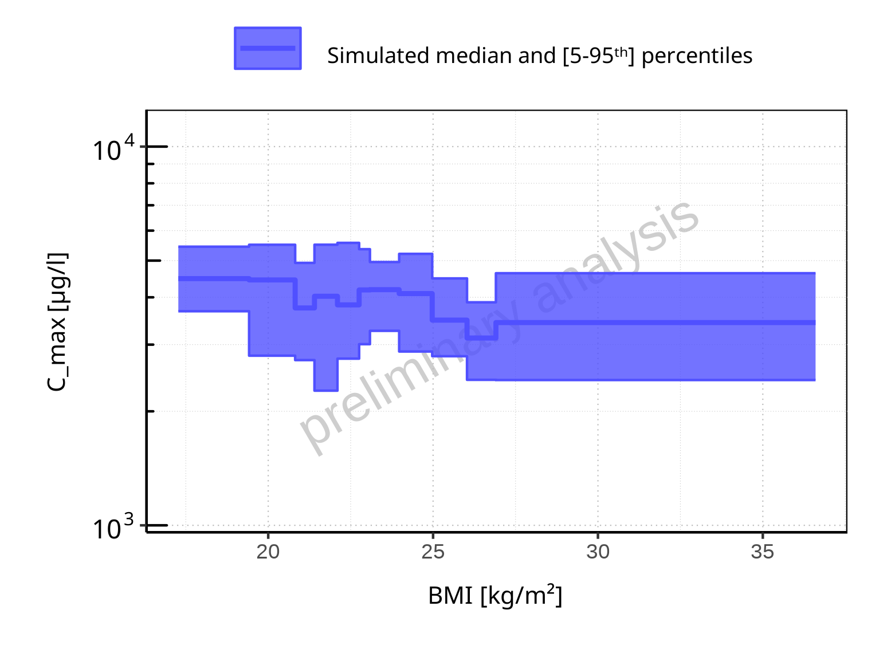

**Figure 2-25: BMI-dependence of C_max for Filmcoated_tablet_400mg_sd. Profiles are plotted in a logarithmic scale.**

 
 

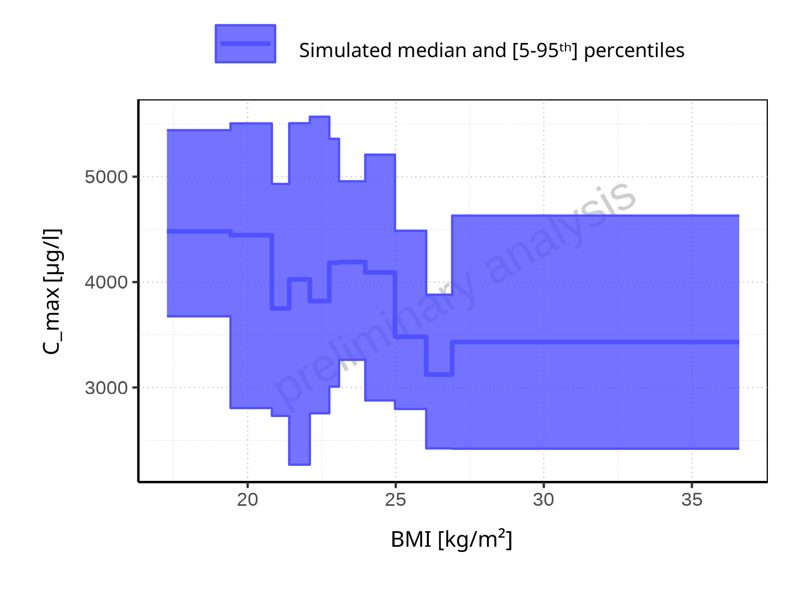

**Figure 2-26: BMI-dependence of C_max for Filmcoated_tablet_400mg_sd. Profiles are plotted in a linear scale.**

 
 

**Figure 2-27: Ratio of population summary statistics of C_max of Raltegravir  for  Larson 2013 8y-18y 400mg FCT meal in comparison to Filmcoated_tablet_400mg_sd shown as box-whisker plot, which indicates ratios of the 5th, 25th, 50th, 75th, 95th percentiles in logarithmic scale.**

 
 

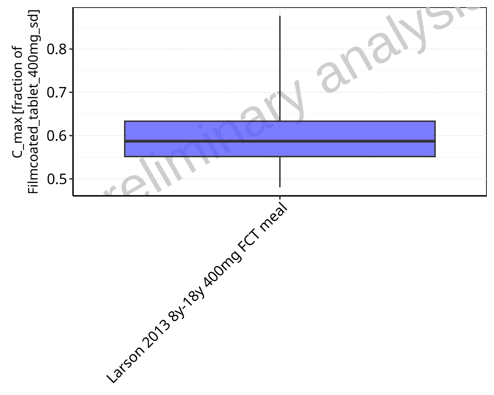

**Figure 2-28: Ratio of population summary statistics of C_max of Raltegravir  for  Larson 2013 8y-18y 400mg FCT meal in comparison to Filmcoated_tablet_400mg_sd shown as box-whisker plot, which indicates ratios of the 5th, 25th, 50th, 75th, 95th percentiles in linear scale.**

 
 

**Table 2-2: Ratio of population summary statistics of C_max of Raltegravir  for  Larson 2013 8y-18y 400mg FCT meal in comparison to Filmcoated_tablet_400mg_sd**

|Population                        |N   |5th pctl |25th pctl |50th pctl |75th pctl |95th pctl |Mean |SD   |Geo Mean |Geo SD |
|:---------------------------------|:---|:-------------------|:--------------------|:--------------------|:--------------------|:--------------------|:----|:----|:--------|:------|
|Larson 2013 8y-18y 400mg FCT meal |500 |0.48                |0.55                 |0.59                 |0.63                 |0.88                 |0.65 |1.33 |0.61     |1.20   |

 
 

### 2.1.2 C_max_norm 

**Figure 2-29: C_max_norm of Raltegravir for Larson 2013 8y-18y 400mg FCT meal, Filmcoated_tablet_400mg_sd shown as box-whisker plot, which indicates  the 5th, 25th, 50th, 75th, 95th percentiles in logarithmic scale.**

 
 

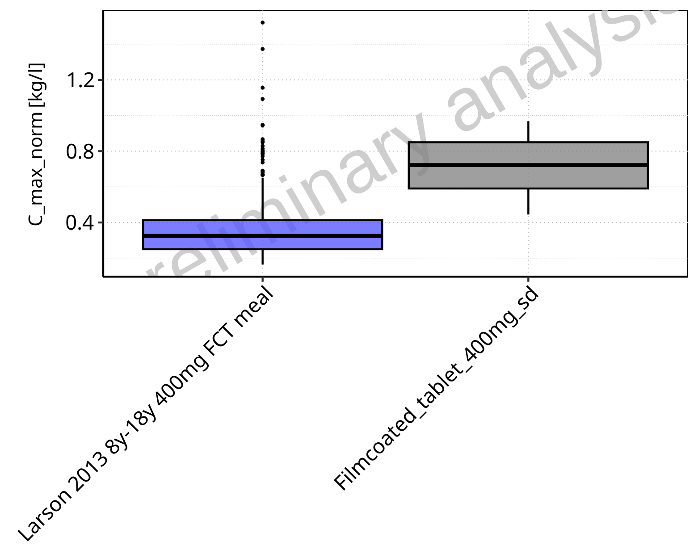

**Figure 2-30: C_max_norm of Raltegravir for Larson 2013 8y-18y 400mg FCT meal, Filmcoated_tablet_400mg_sd shown as box-whisker plot, which indicates  the 5th, 25th, 50th, 75th, 95th percentiles in linear scale.**

 
 

**Table 2-3: Population statistics summarizing C_max_norm of Raltegravir for Larson 2013 8y-18y 400mg FCT meal, Filmcoated_tablet_400mg_sd reported in [kg/l]**

|Population                        |N   |5th pctl |25th pctl |50th pctl |75th pctl |95th pctl |Mean |SD   |Geo Mean |Geo SD |
|:---------------------------------|:---|:-------------------|:--------------------|:--------------------|:--------------------|:--------------------|:----|:----|:--------|:------|
|Larson 2013 8y-18y 400mg FCT meal |500 |0.16                |0.25                 |0.33                 |0.41                 |0.65                 |0.36 |0.17 |0.33     |1.52   |
|Filmcoated_tablet_400mg_sd        |100 |0.44                |0.59                 |0.72                 |0.85                 |0.97                 |0.72 |0.17 |0.70     |1.27   |

 
 

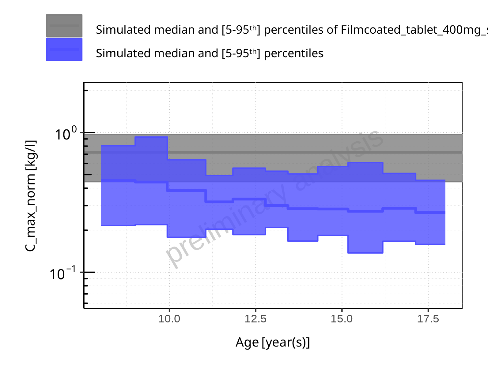

**Figure 2-31: Age-dependence of C_max_norm for Larson 2013 8y-18y 400mg FCT meal in comparison to Filmcoated_tablet_400mg_sd. Profiles are plotted in a logarithmic scale.**

 
 

**Figure 2-32: Age-dependence of C_max_norm for Larson 2013 8y-18y 400mg FCT meal in comparison to Filmcoated_tablet_400mg_sd. Profiles are plotted in a linear scale.**

 
 

**Figure 2-33: Age-dependence of C_max_norm for Larson 2013 8y-18y 400mg FCT meal. Profiles are plotted in a logarithmic scale.**

 
 

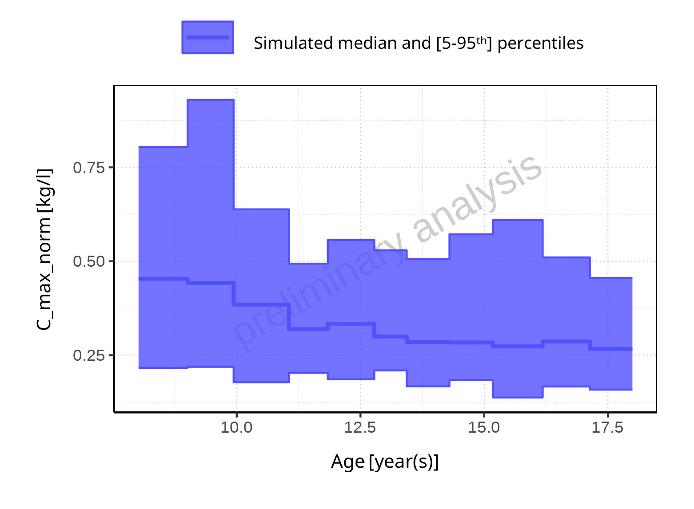

**Figure 2-34: Age-dependence of C_max_norm for Larson 2013 8y-18y 400mg FCT meal. Profiles are plotted in a linear scale.**

 
 

**Figure 2-35: Age-dependence of C_max_norm for Filmcoated_tablet_400mg_sd. Profiles are plotted in a logarithmic scale.**

 
 

**Figure 2-36: Age-dependence of C_max_norm for Filmcoated_tablet_400mg_sd. Profiles are plotted in a linear scale.**

 
 

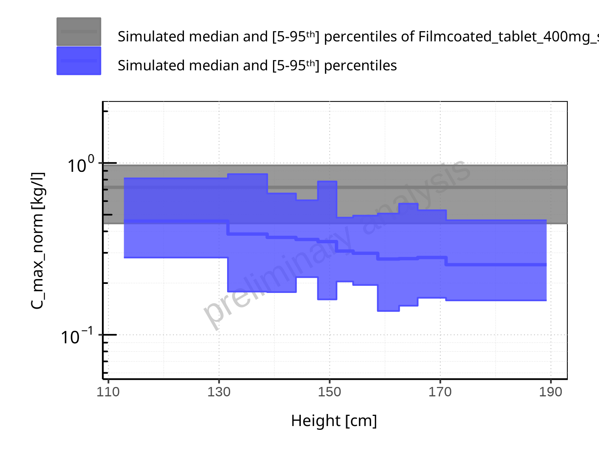

**Figure 2-37: Height-dependence of C_max_norm for Larson 2013 8y-18y 400mg FCT meal in comparison to Filmcoated_tablet_400mg_sd. Profiles are plotted in a logarithmic scale.**

 
 

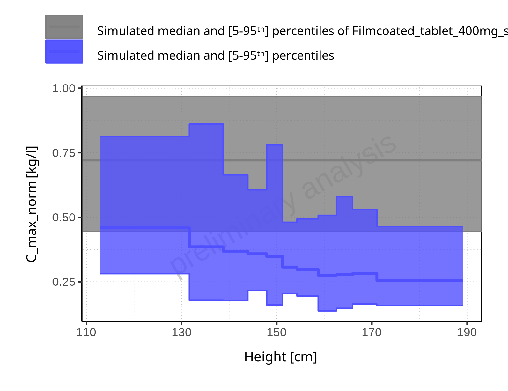

**Figure 2-38: Height-dependence of C_max_norm for Larson 2013 8y-18y 400mg FCT meal in comparison to Filmcoated_tablet_400mg_sd. Profiles are plotted in a linear scale.**

 
 

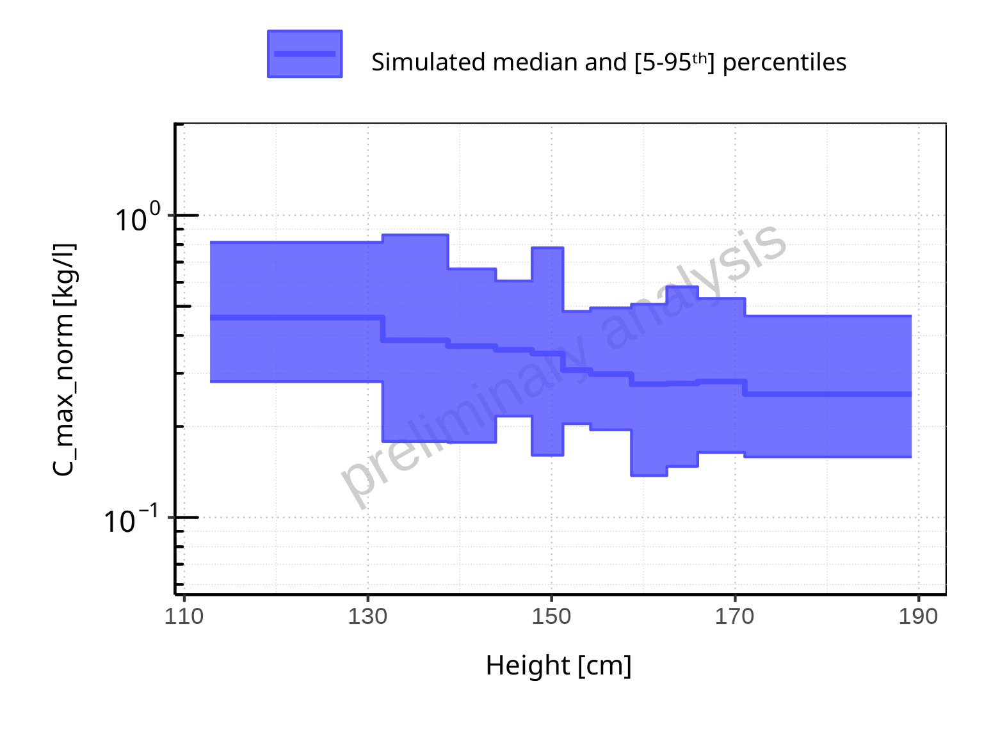

**Figure 2-39: Height-dependence of C_max_norm for Larson 2013 8y-18y 400mg FCT meal. Profiles are plotted in a logarithmic scale.**

 
 

**Figure 2-40: Height-dependence of C_max_norm for Larson 2013 8y-18y 400mg FCT meal. Profiles are plotted in a linear scale.**

 
 

**Figure 2-41: Height-dependence of C_max_norm for Filmcoated_tablet_400mg_sd. Profiles are plotted in a logarithmic scale.**

 
 

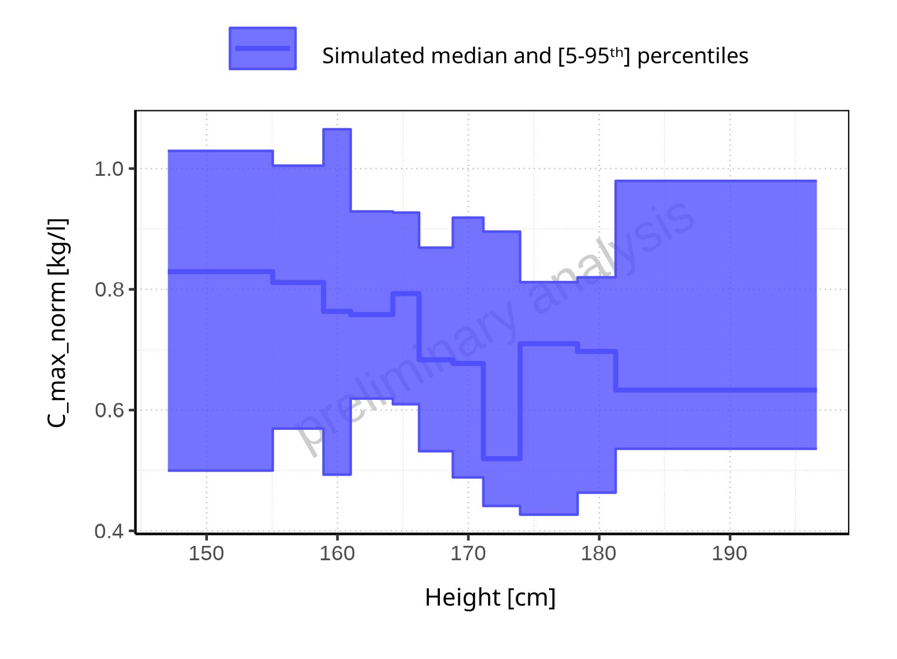

**Figure 2-42: Height-dependence of C_max_norm for Filmcoated_tablet_400mg_sd. Profiles are plotted in a linear scale.**

 
 

**Figure 2-43: Weight-dependence of C_max_norm for Larson 2013 8y-18y 400mg FCT meal in comparison to Filmcoated_tablet_400mg_sd. Profiles are plotted in a logarithmic scale.**

 
 

**Figure 2-44: Weight-dependence of C_max_norm for Larson 2013 8y-18y 400mg FCT meal in comparison to Filmcoated_tablet_400mg_sd. Profiles are plotted in a linear scale.**

 
 

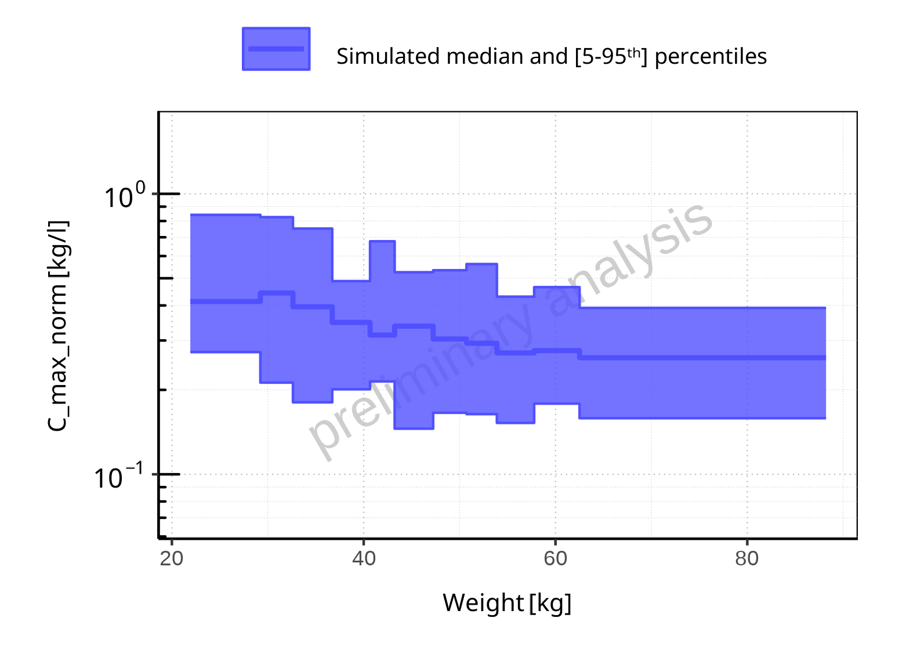

**Figure 2-45: Weight-dependence of C_max_norm for Larson 2013 8y-18y 400mg FCT meal. Profiles are plotted in a logarithmic scale.**

 
 

**Figure 2-46: Weight-dependence of C_max_norm for Larson 2013 8y-18y 400mg FCT meal. Profiles are plotted in a linear scale.**

 
 

**Figure 2-47: Weight-dependence of C_max_norm for Filmcoated_tablet_400mg_sd. Profiles are plotted in a logarithmic scale.**

 
 

**Figure 2-48: Weight-dependence of C_max_norm for Filmcoated_tablet_400mg_sd. Profiles are plotted in a linear scale.**

 
 

**Figure 2-49: BMI-dependence of C_max_norm for Larson 2013 8y-18y 400mg FCT meal in comparison to Filmcoated_tablet_400mg_sd. Profiles are plotted in a logarithmic scale.**

 
 

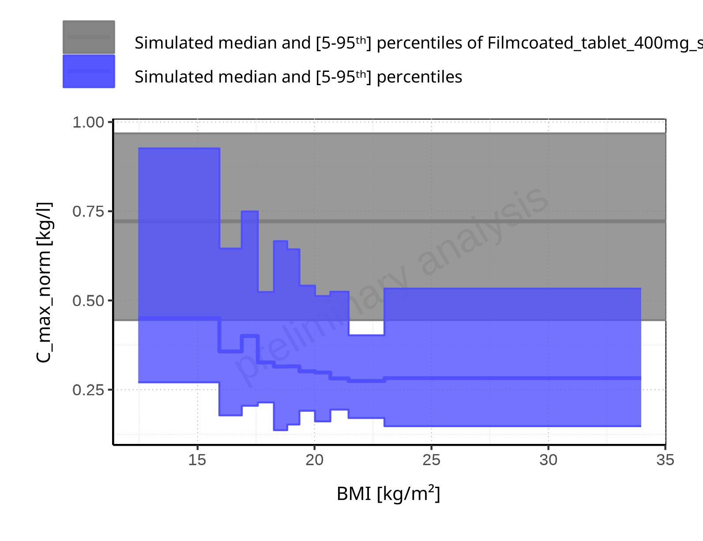

**Figure 2-50: BMI-dependence of C_max_norm for Larson 2013 8y-18y 400mg FCT meal in comparison to Filmcoated_tablet_400mg_sd. Profiles are plotted in a linear scale.**

 
 

**Figure 2-51: BMI-dependence of C_max_norm for Larson 2013 8y-18y 400mg FCT meal. Profiles are plotted in a logarithmic scale.**

 
 

**Figure 2-52: BMI-dependence of C_max_norm for Larson 2013 8y-18y 400mg FCT meal. Profiles are plotted in a linear scale.**

 
 

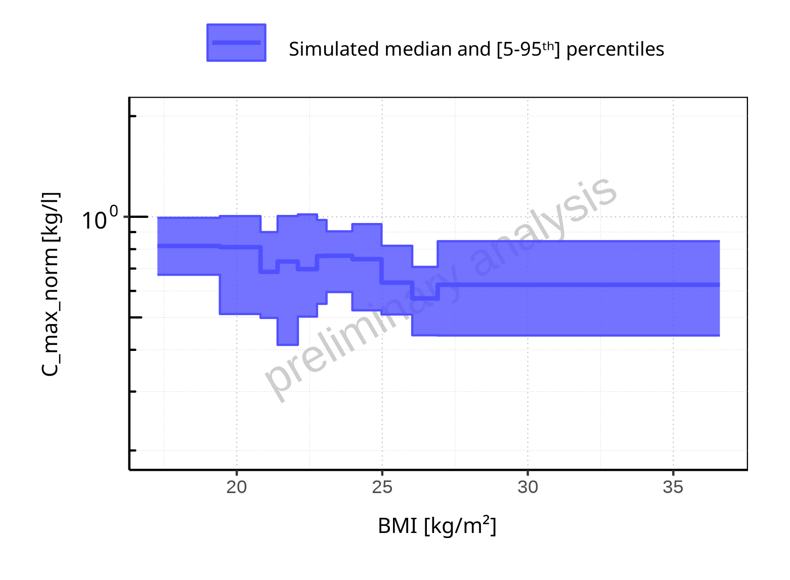

**Figure 2-53: BMI-dependence of C_max_norm for Filmcoated_tablet_400mg_sd. Profiles are plotted in a logarithmic scale.**

 
 

**Figure 2-54: BMI-dependence of C_max_norm for Filmcoated_tablet_400mg_sd. Profiles are plotted in a linear scale.**

 
 

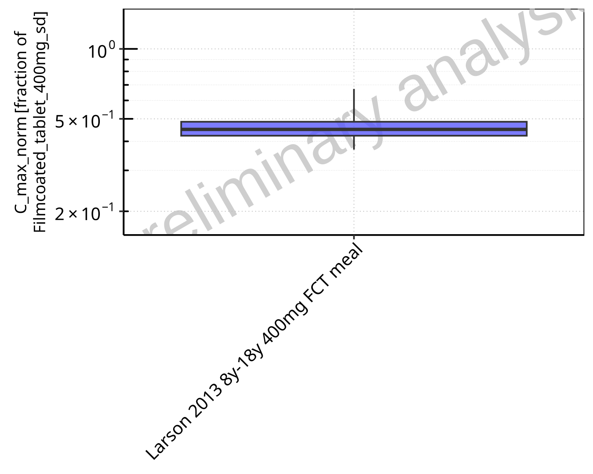

**Figure 2-55: Ratio of population summary statistics of C_max_norm of Raltegravir  for  Larson 2013 8y-18y 400mg FCT meal in comparison to Filmcoated_tablet_400mg_sd shown as box-whisker plot, which indicates ratios of the 5th, 25th, 50th, 75th, 95th percentiles in logarithmic scale.**

 
 

**Figure 2-56: Ratio of population summary statistics of C_max_norm of Raltegravir  for  Larson 2013 8y-18y 400mg FCT meal in comparison to Filmcoated_tablet_400mg_sd shown as box-whisker plot, which indicates ratios of the 5th, 25th, 50th, 75th, 95th percentiles in linear scale.**

 
 

**Table 2-4: Ratio of population summary statistics of C_max_norm of Raltegravir  for  Larson 2013 8y-18y 400mg FCT meal in comparison to Filmcoated_tablet_400mg_sd**

|Population                        |N   |5th pctl |25th pctl |50th pctl |75th pctl |95th pctl |Mean |SD   |Geo Mean |Geo SD |
|:---------------------------------|:---|:-------------------|:--------------------|:--------------------|:--------------------|:--------------------|:----|:----|:--------|:------|
|Larson 2013 8y-18y 400mg FCT meal |500 |0.37                |0.42                 |0.45                 |0.49                 |0.67                 |0.50 |1.02 |0.47     |1.20   |

 
 

### 2.1.3 t_max 

**Figure 2-57: t_max of Raltegravir for Larson 2013 8y-18y 400mg FCT meal, Filmcoated_tablet_400mg_sd shown as box-whisker plot, which indicates  the 5th, 25th, 50th, 75th, 95th percentiles in logarithmic scale.**

 
 

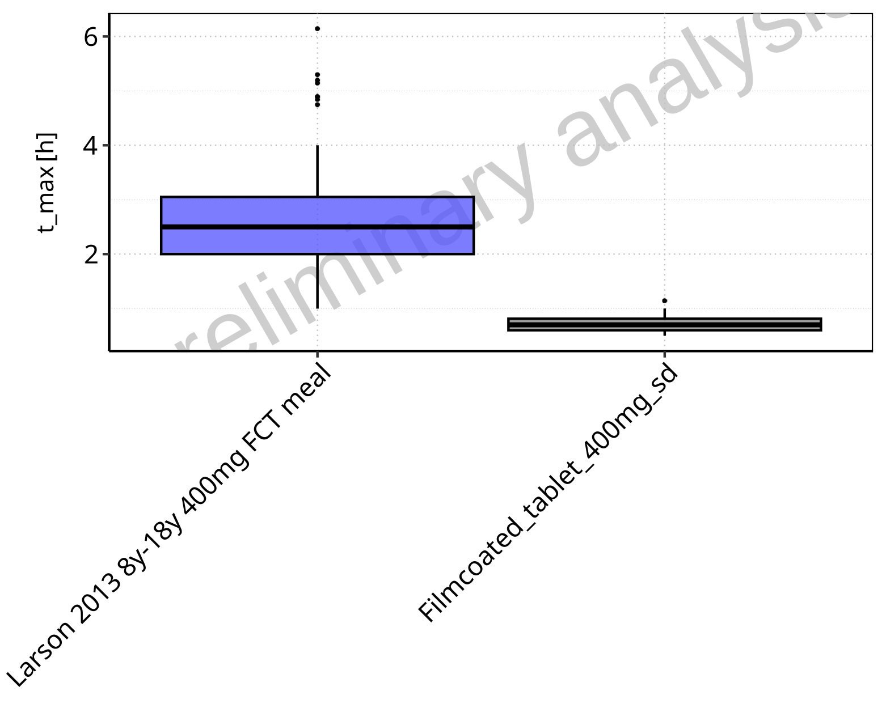

**Figure 2-58: t_max of Raltegravir for Larson 2013 8y-18y 400mg FCT meal, Filmcoated_tablet_400mg_sd shown as box-whisker plot, which indicates  the 5th, 25th, 50th, 75th, 95th percentiles in linear scale.**

 
 

**Table 2-5: Population statistics summarizing t_max of Raltegravir for Larson 2013 8y-18y 400mg FCT meal, Filmcoated_tablet_400mg_sd reported in [h]**

|Population                        |N   |5th pctl |25th pctl |50th pctl |75th pctl |95th pctl |Mean |SD   |Geo Mean |Geo SD |
|:---------------------------------|:---|:-------------------|:--------------------|:--------------------|:--------------------|:--------------------|:----|:----|:--------|:------|
|Larson 2013 8y-18y 400mg FCT meal |500 |1.00                |2.00                 |2.50                 |3.05                 |4                    |2.54 |0.88 |2.37     |1.49   |
|Filmcoated_tablet_400mg_sd        |100 |0.50                |0.60                 |0.70                 |0.81                 |1                    |0.73 |0.15 |0.71     |1.23   |

 
 

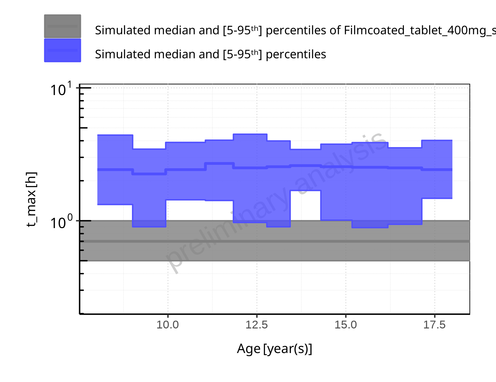

**Figure 2-59: Age-dependence of t_max for Larson 2013 8y-18y 400mg FCT meal in comparison to Filmcoated_tablet_400mg_sd. Profiles are plotted in a logarithmic scale.**

 
 

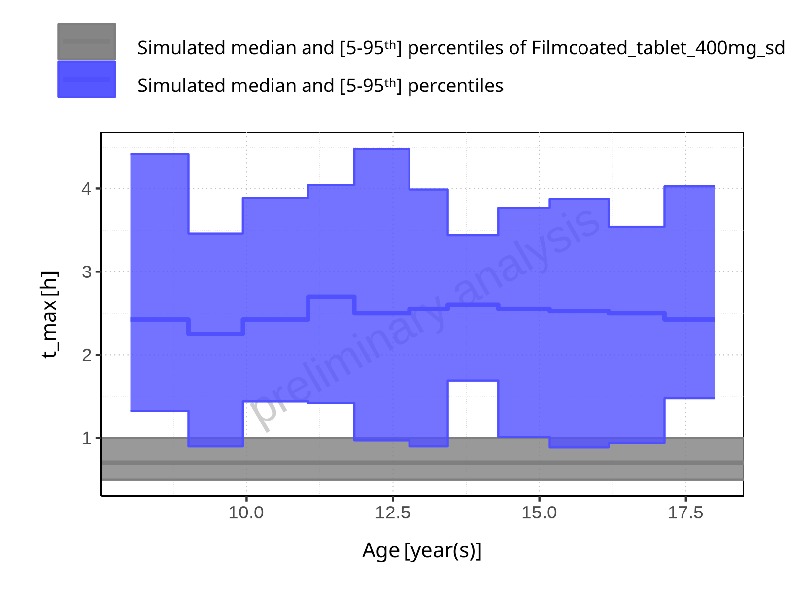

**Figure 2-60: Age-dependence of t_max for Larson 2013 8y-18y 400mg FCT meal in comparison to Filmcoated_tablet_400mg_sd. Profiles are plotted in a linear scale.**

 
 

**Figure 2-61: Age-dependence of t_max for Larson 2013 8y-18y 400mg FCT meal. Profiles are plotted in a logarithmic scale.**

 
 

**Figure 2-62: Age-dependence of t_max for Larson 2013 8y-18y 400mg FCT meal. Profiles are plotted in a linear scale.**

 
 

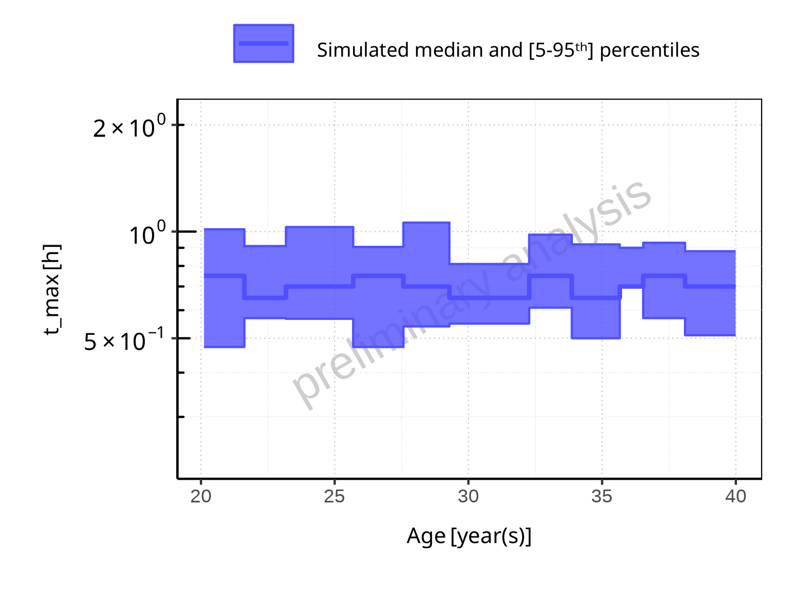

**Figure 2-63: Age-dependence of t_max for Filmcoated_tablet_400mg_sd. Profiles are plotted in a logarithmic scale.**

 
 

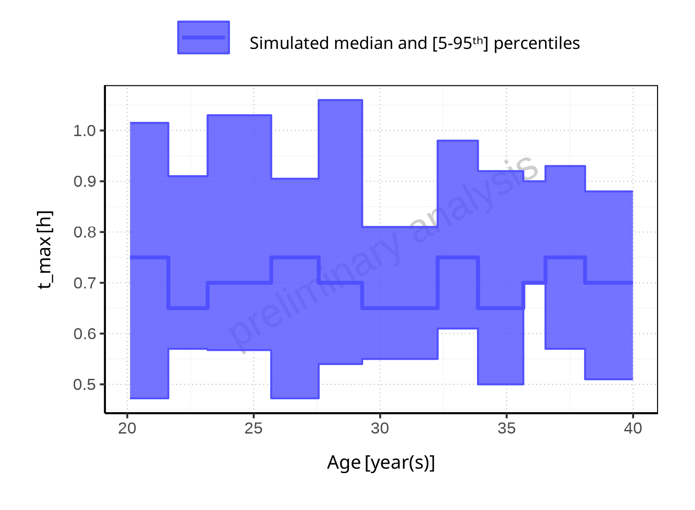

**Figure 2-64: Age-dependence of t_max for Filmcoated_tablet_400mg_sd. Profiles are plotted in a linear scale.**

 
 

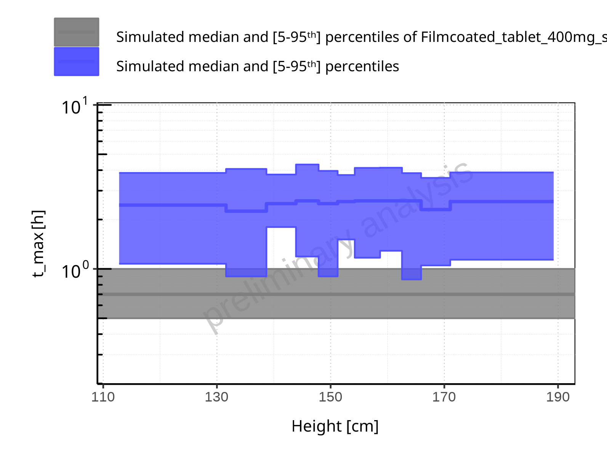

**Figure 2-65: Height-dependence of t_max for Larson 2013 8y-18y 400mg FCT meal in comparison to Filmcoated_tablet_400mg_sd. Profiles are plotted in a logarithmic scale.**

 
 

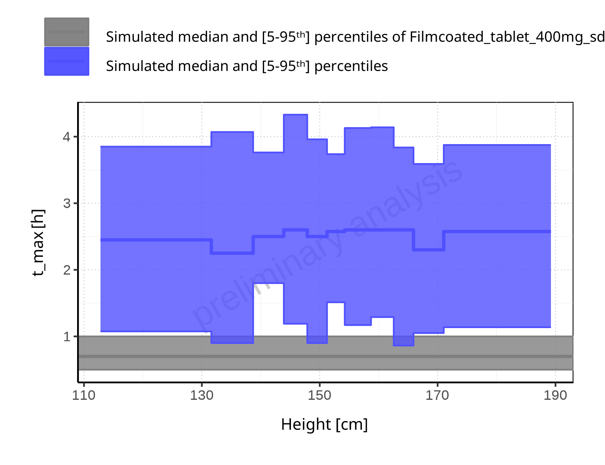

**Figure 2-66: Height-dependence of t_max for Larson 2013 8y-18y 400mg FCT meal in comparison to Filmcoated_tablet_400mg_sd. Profiles are plotted in a linear scale.**

 
 

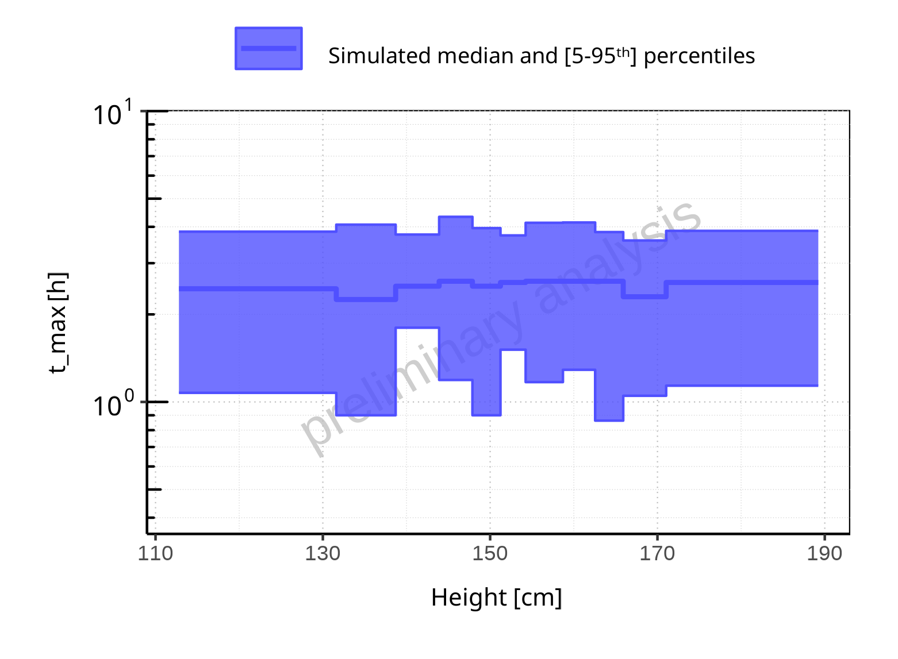

**Figure 2-67: Height-dependence of t_max for Larson 2013 8y-18y 400mg FCT meal. Profiles are plotted in a logarithmic scale.**

 
 

**Figure 2-68: Height-dependence of t_max for Larson 2013 8y-18y 400mg FCT meal. Profiles are plotted in a linear scale.**

 
 

**Figure 2-69: Height-dependence of t_max for Filmcoated_tablet_400mg_sd. Profiles are plotted in a logarithmic scale.**

 
 

**Figure 2-70: Height-dependence of t_max for Filmcoated_tablet_400mg_sd. Profiles are plotted in a linear scale.**

 
 

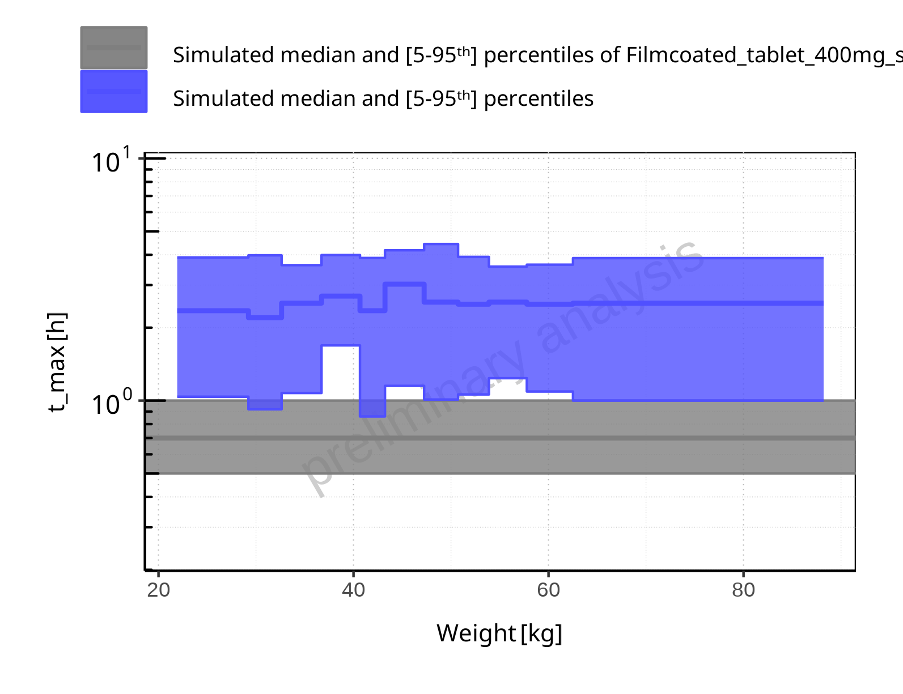

**Figure 2-71: Weight-dependence of t_max for Larson 2013 8y-18y 400mg FCT meal in comparison to Filmcoated_tablet_400mg_sd. Profiles are plotted in a logarithmic scale.**

 
 

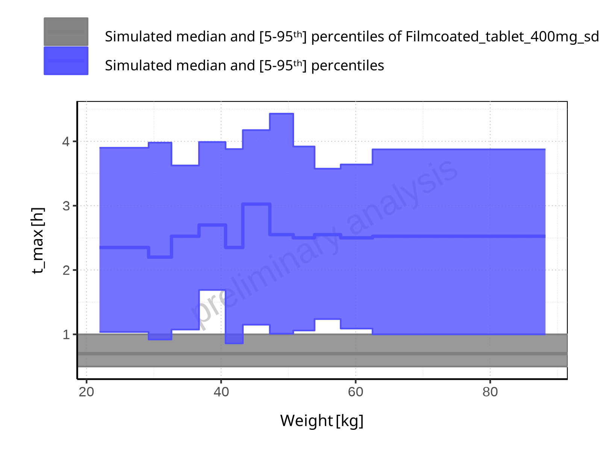

**Figure 2-72: Weight-dependence of t_max for Larson 2013 8y-18y 400mg FCT meal in comparison to Filmcoated_tablet_400mg_sd. Profiles are plotted in a linear scale.**

 
 

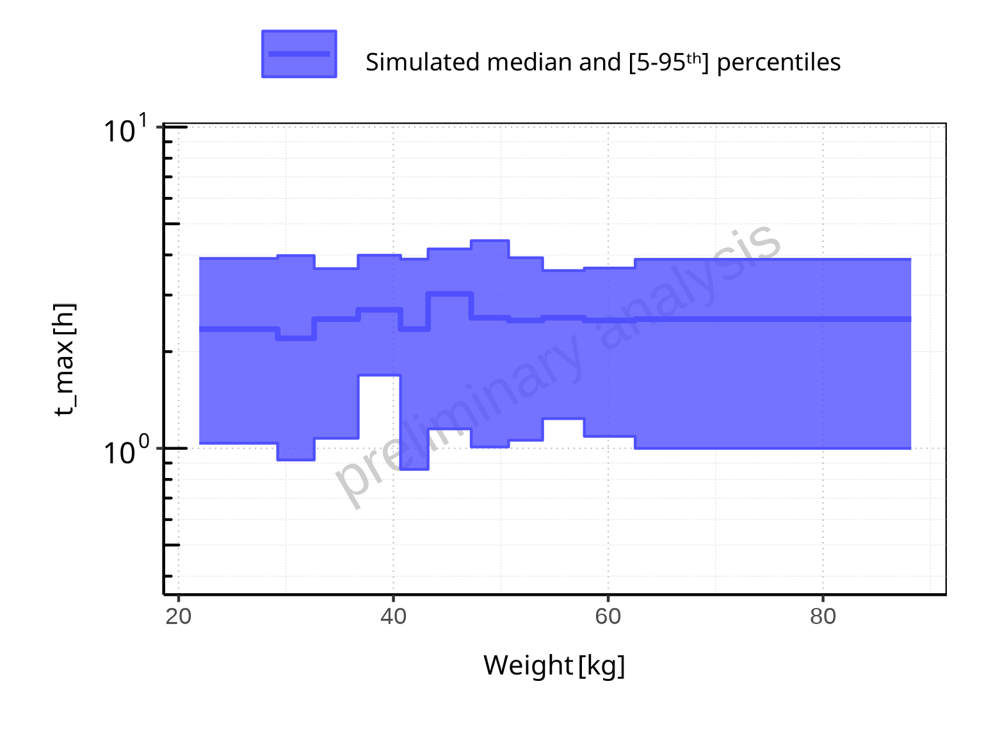

**Figure 2-73: Weight-dependence of t_max for Larson 2013 8y-18y 400mg FCT meal. Profiles are plotted in a logarithmic scale.**

 
 

**Figure 2-74: Weight-dependence of t_max for Larson 2013 8y-18y 400mg FCT meal. Profiles are plotted in a linear scale.**

 
 

**Figure 2-75: Weight-dependence of t_max for Filmcoated_tablet_400mg_sd. Profiles are plotted in a logarithmic scale.**

 
 

**Figure 2-76: Weight-dependence of t_max for Filmcoated_tablet_400mg_sd. Profiles are plotted in a linear scale.**

 
 

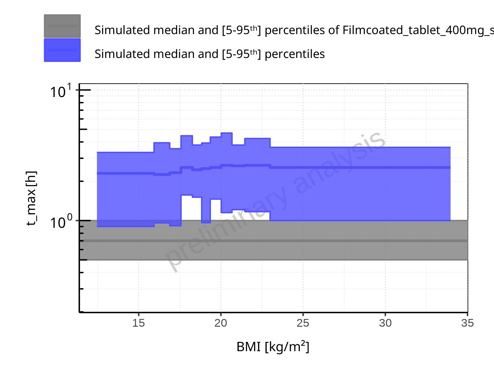

**Figure 2-77: BMI-dependence of t_max for Larson 2013 8y-18y 400mg FCT meal in comparison to Filmcoated_tablet_400mg_sd. Profiles are plotted in a logarithmic scale.**

 
 

**Figure 2-78: BMI-dependence of t_max for Larson 2013 8y-18y 400mg FCT meal in comparison to Filmcoated_tablet_400mg_sd. Profiles are plotted in a linear scale.**

 
 

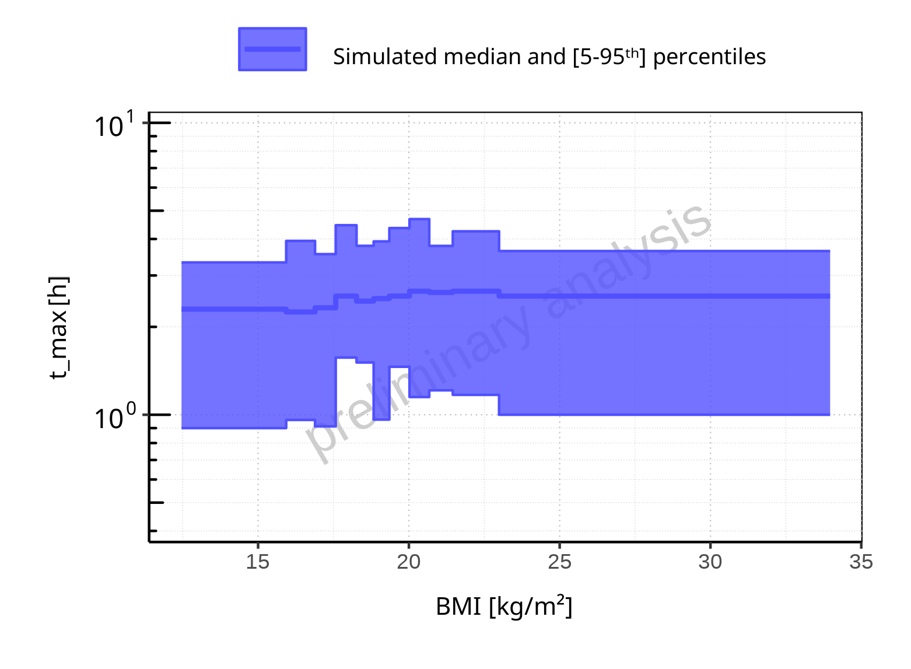

**Figure 2-79: BMI-dependence of t_max for Larson 2013 8y-18y 400mg FCT meal. Profiles are plotted in a logarithmic scale.**

 
 

**Figure 2-80: BMI-dependence of t_max for Larson 2013 8y-18y 400mg FCT meal. Profiles are plotted in a linear scale.**

 
 

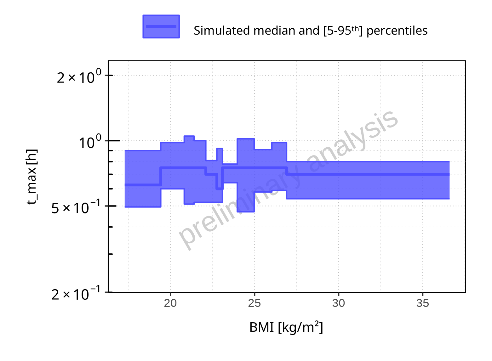

**Figure 2-81: BMI-dependence of t_max for Filmcoated_tablet_400mg_sd. Profiles are plotted in a logarithmic scale.**

 
 

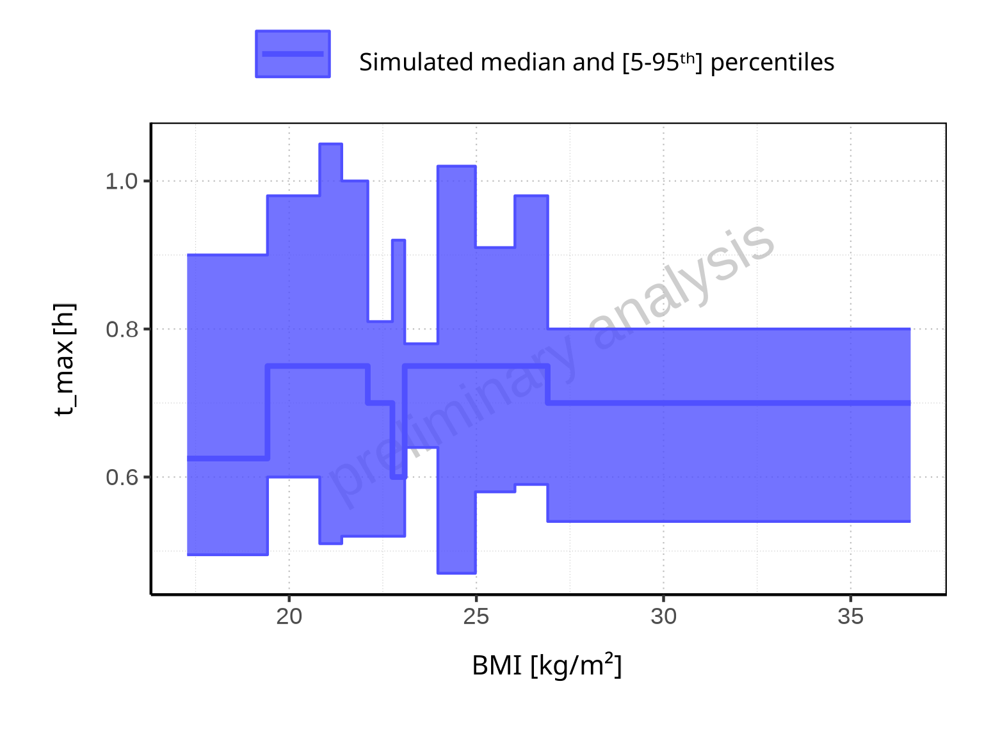

**Figure 2-82: BMI-dependence of t_max for Filmcoated_tablet_400mg_sd. Profiles are plotted in a linear scale.**

 
 

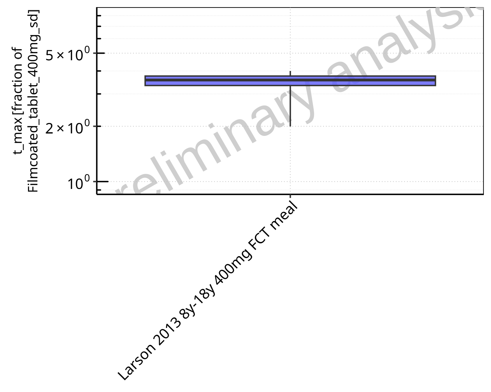

**Figure 2-83: Ratio of population summary statistics of t_max of Raltegravir  for  Larson 2013 8y-18y 400mg FCT meal in comparison to Filmcoated_tablet_400mg_sd shown as box-whisker plot, which indicates ratios of the 5th, 25th, 50th, 75th, 95th percentiles in logarithmic scale.**

 
 

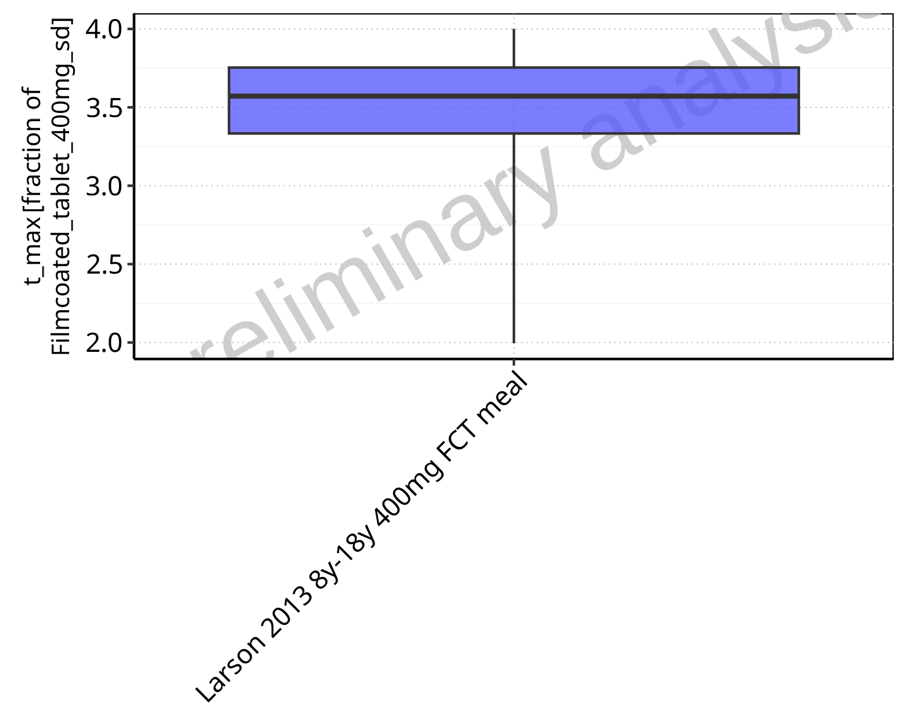

**Figure 2-84: Ratio of population summary statistics of t_max of Raltegravir  for  Larson 2013 8y-18y 400mg FCT meal in comparison to Filmcoated_tablet_400mg_sd shown as box-whisker plot, which indicates ratios of the 5th, 25th, 50th, 75th, 95th percentiles in linear scale.**

 
 

**Table 2-6: Ratio of population summary statistics of t_max of Raltegravir  for  Larson 2013 8y-18y 400mg FCT meal in comparison to Filmcoated_tablet_400mg_sd**

|Population                        |N   |5th pctl |25th pctl |50th pctl |75th pctl |95th pctl |Mean |SD   |Geo Mean |Geo SD |
|:---------------------------------|:---|:-------------------|:--------------------|:--------------------|:--------------------|:--------------------|:----|:----|:--------|:------|
|Larson 2013 8y-18y 400mg FCT meal |500 |2.00                |3.33                 |3.57                 |3.75                 |4                    |3.49 |5.79 |3.32     |1.20   |

 
 

### 2.1.4 C_tEnd 

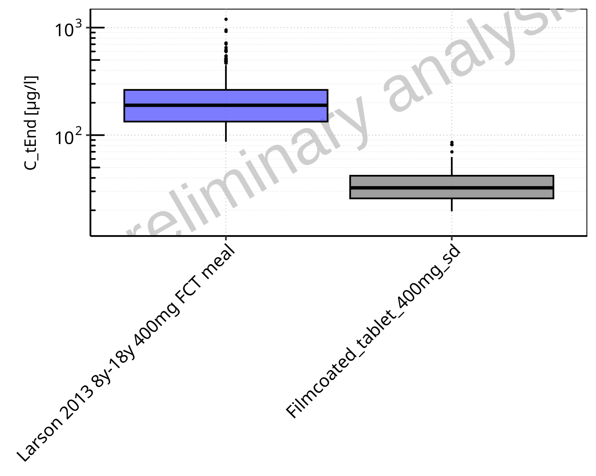

**Figure 2-85: C_tEnd of Raltegravir for Larson 2013 8y-18y 400mg FCT meal, Filmcoated_tablet_400mg_sd shown as box-whisker plot, which indicates  the 5th, 25th, 50th, 75th, 95th percentiles in logarithmic scale.**

 
 

**Figure 2-86: C_tEnd of Raltegravir for Larson 2013 8y-18y 400mg FCT meal, Filmcoated_tablet_400mg_sd shown as box-whisker plot, which indicates  the 5th, 25th, 50th, 75th, 95th percentiles in linear scale.**

 
 

**Table 2-7: Population statistics summarizing C_tEnd of Raltegravir for Larson 2013 8y-18y 400mg FCT meal, Filmcoated_tablet_400mg_sd reported in [µg/l]**

|Population                        |N   |5th pctl |25th pctl |50th pctl |75th pctl |95th pctl |Mean   |SD     |Geo Mean |Geo SD |
|:---------------------------------|:---|:-------------------|:--------------------|:--------------------|:--------------------|:--------------------|:------|:------|:--------|:------|
|Larson 2013 8y-18y 400mg FCT meal |500 |86.63               |133.65               |189.56               |263.51               |448.02               |218.90 |129.12 |191.12   |1.67   |
|Filmcoated_tablet_400mg_sd        |100 |19.57               |25.80                |32.35                |41.91                |62.68                |35.39  |14.21  |33.01    |1.44   |

 
 


**Figure 2-87: Age-dependence of C_tEnd for Larson 2013 8y-18y 400mg FCT meal in comparison to Filmcoated_tablet_400mg_sd. Profiles are plotted in a logarithmic scale.**

 
 

**Figure 2-88: Age-dependence of C_tEnd for Larson 2013 8y-18y 400mg FCT meal in comparison to Filmcoated_tablet_400mg_sd. Profiles are plotted in a linear scale.**

 
 


**Figure 2-89: Age-dependence of C_tEnd for Larson 2013 8y-18y 400mg FCT meal. Profiles are plotted in a logarithmic scale.**

 
 

**Figure 2-90: Age-dependence of C_tEnd for Larson 2013 8y-18y 400mg FCT meal. Profiles are plotted in a linear scale.**

 
 


**Figure 2-91: Age-dependence of C_tEnd for Filmcoated_tablet_400mg_sd. Profiles are plotted in a logarithmic scale.**

 
 


**Figure 2-92: Age-dependence of C_tEnd for Filmcoated_tablet_400mg_sd. Profiles are plotted in a linear scale.**

 
 


**Figure 2-93: Height-dependence of C_tEnd for Larson 2013 8y-18y 400mg FCT meal in comparison to Filmcoated_tablet_400mg_sd. Profiles are plotted in a logarithmic scale.**

 
 

**Figure 2-94: Height-dependence of C_tEnd for Larson 2013 8y-18y 400mg FCT meal in comparison to Filmcoated_tablet_400mg_sd. Profiles are plotted in a linear scale.**

 
 


**Figure 2-95: Height-dependence of C_tEnd for Larson 2013 8y-18y 400mg FCT meal. Profiles are plotted in a logarithmic scale.**

 
 


**Figure 2-96: Height-dependence of C_tEnd for Larson 2013 8y-18y 400mg FCT meal. Profiles are plotted in a linear scale.**

 
 


**Figure 2-97: Height-dependence of C_tEnd for Filmcoated_tablet_400mg_sd. Profiles are plotted in a logarithmic scale.**

 
 


**Figure 2-98: Height-dependence of C_tEnd for Filmcoated_tablet_400mg_sd. Profiles are plotted in a linear scale.**

 
 

**Figure 2-99: Weight-dependence of C_tEnd for Larson 2013 8y-18y 400mg FCT meal in comparison to Filmcoated_tablet_400mg_sd. Profiles are plotted in a logarithmic scale.**

 
 

**Figure 2-100: Weight-dependence of C_tEnd for Larson 2013 8y-18y 400mg FCT meal in comparison to Filmcoated_tablet_400mg_sd. Profiles are plotted in a linear scale.**

 
 


**Figure 2-101: Weight-dependence of C_tEnd for Larson 2013 8y-18y 400mg FCT meal. Profiles are plotted in a logarithmic scale.**

 
 

**Figure 2-102: Weight-dependence of C_tEnd for Larson 2013 8y-18y 400mg FCT meal. Profiles are plotted in a linear scale.**

 
 


**Figure 2-103: Weight-dependence of C_tEnd for Filmcoated_tablet_400mg_sd. Profiles are plotted in a logarithmic scale.**

 
 

**Figure 2-104: Weight-dependence of C_tEnd for Filmcoated_tablet_400mg_sd. Profiles are plotted in a linear scale.**

 
 


**Figure 2-105: BMI-dependence of C_tEnd for Larson 2013 8y-18y 400mg FCT meal in comparison to Filmcoated_tablet_400mg_sd. Profiles are plotted in a logarithmic scale.**

 
 

**Figure 2-106: BMI-dependence of C_tEnd for Larson 2013 8y-18y 400mg FCT meal in comparison to Filmcoated_tablet_400mg_sd. Profiles are plotted in a linear scale.**

 
 


**Figure 2-107: BMI-dependence of C_tEnd for Larson 2013 8y-18y 400mg FCT meal. Profiles are plotted in a logarithmic scale.**

 
 


**Figure 2-108: BMI-dependence of C_tEnd for Larson 2013 8y-18y 400mg FCT meal. Profiles are plotted in a linear scale.**

 
 


**Figure 2-109: BMI-dependence of C_tEnd for Filmcoated_tablet_400mg_sd. Profiles are plotted in a logarithmic scale.**

 
 

**Figure 2-110: BMI-dependence of C_tEnd for Filmcoated_tablet_400mg_sd. Profiles are plotted in a linear scale.**

 
 


**Figure 2-111: Ratio of population summary statistics of C_tEnd of Raltegravir  for  Larson 2013 8y-18y 400mg FCT meal in comparison to Filmcoated_tablet_400mg_sd shown as box-whisker plot, which indicates ratios of the 5th, 25th, 50th, 75th, 95th percentiles in logarithmic scale.**

 
 


**Figure 2-112: Ratio of population summary statistics of C_tEnd of Raltegravir  for  Larson 2013 8y-18y 400mg FCT meal in comparison to Filmcoated_tablet_400mg_sd shown as box-whisker plot, which indicates ratios of the 5th, 25th, 50th, 75th, 95th percentiles in linear scale.**

 
 

**Table 2-8: Ratio of population summary statistics of C_tEnd of Raltegravir  for  Larson 2013 8y-18y 400mg FCT meal in comparison to Filmcoated_tablet_400mg_sd**

|Population                        |N   |5th pctl |25th pctl |50th pctl |75th pctl |95th pctl |Mean |SD   |Geo Mean |Geo SD |
|:---------------------------------|:---|:-------------------|:--------------------|:--------------------|:--------------------|:--------------------|:----|:----|:--------|:------|
|Larson 2013 8y-18y 400mg FCT meal |500 |4.43                |5.18                 |5.86                 |6.29                 |7.15                 |6.19 |9.09 |5.79     |1.15   |

 
 

### 2.1.5 AUC 

**Figure 2-113: AUC of Raltegravir for Larson 2013 8y-18y 400mg FCT meal, Filmcoated_tablet_400mg_sd shown as box-whisker plot, which indicates  the 5th, 25th, 50th, 75th, 95th percentiles in logarithmic scale.**

 
 

**Figure 2-114: AUC of Raltegravir for Larson 2013 8y-18y 400mg FCT meal, Filmcoated_tablet_400mg_sd shown as box-whisker plot, which indicates  the 5th, 25th, 50th, 75th, 95th percentiles in linear scale.**

 
 

**Table 2-9: Population statistics summarizing AUC of Raltegravir for Larson 2013 8y-18y 400mg FCT meal, Filmcoated_tablet_400mg_sd reported in [µg*h/l]**

|Population                        |N   |5th pctl |25th pctl |50th pctl |75th pctl |95th pctl |Mean     |SD      |Geo Mean |Geo SD |
|:---------------------------------|:---|:-------------------|:--------------------|:--------------------|:--------------------|:--------------------|:--------|:-------|:--------|:------|
|Larson 2013 8y-18y 400mg FCT meal |500 |7207.27             |9378.92              |11615.20             |14388.94             |19343.22             |12199.86 |3756.55 |11656.08 |1.35   |
|Filmcoated_tablet_400mg_sd        |100 |6449.27             |8248.74              |9637.50              |11717.00             |14901.10             |10129.70 |2672.29 |9784.56  |1.31   |

 
 


**Figure 2-115: Age-dependence of AUC for Larson 2013 8y-18y 400mg FCT meal in comparison to Filmcoated_tablet_400mg_sd. Profiles are plotted in a logarithmic scale.**

 
 

**Figure 2-116: Age-dependence of AUC for Larson 2013 8y-18y 400mg FCT meal in comparison to Filmcoated_tablet_400mg_sd. Profiles are plotted in a linear scale.**

 
 


**Figure 2-117: Age-dependence of AUC for Larson 2013 8y-18y 400mg FCT meal. Profiles are plotted in a logarithmic scale.**

 
 

**Figure 2-118: Age-dependence of AUC for Larson 2013 8y-18y 400mg FCT meal. Profiles are plotted in a linear scale.**

 
 

**Figure 2-119: Age-dependence of AUC for Filmcoated_tablet_400mg_sd. Profiles are plotted in a logarithmic scale.**

 
 

**Figure 2-120: Age-dependence of AUC for Filmcoated_tablet_400mg_sd. Profiles are plotted in a linear scale.**

 
 


**Figure 2-121: Height-dependence of AUC for Larson 2013 8y-18y 400mg FCT meal in comparison to Filmcoated_tablet_400mg_sd. Profiles are plotted in a logarithmic scale.**

 
 


**Figure 2-122: Height-dependence of AUC for Larson 2013 8y-18y 400mg FCT meal in comparison to Filmcoated_tablet_400mg_sd. Profiles are plotted in a linear scale.**

 
 

**Figure 2-123: Height-dependence of AUC for Larson 2013 8y-18y 400mg FCT meal. Profiles are plotted in a logarithmic scale.**

 
 

**Figure 2-124: Height-dependence of AUC for Larson 2013 8y-18y 400mg FCT meal. Profiles are plotted in a linear scale.**

 
 


**Figure 2-125: Height-dependence of AUC for Filmcoated_tablet_400mg_sd. Profiles are plotted in a logarithmic scale.**

 
 

**Figure 2-126: Height-dependence of AUC for Filmcoated_tablet_400mg_sd. Profiles are plotted in a linear scale.**

 
 


**Figure 2-127: Weight-dependence of AUC for Larson 2013 8y-18y 400mg FCT meal in comparison to Filmcoated_tablet_400mg_sd. Profiles are plotted in a logarithmic scale.**

 
 


**Figure 2-128: Weight-dependence of AUC for Larson 2013 8y-18y 400mg FCT meal in comparison to Filmcoated_tablet_400mg_sd. Profiles are plotted in a linear scale.**

 
 

**Figure 2-129: Weight-dependence of AUC for Larson 2013 8y-18y 400mg FCT meal. Profiles are plotted in a logarithmic scale.**

 
 

**Figure 2-130: Weight-dependence of AUC for Larson 2013 8y-18y 400mg FCT meal. Profiles are plotted in a linear scale.**

 
 

**Figure 2-131: Weight-dependence of AUC for Filmcoated_tablet_400mg_sd. Profiles are plotted in a logarithmic scale.**

 
 


**Figure 2-132: Weight-dependence of AUC for Filmcoated_tablet_400mg_sd. Profiles are plotted in a linear scale.**

 
 

**Figure 2-133: BMI-dependence of AUC for Larson 2013 8y-18y 400mg FCT meal in comparison to Filmcoated_tablet_400mg_sd. Profiles are plotted in a logarithmic scale.**

 
 

**Figure 2-134: BMI-dependence of AUC for Larson 2013 8y-18y 400mg FCT meal in comparison to Filmcoated_tablet_400mg_sd. Profiles are plotted in a linear scale.**

 
 


**Figure 2-135: BMI-dependence of AUC for Larson 2013 8y-18y 400mg FCT meal. Profiles are plotted in a logarithmic scale.**

 
 


**Figure 2-136: BMI-dependence of AUC for Larson 2013 8y-18y 400mg FCT meal. Profiles are plotted in a linear scale.**

 
 


**Figure 2-137: BMI-dependence of AUC for Filmcoated_tablet_400mg_sd. Profiles are plotted in a logarithmic scale.**

 
 

**Figure 2-138: BMI-dependence of AUC for Filmcoated_tablet_400mg_sd. Profiles are plotted in a linear scale.**

 
 


**Figure 2-139: Ratio of population summary statistics of AUC of Raltegravir  for  Larson 2013 8y-18y 400mg FCT meal in comparison to Filmcoated_tablet_400mg_sd shown as box-whisker plot, which indicates ratios of the 5th, 25th, 50th, 75th, 95th percentiles in logarithmic scale.**

 
 


**Figure 2-140: Ratio of population summary statistics of AUC of Raltegravir  for  Larson 2013 8y-18y 400mg FCT meal in comparison to Filmcoated_tablet_400mg_sd shown as box-whisker plot, which indicates ratios of the 5th, 25th, 50th, 75th, 95th percentiles in linear scale.**

 
 

**Table 2-10: Ratio of population summary statistics of AUC of Raltegravir  for  Larson 2013 8y-18y 400mg FCT meal in comparison to Filmcoated_tablet_400mg_sd**

|Population                        |N   |5th pctl |25th pctl |50th pctl |75th pctl |95th pctl |Mean |SD   |Geo Mean |Geo SD |
|:---------------------------------|:---|:-------------------|:--------------------|:--------------------|:--------------------|:--------------------|:----|:----|:--------|:------|
|Larson 2013 8y-18y 400mg FCT meal |500 |1.12                |1.14                 |1.21                 |1.23                 |1.30                 |1.20 |1.41 |1.19     |1.04   |

 
 

### 2.1.6 AUC_norm 

**Figure 2-141: AUC_norm of Raltegravir for Larson 2013 8y-18y 400mg FCT meal, Filmcoated_tablet_400mg_sd shown as box-whisker plot, which indicates  the 5th, 25th, 50th, 75th, 95th percentiles in logarithmic scale.**

 
 

**Figure 2-142: AUC_norm of Raltegravir for Larson 2013 8y-18y 400mg FCT meal, Filmcoated_tablet_400mg_sd shown as box-whisker plot, which indicates  the 5th, 25th, 50th, 75th, 95th percentiles in linear scale.**

 
 

**Table 2-11: Population statistics summarizing AUC_norm of Raltegravir for Larson 2013 8y-18y 400mg FCT meal, Filmcoated_tablet_400mg_sd reported in [kg*h/l]**

|Population                        |N   |5th pctl |25th pctl |50th pctl |75th pctl |95th pctl |Mean |SD   |Geo Mean |Geo SD |
|:---------------------------------|:---|:-------------------|:--------------------|:--------------------|:--------------------|:--------------------|:----|:----|:--------|:------|
|Larson 2013 8y-18y 400mg FCT meal |500 |1.01                |1.31                 |1.63                 |2.01                 |2.71                 |1.71 |0.53 |1.63     |1.35   |
|Filmcoated_tablet_400mg_sd        |100 |1.18                |1.51                 |1.76                 |2.14                 |2.72                 |1.85 |0.49 |1.79     |1.31   |

 
 


**Figure 2-143: Age-dependence of AUC_norm for Larson 2013 8y-18y 400mg FCT meal in comparison to Filmcoated_tablet_400mg_sd. Profiles are plotted in a logarithmic scale.**

 
 

**Figure 2-144: Age-dependence of AUC_norm for Larson 2013 8y-18y 400mg FCT meal in comparison to Filmcoated_tablet_400mg_sd. Profiles are plotted in a linear scale.**

 
 

**Figure 2-145: Age-dependence of AUC_norm for Larson 2013 8y-18y 400mg FCT meal. Profiles are plotted in a logarithmic scale.**

 
 

**Figure 2-146: Age-dependence of AUC_norm for Larson 2013 8y-18y 400mg FCT meal. Profiles are plotted in a linear scale.**

 
 


**Figure 2-147: Age-dependence of AUC_norm for Filmcoated_tablet_400mg_sd. Profiles are plotted in a logarithmic scale.**

 
 

**Figure 2-148: Age-dependence of AUC_norm for Filmcoated_tablet_400mg_sd. Profiles are plotted in a linear scale.**

 
 


**Figure 2-149: Height-dependence of AUC_norm for Larson 2013 8y-18y 400mg FCT meal in comparison to Filmcoated_tablet_400mg_sd. Profiles are plotted in a logarithmic scale.**

 
 


**Figure 2-150: Height-dependence of AUC_norm for Larson 2013 8y-18y 400mg FCT meal in comparison to Filmcoated_tablet_400mg_sd. Profiles are plotted in a linear scale.**

 
 

**Figure 2-151: Height-dependence of AUC_norm for Larson 2013 8y-18y 400mg FCT meal. Profiles are plotted in a logarithmic scale.**

 
 

**Figure 2-152: Height-dependence of AUC_norm for Larson 2013 8y-18y 400mg FCT meal. Profiles are plotted in a linear scale.**

 
 


**Figure 2-153: Height-dependence of AUC_norm for Filmcoated_tablet_400mg_sd. Profiles are plotted in a logarithmic scale.**

 
 

**Figure 2-154: Height-dependence of AUC_norm for Filmcoated_tablet_400mg_sd. Profiles are plotted in a linear scale.**

 
 

**Figure 2-155: Weight-dependence of AUC_norm for Larson 2013 8y-18y 400mg FCT meal in comparison to Filmcoated_tablet_400mg_sd. Profiles are plotted in a logarithmic scale.**

 
 

**Figure 2-156: Weight-dependence of AUC_norm for Larson 2013 8y-18y 400mg FCT meal in comparison to Filmcoated_tablet_400mg_sd. Profiles are plotted in a linear scale.**

 
 


**Figure 2-157: Weight-dependence of AUC_norm for Larson 2013 8y-18y 400mg FCT meal. Profiles are plotted in a logarithmic scale.**

 
 

**Figure 2-158: Weight-dependence of AUC_norm for Larson 2013 8y-18y 400mg FCT meal. Profiles are plotted in a linear scale.**

 
 

**Figure 2-159: Weight-dependence of AUC_norm for Filmcoated_tablet_400mg_sd. Profiles are plotted in a logarithmic scale.**

 
 


**Figure 2-160: Weight-dependence of AUC_norm for Filmcoated_tablet_400mg_sd. Profiles are plotted in a linear scale.**

 
 

**Figure 2-161: BMI-dependence of AUC_norm for Larson 2013 8y-18y 400mg FCT meal in comparison to Filmcoated_tablet_400mg_sd. Profiles are plotted in a logarithmic scale.**

 
 


**Figure 2-162: BMI-dependence of AUC_norm for Larson 2013 8y-18y 400mg FCT meal in comparison to Filmcoated_tablet_400mg_sd. Profiles are plotted in a linear scale.**

 
 


**Figure 2-163: BMI-dependence of AUC_norm for Larson 2013 8y-18y 400mg FCT meal. Profiles are plotted in a logarithmic scale.**

 
 

**Figure 2-164: BMI-dependence of AUC_norm for Larson 2013 8y-18y 400mg FCT meal. Profiles are plotted in a linear scale.**

 
 


**Figure 2-165: BMI-dependence of AUC_norm for Filmcoated_tablet_400mg_sd. Profiles are plotted in a logarithmic scale.**

 
 

**Figure 2-166: BMI-dependence of AUC_norm for Filmcoated_tablet_400mg_sd. Profiles are plotted in a linear scale.**

 
 


**Figure 2-167: Ratio of population summary statistics of AUC_norm of Raltegravir  for  Larson 2013 8y-18y 400mg FCT meal in comparison to Filmcoated_tablet_400mg_sd shown as box-whisker plot, which indicates ratios of the 5th, 25th, 50th, 75th, 95th percentiles in logarithmic scale.**

 
 

**Figure 2-168: Ratio of population summary statistics of AUC_norm of Raltegravir  for  Larson 2013 8y-18y 400mg FCT meal in comparison to Filmcoated_tablet_400mg_sd shown as box-whisker plot, which indicates ratios of the 5th, 25th, 50th, 75th, 95th percentiles in linear scale.**

 
 

**Table 2-12: Ratio of population summary statistics of AUC_norm of Raltegravir  for  Larson 2013 8y-18y 400mg FCT meal in comparison to Filmcoated_tablet_400mg_sd**

|Population                        |N   |5th pctl |25th pctl |50th pctl |75th pctl |95th pctl |Mean |SD   |Geo Mean |Geo SD |
|:---------------------------------|:---|:-------------------|:--------------------|:--------------------|:--------------------|:--------------------|:----|:----|:--------|:------|
|Larson 2013 8y-18y 400mg FCT meal |500 |0.86                |0.87                 |0.92                 |0.94                 |1.00                 |0.92 |1.08 |0.91     |1.04   |

 
 

### 2.1.7 AUC_inf 

**Figure 2-169: AUC_inf of Raltegravir for Larson 2013 8y-18y 400mg FCT meal, Filmcoated_tablet_400mg_sd shown as box-whisker plot, which indicates  the 5th, 25th, 50th, 75th, 95th percentiles in logarithmic scale.**

 
 

**Figure 2-170: AUC_inf of Raltegravir for Larson 2013 8y-18y 400mg FCT meal, Filmcoated_tablet_400mg_sd shown as box-whisker plot, which indicates  the 5th, 25th, 50th, 75th, 95th percentiles in linear scale.**

 
 

**Table 2-13: Population statistics summarizing AUC_inf of Raltegravir for Larson 2013 8y-18y 400mg FCT meal, Filmcoated_tablet_400mg_sd reported in [µg*h/l]**

|Population                        |N   |5th pctl |25th pctl |50th pctl |75th pctl |95th pctl |Mean     |SD      |Geo Mean |Geo SD |
|:---------------------------------|:---|:-------------------|:--------------------|:--------------------|:--------------------|:--------------------|:--------|:-------|:--------|:------|
|Larson 2013 8y-18y 400mg FCT meal |500 |8017.56             |10533.54             |12921.05             |15892.61             |21707.95             |13652.19 |4460.23 |0.00     |-     |
|Filmcoated_tablet_400mg_sd        |100 |6771.99             |8875.70              |10112.32             |12229.14             |15523.15             |10626.71 |2757.61 |10275.45 |1.30   |

 
 


**Figure 2-171: Age-dependence of AUC_inf for Larson 2013 8y-18y 400mg FCT meal in comparison to Filmcoated_tablet_400mg_sd. Profiles are plotted in a logarithmic scale.**

 
 

**Figure 2-172: Age-dependence of AUC_inf for Larson 2013 8y-18y 400mg FCT meal in comparison to Filmcoated_tablet_400mg_sd. Profiles are plotted in a linear scale.**

 
 

**Figure 2-173: Age-dependence of AUC_inf for Larson 2013 8y-18y 400mg FCT meal. Profiles are plotted in a logarithmic scale.**

 
 


**Figure 2-174: Age-dependence of AUC_inf for Larson 2013 8y-18y 400mg FCT meal. Profiles are plotted in a linear scale.**

 
 

**Figure 2-175: Age-dependence of AUC_inf for Filmcoated_tablet_400mg_sd. Profiles are plotted in a logarithmic scale.**

 
 


**Figure 2-176: Age-dependence of AUC_inf for Filmcoated_tablet_400mg_sd. Profiles are plotted in a linear scale.**

 
 

**Figure 2-177: Height-dependence of AUC_inf for Larson 2013 8y-18y 400mg FCT meal in comparison to Filmcoated_tablet_400mg_sd. Profiles are plotted in a logarithmic scale.**

 
 


**Figure 2-178: Height-dependence of AUC_inf for Larson 2013 8y-18y 400mg FCT meal in comparison to Filmcoated_tablet_400mg_sd. Profiles are plotted in a linear scale.**

 
 


**Figure 2-179: Height-dependence of AUC_inf for Larson 2013 8y-18y 400mg FCT meal. Profiles are plotted in a logarithmic scale.**

 
 


**Figure 2-180: Height-dependence of AUC_inf for Larson 2013 8y-18y 400mg FCT meal. Profiles are plotted in a linear scale.**

 
 

**Figure 2-181: Height-dependence of AUC_inf for Filmcoated_tablet_400mg_sd. Profiles are plotted in a logarithmic scale.**

 
 


**Figure 2-182: Height-dependence of AUC_inf for Filmcoated_tablet_400mg_sd. Profiles are plotted in a linear scale.**

 
 


**Figure 2-183: Weight-dependence of AUC_inf for Larson 2013 8y-18y 400mg FCT meal in comparison to Filmcoated_tablet_400mg_sd. Profiles are plotted in a logarithmic scale.**

 
 

**Figure 2-184: Weight-dependence of AUC_inf for Larson 2013 8y-18y 400mg FCT meal in comparison to Filmcoated_tablet_400mg_sd. Profiles are plotted in a linear scale.**

 
 

**Figure 2-185: Weight-dependence of AUC_inf for Larson 2013 8y-18y 400mg FCT meal. Profiles are plotted in a logarithmic scale.**

 
 

**Figure 2-186: Weight-dependence of AUC_inf for Larson 2013 8y-18y 400mg FCT meal. Profiles are plotted in a linear scale.**

 
 

**Figure 2-187: Weight-dependence of AUC_inf for Filmcoated_tablet_400mg_sd. Profiles are plotted in a logarithmic scale.**

 
 


**Figure 2-188: Weight-dependence of AUC_inf for Filmcoated_tablet_400mg_sd. Profiles are plotted in a linear scale.**

 
 


**Figure 2-189: BMI-dependence of AUC_inf for Larson 2013 8y-18y 400mg FCT meal in comparison to Filmcoated_tablet_400mg_sd. Profiles are plotted in a logarithmic scale.**

 
 

**Figure 2-190: BMI-dependence of AUC_inf for Larson 2013 8y-18y 400mg FCT meal in comparison to Filmcoated_tablet_400mg_sd. Profiles are plotted in a linear scale.**

 
 

**Figure 2-191: BMI-dependence of AUC_inf for Larson 2013 8y-18y 400mg FCT meal. Profiles are plotted in a logarithmic scale.**

 
 

**Figure 2-192: BMI-dependence of AUC_inf for Larson 2013 8y-18y 400mg FCT meal. Profiles are plotted in a linear scale.**

 
 


**Figure 2-193: BMI-dependence of AUC_inf for Filmcoated_tablet_400mg_sd. Profiles are plotted in a logarithmic scale.**

 
 

**Figure 2-194: BMI-dependence of AUC_inf for Filmcoated_tablet_400mg_sd. Profiles are plotted in a linear scale.**

 
 


**Figure 2-195: Ratio of population summary statistics of AUC_inf of Raltegravir  for  Larson 2013 8y-18y 400mg FCT meal in comparison to Filmcoated_tablet_400mg_sd shown as box-whisker plot, which indicates ratios of the 5th, 25th, 50th, 75th, 95th percentiles in logarithmic scale.**

 
 


**Figure 2-196: Ratio of population summary statistics of AUC_inf of Raltegravir  for  Larson 2013 8y-18y 400mg FCT meal in comparison to Filmcoated_tablet_400mg_sd shown as box-whisker plot, which indicates ratios of the 5th, 25th, 50th, 75th, 95th percentiles in linear scale.**

 
 

**Table 2-14: Ratio of population summary statistics of AUC_inf of Raltegravir  for  Larson 2013 8y-18y 400mg FCT meal in comparison to Filmcoated_tablet_400mg_sd**

|Population                        |N   |5th pctl |25th pctl |50th pctl |75th pctl |95th pctl |Mean |SD   |Geo Mean |Geo SD |
|:---------------------------------|:---|:-------------------|:--------------------|:--------------------|:--------------------|:--------------------|:----|:----|:--------|:------|
|Larson 2013 8y-18y 400mg FCT meal |500 |1.18                |1.19                 |1.28                 |1.30                 |1.40                 |1.28 |1.62 |0        |-     |

 
 

### 2.1.8 AUC_inf_norm 


**Figure 2-197: AUC_inf_norm of Raltegravir for Larson 2013 8y-18y 400mg FCT meal, Filmcoated_tablet_400mg_sd shown as box-whisker plot, which indicates  the 5th, 25th, 50th, 75th, 95th percentiles in logarithmic scale.**

 
 

**Figure 2-198: AUC_inf_norm of Raltegravir for Larson 2013 8y-18y 400mg FCT meal, Filmcoated_tablet_400mg_sd shown as box-whisker plot, which indicates  the 5th, 25th, 50th, 75th, 95th percentiles in linear scale.**

 
 

**Table 2-15: Population statistics summarizing AUC_inf_norm of Raltegravir for Larson 2013 8y-18y 400mg FCT meal, Filmcoated_tablet_400mg_sd reported in [kg*h/l]**

|Population                        |N   |5th pctl |25th pctl |50th pctl |75th pctl |95th pctl |Mean |SD   |Geo Mean |Geo SD |
|:---------------------------------|:---|:-------------------|:--------------------|:--------------------|:--------------------|:--------------------|:----|:----|:--------|:------|
|Larson 2013 8y-18y 400mg FCT meal |500 |1.12                |1.47                 |1.81                 |2.22                 |3.04                 |1.91 |0.62 |0.00     |-     |
|Filmcoated_tablet_400mg_sd        |100 |1.24                |1.62                 |1.85                 |2.23                 |2.83                 |1.94 |0.50 |1.88     |1.30   |

 
 


**Figure 2-199: Age-dependence of AUC_inf_norm for Larson 2013 8y-18y 400mg FCT meal in comparison to Filmcoated_tablet_400mg_sd. Profiles are plotted in a logarithmic scale.**

 
 

**Figure 2-200: Age-dependence of AUC_inf_norm for Larson 2013 8y-18y 400mg FCT meal in comparison to Filmcoated_tablet_400mg_sd. Profiles are plotted in a linear scale.**

 
 

**Figure 2-201: Age-dependence of AUC_inf_norm for Larson 2013 8y-18y 400mg FCT meal. Profiles are plotted in a logarithmic scale.**

 
 


**Figure 2-202: Age-dependence of AUC_inf_norm for Larson 2013 8y-18y 400mg FCT meal. Profiles are plotted in a linear scale.**

 
 

**Figure 2-203: Age-dependence of AUC_inf_norm for Filmcoated_tablet_400mg_sd. Profiles are plotted in a logarithmic scale.**

 
 


**Figure 2-204: Age-dependence of AUC_inf_norm for Filmcoated_tablet_400mg_sd. Profiles are plotted in a linear scale.**

 
 

**Figure 2-205: Height-dependence of AUC_inf_norm for Larson 2013 8y-18y 400mg FCT meal in comparison to Filmcoated_tablet_400mg_sd. Profiles are plotted in a logarithmic scale.**

 
 

**Figure 2-206: Height-dependence of AUC_inf_norm for Larson 2013 8y-18y 400mg FCT meal in comparison to Filmcoated_tablet_400mg_sd. Profiles are plotted in a linear scale.**

 
 


**Figure 2-207: Height-dependence of AUC_inf_norm for Larson 2013 8y-18y 400mg FCT meal. Profiles are plotted in a logarithmic scale.**

 
 

**Figure 2-208: Height-dependence of AUC_inf_norm for Larson 2013 8y-18y 400mg FCT meal. Profiles are plotted in a linear scale.**

 
 

**Figure 2-209: Height-dependence of AUC_inf_norm for Filmcoated_tablet_400mg_sd. Profiles are plotted in a logarithmic scale.**

 
 

**Figure 2-210: Height-dependence of AUC_inf_norm for Filmcoated_tablet_400mg_sd. Profiles are plotted in a linear scale.**

 
 


**Figure 2-211: Weight-dependence of AUC_inf_norm for Larson 2013 8y-18y 400mg FCT meal in comparison to Filmcoated_tablet_400mg_sd. Profiles are plotted in a logarithmic scale.**

 
 


**Figure 2-212: Weight-dependence of AUC_inf_norm for Larson 2013 8y-18y 400mg FCT meal in comparison to Filmcoated_tablet_400mg_sd. Profiles are plotted in a linear scale.**

 
 

**Figure 2-213: Weight-dependence of AUC_inf_norm for Larson 2013 8y-18y 400mg FCT meal. Profiles are plotted in a logarithmic scale.**

 
 


**Figure 2-214: Weight-dependence of AUC_inf_norm for Larson 2013 8y-18y 400mg FCT meal. Profiles are plotted in a linear scale.**

 
 


**Figure 2-215: Weight-dependence of AUC_inf_norm for Filmcoated_tablet_400mg_sd. Profiles are plotted in a logarithmic scale.**

 
 


**Figure 2-216: Weight-dependence of AUC_inf_norm for Filmcoated_tablet_400mg_sd. Profiles are plotted in a linear scale.**

 
 

**Figure 2-217: BMI-dependence of AUC_inf_norm for Larson 2013 8y-18y 400mg FCT meal in comparison to Filmcoated_tablet_400mg_sd. Profiles are plotted in a logarithmic scale.**

 
 


**Figure 2-218: BMI-dependence of AUC_inf_norm for Larson 2013 8y-18y 400mg FCT meal in comparison to Filmcoated_tablet_400mg_sd. Profiles are plotted in a linear scale.**

 
 

**Figure 2-219: BMI-dependence of AUC_inf_norm for Larson 2013 8y-18y 400mg FCT meal. Profiles are plotted in a logarithmic scale.**

 
 

**Figure 2-220: BMI-dependence of AUC_inf_norm for Larson 2013 8y-18y 400mg FCT meal. Profiles are plotted in a linear scale.**

 
 


**Figure 2-221: BMI-dependence of AUC_inf_norm for Filmcoated_tablet_400mg_sd. Profiles are plotted in a logarithmic scale.**

 
 

**Figure 2-222: BMI-dependence of AUC_inf_norm for Filmcoated_tablet_400mg_sd. Profiles are plotted in a linear scale.**

 
 

**Figure 2-223: Ratio of population summary statistics of AUC_inf_norm of Raltegravir  for  Larson 2013 8y-18y 400mg FCT meal in comparison to Filmcoated_tablet_400mg_sd shown as box-whisker plot, which indicates ratios of the 5th, 25th, 50th, 75th, 95th percentiles in logarithmic scale.**

 
 


**Figure 2-224: Ratio of population summary statistics of AUC_inf_norm of Raltegravir  for  Larson 2013 8y-18y 400mg FCT meal in comparison to Filmcoated_tablet_400mg_sd shown as box-whisker plot, which indicates ratios of the 5th, 25th, 50th, 75th, 95th percentiles in linear scale.**

 
 

**Table 2-16: Ratio of population summary statistics of AUC_inf_norm of Raltegravir  for  Larson 2013 8y-18y 400mg FCT meal in comparison to Filmcoated_tablet_400mg_sd**

|Population                        |N   |5th pctl |25th pctl |50th pctl |75th pctl |95th pctl |Mean |SD   |Geo Mean |Geo SD |
|:---------------------------------|:---|:-------------------|:--------------------|:--------------------|:--------------------|:--------------------|:----|:----|:--------|:------|
|Larson 2013 8y-18y 400mg FCT meal |500 |0.91                |0.91                 |0.98                 |1.00                 |1.07                 |0.99 |1.24 |0        |-     |

 
 

### 2.1.9 MRT 

**Figure 2-225: MRT of Raltegravir for Larson 2013 8y-18y 400mg FCT meal, Filmcoated_tablet_400mg_sd shown as box-whisker plot, which indicates  the 5th, 25th, 50th, 75th, 95th percentiles in logarithmic scale.**

 
 

**Figure 2-226: MRT of Raltegravir for Larson 2013 8y-18y 400mg FCT meal, Filmcoated_tablet_400mg_sd shown as box-whisker plot, which indicates  the 5th, 25th, 50th, 75th, 95th percentiles in linear scale.**

 
 

**Table 2-17: Population statistics summarizing MRT of Raltegravir for Larson 2013 8y-18y 400mg FCT meal, Filmcoated_tablet_400mg_sd reported in [h]**

|Population                        |N   |5th pctl |25th pctl |50th pctl |75th pctl |95th pctl |Mean |SD   |Geo Mean |Geo SD |
|:---------------------------------|:---|:-------------------|:--------------------|:--------------------|:--------------------|:--------------------|:----|:----|:--------|:------|
|Larson 2013 8y-18y 400mg FCT meal |497 |3.88                |4.61                 |5.32                 |6.22                 |10.31                |6.26 |5.56 |5.64     |1.44   |
|Filmcoated_tablet_400mg_sd        |100 |4.43                |4.80                 |5.20                 |5.68                 |6.70                 |5.44 |1.54 |5.32     |1.21   |

 
 

**Figure 2-227: Age-dependence of MRT for Larson 2013 8y-18y 400mg FCT meal in comparison to Filmcoated_tablet_400mg_sd. Profiles are plotted in a logarithmic scale.**

 
 


**Figure 2-228: Age-dependence of MRT for Larson 2013 8y-18y 400mg FCT meal in comparison to Filmcoated_tablet_400mg_sd. Profiles are plotted in a linear scale.**

 
 


**Figure 2-229: Age-dependence of MRT for Larson 2013 8y-18y 400mg FCT meal. Profiles are plotted in a logarithmic scale.**

 
 


**Figure 2-230: Age-dependence of MRT for Larson 2013 8y-18y 400mg FCT meal. Profiles are plotted in a linear scale.**

 
 

**Figure 2-231: Age-dependence of MRT for Filmcoated_tablet_400mg_sd. Profiles are plotted in a logarithmic scale.**

 
 


**Figure 2-232: Age-dependence of MRT for Filmcoated_tablet_400mg_sd. Profiles are plotted in a linear scale.**

 
 

**Figure 2-233: Height-dependence of MRT for Larson 2013 8y-18y 400mg FCT meal in comparison to Filmcoated_tablet_400mg_sd. Profiles are plotted in a logarithmic scale.**

 
 


**Figure 2-234: Height-dependence of MRT for Larson 2013 8y-18y 400mg FCT meal in comparison to Filmcoated_tablet_400mg_sd. Profiles are plotted in a linear scale.**

 
 

**Figure 2-235: Height-dependence of MRT for Larson 2013 8y-18y 400mg FCT meal. Profiles are plotted in a logarithmic scale.**

 
 


**Figure 2-236: Height-dependence of MRT for Larson 2013 8y-18y 400mg FCT meal. Profiles are plotted in a linear scale.**

 
 


**Figure 2-237: Height-dependence of MRT for Filmcoated_tablet_400mg_sd. Profiles are plotted in a logarithmic scale.**

 
 

**Figure 2-238: Height-dependence of MRT for Filmcoated_tablet_400mg_sd. Profiles are plotted in a linear scale.**

 
 

**Figure 2-239: Weight-dependence of MRT for Larson 2013 8y-18y 400mg FCT meal in comparison to Filmcoated_tablet_400mg_sd. Profiles are plotted in a logarithmic scale.**

 
 


**Figure 2-240: Weight-dependence of MRT for Larson 2013 8y-18y 400mg FCT meal in comparison to Filmcoated_tablet_400mg_sd. Profiles are plotted in a linear scale.**

 
 

**Figure 2-241: Weight-dependence of MRT for Larson 2013 8y-18y 400mg FCT meal. Profiles are plotted in a logarithmic scale.**

 
 

**Figure 2-242: Weight-dependence of MRT for Larson 2013 8y-18y 400mg FCT meal. Profiles are plotted in a linear scale.**

 
 

**Figure 2-243: Weight-dependence of MRT for Filmcoated_tablet_400mg_sd. Profiles are plotted in a logarithmic scale.**

 
 


**Figure 2-244: Weight-dependence of MRT for Filmcoated_tablet_400mg_sd. Profiles are plotted in a linear scale.**

 
 

**Figure 2-245: BMI-dependence of MRT for Larson 2013 8y-18y 400mg FCT meal in comparison to Filmcoated_tablet_400mg_sd. Profiles are plotted in a logarithmic scale.**

 
 

**Figure 2-246: BMI-dependence of MRT for Larson 2013 8y-18y 400mg FCT meal in comparison to Filmcoated_tablet_400mg_sd. Profiles are plotted in a linear scale.**

 
 

**Figure 2-247: BMI-dependence of MRT for Larson 2013 8y-18y 400mg FCT meal. Profiles are plotted in a logarithmic scale.**

 
 


**Figure 2-248: BMI-dependence of MRT for Larson 2013 8y-18y 400mg FCT meal. Profiles are plotted in a linear scale.**

 
 

**Figure 2-249: BMI-dependence of MRT for Filmcoated_tablet_400mg_sd. Profiles are plotted in a logarithmic scale.**

 
 


**Figure 2-250: BMI-dependence of MRT for Filmcoated_tablet_400mg_sd. Profiles are plotted in a linear scale.**

 
 


**Figure 2-251: Ratio of population summary statistics of MRT of Raltegravir  for  Larson 2013 8y-18y 400mg FCT meal in comparison to Filmcoated_tablet_400mg_sd shown as box-whisker plot, which indicates ratios of the 5th, 25th, 50th, 75th, 95th percentiles in logarithmic scale.**

 
 


**Figure 2-252: Ratio of population summary statistics of MRT of Raltegravir  for  Larson 2013 8y-18y 400mg FCT meal in comparison to Filmcoated_tablet_400mg_sd shown as box-whisker plot, which indicates ratios of the 5th, 25th, 50th, 75th, 95th percentiles in linear scale.**

 
 

**Table 2-18: Ratio of population summary statistics of MRT of Raltegravir  for  Larson 2013 8y-18y 400mg FCT meal in comparison to Filmcoated_tablet_400mg_sd**

|Population                        |N   |5th pctl |25th pctl |50th pctl |75th pctl |95th pctl |Mean |SD   |Geo Mean |Geo SD |
|:---------------------------------|:---|:-------------------|:--------------------|:--------------------|:--------------------|:--------------------|:----|:----|:--------|:------|
|Larson 2013 8y-18y 400mg FCT meal |497 |0.88                |0.96                 |1.02                 |1.09                 |1.54                 |1.15 |3.62 |1.06     |1.19   |

 
 

### 2.1.10 Thalf 


**Figure 2-253: Thalf of Raltegravir for Larson 2013 8y-18y 400mg FCT meal, Filmcoated_tablet_400mg_sd shown as box-whisker plot, which indicates  the 5th, 25th, 50th, 75th, 95th percentiles in logarithmic scale.**

 
 

**Figure 2-254: Thalf of Raltegravir for Larson 2013 8y-18y 400mg FCT meal, Filmcoated_tablet_400mg_sd shown as box-whisker plot, which indicates  the 5th, 25th, 50th, 75th, 95th percentiles in linear scale.**

 
 

**Table 2-19: Population statistics summarizing Thalf of Raltegravir for Larson 2013 8y-18y 400mg FCT meal, Filmcoated_tablet_400mg_sd reported in [h]**

|Population                        |N   |5th pctl |25th pctl |50th pctl |75th pctl |95th pctl |Mean |SD    |Geo Mean |Geo SD |
|:---------------------------------|:---|:-------------------|:--------------------|:--------------------|:--------------------|:--------------------|:----|:-----|:--------|:------|
|Larson 2013 8y-18y 400mg FCT meal |500 |2.55                |3.01                 |3.49                 |4.30                 |9.43                 |3.90 |10.49 |-       |-     |
|Filmcoated_tablet_400mg_sd        |100 |5.74                |8.08                 |9.20                 |11.18                |16.81                |9.99 |3.18  |9.55     |1.35   |

 
 

**Figure 2-255: Age-dependence of Thalf for Larson 2013 8y-18y 400mg FCT meal in comparison to Filmcoated_tablet_400mg_sd. Profiles are plotted in a logarithmic scale.**

 
 


**Figure 2-256: Age-dependence of Thalf for Larson 2013 8y-18y 400mg FCT meal in comparison to Filmcoated_tablet_400mg_sd. Profiles are plotted in a linear scale.**

 
 

**Figure 2-257: Age-dependence of Thalf for Larson 2013 8y-18y 400mg FCT meal. Profiles are plotted in a logarithmic scale.**

 
 

**Figure 2-258: Age-dependence of Thalf for Larson 2013 8y-18y 400mg FCT meal. Profiles are plotted in a linear scale.**

 
 

**Figure 2-259: Age-dependence of Thalf for Filmcoated_tablet_400mg_sd. Profiles are plotted in a logarithmic scale.**

 
 

**Figure 2-260: Age-dependence of Thalf for Filmcoated_tablet_400mg_sd. Profiles are plotted in a linear scale.**

 
 

**Figure 2-261: Height-dependence of Thalf for Larson 2013 8y-18y 400mg FCT meal in comparison to Filmcoated_tablet_400mg_sd. Profiles are plotted in a logarithmic scale.**

 
 


**Figure 2-262: Height-dependence of Thalf for Larson 2013 8y-18y 400mg FCT meal in comparison to Filmcoated_tablet_400mg_sd. Profiles are plotted in a linear scale.**

 
 


**Figure 2-263: Height-dependence of Thalf for Larson 2013 8y-18y 400mg FCT meal. Profiles are plotted in a logarithmic scale.**

 
 

**Figure 2-264: Height-dependence of Thalf for Larson 2013 8y-18y 400mg FCT meal. Profiles are plotted in a linear scale.**

 
 


**Figure 2-265: Height-dependence of Thalf for Filmcoated_tablet_400mg_sd. Profiles are plotted in a logarithmic scale.**

 
 


**Figure 2-266: Height-dependence of Thalf for Filmcoated_tablet_400mg_sd. Profiles are plotted in a linear scale.**

 
 

**Figure 2-267: Weight-dependence of Thalf for Larson 2013 8y-18y 400mg FCT meal in comparison to Filmcoated_tablet_400mg_sd. Profiles are plotted in a logarithmic scale.**

 
 

**Figure 2-268: Weight-dependence of Thalf for Larson 2013 8y-18y 400mg FCT meal in comparison to Filmcoated_tablet_400mg_sd. Profiles are plotted in a linear scale.**

 
 

**Figure 2-269: Weight-dependence of Thalf for Larson 2013 8y-18y 400mg FCT meal. Profiles are plotted in a logarithmic scale.**

 
 


**Figure 2-270: Weight-dependence of Thalf for Larson 2013 8y-18y 400mg FCT meal. Profiles are plotted in a linear scale.**

 
 

**Figure 2-271: Weight-dependence of Thalf for Filmcoated_tablet_400mg_sd. Profiles are plotted in a logarithmic scale.**

 
 

**Figure 2-272: Weight-dependence of Thalf for Filmcoated_tablet_400mg_sd. Profiles are plotted in a linear scale.**

 
 


**Figure 2-273: BMI-dependence of Thalf for Larson 2013 8y-18y 400mg FCT meal in comparison to Filmcoated_tablet_400mg_sd. Profiles are plotted in a logarithmic scale.**

 
 

**Figure 2-274: BMI-dependence of Thalf for Larson 2013 8y-18y 400mg FCT meal in comparison to Filmcoated_tablet_400mg_sd. Profiles are plotted in a linear scale.**

 
 


**Figure 2-275: BMI-dependence of Thalf for Larson 2013 8y-18y 400mg FCT meal. Profiles are plotted in a logarithmic scale.**

 
 

**Figure 2-276: BMI-dependence of Thalf for Larson 2013 8y-18y 400mg FCT meal. Profiles are plotted in a linear scale.**

 
 


**Figure 2-277: BMI-dependence of Thalf for Filmcoated_tablet_400mg_sd. Profiles are plotted in a logarithmic scale.**

 
 


**Figure 2-278: BMI-dependence of Thalf for Filmcoated_tablet_400mg_sd. Profiles are plotted in a linear scale.**

 
 


**Figure 2-279: Ratio of population summary statistics of Thalf of Raltegravir  for  Larson 2013 8y-18y 400mg FCT meal in comparison to Filmcoated_tablet_400mg_sd shown as box-whisker plot, which indicates ratios of the 5th, 25th, 50th, 75th, 95th percentiles in logarithmic scale.**

 
 


**Figure 2-280: Ratio of population summary statistics of Thalf of Raltegravir  for  Larson 2013 8y-18y 400mg FCT meal in comparison to Filmcoated_tablet_400mg_sd shown as box-whisker plot, which indicates ratios of the 5th, 25th, 50th, 75th, 95th percentiles in linear scale.**

 
 

**Table 2-20: Ratio of population summary statistics of Thalf of Raltegravir  for  Larson 2013 8y-18y 400mg FCT meal in comparison to Filmcoated_tablet_400mg_sd**

|Population                        |N   |5th pctl |25th pctl |50th pctl |75th pctl |95th pctl |Mean |SD   |Geo Mean |Geo SD |
|:---------------------------------|:---|:-------------------|:--------------------|:--------------------|:--------------------|:--------------------|:----|:----|:--------|:------|
|Larson 2013 8y-18y 400mg FCT meal |500 |0.44                |0.37                 |0.38                 |0.38                 |0.56                 |0.39 |3.30 |-       |-     |

 
 

### 2.1.11 CL 


**Figure 2-281: CL of Raltegravir for Larson 2013 8y-18y 400mg FCT meal, Filmcoated_tablet_400mg_sd shown as box-whisker plot, which indicates  the 5th, 25th, 50th, 75th, 95th percentiles in logarithmic scale.**

 
 


**Figure 2-282: CL of Raltegravir for Larson 2013 8y-18y 400mg FCT meal, Filmcoated_tablet_400mg_sd shown as box-whisker plot, which indicates  the 5th, 25th, 50th, 75th, 95th percentiles in linear scale.**

 
 

**Table 2-21: Population statistics summarizing CL of Raltegravir for Larson 2013 8y-18y 400mg FCT meal, Filmcoated_tablet_400mg_sd reported in [ml/min/kg]**

|Population                        |N   |5th pctl |25th pctl |50th pctl |75th pctl |95th pctl |Mean |SD   |Geo Mean |Geo SD |
|:---------------------------------|:---|:-------------------|:--------------------|:--------------------|:--------------------|:--------------------|:----|:----|:--------|:------|
|Larson 2013 8y-18y 400mg FCT meal |497 |5.48                |7.47                 |9.20                 |11.19                |14.71                |9.49 |2.84 |9.08     |1.35   |
|Filmcoated_tablet_400mg_sd        |100 |5.88                |7.47                 |9.03                 |10.29                |13.49                |9.20 |2.50 |8.89     |1.30   |

 
 


**Figure 2-283: Age-dependence of CL for Larson 2013 8y-18y 400mg FCT meal in comparison to Filmcoated_tablet_400mg_sd. Profiles are plotted in a logarithmic scale.**

 
 

**Figure 2-284: Age-dependence of CL for Larson 2013 8y-18y 400mg FCT meal in comparison to Filmcoated_tablet_400mg_sd. Profiles are plotted in a linear scale.**

 
 

**Figure 2-285: Age-dependence of CL for Larson 2013 8y-18y 400mg FCT meal. Profiles are plotted in a logarithmic scale.**

 
 


**Figure 2-286: Age-dependence of CL for Larson 2013 8y-18y 400mg FCT meal. Profiles are plotted in a linear scale.**

 
 

**Figure 2-287: Age-dependence of CL for Filmcoated_tablet_400mg_sd. Profiles are plotted in a logarithmic scale.**

 
 


**Figure 2-288: Age-dependence of CL for Filmcoated_tablet_400mg_sd. Profiles are plotted in a linear scale.**

 
 


**Figure 2-289: Height-dependence of CL for Larson 2013 8y-18y 400mg FCT meal in comparison to Filmcoated_tablet_400mg_sd. Profiles are plotted in a logarithmic scale.**

 
 

**Figure 2-290: Height-dependence of CL for Larson 2013 8y-18y 400mg FCT meal in comparison to Filmcoated_tablet_400mg_sd. Profiles are plotted in a linear scale.**

 
 

**Figure 2-291: Height-dependence of CL for Larson 2013 8y-18y 400mg FCT meal. Profiles are plotted in a logarithmic scale.**

 
 

**Figure 2-292: Height-dependence of CL for Larson 2013 8y-18y 400mg FCT meal. Profiles are plotted in a linear scale.**

 
 


**Figure 2-293: Height-dependence of CL for Filmcoated_tablet_400mg_sd. Profiles are plotted in a logarithmic scale.**

 
 


**Figure 2-294: Height-dependence of CL for Filmcoated_tablet_400mg_sd. Profiles are plotted in a linear scale.**

 
 

**Figure 2-295: Weight-dependence of CL for Larson 2013 8y-18y 400mg FCT meal in comparison to Filmcoated_tablet_400mg_sd. Profiles are plotted in a logarithmic scale.**

 
 


**Figure 2-296: Weight-dependence of CL for Larson 2013 8y-18y 400mg FCT meal in comparison to Filmcoated_tablet_400mg_sd. Profiles are plotted in a linear scale.**

 
 


**Figure 2-297: Weight-dependence of CL for Larson 2013 8y-18y 400mg FCT meal. Profiles are plotted in a logarithmic scale.**

 
 


**Figure 2-298: Weight-dependence of CL for Larson 2013 8y-18y 400mg FCT meal. Profiles are plotted in a linear scale.**

 
 

**Figure 2-299: Weight-dependence of CL for Filmcoated_tablet_400mg_sd. Profiles are plotted in a logarithmic scale.**

 
 


**Figure 2-300: Weight-dependence of CL for Filmcoated_tablet_400mg_sd. Profiles are plotted in a linear scale.**

 
 


**Figure 2-301: BMI-dependence of CL for Larson 2013 8y-18y 400mg FCT meal in comparison to Filmcoated_tablet_400mg_sd. Profiles are plotted in a logarithmic scale.**

 
 


**Figure 2-302: BMI-dependence of CL for Larson 2013 8y-18y 400mg FCT meal in comparison to Filmcoated_tablet_400mg_sd. Profiles are plotted in a linear scale.**

 
 

**Figure 2-303: BMI-dependence of CL for Larson 2013 8y-18y 400mg FCT meal. Profiles are plotted in a logarithmic scale.**

 
 


**Figure 2-304: BMI-dependence of CL for Larson 2013 8y-18y 400mg FCT meal. Profiles are plotted in a linear scale.**

 
 


**Figure 2-305: BMI-dependence of CL for Filmcoated_tablet_400mg_sd. Profiles are plotted in a logarithmic scale.**

 
 


**Figure 2-306: BMI-dependence of CL for Filmcoated_tablet_400mg_sd. Profiles are plotted in a linear scale.**

 
 

**Figure 2-307: Ratio of population summary statistics of CL of Raltegravir  for  Larson 2013 8y-18y 400mg FCT meal in comparison to Filmcoated_tablet_400mg_sd shown as box-whisker plot, which indicates ratios of the 5th, 25th, 50th, 75th, 95th percentiles in logarithmic scale.**

 
 


**Figure 2-308: Ratio of population summary statistics of CL of Raltegravir  for  Larson 2013 8y-18y 400mg FCT meal in comparison to Filmcoated_tablet_400mg_sd shown as box-whisker plot, which indicates ratios of the 5th, 25th, 50th, 75th, 95th percentiles in linear scale.**

 
 

**Table 2-22: Ratio of population summary statistics of CL of Raltegravir  for  Larson 2013 8y-18y 400mg FCT meal in comparison to Filmcoated_tablet_400mg_sd**

|Population                        |N   |5th pctl |25th pctl |50th pctl |75th pctl |95th pctl |Mean |SD   |Geo Mean |Geo SD |
|:---------------------------------|:---|:-------------------|:--------------------|:--------------------|:--------------------|:--------------------|:----|:----|:--------|:------|
|Larson 2013 8y-18y 400mg FCT meal |497 |0.93                |1.00                 |1.02                 |1.09                 |1.09                 |1.03 |1.13 |1.02     |1.04   |

 
 

### 2.1.12 Vss 

**Figure 2-309: Vss of Raltegravir for Larson 2013 8y-18y 400mg FCT meal, Filmcoated_tablet_400mg_sd shown as box-whisker plot, which indicates  the 5th, 25th, 50th, 75th, 95th percentiles in logarithmic scale.**

 
 


**Figure 2-310: Vss of Raltegravir for Larson 2013 8y-18y 400mg FCT meal, Filmcoated_tablet_400mg_sd shown as box-whisker plot, which indicates  the 5th, 25th, 50th, 75th, 95th percentiles in linear scale.**

 
 

**Table 2-23: Population statistics summarizing Vss of Raltegravir for Larson 2013 8y-18y 400mg FCT meal, Filmcoated_tablet_400mg_sd reported in [ml/kg]**

|Population                        |N   |5th pctl |25th pctl |50th pctl |75th pctl |95th pctl |Mean    |SD      |Geo Mean |Geo SD |
|:---------------------------------|:---|:-------------------|:--------------------|:--------------------|:--------------------|:--------------------|:-------|:-------|:--------|:------|
|Larson 2013 8y-18y 400mg FCT meal |497 |1581.09             |2341.62              |2968.06              |3917.84              |6249.02              |3396.63 |1880.06 |3071.48  |1.53   |
|Filmcoated_tablet_400mg_sd        |100 |1880.27             |2263.55              |2695.83              |3418.90              |4890.56              |2993.70 |1138.98 |2836.19  |1.37   |

 
 


**Figure 2-311: Age-dependence of Vss for Larson 2013 8y-18y 400mg FCT meal in comparison to Filmcoated_tablet_400mg_sd. Profiles are plotted in a logarithmic scale.**

 
 


**Figure 2-312: Age-dependence of Vss for Larson 2013 8y-18y 400mg FCT meal in comparison to Filmcoated_tablet_400mg_sd. Profiles are plotted in a linear scale.**

 
 


**Figure 2-313: Age-dependence of Vss for Larson 2013 8y-18y 400mg FCT meal. Profiles are plotted in a logarithmic scale.**

 
 

**Figure 2-314: Age-dependence of Vss for Larson 2013 8y-18y 400mg FCT meal. Profiles are plotted in a linear scale.**

 
 


**Figure 2-315: Age-dependence of Vss for Filmcoated_tablet_400mg_sd. Profiles are plotted in a logarithmic scale.**

 
 


**Figure 2-316: Age-dependence of Vss for Filmcoated_tablet_400mg_sd. Profiles are plotted in a linear scale.**

 
 

**Figure 2-317: Height-dependence of Vss for Larson 2013 8y-18y 400mg FCT meal in comparison to Filmcoated_tablet_400mg_sd. Profiles are plotted in a logarithmic scale.**

 
 

**Figure 2-318: Height-dependence of Vss for Larson 2013 8y-18y 400mg FCT meal in comparison to Filmcoated_tablet_400mg_sd. Profiles are plotted in a linear scale.**

 
 

**Figure 2-319: Height-dependence of Vss for Larson 2013 8y-18y 400mg FCT meal. Profiles are plotted in a logarithmic scale.**

 
 

**Figure 2-320: Height-dependence of Vss for Larson 2013 8y-18y 400mg FCT meal. Profiles are plotted in a linear scale.**

 
 


**Figure 2-321: Height-dependence of Vss for Filmcoated_tablet_400mg_sd. Profiles are plotted in a logarithmic scale.**

 
 

**Figure 2-322: Height-dependence of Vss for Filmcoated_tablet_400mg_sd. Profiles are plotted in a linear scale.**

 
 


**Figure 2-323: Weight-dependence of Vss for Larson 2013 8y-18y 400mg FCT meal in comparison to Filmcoated_tablet_400mg_sd. Profiles are plotted in a logarithmic scale.**

 
 

**Figure 2-324: Weight-dependence of Vss for Larson 2013 8y-18y 400mg FCT meal in comparison to Filmcoated_tablet_400mg_sd. Profiles are plotted in a linear scale.**

 
 


**Figure 2-325: Weight-dependence of Vss for Larson 2013 8y-18y 400mg FCT meal. Profiles are plotted in a logarithmic scale.**

 
 


**Figure 2-326: Weight-dependence of Vss for Larson 2013 8y-18y 400mg FCT meal. Profiles are plotted in a linear scale.**

 
 


**Figure 2-327: Weight-dependence of Vss for Filmcoated_tablet_400mg_sd. Profiles are plotted in a logarithmic scale.**

 
 

**Figure 2-328: Weight-dependence of Vss for Filmcoated_tablet_400mg_sd. Profiles are plotted in a linear scale.**

 
 


**Figure 2-329: BMI-dependence of Vss for Larson 2013 8y-18y 400mg FCT meal in comparison to Filmcoated_tablet_400mg_sd. Profiles are plotted in a logarithmic scale.**

 
 

**Figure 2-330: BMI-dependence of Vss for Larson 2013 8y-18y 400mg FCT meal in comparison to Filmcoated_tablet_400mg_sd. Profiles are plotted in a linear scale.**

 
 

**Figure 2-331: BMI-dependence of Vss for Larson 2013 8y-18y 400mg FCT meal. Profiles are plotted in a logarithmic scale.**

 
 

**Figure 2-332: BMI-dependence of Vss for Larson 2013 8y-18y 400mg FCT meal. Profiles are plotted in a linear scale.**

 
 

**Figure 2-333: BMI-dependence of Vss for Filmcoated_tablet_400mg_sd. Profiles are plotted in a logarithmic scale.**

 
 


**Figure 2-334: BMI-dependence of Vss for Filmcoated_tablet_400mg_sd. Profiles are plotted in a linear scale.**

 
 


**Figure 2-335: Ratio of population summary statistics of Vss of Raltegravir  for  Larson 2013 8y-18y 400mg FCT meal in comparison to Filmcoated_tablet_400mg_sd shown as box-whisker plot, which indicates ratios of the 5th, 25th, 50th, 75th, 95th percentiles in logarithmic scale.**

 
 

**Figure 2-336: Ratio of population summary statistics of Vss of Raltegravir  for  Larson 2013 8y-18y 400mg FCT meal in comparison to Filmcoated_tablet_400mg_sd shown as box-whisker plot, which indicates ratios of the 5th, 25th, 50th, 75th, 95th percentiles in linear scale.**

 
 

**Table 2-24: Ratio of population summary statistics of Vss of Raltegravir  for  Larson 2013 8y-18y 400mg FCT meal in comparison to Filmcoated_tablet_400mg_sd**

|Population                        |N   |5th pctl |25th pctl |50th pctl |75th pctl |95th pctl |Mean |SD   |Geo Mean |Geo SD |
|:---------------------------------|:---|:-------------------|:--------------------|:--------------------|:--------------------|:--------------------|:----|:----|:--------|:------|
|Larson 2013 8y-18y 400mg FCT meal |497 |0.84                |1.03                 |1.10                 |1.15                 |1.28                 |1.13 |1.65 |1.08     |1.12   |

 
 

### 2.1.13 Vd 


**Figure 2-337: Vd of Raltegravir for Larson 2013 8y-18y 400mg FCT meal, Filmcoated_tablet_400mg_sd shown as box-whisker plot, which indicates  the 5th, 25th, 50th, 75th, 95th percentiles in logarithmic scale.**

 
 


**Figure 2-338: Vd of Raltegravir for Larson 2013 8y-18y 400mg FCT meal, Filmcoated_tablet_400mg_sd shown as box-whisker plot, which indicates  the 5th, 25th, 50th, 75th, 95th percentiles in linear scale.**

 
 

**Table 2-25: Population statistics summarizing Vd of Raltegravir for Larson 2013 8y-18y 400mg FCT meal, Filmcoated_tablet_400mg_sd reported in [ml/kg]**

|Population                        |N   |5th pctl |25th pctl |50th pctl |75th pctl |95th pctl |Mean    |SD      |Geo Mean |Geo SD |
|:---------------------------------|:---|:-------------------|:--------------------|:--------------------|:--------------------|:--------------------|:-------|:-------|:--------|:------|
|Larson 2013 8y-18y 400mg FCT meal |497 |1564.17             |2133.96              |2893.52              |3971.83              |7809.40              |3610.03 |2601.88 |3089.07  |1.67   |
|Filmcoated_tablet_400mg_sd        |100 |3961.86             |5531.19              |6823.96              |9325.52              |16886.12             |8090.43 |4000.17 |7343.52  |1.53   |

 
 

**Figure 2-339: Age-dependence of Vd for Larson 2013 8y-18y 400mg FCT meal in comparison to Filmcoated_tablet_400mg_sd. Profiles are plotted in a logarithmic scale.**

 
 

**Figure 2-340: Age-dependence of Vd for Larson 2013 8y-18y 400mg FCT meal in comparison to Filmcoated_tablet_400mg_sd. Profiles are plotted in a linear scale.**

 
 


**Figure 2-341: Age-dependence of Vd for Larson 2013 8y-18y 400mg FCT meal. Profiles are plotted in a logarithmic scale.**

 
 

**Figure 2-342: Age-dependence of Vd for Larson 2013 8y-18y 400mg FCT meal. Profiles are plotted in a linear scale.**

 
 


**Figure 2-343: Age-dependence of Vd for Filmcoated_tablet_400mg_sd. Profiles are plotted in a logarithmic scale.**

 
 

**Figure 2-344: Age-dependence of Vd for Filmcoated_tablet_400mg_sd. Profiles are plotted in a linear scale.**

 
 


**Figure 2-345: Height-dependence of Vd for Larson 2013 8y-18y 400mg FCT meal in comparison to Filmcoated_tablet_400mg_sd. Profiles are plotted in a logarithmic scale.**

 
 


**Figure 2-346: Height-dependence of Vd for Larson 2013 8y-18y 400mg FCT meal in comparison to Filmcoated_tablet_400mg_sd. Profiles are plotted in a linear scale.**

 
 

**Figure 2-347: Height-dependence of Vd for Larson 2013 8y-18y 400mg FCT meal. Profiles are plotted in a logarithmic scale.**

 
 

**Figure 2-348: Height-dependence of Vd for Larson 2013 8y-18y 400mg FCT meal. Profiles are plotted in a linear scale.**

 
 


**Figure 2-349: Height-dependence of Vd for Filmcoated_tablet_400mg_sd. Profiles are plotted in a logarithmic scale.**

 
 

**Figure 2-350: Height-dependence of Vd for Filmcoated_tablet_400mg_sd. Profiles are plotted in a linear scale.**

 
 


**Figure 2-351: Weight-dependence of Vd for Larson 2013 8y-18y 400mg FCT meal in comparison to Filmcoated_tablet_400mg_sd. Profiles are plotted in a logarithmic scale.**

 
 


**Figure 2-352: Weight-dependence of Vd for Larson 2013 8y-18y 400mg FCT meal in comparison to Filmcoated_tablet_400mg_sd. Profiles are plotted in a linear scale.**

 
 


**Figure 2-353: Weight-dependence of Vd for Larson 2013 8y-18y 400mg FCT meal. Profiles are plotted in a logarithmic scale.**

 
 

**Figure 2-354: Weight-dependence of Vd for Larson 2013 8y-18y 400mg FCT meal. Profiles are plotted in a linear scale.**

 
 


**Figure 2-355: Weight-dependence of Vd for Filmcoated_tablet_400mg_sd. Profiles are plotted in a logarithmic scale.**

 
 

**Figure 2-356: Weight-dependence of Vd for Filmcoated_tablet_400mg_sd. Profiles are plotted in a linear scale.**

 
 


**Figure 2-357: BMI-dependence of Vd for Larson 2013 8y-18y 400mg FCT meal in comparison to Filmcoated_tablet_400mg_sd. Profiles are plotted in a logarithmic scale.**

 
 


**Figure 2-358: BMI-dependence of Vd for Larson 2013 8y-18y 400mg FCT meal in comparison to Filmcoated_tablet_400mg_sd. Profiles are plotted in a linear scale.**

 
 


**Figure 2-359: BMI-dependence of Vd for Larson 2013 8y-18y 400mg FCT meal. Profiles are plotted in a logarithmic scale.**

 
 

**Figure 2-360: BMI-dependence of Vd for Larson 2013 8y-18y 400mg FCT meal. Profiles are plotted in a linear scale.**

 
 


**Figure 2-361: BMI-dependence of Vd for Filmcoated_tablet_400mg_sd. Profiles are plotted in a logarithmic scale.**

 
 

**Figure 2-362: BMI-dependence of Vd for Filmcoated_tablet_400mg_sd. Profiles are plotted in a linear scale.**

 
 

**Figure 2-363: Ratio of population summary statistics of Vd of Raltegravir  for  Larson 2013 8y-18y 400mg FCT meal in comparison to Filmcoated_tablet_400mg_sd shown as box-whisker plot, which indicates ratios of the 5th, 25th, 50th, 75th, 95th percentiles in logarithmic scale.**

 
 


**Figure 2-364: Ratio of population summary statistics of Vd of Raltegravir  for  Larson 2013 8y-18y 400mg FCT meal in comparison to Filmcoated_tablet_400mg_sd shown as box-whisker plot, which indicates ratios of the 5th, 25th, 50th, 75th, 95th percentiles in linear scale.**

 
 

**Table 2-26: Ratio of population summary statistics of Vd of Raltegravir  for  Larson 2013 8y-18y 400mg FCT meal in comparison to Filmcoated_tablet_400mg_sd**

|Population                        |N   |5th pctl |25th pctl |50th pctl |75th pctl |95th pctl |Mean |SD   |Geo Mean |Geo SD |
|:---------------------------------|:---|:-------------------|:--------------------|:--------------------|:--------------------|:--------------------|:----|:----|:--------|:------|
|Larson 2013 8y-18y 400mg FCT meal |497 |0.39                |0.39                 |0.42                 |0.43                 |0.46                 |0.45 |0.65 |0.42     |1.09   |

 
 

# 3 Time profiles and residual plots 

## 3.1 Time profiles and residual plots for Filmcoated_tablet_400mg_sd 

**Figure 3-1: Time profiles for Filmcoated_tablet_400mg_sd. Data source: Data/Raltegravir_PK.txt. Time profiles are plotted in a linear scale.**

 
 

**Figure 3-2: Time profiles for Filmcoated_tablet_400mg_sd. Data source: Data/Raltegravir_PK.txt. Time profiles are plotted in a logarithmic scale.**

 
 

**Figure 3-3: Predicted (median) vs observed for Filmcoated_tablet_400mg_sd. Data source: Data/Raltegravir_PK.txt. Predictions and observations are plotted in a linear scale.**

 
 

**Figure 3-4: Predicted (median) vs observed for Filmcoated_tablet_400mg_sd. Data source: Data/Raltegravir_PK.txt. Predictions and observations are plotted in a logarithmic scale.**

 
 


**Figure 3-5: Logarithmic residuals vs predicted (median) values for Filmcoated_tablet_400mg_sd. Data source: Data/Raltegravir_PK.txt.**

 
 

**Figure 3-6: Logarithmic residuals vs time values for Filmcoated_tablet_400mg_sd. Data source: Data/Raltegravir_PK.txt.**

 
 

**Figure 3-7: Logarithmic residuals distribution (stacked) for Filmcoated_tablet_400mg_sd. Data source: Data/Raltegravir_PK.txt.**

 
 

**Figure 3-8: Logarithmic residuals for Filmcoated_tablet_400mg_sd as quantile-quantile plot. Data source: Data/Raltegravir_PK.txt.**

 
 

## 3.2 Time profiles and residual plots for Larson 2013 8y-18y 400mg FCT meal 


**Figure 3-9: Time profiles for Larson 2013 8y-18y 400mg FCT meal. Data source: Data/Raltegravir_PK.txt. Time profiles are plotted in a linear scale.**

 
 


**Figure 3-10: Time profiles for Larson 2013 8y-18y 400mg FCT meal. Data source: Data/Raltegravir_PK.txt. Time profiles are plotted in a logarithmic scale.**

 
 

**Figure 3-11: Predicted (median) vs observed for Larson 2013 8y-18y 400mg FCT meal. Data source: Data/Raltegravir_PK.txt. Predictions and observations are plotted in a linear scale.**

 
 

**Figure 3-12: Predicted (median) vs observed for Larson 2013 8y-18y 400mg FCT meal. Data source: Data/Raltegravir_PK.txt. Predictions and observations are plotted in a logarithmic scale.**

 
 


**Figure 3-13: Logarithmic residuals vs predicted (median) values for Larson 2013 8y-18y 400mg FCT meal. Data source: Data/Raltegravir_PK.txt.**

 
 

**Figure 3-14: Logarithmic residuals vs time values for Larson 2013 8y-18y 400mg FCT meal. Data source: Data/Raltegravir_PK.txt.**

 
 

**Figure 3-15: Logarithmic residuals distribution (stacked) for Larson 2013 8y-18y 400mg FCT meal. Data source: Data/Raltegravir_PK.txt.**

 
 

**Figure 3-16: Logarithmic residuals for Larson 2013 8y-18y 400mg FCT meal as quantile-quantile plot. Data source: Data/Raltegravir_PK.txt.**

 
 

## 3.3 Residuals across all simulations 

**Figure 3-17: Predicted vs observed for Raltegravir across Filmcoated_tablet_400mg_sd, Larson 2013 8y-18y 400mg FCT meal. Predictions and observations are plotted in a linear scale.**

 
 

**Figure 3-18: Predicted vs observed for Raltegravir across Filmcoated_tablet_400mg_sd, Larson 2013 8y-18y 400mg FCT meal. Predictions and observations are plotted in a logarithmic scale.**

 
 


**Figure 3-19: Logarithmic residuals vs predicted values for Raltegravir across Filmcoated_tablet_400mg_sd, Larson 2013 8y-18y 400mg FCT meal.**

 
 

**Figure 3-20: Logarithmic residuals vs time values for Raltegravir across Filmcoated_tablet_400mg_sd, Larson 2013 8y-18y 400mg FCT meal.**

 
 

**Figure 3-21: Logarithmic residuals distribution (stacked) for Raltegravir across Filmcoated_tablet_400mg_sd, Larson 2013 8y-18y 400mg FCT meal.**

 
 


**Figure 3-22: Logarithmic residuals for Raltegravir across Filmcoated_tablet_400mg_sd, Larson 2013 8y-18y 400mg FCT meal as quantile-quantile plot.**

 
 

# 4 Demography 

## 4.1 Age-dependence 

### 4.1.1 Height 

#### 4.1.1.1 For Larson 2013 8y-18y 400mg FCT meal 

**Figure 4-1: Age-dependence of Height for Larson 2013 8y-18y 400mg FCT meal. Profiles are plotted in a linear scale**

 
 


**Figure 4-2: Age-dependence of Height for Larson 2013 8y-18y 400mg FCT meal in comparison to Filmcoated_tablet_400mg_sd. Profiles are plotted in a linear scale**

 
 

#### 4.1.1.2 For Filmcoated_tablet_400mg_sd 

**Figure 4-3: Age-dependence of Height for Filmcoated_tablet_400mg_sd. Profiles are plotted in a linear scale**

 
 

### 4.1.2 Weight 

#### 4.1.2.1 For Larson 2013 8y-18y 400mg FCT meal 


**Figure 4-4: Age-dependence of Weight for Larson 2013 8y-18y 400mg FCT meal. Profiles are plotted in a linear scale**

 
 


**Figure 4-5: Age-dependence of Weight for Larson 2013 8y-18y 400mg FCT meal in comparison to Filmcoated_tablet_400mg_sd. Profiles are plotted in a linear scale**

 
 

#### 4.1.2.2 For Filmcoated_tablet_400mg_sd 


**Figure 4-6: Age-dependence of Weight for Filmcoated_tablet_400mg_sd. Profiles are plotted in a linear scale**

 
 

### 4.1.3 BMI 

#### 4.1.3.1 For Larson 2013 8y-18y 400mg FCT meal 


**Figure 4-7: Age-dependence of BMI for Larson 2013 8y-18y 400mg FCT meal. Profiles are plotted in a linear scale**

 
 

**Figure 4-8: Age-dependence of BMI for Larson 2013 8y-18y 400mg FCT meal in comparison to Filmcoated_tablet_400mg_sd. Profiles are plotted in a linear scale**

 
 

#### 4.1.3.2 For Filmcoated_tablet_400mg_sd 

**Figure 4-9: Age-dependence of BMI for Filmcoated_tablet_400mg_sd. Profiles are plotted in a linear scale**

 
 

